cola Report for Consensus Partitioning
==================

**Date**: 2019-12-03 07:55:49 CET, **cola version**: 1.3.2

----------------------------------------------------------------

<style type='text/css'>

body, td, th {
   font-family: Arial,Helvetica,sans-serif;
   background-color: white;
   font-size: 13px;
  max-width: 800px;
  margin: auto;
  margin-left:210px;
  padding: 0px 10px 0px 10px;
  border-left: 1px solid #EEEEEE;
  line-height: 150%;
}

tt, code, pre {
   font-family: 'DejaVu Sans Mono', 'Droid Sans Mono', 'Lucida Console', Consolas, Monaco, 

monospace;
}

h1 {
   font-size:2.2em;
}

h2 {
   font-size:1.8em;
}

h3 {
   font-size:1.4em;
}

h4 {
   font-size:1.0em;
}

h5 {
   font-size:0.9em;
}

h6 {
   font-size:0.8em;
}

a {
  text-decoration: none;
  color: #0366d6;
}

a:hover {
  text-decoration: underline;
}

a:visited {
   color: #0366d6;
}

pre, img {
  max-width: 100%;
}
pre {
  overflow-x: auto;
}
pre code {
   display: block; padding: 0.5em;
}

code {
  font-size: 92%;
  border: 1px solid #ccc;
}

code[class] {
  background-color: #F8F8F8;
}

table, td, th {
  border: 1px solid #ccc;
}

blockquote {
   color:#666666;
   margin:0;
   padding-left: 1em;
   border-left: 0.5em #EEE solid;
}

hr {
   height: 0px;
   border-bottom: none;
   border-top-width: thin;
   border-top-style: dotted;
   border-top-color: #999999;
}

@media print {
   * {
      background: transparent !important;
      color: black !important;
      filter:none !important;
      -ms-filter: none !important;
   }

   body {
      font-size:12pt;
      max-width:100%;
   }

   a, a:visited {
      text-decoration: underline;
   }

   hr {
      visibility: hidden;
      page-break-before: always;
   }

   pre, blockquote {
      padding-right: 1em;
      page-break-inside: avoid;
   }

   tr, img {
      page-break-inside: avoid;
   }

   img {
      max-width: 100% !important;
   }

   @page :left {
      margin: 15mm 20mm 15mm 10mm;
   }

   @page :right {
      margin: 15mm 10mm 15mm 20mm;
   }

   p, h2, h3 {
      orphans: 3; widows: 3;
   }

   h2, h3 {
      page-break-after: avoid;
   }
}
</style>


## Summary


All available functions which can be applied to this `res_list` object:


```r
res_list
```

```
#> A 'ConsensusPartitionList' object with 24 methods.
#>   On a matrix with 21168 rows and 108 columns.
#>   Top rows are extracted by 'SD, CV, MAD, ATC' methods.
#>   Subgroups are detected by 'hclust, kmeans, skmeans, pam, mclust, NMF' method.
#>   Number of partitions are tried for k = 2, 3, 4, 5, 6.
#>   Performed in total 30000 partitions by row resampling.
#> 
#> Following methods can be applied to this 'ConsensusPartitionList' object:
#>  [1] "cola_report"           "collect_classes"       "collect_plots"         "collect_stats"        
#>  [5] "colnames"              "functional_enrichment" "get_anno_col"          "get_anno"             
#>  [9] "get_classes"           "get_matrix"            "get_membership"        "get_stats"            
#> [13] "is_best_k"             "is_stable_k"           "ncol"                  "nrow"                 
#> [17] "rownames"              "show"                  "suggest_best_k"        "test_to_known_factors"
#> [21] "top_rows_heatmap"      "top_rows_overlap"     
#> 
#> You can get result for a single method by, e.g. object["SD", "hclust"] or object["SD:hclust"]
#> or a subset of methods by object[c("SD", "CV")], c("hclust", "kmeans")]
```

The call of `run_all_consensus_partition_methods()` was:


```
#> run_all_consensus_partition_methods(data = mat, mc.cores = 4, anno = anno)
```

Dimension of the input matrix:


```r
mat = get_matrix(res_list)
dim(mat)
```

```
#> [1] 21168   108
```

### Density distribution

The density distribution for each sample is visualized as in one column in the
following heatmap. The clustering is based on the distance which is the
Kolmogorov-Smirnov statistic between two distributions.


```r
library(ComplexHeatmap)
densityHeatmap(mat, top_annotation = HeatmapAnnotation(df = get_anno(res_list), 
    col = get_anno_col(res_list)), ylab = "value", cluster_columns = TRUE, show_column_names = FALSE,
    mc.cores = 4)
```

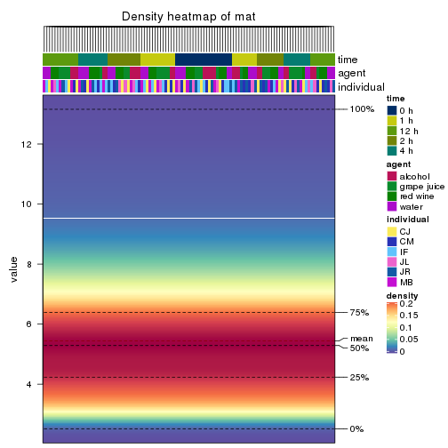


### Suggest the best k


Folowing table shows the best `k` (number of partitions) for each combination
of top-value methods and partition methods. Clicking on the method name in
the table goes to the section for a single combination of methods.

[The cola vignette](http://bioconductor.org/packages/devel/bioc/vignettes/cola/inst/doc/cola.html#toc_13)
explains the definition of the metrics used for determining the best
number of partitions.


```r
suggest_best_k(res_list)
```


|                            | The best k| 1-PAC| Mean silhouette| Concordance|   |Optional k |
|:---------------------------|----------:|-----:|---------------:|-----------:|:--|:----------|
|[CV:kmeans](#CV-kmeans)     |          2| 1.000|           0.958|       0.983|** |           |
|[ATC:skmeans](#ATC-skmeans) |          2| 1.000|           0.988|       0.995|** |           |
|[ATC:mclust](#ATC-mclust)   |          2| 1.000|           0.958|       0.983|** |           |
|[ATC:kmeans](#ATC-kmeans)   |          3| 0.999|           0.975|       0.989|** |2          |
|[SD:kmeans](#SD-kmeans)     |          2| 0.961|           0.939|       0.976|** |           |
|[MAD:kmeans](#MAD-kmeans)   |          2| 0.961|           0.920|       0.971|** |           |
|[MAD:pam](#MAD-pam)         |          6| 0.945|           0.877|       0.952|*  |4          |
|[SD:pam](#SD-pam)           |          6| 0.942|           0.868|       0.949|*  |4          |
|[CV:skmeans](#CV-skmeans)   |          3| 0.938|           0.932|       0.971|*  |2          |
|[ATC:pam](#ATC-pam)         |          4| 0.926|           0.903|       0.936|*  |2,3        |
|[SD:skmeans](#SD-skmeans)   |          5| 0.924|           0.869|       0.945|*  |2,3        |
|[ATC:NMF](#ATC-NMF)         |          2| 0.924|           0.915|       0.966|*  |           |
|[MAD:skmeans](#MAD-skmeans) |          6| 0.913|           0.874|       0.933|*  |2,3,5      |
|[CV:pam](#CV-pam)           |          6| 0.908|           0.854|       0.940|*  |           |
|[MAD:NMF](#MAD-NMF)         |          2| 0.868|           0.886|       0.956|   |           |
|[SD:NMF](#SD-NMF)           |          2| 0.817|           0.882|       0.952|   |           |
|[CV:mclust](#CV-mclust)     |          5| 0.785|           0.744|       0.888|   |           |
|[SD:mclust](#SD-mclust)     |          5| 0.783|           0.806|       0.873|   |           |
|[MAD:mclust](#MAD-mclust)   |          5| 0.781|           0.807|       0.898|   |           |
|[CV:NMF](#CV-NMF)           |          2| 0.715|           0.859|       0.938|   |           |
|[ATC:hclust](#ATC-hclust)   |          2| 0.586|           0.686|       0.877|   |           |
|[SD:hclust](#SD-hclust)     |          2| 0.548|           0.870|       0.923|   |           |
|[CV:hclust](#CV-hclust)     |          2| 0.503|           0.745|       0.887|   |           |
|[MAD:hclust](#MAD-hclust)   |          2| 0.463|           0.831|       0.906|   |           |

\*\*: 1-PAC > 0.95, \*: 1-PAC > 0.9


### CDF of consensus matrices

Cumulative distribution function curves of consensus matrix for all methods.


```r
collect_plots(res_list, fun = plot_ecdf)
```

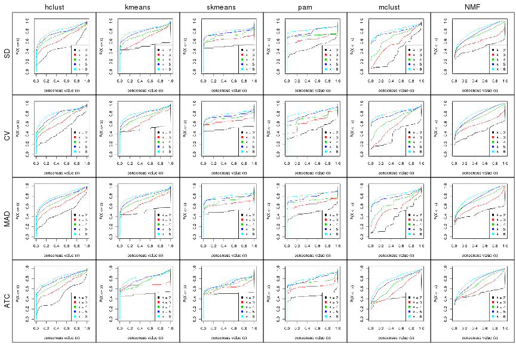


### Consensus heatmap

Consensus heatmaps for all methods. ([What is a consensus heatmap?](http://bioconductor.org/packages/devel/bioc/vignettes/cola/inst/doc/cola.html#toc_9))


<style type='text/css'>


.ui-helper-hidden {
	display: none;
}
.ui-helper-hidden-accessible {
	border: 0;
	clip: rect(0 0 0 0);
	height: 1px;
	margin: -1px;
	overflow: hidden;
	padding: 0;
	position: absolute;
	width: 1px;
}
.ui-helper-reset {
	margin: 0;
	padding: 0;
	border: 0;
	outline: 0;
	line-height: 1.3;
	text-decoration: none;
	font-size: 100%;
	list-style: none;
}
.ui-helper-clearfix:before,
.ui-helper-clearfix:after {
	content: "";
	display: table;
	border-collapse: collapse;
}
.ui-helper-clearfix:after {
	clear: both;
}
.ui-helper-zfix {
	width: 100%;
	height: 100%;
	top: 0;
	left: 0;
	position: absolute;
	opacity: 0;
	filter:Alpha(Opacity=0); 
}

.ui-front {
	z-index: 100;
}


.ui-state-disabled {
	cursor: default !important;
	pointer-events: none;
}


.ui-icon {
	display: inline-block;
	vertical-align: middle;
	margin-top: -.25em;
	position: relative;
	text-indent: -99999px;
	overflow: hidden;
	background-repeat: no-repeat;
}

.ui-widget-icon-block {
	left: 50%;
	margin-left: -8px;
	display: block;
}


.ui-widget-overlay {
	position: fixed;
	top: 0;
	left: 0;
	width: 100%;
	height: 100%;
}
.ui-accordion .ui-accordion-header {
	display: block;
	cursor: pointer;
	position: relative;
	margin: 2px 0 0 0;
	padding: .5em .5em .5em .7em;
	font-size: 100%;
}
.ui-accordion .ui-accordion-content {
	padding: 1em 2.2em;
	border-top: 0;
	overflow: auto;
}
.ui-autocomplete {
	position: absolute;
	top: 0;
	left: 0;
	cursor: default;
}
.ui-menu {
	list-style: none;
	padding: 0;
	margin: 0;
	display: block;
	outline: 0;
}
.ui-menu .ui-menu {
	position: absolute;
}
.ui-menu .ui-menu-item {
	margin: 0;
	cursor: pointer;
	
	list-style-image: url("data:image/gif;base64,R0lGODlhAQABAIAAAAAAAP///yH5BAEAAAAALAAAAAABAAEAAAIBRAA7");
}
.ui-menu .ui-menu-item-wrapper {
	position: relative;
	padding: 3px 1em 3px .4em;
}
.ui-menu .ui-menu-divider {
	margin: 5px 0;
	height: 0;
	font-size: 0;
	line-height: 0;
	border-width: 1px 0 0 0;
}
.ui-menu .ui-state-focus,
.ui-menu .ui-state-active {
	margin: -1px;
}


.ui-menu-icons {
	position: relative;
}
.ui-menu-icons .ui-menu-item-wrapper {
	padding-left: 2em;
}


.ui-menu .ui-icon {
	position: absolute;
	top: 0;
	bottom: 0;
	left: .2em;
	margin: auto 0;
}


.ui-menu .ui-menu-icon {
	left: auto;
	right: 0;
}
.ui-button {
	padding: .4em 1em;
	display: inline-block;
	position: relative;
	line-height: normal;
	margin-right: .1em;
	cursor: pointer;
	vertical-align: middle;
	text-align: center;
	-webkit-user-select: none;
	-moz-user-select: none;
	-ms-user-select: none;
	user-select: none;

	
	overflow: visible;
}

.ui-button,
.ui-button:link,
.ui-button:visited,
.ui-button:hover,
.ui-button:active {
	text-decoration: none;
}


.ui-button-icon-only {
	width: 2em;
	box-sizing: border-box;
	text-indent: -9999px;
	white-space: nowrap;
}


input.ui-button.ui-button-icon-only {
	text-indent: 0;
}


.ui-button-icon-only .ui-icon {
	position: absolute;
	top: 50%;
	left: 50%;
	margin-top: -8px;
	margin-left: -8px;
}

.ui-button.ui-icon-notext .ui-icon {
	padding: 0;
	width: 2.1em;
	height: 2.1em;
	text-indent: -9999px;
	white-space: nowrap;

}

input.ui-button.ui-icon-notext .ui-icon {
	width: auto;
	height: auto;
	text-indent: 0;
	white-space: normal;
	padding: .4em 1em;
}


input.ui-button::-moz-focus-inner,
button.ui-button::-moz-focus-inner {
	border: 0;
	padding: 0;
}
.ui-controlgroup {
	vertical-align: middle;
	display: inline-block;
}
.ui-controlgroup > .ui-controlgroup-item {
	float: left;
	margin-left: 0;
	margin-right: 0;
}
.ui-controlgroup > .ui-controlgroup-item:focus,
.ui-controlgroup > .ui-controlgroup-item.ui-visual-focus {
	z-index: 9999;
}
.ui-controlgroup-vertical > .ui-controlgroup-item {
	display: block;
	float: none;
	width: 100%;
	margin-top: 0;
	margin-bottom: 0;
	text-align: left;
}
.ui-controlgroup-vertical .ui-controlgroup-item {
	box-sizing: border-box;
}
.ui-controlgroup .ui-controlgroup-label {
	padding: .4em 1em;
}
.ui-controlgroup .ui-controlgroup-label span {
	font-size: 80%;
}
.ui-controlgroup-horizontal .ui-controlgroup-label + .ui-controlgroup-item {
	border-left: none;
}
.ui-controlgroup-vertical .ui-controlgroup-label + .ui-controlgroup-item {
	border-top: none;
}
.ui-controlgroup-horizontal .ui-controlgroup-label.ui-widget-content {
	border-right: none;
}
.ui-controlgroup-vertical .ui-controlgroup-label.ui-widget-content {
	border-bottom: none;
}


.ui-controlgroup-vertical .ui-spinner-input {

	
	width: 75%;
	width: calc( 100% - 2.4em );
}
.ui-controlgroup-vertical .ui-spinner .ui-spinner-up {
	border-top-style: solid;
}

.ui-checkboxradio-label .ui-icon-background {
	box-shadow: inset 1px 1px 1px #ccc;
	border-radius: .12em;
	border: none;
}
.ui-checkboxradio-radio-label .ui-icon-background {
	width: 16px;
	height: 16px;
	border-radius: 1em;
	overflow: visible;
	border: none;
}
.ui-checkboxradio-radio-label.ui-checkboxradio-checked .ui-icon,
.ui-checkboxradio-radio-label.ui-checkboxradio-checked:hover .ui-icon {
	background-image: none;
	width: 8px;
	height: 8px;
	border-width: 4px;
	border-style: solid;
}
.ui-checkboxradio-disabled {
	pointer-events: none;
}
.ui-datepicker {
	width: 17em;
	padding: .2em .2em 0;
	display: none;
}
.ui-datepicker .ui-datepicker-header {
	position: relative;
	padding: .2em 0;
}
.ui-datepicker .ui-datepicker-prev,
.ui-datepicker .ui-datepicker-next {
	position: absolute;
	top: 2px;
	width: 1.8em;
	height: 1.8em;
}
.ui-datepicker .ui-datepicker-prev-hover,
.ui-datepicker .ui-datepicker-next-hover {
	top: 1px;
}
.ui-datepicker .ui-datepicker-prev {
	left: 2px;
}
.ui-datepicker .ui-datepicker-next {
	right: 2px;
}
.ui-datepicker .ui-datepicker-prev-hover {
	left: 1px;
}
.ui-datepicker .ui-datepicker-next-hover {
	right: 1px;
}
.ui-datepicker .ui-datepicker-prev span,
.ui-datepicker .ui-datepicker-next span {
	display: block;
	position: absolute;
	left: 50%;
	margin-left: -8px;
	top: 50%;
	margin-top: -8px;
}
.ui-datepicker .ui-datepicker-title {
	margin: 0 2.3em;
	line-height: 1.8em;
	text-align: center;
}
.ui-datepicker .ui-datepicker-title select {
	font-size: 1em;
	margin: 1px 0;
}
.ui-datepicker select.ui-datepicker-month,
.ui-datepicker select.ui-datepicker-year {
	width: 45%;
}
.ui-datepicker table {
	width: 100%;
	font-size: .9em;
	border-collapse: collapse;
	margin: 0 0 .4em;
}
.ui-datepicker th {
	padding: .7em .3em;
	text-align: center;
	font-weight: bold;
	border: 0;
}
.ui-datepicker td {
	border: 0;
	padding: 1px;
}
.ui-datepicker td span,
.ui-datepicker td a {
	display: block;
	padding: .2em;
	text-align: right;
	text-decoration: none;
}
.ui-datepicker .ui-datepicker-buttonpane {
	background-image: none;
	margin: .7em 0 0 0;
	padding: 0 .2em;
	border-left: 0;
	border-right: 0;
	border-bottom: 0;
}
.ui-datepicker .ui-datepicker-buttonpane button {
	float: right;
	margin: .5em .2em .4em;
	cursor: pointer;
	padding: .2em .6em .3em .6em;
	width: auto;
	overflow: visible;
}
.ui-datepicker .ui-datepicker-buttonpane button.ui-datepicker-current {
	float: left;
}


.ui-datepicker.ui-datepicker-multi {
	width: auto;
}
.ui-datepicker-multi .ui-datepicker-group {
	float: left;
}
.ui-datepicker-multi .ui-datepicker-group table {
	width: 95%;
	margin: 0 auto .4em;
}
.ui-datepicker-multi-2 .ui-datepicker-group {
	width: 50%;
}
.ui-datepicker-multi-3 .ui-datepicker-group {
	width: 33.3%;
}
.ui-datepicker-multi-4 .ui-datepicker-group {
	width: 25%;
}
.ui-datepicker-multi .ui-datepicker-group-last .ui-datepicker-header,
.ui-datepicker-multi .ui-datepicker-group-middle .ui-datepicker-header {
	border-left-width: 0;
}
.ui-datepicker-multi .ui-datepicker-buttonpane {
	clear: left;
}
.ui-datepicker-row-break {
	clear: both;
	width: 100%;
	font-size: 0;
}


.ui-datepicker-rtl {
	direction: rtl;
}
.ui-datepicker-rtl .ui-datepicker-prev {
	right: 2px;
	left: auto;
}
.ui-datepicker-rtl .ui-datepicker-next {
	left: 2px;
	right: auto;
}
.ui-datepicker-rtl .ui-datepicker-prev:hover {
	right: 1px;
	left: auto;
}
.ui-datepicker-rtl .ui-datepicker-next:hover {
	left: 1px;
	right: auto;
}
.ui-datepicker-rtl .ui-datepicker-buttonpane {
	clear: right;
}
.ui-datepicker-rtl .ui-datepicker-buttonpane button {
	float: left;
}
.ui-datepicker-rtl .ui-datepicker-buttonpane button.ui-datepicker-current,
.ui-datepicker-rtl .ui-datepicker-group {
	float: right;
}
.ui-datepicker-rtl .ui-datepicker-group-last .ui-datepicker-header,
.ui-datepicker-rtl .ui-datepicker-group-middle .ui-datepicker-header {
	border-right-width: 0;
	border-left-width: 1px;
}


.ui-datepicker .ui-icon {
	display: block;
	text-indent: -99999px;
	overflow: hidden;
	background-repeat: no-repeat;
	left: .5em;
	top: .3em;
}
.ui-dialog {
	position: absolute;
	top: 0;
	left: 0;
	padding: .2em;
	outline: 0;
}
.ui-dialog .ui-dialog-titlebar {
	padding: .4em 1em;
	position: relative;
}
.ui-dialog .ui-dialog-title {
	float: left;
	margin: .1em 0;
	white-space: nowrap;
	width: 90%;
	overflow: hidden;
	text-overflow: ellipsis;
}
.ui-dialog .ui-dialog-titlebar-close {
	position: absolute;
	right: .3em;
	top: 50%;
	width: 20px;
	margin: -10px 0 0 0;
	padding: 1px;
	height: 20px;
}
.ui-dialog .ui-dialog-content {
	position: relative;
	border: 0;
	padding: .5em 1em;
	background: none;
	overflow: auto;
}
.ui-dialog .ui-dialog-buttonpane {
	text-align: left;
	border-width: 1px 0 0 0;
	background-image: none;
	margin-top: .5em;
	padding: .3em 1em .5em .4em;
}
.ui-dialog .ui-dialog-buttonpane .ui-dialog-buttonset {
	float: right;
}
.ui-dialog .ui-dialog-buttonpane button {
	margin: .5em .4em .5em 0;
	cursor: pointer;
}
.ui-dialog .ui-resizable-n {
	height: 2px;
	top: 0;
}
.ui-dialog .ui-resizable-e {
	width: 2px;
	right: 0;
}
.ui-dialog .ui-resizable-s {
	height: 2px;
	bottom: 0;
}
.ui-dialog .ui-resizable-w {
	width: 2px;
	left: 0;
}
.ui-dialog .ui-resizable-se,
.ui-dialog .ui-resizable-sw,
.ui-dialog .ui-resizable-ne,
.ui-dialog .ui-resizable-nw {
	width: 7px;
	height: 7px;
}
.ui-dialog .ui-resizable-se {
	right: 0;
	bottom: 0;
}
.ui-dialog .ui-resizable-sw {
	left: 0;
	bottom: 0;
}
.ui-dialog .ui-resizable-ne {
	right: 0;
	top: 0;
}
.ui-dialog .ui-resizable-nw {
	left: 0;
	top: 0;
}
.ui-draggable .ui-dialog-titlebar {
	cursor: move;
}
.ui-draggable-handle {
	-ms-touch-action: none;
	touch-action: none;
}
.ui-resizable {
	position: relative;
}
.ui-resizable-handle {
	position: absolute;
	font-size: 0.1px;
	display: block;
	-ms-touch-action: none;
	touch-action: none;
}
.ui-resizable-disabled .ui-resizable-handle,
.ui-resizable-autohide .ui-resizable-handle {
	display: none;
}
.ui-resizable-n {
	cursor: n-resize;
	height: 7px;
	width: 100%;
	top: -5px;
	left: 0;
}
.ui-resizable-s {
	cursor: s-resize;
	height: 7px;
	width: 100%;
	bottom: -5px;
	left: 0;
}
.ui-resizable-e {
	cursor: e-resize;
	width: 7px;
	right: -5px;
	top: 0;
	height: 100%;
}
.ui-resizable-w {
	cursor: w-resize;
	width: 7px;
	left: -5px;
	top: 0;
	height: 100%;
}
.ui-resizable-se {
	cursor: se-resize;
	width: 12px;
	height: 12px;
	right: 1px;
	bottom: 1px;
}
.ui-resizable-sw {
	cursor: sw-resize;
	width: 9px;
	height: 9px;
	left: -5px;
	bottom: -5px;
}
.ui-resizable-nw {
	cursor: nw-resize;
	width: 9px;
	height: 9px;
	left: -5px;
	top: -5px;
}
.ui-resizable-ne {
	cursor: ne-resize;
	width: 9px;
	height: 9px;
	right: -5px;
	top: -5px;
}
.ui-progressbar {
	height: 2em;
	text-align: left;
	overflow: hidden;
}
.ui-progressbar .ui-progressbar-value {
	margin: -1px;
	height: 100%;
}
.ui-progressbar .ui-progressbar-overlay {
	background: url("");
	height: 100%;
	filter: alpha(opacity=25); 
	opacity: 0.25;
}
.ui-progressbar-indeterminate .ui-progressbar-value {
	background-image: none;
}
.ui-selectable {
	-ms-touch-action: none;
	touch-action: none;
}
.ui-selectable-helper {
	position: absolute;
	z-index: 100;
	border: 1px dotted black;
}
.ui-selectmenu-menu {
	padding: 0;
	margin: 0;
	position: absolute;
	top: 0;
	left: 0;
	display: none;
}
.ui-selectmenu-menu .ui-menu {
	overflow: auto;
	overflow-x: hidden;
	padding-bottom: 1px;
}
.ui-selectmenu-menu .ui-menu .ui-selectmenu-optgroup {
	font-size: 1em;
	font-weight: bold;
	line-height: 1.5;
	padding: 2px 0.4em;
	margin: 0.5em 0 0 0;
	height: auto;
	border: 0;
}
.ui-selectmenu-open {
	display: block;
}
.ui-selectmenu-text {
	display: block;
	margin-right: 20px;
	overflow: hidden;
	text-overflow: ellipsis;
}
.ui-selectmenu-button.ui-button {
	text-align: left;
	white-space: nowrap;
	width: 14em;
}
.ui-selectmenu-icon.ui-icon {
	float: right;
	margin-top: 0;
}
.ui-slider {
	position: relative;
	text-align: left;
}
.ui-slider .ui-slider-handle {
	position: absolute;
	z-index: 2;
	width: 1.2em;
	height: 1.2em;
	cursor: default;
	-ms-touch-action: none;
	touch-action: none;
}
.ui-slider .ui-slider-range {
	position: absolute;
	z-index: 1;
	font-size: .7em;
	display: block;
	border: 0;
	background-position: 0 0;
}


.ui-slider.ui-state-disabled .ui-slider-handle,
.ui-slider.ui-state-disabled .ui-slider-range {
	filter: inherit;
}

.ui-slider-horizontal {
	height: .8em;
}
.ui-slider-horizontal .ui-slider-handle {
	top: -.3em;
	margin-left: -.6em;
}
.ui-slider-horizontal .ui-slider-range {
	top: 0;
	height: 100%;
}
.ui-slider-horizontal .ui-slider-range-min {
	left: 0;
}
.ui-slider-horizontal .ui-slider-range-max {
	right: 0;
}

.ui-slider-vertical {
	width: .8em;
	height: 100px;
}
.ui-slider-vertical .ui-slider-handle {
	left: -.3em;
	margin-left: 0;
	margin-bottom: -.6em;
}
.ui-slider-vertical .ui-slider-range {
	left: 0;
	width: 100%;
}
.ui-slider-vertical .ui-slider-range-min {
	bottom: 0;
}
.ui-slider-vertical .ui-slider-range-max {
	top: 0;
}
.ui-sortable-handle {
	-ms-touch-action: none;
	touch-action: none;
}
.ui-spinner {
	position: relative;
	display: inline-block;
	overflow: hidden;
	padding: 0;
	vertical-align: middle;
}
.ui-spinner-input {
	border: none;
	background: none;
	color: inherit;
	padding: .222em 0;
	margin: .2em 0;
	vertical-align: middle;
	margin-left: .4em;
	margin-right: 2em;
}
.ui-spinner-button {
	width: 1.6em;
	height: 50%;
	font-size: .5em;
	padding: 0;
	margin: 0;
	text-align: center;
	position: absolute;
	cursor: default;
	display: block;
	overflow: hidden;
	right: 0;
}

.ui-spinner a.ui-spinner-button {
	border-top-style: none;
	border-bottom-style: none;
	border-right-style: none;
}
.ui-spinner-up {
	top: 0;
}
.ui-spinner-down {
	bottom: 0;
}
.ui-tabs {
	position: relative;
	padding: .2em;
}
.ui-tabs .ui-tabs-nav {
	margin: 0;
	padding: .2em .2em 0;
}
.ui-tabs .ui-tabs-nav li {
	list-style: none;
	float: left;
	position: relative;
	top: 0;
	margin: 1px .2em 0 0;
	border-bottom-width: 0;
	padding: 0;
	white-space: nowrap;
}
.ui-tabs .ui-tabs-nav .ui-tabs-anchor {
	float: left;
	padding: .5em 1em;
	text-decoration: none;
}
.ui-tabs .ui-tabs-nav li.ui-tabs-active {
	margin-bottom: -1px;
	padding-bottom: 1px;
}
.ui-tabs .ui-tabs-nav li.ui-tabs-active .ui-tabs-anchor,
.ui-tabs .ui-tabs-nav li.ui-state-disabled .ui-tabs-anchor,
.ui-tabs .ui-tabs-nav li.ui-tabs-loading .ui-tabs-anchor {
	cursor: text;
}
.ui-tabs-collapsible .ui-tabs-nav li.ui-tabs-active .ui-tabs-anchor {
	cursor: pointer;
}
.ui-tabs .ui-tabs-panel {
	display: block;
	border-width: 0;
	padding: 1em 1.4em;
	background: none;
}
.ui-tooltip {
	padding: 8px;
	position: absolute;
	z-index: 9999;
	max-width: 300px;
}
body .ui-tooltip {
	border-width: 2px;
}

.ui-widget {
	font-family: Arial,Helvetica,sans-serif;
	font-size: 1em;
}
.ui-widget .ui-widget {
	font-size: 1em;
}
.ui-widget input,
.ui-widget select,
.ui-widget textarea,
.ui-widget button {
	font-family: Arial,Helvetica,sans-serif;
	font-size: 1em;
}
.ui-widget.ui-widget-content {
	border: 1px solid #c5c5c5;
}
.ui-widget-content {
	border: 1px solid #dddddd;
	background: #ffffff;
	color: #333333;
}
.ui-widget-content a {
	color: #333333;
}
.ui-widget-header {
	border: 1px solid #dddddd;
	background: #e9e9e9;
	color: #333333;
	font-weight: bold;
}
.ui-widget-header a {
	color: #333333;
}


.ui-state-default,
.ui-widget-content .ui-state-default,
.ui-widget-header .ui-state-default,
.ui-button,


html .ui-button.ui-state-disabled:hover,
html .ui-button.ui-state-disabled:active {
	border: 1px solid #c5c5c5;
	background: #f6f6f6;
	font-weight: normal;
	color: #454545;
}
.ui-state-default a,
.ui-state-default a:link,
.ui-state-default a:visited,
a.ui-button,
a:link.ui-button,
a:visited.ui-button,
.ui-button {
	color: #454545;
	text-decoration: none;
}
.ui-state-hover,
.ui-widget-content .ui-state-hover,
.ui-widget-header .ui-state-hover,
.ui-state-focus,
.ui-widget-content .ui-state-focus,
.ui-widget-header .ui-state-focus,
.ui-button:hover,
.ui-button:focus {
	border: 1px solid #cccccc;
	background: #ededed;
	font-weight: normal;
	color: #2b2b2b;
}
.ui-state-hover a,
.ui-state-hover a:hover,
.ui-state-hover a:link,
.ui-state-hover a:visited,
.ui-state-focus a,
.ui-state-focus a:hover,
.ui-state-focus a:link,
.ui-state-focus a:visited,
a.ui-button:hover,
a.ui-button:focus {
	color: #2b2b2b;
	text-decoration: none;
}

.ui-visual-focus {
	box-shadow: 0 0 3px 1px rgb(94, 158, 214);
}
.ui-state-active,
.ui-widget-content .ui-state-active,
.ui-widget-header .ui-state-active,
a.ui-button:active,
.ui-button:active,
.ui-button.ui-state-active:hover {
	border: 1px solid #003eff;
	background: #007fff;
	font-weight: normal;
	color: #ffffff;
}
.ui-icon-background,
.ui-state-active .ui-icon-background {
	border: #003eff;
	background-color: #ffffff;
}
.ui-state-active a,
.ui-state-active a:link,
.ui-state-active a:visited {
	color: #ffffff;
	text-decoration: none;
}


.ui-state-highlight,
.ui-widget-content .ui-state-highlight,
.ui-widget-header .ui-state-highlight {
	border: 1px solid #dad55e;
	background: #fffa90;
	color: #777620;
}
.ui-state-checked {
	border: 1px solid #dad55e;
	background: #fffa90;
}
.ui-state-highlight a,
.ui-widget-content .ui-state-highlight a,
.ui-widget-header .ui-state-highlight a {
	color: #777620;
}
.ui-state-error,
.ui-widget-content .ui-state-error,
.ui-widget-header .ui-state-error {
	border: 1px solid #f1a899;
	background: #fddfdf;
	color: #5f3f3f;
}
.ui-state-error a,
.ui-widget-content .ui-state-error a,
.ui-widget-header .ui-state-error a {
	color: #5f3f3f;
}
.ui-state-error-text,
.ui-widget-content .ui-state-error-text,
.ui-widget-header .ui-state-error-text {
	color: #5f3f3f;
}
.ui-priority-primary,
.ui-widget-content .ui-priority-primary,
.ui-widget-header .ui-priority-primary {
	font-weight: bold;
}
.ui-priority-secondary,
.ui-widget-content .ui-priority-secondary,
.ui-widget-header .ui-priority-secondary {
	opacity: .7;
	filter:Alpha(Opacity=70); 
	font-weight: normal;
}
.ui-state-disabled,
.ui-widget-content .ui-state-disabled,
.ui-widget-header .ui-state-disabled {
	opacity: .35;
	filter:Alpha(Opacity=35); 
	background-image: none;
}
.ui-state-disabled .ui-icon {
	filter:Alpha(Opacity=35); 
}


.ui-icon {
	width: 16px;
	height: 16px;
}
.ui-icon,
.ui-widget-content .ui-icon {
	background-image: url("images/ui-icons_444444_256x240.png");
}
.ui-widget-header .ui-icon {
	background-image: url("images/ui-icons_444444_256x240.png");
}
.ui-state-hover .ui-icon,
.ui-state-focus .ui-icon,
.ui-button:hover .ui-icon,
.ui-button:focus .ui-icon {
	background-image: url("images/ui-icons_555555_256x240.png");
}
.ui-state-active .ui-icon,
.ui-button:active .ui-icon {
	background-image: url("images/ui-icons_ffffff_256x240.png");
}
.ui-state-highlight .ui-icon,
.ui-button .ui-state-highlight.ui-icon {
	background-image: url("images/ui-icons_777620_256x240.png");
}
.ui-state-error .ui-icon,
.ui-state-error-text .ui-icon {
	background-image: url("images/ui-icons_cc0000_256x240.png");
}
.ui-button .ui-icon {
	background-image: url("images/ui-icons_777777_256x240.png");
}


.ui-icon-blank { background-position: 16px 16px; }
.ui-icon-caret-1-n { background-position: 0 0; }
.ui-icon-caret-1-ne { background-position: -16px 0; }
.ui-icon-caret-1-e { background-position: -32px 0; }
.ui-icon-caret-1-se { background-position: -48px 0; }
.ui-icon-caret-1-s { background-position: -65px 0; }
.ui-icon-caret-1-sw { background-position: -80px 0; }
.ui-icon-caret-1-w { background-position: -96px 0; }
.ui-icon-caret-1-nw { background-position: -112px 0; }
.ui-icon-caret-2-n-s { background-position: -128px 0; }
.ui-icon-caret-2-e-w { background-position: -144px 0; }
.ui-icon-triangle-1-n { background-position: 0 -16px; }
.ui-icon-triangle-1-ne { background-position: -16px -16px; }
.ui-icon-triangle-1-e { background-position: -32px -16px; }
.ui-icon-triangle-1-se { background-position: -48px -16px; }
.ui-icon-triangle-1-s { background-position: -65px -16px; }
.ui-icon-triangle-1-sw { background-position: -80px -16px; }
.ui-icon-triangle-1-w { background-position: -96px -16px; }
.ui-icon-triangle-1-nw { background-position: -112px -16px; }
.ui-icon-triangle-2-n-s { background-position: -128px -16px; }
.ui-icon-triangle-2-e-w { background-position: -144px -16px; }
.ui-icon-arrow-1-n { background-position: 0 -32px; }
.ui-icon-arrow-1-ne { background-position: -16px -32px; }
.ui-icon-arrow-1-e { background-position: -32px -32px; }
.ui-icon-arrow-1-se { background-position: -48px -32px; }
.ui-icon-arrow-1-s { background-position: -65px -32px; }
.ui-icon-arrow-1-sw { background-position: -80px -32px; }
.ui-icon-arrow-1-w { background-position: -96px -32px; }
.ui-icon-arrow-1-nw { background-position: -112px -32px; }
.ui-icon-arrow-2-n-s { background-position: -128px -32px; }
.ui-icon-arrow-2-ne-sw { background-position: -144px -32px; }
.ui-icon-arrow-2-e-w { background-position: -160px -32px; }
.ui-icon-arrow-2-se-nw { background-position: -176px -32px; }
.ui-icon-arrowstop-1-n { background-position: -192px -32px; }
.ui-icon-arrowstop-1-e { background-position: -208px -32px; }
.ui-icon-arrowstop-1-s { background-position: -224px -32px; }
.ui-icon-arrowstop-1-w { background-position: -240px -32px; }
.ui-icon-arrowthick-1-n { background-position: 1px -48px; }
.ui-icon-arrowthick-1-ne { background-position: -16px -48px; }
.ui-icon-arrowthick-1-e { background-position: -32px -48px; }
.ui-icon-arrowthick-1-se { background-position: -48px -48px; }
.ui-icon-arrowthick-1-s { background-position: -64px -48px; }
.ui-icon-arrowthick-1-sw { background-position: -80px -48px; }
.ui-icon-arrowthick-1-w { background-position: -96px -48px; }
.ui-icon-arrowthick-1-nw { background-position: -112px -48px; }
.ui-icon-arrowthick-2-n-s { background-position: -128px -48px; }
.ui-icon-arrowthick-2-ne-sw { background-position: -144px -48px; }
.ui-icon-arrowthick-2-e-w { background-position: -160px -48px; }
.ui-icon-arrowthick-2-se-nw { background-position: -176px -48px; }
.ui-icon-arrowthickstop-1-n { background-position: -192px -48px; }
.ui-icon-arrowthickstop-1-e { background-position: -208px -48px; }
.ui-icon-arrowthickstop-1-s { background-position: -224px -48px; }
.ui-icon-arrowthickstop-1-w { background-position: -240px -48px; }
.ui-icon-arrowreturnthick-1-w { background-position: 0 -64px; }
.ui-icon-arrowreturnthick-1-n { background-position: -16px -64px; }
.ui-icon-arrowreturnthick-1-e { background-position: -32px -64px; }
.ui-icon-arrowreturnthick-1-s { background-position: -48px -64px; }
.ui-icon-arrowreturn-1-w { background-position: -64px -64px; }
.ui-icon-arrowreturn-1-n { background-position: -80px -64px; }
.ui-icon-arrowreturn-1-e { background-position: -96px -64px; }
.ui-icon-arrowreturn-1-s { background-position: -112px -64px; }
.ui-icon-arrowrefresh-1-w { background-position: -128px -64px; }
.ui-icon-arrowrefresh-1-n { background-position: -144px -64px; }
.ui-icon-arrowrefresh-1-e { background-position: -160px -64px; }
.ui-icon-arrowrefresh-1-s { background-position: -176px -64px; }
.ui-icon-arrow-4 { background-position: 0 -80px; }
.ui-icon-arrow-4-diag { background-position: -16px -80px; }
.ui-icon-extlink { background-position: -32px -80px; }
.ui-icon-newwin { background-position: -48px -80px; }
.ui-icon-refresh { background-position: -64px -80px; }
.ui-icon-shuffle { background-position: -80px -80px; }
.ui-icon-transfer-e-w { background-position: -96px -80px; }
.ui-icon-transferthick-e-w { background-position: -112px -80px; }
.ui-icon-folder-collapsed { background-position: 0 -96px; }
.ui-icon-folder-open { background-position: -16px -96px; }
.ui-icon-document { background-position: -32px -96px; }
.ui-icon-document-b { background-position: -48px -96px; }
.ui-icon-note { background-position: -64px -96px; }
.ui-icon-mail-closed { background-position: -80px -96px; }
.ui-icon-mail-open { background-position: -96px -96px; }
.ui-icon-suitcase { background-position: -112px -96px; }
.ui-icon-comment { background-position: -128px -96px; }
.ui-icon-person { background-position: -144px -96px; }
.ui-icon-print { background-position: -160px -96px; }
.ui-icon-trash { background-position: -176px -96px; }
.ui-icon-locked { background-position: -192px -96px; }
.ui-icon-unlocked { background-position: -208px -96px; }
.ui-icon-bookmark { background-position: -224px -96px; }
.ui-icon-tag { background-position: -240px -96px; }
.ui-icon-home { background-position: 0 -112px; }
.ui-icon-flag { background-position: -16px -112px; }
.ui-icon-calendar { background-position: -32px -112px; }
.ui-icon-cart { background-position: -48px -112px; }
.ui-icon-pencil { background-position: -64px -112px; }
.ui-icon-clock { background-position: -80px -112px; }
.ui-icon-disk { background-position: -96px -112px; }
.ui-icon-calculator { background-position: -112px -112px; }
.ui-icon-zoomin { background-position: -128px -112px; }
.ui-icon-zoomout { background-position: -144px -112px; }
.ui-icon-search { background-position: -160px -112px; }
.ui-icon-wrench { background-position: -176px -112px; }
.ui-icon-gear { background-position: -192px -112px; }
.ui-icon-heart { background-position: -208px -112px; }
.ui-icon-star { background-position: -224px -112px; }
.ui-icon-link { background-position: -240px -112px; }
.ui-icon-cancel { background-position: 0 -128px; }
.ui-icon-plus { background-position: -16px -128px; }
.ui-icon-plusthick { background-position: -32px -128px; }
.ui-icon-minus { background-position: -48px -128px; }
.ui-icon-minusthick { background-position: -64px -128px; }
.ui-icon-close { background-position: -80px -128px; }
.ui-icon-closethick { background-position: -96px -128px; }
.ui-icon-key { background-position: -112px -128px; }
.ui-icon-lightbulb { background-position: -128px -128px; }
.ui-icon-scissors { background-position: -144px -128px; }
.ui-icon-clipboard { background-position: -160px -128px; }
.ui-icon-copy { background-position: -176px -128px; }
.ui-icon-contact { background-position: -192px -128px; }
.ui-icon-image { background-position: -208px -128px; }
.ui-icon-video { background-position: -224px -128px; }
.ui-icon-script { background-position: -240px -128px; }
.ui-icon-alert { background-position: 0 -144px; }
.ui-icon-info { background-position: -16px -144px; }
.ui-icon-notice { background-position: -32px -144px; }
.ui-icon-help { background-position: -48px -144px; }
.ui-icon-check { background-position: -64px -144px; }
.ui-icon-bullet { background-position: -80px -144px; }
.ui-icon-radio-on { background-position: -96px -144px; }
.ui-icon-radio-off { background-position: -112px -144px; }
.ui-icon-pin-w { background-position: -128px -144px; }
.ui-icon-pin-s { background-position: -144px -144px; }
.ui-icon-play { background-position: 0 -160px; }
.ui-icon-pause { background-position: -16px -160px; }
.ui-icon-seek-next { background-position: -32px -160px; }
.ui-icon-seek-prev { background-position: -48px -160px; }
.ui-icon-seek-end { background-position: -64px -160px; }
.ui-icon-seek-start { background-position: -80px -160px; }

.ui-icon-seek-first { background-position: -80px -160px; }
.ui-icon-stop { background-position: -96px -160px; }
.ui-icon-eject { background-position: -112px -160px; }
.ui-icon-volume-off { background-position: -128px -160px; }
.ui-icon-volume-on { background-position: -144px -160px; }
.ui-icon-power { background-position: 0 -176px; }
.ui-icon-signal-diag { background-position: -16px -176px; }
.ui-icon-signal { background-position: -32px -176px; }
.ui-icon-battery-0 { background-position: -48px -176px; }
.ui-icon-battery-1 { background-position: -64px -176px; }
.ui-icon-battery-2 { background-position: -80px -176px; }
.ui-icon-battery-3 { background-position: -96px -176px; }
.ui-icon-circle-plus { background-position: 0 -192px; }
.ui-icon-circle-minus { background-position: -16px -192px; }
.ui-icon-circle-close { background-position: -32px -192px; }
.ui-icon-circle-triangle-e { background-position: -48px -192px; }
.ui-icon-circle-triangle-s { background-position: -64px -192px; }
.ui-icon-circle-triangle-w { background-position: -80px -192px; }
.ui-icon-circle-triangle-n { background-position: -96px -192px; }
.ui-icon-circle-arrow-e { background-position: -112px -192px; }
.ui-icon-circle-arrow-s { background-position: -128px -192px; }
.ui-icon-circle-arrow-w { background-position: -144px -192px; }
.ui-icon-circle-arrow-n { background-position: -160px -192px; }
.ui-icon-circle-zoomin { background-position: -176px -192px; }
.ui-icon-circle-zoomout { background-position: -192px -192px; }
.ui-icon-circle-check { background-position: -208px -192px; }
.ui-icon-circlesmall-plus { background-position: 0 -208px; }
.ui-icon-circlesmall-minus { background-position: -16px -208px; }
.ui-icon-circlesmall-close { background-position: -32px -208px; }
.ui-icon-squaresmall-plus { background-position: -48px -208px; }
.ui-icon-squaresmall-minus { background-position: -64px -208px; }
.ui-icon-squaresmall-close { background-position: -80px -208px; }
.ui-icon-grip-dotted-vertical { background-position: 0 -224px; }
.ui-icon-grip-dotted-horizontal { background-position: -16px -224px; }
.ui-icon-grip-solid-vertical { background-position: -32px -224px; }
.ui-icon-grip-solid-horizontal { background-position: -48px -224px; }
.ui-icon-gripsmall-diagonal-se { background-position: -64px -224px; }
.ui-icon-grip-diagonal-se { background-position: -80px -224px; }


.ui-corner-all,
.ui-corner-top,
.ui-corner-left,
.ui-corner-tl {
	border-top-left-radius: 3px;
}
.ui-corner-all,
.ui-corner-top,
.ui-corner-right,
.ui-corner-tr {
	border-top-right-radius: 3px;
}
.ui-corner-all,
.ui-corner-bottom,
.ui-corner-left,
.ui-corner-bl {
	border-bottom-left-radius: 3px;
}
.ui-corner-all,
.ui-corner-bottom,
.ui-corner-right,
.ui-corner-br {
	border-bottom-right-radius: 3px;
}


.ui-widget-overlay {
	background: #aaaaaa;
	opacity: .3;
	filter: Alpha(Opacity=30); 
}
.ui-widget-shadow {
	-webkit-box-shadow: 0px 0px 5px #666666;
	box-shadow: 0px 0px 5px #666666;
} 
</style>
<script src='js/jquery-1.12.4.js'></script>
<script src='js/jquery-ui.js'></script>

<script>
$( function() {
	$( '#tabs-collect-consensus-heatmap' ).tabs();
} );
</script>
<div id='tabs-collect-consensus-heatmap'>
<ul>
<li><a href='#tab-collect-consensus-heatmap-1'>k = 2</a></li>
<li><a href='#tab-collect-consensus-heatmap-2'>k = 3</a></li>
<li><a href='#tab-collect-consensus-heatmap-3'>k = 4</a></li>
<li><a href='#tab-collect-consensus-heatmap-4'>k = 5</a></li>
<li><a href='#tab-collect-consensus-heatmap-5'>k = 6</a></li>
</ul>
<div id='tab-collect-consensus-heatmap-1'>
<pre><code class="r">collect_plots(res_list, k = 2, fun = consensus_heatmap, mc.cores = 4)
</code></pre>

<p>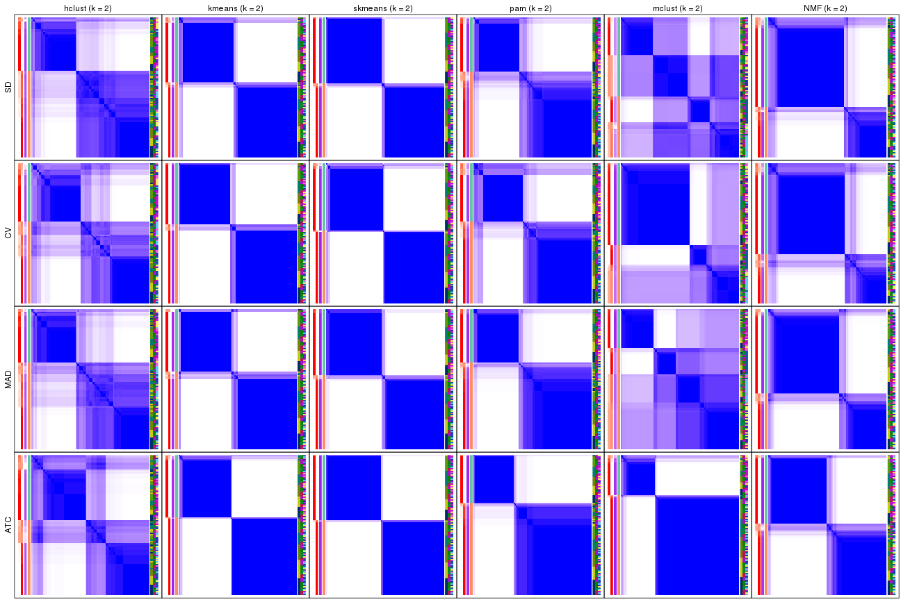</p>

</div>
<div id='tab-collect-consensus-heatmap-2'>
<pre><code class="r">collect_plots(res_list, k = 3, fun = consensus_heatmap, mc.cores = 4)
</code></pre>

<p>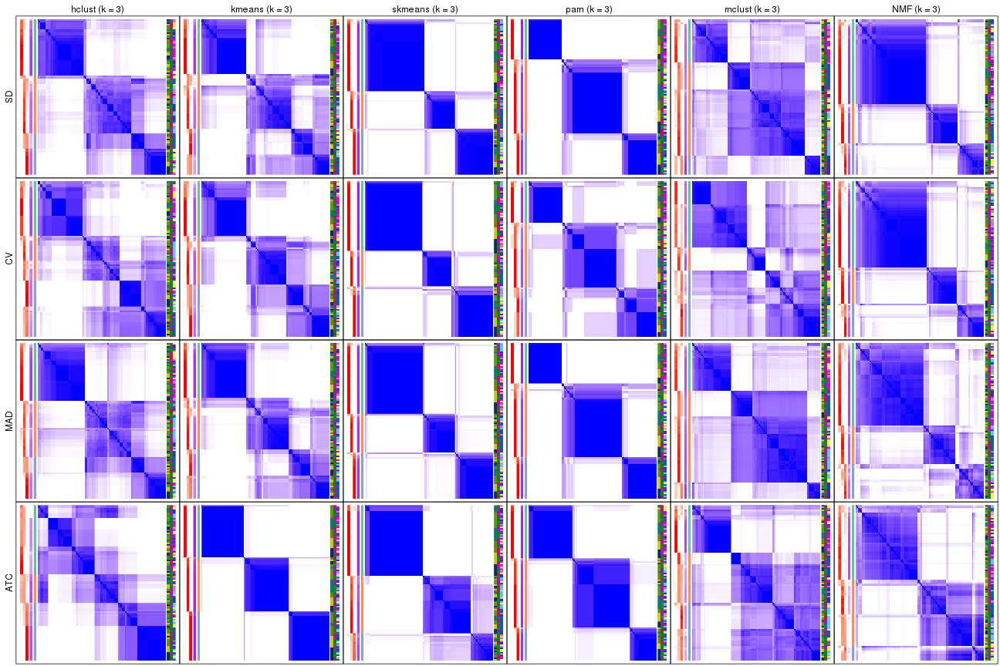</p>

</div>
<div id='tab-collect-consensus-heatmap-3'>
<pre><code class="r">collect_plots(res_list, k = 4, fun = consensus_heatmap, mc.cores = 4)
</code></pre>

<p>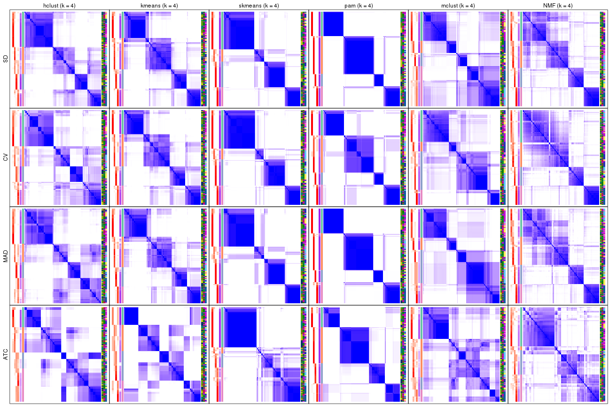</p>

</div>
<div id='tab-collect-consensus-heatmap-4'>
<pre><code class="r">collect_plots(res_list, k = 5, fun = consensus_heatmap, mc.cores = 4)
</code></pre>

<p>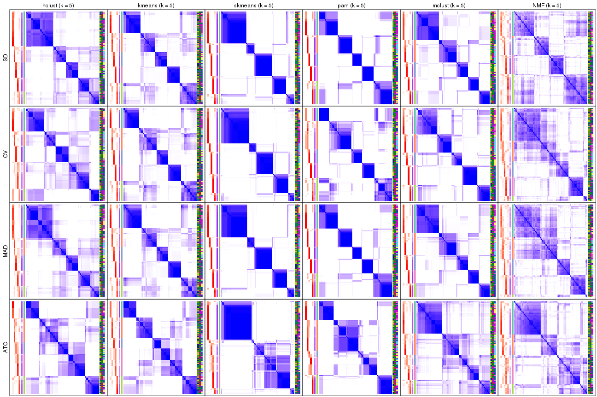</p>

</div>
<div id='tab-collect-consensus-heatmap-5'>
<pre><code class="r">collect_plots(res_list, k = 6, fun = consensus_heatmap, mc.cores = 4)
</code></pre>

<p>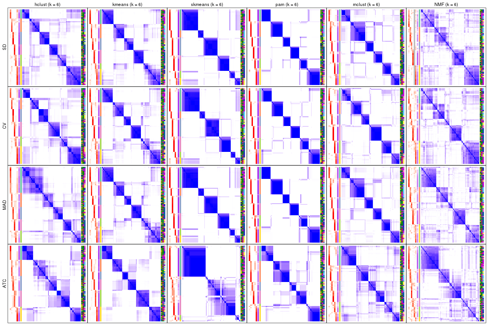</p>

</div>
</div>


### Membership heatmap

Membership heatmaps for all methods. ([What is a membership heatmap?](http://bioconductor.org/packages/devel/bioc/vignettes/cola/inst/doc/cola.html#toc_12))


<script>
$( function() {
	$( '#tabs-collect-membership-heatmap' ).tabs();
} );
</script>
<div id='tabs-collect-membership-heatmap'>
<ul>
<li><a href='#tab-collect-membership-heatmap-1'>k = 2</a></li>
<li><a href='#tab-collect-membership-heatmap-2'>k = 3</a></li>
<li><a href='#tab-collect-membership-heatmap-3'>k = 4</a></li>
<li><a href='#tab-collect-membership-heatmap-4'>k = 5</a></li>
<li><a href='#tab-collect-membership-heatmap-5'>k = 6</a></li>
</ul>
<div id='tab-collect-membership-heatmap-1'>
<pre><code class="r">collect_plots(res_list, k = 2, fun = membership_heatmap, mc.cores = 4)
</code></pre>

<p>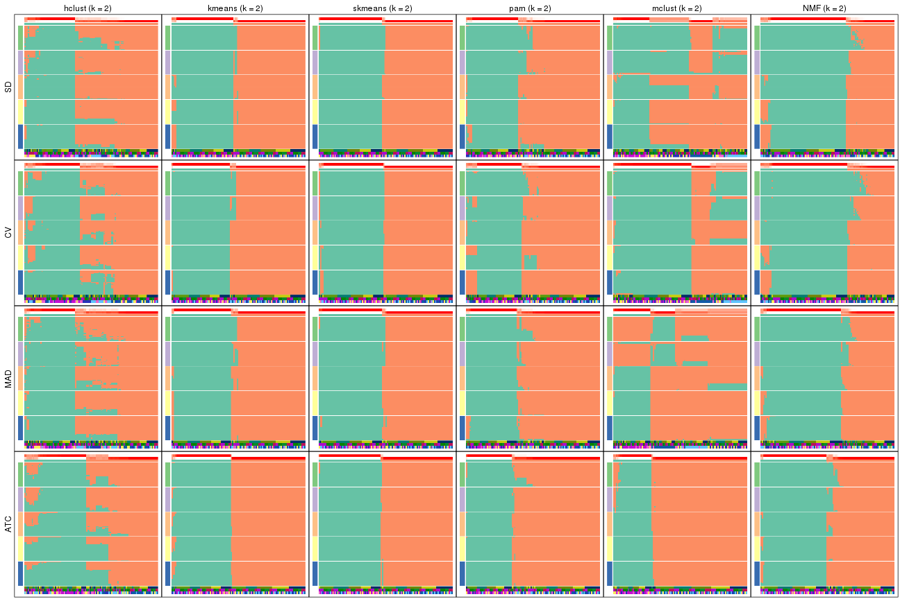</p>

</div>
<div id='tab-collect-membership-heatmap-2'>
<pre><code class="r">collect_plots(res_list, k = 3, fun = membership_heatmap, mc.cores = 4)
</code></pre>

<p>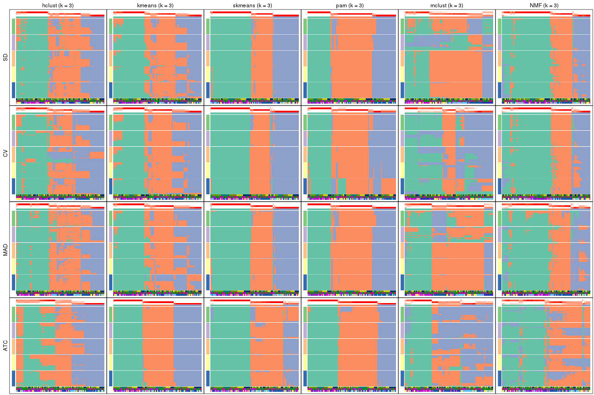</p>

</div>
<div id='tab-collect-membership-heatmap-3'>
<pre><code class="r">collect_plots(res_list, k = 4, fun = membership_heatmap, mc.cores = 4)
</code></pre>

<p>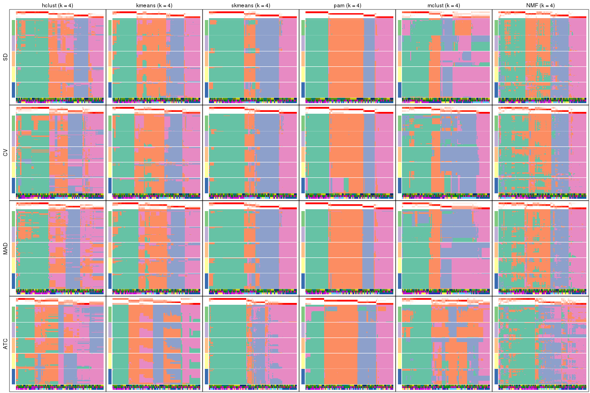</p>

</div>
<div id='tab-collect-membership-heatmap-4'>
<pre><code class="r">collect_plots(res_list, k = 5, fun = membership_heatmap, mc.cores = 4)
</code></pre>

<p>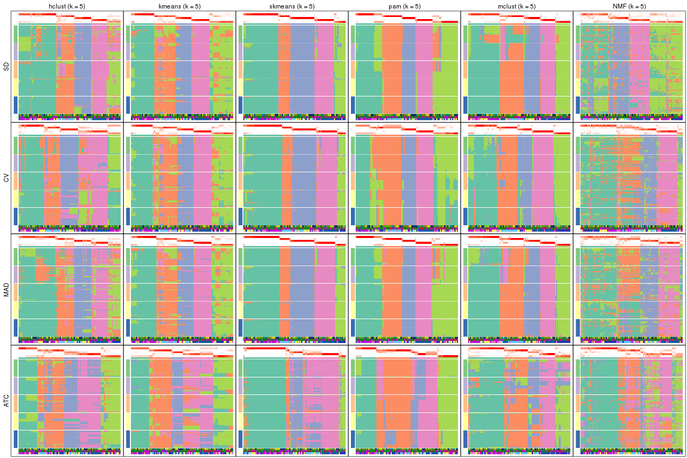</p>

</div>
<div id='tab-collect-membership-heatmap-5'>
<pre><code class="r">collect_plots(res_list, k = 6, fun = membership_heatmap, mc.cores = 4)
</code></pre>

<p>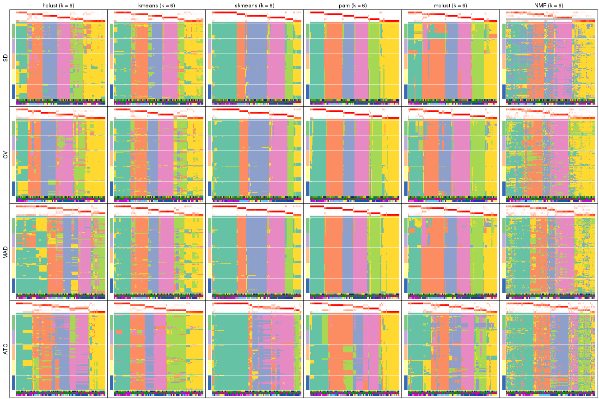</p>

</div>
</div>


### Signature heatmap

Signature heatmaps for all methods. ([What is a signature heatmap?](http://bioconductor.org/packages/devel/bioc/vignettes/cola/inst/doc/cola.html#toc_22))


Note in following heatmaps, rows are scaled.


<script>
$( function() {
	$( '#tabs-collect-get-signatures' ).tabs();
} );
</script>
<div id='tabs-collect-get-signatures'>
<ul>
<li><a href='#tab-collect-get-signatures-1'>k = 2</a></li>
<li><a href='#tab-collect-get-signatures-2'>k = 3</a></li>
<li><a href='#tab-collect-get-signatures-3'>k = 4</a></li>
<li><a href='#tab-collect-get-signatures-4'>k = 5</a></li>
<li><a href='#tab-collect-get-signatures-5'>k = 6</a></li>
</ul>
<div id='tab-collect-get-signatures-1'>
<pre><code class="r">collect_plots(res_list, k = 2, fun = get_signatures, mc.cores = 4)
</code></pre>

<p>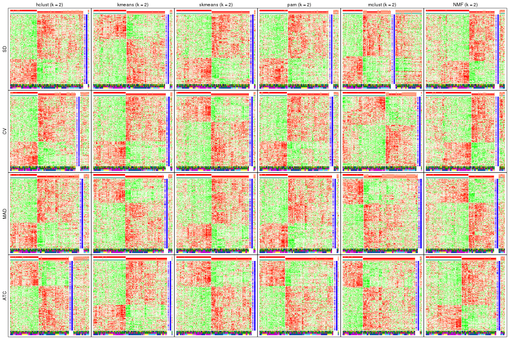</p>

</div>
<div id='tab-collect-get-signatures-2'>
<pre><code class="r">collect_plots(res_list, k = 3, fun = get_signatures, mc.cores = 4)
</code></pre>

<p>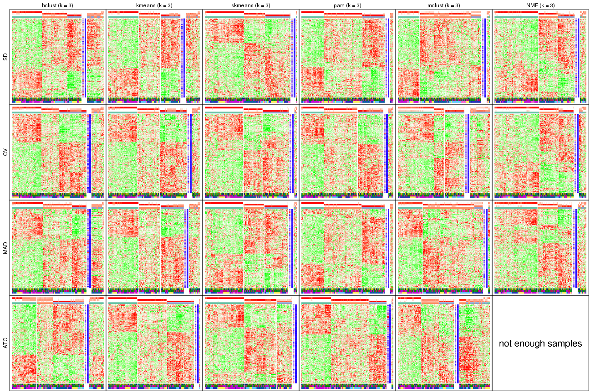</p>

</div>
<div id='tab-collect-get-signatures-3'>
<pre><code class="r">collect_plots(res_list, k = 4, fun = get_signatures, mc.cores = 4)
</code></pre>

<p>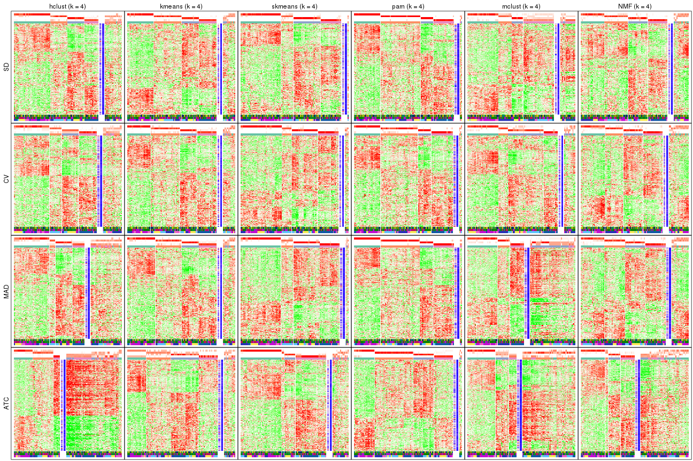</p>

</div>
<div id='tab-collect-get-signatures-4'>
<pre><code class="r">collect_plots(res_list, k = 5, fun = get_signatures, mc.cores = 4)
</code></pre>

<p>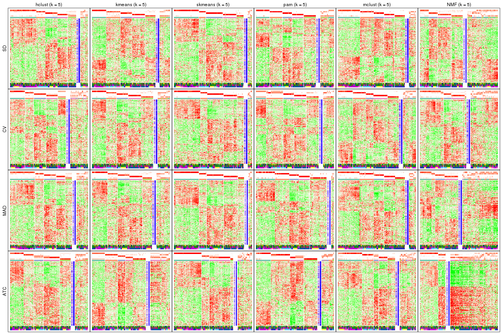</p>

</div>
<div id='tab-collect-get-signatures-5'>
<pre><code class="r">collect_plots(res_list, k = 6, fun = get_signatures, mc.cores = 4)
</code></pre>

<p>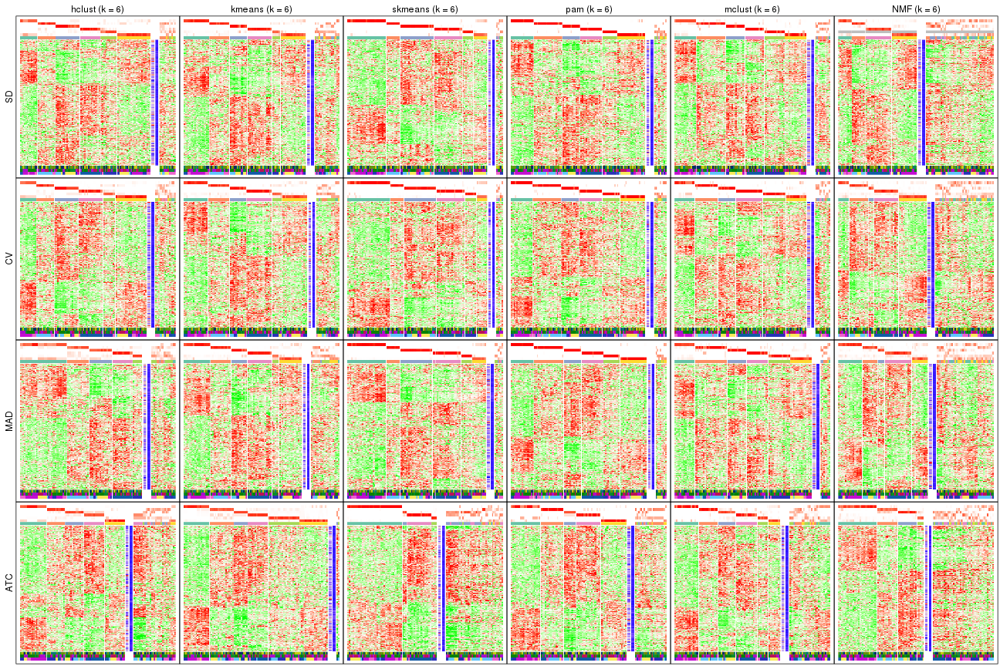</p>

</div>
</div>


### Statistics table

The statistics used for measuring the stability of consensus partitioning.
([How are they
defined?](http://bioconductor.org/packages/devel/bioc/vignettes/cola/inst/doc/cola.html#toc_13))


<script>
$( function() {
	$( '#tabs-get-stats-from-consensus-partition-list' ).tabs();
} );
</script>
<div id='tabs-get-stats-from-consensus-partition-list'>
<ul>
<li><a href='#tab-get-stats-from-consensus-partition-list-1'>k = 2</a></li>
<li><a href='#tab-get-stats-from-consensus-partition-list-2'>k = 3</a></li>
<li><a href='#tab-get-stats-from-consensus-partition-list-3'>k = 4</a></li>
<li><a href='#tab-get-stats-from-consensus-partition-list-4'>k = 5</a></li>
<li><a href='#tab-get-stats-from-consensus-partition-list-5'>k = 6</a></li>
</ul>
<div id='tab-get-stats-from-consensus-partition-list-1'>
<pre><code class="r">get_stats(res_list, k = 2)
</code></pre>

<pre><code>#&gt;             k 1-PAC mean_silhouette concordance area_increased  Rand Jaccard
#&gt; SD:NMF      2 0.817           0.882       0.952          0.463 0.534   0.534
#&gt; CV:NMF      2 0.715           0.859       0.938          0.442 0.540   0.540
#&gt; MAD:NMF     2 0.868           0.886       0.956          0.475 0.516   0.516
#&gt; ATC:NMF     2 0.924           0.915       0.966          0.502 0.496   0.496
#&gt; SD:skmeans  2 1.000           0.971       0.989          0.504 0.497   0.497
#&gt; CV:skmeans  2 1.000           0.955       0.983          0.504 0.496   0.496
#&gt; MAD:skmeans 2 1.000           0.961       0.985          0.504 0.497   0.497
#&gt; ATC:skmeans 2 1.000           0.988       0.995          0.503 0.498   0.498
#&gt; SD:mclust   2 0.327           0.464       0.759          0.377 0.504   0.504
#&gt; CV:mclust   2 0.604           0.857       0.882          0.396 0.509   0.509
#&gt; MAD:mclust  2 0.340           0.791       0.789          0.380 0.595   0.595
#&gt; ATC:mclust  2 1.000           0.958       0.983          0.406 0.587   0.587
#&gt; SD:kmeans   2 0.961           0.939       0.976          0.501 0.498   0.498
#&gt; CV:kmeans   2 1.000           0.958       0.983          0.499 0.504   0.504
#&gt; MAD:kmeans  2 0.961           0.920       0.971          0.499 0.502   0.502
#&gt; ATC:kmeans  2 1.000           0.968       0.987          0.496 0.502   0.502
#&gt; SD:pam      2 0.798           0.885       0.951          0.486 0.520   0.520
#&gt; CV:pam      2 0.749           0.875       0.947          0.482 0.509   0.509
#&gt; MAD:pam     2 0.826           0.928       0.968          0.481 0.525   0.525
#&gt; ATC:pam     2 1.000           0.965       0.983          0.462 0.545   0.545
#&gt; SD:hclust   2 0.548           0.870       0.923          0.463 0.525   0.525
#&gt; CV:hclust   2 0.503           0.745       0.887          0.474 0.509   0.509
#&gt; MAD:hclust  2 0.463           0.831       0.906          0.472 0.525   0.525
#&gt; ATC:hclust  2 0.586           0.686       0.877          0.470 0.498   0.498
</code></pre>

</div>
<div id='tab-get-stats-from-consensus-partition-list-2'>
<pre><code class="r">get_stats(res_list, k = 3)
</code></pre>

<pre><code>#&gt;             k 1-PAC mean_silhouette concordance area_increased  Rand Jaccard
#&gt; SD:NMF      3 0.751           0.813       0.918          0.308 0.799   0.645
#&gt; CV:NMF      3 0.715           0.806       0.911          0.366 0.801   0.651
#&gt; MAD:NMF     3 0.602           0.754       0.872          0.296 0.809   0.650
#&gt; ATC:NMF     3 0.545           0.461       0.742          0.226 0.885   0.775
#&gt; SD:skmeans  3 0.954           0.941       0.972          0.283 0.846   0.694
#&gt; CV:skmeans  3 0.938           0.932       0.971          0.287 0.815   0.642
#&gt; MAD:skmeans 3 0.969           0.928       0.968          0.286 0.834   0.671
#&gt; ATC:skmeans 3 0.788           0.907       0.924          0.241 0.864   0.728
#&gt; SD:mclust   3 0.365           0.737       0.760          0.495 0.652   0.465
#&gt; CV:mclust   3 0.334           0.626       0.773          0.433 0.699   0.494
#&gt; MAD:mclust  3 0.426           0.778       0.819          0.469 0.824   0.711
#&gt; ATC:mclust  3 0.464           0.555       0.716          0.410 0.721   0.533
#&gt; SD:kmeans   3 0.612           0.680       0.857          0.307 0.723   0.498
#&gt; CV:kmeans   3 0.634           0.696       0.858          0.314 0.746   0.532
#&gt; MAD:kmeans  3 0.665           0.732       0.852          0.319 0.736   0.517
#&gt; ATC:kmeans  3 0.999           0.975       0.989          0.354 0.718   0.493
#&gt; SD:pam      3 0.896           0.918       0.965          0.332 0.657   0.437
#&gt; CV:pam      3 0.608           0.812       0.892          0.345 0.669   0.438
#&gt; MAD:pam     3 0.871           0.914       0.963          0.353 0.661   0.444
#&gt; ATC:pam     3 0.981           0.944       0.973          0.398 0.809   0.650
#&gt; SD:hclust   3 0.583           0.694       0.859          0.395 0.783   0.596
#&gt; CV:hclust   3 0.516           0.659       0.792          0.357 0.763   0.560
#&gt; MAD:hclust  3 0.544           0.691       0.845          0.357 0.796   0.616
#&gt; ATC:hclust  3 0.597           0.577       0.768          0.366 0.853   0.708
</code></pre>

</div>
<div id='tab-get-stats-from-consensus-partition-list-3'>
<pre><code class="r">get_stats(res_list, k = 4)
</code></pre>

<pre><code>#&gt;             k 1-PAC mean_silhouette concordance area_increased  Rand Jaccard
#&gt; SD:NMF      4 0.617           0.692       0.844         0.2155 0.775   0.485
#&gt; CV:NMF      4 0.594           0.665       0.824         0.2029 0.784   0.507
#&gt; MAD:NMF     4 0.606           0.677       0.833         0.1948 0.768   0.466
#&gt; ATC:NMF     4 0.500           0.409       0.706         0.1540 0.781   0.541
#&gt; SD:skmeans  4 0.830           0.892       0.933         0.1061 0.907   0.745
#&gt; CV:skmeans  4 0.854           0.885       0.938         0.0953 0.924   0.788
#&gt; MAD:skmeans 4 0.844           0.857       0.916         0.1035 0.910   0.752
#&gt; ATC:skmeans 4 0.771           0.762       0.890         0.0837 0.945   0.854
#&gt; SD:mclust   4 0.499           0.705       0.768         0.2026 0.811   0.599
#&gt; CV:mclust   4 0.578           0.725       0.839         0.2199 0.883   0.708
#&gt; MAD:mclust  4 0.582           0.618       0.768         0.2065 0.780   0.533
#&gt; ATC:mclust  4 0.460           0.471       0.709         0.1691 0.823   0.563
#&gt; SD:kmeans   4 0.778           0.764       0.884         0.1291 0.799   0.490
#&gt; CV:kmeans   4 0.687           0.760       0.860         0.1312 0.786   0.463
#&gt; MAD:kmeans  4 0.705           0.739       0.856         0.1259 0.830   0.550
#&gt; ATC:kmeans  4 0.696           0.634       0.764         0.1014 0.881   0.660
#&gt; SD:pam      4 1.000           0.949       0.982         0.1040 0.894   0.714
#&gt; CV:pam      4 0.762           0.869       0.930         0.1136 0.929   0.793
#&gt; MAD:pam     4 0.978           0.936       0.975         0.1049 0.883   0.689
#&gt; ATC:pam     4 0.926           0.903       0.936         0.1293 0.878   0.670
#&gt; SD:hclust   4 0.669           0.718       0.838         0.1244 0.894   0.702
#&gt; CV:hclust   4 0.584           0.650       0.757         0.1297 0.828   0.554
#&gt; MAD:hclust  4 0.585           0.602       0.743         0.1226 0.846   0.592
#&gt; ATC:hclust  4 0.608           0.408       0.666         0.1381 0.781   0.481
</code></pre>

</div>
<div id='tab-get-stats-from-consensus-partition-list-4'>
<pre><code class="r">get_stats(res_list, k = 5)
</code></pre>

<pre><code>#&gt;             k 1-PAC mean_silhouette concordance area_increased  Rand Jaccard
#&gt; SD:NMF      5 0.538           0.491       0.702         0.0472 0.925   0.737
#&gt; CV:NMF      5 0.558           0.519       0.722         0.0589 0.854   0.545
#&gt; MAD:NMF     5 0.538           0.469       0.669         0.0456 0.913   0.703
#&gt; ATC:NMF     5 0.508           0.362       0.667         0.0679 0.803   0.495
#&gt; SD:skmeans  5 0.924           0.869       0.945         0.0723 0.918   0.723
#&gt; CV:skmeans  5 0.895           0.882       0.945         0.0683 0.938   0.795
#&gt; MAD:skmeans 5 0.972           0.897       0.955         0.0679 0.919   0.729
#&gt; ATC:skmeans 5 0.798           0.706       0.866         0.0447 0.965   0.897
#&gt; SD:mclust   5 0.783           0.806       0.873         0.1585 0.884   0.633
#&gt; CV:mclust   5 0.785           0.744       0.888         0.1454 0.793   0.423
#&gt; MAD:mclust  5 0.781           0.807       0.898         0.1657 0.889   0.626
#&gt; ATC:mclust  5 0.581           0.606       0.765         0.1166 0.857   0.578
#&gt; SD:kmeans   5 0.760           0.745       0.850         0.0765 0.870   0.555
#&gt; CV:kmeans   5 0.742           0.694       0.849         0.0742 0.860   0.527
#&gt; MAD:kmeans  5 0.741           0.721       0.832         0.0713 0.879   0.580
#&gt; ATC:kmeans  5 0.698           0.668       0.772         0.0641 0.847   0.504
#&gt; SD:pam      5 0.849           0.776       0.901         0.1084 0.886   0.621
#&gt; CV:pam      5 0.773           0.678       0.839         0.1004 0.818   0.460
#&gt; MAD:pam     5 0.861           0.840       0.921         0.1034 0.895   0.643
#&gt; ATC:pam     5 0.800           0.678       0.854         0.0798 0.952   0.825
#&gt; SD:hclust   5 0.669           0.739       0.815         0.0618 0.946   0.806
#&gt; CV:hclust   5 0.633           0.646       0.757         0.0677 0.872   0.577
#&gt; MAD:hclust  5 0.659           0.680       0.780         0.0703 0.912   0.699
#&gt; ATC:hclust  5 0.680           0.674       0.769         0.0742 0.790   0.378
</code></pre>

</div>
<div id='tab-get-stats-from-consensus-partition-list-5'>
<pre><code class="r">get_stats(res_list, k = 6)
</code></pre>

<pre><code>#&gt;             k 1-PAC mean_silhouette concordance area_increased  Rand Jaccard
#&gt; SD:NMF      6 0.599           0.485       0.667         0.0587 0.827   0.449
#&gt; CV:NMF      6 0.612           0.471       0.697         0.0571 0.842   0.473
#&gt; MAD:NMF     6 0.617           0.477       0.708         0.0614 0.821   0.436
#&gt; ATC:NMF     6 0.585           0.496       0.717         0.0556 0.849   0.509
#&gt; SD:skmeans  6 0.896           0.872       0.929         0.0438 0.941   0.758
#&gt; CV:skmeans  6 0.895           0.864       0.924         0.0480 0.952   0.809
#&gt; MAD:skmeans 6 0.913           0.874       0.933         0.0489 0.939   0.750
#&gt; ATC:skmeans 6 0.795           0.594       0.825         0.0320 0.919   0.759
#&gt; SD:mclust   6 0.783           0.766       0.861         0.0482 0.939   0.724
#&gt; CV:mclust   6 0.840           0.763       0.887         0.0506 0.921   0.644
#&gt; MAD:mclust  6 0.815           0.810       0.892         0.0538 0.946   0.750
#&gt; ATC:mclust  6 0.633           0.610       0.784         0.0746 0.911   0.637
#&gt; SD:kmeans   6 0.815           0.724       0.842         0.0442 0.944   0.734
#&gt; CV:kmeans   6 0.794           0.719       0.844         0.0441 0.919   0.632
#&gt; MAD:kmeans  6 0.799           0.703       0.835         0.0443 0.919   0.638
#&gt; ATC:kmeans  6 0.802           0.864       0.871         0.0486 0.952   0.775
#&gt; SD:pam      6 0.942           0.868       0.949         0.0533 0.881   0.515
#&gt; CV:pam      6 0.908           0.854       0.940         0.0526 0.900   0.579
#&gt; MAD:pam     6 0.945           0.877       0.952         0.0520 0.889   0.540
#&gt; ATC:pam     6 0.794           0.677       0.836         0.0403 0.927   0.708
#&gt; SD:hclust   6 0.716           0.730       0.826         0.0575 0.934   0.717
#&gt; CV:hclust   6 0.733           0.719       0.824         0.0510 0.935   0.706
#&gt; MAD:hclust  6 0.682           0.626       0.732         0.0494 0.972   0.882
#&gt; ATC:hclust  6 0.717           0.592       0.764         0.0440 0.940   0.734
</code></pre>

</div>
</div>

Following heatmap plots the partition for each combination of methods and the
lightness correspond to the silhouette scores for samples in each method. On
top the consensus subgroup is inferred from all methods by taking the mean
silhouette scores as weight.


<script>
$( function() {
	$( '#tabs-collect-stats-from-consensus-partition-list' ).tabs();
} );
</script>
<div id='tabs-collect-stats-from-consensus-partition-list'>
<ul>
<li><a href='#tab-collect-stats-from-consensus-partition-list-1'>k = 2</a></li>
<li><a href='#tab-collect-stats-from-consensus-partition-list-2'>k = 3</a></li>
<li><a href='#tab-collect-stats-from-consensus-partition-list-3'>k = 4</a></li>
<li><a href='#tab-collect-stats-from-consensus-partition-list-4'>k = 5</a></li>
<li><a href='#tab-collect-stats-from-consensus-partition-list-5'>k = 6</a></li>
</ul>
<div id='tab-collect-stats-from-consensus-partition-list-1'>
<pre><code class="r">collect_stats(res_list, k = 2)
</code></pre>

<p>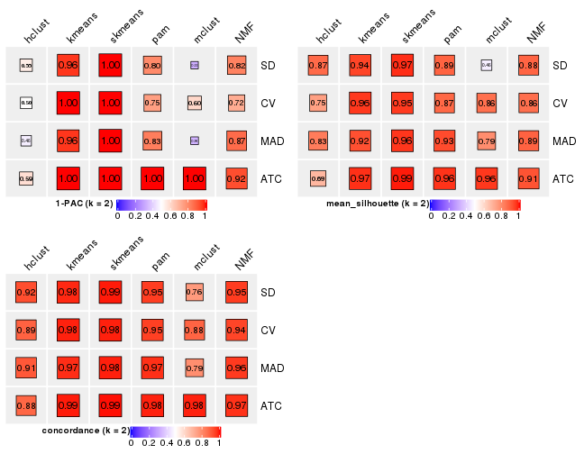</p>

</div>
<div id='tab-collect-stats-from-consensus-partition-list-2'>
<pre><code class="r">collect_stats(res_list, k = 3)
</code></pre>

<p>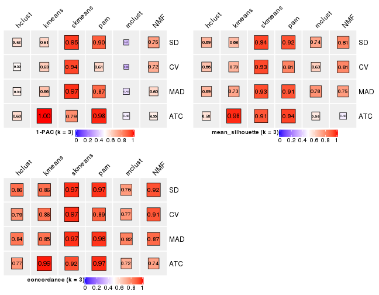</p>

</div>
<div id='tab-collect-stats-from-consensus-partition-list-3'>
<pre><code class="r">collect_stats(res_list, k = 4)
</code></pre>

<p>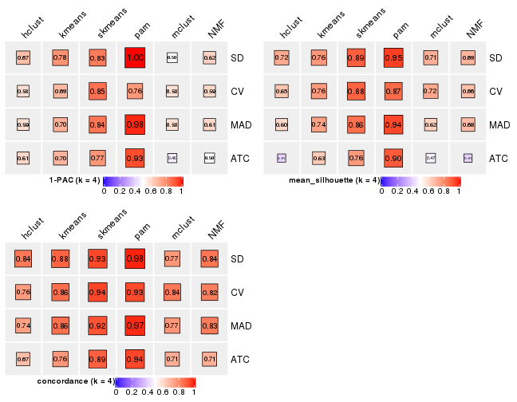</p>

</div>
<div id='tab-collect-stats-from-consensus-partition-list-4'>
<pre><code class="r">collect_stats(res_list, k = 5)
</code></pre>

<p>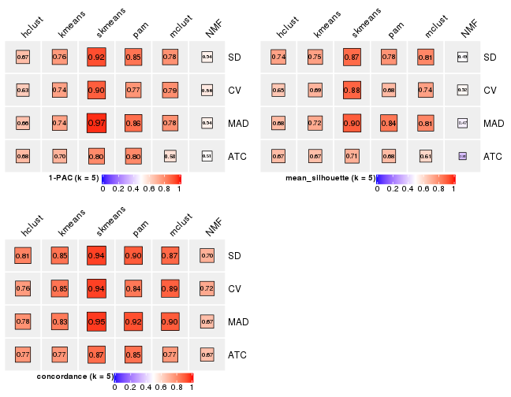</p>

</div>
<div id='tab-collect-stats-from-consensus-partition-list-5'>
<pre><code class="r">collect_stats(res_list, k = 6)
</code></pre>

<p>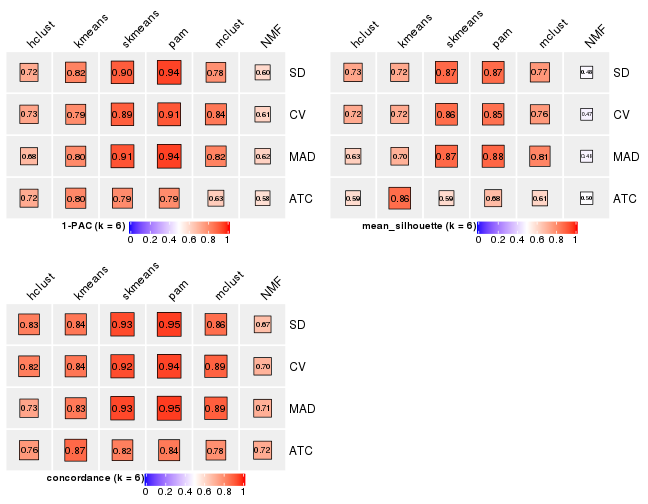</p>

</div>
</div>

### Partition from all methods


Collect partitions from all methods:


<script>
$( function() {
	$( '#tabs-collect-classes-from-consensus-partition-list' ).tabs();
} );
</script>
<div id='tabs-collect-classes-from-consensus-partition-list'>
<ul>
<li><a href='#tab-collect-classes-from-consensus-partition-list-1'>k = 2</a></li>
<li><a href='#tab-collect-classes-from-consensus-partition-list-2'>k = 3</a></li>
<li><a href='#tab-collect-classes-from-consensus-partition-list-3'>k = 4</a></li>
<li><a href='#tab-collect-classes-from-consensus-partition-list-4'>k = 5</a></li>
<li><a href='#tab-collect-classes-from-consensus-partition-list-5'>k = 6</a></li>
</ul>
<div id='tab-collect-classes-from-consensus-partition-list-1'>
<pre><code class="r">collect_classes(res_list, k = 2)
</code></pre>

<p>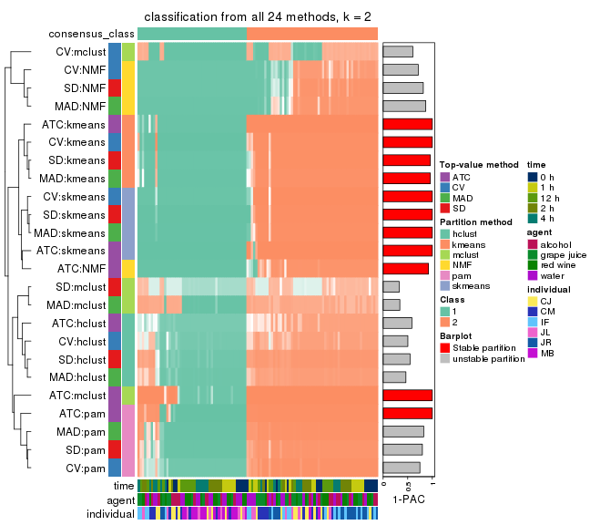</p>

</div>
<div id='tab-collect-classes-from-consensus-partition-list-2'>
<pre><code class="r">collect_classes(res_list, k = 3)
</code></pre>

<p>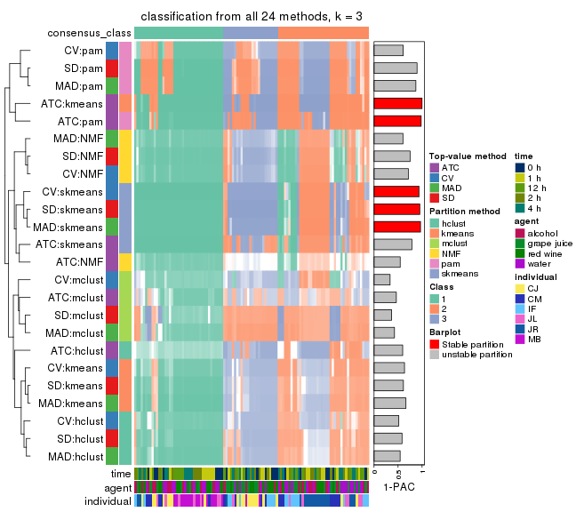</p>

</div>
<div id='tab-collect-classes-from-consensus-partition-list-3'>
<pre><code class="r">collect_classes(res_list, k = 4)
</code></pre>

<p>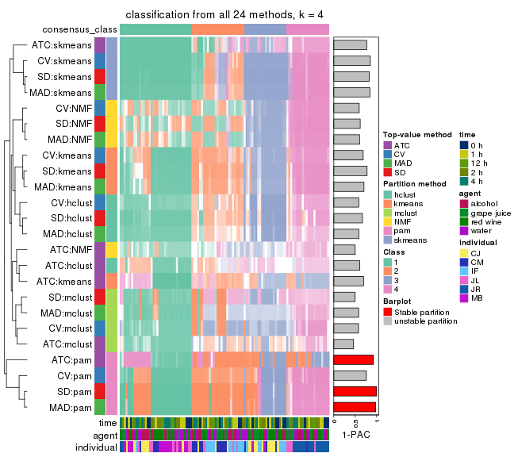</p>

</div>
<div id='tab-collect-classes-from-consensus-partition-list-4'>
<pre><code class="r">collect_classes(res_list, k = 5)
</code></pre>

<p>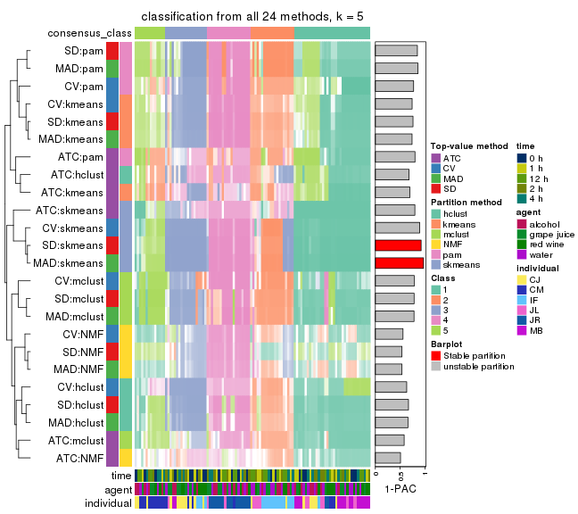</p>

</div>
<div id='tab-collect-classes-from-consensus-partition-list-5'>
<pre><code class="r">collect_classes(res_list, k = 6)
</code></pre>

<p>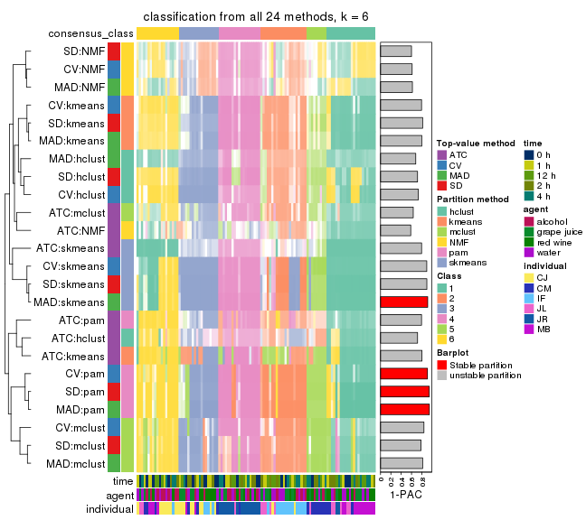</p>

</div>
</div>


### Top rows overlap


Overlap of top rows from different top-row methods:


<script>
$( function() {
	$( '#tabs-top-rows-overlap-by-euler' ).tabs();
} );
</script>
<div id='tabs-top-rows-overlap-by-euler'>
<ul>
<li><a href='#tab-top-rows-overlap-by-euler-1'>top_n = 1000</a></li>
<li><a href='#tab-top-rows-overlap-by-euler-2'>top_n = 2000</a></li>
<li><a href='#tab-top-rows-overlap-by-euler-3'>top_n = 3000</a></li>
<li><a href='#tab-top-rows-overlap-by-euler-4'>top_n = 4000</a></li>
<li><a href='#tab-top-rows-overlap-by-euler-5'>top_n = 5000</a></li>
</ul>
<div id='tab-top-rows-overlap-by-euler-1'>
<pre><code class="r">top_rows_overlap(res_list, top_n = 1000, method = &quot;euler&quot;)
</code></pre>

<p>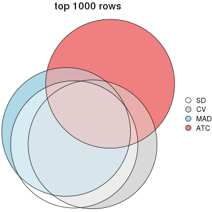</p>

</div>
<div id='tab-top-rows-overlap-by-euler-2'>
<pre><code class="r">top_rows_overlap(res_list, top_n = 2000, method = &quot;euler&quot;)
</code></pre>

<p>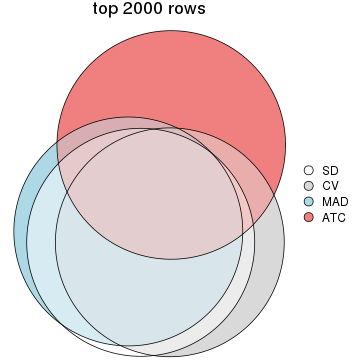</p>

</div>
<div id='tab-top-rows-overlap-by-euler-3'>
<pre><code class="r">top_rows_overlap(res_list, top_n = 3000, method = &quot;euler&quot;)
</code></pre>

<p>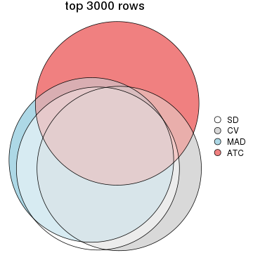</p>

</div>
<div id='tab-top-rows-overlap-by-euler-4'>
<pre><code class="r">top_rows_overlap(res_list, top_n = 4000, method = &quot;euler&quot;)
</code></pre>

<p>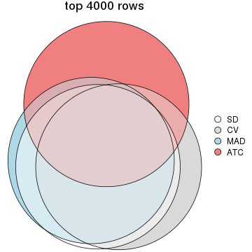</p>

</div>
<div id='tab-top-rows-overlap-by-euler-5'>
<pre><code class="r">top_rows_overlap(res_list, top_n = 5000, method = &quot;euler&quot;)
</code></pre>

<p>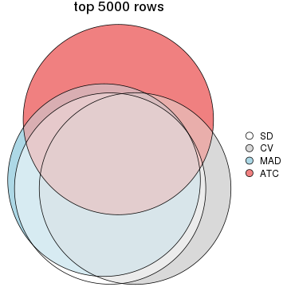</p>

</div>
</div>

Also visualize the correspondance of rankings between different top-row methods:


<script>
$( function() {
	$( '#tabs-top-rows-overlap-by-correspondance' ).tabs();
} );
</script>
<div id='tabs-top-rows-overlap-by-correspondance'>
<ul>
<li><a href='#tab-top-rows-overlap-by-correspondance-1'>top_n = 1000</a></li>
<li><a href='#tab-top-rows-overlap-by-correspondance-2'>top_n = 2000</a></li>
<li><a href='#tab-top-rows-overlap-by-correspondance-3'>top_n = 3000</a></li>
<li><a href='#tab-top-rows-overlap-by-correspondance-4'>top_n = 4000</a></li>
<li><a href='#tab-top-rows-overlap-by-correspondance-5'>top_n = 5000</a></li>
</ul>
<div id='tab-top-rows-overlap-by-correspondance-1'>
<pre><code class="r">top_rows_overlap(res_list, top_n = 1000, method = &quot;correspondance&quot;)
</code></pre>

<p>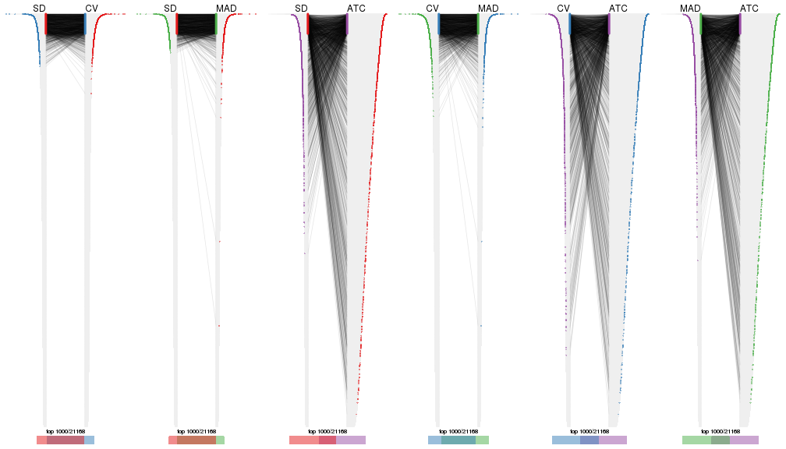</p>

</div>
<div id='tab-top-rows-overlap-by-correspondance-2'>
<pre><code class="r">top_rows_overlap(res_list, top_n = 2000, method = &quot;correspondance&quot;)
</code></pre>

<p>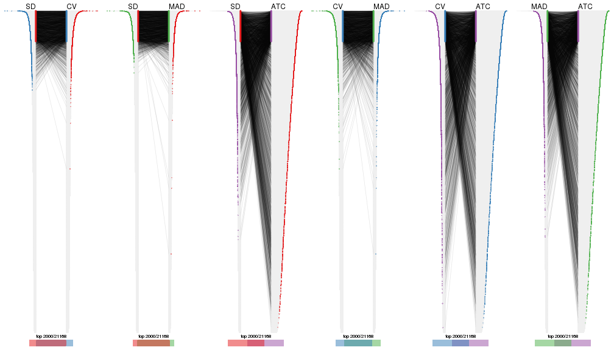</p>

</div>
<div id='tab-top-rows-overlap-by-correspondance-3'>
<pre><code class="r">top_rows_overlap(res_list, top_n = 3000, method = &quot;correspondance&quot;)
</code></pre>

<p>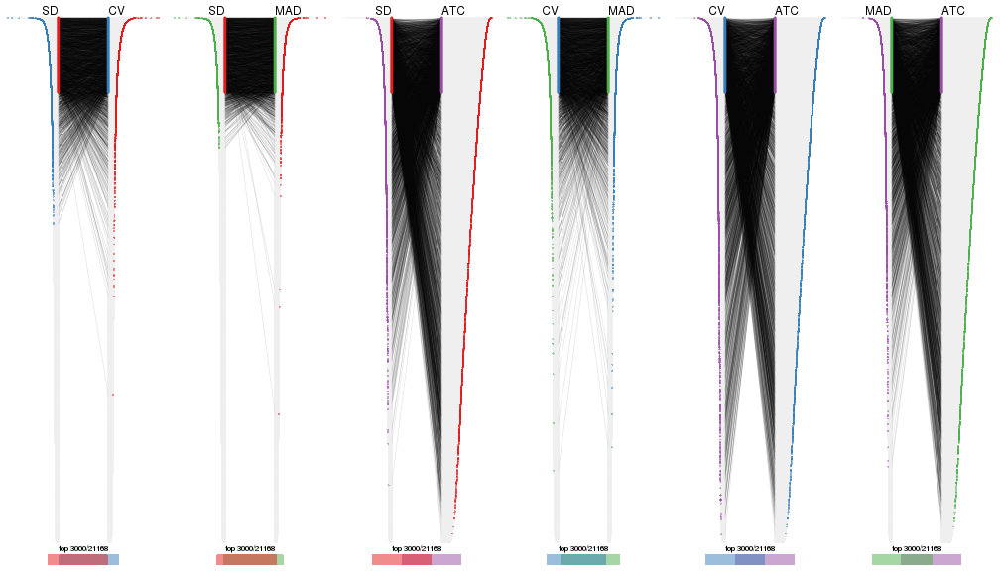</p>

</div>
<div id='tab-top-rows-overlap-by-correspondance-4'>
<pre><code class="r">top_rows_overlap(res_list, top_n = 4000, method = &quot;correspondance&quot;)
</code></pre>

<p>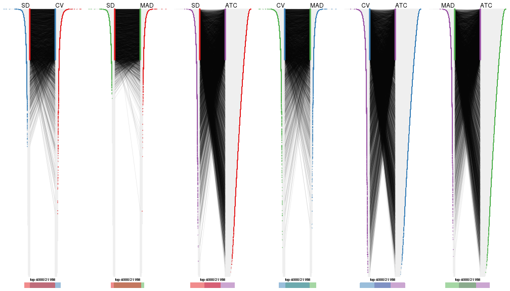</p>

</div>
<div id='tab-top-rows-overlap-by-correspondance-5'>
<pre><code class="r">top_rows_overlap(res_list, top_n = 5000, method = &quot;correspondance&quot;)
</code></pre>

<p>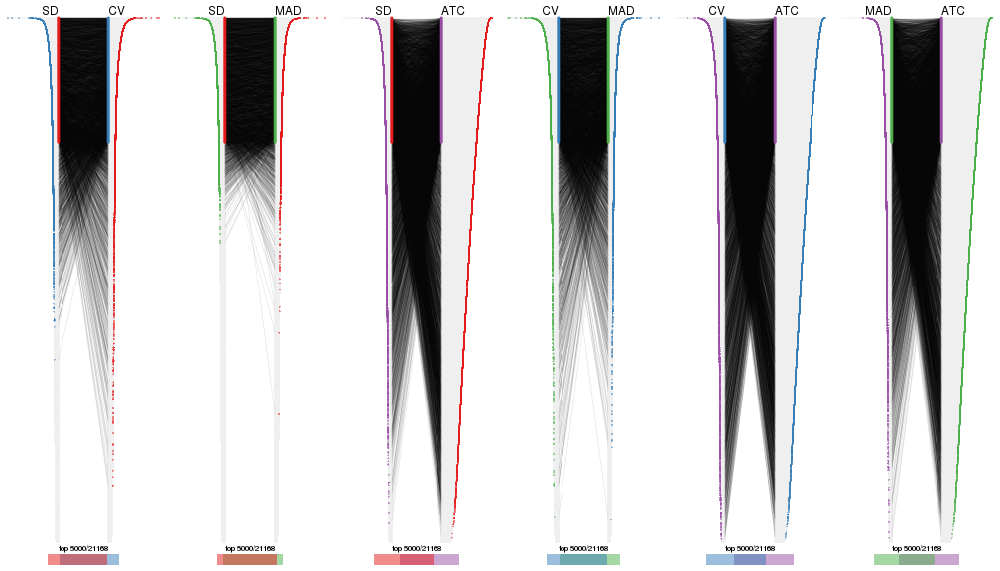</p>

</div>
</div>


Heatmaps of the top rows:


<script>
$( function() {
	$( '#tabs-top-rows-heatmap' ).tabs();
} );
</script>
<div id='tabs-top-rows-heatmap'>
<ul>
<li><a href='#tab-top-rows-heatmap-1'>top_n = 1000</a></li>
<li><a href='#tab-top-rows-heatmap-2'>top_n = 2000</a></li>
<li><a href='#tab-top-rows-heatmap-3'>top_n = 3000</a></li>
<li><a href='#tab-top-rows-heatmap-4'>top_n = 4000</a></li>
<li><a href='#tab-top-rows-heatmap-5'>top_n = 5000</a></li>
</ul>
<div id='tab-top-rows-heatmap-1'>
<pre><code class="r">top_rows_heatmap(res_list, top_n = 1000)
</code></pre>

<p>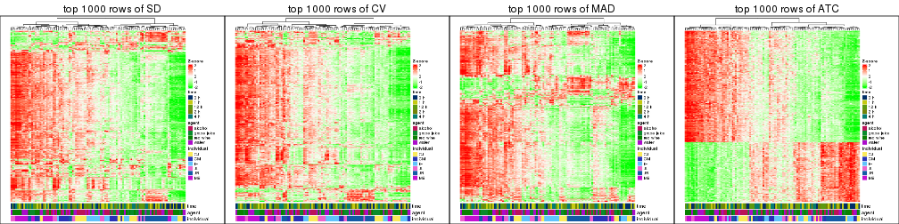</p>

</div>
<div id='tab-top-rows-heatmap-2'>
<pre><code class="r">top_rows_heatmap(res_list, top_n = 2000)
</code></pre>

<p>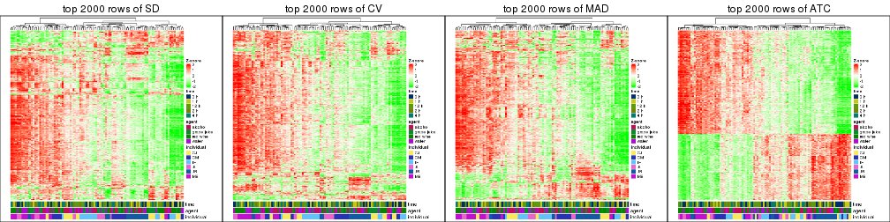</p>

</div>
<div id='tab-top-rows-heatmap-3'>
<pre><code class="r">top_rows_heatmap(res_list, top_n = 3000)
</code></pre>

<p>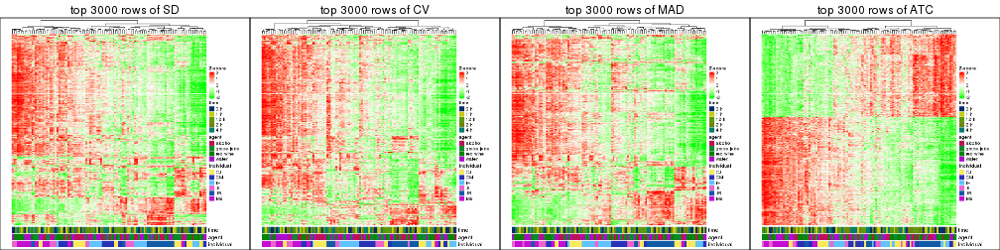</p>

</div>
<div id='tab-top-rows-heatmap-4'>
<pre><code class="r">top_rows_heatmap(res_list, top_n = 4000)
</code></pre>

<p>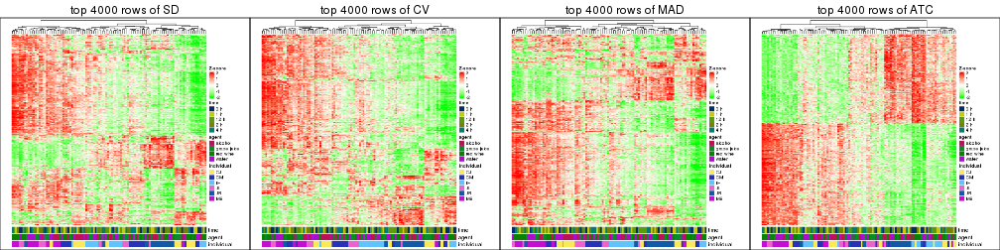</p>

</div>
<div id='tab-top-rows-heatmap-5'>
<pre><code class="r">top_rows_heatmap(res_list, top_n = 5000)
</code></pre>

<p>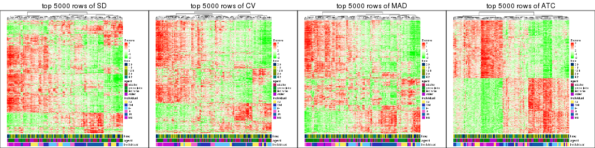</p>

</div>
</div>


### Test to known annotations


Test correlation between subgroups and known annotations. If the known
annotation is numeric, one-way ANOVA test is applied, and if the known
annotation is discrete, chi-squared contingency table test is applied.


<script>
$( function() {
	$( '#tabs-test-to-known-factors-from-consensus-partition-list' ).tabs();
} );
</script>
<div id='tabs-test-to-known-factors-from-consensus-partition-list'>
<ul>
<li><a href='#tab-test-to-known-factors-from-consensus-partition-list-1'>k = 2</a></li>
<li><a href='#tab-test-to-known-factors-from-consensus-partition-list-2'>k = 3</a></li>
<li><a href='#tab-test-to-known-factors-from-consensus-partition-list-3'>k = 4</a></li>
<li><a href='#tab-test-to-known-factors-from-consensus-partition-list-4'>k = 5</a></li>
<li><a href='#tab-test-to-known-factors-from-consensus-partition-list-5'>k = 6</a></li>
</ul>
<div id='tab-test-to-known-factors-from-consensus-partition-list-1'>
<pre><code class="r">test_to_known_factors(res_list, k = 2)
</code></pre>

<pre><code>#&gt;               n time(p) agent(p) individual(p) k
#&gt; SD:NMF      100   0.630    0.530      8.01e-05 2
#&gt; CV:NMF      100   0.374    0.528      9.10e-04 2
#&gt; MAD:NMF      99   0.763    0.525      5.85e-05 2
#&gt; ATC:NMF     102   0.695    0.570      2.71e-05 2
#&gt; SD:skmeans  106   0.769    0.350      2.30e-04 2
#&gt; CV:skmeans  105   0.826    0.410      2.10e-04 2
#&gt; MAD:skmeans 105   0.812    0.283      1.69e-04 2
#&gt; ATC:skmeans 108   0.746    0.582      3.81e-05 2
#&gt; SD:mclust    70   0.896    0.397      1.39e-10 2
#&gt; CV:mclust   107   0.696    0.992      2.92e-15 2
#&gt; MAD:mclust  108   0.974    0.155      2.31e-09 2
#&gt; ATC:mclust  105   0.967    0.202      9.12e-10 2
#&gt; SD:kmeans   104   0.845    0.418      1.03e-04 2
#&gt; CV:kmeans   105   0.785    0.429      3.67e-05 2
#&gt; MAD:kmeans  102   0.799    0.494      8.23e-05 2
#&gt; ATC:kmeans  107   0.835    0.732      5.81e-05 2
#&gt; SD:pam      100   0.976    0.502      1.08e-05 2
#&gt; CV:pam      101   0.995    0.566      6.91e-06 2
#&gt; MAD:pam     105   0.996    0.527      5.48e-06 2
#&gt; ATC:pam     107   0.993    0.339      8.77e-07 2
#&gt; SD:hclust   106   0.986    0.657      9.75e-07 2
#&gt; CV:hclust    95   0.858    0.388      2.52e-05 2
#&gt; MAD:hclust  100   0.978    0.702      7.07e-06 2
#&gt; ATC:hclust   85   0.704    0.778      1.55e-05 2
</code></pre>

</div>
<div id='tab-test-to-known-factors-from-consensus-partition-list-2'>
<pre><code class="r">test_to_known_factors(res_list, k = 3)
</code></pre>

<pre><code>#&gt;               n time(p) agent(p) individual(p) k
#&gt; SD:NMF      100   0.754   0.7148      2.66e-12 3
#&gt; CV:NMF       99   0.941   0.5879      9.68e-13 3
#&gt; MAD:NMF      97   0.794   0.8146      2.55e-11 3
#&gt; ATC:NMF      48      NA       NA            NA 3
#&gt; SD:skmeans  107   0.693   0.5550      3.79e-11 3
#&gt; CV:skmeans  105   0.603   0.7501      3.71e-13 3
#&gt; MAD:skmeans 104   0.523   0.5745      1.17e-10 3
#&gt; ATC:skmeans 108   0.443   0.2945      1.67e-08 3
#&gt; SD:mclust   104   0.996   0.7338      7.83e-23 3
#&gt; CV:mclust    83   0.993   0.9860      5.37e-24 3
#&gt; MAD:mclust  106   0.997   0.8337      1.42e-20 3
#&gt; ATC:mclust   70   0.705   0.3463      8.02e-13 3
#&gt; SD:kmeans    90   0.201   0.2840      8.68e-06 3
#&gt; CV:kmeans    98   0.785   0.1464      2.77e-06 3
#&gt; MAD:kmeans   94   0.370   0.2276      1.33e-06 3
#&gt; ATC:kmeans  107   0.631   0.0268      7.64e-08 3
#&gt; SD:pam      104   0.637   0.2195      2.66e-16 3
#&gt; CV:pam      102   0.777   0.3103      1.49e-13 3
#&gt; MAD:pam     104   0.669   0.2413      1.43e-16 3
#&gt; ATC:pam     106   0.618   0.0212      1.33e-05 3
#&gt; SD:hclust    87   0.459   0.5054      4.81e-06 3
#&gt; CV:hclust    93   0.620   0.2956      7.42e-10 3
#&gt; MAD:hclust   93   0.357   0.5409      5.36e-07 3
#&gt; ATC:hclust   90   0.779   0.0540      6.05e-08 3
</code></pre>

</div>
<div id='tab-test-to-known-factors-from-consensus-partition-list-3'>
<pre><code class="r">test_to_known_factors(res_list, k = 4)
</code></pre>

<pre><code>#&gt;               n time(p) agent(p) individual(p) k
#&gt; SD:NMF       92   0.991  0.19467      3.08e-21 4
#&gt; CV:NMF       87   1.000  0.03495      5.40e-21 4
#&gt; MAD:NMF      90   0.992  0.11802      2.38e-20 4
#&gt; ATC:NMF      57   0.696  0.53248      1.39e-11 4
#&gt; SD:skmeans  107   0.907  0.42542      3.46e-20 4
#&gt; CV:skmeans  104   0.965  0.36948      4.08e-22 4
#&gt; MAD:skmeans 105   0.985  0.31155      3.98e-21 4
#&gt; ATC:skmeans  91   0.341  0.54982      2.54e-08 4
#&gt; SD:mclust    92   0.998  0.67818      2.55e-27 4
#&gt; CV:mclust    96   0.982  0.78550      1.04e-31 4
#&gt; MAD:mclust   60   0.958  0.84818      5.57e-20 4
#&gt; ATC:mclust   52   0.353  0.10264      7.79e-08 4
#&gt; SD:kmeans    95   0.961  0.36398      1.76e-19 4
#&gt; CV:kmeans    95   0.957  0.41031      2.13e-17 4
#&gt; MAD:kmeans   95   0.954  0.35388      9.02e-19 4
#&gt; ATC:kmeans   96   0.750  0.00440      3.52e-07 4
#&gt; SD:pam      106   0.543  0.30007      1.49e-18 4
#&gt; CV:pam      105   0.660  0.19909      3.75e-18 4
#&gt; MAD:pam     106   0.454  0.23478      1.07e-18 4
#&gt; ATC:pam     105   0.782  0.00154      1.10e-05 4
#&gt; SD:hclust    90   0.629  0.62386      5.76e-19 4
#&gt; CV:hclust    88   0.868  0.53765      2.10e-19 4
#&gt; MAD:hclust   75   0.813  0.66910      3.73e-18 4
#&gt; ATC:hclust   49   0.968  0.03716      1.33e-02 4
</code></pre>

</div>
<div id='tab-test-to-known-factors-from-consensus-partition-list-4'>
<pre><code class="r">test_to_known_factors(res_list, k = 5)
</code></pre>

<pre><code>#&gt;               n time(p) agent(p) individual(p) k
#&gt; SD:NMF       64  0.9745  0.05943      2.49e-13 5
#&gt; CV:NMF       68  0.8063  0.24691      3.19e-17 5
#&gt; MAD:NMF      56  0.9690  0.04026      4.35e-15 5
#&gt; ATC:NMF      38  0.9620  0.29156      2.40e-06 5
#&gt; SD:skmeans  102  0.9911  0.61243      1.71e-28 5
#&gt; CV:skmeans  102  0.9848  0.69888      8.54e-28 5
#&gt; MAD:skmeans 103  0.9692  0.77416      3.43e-26 5
#&gt; ATC:skmeans  87  0.4005  0.49000      2.98e-11 5
#&gt; SD:mclust    98  0.9933  0.68932      2.89e-41 5
#&gt; CV:mclust    89  0.9997  0.58497      1.47e-42 5
#&gt; MAD:mclust   98  0.9676  0.67292      7.06e-39 5
#&gt; ATC:mclust   84  0.1945  0.52565      4.48e-21 5
#&gt; SD:kmeans    93  0.7489  0.22912      4.62e-24 5
#&gt; CV:kmeans    90  0.8653  0.25602      1.55e-20 5
#&gt; MAD:kmeans   88  0.8808  0.09883      2.28e-22 5
#&gt; ATC:kmeans   79  0.0197  0.00722      9.73e-04 5
#&gt; SD:pam       88  0.2454  0.26328      4.42e-24 5
#&gt; CV:pam       92  0.4493  0.00485      1.83e-19 5
#&gt; MAD:pam     104  0.0953  0.26374      4.09e-25 5
#&gt; ATC:pam      90  0.6183  0.00552      1.07e-07 5
#&gt; SD:hclust    97  0.8622  0.86147      8.16e-27 5
#&gt; CV:hclust    82  0.9113  0.22280      2.48e-20 5
#&gt; MAD:hclust   91  0.5875  0.53821      2.25e-26 5
#&gt; ATC:hclust   89  0.3160  0.19171      6.79e-10 5
</code></pre>

</div>
<div id='tab-test-to-known-factors-from-consensus-partition-list-5'>
<pre><code class="r">test_to_known_factors(res_list, k = 6)
</code></pre>

<pre><code>#&gt;               n time(p) agent(p) individual(p) k
#&gt; SD:NMF       58   0.205   0.1989      7.13e-16 6
#&gt; CV:NMF       65   0.754   0.2388      1.81e-17 6
#&gt; MAD:NMF      66   0.269   0.0312      2.51e-16 6
#&gt; ATC:NMF      63   0.347   0.1272      1.32e-08 6
#&gt; SD:skmeans  103   0.997   0.2029      2.09e-35 6
#&gt; CV:skmeans  103   0.999   0.2296      1.05e-33 6
#&gt; MAD:skmeans 102   0.997   0.2279      4.26e-35 6
#&gt; ATC:skmeans  66   0.615   0.7880      2.17e-11 6
#&gt; SD:mclust    97   0.995   0.2128      6.34e-42 6
#&gt; CV:mclust    97   0.983   0.3754      9.36e-44 6
#&gt; MAD:mclust  101   0.994   0.1372      5.54e-39 6
#&gt; ATC:mclust   78   0.743   0.1114      9.61e-26 6
#&gt; SD:kmeans    90   0.946   0.0742      9.80e-25 6
#&gt; CV:kmeans    91   0.941   0.1112      1.18e-21 6
#&gt; MAD:kmeans   87   0.946   0.1701      6.47e-26 6
#&gt; ATC:kmeans  106   0.155   0.0348      3.88e-11 6
#&gt; SD:pam       99   0.173   0.1025      7.70e-29 6
#&gt; CV:pam       99   0.172   0.0473      2.02e-26 6
#&gt; MAD:pam     100   0.395   0.1187      4.85e-28 6
#&gt; ATC:pam      85   0.592   0.0639      1.33e-10 6
#&gt; SD:hclust    96   0.884   0.3341      1.45e-26 6
#&gt; CV:hclust    93   0.910   0.3837      4.27e-28 6
#&gt; MAD:hclust   90   0.753   0.8891      1.62e-31 6
#&gt; ATC:hclust   77   0.592   0.2035      7.50e-13 6
</code></pre>

</div>
</div>


 
## Results for each method


---------------------------------------------------


### SD:hclust


The object with results only for a single top-value method and a single partition method 
can be extracted as:

```r
res = res_list["SD", "hclust"]
# you can also extract it by
# res = res_list["SD:hclust"]
```

A summary of `res` and all the functions that can be applied to it:

```r
res
```

```
#> A 'ConsensusPartition' object with k = 2, 3, 4, 5, 6.
#>   On a matrix with 21168 rows and 108 columns.
#>   Top rows (1000, 2000, 3000, 4000, 5000) are extracted by 'SD' method.
#>   Subgroups are detected by 'hclust' method.
#>   Performed in total 1250 partitions by row resampling.
#>   Best k for subgroups seems to be 2.
#> 
#> Following methods can be applied to this 'ConsensusPartition' object:
#>  [1] "cola_report"             "collect_classes"         "collect_plots"          
#>  [4] "collect_stats"           "colnames"                "compare_signatures"     
#>  [7] "consensus_heatmap"       "dimension_reduction"     "functional_enrichment"  
#> [10] "get_anno_col"            "get_anno"                "get_classes"            
#> [13] "get_consensus"           "get_matrix"              "get_membership"         
#> [16] "get_param"               "get_signatures"          "get_stats"              
#> [19] "is_best_k"               "is_stable_k"             "membership_heatmap"     
#> [22] "ncol"                    "nrow"                    "plot_ecdf"              
#> [25] "rownames"                "select_partition_number" "show"                   
#> [28] "suggest_best_k"          "test_to_known_factors"
```

`collect_plots()` function collects all the plots made from `res` for all `k` (number of partitions)
into one single page to provide an easy and fast comparison between different `k`.

```r
collect_plots(res)
```

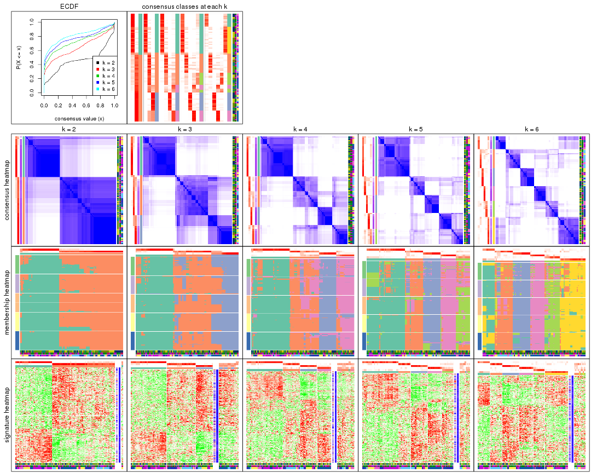

The plots are:

- The first row: a plot of the ECDF (Empirical cumulative distribution
  function) curves of the consensus matrix for each `k` and the heatmap of
  predicted classes for each `k`.
- The second row: heatmaps of the consensus matrix for each `k`.
- The third row: heatmaps of the membership matrix for each `k`.
- The fouth row: heatmaps of the signatures for each `k`.

All the plots in panels can be made by individual functions and they are
plotted later in this section.

`select_partition_number()` produces several plots showing different
statistics for choosing "optimized" `k`. There are following statistics:

- ECDF curves of the consensus matrix for each `k`;
- 1-PAC. [The PAC
  score](https://en.wikipedia.org/wiki/Consensus_clustering#Over-interpretation_potential_of_consensus_clustering)
  measures the proportion of the ambiguous subgrouping.
- Mean silhouette score.
- Concordance. The mean probability of fiting the consensus class ids in all
  partitions.
- Area increased. Denote $A_k$ as the area under the ECDF curve for current
  `k`, the area increased is defined as $A_k - A_{k-1}$.
- Rand index. The percent of pairs of samples that are both in a same cluster
  or both are not in a same cluster in the partition of k and k-1.
- Jaccard index. The ratio of pairs of samples are both in a same cluster in
  the partition of k and k-1 and the pairs of samples are both in a same
  cluster in the partition k or k-1.

The detailed explanations of these statistics can be found in [the cola
vignette](http://bioconductor.org/packages/devel/bioc/vignettes/cola/inst/doc/cola.html#toc_13).

Generally speaking, lower PAC score, higher mean silhouette score or higher
concordance corresponds to better partition. Rand index and Jaccard index
measure how similar the current partition is compared to partition with `k-1`.
If they are too similar, we won't accept `k` is better than `k-1`.

```r
select_partition_number(res)
```

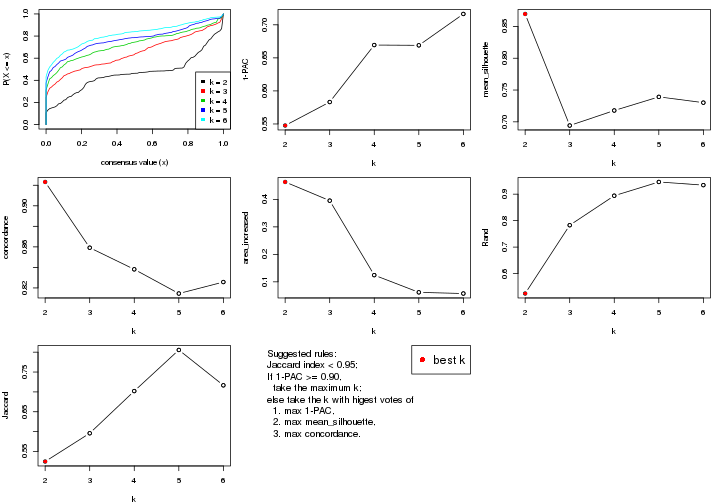

The numeric values for all these statistics can be obtained by `get_stats()`.

```r
get_stats(res)
```

```
#>   k 1-PAC mean_silhouette concordance area_increased  Rand Jaccard
#> 2 2 0.548           0.870       0.923         0.4633 0.525   0.525
#> 3 3 0.583           0.694       0.859         0.3954 0.783   0.596
#> 4 4 0.669           0.718       0.838         0.1244 0.894   0.702
#> 5 5 0.669           0.739       0.815         0.0618 0.946   0.806
#> 6 6 0.716           0.730       0.826         0.0575 0.934   0.717
```

`suggest_best_k()` suggests the best $k$ based on these statistics. The rules are as follows:

- All $k$ with Jaccard index larger than 0.95 are removed because the increase of
  the partition number does not provides enough extra information. If all $k$ are removed,
  the best $k$ is assigned by `NA`.
- For $k$ with 1-PAC larger than 0.9, the maximal $k$ is taken as the "best k". Other $k$ is called "optional k".
- If it does not fit the second rule. The $k$ with the highest vote of highest
  1-PAC, mean silhouette and concordance is taken as the "best k".

```r
suggest_best_k(res)
```

```
#> [1] 2
```


Following shows the table of the partitions (You need to click the **show/hide
code output** link to see it). The membership matrix (columns with name `p*`)
is inferred by
[`clue::cl_consensus()`](https://www.rdocumentation.org/link/cl_consensus?package=clue)
function with the `SE` method. Basically the value in the membership matrix
represents the probability to belong to a certain group. The finall class
label for an item is determined with the group with highest probability it
belongs to.

In `get_classes()` function, the entropy is calculated from the membership
matrix and the silhouette score is calculated from the consensus matrix.


<script>
$( function() {
	$( '#tabs-SD-hclust-get-classes' ).tabs();
} );
</script>
<div id='tabs-SD-hclust-get-classes'>
<ul>
<li><a href='#tab-SD-hclust-get-classes-1'>k = 2</a></li>
<li><a href='#tab-SD-hclust-get-classes-2'>k = 3</a></li>
<li><a href='#tab-SD-hclust-get-classes-3'>k = 4</a></li>
<li><a href='#tab-SD-hclust-get-classes-4'>k = 5</a></li>
<li><a href='#tab-SD-hclust-get-classes-5'>k = 6</a></li>
</ul>

<div id='tab-SD-hclust-get-classes-1'>
<p><a id='tab-SD-hclust-get-classes-1-a' style='color:#0366d6' href='#'>show/hide code output</a></p>
<pre><code class="r">cbind(get_classes(res, k = 2), get_membership(res, k = 2))
</code></pre>

<pre><code>#&gt;          class entropy silhouette    p1    p2
#&gt; GSM87863     1  0.6247      0.805 0.844 0.156
#&gt; GSM87887     1  0.3431      0.896 0.936 0.064
#&gt; GSM87896     2  0.0000      0.901 0.000 1.000
#&gt; GSM87934     2  0.0000      0.901 0.000 1.000
#&gt; GSM87943     2  0.0000      0.901 0.000 1.000
#&gt; GSM87853     2  0.0000      0.901 0.000 1.000
#&gt; GSM87906     2  0.7528      0.824 0.216 0.784
#&gt; GSM87920     1  0.8661      0.581 0.712 0.288
#&gt; GSM87924     2  0.0000      0.901 0.000 1.000
#&gt; GSM87858     2  0.0000      0.901 0.000 1.000
#&gt; GSM87882     2  0.4939      0.890 0.108 0.892
#&gt; GSM87891     2  0.0000      0.901 0.000 1.000
#&gt; GSM87917     1  0.0000      0.933 1.000 0.000
#&gt; GSM87929     2  0.6887      0.850 0.184 0.816
#&gt; GSM87948     1  0.0000      0.933 1.000 0.000
#&gt; GSM87868     1  0.0000      0.933 1.000 0.000
#&gt; GSM87873     2  0.0000      0.901 0.000 1.000
#&gt; GSM87901     2  0.7602      0.820 0.220 0.780
#&gt; GSM87910     1  0.0000      0.933 1.000 0.000
#&gt; GSM87938     2  0.0000      0.901 0.000 1.000
#&gt; GSM87953     1  0.0000      0.933 1.000 0.000
#&gt; GSM87864     1  0.6247      0.805 0.844 0.156
#&gt; GSM87888     2  0.5294      0.885 0.120 0.880
#&gt; GSM87897     2  0.7299      0.835 0.204 0.796
#&gt; GSM87935     2  0.0000      0.901 0.000 1.000
#&gt; GSM87944     1  0.0000      0.933 1.000 0.000
#&gt; GSM87854     2  0.1414      0.902 0.020 0.980
#&gt; GSM87878     1  0.3431      0.896 0.936 0.064
#&gt; GSM87907     2  0.4431      0.894 0.092 0.908
#&gt; GSM87921     2  0.6438      0.863 0.164 0.836
#&gt; GSM87925     2  0.0000      0.901 0.000 1.000
#&gt; GSM87957     1  0.0000      0.933 1.000 0.000
#&gt; GSM87859     2  0.0000      0.901 0.000 1.000
#&gt; GSM87883     1  0.0000      0.933 1.000 0.000
#&gt; GSM87892     2  0.0000      0.901 0.000 1.000
#&gt; GSM87930     2  0.0000      0.901 0.000 1.000
#&gt; GSM87949     1  0.0000      0.933 1.000 0.000
#&gt; GSM87869     1  0.0000      0.933 1.000 0.000
#&gt; GSM87874     2  0.0000      0.901 0.000 1.000
#&gt; GSM87902     2  0.7602      0.820 0.220 0.780
#&gt; GSM87911     2  0.6887      0.851 0.184 0.816
#&gt; GSM87939     2  0.2948      0.900 0.052 0.948
#&gt; GSM87954     1  0.0000      0.933 1.000 0.000
#&gt; GSM87865     1  0.6048      0.815 0.852 0.148
#&gt; GSM87889     2  0.7528      0.826 0.216 0.784
#&gt; GSM87898     2  0.8499      0.754 0.276 0.724
#&gt; GSM87915     1  0.0376      0.932 0.996 0.004
#&gt; GSM87936     2  0.0000      0.901 0.000 1.000
#&gt; GSM87945     2  0.0000      0.901 0.000 1.000
#&gt; GSM87855     2  0.0000      0.901 0.000 1.000
#&gt; GSM87879     2  0.5294      0.885 0.120 0.880
#&gt; GSM87922     2  0.3584      0.899 0.068 0.932
#&gt; GSM87926     2  0.2948      0.900 0.052 0.948
#&gt; GSM87958     1  0.0000      0.933 1.000 0.000
#&gt; GSM87860     2  0.0000      0.901 0.000 1.000
#&gt; GSM87884     1  0.0000      0.933 1.000 0.000
#&gt; GSM87893     2  0.0000      0.901 0.000 1.000
#&gt; GSM87918     2  0.7815      0.807 0.232 0.768
#&gt; GSM87931     2  0.0000      0.901 0.000 1.000
#&gt; GSM87950     1  0.0000      0.933 1.000 0.000
#&gt; GSM87870     1  0.6048      0.815 0.852 0.148
#&gt; GSM87875     2  0.0000      0.901 0.000 1.000
#&gt; GSM87903     2  0.7528      0.824 0.216 0.784
#&gt; GSM87912     1  0.0376      0.932 0.996 0.004
#&gt; GSM87940     2  0.0000      0.901 0.000 1.000
#&gt; GSM87866     1  0.6048      0.815 0.852 0.148
#&gt; GSM87899     2  0.7299      0.835 0.204 0.796
#&gt; GSM87937     2  0.0000      0.901 0.000 1.000
#&gt; GSM87946     1  0.0000      0.933 1.000 0.000
#&gt; GSM87856     2  0.0000      0.901 0.000 1.000
#&gt; GSM87880     2  0.5294      0.885 0.120 0.880
#&gt; GSM87908     2  0.7602      0.820 0.220 0.780
#&gt; GSM87923     2  0.3584      0.899 0.068 0.932
#&gt; GSM87927     2  0.4161      0.897 0.084 0.916
#&gt; GSM87959     1  0.0000      0.933 1.000 0.000
#&gt; GSM87861     2  0.0000      0.901 0.000 1.000
#&gt; GSM87885     2  0.7602      0.822 0.220 0.780
#&gt; GSM87894     1  0.2603      0.909 0.956 0.044
#&gt; GSM87932     1  0.0672      0.930 0.992 0.008
#&gt; GSM87951     1  0.0000      0.933 1.000 0.000
#&gt; GSM87871     1  0.9833      0.210 0.576 0.424
#&gt; GSM87876     2  0.6887      0.852 0.184 0.816
#&gt; GSM87904     2  0.4431      0.894 0.092 0.908
#&gt; GSM87913     1  0.5178      0.848 0.884 0.116
#&gt; GSM87941     2  0.4161      0.897 0.084 0.916
#&gt; GSM87955     1  0.0000      0.933 1.000 0.000
#&gt; GSM87867     1  0.9988     -0.070 0.520 0.480
#&gt; GSM87890     2  0.0938      0.902 0.012 0.988
#&gt; GSM87900     2  0.7376      0.831 0.208 0.792
#&gt; GSM87916     2  0.1633      0.903 0.024 0.976
#&gt; GSM87947     1  0.0376      0.932 0.996 0.004
#&gt; GSM87857     2  0.0000      0.901 0.000 1.000
#&gt; GSM87881     2  0.5408      0.884 0.124 0.876
#&gt; GSM87909     2  0.8499      0.754 0.276 0.724
#&gt; GSM87928     1  0.0672      0.930 0.992 0.008
#&gt; GSM87960     1  0.0000      0.933 1.000 0.000
#&gt; GSM87862     2  0.4298      0.895 0.088 0.912
#&gt; GSM87886     1  0.0000      0.933 1.000 0.000
#&gt; GSM87895     2  0.4431      0.894 0.092 0.908
#&gt; GSM87919     1  0.0000      0.933 1.000 0.000
#&gt; GSM87933     2  0.1184      0.902 0.016 0.984
#&gt; GSM87952     1  0.0000      0.933 1.000 0.000
#&gt; GSM87872     2  0.7219      0.838 0.200 0.800
#&gt; GSM87877     1  0.2423      0.913 0.960 0.040
#&gt; GSM87905     2  0.8499      0.754 0.276 0.724
#&gt; GSM87914     2  0.7815      0.807 0.232 0.768
#&gt; GSM87942     2  0.7219      0.839 0.200 0.800
#&gt; GSM87956     1  0.0000      0.933 1.000 0.000
</code></pre>

<script>
$('#tab-SD-hclust-get-classes-1-a').parent().next().next().hide();
$('#tab-SD-hclust-get-classes-1-a').click(function(){
  $('#tab-SD-hclust-get-classes-1-a').parent().next().next().toggle();
  return(false);
});
</script>
</div>

<div id='tab-SD-hclust-get-classes-2'>
<p><a id='tab-SD-hclust-get-classes-2-a' style='color:#0366d6' href='#'>show/hide code output</a></p>
<pre><code class="r">cbind(get_classes(res, k = 3), get_membership(res, k = 3))
</code></pre>

<pre><code>#&gt;          class entropy silhouette    p1    p2    p3
#&gt; GSM87863     1  0.5216    0.71767 0.740 0.260 0.000
#&gt; GSM87887     1  0.4062    0.83154 0.836 0.164 0.000
#&gt; GSM87896     3  0.0000    0.74025 0.000 0.000 1.000
#&gt; GSM87934     3  0.6252    0.32648 0.000 0.444 0.556
#&gt; GSM87943     3  0.0000    0.74025 0.000 0.000 1.000
#&gt; GSM87853     3  0.0000    0.74025 0.000 0.000 1.000
#&gt; GSM87906     2  0.3043    0.75675 0.008 0.908 0.084
#&gt; GSM87920     1  0.6513    0.40848 0.592 0.400 0.008
#&gt; GSM87924     3  0.6215    0.35229 0.000 0.428 0.572
#&gt; GSM87858     3  0.0000    0.74025 0.000 0.000 1.000
#&gt; GSM87882     2  0.3192    0.75041 0.000 0.888 0.112
#&gt; GSM87891     3  0.0000    0.74025 0.000 0.000 1.000
#&gt; GSM87917     1  0.0000    0.92342 1.000 0.000 0.000
#&gt; GSM87929     2  0.2066    0.76569 0.000 0.940 0.060
#&gt; GSM87948     1  0.1643    0.91530 0.956 0.044 0.000
#&gt; GSM87868     1  0.0592    0.92472 0.988 0.012 0.000
#&gt; GSM87873     3  0.0000    0.74025 0.000 0.000 1.000
#&gt; GSM87901     2  0.0424    0.76095 0.008 0.992 0.000
#&gt; GSM87910     1  0.0000    0.92342 1.000 0.000 0.000
#&gt; GSM87938     3  0.6252    0.32648 0.000 0.444 0.556
#&gt; GSM87953     1  0.0000    0.92342 1.000 0.000 0.000
#&gt; GSM87864     1  0.5216    0.71767 0.740 0.260 0.000
#&gt; GSM87888     2  0.2959    0.75642 0.000 0.900 0.100
#&gt; GSM87897     2  0.2711    0.75581 0.000 0.912 0.088
#&gt; GSM87935     3  0.6215    0.35229 0.000 0.428 0.572
#&gt; GSM87944     1  0.0592    0.92472 0.988 0.012 0.000
#&gt; GSM87854     3  0.4293    0.65283 0.004 0.164 0.832
#&gt; GSM87878     1  0.4062    0.83154 0.836 0.164 0.000
#&gt; GSM87907     2  0.6008    0.44042 0.000 0.628 0.372
#&gt; GSM87921     2  0.4654    0.67655 0.000 0.792 0.208
#&gt; GSM87925     3  0.6215    0.35229 0.000 0.428 0.572
#&gt; GSM87957     1  0.0747    0.92427 0.984 0.016 0.000
#&gt; GSM87859     3  0.0000    0.74025 0.000 0.000 1.000
#&gt; GSM87883     1  0.0747    0.92427 0.984 0.016 0.000
#&gt; GSM87892     3  0.0000    0.74025 0.000 0.000 1.000
#&gt; GSM87930     3  0.6244    0.33475 0.000 0.440 0.560
#&gt; GSM87949     1  0.0000    0.92342 1.000 0.000 0.000
#&gt; GSM87869     1  0.0592    0.92472 0.988 0.012 0.000
#&gt; GSM87874     3  0.0000    0.74025 0.000 0.000 1.000
#&gt; GSM87902     2  0.0424    0.76095 0.008 0.992 0.000
#&gt; GSM87911     2  0.4861    0.68865 0.008 0.800 0.192
#&gt; GSM87939     2  0.6309   -0.18683 0.000 0.504 0.496
#&gt; GSM87954     1  0.0000    0.92342 1.000 0.000 0.000
#&gt; GSM87865     1  0.5098    0.73365 0.752 0.248 0.000
#&gt; GSM87889     2  0.3499    0.75184 0.072 0.900 0.028
#&gt; GSM87898     2  0.2537    0.72994 0.080 0.920 0.000
#&gt; GSM87915     1  0.0892    0.92243 0.980 0.020 0.000
#&gt; GSM87936     3  0.6215    0.35229 0.000 0.428 0.572
#&gt; GSM87945     3  0.0000    0.74025 0.000 0.000 1.000
#&gt; GSM87855     3  0.0000    0.74025 0.000 0.000 1.000
#&gt; GSM87879     2  0.2959    0.75642 0.000 0.900 0.100
#&gt; GSM87922     2  0.5591    0.55569 0.000 0.696 0.304
#&gt; GSM87926     2  0.6309   -0.18683 0.000 0.504 0.496
#&gt; GSM87958     1  0.0592    0.92472 0.988 0.012 0.000
#&gt; GSM87860     3  0.2625    0.70809 0.000 0.084 0.916
#&gt; GSM87884     1  0.0747    0.92427 0.984 0.016 0.000
#&gt; GSM87893     3  0.0000    0.74025 0.000 0.000 1.000
#&gt; GSM87918     2  0.0892    0.76072 0.020 0.980 0.000
#&gt; GSM87931     3  0.6252    0.32648 0.000 0.444 0.556
#&gt; GSM87950     1  0.0000    0.92342 1.000 0.000 0.000
#&gt; GSM87870     1  0.5098    0.73365 0.752 0.248 0.000
#&gt; GSM87875     3  0.1289    0.73314 0.000 0.032 0.968
#&gt; GSM87903     2  0.3043    0.75675 0.008 0.908 0.084
#&gt; GSM87912     1  0.0892    0.92243 0.980 0.020 0.000
#&gt; GSM87940     3  0.6252    0.32648 0.000 0.444 0.556
#&gt; GSM87866     1  0.5098    0.73365 0.752 0.248 0.000
#&gt; GSM87899     2  0.2711    0.75581 0.000 0.912 0.088
#&gt; GSM87937     3  0.6215    0.35229 0.000 0.428 0.572
#&gt; GSM87946     1  0.0592    0.92472 0.988 0.012 0.000
#&gt; GSM87856     3  0.0237    0.73975 0.000 0.004 0.996
#&gt; GSM87880     2  0.2959    0.75642 0.000 0.900 0.100
#&gt; GSM87908     2  0.0424    0.76095 0.008 0.992 0.000
#&gt; GSM87923     2  0.5835    0.50315 0.000 0.660 0.340
#&gt; GSM87927     2  0.6079    0.25576 0.000 0.612 0.388
#&gt; GSM87959     1  0.0424    0.92447 0.992 0.008 0.000
#&gt; GSM87861     3  0.1529    0.73038 0.000 0.040 0.960
#&gt; GSM87885     2  0.3590    0.74966 0.076 0.896 0.028
#&gt; GSM87894     1  0.2356    0.89795 0.928 0.072 0.000
#&gt; GSM87932     1  0.2959    0.86786 0.900 0.100 0.000
#&gt; GSM87951     1  0.0000    0.92342 1.000 0.000 0.000
#&gt; GSM87871     2  0.7575   -0.00322 0.456 0.504 0.040
#&gt; GSM87876     2  0.3683    0.76280 0.044 0.896 0.060
#&gt; GSM87904     2  0.6008    0.44042 0.000 0.628 0.372
#&gt; GSM87913     1  0.4504    0.79577 0.804 0.196 0.000
#&gt; GSM87941     2  0.6079    0.25576 0.000 0.612 0.388
#&gt; GSM87955     1  0.0000    0.92342 1.000 0.000 0.000
#&gt; GSM87867     2  0.6209    0.29232 0.368 0.628 0.004
#&gt; GSM87890     2  0.4750    0.65508 0.000 0.784 0.216
#&gt; GSM87900     2  0.0237    0.76189 0.000 0.996 0.004
#&gt; GSM87916     2  0.4504    0.67180 0.000 0.804 0.196
#&gt; GSM87947     1  0.1753    0.91362 0.952 0.048 0.000
#&gt; GSM87857     3  0.1860    0.72586 0.000 0.052 0.948
#&gt; GSM87881     2  0.2878    0.75845 0.000 0.904 0.096
#&gt; GSM87909     2  0.2537    0.72994 0.080 0.920 0.000
#&gt; GSM87928     1  0.2959    0.86786 0.900 0.100 0.000
#&gt; GSM87960     1  0.0592    0.92472 0.988 0.012 0.000
#&gt; GSM87862     2  0.5621    0.51466 0.000 0.692 0.308
#&gt; GSM87886     1  0.0747    0.92427 0.984 0.016 0.000
#&gt; GSM87895     2  0.6008    0.44042 0.000 0.628 0.372
#&gt; GSM87919     1  0.0000    0.92342 1.000 0.000 0.000
#&gt; GSM87933     3  0.6295    0.24643 0.000 0.472 0.528
#&gt; GSM87952     1  0.0000    0.92342 1.000 0.000 0.000
#&gt; GSM87872     2  0.0829    0.76549 0.004 0.984 0.012
#&gt; GSM87877     1  0.3116    0.87928 0.892 0.108 0.000
#&gt; GSM87905     2  0.2537    0.72994 0.080 0.920 0.000
#&gt; GSM87914     2  0.0892    0.76072 0.020 0.980 0.000
#&gt; GSM87942     2  0.0983    0.76535 0.004 0.980 0.016
#&gt; GSM87956     1  0.0000    0.92342 1.000 0.000 0.000
</code></pre>

<script>
$('#tab-SD-hclust-get-classes-2-a').parent().next().next().hide();
$('#tab-SD-hclust-get-classes-2-a').click(function(){
  $('#tab-SD-hclust-get-classes-2-a').parent().next().next().toggle();
  return(false);
});
</script>
</div>

<div id='tab-SD-hclust-get-classes-3'>
<p><a id='tab-SD-hclust-get-classes-3-a' style='color:#0366d6' href='#'>show/hide code output</a></p>
<pre><code class="r">cbind(get_classes(res, k = 4), get_membership(res, k = 4))
</code></pre>

<pre><code>#&gt;          class entropy silhouette    p1    p2    p3    p4
#&gt; GSM87863     1  0.4452      0.729 0.732 0.260 0.000 0.008
#&gt; GSM87887     1  0.4015      0.828 0.832 0.116 0.000 0.052
#&gt; GSM87896     3  0.0469      0.949 0.000 0.000 0.988 0.012
#&gt; GSM87934     4  0.2480      0.810 0.000 0.008 0.088 0.904
#&gt; GSM87943     3  0.0779      0.943 0.000 0.004 0.980 0.016
#&gt; GSM87853     3  0.0469      0.949 0.000 0.000 0.988 0.012
#&gt; GSM87906     2  0.3725      0.595 0.000 0.812 0.008 0.180
#&gt; GSM87920     1  0.6466      0.506 0.588 0.320 0.000 0.092
#&gt; GSM87924     4  0.2530      0.809 0.000 0.004 0.100 0.896
#&gt; GSM87858     3  0.0469      0.949 0.000 0.000 0.988 0.012
#&gt; GSM87882     2  0.5716      0.399 0.000 0.552 0.028 0.420
#&gt; GSM87891     3  0.0469      0.949 0.000 0.000 0.988 0.012
#&gt; GSM87917     1  0.0779      0.907 0.980 0.004 0.000 0.016
#&gt; GSM87929     2  0.4972      0.362 0.000 0.544 0.000 0.456
#&gt; GSM87948     1  0.1302      0.901 0.956 0.044 0.000 0.000
#&gt; GSM87868     1  0.0469      0.910 0.988 0.012 0.000 0.000
#&gt; GSM87873     3  0.0469      0.949 0.000 0.000 0.988 0.012
#&gt; GSM87901     2  0.0817      0.645 0.000 0.976 0.000 0.024
#&gt; GSM87910     1  0.0779      0.907 0.980 0.004 0.000 0.016
#&gt; GSM87938     4  0.2480      0.810 0.000 0.008 0.088 0.904
#&gt; GSM87953     1  0.0779      0.907 0.980 0.004 0.000 0.016
#&gt; GSM87864     1  0.4452      0.729 0.732 0.260 0.000 0.008
#&gt; GSM87888     2  0.5526      0.418 0.000 0.564 0.020 0.416
#&gt; GSM87897     2  0.4194      0.575 0.000 0.764 0.008 0.228
#&gt; GSM87935     4  0.2530      0.809 0.000 0.004 0.100 0.896
#&gt; GSM87944     1  0.0469      0.910 0.988 0.012 0.000 0.000
#&gt; GSM87854     3  0.5053      0.747 0.004 0.076 0.772 0.148
#&gt; GSM87878     1  0.4015      0.828 0.832 0.116 0.000 0.052
#&gt; GSM87907     2  0.7733      0.273 0.000 0.440 0.256 0.304
#&gt; GSM87921     2  0.6727      0.325 0.000 0.496 0.092 0.412
#&gt; GSM87925     4  0.2530      0.809 0.000 0.004 0.100 0.896
#&gt; GSM87957     1  0.0592      0.909 0.984 0.016 0.000 0.000
#&gt; GSM87859     3  0.0469      0.949 0.000 0.000 0.988 0.012
#&gt; GSM87883     1  0.0592      0.909 0.984 0.016 0.000 0.000
#&gt; GSM87892     3  0.0469      0.949 0.000 0.000 0.988 0.012
#&gt; GSM87930     4  0.2546      0.809 0.000 0.008 0.092 0.900
#&gt; GSM87949     1  0.0779      0.907 0.980 0.004 0.000 0.016
#&gt; GSM87869     1  0.0469      0.910 0.988 0.012 0.000 0.000
#&gt; GSM87874     3  0.0469      0.949 0.000 0.000 0.988 0.012
#&gt; GSM87902     2  0.0817      0.645 0.000 0.976 0.000 0.024
#&gt; GSM87911     2  0.6672      0.448 0.004 0.576 0.092 0.328
#&gt; GSM87939     4  0.3245      0.774 0.000 0.064 0.056 0.880
#&gt; GSM87954     1  0.0779      0.907 0.980 0.004 0.000 0.016
#&gt; GSM87865     1  0.4103      0.741 0.744 0.256 0.000 0.000
#&gt; GSM87889     2  0.6098      0.515 0.068 0.616 0.000 0.316
#&gt; GSM87898     2  0.2329      0.629 0.072 0.916 0.000 0.012
#&gt; GSM87915     1  0.1042      0.908 0.972 0.020 0.000 0.008
#&gt; GSM87936     4  0.2530      0.809 0.000 0.004 0.100 0.896
#&gt; GSM87945     3  0.0779      0.943 0.000 0.004 0.980 0.016
#&gt; GSM87855     3  0.1209      0.939 0.000 0.004 0.964 0.032
#&gt; GSM87879     2  0.5526      0.418 0.000 0.564 0.020 0.416
#&gt; GSM87922     4  0.6517      0.162 0.000 0.288 0.108 0.604
#&gt; GSM87926     4  0.3245      0.774 0.000 0.064 0.056 0.880
#&gt; GSM87958     1  0.0469      0.910 0.988 0.012 0.000 0.000
#&gt; GSM87860     3  0.3088      0.856 0.000 0.008 0.864 0.128
#&gt; GSM87884     1  0.0592      0.909 0.984 0.016 0.000 0.000
#&gt; GSM87893     3  0.0469      0.949 0.000 0.000 0.988 0.012
#&gt; GSM87918     2  0.2002      0.648 0.020 0.936 0.000 0.044
#&gt; GSM87931     4  0.2480      0.810 0.000 0.008 0.088 0.904
#&gt; GSM87950     1  0.0779      0.907 0.980 0.004 0.000 0.016
#&gt; GSM87870     1  0.4103      0.741 0.744 0.256 0.000 0.000
#&gt; GSM87875     3  0.2125      0.909 0.000 0.004 0.920 0.076
#&gt; GSM87903     2  0.3725      0.595 0.000 0.812 0.008 0.180
#&gt; GSM87912     1  0.1042      0.908 0.972 0.020 0.000 0.008
#&gt; GSM87940     4  0.2480      0.810 0.000 0.008 0.088 0.904
#&gt; GSM87866     1  0.4103      0.741 0.744 0.256 0.000 0.000
#&gt; GSM87899     2  0.4194      0.575 0.000 0.764 0.008 0.228
#&gt; GSM87937     4  0.2530      0.809 0.000 0.004 0.100 0.896
#&gt; GSM87946     1  0.0469      0.910 0.988 0.012 0.000 0.000
#&gt; GSM87856     3  0.1489      0.934 0.000 0.004 0.952 0.044
#&gt; GSM87880     2  0.5526      0.418 0.000 0.564 0.020 0.416
#&gt; GSM87908     2  0.0707      0.643 0.000 0.980 0.000 0.020
#&gt; GSM87923     4  0.7099      0.133 0.000 0.280 0.168 0.552
#&gt; GSM87927     4  0.4238      0.660 0.000 0.176 0.028 0.796
#&gt; GSM87959     1  0.0336      0.909 0.992 0.008 0.000 0.000
#&gt; GSM87861     3  0.2271      0.910 0.000 0.008 0.916 0.076
#&gt; GSM87885     2  0.6160      0.512 0.072 0.612 0.000 0.316
#&gt; GSM87894     1  0.2053      0.888 0.924 0.072 0.000 0.004
#&gt; GSM87932     1  0.3144      0.856 0.884 0.044 0.000 0.072
#&gt; GSM87951     1  0.0779      0.907 0.980 0.004 0.000 0.016
#&gt; GSM87871     1  0.7369      0.021 0.448 0.420 0.008 0.124
#&gt; GSM87876     2  0.6123      0.502 0.040 0.612 0.012 0.336
#&gt; GSM87904     2  0.7733      0.273 0.000 0.440 0.256 0.304
#&gt; GSM87913     1  0.3610      0.802 0.800 0.200 0.000 0.000
#&gt; GSM87941     4  0.4238      0.660 0.000 0.176 0.028 0.796
#&gt; GSM87955     1  0.0779      0.907 0.980 0.004 0.000 0.016
#&gt; GSM87867     2  0.6110      0.176 0.368 0.576 0.000 0.056
#&gt; GSM87890     4  0.6452     -0.136 0.000 0.464 0.068 0.468
#&gt; GSM87900     2  0.1867      0.648 0.000 0.928 0.000 0.072
#&gt; GSM87916     4  0.6395     -0.112 0.000 0.460 0.064 0.476
#&gt; GSM87947     1  0.1389      0.900 0.952 0.048 0.000 0.000
#&gt; GSM87857     3  0.2675      0.883 0.000 0.008 0.892 0.100
#&gt; GSM87881     2  0.5535      0.416 0.000 0.560 0.020 0.420
#&gt; GSM87909     2  0.2329      0.629 0.072 0.916 0.000 0.012
#&gt; GSM87928     1  0.3144      0.856 0.884 0.044 0.000 0.072
#&gt; GSM87960     1  0.0469      0.910 0.988 0.012 0.000 0.000
#&gt; GSM87862     2  0.7198      0.397 0.000 0.548 0.256 0.196
#&gt; GSM87886     1  0.0592      0.909 0.984 0.016 0.000 0.000
#&gt; GSM87895     2  0.7733      0.273 0.000 0.440 0.256 0.304
#&gt; GSM87919     1  0.0779      0.907 0.980 0.004 0.000 0.016
#&gt; GSM87933     4  0.3156      0.790 0.000 0.048 0.068 0.884
#&gt; GSM87952     1  0.0779      0.907 0.980 0.004 0.000 0.016
#&gt; GSM87872     2  0.2593      0.648 0.004 0.892 0.000 0.104
#&gt; GSM87877     1  0.2469      0.868 0.892 0.108 0.000 0.000
#&gt; GSM87905     2  0.2329      0.629 0.072 0.916 0.000 0.012
#&gt; GSM87914     2  0.2002      0.648 0.020 0.936 0.000 0.044
#&gt; GSM87942     2  0.4889      0.511 0.004 0.636 0.000 0.360
#&gt; GSM87956     1  0.0779      0.907 0.980 0.004 0.000 0.016
</code></pre>

<script>
$('#tab-SD-hclust-get-classes-3-a').parent().next().next().hide();
$('#tab-SD-hclust-get-classes-3-a').click(function(){
  $('#tab-SD-hclust-get-classes-3-a').parent().next().next().toggle();
  return(false);
});
</script>
</div>

<div id='tab-SD-hclust-get-classes-4'>
<p><a id='tab-SD-hclust-get-classes-4-a' style='color:#0366d6' href='#'>show/hide code output</a></p>
<pre><code class="r">cbind(get_classes(res, k = 5), get_membership(res, k = 5))
</code></pre>

<pre><code>#&gt;          class entropy silhouette    p1    p2    p3    p4    p5
#&gt; GSM87863     1  0.4497    0.70867 0.732 0.208 0.000 0.000 0.060
#&gt; GSM87887     1  0.3493    0.79690 0.832 0.060 0.000 0.000 0.108
#&gt; GSM87896     3  0.0290    0.91999 0.000 0.000 0.992 0.008 0.000
#&gt; GSM87934     4  0.0162    0.88685 0.000 0.000 0.004 0.996 0.000
#&gt; GSM87943     3  0.2408    0.89714 0.000 0.000 0.892 0.016 0.092
#&gt; GSM87853     3  0.0290    0.91999 0.000 0.000 0.992 0.008 0.000
#&gt; GSM87906     2  0.3326    0.64325 0.000 0.824 0.000 0.152 0.024
#&gt; GSM87920     1  0.6157    0.52528 0.592 0.296 0.000 0.068 0.044
#&gt; GSM87924     4  0.0693    0.88646 0.000 0.000 0.008 0.980 0.012
#&gt; GSM87858     3  0.0290    0.91999 0.000 0.000 0.992 0.008 0.000
#&gt; GSM87882     5  0.5987    0.75688 0.000 0.144 0.012 0.224 0.620
#&gt; GSM87891     3  0.0290    0.91999 0.000 0.000 0.992 0.008 0.000
#&gt; GSM87917     1  0.3074    0.82861 0.804 0.000 0.000 0.000 0.196
#&gt; GSM87929     5  0.6394    0.59139 0.000 0.204 0.000 0.292 0.504
#&gt; GSM87948     1  0.1300    0.84897 0.956 0.016 0.000 0.000 0.028
#&gt; GSM87868     1  0.0000    0.85675 1.000 0.000 0.000 0.000 0.000
#&gt; GSM87873     3  0.0290    0.91999 0.000 0.000 0.992 0.008 0.000
#&gt; GSM87901     2  0.0404    0.68987 0.000 0.988 0.000 0.000 0.012
#&gt; GSM87910     1  0.3074    0.82861 0.804 0.000 0.000 0.000 0.196
#&gt; GSM87938     4  0.0324    0.88614 0.000 0.000 0.004 0.992 0.004
#&gt; GSM87953     1  0.2966    0.83294 0.816 0.000 0.000 0.000 0.184
#&gt; GSM87864     1  0.4497    0.70867 0.732 0.208 0.000 0.000 0.060
#&gt; GSM87888     5  0.5904    0.76392 0.000 0.152 0.008 0.216 0.624
#&gt; GSM87897     2  0.3994    0.61579 0.000 0.772 0.000 0.188 0.040
#&gt; GSM87935     4  0.0693    0.88646 0.000 0.000 0.008 0.980 0.012
#&gt; GSM87944     1  0.0000    0.85675 1.000 0.000 0.000 0.000 0.000
#&gt; GSM87854     3  0.6250    0.71172 0.008 0.064 0.672 0.112 0.144
#&gt; GSM87878     1  0.3493    0.79690 0.832 0.060 0.000 0.000 0.108
#&gt; GSM87907     2  0.7529    0.33192 0.000 0.448 0.232 0.264 0.056
#&gt; GSM87921     5  0.6863    0.47411 0.000 0.268 0.008 0.272 0.452
#&gt; GSM87925     4  0.0693    0.88646 0.000 0.000 0.008 0.980 0.012
#&gt; GSM87957     1  0.0324    0.85700 0.992 0.004 0.000 0.000 0.004
#&gt; GSM87859     3  0.0290    0.91999 0.000 0.000 0.992 0.008 0.000
#&gt; GSM87883     1  0.0566    0.85418 0.984 0.004 0.000 0.000 0.012
#&gt; GSM87892     3  0.0290    0.91999 0.000 0.000 0.992 0.008 0.000
#&gt; GSM87930     4  0.0290    0.88687 0.000 0.000 0.008 0.992 0.000
#&gt; GSM87949     1  0.3074    0.82861 0.804 0.000 0.000 0.000 0.196
#&gt; GSM87869     1  0.0000    0.85675 1.000 0.000 0.000 0.000 0.000
#&gt; GSM87874     3  0.0290    0.91999 0.000 0.000 0.992 0.008 0.000
#&gt; GSM87902     2  0.0404    0.68987 0.000 0.988 0.000 0.000 0.012
#&gt; GSM87911     5  0.7227    0.33473 0.012 0.340 0.008 0.232 0.408
#&gt; GSM87939     4  0.1750    0.84828 0.000 0.036 0.000 0.936 0.028
#&gt; GSM87954     1  0.2966    0.83294 0.816 0.000 0.000 0.000 0.184
#&gt; GSM87865     1  0.4337    0.71932 0.744 0.204 0.000 0.000 0.052
#&gt; GSM87889     5  0.6468    0.69948 0.072 0.188 0.000 0.112 0.628
#&gt; GSM87898     2  0.1608    0.67500 0.072 0.928 0.000 0.000 0.000
#&gt; GSM87915     1  0.1956    0.85630 0.916 0.008 0.000 0.000 0.076
#&gt; GSM87936     4  0.0693    0.88646 0.000 0.000 0.008 0.980 0.012
#&gt; GSM87945     3  0.2408    0.89714 0.000 0.000 0.892 0.016 0.092
#&gt; GSM87855     3  0.2850    0.89255 0.000 0.000 0.872 0.036 0.092
#&gt; GSM87879     5  0.5904    0.76392 0.000 0.152 0.008 0.216 0.624
#&gt; GSM87922     4  0.5710   -0.37154 0.000 0.060 0.008 0.468 0.464
#&gt; GSM87926     4  0.1750    0.84828 0.000 0.036 0.000 0.936 0.028
#&gt; GSM87958     1  0.0162    0.85707 0.996 0.000 0.000 0.000 0.004
#&gt; GSM87860     3  0.3339    0.84241 0.000 0.000 0.840 0.112 0.048
#&gt; GSM87884     1  0.0566    0.85418 0.984 0.004 0.000 0.000 0.012
#&gt; GSM87893     3  0.0290    0.91999 0.000 0.000 0.992 0.008 0.000
#&gt; GSM87918     2  0.1885    0.68812 0.020 0.936 0.000 0.012 0.032
#&gt; GSM87931     4  0.0162    0.88685 0.000 0.000 0.004 0.996 0.000
#&gt; GSM87950     1  0.3074    0.82861 0.804 0.000 0.000 0.000 0.196
#&gt; GSM87870     1  0.4337    0.71932 0.744 0.204 0.000 0.000 0.052
#&gt; GSM87875     3  0.3608    0.86404 0.000 0.000 0.824 0.064 0.112
#&gt; GSM87903     2  0.3326    0.64325 0.000 0.824 0.000 0.152 0.024
#&gt; GSM87912     1  0.1956    0.85630 0.916 0.008 0.000 0.000 0.076
#&gt; GSM87940     4  0.0324    0.88614 0.000 0.000 0.004 0.992 0.004
#&gt; GSM87866     1  0.4337    0.71932 0.744 0.204 0.000 0.000 0.052
#&gt; GSM87899     2  0.3994    0.61579 0.000 0.772 0.000 0.188 0.040
#&gt; GSM87937     4  0.0693    0.88646 0.000 0.000 0.008 0.980 0.012
#&gt; GSM87946     1  0.0000    0.85675 1.000 0.000 0.000 0.000 0.000
#&gt; GSM87856     3  0.3201    0.88306 0.000 0.000 0.852 0.052 0.096
#&gt; GSM87880     5  0.5904    0.76392 0.000 0.152 0.008 0.216 0.624
#&gt; GSM87908     2  0.0290    0.69024 0.000 0.992 0.000 0.000 0.008
#&gt; GSM87923     5  0.6772    0.33176 0.000 0.068 0.068 0.412 0.452
#&gt; GSM87927     4  0.3681    0.70307 0.000 0.148 0.000 0.808 0.044
#&gt; GSM87959     1  0.0880    0.85794 0.968 0.000 0.000 0.000 0.032
#&gt; GSM87861     3  0.2438    0.89182 0.000 0.000 0.900 0.060 0.040
#&gt; GSM87885     5  0.6521    0.69586 0.076 0.188 0.000 0.112 0.624
#&gt; GSM87894     1  0.1981    0.83711 0.920 0.064 0.000 0.000 0.016
#&gt; GSM87932     1  0.3980    0.76914 0.708 0.008 0.000 0.000 0.284
#&gt; GSM87951     1  0.3074    0.82861 0.804 0.000 0.000 0.000 0.196
#&gt; GSM87871     1  0.7066    0.00415 0.448 0.388 0.000 0.080 0.084
#&gt; GSM87876     5  0.6453    0.72450 0.044 0.184 0.008 0.128 0.636
#&gt; GSM87904     2  0.7529    0.33192 0.000 0.448 0.232 0.264 0.056
#&gt; GSM87913     1  0.3565    0.76895 0.800 0.176 0.000 0.000 0.024
#&gt; GSM87941     4  0.3681    0.70307 0.000 0.148 0.000 0.808 0.044
#&gt; GSM87955     1  0.2966    0.83294 0.816 0.000 0.000 0.000 0.184
#&gt; GSM87867     2  0.5971    0.17228 0.364 0.544 0.000 0.016 0.076
#&gt; GSM87890     5  0.5976    0.61495 0.000 0.116 0.000 0.376 0.508
#&gt; GSM87900     2  0.1753    0.68592 0.000 0.936 0.000 0.032 0.032
#&gt; GSM87916     5  0.6069    0.50729 0.000 0.120 0.000 0.432 0.448
#&gt; GSM87947     1  0.1399    0.84790 0.952 0.020 0.000 0.000 0.028
#&gt; GSM87857     3  0.4057    0.83743 0.000 0.000 0.792 0.088 0.120
#&gt; GSM87881     5  0.6055    0.76330 0.004 0.152 0.008 0.216 0.620
#&gt; GSM87909     2  0.1608    0.67500 0.072 0.928 0.000 0.000 0.000
#&gt; GSM87928     1  0.3980    0.76914 0.708 0.008 0.000 0.000 0.284
#&gt; GSM87960     1  0.0000    0.85675 1.000 0.000 0.000 0.000 0.000
#&gt; GSM87862     2  0.8214    0.07071 0.000 0.392 0.240 0.140 0.228
#&gt; GSM87886     1  0.0566    0.85418 0.984 0.004 0.000 0.000 0.012
#&gt; GSM87895     2  0.7529    0.33192 0.000 0.448 0.232 0.264 0.056
#&gt; GSM87919     1  0.3074    0.82861 0.804 0.000 0.000 0.000 0.196
#&gt; GSM87933     4  0.2208    0.82678 0.000 0.020 0.000 0.908 0.072
#&gt; GSM87952     1  0.3074    0.82861 0.804 0.000 0.000 0.000 0.196
#&gt; GSM87872     2  0.4749    0.42384 0.008 0.700 0.000 0.040 0.252
#&gt; GSM87877     1  0.2588    0.82796 0.892 0.060 0.000 0.000 0.048
#&gt; GSM87905     2  0.1608    0.67500 0.072 0.928 0.000 0.000 0.000
#&gt; GSM87914     2  0.1885    0.68812 0.020 0.936 0.000 0.012 0.032
#&gt; GSM87942     5  0.6192    0.66363 0.004 0.236 0.000 0.188 0.572
#&gt; GSM87956     1  0.2966    0.83294 0.816 0.000 0.000 0.000 0.184
</code></pre>

<script>
$('#tab-SD-hclust-get-classes-4-a').parent().next().next().hide();
$('#tab-SD-hclust-get-classes-4-a').click(function(){
  $('#tab-SD-hclust-get-classes-4-a').parent().next().next().toggle();
  return(false);
});
</script>
</div>

<div id='tab-SD-hclust-get-classes-5'>
<p><a id='tab-SD-hclust-get-classes-5-a' style='color:#0366d6' href='#'>show/hide code output</a></p>
<pre><code class="r">cbind(get_classes(res, k = 6), get_membership(res, k = 6))
</code></pre>

<pre><code>#&gt;          class entropy silhouette    p1    p2    p3    p4    p5    p6
#&gt; GSM87863     6  0.3896      0.681 0.000 0.196 0.000 0.000 0.056 0.748
#&gt; GSM87887     6  0.3934      0.681 0.052 0.036 0.000 0.000 0.116 0.796
#&gt; GSM87896     3  0.0000      0.919 0.000 0.000 1.000 0.000 0.000 0.000
#&gt; GSM87934     4  0.0146      0.938 0.000 0.000 0.000 0.996 0.004 0.000
#&gt; GSM87943     3  0.2504      0.895 0.088 0.000 0.880 0.004 0.028 0.000
#&gt; GSM87853     3  0.0000      0.919 0.000 0.000 1.000 0.000 0.000 0.000
#&gt; GSM87906     2  0.3081      0.689 0.012 0.824 0.000 0.152 0.012 0.000
#&gt; GSM87920     6  0.5831      0.483 0.024 0.292 0.000 0.012 0.096 0.576
#&gt; GSM87924     4  0.0653      0.937 0.012 0.000 0.004 0.980 0.004 0.000
#&gt; GSM87858     3  0.0000      0.919 0.000 0.000 1.000 0.000 0.000 0.000
#&gt; GSM87882     5  0.2062      0.761 0.000 0.008 0.004 0.088 0.900 0.000
#&gt; GSM87891     3  0.0000      0.919 0.000 0.000 1.000 0.000 0.000 0.000
#&gt; GSM87917     1  0.2941      0.835 0.780 0.000 0.000 0.000 0.000 0.220
#&gt; GSM87929     5  0.6004      0.566 0.100 0.084 0.000 0.216 0.600 0.000
#&gt; GSM87948     6  0.0806      0.776 0.000 0.008 0.000 0.000 0.020 0.972
#&gt; GSM87868     6  0.1007      0.767 0.044 0.000 0.000 0.000 0.000 0.956
#&gt; GSM87873     3  0.0000      0.919 0.000 0.000 1.000 0.000 0.000 0.000
#&gt; GSM87901     2  0.0363      0.729 0.000 0.988 0.000 0.000 0.012 0.000
#&gt; GSM87910     1  0.2941      0.835 0.780 0.000 0.000 0.000 0.000 0.220
#&gt; GSM87938     4  0.0291      0.938 0.004 0.000 0.000 0.992 0.004 0.000
#&gt; GSM87953     1  0.3862      0.529 0.524 0.000 0.000 0.000 0.000 0.476
#&gt; GSM87864     6  0.3896      0.681 0.000 0.196 0.000 0.000 0.056 0.748
#&gt; GSM87888     5  0.1812      0.763 0.000 0.008 0.000 0.080 0.912 0.000
#&gt; GSM87897     2  0.3983      0.676 0.012 0.768 0.000 0.164 0.056 0.000
#&gt; GSM87935     4  0.0653      0.937 0.012 0.000 0.004 0.980 0.004 0.000
#&gt; GSM87944     6  0.1075      0.765 0.048 0.000 0.000 0.000 0.000 0.952
#&gt; GSM87854     3  0.6298      0.716 0.088 0.064 0.660 0.064 0.116 0.008
#&gt; GSM87878     6  0.3934      0.681 0.052 0.036 0.000 0.000 0.116 0.796
#&gt; GSM87907     2  0.7311      0.422 0.016 0.448 0.228 0.220 0.088 0.000
#&gt; GSM87921     5  0.6840      0.435 0.088 0.240 0.000 0.192 0.480 0.000
#&gt; GSM87925     4  0.0653      0.937 0.012 0.000 0.004 0.980 0.004 0.000
#&gt; GSM87957     6  0.1663      0.742 0.088 0.000 0.000 0.000 0.000 0.912
#&gt; GSM87859     3  0.0000      0.919 0.000 0.000 1.000 0.000 0.000 0.000
#&gt; GSM87883     6  0.1075      0.764 0.048 0.000 0.000 0.000 0.000 0.952
#&gt; GSM87892     3  0.0000      0.919 0.000 0.000 1.000 0.000 0.000 0.000
#&gt; GSM87930     4  0.0291      0.938 0.000 0.000 0.004 0.992 0.004 0.000
#&gt; GSM87949     1  0.2941      0.835 0.780 0.000 0.000 0.000 0.000 0.220
#&gt; GSM87869     6  0.1007      0.767 0.044 0.000 0.000 0.000 0.000 0.956
#&gt; GSM87874     3  0.0000      0.919 0.000 0.000 1.000 0.000 0.000 0.000
#&gt; GSM87902     2  0.0363      0.729 0.000 0.988 0.000 0.000 0.012 0.000
#&gt; GSM87911     5  0.7203      0.291 0.088 0.312 0.000 0.164 0.424 0.012
#&gt; GSM87939     4  0.1649      0.905 0.016 0.008 0.000 0.936 0.040 0.000
#&gt; GSM87954     1  0.3862      0.529 0.524 0.000 0.000 0.000 0.000 0.476
#&gt; GSM87865     6  0.3746      0.690 0.000 0.192 0.000 0.000 0.048 0.760
#&gt; GSM87889     5  0.2575      0.711 0.000 0.044 0.000 0.004 0.880 0.072
#&gt; GSM87898     2  0.1444      0.715 0.000 0.928 0.000 0.000 0.000 0.072
#&gt; GSM87915     6  0.3043      0.596 0.196 0.004 0.000 0.000 0.004 0.796
#&gt; GSM87936     4  0.0653      0.937 0.012 0.000 0.004 0.980 0.004 0.000
#&gt; GSM87945     3  0.2504      0.895 0.088 0.000 0.880 0.004 0.028 0.000
#&gt; GSM87855     3  0.2924      0.891 0.084 0.000 0.864 0.024 0.028 0.000
#&gt; GSM87879     5  0.1812      0.763 0.000 0.008 0.000 0.080 0.912 0.000
#&gt; GSM87922     5  0.5644      0.438 0.088 0.024 0.000 0.368 0.520 0.000
#&gt; GSM87926     4  0.1649      0.905 0.016 0.008 0.000 0.936 0.040 0.000
#&gt; GSM87958     6  0.1714      0.738 0.092 0.000 0.000 0.000 0.000 0.908
#&gt; GSM87860     3  0.3246      0.848 0.016 0.000 0.844 0.068 0.072 0.000
#&gt; GSM87884     6  0.1075      0.764 0.048 0.000 0.000 0.000 0.000 0.952
#&gt; GSM87893     3  0.0000      0.919 0.000 0.000 1.000 0.000 0.000 0.000
#&gt; GSM87918     2  0.1708      0.724 0.004 0.932 0.000 0.000 0.040 0.024
#&gt; GSM87931     4  0.0146      0.938 0.000 0.000 0.000 0.996 0.004 0.000
#&gt; GSM87950     1  0.2941      0.835 0.780 0.000 0.000 0.000 0.000 0.220
#&gt; GSM87870     6  0.3746      0.690 0.000 0.192 0.000 0.000 0.048 0.760
#&gt; GSM87875     3  0.3702      0.863 0.088 0.000 0.812 0.020 0.080 0.000
#&gt; GSM87903     2  0.3081      0.689 0.012 0.824 0.000 0.152 0.012 0.000
#&gt; GSM87912     6  0.3043      0.596 0.196 0.004 0.000 0.000 0.004 0.796
#&gt; GSM87940     4  0.0291      0.938 0.004 0.000 0.000 0.992 0.004 0.000
#&gt; GSM87866     6  0.3746      0.690 0.000 0.192 0.000 0.000 0.048 0.760
#&gt; GSM87899     2  0.3983      0.676 0.012 0.768 0.000 0.164 0.056 0.000
#&gt; GSM87937     4  0.0653      0.937 0.012 0.000 0.004 0.980 0.004 0.000
#&gt; GSM87946     6  0.1075      0.765 0.048 0.000 0.000 0.000 0.000 0.952
#&gt; GSM87856     3  0.3344      0.880 0.088 0.000 0.840 0.032 0.040 0.000
#&gt; GSM87880     5  0.1812      0.763 0.000 0.008 0.000 0.080 0.912 0.000
#&gt; GSM87908     2  0.0260      0.729 0.000 0.992 0.000 0.000 0.008 0.000
#&gt; GSM87923     5  0.6758      0.483 0.088 0.040 0.060 0.292 0.520 0.000
#&gt; GSM87927     4  0.3694      0.783 0.020 0.116 0.000 0.808 0.056 0.000
#&gt; GSM87959     6  0.2378      0.662 0.152 0.000 0.000 0.000 0.000 0.848
#&gt; GSM87861     3  0.2213      0.890 0.012 0.000 0.908 0.048 0.032 0.000
#&gt; GSM87885     5  0.2718      0.710 0.004 0.044 0.000 0.004 0.876 0.072
#&gt; GSM87894     6  0.1411      0.777 0.004 0.060 0.000 0.000 0.000 0.936
#&gt; GSM87932     1  0.2588      0.744 0.860 0.004 0.000 0.000 0.012 0.124
#&gt; GSM87951     1  0.2941      0.835 0.780 0.000 0.000 0.000 0.000 0.220
#&gt; GSM87871     6  0.6217      0.125 0.000 0.384 0.000 0.052 0.104 0.460
#&gt; GSM87876     5  0.2078      0.725 0.000 0.040 0.000 0.004 0.912 0.044
#&gt; GSM87904     2  0.7311      0.422 0.016 0.448 0.228 0.220 0.088 0.000
#&gt; GSM87913     6  0.3638      0.700 0.036 0.172 0.000 0.000 0.008 0.784
#&gt; GSM87941     4  0.3694      0.783 0.020 0.116 0.000 0.808 0.056 0.000
#&gt; GSM87955     1  0.3862      0.529 0.524 0.000 0.000 0.000 0.000 0.476
#&gt; GSM87867     2  0.5182      0.107 0.000 0.532 0.000 0.000 0.096 0.372
#&gt; GSM87890     5  0.3221      0.659 0.000 0.000 0.000 0.264 0.736 0.000
#&gt; GSM87900     2  0.1563      0.728 0.000 0.932 0.000 0.012 0.056 0.000
#&gt; GSM87916     5  0.4089      0.540 0.012 0.004 0.000 0.352 0.632 0.000
#&gt; GSM87947     6  0.0909      0.776 0.000 0.012 0.000 0.000 0.020 0.968
#&gt; GSM87857     3  0.4275      0.835 0.088 0.000 0.780 0.060 0.072 0.000
#&gt; GSM87881     5  0.2162      0.763 0.000 0.012 0.000 0.088 0.896 0.004
#&gt; GSM87909     2  0.1444      0.715 0.000 0.928 0.000 0.000 0.000 0.072
#&gt; GSM87928     1  0.2588      0.744 0.860 0.004 0.000 0.000 0.012 0.124
#&gt; GSM87960     6  0.1267      0.761 0.060 0.000 0.000 0.000 0.000 0.940
#&gt; GSM87862     2  0.7360      0.119 0.004 0.352 0.236 0.096 0.312 0.000
#&gt; GSM87886     6  0.1075      0.764 0.048 0.000 0.000 0.000 0.000 0.952
#&gt; GSM87895     2  0.7311      0.422 0.016 0.448 0.228 0.220 0.088 0.000
#&gt; GSM87919     1  0.2941      0.835 0.780 0.000 0.000 0.000 0.000 0.220
#&gt; GSM87933     4  0.2544      0.828 0.012 0.004 0.000 0.864 0.120 0.000
#&gt; GSM87952     1  0.2941      0.835 0.780 0.000 0.000 0.000 0.000 0.220
#&gt; GSM87872     2  0.4319      0.439 0.000 0.648 0.000 0.024 0.320 0.008
#&gt; GSM87877     6  0.2066      0.771 0.000 0.052 0.000 0.000 0.040 0.908
#&gt; GSM87905     2  0.1444      0.715 0.000 0.928 0.000 0.000 0.000 0.072
#&gt; GSM87914     2  0.1708      0.724 0.004 0.932 0.000 0.000 0.040 0.024
#&gt; GSM87942     5  0.5317      0.650 0.120 0.084 0.000 0.104 0.692 0.000
#&gt; GSM87956     1  0.3862      0.529 0.524 0.000 0.000 0.000 0.000 0.476
</code></pre>

<script>
$('#tab-SD-hclust-get-classes-5-a').parent().next().next().hide();
$('#tab-SD-hclust-get-classes-5-a').click(function(){
  $('#tab-SD-hclust-get-classes-5-a').parent().next().next().toggle();
  return(false);
});
</script>
</div>
</div>

Heatmaps for the consensus matrix. It visualizes the probability of two
samples to be in a same group.


<script>
$( function() {
	$( '#tabs-SD-hclust-consensus-heatmap' ).tabs();
} );
</script>
<div id='tabs-SD-hclust-consensus-heatmap'>
<ul>
<li><a href='#tab-SD-hclust-consensus-heatmap-1'>k = 2</a></li>
<li><a href='#tab-SD-hclust-consensus-heatmap-2'>k = 3</a></li>
<li><a href='#tab-SD-hclust-consensus-heatmap-3'>k = 4</a></li>
<li><a href='#tab-SD-hclust-consensus-heatmap-4'>k = 5</a></li>
<li><a href='#tab-SD-hclust-consensus-heatmap-5'>k = 6</a></li>
</ul>
<div id='tab-SD-hclust-consensus-heatmap-1'>
<pre><code class="r">consensus_heatmap(res, k = 2)
</code></pre>

<p>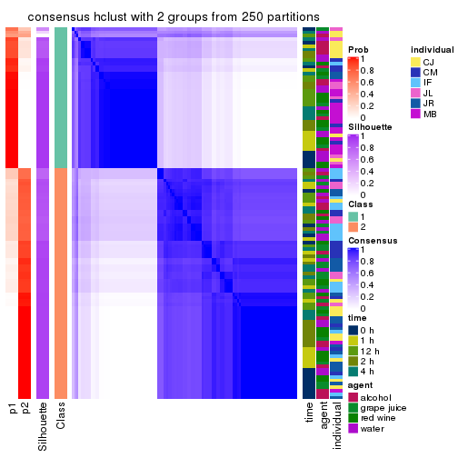</p>

</div>
<div id='tab-SD-hclust-consensus-heatmap-2'>
<pre><code class="r">consensus_heatmap(res, k = 3)
</code></pre>

<p>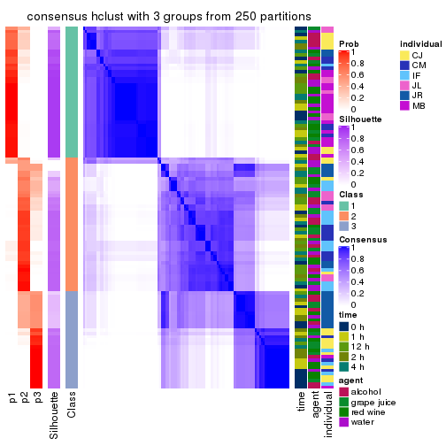</p>

</div>
<div id='tab-SD-hclust-consensus-heatmap-3'>
<pre><code class="r">consensus_heatmap(res, k = 4)
</code></pre>

<p>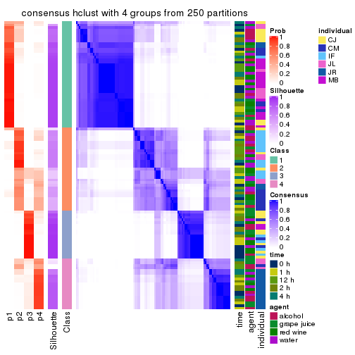</p>

</div>
<div id='tab-SD-hclust-consensus-heatmap-4'>
<pre><code class="r">consensus_heatmap(res, k = 5)
</code></pre>

<p>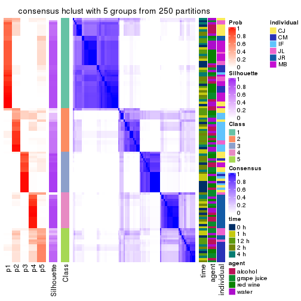</p>

</div>
<div id='tab-SD-hclust-consensus-heatmap-5'>
<pre><code class="r">consensus_heatmap(res, k = 6)
</code></pre>

<p>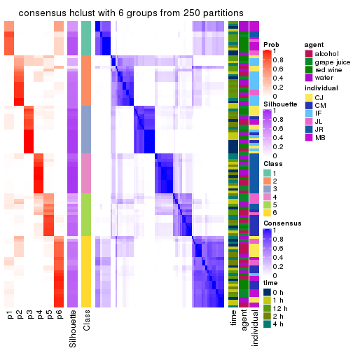</p>

</div>
</div>

Heatmaps for the membership of samples in all partitions to see how consistent they are:


<script>
$( function() {
	$( '#tabs-SD-hclust-membership-heatmap' ).tabs();
} );
</script>
<div id='tabs-SD-hclust-membership-heatmap'>
<ul>
<li><a href='#tab-SD-hclust-membership-heatmap-1'>k = 2</a></li>
<li><a href='#tab-SD-hclust-membership-heatmap-2'>k = 3</a></li>
<li><a href='#tab-SD-hclust-membership-heatmap-3'>k = 4</a></li>
<li><a href='#tab-SD-hclust-membership-heatmap-4'>k = 5</a></li>
<li><a href='#tab-SD-hclust-membership-heatmap-5'>k = 6</a></li>
</ul>
<div id='tab-SD-hclust-membership-heatmap-1'>
<pre><code class="r">membership_heatmap(res, k = 2)
</code></pre>

<p>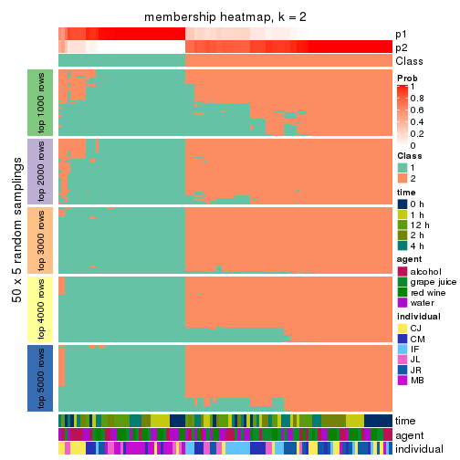</p>

</div>
<div id='tab-SD-hclust-membership-heatmap-2'>
<pre><code class="r">membership_heatmap(res, k = 3)
</code></pre>

<p>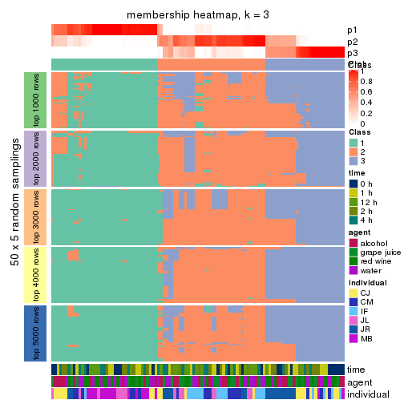</p>

</div>
<div id='tab-SD-hclust-membership-heatmap-3'>
<pre><code class="r">membership_heatmap(res, k = 4)
</code></pre>

<p>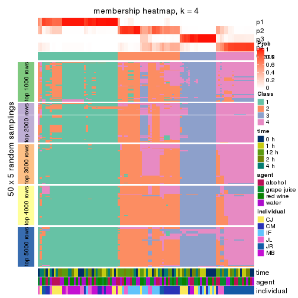</p>

</div>
<div id='tab-SD-hclust-membership-heatmap-4'>
<pre><code class="r">membership_heatmap(res, k = 5)
</code></pre>

<p>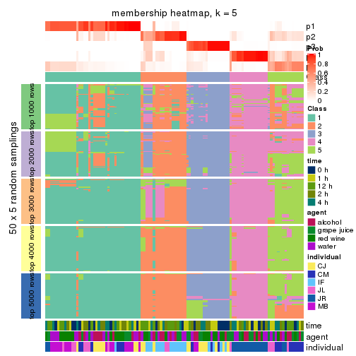</p>

</div>
<div id='tab-SD-hclust-membership-heatmap-5'>
<pre><code class="r">membership_heatmap(res, k = 6)
</code></pre>

<p>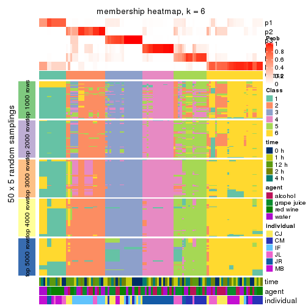</p>

</div>
</div>

As soon as we have had the classes for columns, we can look for signatures
which are significantly different between classes which can be candidate marks
for certain classes. Following are the heatmaps for signatures.


Signature heatmaps where rows are scaled:


<script>
$( function() {
	$( '#tabs-SD-hclust-get-signatures' ).tabs();
} );
</script>
<div id='tabs-SD-hclust-get-signatures'>
<ul>
<li><a href='#tab-SD-hclust-get-signatures-1'>k = 2</a></li>
<li><a href='#tab-SD-hclust-get-signatures-2'>k = 3</a></li>
<li><a href='#tab-SD-hclust-get-signatures-3'>k = 4</a></li>
<li><a href='#tab-SD-hclust-get-signatures-4'>k = 5</a></li>
<li><a href='#tab-SD-hclust-get-signatures-5'>k = 6</a></li>
</ul>
<div id='tab-SD-hclust-get-signatures-1'>
<pre><code class="r">get_signatures(res, k = 2)
</code></pre>

<p>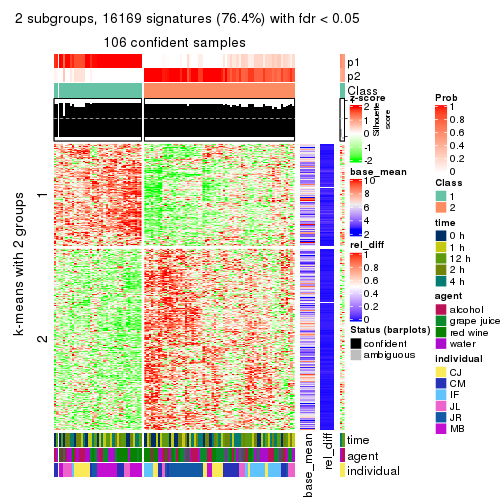</p>

</div>
<div id='tab-SD-hclust-get-signatures-2'>
<pre><code class="r">get_signatures(res, k = 3)
</code></pre>

<p>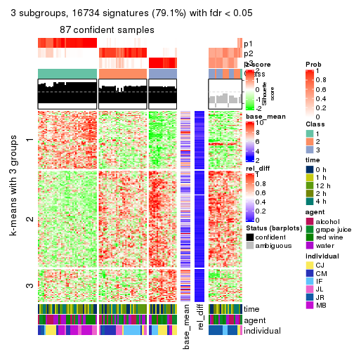</p>

</div>
<div id='tab-SD-hclust-get-signatures-3'>
<pre><code class="r">get_signatures(res, k = 4)
</code></pre>

<p>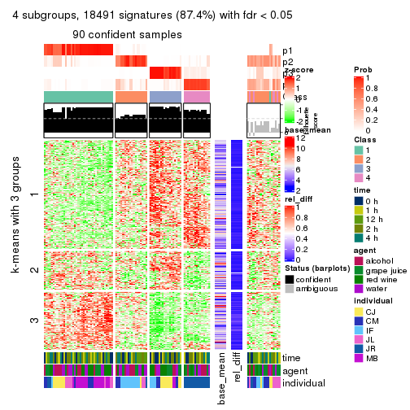</p>

</div>
<div id='tab-SD-hclust-get-signatures-4'>
<pre><code class="r">get_signatures(res, k = 5)
</code></pre>

<p>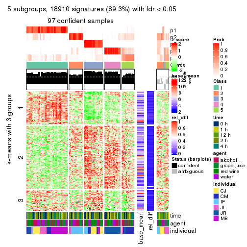</p>

</div>
<div id='tab-SD-hclust-get-signatures-5'>
<pre><code class="r">get_signatures(res, k = 6)
</code></pre>

<p>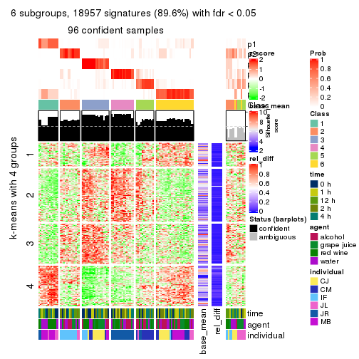</p>

</div>
</div>


Signature heatmaps where rows are not scaled:


<script>
$( function() {
	$( '#tabs-SD-hclust-get-signatures-no-scale' ).tabs();
} );
</script>
<div id='tabs-SD-hclust-get-signatures-no-scale'>
<ul>
<li><a href='#tab-SD-hclust-get-signatures-no-scale-1'>k = 2</a></li>
<li><a href='#tab-SD-hclust-get-signatures-no-scale-2'>k = 3</a></li>
<li><a href='#tab-SD-hclust-get-signatures-no-scale-3'>k = 4</a></li>
<li><a href='#tab-SD-hclust-get-signatures-no-scale-4'>k = 5</a></li>
<li><a href='#tab-SD-hclust-get-signatures-no-scale-5'>k = 6</a></li>
</ul>
<div id='tab-SD-hclust-get-signatures-no-scale-1'>
<pre><code class="r">get_signatures(res, k = 2, scale_rows = FALSE)
</code></pre>

<p>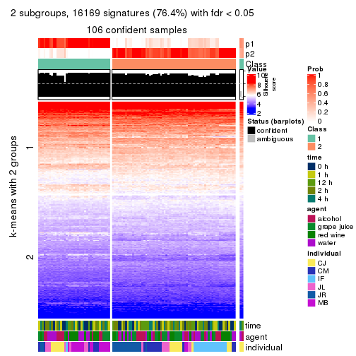</p>

</div>
<div id='tab-SD-hclust-get-signatures-no-scale-2'>
<pre><code class="r">get_signatures(res, k = 3, scale_rows = FALSE)
</code></pre>

<p>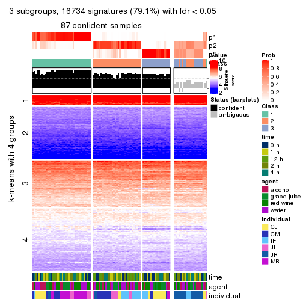</p>

</div>
<div id='tab-SD-hclust-get-signatures-no-scale-3'>
<pre><code class="r">get_signatures(res, k = 4, scale_rows = FALSE)
</code></pre>

<p>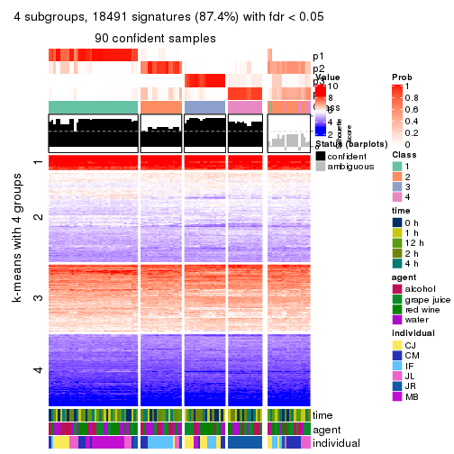</p>

</div>
<div id='tab-SD-hclust-get-signatures-no-scale-4'>
<pre><code class="r">get_signatures(res, k = 5, scale_rows = FALSE)
</code></pre>

<p>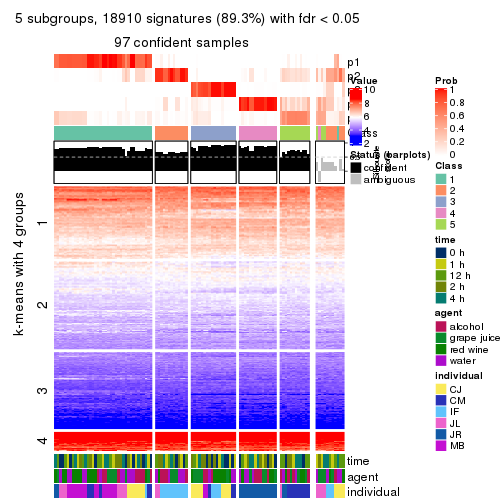</p>

</div>
<div id='tab-SD-hclust-get-signatures-no-scale-5'>
<pre><code class="r">get_signatures(res, k = 6, scale_rows = FALSE)
</code></pre>

<p>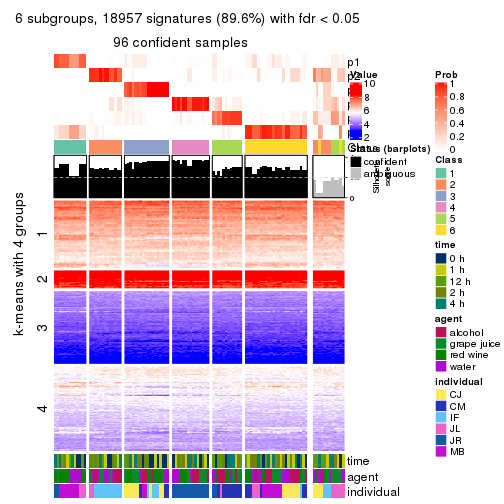</p>

</div>
</div>


Compare the overlap of signatures from different k:

```r
compare_signatures(res)
```

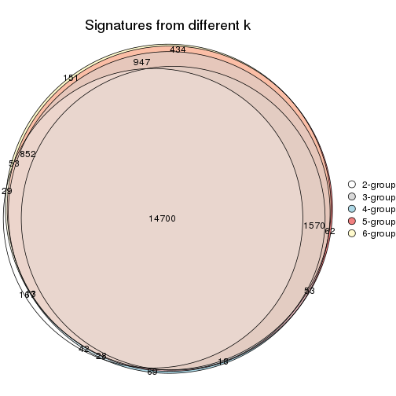

`get_signature()` returns a data frame invisibly. TO get the list of signatures, the function
call should be assigned to a variable explicitly. In following code, if `plot` argument is set
to `FALSE`, no heatmap is plotted while only the differential analysis is performed.

```r
# code only for demonstration
tb = get_signature(res, k = ..., plot = FALSE)
```

An example of the output of `tb` is:

```
#>   which_row         fdr    mean_1    mean_2 scaled_mean_1 scaled_mean_2 km
#> 1        38 0.042760348  8.373488  9.131774    -0.5533452     0.5164555  1
#> 2        40 0.018707592  7.106213  8.469186    -0.6173731     0.5762149  1
#> 3        55 0.019134737 10.221463 11.207825    -0.6159697     0.5749050  1
#> 4        59 0.006059896  5.921854  7.869574    -0.6899429     0.6439467  1
#> 5        60 0.018055526  8.928898 10.211722    -0.6204761     0.5791110  1
#> 6        98 0.009384629 15.714769 14.887706     0.6635654    -0.6193277  2
...
```

The columns in `tb` are:

1. `which_row`: row indices corresponding to the input matrix.
2. `fdr`: FDR for the differential test. 
3. `mean_x`: The mean value in group x.
4. `scaled_mean_x`: The mean value in group x after rows are scaled.
5. `km`: Row groups if k-means clustering is applied to rows.


UMAP plot which shows how samples are separated.


<script>
$( function() {
	$( '#tabs-SD-hclust-dimension-reduction' ).tabs();
} );
</script>
<div id='tabs-SD-hclust-dimension-reduction'>
<ul>
<li><a href='#tab-SD-hclust-dimension-reduction-1'>k = 2</a></li>
<li><a href='#tab-SD-hclust-dimension-reduction-2'>k = 3</a></li>
<li><a href='#tab-SD-hclust-dimension-reduction-3'>k = 4</a></li>
<li><a href='#tab-SD-hclust-dimension-reduction-4'>k = 5</a></li>
<li><a href='#tab-SD-hclust-dimension-reduction-5'>k = 6</a></li>
</ul>
<div id='tab-SD-hclust-dimension-reduction-1'>
<pre><code class="r">dimension_reduction(res, k = 2, method = &quot;UMAP&quot;)
</code></pre>

<p>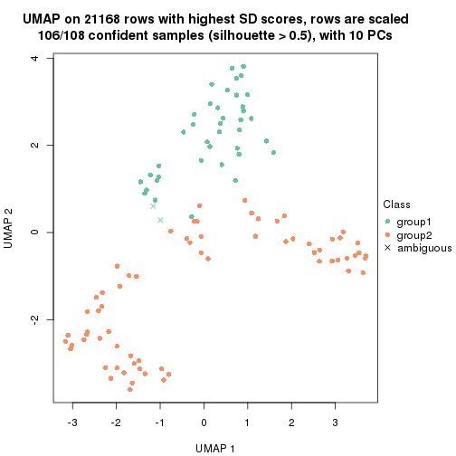</p>

</div>
<div id='tab-SD-hclust-dimension-reduction-2'>
<pre><code class="r">dimension_reduction(res, k = 3, method = &quot;UMAP&quot;)
</code></pre>

<p>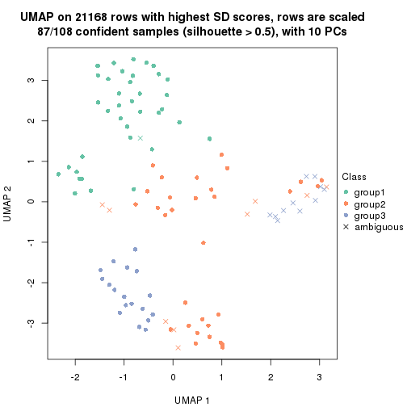</p>

</div>
<div id='tab-SD-hclust-dimension-reduction-3'>
<pre><code class="r">dimension_reduction(res, k = 4, method = &quot;UMAP&quot;)
</code></pre>

<p>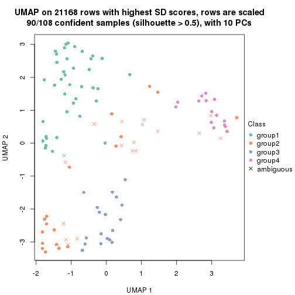</p>

</div>
<div id='tab-SD-hclust-dimension-reduction-4'>
<pre><code class="r">dimension_reduction(res, k = 5, method = &quot;UMAP&quot;)
</code></pre>

<p>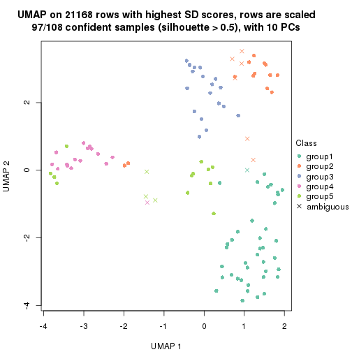</p>

</div>
<div id='tab-SD-hclust-dimension-reduction-5'>
<pre><code class="r">dimension_reduction(res, k = 6, method = &quot;UMAP&quot;)
</code></pre>

<p>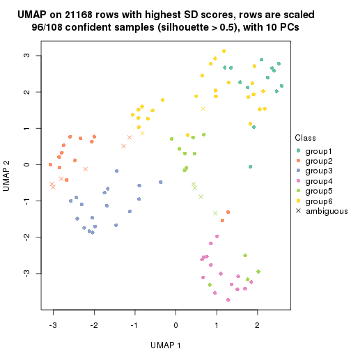</p>

</div>
</div>


Following heatmap shows how subgroups are split when increasing `k`:

```r
collect_classes(res)
```

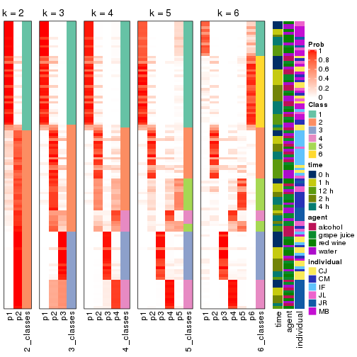


Test correlation between subgroups and known annotations. If the known
annotation is numeric, one-way ANOVA test is applied, and if the known
annotation is discrete, chi-squared contingency table test is applied.

```r
test_to_known_factors(res)
```

```
#>             n time(p) agent(p) individual(p) k
#> SD:hclust 106   0.986    0.657      9.75e-07 2
#> SD:hclust  87   0.459    0.505      4.81e-06 3
#> SD:hclust  90   0.629    0.624      5.76e-19 4
#> SD:hclust  97   0.862    0.861      8.16e-27 5
#> SD:hclust  96   0.884    0.334      1.45e-26 6
```


If matrix rows can be associated to genes, consider to use `GO_Enrichment(res,
...)` to perform function enrichment for the signature genes.


 

---------------------------------------------------


### SD:kmeans**


The object with results only for a single top-value method and a single partition method 
can be extracted as:

```r
res = res_list["SD", "kmeans"]
# you can also extract it by
# res = res_list["SD:kmeans"]
```

A summary of `res` and all the functions that can be applied to it:

```r
res
```

```
#> A 'ConsensusPartition' object with k = 2, 3, 4, 5, 6.
#>   On a matrix with 21168 rows and 108 columns.
#>   Top rows (1000, 2000, 3000, 4000, 5000) are extracted by 'SD' method.
#>   Subgroups are detected by 'kmeans' method.
#>   Performed in total 1250 partitions by row resampling.
#>   Best k for subgroups seems to be 2.
#> 
#> Following methods can be applied to this 'ConsensusPartition' object:
#>  [1] "cola_report"             "collect_classes"         "collect_plots"          
#>  [4] "collect_stats"           "colnames"                "compare_signatures"     
#>  [7] "consensus_heatmap"       "dimension_reduction"     "functional_enrichment"  
#> [10] "get_anno_col"            "get_anno"                "get_classes"            
#> [13] "get_consensus"           "get_matrix"              "get_membership"         
#> [16] "get_param"               "get_signatures"          "get_stats"              
#> [19] "is_best_k"               "is_stable_k"             "membership_heatmap"     
#> [22] "ncol"                    "nrow"                    "plot_ecdf"              
#> [25] "rownames"                "select_partition_number" "show"                   
#> [28] "suggest_best_k"          "test_to_known_factors"
```

`collect_plots()` function collects all the plots made from `res` for all `k` (number of partitions)
into one single page to provide an easy and fast comparison between different `k`.

```r
collect_plots(res)
```

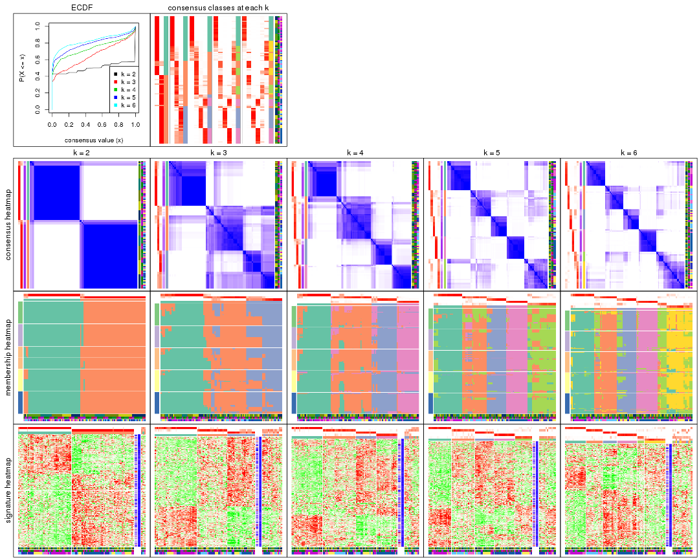

The plots are:

- The first row: a plot of the ECDF (Empirical cumulative distribution
  function) curves of the consensus matrix for each `k` and the heatmap of
  predicted classes for each `k`.
- The second row: heatmaps of the consensus matrix for each `k`.
- The third row: heatmaps of the membership matrix for each `k`.
- The fouth row: heatmaps of the signatures for each `k`.

All the plots in panels can be made by individual functions and they are
plotted later in this section.

`select_partition_number()` produces several plots showing different
statistics for choosing "optimized" `k`. There are following statistics:

- ECDF curves of the consensus matrix for each `k`;
- 1-PAC. [The PAC
  score](https://en.wikipedia.org/wiki/Consensus_clustering#Over-interpretation_potential_of_consensus_clustering)
  measures the proportion of the ambiguous subgrouping.
- Mean silhouette score.
- Concordance. The mean probability of fiting the consensus class ids in all
  partitions.
- Area increased. Denote $A_k$ as the area under the ECDF curve for current
  `k`, the area increased is defined as $A_k - A_{k-1}$.
- Rand index. The percent of pairs of samples that are both in a same cluster
  or both are not in a same cluster in the partition of k and k-1.
- Jaccard index. The ratio of pairs of samples are both in a same cluster in
  the partition of k and k-1 and the pairs of samples are both in a same
  cluster in the partition k or k-1.

The detailed explanations of these statistics can be found in [the cola
vignette](http://bioconductor.org/packages/devel/bioc/vignettes/cola/inst/doc/cola.html#toc_13).

Generally speaking, lower PAC score, higher mean silhouette score or higher
concordance corresponds to better partition. Rand index and Jaccard index
measure how similar the current partition is compared to partition with `k-1`.
If they are too similar, we won't accept `k` is better than `k-1`.

```r
select_partition_number(res)
```

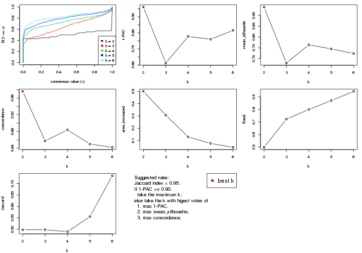

The numeric values for all these statistics can be obtained by `get_stats()`.

```r
get_stats(res)
```

```
#>   k 1-PAC mean_silhouette concordance area_increased  Rand Jaccard
#> 2 2 0.961           0.939       0.976         0.5008 0.498   0.498
#> 3 3 0.612           0.680       0.857         0.3067 0.723   0.498
#> 4 4 0.778           0.764       0.884         0.1291 0.799   0.490
#> 5 5 0.760           0.745       0.850         0.0765 0.870   0.555
#> 6 6 0.815           0.724       0.842         0.0442 0.944   0.734
```

`suggest_best_k()` suggests the best $k$ based on these statistics. The rules are as follows:

- All $k$ with Jaccard index larger than 0.95 are removed because the increase of
  the partition number does not provides enough extra information. If all $k$ are removed,
  the best $k$ is assigned by `NA`.
- For $k$ with 1-PAC larger than 0.9, the maximal $k$ is taken as the "best k". Other $k$ is called "optional k".
- If it does not fit the second rule. The $k$ with the highest vote of highest
  1-PAC, mean silhouette and concordance is taken as the "best k".

```r
suggest_best_k(res)
```

```
#> [1] 2
```


Following shows the table of the partitions (You need to click the **show/hide
code output** link to see it). The membership matrix (columns with name `p*`)
is inferred by
[`clue::cl_consensus()`](https://www.rdocumentation.org/link/cl_consensus?package=clue)
function with the `SE` method. Basically the value in the membership matrix
represents the probability to belong to a certain group. The finall class
label for an item is determined with the group with highest probability it
belongs to.

In `get_classes()` function, the entropy is calculated from the membership
matrix and the silhouette score is calculated from the consensus matrix.


<script>
$( function() {
	$( '#tabs-SD-kmeans-get-classes' ).tabs();
} );
</script>
<div id='tabs-SD-kmeans-get-classes'>
<ul>
<li><a href='#tab-SD-kmeans-get-classes-1'>k = 2</a></li>
<li><a href='#tab-SD-kmeans-get-classes-2'>k = 3</a></li>
<li><a href='#tab-SD-kmeans-get-classes-3'>k = 4</a></li>
<li><a href='#tab-SD-kmeans-get-classes-4'>k = 5</a></li>
<li><a href='#tab-SD-kmeans-get-classes-5'>k = 6</a></li>
</ul>

<div id='tab-SD-kmeans-get-classes-1'>
<p><a id='tab-SD-kmeans-get-classes-1-a' style='color:#0366d6' href='#'>show/hide code output</a></p>
<pre><code class="r">cbind(get_classes(res, k = 2), get_membership(res, k = 2))
</code></pre>

<pre><code>#&gt;          class entropy silhouette    p1    p2
#&gt; GSM87863     1   0.000      0.971 1.000 0.000
#&gt; GSM87887     1   0.000      0.971 1.000 0.000
#&gt; GSM87896     2   0.000      0.978 0.000 1.000
#&gt; GSM87934     2   0.000      0.978 0.000 1.000
#&gt; GSM87943     2   0.000      0.978 0.000 1.000
#&gt; GSM87853     2   0.000      0.978 0.000 1.000
#&gt; GSM87906     2   0.000      0.978 0.000 1.000
#&gt; GSM87920     1   0.000      0.971 1.000 0.000
#&gt; GSM87924     2   0.000      0.978 0.000 1.000
#&gt; GSM87858     2   0.000      0.978 0.000 1.000
#&gt; GSM87882     2   0.000      0.978 0.000 1.000
#&gt; GSM87891     2   0.000      0.978 0.000 1.000
#&gt; GSM87917     1   0.000      0.971 1.000 0.000
#&gt; GSM87929     2   0.000      0.978 0.000 1.000
#&gt; GSM87948     1   0.000      0.971 1.000 0.000
#&gt; GSM87868     1   0.000      0.971 1.000 0.000
#&gt; GSM87873     2   0.000      0.978 0.000 1.000
#&gt; GSM87901     1   0.881      0.572 0.700 0.300
#&gt; GSM87910     1   0.000      0.971 1.000 0.000
#&gt; GSM87938     2   0.000      0.978 0.000 1.000
#&gt; GSM87953     1   0.000      0.971 1.000 0.000
#&gt; GSM87864     1   0.000      0.971 1.000 0.000
#&gt; GSM87888     2   0.000      0.978 0.000 1.000
#&gt; GSM87897     2   0.000      0.978 0.000 1.000
#&gt; GSM87935     2   0.000      0.978 0.000 1.000
#&gt; GSM87944     1   0.000      0.971 1.000 0.000
#&gt; GSM87854     2   0.000      0.978 0.000 1.000
#&gt; GSM87878     1   0.000      0.971 1.000 0.000
#&gt; GSM87907     2   0.000      0.978 0.000 1.000
#&gt; GSM87921     2   0.000      0.978 0.000 1.000
#&gt; GSM87925     2   0.000      0.978 0.000 1.000
#&gt; GSM87957     1   0.000      0.971 1.000 0.000
#&gt; GSM87859     2   0.000      0.978 0.000 1.000
#&gt; GSM87883     1   0.000      0.971 1.000 0.000
#&gt; GSM87892     2   0.000      0.978 0.000 1.000
#&gt; GSM87930     2   0.000      0.978 0.000 1.000
#&gt; GSM87949     1   0.000      0.971 1.000 0.000
#&gt; GSM87869     1   0.000      0.971 1.000 0.000
#&gt; GSM87874     2   0.000      0.978 0.000 1.000
#&gt; GSM87902     1   0.958      0.393 0.620 0.380
#&gt; GSM87911     2   0.706      0.748 0.192 0.808
#&gt; GSM87939     2   0.000      0.978 0.000 1.000
#&gt; GSM87954     1   0.000      0.971 1.000 0.000
#&gt; GSM87865     1   0.000      0.971 1.000 0.000
#&gt; GSM87889     1   0.000      0.971 1.000 0.000
#&gt; GSM87898     1   0.000      0.971 1.000 0.000
#&gt; GSM87915     1   0.000      0.971 1.000 0.000
#&gt; GSM87936     2   0.000      0.978 0.000 1.000
#&gt; GSM87945     2   0.000      0.978 0.000 1.000
#&gt; GSM87855     2   0.000      0.978 0.000 1.000
#&gt; GSM87879     2   0.000      0.978 0.000 1.000
#&gt; GSM87922     2   0.000      0.978 0.000 1.000
#&gt; GSM87926     2   0.000      0.978 0.000 1.000
#&gt; GSM87958     1   0.000      0.971 1.000 0.000
#&gt; GSM87860     2   0.000      0.978 0.000 1.000
#&gt; GSM87884     1   0.000      0.971 1.000 0.000
#&gt; GSM87893     2   0.000      0.978 0.000 1.000
#&gt; GSM87918     1   0.876      0.579 0.704 0.296
#&gt; GSM87931     2   0.000      0.978 0.000 1.000
#&gt; GSM87950     1   0.000      0.971 1.000 0.000
#&gt; GSM87870     1   0.000      0.971 1.000 0.000
#&gt; GSM87875     2   0.000      0.978 0.000 1.000
#&gt; GSM87903     2   0.000      0.978 0.000 1.000
#&gt; GSM87912     1   0.000      0.971 1.000 0.000
#&gt; GSM87940     2   0.000      0.978 0.000 1.000
#&gt; GSM87866     1   0.000      0.971 1.000 0.000
#&gt; GSM87899     2   0.000      0.978 0.000 1.000
#&gt; GSM87937     2   0.000      0.978 0.000 1.000
#&gt; GSM87946     1   0.000      0.971 1.000 0.000
#&gt; GSM87856     2   0.000      0.978 0.000 1.000
#&gt; GSM87880     2   0.000      0.978 0.000 1.000
#&gt; GSM87908     1   0.969      0.350 0.604 0.396
#&gt; GSM87923     2   0.000      0.978 0.000 1.000
#&gt; GSM87927     2   0.000      0.978 0.000 1.000
#&gt; GSM87959     1   0.000      0.971 1.000 0.000
#&gt; GSM87861     2   0.000      0.978 0.000 1.000
#&gt; GSM87885     1   0.000      0.971 1.000 0.000
#&gt; GSM87894     1   0.000      0.971 1.000 0.000
#&gt; GSM87932     1   0.000      0.971 1.000 0.000
#&gt; GSM87951     1   0.000      0.971 1.000 0.000
#&gt; GSM87871     2   0.671      0.772 0.176 0.824
#&gt; GSM87876     1   0.000      0.971 1.000 0.000
#&gt; GSM87904     2   0.000      0.978 0.000 1.000
#&gt; GSM87913     1   0.000      0.971 1.000 0.000
#&gt; GSM87941     2   0.000      0.978 0.000 1.000
#&gt; GSM87955     1   0.000      0.971 1.000 0.000
#&gt; GSM87867     1   0.000      0.971 1.000 0.000
#&gt; GSM87890     2   0.000      0.978 0.000 1.000
#&gt; GSM87900     2   0.000      0.978 0.000 1.000
#&gt; GSM87916     2   0.000      0.978 0.000 1.000
#&gt; GSM87947     1   0.000      0.971 1.000 0.000
#&gt; GSM87857     2   0.000      0.978 0.000 1.000
#&gt; GSM87881     2   0.000      0.978 0.000 1.000
#&gt; GSM87909     1   0.000      0.971 1.000 0.000
#&gt; GSM87928     1   0.000      0.971 1.000 0.000
#&gt; GSM87960     1   0.000      0.971 1.000 0.000
#&gt; GSM87862     2   0.000      0.978 0.000 1.000
#&gt; GSM87886     1   0.000      0.971 1.000 0.000
#&gt; GSM87895     2   0.000      0.978 0.000 1.000
#&gt; GSM87919     1   0.000      0.971 1.000 0.000
#&gt; GSM87933     2   0.000      0.978 0.000 1.000
#&gt; GSM87952     1   0.000      0.971 1.000 0.000
#&gt; GSM87872     2   0.000      0.978 0.000 1.000
#&gt; GSM87877     1   0.000      0.971 1.000 0.000
#&gt; GSM87905     1   0.000      0.971 1.000 0.000
#&gt; GSM87914     2   0.978      0.277 0.412 0.588
#&gt; GSM87942     2   0.978      0.277 0.412 0.588
#&gt; GSM87956     1   0.000      0.971 1.000 0.000
</code></pre>

<script>
$('#tab-SD-kmeans-get-classes-1-a').parent().next().next().hide();
$('#tab-SD-kmeans-get-classes-1-a').click(function(){
  $('#tab-SD-kmeans-get-classes-1-a').parent().next().next().toggle();
  return(false);
});
</script>
</div>

<div id='tab-SD-kmeans-get-classes-2'>
<p><a id='tab-SD-kmeans-get-classes-2-a' style='color:#0366d6' href='#'>show/hide code output</a></p>
<pre><code class="r">cbind(get_classes(res, k = 3), get_membership(res, k = 3))
</code></pre>

<pre><code>#&gt;          class entropy silhouette    p1    p2    p3
#&gt; GSM87863     2  0.5926     0.3456 0.356 0.644 0.000
#&gt; GSM87887     1  0.4178     0.8223 0.828 0.172 0.000
#&gt; GSM87896     3  0.0000     0.7015 0.000 0.000 1.000
#&gt; GSM87934     3  0.6225     0.5064 0.000 0.432 0.568
#&gt; GSM87943     3  0.5138     0.4730 0.000 0.252 0.748
#&gt; GSM87853     3  0.1411     0.6944 0.000 0.036 0.964
#&gt; GSM87906     2  0.1163     0.7540 0.000 0.972 0.028
#&gt; GSM87920     2  0.5835     0.3966 0.340 0.660 0.000
#&gt; GSM87924     3  0.2448     0.6882 0.000 0.076 0.924
#&gt; GSM87858     3  0.0000     0.7015 0.000 0.000 1.000
#&gt; GSM87882     2  0.3412     0.6786 0.000 0.876 0.124
#&gt; GSM87891     3  0.0000     0.7015 0.000 0.000 1.000
#&gt; GSM87917     1  0.0000     0.9373 1.000 0.000 0.000
#&gt; GSM87929     2  0.5016     0.4380 0.000 0.760 0.240
#&gt; GSM87948     1  0.1643     0.9174 0.956 0.044 0.000
#&gt; GSM87868     1  0.0000     0.9373 1.000 0.000 0.000
#&gt; GSM87873     3  0.0000     0.7015 0.000 0.000 1.000
#&gt; GSM87901     2  0.1453     0.7560 0.024 0.968 0.008
#&gt; GSM87910     1  0.0000     0.9373 1.000 0.000 0.000
#&gt; GSM87938     3  0.6225     0.5064 0.000 0.432 0.568
#&gt; GSM87953     1  0.0000     0.9373 1.000 0.000 0.000
#&gt; GSM87864     1  0.5678     0.6129 0.684 0.316 0.000
#&gt; GSM87888     2  0.1643     0.7497 0.000 0.956 0.044
#&gt; GSM87897     2  0.1289     0.7533 0.000 0.968 0.032
#&gt; GSM87935     3  0.6225     0.5064 0.000 0.432 0.568
#&gt; GSM87944     1  0.0000     0.9373 1.000 0.000 0.000
#&gt; GSM87854     2  0.4750     0.5906 0.000 0.784 0.216
#&gt; GSM87878     1  0.4235     0.8189 0.824 0.176 0.000
#&gt; GSM87907     3  0.5859     0.5502 0.000 0.344 0.656
#&gt; GSM87921     2  0.0424     0.7529 0.000 0.992 0.008
#&gt; GSM87925     3  0.6225     0.5064 0.000 0.432 0.568
#&gt; GSM87957     1  0.2356     0.9029 0.928 0.072 0.000
#&gt; GSM87859     3  0.0000     0.7015 0.000 0.000 1.000
#&gt; GSM87883     1  0.0000     0.9373 1.000 0.000 0.000
#&gt; GSM87892     3  0.0000     0.7015 0.000 0.000 1.000
#&gt; GSM87930     3  0.6215     0.5103 0.000 0.428 0.572
#&gt; GSM87949     1  0.0000     0.9373 1.000 0.000 0.000
#&gt; GSM87869     1  0.0000     0.9373 1.000 0.000 0.000
#&gt; GSM87874     3  0.0000     0.7015 0.000 0.000 1.000
#&gt; GSM87902     2  0.1774     0.7559 0.024 0.960 0.016
#&gt; GSM87911     2  0.1399     0.7550 0.004 0.968 0.028
#&gt; GSM87939     3  0.6302     0.4027 0.000 0.480 0.520
#&gt; GSM87954     1  0.0000     0.9373 1.000 0.000 0.000
#&gt; GSM87865     1  0.5706     0.6055 0.680 0.320 0.000
#&gt; GSM87889     2  0.4555     0.6294 0.200 0.800 0.000
#&gt; GSM87898     1  0.4974     0.7407 0.764 0.236 0.000
#&gt; GSM87915     1  0.0000     0.9373 1.000 0.000 0.000
#&gt; GSM87936     3  0.6225     0.5064 0.000 0.432 0.568
#&gt; GSM87945     3  0.1529     0.6935 0.000 0.040 0.960
#&gt; GSM87855     3  0.2261     0.6788 0.000 0.068 0.932
#&gt; GSM87879     2  0.3192     0.6924 0.000 0.888 0.112
#&gt; GSM87922     2  0.5810     0.1925 0.000 0.664 0.336
#&gt; GSM87926     2  0.6291    -0.2888 0.000 0.532 0.468
#&gt; GSM87958     1  0.0000     0.9373 1.000 0.000 0.000
#&gt; GSM87860     3  0.1529     0.6935 0.000 0.040 0.960
#&gt; GSM87884     1  0.0000     0.9373 1.000 0.000 0.000
#&gt; GSM87893     3  0.0000     0.7015 0.000 0.000 1.000
#&gt; GSM87918     2  0.1453     0.7560 0.024 0.968 0.008
#&gt; GSM87931     3  0.6244     0.4922 0.000 0.440 0.560
#&gt; GSM87950     1  0.0000     0.9373 1.000 0.000 0.000
#&gt; GSM87870     1  0.5138     0.7200 0.748 0.252 0.000
#&gt; GSM87875     3  0.2261     0.6788 0.000 0.068 0.932
#&gt; GSM87903     2  0.1289     0.7534 0.000 0.968 0.032
#&gt; GSM87912     1  0.0000     0.9373 1.000 0.000 0.000
#&gt; GSM87940     3  0.6225     0.5064 0.000 0.432 0.568
#&gt; GSM87866     1  0.3267     0.8733 0.884 0.116 0.000
#&gt; GSM87899     2  0.6095     0.2050 0.000 0.608 0.392
#&gt; GSM87937     3  0.6225     0.5064 0.000 0.432 0.568
#&gt; GSM87946     1  0.0000     0.9373 1.000 0.000 0.000
#&gt; GSM87856     3  0.5138     0.4730 0.000 0.252 0.748
#&gt; GSM87880     2  0.1643     0.7497 0.000 0.956 0.044
#&gt; GSM87908     2  0.1774     0.7559 0.024 0.960 0.016
#&gt; GSM87923     2  0.5926     0.1885 0.000 0.644 0.356
#&gt; GSM87927     2  0.1643     0.7297 0.000 0.956 0.044
#&gt; GSM87959     1  0.0000     0.9373 1.000 0.000 0.000
#&gt; GSM87861     3  0.1529     0.6935 0.000 0.040 0.960
#&gt; GSM87885     2  0.4346     0.6429 0.184 0.816 0.000
#&gt; GSM87894     1  0.2959     0.8848 0.900 0.100 0.000
#&gt; GSM87932     1  0.0000     0.9373 1.000 0.000 0.000
#&gt; GSM87951     1  0.0000     0.9373 1.000 0.000 0.000
#&gt; GSM87871     2  0.2031     0.7533 0.032 0.952 0.016
#&gt; GSM87876     2  0.4555     0.6294 0.200 0.800 0.000
#&gt; GSM87904     2  0.6291    -0.0772 0.000 0.532 0.468
#&gt; GSM87913     1  0.3267     0.8733 0.884 0.116 0.000
#&gt; GSM87941     2  0.1860     0.7234 0.000 0.948 0.052
#&gt; GSM87955     1  0.0000     0.9373 1.000 0.000 0.000
#&gt; GSM87867     2  0.5098     0.5817 0.248 0.752 0.000
#&gt; GSM87890     3  0.6244     0.4922 0.000 0.440 0.560
#&gt; GSM87900     2  0.1411     0.7381 0.000 0.964 0.036
#&gt; GSM87916     2  0.6252    -0.2174 0.000 0.556 0.444
#&gt; GSM87947     1  0.2356     0.9029 0.928 0.072 0.000
#&gt; GSM87857     3  0.5178     0.4703 0.000 0.256 0.744
#&gt; GSM87881     2  0.0424     0.7529 0.000 0.992 0.008
#&gt; GSM87909     2  0.1529     0.7503 0.040 0.960 0.000
#&gt; GSM87928     1  0.0000     0.9373 1.000 0.000 0.000
#&gt; GSM87960     1  0.0000     0.9373 1.000 0.000 0.000
#&gt; GSM87862     2  0.6026     0.1253 0.000 0.624 0.376
#&gt; GSM87886     1  0.0000     0.9373 1.000 0.000 0.000
#&gt; GSM87895     3  0.5733     0.5656 0.000 0.324 0.676
#&gt; GSM87919     1  0.0000     0.9373 1.000 0.000 0.000
#&gt; GSM87933     3  0.6302     0.4027 0.000 0.480 0.520
#&gt; GSM87952     1  0.0000     0.9373 1.000 0.000 0.000
#&gt; GSM87872     2  0.0424     0.7529 0.000 0.992 0.008
#&gt; GSM87877     1  0.4178     0.8223 0.828 0.172 0.000
#&gt; GSM87905     2  0.6299    -0.0703 0.476 0.524 0.000
#&gt; GSM87914     2  0.0000     0.7502 0.000 1.000 0.000
#&gt; GSM87942     2  0.1411     0.7321 0.000 0.964 0.036
#&gt; GSM87956     1  0.0000     0.9373 1.000 0.000 0.000
</code></pre>

<script>
$('#tab-SD-kmeans-get-classes-2-a').parent().next().next().hide();
$('#tab-SD-kmeans-get-classes-2-a').click(function(){
  $('#tab-SD-kmeans-get-classes-2-a').parent().next().next().toggle();
  return(false);
});
</script>
</div>

<div id='tab-SD-kmeans-get-classes-3'>
<p><a id='tab-SD-kmeans-get-classes-3-a' style='color:#0366d6' href='#'>show/hide code output</a></p>
<pre><code class="r">cbind(get_classes(res, k = 4), get_membership(res, k = 4))
</code></pre>

<pre><code>#&gt;          class entropy silhouette    p1    p2    p3    p4
#&gt; GSM87863     2  0.1211     0.8213 0.000 0.960 0.040 0.000
#&gt; GSM87887     2  0.6062     0.0310 0.452 0.512 0.028 0.008
#&gt; GSM87896     3  0.1716     0.8526 0.000 0.000 0.936 0.064
#&gt; GSM87934     4  0.0921     0.9286 0.000 0.000 0.028 0.972
#&gt; GSM87943     3  0.1302     0.8302 0.000 0.044 0.956 0.000
#&gt; GSM87853     3  0.1118     0.8545 0.000 0.000 0.964 0.036
#&gt; GSM87906     2  0.3808     0.7187 0.000 0.812 0.012 0.176
#&gt; GSM87920     2  0.1411     0.8193 0.020 0.960 0.020 0.000
#&gt; GSM87924     4  0.1302     0.9149 0.000 0.000 0.044 0.956
#&gt; GSM87858     3  0.1716     0.8526 0.000 0.000 0.936 0.064
#&gt; GSM87882     2  0.3398     0.7983 0.000 0.872 0.060 0.068
#&gt; GSM87891     3  0.1716     0.8526 0.000 0.000 0.936 0.064
#&gt; GSM87917     1  0.0000     0.9133 1.000 0.000 0.000 0.000
#&gt; GSM87929     4  0.1004     0.9066 0.000 0.024 0.004 0.972
#&gt; GSM87948     1  0.4855     0.6143 0.712 0.268 0.020 0.000
#&gt; GSM87868     1  0.2563     0.8572 0.908 0.072 0.020 0.000
#&gt; GSM87873     3  0.1716     0.8526 0.000 0.000 0.936 0.064
#&gt; GSM87901     2  0.1042     0.8256 0.000 0.972 0.008 0.020
#&gt; GSM87910     1  0.0000     0.9133 1.000 0.000 0.000 0.000
#&gt; GSM87938     4  0.0921     0.9286 0.000 0.000 0.028 0.972
#&gt; GSM87953     1  0.0000     0.9133 1.000 0.000 0.000 0.000
#&gt; GSM87864     2  0.3991     0.6938 0.172 0.808 0.020 0.000
#&gt; GSM87888     2  0.2840     0.8136 0.000 0.900 0.044 0.056
#&gt; GSM87897     2  0.3895     0.7089 0.000 0.804 0.012 0.184
#&gt; GSM87935     4  0.0921     0.9286 0.000 0.000 0.028 0.972
#&gt; GSM87944     1  0.2563     0.8572 0.908 0.072 0.020 0.000
#&gt; GSM87854     2  0.2319     0.8176 0.000 0.924 0.036 0.040
#&gt; GSM87878     2  0.5655     0.4339 0.316 0.648 0.028 0.008
#&gt; GSM87907     3  0.6878     0.4171 0.000 0.128 0.556 0.316
#&gt; GSM87921     2  0.3672     0.7321 0.000 0.824 0.012 0.164
#&gt; GSM87925     4  0.0921     0.9286 0.000 0.000 0.028 0.972
#&gt; GSM87957     1  0.5108     0.5427 0.672 0.308 0.020 0.000
#&gt; GSM87859     3  0.1716     0.8526 0.000 0.000 0.936 0.064
#&gt; GSM87883     1  0.1913     0.8808 0.940 0.040 0.020 0.000
#&gt; GSM87892     3  0.1716     0.8526 0.000 0.000 0.936 0.064
#&gt; GSM87930     4  0.0921     0.9286 0.000 0.000 0.028 0.972
#&gt; GSM87949     1  0.0000     0.9133 1.000 0.000 0.000 0.000
#&gt; GSM87869     1  0.0000     0.9133 1.000 0.000 0.000 0.000
#&gt; GSM87874     3  0.1716     0.8526 0.000 0.000 0.936 0.064
#&gt; GSM87902     2  0.1042     0.8256 0.000 0.972 0.008 0.020
#&gt; GSM87911     2  0.1520     0.8253 0.000 0.956 0.024 0.020
#&gt; GSM87939     4  0.1256     0.9283 0.000 0.008 0.028 0.964
#&gt; GSM87954     1  0.0000     0.9133 1.000 0.000 0.000 0.000
#&gt; GSM87865     2  0.2909     0.7774 0.092 0.888 0.020 0.000
#&gt; GSM87889     2  0.1722     0.8192 0.000 0.944 0.048 0.008
#&gt; GSM87898     2  0.4623     0.6991 0.168 0.792 0.020 0.020
#&gt; GSM87915     1  0.0000     0.9133 1.000 0.000 0.000 0.000
#&gt; GSM87936     4  0.0921     0.9286 0.000 0.000 0.028 0.972
#&gt; GSM87945     3  0.1022     0.8546 0.000 0.000 0.968 0.032
#&gt; GSM87855     3  0.1022     0.8546 0.000 0.000 0.968 0.032
#&gt; GSM87879     2  0.2996     0.8099 0.000 0.892 0.044 0.064
#&gt; GSM87922     4  0.6265     0.1008 0.000 0.444 0.056 0.500
#&gt; GSM87926     4  0.1174     0.9238 0.000 0.012 0.020 0.968
#&gt; GSM87958     1  0.0000     0.9133 1.000 0.000 0.000 0.000
#&gt; GSM87860     3  0.1209     0.8526 0.000 0.004 0.964 0.032
#&gt; GSM87884     1  0.1913     0.8808 0.940 0.040 0.020 0.000
#&gt; GSM87893     3  0.1716     0.8526 0.000 0.000 0.936 0.064
#&gt; GSM87918     2  0.1042     0.8256 0.000 0.972 0.008 0.020
#&gt; GSM87931     4  0.1256     0.9283 0.000 0.008 0.028 0.964
#&gt; GSM87950     1  0.0000     0.9133 1.000 0.000 0.000 0.000
#&gt; GSM87870     2  0.5323     0.3588 0.352 0.628 0.020 0.000
#&gt; GSM87875     3  0.0817     0.8524 0.000 0.000 0.976 0.024
#&gt; GSM87903     2  0.3808     0.7187 0.000 0.812 0.012 0.176
#&gt; GSM87912     1  0.0000     0.9133 1.000 0.000 0.000 0.000
#&gt; GSM87940     4  0.0921     0.9286 0.000 0.000 0.028 0.972
#&gt; GSM87866     2  0.5606    -0.0528 0.480 0.500 0.020 0.000
#&gt; GSM87899     3  0.7644     0.1743 0.000 0.380 0.412 0.208
#&gt; GSM87937     4  0.0921     0.9286 0.000 0.000 0.028 0.972
#&gt; GSM87946     1  0.0000     0.9133 1.000 0.000 0.000 0.000
#&gt; GSM87856     3  0.1389     0.8300 0.000 0.048 0.952 0.000
#&gt; GSM87880     2  0.2675     0.8165 0.000 0.908 0.044 0.048
#&gt; GSM87908     2  0.1042     0.8256 0.000 0.972 0.008 0.020
#&gt; GSM87923     2  0.6806     0.2628 0.000 0.544 0.112 0.344
#&gt; GSM87927     4  0.2101     0.8696 0.000 0.060 0.012 0.928
#&gt; GSM87959     1  0.0000     0.9133 1.000 0.000 0.000 0.000
#&gt; GSM87861     3  0.1022     0.8546 0.000 0.000 0.968 0.032
#&gt; GSM87885     2  0.1722     0.8192 0.000 0.944 0.048 0.008
#&gt; GSM87894     1  0.5607     0.0389 0.492 0.488 0.020 0.000
#&gt; GSM87932     1  0.0188     0.9111 0.996 0.000 0.000 0.004
#&gt; GSM87951     1  0.0000     0.9133 1.000 0.000 0.000 0.000
#&gt; GSM87871     2  0.0707     0.8240 0.000 0.980 0.020 0.000
#&gt; GSM87876     2  0.1722     0.8192 0.000 0.944 0.048 0.008
#&gt; GSM87904     3  0.6634     0.5355 0.000 0.164 0.624 0.212
#&gt; GSM87913     1  0.5606     0.0589 0.500 0.480 0.020 0.000
#&gt; GSM87941     4  0.1824     0.8765 0.000 0.060 0.004 0.936
#&gt; GSM87955     1  0.0000     0.9133 1.000 0.000 0.000 0.000
#&gt; GSM87867     2  0.1211     0.8213 0.000 0.960 0.040 0.000
#&gt; GSM87890     4  0.1833     0.9166 0.000 0.024 0.032 0.944
#&gt; GSM87900     2  0.4795     0.5476 0.000 0.696 0.012 0.292
#&gt; GSM87916     4  0.1833     0.9166 0.000 0.024 0.032 0.944
#&gt; GSM87947     1  0.5130     0.5352 0.668 0.312 0.020 0.000
#&gt; GSM87857     3  0.1978     0.8194 0.000 0.068 0.928 0.004
#&gt; GSM87881     2  0.2660     0.8163 0.000 0.908 0.036 0.056
#&gt; GSM87909     2  0.1042     0.8256 0.000 0.972 0.008 0.020
#&gt; GSM87928     1  0.0188     0.9111 0.996 0.000 0.000 0.004
#&gt; GSM87960     1  0.0000     0.9133 1.000 0.000 0.000 0.000
#&gt; GSM87862     3  0.7871     0.1658 0.000 0.332 0.384 0.284
#&gt; GSM87886     1  0.0000     0.9133 1.000 0.000 0.000 0.000
#&gt; GSM87895     3  0.6500     0.3820 0.000 0.080 0.544 0.376
#&gt; GSM87919     1  0.0000     0.9133 1.000 0.000 0.000 0.000
#&gt; GSM87933     4  0.1256     0.9283 0.000 0.008 0.028 0.964
#&gt; GSM87952     1  0.0000     0.9133 1.000 0.000 0.000 0.000
#&gt; GSM87872     2  0.1938     0.8179 0.000 0.936 0.012 0.052
#&gt; GSM87877     2  0.5937     0.0208 0.456 0.512 0.028 0.004
#&gt; GSM87905     2  0.1520     0.8229 0.024 0.956 0.000 0.020
#&gt; GSM87914     2  0.2799     0.7810 0.000 0.884 0.008 0.108
#&gt; GSM87942     4  0.3764     0.6959 0.000 0.216 0.000 0.784
#&gt; GSM87956     1  0.0000     0.9133 1.000 0.000 0.000 0.000
</code></pre>

<script>
$('#tab-SD-kmeans-get-classes-3-a').parent().next().next().hide();
$('#tab-SD-kmeans-get-classes-3-a').click(function(){
  $('#tab-SD-kmeans-get-classes-3-a').parent().next().next().toggle();
  return(false);
});
</script>
</div>

<div id='tab-SD-kmeans-get-classes-4'>
<p><a id='tab-SD-kmeans-get-classes-4-a' style='color:#0366d6' href='#'>show/hide code output</a></p>
<pre><code class="r">cbind(get_classes(res, k = 5), get_membership(res, k = 5))
</code></pre>

<pre><code>#&gt;          class entropy silhouette    p1    p2    p3    p4    p5
#&gt; GSM87863     5  0.2583     0.6676 0.000 0.132 0.004 0.000 0.864
#&gt; GSM87887     5  0.2782     0.6848 0.096 0.016 0.004 0.004 0.880
#&gt; GSM87896     3  0.0404     0.9230 0.000 0.000 0.988 0.012 0.000
#&gt; GSM87934     4  0.0162     0.9712 0.000 0.000 0.004 0.996 0.000
#&gt; GSM87943     3  0.4162     0.8078 0.000 0.176 0.768 0.000 0.056
#&gt; GSM87853     3  0.0912     0.9211 0.000 0.000 0.972 0.012 0.016
#&gt; GSM87906     2  0.2077     0.7515 0.000 0.908 0.000 0.008 0.084
#&gt; GSM87920     5  0.3333     0.6147 0.000 0.208 0.004 0.000 0.788
#&gt; GSM87924     4  0.0510     0.9647 0.000 0.000 0.016 0.984 0.000
#&gt; GSM87858     3  0.0404     0.9230 0.000 0.000 0.988 0.012 0.000
#&gt; GSM87882     5  0.4758     0.3507 0.000 0.432 0.004 0.012 0.552
#&gt; GSM87891     3  0.0404     0.9230 0.000 0.000 0.988 0.012 0.000
#&gt; GSM87917     1  0.0404     0.8980 0.988 0.000 0.000 0.000 0.012
#&gt; GSM87929     4  0.0798     0.9620 0.000 0.016 0.000 0.976 0.008
#&gt; GSM87948     5  0.4425     0.0781 0.452 0.004 0.000 0.000 0.544
#&gt; GSM87868     1  0.4440     0.1378 0.528 0.004 0.000 0.000 0.468
#&gt; GSM87873     3  0.0404     0.9230 0.000 0.000 0.988 0.012 0.000
#&gt; GSM87901     2  0.3086     0.7280 0.000 0.816 0.000 0.004 0.180
#&gt; GSM87910     1  0.0404     0.8980 0.988 0.000 0.000 0.000 0.012
#&gt; GSM87938     4  0.0451     0.9707 0.000 0.000 0.004 0.988 0.008
#&gt; GSM87953     1  0.0324     0.8994 0.992 0.000 0.004 0.000 0.004
#&gt; GSM87864     5  0.2608     0.6823 0.020 0.088 0.004 0.000 0.888
#&gt; GSM87888     5  0.4527     0.3828 0.000 0.392 0.000 0.012 0.596
#&gt; GSM87897     2  0.2193     0.7522 0.000 0.900 0.000 0.008 0.092
#&gt; GSM87935     4  0.0162     0.9712 0.000 0.000 0.004 0.996 0.000
#&gt; GSM87944     1  0.4440     0.1378 0.528 0.004 0.000 0.000 0.468
#&gt; GSM87854     5  0.4430     0.3375 0.000 0.456 0.004 0.000 0.540
#&gt; GSM87878     5  0.2709     0.6872 0.084 0.020 0.004 0.004 0.888
#&gt; GSM87907     2  0.5682     0.5411 0.000 0.664 0.156 0.168 0.012
#&gt; GSM87921     2  0.2843     0.7474 0.000 0.848 0.000 0.008 0.144
#&gt; GSM87925     4  0.0162     0.9712 0.000 0.000 0.004 0.996 0.000
#&gt; GSM87957     5  0.4531     0.1587 0.424 0.004 0.004 0.000 0.568
#&gt; GSM87859     3  0.0404     0.9230 0.000 0.000 0.988 0.012 0.000
#&gt; GSM87883     1  0.4288     0.3810 0.612 0.000 0.004 0.000 0.384
#&gt; GSM87892     3  0.0404     0.9230 0.000 0.000 0.988 0.012 0.000
#&gt; GSM87930     4  0.0451     0.9707 0.000 0.000 0.004 0.988 0.008
#&gt; GSM87949     1  0.0000     0.8999 1.000 0.000 0.000 0.000 0.000
#&gt; GSM87869     1  0.1478     0.8659 0.936 0.000 0.000 0.000 0.064
#&gt; GSM87874     3  0.0404     0.9230 0.000 0.000 0.988 0.012 0.000
#&gt; GSM87902     2  0.3123     0.7295 0.000 0.812 0.000 0.004 0.184
#&gt; GSM87911     2  0.3128     0.7325 0.000 0.824 0.004 0.004 0.168
#&gt; GSM87939     4  0.0162     0.9712 0.000 0.000 0.004 0.996 0.000
#&gt; GSM87954     1  0.0324     0.8994 0.992 0.000 0.004 0.000 0.004
#&gt; GSM87865     5  0.2407     0.6798 0.012 0.088 0.004 0.000 0.896
#&gt; GSM87889     5  0.2392     0.6725 0.000 0.104 0.004 0.004 0.888
#&gt; GSM87898     2  0.4595     0.3723 0.008 0.588 0.004 0.000 0.400
#&gt; GSM87915     1  0.0671     0.8975 0.980 0.000 0.004 0.000 0.016
#&gt; GSM87936     4  0.0162     0.9712 0.000 0.000 0.004 0.996 0.000
#&gt; GSM87945     3  0.1518     0.9183 0.000 0.020 0.952 0.012 0.016
#&gt; GSM87855     3  0.2100     0.9116 0.000 0.048 0.924 0.012 0.016
#&gt; GSM87879     5  0.4610     0.3522 0.000 0.432 0.000 0.012 0.556
#&gt; GSM87922     2  0.4932     0.5250 0.000 0.668 0.004 0.280 0.048
#&gt; GSM87926     4  0.0162     0.9699 0.000 0.004 0.000 0.996 0.000
#&gt; GSM87958     1  0.0162     0.8998 0.996 0.000 0.004 0.000 0.000
#&gt; GSM87860     3  0.4110     0.8195 0.000 0.184 0.776 0.012 0.028
#&gt; GSM87884     1  0.4288     0.3810 0.612 0.000 0.004 0.000 0.384
#&gt; GSM87893     3  0.0404     0.9230 0.000 0.000 0.988 0.012 0.000
#&gt; GSM87918     2  0.3123     0.7295 0.000 0.812 0.000 0.004 0.184
#&gt; GSM87931     4  0.0451     0.9707 0.000 0.000 0.004 0.988 0.008
#&gt; GSM87950     1  0.0000     0.8999 1.000 0.000 0.000 0.000 0.000
#&gt; GSM87870     5  0.3148     0.6824 0.060 0.072 0.004 0.000 0.864
#&gt; GSM87875     3  0.3730     0.8642 0.000 0.112 0.828 0.012 0.048
#&gt; GSM87903     2  0.0992     0.7283 0.000 0.968 0.000 0.008 0.024
#&gt; GSM87912     1  0.0671     0.8975 0.980 0.000 0.004 0.000 0.016
#&gt; GSM87940     4  0.0451     0.9707 0.000 0.000 0.004 0.988 0.008
#&gt; GSM87866     5  0.3513     0.6681 0.132 0.036 0.004 0.000 0.828
#&gt; GSM87899     2  0.1278     0.7172 0.000 0.960 0.016 0.004 0.020
#&gt; GSM87937     4  0.0162     0.9712 0.000 0.000 0.004 0.996 0.000
#&gt; GSM87946     1  0.1410     0.8687 0.940 0.000 0.000 0.000 0.060
#&gt; GSM87856     3  0.4162     0.8078 0.000 0.176 0.768 0.000 0.056
#&gt; GSM87880     5  0.4310     0.3940 0.000 0.392 0.000 0.004 0.604
#&gt; GSM87908     2  0.3123     0.7295 0.000 0.812 0.000 0.004 0.184
#&gt; GSM87923     2  0.5843     0.5545 0.000 0.668 0.068 0.208 0.056
#&gt; GSM87927     4  0.0510     0.9626 0.000 0.016 0.000 0.984 0.000
#&gt; GSM87959     1  0.0000     0.8999 1.000 0.000 0.000 0.000 0.000
#&gt; GSM87861     3  0.2100     0.9116 0.000 0.048 0.924 0.012 0.016
#&gt; GSM87885     5  0.2339     0.6742 0.000 0.100 0.004 0.004 0.892
#&gt; GSM87894     5  0.4191     0.6406 0.156 0.060 0.004 0.000 0.780
#&gt; GSM87932     1  0.0771     0.8958 0.976 0.000 0.004 0.000 0.020
#&gt; GSM87951     1  0.0000     0.8999 1.000 0.000 0.000 0.000 0.000
#&gt; GSM87871     5  0.3715     0.5692 0.000 0.260 0.004 0.000 0.736
#&gt; GSM87876     5  0.2233     0.6727 0.000 0.104 0.000 0.004 0.892
#&gt; GSM87904     2  0.5283     0.5478 0.000 0.704 0.192 0.084 0.020
#&gt; GSM87913     5  0.5738     0.4118 0.292 0.104 0.004 0.000 0.600
#&gt; GSM87941     4  0.0510     0.9626 0.000 0.016 0.000 0.984 0.000
#&gt; GSM87955     1  0.0000     0.8999 1.000 0.000 0.000 0.000 0.000
#&gt; GSM87867     5  0.2719     0.6627 0.000 0.144 0.004 0.000 0.852
#&gt; GSM87890     4  0.3516     0.7749 0.000 0.164 0.004 0.812 0.020
#&gt; GSM87900     2  0.2423     0.7524 0.000 0.896 0.000 0.024 0.080
#&gt; GSM87916     4  0.1717     0.9281 0.000 0.052 0.004 0.936 0.008
#&gt; GSM87947     5  0.4333     0.3616 0.352 0.004 0.004 0.000 0.640
#&gt; GSM87857     3  0.4584     0.7375 0.000 0.228 0.716 0.000 0.056
#&gt; GSM87881     5  0.4637     0.2242 0.000 0.452 0.000 0.012 0.536
#&gt; GSM87909     2  0.3266     0.7186 0.000 0.796 0.000 0.004 0.200
#&gt; GSM87928     1  0.0771     0.8958 0.976 0.000 0.004 0.000 0.020
#&gt; GSM87960     1  0.1121     0.8793 0.956 0.000 0.000 0.000 0.044
#&gt; GSM87862     2  0.5291     0.5896 0.000 0.716 0.140 0.124 0.020
#&gt; GSM87886     1  0.1282     0.8799 0.952 0.000 0.004 0.000 0.044
#&gt; GSM87895     2  0.5948     0.5181 0.000 0.632 0.184 0.172 0.012
#&gt; GSM87919     1  0.0404     0.8980 0.988 0.000 0.000 0.000 0.012
#&gt; GSM87933     4  0.0451     0.9707 0.000 0.000 0.004 0.988 0.008
#&gt; GSM87952     1  0.0000     0.8999 1.000 0.000 0.000 0.000 0.000
#&gt; GSM87872     2  0.3563     0.6768 0.000 0.780 0.000 0.012 0.208
#&gt; GSM87877     5  0.2575     0.6846 0.100 0.012 0.000 0.004 0.884
#&gt; GSM87905     2  0.3715     0.6547 0.000 0.736 0.004 0.000 0.260
#&gt; GSM87914     2  0.3242     0.7342 0.000 0.816 0.000 0.012 0.172
#&gt; GSM87942     4  0.3058     0.8391 0.000 0.096 0.000 0.860 0.044
#&gt; GSM87956     1  0.0000     0.8999 1.000 0.000 0.000 0.000 0.000
</code></pre>

<script>
$('#tab-SD-kmeans-get-classes-4-a').parent().next().next().hide();
$('#tab-SD-kmeans-get-classes-4-a').click(function(){
  $('#tab-SD-kmeans-get-classes-4-a').parent().next().next().toggle();
  return(false);
});
</script>
</div>

<div id='tab-SD-kmeans-get-classes-5'>
<p><a id='tab-SD-kmeans-get-classes-5-a' style='color:#0366d6' href='#'>show/hide code output</a></p>
<pre><code class="r">cbind(get_classes(res, k = 6), get_membership(res, k = 6))
</code></pre>

<pre><code>#&gt;          class entropy silhouette    p1    p2    p3    p4    p5    p6
#&gt; GSM87863     6  0.1152     0.7250 0.000 0.044 0.000 0.000 0.004 0.952
#&gt; GSM87887     6  0.3828     0.5685 0.012 0.004 0.000 0.000 0.288 0.696
#&gt; GSM87896     3  0.0291     0.8157 0.000 0.000 0.992 0.004 0.004 0.000
#&gt; GSM87934     4  0.0146     0.9403 0.000 0.000 0.004 0.996 0.000 0.000
#&gt; GSM87943     3  0.4569     0.4003 0.000 0.016 0.516 0.000 0.456 0.012
#&gt; GSM87853     3  0.1082     0.8103 0.000 0.000 0.956 0.004 0.040 0.000
#&gt; GSM87906     2  0.0820     0.7926 0.000 0.972 0.000 0.000 0.016 0.012
#&gt; GSM87920     6  0.3450     0.6112 0.000 0.188 0.000 0.000 0.032 0.780
#&gt; GSM87924     4  0.0692     0.9388 0.000 0.000 0.004 0.976 0.020 0.000
#&gt; GSM87858     3  0.0291     0.8157 0.000 0.000 0.992 0.004 0.004 0.000
#&gt; GSM87882     5  0.3736     0.7992 0.000 0.068 0.000 0.000 0.776 0.156
#&gt; GSM87891     3  0.0291     0.8157 0.000 0.000 0.992 0.004 0.004 0.000
#&gt; GSM87917     1  0.1507     0.9046 0.948 0.012 0.004 0.004 0.028 0.004
#&gt; GSM87929     4  0.1152     0.9338 0.000 0.004 0.000 0.952 0.044 0.000
#&gt; GSM87948     6  0.2416     0.7168 0.156 0.000 0.000 0.000 0.000 0.844
#&gt; GSM87868     6  0.2527     0.7106 0.168 0.000 0.000 0.000 0.000 0.832
#&gt; GSM87873     3  0.0146     0.8158 0.000 0.000 0.996 0.004 0.000 0.000
#&gt; GSM87901     2  0.1124     0.7951 0.000 0.956 0.000 0.000 0.008 0.036
#&gt; GSM87910     1  0.1507     0.9046 0.948 0.012 0.004 0.004 0.028 0.004
#&gt; GSM87938     4  0.1010     0.9364 0.000 0.000 0.004 0.960 0.036 0.000
#&gt; GSM87953     1  0.0692     0.9083 0.976 0.000 0.000 0.004 0.020 0.000
#&gt; GSM87864     6  0.0937     0.7278 0.000 0.040 0.000 0.000 0.000 0.960
#&gt; GSM87888     5  0.3907     0.7893 0.000 0.068 0.000 0.000 0.756 0.176
#&gt; GSM87897     2  0.1074     0.7914 0.000 0.960 0.000 0.000 0.028 0.012
#&gt; GSM87935     4  0.0692     0.9388 0.000 0.000 0.004 0.976 0.020 0.000
#&gt; GSM87944     6  0.2527     0.7106 0.168 0.000 0.000 0.000 0.000 0.832
#&gt; GSM87854     5  0.5561     0.5834 0.000 0.164 0.000 0.000 0.528 0.308
#&gt; GSM87878     6  0.4122     0.5736 0.020 0.008 0.000 0.000 0.292 0.680
#&gt; GSM87907     2  0.5904     0.2710 0.000 0.544 0.108 0.028 0.316 0.004
#&gt; GSM87921     2  0.1649     0.7915 0.000 0.932 0.000 0.000 0.032 0.036
#&gt; GSM87925     4  0.0692     0.9388 0.000 0.000 0.004 0.976 0.020 0.000
#&gt; GSM87957     6  0.3229     0.7028 0.172 0.004 0.000 0.000 0.020 0.804
#&gt; GSM87859     3  0.0146     0.8158 0.000 0.000 0.996 0.004 0.000 0.000
#&gt; GSM87883     6  0.3936     0.5618 0.288 0.000 0.000 0.000 0.024 0.688
#&gt; GSM87892     3  0.0291     0.8157 0.000 0.000 0.992 0.004 0.004 0.000
#&gt; GSM87930     4  0.0858     0.9384 0.000 0.000 0.004 0.968 0.028 0.000
#&gt; GSM87949     1  0.0870     0.9084 0.972 0.000 0.004 0.000 0.012 0.012
#&gt; GSM87869     1  0.3857     0.1359 0.532 0.000 0.000 0.000 0.000 0.468
#&gt; GSM87874     3  0.0146     0.8158 0.000 0.000 0.996 0.004 0.000 0.000
#&gt; GSM87902     2  0.1124     0.7951 0.000 0.956 0.000 0.000 0.008 0.036
#&gt; GSM87911     2  0.2499     0.7565 0.000 0.880 0.000 0.000 0.072 0.048
#&gt; GSM87939     4  0.0291     0.9405 0.000 0.004 0.004 0.992 0.000 0.000
#&gt; GSM87954     1  0.0692     0.9083 0.976 0.000 0.000 0.004 0.020 0.000
#&gt; GSM87865     6  0.0937     0.7278 0.000 0.040 0.000 0.000 0.000 0.960
#&gt; GSM87889     6  0.4305     0.2836 0.000 0.020 0.000 0.000 0.436 0.544
#&gt; GSM87898     2  0.3691     0.6249 0.020 0.784 0.000 0.000 0.024 0.172
#&gt; GSM87915     1  0.1913     0.8934 0.920 0.012 0.000 0.004 0.060 0.004
#&gt; GSM87936     4  0.0692     0.9388 0.000 0.000 0.004 0.976 0.020 0.000
#&gt; GSM87945     3  0.1806     0.7996 0.000 0.000 0.908 0.004 0.088 0.000
#&gt; GSM87855     3  0.2278     0.7844 0.000 0.000 0.868 0.004 0.128 0.000
#&gt; GSM87879     5  0.3736     0.7992 0.000 0.068 0.000 0.000 0.776 0.156
#&gt; GSM87922     5  0.5201     0.4133 0.000 0.296 0.000 0.088 0.604 0.012
#&gt; GSM87926     4  0.0291     0.9405 0.000 0.004 0.004 0.992 0.000 0.000
#&gt; GSM87958     1  0.0820     0.9085 0.972 0.000 0.000 0.000 0.016 0.012
#&gt; GSM87860     3  0.4265     0.5241 0.000 0.016 0.596 0.004 0.384 0.000
#&gt; GSM87884     6  0.3936     0.5618 0.288 0.000 0.000 0.000 0.024 0.688
#&gt; GSM87893     3  0.0291     0.8157 0.000 0.000 0.992 0.004 0.004 0.000
#&gt; GSM87918     2  0.1713     0.7903 0.000 0.928 0.000 0.000 0.028 0.044
#&gt; GSM87931     4  0.0858     0.9384 0.000 0.000 0.004 0.968 0.028 0.000
#&gt; GSM87950     1  0.0870     0.9084 0.972 0.000 0.004 0.000 0.012 0.012
#&gt; GSM87870     6  0.1320     0.7340 0.016 0.036 0.000 0.000 0.000 0.948
#&gt; GSM87875     3  0.4211     0.4294 0.000 0.000 0.532 0.004 0.456 0.008
#&gt; GSM87903     2  0.0858     0.7883 0.000 0.968 0.000 0.000 0.028 0.004
#&gt; GSM87912     1  0.1586     0.8992 0.940 0.012 0.000 0.004 0.040 0.004
#&gt; GSM87940     4  0.0858     0.9384 0.000 0.000 0.004 0.968 0.028 0.000
#&gt; GSM87866     6  0.1594     0.7405 0.052 0.016 0.000 0.000 0.000 0.932
#&gt; GSM87899     2  0.2884     0.6738 0.000 0.824 0.008 0.000 0.164 0.004
#&gt; GSM87937     4  0.0692     0.9388 0.000 0.000 0.004 0.976 0.020 0.000
#&gt; GSM87946     1  0.3647     0.4263 0.640 0.000 0.000 0.000 0.000 0.360
#&gt; GSM87856     3  0.4555     0.4296 0.000 0.016 0.532 0.000 0.440 0.012
#&gt; GSM87880     5  0.3907     0.7893 0.000 0.068 0.000 0.000 0.756 0.176
#&gt; GSM87908     2  0.0937     0.7951 0.000 0.960 0.000 0.000 0.000 0.040
#&gt; GSM87923     5  0.5124     0.4930 0.000 0.256 0.020 0.056 0.656 0.012
#&gt; GSM87927     4  0.0993     0.9346 0.000 0.012 0.000 0.964 0.024 0.000
#&gt; GSM87959     1  0.0870     0.9084 0.972 0.000 0.004 0.000 0.012 0.012
#&gt; GSM87861     3  0.2402     0.7780 0.000 0.000 0.856 0.004 0.140 0.000
#&gt; GSM87885     6  0.4300     0.2920 0.000 0.020 0.000 0.000 0.432 0.548
#&gt; GSM87894     6  0.1908     0.7407 0.056 0.028 0.000 0.000 0.000 0.916
#&gt; GSM87932     1  0.2592     0.8729 0.884 0.020 0.000 0.004 0.080 0.012
#&gt; GSM87951     1  0.0870     0.9084 0.972 0.000 0.004 0.000 0.012 0.012
#&gt; GSM87871     6  0.5087     0.1734 0.000 0.092 0.000 0.000 0.348 0.560
#&gt; GSM87876     6  0.4348     0.3011 0.000 0.024 0.000 0.000 0.416 0.560
#&gt; GSM87904     2  0.5765     0.0956 0.000 0.488 0.108 0.012 0.388 0.004
#&gt; GSM87913     6  0.4333     0.6818 0.100 0.108 0.000 0.000 0.028 0.764
#&gt; GSM87941     4  0.0622     0.9381 0.000 0.012 0.000 0.980 0.008 0.000
#&gt; GSM87955     1  0.0725     0.9089 0.976 0.000 0.000 0.000 0.012 0.012
#&gt; GSM87867     6  0.3254     0.6457 0.000 0.048 0.000 0.000 0.136 0.816
#&gt; GSM87890     4  0.4098     0.2496 0.000 0.004 0.000 0.548 0.444 0.004
#&gt; GSM87900     2  0.0891     0.7918 0.000 0.968 0.000 0.000 0.024 0.008
#&gt; GSM87916     4  0.1918     0.8991 0.000 0.008 0.000 0.904 0.088 0.000
#&gt; GSM87947     6  0.2003     0.7312 0.116 0.000 0.000 0.000 0.000 0.884
#&gt; GSM87857     3  0.4856     0.3826 0.000 0.028 0.508 0.000 0.448 0.016
#&gt; GSM87881     5  0.4003     0.7970 0.000 0.092 0.000 0.000 0.756 0.152
#&gt; GSM87909     2  0.1010     0.7944 0.000 0.960 0.000 0.000 0.004 0.036
#&gt; GSM87928     1  0.2592     0.8729 0.884 0.020 0.000 0.004 0.080 0.012
#&gt; GSM87960     1  0.2340     0.7953 0.852 0.000 0.000 0.000 0.000 0.148
#&gt; GSM87862     2  0.5676    -0.0117 0.000 0.468 0.068 0.020 0.436 0.008
#&gt; GSM87886     1  0.2527     0.8335 0.868 0.000 0.000 0.000 0.024 0.108
#&gt; GSM87895     2  0.6065     0.2522 0.000 0.532 0.112 0.036 0.316 0.004
#&gt; GSM87919     1  0.1507     0.9046 0.948 0.012 0.004 0.004 0.028 0.004
#&gt; GSM87933     4  0.1155     0.9358 0.000 0.004 0.004 0.956 0.036 0.000
#&gt; GSM87952     1  0.0870     0.9084 0.972 0.000 0.004 0.000 0.012 0.012
#&gt; GSM87872     2  0.4467     0.3557 0.000 0.632 0.000 0.000 0.320 0.048
#&gt; GSM87877     6  0.3087     0.6584 0.012 0.004 0.000 0.000 0.176 0.808
#&gt; GSM87905     2  0.1226     0.7919 0.004 0.952 0.000 0.000 0.004 0.040
#&gt; GSM87914     2  0.1720     0.7886 0.000 0.928 0.000 0.000 0.032 0.040
#&gt; GSM87942     4  0.4131     0.7404 0.000 0.168 0.000 0.756 0.064 0.012
#&gt; GSM87956     1  0.0725     0.9089 0.976 0.000 0.000 0.000 0.012 0.012
</code></pre>

<script>
$('#tab-SD-kmeans-get-classes-5-a').parent().next().next().hide();
$('#tab-SD-kmeans-get-classes-5-a').click(function(){
  $('#tab-SD-kmeans-get-classes-5-a').parent().next().next().toggle();
  return(false);
});
</script>
</div>
</div>

Heatmaps for the consensus matrix. It visualizes the probability of two
samples to be in a same group.


<script>
$( function() {
	$( '#tabs-SD-kmeans-consensus-heatmap' ).tabs();
} );
</script>
<div id='tabs-SD-kmeans-consensus-heatmap'>
<ul>
<li><a href='#tab-SD-kmeans-consensus-heatmap-1'>k = 2</a></li>
<li><a href='#tab-SD-kmeans-consensus-heatmap-2'>k = 3</a></li>
<li><a href='#tab-SD-kmeans-consensus-heatmap-3'>k = 4</a></li>
<li><a href='#tab-SD-kmeans-consensus-heatmap-4'>k = 5</a></li>
<li><a href='#tab-SD-kmeans-consensus-heatmap-5'>k = 6</a></li>
</ul>
<div id='tab-SD-kmeans-consensus-heatmap-1'>
<pre><code class="r">consensus_heatmap(res, k = 2)
</code></pre>

<p>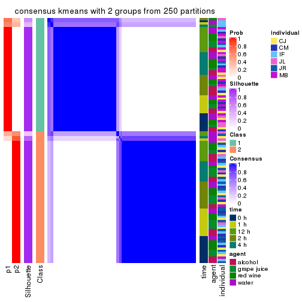</p>

</div>
<div id='tab-SD-kmeans-consensus-heatmap-2'>
<pre><code class="r">consensus_heatmap(res, k = 3)
</code></pre>

<p>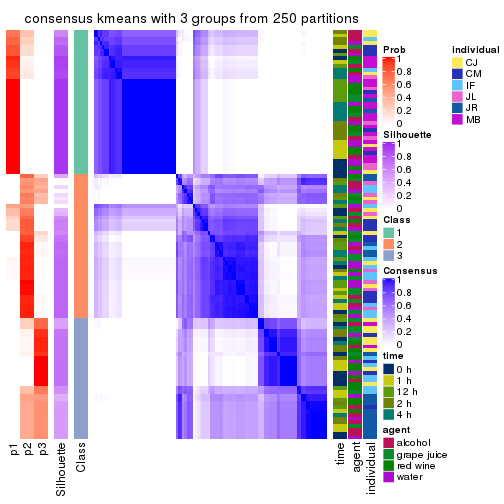</p>

</div>
<div id='tab-SD-kmeans-consensus-heatmap-3'>
<pre><code class="r">consensus_heatmap(res, k = 4)
</code></pre>

<p>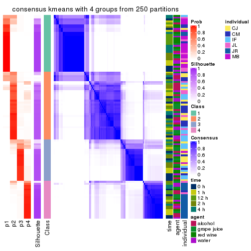</p>

</div>
<div id='tab-SD-kmeans-consensus-heatmap-4'>
<pre><code class="r">consensus_heatmap(res, k = 5)
</code></pre>

<p>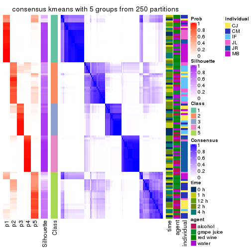</p>

</div>
<div id='tab-SD-kmeans-consensus-heatmap-5'>
<pre><code class="r">consensus_heatmap(res, k = 6)
</code></pre>

<p>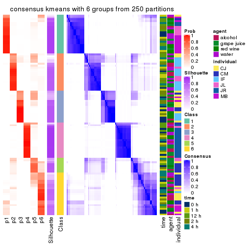</p>

</div>
</div>

Heatmaps for the membership of samples in all partitions to see how consistent they are:


<script>
$( function() {
	$( '#tabs-SD-kmeans-membership-heatmap' ).tabs();
} );
</script>
<div id='tabs-SD-kmeans-membership-heatmap'>
<ul>
<li><a href='#tab-SD-kmeans-membership-heatmap-1'>k = 2</a></li>
<li><a href='#tab-SD-kmeans-membership-heatmap-2'>k = 3</a></li>
<li><a href='#tab-SD-kmeans-membership-heatmap-3'>k = 4</a></li>
<li><a href='#tab-SD-kmeans-membership-heatmap-4'>k = 5</a></li>
<li><a href='#tab-SD-kmeans-membership-heatmap-5'>k = 6</a></li>
</ul>
<div id='tab-SD-kmeans-membership-heatmap-1'>
<pre><code class="r">membership_heatmap(res, k = 2)
</code></pre>

<p>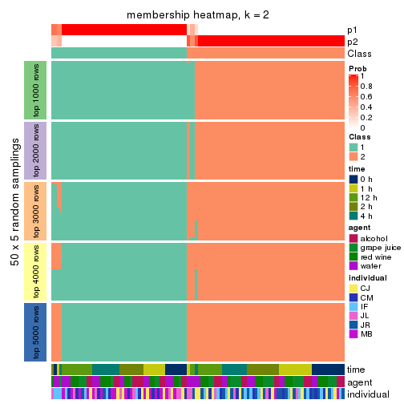</p>

</div>
<div id='tab-SD-kmeans-membership-heatmap-2'>
<pre><code class="r">membership_heatmap(res, k = 3)
</code></pre>

<p>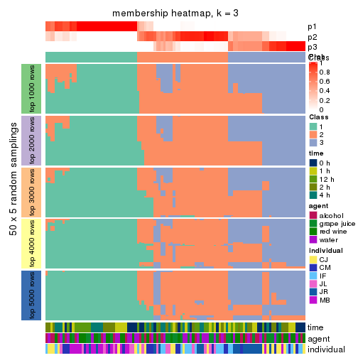</p>

</div>
<div id='tab-SD-kmeans-membership-heatmap-3'>
<pre><code class="r">membership_heatmap(res, k = 4)
</code></pre>

<p>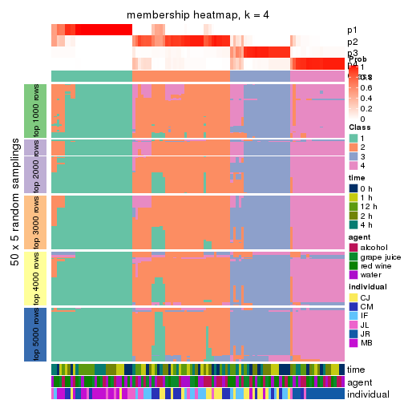</p>

</div>
<div id='tab-SD-kmeans-membership-heatmap-4'>
<pre><code class="r">membership_heatmap(res, k = 5)
</code></pre>

<p>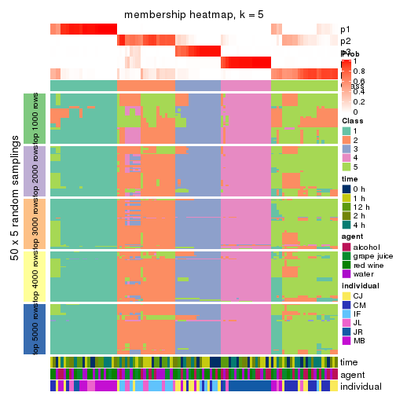</p>

</div>
<div id='tab-SD-kmeans-membership-heatmap-5'>
<pre><code class="r">membership_heatmap(res, k = 6)
</code></pre>

<p>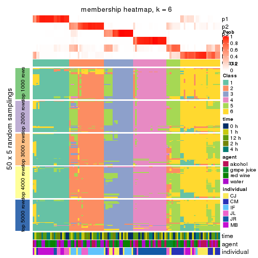</p>

</div>
</div>

As soon as we have had the classes for columns, we can look for signatures
which are significantly different between classes which can be candidate marks
for certain classes. Following are the heatmaps for signatures.


Signature heatmaps where rows are scaled:


<script>
$( function() {
	$( '#tabs-SD-kmeans-get-signatures' ).tabs();
} );
</script>
<div id='tabs-SD-kmeans-get-signatures'>
<ul>
<li><a href='#tab-SD-kmeans-get-signatures-1'>k = 2</a></li>
<li><a href='#tab-SD-kmeans-get-signatures-2'>k = 3</a></li>
<li><a href='#tab-SD-kmeans-get-signatures-3'>k = 4</a></li>
<li><a href='#tab-SD-kmeans-get-signatures-4'>k = 5</a></li>
<li><a href='#tab-SD-kmeans-get-signatures-5'>k = 6</a></li>
</ul>
<div id='tab-SD-kmeans-get-signatures-1'>
<pre><code class="r">get_signatures(res, k = 2)
</code></pre>

<p>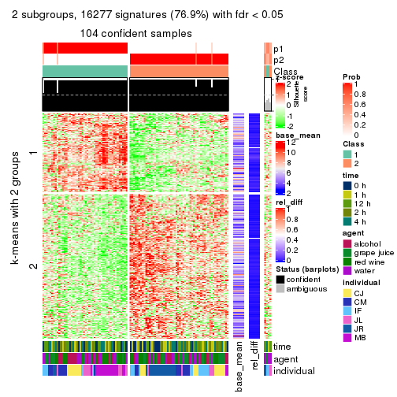</p>

</div>
<div id='tab-SD-kmeans-get-signatures-2'>
<pre><code class="r">get_signatures(res, k = 3)
</code></pre>

<p>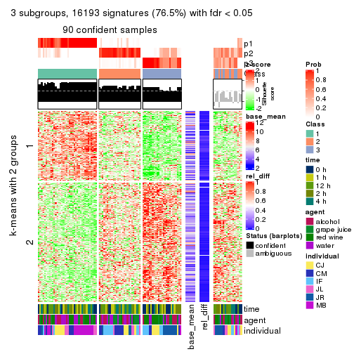</p>

</div>
<div id='tab-SD-kmeans-get-signatures-3'>
<pre><code class="r">get_signatures(res, k = 4)
</code></pre>

<p>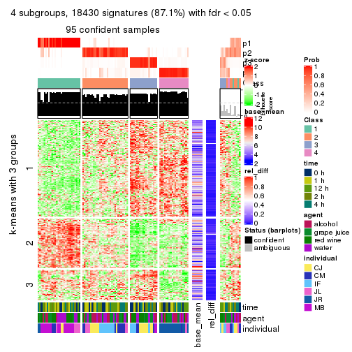</p>

</div>
<div id='tab-SD-kmeans-get-signatures-4'>
<pre><code class="r">get_signatures(res, k = 5)
</code></pre>

<p>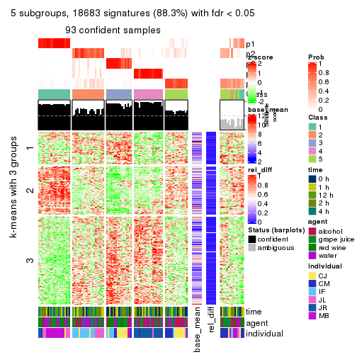</p>

</div>
<div id='tab-SD-kmeans-get-signatures-5'>
<pre><code class="r">get_signatures(res, k = 6)
</code></pre>

<p>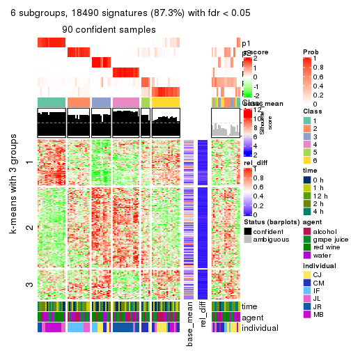</p>

</div>
</div>


Signature heatmaps where rows are not scaled:


<script>
$( function() {
	$( '#tabs-SD-kmeans-get-signatures-no-scale' ).tabs();
} );
</script>
<div id='tabs-SD-kmeans-get-signatures-no-scale'>
<ul>
<li><a href='#tab-SD-kmeans-get-signatures-no-scale-1'>k = 2</a></li>
<li><a href='#tab-SD-kmeans-get-signatures-no-scale-2'>k = 3</a></li>
<li><a href='#tab-SD-kmeans-get-signatures-no-scale-3'>k = 4</a></li>
<li><a href='#tab-SD-kmeans-get-signatures-no-scale-4'>k = 5</a></li>
<li><a href='#tab-SD-kmeans-get-signatures-no-scale-5'>k = 6</a></li>
</ul>
<div id='tab-SD-kmeans-get-signatures-no-scale-1'>
<pre><code class="r">get_signatures(res, k = 2, scale_rows = FALSE)
</code></pre>

<p>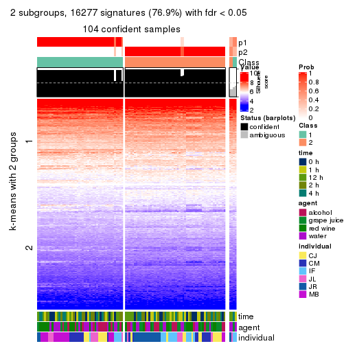</p>

</div>
<div id='tab-SD-kmeans-get-signatures-no-scale-2'>
<pre><code class="r">get_signatures(res, k = 3, scale_rows = FALSE)
</code></pre>

<p>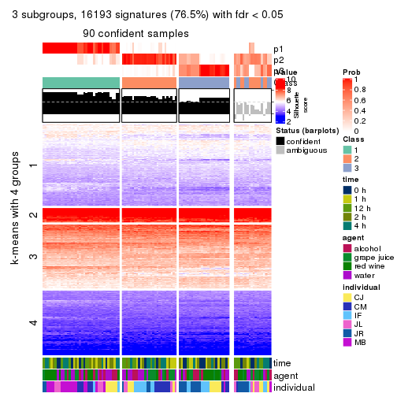</p>

</div>
<div id='tab-SD-kmeans-get-signatures-no-scale-3'>
<pre><code class="r">get_signatures(res, k = 4, scale_rows = FALSE)
</code></pre>

<p>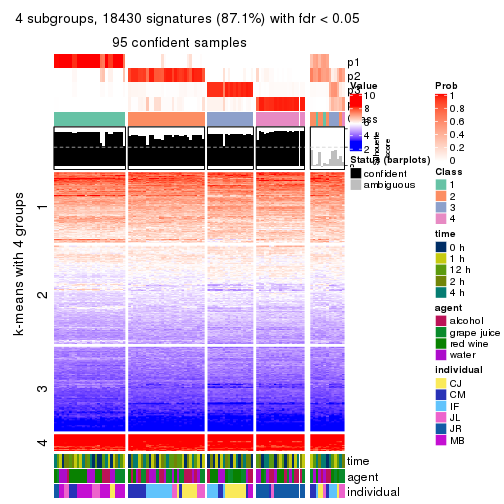</p>

</div>
<div id='tab-SD-kmeans-get-signatures-no-scale-4'>
<pre><code class="r">get_signatures(res, k = 5, scale_rows = FALSE)
</code></pre>

<p>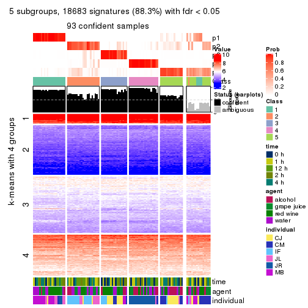</p>

</div>
<div id='tab-SD-kmeans-get-signatures-no-scale-5'>
<pre><code class="r">get_signatures(res, k = 6, scale_rows = FALSE)
</code></pre>

<p>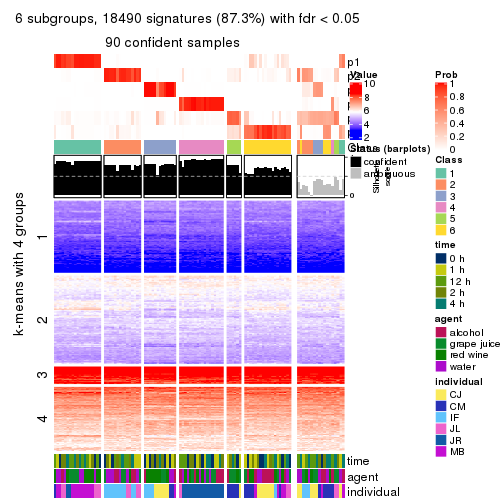</p>

</div>
</div>


Compare the overlap of signatures from different k:

```r
compare_signatures(res)
```

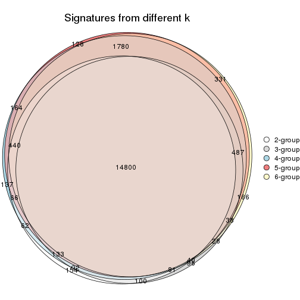

`get_signature()` returns a data frame invisibly. TO get the list of signatures, the function
call should be assigned to a variable explicitly. In following code, if `plot` argument is set
to `FALSE`, no heatmap is plotted while only the differential analysis is performed.

```r
# code only for demonstration
tb = get_signature(res, k = ..., plot = FALSE)
```

An example of the output of `tb` is:

```
#>   which_row         fdr    mean_1    mean_2 scaled_mean_1 scaled_mean_2 km
#> 1        38 0.042760348  8.373488  9.131774    -0.5533452     0.5164555  1
#> 2        40 0.018707592  7.106213  8.469186    -0.6173731     0.5762149  1
#> 3        55 0.019134737 10.221463 11.207825    -0.6159697     0.5749050  1
#> 4        59 0.006059896  5.921854  7.869574    -0.6899429     0.6439467  1
#> 5        60 0.018055526  8.928898 10.211722    -0.6204761     0.5791110  1
#> 6        98 0.009384629 15.714769 14.887706     0.6635654    -0.6193277  2
...
```

The columns in `tb` are:

1. `which_row`: row indices corresponding to the input matrix.
2. `fdr`: FDR for the differential test. 
3. `mean_x`: The mean value in group x.
4. `scaled_mean_x`: The mean value in group x after rows are scaled.
5. `km`: Row groups if k-means clustering is applied to rows.


UMAP plot which shows how samples are separated.


<script>
$( function() {
	$( '#tabs-SD-kmeans-dimension-reduction' ).tabs();
} );
</script>
<div id='tabs-SD-kmeans-dimension-reduction'>
<ul>
<li><a href='#tab-SD-kmeans-dimension-reduction-1'>k = 2</a></li>
<li><a href='#tab-SD-kmeans-dimension-reduction-2'>k = 3</a></li>
<li><a href='#tab-SD-kmeans-dimension-reduction-3'>k = 4</a></li>
<li><a href='#tab-SD-kmeans-dimension-reduction-4'>k = 5</a></li>
<li><a href='#tab-SD-kmeans-dimension-reduction-5'>k = 6</a></li>
</ul>
<div id='tab-SD-kmeans-dimension-reduction-1'>
<pre><code class="r">dimension_reduction(res, k = 2, method = &quot;UMAP&quot;)
</code></pre>

<p>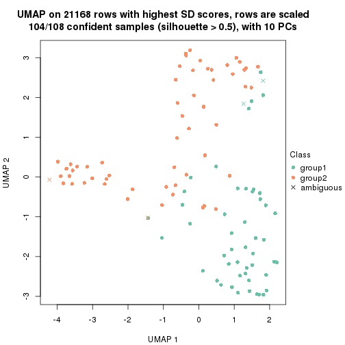</p>

</div>
<div id='tab-SD-kmeans-dimension-reduction-2'>
<pre><code class="r">dimension_reduction(res, k = 3, method = &quot;UMAP&quot;)
</code></pre>

<p>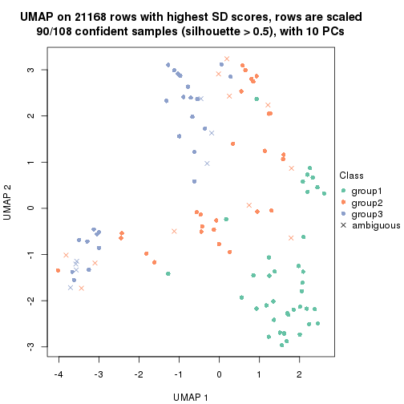</p>

</div>
<div id='tab-SD-kmeans-dimension-reduction-3'>
<pre><code class="r">dimension_reduction(res, k = 4, method = &quot;UMAP&quot;)
</code></pre>

<p>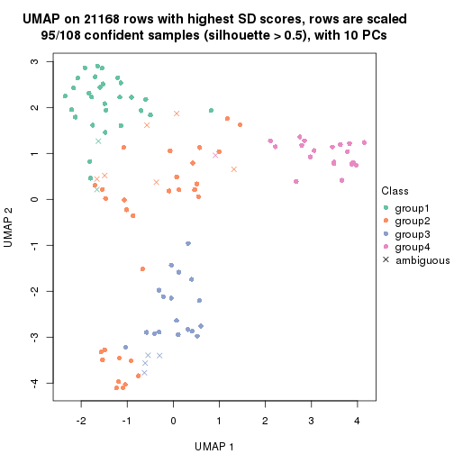</p>

</div>
<div id='tab-SD-kmeans-dimension-reduction-4'>
<pre><code class="r">dimension_reduction(res, k = 5, method = &quot;UMAP&quot;)
</code></pre>

<p>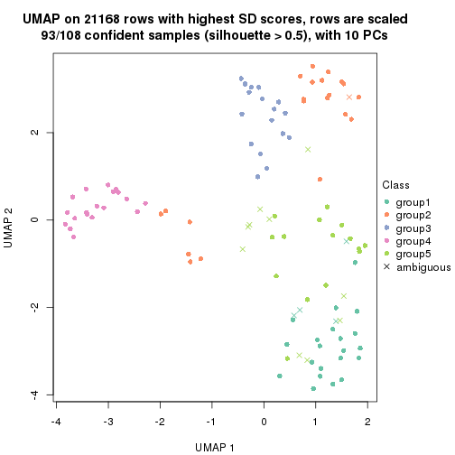</p>

</div>
<div id='tab-SD-kmeans-dimension-reduction-5'>
<pre><code class="r">dimension_reduction(res, k = 6, method = &quot;UMAP&quot;)
</code></pre>

<p>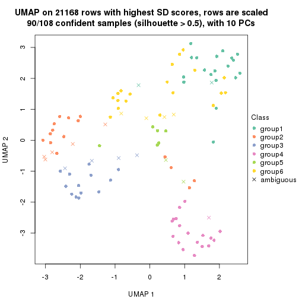</p>

</div>
</div>


Following heatmap shows how subgroups are split when increasing `k`:

```r
collect_classes(res)
```

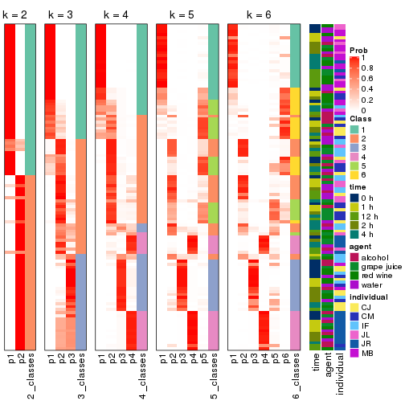


Test correlation between subgroups and known annotations. If the known
annotation is numeric, one-way ANOVA test is applied, and if the known
annotation is discrete, chi-squared contingency table test is applied.

```r
test_to_known_factors(res)
```

```
#>             n time(p) agent(p) individual(p) k
#> SD:kmeans 104   0.845   0.4177      1.03e-04 2
#> SD:kmeans  90   0.201   0.2840      8.68e-06 3
#> SD:kmeans  95   0.961   0.3640      1.76e-19 4
#> SD:kmeans  93   0.749   0.2291      4.62e-24 5
#> SD:kmeans  90   0.946   0.0742      9.80e-25 6
```


If matrix rows can be associated to genes, consider to use `GO_Enrichment(res,
...)` to perform function enrichment for the signature genes.


 

---------------------------------------------------


### SD:skmeans*


The object with results only for a single top-value method and a single partition method 
can be extracted as:

```r
res = res_list["SD", "skmeans"]
# you can also extract it by
# res = res_list["SD:skmeans"]
```

A summary of `res` and all the functions that can be applied to it:

```r
res
```

```
#> A 'ConsensusPartition' object with k = 2, 3, 4, 5, 6.
#>   On a matrix with 21168 rows and 108 columns.
#>   Top rows (1000, 2000, 3000, 4000, 5000) are extracted by 'SD' method.
#>   Subgroups are detected by 'skmeans' method.
#>   Performed in total 1250 partitions by row resampling.
#>   Best k for subgroups seems to be 5.
#> 
#> Following methods can be applied to this 'ConsensusPartition' object:
#>  [1] "cola_report"             "collect_classes"         "collect_plots"          
#>  [4] "collect_stats"           "colnames"                "compare_signatures"     
#>  [7] "consensus_heatmap"       "dimension_reduction"     "functional_enrichment"  
#> [10] "get_anno_col"            "get_anno"                "get_classes"            
#> [13] "get_consensus"           "get_matrix"              "get_membership"         
#> [16] "get_param"               "get_signatures"          "get_stats"              
#> [19] "is_best_k"               "is_stable_k"             "membership_heatmap"     
#> [22] "ncol"                    "nrow"                    "plot_ecdf"              
#> [25] "rownames"                "select_partition_number" "show"                   
#> [28] "suggest_best_k"          "test_to_known_factors"
```

`collect_plots()` function collects all the plots made from `res` for all `k` (number of partitions)
into one single page to provide an easy and fast comparison between different `k`.

```r
collect_plots(res)
```

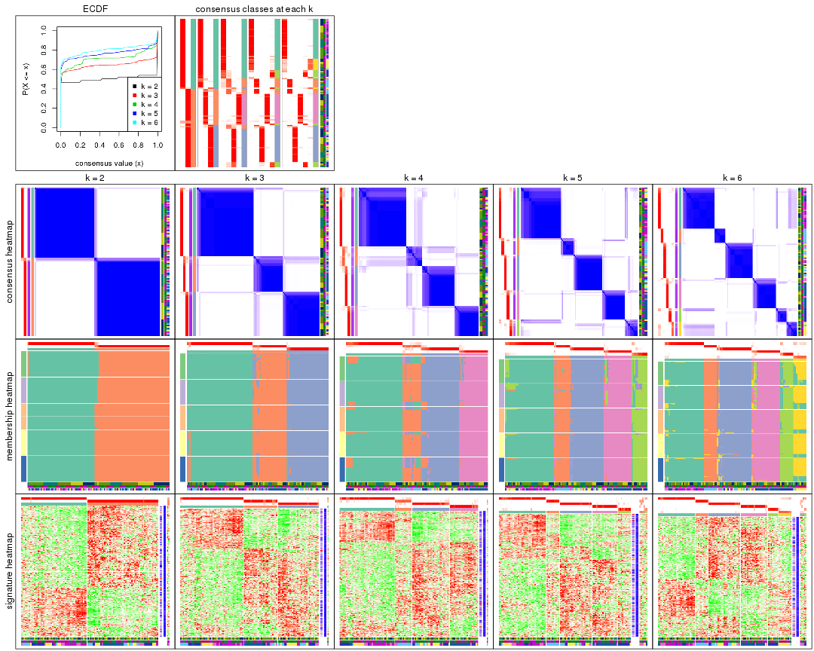

The plots are:

- The first row: a plot of the ECDF (Empirical cumulative distribution
  function) curves of the consensus matrix for each `k` and the heatmap of
  predicted classes for each `k`.
- The second row: heatmaps of the consensus matrix for each `k`.
- The third row: heatmaps of the membership matrix for each `k`.
- The fouth row: heatmaps of the signatures for each `k`.

All the plots in panels can be made by individual functions and they are
plotted later in this section.

`select_partition_number()` produces several plots showing different
statistics for choosing "optimized" `k`. There are following statistics:

- ECDF curves of the consensus matrix for each `k`;
- 1-PAC. [The PAC
  score](https://en.wikipedia.org/wiki/Consensus_clustering#Over-interpretation_potential_of_consensus_clustering)
  measures the proportion of the ambiguous subgrouping.
- Mean silhouette score.
- Concordance. The mean probability of fiting the consensus class ids in all
  partitions.
- Area increased. Denote $A_k$ as the area under the ECDF curve for current
  `k`, the area increased is defined as $A_k - A_{k-1}$.
- Rand index. The percent of pairs of samples that are both in a same cluster
  or both are not in a same cluster in the partition of k and k-1.
- Jaccard index. The ratio of pairs of samples are both in a same cluster in
  the partition of k and k-1 and the pairs of samples are both in a same
  cluster in the partition k or k-1.

The detailed explanations of these statistics can be found in [the cola
vignette](http://bioconductor.org/packages/devel/bioc/vignettes/cola/inst/doc/cola.html#toc_13).

Generally speaking, lower PAC score, higher mean silhouette score or higher
concordance corresponds to better partition. Rand index and Jaccard index
measure how similar the current partition is compared to partition with `k-1`.
If they are too similar, we won't accept `k` is better than `k-1`.

```r
select_partition_number(res)
```

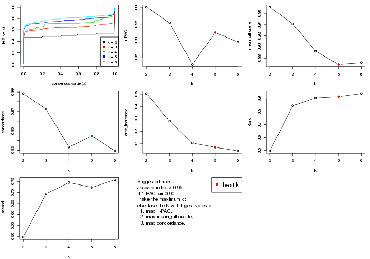

The numeric values for all these statistics can be obtained by `get_stats()`.

```r
get_stats(res)
```

```
#>   k 1-PAC mean_silhouette concordance area_increased  Rand Jaccard
#> 2 2 1.000           0.971       0.989         0.5042 0.497   0.497
#> 3 3 0.954           0.941       0.972         0.2827 0.846   0.694
#> 4 4 0.830           0.892       0.933         0.1061 0.907   0.745
#> 5 5 0.924           0.869       0.945         0.0723 0.918   0.723
#> 6 6 0.896           0.872       0.929         0.0438 0.941   0.758
```

`suggest_best_k()` suggests the best $k$ based on these statistics. The rules are as follows:

- All $k$ with Jaccard index larger than 0.95 are removed because the increase of
  the partition number does not provides enough extra information. If all $k$ are removed,
  the best $k$ is assigned by `NA`.
- For $k$ with 1-PAC larger than 0.9, the maximal $k$ is taken as the "best k". Other $k$ is called "optional k".
- If it does not fit the second rule. The $k$ with the highest vote of highest
  1-PAC, mean silhouette and concordance is taken as the "best k".

```r
suggest_best_k(res)
```

```
#> [1] 5
#> attr(,"optional")
#> [1] 2 3
```

There is also optional best $k$ = 2 3 that is worth to check.

Following shows the table of the partitions (You need to click the **show/hide
code output** link to see it). The membership matrix (columns with name `p*`)
is inferred by
[`clue::cl_consensus()`](https://www.rdocumentation.org/link/cl_consensus?package=clue)
function with the `SE` method. Basically the value in the membership matrix
represents the probability to belong to a certain group. The finall class
label for an item is determined with the group with highest probability it
belongs to.

In `get_classes()` function, the entropy is calculated from the membership
matrix and the silhouette score is calculated from the consensus matrix.


<script>
$( function() {
	$( '#tabs-SD-skmeans-get-classes' ).tabs();
} );
</script>
<div id='tabs-SD-skmeans-get-classes'>
<ul>
<li><a href='#tab-SD-skmeans-get-classes-1'>k = 2</a></li>
<li><a href='#tab-SD-skmeans-get-classes-2'>k = 3</a></li>
<li><a href='#tab-SD-skmeans-get-classes-3'>k = 4</a></li>
<li><a href='#tab-SD-skmeans-get-classes-4'>k = 5</a></li>
<li><a href='#tab-SD-skmeans-get-classes-5'>k = 6</a></li>
</ul>

<div id='tab-SD-skmeans-get-classes-1'>
<p><a id='tab-SD-skmeans-get-classes-1-a' style='color:#0366d6' href='#'>show/hide code output</a></p>
<pre><code class="r">cbind(get_classes(res, k = 2), get_membership(res, k = 2))
</code></pre>

<pre><code>#&gt;          class entropy silhouette    p1    p2
#&gt; GSM87863     1   0.000      0.996 1.000 0.000
#&gt; GSM87887     1   0.000      0.996 1.000 0.000
#&gt; GSM87896     2   0.000      0.981 0.000 1.000
#&gt; GSM87934     2   0.000      0.981 0.000 1.000
#&gt; GSM87943     2   0.000      0.981 0.000 1.000
#&gt; GSM87853     2   0.000      0.981 0.000 1.000
#&gt; GSM87906     2   0.000      0.981 0.000 1.000
#&gt; GSM87920     1   0.000      0.996 1.000 0.000
#&gt; GSM87924     2   0.000      0.981 0.000 1.000
#&gt; GSM87858     2   0.000      0.981 0.000 1.000
#&gt; GSM87882     2   0.000      0.981 0.000 1.000
#&gt; GSM87891     2   0.000      0.981 0.000 1.000
#&gt; GSM87917     1   0.000      0.996 1.000 0.000
#&gt; GSM87929     2   0.000      0.981 0.000 1.000
#&gt; GSM87948     1   0.000      0.996 1.000 0.000
#&gt; GSM87868     1   0.000      0.996 1.000 0.000
#&gt; GSM87873     2   0.000      0.981 0.000 1.000
#&gt; GSM87901     1   0.000      0.996 1.000 0.000
#&gt; GSM87910     1   0.000      0.996 1.000 0.000
#&gt; GSM87938     2   0.000      0.981 0.000 1.000
#&gt; GSM87953     1   0.000      0.996 1.000 0.000
#&gt; GSM87864     1   0.000      0.996 1.000 0.000
#&gt; GSM87888     2   0.000      0.981 0.000 1.000
#&gt; GSM87897     2   0.000      0.981 0.000 1.000
#&gt; GSM87935     2   0.000      0.981 0.000 1.000
#&gt; GSM87944     1   0.000      0.996 1.000 0.000
#&gt; GSM87854     2   0.000      0.981 0.000 1.000
#&gt; GSM87878     1   0.000      0.996 1.000 0.000
#&gt; GSM87907     2   0.000      0.981 0.000 1.000
#&gt; GSM87921     2   0.000      0.981 0.000 1.000
#&gt; GSM87925     2   0.000      0.981 0.000 1.000
#&gt; GSM87957     1   0.000      0.996 1.000 0.000
#&gt; GSM87859     2   0.000      0.981 0.000 1.000
#&gt; GSM87883     1   0.000      0.996 1.000 0.000
#&gt; GSM87892     2   0.000      0.981 0.000 1.000
#&gt; GSM87930     2   0.000      0.981 0.000 1.000
#&gt; GSM87949     1   0.000      0.996 1.000 0.000
#&gt; GSM87869     1   0.000      0.996 1.000 0.000
#&gt; GSM87874     2   0.000      0.981 0.000 1.000
#&gt; GSM87902     1   0.000      0.996 1.000 0.000
#&gt; GSM87911     2   0.738      0.734 0.208 0.792
#&gt; GSM87939     2   0.000      0.981 0.000 1.000
#&gt; GSM87954     1   0.000      0.996 1.000 0.000
#&gt; GSM87865     1   0.000      0.996 1.000 0.000
#&gt; GSM87889     1   0.000      0.996 1.000 0.000
#&gt; GSM87898     1   0.000      0.996 1.000 0.000
#&gt; GSM87915     1   0.000      0.996 1.000 0.000
#&gt; GSM87936     2   0.000      0.981 0.000 1.000
#&gt; GSM87945     2   0.000      0.981 0.000 1.000
#&gt; GSM87855     2   0.000      0.981 0.000 1.000
#&gt; GSM87879     2   0.000      0.981 0.000 1.000
#&gt; GSM87922     2   0.000      0.981 0.000 1.000
#&gt; GSM87926     2   0.000      0.981 0.000 1.000
#&gt; GSM87958     1   0.000      0.996 1.000 0.000
#&gt; GSM87860     2   0.000      0.981 0.000 1.000
#&gt; GSM87884     1   0.000      0.996 1.000 0.000
#&gt; GSM87893     2   0.000      0.981 0.000 1.000
#&gt; GSM87918     1   0.000      0.996 1.000 0.000
#&gt; GSM87931     2   0.000      0.981 0.000 1.000
#&gt; GSM87950     1   0.000      0.996 1.000 0.000
#&gt; GSM87870     1   0.000      0.996 1.000 0.000
#&gt; GSM87875     2   0.000      0.981 0.000 1.000
#&gt; GSM87903     2   0.000      0.981 0.000 1.000
#&gt; GSM87912     1   0.000      0.996 1.000 0.000
#&gt; GSM87940     2   0.000      0.981 0.000 1.000
#&gt; GSM87866     1   0.000      0.996 1.000 0.000
#&gt; GSM87899     2   0.000      0.981 0.000 1.000
#&gt; GSM87937     2   0.000      0.981 0.000 1.000
#&gt; GSM87946     1   0.000      0.996 1.000 0.000
#&gt; GSM87856     2   0.000      0.981 0.000 1.000
#&gt; GSM87880     2   0.000      0.981 0.000 1.000
#&gt; GSM87908     1   0.000      0.996 1.000 0.000
#&gt; GSM87923     2   0.000      0.981 0.000 1.000
#&gt; GSM87927     2   0.000      0.981 0.000 1.000
#&gt; GSM87959     1   0.000      0.996 1.000 0.000
#&gt; GSM87861     2   0.000      0.981 0.000 1.000
#&gt; GSM87885     1   0.000      0.996 1.000 0.000
#&gt; GSM87894     1   0.000      0.996 1.000 0.000
#&gt; GSM87932     1   0.000      0.996 1.000 0.000
#&gt; GSM87951     1   0.000      0.996 1.000 0.000
#&gt; GSM87871     1   0.722      0.743 0.800 0.200
#&gt; GSM87876     1   0.000      0.996 1.000 0.000
#&gt; GSM87904     2   0.000      0.981 0.000 1.000
#&gt; GSM87913     1   0.000      0.996 1.000 0.000
#&gt; GSM87941     2   0.000      0.981 0.000 1.000
#&gt; GSM87955     1   0.000      0.996 1.000 0.000
#&gt; GSM87867     1   0.000      0.996 1.000 0.000
#&gt; GSM87890     2   0.000      0.981 0.000 1.000
#&gt; GSM87900     2   0.000      0.981 0.000 1.000
#&gt; GSM87916     2   0.000      0.981 0.000 1.000
#&gt; GSM87947     1   0.000      0.996 1.000 0.000
#&gt; GSM87857     2   0.000      0.981 0.000 1.000
#&gt; GSM87881     2   0.000      0.981 0.000 1.000
#&gt; GSM87909     1   0.000      0.996 1.000 0.000
#&gt; GSM87928     1   0.000      0.996 1.000 0.000
#&gt; GSM87960     1   0.000      0.996 1.000 0.000
#&gt; GSM87862     2   0.000      0.981 0.000 1.000
#&gt; GSM87886     1   0.000      0.996 1.000 0.000
#&gt; GSM87895     2   0.000      0.981 0.000 1.000
#&gt; GSM87919     1   0.000      0.996 1.000 0.000
#&gt; GSM87933     2   0.000      0.981 0.000 1.000
#&gt; GSM87952     1   0.000      0.996 1.000 0.000
#&gt; GSM87872     2   0.000      0.981 0.000 1.000
#&gt; GSM87877     1   0.000      0.996 1.000 0.000
#&gt; GSM87905     1   0.000      0.996 1.000 0.000
#&gt; GSM87914     2   0.981      0.297 0.420 0.580
#&gt; GSM87942     2   0.978      0.320 0.412 0.588
#&gt; GSM87956     1   0.000      0.996 1.000 0.000
</code></pre>

<script>
$('#tab-SD-skmeans-get-classes-1-a').parent().next().next().hide();
$('#tab-SD-skmeans-get-classes-1-a').click(function(){
  $('#tab-SD-skmeans-get-classes-1-a').parent().next().next().toggle();
  return(false);
});
</script>
</div>

<div id='tab-SD-skmeans-get-classes-2'>
<p><a id='tab-SD-skmeans-get-classes-2-a' style='color:#0366d6' href='#'>show/hide code output</a></p>
<pre><code class="r">cbind(get_classes(res, k = 3), get_membership(res, k = 3))
</code></pre>

<pre><code>#&gt;          class entropy silhouette    p1    p2    p3
#&gt; GSM87863     1  0.0237      0.979 0.996 0.004 0.000
#&gt; GSM87887     1  0.0237      0.979 0.996 0.004 0.000
#&gt; GSM87896     3  0.0237      0.978 0.000 0.004 0.996
#&gt; GSM87934     2  0.0424      0.942 0.000 0.992 0.008
#&gt; GSM87943     3  0.0000      0.980 0.000 0.000 1.000
#&gt; GSM87853     3  0.0000      0.980 0.000 0.000 1.000
#&gt; GSM87906     2  0.4974      0.711 0.000 0.764 0.236
#&gt; GSM87920     1  0.0000      0.981 1.000 0.000 0.000
#&gt; GSM87924     2  0.2878      0.881 0.000 0.904 0.096
#&gt; GSM87858     3  0.0000      0.980 0.000 0.000 1.000
#&gt; GSM87882     3  0.0000      0.980 0.000 0.000 1.000
#&gt; GSM87891     3  0.0237      0.978 0.000 0.004 0.996
#&gt; GSM87917     1  0.0000      0.981 1.000 0.000 0.000
#&gt; GSM87929     2  0.0424      0.942 0.000 0.992 0.008
#&gt; GSM87948     1  0.0000      0.981 1.000 0.000 0.000
#&gt; GSM87868     1  0.0000      0.981 1.000 0.000 0.000
#&gt; GSM87873     3  0.0000      0.980 0.000 0.000 1.000
#&gt; GSM87901     1  0.5291      0.634 0.732 0.268 0.000
#&gt; GSM87910     1  0.0000      0.981 1.000 0.000 0.000
#&gt; GSM87938     2  0.0424      0.942 0.000 0.992 0.008
#&gt; GSM87953     1  0.0000      0.981 1.000 0.000 0.000
#&gt; GSM87864     1  0.0237      0.979 0.996 0.004 0.000
#&gt; GSM87888     3  0.0237      0.977 0.000 0.004 0.996
#&gt; GSM87897     2  0.5835      0.516 0.000 0.660 0.340
#&gt; GSM87935     2  0.0424      0.942 0.000 0.992 0.008
#&gt; GSM87944     1  0.0000      0.981 1.000 0.000 0.000
#&gt; GSM87854     3  0.0000      0.980 0.000 0.000 1.000
#&gt; GSM87878     1  0.0000      0.981 1.000 0.000 0.000
#&gt; GSM87907     3  0.0237      0.978 0.000 0.004 0.996
#&gt; GSM87921     2  0.0237      0.939 0.000 0.996 0.004
#&gt; GSM87925     2  0.0424      0.942 0.000 0.992 0.008
#&gt; GSM87957     1  0.0000      0.981 1.000 0.000 0.000
#&gt; GSM87859     3  0.0000      0.980 0.000 0.000 1.000
#&gt; GSM87883     1  0.0000      0.981 1.000 0.000 0.000
#&gt; GSM87892     3  0.0000      0.980 0.000 0.000 1.000
#&gt; GSM87930     2  0.0424      0.942 0.000 0.992 0.008
#&gt; GSM87949     1  0.0000      0.981 1.000 0.000 0.000
#&gt; GSM87869     1  0.0000      0.981 1.000 0.000 0.000
#&gt; GSM87874     3  0.0000      0.980 0.000 0.000 1.000
#&gt; GSM87902     1  0.4128      0.828 0.856 0.012 0.132
#&gt; GSM87911     3  0.5305      0.732 0.020 0.192 0.788
#&gt; GSM87939     2  0.0424      0.942 0.000 0.992 0.008
#&gt; GSM87954     1  0.0000      0.981 1.000 0.000 0.000
#&gt; GSM87865     1  0.0000      0.981 1.000 0.000 0.000
#&gt; GSM87889     1  0.0237      0.979 0.996 0.004 0.000
#&gt; GSM87898     1  0.0237      0.979 0.996 0.004 0.000
#&gt; GSM87915     1  0.0000      0.981 1.000 0.000 0.000
#&gt; GSM87936     2  0.0424      0.942 0.000 0.992 0.008
#&gt; GSM87945     3  0.0000      0.980 0.000 0.000 1.000
#&gt; GSM87855     3  0.0000      0.980 0.000 0.000 1.000
#&gt; GSM87879     3  0.0237      0.977 0.000 0.004 0.996
#&gt; GSM87922     3  0.2066      0.921 0.000 0.060 0.940
#&gt; GSM87926     2  0.0424      0.942 0.000 0.992 0.008
#&gt; GSM87958     1  0.0000      0.981 1.000 0.000 0.000
#&gt; GSM87860     3  0.0000      0.980 0.000 0.000 1.000
#&gt; GSM87884     1  0.0000      0.981 1.000 0.000 0.000
#&gt; GSM87893     3  0.0000      0.980 0.000 0.000 1.000
#&gt; GSM87918     1  0.6154      0.315 0.592 0.408 0.000
#&gt; GSM87931     2  0.0424      0.942 0.000 0.992 0.008
#&gt; GSM87950     1  0.0000      0.981 1.000 0.000 0.000
#&gt; GSM87870     1  0.0000      0.981 1.000 0.000 0.000
#&gt; GSM87875     3  0.0000      0.980 0.000 0.000 1.000
#&gt; GSM87903     3  0.0592      0.973 0.000 0.012 0.988
#&gt; GSM87912     1  0.0000      0.981 1.000 0.000 0.000
#&gt; GSM87940     2  0.0424      0.942 0.000 0.992 0.008
#&gt; GSM87866     1  0.0000      0.981 1.000 0.000 0.000
#&gt; GSM87899     3  0.0237      0.977 0.000 0.004 0.996
#&gt; GSM87937     2  0.0424      0.942 0.000 0.992 0.008
#&gt; GSM87946     1  0.0000      0.981 1.000 0.000 0.000
#&gt; GSM87856     3  0.0000      0.980 0.000 0.000 1.000
#&gt; GSM87880     3  0.0237      0.977 0.000 0.004 0.996
#&gt; GSM87908     1  0.0237      0.979 0.996 0.004 0.000
#&gt; GSM87923     3  0.0000      0.980 0.000 0.000 1.000
#&gt; GSM87927     2  0.0424      0.942 0.000 0.992 0.008
#&gt; GSM87959     1  0.0000      0.981 1.000 0.000 0.000
#&gt; GSM87861     3  0.0000      0.980 0.000 0.000 1.000
#&gt; GSM87885     1  0.0237      0.979 0.996 0.004 0.000
#&gt; GSM87894     1  0.0000      0.981 1.000 0.000 0.000
#&gt; GSM87932     1  0.0000      0.981 1.000 0.000 0.000
#&gt; GSM87951     1  0.0000      0.981 1.000 0.000 0.000
#&gt; GSM87871     3  0.4883      0.704 0.208 0.004 0.788
#&gt; GSM87876     1  0.1399      0.952 0.968 0.004 0.028
#&gt; GSM87904     3  0.0000      0.980 0.000 0.000 1.000
#&gt; GSM87913     1  0.0000      0.981 1.000 0.000 0.000
#&gt; GSM87941     2  0.0424      0.942 0.000 0.992 0.008
#&gt; GSM87955     1  0.0000      0.981 1.000 0.000 0.000
#&gt; GSM87867     1  0.0237      0.979 0.996 0.004 0.000
#&gt; GSM87890     2  0.4702      0.761 0.000 0.788 0.212
#&gt; GSM87900     2  0.0237      0.939 0.000 0.996 0.004
#&gt; GSM87916     2  0.0424      0.942 0.000 0.992 0.008
#&gt; GSM87947     1  0.0000      0.981 1.000 0.000 0.000
#&gt; GSM87857     3  0.0000      0.980 0.000 0.000 1.000
#&gt; GSM87881     2  0.5497      0.634 0.000 0.708 0.292
#&gt; GSM87909     1  0.0237      0.979 0.996 0.004 0.000
#&gt; GSM87928     1  0.0000      0.981 1.000 0.000 0.000
#&gt; GSM87960     1  0.0000      0.981 1.000 0.000 0.000
#&gt; GSM87862     3  0.0237      0.978 0.000 0.004 0.996
#&gt; GSM87886     1  0.0000      0.981 1.000 0.000 0.000
#&gt; GSM87895     3  0.0592      0.971 0.000 0.012 0.988
#&gt; GSM87919     1  0.0000      0.981 1.000 0.000 0.000
#&gt; GSM87933     2  0.0424      0.942 0.000 0.992 0.008
#&gt; GSM87952     1  0.0000      0.981 1.000 0.000 0.000
#&gt; GSM87872     2  0.4178      0.803 0.000 0.828 0.172
#&gt; GSM87877     1  0.0237      0.979 0.996 0.004 0.000
#&gt; GSM87905     1  0.0237      0.979 0.996 0.004 0.000
#&gt; GSM87914     2  0.2066      0.889 0.060 0.940 0.000
#&gt; GSM87942     2  0.0237      0.936 0.004 0.996 0.000
#&gt; GSM87956     1  0.0000      0.981 1.000 0.000 0.000
</code></pre>

<script>
$('#tab-SD-skmeans-get-classes-2-a').parent().next().next().hide();
$('#tab-SD-skmeans-get-classes-2-a').click(function(){
  $('#tab-SD-skmeans-get-classes-2-a').parent().next().next().toggle();
  return(false);
});
</script>
</div>

<div id='tab-SD-skmeans-get-classes-3'>
<p><a id='tab-SD-skmeans-get-classes-3-a' style='color:#0366d6' href='#'>show/hide code output</a></p>
<pre><code class="r">cbind(get_classes(res, k = 4), get_membership(res, k = 4))
</code></pre>

<pre><code>#&gt;          class entropy silhouette    p1    p2    p3    p4
#&gt; GSM87863     1  0.1637      0.922 0.940 0.060 0.000 0.000
#&gt; GSM87887     1  0.3610      0.792 0.800 0.200 0.000 0.000
#&gt; GSM87896     3  0.0000      0.947 0.000 0.000 1.000 0.000
#&gt; GSM87934     4  0.0000      0.949 0.000 0.000 0.000 1.000
#&gt; GSM87943     3  0.0000      0.947 0.000 0.000 1.000 0.000
#&gt; GSM87853     3  0.0000      0.947 0.000 0.000 1.000 0.000
#&gt; GSM87906     2  0.4212      0.735 0.000 0.772 0.216 0.012
#&gt; GSM87920     1  0.0000      0.963 1.000 0.000 0.000 0.000
#&gt; GSM87924     4  0.1211      0.913 0.000 0.000 0.040 0.960
#&gt; GSM87858     3  0.0000      0.947 0.000 0.000 1.000 0.000
#&gt; GSM87882     3  0.3266      0.812 0.000 0.168 0.832 0.000
#&gt; GSM87891     3  0.0000      0.947 0.000 0.000 1.000 0.000
#&gt; GSM87917     1  0.0000      0.963 1.000 0.000 0.000 0.000
#&gt; GSM87929     4  0.0000      0.949 0.000 0.000 0.000 1.000
#&gt; GSM87948     1  0.0000      0.963 1.000 0.000 0.000 0.000
#&gt; GSM87868     1  0.0188      0.962 0.996 0.004 0.000 0.000
#&gt; GSM87873     3  0.0000      0.947 0.000 0.000 1.000 0.000
#&gt; GSM87901     2  0.3803      0.780 0.132 0.836 0.000 0.032
#&gt; GSM87910     1  0.0000      0.963 1.000 0.000 0.000 0.000
#&gt; GSM87938     4  0.0000      0.949 0.000 0.000 0.000 1.000
#&gt; GSM87953     1  0.0000      0.963 1.000 0.000 0.000 0.000
#&gt; GSM87864     1  0.1637      0.922 0.940 0.060 0.000 0.000
#&gt; GSM87888     3  0.3873      0.750 0.000 0.228 0.772 0.000
#&gt; GSM87897     2  0.3873      0.728 0.000 0.772 0.228 0.000
#&gt; GSM87935     4  0.0000      0.949 0.000 0.000 0.000 1.000
#&gt; GSM87944     1  0.0000      0.963 1.000 0.000 0.000 0.000
#&gt; GSM87854     3  0.0000      0.947 0.000 0.000 1.000 0.000
#&gt; GSM87878     1  0.2868      0.851 0.864 0.136 0.000 0.000
#&gt; GSM87907     3  0.1211      0.913 0.000 0.040 0.960 0.000
#&gt; GSM87921     2  0.4008      0.629 0.000 0.756 0.000 0.244
#&gt; GSM87925     4  0.0000      0.949 0.000 0.000 0.000 1.000
#&gt; GSM87957     1  0.0000      0.963 1.000 0.000 0.000 0.000
#&gt; GSM87859     3  0.0000      0.947 0.000 0.000 1.000 0.000
#&gt; GSM87883     1  0.0188      0.962 0.996 0.004 0.000 0.000
#&gt; GSM87892     3  0.0000      0.947 0.000 0.000 1.000 0.000
#&gt; GSM87930     4  0.0000      0.949 0.000 0.000 0.000 1.000
#&gt; GSM87949     1  0.0000      0.963 1.000 0.000 0.000 0.000
#&gt; GSM87869     1  0.0000      0.963 1.000 0.000 0.000 0.000
#&gt; GSM87874     3  0.0000      0.947 0.000 0.000 1.000 0.000
#&gt; GSM87902     2  0.4514      0.798 0.136 0.800 0.064 0.000
#&gt; GSM87911     2  0.5758      0.698 0.048 0.680 0.264 0.008
#&gt; GSM87939     4  0.0000      0.949 0.000 0.000 0.000 1.000
#&gt; GSM87954     1  0.0000      0.963 1.000 0.000 0.000 0.000
#&gt; GSM87865     1  0.0188      0.962 0.996 0.004 0.000 0.000
#&gt; GSM87889     1  0.3873      0.759 0.772 0.228 0.000 0.000
#&gt; GSM87898     2  0.3873      0.777 0.228 0.772 0.000 0.000
#&gt; GSM87915     1  0.0000      0.963 1.000 0.000 0.000 0.000
#&gt; GSM87936     4  0.0000      0.949 0.000 0.000 0.000 1.000
#&gt; GSM87945     3  0.0000      0.947 0.000 0.000 1.000 0.000
#&gt; GSM87855     3  0.0000      0.947 0.000 0.000 1.000 0.000
#&gt; GSM87879     3  0.3266      0.812 0.000 0.168 0.832 0.000
#&gt; GSM87922     3  0.2868      0.803 0.000 0.000 0.864 0.136
#&gt; GSM87926     4  0.0000      0.949 0.000 0.000 0.000 1.000
#&gt; GSM87958     1  0.0000      0.963 1.000 0.000 0.000 0.000
#&gt; GSM87860     3  0.0000      0.947 0.000 0.000 1.000 0.000
#&gt; GSM87884     1  0.0188      0.962 0.996 0.004 0.000 0.000
#&gt; GSM87893     3  0.0000      0.947 0.000 0.000 1.000 0.000
#&gt; GSM87918     2  0.6327      0.697 0.228 0.648 0.000 0.124
#&gt; GSM87931     4  0.0000      0.949 0.000 0.000 0.000 1.000
#&gt; GSM87950     1  0.0000      0.963 1.000 0.000 0.000 0.000
#&gt; GSM87870     1  0.0188      0.962 0.996 0.004 0.000 0.000
#&gt; GSM87875     3  0.0000      0.947 0.000 0.000 1.000 0.000
#&gt; GSM87903     2  0.3873      0.728 0.000 0.772 0.228 0.000
#&gt; GSM87912     1  0.0000      0.963 1.000 0.000 0.000 0.000
#&gt; GSM87940     4  0.0000      0.949 0.000 0.000 0.000 1.000
#&gt; GSM87866     1  0.0188      0.962 0.996 0.004 0.000 0.000
#&gt; GSM87899     2  0.4804      0.488 0.000 0.616 0.384 0.000
#&gt; GSM87937     4  0.0000      0.949 0.000 0.000 0.000 1.000
#&gt; GSM87946     1  0.0000      0.963 1.000 0.000 0.000 0.000
#&gt; GSM87856     3  0.0000      0.947 0.000 0.000 1.000 0.000
#&gt; GSM87880     3  0.3873      0.750 0.000 0.228 0.772 0.000
#&gt; GSM87908     2  0.4018      0.779 0.224 0.772 0.004 0.000
#&gt; GSM87923     3  0.0000      0.947 0.000 0.000 1.000 0.000
#&gt; GSM87927     4  0.0000      0.949 0.000 0.000 0.000 1.000
#&gt; GSM87959     1  0.0000      0.963 1.000 0.000 0.000 0.000
#&gt; GSM87861     3  0.0000      0.947 0.000 0.000 1.000 0.000
#&gt; GSM87885     1  0.3873      0.759 0.772 0.228 0.000 0.000
#&gt; GSM87894     1  0.0188      0.962 0.996 0.004 0.000 0.000
#&gt; GSM87932     1  0.0000      0.963 1.000 0.000 0.000 0.000
#&gt; GSM87951     1  0.0000      0.963 1.000 0.000 0.000 0.000
#&gt; GSM87871     3  0.6178      0.587 0.112 0.228 0.660 0.000
#&gt; GSM87876     1  0.3873      0.759 0.772 0.228 0.000 0.000
#&gt; GSM87904     3  0.0000      0.947 0.000 0.000 1.000 0.000
#&gt; GSM87913     1  0.0000      0.963 1.000 0.000 0.000 0.000
#&gt; GSM87941     4  0.0000      0.949 0.000 0.000 0.000 1.000
#&gt; GSM87955     1  0.0000      0.963 1.000 0.000 0.000 0.000
#&gt; GSM87867     1  0.2814      0.860 0.868 0.132 0.000 0.000
#&gt; GSM87890     4  0.4599      0.678 0.000 0.028 0.212 0.760
#&gt; GSM87900     2  0.3873      0.645 0.000 0.772 0.000 0.228
#&gt; GSM87916     4  0.0000      0.949 0.000 0.000 0.000 1.000
#&gt; GSM87947     1  0.0817      0.949 0.976 0.024 0.000 0.000
#&gt; GSM87857     3  0.0000      0.947 0.000 0.000 1.000 0.000
#&gt; GSM87881     4  0.6646      0.547 0.000 0.224 0.156 0.620
#&gt; GSM87909     2  0.3873      0.777 0.228 0.772 0.000 0.000
#&gt; GSM87928     1  0.0000      0.963 1.000 0.000 0.000 0.000
#&gt; GSM87960     1  0.0000      0.963 1.000 0.000 0.000 0.000
#&gt; GSM87862     3  0.0000      0.947 0.000 0.000 1.000 0.000
#&gt; GSM87886     1  0.0000      0.963 1.000 0.000 0.000 0.000
#&gt; GSM87895     3  0.0469      0.937 0.000 0.012 0.988 0.000
#&gt; GSM87919     1  0.0000      0.963 1.000 0.000 0.000 0.000
#&gt; GSM87933     4  0.0000      0.949 0.000 0.000 0.000 1.000
#&gt; GSM87952     1  0.0000      0.963 1.000 0.000 0.000 0.000
#&gt; GSM87872     4  0.3439      0.844 0.000 0.084 0.048 0.868
#&gt; GSM87877     1  0.2408      0.886 0.896 0.104 0.000 0.000
#&gt; GSM87905     2  0.3873      0.777 0.228 0.772 0.000 0.000
#&gt; GSM87914     4  0.4123      0.764 0.044 0.136 0.000 0.820
#&gt; GSM87942     4  0.0000      0.949 0.000 0.000 0.000 1.000
#&gt; GSM87956     1  0.0000      0.963 1.000 0.000 0.000 0.000
</code></pre>

<script>
$('#tab-SD-skmeans-get-classes-3-a').parent().next().next().hide();
$('#tab-SD-skmeans-get-classes-3-a').click(function(){
  $('#tab-SD-skmeans-get-classes-3-a').parent().next().next().toggle();
  return(false);
});
</script>
</div>

<div id='tab-SD-skmeans-get-classes-4'>
<p><a id='tab-SD-skmeans-get-classes-4-a' style='color:#0366d6' href='#'>show/hide code output</a></p>
<pre><code class="r">cbind(get_classes(res, k = 5), get_membership(res, k = 5))
</code></pre>

<pre><code>#&gt;          class entropy silhouette    p1    p2    p3    p4    p5
#&gt; GSM87863     1  0.3906      0.687 0.744 0.016 0.000 0.000 0.240
#&gt; GSM87887     5  0.3366      0.598 0.232 0.000 0.000 0.000 0.768
#&gt; GSM87896     3  0.0000      0.967 0.000 0.000 1.000 0.000 0.000
#&gt; GSM87934     4  0.0000      0.947 0.000 0.000 0.000 1.000 0.000
#&gt; GSM87943     3  0.0000      0.967 0.000 0.000 1.000 0.000 0.000
#&gt; GSM87853     3  0.0000      0.967 0.000 0.000 1.000 0.000 0.000
#&gt; GSM87906     2  0.0510      0.879 0.000 0.984 0.016 0.000 0.000
#&gt; GSM87920     1  0.0324      0.955 0.992 0.004 0.000 0.000 0.004
#&gt; GSM87924     4  0.1544      0.879 0.000 0.000 0.068 0.932 0.000
#&gt; GSM87858     3  0.0000      0.967 0.000 0.000 1.000 0.000 0.000
#&gt; GSM87882     5  0.3586      0.598 0.000 0.000 0.264 0.000 0.736
#&gt; GSM87891     3  0.0000      0.967 0.000 0.000 1.000 0.000 0.000
#&gt; GSM87917     1  0.0000      0.959 1.000 0.000 0.000 0.000 0.000
#&gt; GSM87929     4  0.0000      0.947 0.000 0.000 0.000 1.000 0.000
#&gt; GSM87948     1  0.0000      0.959 1.000 0.000 0.000 0.000 0.000
#&gt; GSM87868     1  0.2233      0.898 0.904 0.016 0.000 0.000 0.080
#&gt; GSM87873     3  0.0000      0.967 0.000 0.000 1.000 0.000 0.000
#&gt; GSM87901     2  0.0162      0.882 0.004 0.996 0.000 0.000 0.000
#&gt; GSM87910     1  0.0000      0.959 1.000 0.000 0.000 0.000 0.000
#&gt; GSM87938     4  0.0000      0.947 0.000 0.000 0.000 1.000 0.000
#&gt; GSM87953     1  0.0000      0.959 1.000 0.000 0.000 0.000 0.000
#&gt; GSM87864     1  0.3630      0.745 0.780 0.016 0.000 0.000 0.204
#&gt; GSM87888     5  0.1478      0.751 0.000 0.000 0.064 0.000 0.936
#&gt; GSM87897     2  0.0510      0.879 0.000 0.984 0.016 0.000 0.000
#&gt; GSM87935     4  0.0000      0.947 0.000 0.000 0.000 1.000 0.000
#&gt; GSM87944     1  0.0000      0.959 1.000 0.000 0.000 0.000 0.000
#&gt; GSM87854     3  0.0324      0.961 0.000 0.004 0.992 0.000 0.004
#&gt; GSM87878     5  0.4219      0.327 0.416 0.000 0.000 0.000 0.584
#&gt; GSM87907     3  0.0162      0.964 0.000 0.004 0.996 0.000 0.000
#&gt; GSM87921     2  0.4262      0.168 0.000 0.560 0.000 0.440 0.000
#&gt; GSM87925     4  0.0000      0.947 0.000 0.000 0.000 1.000 0.000
#&gt; GSM87957     1  0.0000      0.959 1.000 0.000 0.000 0.000 0.000
#&gt; GSM87859     3  0.0000      0.967 0.000 0.000 1.000 0.000 0.000
#&gt; GSM87883     1  0.0963      0.938 0.964 0.000 0.000 0.000 0.036
#&gt; GSM87892     3  0.0000      0.967 0.000 0.000 1.000 0.000 0.000
#&gt; GSM87930     4  0.0000      0.947 0.000 0.000 0.000 1.000 0.000
#&gt; GSM87949     1  0.0000      0.959 1.000 0.000 0.000 0.000 0.000
#&gt; GSM87869     1  0.0451      0.953 0.988 0.008 0.000 0.000 0.004
#&gt; GSM87874     3  0.0000      0.967 0.000 0.000 1.000 0.000 0.000
#&gt; GSM87902     2  0.0162      0.882 0.004 0.996 0.000 0.000 0.000
#&gt; GSM87911     3  0.4403      0.228 0.000 0.436 0.560 0.000 0.004
#&gt; GSM87939     4  0.0000      0.947 0.000 0.000 0.000 1.000 0.000
#&gt; GSM87954     1  0.0000      0.959 1.000 0.000 0.000 0.000 0.000
#&gt; GSM87865     1  0.2233      0.898 0.904 0.016 0.000 0.000 0.080
#&gt; GSM87889     5  0.0162      0.759 0.004 0.000 0.000 0.000 0.996
#&gt; GSM87898     2  0.0880      0.870 0.032 0.968 0.000 0.000 0.000
#&gt; GSM87915     1  0.0000      0.959 1.000 0.000 0.000 0.000 0.000
#&gt; GSM87936     4  0.0000      0.947 0.000 0.000 0.000 1.000 0.000
#&gt; GSM87945     3  0.0000      0.967 0.000 0.000 1.000 0.000 0.000
#&gt; GSM87855     3  0.0000      0.967 0.000 0.000 1.000 0.000 0.000
#&gt; GSM87879     5  0.3424      0.619 0.000 0.000 0.240 0.000 0.760
#&gt; GSM87922     3  0.2773      0.764 0.000 0.000 0.836 0.164 0.000
#&gt; GSM87926     4  0.0000      0.947 0.000 0.000 0.000 1.000 0.000
#&gt; GSM87958     1  0.0000      0.959 1.000 0.000 0.000 0.000 0.000
#&gt; GSM87860     3  0.0000      0.967 0.000 0.000 1.000 0.000 0.000
#&gt; GSM87884     1  0.0963      0.938 0.964 0.000 0.000 0.000 0.036
#&gt; GSM87893     3  0.0000      0.967 0.000 0.000 1.000 0.000 0.000
#&gt; GSM87918     2  0.4824      0.355 0.376 0.596 0.000 0.028 0.000
#&gt; GSM87931     4  0.0000      0.947 0.000 0.000 0.000 1.000 0.000
#&gt; GSM87950     1  0.0000      0.959 1.000 0.000 0.000 0.000 0.000
#&gt; GSM87870     1  0.2233      0.898 0.904 0.016 0.000 0.000 0.080
#&gt; GSM87875     3  0.0000      0.967 0.000 0.000 1.000 0.000 0.000
#&gt; GSM87903     2  0.0510      0.879 0.000 0.984 0.016 0.000 0.000
#&gt; GSM87912     1  0.0000      0.959 1.000 0.000 0.000 0.000 0.000
#&gt; GSM87940     4  0.0000      0.947 0.000 0.000 0.000 1.000 0.000
#&gt; GSM87866     1  0.2233      0.898 0.904 0.016 0.000 0.000 0.080
#&gt; GSM87899     3  0.2020      0.869 0.000 0.100 0.900 0.000 0.000
#&gt; GSM87937     4  0.0000      0.947 0.000 0.000 0.000 1.000 0.000
#&gt; GSM87946     1  0.0000      0.959 1.000 0.000 0.000 0.000 0.000
#&gt; GSM87856     3  0.0000      0.967 0.000 0.000 1.000 0.000 0.000
#&gt; GSM87880     5  0.1478      0.751 0.000 0.000 0.064 0.000 0.936
#&gt; GSM87908     2  0.0000      0.880 0.000 1.000 0.000 0.000 0.000
#&gt; GSM87923     3  0.0000      0.967 0.000 0.000 1.000 0.000 0.000
#&gt; GSM87927     4  0.0000      0.947 0.000 0.000 0.000 1.000 0.000
#&gt; GSM87959     1  0.0000      0.959 1.000 0.000 0.000 0.000 0.000
#&gt; GSM87861     3  0.0000      0.967 0.000 0.000 1.000 0.000 0.000
#&gt; GSM87885     5  0.0162      0.759 0.004 0.000 0.000 0.000 0.996
#&gt; GSM87894     1  0.2233      0.898 0.904 0.016 0.000 0.000 0.080
#&gt; GSM87932     1  0.0000      0.959 1.000 0.000 0.000 0.000 0.000
#&gt; GSM87951     1  0.0000      0.959 1.000 0.000 0.000 0.000 0.000
#&gt; GSM87871     5  0.0510      0.752 0.000 0.016 0.000 0.000 0.984
#&gt; GSM87876     5  0.0162      0.759 0.004 0.000 0.000 0.000 0.996
#&gt; GSM87904     3  0.0000      0.967 0.000 0.000 1.000 0.000 0.000
#&gt; GSM87913     1  0.0324      0.955 0.992 0.004 0.000 0.000 0.004
#&gt; GSM87941     4  0.0000      0.947 0.000 0.000 0.000 1.000 0.000
#&gt; GSM87955     1  0.0000      0.959 1.000 0.000 0.000 0.000 0.000
#&gt; GSM87867     5  0.4708      0.126 0.436 0.016 0.000 0.000 0.548
#&gt; GSM87890     4  0.5480      0.553 0.000 0.000 0.176 0.656 0.168
#&gt; GSM87900     2  0.0510      0.876 0.000 0.984 0.000 0.016 0.000
#&gt; GSM87916     4  0.0000      0.947 0.000 0.000 0.000 1.000 0.000
#&gt; GSM87947     1  0.0000      0.959 1.000 0.000 0.000 0.000 0.000
#&gt; GSM87857     3  0.0000      0.967 0.000 0.000 1.000 0.000 0.000
#&gt; GSM87881     5  0.2036      0.732 0.000 0.000 0.024 0.056 0.920
#&gt; GSM87909     2  0.0703      0.877 0.024 0.976 0.000 0.000 0.000
#&gt; GSM87928     1  0.0000      0.959 1.000 0.000 0.000 0.000 0.000
#&gt; GSM87960     1  0.0000      0.959 1.000 0.000 0.000 0.000 0.000
#&gt; GSM87862     3  0.0000      0.967 0.000 0.000 1.000 0.000 0.000
#&gt; GSM87886     1  0.0000      0.959 1.000 0.000 0.000 0.000 0.000
#&gt; GSM87895     3  0.0162      0.964 0.000 0.004 0.996 0.000 0.000
#&gt; GSM87919     1  0.0000      0.959 1.000 0.000 0.000 0.000 0.000
#&gt; GSM87933     4  0.0000      0.947 0.000 0.000 0.000 1.000 0.000
#&gt; GSM87952     1  0.0000      0.959 1.000 0.000 0.000 0.000 0.000
#&gt; GSM87872     4  0.5172      0.484 0.000 0.060 0.000 0.616 0.324
#&gt; GSM87877     1  0.3932      0.506 0.672 0.000 0.000 0.000 0.328
#&gt; GSM87905     2  0.0703      0.877 0.024 0.976 0.000 0.000 0.000
#&gt; GSM87914     4  0.4294      0.699 0.080 0.152 0.000 0.768 0.000
#&gt; GSM87942     4  0.0000      0.947 0.000 0.000 0.000 1.000 0.000
#&gt; GSM87956     1  0.0000      0.959 1.000 0.000 0.000 0.000 0.000
</code></pre>

<script>
$('#tab-SD-skmeans-get-classes-4-a').parent().next().next().hide();
$('#tab-SD-skmeans-get-classes-4-a').click(function(){
  $('#tab-SD-skmeans-get-classes-4-a').parent().next().next().toggle();
  return(false);
});
</script>
</div>

<div id='tab-SD-skmeans-get-classes-5'>
<p><a id='tab-SD-skmeans-get-classes-5-a' style='color:#0366d6' href='#'>show/hide code output</a></p>
<pre><code class="r">cbind(get_classes(res, k = 6), get_membership(res, k = 6))
</code></pre>

<pre><code>#&gt;          class entropy silhouette    p1    p2    p3    p4    p5    p6
#&gt; GSM87863     6  0.3409     0.8611 0.192 0.000 0.000 0.000 0.028 0.780
#&gt; GSM87887     5  0.4209     0.3165 0.384 0.000 0.000 0.000 0.596 0.020
#&gt; GSM87896     3  0.0000     0.9538 0.000 0.000 1.000 0.000 0.000 0.000
#&gt; GSM87934     4  0.0000     0.9214 0.000 0.000 0.000 1.000 0.000 0.000
#&gt; GSM87943     3  0.0260     0.9529 0.000 0.000 0.992 0.000 0.000 0.008
#&gt; GSM87853     3  0.0260     0.9529 0.000 0.000 0.992 0.000 0.000 0.008
#&gt; GSM87906     2  0.0363     0.9859 0.000 0.988 0.000 0.000 0.000 0.012
#&gt; GSM87920     1  0.3201     0.7171 0.780 0.000 0.000 0.000 0.012 0.208
#&gt; GSM87924     4  0.1644     0.8519 0.000 0.000 0.076 0.920 0.000 0.004
#&gt; GSM87858     3  0.0000     0.9538 0.000 0.000 1.000 0.000 0.000 0.000
#&gt; GSM87882     5  0.1387     0.7865 0.000 0.000 0.068 0.000 0.932 0.000
#&gt; GSM87891     3  0.0000     0.9538 0.000 0.000 1.000 0.000 0.000 0.000
#&gt; GSM87917     1  0.0146     0.9586 0.996 0.000 0.000 0.000 0.000 0.004
#&gt; GSM87929     4  0.0000     0.9214 0.000 0.000 0.000 1.000 0.000 0.000
#&gt; GSM87948     1  0.0146     0.9578 0.996 0.000 0.000 0.000 0.000 0.004
#&gt; GSM87868     6  0.3266     0.8422 0.272 0.000 0.000 0.000 0.000 0.728
#&gt; GSM87873     3  0.0000     0.9538 0.000 0.000 1.000 0.000 0.000 0.000
#&gt; GSM87901     2  0.0363     0.9859 0.000 0.988 0.000 0.000 0.000 0.012
#&gt; GSM87910     1  0.0146     0.9586 0.996 0.000 0.000 0.000 0.000 0.004
#&gt; GSM87938     4  0.0000     0.9214 0.000 0.000 0.000 1.000 0.000 0.000
#&gt; GSM87953     1  0.0146     0.9586 0.996 0.000 0.000 0.000 0.000 0.004
#&gt; GSM87864     6  0.3315     0.8669 0.200 0.000 0.000 0.000 0.020 0.780
#&gt; GSM87888     5  0.0363     0.8299 0.000 0.000 0.012 0.000 0.988 0.000
#&gt; GSM87897     2  0.0458     0.9791 0.000 0.984 0.000 0.000 0.000 0.016
#&gt; GSM87935     4  0.0146     0.9208 0.000 0.000 0.000 0.996 0.000 0.004
#&gt; GSM87944     1  0.0146     0.9578 0.996 0.000 0.000 0.000 0.000 0.004
#&gt; GSM87854     3  0.3076     0.6920 0.000 0.000 0.760 0.000 0.000 0.240
#&gt; GSM87878     5  0.4091     0.1523 0.472 0.000 0.000 0.000 0.520 0.008
#&gt; GSM87907     3  0.0291     0.9513 0.000 0.004 0.992 0.000 0.000 0.004
#&gt; GSM87921     4  0.6104    -0.0146 0.000 0.392 0.000 0.416 0.012 0.180
#&gt; GSM87925     4  0.0146     0.9208 0.000 0.000 0.000 0.996 0.000 0.004
#&gt; GSM87957     1  0.0146     0.9578 0.996 0.000 0.000 0.000 0.000 0.004
#&gt; GSM87859     3  0.0000     0.9538 0.000 0.000 1.000 0.000 0.000 0.000
#&gt; GSM87883     1  0.0363     0.9522 0.988 0.000 0.000 0.000 0.000 0.012
#&gt; GSM87892     3  0.0000     0.9538 0.000 0.000 1.000 0.000 0.000 0.000
#&gt; GSM87930     4  0.0000     0.9214 0.000 0.000 0.000 1.000 0.000 0.000
#&gt; GSM87949     1  0.0000     0.9592 1.000 0.000 0.000 0.000 0.000 0.000
#&gt; GSM87869     6  0.3737     0.6835 0.392 0.000 0.000 0.000 0.000 0.608
#&gt; GSM87874     3  0.0146     0.9534 0.000 0.000 0.996 0.000 0.000 0.004
#&gt; GSM87902     2  0.0363     0.9859 0.000 0.988 0.000 0.000 0.000 0.012
#&gt; GSM87911     3  0.6214     0.0839 0.000 0.320 0.444 0.000 0.012 0.224
#&gt; GSM87939     4  0.0000     0.9214 0.000 0.000 0.000 1.000 0.000 0.000
#&gt; GSM87954     1  0.0146     0.9586 0.996 0.000 0.000 0.000 0.000 0.004
#&gt; GSM87865     6  0.2941     0.8740 0.220 0.000 0.000 0.000 0.000 0.780
#&gt; GSM87889     5  0.0363     0.8280 0.000 0.000 0.000 0.000 0.988 0.012
#&gt; GSM87898     2  0.0909     0.9692 0.020 0.968 0.000 0.000 0.000 0.012
#&gt; GSM87915     1  0.0632     0.9439 0.976 0.000 0.000 0.000 0.000 0.024
#&gt; GSM87936     4  0.0146     0.9208 0.000 0.000 0.000 0.996 0.000 0.004
#&gt; GSM87945     3  0.0260     0.9529 0.000 0.000 0.992 0.000 0.000 0.008
#&gt; GSM87855     3  0.0260     0.9529 0.000 0.000 0.992 0.000 0.000 0.008
#&gt; GSM87879     5  0.0937     0.8120 0.000 0.000 0.040 0.000 0.960 0.000
#&gt; GSM87922     3  0.3691     0.7441 0.000 0.000 0.788 0.148 0.004 0.060
#&gt; GSM87926     4  0.0000     0.9214 0.000 0.000 0.000 1.000 0.000 0.000
#&gt; GSM87958     1  0.0146     0.9586 0.996 0.000 0.000 0.000 0.000 0.004
#&gt; GSM87860     3  0.0000     0.9538 0.000 0.000 1.000 0.000 0.000 0.000
#&gt; GSM87884     1  0.0363     0.9522 0.988 0.000 0.000 0.000 0.000 0.012
#&gt; GSM87893     3  0.0000     0.9538 0.000 0.000 1.000 0.000 0.000 0.000
#&gt; GSM87918     1  0.5434     0.4908 0.644 0.156 0.000 0.012 0.008 0.180
#&gt; GSM87931     4  0.0000     0.9214 0.000 0.000 0.000 1.000 0.000 0.000
#&gt; GSM87950     1  0.0000     0.9592 1.000 0.000 0.000 0.000 0.000 0.000
#&gt; GSM87870     6  0.2941     0.8740 0.220 0.000 0.000 0.000 0.000 0.780
#&gt; GSM87875     3  0.0260     0.9529 0.000 0.000 0.992 0.000 0.000 0.008
#&gt; GSM87903     2  0.0363     0.9859 0.000 0.988 0.000 0.000 0.000 0.012
#&gt; GSM87912     1  0.0547     0.9475 0.980 0.000 0.000 0.000 0.000 0.020
#&gt; GSM87940     4  0.0000     0.9214 0.000 0.000 0.000 1.000 0.000 0.000
#&gt; GSM87866     6  0.2941     0.8740 0.220 0.000 0.000 0.000 0.000 0.780
#&gt; GSM87899     3  0.1168     0.9271 0.000 0.028 0.956 0.000 0.000 0.016
#&gt; GSM87937     4  0.0146     0.9208 0.000 0.000 0.000 0.996 0.000 0.004
#&gt; GSM87946     1  0.0146     0.9578 0.996 0.000 0.000 0.000 0.000 0.004
#&gt; GSM87856     3  0.0260     0.9529 0.000 0.000 0.992 0.000 0.000 0.008
#&gt; GSM87880     5  0.0363     0.8299 0.000 0.000 0.012 0.000 0.988 0.000
#&gt; GSM87908     2  0.0260     0.9824 0.000 0.992 0.000 0.000 0.000 0.008
#&gt; GSM87923     3  0.1141     0.9231 0.000 0.000 0.948 0.000 0.000 0.052
#&gt; GSM87927     4  0.0146     0.9208 0.000 0.000 0.000 0.996 0.000 0.004
#&gt; GSM87959     1  0.0000     0.9592 1.000 0.000 0.000 0.000 0.000 0.000
#&gt; GSM87861     3  0.0000     0.9538 0.000 0.000 1.000 0.000 0.000 0.000
#&gt; GSM87885     5  0.0363     0.8280 0.000 0.000 0.000 0.000 0.988 0.012
#&gt; GSM87894     6  0.3547     0.7828 0.332 0.000 0.000 0.000 0.000 0.668
#&gt; GSM87932     1  0.0363     0.9542 0.988 0.000 0.000 0.000 0.000 0.012
#&gt; GSM87951     1  0.0000     0.9592 1.000 0.000 0.000 0.000 0.000 0.000
#&gt; GSM87871     6  0.3052     0.5463 0.000 0.000 0.004 0.000 0.216 0.780
#&gt; GSM87876     5  0.0363     0.8280 0.000 0.000 0.000 0.000 0.988 0.012
#&gt; GSM87904     3  0.0291     0.9513 0.000 0.004 0.992 0.000 0.000 0.004
#&gt; GSM87913     1  0.2593     0.8018 0.844 0.000 0.000 0.000 0.008 0.148
#&gt; GSM87941     4  0.0146     0.9208 0.000 0.000 0.000 0.996 0.000 0.004
#&gt; GSM87955     1  0.0000     0.9592 1.000 0.000 0.000 0.000 0.000 0.000
#&gt; GSM87867     6  0.3698     0.7698 0.116 0.000 0.000 0.000 0.096 0.788
#&gt; GSM87890     4  0.4270     0.5397 0.000 0.000 0.028 0.652 0.316 0.004
#&gt; GSM87900     2  0.0363     0.9859 0.000 0.988 0.000 0.000 0.000 0.012
#&gt; GSM87916     4  0.0000     0.9214 0.000 0.000 0.000 1.000 0.000 0.000
#&gt; GSM87947     1  0.0146     0.9578 0.996 0.000 0.000 0.000 0.000 0.004
#&gt; GSM87857     3  0.0260     0.9529 0.000 0.000 0.992 0.000 0.000 0.008
#&gt; GSM87881     5  0.0665     0.8260 0.000 0.000 0.004 0.008 0.980 0.008
#&gt; GSM87909     2  0.0622     0.9785 0.012 0.980 0.000 0.000 0.000 0.008
#&gt; GSM87928     1  0.0458     0.9514 0.984 0.000 0.000 0.000 0.000 0.016
#&gt; GSM87960     1  0.0146     0.9578 0.996 0.000 0.000 0.000 0.000 0.004
#&gt; GSM87862     3  0.0146     0.9529 0.000 0.000 0.996 0.000 0.000 0.004
#&gt; GSM87886     1  0.0000     0.9592 1.000 0.000 0.000 0.000 0.000 0.000
#&gt; GSM87895     3  0.0291     0.9513 0.000 0.004 0.992 0.000 0.000 0.004
#&gt; GSM87919     1  0.0146     0.9586 0.996 0.000 0.000 0.000 0.000 0.004
#&gt; GSM87933     4  0.0000     0.9214 0.000 0.000 0.000 1.000 0.000 0.000
#&gt; GSM87952     1  0.0000     0.9592 1.000 0.000 0.000 0.000 0.000 0.000
#&gt; GSM87872     4  0.5576     0.5792 0.000 0.052 0.000 0.640 0.204 0.104
#&gt; GSM87877     1  0.2070     0.8507 0.896 0.000 0.000 0.000 0.092 0.012
#&gt; GSM87905     2  0.0508     0.9792 0.012 0.984 0.000 0.000 0.000 0.004
#&gt; GSM87914     4  0.5224     0.6308 0.140 0.028 0.000 0.692 0.008 0.132
#&gt; GSM87942     4  0.0405     0.9152 0.004 0.000 0.000 0.988 0.000 0.008
#&gt; GSM87956     1  0.0000     0.9592 1.000 0.000 0.000 0.000 0.000 0.000
</code></pre>

<script>
$('#tab-SD-skmeans-get-classes-5-a').parent().next().next().hide();
$('#tab-SD-skmeans-get-classes-5-a').click(function(){
  $('#tab-SD-skmeans-get-classes-5-a').parent().next().next().toggle();
  return(false);
});
</script>
</div>
</div>

Heatmaps for the consensus matrix. It visualizes the probability of two
samples to be in a same group.


<script>
$( function() {
	$( '#tabs-SD-skmeans-consensus-heatmap' ).tabs();
} );
</script>
<div id='tabs-SD-skmeans-consensus-heatmap'>
<ul>
<li><a href='#tab-SD-skmeans-consensus-heatmap-1'>k = 2</a></li>
<li><a href='#tab-SD-skmeans-consensus-heatmap-2'>k = 3</a></li>
<li><a href='#tab-SD-skmeans-consensus-heatmap-3'>k = 4</a></li>
<li><a href='#tab-SD-skmeans-consensus-heatmap-4'>k = 5</a></li>
<li><a href='#tab-SD-skmeans-consensus-heatmap-5'>k = 6</a></li>
</ul>
<div id='tab-SD-skmeans-consensus-heatmap-1'>
<pre><code class="r">consensus_heatmap(res, k = 2)
</code></pre>

<p>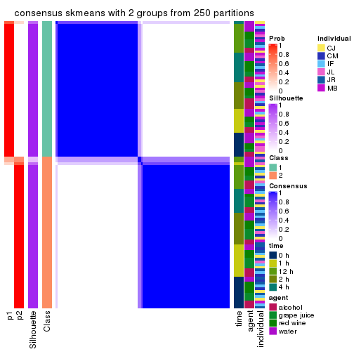</p>

</div>
<div id='tab-SD-skmeans-consensus-heatmap-2'>
<pre><code class="r">consensus_heatmap(res, k = 3)
</code></pre>

<p>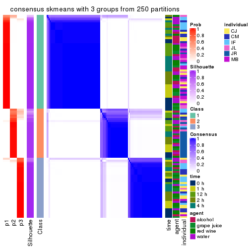</p>

</div>
<div id='tab-SD-skmeans-consensus-heatmap-3'>
<pre><code class="r">consensus_heatmap(res, k = 4)
</code></pre>

<p>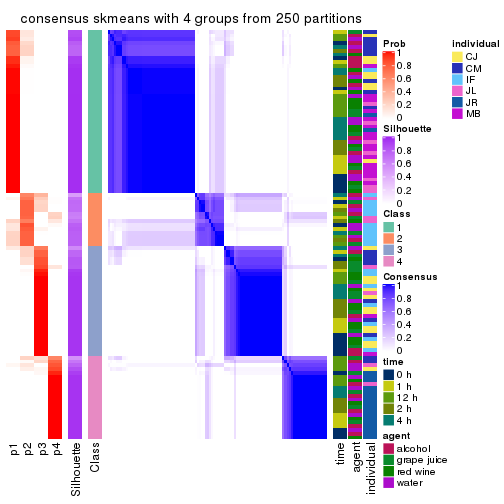</p>

</div>
<div id='tab-SD-skmeans-consensus-heatmap-4'>
<pre><code class="r">consensus_heatmap(res, k = 5)
</code></pre>

<p>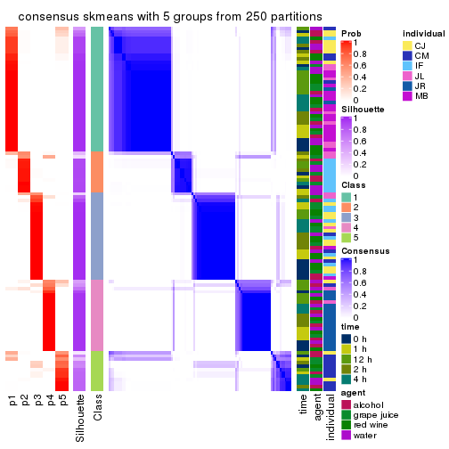</p>

</div>
<div id='tab-SD-skmeans-consensus-heatmap-5'>
<pre><code class="r">consensus_heatmap(res, k = 6)
</code></pre>

<p>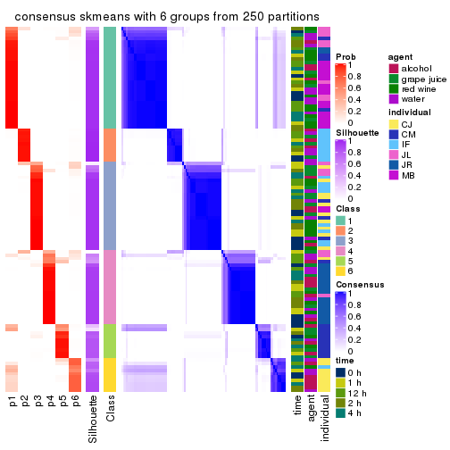</p>

</div>
</div>

Heatmaps for the membership of samples in all partitions to see how consistent they are:


<script>
$( function() {
	$( '#tabs-SD-skmeans-membership-heatmap' ).tabs();
} );
</script>
<div id='tabs-SD-skmeans-membership-heatmap'>
<ul>
<li><a href='#tab-SD-skmeans-membership-heatmap-1'>k = 2</a></li>
<li><a href='#tab-SD-skmeans-membership-heatmap-2'>k = 3</a></li>
<li><a href='#tab-SD-skmeans-membership-heatmap-3'>k = 4</a></li>
<li><a href='#tab-SD-skmeans-membership-heatmap-4'>k = 5</a></li>
<li><a href='#tab-SD-skmeans-membership-heatmap-5'>k = 6</a></li>
</ul>
<div id='tab-SD-skmeans-membership-heatmap-1'>
<pre><code class="r">membership_heatmap(res, k = 2)
</code></pre>

<p>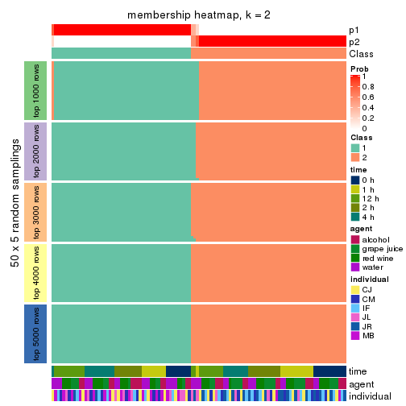</p>

</div>
<div id='tab-SD-skmeans-membership-heatmap-2'>
<pre><code class="r">membership_heatmap(res, k = 3)
</code></pre>

<p>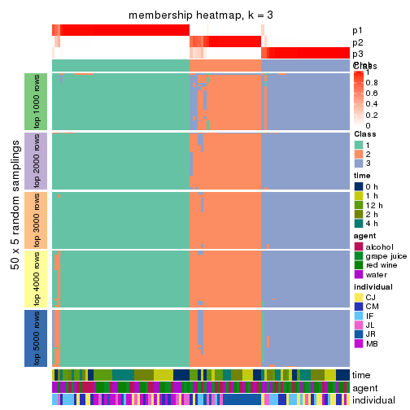</p>

</div>
<div id='tab-SD-skmeans-membership-heatmap-3'>
<pre><code class="r">membership_heatmap(res, k = 4)
</code></pre>

<p>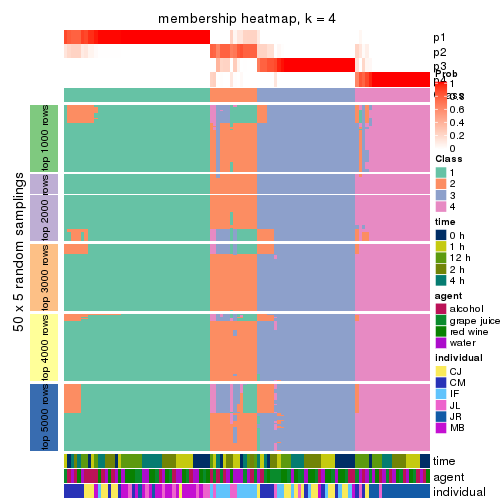</p>

</div>
<div id='tab-SD-skmeans-membership-heatmap-4'>
<pre><code class="r">membership_heatmap(res, k = 5)
</code></pre>

<p>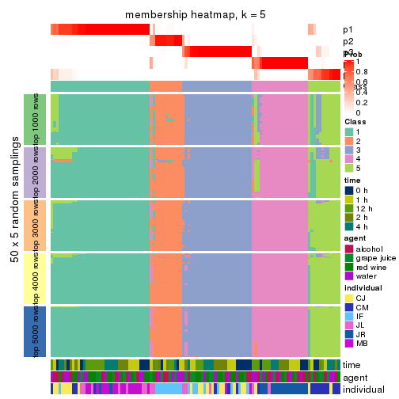</p>

</div>
<div id='tab-SD-skmeans-membership-heatmap-5'>
<pre><code class="r">membership_heatmap(res, k = 6)
</code></pre>

<p>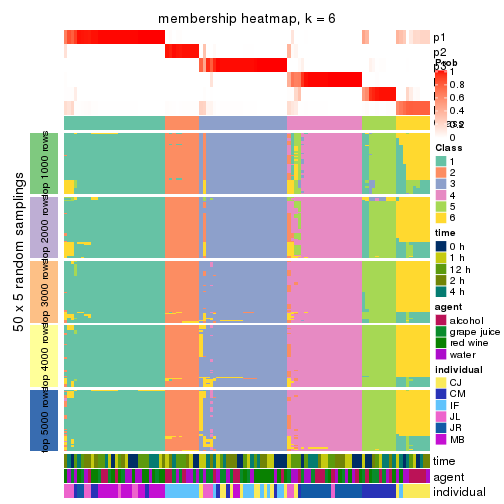</p>

</div>
</div>

As soon as we have had the classes for columns, we can look for signatures
which are significantly different between classes which can be candidate marks
for certain classes. Following are the heatmaps for signatures.


Signature heatmaps where rows are scaled:


<script>
$( function() {
	$( '#tabs-SD-skmeans-get-signatures' ).tabs();
} );
</script>
<div id='tabs-SD-skmeans-get-signatures'>
<ul>
<li><a href='#tab-SD-skmeans-get-signatures-1'>k = 2</a></li>
<li><a href='#tab-SD-skmeans-get-signatures-2'>k = 3</a></li>
<li><a href='#tab-SD-skmeans-get-signatures-3'>k = 4</a></li>
<li><a href='#tab-SD-skmeans-get-signatures-4'>k = 5</a></li>
<li><a href='#tab-SD-skmeans-get-signatures-5'>k = 6</a></li>
</ul>
<div id='tab-SD-skmeans-get-signatures-1'>
<pre><code class="r">get_signatures(res, k = 2)
</code></pre>

<p>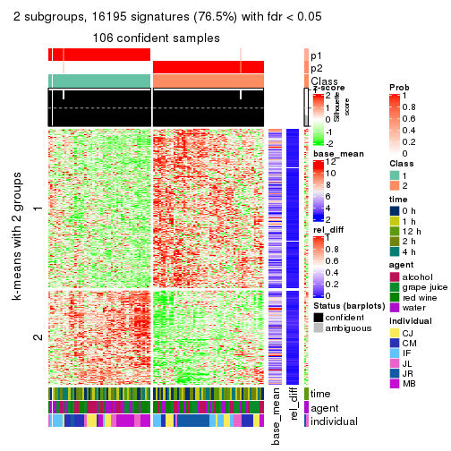</p>

</div>
<div id='tab-SD-skmeans-get-signatures-2'>
<pre><code class="r">get_signatures(res, k = 3)
</code></pre>

<p>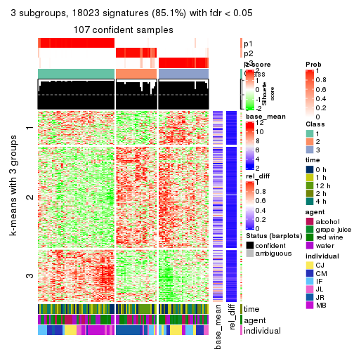</p>

</div>
<div id='tab-SD-skmeans-get-signatures-3'>
<pre><code class="r">get_signatures(res, k = 4)
</code></pre>

<p>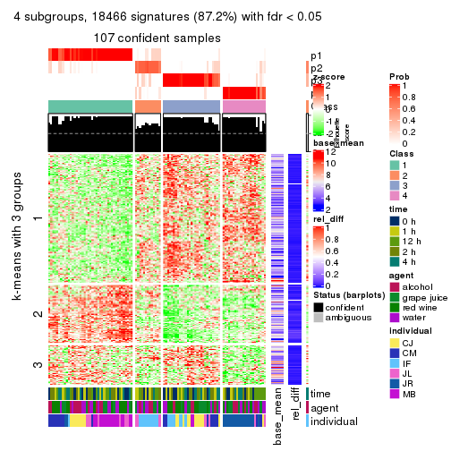</p>

</div>
<div id='tab-SD-skmeans-get-signatures-4'>
<pre><code class="r">get_signatures(res, k = 5)
</code></pre>

<p>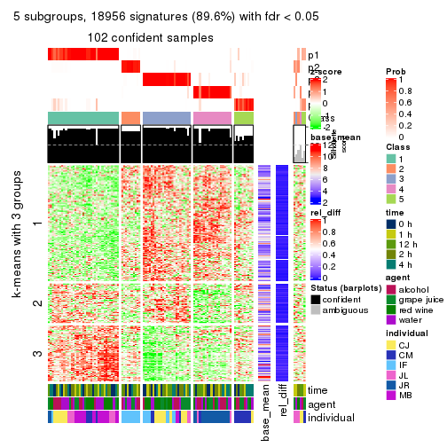</p>

</div>
<div id='tab-SD-skmeans-get-signatures-5'>
<pre><code class="r">get_signatures(res, k = 6)
</code></pre>

<p>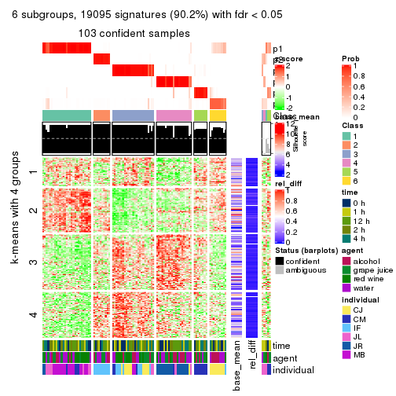</p>

</div>
</div>


Signature heatmaps where rows are not scaled:


<script>
$( function() {
	$( '#tabs-SD-skmeans-get-signatures-no-scale' ).tabs();
} );
</script>
<div id='tabs-SD-skmeans-get-signatures-no-scale'>
<ul>
<li><a href='#tab-SD-skmeans-get-signatures-no-scale-1'>k = 2</a></li>
<li><a href='#tab-SD-skmeans-get-signatures-no-scale-2'>k = 3</a></li>
<li><a href='#tab-SD-skmeans-get-signatures-no-scale-3'>k = 4</a></li>
<li><a href='#tab-SD-skmeans-get-signatures-no-scale-4'>k = 5</a></li>
<li><a href='#tab-SD-skmeans-get-signatures-no-scale-5'>k = 6</a></li>
</ul>
<div id='tab-SD-skmeans-get-signatures-no-scale-1'>
<pre><code class="r">get_signatures(res, k = 2, scale_rows = FALSE)
</code></pre>

<p>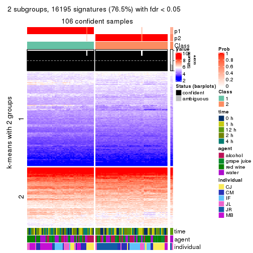</p>

</div>
<div id='tab-SD-skmeans-get-signatures-no-scale-2'>
<pre><code class="r">get_signatures(res, k = 3, scale_rows = FALSE)
</code></pre>

<p>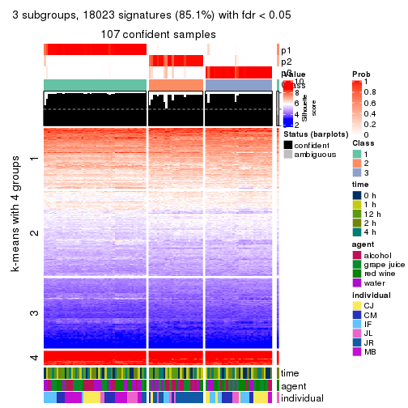</p>

</div>
<div id='tab-SD-skmeans-get-signatures-no-scale-3'>
<pre><code class="r">get_signatures(res, k = 4, scale_rows = FALSE)
</code></pre>

<p>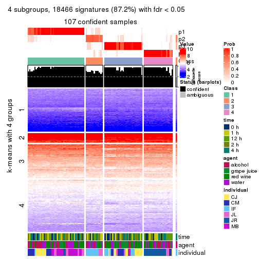</p>

</div>
<div id='tab-SD-skmeans-get-signatures-no-scale-4'>
<pre><code class="r">get_signatures(res, k = 5, scale_rows = FALSE)
</code></pre>

<p>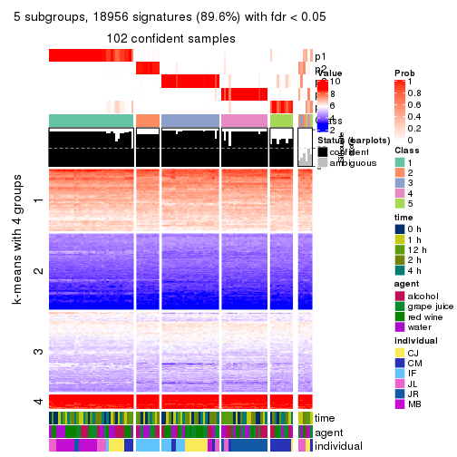</p>

</div>
<div id='tab-SD-skmeans-get-signatures-no-scale-5'>
<pre><code class="r">get_signatures(res, k = 6, scale_rows = FALSE)
</code></pre>

<p>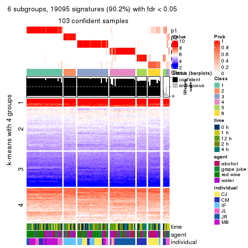</p>

</div>
</div>


Compare the overlap of signatures from different k:

```r
compare_signatures(res)
```

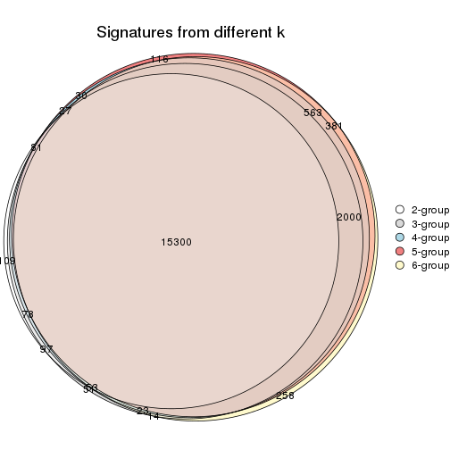

`get_signature()` returns a data frame invisibly. TO get the list of signatures, the function
call should be assigned to a variable explicitly. In following code, if `plot` argument is set
to `FALSE`, no heatmap is plotted while only the differential analysis is performed.

```r
# code only for demonstration
tb = get_signature(res, k = ..., plot = FALSE)
```

An example of the output of `tb` is:

```
#>   which_row         fdr    mean_1    mean_2 scaled_mean_1 scaled_mean_2 km
#> 1        38 0.042760348  8.373488  9.131774    -0.5533452     0.5164555  1
#> 2        40 0.018707592  7.106213  8.469186    -0.6173731     0.5762149  1
#> 3        55 0.019134737 10.221463 11.207825    -0.6159697     0.5749050  1
#> 4        59 0.006059896  5.921854  7.869574    -0.6899429     0.6439467  1
#> 5        60 0.018055526  8.928898 10.211722    -0.6204761     0.5791110  1
#> 6        98 0.009384629 15.714769 14.887706     0.6635654    -0.6193277  2
...
```

The columns in `tb` are:

1. `which_row`: row indices corresponding to the input matrix.
2. `fdr`: FDR for the differential test. 
3. `mean_x`: The mean value in group x.
4. `scaled_mean_x`: The mean value in group x after rows are scaled.
5. `km`: Row groups if k-means clustering is applied to rows.


UMAP plot which shows how samples are separated.


<script>
$( function() {
	$( '#tabs-SD-skmeans-dimension-reduction' ).tabs();
} );
</script>
<div id='tabs-SD-skmeans-dimension-reduction'>
<ul>
<li><a href='#tab-SD-skmeans-dimension-reduction-1'>k = 2</a></li>
<li><a href='#tab-SD-skmeans-dimension-reduction-2'>k = 3</a></li>
<li><a href='#tab-SD-skmeans-dimension-reduction-3'>k = 4</a></li>
<li><a href='#tab-SD-skmeans-dimension-reduction-4'>k = 5</a></li>
<li><a href='#tab-SD-skmeans-dimension-reduction-5'>k = 6</a></li>
</ul>
<div id='tab-SD-skmeans-dimension-reduction-1'>
<pre><code class="r">dimension_reduction(res, k = 2, method = &quot;UMAP&quot;)
</code></pre>

<p>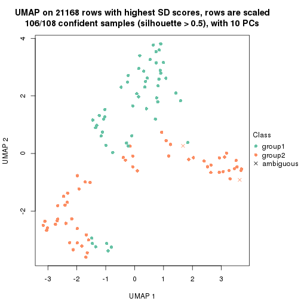</p>

</div>
<div id='tab-SD-skmeans-dimension-reduction-2'>
<pre><code class="r">dimension_reduction(res, k = 3, method = &quot;UMAP&quot;)
</code></pre>

<p>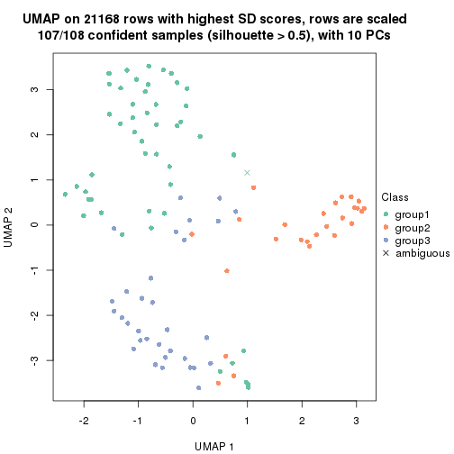</p>

</div>
<div id='tab-SD-skmeans-dimension-reduction-3'>
<pre><code class="r">dimension_reduction(res, k = 4, method = &quot;UMAP&quot;)
</code></pre>

<p>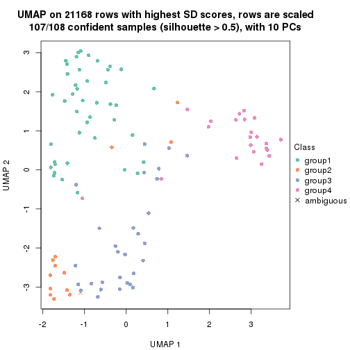</p>

</div>
<div id='tab-SD-skmeans-dimension-reduction-4'>
<pre><code class="r">dimension_reduction(res, k = 5, method = &quot;UMAP&quot;)
</code></pre>

<p>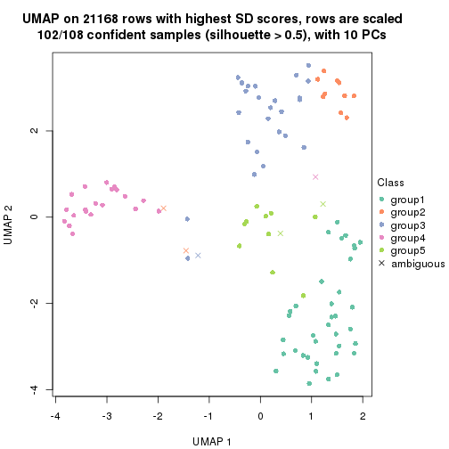</p>

</div>
<div id='tab-SD-skmeans-dimension-reduction-5'>
<pre><code class="r">dimension_reduction(res, k = 6, method = &quot;UMAP&quot;)
</code></pre>

<p>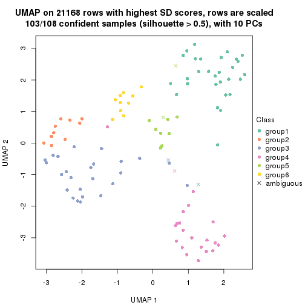</p>

</div>
</div>


Following heatmap shows how subgroups are split when increasing `k`:

```r
collect_classes(res)
```

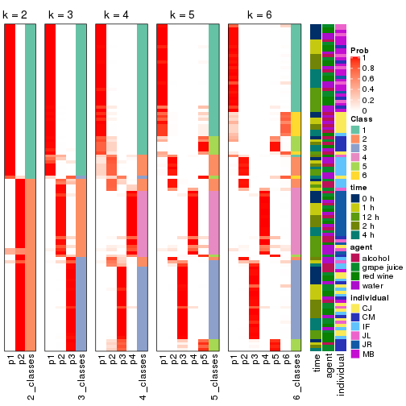


Test correlation between subgroups and known annotations. If the known
annotation is numeric, one-way ANOVA test is applied, and if the known
annotation is discrete, chi-squared contingency table test is applied.

```r
test_to_known_factors(res)
```

```
#>              n time(p) agent(p) individual(p) k
#> SD:skmeans 106   0.769    0.350      2.30e-04 2
#> SD:skmeans 107   0.693    0.555      3.79e-11 3
#> SD:skmeans 107   0.907    0.425      3.46e-20 4
#> SD:skmeans 102   0.991    0.612      1.71e-28 5
#> SD:skmeans 103   0.997    0.203      2.09e-35 6
```


If matrix rows can be associated to genes, consider to use `GO_Enrichment(res,
...)` to perform function enrichment for the signature genes.


 

---------------------------------------------------


### SD:pam*


The object with results only for a single top-value method and a single partition method 
can be extracted as:

```r
res = res_list["SD", "pam"]
# you can also extract it by
# res = res_list["SD:pam"]
```

A summary of `res` and all the functions that can be applied to it:

```r
res
```

```
#> A 'ConsensusPartition' object with k = 2, 3, 4, 5, 6.
#>   On a matrix with 21168 rows and 108 columns.
#>   Top rows (1000, 2000, 3000, 4000, 5000) are extracted by 'SD' method.
#>   Subgroups are detected by 'pam' method.
#>   Performed in total 1250 partitions by row resampling.
#>   Best k for subgroups seems to be 6.
#> 
#> Following methods can be applied to this 'ConsensusPartition' object:
#>  [1] "cola_report"             "collect_classes"         "collect_plots"          
#>  [4] "collect_stats"           "colnames"                "compare_signatures"     
#>  [7] "consensus_heatmap"       "dimension_reduction"     "functional_enrichment"  
#> [10] "get_anno_col"            "get_anno"                "get_classes"            
#> [13] "get_consensus"           "get_matrix"              "get_membership"         
#> [16] "get_param"               "get_signatures"          "get_stats"              
#> [19] "is_best_k"               "is_stable_k"             "membership_heatmap"     
#> [22] "ncol"                    "nrow"                    "plot_ecdf"              
#> [25] "rownames"                "select_partition_number" "show"                   
#> [28] "suggest_best_k"          "test_to_known_factors"
```

`collect_plots()` function collects all the plots made from `res` for all `k` (number of partitions)
into one single page to provide an easy and fast comparison between different `k`.

```r
collect_plots(res)
```

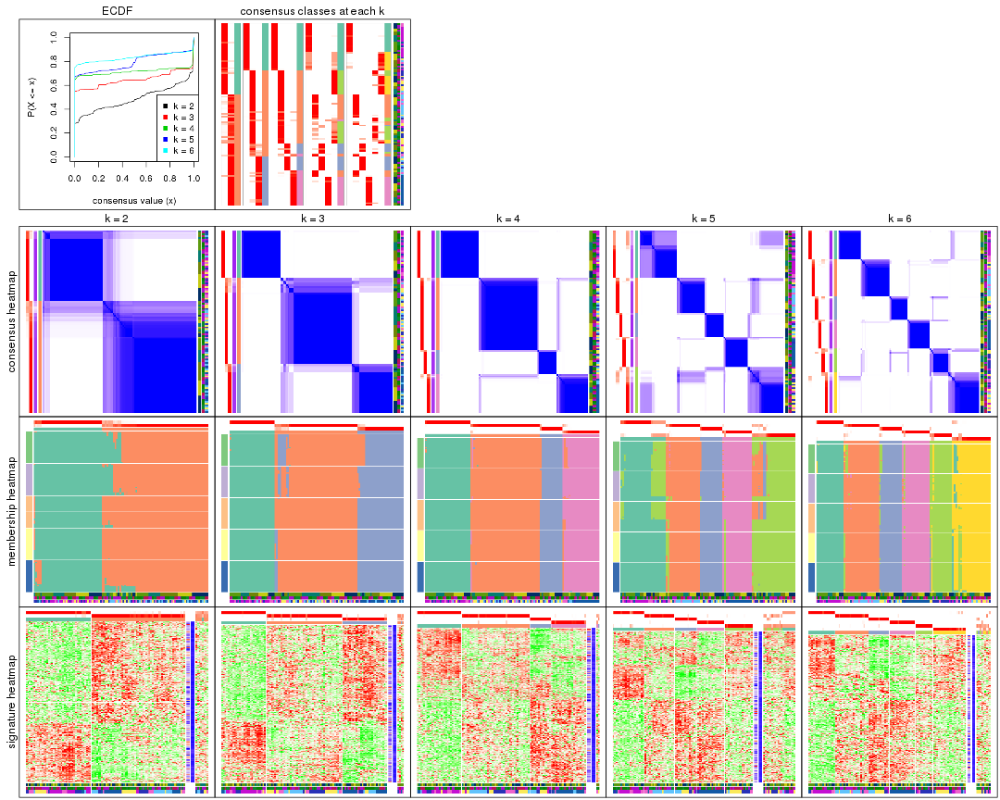

The plots are:

- The first row: a plot of the ECDF (Empirical cumulative distribution
  function) curves of the consensus matrix for each `k` and the heatmap of
  predicted classes for each `k`.
- The second row: heatmaps of the consensus matrix for each `k`.
- The third row: heatmaps of the membership matrix for each `k`.
- The fouth row: heatmaps of the signatures for each `k`.

All the plots in panels can be made by individual functions and they are
plotted later in this section.

`select_partition_number()` produces several plots showing different
statistics for choosing "optimized" `k`. There are following statistics:

- ECDF curves of the consensus matrix for each `k`;
- 1-PAC. [The PAC
  score](https://en.wikipedia.org/wiki/Consensus_clustering#Over-interpretation_potential_of_consensus_clustering)
  measures the proportion of the ambiguous subgrouping.
- Mean silhouette score.
- Concordance. The mean probability of fiting the consensus class ids in all
  partitions.
- Area increased. Denote $A_k$ as the area under the ECDF curve for current
  `k`, the area increased is defined as $A_k - A_{k-1}$.
- Rand index. The percent of pairs of samples that are both in a same cluster
  or both are not in a same cluster in the partition of k and k-1.
- Jaccard index. The ratio of pairs of samples are both in a same cluster in
  the partition of k and k-1 and the pairs of samples are both in a same
  cluster in the partition k or k-1.

The detailed explanations of these statistics can be found in [the cola
vignette](http://bioconductor.org/packages/devel/bioc/vignettes/cola/inst/doc/cola.html#toc_13).

Generally speaking, lower PAC score, higher mean silhouette score or higher
concordance corresponds to better partition. Rand index and Jaccard index
measure how similar the current partition is compared to partition with `k-1`.
If they are too similar, we won't accept `k` is better than `k-1`.

```r
select_partition_number(res)
```

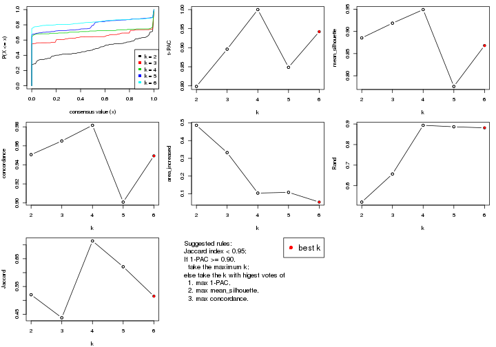

The numeric values for all these statistics can be obtained by `get_stats()`.

```r
get_stats(res)
```

```
#>   k 1-PAC mean_silhouette concordance area_increased  Rand Jaccard
#> 2 2 0.798           0.885       0.951         0.4865 0.520   0.520
#> 3 3 0.896           0.918       0.965         0.3324 0.657   0.437
#> 4 4 1.000           0.949       0.982         0.1040 0.894   0.714
#> 5 5 0.849           0.776       0.901         0.1084 0.886   0.621
#> 6 6 0.942           0.868       0.949         0.0533 0.881   0.515
```

`suggest_best_k()` suggests the best $k$ based on these statistics. The rules are as follows:

- All $k$ with Jaccard index larger than 0.95 are removed because the increase of
  the partition number does not provides enough extra information. If all $k$ are removed,
  the best $k$ is assigned by `NA`.
- For $k$ with 1-PAC larger than 0.9, the maximal $k$ is taken as the "best k". Other $k$ is called "optional k".
- If it does not fit the second rule. The $k$ with the highest vote of highest
  1-PAC, mean silhouette and concordance is taken as the "best k".

```r
suggest_best_k(res)
```

```
#> [1] 6
#> attr(,"optional")
#> [1] 4
```

There is also optional best $k$ = 4 that is worth to check.

Following shows the table of the partitions (You need to click the **show/hide
code output** link to see it). The membership matrix (columns with name `p*`)
is inferred by
[`clue::cl_consensus()`](https://www.rdocumentation.org/link/cl_consensus?package=clue)
function with the `SE` method. Basically the value in the membership matrix
represents the probability to belong to a certain group. The finall class
label for an item is determined with the group with highest probability it
belongs to.

In `get_classes()` function, the entropy is calculated from the membership
matrix and the silhouette score is calculated from the consensus matrix.


<script>
$( function() {
	$( '#tabs-SD-pam-get-classes' ).tabs();
} );
</script>
<div id='tabs-SD-pam-get-classes'>
<ul>
<li><a href='#tab-SD-pam-get-classes-1'>k = 2</a></li>
<li><a href='#tab-SD-pam-get-classes-2'>k = 3</a></li>
<li><a href='#tab-SD-pam-get-classes-3'>k = 4</a></li>
<li><a href='#tab-SD-pam-get-classes-4'>k = 5</a></li>
<li><a href='#tab-SD-pam-get-classes-5'>k = 6</a></li>
</ul>

<div id='tab-SD-pam-get-classes-1'>
<p><a id='tab-SD-pam-get-classes-1-a' style='color:#0366d6' href='#'>show/hide code output</a></p>
<pre><code class="r">cbind(get_classes(res, k = 2), get_membership(res, k = 2))
</code></pre>

<pre><code>#&gt;          class entropy silhouette    p1    p2
#&gt; GSM87863     1   0.000      0.975 1.000 0.000
#&gt; GSM87887     1   0.000      0.975 1.000 0.000
#&gt; GSM87896     2   0.000      0.928 0.000 1.000
#&gt; GSM87934     2   0.000      0.928 0.000 1.000
#&gt; GSM87943     2   0.224      0.910 0.036 0.964
#&gt; GSM87853     2   0.000      0.928 0.000 1.000
#&gt; GSM87906     2   0.000      0.928 0.000 1.000
#&gt; GSM87920     1   0.000      0.975 1.000 0.000
#&gt; GSM87924     2   0.000      0.928 0.000 1.000
#&gt; GSM87858     2   0.000      0.928 0.000 1.000
#&gt; GSM87882     2   0.224      0.910 0.036 0.964
#&gt; GSM87891     2   0.000      0.928 0.000 1.000
#&gt; GSM87917     1   0.000      0.975 1.000 0.000
#&gt; GSM87929     2   0.000      0.928 0.000 1.000
#&gt; GSM87948     1   0.000      0.975 1.000 0.000
#&gt; GSM87868     1   0.000      0.975 1.000 0.000
#&gt; GSM87873     2   0.000      0.928 0.000 1.000
#&gt; GSM87901     2   0.814      0.685 0.252 0.748
#&gt; GSM87910     1   0.000      0.975 1.000 0.000
#&gt; GSM87938     2   0.000      0.928 0.000 1.000
#&gt; GSM87953     1   0.000      0.975 1.000 0.000
#&gt; GSM87864     1   0.000      0.975 1.000 0.000
#&gt; GSM87888     2   0.260      0.905 0.044 0.956
#&gt; GSM87897     2   0.000      0.928 0.000 1.000
#&gt; GSM87935     2   0.000      0.928 0.000 1.000
#&gt; GSM87944     1   0.000      0.975 1.000 0.000
#&gt; GSM87854     2   0.358      0.888 0.068 0.932
#&gt; GSM87878     1   0.000      0.975 1.000 0.000
#&gt; GSM87907     2   0.000      0.928 0.000 1.000
#&gt; GSM87921     2   0.141      0.918 0.020 0.980
#&gt; GSM87925     2   0.000      0.928 0.000 1.000
#&gt; GSM87957     1   0.000      0.975 1.000 0.000
#&gt; GSM87859     2   0.000      0.928 0.000 1.000
#&gt; GSM87883     1   0.000      0.975 1.000 0.000
#&gt; GSM87892     2   0.000      0.928 0.000 1.000
#&gt; GSM87930     2   0.000      0.928 0.000 1.000
#&gt; GSM87949     1   0.000      0.975 1.000 0.000
#&gt; GSM87869     1   0.000      0.975 1.000 0.000
#&gt; GSM87874     2   0.000      0.928 0.000 1.000
#&gt; GSM87902     2   0.697      0.770 0.188 0.812
#&gt; GSM87911     2   0.552      0.834 0.128 0.872
#&gt; GSM87939     2   0.000      0.928 0.000 1.000
#&gt; GSM87954     1   0.000      0.975 1.000 0.000
#&gt; GSM87865     1   0.000      0.975 1.000 0.000
#&gt; GSM87889     1   0.482      0.869 0.896 0.104
#&gt; GSM87898     1   0.615      0.807 0.848 0.152
#&gt; GSM87915     1   0.000      0.975 1.000 0.000
#&gt; GSM87936     2   0.000      0.928 0.000 1.000
#&gt; GSM87945     2   0.000      0.928 0.000 1.000
#&gt; GSM87855     2   0.000      0.928 0.000 1.000
#&gt; GSM87879     2   0.224      0.910 0.036 0.964
#&gt; GSM87922     2   0.000      0.928 0.000 1.000
#&gt; GSM87926     2   0.000      0.928 0.000 1.000
#&gt; GSM87958     1   0.000      0.975 1.000 0.000
#&gt; GSM87860     2   0.000      0.928 0.000 1.000
#&gt; GSM87884     1   0.000      0.975 1.000 0.000
#&gt; GSM87893     2   0.000      0.928 0.000 1.000
#&gt; GSM87918     2   0.971      0.390 0.400 0.600
#&gt; GSM87931     2   0.000      0.928 0.000 1.000
#&gt; GSM87950     1   0.000      0.975 1.000 0.000
#&gt; GSM87870     1   0.000      0.975 1.000 0.000
#&gt; GSM87875     2   0.000      0.928 0.000 1.000
#&gt; GSM87903     2   0.000      0.928 0.000 1.000
#&gt; GSM87912     1   0.000      0.975 1.000 0.000
#&gt; GSM87940     2   0.000      0.928 0.000 1.000
#&gt; GSM87866     1   0.000      0.975 1.000 0.000
#&gt; GSM87899     2   0.000      0.928 0.000 1.000
#&gt; GSM87937     2   0.000      0.928 0.000 1.000
#&gt; GSM87946     1   0.000      0.975 1.000 0.000
#&gt; GSM87856     2   0.260      0.905 0.044 0.956
#&gt; GSM87880     2   0.311      0.897 0.056 0.944
#&gt; GSM87908     2   0.224      0.910 0.036 0.964
#&gt; GSM87923     2   0.000      0.928 0.000 1.000
#&gt; GSM87927     2   0.000      0.928 0.000 1.000
#&gt; GSM87959     1   0.000      0.975 1.000 0.000
#&gt; GSM87861     2   0.000      0.928 0.000 1.000
#&gt; GSM87885     2   0.999      0.167 0.484 0.516
#&gt; GSM87894     1   0.000      0.975 1.000 0.000
#&gt; GSM87932     1   0.615      0.807 0.848 0.152
#&gt; GSM87951     1   0.000      0.975 1.000 0.000
#&gt; GSM87871     2   0.975      0.388 0.408 0.592
#&gt; GSM87876     1   0.917      0.432 0.668 0.332
#&gt; GSM87904     2   0.000      0.928 0.000 1.000
#&gt; GSM87913     1   0.000      0.975 1.000 0.000
#&gt; GSM87941     2   0.000      0.928 0.000 1.000
#&gt; GSM87955     1   0.000      0.975 1.000 0.000
#&gt; GSM87867     2   1.000      0.132 0.496 0.504
#&gt; GSM87890     2   0.000      0.928 0.000 1.000
#&gt; GSM87900     2   0.000      0.928 0.000 1.000
#&gt; GSM87916     2   0.000      0.928 0.000 1.000
#&gt; GSM87947     1   0.000      0.975 1.000 0.000
#&gt; GSM87857     2   0.224      0.910 0.036 0.964
#&gt; GSM87881     2   0.000      0.928 0.000 1.000
#&gt; GSM87909     2   0.990      0.303 0.440 0.560
#&gt; GSM87928     1   0.634      0.796 0.840 0.160
#&gt; GSM87960     1   0.000      0.975 1.000 0.000
#&gt; GSM87862     2   0.000      0.928 0.000 1.000
#&gt; GSM87886     1   0.000      0.975 1.000 0.000
#&gt; GSM87895     2   0.000      0.928 0.000 1.000
#&gt; GSM87919     1   0.000      0.975 1.000 0.000
#&gt; GSM87933     2   0.000      0.928 0.000 1.000
#&gt; GSM87952     1   0.000      0.975 1.000 0.000
#&gt; GSM87872     2   0.644      0.790 0.164 0.836
#&gt; GSM87877     1   0.000      0.975 1.000 0.000
#&gt; GSM87905     2   0.993      0.270 0.452 0.548
#&gt; GSM87914     2   0.767      0.715 0.224 0.776
#&gt; GSM87942     2   0.949      0.463 0.368 0.632
#&gt; GSM87956     1   0.000      0.975 1.000 0.000
</code></pre>

<script>
$('#tab-SD-pam-get-classes-1-a').parent().next().next().hide();
$('#tab-SD-pam-get-classes-1-a').click(function(){
  $('#tab-SD-pam-get-classes-1-a').parent().next().next().toggle();
  return(false);
});
</script>
</div>

<div id='tab-SD-pam-get-classes-2'>
<p><a id='tab-SD-pam-get-classes-2-a' style='color:#0366d6' href='#'>show/hide code output</a></p>
<pre><code class="r">cbind(get_classes(res, k = 3), get_membership(res, k = 3))
</code></pre>

<pre><code>#&gt;          class entropy silhouette    p1    p2    p3
#&gt; GSM87863     2  0.0000      0.946 0.000 1.000 0.000
#&gt; GSM87887     2  0.0000      0.946 0.000 1.000 0.000
#&gt; GSM87896     3  0.0000      0.949 0.000 0.000 1.000
#&gt; GSM87934     3  0.0000      0.949 0.000 0.000 1.000
#&gt; GSM87943     2  0.0000      0.946 0.000 1.000 0.000
#&gt; GSM87853     2  0.4555      0.746 0.000 0.800 0.200
#&gt; GSM87906     2  0.0000      0.946 0.000 1.000 0.000
#&gt; GSM87920     2  0.0000      0.946 0.000 1.000 0.000
#&gt; GSM87924     3  0.0000      0.949 0.000 0.000 1.000
#&gt; GSM87858     3  0.0000      0.949 0.000 0.000 1.000
#&gt; GSM87882     2  0.0000      0.946 0.000 1.000 0.000
#&gt; GSM87891     3  0.0000      0.949 0.000 0.000 1.000
#&gt; GSM87917     1  0.0000      0.998 1.000 0.000 0.000
#&gt; GSM87929     3  0.4555      0.757 0.000 0.200 0.800
#&gt; GSM87948     1  0.0000      0.998 1.000 0.000 0.000
#&gt; GSM87868     2  0.0000      0.946 0.000 1.000 0.000
#&gt; GSM87873     3  0.0000      0.949 0.000 0.000 1.000
#&gt; GSM87901     2  0.0000      0.946 0.000 1.000 0.000
#&gt; GSM87910     1  0.0000      0.998 1.000 0.000 0.000
#&gt; GSM87938     3  0.0000      0.949 0.000 0.000 1.000
#&gt; GSM87953     1  0.0000      0.998 1.000 0.000 0.000
#&gt; GSM87864     2  0.0000      0.946 0.000 1.000 0.000
#&gt; GSM87888     2  0.0000      0.946 0.000 1.000 0.000
#&gt; GSM87897     2  0.0000      0.946 0.000 1.000 0.000
#&gt; GSM87935     3  0.0000      0.949 0.000 0.000 1.000
#&gt; GSM87944     1  0.0000      0.998 1.000 0.000 0.000
#&gt; GSM87854     2  0.0000      0.946 0.000 1.000 0.000
#&gt; GSM87878     2  0.0000      0.946 0.000 1.000 0.000
#&gt; GSM87907     3  0.0000      0.949 0.000 0.000 1.000
#&gt; GSM87921     2  0.0000      0.946 0.000 1.000 0.000
#&gt; GSM87925     3  0.0000      0.949 0.000 0.000 1.000
#&gt; GSM87957     1  0.0000      0.998 1.000 0.000 0.000
#&gt; GSM87859     3  0.0000      0.949 0.000 0.000 1.000
#&gt; GSM87883     1  0.0000      0.998 1.000 0.000 0.000
#&gt; GSM87892     3  0.0000      0.949 0.000 0.000 1.000
#&gt; GSM87930     3  0.0000      0.949 0.000 0.000 1.000
#&gt; GSM87949     1  0.0000      0.998 1.000 0.000 0.000
#&gt; GSM87869     1  0.0000      0.998 1.000 0.000 0.000
#&gt; GSM87874     3  0.0000      0.949 0.000 0.000 1.000
#&gt; GSM87902     2  0.0000      0.946 0.000 1.000 0.000
#&gt; GSM87911     2  0.0000      0.946 0.000 1.000 0.000
#&gt; GSM87939     3  0.0000      0.949 0.000 0.000 1.000
#&gt; GSM87954     1  0.0000      0.998 1.000 0.000 0.000
#&gt; GSM87865     2  0.0000      0.946 0.000 1.000 0.000
#&gt; GSM87889     2  0.0000      0.946 0.000 1.000 0.000
#&gt; GSM87898     1  0.0000      0.998 1.000 0.000 0.000
#&gt; GSM87915     1  0.0000      0.998 1.000 0.000 0.000
#&gt; GSM87936     3  0.0000      0.949 0.000 0.000 1.000
#&gt; GSM87945     2  0.6126      0.393 0.000 0.600 0.400
#&gt; GSM87855     2  0.4555      0.746 0.000 0.800 0.200
#&gt; GSM87879     2  0.0000      0.946 0.000 1.000 0.000
#&gt; GSM87922     2  0.3941      0.797 0.000 0.844 0.156
#&gt; GSM87926     3  0.0000      0.949 0.000 0.000 1.000
#&gt; GSM87958     1  0.0000      0.998 1.000 0.000 0.000
#&gt; GSM87860     2  0.0000      0.946 0.000 1.000 0.000
#&gt; GSM87884     1  0.0000      0.998 1.000 0.000 0.000
#&gt; GSM87893     3  0.0000      0.949 0.000 0.000 1.000
#&gt; GSM87918     2  0.0000      0.946 0.000 1.000 0.000
#&gt; GSM87931     3  0.0000      0.949 0.000 0.000 1.000
#&gt; GSM87950     1  0.0000      0.998 1.000 0.000 0.000
#&gt; GSM87870     2  0.0000      0.946 0.000 1.000 0.000
#&gt; GSM87875     2  0.5988      0.467 0.000 0.632 0.368
#&gt; GSM87903     2  0.0000      0.946 0.000 1.000 0.000
#&gt; GSM87912     1  0.0000      0.998 1.000 0.000 0.000
#&gt; GSM87940     3  0.0000      0.949 0.000 0.000 1.000
#&gt; GSM87866     2  0.0000      0.946 0.000 1.000 0.000
#&gt; GSM87899     2  0.0000      0.946 0.000 1.000 0.000
#&gt; GSM87937     3  0.0000      0.949 0.000 0.000 1.000
#&gt; GSM87946     1  0.0000      0.998 1.000 0.000 0.000
#&gt; GSM87856     2  0.0000      0.946 0.000 1.000 0.000
#&gt; GSM87880     2  0.0000      0.946 0.000 1.000 0.000
#&gt; GSM87908     2  0.0000      0.946 0.000 1.000 0.000
#&gt; GSM87923     2  0.5363      0.634 0.000 0.724 0.276
#&gt; GSM87927     3  0.4555      0.757 0.000 0.200 0.800
#&gt; GSM87959     1  0.0000      0.998 1.000 0.000 0.000
#&gt; GSM87861     2  0.4555      0.746 0.000 0.800 0.200
#&gt; GSM87885     2  0.0000      0.946 0.000 1.000 0.000
#&gt; GSM87894     2  0.0000      0.946 0.000 1.000 0.000
#&gt; GSM87932     1  0.0000      0.998 1.000 0.000 0.000
#&gt; GSM87951     1  0.0000      0.998 1.000 0.000 0.000
#&gt; GSM87871     2  0.0000      0.946 0.000 1.000 0.000
#&gt; GSM87876     2  0.0000      0.946 0.000 1.000 0.000
#&gt; GSM87904     2  0.0000      0.946 0.000 1.000 0.000
#&gt; GSM87913     2  0.0000      0.946 0.000 1.000 0.000
#&gt; GSM87941     3  0.4555      0.757 0.000 0.200 0.800
#&gt; GSM87955     1  0.0000      0.998 1.000 0.000 0.000
#&gt; GSM87867     2  0.0000      0.946 0.000 1.000 0.000
#&gt; GSM87890     3  0.0000      0.949 0.000 0.000 1.000
#&gt; GSM87900     2  0.5529      0.549 0.000 0.704 0.296
#&gt; GSM87916     3  0.5327      0.650 0.000 0.272 0.728
#&gt; GSM87947     1  0.1411      0.956 0.964 0.036 0.000
#&gt; GSM87857     2  0.0000      0.946 0.000 1.000 0.000
#&gt; GSM87881     2  0.0000      0.946 0.000 1.000 0.000
#&gt; GSM87909     2  0.0000      0.946 0.000 1.000 0.000
#&gt; GSM87928     1  0.0000      0.998 1.000 0.000 0.000
#&gt; GSM87960     1  0.0000      0.998 1.000 0.000 0.000
#&gt; GSM87862     2  0.0000      0.946 0.000 1.000 0.000
#&gt; GSM87886     1  0.0000      0.998 1.000 0.000 0.000
#&gt; GSM87895     3  0.0000      0.949 0.000 0.000 1.000
#&gt; GSM87919     1  0.0000      0.998 1.000 0.000 0.000
#&gt; GSM87933     3  0.0000      0.949 0.000 0.000 1.000
#&gt; GSM87952     1  0.0000      0.998 1.000 0.000 0.000
#&gt; GSM87872     2  0.0000      0.946 0.000 1.000 0.000
#&gt; GSM87877     2  0.0000      0.946 0.000 1.000 0.000
#&gt; GSM87905     2  0.0592      0.936 0.012 0.988 0.000
#&gt; GSM87914     2  0.6095      0.307 0.000 0.608 0.392
#&gt; GSM87942     3  0.5926      0.483 0.000 0.356 0.644
#&gt; GSM87956     1  0.0000      0.998 1.000 0.000 0.000
</code></pre>

<script>
$('#tab-SD-pam-get-classes-2-a').parent().next().next().hide();
$('#tab-SD-pam-get-classes-2-a').click(function(){
  $('#tab-SD-pam-get-classes-2-a').parent().next().next().toggle();
  return(false);
});
</script>
</div>

<div id='tab-SD-pam-get-classes-3'>
<p><a id='tab-SD-pam-get-classes-3-a' style='color:#0366d6' href='#'>show/hide code output</a></p>
<pre><code class="r">cbind(get_classes(res, k = 4), get_membership(res, k = 4))
</code></pre>

<pre><code>#&gt;          class entropy silhouette    p1    p2    p3    p4
#&gt; GSM87863     2  0.0000      0.984 0.000 1.000 0.000 0.000
#&gt; GSM87887     2  0.0000      0.984 0.000 1.000 0.000 0.000
#&gt; GSM87896     3  0.0000      0.961 0.000 0.000 1.000 0.000
#&gt; GSM87934     4  0.0000      0.941 0.000 0.000 0.000 1.000
#&gt; GSM87943     2  0.0000      0.984 0.000 1.000 0.000 0.000
#&gt; GSM87853     3  0.0000      0.961 0.000 0.000 1.000 0.000
#&gt; GSM87906     2  0.0000      0.984 0.000 1.000 0.000 0.000
#&gt; GSM87920     2  0.0000      0.984 0.000 1.000 0.000 0.000
#&gt; GSM87924     4  0.0000      0.941 0.000 0.000 0.000 1.000
#&gt; GSM87858     3  0.0000      0.961 0.000 0.000 1.000 0.000
#&gt; GSM87882     2  0.0000      0.984 0.000 1.000 0.000 0.000
#&gt; GSM87891     3  0.0000      0.961 0.000 0.000 1.000 0.000
#&gt; GSM87917     1  0.0000      0.998 1.000 0.000 0.000 0.000
#&gt; GSM87929     4  0.0000      0.941 0.000 0.000 0.000 1.000
#&gt; GSM87948     1  0.0000      0.998 1.000 0.000 0.000 0.000
#&gt; GSM87868     2  0.0000      0.984 0.000 1.000 0.000 0.000
#&gt; GSM87873     3  0.0000      0.961 0.000 0.000 1.000 0.000
#&gt; GSM87901     2  0.0000      0.984 0.000 1.000 0.000 0.000
#&gt; GSM87910     1  0.0000      0.998 1.000 0.000 0.000 0.000
#&gt; GSM87938     4  0.0000      0.941 0.000 0.000 0.000 1.000
#&gt; GSM87953     1  0.0000      0.998 1.000 0.000 0.000 0.000
#&gt; GSM87864     2  0.0000      0.984 0.000 1.000 0.000 0.000
#&gt; GSM87888     2  0.0000      0.984 0.000 1.000 0.000 0.000
#&gt; GSM87897     2  0.0000      0.984 0.000 1.000 0.000 0.000
#&gt; GSM87935     4  0.0000      0.941 0.000 0.000 0.000 1.000
#&gt; GSM87944     1  0.0000      0.998 1.000 0.000 0.000 0.000
#&gt; GSM87854     2  0.0000      0.984 0.000 1.000 0.000 0.000
#&gt; GSM87878     2  0.0000      0.984 0.000 1.000 0.000 0.000
#&gt; GSM87907     4  0.0672      0.930 0.000 0.008 0.008 0.984
#&gt; GSM87921     2  0.0000      0.984 0.000 1.000 0.000 0.000
#&gt; GSM87925     4  0.0000      0.941 0.000 0.000 0.000 1.000
#&gt; GSM87957     1  0.0000      0.998 1.000 0.000 0.000 0.000
#&gt; GSM87859     3  0.0000      0.961 0.000 0.000 1.000 0.000
#&gt; GSM87883     1  0.0000      0.998 1.000 0.000 0.000 0.000
#&gt; GSM87892     3  0.0000      0.961 0.000 0.000 1.000 0.000
#&gt; GSM87930     4  0.0000      0.941 0.000 0.000 0.000 1.000
#&gt; GSM87949     1  0.0000      0.998 1.000 0.000 0.000 0.000
#&gt; GSM87869     1  0.0000      0.998 1.000 0.000 0.000 0.000
#&gt; GSM87874     3  0.0000      0.961 0.000 0.000 1.000 0.000
#&gt; GSM87902     2  0.0000      0.984 0.000 1.000 0.000 0.000
#&gt; GSM87911     2  0.0000      0.984 0.000 1.000 0.000 0.000
#&gt; GSM87939     4  0.0000      0.941 0.000 0.000 0.000 1.000
#&gt; GSM87954     1  0.0000      0.998 1.000 0.000 0.000 0.000
#&gt; GSM87865     2  0.0000      0.984 0.000 1.000 0.000 0.000
#&gt; GSM87889     2  0.0000      0.984 0.000 1.000 0.000 0.000
#&gt; GSM87898     1  0.0000      0.998 1.000 0.000 0.000 0.000
#&gt; GSM87915     1  0.0000      0.998 1.000 0.000 0.000 0.000
#&gt; GSM87936     4  0.0000      0.941 0.000 0.000 0.000 1.000
#&gt; GSM87945     3  0.0000      0.961 0.000 0.000 1.000 0.000
#&gt; GSM87855     3  0.0000      0.961 0.000 0.000 1.000 0.000
#&gt; GSM87879     2  0.0000      0.984 0.000 1.000 0.000 0.000
#&gt; GSM87922     4  0.4989      0.114 0.000 0.472 0.000 0.528
#&gt; GSM87926     4  0.0000      0.941 0.000 0.000 0.000 1.000
#&gt; GSM87958     1  0.0000      0.998 1.000 0.000 0.000 0.000
#&gt; GSM87860     3  0.4830      0.349 0.000 0.392 0.608 0.000
#&gt; GSM87884     1  0.0000      0.998 1.000 0.000 0.000 0.000
#&gt; GSM87893     3  0.0000      0.961 0.000 0.000 1.000 0.000
#&gt; GSM87918     2  0.0000      0.984 0.000 1.000 0.000 0.000
#&gt; GSM87931     4  0.0000      0.941 0.000 0.000 0.000 1.000
#&gt; GSM87950     1  0.0000      0.998 1.000 0.000 0.000 0.000
#&gt; GSM87870     2  0.0000      0.984 0.000 1.000 0.000 0.000
#&gt; GSM87875     3  0.0000      0.961 0.000 0.000 1.000 0.000
#&gt; GSM87903     2  0.0000      0.984 0.000 1.000 0.000 0.000
#&gt; GSM87912     1  0.0000      0.998 1.000 0.000 0.000 0.000
#&gt; GSM87940     4  0.0000      0.941 0.000 0.000 0.000 1.000
#&gt; GSM87866     2  0.0000      0.984 0.000 1.000 0.000 0.000
#&gt; GSM87899     2  0.0000      0.984 0.000 1.000 0.000 0.000
#&gt; GSM87937     4  0.0000      0.941 0.000 0.000 0.000 1.000
#&gt; GSM87946     1  0.0000      0.998 1.000 0.000 0.000 0.000
#&gt; GSM87856     2  0.0921      0.958 0.000 0.972 0.028 0.000
#&gt; GSM87880     2  0.0000      0.984 0.000 1.000 0.000 0.000
#&gt; GSM87908     2  0.0000      0.984 0.000 1.000 0.000 0.000
#&gt; GSM87923     2  0.3801      0.702 0.000 0.780 0.000 0.220
#&gt; GSM87927     4  0.0000      0.941 0.000 0.000 0.000 1.000
#&gt; GSM87959     1  0.0000      0.998 1.000 0.000 0.000 0.000
#&gt; GSM87861     3  0.0000      0.961 0.000 0.000 1.000 0.000
#&gt; GSM87885     2  0.0000      0.984 0.000 1.000 0.000 0.000
#&gt; GSM87894     2  0.0000      0.984 0.000 1.000 0.000 0.000
#&gt; GSM87932     1  0.0000      0.998 1.000 0.000 0.000 0.000
#&gt; GSM87951     1  0.0000      0.998 1.000 0.000 0.000 0.000
#&gt; GSM87871     2  0.0000      0.984 0.000 1.000 0.000 0.000
#&gt; GSM87876     2  0.0000      0.984 0.000 1.000 0.000 0.000
#&gt; GSM87904     2  0.0000      0.984 0.000 1.000 0.000 0.000
#&gt; GSM87913     2  0.0000      0.984 0.000 1.000 0.000 0.000
#&gt; GSM87941     4  0.0000      0.941 0.000 0.000 0.000 1.000
#&gt; GSM87955     1  0.0000      0.998 1.000 0.000 0.000 0.000
#&gt; GSM87867     2  0.0000      0.984 0.000 1.000 0.000 0.000
#&gt; GSM87890     4  0.0000      0.941 0.000 0.000 0.000 1.000
#&gt; GSM87900     2  0.4477      0.516 0.000 0.688 0.000 0.312
#&gt; GSM87916     4  0.3024      0.769 0.000 0.148 0.000 0.852
#&gt; GSM87947     1  0.1118      0.951 0.964 0.036 0.000 0.000
#&gt; GSM87857     2  0.0707      0.966 0.000 0.980 0.020 0.000
#&gt; GSM87881     2  0.0000      0.984 0.000 1.000 0.000 0.000
#&gt; GSM87909     2  0.0000      0.984 0.000 1.000 0.000 0.000
#&gt; GSM87928     1  0.0000      0.998 1.000 0.000 0.000 0.000
#&gt; GSM87960     1  0.0000      0.998 1.000 0.000 0.000 0.000
#&gt; GSM87862     2  0.0000      0.984 0.000 1.000 0.000 0.000
#&gt; GSM87886     1  0.0000      0.998 1.000 0.000 0.000 0.000
#&gt; GSM87895     4  0.0336      0.935 0.000 0.000 0.008 0.992
#&gt; GSM87919     1  0.0000      0.998 1.000 0.000 0.000 0.000
#&gt; GSM87933     4  0.0000      0.941 0.000 0.000 0.000 1.000
#&gt; GSM87952     1  0.0000      0.998 1.000 0.000 0.000 0.000
#&gt; GSM87872     2  0.0000      0.984 0.000 1.000 0.000 0.000
#&gt; GSM87877     2  0.0000      0.984 0.000 1.000 0.000 0.000
#&gt; GSM87905     2  0.0469      0.972 0.012 0.988 0.000 0.000
#&gt; GSM87914     4  0.4406      0.565 0.000 0.300 0.000 0.700
#&gt; GSM87942     4  0.0707      0.922 0.000 0.020 0.000 0.980
#&gt; GSM87956     1  0.0000      0.998 1.000 0.000 0.000 0.000
</code></pre>

<script>
$('#tab-SD-pam-get-classes-3-a').parent().next().next().hide();
$('#tab-SD-pam-get-classes-3-a').click(function(){
  $('#tab-SD-pam-get-classes-3-a').parent().next().next().toggle();
  return(false);
});
</script>
</div>

<div id='tab-SD-pam-get-classes-4'>
<p><a id='tab-SD-pam-get-classes-4-a' style='color:#0366d6' href='#'>show/hide code output</a></p>
<pre><code class="r">cbind(get_classes(res, k = 5), get_membership(res, k = 5))
</code></pre>

<pre><code>#&gt;          class entropy silhouette    p1    p2    p3    p4    p5
#&gt; GSM87863     5  0.0000    0.79542 0.000 0.000 0.000 0.000 1.000
#&gt; GSM87887     5  0.0000    0.79542 0.000 0.000 0.000 0.000 1.000
#&gt; GSM87896     3  0.0000    0.98082 0.000 0.000 1.000 0.000 0.000
#&gt; GSM87934     4  0.0000    0.95259 0.000 0.000 0.000 1.000 0.000
#&gt; GSM87943     5  0.4305    0.11105 0.000 0.000 0.488 0.000 0.512
#&gt; GSM87853     3  0.0000    0.98082 0.000 0.000 1.000 0.000 0.000
#&gt; GSM87906     2  0.0000    0.94408 0.000 1.000 0.000 0.000 0.000
#&gt; GSM87920     5  0.0000    0.79542 0.000 0.000 0.000 0.000 1.000
#&gt; GSM87924     4  0.0000    0.95259 0.000 0.000 0.000 1.000 0.000
#&gt; GSM87858     3  0.0000    0.98082 0.000 0.000 1.000 0.000 0.000
#&gt; GSM87882     5  0.4305    0.14958 0.000 0.488 0.000 0.000 0.512
#&gt; GSM87891     3  0.0000    0.98082 0.000 0.000 1.000 0.000 0.000
#&gt; GSM87917     1  0.0000    0.80445 1.000 0.000 0.000 0.000 0.000
#&gt; GSM87929     4  0.2966    0.73823 0.000 0.184 0.000 0.816 0.000
#&gt; GSM87948     1  0.4302    0.49161 0.520 0.000 0.000 0.000 0.480
#&gt; GSM87868     5  0.0000    0.79542 0.000 0.000 0.000 0.000 1.000
#&gt; GSM87873     3  0.0000    0.98082 0.000 0.000 1.000 0.000 0.000
#&gt; GSM87901     2  0.0000    0.94408 0.000 1.000 0.000 0.000 0.000
#&gt; GSM87910     1  0.0000    0.80445 1.000 0.000 0.000 0.000 0.000
#&gt; GSM87938     4  0.0000    0.95259 0.000 0.000 0.000 1.000 0.000
#&gt; GSM87953     1  0.0000    0.80445 1.000 0.000 0.000 0.000 0.000
#&gt; GSM87864     5  0.0000    0.79542 0.000 0.000 0.000 0.000 1.000
#&gt; GSM87888     5  0.4182    0.38006 0.000 0.400 0.000 0.000 0.600
#&gt; GSM87897     2  0.0000    0.94408 0.000 1.000 0.000 0.000 0.000
#&gt; GSM87935     4  0.0000    0.95259 0.000 0.000 0.000 1.000 0.000
#&gt; GSM87944     1  0.4305    0.48293 0.512 0.000 0.000 0.000 0.488
#&gt; GSM87854     5  0.2179    0.74487 0.000 0.112 0.000 0.000 0.888
#&gt; GSM87878     5  0.0000    0.79542 0.000 0.000 0.000 0.000 1.000
#&gt; GSM87907     2  0.0000    0.94408 0.000 1.000 0.000 0.000 0.000
#&gt; GSM87921     2  0.0000    0.94408 0.000 1.000 0.000 0.000 0.000
#&gt; GSM87925     4  0.0000    0.95259 0.000 0.000 0.000 1.000 0.000
#&gt; GSM87957     1  0.4305    0.48293 0.512 0.000 0.000 0.000 0.488
#&gt; GSM87859     3  0.0000    0.98082 0.000 0.000 1.000 0.000 0.000
#&gt; GSM87883     1  0.4305    0.48293 0.512 0.000 0.000 0.000 0.488
#&gt; GSM87892     3  0.0000    0.98082 0.000 0.000 1.000 0.000 0.000
#&gt; GSM87930     4  0.0000    0.95259 0.000 0.000 0.000 1.000 0.000
#&gt; GSM87949     1  0.0000    0.80445 1.000 0.000 0.000 0.000 0.000
#&gt; GSM87869     1  0.4305    0.48293 0.512 0.000 0.000 0.000 0.488
#&gt; GSM87874     3  0.0000    0.98082 0.000 0.000 1.000 0.000 0.000
#&gt; GSM87902     2  0.0000    0.94408 0.000 1.000 0.000 0.000 0.000
#&gt; GSM87911     2  0.4304   -0.13498 0.000 0.516 0.000 0.000 0.484
#&gt; GSM87939     4  0.0000    0.95259 0.000 0.000 0.000 1.000 0.000
#&gt; GSM87954     1  0.0000    0.80445 1.000 0.000 0.000 0.000 0.000
#&gt; GSM87865     5  0.0000    0.79542 0.000 0.000 0.000 0.000 1.000
#&gt; GSM87889     5  0.0000    0.79542 0.000 0.000 0.000 0.000 1.000
#&gt; GSM87898     1  0.4559    0.48602 0.512 0.008 0.000 0.000 0.480
#&gt; GSM87915     1  0.4138    0.59180 0.616 0.000 0.000 0.000 0.384
#&gt; GSM87936     4  0.0000    0.95259 0.000 0.000 0.000 1.000 0.000
#&gt; GSM87945     3  0.0000    0.98082 0.000 0.000 1.000 0.000 0.000
#&gt; GSM87855     3  0.0000    0.98082 0.000 0.000 1.000 0.000 0.000
#&gt; GSM87879     5  0.4291    0.22391 0.000 0.464 0.000 0.000 0.536
#&gt; GSM87922     2  0.1851    0.85443 0.000 0.912 0.000 0.088 0.000
#&gt; GSM87926     4  0.0000    0.95259 0.000 0.000 0.000 1.000 0.000
#&gt; GSM87958     1  0.0000    0.80445 1.000 0.000 0.000 0.000 0.000
#&gt; GSM87860     3  0.3944    0.69900 0.000 0.200 0.768 0.000 0.032
#&gt; GSM87884     1  0.4305    0.48293 0.512 0.000 0.000 0.000 0.488
#&gt; GSM87893     3  0.0000    0.98082 0.000 0.000 1.000 0.000 0.000
#&gt; GSM87918     5  0.4045    0.45754 0.000 0.356 0.000 0.000 0.644
#&gt; GSM87931     4  0.0000    0.95259 0.000 0.000 0.000 1.000 0.000
#&gt; GSM87950     1  0.0000    0.80445 1.000 0.000 0.000 0.000 0.000
#&gt; GSM87870     5  0.0000    0.79542 0.000 0.000 0.000 0.000 1.000
#&gt; GSM87875     3  0.0000    0.98082 0.000 0.000 1.000 0.000 0.000
#&gt; GSM87903     2  0.0000    0.94408 0.000 1.000 0.000 0.000 0.000
#&gt; GSM87912     1  0.3242    0.71608 0.784 0.000 0.000 0.000 0.216
#&gt; GSM87940     4  0.0000    0.95259 0.000 0.000 0.000 1.000 0.000
#&gt; GSM87866     5  0.0000    0.79542 0.000 0.000 0.000 0.000 1.000
#&gt; GSM87899     2  0.0000    0.94408 0.000 1.000 0.000 0.000 0.000
#&gt; GSM87937     4  0.0000    0.95259 0.000 0.000 0.000 1.000 0.000
#&gt; GSM87946     1  0.1341    0.78926 0.944 0.000 0.000 0.000 0.056
#&gt; GSM87856     5  0.4305    0.11105 0.000 0.000 0.488 0.000 0.512
#&gt; GSM87880     5  0.4182    0.38006 0.000 0.400 0.000 0.000 0.600
#&gt; GSM87908     2  0.0000    0.94408 0.000 1.000 0.000 0.000 0.000
#&gt; GSM87923     4  0.4304    0.00535 0.000 0.000 0.000 0.516 0.484
#&gt; GSM87927     4  0.0000    0.95259 0.000 0.000 0.000 1.000 0.000
#&gt; GSM87959     1  0.0000    0.80445 1.000 0.000 0.000 0.000 0.000
#&gt; GSM87861     3  0.0000    0.98082 0.000 0.000 1.000 0.000 0.000
#&gt; GSM87885     5  0.0703    0.78657 0.000 0.024 0.000 0.000 0.976
#&gt; GSM87894     5  0.0000    0.79542 0.000 0.000 0.000 0.000 1.000
#&gt; GSM87932     1  0.2966    0.73468 0.816 0.000 0.000 0.000 0.184
#&gt; GSM87951     1  0.0000    0.80445 1.000 0.000 0.000 0.000 0.000
#&gt; GSM87871     5  0.0162    0.79419 0.000 0.004 0.000 0.000 0.996
#&gt; GSM87876     5  0.0000    0.79542 0.000 0.000 0.000 0.000 1.000
#&gt; GSM87904     2  0.0000    0.94408 0.000 1.000 0.000 0.000 0.000
#&gt; GSM87913     5  0.0000    0.79542 0.000 0.000 0.000 0.000 1.000
#&gt; GSM87941     4  0.0000    0.95259 0.000 0.000 0.000 1.000 0.000
#&gt; GSM87955     1  0.0000    0.80445 1.000 0.000 0.000 0.000 0.000
#&gt; GSM87867     5  0.0000    0.79542 0.000 0.000 0.000 0.000 1.000
#&gt; GSM87890     4  0.0000    0.95259 0.000 0.000 0.000 1.000 0.000
#&gt; GSM87900     2  0.0000    0.94408 0.000 1.000 0.000 0.000 0.000
#&gt; GSM87916     2  0.0000    0.94408 0.000 1.000 0.000 0.000 0.000
#&gt; GSM87947     1  0.4305    0.48293 0.512 0.000 0.000 0.000 0.488
#&gt; GSM87857     5  0.6087    0.42089 0.000 0.288 0.160 0.000 0.552
#&gt; GSM87881     2  0.3816    0.45545 0.000 0.696 0.000 0.000 0.304
#&gt; GSM87909     2  0.0000    0.94408 0.000 1.000 0.000 0.000 0.000
#&gt; GSM87928     1  0.0000    0.80445 1.000 0.000 0.000 0.000 0.000
#&gt; GSM87960     1  0.0000    0.80445 1.000 0.000 0.000 0.000 0.000
#&gt; GSM87862     2  0.0880    0.91254 0.000 0.968 0.000 0.000 0.032
#&gt; GSM87886     1  0.0162    0.80371 0.996 0.000 0.000 0.000 0.004
#&gt; GSM87895     2  0.0000    0.94408 0.000 1.000 0.000 0.000 0.000
#&gt; GSM87919     1  0.0000    0.80445 1.000 0.000 0.000 0.000 0.000
#&gt; GSM87933     4  0.0000    0.95259 0.000 0.000 0.000 1.000 0.000
#&gt; GSM87952     1  0.0000    0.80445 1.000 0.000 0.000 0.000 0.000
#&gt; GSM87872     5  0.4304    0.17341 0.000 0.484 0.000 0.000 0.516
#&gt; GSM87877     5  0.0000    0.79542 0.000 0.000 0.000 0.000 1.000
#&gt; GSM87905     2  0.0000    0.94408 0.000 1.000 0.000 0.000 0.000
#&gt; GSM87914     2  0.0000    0.94408 0.000 1.000 0.000 0.000 0.000
#&gt; GSM87942     2  0.0000    0.94408 0.000 1.000 0.000 0.000 0.000
#&gt; GSM87956     1  0.0000    0.80445 1.000 0.000 0.000 0.000 0.000
</code></pre>

<script>
$('#tab-SD-pam-get-classes-4-a').parent().next().next().hide();
$('#tab-SD-pam-get-classes-4-a').click(function(){
  $('#tab-SD-pam-get-classes-4-a').parent().next().next().toggle();
  return(false);
});
</script>
</div>

<div id='tab-SD-pam-get-classes-5'>
<p><a id='tab-SD-pam-get-classes-5-a' style='color:#0366d6' href='#'>show/hide code output</a></p>
<pre><code class="r">cbind(get_classes(res, k = 6), get_membership(res, k = 6))
</code></pre>

<pre><code>#&gt;          class entropy silhouette    p1    p2    p3    p4    p5    p6
#&gt; GSM87863     6  0.0000     0.8985 0.000 0.000 0.000 0.000 0.000 1.000
#&gt; GSM87887     6  0.0000     0.8985 0.000 0.000 0.000 0.000 0.000 1.000
#&gt; GSM87896     3  0.0000     0.9419 0.000 0.000 1.000 0.000 0.000 0.000
#&gt; GSM87934     4  0.0000     0.9628 0.000 0.000 0.000 1.000 0.000 0.000
#&gt; GSM87943     5  0.0000     0.8917 0.000 0.000 0.000 0.000 1.000 0.000
#&gt; GSM87853     3  0.0000     0.9419 0.000 0.000 1.000 0.000 0.000 0.000
#&gt; GSM87906     2  0.0000     0.9552 0.000 1.000 0.000 0.000 0.000 0.000
#&gt; GSM87920     6  0.0000     0.8985 0.000 0.000 0.000 0.000 0.000 1.000
#&gt; GSM87924     4  0.0000     0.9628 0.000 0.000 0.000 1.000 0.000 0.000
#&gt; GSM87858     3  0.0000     0.9419 0.000 0.000 1.000 0.000 0.000 0.000
#&gt; GSM87882     5  0.0000     0.8917 0.000 0.000 0.000 0.000 1.000 0.000
#&gt; GSM87891     3  0.0000     0.9419 0.000 0.000 1.000 0.000 0.000 0.000
#&gt; GSM87917     1  0.0000     0.9935 1.000 0.000 0.000 0.000 0.000 0.000
#&gt; GSM87929     4  0.2048     0.8339 0.000 0.120 0.000 0.880 0.000 0.000
#&gt; GSM87948     6  0.3765     0.3407 0.404 0.000 0.000 0.000 0.000 0.596
#&gt; GSM87868     6  0.0000     0.8985 0.000 0.000 0.000 0.000 0.000 1.000
#&gt; GSM87873     3  0.0000     0.9419 0.000 0.000 1.000 0.000 0.000 0.000
#&gt; GSM87901     2  0.0000     0.9552 0.000 1.000 0.000 0.000 0.000 0.000
#&gt; GSM87910     1  0.0000     0.9935 1.000 0.000 0.000 0.000 0.000 0.000
#&gt; GSM87938     4  0.0000     0.9628 0.000 0.000 0.000 1.000 0.000 0.000
#&gt; GSM87953     1  0.0000     0.9935 1.000 0.000 0.000 0.000 0.000 0.000
#&gt; GSM87864     6  0.0000     0.8985 0.000 0.000 0.000 0.000 0.000 1.000
#&gt; GSM87888     5  0.0000     0.8917 0.000 0.000 0.000 0.000 1.000 0.000
#&gt; GSM87897     2  0.0000     0.9552 0.000 1.000 0.000 0.000 0.000 0.000
#&gt; GSM87935     4  0.0000     0.9628 0.000 0.000 0.000 1.000 0.000 0.000
#&gt; GSM87944     6  0.0000     0.8985 0.000 0.000 0.000 0.000 0.000 1.000
#&gt; GSM87854     5  0.3817     0.2247 0.000 0.000 0.000 0.000 0.568 0.432
#&gt; GSM87878     6  0.3854     0.1322 0.000 0.000 0.000 0.000 0.464 0.536
#&gt; GSM87907     2  0.0000     0.9552 0.000 1.000 0.000 0.000 0.000 0.000
#&gt; GSM87921     2  0.0000     0.9552 0.000 1.000 0.000 0.000 0.000 0.000
#&gt; GSM87925     4  0.0000     0.9628 0.000 0.000 0.000 1.000 0.000 0.000
#&gt; GSM87957     6  0.0363     0.8926 0.012 0.000 0.000 0.000 0.000 0.988
#&gt; GSM87859     3  0.0000     0.9419 0.000 0.000 1.000 0.000 0.000 0.000
#&gt; GSM87883     6  0.0363     0.8926 0.012 0.000 0.000 0.000 0.000 0.988
#&gt; GSM87892     3  0.0000     0.9419 0.000 0.000 1.000 0.000 0.000 0.000
#&gt; GSM87930     4  0.0000     0.9628 0.000 0.000 0.000 1.000 0.000 0.000
#&gt; GSM87949     1  0.0000     0.9935 1.000 0.000 0.000 0.000 0.000 0.000
#&gt; GSM87869     6  0.0000     0.8985 0.000 0.000 0.000 0.000 0.000 1.000
#&gt; GSM87874     3  0.0000     0.9419 0.000 0.000 1.000 0.000 0.000 0.000
#&gt; GSM87902     2  0.0000     0.9552 0.000 1.000 0.000 0.000 0.000 0.000
#&gt; GSM87911     2  0.0000     0.9552 0.000 1.000 0.000 0.000 0.000 0.000
#&gt; GSM87939     4  0.0000     0.9628 0.000 0.000 0.000 1.000 0.000 0.000
#&gt; GSM87954     1  0.0000     0.9935 1.000 0.000 0.000 0.000 0.000 0.000
#&gt; GSM87865     6  0.0000     0.8985 0.000 0.000 0.000 0.000 0.000 1.000
#&gt; GSM87889     5  0.0000     0.8917 0.000 0.000 0.000 0.000 1.000 0.000
#&gt; GSM87898     6  0.0000     0.8985 0.000 0.000 0.000 0.000 0.000 1.000
#&gt; GSM87915     6  0.1327     0.8530 0.064 0.000 0.000 0.000 0.000 0.936
#&gt; GSM87936     4  0.0000     0.9628 0.000 0.000 0.000 1.000 0.000 0.000
#&gt; GSM87945     3  0.0000     0.9419 0.000 0.000 1.000 0.000 0.000 0.000
#&gt; GSM87855     3  0.0000     0.9419 0.000 0.000 1.000 0.000 0.000 0.000
#&gt; GSM87879     5  0.0000     0.8917 0.000 0.000 0.000 0.000 1.000 0.000
#&gt; GSM87922     2  0.3744     0.7058 0.000 0.756 0.000 0.044 0.200 0.000
#&gt; GSM87926     4  0.0000     0.9628 0.000 0.000 0.000 1.000 0.000 0.000
#&gt; GSM87958     1  0.0000     0.9935 1.000 0.000 0.000 0.000 0.000 0.000
#&gt; GSM87860     3  0.2980     0.7179 0.000 0.008 0.800 0.000 0.192 0.000
#&gt; GSM87884     6  0.0363     0.8926 0.012 0.000 0.000 0.000 0.000 0.988
#&gt; GSM87893     3  0.0000     0.9419 0.000 0.000 1.000 0.000 0.000 0.000
#&gt; GSM87918     2  0.4950     0.3429 0.000 0.576 0.000 0.000 0.344 0.080
#&gt; GSM87931     4  0.0000     0.9628 0.000 0.000 0.000 1.000 0.000 0.000
#&gt; GSM87950     1  0.0000     0.9935 1.000 0.000 0.000 0.000 0.000 0.000
#&gt; GSM87870     6  0.0000     0.8985 0.000 0.000 0.000 0.000 0.000 1.000
#&gt; GSM87875     5  0.0000     0.8917 0.000 0.000 0.000 0.000 1.000 0.000
#&gt; GSM87903     2  0.0000     0.9552 0.000 1.000 0.000 0.000 0.000 0.000
#&gt; GSM87912     6  0.3482     0.5473 0.316 0.000 0.000 0.000 0.000 0.684
#&gt; GSM87940     4  0.0000     0.9628 0.000 0.000 0.000 1.000 0.000 0.000
#&gt; GSM87866     6  0.0000     0.8985 0.000 0.000 0.000 0.000 0.000 1.000
#&gt; GSM87899     2  0.0000     0.9552 0.000 1.000 0.000 0.000 0.000 0.000
#&gt; GSM87937     4  0.0000     0.9628 0.000 0.000 0.000 1.000 0.000 0.000
#&gt; GSM87946     1  0.1610     0.8958 0.916 0.000 0.000 0.000 0.000 0.084
#&gt; GSM87856     3  0.4185     0.0202 0.000 0.000 0.496 0.000 0.492 0.012
#&gt; GSM87880     5  0.0000     0.8917 0.000 0.000 0.000 0.000 1.000 0.000
#&gt; GSM87908     2  0.0000     0.9552 0.000 1.000 0.000 0.000 0.000 0.000
#&gt; GSM87923     5  0.0000     0.8917 0.000 0.000 0.000 0.000 1.000 0.000
#&gt; GSM87927     4  0.0000     0.9628 0.000 0.000 0.000 1.000 0.000 0.000
#&gt; GSM87959     1  0.0000     0.9935 1.000 0.000 0.000 0.000 0.000 0.000
#&gt; GSM87861     3  0.0000     0.9419 0.000 0.000 1.000 0.000 0.000 0.000
#&gt; GSM87885     5  0.0000     0.8917 0.000 0.000 0.000 0.000 1.000 0.000
#&gt; GSM87894     6  0.0000     0.8985 0.000 0.000 0.000 0.000 0.000 1.000
#&gt; GSM87932     6  0.3563     0.5080 0.336 0.000 0.000 0.000 0.000 0.664
#&gt; GSM87951     1  0.0000     0.9935 1.000 0.000 0.000 0.000 0.000 0.000
#&gt; GSM87871     6  0.3923     0.2554 0.000 0.004 0.000 0.000 0.416 0.580
#&gt; GSM87876     5  0.0000     0.8917 0.000 0.000 0.000 0.000 1.000 0.000
#&gt; GSM87904     2  0.0000     0.9552 0.000 1.000 0.000 0.000 0.000 0.000
#&gt; GSM87913     6  0.0000     0.8985 0.000 0.000 0.000 0.000 0.000 1.000
#&gt; GSM87941     4  0.0000     0.9628 0.000 0.000 0.000 1.000 0.000 0.000
#&gt; GSM87955     1  0.0000     0.9935 1.000 0.000 0.000 0.000 0.000 0.000
#&gt; GSM87867     6  0.0000     0.8985 0.000 0.000 0.000 0.000 0.000 1.000
#&gt; GSM87890     4  0.3823     0.2296 0.000 0.000 0.000 0.564 0.436 0.000
#&gt; GSM87900     2  0.0000     0.9552 0.000 1.000 0.000 0.000 0.000 0.000
#&gt; GSM87916     2  0.0000     0.9552 0.000 1.000 0.000 0.000 0.000 0.000
#&gt; GSM87947     6  0.0000     0.8985 0.000 0.000 0.000 0.000 0.000 1.000
#&gt; GSM87857     5  0.3695     0.2791 0.000 0.000 0.376 0.000 0.624 0.000
#&gt; GSM87881     5  0.0000     0.8917 0.000 0.000 0.000 0.000 1.000 0.000
#&gt; GSM87909     2  0.0000     0.9552 0.000 1.000 0.000 0.000 0.000 0.000
#&gt; GSM87928     1  0.0000     0.9935 1.000 0.000 0.000 0.000 0.000 0.000
#&gt; GSM87960     1  0.0000     0.9935 1.000 0.000 0.000 0.000 0.000 0.000
#&gt; GSM87862     2  0.2597     0.7747 0.000 0.824 0.000 0.000 0.176 0.000
#&gt; GSM87886     1  0.0146     0.9895 0.996 0.000 0.000 0.000 0.000 0.004
#&gt; GSM87895     2  0.0000     0.9552 0.000 1.000 0.000 0.000 0.000 0.000
#&gt; GSM87919     1  0.0000     0.9935 1.000 0.000 0.000 0.000 0.000 0.000
#&gt; GSM87933     4  0.0000     0.9628 0.000 0.000 0.000 1.000 0.000 0.000
#&gt; GSM87952     1  0.0000     0.9935 1.000 0.000 0.000 0.000 0.000 0.000
#&gt; GSM87872     2  0.0632     0.9373 0.000 0.976 0.000 0.000 0.024 0.000
#&gt; GSM87877     5  0.3578     0.4078 0.000 0.000 0.000 0.000 0.660 0.340
#&gt; GSM87905     2  0.0000     0.9552 0.000 1.000 0.000 0.000 0.000 0.000
#&gt; GSM87914     2  0.0000     0.9552 0.000 1.000 0.000 0.000 0.000 0.000
#&gt; GSM87942     2  0.1141     0.9122 0.000 0.948 0.000 0.052 0.000 0.000
#&gt; GSM87956     1  0.0000     0.9935 1.000 0.000 0.000 0.000 0.000 0.000
</code></pre>

<script>
$('#tab-SD-pam-get-classes-5-a').parent().next().next().hide();
$('#tab-SD-pam-get-classes-5-a').click(function(){
  $('#tab-SD-pam-get-classes-5-a').parent().next().next().toggle();
  return(false);
});
</script>
</div>
</div>

Heatmaps for the consensus matrix. It visualizes the probability of two
samples to be in a same group.


<script>
$( function() {
	$( '#tabs-SD-pam-consensus-heatmap' ).tabs();
} );
</script>
<div id='tabs-SD-pam-consensus-heatmap'>
<ul>
<li><a href='#tab-SD-pam-consensus-heatmap-1'>k = 2</a></li>
<li><a href='#tab-SD-pam-consensus-heatmap-2'>k = 3</a></li>
<li><a href='#tab-SD-pam-consensus-heatmap-3'>k = 4</a></li>
<li><a href='#tab-SD-pam-consensus-heatmap-4'>k = 5</a></li>
<li><a href='#tab-SD-pam-consensus-heatmap-5'>k = 6</a></li>
</ul>
<div id='tab-SD-pam-consensus-heatmap-1'>
<pre><code class="r">consensus_heatmap(res, k = 2)
</code></pre>

<p>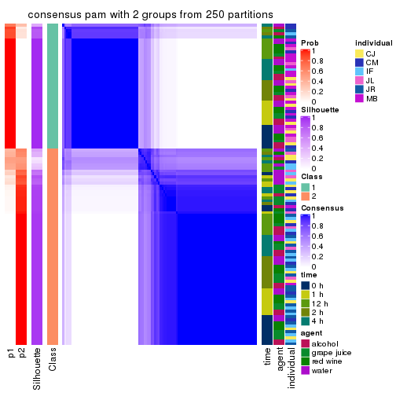</p>

</div>
<div id='tab-SD-pam-consensus-heatmap-2'>
<pre><code class="r">consensus_heatmap(res, k = 3)
</code></pre>

<p>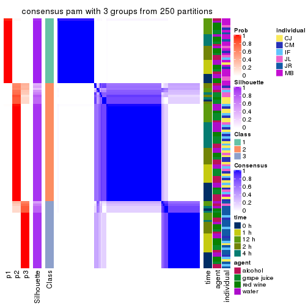</p>

</div>
<div id='tab-SD-pam-consensus-heatmap-3'>
<pre><code class="r">consensus_heatmap(res, k = 4)
</code></pre>

<p>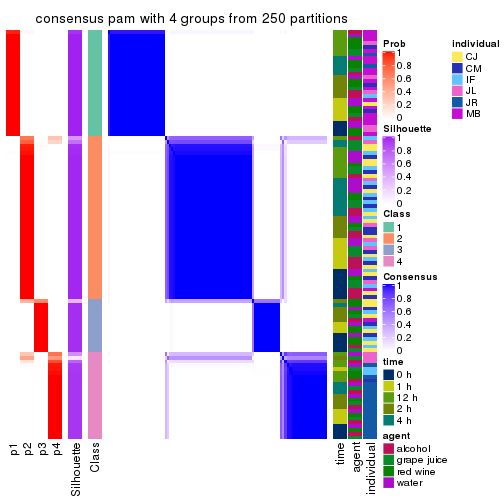</p>

</div>
<div id='tab-SD-pam-consensus-heatmap-4'>
<pre><code class="r">consensus_heatmap(res, k = 5)
</code></pre>

<p>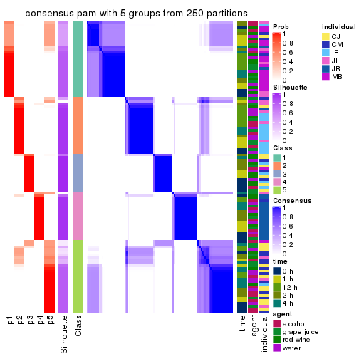</p>

</div>
<div id='tab-SD-pam-consensus-heatmap-5'>
<pre><code class="r">consensus_heatmap(res, k = 6)
</code></pre>

<p>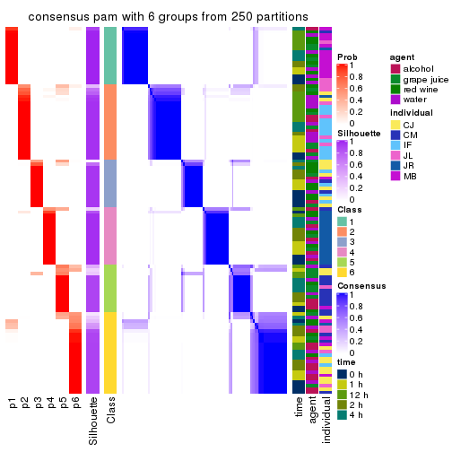</p>

</div>
</div>

Heatmaps for the membership of samples in all partitions to see how consistent they are:


<script>
$( function() {
	$( '#tabs-SD-pam-membership-heatmap' ).tabs();
} );
</script>
<div id='tabs-SD-pam-membership-heatmap'>
<ul>
<li><a href='#tab-SD-pam-membership-heatmap-1'>k = 2</a></li>
<li><a href='#tab-SD-pam-membership-heatmap-2'>k = 3</a></li>
<li><a href='#tab-SD-pam-membership-heatmap-3'>k = 4</a></li>
<li><a href='#tab-SD-pam-membership-heatmap-4'>k = 5</a></li>
<li><a href='#tab-SD-pam-membership-heatmap-5'>k = 6</a></li>
</ul>
<div id='tab-SD-pam-membership-heatmap-1'>
<pre><code class="r">membership_heatmap(res, k = 2)
</code></pre>

<p>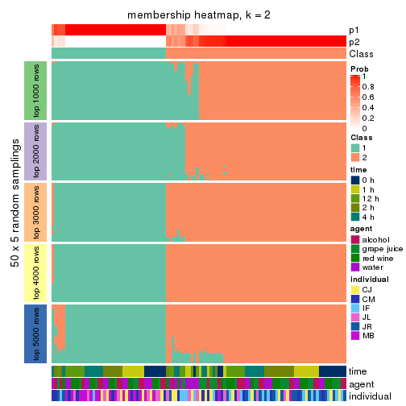</p>

</div>
<div id='tab-SD-pam-membership-heatmap-2'>
<pre><code class="r">membership_heatmap(res, k = 3)
</code></pre>

<p>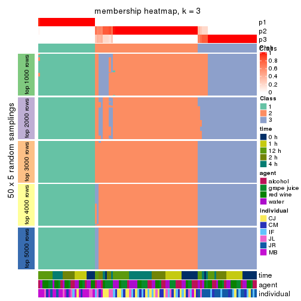</p>

</div>
<div id='tab-SD-pam-membership-heatmap-3'>
<pre><code class="r">membership_heatmap(res, k = 4)
</code></pre>

<p>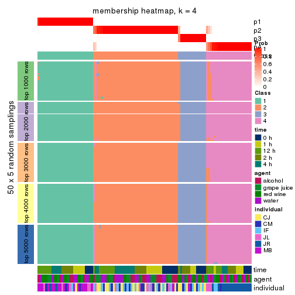</p>

</div>
<div id='tab-SD-pam-membership-heatmap-4'>
<pre><code class="r">membership_heatmap(res, k = 5)
</code></pre>

<p>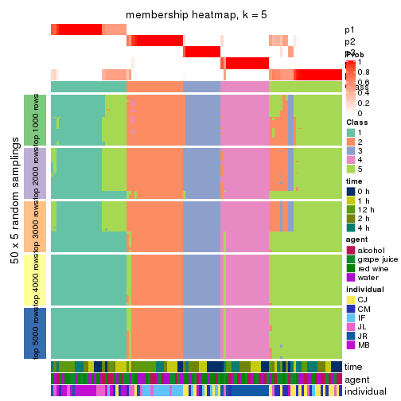</p>

</div>
<div id='tab-SD-pam-membership-heatmap-5'>
<pre><code class="r">membership_heatmap(res, k = 6)
</code></pre>

<p>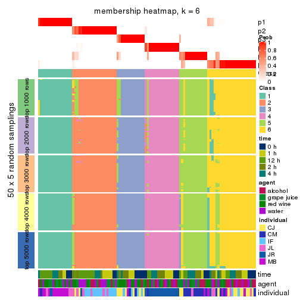</p>

</div>
</div>

As soon as we have had the classes for columns, we can look for signatures
which are significantly different between classes which can be candidate marks
for certain classes. Following are the heatmaps for signatures.


Signature heatmaps where rows are scaled:


<script>
$( function() {
	$( '#tabs-SD-pam-get-signatures' ).tabs();
} );
</script>
<div id='tabs-SD-pam-get-signatures'>
<ul>
<li><a href='#tab-SD-pam-get-signatures-1'>k = 2</a></li>
<li><a href='#tab-SD-pam-get-signatures-2'>k = 3</a></li>
<li><a href='#tab-SD-pam-get-signatures-3'>k = 4</a></li>
<li><a href='#tab-SD-pam-get-signatures-4'>k = 5</a></li>
<li><a href='#tab-SD-pam-get-signatures-5'>k = 6</a></li>
</ul>
<div id='tab-SD-pam-get-signatures-1'>
<pre><code class="r">get_signatures(res, k = 2)
</code></pre>

<p>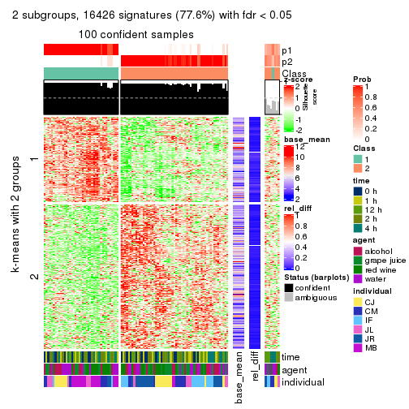</p>

</div>
<div id='tab-SD-pam-get-signatures-2'>
<pre><code class="r">get_signatures(res, k = 3)
</code></pre>

<p>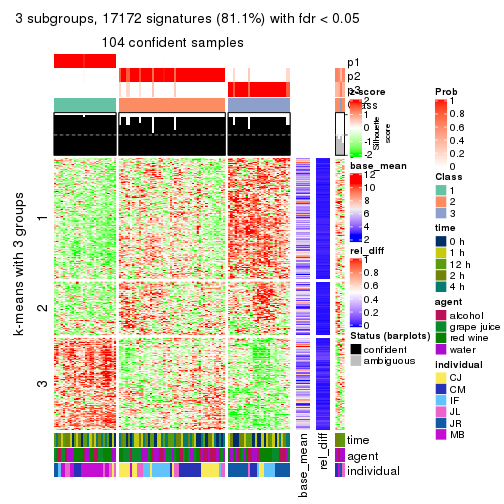</p>

</div>
<div id='tab-SD-pam-get-signatures-3'>
<pre><code class="r">get_signatures(res, k = 4)
</code></pre>

<p>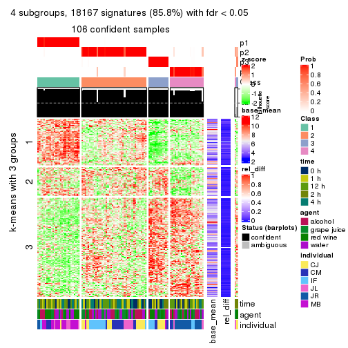</p>

</div>
<div id='tab-SD-pam-get-signatures-4'>
<pre><code class="r">get_signatures(res, k = 5)
</code></pre>

<p>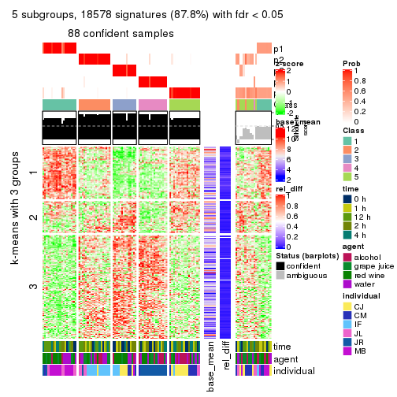</p>

</div>
<div id='tab-SD-pam-get-signatures-5'>
<pre><code class="r">get_signatures(res, k = 6)
</code></pre>

<p>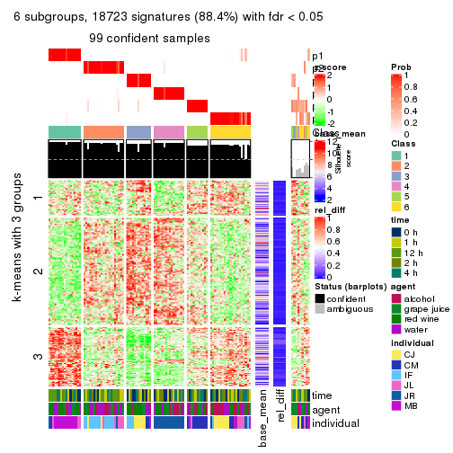</p>

</div>
</div>


Signature heatmaps where rows are not scaled:


<script>
$( function() {
	$( '#tabs-SD-pam-get-signatures-no-scale' ).tabs();
} );
</script>
<div id='tabs-SD-pam-get-signatures-no-scale'>
<ul>
<li><a href='#tab-SD-pam-get-signatures-no-scale-1'>k = 2</a></li>
<li><a href='#tab-SD-pam-get-signatures-no-scale-2'>k = 3</a></li>
<li><a href='#tab-SD-pam-get-signatures-no-scale-3'>k = 4</a></li>
<li><a href='#tab-SD-pam-get-signatures-no-scale-4'>k = 5</a></li>
<li><a href='#tab-SD-pam-get-signatures-no-scale-5'>k = 6</a></li>
</ul>
<div id='tab-SD-pam-get-signatures-no-scale-1'>
<pre><code class="r">get_signatures(res, k = 2, scale_rows = FALSE)
</code></pre>

<p>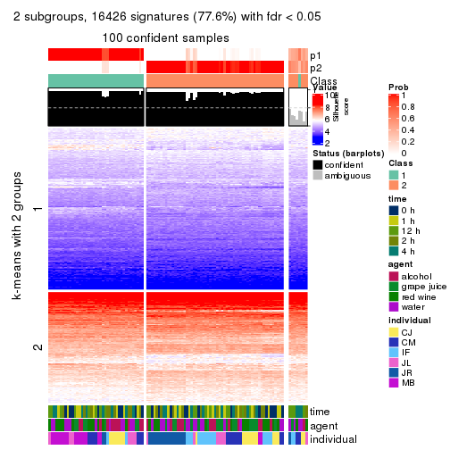</p>

</div>
<div id='tab-SD-pam-get-signatures-no-scale-2'>
<pre><code class="r">get_signatures(res, k = 3, scale_rows = FALSE)
</code></pre>

<p>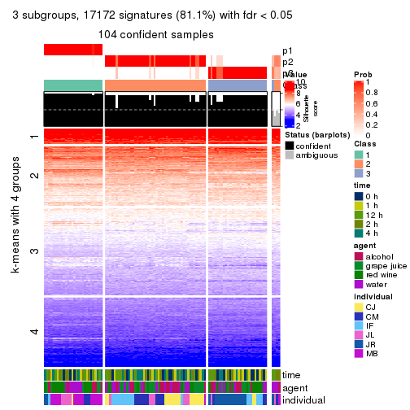</p>

</div>
<div id='tab-SD-pam-get-signatures-no-scale-3'>
<pre><code class="r">get_signatures(res, k = 4, scale_rows = FALSE)
</code></pre>

<p>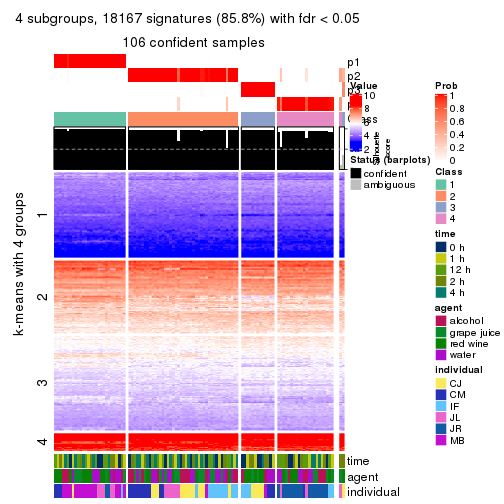</p>

</div>
<div id='tab-SD-pam-get-signatures-no-scale-4'>
<pre><code class="r">get_signatures(res, k = 5, scale_rows = FALSE)
</code></pre>

<p>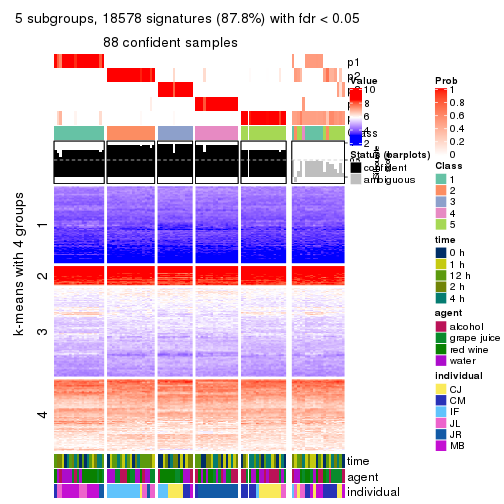</p>

</div>
<div id='tab-SD-pam-get-signatures-no-scale-5'>
<pre><code class="r">get_signatures(res, k = 6, scale_rows = FALSE)
</code></pre>

<p>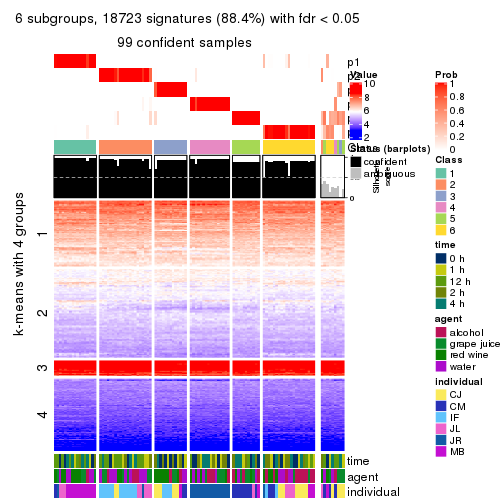</p>

</div>
</div>


Compare the overlap of signatures from different k:

```r
compare_signatures(res)
```

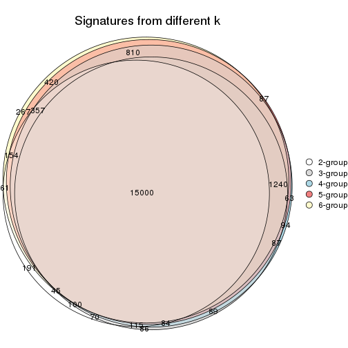

`get_signature()` returns a data frame invisibly. TO get the list of signatures, the function
call should be assigned to a variable explicitly. In following code, if `plot` argument is set
to `FALSE`, no heatmap is plotted while only the differential analysis is performed.

```r
# code only for demonstration
tb = get_signature(res, k = ..., plot = FALSE)
```

An example of the output of `tb` is:

```
#>   which_row         fdr    mean_1    mean_2 scaled_mean_1 scaled_mean_2 km
#> 1        38 0.042760348  8.373488  9.131774    -0.5533452     0.5164555  1
#> 2        40 0.018707592  7.106213  8.469186    -0.6173731     0.5762149  1
#> 3        55 0.019134737 10.221463 11.207825    -0.6159697     0.5749050  1
#> 4        59 0.006059896  5.921854  7.869574    -0.6899429     0.6439467  1
#> 5        60 0.018055526  8.928898 10.211722    -0.6204761     0.5791110  1
#> 6        98 0.009384629 15.714769 14.887706     0.6635654    -0.6193277  2
...
```

The columns in `tb` are:

1. `which_row`: row indices corresponding to the input matrix.
2. `fdr`: FDR for the differential test. 
3. `mean_x`: The mean value in group x.
4. `scaled_mean_x`: The mean value in group x after rows are scaled.
5. `km`: Row groups if k-means clustering is applied to rows.


UMAP plot which shows how samples are separated.


<script>
$( function() {
	$( '#tabs-SD-pam-dimension-reduction' ).tabs();
} );
</script>
<div id='tabs-SD-pam-dimension-reduction'>
<ul>
<li><a href='#tab-SD-pam-dimension-reduction-1'>k = 2</a></li>
<li><a href='#tab-SD-pam-dimension-reduction-2'>k = 3</a></li>
<li><a href='#tab-SD-pam-dimension-reduction-3'>k = 4</a></li>
<li><a href='#tab-SD-pam-dimension-reduction-4'>k = 5</a></li>
<li><a href='#tab-SD-pam-dimension-reduction-5'>k = 6</a></li>
</ul>
<div id='tab-SD-pam-dimension-reduction-1'>
<pre><code class="r">dimension_reduction(res, k = 2, method = &quot;UMAP&quot;)
</code></pre>

<p>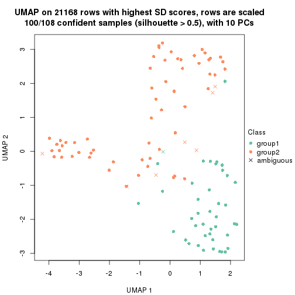</p>

</div>
<div id='tab-SD-pam-dimension-reduction-2'>
<pre><code class="r">dimension_reduction(res, k = 3, method = &quot;UMAP&quot;)
</code></pre>

<p>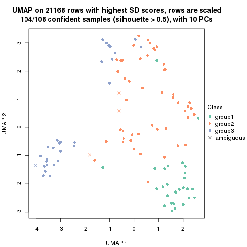</p>

</div>
<div id='tab-SD-pam-dimension-reduction-3'>
<pre><code class="r">dimension_reduction(res, k = 4, method = &quot;UMAP&quot;)
</code></pre>

<p>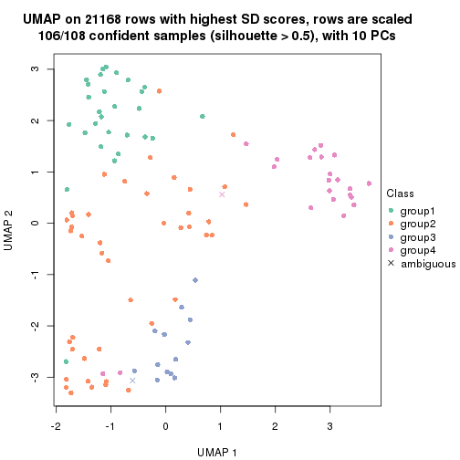</p>

</div>
<div id='tab-SD-pam-dimension-reduction-4'>
<pre><code class="r">dimension_reduction(res, k = 5, method = &quot;UMAP&quot;)
</code></pre>

<p>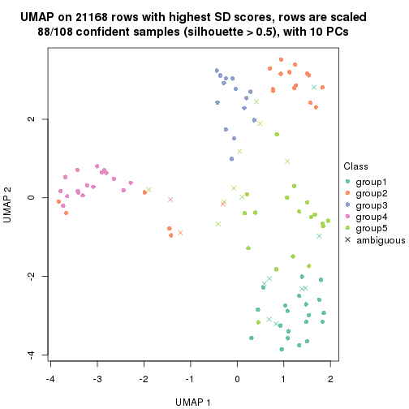</p>

</div>
<div id='tab-SD-pam-dimension-reduction-5'>
<pre><code class="r">dimension_reduction(res, k = 6, method = &quot;UMAP&quot;)
</code></pre>

<p>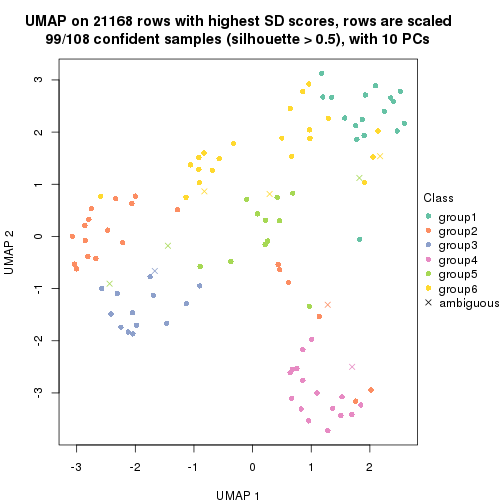</p>

</div>
</div>


Following heatmap shows how subgroups are split when increasing `k`:

```r
collect_classes(res)
```

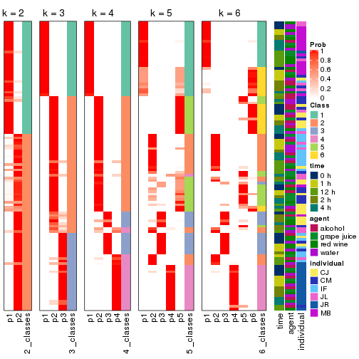


Test correlation between subgroups and known annotations. If the known
annotation is numeric, one-way ANOVA test is applied, and if the known
annotation is discrete, chi-squared contingency table test is applied.

```r
test_to_known_factors(res)
```

```
#>          n time(p) agent(p) individual(p) k
#> SD:pam 100   0.976    0.502      1.08e-05 2
#> SD:pam 104   0.637    0.219      2.66e-16 3
#> SD:pam 106   0.543    0.300      1.49e-18 4
#> SD:pam  88   0.245    0.263      4.42e-24 5
#> SD:pam  99   0.173    0.102      7.70e-29 6
```


If matrix rows can be associated to genes, consider to use `GO_Enrichment(res,
...)` to perform function enrichment for the signature genes.


 

---------------------------------------------------


### SD:mclust


The object with results only for a single top-value method and a single partition method 
can be extracted as:

```r
res = res_list["SD", "mclust"]
# you can also extract it by
# res = res_list["SD:mclust"]
```

A summary of `res` and all the functions that can be applied to it:

```r
res
```

```
#> A 'ConsensusPartition' object with k = 2, 3, 4, 5, 6.
#>   On a matrix with 21168 rows and 108 columns.
#>   Top rows (1000, 2000, 3000, 4000, 5000) are extracted by 'SD' method.
#>   Subgroups are detected by 'mclust' method.
#>   Performed in total 1250 partitions by row resampling.
#>   Best k for subgroups seems to be 5.
#> 
#> Following methods can be applied to this 'ConsensusPartition' object:
#>  [1] "cola_report"             "collect_classes"         "collect_plots"          
#>  [4] "collect_stats"           "colnames"                "compare_signatures"     
#>  [7] "consensus_heatmap"       "dimension_reduction"     "functional_enrichment"  
#> [10] "get_anno_col"            "get_anno"                "get_classes"            
#> [13] "get_consensus"           "get_matrix"              "get_membership"         
#> [16] "get_param"               "get_signatures"          "get_stats"              
#> [19] "is_best_k"               "is_stable_k"             "membership_heatmap"     
#> [22] "ncol"                    "nrow"                    "plot_ecdf"              
#> [25] "rownames"                "select_partition_number" "show"                   
#> [28] "suggest_best_k"          "test_to_known_factors"
```

`collect_plots()` function collects all the plots made from `res` for all `k` (number of partitions)
into one single page to provide an easy and fast comparison between different `k`.

```r
collect_plots(res)
```

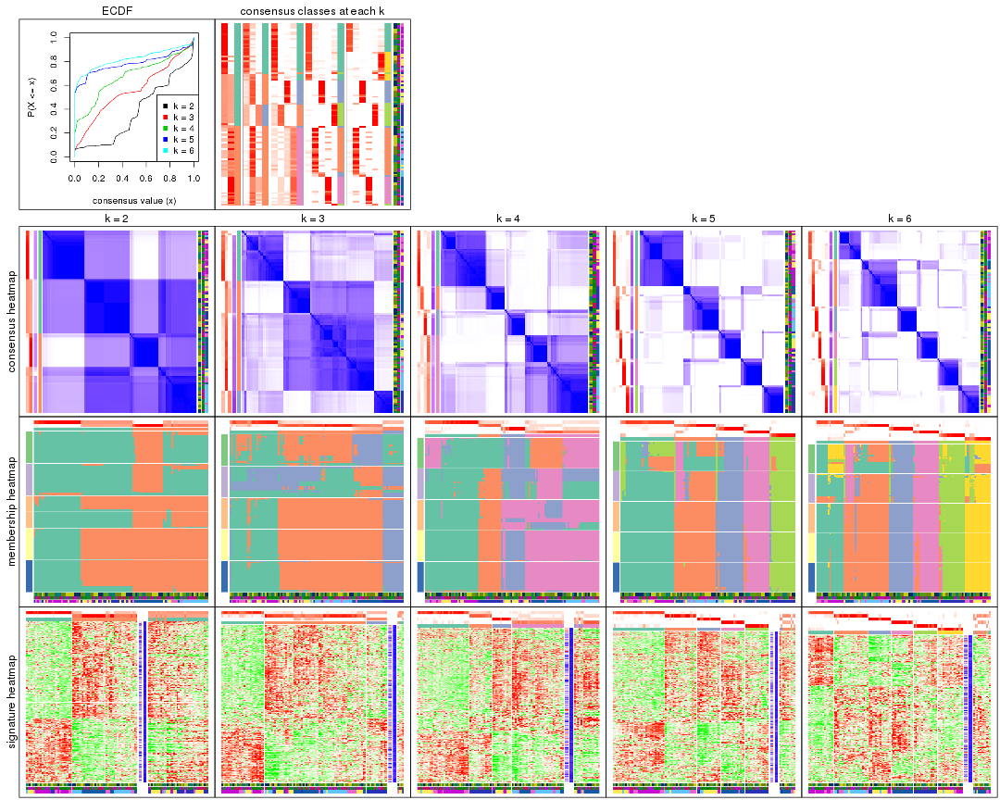

The plots are:

- The first row: a plot of the ECDF (Empirical cumulative distribution
  function) curves of the consensus matrix for each `k` and the heatmap of
  predicted classes for each `k`.
- The second row: heatmaps of the consensus matrix for each `k`.
- The third row: heatmaps of the membership matrix for each `k`.
- The fouth row: heatmaps of the signatures for each `k`.

All the plots in panels can be made by individual functions and they are
plotted later in this section.

`select_partition_number()` produces several plots showing different
statistics for choosing "optimized" `k`. There are following statistics:

- ECDF curves of the consensus matrix for each `k`;
- 1-PAC. [The PAC
  score](https://en.wikipedia.org/wiki/Consensus_clustering#Over-interpretation_potential_of_consensus_clustering)
  measures the proportion of the ambiguous subgrouping.
- Mean silhouette score.
- Concordance. The mean probability of fiting the consensus class ids in all
  partitions.
- Area increased. Denote $A_k$ as the area under the ECDF curve for current
  `k`, the area increased is defined as $A_k - A_{k-1}$.
- Rand index. The percent of pairs of samples that are both in a same cluster
  or both are not in a same cluster in the partition of k and k-1.
- Jaccard index. The ratio of pairs of samples are both in a same cluster in
  the partition of k and k-1 and the pairs of samples are both in a same
  cluster in the partition k or k-1.

The detailed explanations of these statistics can be found in [the cola
vignette](http://bioconductor.org/packages/devel/bioc/vignettes/cola/inst/doc/cola.html#toc_13).

Generally speaking, lower PAC score, higher mean silhouette score or higher
concordance corresponds to better partition. Rand index and Jaccard index
measure how similar the current partition is compared to partition with `k-1`.
If they are too similar, we won't accept `k` is better than `k-1`.

```r
select_partition_number(res)
```

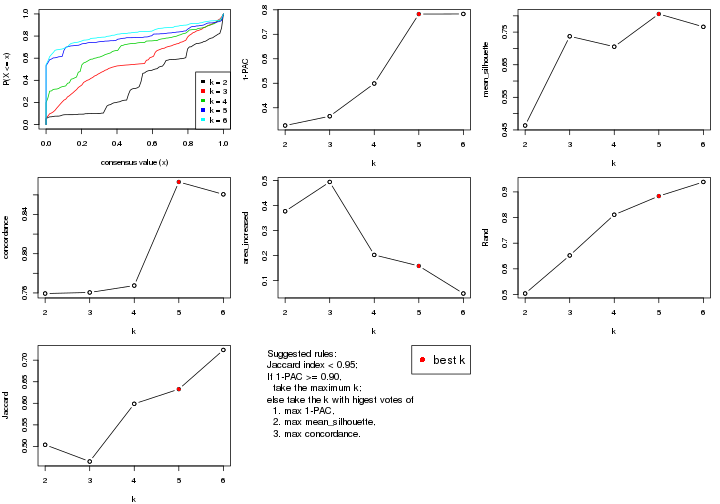

The numeric values for all these statistics can be obtained by `get_stats()`.

```r
get_stats(res)
```

```
#>   k 1-PAC mean_silhouette concordance area_increased  Rand Jaccard
#> 2 2 0.327           0.464       0.759         0.3772 0.504   0.504
#> 3 3 0.365           0.737       0.760         0.4945 0.652   0.465
#> 4 4 0.499           0.705       0.768         0.2026 0.811   0.599
#> 5 5 0.783           0.806       0.873         0.1585 0.884   0.633
#> 6 6 0.783           0.766       0.861         0.0482 0.939   0.724
```

`suggest_best_k()` suggests the best $k$ based on these statistics. The rules are as follows:

- All $k$ with Jaccard index larger than 0.95 are removed because the increase of
  the partition number does not provides enough extra information. If all $k$ are removed,
  the best $k$ is assigned by `NA`.
- For $k$ with 1-PAC larger than 0.9, the maximal $k$ is taken as the "best k". Other $k$ is called "optional k".
- If it does not fit the second rule. The $k$ with the highest vote of highest
  1-PAC, mean silhouette and concordance is taken as the "best k".

```r
suggest_best_k(res)
```

```
#> [1] 5
```


Following shows the table of the partitions (You need to click the **show/hide
code output** link to see it). The membership matrix (columns with name `p*`)
is inferred by
[`clue::cl_consensus()`](https://www.rdocumentation.org/link/cl_consensus?package=clue)
function with the `SE` method. Basically the value in the membership matrix
represents the probability to belong to a certain group. The finall class
label for an item is determined with the group with highest probability it
belongs to.

In `get_classes()` function, the entropy is calculated from the membership
matrix and the silhouette score is calculated from the consensus matrix.


<script>
$( function() {
	$( '#tabs-SD-mclust-get-classes' ).tabs();
} );
</script>
<div id='tabs-SD-mclust-get-classes'>
<ul>
<li><a href='#tab-SD-mclust-get-classes-1'>k = 2</a></li>
<li><a href='#tab-SD-mclust-get-classes-2'>k = 3</a></li>
<li><a href='#tab-SD-mclust-get-classes-3'>k = 4</a></li>
<li><a href='#tab-SD-mclust-get-classes-4'>k = 5</a></li>
<li><a href='#tab-SD-mclust-get-classes-5'>k = 6</a></li>
</ul>

<div id='tab-SD-mclust-get-classes-1'>
<p><a id='tab-SD-mclust-get-classes-1-a' style='color:#0366d6' href='#'>show/hide code output</a></p>
<pre><code class="r">cbind(get_classes(res, k = 2), get_membership(res, k = 2))
</code></pre>

<pre><code>#&gt;          class entropy silhouette    p1    p2
#&gt; GSM87863     1  0.9954     0.2485 0.540 0.460
#&gt; GSM87887     1  0.9954     0.2485 0.540 0.460
#&gt; GSM87896     2  0.9129     0.5916 0.328 0.672
#&gt; GSM87934     2  0.0000     0.6214 0.000 1.000
#&gt; GSM87943     1  0.9977     0.2172 0.528 0.472
#&gt; GSM87853     1  0.9977     0.2172 0.528 0.472
#&gt; GSM87906     2  0.9170     0.5893 0.332 0.668
#&gt; GSM87920     1  0.9954     0.2485 0.540 0.460
#&gt; GSM87924     2  0.0672     0.6223 0.008 0.992
#&gt; GSM87858     2  0.9996    -0.0356 0.488 0.512
#&gt; GSM87882     1  0.9954     0.2485 0.540 0.460
#&gt; GSM87891     2  0.9129     0.5916 0.328 0.672
#&gt; GSM87917     1  0.0000     0.5799 1.000 0.000
#&gt; GSM87929     2  0.0000     0.6214 0.000 1.000
#&gt; GSM87948     1  0.0672     0.5793 0.992 0.008
#&gt; GSM87868     1  0.0000     0.5799 1.000 0.000
#&gt; GSM87873     1  0.9977     0.2172 0.528 0.472
#&gt; GSM87901     2  0.9209     0.5854 0.336 0.664
#&gt; GSM87910     1  0.0000     0.5799 1.000 0.000
#&gt; GSM87938     2  0.0000     0.6214 0.000 1.000
#&gt; GSM87953     1  0.0000     0.5799 1.000 0.000
#&gt; GSM87864     1  0.9954     0.2485 0.540 0.460
#&gt; GSM87888     1  0.9954     0.2485 0.540 0.460
#&gt; GSM87897     2  0.9209     0.5854 0.336 0.664
#&gt; GSM87935     2  0.0000     0.6214 0.000 1.000
#&gt; GSM87944     1  0.0000     0.5799 1.000 0.000
#&gt; GSM87854     1  0.9977     0.2172 0.528 0.472
#&gt; GSM87878     1  0.9954     0.2485 0.540 0.460
#&gt; GSM87907     2  0.9170     0.5893 0.332 0.668
#&gt; GSM87921     2  0.9129     0.5926 0.328 0.672
#&gt; GSM87925     2  0.0000     0.6214 0.000 1.000
#&gt; GSM87957     1  0.0000     0.5799 1.000 0.000
#&gt; GSM87859     1  0.9977     0.2172 0.528 0.472
#&gt; GSM87883     1  0.2043     0.5740 0.968 0.032
#&gt; GSM87892     2  0.9129     0.5916 0.328 0.672
#&gt; GSM87930     2  0.0000     0.6214 0.000 1.000
#&gt; GSM87949     1  0.0000     0.5799 1.000 0.000
#&gt; GSM87869     1  0.0000     0.5799 1.000 0.000
#&gt; GSM87874     1  0.9977     0.2172 0.528 0.472
#&gt; GSM87902     2  0.9323     0.5595 0.348 0.652
#&gt; GSM87911     2  0.9552     0.4849 0.376 0.624
#&gt; GSM87939     2  0.0000     0.6214 0.000 1.000
#&gt; GSM87954     1  0.0000     0.5799 1.000 0.000
#&gt; GSM87865     1  0.9954     0.2485 0.540 0.460
#&gt; GSM87889     1  0.9954     0.2485 0.540 0.460
#&gt; GSM87898     2  0.9209     0.5854 0.336 0.664
#&gt; GSM87915     1  0.1414     0.5645 0.980 0.020
#&gt; GSM87936     2  0.0000     0.6214 0.000 1.000
#&gt; GSM87945     1  0.9977     0.2172 0.528 0.472
#&gt; GSM87855     1  0.9977     0.2172 0.528 0.472
#&gt; GSM87879     1  0.9954     0.2485 0.540 0.460
#&gt; GSM87922     2  0.9491     0.5031 0.368 0.632
#&gt; GSM87926     2  0.0000     0.6214 0.000 1.000
#&gt; GSM87958     1  0.0000     0.5799 1.000 0.000
#&gt; GSM87860     1  0.9993     0.1630 0.516 0.484
#&gt; GSM87884     1  0.9732     0.2953 0.596 0.404
#&gt; GSM87893     2  0.9129     0.5916 0.328 0.672
#&gt; GSM87918     2  0.9460     0.5208 0.364 0.636
#&gt; GSM87931     2  0.0000     0.6214 0.000 1.000
#&gt; GSM87950     1  0.0000     0.5799 1.000 0.000
#&gt; GSM87870     1  0.1184     0.5780 0.984 0.016
#&gt; GSM87875     1  0.9954     0.2485 0.540 0.460
#&gt; GSM87903     2  0.9209     0.5854 0.336 0.664
#&gt; GSM87912     1  0.0000     0.5799 1.000 0.000
#&gt; GSM87940     2  0.0000     0.6214 0.000 1.000
#&gt; GSM87866     1  0.0376     0.5797 0.996 0.004
#&gt; GSM87899     2  0.9209     0.5854 0.336 0.664
#&gt; GSM87937     2  0.0000     0.6214 0.000 1.000
#&gt; GSM87946     1  0.0000     0.5799 1.000 0.000
#&gt; GSM87856     1  0.9977     0.2172 0.528 0.472
#&gt; GSM87880     1  0.9954     0.2485 0.540 0.460
#&gt; GSM87908     2  0.9209     0.5854 0.336 0.664
#&gt; GSM87923     1  0.9977     0.2172 0.528 0.472
#&gt; GSM87927     2  0.0672     0.6223 0.008 0.992
#&gt; GSM87959     1  0.0000     0.5799 1.000 0.000
#&gt; GSM87861     1  0.9977     0.2172 0.528 0.472
#&gt; GSM87885     1  0.9954     0.2485 0.540 0.460
#&gt; GSM87894     1  0.2603     0.5689 0.956 0.044
#&gt; GSM87932     2  0.8955     0.5979 0.312 0.688
#&gt; GSM87951     1  0.0000     0.5799 1.000 0.000
#&gt; GSM87871     1  0.9954     0.2485 0.540 0.460
#&gt; GSM87876     1  0.9954     0.2485 0.540 0.460
#&gt; GSM87904     2  0.9944     0.1424 0.456 0.544
#&gt; GSM87913     1  0.3733     0.5598 0.928 0.072
#&gt; GSM87941     2  0.0000     0.6214 0.000 1.000
#&gt; GSM87955     1  0.0000     0.5799 1.000 0.000
#&gt; GSM87867     1  0.9954     0.2485 0.540 0.460
#&gt; GSM87890     2  0.9795     0.3345 0.416 0.584
#&gt; GSM87900     2  0.9170     0.5893 0.332 0.668
#&gt; GSM87916     2  0.7528     0.6131 0.216 0.784
#&gt; GSM87947     1  0.4298     0.5526 0.912 0.088
#&gt; GSM87857     1  0.9977     0.2172 0.528 0.472
#&gt; GSM87881     1  0.9954     0.2485 0.540 0.460
#&gt; GSM87909     2  0.9209     0.5854 0.336 0.664
#&gt; GSM87928     2  0.4161     0.6225 0.084 0.916
#&gt; GSM87960     1  0.0000     0.5799 1.000 0.000
#&gt; GSM87862     2  0.9850     0.2842 0.428 0.572
#&gt; GSM87886     1  0.4690     0.5459 0.900 0.100
#&gt; GSM87895     2  0.9129     0.5916 0.328 0.672
#&gt; GSM87919     1  0.0000     0.5799 1.000 0.000
#&gt; GSM87933     2  0.0000     0.6214 0.000 1.000
#&gt; GSM87952     1  0.0000     0.5799 1.000 0.000
#&gt; GSM87872     2  0.9988     0.0135 0.480 0.520
#&gt; GSM87877     1  0.9954     0.2485 0.540 0.460
#&gt; GSM87905     2  0.9209     0.5854 0.336 0.664
#&gt; GSM87914     2  0.6623     0.6181 0.172 0.828
#&gt; GSM87942     2  0.0000     0.6214 0.000 1.000
#&gt; GSM87956     1  0.0000     0.5799 1.000 0.000
</code></pre>

<script>
$('#tab-SD-mclust-get-classes-1-a').parent().next().next().hide();
$('#tab-SD-mclust-get-classes-1-a').click(function(){
  $('#tab-SD-mclust-get-classes-1-a').parent().next().next().toggle();
  return(false);
});
</script>
</div>

<div id='tab-SD-mclust-get-classes-2'>
<p><a id='tab-SD-mclust-get-classes-2-a' style='color:#0366d6' href='#'>show/hide code output</a></p>
<pre><code class="r">cbind(get_classes(res, k = 3), get_membership(res, k = 3))
</code></pre>

<pre><code>#&gt;          class entropy silhouette    p1    p2    p3
#&gt; GSM87863     2   0.615     0.6207 0.328 0.664 0.008
#&gt; GSM87887     3   0.694     0.9611 0.372 0.024 0.604
#&gt; GSM87896     2   0.000     0.7894 0.000 1.000 0.000
#&gt; GSM87934     2   0.610     0.6739 0.000 0.608 0.392
#&gt; GSM87943     2   0.469     0.7542 0.168 0.820 0.012
#&gt; GSM87853     2   0.469     0.7542 0.168 0.820 0.012
#&gt; GSM87906     2   0.129     0.7923 0.032 0.968 0.000
#&gt; GSM87920     2   0.604     0.3289 0.380 0.620 0.000
#&gt; GSM87924     2   0.573     0.7520 0.032 0.772 0.196
#&gt; GSM87858     2   0.397     0.7866 0.100 0.876 0.024
#&gt; GSM87882     3   0.776     0.9192 0.328 0.068 0.604
#&gt; GSM87891     2   0.263     0.7958 0.084 0.916 0.000
#&gt; GSM87917     1   0.506     0.7118 0.756 0.244 0.000
#&gt; GSM87929     2   0.610     0.6739 0.000 0.608 0.392
#&gt; GSM87948     1   0.164     0.7512 0.956 0.044 0.000
#&gt; GSM87868     1   0.220     0.7582 0.940 0.056 0.004
#&gt; GSM87873     2   0.466     0.7767 0.100 0.852 0.048
#&gt; GSM87901     2   0.129     0.7923 0.032 0.968 0.000
#&gt; GSM87910     1   0.497     0.7154 0.764 0.236 0.000
#&gt; GSM87938     2   0.610     0.6739 0.000 0.608 0.392
#&gt; GSM87953     1   0.506     0.7118 0.756 0.244 0.000
#&gt; GSM87864     1   0.659     0.0560 0.568 0.424 0.008
#&gt; GSM87888     3   0.729     0.9579 0.356 0.040 0.604
#&gt; GSM87897     2   0.116     0.7927 0.028 0.972 0.000
#&gt; GSM87935     2   0.601     0.6890 0.000 0.628 0.372
#&gt; GSM87944     1   0.206     0.7445 0.948 0.044 0.008
#&gt; GSM87854     2   0.502     0.7469 0.192 0.796 0.012
#&gt; GSM87878     3   0.712     0.9571 0.364 0.032 0.604
#&gt; GSM87907     2   0.116     0.7927 0.028 0.972 0.000
#&gt; GSM87921     2   0.216     0.7857 0.064 0.936 0.000
#&gt; GSM87925     2   0.603     0.6858 0.000 0.624 0.376
#&gt; GSM87957     1   0.254     0.7566 0.920 0.080 0.000
#&gt; GSM87859     2   0.420     0.7728 0.136 0.852 0.012
#&gt; GSM87883     1   0.806    -0.4715 0.532 0.068 0.400
#&gt; GSM87892     2   0.263     0.7958 0.084 0.916 0.000
#&gt; GSM87930     2   0.610     0.6739 0.000 0.608 0.392
#&gt; GSM87949     1   0.141     0.7527 0.964 0.036 0.000
#&gt; GSM87869     1   0.175     0.7577 0.952 0.048 0.000
#&gt; GSM87874     2   0.524     0.7611 0.132 0.820 0.048
#&gt; GSM87902     2   0.129     0.7923 0.032 0.968 0.000
#&gt; GSM87911     2   0.164     0.7897 0.044 0.956 0.000
#&gt; GSM87939     2   0.610     0.6739 0.000 0.608 0.392
#&gt; GSM87954     1   0.518     0.7016 0.744 0.256 0.000
#&gt; GSM87865     1   0.652     0.0682 0.516 0.480 0.004
#&gt; GSM87889     3   0.703     0.9632 0.368 0.028 0.604
#&gt; GSM87898     2   0.129     0.7923 0.032 0.968 0.000
#&gt; GSM87915     1   0.568     0.6421 0.684 0.316 0.000
#&gt; GSM87936     2   0.603     0.6858 0.000 0.624 0.376
#&gt; GSM87945     2   0.469     0.7542 0.168 0.820 0.012
#&gt; GSM87855     2   0.469     0.7542 0.168 0.820 0.012
#&gt; GSM87879     3   0.729     0.9579 0.356 0.040 0.604
#&gt; GSM87922     2   0.271     0.7923 0.088 0.912 0.000
#&gt; GSM87926     2   0.610     0.6739 0.000 0.608 0.392
#&gt; GSM87958     1   0.334     0.7262 0.880 0.120 0.000
#&gt; GSM87860     2   0.392     0.7783 0.120 0.868 0.012
#&gt; GSM87884     3   0.682     0.9125 0.408 0.016 0.576
#&gt; GSM87893     2   0.263     0.7958 0.084 0.916 0.000
#&gt; GSM87918     2   0.216     0.7857 0.064 0.936 0.000
#&gt; GSM87931     2   0.610     0.6739 0.000 0.608 0.392
#&gt; GSM87950     1   0.141     0.7527 0.964 0.036 0.000
#&gt; GSM87870     1   0.355     0.7423 0.868 0.132 0.000
#&gt; GSM87875     2   0.683     0.6690 0.260 0.692 0.048
#&gt; GSM87903     2   0.116     0.7927 0.028 0.972 0.000
#&gt; GSM87912     1   0.533     0.6887 0.728 0.272 0.000
#&gt; GSM87940     2   0.610     0.6739 0.000 0.608 0.392
#&gt; GSM87866     1   0.295     0.7544 0.908 0.088 0.004
#&gt; GSM87899     2   0.116     0.7927 0.028 0.972 0.000
#&gt; GSM87937     2   0.603     0.6858 0.000 0.624 0.376
#&gt; GSM87946     1   0.206     0.7503 0.948 0.044 0.008
#&gt; GSM87856     2   0.469     0.7542 0.168 0.820 0.012
#&gt; GSM87880     3   0.712     0.9612 0.364 0.032 0.604
#&gt; GSM87908     2   0.129     0.7923 0.032 0.968 0.000
#&gt; GSM87923     2   0.616     0.7389 0.196 0.756 0.048
#&gt; GSM87927     2   0.599     0.7362 0.012 0.704 0.284
#&gt; GSM87959     1   0.141     0.7527 0.964 0.036 0.000
#&gt; GSM87861     2   0.433     0.7691 0.144 0.844 0.012
#&gt; GSM87885     3   0.703     0.9632 0.368 0.028 0.604
#&gt; GSM87894     1   0.520     0.6747 0.772 0.220 0.008
#&gt; GSM87932     2   0.400     0.7986 0.056 0.884 0.060
#&gt; GSM87951     1   0.141     0.7527 0.964 0.036 0.000
#&gt; GSM87871     2   0.511     0.7353 0.212 0.780 0.008
#&gt; GSM87876     3   0.703     0.9632 0.368 0.028 0.604
#&gt; GSM87904     2   0.348     0.7880 0.128 0.872 0.000
#&gt; GSM87913     1   0.571     0.6518 0.680 0.320 0.000
#&gt; GSM87941     2   0.579     0.7069 0.000 0.668 0.332
#&gt; GSM87955     1   0.334     0.7262 0.880 0.120 0.000
#&gt; GSM87867     2   0.638     0.5701 0.368 0.624 0.008
#&gt; GSM87890     2   0.632     0.7304 0.228 0.732 0.040
#&gt; GSM87900     2   0.129     0.7923 0.032 0.968 0.000
#&gt; GSM87916     2   0.596     0.7440 0.016 0.720 0.264
#&gt; GSM87947     1   0.375     0.6727 0.872 0.120 0.008
#&gt; GSM87857     2   0.469     0.7542 0.168 0.820 0.012
#&gt; GSM87881     3   0.776     0.9190 0.328 0.068 0.604
#&gt; GSM87909     2   0.216     0.7857 0.064 0.936 0.000
#&gt; GSM87928     2   0.592     0.7679 0.032 0.756 0.212
#&gt; GSM87960     1   0.141     0.7527 0.964 0.036 0.000
#&gt; GSM87862     2   0.481     0.7775 0.148 0.828 0.024
#&gt; GSM87886     3   0.697     0.9044 0.416 0.020 0.564
#&gt; GSM87895     2   0.116     0.7927 0.028 0.972 0.000
#&gt; GSM87919     1   0.493     0.7174 0.768 0.232 0.000
#&gt; GSM87933     2   0.610     0.6739 0.000 0.608 0.392
#&gt; GSM87952     1   0.141     0.7527 0.964 0.036 0.000
#&gt; GSM87872     2   0.577     0.7384 0.220 0.756 0.024
#&gt; GSM87877     3   0.699     0.9527 0.384 0.024 0.592
#&gt; GSM87905     2   0.186     0.7892 0.052 0.948 0.000
#&gt; GSM87914     2   0.489     0.7961 0.048 0.840 0.112
#&gt; GSM87942     2   0.676     0.6928 0.020 0.620 0.360
#&gt; GSM87956     1   0.207     0.7539 0.940 0.060 0.000
</code></pre>

<script>
$('#tab-SD-mclust-get-classes-2-a').parent().next().next().hide();
$('#tab-SD-mclust-get-classes-2-a').click(function(){
  $('#tab-SD-mclust-get-classes-2-a').parent().next().next().toggle();
  return(false);
});
</script>
</div>

<div id='tab-SD-mclust-get-classes-3'>
<p><a id='tab-SD-mclust-get-classes-3-a' style='color:#0366d6' href='#'>show/hide code output</a></p>
<pre><code class="r">cbind(get_classes(res, k = 4), get_membership(res, k = 4))
</code></pre>

<pre><code>#&gt;          class entropy silhouette    p1    p2    p3    p4
#&gt; GSM87863     1  0.1978      0.845 0.928 0.004 0.068 0.000
#&gt; GSM87887     2  0.3978      0.950 0.192 0.796 0.012 0.000
#&gt; GSM87896     4  0.6594      0.637 0.140 0.000 0.240 0.620
#&gt; GSM87934     4  0.3649      0.495 0.000 0.204 0.000 0.796
#&gt; GSM87943     3  0.0188      0.835 0.000 0.004 0.996 0.000
#&gt; GSM87853     3  0.0188      0.835 0.000 0.004 0.996 0.000
#&gt; GSM87906     4  0.6719      0.647 0.180 0.000 0.204 0.616
#&gt; GSM87920     1  0.5376      0.713 0.736 0.000 0.088 0.176
#&gt; GSM87924     4  0.8611      0.610 0.136 0.192 0.136 0.536
#&gt; GSM87858     3  0.5220     -0.219 0.008 0.000 0.568 0.424
#&gt; GSM87882     2  0.3978      0.950 0.192 0.796 0.012 0.000
#&gt; GSM87891     4  0.6605      0.633 0.136 0.000 0.248 0.616
#&gt; GSM87917     1  0.3528      0.785 0.808 0.000 0.000 0.192
#&gt; GSM87929     4  0.3649      0.495 0.000 0.204 0.000 0.796
#&gt; GSM87948     1  0.1256      0.834 0.964 0.028 0.008 0.000
#&gt; GSM87868     1  0.0469      0.863 0.988 0.000 0.012 0.000
#&gt; GSM87873     3  0.0000      0.834 0.000 0.000 1.000 0.000
#&gt; GSM87901     4  0.6683      0.649 0.176 0.000 0.204 0.620
#&gt; GSM87910     1  0.3528      0.785 0.808 0.000 0.000 0.192
#&gt; GSM87938     4  0.3649      0.495 0.000 0.204 0.000 0.796
#&gt; GSM87953     1  0.3528      0.785 0.808 0.000 0.000 0.192
#&gt; GSM87864     1  0.1576      0.854 0.948 0.004 0.048 0.000
#&gt; GSM87888     2  0.3978      0.950 0.192 0.796 0.012 0.000
#&gt; GSM87897     4  0.6686      0.649 0.180 0.000 0.200 0.620
#&gt; GSM87935     4  0.6413      0.550 0.012 0.192 0.120 0.676
#&gt; GSM87944     1  0.0524      0.860 0.988 0.004 0.008 0.000
#&gt; GSM87854     3  0.2647      0.707 0.120 0.000 0.880 0.000
#&gt; GSM87878     2  0.4576      0.900 0.260 0.728 0.012 0.000
#&gt; GSM87907     4  0.6609      0.639 0.144 0.000 0.236 0.620
#&gt; GSM87921     4  0.6686      0.649 0.180 0.000 0.200 0.620
#&gt; GSM87925     4  0.6413      0.550 0.012 0.192 0.120 0.676
#&gt; GSM87957     1  0.0188      0.862 0.996 0.004 0.000 0.000
#&gt; GSM87859     3  0.0000      0.834 0.000 0.000 1.000 0.000
#&gt; GSM87883     2  0.5345      0.645 0.428 0.560 0.012 0.000
#&gt; GSM87892     4  0.6605      0.633 0.136 0.000 0.248 0.616
#&gt; GSM87930     4  0.3649      0.495 0.000 0.204 0.000 0.796
#&gt; GSM87949     1  0.0188      0.862 0.996 0.004 0.000 0.000
#&gt; GSM87869     1  0.0188      0.864 0.996 0.000 0.004 0.000
#&gt; GSM87874     3  0.0188      0.835 0.000 0.004 0.996 0.000
#&gt; GSM87902     4  0.6719      0.647 0.180 0.000 0.204 0.616
#&gt; GSM87911     4  0.6722      0.646 0.184 0.000 0.200 0.616
#&gt; GSM87939     4  0.3649      0.495 0.000 0.204 0.000 0.796
#&gt; GSM87954     1  0.3610      0.781 0.800 0.000 0.000 0.200
#&gt; GSM87865     1  0.3312      0.832 0.876 0.000 0.072 0.052
#&gt; GSM87889     2  0.3978      0.950 0.192 0.796 0.012 0.000
#&gt; GSM87898     4  0.6686      0.649 0.180 0.000 0.200 0.620
#&gt; GSM87915     1  0.5410      0.693 0.728 0.000 0.080 0.192
#&gt; GSM87936     4  0.6413      0.550 0.012 0.192 0.120 0.676
#&gt; GSM87945     3  0.0188      0.835 0.000 0.004 0.996 0.000
#&gt; GSM87855     3  0.0188      0.835 0.000 0.004 0.996 0.000
#&gt; GSM87879     2  0.3978      0.950 0.192 0.796 0.012 0.000
#&gt; GSM87922     4  0.7006      0.627 0.216 0.000 0.204 0.580
#&gt; GSM87926     4  0.3649      0.495 0.000 0.204 0.000 0.796
#&gt; GSM87958     1  0.0469      0.865 0.988 0.000 0.000 0.012
#&gt; GSM87860     3  0.5058      0.572 0.104 0.000 0.768 0.128
#&gt; GSM87884     2  0.4795      0.876 0.292 0.696 0.012 0.000
#&gt; GSM87893     4  0.6587      0.601 0.112 0.000 0.292 0.596
#&gt; GSM87918     4  0.6722      0.646 0.184 0.000 0.200 0.616
#&gt; GSM87931     4  0.3649      0.495 0.000 0.204 0.000 0.796
#&gt; GSM87950     1  0.0376      0.862 0.992 0.004 0.004 0.000
#&gt; GSM87870     1  0.1807      0.855 0.940 0.000 0.008 0.052
#&gt; GSM87875     3  0.5792      0.472 0.168 0.124 0.708 0.000
#&gt; GSM87903     4  0.6719      0.647 0.180 0.000 0.204 0.616
#&gt; GSM87912     1  0.3528      0.785 0.808 0.000 0.000 0.192
#&gt; GSM87940     4  0.3649      0.495 0.000 0.204 0.000 0.796
#&gt; GSM87866     1  0.1209      0.861 0.964 0.000 0.032 0.004
#&gt; GSM87899     4  0.6672      0.647 0.168 0.000 0.212 0.620
#&gt; GSM87937     4  0.5664      0.535 0.008 0.192 0.076 0.724
#&gt; GSM87946     1  0.0657      0.858 0.984 0.004 0.012 0.000
#&gt; GSM87856     3  0.0188      0.835 0.000 0.004 0.996 0.000
#&gt; GSM87880     2  0.3978      0.950 0.192 0.796 0.012 0.000
#&gt; GSM87908     4  0.6722      0.646 0.184 0.000 0.200 0.616
#&gt; GSM87923     3  0.8193     -0.326 0.324 0.008 0.348 0.320
#&gt; GSM87927     4  0.8968      0.613 0.120 0.192 0.200 0.488
#&gt; GSM87959     1  0.0524      0.859 0.988 0.008 0.004 0.000
#&gt; GSM87861     3  0.0000      0.834 0.000 0.000 1.000 0.000
#&gt; GSM87885     2  0.3978      0.950 0.192 0.796 0.012 0.000
#&gt; GSM87894     1  0.4621      0.791 0.796 0.000 0.076 0.128
#&gt; GSM87932     4  0.7801      0.650 0.140 0.064 0.200 0.596
#&gt; GSM87951     1  0.0376      0.862 0.992 0.004 0.004 0.000
#&gt; GSM87871     1  0.4328      0.595 0.748 0.000 0.244 0.008
#&gt; GSM87876     2  0.3978      0.950 0.192 0.796 0.012 0.000
#&gt; GSM87904     4  0.6621      0.635 0.140 0.000 0.244 0.616
#&gt; GSM87913     1  0.3710      0.787 0.804 0.000 0.004 0.192
#&gt; GSM87941     4  0.7183      0.558 0.012 0.192 0.196 0.600
#&gt; GSM87955     1  0.0592      0.865 0.984 0.000 0.000 0.016
#&gt; GSM87867     1  0.1059      0.847 0.972 0.016 0.012 0.000
#&gt; GSM87890     4  0.9458      0.354 0.208 0.164 0.204 0.424
#&gt; GSM87900     4  0.6286      0.655 0.140 0.000 0.200 0.660
#&gt; GSM87916     4  0.4553      0.521 0.000 0.180 0.040 0.780
#&gt; GSM87947     1  0.2255      0.765 0.920 0.068 0.012 0.000
#&gt; GSM87857     3  0.0188      0.835 0.000 0.004 0.996 0.000
#&gt; GSM87881     2  0.4095      0.947 0.192 0.792 0.016 0.000
#&gt; GSM87909     4  0.6686      0.649 0.180 0.000 0.200 0.620
#&gt; GSM87928     4  0.8927      0.612 0.116 0.192 0.200 0.492
#&gt; GSM87960     1  0.0376      0.862 0.992 0.004 0.004 0.000
#&gt; GSM87862     4  0.7748      0.476 0.332 0.000 0.244 0.424
#&gt; GSM87886     2  0.4718      0.889 0.280 0.708 0.012 0.000
#&gt; GSM87895     4  0.6581      0.642 0.144 0.000 0.232 0.624
#&gt; GSM87919     1  0.3528      0.785 0.808 0.000 0.000 0.192
#&gt; GSM87933     4  0.3649      0.495 0.000 0.204 0.000 0.796
#&gt; GSM87952     1  0.0376      0.862 0.992 0.004 0.004 0.000
#&gt; GSM87872     4  0.7772      0.483 0.364 0.004 0.204 0.428
#&gt; GSM87877     2  0.3978      0.950 0.192 0.796 0.012 0.000
#&gt; GSM87905     4  0.6686      0.649 0.180 0.000 0.200 0.620
#&gt; GSM87914     4  0.8923      0.629 0.140 0.160 0.200 0.500
#&gt; GSM87942     4  0.3649      0.495 0.000 0.204 0.000 0.796
#&gt; GSM87956     1  0.0376      0.864 0.992 0.004 0.000 0.004
</code></pre>

<script>
$('#tab-SD-mclust-get-classes-3-a').parent().next().next().hide();
$('#tab-SD-mclust-get-classes-3-a').click(function(){
  $('#tab-SD-mclust-get-classes-3-a').parent().next().next().toggle();
  return(false);
});
</script>
</div>

<div id='tab-SD-mclust-get-classes-4'>
<p><a id='tab-SD-mclust-get-classes-4-a' style='color:#0366d6' href='#'>show/hide code output</a></p>
<pre><code class="r">cbind(get_classes(res, k = 5), get_membership(res, k = 5))
</code></pre>

<pre><code>#&gt;          class entropy silhouette    p1    p2    p3    p4    p5
#&gt; GSM87863     1  0.3019     0.8452 0.864 0.012 0.108 0.000 0.016
#&gt; GSM87887     5  0.0000     0.9382 0.000 0.000 0.000 0.000 1.000
#&gt; GSM87896     2  0.0000     0.8374 0.000 1.000 0.000 0.000 0.000
#&gt; GSM87934     4  0.0000     0.9296 0.000 0.000 0.000 1.000 0.000
#&gt; GSM87943     3  0.0000     0.8994 0.000 0.000 1.000 0.000 0.000
#&gt; GSM87853     3  0.0000     0.8994 0.000 0.000 1.000 0.000 0.000
#&gt; GSM87906     2  0.0000     0.8374 0.000 1.000 0.000 0.000 0.000
#&gt; GSM87920     1  0.1965     0.8419 0.904 0.096 0.000 0.000 0.000
#&gt; GSM87924     2  0.4182     0.4228 0.000 0.600 0.000 0.400 0.000
#&gt; GSM87858     3  0.0609     0.8890 0.000 0.020 0.980 0.000 0.000
#&gt; GSM87882     5  0.0000     0.9382 0.000 0.000 0.000 0.000 1.000
#&gt; GSM87891     3  0.4242     0.3351 0.000 0.428 0.572 0.000 0.000
#&gt; GSM87917     1  0.1965     0.8419 0.904 0.096 0.000 0.000 0.000
#&gt; GSM87929     4  0.0000     0.9296 0.000 0.000 0.000 1.000 0.000
#&gt; GSM87948     1  0.3949     0.6539 0.668 0.000 0.000 0.000 0.332
#&gt; GSM87868     1  0.2249     0.8770 0.896 0.008 0.000 0.000 0.096
#&gt; GSM87873     3  0.0000     0.8994 0.000 0.000 1.000 0.000 0.000
#&gt; GSM87901     2  0.0000     0.8374 0.000 1.000 0.000 0.000 0.000
#&gt; GSM87910     1  0.1965     0.8419 0.904 0.096 0.000 0.000 0.000
#&gt; GSM87938     4  0.0000     0.9296 0.000 0.000 0.000 1.000 0.000
#&gt; GSM87953     1  0.1965     0.8419 0.904 0.096 0.000 0.000 0.000
#&gt; GSM87864     1  0.2533     0.8770 0.888 0.008 0.008 0.000 0.096
#&gt; GSM87888     5  0.0000     0.9382 0.000 0.000 0.000 0.000 1.000
#&gt; GSM87897     2  0.0000     0.8374 0.000 1.000 0.000 0.000 0.000
#&gt; GSM87935     2  0.4182     0.4228 0.000 0.600 0.000 0.400 0.000
#&gt; GSM87944     1  0.2020     0.8749 0.900 0.000 0.000 0.000 0.100
#&gt; GSM87854     3  0.0162     0.8975 0.000 0.004 0.996 0.000 0.000
#&gt; GSM87878     5  0.1965     0.8746 0.096 0.000 0.000 0.000 0.904
#&gt; GSM87907     2  0.0000     0.8374 0.000 1.000 0.000 0.000 0.000
#&gt; GSM87921     2  0.2074     0.8063 0.104 0.896 0.000 0.000 0.000
#&gt; GSM87925     2  0.4273     0.3009 0.000 0.552 0.000 0.448 0.000
#&gt; GSM87957     1  0.2074     0.8739 0.896 0.000 0.000 0.000 0.104
#&gt; GSM87859     3  0.0000     0.8994 0.000 0.000 1.000 0.000 0.000
#&gt; GSM87883     5  0.2471     0.8400 0.136 0.000 0.000 0.000 0.864
#&gt; GSM87892     3  0.3305     0.7423 0.000 0.224 0.776 0.000 0.000
#&gt; GSM87930     4  0.0000     0.9296 0.000 0.000 0.000 1.000 0.000
#&gt; GSM87949     1  0.2127     0.8728 0.892 0.000 0.000 0.000 0.108
#&gt; GSM87869     1  0.2124     0.8766 0.900 0.004 0.000 0.000 0.096
#&gt; GSM87874     3  0.0000     0.8994 0.000 0.000 1.000 0.000 0.000
#&gt; GSM87902     2  0.0000     0.8374 0.000 1.000 0.000 0.000 0.000
#&gt; GSM87911     2  0.0000     0.8374 0.000 1.000 0.000 0.000 0.000
#&gt; GSM87939     4  0.0000     0.9296 0.000 0.000 0.000 1.000 0.000
#&gt; GSM87954     1  0.1965     0.8419 0.904 0.096 0.000 0.000 0.000
#&gt; GSM87865     1  0.4020     0.8276 0.796 0.096 0.108 0.000 0.000
#&gt; GSM87889     5  0.0000     0.9382 0.000 0.000 0.000 0.000 1.000
#&gt; GSM87898     2  0.0000     0.8374 0.000 1.000 0.000 0.000 0.000
#&gt; GSM87915     1  0.1965     0.8419 0.904 0.096 0.000 0.000 0.000
#&gt; GSM87936     2  0.4182     0.4228 0.000 0.600 0.000 0.400 0.000
#&gt; GSM87945     3  0.0000     0.8994 0.000 0.000 1.000 0.000 0.000
#&gt; GSM87855     3  0.0000     0.8994 0.000 0.000 1.000 0.000 0.000
#&gt; GSM87879     5  0.0000     0.9382 0.000 0.000 0.000 0.000 1.000
#&gt; GSM87922     2  0.5730     0.7341 0.104 0.732 0.040 0.092 0.032
#&gt; GSM87926     4  0.0000     0.9296 0.000 0.000 0.000 1.000 0.000
#&gt; GSM87958     1  0.1851     0.8765 0.912 0.000 0.000 0.000 0.088
#&gt; GSM87860     3  0.2690     0.7990 0.000 0.156 0.844 0.000 0.000
#&gt; GSM87884     5  0.1965     0.8746 0.096 0.000 0.000 0.000 0.904
#&gt; GSM87893     3  0.3305     0.7423 0.000 0.224 0.776 0.000 0.000
#&gt; GSM87918     2  0.3109     0.7403 0.200 0.800 0.000 0.000 0.000
#&gt; GSM87931     4  0.0000     0.9296 0.000 0.000 0.000 1.000 0.000
#&gt; GSM87950     1  0.2127     0.8728 0.892 0.000 0.000 0.000 0.108
#&gt; GSM87870     1  0.1774     0.8566 0.932 0.052 0.016 0.000 0.000
#&gt; GSM87875     3  0.4210     0.2339 0.000 0.000 0.588 0.000 0.412
#&gt; GSM87903     2  0.0000     0.8374 0.000 1.000 0.000 0.000 0.000
#&gt; GSM87912     1  0.1965     0.8419 0.904 0.096 0.000 0.000 0.000
#&gt; GSM87940     4  0.0000     0.9296 0.000 0.000 0.000 1.000 0.000
#&gt; GSM87866     1  0.2921     0.8745 0.884 0.020 0.028 0.000 0.068
#&gt; GSM87899     2  0.0000     0.8374 0.000 1.000 0.000 0.000 0.000
#&gt; GSM87937     4  0.3707     0.5145 0.000 0.284 0.000 0.716 0.000
#&gt; GSM87946     1  0.2127     0.8728 0.892 0.000 0.000 0.000 0.108
#&gt; GSM87856     3  0.0000     0.8994 0.000 0.000 1.000 0.000 0.000
#&gt; GSM87880     5  0.0000     0.9382 0.000 0.000 0.000 0.000 1.000
#&gt; GSM87908     2  0.1965     0.8099 0.096 0.904 0.000 0.000 0.000
#&gt; GSM87923     5  0.4811     0.0799 0.020 0.000 0.452 0.000 0.528
#&gt; GSM87927     2  0.4182     0.4228 0.000 0.600 0.000 0.400 0.000
#&gt; GSM87959     1  0.2127     0.8728 0.892 0.000 0.000 0.000 0.108
#&gt; GSM87861     3  0.0000     0.8994 0.000 0.000 1.000 0.000 0.000
#&gt; GSM87885     5  0.0000     0.9382 0.000 0.000 0.000 0.000 1.000
#&gt; GSM87894     1  0.4020     0.8276 0.796 0.096 0.108 0.000 0.000
#&gt; GSM87932     4  0.1965     0.8118 0.000 0.096 0.000 0.904 0.000
#&gt; GSM87951     1  0.2127     0.8728 0.892 0.000 0.000 0.000 0.108
#&gt; GSM87871     1  0.3569     0.8388 0.828 0.068 0.104 0.000 0.000
#&gt; GSM87876     5  0.0000     0.9382 0.000 0.000 0.000 0.000 1.000
#&gt; GSM87904     2  0.3003     0.6910 0.000 0.812 0.188 0.000 0.000
#&gt; GSM87913     1  0.1965     0.8419 0.904 0.096 0.000 0.000 0.000
#&gt; GSM87941     4  0.1043     0.8959 0.000 0.040 0.000 0.960 0.000
#&gt; GSM87955     1  0.2020     0.8749 0.900 0.000 0.000 0.000 0.100
#&gt; GSM87867     1  0.4045     0.6112 0.644 0.000 0.000 0.000 0.356
#&gt; GSM87890     5  0.0609     0.9261 0.000 0.000 0.000 0.020 0.980
#&gt; GSM87900     2  0.0000     0.8374 0.000 1.000 0.000 0.000 0.000
#&gt; GSM87916     4  0.0000     0.9296 0.000 0.000 0.000 1.000 0.000
#&gt; GSM87947     1  0.4182     0.5199 0.600 0.000 0.000 0.000 0.400
#&gt; GSM87857     3  0.0000     0.8994 0.000 0.000 1.000 0.000 0.000
#&gt; GSM87881     5  0.0000     0.9382 0.000 0.000 0.000 0.000 1.000
#&gt; GSM87909     2  0.2074     0.8063 0.104 0.896 0.000 0.000 0.000
#&gt; GSM87928     4  0.0000     0.9296 0.000 0.000 0.000 1.000 0.000
#&gt; GSM87960     1  0.2127     0.8728 0.892 0.000 0.000 0.000 0.108
#&gt; GSM87862     2  0.5040     0.6311 0.084 0.680 0.236 0.000 0.000
#&gt; GSM87886     5  0.0880     0.9217 0.032 0.000 0.000 0.000 0.968
#&gt; GSM87895     2  0.0000     0.8374 0.000 1.000 0.000 0.000 0.000
#&gt; GSM87919     1  0.1965     0.8419 0.904 0.096 0.000 0.000 0.000
#&gt; GSM87933     4  0.0000     0.9296 0.000 0.000 0.000 1.000 0.000
#&gt; GSM87952     1  0.2127     0.8728 0.892 0.000 0.000 0.000 0.108
#&gt; GSM87872     2  0.5005     0.3585 0.028 0.580 0.000 0.004 0.388
#&gt; GSM87877     5  0.0000     0.9382 0.000 0.000 0.000 0.000 1.000
#&gt; GSM87905     2  0.1851     0.8129 0.088 0.912 0.000 0.000 0.000
#&gt; GSM87914     4  0.4219     0.1239 0.000 0.416 0.000 0.584 0.000
#&gt; GSM87942     4  0.0000     0.9296 0.000 0.000 0.000 1.000 0.000
#&gt; GSM87956     1  0.2074     0.8739 0.896 0.000 0.000 0.000 0.104
</code></pre>

<script>
$('#tab-SD-mclust-get-classes-4-a').parent().next().next().hide();
$('#tab-SD-mclust-get-classes-4-a').click(function(){
  $('#tab-SD-mclust-get-classes-4-a').parent().next().next().toggle();
  return(false);
});
</script>
</div>

<div id='tab-SD-mclust-get-classes-5'>
<p><a id='tab-SD-mclust-get-classes-5-a' style='color:#0366d6' href='#'>show/hide code output</a></p>
<pre><code class="r">cbind(get_classes(res, k = 6), get_membership(res, k = 6))
</code></pre>

<pre><code>#&gt;          class entropy silhouette    p1    p2    p3    p4    p5    p6
#&gt; GSM87863     6  0.0363     0.8512 0.000 0.000 0.012 0.000 0.000 0.988
#&gt; GSM87887     5  0.0000     0.8967 0.000 0.000 0.000 0.000 1.000 0.000
#&gt; GSM87896     2  0.0000     0.8337 0.000 1.000 0.000 0.000 0.000 0.000
#&gt; GSM87934     4  0.0000     0.8914 0.000 0.000 0.000 1.000 0.000 0.000
#&gt; GSM87943     3  0.0146     0.9347 0.000 0.000 0.996 0.000 0.000 0.004
#&gt; GSM87853     3  0.0000     0.9372 0.000 0.000 1.000 0.000 0.000 0.000
#&gt; GSM87906     2  0.0458     0.8318 0.016 0.984 0.000 0.000 0.000 0.000
#&gt; GSM87920     6  0.3424     0.7284 0.048 0.128 0.008 0.000 0.000 0.816
#&gt; GSM87924     2  0.3578     0.5014 0.000 0.660 0.000 0.340 0.000 0.000
#&gt; GSM87858     3  0.0000     0.9372 0.000 0.000 1.000 0.000 0.000 0.000
#&gt; GSM87882     5  0.0790     0.8821 0.000 0.000 0.000 0.000 0.968 0.032
#&gt; GSM87891     2  0.2854     0.7142 0.000 0.792 0.208 0.000 0.000 0.000
#&gt; GSM87917     1  0.2389     0.8056 0.864 0.128 0.000 0.000 0.000 0.008
#&gt; GSM87929     4  0.0000     0.8914 0.000 0.000 0.000 1.000 0.000 0.000
#&gt; GSM87948     6  0.3874     0.5178 0.008 0.000 0.000 0.000 0.356 0.636
#&gt; GSM87868     6  0.0260     0.8505 0.008 0.000 0.000 0.000 0.000 0.992
#&gt; GSM87873     3  0.0000     0.9372 0.000 0.000 1.000 0.000 0.000 0.000
#&gt; GSM87901     2  0.0000     0.8337 0.000 1.000 0.000 0.000 0.000 0.000
#&gt; GSM87910     1  0.2389     0.8056 0.864 0.128 0.000 0.000 0.000 0.008
#&gt; GSM87938     4  0.0000     0.8914 0.000 0.000 0.000 1.000 0.000 0.000
#&gt; GSM87953     1  0.2389     0.8056 0.864 0.128 0.000 0.000 0.000 0.008
#&gt; GSM87864     6  0.0000     0.8524 0.000 0.000 0.000 0.000 0.000 1.000
#&gt; GSM87888     5  0.0000     0.8967 0.000 0.000 0.000 0.000 1.000 0.000
#&gt; GSM87897     2  0.0000     0.8337 0.000 1.000 0.000 0.000 0.000 0.000
#&gt; GSM87935     2  0.3756     0.3841 0.000 0.600 0.000 0.400 0.000 0.000
#&gt; GSM87944     6  0.0405     0.8501 0.008 0.000 0.000 0.000 0.004 0.988
#&gt; GSM87854     3  0.0000     0.9372 0.000 0.000 1.000 0.000 0.000 0.000
#&gt; GSM87878     5  0.3605     0.7357 0.084 0.000 0.004 0.000 0.804 0.108
#&gt; GSM87907     2  0.0363     0.8325 0.012 0.988 0.000 0.000 0.000 0.000
#&gt; GSM87921     2  0.2048     0.7947 0.120 0.880 0.000 0.000 0.000 0.000
#&gt; GSM87925     2  0.3862     0.1672 0.000 0.524 0.000 0.476 0.000 0.000
#&gt; GSM87957     1  0.6501     0.3369 0.436 0.336 0.000 0.000 0.036 0.192
#&gt; GSM87859     3  0.0000     0.9372 0.000 0.000 1.000 0.000 0.000 0.000
#&gt; GSM87883     5  0.2312     0.8034 0.012 0.000 0.000 0.000 0.876 0.112
#&gt; GSM87892     2  0.3866    -0.0230 0.000 0.516 0.484 0.000 0.000 0.000
#&gt; GSM87930     4  0.0000     0.8914 0.000 0.000 0.000 1.000 0.000 0.000
#&gt; GSM87949     1  0.2581     0.7996 0.860 0.000 0.000 0.000 0.020 0.120
#&gt; GSM87869     6  0.0000     0.8524 0.000 0.000 0.000 0.000 0.000 1.000
#&gt; GSM87874     3  0.0000     0.9372 0.000 0.000 1.000 0.000 0.000 0.000
#&gt; GSM87902     2  0.0000     0.8337 0.000 1.000 0.000 0.000 0.000 0.000
#&gt; GSM87911     2  0.0000     0.8337 0.000 1.000 0.000 0.000 0.000 0.000
#&gt; GSM87939     4  0.0000     0.8914 0.000 0.000 0.000 1.000 0.000 0.000
#&gt; GSM87954     1  0.2389     0.8056 0.864 0.128 0.000 0.000 0.000 0.008
#&gt; GSM87865     6  0.0713     0.8453 0.000 0.000 0.028 0.000 0.000 0.972
#&gt; GSM87889     5  0.0000     0.8967 0.000 0.000 0.000 0.000 1.000 0.000
#&gt; GSM87898     2  0.0000     0.8337 0.000 1.000 0.000 0.000 0.000 0.000
#&gt; GSM87915     1  0.2513     0.7982 0.852 0.140 0.000 0.000 0.000 0.008
#&gt; GSM87936     2  0.3756     0.3841 0.000 0.600 0.000 0.400 0.000 0.000
#&gt; GSM87945     3  0.0000     0.9372 0.000 0.000 1.000 0.000 0.000 0.000
#&gt; GSM87855     3  0.0000     0.9372 0.000 0.000 1.000 0.000 0.000 0.000
#&gt; GSM87879     5  0.0000     0.8967 0.000 0.000 0.000 0.000 1.000 0.000
#&gt; GSM87922     2  0.3049     0.7912 0.040 0.864 0.000 0.044 0.000 0.052
#&gt; GSM87926     4  0.0000     0.8914 0.000 0.000 0.000 1.000 0.000 0.000
#&gt; GSM87958     1  0.3482     0.8170 0.824 0.048 0.000 0.000 0.020 0.108
#&gt; GSM87860     3  0.2762     0.7590 0.000 0.196 0.804 0.000 0.000 0.000
#&gt; GSM87884     5  0.2070     0.8160 0.008 0.000 0.000 0.000 0.892 0.100
#&gt; GSM87893     3  0.2697     0.7459 0.000 0.188 0.812 0.000 0.000 0.000
#&gt; GSM87918     2  0.2527     0.7895 0.108 0.868 0.000 0.000 0.000 0.024
#&gt; GSM87931     4  0.0000     0.8914 0.000 0.000 0.000 1.000 0.000 0.000
#&gt; GSM87950     1  0.2618     0.8000 0.860 0.000 0.000 0.000 0.024 0.116
#&gt; GSM87870     6  0.0405     0.8516 0.004 0.000 0.008 0.000 0.000 0.988
#&gt; GSM87875     3  0.3852     0.3486 0.000 0.000 0.612 0.000 0.384 0.004
#&gt; GSM87903     2  0.0000     0.8337 0.000 1.000 0.000 0.000 0.000 0.000
#&gt; GSM87912     1  0.2389     0.8056 0.864 0.128 0.000 0.000 0.000 0.008
#&gt; GSM87940     4  0.0000     0.8914 0.000 0.000 0.000 1.000 0.000 0.000
#&gt; GSM87866     6  0.0000     0.8524 0.000 0.000 0.000 0.000 0.000 1.000
#&gt; GSM87899     2  0.0000     0.8337 0.000 1.000 0.000 0.000 0.000 0.000
#&gt; GSM87937     4  0.3684     0.3090 0.000 0.372 0.000 0.628 0.000 0.000
#&gt; GSM87946     6  0.0405     0.8501 0.008 0.000 0.000 0.000 0.004 0.988
#&gt; GSM87856     3  0.0000     0.9372 0.000 0.000 1.000 0.000 0.000 0.000
#&gt; GSM87880     5  0.0000     0.8967 0.000 0.000 0.000 0.000 1.000 0.000
#&gt; GSM87908     2  0.1610     0.8107 0.084 0.916 0.000 0.000 0.000 0.000
#&gt; GSM87923     5  0.4999    -0.0426 0.004 0.456 0.024 0.000 0.496 0.020
#&gt; GSM87927     2  0.3727     0.4040 0.000 0.612 0.000 0.388 0.000 0.000
#&gt; GSM87959     1  0.2752     0.7982 0.856 0.000 0.000 0.000 0.036 0.108
#&gt; GSM87861     3  0.0000     0.9372 0.000 0.000 1.000 0.000 0.000 0.000
#&gt; GSM87885     5  0.0363     0.8926 0.000 0.000 0.000 0.000 0.988 0.012
#&gt; GSM87894     6  0.3766     0.6955 0.000 0.212 0.040 0.000 0.000 0.748
#&gt; GSM87932     4  0.3796     0.6486 0.084 0.140 0.000 0.776 0.000 0.000
#&gt; GSM87951     1  0.2581     0.7996 0.860 0.000 0.000 0.000 0.020 0.120
#&gt; GSM87871     6  0.2003     0.8228 0.000 0.044 0.044 0.000 0.000 0.912
#&gt; GSM87876     5  0.0000     0.8967 0.000 0.000 0.000 0.000 1.000 0.000
#&gt; GSM87904     2  0.0547     0.8292 0.000 0.980 0.020 0.000 0.000 0.000
#&gt; GSM87913     6  0.4261     0.6625 0.112 0.156 0.000 0.000 0.000 0.732
#&gt; GSM87941     4  0.3126     0.5994 0.000 0.248 0.000 0.752 0.000 0.000
#&gt; GSM87955     1  0.3482     0.8170 0.824 0.048 0.000 0.000 0.020 0.108
#&gt; GSM87867     6  0.3707     0.5831 0.008 0.000 0.000 0.000 0.312 0.680
#&gt; GSM87890     5  0.3670     0.5981 0.000 0.000 0.012 0.284 0.704 0.000
#&gt; GSM87900     2  0.0000     0.8337 0.000 1.000 0.000 0.000 0.000 0.000
#&gt; GSM87916     4  0.0363     0.8853 0.000 0.012 0.000 0.988 0.000 0.000
#&gt; GSM87947     6  0.3672     0.5032 0.000 0.000 0.000 0.000 0.368 0.632
#&gt; GSM87857     3  0.0000     0.9372 0.000 0.000 1.000 0.000 0.000 0.000
#&gt; GSM87881     5  0.0146     0.8951 0.000 0.000 0.004 0.000 0.996 0.000
#&gt; GSM87909     2  0.2048     0.7947 0.120 0.880 0.000 0.000 0.000 0.000
#&gt; GSM87928     4  0.0363     0.8853 0.000 0.012 0.000 0.988 0.000 0.000
#&gt; GSM87960     1  0.4561     0.6583 0.676 0.024 0.000 0.000 0.032 0.268
#&gt; GSM87862     2  0.4214     0.6732 0.024 0.720 0.236 0.000 0.004 0.016
#&gt; GSM87886     5  0.0260     0.8936 0.000 0.000 0.000 0.000 0.992 0.008
#&gt; GSM87895     2  0.0363     0.8325 0.012 0.988 0.000 0.000 0.000 0.000
#&gt; GSM87919     1  0.2389     0.8056 0.864 0.128 0.000 0.000 0.000 0.008
#&gt; GSM87933     4  0.0000     0.8914 0.000 0.000 0.000 1.000 0.000 0.000
#&gt; GSM87952     1  0.2618     0.8000 0.860 0.000 0.000 0.000 0.024 0.116
#&gt; GSM87872     2  0.4546     0.4398 0.004 0.624 0.012 0.000 0.340 0.020
#&gt; GSM87877     5  0.0000     0.8967 0.000 0.000 0.000 0.000 1.000 0.000
#&gt; GSM87905     2  0.2003     0.7968 0.116 0.884 0.000 0.000 0.000 0.000
#&gt; GSM87914     4  0.3797     0.1692 0.000 0.420 0.000 0.580 0.000 0.000
#&gt; GSM87942     4  0.0000     0.8914 0.000 0.000 0.000 1.000 0.000 0.000
#&gt; GSM87956     1  0.3192     0.8103 0.836 0.024 0.000 0.000 0.020 0.120
</code></pre>

<script>
$('#tab-SD-mclust-get-classes-5-a').parent().next().next().hide();
$('#tab-SD-mclust-get-classes-5-a').click(function(){
  $('#tab-SD-mclust-get-classes-5-a').parent().next().next().toggle();
  return(false);
});
</script>
</div>
</div>

Heatmaps for the consensus matrix. It visualizes the probability of two
samples to be in a same group.


<script>
$( function() {
	$( '#tabs-SD-mclust-consensus-heatmap' ).tabs();
} );
</script>
<div id='tabs-SD-mclust-consensus-heatmap'>
<ul>
<li><a href='#tab-SD-mclust-consensus-heatmap-1'>k = 2</a></li>
<li><a href='#tab-SD-mclust-consensus-heatmap-2'>k = 3</a></li>
<li><a href='#tab-SD-mclust-consensus-heatmap-3'>k = 4</a></li>
<li><a href='#tab-SD-mclust-consensus-heatmap-4'>k = 5</a></li>
<li><a href='#tab-SD-mclust-consensus-heatmap-5'>k = 6</a></li>
</ul>
<div id='tab-SD-mclust-consensus-heatmap-1'>
<pre><code class="r">consensus_heatmap(res, k = 2)
</code></pre>

<p>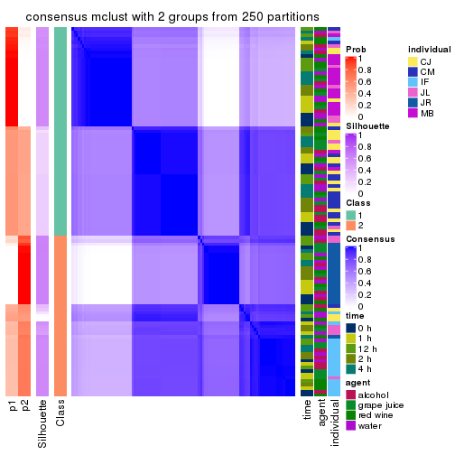</p>

</div>
<div id='tab-SD-mclust-consensus-heatmap-2'>
<pre><code class="r">consensus_heatmap(res, k = 3)
</code></pre>

<p>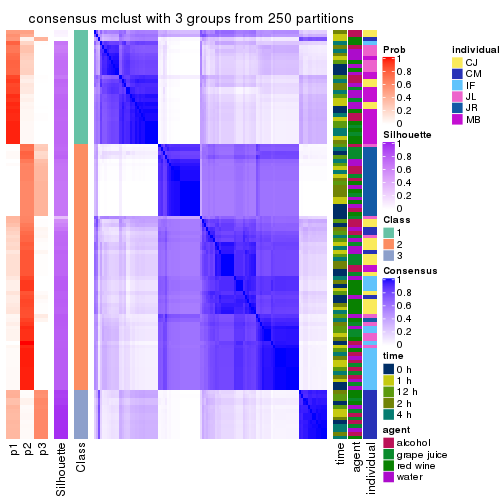</p>

</div>
<div id='tab-SD-mclust-consensus-heatmap-3'>
<pre><code class="r">consensus_heatmap(res, k = 4)
</code></pre>

<p>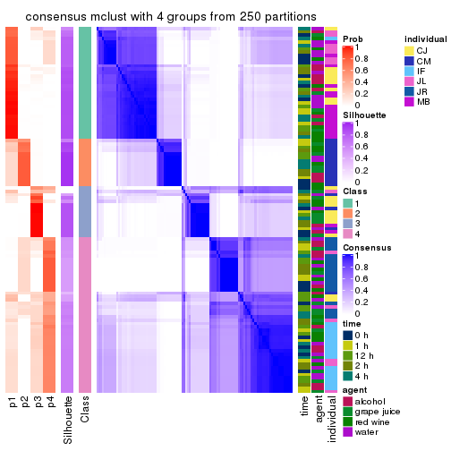</p>

</div>
<div id='tab-SD-mclust-consensus-heatmap-4'>
<pre><code class="r">consensus_heatmap(res, k = 5)
</code></pre>

<p>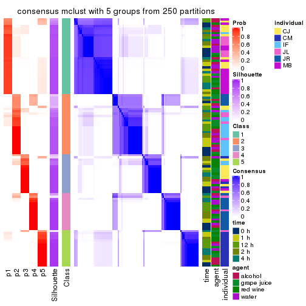</p>

</div>
<div id='tab-SD-mclust-consensus-heatmap-5'>
<pre><code class="r">consensus_heatmap(res, k = 6)
</code></pre>

<p>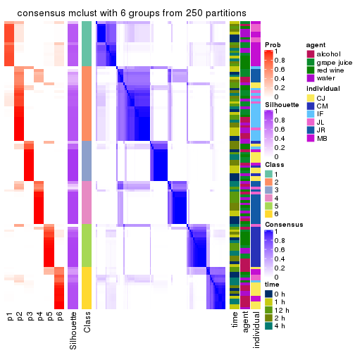</p>

</div>
</div>

Heatmaps for the membership of samples in all partitions to see how consistent they are:


<script>
$( function() {
	$( '#tabs-SD-mclust-membership-heatmap' ).tabs();
} );
</script>
<div id='tabs-SD-mclust-membership-heatmap'>
<ul>
<li><a href='#tab-SD-mclust-membership-heatmap-1'>k = 2</a></li>
<li><a href='#tab-SD-mclust-membership-heatmap-2'>k = 3</a></li>
<li><a href='#tab-SD-mclust-membership-heatmap-3'>k = 4</a></li>
<li><a href='#tab-SD-mclust-membership-heatmap-4'>k = 5</a></li>
<li><a href='#tab-SD-mclust-membership-heatmap-5'>k = 6</a></li>
</ul>
<div id='tab-SD-mclust-membership-heatmap-1'>
<pre><code class="r">membership_heatmap(res, k = 2)
</code></pre>

<p>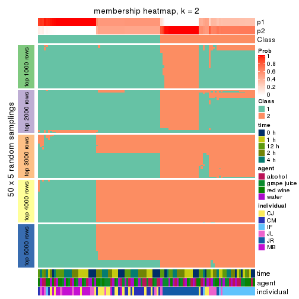</p>

</div>
<div id='tab-SD-mclust-membership-heatmap-2'>
<pre><code class="r">membership_heatmap(res, k = 3)
</code></pre>

<p>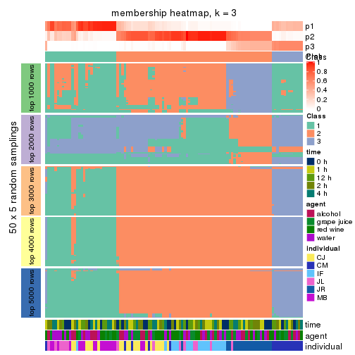</p>

</div>
<div id='tab-SD-mclust-membership-heatmap-3'>
<pre><code class="r">membership_heatmap(res, k = 4)
</code></pre>

<p>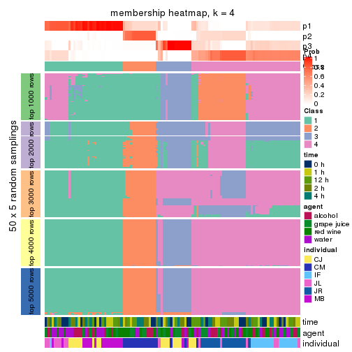</p>

</div>
<div id='tab-SD-mclust-membership-heatmap-4'>
<pre><code class="r">membership_heatmap(res, k = 5)
</code></pre>

<p>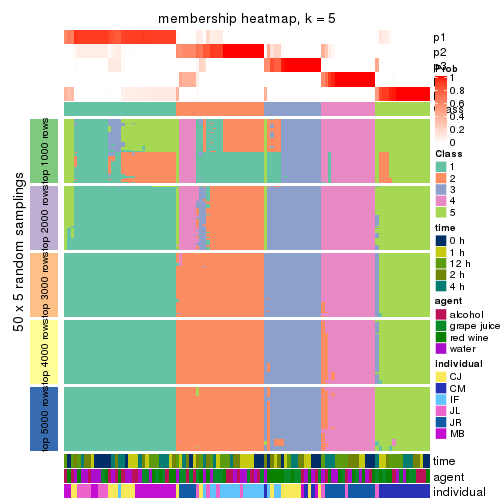</p>

</div>
<div id='tab-SD-mclust-membership-heatmap-5'>
<pre><code class="r">membership_heatmap(res, k = 6)
</code></pre>

<p>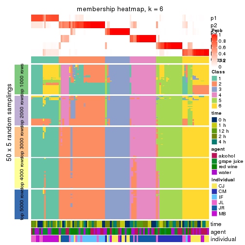</p>

</div>
</div>

As soon as we have had the classes for columns, we can look for signatures
which are significantly different between classes which can be candidate marks
for certain classes. Following are the heatmaps for signatures.


Signature heatmaps where rows are scaled:


<script>
$( function() {
	$( '#tabs-SD-mclust-get-signatures' ).tabs();
} );
</script>
<div id='tabs-SD-mclust-get-signatures'>
<ul>
<li><a href='#tab-SD-mclust-get-signatures-1'>k = 2</a></li>
<li><a href='#tab-SD-mclust-get-signatures-2'>k = 3</a></li>
<li><a href='#tab-SD-mclust-get-signatures-3'>k = 4</a></li>
<li><a href='#tab-SD-mclust-get-signatures-4'>k = 5</a></li>
<li><a href='#tab-SD-mclust-get-signatures-5'>k = 6</a></li>
</ul>
<div id='tab-SD-mclust-get-signatures-1'>
<pre><code class="r">get_signatures(res, k = 2)
</code></pre>

<p>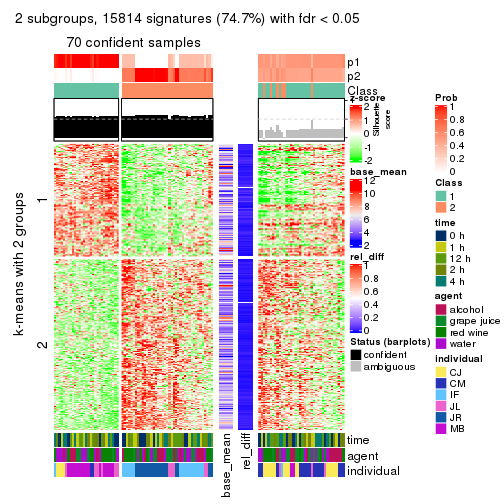</p>

</div>
<div id='tab-SD-mclust-get-signatures-2'>
<pre><code class="r">get_signatures(res, k = 3)
</code></pre>

<p>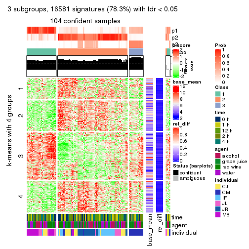</p>

</div>
<div id='tab-SD-mclust-get-signatures-3'>
<pre><code class="r">get_signatures(res, k = 4)
</code></pre>

<p>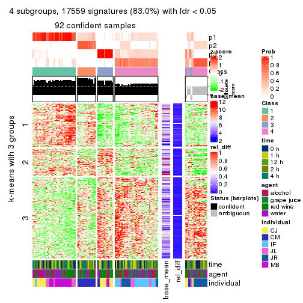</p>

</div>
<div id='tab-SD-mclust-get-signatures-4'>
<pre><code class="r">get_signatures(res, k = 5)
</code></pre>

<p>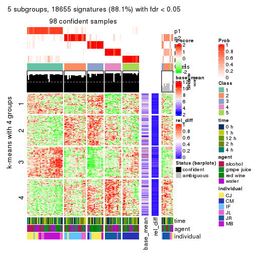</p>

</div>
<div id='tab-SD-mclust-get-signatures-5'>
<pre><code class="r">get_signatures(res, k = 6)
</code></pre>

<p>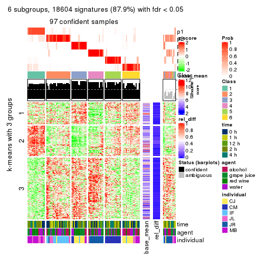</p>

</div>
</div>


Signature heatmaps where rows are not scaled:


<script>
$( function() {
	$( '#tabs-SD-mclust-get-signatures-no-scale' ).tabs();
} );
</script>
<div id='tabs-SD-mclust-get-signatures-no-scale'>
<ul>
<li><a href='#tab-SD-mclust-get-signatures-no-scale-1'>k = 2</a></li>
<li><a href='#tab-SD-mclust-get-signatures-no-scale-2'>k = 3</a></li>
<li><a href='#tab-SD-mclust-get-signatures-no-scale-3'>k = 4</a></li>
<li><a href='#tab-SD-mclust-get-signatures-no-scale-4'>k = 5</a></li>
<li><a href='#tab-SD-mclust-get-signatures-no-scale-5'>k = 6</a></li>
</ul>
<div id='tab-SD-mclust-get-signatures-no-scale-1'>
<pre><code class="r">get_signatures(res, k = 2, scale_rows = FALSE)
</code></pre>

<p>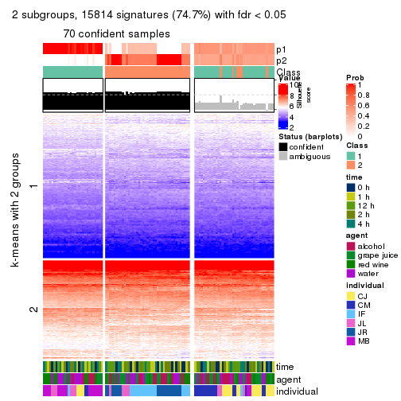</p>

</div>
<div id='tab-SD-mclust-get-signatures-no-scale-2'>
<pre><code class="r">get_signatures(res, k = 3, scale_rows = FALSE)
</code></pre>

<p>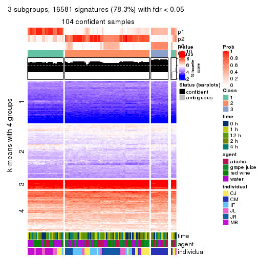</p>

</div>
<div id='tab-SD-mclust-get-signatures-no-scale-3'>
<pre><code class="r">get_signatures(res, k = 4, scale_rows = FALSE)
</code></pre>

<p>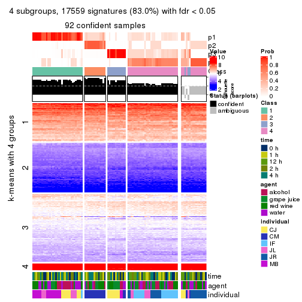</p>

</div>
<div id='tab-SD-mclust-get-signatures-no-scale-4'>
<pre><code class="r">get_signatures(res, k = 5, scale_rows = FALSE)
</code></pre>

<p>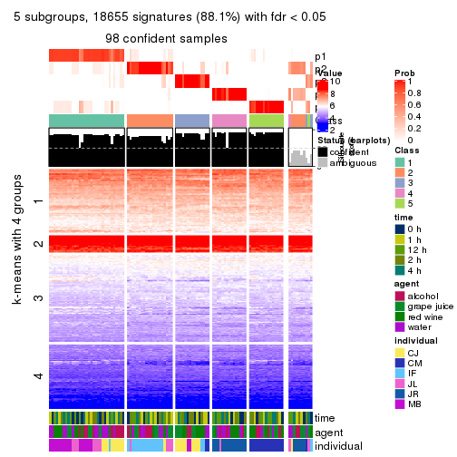</p>

</div>
<div id='tab-SD-mclust-get-signatures-no-scale-5'>
<pre><code class="r">get_signatures(res, k = 6, scale_rows = FALSE)
</code></pre>

<p>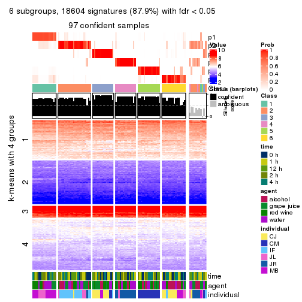</p>

</div>
</div>


Compare the overlap of signatures from different k:

```r
compare_signatures(res)
```

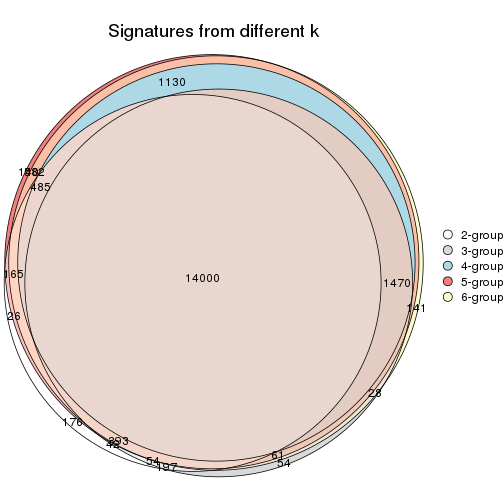

`get_signature()` returns a data frame invisibly. TO get the list of signatures, the function
call should be assigned to a variable explicitly. In following code, if `plot` argument is set
to `FALSE`, no heatmap is plotted while only the differential analysis is performed.

```r
# code only for demonstration
tb = get_signature(res, k = ..., plot = FALSE)
```

An example of the output of `tb` is:

```
#>   which_row         fdr    mean_1    mean_2 scaled_mean_1 scaled_mean_2 km
#> 1        38 0.042760348  8.373488  9.131774    -0.5533452     0.5164555  1
#> 2        40 0.018707592  7.106213  8.469186    -0.6173731     0.5762149  1
#> 3        55 0.019134737 10.221463 11.207825    -0.6159697     0.5749050  1
#> 4        59 0.006059896  5.921854  7.869574    -0.6899429     0.6439467  1
#> 5        60 0.018055526  8.928898 10.211722    -0.6204761     0.5791110  1
#> 6        98 0.009384629 15.714769 14.887706     0.6635654    -0.6193277  2
...
```

The columns in `tb` are:

1. `which_row`: row indices corresponding to the input matrix.
2. `fdr`: FDR for the differential test. 
3. `mean_x`: The mean value in group x.
4. `scaled_mean_x`: The mean value in group x after rows are scaled.
5. `km`: Row groups if k-means clustering is applied to rows.


UMAP plot which shows how samples are separated.


<script>
$( function() {
	$( '#tabs-SD-mclust-dimension-reduction' ).tabs();
} );
</script>
<div id='tabs-SD-mclust-dimension-reduction'>
<ul>
<li><a href='#tab-SD-mclust-dimension-reduction-1'>k = 2</a></li>
<li><a href='#tab-SD-mclust-dimension-reduction-2'>k = 3</a></li>
<li><a href='#tab-SD-mclust-dimension-reduction-3'>k = 4</a></li>
<li><a href='#tab-SD-mclust-dimension-reduction-4'>k = 5</a></li>
<li><a href='#tab-SD-mclust-dimension-reduction-5'>k = 6</a></li>
</ul>
<div id='tab-SD-mclust-dimension-reduction-1'>
<pre><code class="r">dimension_reduction(res, k = 2, method = &quot;UMAP&quot;)
</code></pre>

<p>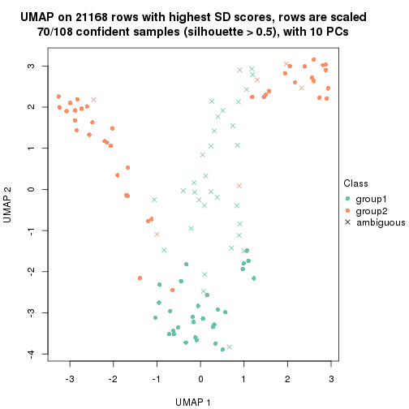</p>

</div>
<div id='tab-SD-mclust-dimension-reduction-2'>
<pre><code class="r">dimension_reduction(res, k = 3, method = &quot;UMAP&quot;)
</code></pre>

<p>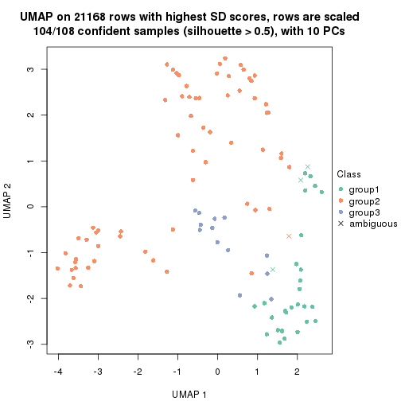</p>

</div>
<div id='tab-SD-mclust-dimension-reduction-3'>
<pre><code class="r">dimension_reduction(res, k = 4, method = &quot;UMAP&quot;)
</code></pre>

<p>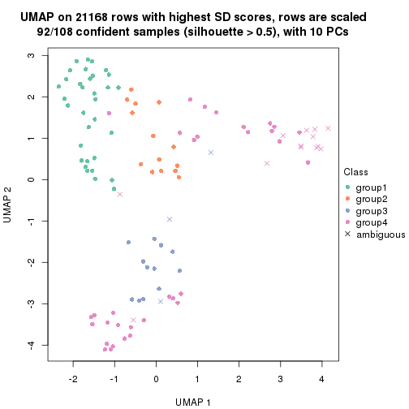</p>

</div>
<div id='tab-SD-mclust-dimension-reduction-4'>
<pre><code class="r">dimension_reduction(res, k = 5, method = &quot;UMAP&quot;)
</code></pre>

<p>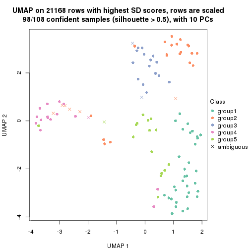</p>

</div>
<div id='tab-SD-mclust-dimension-reduction-5'>
<pre><code class="r">dimension_reduction(res, k = 6, method = &quot;UMAP&quot;)
</code></pre>

<p>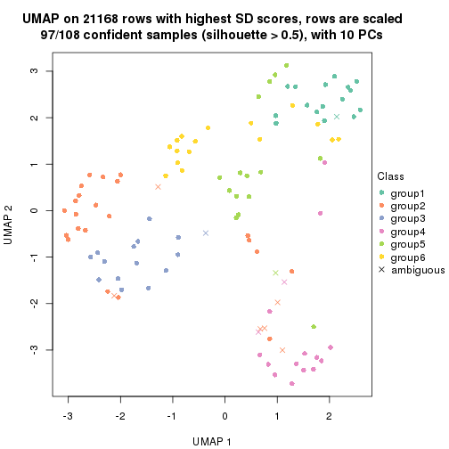</p>

</div>
</div>


Following heatmap shows how subgroups are split when increasing `k`:

```r
collect_classes(res)
```

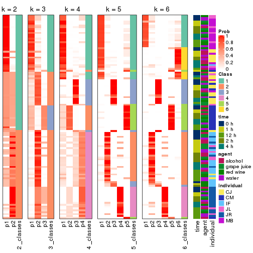


Test correlation between subgroups and known annotations. If the known
annotation is numeric, one-way ANOVA test is applied, and if the known
annotation is discrete, chi-squared contingency table test is applied.

```r
test_to_known_factors(res)
```

```
#>             n time(p) agent(p) individual(p) k
#> SD:mclust  70   0.896    0.397      1.39e-10 2
#> SD:mclust 104   0.996    0.734      7.83e-23 3
#> SD:mclust  92   0.998    0.678      2.55e-27 4
#> SD:mclust  98   0.993    0.689      2.89e-41 5
#> SD:mclust  97   0.995    0.213      6.34e-42 6
```


If matrix rows can be associated to genes, consider to use `GO_Enrichment(res,
...)` to perform function enrichment for the signature genes.


 

---------------------------------------------------


### SD:NMF


The object with results only for a single top-value method and a single partition method 
can be extracted as:

```r
res = res_list["SD", "NMF"]
# you can also extract it by
# res = res_list["SD:NMF"]
```

A summary of `res` and all the functions that can be applied to it:

```r
res
```

```
#> A 'ConsensusPartition' object with k = 2, 3, 4, 5, 6.
#>   On a matrix with 21168 rows and 108 columns.
#>   Top rows (1000, 2000, 3000, 4000, 5000) are extracted by 'SD' method.
#>   Subgroups are detected by 'NMF' method.
#>   Performed in total 1250 partitions by row resampling.
#>   Best k for subgroups seems to be 2.
#> 
#> Following methods can be applied to this 'ConsensusPartition' object:
#>  [1] "cola_report"             "collect_classes"         "collect_plots"          
#>  [4] "collect_stats"           "colnames"                "compare_signatures"     
#>  [7] "consensus_heatmap"       "dimension_reduction"     "functional_enrichment"  
#> [10] "get_anno_col"            "get_anno"                "get_classes"            
#> [13] "get_consensus"           "get_matrix"              "get_membership"         
#> [16] "get_param"               "get_signatures"          "get_stats"              
#> [19] "is_best_k"               "is_stable_k"             "membership_heatmap"     
#> [22] "ncol"                    "nrow"                    "plot_ecdf"              
#> [25] "rownames"                "select_partition_number" "show"                   
#> [28] "suggest_best_k"          "test_to_known_factors"
```

`collect_plots()` function collects all the plots made from `res` for all `k` (number of partitions)
into one single page to provide an easy and fast comparison between different `k`.

```r
collect_plots(res)
```

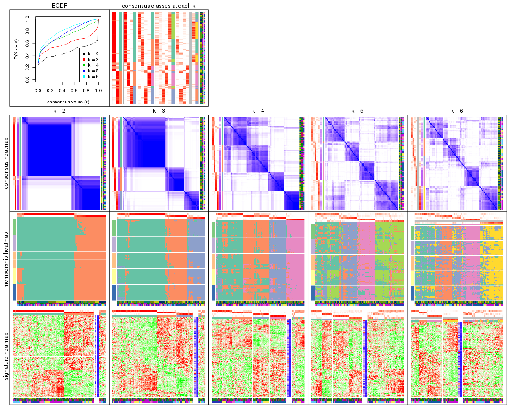

The plots are:

- The first row: a plot of the ECDF (Empirical cumulative distribution
  function) curves of the consensus matrix for each `k` and the heatmap of
  predicted classes for each `k`.
- The second row: heatmaps of the consensus matrix for each `k`.
- The third row: heatmaps of the membership matrix for each `k`.
- The fouth row: heatmaps of the signatures for each `k`.

All the plots in panels can be made by individual functions and they are
plotted later in this section.

`select_partition_number()` produces several plots showing different
statistics for choosing "optimized" `k`. There are following statistics:

- ECDF curves of the consensus matrix for each `k`;
- 1-PAC. [The PAC
  score](https://en.wikipedia.org/wiki/Consensus_clustering#Over-interpretation_potential_of_consensus_clustering)
  measures the proportion of the ambiguous subgrouping.
- Mean silhouette score.
- Concordance. The mean probability of fiting the consensus class ids in all
  partitions.
- Area increased. Denote $A_k$ as the area under the ECDF curve for current
  `k`, the area increased is defined as $A_k - A_{k-1}$.
- Rand index. The percent of pairs of samples that are both in a same cluster
  or both are not in a same cluster in the partition of k and k-1.
- Jaccard index. The ratio of pairs of samples are both in a same cluster in
  the partition of k and k-1 and the pairs of samples are both in a same
  cluster in the partition k or k-1.

The detailed explanations of these statistics can be found in [the cola
vignette](http://bioconductor.org/packages/devel/bioc/vignettes/cola/inst/doc/cola.html#toc_13).

Generally speaking, lower PAC score, higher mean silhouette score or higher
concordance corresponds to better partition. Rand index and Jaccard index
measure how similar the current partition is compared to partition with `k-1`.
If they are too similar, we won't accept `k` is better than `k-1`.

```r
select_partition_number(res)
```

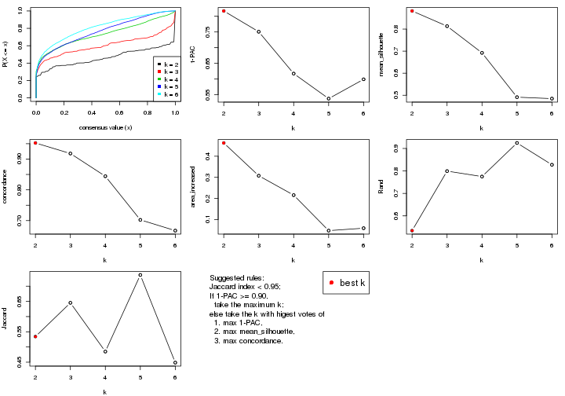

The numeric values for all these statistics can be obtained by `get_stats()`.

```r
get_stats(res)
```

```
#>   k 1-PAC mean_silhouette concordance area_increased  Rand Jaccard
#> 2 2 0.817           0.882       0.952         0.4629 0.534   0.534
#> 3 3 0.751           0.813       0.918         0.3076 0.799   0.645
#> 4 4 0.617           0.692       0.844         0.2155 0.775   0.485
#> 5 5 0.538           0.491       0.702         0.0472 0.925   0.737
#> 6 6 0.599           0.485       0.667         0.0587 0.827   0.449
```

`suggest_best_k()` suggests the best $k$ based on these statistics. The rules are as follows:

- All $k$ with Jaccard index larger than 0.95 are removed because the increase of
  the partition number does not provides enough extra information. If all $k$ are removed,
  the best $k$ is assigned by `NA`.
- For $k$ with 1-PAC larger than 0.9, the maximal $k$ is taken as the "best k". Other $k$ is called "optional k".
- If it does not fit the second rule. The $k$ with the highest vote of highest
  1-PAC, mean silhouette and concordance is taken as the "best k".

```r
suggest_best_k(res)
```

```
#> [1] 2
```


Following shows the table of the partitions (You need to click the **show/hide
code output** link to see it). The membership matrix (columns with name `p*`)
is inferred by
[`clue::cl_consensus()`](https://www.rdocumentation.org/link/cl_consensus?package=clue)
function with the `SE` method. Basically the value in the membership matrix
represents the probability to belong to a certain group. The finall class
label for an item is determined with the group with highest probability it
belongs to.

In `get_classes()` function, the entropy is calculated from the membership
matrix and the silhouette score is calculated from the consensus matrix.


<script>
$( function() {
	$( '#tabs-SD-NMF-get-classes' ).tabs();
} );
</script>
<div id='tabs-SD-NMF-get-classes'>
<ul>
<li><a href='#tab-SD-NMF-get-classes-1'>k = 2</a></li>
<li><a href='#tab-SD-NMF-get-classes-2'>k = 3</a></li>
<li><a href='#tab-SD-NMF-get-classes-3'>k = 4</a></li>
<li><a href='#tab-SD-NMF-get-classes-4'>k = 5</a></li>
<li><a href='#tab-SD-NMF-get-classes-5'>k = 6</a></li>
</ul>

<div id='tab-SD-NMF-get-classes-1'>
<p><a id='tab-SD-NMF-get-classes-1-a' style='color:#0366d6' href='#'>show/hide code output</a></p>
<pre><code class="r">cbind(get_classes(res, k = 2), get_membership(res, k = 2))
</code></pre>

<pre><code>#&gt;          class entropy silhouette    p1    p2
#&gt; GSM87863     1  0.0000      0.953 1.000 0.000
#&gt; GSM87887     1  0.0000      0.953 1.000 0.000
#&gt; GSM87896     2  0.0000      0.936 0.000 1.000
#&gt; GSM87934     2  0.0000      0.936 0.000 1.000
#&gt; GSM87943     2  0.5294      0.860 0.120 0.880
#&gt; GSM87853     2  0.0000      0.936 0.000 1.000
#&gt; GSM87906     1  0.7602      0.690 0.780 0.220
#&gt; GSM87920     1  0.0000      0.953 1.000 0.000
#&gt; GSM87924     2  0.0000      0.936 0.000 1.000
#&gt; GSM87858     2  0.0000      0.936 0.000 1.000
#&gt; GSM87882     1  0.6712      0.755 0.824 0.176
#&gt; GSM87891     2  0.0000      0.936 0.000 1.000
#&gt; GSM87917     1  0.0000      0.953 1.000 0.000
#&gt; GSM87929     1  0.9635      0.341 0.612 0.388
#&gt; GSM87948     1  0.0000      0.953 1.000 0.000
#&gt; GSM87868     1  0.0000      0.953 1.000 0.000
#&gt; GSM87873     2  0.0000      0.936 0.000 1.000
#&gt; GSM87901     1  0.0000      0.953 1.000 0.000
#&gt; GSM87910     1  0.0000      0.953 1.000 0.000
#&gt; GSM87938     2  0.0000      0.936 0.000 1.000
#&gt; GSM87953     1  0.0000      0.953 1.000 0.000
#&gt; GSM87864     1  0.0000      0.953 1.000 0.000
#&gt; GSM87888     1  0.0000      0.953 1.000 0.000
#&gt; GSM87897     1  0.9954      0.106 0.540 0.460
#&gt; GSM87935     2  0.0000      0.936 0.000 1.000
#&gt; GSM87944     1  0.0000      0.953 1.000 0.000
#&gt; GSM87854     1  0.0000      0.953 1.000 0.000
#&gt; GSM87878     1  0.0000      0.953 1.000 0.000
#&gt; GSM87907     2  0.0000      0.936 0.000 1.000
#&gt; GSM87921     1  0.0000      0.953 1.000 0.000
#&gt; GSM87925     2  0.2043      0.923 0.032 0.968
#&gt; GSM87957     1  0.0000      0.953 1.000 0.000
#&gt; GSM87859     2  0.0000      0.936 0.000 1.000
#&gt; GSM87883     1  0.0000      0.953 1.000 0.000
#&gt; GSM87892     2  0.0000      0.936 0.000 1.000
#&gt; GSM87930     2  0.0000      0.936 0.000 1.000
#&gt; GSM87949     1  0.0000      0.953 1.000 0.000
#&gt; GSM87869     1  0.0000      0.953 1.000 0.000
#&gt; GSM87874     2  0.0000      0.936 0.000 1.000
#&gt; GSM87902     1  0.0000      0.953 1.000 0.000
#&gt; GSM87911     1  0.0000      0.953 1.000 0.000
#&gt; GSM87939     2  0.4690      0.879 0.100 0.900
#&gt; GSM87954     1  0.0000      0.953 1.000 0.000
#&gt; GSM87865     1  0.0000      0.953 1.000 0.000
#&gt; GSM87889     1  0.0000      0.953 1.000 0.000
#&gt; GSM87898     1  0.0000      0.953 1.000 0.000
#&gt; GSM87915     1  0.0000      0.953 1.000 0.000
#&gt; GSM87936     2  0.0000      0.936 0.000 1.000
#&gt; GSM87945     2  0.0000      0.936 0.000 1.000
#&gt; GSM87855     2  0.0000      0.936 0.000 1.000
#&gt; GSM87879     1  0.0376      0.950 0.996 0.004
#&gt; GSM87922     2  0.9988      0.100 0.480 0.520
#&gt; GSM87926     2  0.8443      0.651 0.272 0.728
#&gt; GSM87958     1  0.0000      0.953 1.000 0.000
#&gt; GSM87860     2  0.0000      0.936 0.000 1.000
#&gt; GSM87884     1  0.0000      0.953 1.000 0.000
#&gt; GSM87893     2  0.0000      0.936 0.000 1.000
#&gt; GSM87918     1  0.0000      0.953 1.000 0.000
#&gt; GSM87931     2  0.2423      0.919 0.040 0.960
#&gt; GSM87950     1  0.0000      0.953 1.000 0.000
#&gt; GSM87870     1  0.0000      0.953 1.000 0.000
#&gt; GSM87875     2  0.0000      0.936 0.000 1.000
#&gt; GSM87903     1  0.9358      0.432 0.648 0.352
#&gt; GSM87912     1  0.0000      0.953 1.000 0.000
#&gt; GSM87940     2  0.0000      0.936 0.000 1.000
#&gt; GSM87866     1  0.0000      0.953 1.000 0.000
#&gt; GSM87899     2  0.5629      0.847 0.132 0.868
#&gt; GSM87937     2  0.0000      0.936 0.000 1.000
#&gt; GSM87946     1  0.0000      0.953 1.000 0.000
#&gt; GSM87856     2  0.1184      0.930 0.016 0.984
#&gt; GSM87880     1  0.0000      0.953 1.000 0.000
#&gt; GSM87908     1  0.0000      0.953 1.000 0.000
#&gt; GSM87923     2  0.8661      0.622 0.288 0.712
#&gt; GSM87927     1  0.9775      0.271 0.588 0.412
#&gt; GSM87959     1  0.0000      0.953 1.000 0.000
#&gt; GSM87861     2  0.0000      0.936 0.000 1.000
#&gt; GSM87885     1  0.0000      0.953 1.000 0.000
#&gt; GSM87894     1  0.0000      0.953 1.000 0.000
#&gt; GSM87932     1  0.0000      0.953 1.000 0.000
#&gt; GSM87951     1  0.0000      0.953 1.000 0.000
#&gt; GSM87871     1  0.0000      0.953 1.000 0.000
#&gt; GSM87876     1  0.0000      0.953 1.000 0.000
#&gt; GSM87904     2  0.3431      0.905 0.064 0.936
#&gt; GSM87913     1  0.0000      0.953 1.000 0.000
#&gt; GSM87941     1  0.9850      0.220 0.572 0.428
#&gt; GSM87955     1  0.0000      0.953 1.000 0.000
#&gt; GSM87867     1  0.0000      0.953 1.000 0.000
#&gt; GSM87890     2  0.4161      0.892 0.084 0.916
#&gt; GSM87900     1  0.9580      0.362 0.620 0.380
#&gt; GSM87916     2  0.9710      0.363 0.400 0.600
#&gt; GSM87947     1  0.0000      0.953 1.000 0.000
#&gt; GSM87857     2  0.4431      0.885 0.092 0.908
#&gt; GSM87881     1  0.0376      0.950 0.996 0.004
#&gt; GSM87909     1  0.0000      0.953 1.000 0.000
#&gt; GSM87928     1  0.0000      0.953 1.000 0.000
#&gt; GSM87960     1  0.0000      0.953 1.000 0.000
#&gt; GSM87862     2  0.2423      0.919 0.040 0.960
#&gt; GSM87886     1  0.0000      0.953 1.000 0.000
#&gt; GSM87895     2  0.0000      0.936 0.000 1.000
#&gt; GSM87919     1  0.0000      0.953 1.000 0.000
#&gt; GSM87933     2  0.5294      0.860 0.120 0.880
#&gt; GSM87952     1  0.0000      0.953 1.000 0.000
#&gt; GSM87872     1  0.2423      0.916 0.960 0.040
#&gt; GSM87877     1  0.0000      0.953 1.000 0.000
#&gt; GSM87905     1  0.0000      0.953 1.000 0.000
#&gt; GSM87914     1  0.0000      0.953 1.000 0.000
#&gt; GSM87942     1  0.0000      0.953 1.000 0.000
#&gt; GSM87956     1  0.0000      0.953 1.000 0.000
</code></pre>

<script>
$('#tab-SD-NMF-get-classes-1-a').parent().next().next().hide();
$('#tab-SD-NMF-get-classes-1-a').click(function(){
  $('#tab-SD-NMF-get-classes-1-a').parent().next().next().toggle();
  return(false);
});
</script>
</div>

<div id='tab-SD-NMF-get-classes-2'>
<p><a id='tab-SD-NMF-get-classes-2-a' style='color:#0366d6' href='#'>show/hide code output</a></p>
<pre><code class="r">cbind(get_classes(res, k = 3), get_membership(res, k = 3))
</code></pre>

<pre><code>#&gt;          class entropy silhouette    p1    p2    p3
#&gt; GSM87863     1  0.3482      0.838 0.872 0.000 0.128
#&gt; GSM87887     1  0.0000      0.933 1.000 0.000 0.000
#&gt; GSM87896     3  0.5948      0.571 0.000 0.360 0.640
#&gt; GSM87934     2  0.0000      0.868 0.000 1.000 0.000
#&gt; GSM87943     3  0.1163      0.842 0.028 0.000 0.972
#&gt; GSM87853     3  0.0000      0.848 0.000 0.000 1.000
#&gt; GSM87906     2  0.6291      0.138 0.468 0.532 0.000
#&gt; GSM87920     1  0.0000      0.933 1.000 0.000 0.000
#&gt; GSM87924     2  0.1031      0.850 0.000 0.976 0.024
#&gt; GSM87858     3  0.4002      0.800 0.000 0.160 0.840
#&gt; GSM87882     1  0.6305      0.121 0.516 0.000 0.484
#&gt; GSM87891     3  0.5905      0.584 0.000 0.352 0.648
#&gt; GSM87917     1  0.0000      0.933 1.000 0.000 0.000
#&gt; GSM87929     2  0.1753      0.848 0.048 0.952 0.000
#&gt; GSM87948     1  0.0000      0.933 1.000 0.000 0.000
#&gt; GSM87868     1  0.0000      0.933 1.000 0.000 0.000
#&gt; GSM87873     3  0.3482      0.818 0.000 0.128 0.872
#&gt; GSM87901     1  0.3941      0.793 0.844 0.156 0.000
#&gt; GSM87910     1  0.0000      0.933 1.000 0.000 0.000
#&gt; GSM87938     2  0.0000      0.868 0.000 1.000 0.000
#&gt; GSM87953     1  0.0000      0.933 1.000 0.000 0.000
#&gt; GSM87864     1  0.3412      0.842 0.876 0.000 0.124
#&gt; GSM87888     1  0.2878      0.870 0.904 0.000 0.096
#&gt; GSM87897     2  0.4953      0.711 0.176 0.808 0.016
#&gt; GSM87935     2  0.0000      0.868 0.000 1.000 0.000
#&gt; GSM87944     1  0.0000      0.933 1.000 0.000 0.000
#&gt; GSM87854     3  0.6095      0.275 0.392 0.000 0.608
#&gt; GSM87878     1  0.0000      0.933 1.000 0.000 0.000
#&gt; GSM87907     2  0.5678      0.333 0.000 0.684 0.316
#&gt; GSM87921     2  0.6299      0.129 0.476 0.524 0.000
#&gt; GSM87925     2  0.0000      0.868 0.000 1.000 0.000
#&gt; GSM87957     1  0.0000      0.933 1.000 0.000 0.000
#&gt; GSM87859     3  0.1964      0.845 0.000 0.056 0.944
#&gt; GSM87883     1  0.0000      0.933 1.000 0.000 0.000
#&gt; GSM87892     3  0.5254      0.711 0.000 0.264 0.736
#&gt; GSM87930     2  0.0000      0.868 0.000 1.000 0.000
#&gt; GSM87949     1  0.0000      0.933 1.000 0.000 0.000
#&gt; GSM87869     1  0.0000      0.933 1.000 0.000 0.000
#&gt; GSM87874     3  0.1753      0.846 0.000 0.048 0.952
#&gt; GSM87902     1  0.0592      0.928 0.988 0.012 0.000
#&gt; GSM87911     1  0.1453      0.920 0.968 0.024 0.008
#&gt; GSM87939     2  0.0000      0.868 0.000 1.000 0.000
#&gt; GSM87954     1  0.0237      0.932 0.996 0.004 0.000
#&gt; GSM87865     1  0.2796      0.872 0.908 0.000 0.092
#&gt; GSM87889     1  0.0000      0.933 1.000 0.000 0.000
#&gt; GSM87898     1  0.0424      0.930 0.992 0.008 0.000
#&gt; GSM87915     1  0.1031      0.920 0.976 0.024 0.000
#&gt; GSM87936     2  0.0000      0.868 0.000 1.000 0.000
#&gt; GSM87945     3  0.0000      0.848 0.000 0.000 1.000
#&gt; GSM87855     3  0.0000      0.848 0.000 0.000 1.000
#&gt; GSM87879     1  0.6299      0.150 0.524 0.000 0.476
#&gt; GSM87922     2  0.2959      0.800 0.100 0.900 0.000
#&gt; GSM87926     2  0.0000      0.868 0.000 1.000 0.000
#&gt; GSM87958     1  0.0000      0.933 1.000 0.000 0.000
#&gt; GSM87860     3  0.0661      0.849 0.008 0.004 0.988
#&gt; GSM87884     1  0.0000      0.933 1.000 0.000 0.000
#&gt; GSM87893     3  0.4702      0.761 0.000 0.212 0.788
#&gt; GSM87918     1  0.1031      0.920 0.976 0.024 0.000
#&gt; GSM87931     2  0.0000      0.868 0.000 1.000 0.000
#&gt; GSM87950     1  0.0000      0.933 1.000 0.000 0.000
#&gt; GSM87870     1  0.0000      0.933 1.000 0.000 0.000
#&gt; GSM87875     3  0.0747      0.846 0.016 0.000 0.984
#&gt; GSM87903     1  0.6467      0.340 0.604 0.388 0.008
#&gt; GSM87912     1  0.0424      0.930 0.992 0.008 0.000
#&gt; GSM87940     2  0.0000      0.868 0.000 1.000 0.000
#&gt; GSM87866     1  0.0237      0.932 0.996 0.000 0.004
#&gt; GSM87899     3  0.2550      0.838 0.040 0.024 0.936
#&gt; GSM87937     2  0.0000      0.868 0.000 1.000 0.000
#&gt; GSM87946     1  0.0000      0.933 1.000 0.000 0.000
#&gt; GSM87856     3  0.1163      0.842 0.028 0.000 0.972
#&gt; GSM87880     1  0.4399      0.770 0.812 0.000 0.188
#&gt; GSM87908     1  0.0424      0.930 0.992 0.008 0.000
#&gt; GSM87923     3  0.8485      0.567 0.192 0.192 0.616
#&gt; GSM87927     2  0.1643      0.850 0.044 0.956 0.000
#&gt; GSM87959     1  0.0000      0.933 1.000 0.000 0.000
#&gt; GSM87861     3  0.0237      0.849 0.000 0.004 0.996
#&gt; GSM87885     1  0.0000      0.933 1.000 0.000 0.000
#&gt; GSM87894     1  0.2261      0.891 0.932 0.000 0.068
#&gt; GSM87932     1  0.3340      0.832 0.880 0.120 0.000
#&gt; GSM87951     1  0.0000      0.933 1.000 0.000 0.000
#&gt; GSM87871     1  0.2261      0.893 0.932 0.000 0.068
#&gt; GSM87876     1  0.0000      0.933 1.000 0.000 0.000
#&gt; GSM87904     3  0.3377      0.836 0.012 0.092 0.896
#&gt; GSM87913     1  0.0000      0.933 1.000 0.000 0.000
#&gt; GSM87941     2  0.1163      0.858 0.028 0.972 0.000
#&gt; GSM87955     1  0.0000      0.933 1.000 0.000 0.000
#&gt; GSM87867     1  0.0000      0.933 1.000 0.000 0.000
#&gt; GSM87890     2  0.0237      0.866 0.000 0.996 0.004
#&gt; GSM87900     2  0.1860      0.845 0.052 0.948 0.000
#&gt; GSM87916     2  0.0237      0.868 0.004 0.996 0.000
#&gt; GSM87947     1  0.1964      0.900 0.944 0.000 0.056
#&gt; GSM87857     3  0.1529      0.835 0.040 0.000 0.960
#&gt; GSM87881     1  0.2796      0.862 0.908 0.092 0.000
#&gt; GSM87909     1  0.3879      0.790 0.848 0.152 0.000
#&gt; GSM87928     1  0.6295      0.013 0.528 0.472 0.000
#&gt; GSM87960     1  0.0000      0.933 1.000 0.000 0.000
#&gt; GSM87862     3  0.5327      0.700 0.000 0.272 0.728
#&gt; GSM87886     1  0.0000      0.933 1.000 0.000 0.000
#&gt; GSM87895     2  0.2165      0.811 0.000 0.936 0.064
#&gt; GSM87919     1  0.0424      0.930 0.992 0.008 0.000
#&gt; GSM87933     2  0.0000      0.868 0.000 1.000 0.000
#&gt; GSM87952     1  0.0000      0.933 1.000 0.000 0.000
#&gt; GSM87872     1  0.5529      0.559 0.704 0.296 0.000
#&gt; GSM87877     1  0.0000      0.933 1.000 0.000 0.000
#&gt; GSM87905     1  0.1163      0.918 0.972 0.028 0.000
#&gt; GSM87914     2  0.5560      0.572 0.300 0.700 0.000
#&gt; GSM87942     2  0.4235      0.722 0.176 0.824 0.000
#&gt; GSM87956     1  0.0000      0.933 1.000 0.000 0.000
</code></pre>

<script>
$('#tab-SD-NMF-get-classes-2-a').parent().next().next().hide();
$('#tab-SD-NMF-get-classes-2-a').click(function(){
  $('#tab-SD-NMF-get-classes-2-a').parent().next().next().toggle();
  return(false);
});
</script>
</div>

<div id='tab-SD-NMF-get-classes-3'>
<p><a id='tab-SD-NMF-get-classes-3-a' style='color:#0366d6' href='#'>show/hide code output</a></p>
<pre><code class="r">cbind(get_classes(res, k = 4), get_membership(res, k = 4))
</code></pre>

<pre><code>#&gt;          class entropy silhouette    p1    p2    p3    p4
#&gt; GSM87863     1  0.3157     0.7017 0.852 0.144 0.004 0.000
#&gt; GSM87887     1  0.0592     0.7477 0.984 0.016 0.000 0.000
#&gt; GSM87896     3  0.3494     0.7781 0.000 0.004 0.824 0.172
#&gt; GSM87934     4  0.0000     0.9455 0.000 0.000 0.000 1.000
#&gt; GSM87943     3  0.4741     0.5459 0.328 0.004 0.668 0.000
#&gt; GSM87853     3  0.0657     0.8760 0.012 0.004 0.984 0.000
#&gt; GSM87906     2  0.3427     0.7142 0.000 0.860 0.028 0.112
#&gt; GSM87920     1  0.4985    -0.0842 0.532 0.468 0.000 0.000
#&gt; GSM87924     4  0.0469     0.9390 0.000 0.000 0.012 0.988
#&gt; GSM87858     3  0.1398     0.8705 0.000 0.004 0.956 0.040
#&gt; GSM87882     1  0.3391     0.6610 0.844 0.004 0.148 0.004
#&gt; GSM87891     3  0.3710     0.7646 0.000 0.004 0.804 0.192
#&gt; GSM87917     2  0.3801     0.7158 0.220 0.780 0.000 0.000
#&gt; GSM87929     4  0.0592     0.9420 0.000 0.016 0.000 0.984
#&gt; GSM87948     1  0.1716     0.7423 0.936 0.064 0.000 0.000
#&gt; GSM87868     1  0.4134     0.5557 0.740 0.260 0.000 0.000
#&gt; GSM87873     3  0.1398     0.8703 0.000 0.004 0.956 0.040
#&gt; GSM87901     2  0.3278     0.7284 0.020 0.864 0.000 0.116
#&gt; GSM87910     2  0.3123     0.7450 0.156 0.844 0.000 0.000
#&gt; GSM87938     4  0.0000     0.9455 0.000 0.000 0.000 1.000
#&gt; GSM87953     2  0.3610     0.7283 0.200 0.800 0.000 0.000
#&gt; GSM87864     1  0.2973     0.7029 0.856 0.144 0.000 0.000
#&gt; GSM87888     1  0.2408     0.6954 0.896 0.000 0.104 0.000
#&gt; GSM87897     2  0.2988     0.6736 0.000 0.876 0.112 0.012
#&gt; GSM87935     4  0.0000     0.9455 0.000 0.000 0.000 1.000
#&gt; GSM87944     1  0.2281     0.7294 0.904 0.096 0.000 0.000
#&gt; GSM87854     3  0.6233     0.6520 0.216 0.124 0.660 0.000
#&gt; GSM87878     1  0.4799     0.5783 0.744 0.224 0.000 0.032
#&gt; GSM87907     3  0.5213     0.7238 0.000 0.224 0.724 0.052
#&gt; GSM87921     2  0.2179     0.7452 0.012 0.924 0.000 0.064
#&gt; GSM87925     4  0.0469     0.9434 0.000 0.012 0.000 0.988
#&gt; GSM87957     2  0.4967     0.1191 0.452 0.548 0.000 0.000
#&gt; GSM87859     3  0.0188     0.8769 0.000 0.004 0.996 0.000
#&gt; GSM87883     1  0.0707     0.7480 0.980 0.020 0.000 0.000
#&gt; GSM87892     3  0.1182     0.8756 0.000 0.016 0.968 0.016
#&gt; GSM87930     4  0.0000     0.9455 0.000 0.000 0.000 1.000
#&gt; GSM87949     2  0.4989     0.2467 0.472 0.528 0.000 0.000
#&gt; GSM87869     2  0.4985     0.0344 0.468 0.532 0.000 0.000
#&gt; GSM87874     3  0.1114     0.8747 0.016 0.004 0.972 0.008
#&gt; GSM87902     2  0.1229     0.7504 0.020 0.968 0.004 0.008
#&gt; GSM87911     2  0.1635     0.7366 0.008 0.948 0.044 0.000
#&gt; GSM87939     4  0.0000     0.9455 0.000 0.000 0.000 1.000
#&gt; GSM87954     2  0.3356     0.7384 0.176 0.824 0.000 0.000
#&gt; GSM87865     1  0.5281     0.2100 0.528 0.464 0.008 0.000
#&gt; GSM87889     1  0.0804     0.7466 0.980 0.008 0.000 0.012
#&gt; GSM87898     2  0.0992     0.7422 0.008 0.976 0.012 0.004
#&gt; GSM87915     2  0.3311     0.7417 0.172 0.828 0.000 0.000
#&gt; GSM87936     4  0.0707     0.9398 0.000 0.020 0.000 0.980
#&gt; GSM87945     3  0.1022     0.8718 0.032 0.000 0.968 0.000
#&gt; GSM87855     3  0.0804     0.8764 0.012 0.008 0.980 0.000
#&gt; GSM87879     1  0.3123     0.6575 0.844 0.000 0.156 0.000
#&gt; GSM87922     4  0.1871     0.9235 0.024 0.012 0.016 0.948
#&gt; GSM87926     4  0.0336     0.9443 0.000 0.008 0.000 0.992
#&gt; GSM87958     2  0.3873     0.6793 0.228 0.772 0.000 0.000
#&gt; GSM87860     3  0.0592     0.8769 0.000 0.016 0.984 0.000
#&gt; GSM87884     1  0.0707     0.7480 0.980 0.020 0.000 0.000
#&gt; GSM87893     3  0.1004     0.8750 0.000 0.004 0.972 0.024
#&gt; GSM87918     2  0.1833     0.7534 0.024 0.944 0.000 0.032
#&gt; GSM87931     4  0.0000     0.9455 0.000 0.000 0.000 1.000
#&gt; GSM87950     1  0.4713     0.3314 0.640 0.360 0.000 0.000
#&gt; GSM87870     2  0.4981     0.2522 0.464 0.536 0.000 0.000
#&gt; GSM87875     1  0.5143    -0.0313 0.540 0.004 0.456 0.000
#&gt; GSM87903     2  0.4979     0.6010 0.000 0.760 0.176 0.064
#&gt; GSM87912     2  0.3873     0.7100 0.228 0.772 0.000 0.000
#&gt; GSM87940     4  0.0000     0.9455 0.000 0.000 0.000 1.000
#&gt; GSM87866     1  0.4790     0.3523 0.620 0.380 0.000 0.000
#&gt; GSM87899     3  0.4925     0.4186 0.000 0.428 0.572 0.000
#&gt; GSM87937     4  0.0000     0.9455 0.000 0.000 0.000 1.000
#&gt; GSM87946     1  0.2408     0.7265 0.896 0.104 0.000 0.000
#&gt; GSM87856     3  0.2861     0.8375 0.096 0.016 0.888 0.000
#&gt; GSM87880     1  0.2647     0.6849 0.880 0.000 0.120 0.000
#&gt; GSM87908     2  0.1004     0.7331 0.000 0.972 0.024 0.004
#&gt; GSM87923     1  0.7701     0.0711 0.424 0.004 0.188 0.384
#&gt; GSM87927     4  0.2469     0.8740 0.000 0.108 0.000 0.892
#&gt; GSM87959     1  0.3444     0.6561 0.816 0.184 0.000 0.000
#&gt; GSM87861     3  0.0336     0.8767 0.000 0.008 0.992 0.000
#&gt; GSM87885     1  0.0927     0.7422 0.976 0.000 0.008 0.016
#&gt; GSM87894     2  0.4761     0.3615 0.372 0.628 0.000 0.000
#&gt; GSM87932     2  0.4163     0.7302 0.188 0.792 0.000 0.020
#&gt; GSM87951     1  0.4998    -0.1456 0.512 0.488 0.000 0.000
#&gt; GSM87871     1  0.3962     0.6932 0.820 0.152 0.028 0.000
#&gt; GSM87876     1  0.0707     0.7370 0.980 0.000 0.020 0.000
#&gt; GSM87904     3  0.2760     0.8297 0.000 0.128 0.872 0.000
#&gt; GSM87913     2  0.2593     0.7404 0.104 0.892 0.004 0.000
#&gt; GSM87941     4  0.1022     0.9333 0.000 0.032 0.000 0.968
#&gt; GSM87955     2  0.4431     0.6211 0.304 0.696 0.000 0.000
#&gt; GSM87867     1  0.1389     0.7454 0.952 0.048 0.000 0.000
#&gt; GSM87890     4  0.2076     0.8966 0.056 0.004 0.008 0.932
#&gt; GSM87900     2  0.3895     0.6747 0.000 0.804 0.012 0.184
#&gt; GSM87916     4  0.0376     0.9417 0.004 0.004 0.000 0.992
#&gt; GSM87947     1  0.0376     0.7440 0.992 0.004 0.004 0.000
#&gt; GSM87857     3  0.0469     0.8763 0.000 0.012 0.988 0.000
#&gt; GSM87881     1  0.5374     0.5271 0.688 0.012 0.020 0.280
#&gt; GSM87909     2  0.1724     0.7515 0.020 0.948 0.000 0.032
#&gt; GSM87928     2  0.6754     0.5762 0.184 0.612 0.000 0.204
#&gt; GSM87960     1  0.4164     0.5497 0.736 0.264 0.000 0.000
#&gt; GSM87862     3  0.4982     0.7750 0.092 0.000 0.772 0.136
#&gt; GSM87886     1  0.1637     0.7430 0.940 0.060 0.000 0.000
#&gt; GSM87895     3  0.5026     0.5714 0.000 0.016 0.672 0.312
#&gt; GSM87919     2  0.4072     0.6869 0.252 0.748 0.000 0.000
#&gt; GSM87933     4  0.0000     0.9455 0.000 0.000 0.000 1.000
#&gt; GSM87952     1  0.4585     0.4028 0.668 0.332 0.000 0.000
#&gt; GSM87872     4  0.6570     0.4100 0.280 0.116 0.000 0.604
#&gt; GSM87877     1  0.0707     0.7480 0.980 0.020 0.000 0.000
#&gt; GSM87905     2  0.1510     0.7530 0.028 0.956 0.000 0.016
#&gt; GSM87914     4  0.3937     0.7689 0.012 0.188 0.000 0.800
#&gt; GSM87942     4  0.2924     0.8687 0.016 0.100 0.000 0.884
#&gt; GSM87956     2  0.4961     0.3185 0.448 0.552 0.000 0.000
</code></pre>

<script>
$('#tab-SD-NMF-get-classes-3-a').parent().next().next().hide();
$('#tab-SD-NMF-get-classes-3-a').click(function(){
  $('#tab-SD-NMF-get-classes-3-a').parent().next().next().toggle();
  return(false);
});
</script>
</div>

<div id='tab-SD-NMF-get-classes-4'>
<p><a id='tab-SD-NMF-get-classes-4-a' style='color:#0366d6' href='#'>show/hide code output</a></p>
<pre><code class="r">cbind(get_classes(res, k = 5), get_membership(res, k = 5))
</code></pre>

<pre><code>#&gt;          class entropy silhouette    p1    p2    p3    p4    p5
#&gt; GSM87863     5  0.4444     0.5796 0.104 0.136 0.000 0.000 0.760
#&gt; GSM87887     5  0.4887     0.5830 0.132 0.148 0.000 0.000 0.720
#&gt; GSM87896     3  0.2584     0.6526 0.008 0.052 0.900 0.040 0.000
#&gt; GSM87934     4  0.0955     0.8420 0.028 0.000 0.004 0.968 0.000
#&gt; GSM87943     2  0.6704     0.5780 0.004 0.448 0.216 0.000 0.332
#&gt; GSM87853     3  0.4170     0.4409 0.000 0.272 0.712 0.004 0.012
#&gt; GSM87906     1  0.5029     0.3829 0.648 0.060 0.292 0.000 0.000
#&gt; GSM87920     1  0.6846     0.0914 0.380 0.244 0.000 0.004 0.372
#&gt; GSM87924     4  0.2987     0.8246 0.012 0.056 0.052 0.880 0.000
#&gt; GSM87858     3  0.1356     0.6721 0.012 0.028 0.956 0.004 0.000
#&gt; GSM87882     5  0.6430     0.3664 0.012 0.184 0.052 0.104 0.648
#&gt; GSM87891     3  0.2846     0.6424 0.012 0.076 0.884 0.028 0.000
#&gt; GSM87917     1  0.3650     0.5458 0.796 0.028 0.000 0.000 0.176
#&gt; GSM87929     4  0.3058     0.8150 0.020 0.100 0.008 0.868 0.004
#&gt; GSM87948     5  0.4170     0.6148 0.140 0.080 0.000 0.000 0.780
#&gt; GSM87868     5  0.4651     0.4118 0.372 0.020 0.000 0.000 0.608
#&gt; GSM87873     3  0.3415     0.6141 0.016 0.052 0.868 0.052 0.012
#&gt; GSM87901     1  0.5093     0.5755 0.752 0.120 0.056 0.000 0.072
#&gt; GSM87910     1  0.3723     0.5586 0.804 0.044 0.000 0.000 0.152
#&gt; GSM87938     4  0.3496     0.7885 0.020 0.096 0.036 0.848 0.000
#&gt; GSM87953     1  0.4101     0.5331 0.768 0.048 0.000 0.000 0.184
#&gt; GSM87864     5  0.3814     0.5878 0.068 0.124 0.000 0.000 0.808
#&gt; GSM87888     5  0.3045     0.4994 0.004 0.068 0.012 0.036 0.880
#&gt; GSM87897     1  0.6172     0.2592 0.584 0.164 0.244 0.008 0.000
#&gt; GSM87935     4  0.3589     0.7940 0.040 0.132 0.004 0.824 0.000
#&gt; GSM87944     5  0.4234     0.6036 0.184 0.056 0.000 0.000 0.760
#&gt; GSM87854     2  0.7189     0.4053 0.044 0.436 0.364 0.000 0.156
#&gt; GSM87878     5  0.6240     0.2304 0.360 0.152 0.000 0.000 0.488
#&gt; GSM87907     3  0.5553     0.4079 0.264 0.068 0.648 0.020 0.000
#&gt; GSM87921     4  0.6626     0.2527 0.340 0.228 0.000 0.432 0.000
#&gt; GSM87925     4  0.3425     0.8043 0.044 0.112 0.004 0.840 0.000
#&gt; GSM87957     5  0.8261    -0.0517 0.288 0.288 0.000 0.116 0.308
#&gt; GSM87859     3  0.2497     0.6409 0.000 0.112 0.880 0.004 0.004
#&gt; GSM87883     5  0.3226     0.6291 0.088 0.060 0.000 0.000 0.852
#&gt; GSM87892     3  0.1356     0.6746 0.012 0.028 0.956 0.004 0.000
#&gt; GSM87930     4  0.2208     0.8231 0.012 0.060 0.012 0.916 0.000
#&gt; GSM87949     5  0.5399     0.2159 0.448 0.056 0.000 0.000 0.496
#&gt; GSM87869     1  0.5276    -0.0668 0.516 0.048 0.000 0.000 0.436
#&gt; GSM87874     3  0.4110     0.5878 0.008 0.124 0.812 0.040 0.016
#&gt; GSM87902     1  0.4904     0.5796 0.764 0.092 0.104 0.000 0.040
#&gt; GSM87911     1  0.6644     0.2045 0.496 0.368 0.040 0.096 0.000
#&gt; GSM87939     4  0.1281     0.8423 0.032 0.012 0.000 0.956 0.000
#&gt; GSM87954     1  0.4219     0.5485 0.772 0.072 0.000 0.000 0.156
#&gt; GSM87865     1  0.5664     0.0731 0.516 0.068 0.004 0.000 0.412
#&gt; GSM87889     5  0.3576     0.6032 0.028 0.068 0.004 0.044 0.856
#&gt; GSM87898     1  0.3184     0.5899 0.868 0.052 0.068 0.000 0.012
#&gt; GSM87915     1  0.4469     0.5511 0.756 0.096 0.000 0.000 0.148
#&gt; GSM87936     4  0.3663     0.7920 0.044 0.132 0.004 0.820 0.000
#&gt; GSM87945     3  0.5856    -0.2426 0.000 0.396 0.504 0.000 0.100
#&gt; GSM87855     3  0.4339     0.2893 0.000 0.336 0.652 0.000 0.012
#&gt; GSM87879     5  0.3222     0.4521 0.004 0.108 0.036 0.000 0.852
#&gt; GSM87922     4  0.3842     0.7834 0.008 0.084 0.012 0.836 0.060
#&gt; GSM87926     4  0.1522     0.8403 0.044 0.012 0.000 0.944 0.000
#&gt; GSM87958     1  0.8023     0.1898 0.416 0.228 0.000 0.112 0.244
#&gt; GSM87860     3  0.1560     0.6720 0.028 0.020 0.948 0.000 0.004
#&gt; GSM87884     5  0.4680     0.5817 0.128 0.132 0.000 0.000 0.740
#&gt; GSM87893     3  0.0579     0.6765 0.000 0.008 0.984 0.008 0.000
#&gt; GSM87918     1  0.7555     0.2774 0.468 0.236 0.000 0.228 0.068
#&gt; GSM87931     4  0.0703     0.8373 0.000 0.024 0.000 0.976 0.000
#&gt; GSM87950     5  0.5285     0.4154 0.356 0.060 0.000 0.000 0.584
#&gt; GSM87870     1  0.5551     0.3159 0.600 0.096 0.000 0.000 0.304
#&gt; GSM87875     5  0.6275    -0.5196 0.000 0.308 0.176 0.000 0.516
#&gt; GSM87903     1  0.5341     0.1946 0.564 0.060 0.376 0.000 0.000
#&gt; GSM87912     1  0.4851     0.5078 0.712 0.092 0.000 0.000 0.196
#&gt; GSM87940     4  0.2403     0.8194 0.012 0.072 0.012 0.904 0.000
#&gt; GSM87866     5  0.4900     0.2050 0.464 0.024 0.000 0.000 0.512
#&gt; GSM87899     3  0.5919     0.1718 0.416 0.104 0.480 0.000 0.000
#&gt; GSM87937     4  0.1990     0.8377 0.028 0.040 0.004 0.928 0.000
#&gt; GSM87946     5  0.4431     0.5847 0.216 0.052 0.000 0.000 0.732
#&gt; GSM87856     3  0.5935    -0.3014 0.004 0.408 0.496 0.000 0.092
#&gt; GSM87880     5  0.1412     0.5616 0.004 0.036 0.008 0.000 0.952
#&gt; GSM87908     1  0.4424     0.5285 0.768 0.084 0.144 0.000 0.004
#&gt; GSM87923     5  0.7062    -0.1505 0.004 0.096 0.056 0.416 0.428
#&gt; GSM87927     4  0.4106     0.7759 0.068 0.136 0.000 0.792 0.004
#&gt; GSM87959     5  0.4815     0.5527 0.244 0.064 0.000 0.000 0.692
#&gt; GSM87861     3  0.2179     0.6592 0.008 0.072 0.912 0.000 0.008
#&gt; GSM87885     5  0.5456     0.5682 0.080 0.148 0.004 0.044 0.724
#&gt; GSM87894     1  0.5638     0.4714 0.652 0.124 0.008 0.000 0.216
#&gt; GSM87932     1  0.6248     0.5227 0.664 0.124 0.000 0.116 0.096
#&gt; GSM87951     5  0.5509     0.1528 0.468 0.064 0.000 0.000 0.468
#&gt; GSM87871     5  0.6354     0.4164 0.320 0.076 0.044 0.000 0.560
#&gt; GSM87876     5  0.2197     0.6077 0.028 0.036 0.008 0.004 0.924
#&gt; GSM87904     3  0.3085     0.6173 0.116 0.032 0.852 0.000 0.000
#&gt; GSM87913     1  0.5883     0.3950 0.508 0.388 0.000 0.000 0.104
#&gt; GSM87941     4  0.1628     0.8395 0.056 0.008 0.000 0.936 0.000
#&gt; GSM87955     1  0.5700     0.1038 0.532 0.088 0.000 0.000 0.380
#&gt; GSM87867     5  0.3343     0.6151 0.172 0.016 0.000 0.000 0.812
#&gt; GSM87890     4  0.8076     0.2529 0.020 0.124 0.120 0.468 0.268
#&gt; GSM87900     1  0.4948     0.4824 0.728 0.048 0.196 0.028 0.000
#&gt; GSM87916     4  0.6747     0.5978 0.052 0.220 0.064 0.624 0.040
#&gt; GSM87947     5  0.3016     0.5585 0.020 0.132 0.000 0.000 0.848
#&gt; GSM87857     3  0.3328     0.5915 0.004 0.176 0.812 0.000 0.008
#&gt; GSM87881     5  0.4525     0.4814 0.004 0.056 0.000 0.200 0.740
#&gt; GSM87909     1  0.4493     0.5829 0.816 0.064 0.056 0.036 0.028
#&gt; GSM87928     1  0.7439     0.2909 0.444 0.116 0.000 0.348 0.092
#&gt; GSM87960     5  0.5289     0.4769 0.312 0.072 0.000 0.000 0.616
#&gt; GSM87862     3  0.5564     0.4335 0.048 0.040 0.728 0.028 0.156
#&gt; GSM87886     5  0.4581     0.5923 0.196 0.072 0.000 0.000 0.732
#&gt; GSM87895     3  0.5162     0.5466 0.092 0.052 0.748 0.108 0.000
#&gt; GSM87919     1  0.5263     0.4459 0.660 0.100 0.000 0.000 0.240
#&gt; GSM87933     4  0.2673     0.8176 0.016 0.076 0.016 0.892 0.000
#&gt; GSM87952     5  0.5099     0.4546 0.336 0.052 0.000 0.000 0.612
#&gt; GSM87872     5  0.8456     0.3473 0.192 0.056 0.116 0.148 0.488
#&gt; GSM87877     5  0.2448     0.6338 0.088 0.020 0.000 0.000 0.892
#&gt; GSM87905     1  0.2937     0.5989 0.888 0.032 0.036 0.000 0.044
#&gt; GSM87914     4  0.2775     0.8267 0.076 0.036 0.000 0.884 0.004
#&gt; GSM87942     4  0.3380     0.8118 0.036 0.108 0.004 0.848 0.004
#&gt; GSM87956     5  0.5546     0.2248 0.436 0.068 0.000 0.000 0.496
</code></pre>

<script>
$('#tab-SD-NMF-get-classes-4-a').parent().next().next().hide();
$('#tab-SD-NMF-get-classes-4-a').click(function(){
  $('#tab-SD-NMF-get-classes-4-a').parent().next().next().toggle();
  return(false);
});
</script>
</div>

<div id='tab-SD-NMF-get-classes-5'>
<p><a id='tab-SD-NMF-get-classes-5-a' style='color:#0366d6' href='#'>show/hide code output</a></p>
<pre><code class="r">cbind(get_classes(res, k = 6), get_membership(res, k = 6))
</code></pre>

<pre><code>#&gt;          class entropy silhouette    p1    p2    p3    p4 p5    p6
#&gt; GSM87863     3  0.5523     0.2676 0.048 0.012 0.596 0.000 NA 0.308
#&gt; GSM87887     1  0.7260     0.2466 0.444 0.000 0.124 0.004 NA 0.224
#&gt; GSM87896     2  0.1401     0.5930 0.000 0.948 0.020 0.004 NA 0.000
#&gt; GSM87934     4  0.1082     0.8025 0.004 0.000 0.000 0.956 NA 0.000
#&gt; GSM87943     3  0.2683     0.4744 0.000 0.056 0.884 0.000 NA 0.028
#&gt; GSM87853     3  0.4080    -0.0109 0.000 0.456 0.536 0.000 NA 0.000
#&gt; GSM87906     2  0.6322     0.3081 0.292 0.496 0.000 0.000 NA 0.036
#&gt; GSM87920     1  0.4926     0.3546 0.668 0.000 0.224 0.000 NA 0.012
#&gt; GSM87924     4  0.2982     0.7921 0.000 0.016 0.016 0.844 NA 0.000
#&gt; GSM87858     2  0.3172     0.5420 0.000 0.824 0.128 0.000 NA 0.000
#&gt; GSM87882     3  0.8192     0.0224 0.288 0.016 0.312 0.044 NA 0.072
#&gt; GSM87891     2  0.2437     0.5728 0.000 0.888 0.036 0.004 NA 0.000
#&gt; GSM87917     1  0.4247     0.5917 0.740 0.000 0.004 0.000 NA 0.164
#&gt; GSM87929     4  0.2999     0.7777 0.040 0.000 0.000 0.836 NA 0.000
#&gt; GSM87948     6  0.1401     0.7128 0.000 0.000 0.028 0.004 NA 0.948
#&gt; GSM87868     6  0.5362     0.3333 0.316 0.004 0.040 0.000 NA 0.596
#&gt; GSM87873     2  0.5575     0.3285 0.000 0.636 0.180 0.036 NA 0.000
#&gt; GSM87901     1  0.5393     0.5178 0.684 0.128 0.000 0.000 NA 0.084
#&gt; GSM87910     1  0.4124     0.5913 0.748 0.000 0.000 0.000 NA 0.132
#&gt; GSM87938     4  0.3245     0.7571 0.004 0.016 0.000 0.796 NA 0.000
#&gt; GSM87953     1  0.5157     0.5441 0.636 0.000 0.004 0.000 NA 0.204
#&gt; GSM87864     6  0.4035     0.6053 0.016 0.000 0.208 0.000 NA 0.744
#&gt; GSM87888     6  0.6710     0.3513 0.048 0.000 0.216 0.020 NA 0.532
#&gt; GSM87897     2  0.7028     0.3186 0.160 0.404 0.020 0.000 NA 0.052
#&gt; GSM87935     4  0.2848     0.7676 0.008 0.000 0.004 0.828 NA 0.000
#&gt; GSM87944     6  0.6528     0.3830 0.200 0.000 0.184 0.000 NA 0.536
#&gt; GSM87854     3  0.5199     0.3934 0.032 0.208 0.684 0.000 NA 0.016
#&gt; GSM87878     1  0.4803     0.4923 0.716 0.000 0.016 0.008 NA 0.088
#&gt; GSM87907     2  0.4694     0.5379 0.012 0.696 0.040 0.000 NA 0.016
#&gt; GSM87921     4  0.6267     0.4647 0.104 0.000 0.020 0.512 NA 0.028
#&gt; GSM87925     4  0.2615     0.7757 0.008 0.000 0.004 0.852 NA 0.000
#&gt; GSM87957     6  0.4070     0.6192 0.008 0.000 0.020 0.024 NA 0.760
#&gt; GSM87859     2  0.4135     0.3750 0.000 0.668 0.300 0.000 NA 0.000
#&gt; GSM87883     1  0.7504     0.1147 0.360 0.000 0.192 0.000 NA 0.272
#&gt; GSM87892     2  0.0806     0.5962 0.000 0.972 0.020 0.000 NA 0.000
#&gt; GSM87930     4  0.2462     0.7829 0.004 0.004 0.000 0.860 NA 0.000
#&gt; GSM87949     6  0.1845     0.7112 0.052 0.000 0.000 0.000 NA 0.920
#&gt; GSM87869     6  0.5415     0.3638 0.240 0.000 0.016 0.000 NA 0.616
#&gt; GSM87874     2  0.5193     0.1866 0.000 0.572 0.348 0.008 NA 0.004
#&gt; GSM87902     1  0.6173     0.2444 0.540 0.284 0.000 0.000 NA 0.056
#&gt; GSM87911     1  0.7040     0.0263 0.416 0.000 0.284 0.084 NA 0.000
#&gt; GSM87939     4  0.0790     0.8008 0.000 0.000 0.000 0.968 NA 0.000
#&gt; GSM87954     1  0.5815     0.4646 0.524 0.000 0.000 0.004 NA 0.244
#&gt; GSM87865     3  0.7878    -0.1920 0.308 0.028 0.328 0.000 NA 0.220
#&gt; GSM87889     6  0.8168     0.0986 0.192 0.000 0.184 0.040 NA 0.352
#&gt; GSM87898     1  0.6832     0.3718 0.492 0.140 0.004 0.000 NA 0.096
#&gt; GSM87915     1  0.1628     0.5683 0.940 0.000 0.008 0.004 NA 0.012
#&gt; GSM87936     4  0.2848     0.7659 0.008 0.000 0.004 0.828 NA 0.000
#&gt; GSM87945     3  0.2946     0.4282 0.000 0.160 0.824 0.000 NA 0.004
#&gt; GSM87855     3  0.4203     0.1441 0.008 0.376 0.608 0.000 NA 0.004
#&gt; GSM87879     3  0.6853    -0.0873 0.032 0.008 0.388 0.004 NA 0.368
#&gt; GSM87922     4  0.6355     0.5662 0.136 0.000 0.100 0.588 NA 0.004
#&gt; GSM87926     4  0.1493     0.7974 0.004 0.000 0.004 0.936 NA 0.000
#&gt; GSM87958     6  0.6298     0.4067 0.064 0.000 0.020 0.072 NA 0.556
#&gt; GSM87860     2  0.3301     0.5696 0.032 0.828 0.124 0.000 NA 0.000
#&gt; GSM87884     1  0.6925     0.2944 0.500 0.000 0.148 0.000 NA 0.180
#&gt; GSM87893     2  0.2201     0.5771 0.000 0.896 0.076 0.000 NA 0.000
#&gt; GSM87918     6  0.6459     0.3795 0.060 0.004 0.012 0.104 NA 0.556
#&gt; GSM87931     4  0.1531     0.7965 0.004 0.000 0.000 0.928 NA 0.000
#&gt; GSM87950     6  0.1391     0.7185 0.040 0.000 0.000 0.000 NA 0.944
#&gt; GSM87870     1  0.3498     0.5892 0.812 0.004 0.020 0.000 NA 0.144
#&gt; GSM87875     3  0.5869     0.4135 0.000 0.076 0.624 0.000 NA 0.184
#&gt; GSM87903     2  0.5862     0.3630 0.296 0.540 0.000 0.000 NA 0.020
#&gt; GSM87912     1  0.1757     0.5866 0.928 0.000 0.008 0.000 NA 0.052
#&gt; GSM87940     4  0.2488     0.7833 0.004 0.008 0.000 0.864 NA 0.000
#&gt; GSM87866     1  0.5669     0.3754 0.568 0.004 0.056 0.000 NA 0.324
#&gt; GSM87899     2  0.6426     0.4519 0.092 0.540 0.056 0.000 NA 0.020
#&gt; GSM87937     4  0.1610     0.8024 0.000 0.000 0.000 0.916 NA 0.000
#&gt; GSM87946     6  0.2490     0.7222 0.032 0.000 0.028 0.000 NA 0.896
#&gt; GSM87856     3  0.4280     0.3536 0.016 0.256 0.704 0.000 NA 0.008
#&gt; GSM87880     6  0.4606     0.5974 0.012 0.000 0.120 0.004 NA 0.732
#&gt; GSM87908     2  0.7579     0.1490 0.204 0.376 0.004 0.000 NA 0.164
#&gt; GSM87923     4  0.7334     0.0985 0.052 0.004 0.388 0.388 NA 0.052
#&gt; GSM87927     4  0.2845     0.7621 0.004 0.000 0.004 0.820 NA 0.000
#&gt; GSM87959     6  0.1173     0.7213 0.016 0.000 0.008 0.000 NA 0.960
#&gt; GSM87861     2  0.3301     0.5234 0.004 0.772 0.216 0.000 NA 0.000
#&gt; GSM87885     1  0.8138     0.1079 0.356 0.000 0.144 0.044 NA 0.220
#&gt; GSM87894     1  0.2896     0.5924 0.872 0.016 0.012 0.000 NA 0.080
#&gt; GSM87932     1  0.3078     0.5878 0.864 0.000 0.004 0.032 NA 0.068
#&gt; GSM87951     6  0.2618     0.6835 0.116 0.000 0.000 0.000 NA 0.860
#&gt; GSM87871     1  0.7174     0.3972 0.532 0.116 0.060 0.000 NA 0.212
#&gt; GSM87876     6  0.4567     0.6272 0.032 0.000 0.096 0.000 NA 0.744
#&gt; GSM87904     2  0.1838     0.6010 0.020 0.928 0.012 0.000 NA 0.000
#&gt; GSM87913     1  0.5950     0.1952 0.516 0.000 0.304 0.000 NA 0.016
#&gt; GSM87941     4  0.0935     0.8011 0.004 0.000 0.000 0.964 NA 0.000
#&gt; GSM87955     6  0.3468     0.6371 0.068 0.000 0.000 0.000 NA 0.804
#&gt; GSM87867     6  0.2658     0.7090 0.016 0.000 0.040 0.004 NA 0.888
#&gt; GSM87890     4  0.7999     0.0124 0.016 0.080 0.024 0.332 NA 0.272
#&gt; GSM87900     2  0.7316     0.0772 0.316 0.380 0.000 0.008 NA 0.088
#&gt; GSM87916     4  0.6667     0.3363 0.240 0.016 0.016 0.440 NA 0.000
#&gt; GSM87947     6  0.2609     0.6822 0.000 0.000 0.096 0.000 NA 0.868
#&gt; GSM87857     2  0.3541     0.4768 0.000 0.728 0.260 0.000 NA 0.000
#&gt; GSM87881     6  0.4594     0.6289 0.012 0.000 0.060 0.048 NA 0.764
#&gt; GSM87909     6  0.7497     0.0493 0.140 0.148 0.004 0.012 NA 0.440
#&gt; GSM87928     1  0.6058     0.1273 0.444 0.000 0.004 0.408 NA 0.124
#&gt; GSM87960     6  0.1003     0.7205 0.016 0.000 0.000 0.000 NA 0.964
#&gt; GSM87862     2  0.5258     0.3466 0.004 0.660 0.028 0.004 NA 0.236
#&gt; GSM87886     6  0.6336     0.3049 0.268 0.000 0.048 0.000 NA 0.520
#&gt; GSM87895     2  0.2660     0.5926 0.004 0.872 0.000 0.016 NA 0.008
#&gt; GSM87919     1  0.3500     0.5760 0.768 0.000 0.000 0.000 NA 0.204
#&gt; GSM87933     4  0.2631     0.7767 0.008 0.000 0.000 0.840 NA 0.000
#&gt; GSM87952     6  0.1779     0.7159 0.064 0.000 0.000 0.000 NA 0.920
#&gt; GSM87872     6  0.3448     0.7051 0.012 0.016 0.028 0.024 NA 0.856
#&gt; GSM87877     6  0.3136     0.6867 0.008 0.000 0.060 0.004 NA 0.852
#&gt; GSM87905     1  0.7122     0.3401 0.464 0.176 0.000 0.000 NA 0.156
#&gt; GSM87914     4  0.2978     0.7759 0.008 0.000 0.000 0.856 NA 0.052
#&gt; GSM87942     4  0.2857     0.7801 0.072 0.000 0.000 0.856 NA 0.000
#&gt; GSM87956     6  0.1794     0.7122 0.040 0.000 0.000 0.000 NA 0.924
</code></pre>

<script>
$('#tab-SD-NMF-get-classes-5-a').parent().next().next().hide();
$('#tab-SD-NMF-get-classes-5-a').click(function(){
  $('#tab-SD-NMF-get-classes-5-a').parent().next().next().toggle();
  return(false);
});
</script>
</div>
</div>

Heatmaps for the consensus matrix. It visualizes the probability of two
samples to be in a same group.


<script>
$( function() {
	$( '#tabs-SD-NMF-consensus-heatmap' ).tabs();
} );
</script>
<div id='tabs-SD-NMF-consensus-heatmap'>
<ul>
<li><a href='#tab-SD-NMF-consensus-heatmap-1'>k = 2</a></li>
<li><a href='#tab-SD-NMF-consensus-heatmap-2'>k = 3</a></li>
<li><a href='#tab-SD-NMF-consensus-heatmap-3'>k = 4</a></li>
<li><a href='#tab-SD-NMF-consensus-heatmap-4'>k = 5</a></li>
<li><a href='#tab-SD-NMF-consensus-heatmap-5'>k = 6</a></li>
</ul>
<div id='tab-SD-NMF-consensus-heatmap-1'>
<pre><code class="r">consensus_heatmap(res, k = 2)
</code></pre>

<p>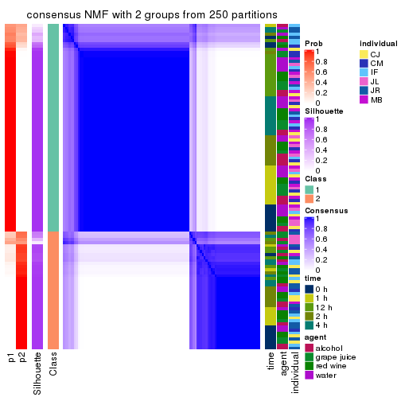</p>

</div>
<div id='tab-SD-NMF-consensus-heatmap-2'>
<pre><code class="r">consensus_heatmap(res, k = 3)
</code></pre>

<p>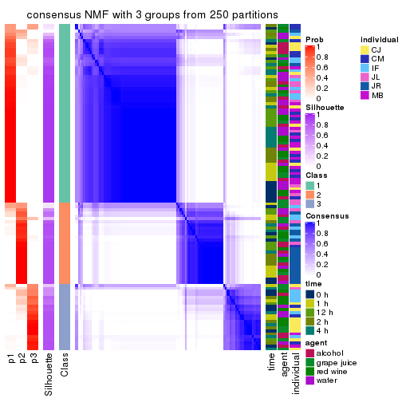</p>

</div>
<div id='tab-SD-NMF-consensus-heatmap-3'>
<pre><code class="r">consensus_heatmap(res, k = 4)
</code></pre>

<p>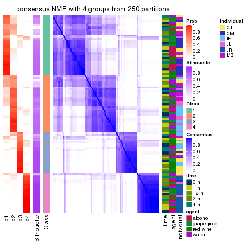</p>

</div>
<div id='tab-SD-NMF-consensus-heatmap-4'>
<pre><code class="r">consensus_heatmap(res, k = 5)
</code></pre>

<p>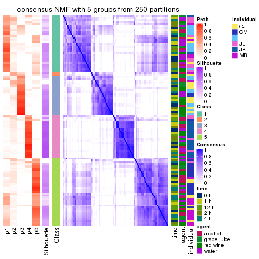</p>

</div>
<div id='tab-SD-NMF-consensus-heatmap-5'>
<pre><code class="r">consensus_heatmap(res, k = 6)
</code></pre>

<p>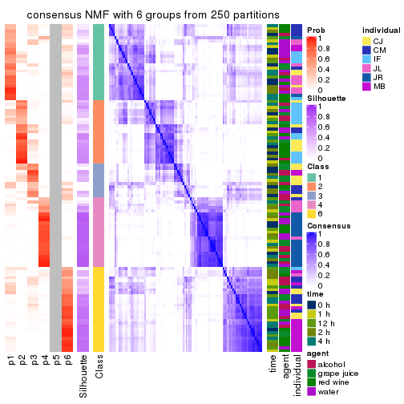</p>

</div>
</div>

Heatmaps for the membership of samples in all partitions to see how consistent they are:


<script>
$( function() {
	$( '#tabs-SD-NMF-membership-heatmap' ).tabs();
} );
</script>
<div id='tabs-SD-NMF-membership-heatmap'>
<ul>
<li><a href='#tab-SD-NMF-membership-heatmap-1'>k = 2</a></li>
<li><a href='#tab-SD-NMF-membership-heatmap-2'>k = 3</a></li>
<li><a href='#tab-SD-NMF-membership-heatmap-3'>k = 4</a></li>
<li><a href='#tab-SD-NMF-membership-heatmap-4'>k = 5</a></li>
<li><a href='#tab-SD-NMF-membership-heatmap-5'>k = 6</a></li>
</ul>
<div id='tab-SD-NMF-membership-heatmap-1'>
<pre><code class="r">membership_heatmap(res, k = 2)
</code></pre>

<p>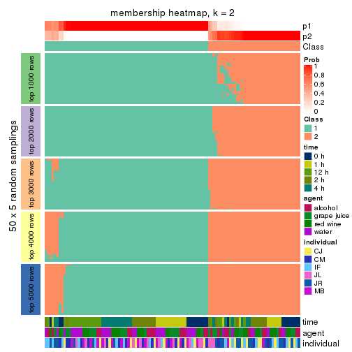</p>

</div>
<div id='tab-SD-NMF-membership-heatmap-2'>
<pre><code class="r">membership_heatmap(res, k = 3)
</code></pre>

<p>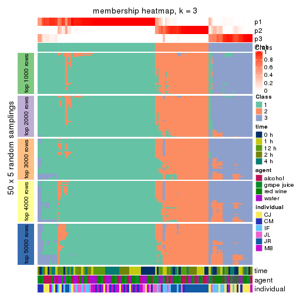</p>

</div>
<div id='tab-SD-NMF-membership-heatmap-3'>
<pre><code class="r">membership_heatmap(res, k = 4)
</code></pre>

<p>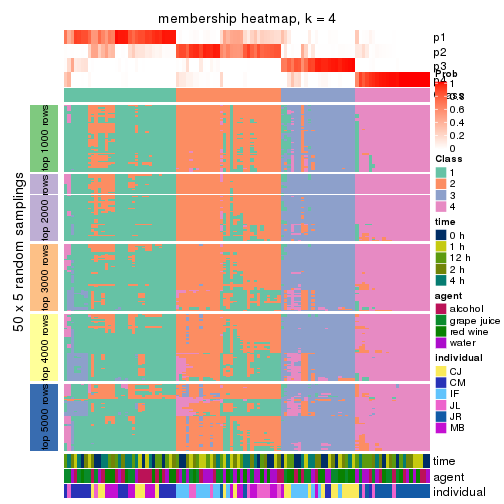</p>

</div>
<div id='tab-SD-NMF-membership-heatmap-4'>
<pre><code class="r">membership_heatmap(res, k = 5)
</code></pre>

<p>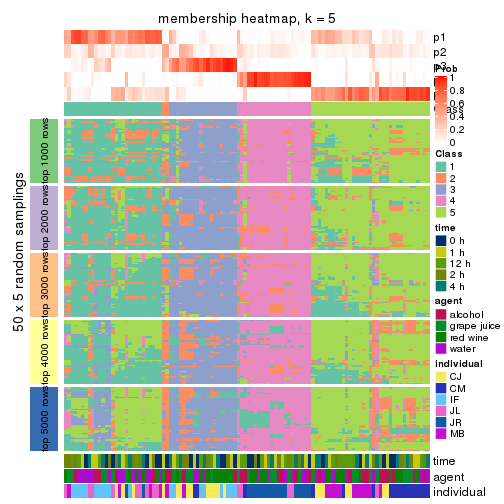</p>

</div>
<div id='tab-SD-NMF-membership-heatmap-5'>
<pre><code class="r">membership_heatmap(res, k = 6)
</code></pre>

<p>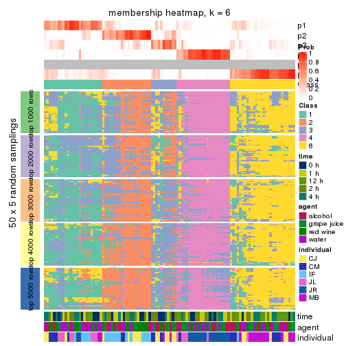</p>

</div>
</div>

As soon as we have had the classes for columns, we can look for signatures
which are significantly different between classes which can be candidate marks
for certain classes. Following are the heatmaps for signatures.


Signature heatmaps where rows are scaled:


<script>
$( function() {
	$( '#tabs-SD-NMF-get-signatures' ).tabs();
} );
</script>
<div id='tabs-SD-NMF-get-signatures'>
<ul>
<li><a href='#tab-SD-NMF-get-signatures-1'>k = 2</a></li>
<li><a href='#tab-SD-NMF-get-signatures-2'>k = 3</a></li>
<li><a href='#tab-SD-NMF-get-signatures-3'>k = 4</a></li>
<li><a href='#tab-SD-NMF-get-signatures-4'>k = 5</a></li>
<li><a href='#tab-SD-NMF-get-signatures-5'>k = 6</a></li>
</ul>
<div id='tab-SD-NMF-get-signatures-1'>
<pre><code class="r">get_signatures(res, k = 2)
</code></pre>

<p>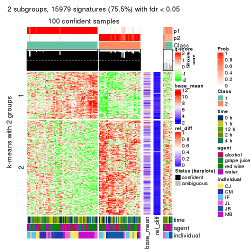</p>

</div>
<div id='tab-SD-NMF-get-signatures-2'>
<pre><code class="r">get_signatures(res, k = 3)
</code></pre>

<p>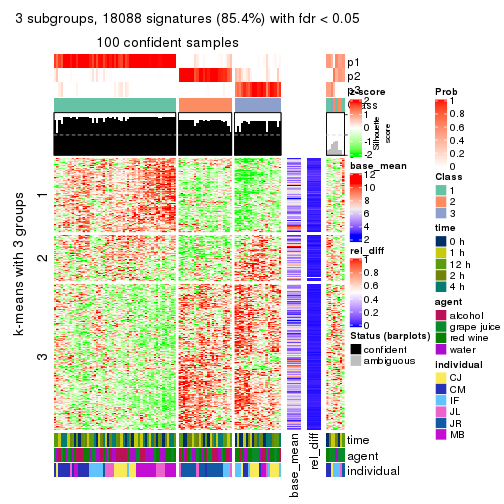</p>

</div>
<div id='tab-SD-NMF-get-signatures-3'>
<pre><code class="r">get_signatures(res, k = 4)
</code></pre>

<p>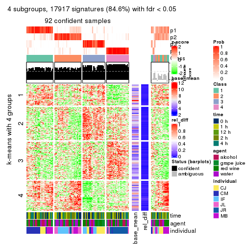</p>

</div>
<div id='tab-SD-NMF-get-signatures-4'>
<pre><code class="r">get_signatures(res, k = 5)
</code></pre>

<p>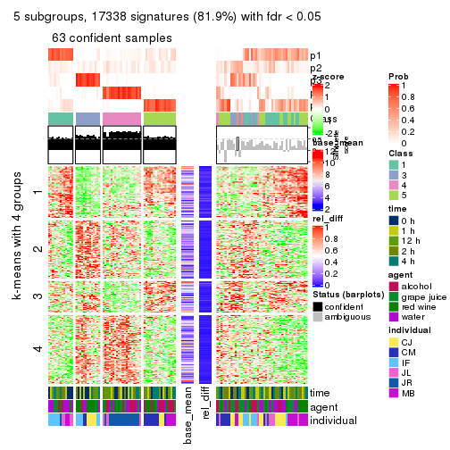</p>

</div>
<div id='tab-SD-NMF-get-signatures-5'>
<pre><code class="r">get_signatures(res, k = 6)
</code></pre>

<p>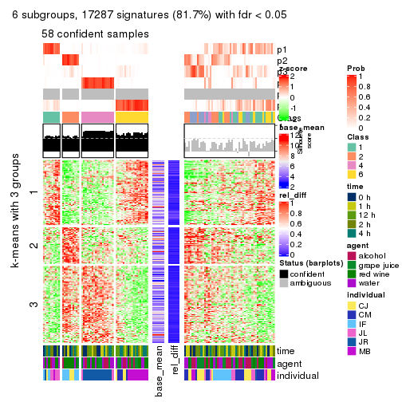</p>

</div>
</div>


Signature heatmaps where rows are not scaled:


<script>
$( function() {
	$( '#tabs-SD-NMF-get-signatures-no-scale' ).tabs();
} );
</script>
<div id='tabs-SD-NMF-get-signatures-no-scale'>
<ul>
<li><a href='#tab-SD-NMF-get-signatures-no-scale-1'>k = 2</a></li>
<li><a href='#tab-SD-NMF-get-signatures-no-scale-2'>k = 3</a></li>
<li><a href='#tab-SD-NMF-get-signatures-no-scale-3'>k = 4</a></li>
<li><a href='#tab-SD-NMF-get-signatures-no-scale-4'>k = 5</a></li>
<li><a href='#tab-SD-NMF-get-signatures-no-scale-5'>k = 6</a></li>
</ul>
<div id='tab-SD-NMF-get-signatures-no-scale-1'>
<pre><code class="r">get_signatures(res, k = 2, scale_rows = FALSE)
</code></pre>

<p>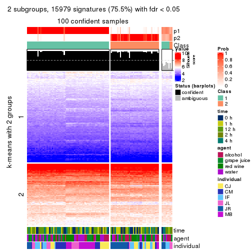</p>

</div>
<div id='tab-SD-NMF-get-signatures-no-scale-2'>
<pre><code class="r">get_signatures(res, k = 3, scale_rows = FALSE)
</code></pre>

<p>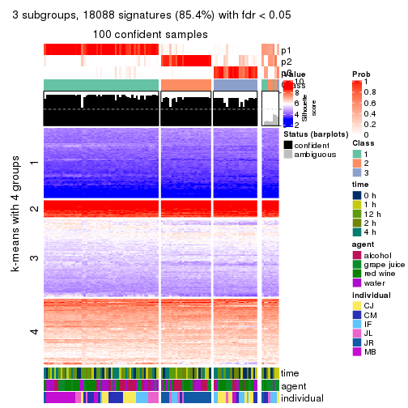</p>

</div>
<div id='tab-SD-NMF-get-signatures-no-scale-3'>
<pre><code class="r">get_signatures(res, k = 4, scale_rows = FALSE)
</code></pre>

<p>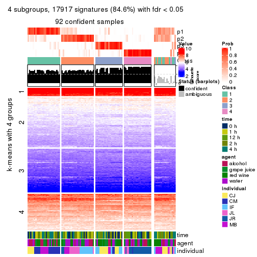</p>

</div>
<div id='tab-SD-NMF-get-signatures-no-scale-4'>
<pre><code class="r">get_signatures(res, k = 5, scale_rows = FALSE)
</code></pre>

<p>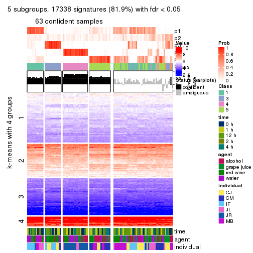</p>

</div>
<div id='tab-SD-NMF-get-signatures-no-scale-5'>
<pre><code class="r">get_signatures(res, k = 6, scale_rows = FALSE)
</code></pre>

<p>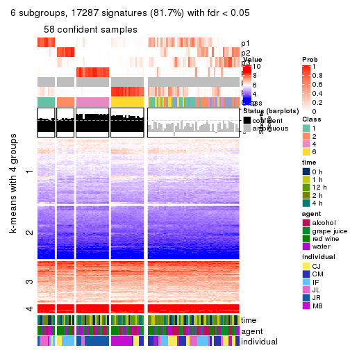</p>

</div>
</div>


Compare the overlap of signatures from different k:

```r
compare_signatures(res)
```

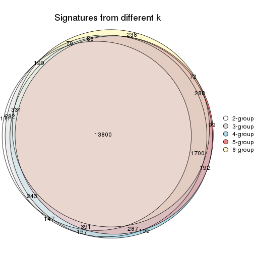

`get_signature()` returns a data frame invisibly. TO get the list of signatures, the function
call should be assigned to a variable explicitly. In following code, if `plot` argument is set
to `FALSE`, no heatmap is plotted while only the differential analysis is performed.

```r
# code only for demonstration
tb = get_signature(res, k = ..., plot = FALSE)
```

An example of the output of `tb` is:

```
#>   which_row         fdr    mean_1    mean_2 scaled_mean_1 scaled_mean_2 km
#> 1        38 0.042760348  8.373488  9.131774    -0.5533452     0.5164555  1
#> 2        40 0.018707592  7.106213  8.469186    -0.6173731     0.5762149  1
#> 3        55 0.019134737 10.221463 11.207825    -0.6159697     0.5749050  1
#> 4        59 0.006059896  5.921854  7.869574    -0.6899429     0.6439467  1
#> 5        60 0.018055526  8.928898 10.211722    -0.6204761     0.5791110  1
#> 6        98 0.009384629 15.714769 14.887706     0.6635654    -0.6193277  2
...
```

The columns in `tb` are:

1. `which_row`: row indices corresponding to the input matrix.
2. `fdr`: FDR for the differential test. 
3. `mean_x`: The mean value in group x.
4. `scaled_mean_x`: The mean value in group x after rows are scaled.
5. `km`: Row groups if k-means clustering is applied to rows.


UMAP plot which shows how samples are separated.


<script>
$( function() {
	$( '#tabs-SD-NMF-dimension-reduction' ).tabs();
} );
</script>
<div id='tabs-SD-NMF-dimension-reduction'>
<ul>
<li><a href='#tab-SD-NMF-dimension-reduction-1'>k = 2</a></li>
<li><a href='#tab-SD-NMF-dimension-reduction-2'>k = 3</a></li>
<li><a href='#tab-SD-NMF-dimension-reduction-3'>k = 4</a></li>
<li><a href='#tab-SD-NMF-dimension-reduction-4'>k = 5</a></li>
<li><a href='#tab-SD-NMF-dimension-reduction-5'>k = 6</a></li>
</ul>
<div id='tab-SD-NMF-dimension-reduction-1'>
<pre><code class="r">dimension_reduction(res, k = 2, method = &quot;UMAP&quot;)
</code></pre>

<p>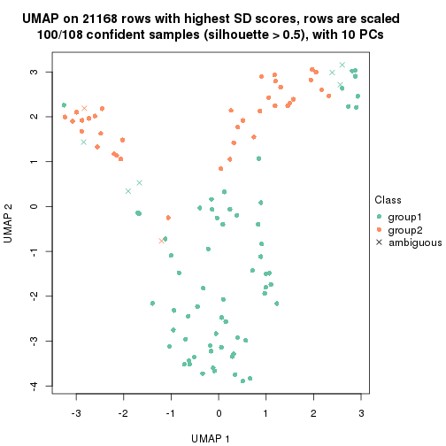</p>

</div>
<div id='tab-SD-NMF-dimension-reduction-2'>
<pre><code class="r">dimension_reduction(res, k = 3, method = &quot;UMAP&quot;)
</code></pre>

<p>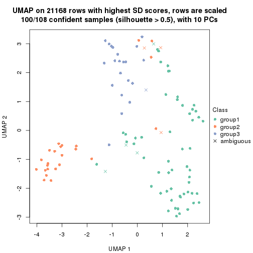</p>

</div>
<div id='tab-SD-NMF-dimension-reduction-3'>
<pre><code class="r">dimension_reduction(res, k = 4, method = &quot;UMAP&quot;)
</code></pre>

<p>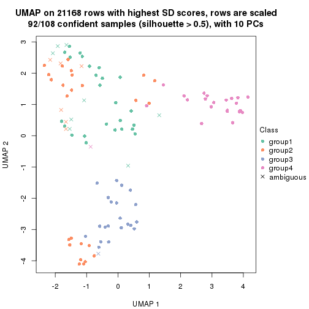</p>

</div>
<div id='tab-SD-NMF-dimension-reduction-4'>
<pre><code class="r">dimension_reduction(res, k = 5, method = &quot;UMAP&quot;)
</code></pre>

<p>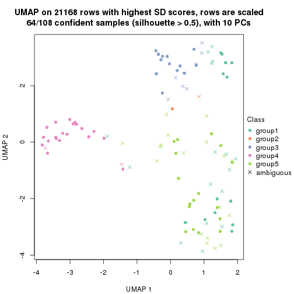</p>

</div>
<div id='tab-SD-NMF-dimension-reduction-5'>
<pre><code class="r">dimension_reduction(res, k = 6, method = &quot;UMAP&quot;)
</code></pre>

<p>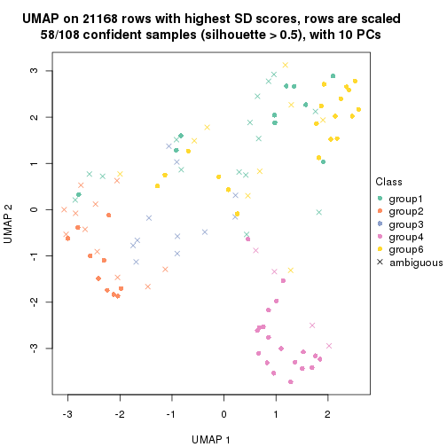</p>

</div>
</div>


Following heatmap shows how subgroups are split when increasing `k`:

```r
collect_classes(res)
```

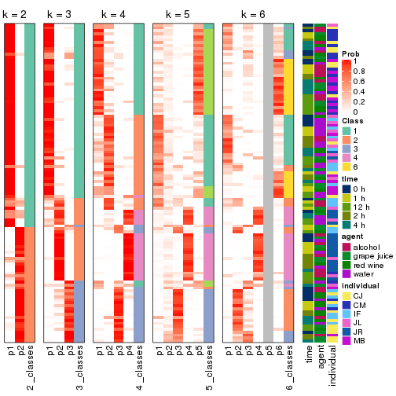


Test correlation between subgroups and known annotations. If the known
annotation is numeric, one-way ANOVA test is applied, and if the known
annotation is discrete, chi-squared contingency table test is applied.

```r
test_to_known_factors(res)
```

```
#>          n time(p) agent(p) individual(p) k
#> SD:NMF 100   0.630   0.5301      8.01e-05 2
#> SD:NMF 100   0.754   0.7148      2.66e-12 3
#> SD:NMF  92   0.991   0.1947      3.08e-21 4
#> SD:NMF  64   0.974   0.0594      2.49e-13 5
#> SD:NMF  58   0.205   0.1989      7.13e-16 6
```


If matrix rows can be associated to genes, consider to use `GO_Enrichment(res,
...)` to perform function enrichment for the signature genes.


 

---------------------------------------------------


### CV:hclust


The object with results only for a single top-value method and a single partition method 
can be extracted as:

```r
res = res_list["CV", "hclust"]
# you can also extract it by
# res = res_list["CV:hclust"]
```

A summary of `res` and all the functions that can be applied to it:

```r
res
```

```
#> A 'ConsensusPartition' object with k = 2, 3, 4, 5, 6.
#>   On a matrix with 21168 rows and 108 columns.
#>   Top rows (1000, 2000, 3000, 4000, 5000) are extracted by 'CV' method.
#>   Subgroups are detected by 'hclust' method.
#>   Performed in total 1250 partitions by row resampling.
#>   Best k for subgroups seems to be 2.
#> 
#> Following methods can be applied to this 'ConsensusPartition' object:
#>  [1] "cola_report"             "collect_classes"         "collect_plots"          
#>  [4] "collect_stats"           "colnames"                "compare_signatures"     
#>  [7] "consensus_heatmap"       "dimension_reduction"     "functional_enrichment"  
#> [10] "get_anno_col"            "get_anno"                "get_classes"            
#> [13] "get_consensus"           "get_matrix"              "get_membership"         
#> [16] "get_param"               "get_signatures"          "get_stats"              
#> [19] "is_best_k"               "is_stable_k"             "membership_heatmap"     
#> [22] "ncol"                    "nrow"                    "plot_ecdf"              
#> [25] "rownames"                "select_partition_number" "show"                   
#> [28] "suggest_best_k"          "test_to_known_factors"
```

`collect_plots()` function collects all the plots made from `res` for all `k` (number of partitions)
into one single page to provide an easy and fast comparison between different `k`.

```r
collect_plots(res)
```

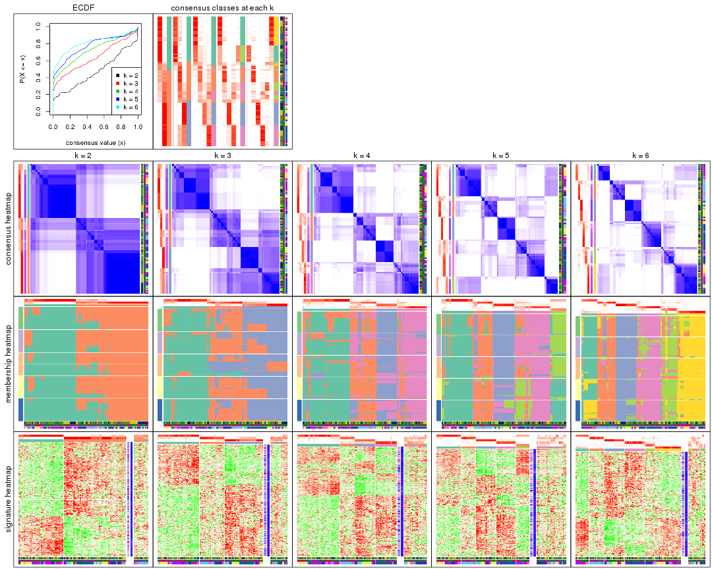

The plots are:

- The first row: a plot of the ECDF (Empirical cumulative distribution
  function) curves of the consensus matrix for each `k` and the heatmap of
  predicted classes for each `k`.
- The second row: heatmaps of the consensus matrix for each `k`.
- The third row: heatmaps of the membership matrix for each `k`.
- The fouth row: heatmaps of the signatures for each `k`.

All the plots in panels can be made by individual functions and they are
plotted later in this section.

`select_partition_number()` produces several plots showing different
statistics for choosing "optimized" `k`. There are following statistics:

- ECDF curves of the consensus matrix for each `k`;
- 1-PAC. [The PAC
  score](https://en.wikipedia.org/wiki/Consensus_clustering#Over-interpretation_potential_of_consensus_clustering)
  measures the proportion of the ambiguous subgrouping.
- Mean silhouette score.
- Concordance. The mean probability of fiting the consensus class ids in all
  partitions.
- Area increased. Denote $A_k$ as the area under the ECDF curve for current
  `k`, the area increased is defined as $A_k - A_{k-1}$.
- Rand index. The percent of pairs of samples that are both in a same cluster
  or both are not in a same cluster in the partition of k and k-1.
- Jaccard index. The ratio of pairs of samples are both in a same cluster in
  the partition of k and k-1 and the pairs of samples are both in a same
  cluster in the partition k or k-1.

The detailed explanations of these statistics can be found in [the cola
vignette](http://bioconductor.org/packages/devel/bioc/vignettes/cola/inst/doc/cola.html#toc_13).

Generally speaking, lower PAC score, higher mean silhouette score or higher
concordance corresponds to better partition. Rand index and Jaccard index
measure how similar the current partition is compared to partition with `k-1`.
If they are too similar, we won't accept `k` is better than `k-1`.

```r
select_partition_number(res)
```


The numeric values for all these statistics can be obtained by `get_stats()`.

```r
get_stats(res)
```

```
#>   k 1-PAC mean_silhouette concordance area_increased  Rand Jaccard
#> 2 2 0.503           0.745       0.887         0.4737 0.509   0.509
#> 3 3 0.516           0.659       0.792         0.3573 0.763   0.560
#> 4 4 0.584           0.650       0.757         0.1297 0.828   0.554
#> 5 5 0.633           0.646       0.757         0.0677 0.872   0.577
#> 6 6 0.733           0.719       0.824         0.0510 0.935   0.706
```

`suggest_best_k()` suggests the best $k$ based on these statistics. The rules are as follows:

- All $k$ with Jaccard index larger than 0.95 are removed because the increase of
  the partition number does not provides enough extra information. If all $k$ are removed,
  the best $k$ is assigned by `NA`.
- For $k$ with 1-PAC larger than 0.9, the maximal $k$ is taken as the "best k". Other $k$ is called "optional k".
- If it does not fit the second rule. The $k$ with the highest vote of highest
  1-PAC, mean silhouette and concordance is taken as the "best k".

```r
suggest_best_k(res)
```

```
#> [1] 2
```


Following shows the table of the partitions (You need to click the **show/hide
code output** link to see it). The membership matrix (columns with name `p*`)
is inferred by
[`clue::cl_consensus()`](https://www.rdocumentation.org/link/cl_consensus?package=clue)
function with the `SE` method. Basically the value in the membership matrix
represents the probability to belong to a certain group. The finall class
label for an item is determined with the group with highest probability it
belongs to.

In `get_classes()` function, the entropy is calculated from the membership
matrix and the silhouette score is calculated from the consensus matrix.


<script>
$( function() {
	$( '#tabs-CV-hclust-get-classes' ).tabs();
} );
</script>
<div id='tabs-CV-hclust-get-classes'>
<ul>
<li><a href='#tab-CV-hclust-get-classes-1'>k = 2</a></li>
<li><a href='#tab-CV-hclust-get-classes-2'>k = 3</a></li>
<li><a href='#tab-CV-hclust-get-classes-3'>k = 4</a></li>
<li><a href='#tab-CV-hclust-get-classes-4'>k = 5</a></li>
<li><a href='#tab-CV-hclust-get-classes-5'>k = 6</a></li>
</ul>

<div id='tab-CV-hclust-get-classes-1'>
<p><a id='tab-CV-hclust-get-classes-1-a' style='color:#0366d6' href='#'>show/hide code output</a></p>
<pre><code class="r">cbind(get_classes(res, k = 2), get_membership(res, k = 2))
</code></pre>

<pre><code>#&gt;          class entropy silhouette    p1    p2
#&gt; GSM87863     1  0.4022      0.844 0.920 0.080
#&gt; GSM87887     1  0.8016      0.619 0.756 0.244
#&gt; GSM87896     2  0.0000      0.835 0.000 1.000
#&gt; GSM87934     2  0.0000      0.835 0.000 1.000
#&gt; GSM87943     2  0.0000      0.835 0.000 1.000
#&gt; GSM87853     2  0.0000      0.835 0.000 1.000
#&gt; GSM87906     2  0.9710      0.464 0.400 0.600
#&gt; GSM87920     1  0.9996     -0.139 0.512 0.488
#&gt; GSM87924     2  0.0000      0.835 0.000 1.000
#&gt; GSM87858     2  0.0000      0.835 0.000 1.000
#&gt; GSM87882     2  0.7815      0.713 0.232 0.768
#&gt; GSM87891     2  0.0000      0.835 0.000 1.000
#&gt; GSM87917     1  0.0000      0.895 1.000 0.000
#&gt; GSM87929     2  0.3274      0.815 0.060 0.940
#&gt; GSM87948     1  0.0000      0.895 1.000 0.000
#&gt; GSM87868     1  0.0000      0.895 1.000 0.000
#&gt; GSM87873     2  0.0000      0.835 0.000 1.000
#&gt; GSM87901     2  0.9944      0.327 0.456 0.544
#&gt; GSM87910     1  0.0000      0.895 1.000 0.000
#&gt; GSM87938     2  0.0000      0.835 0.000 1.000
#&gt; GSM87953     1  0.0000      0.895 1.000 0.000
#&gt; GSM87864     1  0.4022      0.844 0.920 0.080
#&gt; GSM87888     2  0.8555      0.662 0.280 0.720
#&gt; GSM87897     2  0.9552      0.512 0.376 0.624
#&gt; GSM87935     2  0.0000      0.835 0.000 1.000
#&gt; GSM87944     1  0.0000      0.895 1.000 0.000
#&gt; GSM87854     2  0.0000      0.835 0.000 1.000
#&gt; GSM87878     1  0.8016      0.619 0.756 0.244
#&gt; GSM87907     2  0.7453      0.735 0.212 0.788
#&gt; GSM87921     2  0.8499      0.671 0.276 0.724
#&gt; GSM87925     2  0.0000      0.835 0.000 1.000
#&gt; GSM87957     1  0.0000      0.895 1.000 0.000
#&gt; GSM87859     2  0.0000      0.835 0.000 1.000
#&gt; GSM87883     1  0.0000      0.895 1.000 0.000
#&gt; GSM87892     2  0.0000      0.835 0.000 1.000
#&gt; GSM87930     2  0.0000      0.835 0.000 1.000
#&gt; GSM87949     1  0.0000      0.895 1.000 0.000
#&gt; GSM87869     1  0.0000      0.895 1.000 0.000
#&gt; GSM87874     2  0.0000      0.835 0.000 1.000
#&gt; GSM87902     2  0.9944      0.327 0.456 0.544
#&gt; GSM87911     2  0.8207      0.692 0.256 0.744
#&gt; GSM87939     2  0.0376      0.834 0.004 0.996
#&gt; GSM87954     1  0.0000      0.895 1.000 0.000
#&gt; GSM87865     1  0.4022      0.844 0.920 0.080
#&gt; GSM87889     2  0.9209      0.581 0.336 0.664
#&gt; GSM87898     1  0.9710      0.182 0.600 0.400
#&gt; GSM87915     1  0.2043      0.878 0.968 0.032
#&gt; GSM87936     2  0.0000      0.835 0.000 1.000
#&gt; GSM87945     2  0.0000      0.835 0.000 1.000
#&gt; GSM87855     2  0.0000      0.835 0.000 1.000
#&gt; GSM87879     2  0.8555      0.662 0.280 0.720
#&gt; GSM87922     2  0.6343      0.768 0.160 0.840
#&gt; GSM87926     2  0.0376      0.834 0.004 0.996
#&gt; GSM87958     1  0.0000      0.895 1.000 0.000
#&gt; GSM87860     2  0.0000      0.835 0.000 1.000
#&gt; GSM87884     1  0.0000      0.895 1.000 0.000
#&gt; GSM87893     2  0.0000      0.835 0.000 1.000
#&gt; GSM87918     2  0.9963      0.296 0.464 0.536
#&gt; GSM87931     2  0.0000      0.835 0.000 1.000
#&gt; GSM87950     1  0.0000      0.895 1.000 0.000
#&gt; GSM87870     1  0.3879      0.847 0.924 0.076
#&gt; GSM87875     2  0.0000      0.835 0.000 1.000
#&gt; GSM87903     2  0.9710      0.464 0.400 0.600
#&gt; GSM87912     1  0.2043      0.878 0.968 0.032
#&gt; GSM87940     2  0.0000      0.835 0.000 1.000
#&gt; GSM87866     1  0.3879      0.847 0.924 0.076
#&gt; GSM87899     2  0.9552      0.512 0.376 0.624
#&gt; GSM87937     2  0.0000      0.835 0.000 1.000
#&gt; GSM87946     1  0.0000      0.895 1.000 0.000
#&gt; GSM87856     2  0.0000      0.835 0.000 1.000
#&gt; GSM87880     2  0.8555      0.662 0.280 0.720
#&gt; GSM87908     2  0.9993      0.235 0.484 0.516
#&gt; GSM87923     2  0.6973      0.753 0.188 0.812
#&gt; GSM87927     2  0.7056      0.751 0.192 0.808
#&gt; GSM87959     1  0.0000      0.895 1.000 0.000
#&gt; GSM87861     2  0.0000      0.835 0.000 1.000
#&gt; GSM87885     2  0.9209      0.581 0.336 0.664
#&gt; GSM87894     1  0.0376      0.893 0.996 0.004
#&gt; GSM87932     1  0.0376      0.893 0.996 0.004
#&gt; GSM87951     1  0.0000      0.895 1.000 0.000
#&gt; GSM87871     1  0.7376      0.680 0.792 0.208
#&gt; GSM87876     2  0.9209      0.581 0.336 0.664
#&gt; GSM87904     2  0.7453      0.735 0.212 0.788
#&gt; GSM87913     1  0.3274      0.857 0.940 0.060
#&gt; GSM87941     2  0.7056      0.751 0.192 0.808
#&gt; GSM87955     1  0.0000      0.895 1.000 0.000
#&gt; GSM87867     1  0.8267      0.587 0.740 0.260
#&gt; GSM87890     2  0.0000      0.835 0.000 1.000
#&gt; GSM87900     2  0.9922      0.349 0.448 0.552
#&gt; GSM87916     2  0.0000      0.835 0.000 1.000
#&gt; GSM87947     1  0.0000      0.895 1.000 0.000
#&gt; GSM87857     2  0.0000      0.835 0.000 1.000
#&gt; GSM87881     2  0.0938      0.831 0.012 0.988
#&gt; GSM87909     1  0.9710      0.182 0.600 0.400
#&gt; GSM87928     1  0.0376      0.893 0.996 0.004
#&gt; GSM87960     1  0.0000      0.895 1.000 0.000
#&gt; GSM87862     2  0.3733      0.806 0.072 0.928
#&gt; GSM87886     1  0.0000      0.895 1.000 0.000
#&gt; GSM87895     2  0.7453      0.735 0.212 0.788
#&gt; GSM87919     1  0.0000      0.895 1.000 0.000
#&gt; GSM87933     2  0.0376      0.834 0.004 0.996
#&gt; GSM87952     1  0.0000      0.895 1.000 0.000
#&gt; GSM87872     2  0.7376      0.718 0.208 0.792
#&gt; GSM87877     1  0.0938      0.890 0.988 0.012
#&gt; GSM87905     1  0.9710      0.182 0.600 0.400
#&gt; GSM87914     2  0.9963      0.296 0.464 0.536
#&gt; GSM87942     1  0.9710      0.182 0.600 0.400
#&gt; GSM87956     1  0.0000      0.895 1.000 0.000
</code></pre>

<script>
$('#tab-CV-hclust-get-classes-1-a').parent().next().next().hide();
$('#tab-CV-hclust-get-classes-1-a').click(function(){
  $('#tab-CV-hclust-get-classes-1-a').parent().next().next().toggle();
  return(false);
});
</script>
</div>

<div id='tab-CV-hclust-get-classes-2'>
<p><a id='tab-CV-hclust-get-classes-2-a' style='color:#0366d6' href='#'>show/hide code output</a></p>
<pre><code class="r">cbind(get_classes(res, k = 3), get_membership(res, k = 3))
</code></pre>

<pre><code>#&gt;          class entropy silhouette    p1    p2    p3
#&gt; GSM87863     1  0.4974     0.8071 0.764 0.236 0.000
#&gt; GSM87887     2  0.6168     0.0048 0.412 0.588 0.000
#&gt; GSM87896     3  0.0000     0.7080 0.000 0.000 1.000
#&gt; GSM87934     3  0.5926     0.5773 0.000 0.356 0.644
#&gt; GSM87943     3  0.0424     0.7111 0.000 0.008 0.992
#&gt; GSM87853     3  0.0000     0.7080 0.000 0.000 1.000
#&gt; GSM87906     2  0.2261     0.7117 0.000 0.932 0.068
#&gt; GSM87920     2  0.8268     0.4014 0.328 0.576 0.096
#&gt; GSM87924     3  0.5760     0.6111 0.000 0.328 0.672
#&gt; GSM87858     3  0.0000     0.7080 0.000 0.000 1.000
#&gt; GSM87882     2  0.5621     0.4465 0.000 0.692 0.308
#&gt; GSM87891     3  0.0000     0.7080 0.000 0.000 1.000
#&gt; GSM87917     1  0.0000     0.8702 1.000 0.000 0.000
#&gt; GSM87929     3  0.6267     0.4032 0.000 0.452 0.548
#&gt; GSM87948     1  0.2959     0.8911 0.900 0.100 0.000
#&gt; GSM87868     1  0.3038     0.8901 0.896 0.104 0.000
#&gt; GSM87873     3  0.0000     0.7080 0.000 0.000 1.000
#&gt; GSM87901     2  0.0592     0.7092 0.000 0.988 0.012
#&gt; GSM87910     1  0.0000     0.8702 1.000 0.000 0.000
#&gt; GSM87938     3  0.5785     0.6070 0.000 0.332 0.668
#&gt; GSM87953     1  0.0000     0.8702 1.000 0.000 0.000
#&gt; GSM87864     1  0.4974     0.8071 0.764 0.236 0.000
#&gt; GSM87888     2  0.4555     0.6387 0.000 0.800 0.200
#&gt; GSM87897     2  0.2796     0.7033 0.000 0.908 0.092
#&gt; GSM87935     3  0.5760     0.6111 0.000 0.328 0.672
#&gt; GSM87944     1  0.2959     0.8911 0.900 0.100 0.000
#&gt; GSM87854     3  0.1031     0.7091 0.000 0.024 0.976
#&gt; GSM87878     2  0.6168     0.0048 0.412 0.588 0.000
#&gt; GSM87907     3  0.6302     0.1094 0.000 0.480 0.520
#&gt; GSM87921     2  0.4605     0.6346 0.000 0.796 0.204
#&gt; GSM87925     3  0.5760     0.6111 0.000 0.328 0.672
#&gt; GSM87957     1  0.2959     0.8911 0.900 0.100 0.000
#&gt; GSM87859     3  0.0000     0.7080 0.000 0.000 1.000
#&gt; GSM87883     1  0.2959     0.8911 0.900 0.100 0.000
#&gt; GSM87892     3  0.0000     0.7080 0.000 0.000 1.000
#&gt; GSM87930     3  0.5760     0.6111 0.000 0.328 0.672
#&gt; GSM87949     1  0.0000     0.8702 1.000 0.000 0.000
#&gt; GSM87869     1  0.3038     0.8901 0.896 0.104 0.000
#&gt; GSM87874     3  0.0000     0.7080 0.000 0.000 1.000
#&gt; GSM87902     2  0.0592     0.7092 0.000 0.988 0.012
#&gt; GSM87911     2  0.4931     0.6122 0.000 0.768 0.232
#&gt; GSM87939     3  0.6111     0.5128 0.000 0.396 0.604
#&gt; GSM87954     1  0.0000     0.8702 1.000 0.000 0.000
#&gt; GSM87865     1  0.4974     0.8071 0.764 0.236 0.000
#&gt; GSM87889     2  0.5956     0.6659 0.044 0.768 0.188
#&gt; GSM87898     2  0.3686     0.6575 0.140 0.860 0.000
#&gt; GSM87915     1  0.4346     0.8430 0.816 0.184 0.000
#&gt; GSM87936     3  0.5760     0.6111 0.000 0.328 0.672
#&gt; GSM87945     3  0.0424     0.7111 0.000 0.008 0.992
#&gt; GSM87855     3  0.0424     0.7111 0.000 0.008 0.992
#&gt; GSM87879     2  0.4555     0.6387 0.000 0.800 0.200
#&gt; GSM87922     2  0.6079     0.2387 0.000 0.612 0.388
#&gt; GSM87926     3  0.6111     0.5128 0.000 0.396 0.604
#&gt; GSM87958     1  0.2959     0.8911 0.900 0.100 0.000
#&gt; GSM87860     3  0.0747     0.7110 0.000 0.016 0.984
#&gt; GSM87884     1  0.2959     0.8911 0.900 0.100 0.000
#&gt; GSM87893     3  0.0000     0.7080 0.000 0.000 1.000
#&gt; GSM87918     2  0.2569     0.7101 0.032 0.936 0.032
#&gt; GSM87931     3  0.5926     0.5773 0.000 0.356 0.644
#&gt; GSM87950     1  0.0000     0.8702 1.000 0.000 0.000
#&gt; GSM87870     1  0.4931     0.8105 0.768 0.232 0.000
#&gt; GSM87875     3  0.0424     0.7111 0.000 0.008 0.992
#&gt; GSM87903     2  0.2261     0.7117 0.000 0.932 0.068
#&gt; GSM87912     1  0.4346     0.8430 0.816 0.184 0.000
#&gt; GSM87940     3  0.5785     0.6070 0.000 0.332 0.668
#&gt; GSM87866     1  0.4931     0.8105 0.768 0.232 0.000
#&gt; GSM87899     2  0.2796     0.7033 0.000 0.908 0.092
#&gt; GSM87937     3  0.5760     0.6111 0.000 0.328 0.672
#&gt; GSM87946     1  0.2959     0.8911 0.900 0.100 0.000
#&gt; GSM87856     3  0.0424     0.7111 0.000 0.008 0.992
#&gt; GSM87880     2  0.4555     0.6387 0.000 0.800 0.200
#&gt; GSM87908     2  0.1267     0.7037 0.024 0.972 0.004
#&gt; GSM87923     2  0.6126     0.2143 0.000 0.600 0.400
#&gt; GSM87927     2  0.6154     0.0783 0.000 0.592 0.408
#&gt; GSM87959     1  0.0000     0.8702 1.000 0.000 0.000
#&gt; GSM87861     3  0.0424     0.7111 0.000 0.008 0.992
#&gt; GSM87885     2  0.5956     0.6659 0.044 0.768 0.188
#&gt; GSM87894     1  0.3116     0.8894 0.892 0.108 0.000
#&gt; GSM87932     1  0.6140     0.5120 0.596 0.404 0.000
#&gt; GSM87951     1  0.0000     0.8702 1.000 0.000 0.000
#&gt; GSM87871     1  0.6079     0.5639 0.612 0.388 0.000
#&gt; GSM87876     2  0.5956     0.6659 0.044 0.768 0.188
#&gt; GSM87904     3  0.6302     0.1094 0.000 0.480 0.520
#&gt; GSM87913     1  0.4702     0.8127 0.788 0.212 0.000
#&gt; GSM87941     2  0.6154     0.0783 0.000 0.592 0.408
#&gt; GSM87955     1  0.0000     0.8702 1.000 0.000 0.000
#&gt; GSM87867     1  0.6608     0.4376 0.560 0.432 0.008
#&gt; GSM87890     3  0.6062     0.5299 0.000 0.384 0.616
#&gt; GSM87900     2  0.0892     0.7106 0.000 0.980 0.020
#&gt; GSM87916     3  0.6126     0.5061 0.000 0.400 0.600
#&gt; GSM87947     1  0.2959     0.8911 0.900 0.100 0.000
#&gt; GSM87857     3  0.0747     0.7110 0.000 0.016 0.984
#&gt; GSM87881     3  0.6204     0.4469 0.000 0.424 0.576
#&gt; GSM87909     2  0.3686     0.6575 0.140 0.860 0.000
#&gt; GSM87928     1  0.6140     0.5120 0.596 0.404 0.000
#&gt; GSM87960     1  0.2959     0.8911 0.900 0.100 0.000
#&gt; GSM87862     3  0.5497     0.5924 0.000 0.292 0.708
#&gt; GSM87886     1  0.2959     0.8911 0.900 0.100 0.000
#&gt; GSM87895     3  0.6302     0.1094 0.000 0.480 0.520
#&gt; GSM87919     1  0.0000     0.8702 1.000 0.000 0.000
#&gt; GSM87933     3  0.6111     0.5125 0.000 0.396 0.604
#&gt; GSM87952     1  0.0000     0.8702 1.000 0.000 0.000
#&gt; GSM87872     2  0.6205     0.2722 0.008 0.656 0.336
#&gt; GSM87877     1  0.3340     0.8843 0.880 0.120 0.000
#&gt; GSM87905     2  0.3686     0.6575 0.140 0.860 0.000
#&gt; GSM87914     2  0.2569     0.7101 0.032 0.936 0.032
#&gt; GSM87942     2  0.6576     0.6056 0.192 0.740 0.068
#&gt; GSM87956     1  0.0000     0.8702 1.000 0.000 0.000
</code></pre>

<script>
$('#tab-CV-hclust-get-classes-2-a').parent().next().next().hide();
$('#tab-CV-hclust-get-classes-2-a').click(function(){
  $('#tab-CV-hclust-get-classes-2-a').parent().next().next().toggle();
  return(false);
});
</script>
</div>

<div id='tab-CV-hclust-get-classes-3'>
<p><a id='tab-CV-hclust-get-classes-3-a' style='color:#0366d6' href='#'>show/hide code output</a></p>
<pre><code class="r">cbind(get_classes(res, k = 4), get_membership(res, k = 4))
</code></pre>

<pre><code>#&gt;          class entropy silhouette    p1    p2    p3    p4
#&gt; GSM87863     1  0.3088     0.7505 0.864 0.128 0.000 0.008
#&gt; GSM87887     1  0.6952     0.0063 0.480 0.420 0.096 0.004
#&gt; GSM87896     3  0.4222     0.9428 0.000 0.000 0.728 0.272
#&gt; GSM87934     4  0.1118     0.7434 0.000 0.000 0.036 0.964
#&gt; GSM87943     3  0.4212     0.9404 0.000 0.012 0.772 0.216
#&gt; GSM87853     3  0.4222     0.9428 0.000 0.000 0.728 0.272
#&gt; GSM87906     2  0.5136     0.6511 0.048 0.728 0.000 0.224
#&gt; GSM87920     1  0.8672    -0.2659 0.344 0.288 0.032 0.336
#&gt; GSM87924     4  0.2216     0.6990 0.000 0.000 0.092 0.908
#&gt; GSM87858     3  0.4222     0.9428 0.000 0.000 0.728 0.272
#&gt; GSM87882     4  0.7647    -0.2040 0.008 0.328 0.176 0.488
#&gt; GSM87891     3  0.4222     0.9428 0.000 0.000 0.728 0.272
#&gt; GSM87917     1  0.5143     0.7606 0.752 0.172 0.076 0.000
#&gt; GSM87929     4  0.2040     0.7077 0.004 0.048 0.012 0.936
#&gt; GSM87948     1  0.0000     0.8159 1.000 0.000 0.000 0.000
#&gt; GSM87868     1  0.0188     0.8150 0.996 0.004 0.000 0.000
#&gt; GSM87873     3  0.4222     0.9428 0.000 0.000 0.728 0.272
#&gt; GSM87901     2  0.4452     0.6701 0.048 0.796 0.000 0.156
#&gt; GSM87910     1  0.5143     0.7606 0.752 0.172 0.076 0.000
#&gt; GSM87938     4  0.1637     0.7337 0.000 0.000 0.060 0.940
#&gt; GSM87953     1  0.4893     0.7665 0.768 0.168 0.064 0.000
#&gt; GSM87864     1  0.3088     0.7505 0.864 0.128 0.000 0.008
#&gt; GSM87888     2  0.7750     0.4282 0.012 0.444 0.160 0.384
#&gt; GSM87897     2  0.5200     0.6253 0.036 0.700 0.000 0.264
#&gt; GSM87935     4  0.1716     0.7321 0.000 0.000 0.064 0.936
#&gt; GSM87944     1  0.0000     0.8159 1.000 0.000 0.000 0.000
#&gt; GSM87854     3  0.4434     0.9300 0.000 0.016 0.756 0.228
#&gt; GSM87878     1  0.6952     0.0063 0.480 0.420 0.096 0.004
#&gt; GSM87907     2  0.7697     0.1429 0.000 0.404 0.376 0.220
#&gt; GSM87921     4  0.7117    -0.3789 0.000 0.424 0.128 0.448
#&gt; GSM87925     4  0.1716     0.7321 0.000 0.000 0.064 0.936
#&gt; GSM87957     1  0.0000     0.8159 1.000 0.000 0.000 0.000
#&gt; GSM87859     3  0.4222     0.9428 0.000 0.000 0.728 0.272
#&gt; GSM87883     1  0.0000     0.8159 1.000 0.000 0.000 0.000
#&gt; GSM87892     3  0.4222     0.9428 0.000 0.000 0.728 0.272
#&gt; GSM87930     4  0.1716     0.7321 0.000 0.000 0.064 0.936
#&gt; GSM87949     1  0.5143     0.7606 0.752 0.172 0.076 0.000
#&gt; GSM87869     1  0.0188     0.8150 0.996 0.004 0.000 0.000
#&gt; GSM87874     3  0.4222     0.9428 0.000 0.000 0.728 0.272
#&gt; GSM87902     2  0.4452     0.6701 0.048 0.796 0.000 0.156
#&gt; GSM87911     2  0.7283     0.3644 0.000 0.432 0.148 0.420
#&gt; GSM87939     4  0.0188     0.7346 0.000 0.004 0.000 0.996
#&gt; GSM87954     1  0.4893     0.7665 0.768 0.168 0.064 0.000
#&gt; GSM87865     1  0.3088     0.7505 0.864 0.128 0.000 0.008
#&gt; GSM87889     2  0.8617     0.4682 0.064 0.448 0.160 0.328
#&gt; GSM87898     2  0.5035     0.6072 0.196 0.748 0.000 0.056
#&gt; GSM87915     1  0.2483     0.7854 0.916 0.052 0.032 0.000
#&gt; GSM87936     4  0.1716     0.7321 0.000 0.000 0.064 0.936
#&gt; GSM87945     3  0.4212     0.9404 0.000 0.012 0.772 0.216
#&gt; GSM87855     3  0.4212     0.9404 0.000 0.012 0.772 0.216
#&gt; GSM87879     2  0.7750     0.4282 0.012 0.444 0.160 0.384
#&gt; GSM87922     4  0.6758     0.1296 0.000 0.240 0.156 0.604
#&gt; GSM87926     4  0.0188     0.7346 0.000 0.004 0.000 0.996
#&gt; GSM87958     1  0.0000     0.8159 1.000 0.000 0.000 0.000
#&gt; GSM87860     3  0.4319     0.9330 0.000 0.012 0.760 0.228
#&gt; GSM87884     1  0.0000     0.8159 1.000 0.000 0.000 0.000
#&gt; GSM87893     3  0.4222     0.9428 0.000 0.000 0.728 0.272
#&gt; GSM87918     2  0.6115     0.6560 0.088 0.724 0.032 0.156
#&gt; GSM87931     4  0.1118     0.7434 0.000 0.000 0.036 0.964
#&gt; GSM87950     1  0.5143     0.7606 0.752 0.172 0.076 0.000
#&gt; GSM87870     1  0.2944     0.7522 0.868 0.128 0.000 0.004
#&gt; GSM87875     3  0.4212     0.9404 0.000 0.012 0.772 0.216
#&gt; GSM87903     2  0.5136     0.6511 0.048 0.728 0.000 0.224
#&gt; GSM87912     1  0.2483     0.7854 0.916 0.052 0.032 0.000
#&gt; GSM87940     4  0.1637     0.7337 0.000 0.000 0.060 0.940
#&gt; GSM87866     1  0.2944     0.7522 0.868 0.128 0.000 0.004
#&gt; GSM87899     2  0.5200     0.6253 0.036 0.700 0.000 0.264
#&gt; GSM87937     4  0.1716     0.7321 0.000 0.000 0.064 0.936
#&gt; GSM87946     1  0.0000     0.8159 1.000 0.000 0.000 0.000
#&gt; GSM87856     3  0.4212     0.9404 0.000 0.012 0.772 0.216
#&gt; GSM87880     2  0.7750     0.4282 0.012 0.444 0.160 0.384
#&gt; GSM87908     2  0.4499     0.6638 0.072 0.804 0.000 0.124
#&gt; GSM87923     4  0.7149     0.0584 0.000 0.316 0.156 0.528
#&gt; GSM87927     4  0.5042     0.5135 0.040 0.184 0.012 0.764
#&gt; GSM87959     1  0.5143     0.7606 0.752 0.172 0.076 0.000
#&gt; GSM87861     3  0.4248     0.9389 0.000 0.012 0.768 0.220
#&gt; GSM87885     2  0.8617     0.4682 0.064 0.448 0.160 0.328
#&gt; GSM87894     1  0.0336     0.8145 0.992 0.008 0.000 0.000
#&gt; GSM87932     1  0.6704     0.5139 0.600 0.264 0.136 0.000
#&gt; GSM87951     1  0.5143     0.7606 0.752 0.172 0.076 0.000
#&gt; GSM87871     1  0.5267     0.5929 0.712 0.240 0.000 0.048
#&gt; GSM87876     2  0.8617     0.4682 0.064 0.448 0.160 0.328
#&gt; GSM87904     2  0.7697     0.1429 0.000 0.404 0.376 0.220
#&gt; GSM87913     1  0.3082     0.7659 0.884 0.084 0.032 0.000
#&gt; GSM87941     4  0.5042     0.5135 0.040 0.184 0.012 0.764
#&gt; GSM87955     1  0.4893     0.7665 0.768 0.168 0.064 0.000
#&gt; GSM87867     1  0.6189     0.5030 0.640 0.268 0.000 0.092
#&gt; GSM87890     4  0.2402     0.6985 0.000 0.012 0.076 0.912
#&gt; GSM87900     2  0.4462     0.6694 0.044 0.792 0.000 0.164
#&gt; GSM87916     4  0.0672     0.7325 0.000 0.008 0.008 0.984
#&gt; GSM87947     1  0.0000     0.8159 1.000 0.000 0.000 0.000
#&gt; GSM87857     3  0.4284     0.9363 0.000 0.012 0.764 0.224
#&gt; GSM87881     4  0.3392     0.6677 0.000 0.056 0.072 0.872
#&gt; GSM87909     2  0.5109     0.6087 0.196 0.744 0.000 0.060
#&gt; GSM87928     1  0.6704     0.5139 0.600 0.264 0.136 0.000
#&gt; GSM87960     1  0.0000     0.8159 1.000 0.000 0.000 0.000
#&gt; GSM87862     4  0.6956    -0.0662 0.004 0.108 0.352 0.536
#&gt; GSM87886     1  0.0000     0.8159 1.000 0.000 0.000 0.000
#&gt; GSM87895     2  0.7697     0.1429 0.000 0.404 0.376 0.220
#&gt; GSM87919     1  0.5143     0.7606 0.752 0.172 0.076 0.000
#&gt; GSM87933     4  0.0188     0.7332 0.000 0.004 0.000 0.996
#&gt; GSM87952     1  0.5143     0.7606 0.752 0.172 0.076 0.000
#&gt; GSM87872     4  0.5911     0.1429 0.044 0.372 0.000 0.584
#&gt; GSM87877     1  0.0707     0.8108 0.980 0.020 0.000 0.000
#&gt; GSM87905     2  0.5109     0.6087 0.196 0.744 0.000 0.060
#&gt; GSM87914     2  0.6115     0.6560 0.088 0.724 0.032 0.156
#&gt; GSM87942     4  0.9519    -0.1300 0.272 0.208 0.136 0.384
#&gt; GSM87956     1  0.4893     0.7665 0.768 0.168 0.064 0.000
</code></pre>

<script>
$('#tab-CV-hclust-get-classes-3-a').parent().next().next().hide();
$('#tab-CV-hclust-get-classes-3-a').click(function(){
  $('#tab-CV-hclust-get-classes-3-a').parent().next().next().toggle();
  return(false);
});
</script>
</div>

<div id='tab-CV-hclust-get-classes-4'>
<p><a id='tab-CV-hclust-get-classes-4-a' style='color:#0366d6' href='#'>show/hide code output</a></p>
<pre><code class="r">cbind(get_classes(res, k = 5), get_membership(res, k = 5))
</code></pre>

<pre><code>#&gt;          class entropy silhouette    p1    p2    p3    p4    p5
#&gt; GSM87863     1  0.2583     0.6923 0.864 0.132 0.000 0.000 0.004
#&gt; GSM87887     1  0.7486     0.2419 0.472 0.260 0.000 0.064 0.204
#&gt; GSM87896     3  0.1410     0.9131 0.000 0.000 0.940 0.060 0.000
#&gt; GSM87934     4  0.2230     0.6614 0.000 0.000 0.116 0.884 0.000
#&gt; GSM87943     3  0.1059     0.9093 0.000 0.008 0.968 0.004 0.020
#&gt; GSM87853     3  0.1410     0.9131 0.000 0.000 0.940 0.060 0.000
#&gt; GSM87906     2  0.2020     0.7305 0.000 0.900 0.000 0.100 0.000
#&gt; GSM87920     1  0.7990    -0.0148 0.344 0.296 0.000 0.280 0.080
#&gt; GSM87924     4  0.2891     0.6306 0.000 0.000 0.176 0.824 0.000
#&gt; GSM87858     3  0.1410     0.9131 0.000 0.000 0.940 0.060 0.000
#&gt; GSM87882     4  0.7446     0.3894 0.008 0.180 0.068 0.528 0.216
#&gt; GSM87891     3  0.1410     0.9131 0.000 0.000 0.940 0.060 0.000
#&gt; GSM87917     5  0.4192     0.8709 0.404 0.000 0.000 0.000 0.596
#&gt; GSM87929     4  0.2941     0.6453 0.000 0.020 0.064 0.884 0.032
#&gt; GSM87948     1  0.0000     0.7620 1.000 0.000 0.000 0.000 0.000
#&gt; GSM87868     1  0.0451     0.7617 0.988 0.004 0.000 0.000 0.008
#&gt; GSM87873     3  0.1410     0.9131 0.000 0.000 0.940 0.060 0.000
#&gt; GSM87901     2  0.0880     0.7454 0.000 0.968 0.000 0.032 0.000
#&gt; GSM87910     5  0.4192     0.8709 0.404 0.000 0.000 0.000 0.596
#&gt; GSM87938     4  0.2516     0.6563 0.000 0.000 0.140 0.860 0.000
#&gt; GSM87953     5  0.4262     0.8432 0.440 0.000 0.000 0.000 0.560
#&gt; GSM87864     1  0.2583     0.6923 0.864 0.132 0.000 0.000 0.004
#&gt; GSM87888     4  0.7839     0.2557 0.008 0.308 0.056 0.408 0.220
#&gt; GSM87897     2  0.2806     0.6923 0.000 0.844 0.000 0.152 0.004
#&gt; GSM87935     4  0.2561     0.6558 0.000 0.000 0.144 0.856 0.000
#&gt; GSM87944     1  0.0404     0.7576 0.988 0.000 0.000 0.000 0.012
#&gt; GSM87854     3  0.1518     0.9016 0.000 0.012 0.952 0.016 0.020
#&gt; GSM87878     1  0.7486     0.2419 0.472 0.260 0.000 0.064 0.204
#&gt; GSM87907     2  0.6220     0.1655 0.000 0.432 0.428 0.140 0.000
#&gt; GSM87921     4  0.7108     0.2023 0.000 0.336 0.028 0.444 0.192
#&gt; GSM87925     4  0.2561     0.6558 0.000 0.000 0.144 0.856 0.000
#&gt; GSM87957     1  0.0404     0.7560 0.988 0.000 0.000 0.000 0.012
#&gt; GSM87859     3  0.1410     0.9131 0.000 0.000 0.940 0.060 0.000
#&gt; GSM87883     1  0.0162     0.7614 0.996 0.000 0.000 0.000 0.004
#&gt; GSM87892     3  0.1410     0.9131 0.000 0.000 0.940 0.060 0.000
#&gt; GSM87930     4  0.2561     0.6558 0.000 0.000 0.144 0.856 0.000
#&gt; GSM87949     5  0.4192     0.8709 0.404 0.000 0.000 0.000 0.596
#&gt; GSM87869     1  0.0451     0.7617 0.988 0.004 0.000 0.000 0.008
#&gt; GSM87874     3  0.1410     0.9131 0.000 0.000 0.940 0.060 0.000
#&gt; GSM87902     2  0.0880     0.7454 0.000 0.968 0.000 0.032 0.000
#&gt; GSM87911     4  0.7583     0.1804 0.000 0.336 0.060 0.408 0.196
#&gt; GSM87939     4  0.2237     0.6625 0.000 0.004 0.084 0.904 0.008
#&gt; GSM87954     5  0.4262     0.8432 0.440 0.000 0.000 0.000 0.560
#&gt; GSM87865     1  0.2583     0.6923 0.864 0.132 0.000 0.000 0.004
#&gt; GSM87889     4  0.8663     0.1825 0.060 0.312 0.056 0.352 0.220
#&gt; GSM87898     2  0.2763     0.6936 0.148 0.848 0.000 0.000 0.004
#&gt; GSM87915     1  0.2233     0.7090 0.904 0.016 0.000 0.000 0.080
#&gt; GSM87936     4  0.2561     0.6558 0.000 0.000 0.144 0.856 0.000
#&gt; GSM87945     3  0.1059     0.9093 0.000 0.008 0.968 0.004 0.020
#&gt; GSM87855     3  0.1059     0.9093 0.000 0.008 0.968 0.004 0.020
#&gt; GSM87879     4  0.7839     0.2557 0.008 0.308 0.056 0.408 0.220
#&gt; GSM87922     4  0.6602     0.4702 0.000 0.112 0.080 0.616 0.192
#&gt; GSM87926     4  0.2237     0.6625 0.000 0.004 0.084 0.904 0.008
#&gt; GSM87958     1  0.0609     0.7519 0.980 0.000 0.000 0.000 0.020
#&gt; GSM87860     3  0.1405     0.9037 0.000 0.008 0.956 0.016 0.020
#&gt; GSM87884     1  0.0162     0.7614 0.996 0.000 0.000 0.000 0.004
#&gt; GSM87893     3  0.1410     0.9131 0.000 0.000 0.940 0.060 0.000
#&gt; GSM87918     2  0.3863     0.7176 0.040 0.836 0.000 0.052 0.072
#&gt; GSM87931     4  0.2230     0.6614 0.000 0.000 0.116 0.884 0.000
#&gt; GSM87950     5  0.4192     0.8709 0.404 0.000 0.000 0.000 0.596
#&gt; GSM87870     1  0.2536     0.6955 0.868 0.128 0.000 0.000 0.004
#&gt; GSM87875     3  0.1059     0.9093 0.000 0.008 0.968 0.004 0.020
#&gt; GSM87903     2  0.2020     0.7305 0.000 0.900 0.000 0.100 0.000
#&gt; GSM87912     1  0.2233     0.7090 0.904 0.016 0.000 0.000 0.080
#&gt; GSM87940     4  0.2516     0.6563 0.000 0.000 0.140 0.860 0.000
#&gt; GSM87866     1  0.2536     0.6955 0.868 0.128 0.000 0.000 0.004
#&gt; GSM87899     2  0.2806     0.6923 0.000 0.844 0.000 0.152 0.004
#&gt; GSM87937     4  0.2561     0.6558 0.000 0.000 0.144 0.856 0.000
#&gt; GSM87946     1  0.0404     0.7576 0.988 0.000 0.000 0.000 0.012
#&gt; GSM87856     3  0.1059     0.9093 0.000 0.008 0.968 0.004 0.020
#&gt; GSM87880     4  0.7839     0.2557 0.008 0.308 0.056 0.408 0.220
#&gt; GSM87908     2  0.1106     0.7405 0.024 0.964 0.000 0.012 0.000
#&gt; GSM87923     4  0.7383     0.3729 0.000 0.204 0.120 0.536 0.140
#&gt; GSM87927     4  0.5362     0.4947 0.032 0.208 0.040 0.708 0.012
#&gt; GSM87959     5  0.4192     0.8709 0.404 0.000 0.000 0.000 0.596
#&gt; GSM87861     3  0.1186     0.9082 0.000 0.008 0.964 0.008 0.020
#&gt; GSM87885     4  0.8663     0.1825 0.060 0.312 0.056 0.352 0.220
#&gt; GSM87894     1  0.0290     0.7622 0.992 0.008 0.000 0.000 0.000
#&gt; GSM87932     5  0.6266     0.2119 0.404 0.096 0.000 0.016 0.484
#&gt; GSM87951     5  0.4192     0.8709 0.404 0.000 0.000 0.000 0.596
#&gt; GSM87871     1  0.4194     0.4928 0.708 0.276 0.000 0.012 0.004
#&gt; GSM87876     4  0.8663     0.1825 0.060 0.312 0.056 0.352 0.220
#&gt; GSM87904     2  0.6220     0.1655 0.000 0.432 0.428 0.140 0.000
#&gt; GSM87913     1  0.2889     0.6813 0.872 0.044 0.000 0.000 0.084
#&gt; GSM87941     4  0.5362     0.4947 0.032 0.208 0.040 0.708 0.012
#&gt; GSM87955     5  0.4256     0.8474 0.436 0.000 0.000 0.000 0.564
#&gt; GSM87867     1  0.4517     0.3384 0.616 0.372 0.000 0.008 0.004
#&gt; GSM87890     4  0.3917     0.6406 0.000 0.024 0.144 0.808 0.024
#&gt; GSM87900     2  0.1043     0.7452 0.000 0.960 0.000 0.040 0.000
#&gt; GSM87916     4  0.2177     0.6626 0.000 0.004 0.080 0.908 0.008
#&gt; GSM87947     1  0.0000     0.7620 1.000 0.000 0.000 0.000 0.000
#&gt; GSM87857     3  0.1299     0.9062 0.000 0.008 0.960 0.012 0.020
#&gt; GSM87881     4  0.4721     0.6233 0.000 0.072 0.140 0.764 0.024
#&gt; GSM87909     2  0.2605     0.6944 0.148 0.852 0.000 0.000 0.000
#&gt; GSM87928     5  0.6266     0.2119 0.404 0.096 0.000 0.016 0.484
#&gt; GSM87960     1  0.0404     0.7560 0.988 0.000 0.000 0.000 0.012
#&gt; GSM87862     3  0.6186    -0.0050 0.000 0.136 0.452 0.412 0.000
#&gt; GSM87886     1  0.0162     0.7614 0.996 0.000 0.000 0.000 0.004
#&gt; GSM87895     2  0.6220     0.1655 0.000 0.432 0.428 0.140 0.000
#&gt; GSM87919     5  0.4192     0.8709 0.404 0.000 0.000 0.000 0.596
#&gt; GSM87933     4  0.2017     0.6617 0.000 0.000 0.080 0.912 0.008
#&gt; GSM87952     5  0.4192     0.8709 0.404 0.000 0.000 0.000 0.596
#&gt; GSM87872     2  0.6216     0.0590 0.016 0.512 0.080 0.388 0.004
#&gt; GSM87877     1  0.0703     0.7591 0.976 0.024 0.000 0.000 0.000
#&gt; GSM87905     2  0.2605     0.6944 0.148 0.852 0.000 0.000 0.000
#&gt; GSM87914     2  0.3863     0.7176 0.040 0.836 0.000 0.052 0.072
#&gt; GSM87942     4  0.8059     0.1545 0.256 0.104 0.000 0.392 0.248
#&gt; GSM87956     5  0.4256     0.8474 0.436 0.000 0.000 0.000 0.564
</code></pre>

<script>
$('#tab-CV-hclust-get-classes-4-a').parent().next().next().hide();
$('#tab-CV-hclust-get-classes-4-a').click(function(){
  $('#tab-CV-hclust-get-classes-4-a').parent().next().next().toggle();
  return(false);
});
</script>
</div>

<div id='tab-CV-hclust-get-classes-5'>
<p><a id='tab-CV-hclust-get-classes-5-a' style='color:#0366d6' href='#'>show/hide code output</a></p>
<pre><code class="r">cbind(get_classes(res, k = 6), get_membership(res, k = 6))
</code></pre>

<pre><code>#&gt;          class entropy silhouette    p1    p2    p3    p4    p5    p6
#&gt; GSM87863     6  0.2846     0.7996 0.000 0.060 0.000 0.000 0.084 0.856
#&gt; GSM87887     5  0.4524     0.0299 0.004 0.024 0.000 0.000 0.520 0.452
#&gt; GSM87896     3  0.0000     0.9385 0.000 0.000 1.000 0.000 0.000 0.000
#&gt; GSM87934     4  0.0777     0.7997 0.000 0.000 0.004 0.972 0.024 0.000
#&gt; GSM87943     3  0.2264     0.9353 0.012 0.004 0.888 0.000 0.096 0.000
#&gt; GSM87853     3  0.0000     0.9385 0.000 0.000 1.000 0.000 0.000 0.000
#&gt; GSM87906     2  0.1908     0.7479 0.000 0.916 0.000 0.056 0.028 0.000
#&gt; GSM87920     6  0.7792    -0.2132 0.044 0.264 0.000 0.068 0.284 0.340
#&gt; GSM87924     4  0.1082     0.7789 0.000 0.004 0.040 0.956 0.000 0.000
#&gt; GSM87858     3  0.0000     0.9385 0.000 0.000 1.000 0.000 0.000 0.000
#&gt; GSM87882     5  0.4306     0.5664 0.000 0.044 0.008 0.248 0.700 0.000
#&gt; GSM87891     3  0.0000     0.9385 0.000 0.000 1.000 0.000 0.000 0.000
#&gt; GSM87917     1  0.2793     0.8677 0.800 0.000 0.000 0.000 0.000 0.200
#&gt; GSM87929     4  0.3359     0.7146 0.008 0.012 0.000 0.784 0.196 0.000
#&gt; GSM87948     6  0.0260     0.8638 0.008 0.000 0.000 0.000 0.000 0.992
#&gt; GSM87868     6  0.0260     0.8641 0.008 0.000 0.000 0.000 0.000 0.992
#&gt; GSM87873     3  0.0000     0.9385 0.000 0.000 1.000 0.000 0.000 0.000
#&gt; GSM87901     2  0.0692     0.7577 0.000 0.976 0.000 0.004 0.020 0.000
#&gt; GSM87910     1  0.2793     0.8677 0.800 0.000 0.000 0.000 0.000 0.200
#&gt; GSM87938     4  0.0146     0.8001 0.000 0.000 0.004 0.996 0.000 0.000
#&gt; GSM87953     1  0.3446     0.8001 0.692 0.000 0.000 0.000 0.000 0.308
#&gt; GSM87864     6  0.2846     0.7996 0.000 0.060 0.000 0.000 0.084 0.856
#&gt; GSM87888     5  0.3370     0.6770 0.000 0.064 0.000 0.124 0.812 0.000
#&gt; GSM87897     2  0.2685     0.7153 0.000 0.868 0.000 0.072 0.060 0.000
#&gt; GSM87935     4  0.0405     0.8002 0.000 0.004 0.008 0.988 0.000 0.000
#&gt; GSM87944     6  0.0713     0.8587 0.028 0.000 0.000 0.000 0.000 0.972
#&gt; GSM87854     3  0.2520     0.9258 0.012 0.008 0.872 0.000 0.108 0.000
#&gt; GSM87878     5  0.4524     0.0299 0.004 0.024 0.000 0.000 0.520 0.452
#&gt; GSM87907     2  0.6207     0.2211 0.000 0.432 0.420 0.076 0.072 0.000
#&gt; GSM87921     5  0.5336     0.5040 0.000 0.284 0.000 0.144 0.572 0.000
#&gt; GSM87925     4  0.0405     0.8002 0.000 0.004 0.008 0.988 0.000 0.000
#&gt; GSM87957     6  0.0713     0.8575 0.028 0.000 0.000 0.000 0.000 0.972
#&gt; GSM87859     3  0.0000     0.9385 0.000 0.000 1.000 0.000 0.000 0.000
#&gt; GSM87883     6  0.0363     0.8638 0.012 0.000 0.000 0.000 0.000 0.988
#&gt; GSM87892     3  0.0000     0.9385 0.000 0.000 1.000 0.000 0.000 0.000
#&gt; GSM87930     4  0.0260     0.8001 0.000 0.000 0.008 0.992 0.000 0.000
#&gt; GSM87949     1  0.2823     0.8676 0.796 0.000 0.000 0.000 0.000 0.204
#&gt; GSM87869     6  0.0260     0.8641 0.008 0.000 0.000 0.000 0.000 0.992
#&gt; GSM87874     3  0.0000     0.9385 0.000 0.000 1.000 0.000 0.000 0.000
#&gt; GSM87902     2  0.0692     0.7577 0.000 0.976 0.000 0.004 0.020 0.000
#&gt; GSM87911     5  0.5304     0.5361 0.012 0.264 0.000 0.112 0.612 0.000
#&gt; GSM87939     4  0.1644     0.7831 0.004 0.000 0.000 0.920 0.076 0.000
#&gt; GSM87954     1  0.3446     0.8001 0.692 0.000 0.000 0.000 0.000 0.308
#&gt; GSM87865     6  0.2846     0.7996 0.000 0.060 0.000 0.000 0.084 0.856
#&gt; GSM87889     5  0.3649     0.6865 0.000 0.068 0.000 0.068 0.824 0.040
#&gt; GSM87898     2  0.2442     0.6939 0.000 0.852 0.000 0.000 0.004 0.144
#&gt; GSM87915     6  0.2605     0.8038 0.064 0.012 0.000 0.000 0.040 0.884
#&gt; GSM87936     4  0.0405     0.8002 0.000 0.004 0.008 0.988 0.000 0.000
#&gt; GSM87945     3  0.2264     0.9353 0.012 0.004 0.888 0.000 0.096 0.000
#&gt; GSM87855     3  0.2162     0.9361 0.012 0.004 0.896 0.000 0.088 0.000
#&gt; GSM87879     5  0.3370     0.6770 0.000 0.064 0.000 0.124 0.812 0.000
#&gt; GSM87922     5  0.4910     0.3817 0.012 0.040 0.004 0.348 0.596 0.000
#&gt; GSM87926     4  0.1644     0.7831 0.004 0.000 0.000 0.920 0.076 0.000
#&gt; GSM87958     6  0.0937     0.8527 0.040 0.000 0.000 0.000 0.000 0.960
#&gt; GSM87860     3  0.2408     0.9278 0.012 0.004 0.876 0.000 0.108 0.000
#&gt; GSM87884     6  0.0363     0.8638 0.012 0.000 0.000 0.000 0.000 0.988
#&gt; GSM87893     3  0.0000     0.9385 0.000 0.000 1.000 0.000 0.000 0.000
#&gt; GSM87918     2  0.3652     0.6989 0.040 0.840 0.000 0.028 0.060 0.032
#&gt; GSM87931     4  0.0777     0.7997 0.000 0.000 0.004 0.972 0.024 0.000
#&gt; GSM87950     1  0.2823     0.8676 0.796 0.000 0.000 0.000 0.000 0.204
#&gt; GSM87870     6  0.2786     0.8018 0.000 0.056 0.000 0.000 0.084 0.860
#&gt; GSM87875     3  0.2407     0.9341 0.012 0.004 0.884 0.004 0.096 0.000
#&gt; GSM87903     2  0.1908     0.7479 0.000 0.916 0.000 0.056 0.028 0.000
#&gt; GSM87912     6  0.2605     0.8038 0.064 0.012 0.000 0.000 0.040 0.884
#&gt; GSM87940     4  0.0146     0.8001 0.000 0.000 0.004 0.996 0.000 0.000
#&gt; GSM87866     6  0.2786     0.8018 0.000 0.056 0.000 0.000 0.084 0.860
#&gt; GSM87899     2  0.2685     0.7153 0.000 0.868 0.000 0.072 0.060 0.000
#&gt; GSM87937     4  0.0405     0.8002 0.000 0.004 0.008 0.988 0.000 0.000
#&gt; GSM87946     6  0.0713     0.8587 0.028 0.000 0.000 0.000 0.000 0.972
#&gt; GSM87856     3  0.2264     0.9353 0.012 0.004 0.888 0.000 0.096 0.000
#&gt; GSM87880     5  0.3370     0.6770 0.000 0.064 0.000 0.124 0.812 0.000
#&gt; GSM87908     2  0.0806     0.7518 0.000 0.972 0.000 0.000 0.008 0.020
#&gt; GSM87923     5  0.6768     0.2854 0.000 0.140 0.088 0.320 0.452 0.000
#&gt; GSM87927     4  0.5635     0.5410 0.008 0.204 0.000 0.636 0.124 0.028
#&gt; GSM87959     1  0.2912     0.8629 0.784 0.000 0.000 0.000 0.000 0.216
#&gt; GSM87861     3  0.2214     0.9353 0.012 0.004 0.892 0.000 0.092 0.000
#&gt; GSM87885     5  0.3649     0.6865 0.000 0.068 0.000 0.068 0.824 0.040
#&gt; GSM87894     6  0.0146     0.8631 0.000 0.004 0.000 0.000 0.000 0.996
#&gt; GSM87932     1  0.6323     0.3757 0.564 0.076 0.000 0.000 0.156 0.204
#&gt; GSM87951     1  0.2793     0.8677 0.800 0.000 0.000 0.000 0.000 0.200
#&gt; GSM87871     6  0.4475     0.6274 0.000 0.200 0.000 0.000 0.100 0.700
#&gt; GSM87876     5  0.3649     0.6865 0.000 0.068 0.000 0.068 0.824 0.040
#&gt; GSM87904     2  0.6207     0.2211 0.000 0.432 0.420 0.076 0.072 0.000
#&gt; GSM87913     6  0.3127     0.7791 0.060 0.024 0.000 0.000 0.060 0.856
#&gt; GSM87941     4  0.5635     0.5410 0.008 0.204 0.000 0.636 0.124 0.028
#&gt; GSM87955     1  0.3409     0.8085 0.700 0.000 0.000 0.000 0.000 0.300
#&gt; GSM87867     6  0.5163     0.4906 0.000 0.252 0.000 0.000 0.140 0.608
#&gt; GSM87890     4  0.4053     0.5025 0.000 0.020 0.004 0.676 0.300 0.000
#&gt; GSM87900     2  0.0891     0.7578 0.000 0.968 0.000 0.008 0.024 0.000
#&gt; GSM87916     4  0.2595     0.7236 0.000 0.004 0.000 0.836 0.160 0.000
#&gt; GSM87947     6  0.0260     0.8638 0.008 0.000 0.000 0.000 0.000 0.992
#&gt; GSM87857     3  0.2361     0.9307 0.012 0.004 0.880 0.000 0.104 0.000
#&gt; GSM87881     4  0.4292     0.4158 0.000 0.032 0.000 0.628 0.340 0.000
#&gt; GSM87909     2  0.2553     0.6947 0.000 0.848 0.000 0.000 0.008 0.144
#&gt; GSM87928     1  0.6323     0.3757 0.564 0.076 0.000 0.000 0.156 0.204
#&gt; GSM87960     6  0.0790     0.8555 0.032 0.000 0.000 0.000 0.000 0.968
#&gt; GSM87862     4  0.6691     0.1877 0.000 0.136 0.364 0.424 0.076 0.000
#&gt; GSM87886     6  0.0363     0.8638 0.012 0.000 0.000 0.000 0.000 0.988
#&gt; GSM87895     2  0.6207     0.2211 0.000 0.432 0.420 0.076 0.072 0.000
#&gt; GSM87919     1  0.2793     0.8677 0.800 0.000 0.000 0.000 0.000 0.200
#&gt; GSM87933     4  0.2431     0.7451 0.008 0.000 0.000 0.860 0.132 0.000
#&gt; GSM87952     1  0.2793     0.8677 0.800 0.000 0.000 0.000 0.000 0.200
#&gt; GSM87872     4  0.5889     0.0808 0.000 0.400 0.000 0.424 0.172 0.004
#&gt; GSM87877     6  0.0891     0.8598 0.008 0.000 0.000 0.000 0.024 0.968
#&gt; GSM87905     2  0.2553     0.6947 0.000 0.848 0.000 0.000 0.008 0.144
#&gt; GSM87914     2  0.3652     0.6989 0.040 0.840 0.000 0.028 0.060 0.032
#&gt; GSM87942     5  0.8500     0.0777 0.188 0.080 0.000 0.212 0.336 0.184
#&gt; GSM87956     1  0.3409     0.8085 0.700 0.000 0.000 0.000 0.000 0.300
</code></pre>

<script>
$('#tab-CV-hclust-get-classes-5-a').parent().next().next().hide();
$('#tab-CV-hclust-get-classes-5-a').click(function(){
  $('#tab-CV-hclust-get-classes-5-a').parent().next().next().toggle();
  return(false);
});
</script>
</div>
</div>

Heatmaps for the consensus matrix. It visualizes the probability of two
samples to be in a same group.


<script>
$( function() {
	$( '#tabs-CV-hclust-consensus-heatmap' ).tabs();
} );
</script>
<div id='tabs-CV-hclust-consensus-heatmap'>
<ul>
<li><a href='#tab-CV-hclust-consensus-heatmap-1'>k = 2</a></li>
<li><a href='#tab-CV-hclust-consensus-heatmap-2'>k = 3</a></li>
<li><a href='#tab-CV-hclust-consensus-heatmap-3'>k = 4</a></li>
<li><a href='#tab-CV-hclust-consensus-heatmap-4'>k = 5</a></li>
<li><a href='#tab-CV-hclust-consensus-heatmap-5'>k = 6</a></li>
</ul>
<div id='tab-CV-hclust-consensus-heatmap-1'>
<pre><code class="r">consensus_heatmap(res, k = 2)
</code></pre>

<p>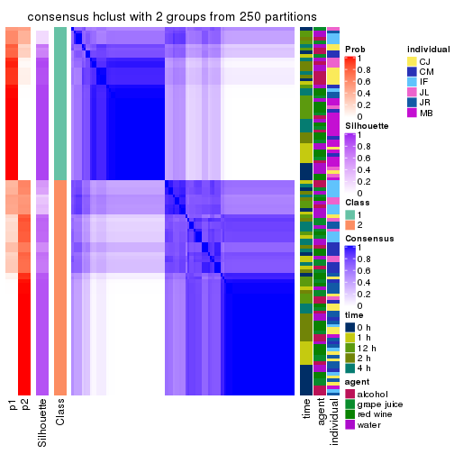</p>

</div>
<div id='tab-CV-hclust-consensus-heatmap-2'>
<pre><code class="r">consensus_heatmap(res, k = 3)
</code></pre>

<p>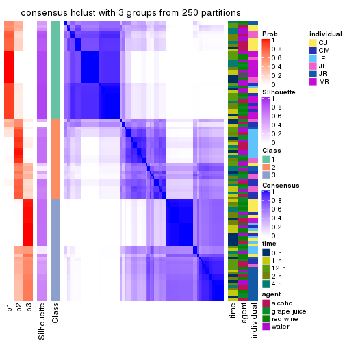</p>

</div>
<div id='tab-CV-hclust-consensus-heatmap-3'>
<pre><code class="r">consensus_heatmap(res, k = 4)
</code></pre>

<p>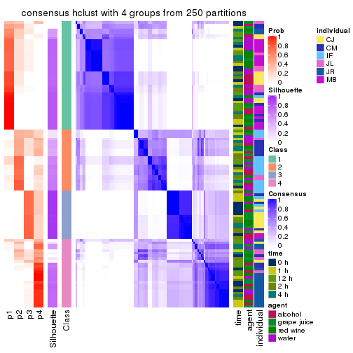</p>

</div>
<div id='tab-CV-hclust-consensus-heatmap-4'>
<pre><code class="r">consensus_heatmap(res, k = 5)
</code></pre>

<p>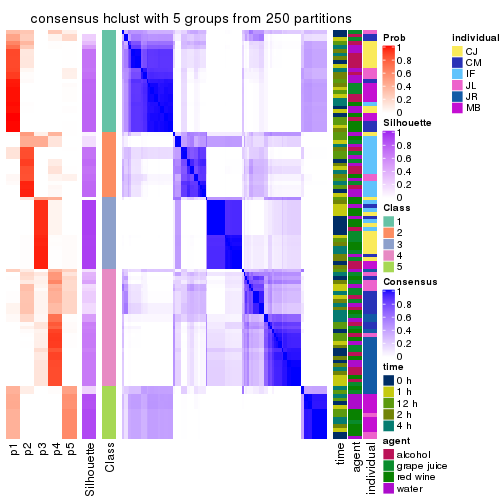</p>

</div>
<div id='tab-CV-hclust-consensus-heatmap-5'>
<pre><code class="r">consensus_heatmap(res, k = 6)
</code></pre>

<p>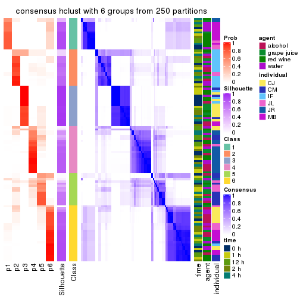</p>

</div>
</div>

Heatmaps for the membership of samples in all partitions to see how consistent they are:


<script>
$( function() {
	$( '#tabs-CV-hclust-membership-heatmap' ).tabs();
} );
</script>
<div id='tabs-CV-hclust-membership-heatmap'>
<ul>
<li><a href='#tab-CV-hclust-membership-heatmap-1'>k = 2</a></li>
<li><a href='#tab-CV-hclust-membership-heatmap-2'>k = 3</a></li>
<li><a href='#tab-CV-hclust-membership-heatmap-3'>k = 4</a></li>
<li><a href='#tab-CV-hclust-membership-heatmap-4'>k = 5</a></li>
<li><a href='#tab-CV-hclust-membership-heatmap-5'>k = 6</a></li>
</ul>
<div id='tab-CV-hclust-membership-heatmap-1'>
<pre><code class="r">membership_heatmap(res, k = 2)
</code></pre>

<p>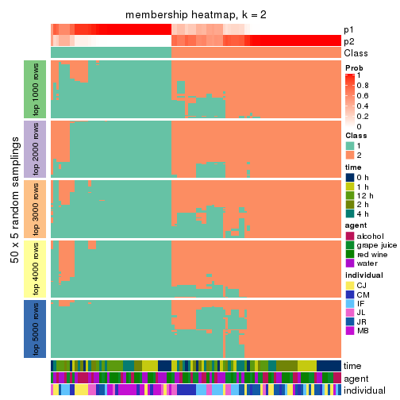</p>

</div>
<div id='tab-CV-hclust-membership-heatmap-2'>
<pre><code class="r">membership_heatmap(res, k = 3)
</code></pre>

<p>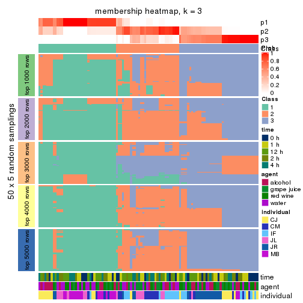</p>

</div>
<div id='tab-CV-hclust-membership-heatmap-3'>
<pre><code class="r">membership_heatmap(res, k = 4)
</code></pre>

<p>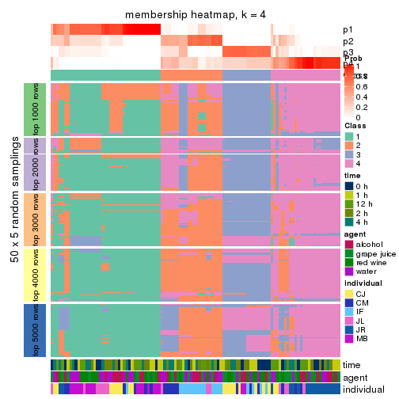</p>

</div>
<div id='tab-CV-hclust-membership-heatmap-4'>
<pre><code class="r">membership_heatmap(res, k = 5)
</code></pre>

<p>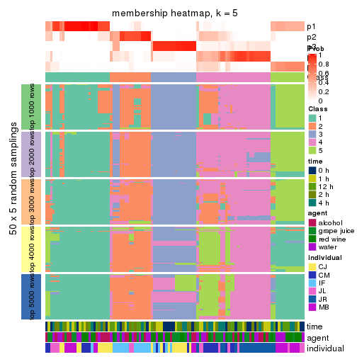</p>

</div>
<div id='tab-CV-hclust-membership-heatmap-5'>
<pre><code class="r">membership_heatmap(res, k = 6)
</code></pre>

<p>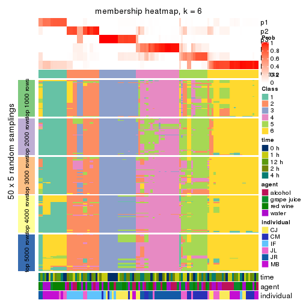</p>

</div>
</div>

As soon as we have had the classes for columns, we can look for signatures
which are significantly different between classes which can be candidate marks
for certain classes. Following are the heatmaps for signatures.


Signature heatmaps where rows are scaled:


<script>
$( function() {
	$( '#tabs-CV-hclust-get-signatures' ).tabs();
} );
</script>
<div id='tabs-CV-hclust-get-signatures'>
<ul>
<li><a href='#tab-CV-hclust-get-signatures-1'>k = 2</a></li>
<li><a href='#tab-CV-hclust-get-signatures-2'>k = 3</a></li>
<li><a href='#tab-CV-hclust-get-signatures-3'>k = 4</a></li>
<li><a href='#tab-CV-hclust-get-signatures-4'>k = 5</a></li>
<li><a href='#tab-CV-hclust-get-signatures-5'>k = 6</a></li>
</ul>
<div id='tab-CV-hclust-get-signatures-1'>
<pre><code class="r">get_signatures(res, k = 2)
</code></pre>

<p>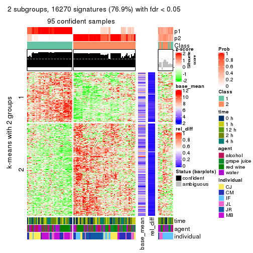</p>

</div>
<div id='tab-CV-hclust-get-signatures-2'>
<pre><code class="r">get_signatures(res, k = 3)
</code></pre>

<p>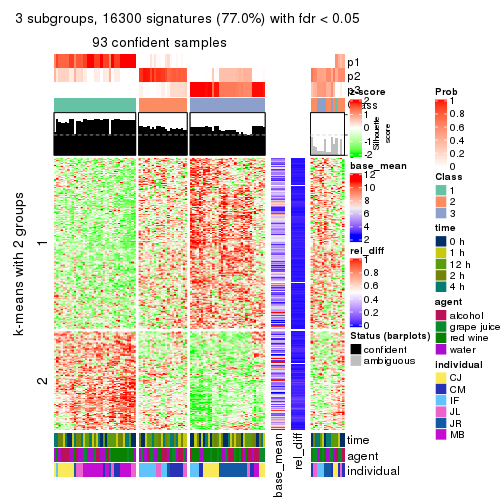</p>

</div>
<div id='tab-CV-hclust-get-signatures-3'>
<pre><code class="r">get_signatures(res, k = 4)
</code></pre>

<p>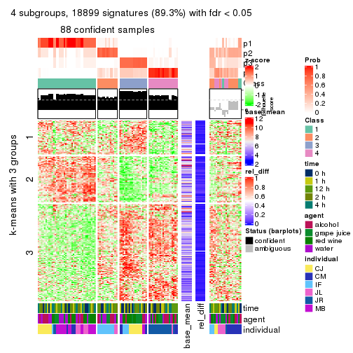</p>

</div>
<div id='tab-CV-hclust-get-signatures-4'>
<pre><code class="r">get_signatures(res, k = 5)
</code></pre>

<p>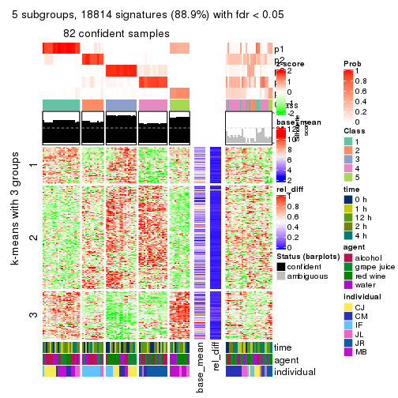</p>

</div>
<div id='tab-CV-hclust-get-signatures-5'>
<pre><code class="r">get_signatures(res, k = 6)
</code></pre>

<p>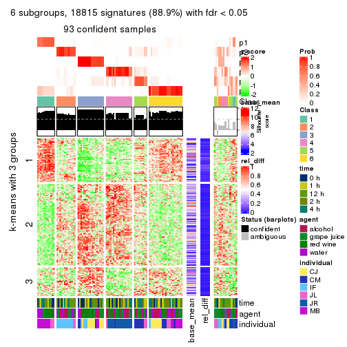</p>

</div>
</div>


Signature heatmaps where rows are not scaled:


<script>
$( function() {
	$( '#tabs-CV-hclust-get-signatures-no-scale' ).tabs();
} );
</script>
<div id='tabs-CV-hclust-get-signatures-no-scale'>
<ul>
<li><a href='#tab-CV-hclust-get-signatures-no-scale-1'>k = 2</a></li>
<li><a href='#tab-CV-hclust-get-signatures-no-scale-2'>k = 3</a></li>
<li><a href='#tab-CV-hclust-get-signatures-no-scale-3'>k = 4</a></li>
<li><a href='#tab-CV-hclust-get-signatures-no-scale-4'>k = 5</a></li>
<li><a href='#tab-CV-hclust-get-signatures-no-scale-5'>k = 6</a></li>
</ul>
<div id='tab-CV-hclust-get-signatures-no-scale-1'>
<pre><code class="r">get_signatures(res, k = 2, scale_rows = FALSE)
</code></pre>

<p>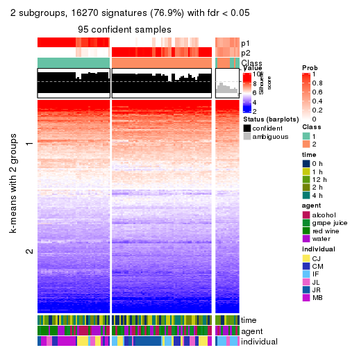</p>

</div>
<div id='tab-CV-hclust-get-signatures-no-scale-2'>
<pre><code class="r">get_signatures(res, k = 3, scale_rows = FALSE)
</code></pre>

<p>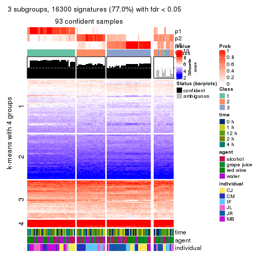</p>

</div>
<div id='tab-CV-hclust-get-signatures-no-scale-3'>
<pre><code class="r">get_signatures(res, k = 4, scale_rows = FALSE)
</code></pre>

<p>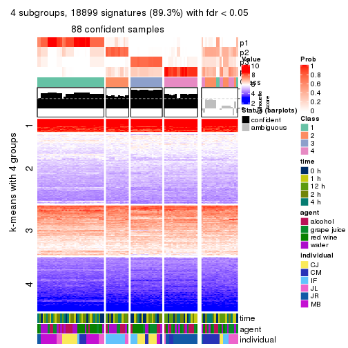</p>

</div>
<div id='tab-CV-hclust-get-signatures-no-scale-4'>
<pre><code class="r">get_signatures(res, k = 5, scale_rows = FALSE)
</code></pre>

<p>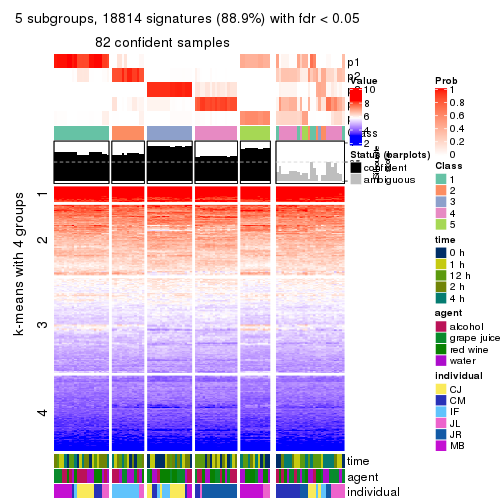</p>

</div>
<div id='tab-CV-hclust-get-signatures-no-scale-5'>
<pre><code class="r">get_signatures(res, k = 6, scale_rows = FALSE)
</code></pre>

<p>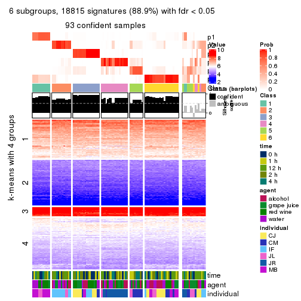</p>

</div>
</div>


Compare the overlap of signatures from different k:

```r
compare_signatures(res)
```

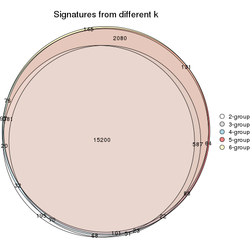

`get_signature()` returns a data frame invisibly. TO get the list of signatures, the function
call should be assigned to a variable explicitly. In following code, if `plot` argument is set
to `FALSE`, no heatmap is plotted while only the differential analysis is performed.

```r
# code only for demonstration
tb = get_signature(res, k = ..., plot = FALSE)
```

An example of the output of `tb` is:

```
#>   which_row         fdr    mean_1    mean_2 scaled_mean_1 scaled_mean_2 km
#> 1        38 0.042760348  8.373488  9.131774    -0.5533452     0.5164555  1
#> 2        40 0.018707592  7.106213  8.469186    -0.6173731     0.5762149  1
#> 3        55 0.019134737 10.221463 11.207825    -0.6159697     0.5749050  1
#> 4        59 0.006059896  5.921854  7.869574    -0.6899429     0.6439467  1
#> 5        60 0.018055526  8.928898 10.211722    -0.6204761     0.5791110  1
#> 6        98 0.009384629 15.714769 14.887706     0.6635654    -0.6193277  2
...
```

The columns in `tb` are:

1. `which_row`: row indices corresponding to the input matrix.
2. `fdr`: FDR for the differential test. 
3. `mean_x`: The mean value in group x.
4. `scaled_mean_x`: The mean value in group x after rows are scaled.
5. `km`: Row groups if k-means clustering is applied to rows.


UMAP plot which shows how samples are separated.


<script>
$( function() {
	$( '#tabs-CV-hclust-dimension-reduction' ).tabs();
} );
</script>
<div id='tabs-CV-hclust-dimension-reduction'>
<ul>
<li><a href='#tab-CV-hclust-dimension-reduction-1'>k = 2</a></li>
<li><a href='#tab-CV-hclust-dimension-reduction-2'>k = 3</a></li>
<li><a href='#tab-CV-hclust-dimension-reduction-3'>k = 4</a></li>
<li><a href='#tab-CV-hclust-dimension-reduction-4'>k = 5</a></li>
<li><a href='#tab-CV-hclust-dimension-reduction-5'>k = 6</a></li>
</ul>
<div id='tab-CV-hclust-dimension-reduction-1'>
<pre><code class="r">dimension_reduction(res, k = 2, method = &quot;UMAP&quot;)
</code></pre>

<p>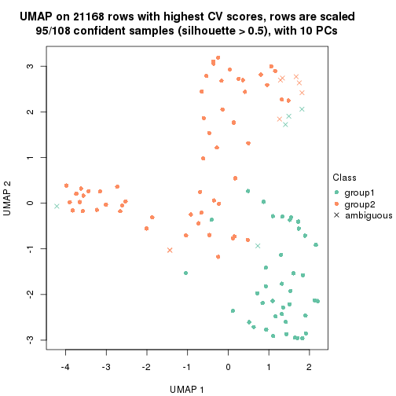</p>

</div>
<div id='tab-CV-hclust-dimension-reduction-2'>
<pre><code class="r">dimension_reduction(res, k = 3, method = &quot;UMAP&quot;)
</code></pre>

<p>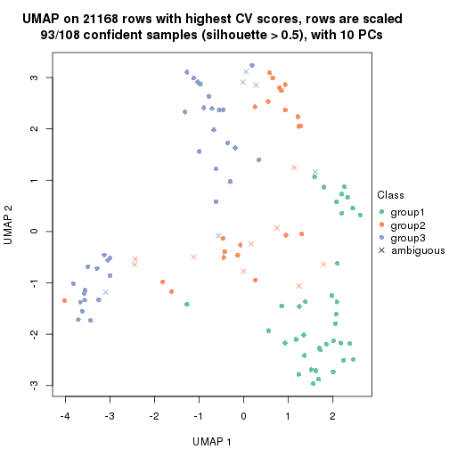</p>

</div>
<div id='tab-CV-hclust-dimension-reduction-3'>
<pre><code class="r">dimension_reduction(res, k = 4, method = &quot;UMAP&quot;)
</code></pre>

<p>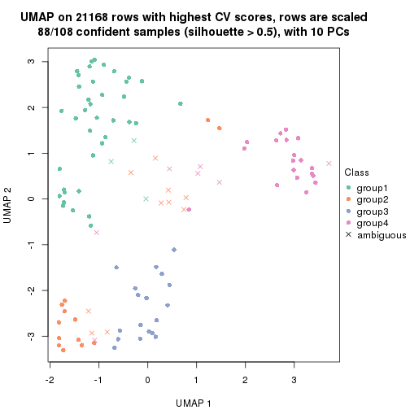</p>

</div>
<div id='tab-CV-hclust-dimension-reduction-4'>
<pre><code class="r">dimension_reduction(res, k = 5, method = &quot;UMAP&quot;)
</code></pre>

<p>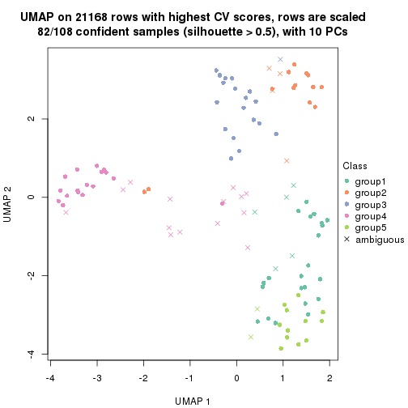</p>

</div>
<div id='tab-CV-hclust-dimension-reduction-5'>
<pre><code class="r">dimension_reduction(res, k = 6, method = &quot;UMAP&quot;)
</code></pre>

<p>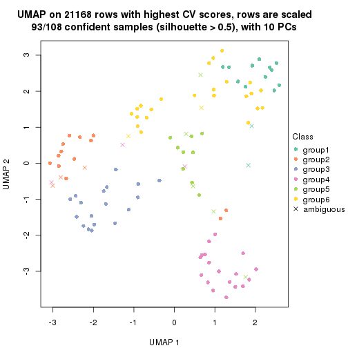</p>

</div>
</div>


Following heatmap shows how subgroups are split when increasing `k`:

```r
collect_classes(res)
```

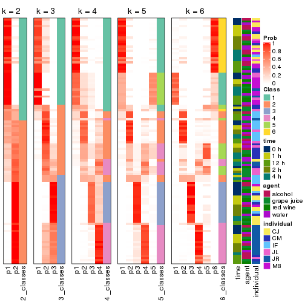


Test correlation between subgroups and known annotations. If the known
annotation is numeric, one-way ANOVA test is applied, and if the known
annotation is discrete, chi-squared contingency table test is applied.

```r
test_to_known_factors(res)
```

```
#>            n time(p) agent(p) individual(p) k
#> CV:hclust 95   0.858    0.388      2.52e-05 2
#> CV:hclust 93   0.620    0.296      7.42e-10 3
#> CV:hclust 88   0.868    0.538      2.10e-19 4
#> CV:hclust 82   0.911    0.223      2.48e-20 5
#> CV:hclust 93   0.910    0.384      4.27e-28 6
```


If matrix rows can be associated to genes, consider to use `GO_Enrichment(res,
...)` to perform function enrichment for the signature genes.


 

---------------------------------------------------


### CV:kmeans**


The object with results only for a single top-value method and a single partition method 
can be extracted as:

```r
res = res_list["CV", "kmeans"]
# you can also extract it by
# res = res_list["CV:kmeans"]
```

A summary of `res` and all the functions that can be applied to it:

```r
res
```

```
#> A 'ConsensusPartition' object with k = 2, 3, 4, 5, 6.
#>   On a matrix with 21168 rows and 108 columns.
#>   Top rows (1000, 2000, 3000, 4000, 5000) are extracted by 'CV' method.
#>   Subgroups are detected by 'kmeans' method.
#>   Performed in total 1250 partitions by row resampling.
#>   Best k for subgroups seems to be 2.
#> 
#> Following methods can be applied to this 'ConsensusPartition' object:
#>  [1] "cola_report"             "collect_classes"         "collect_plots"          
#>  [4] "collect_stats"           "colnames"                "compare_signatures"     
#>  [7] "consensus_heatmap"       "dimension_reduction"     "functional_enrichment"  
#> [10] "get_anno_col"            "get_anno"                "get_classes"            
#> [13] "get_consensus"           "get_matrix"              "get_membership"         
#> [16] "get_param"               "get_signatures"          "get_stats"              
#> [19] "is_best_k"               "is_stable_k"             "membership_heatmap"     
#> [22] "ncol"                    "nrow"                    "plot_ecdf"              
#> [25] "rownames"                "select_partition_number" "show"                   
#> [28] "suggest_best_k"          "test_to_known_factors"
```

`collect_plots()` function collects all the plots made from `res` for all `k` (number of partitions)
into one single page to provide an easy and fast comparison between different `k`.

```r
collect_plots(res)
```

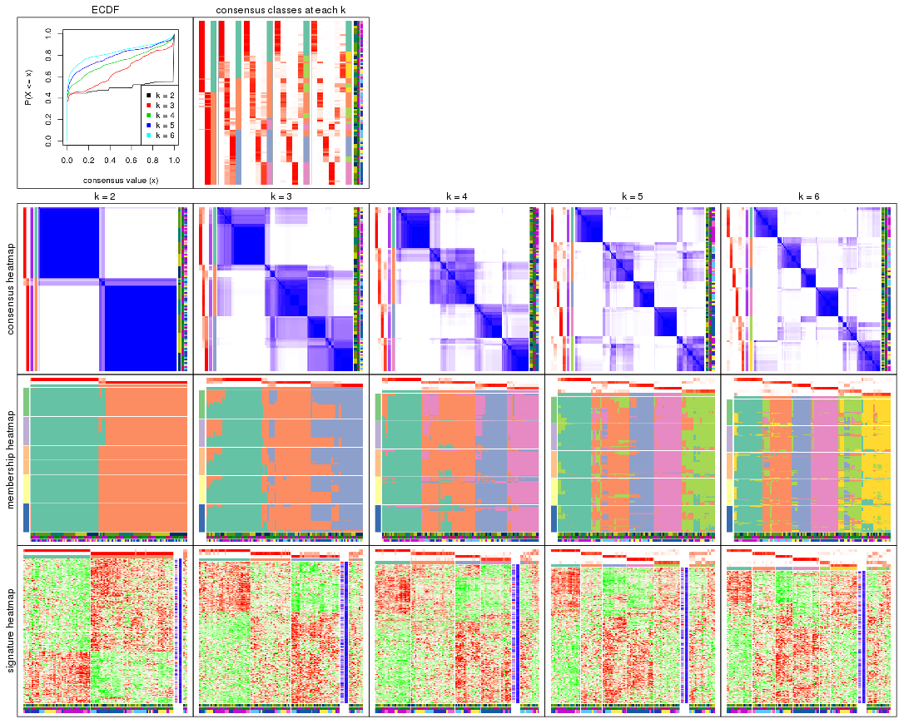

The plots are:

- The first row: a plot of the ECDF (Empirical cumulative distribution
  function) curves of the consensus matrix for each `k` and the heatmap of
  predicted classes for each `k`.
- The second row: heatmaps of the consensus matrix for each `k`.
- The third row: heatmaps of the membership matrix for each `k`.
- The fouth row: heatmaps of the signatures for each `k`.

All the plots in panels can be made by individual functions and they are
plotted later in this section.

`select_partition_number()` produces several plots showing different
statistics for choosing "optimized" `k`. There are following statistics:

- ECDF curves of the consensus matrix for each `k`;
- 1-PAC. [The PAC
  score](https://en.wikipedia.org/wiki/Consensus_clustering#Over-interpretation_potential_of_consensus_clustering)
  measures the proportion of the ambiguous subgrouping.
- Mean silhouette score.
- Concordance. The mean probability of fiting the consensus class ids in all
  partitions.
- Area increased. Denote $A_k$ as the area under the ECDF curve for current
  `k`, the area increased is defined as $A_k - A_{k-1}$.
- Rand index. The percent of pairs of samples that are both in a same cluster
  or both are not in a same cluster in the partition of k and k-1.
- Jaccard index. The ratio of pairs of samples are both in a same cluster in
  the partition of k and k-1 and the pairs of samples are both in a same
  cluster in the partition k or k-1.

The detailed explanations of these statistics can be found in [the cola
vignette](http://bioconductor.org/packages/devel/bioc/vignettes/cola/inst/doc/cola.html#toc_13).

Generally speaking, lower PAC score, higher mean silhouette score or higher
concordance corresponds to better partition. Rand index and Jaccard index
measure how similar the current partition is compared to partition with `k-1`.
If they are too similar, we won't accept `k` is better than `k-1`.

```r
select_partition_number(res)
```

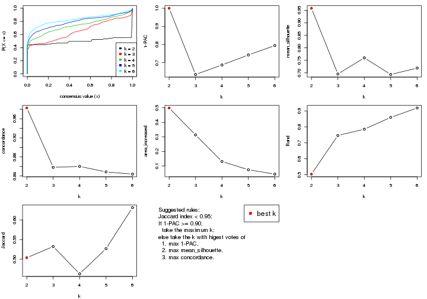

The numeric values for all these statistics can be obtained by `get_stats()`.

```r
get_stats(res)
```

```
#>   k 1-PAC mean_silhouette concordance area_increased  Rand Jaccard
#> 2 2 1.000           0.958       0.983         0.4990 0.504   0.504
#> 3 3 0.634           0.696       0.858         0.3137 0.746   0.532
#> 4 4 0.687           0.760       0.860         0.1312 0.786   0.463
#> 5 5 0.742           0.694       0.849         0.0742 0.860   0.527
#> 6 6 0.794           0.719       0.844         0.0441 0.919   0.632
```

`suggest_best_k()` suggests the best $k$ based on these statistics. The rules are as follows:

- All $k$ with Jaccard index larger than 0.95 are removed because the increase of
  the partition number does not provides enough extra information. If all $k$ are removed,
  the best $k$ is assigned by `NA`.
- For $k$ with 1-PAC larger than 0.9, the maximal $k$ is taken as the "best k". Other $k$ is called "optional k".
- If it does not fit the second rule. The $k$ with the highest vote of highest
  1-PAC, mean silhouette and concordance is taken as the "best k".

```r
suggest_best_k(res)
```

```
#> [1] 2
```


Following shows the table of the partitions (You need to click the **show/hide
code output** link to see it). The membership matrix (columns with name `p*`)
is inferred by
[`clue::cl_consensus()`](https://www.rdocumentation.org/link/cl_consensus?package=clue)
function with the `SE` method. Basically the value in the membership matrix
represents the probability to belong to a certain group. The finall class
label for an item is determined with the group with highest probability it
belongs to.

In `get_classes()` function, the entropy is calculated from the membership
matrix and the silhouette score is calculated from the consensus matrix.


<script>
$( function() {
	$( '#tabs-CV-kmeans-get-classes' ).tabs();
} );
</script>
<div id='tabs-CV-kmeans-get-classes'>
<ul>
<li><a href='#tab-CV-kmeans-get-classes-1'>k = 2</a></li>
<li><a href='#tab-CV-kmeans-get-classes-2'>k = 3</a></li>
<li><a href='#tab-CV-kmeans-get-classes-3'>k = 4</a></li>
<li><a href='#tab-CV-kmeans-get-classes-4'>k = 5</a></li>
<li><a href='#tab-CV-kmeans-get-classes-5'>k = 6</a></li>
</ul>

<div id='tab-CV-kmeans-get-classes-1'>
<p><a id='tab-CV-kmeans-get-classes-1-a' style='color:#0366d6' href='#'>show/hide code output</a></p>
<pre><code class="r">cbind(get_classes(res, k = 2), get_membership(res, k = 2))
</code></pre>

<pre><code>#&gt;          class entropy silhouette    p1    p2
#&gt; GSM87863     1  0.0000      0.996 1.000 0.000
#&gt; GSM87887     1  0.0000      0.996 1.000 0.000
#&gt; GSM87896     2  0.0000      0.971 0.000 1.000
#&gt; GSM87934     2  0.0000      0.971 0.000 1.000
#&gt; GSM87943     2  0.0000      0.971 0.000 1.000
#&gt; GSM87853     2  0.0000      0.971 0.000 1.000
#&gt; GSM87906     2  0.0000      0.971 0.000 1.000
#&gt; GSM87920     1  0.0000      0.996 1.000 0.000
#&gt; GSM87924     2  0.0000      0.971 0.000 1.000
#&gt; GSM87858     2  0.0000      0.971 0.000 1.000
#&gt; GSM87882     2  0.0000      0.971 0.000 1.000
#&gt; GSM87891     2  0.0000      0.971 0.000 1.000
#&gt; GSM87917     1  0.0000      0.996 1.000 0.000
#&gt; GSM87929     2  0.0000      0.971 0.000 1.000
#&gt; GSM87948     1  0.0000      0.996 1.000 0.000
#&gt; GSM87868     1  0.0000      0.996 1.000 0.000
#&gt; GSM87873     2  0.0000      0.971 0.000 1.000
#&gt; GSM87901     2  0.9635      0.400 0.388 0.612
#&gt; GSM87910     1  0.0000      0.996 1.000 0.000
#&gt; GSM87938     2  0.0000      0.971 0.000 1.000
#&gt; GSM87953     1  0.0000      0.996 1.000 0.000
#&gt; GSM87864     1  0.0000      0.996 1.000 0.000
#&gt; GSM87888     2  0.0000      0.971 0.000 1.000
#&gt; GSM87897     2  0.0000      0.971 0.000 1.000
#&gt; GSM87935     2  0.0000      0.971 0.000 1.000
#&gt; GSM87944     1  0.0000      0.996 1.000 0.000
#&gt; GSM87854     2  0.0000      0.971 0.000 1.000
#&gt; GSM87878     1  0.0000      0.996 1.000 0.000
#&gt; GSM87907     2  0.0000      0.971 0.000 1.000
#&gt; GSM87921     2  0.0000      0.971 0.000 1.000
#&gt; GSM87925     2  0.0000      0.971 0.000 1.000
#&gt; GSM87957     1  0.0000      0.996 1.000 0.000
#&gt; GSM87859     2  0.0000      0.971 0.000 1.000
#&gt; GSM87883     1  0.0000      0.996 1.000 0.000
#&gt; GSM87892     2  0.0000      0.971 0.000 1.000
#&gt; GSM87930     2  0.0000      0.971 0.000 1.000
#&gt; GSM87949     1  0.0000      0.996 1.000 0.000
#&gt; GSM87869     1  0.0000      0.996 1.000 0.000
#&gt; GSM87874     2  0.0000      0.971 0.000 1.000
#&gt; GSM87902     2  0.8555      0.624 0.280 0.720
#&gt; GSM87911     2  0.0000      0.971 0.000 1.000
#&gt; GSM87939     2  0.0000      0.971 0.000 1.000
#&gt; GSM87954     1  0.0000      0.996 1.000 0.000
#&gt; GSM87865     1  0.0000      0.996 1.000 0.000
#&gt; GSM87889     1  0.0376      0.992 0.996 0.004
#&gt; GSM87898     1  0.0000      0.996 1.000 0.000
#&gt; GSM87915     1  0.0000      0.996 1.000 0.000
#&gt; GSM87936     2  0.0000      0.971 0.000 1.000
#&gt; GSM87945     2  0.0000      0.971 0.000 1.000
#&gt; GSM87855     2  0.0000      0.971 0.000 1.000
#&gt; GSM87879     2  0.0000      0.971 0.000 1.000
#&gt; GSM87922     2  0.0000      0.971 0.000 1.000
#&gt; GSM87926     2  0.0000      0.971 0.000 1.000
#&gt; GSM87958     1  0.0000      0.996 1.000 0.000
#&gt; GSM87860     2  0.0000      0.971 0.000 1.000
#&gt; GSM87884     1  0.0000      0.996 1.000 0.000
#&gt; GSM87893     2  0.0000      0.971 0.000 1.000
#&gt; GSM87918     1  0.6887      0.762 0.816 0.184
#&gt; GSM87931     2  0.0000      0.971 0.000 1.000
#&gt; GSM87950     1  0.0000      0.996 1.000 0.000
#&gt; GSM87870     1  0.0000      0.996 1.000 0.000
#&gt; GSM87875     2  0.0000      0.971 0.000 1.000
#&gt; GSM87903     2  0.0000      0.971 0.000 1.000
#&gt; GSM87912     1  0.0000      0.996 1.000 0.000
#&gt; GSM87940     2  0.0000      0.971 0.000 1.000
#&gt; GSM87866     1  0.0000      0.996 1.000 0.000
#&gt; GSM87899     2  0.0000      0.971 0.000 1.000
#&gt; GSM87937     2  0.0000      0.971 0.000 1.000
#&gt; GSM87946     1  0.0000      0.996 1.000 0.000
#&gt; GSM87856     2  0.0000      0.971 0.000 1.000
#&gt; GSM87880     2  0.0000      0.971 0.000 1.000
#&gt; GSM87908     2  0.7815      0.701 0.232 0.768
#&gt; GSM87923     2  0.0000      0.971 0.000 1.000
#&gt; GSM87927     2  0.0000      0.971 0.000 1.000
#&gt; GSM87959     1  0.0000      0.996 1.000 0.000
#&gt; GSM87861     2  0.0000      0.971 0.000 1.000
#&gt; GSM87885     1  0.0000      0.996 1.000 0.000
#&gt; GSM87894     1  0.0000      0.996 1.000 0.000
#&gt; GSM87932     1  0.0000      0.996 1.000 0.000
#&gt; GSM87951     1  0.0000      0.996 1.000 0.000
#&gt; GSM87871     2  0.0000      0.971 0.000 1.000
#&gt; GSM87876     1  0.0376      0.992 0.996 0.004
#&gt; GSM87904     2  0.0000      0.971 0.000 1.000
#&gt; GSM87913     1  0.0000      0.996 1.000 0.000
#&gt; GSM87941     2  0.0000      0.971 0.000 1.000
#&gt; GSM87955     1  0.0000      0.996 1.000 0.000
#&gt; GSM87867     1  0.0000      0.996 1.000 0.000
#&gt; GSM87890     2  0.0000      0.971 0.000 1.000
#&gt; GSM87900     2  0.0000      0.971 0.000 1.000
#&gt; GSM87916     2  0.0000      0.971 0.000 1.000
#&gt; GSM87947     1  0.0000      0.996 1.000 0.000
#&gt; GSM87857     2  0.0000      0.971 0.000 1.000
#&gt; GSM87881     2  0.0000      0.971 0.000 1.000
#&gt; GSM87909     1  0.0000      0.996 1.000 0.000
#&gt; GSM87928     1  0.0000      0.996 1.000 0.000
#&gt; GSM87960     1  0.0000      0.996 1.000 0.000
#&gt; GSM87862     2  0.0000      0.971 0.000 1.000
#&gt; GSM87886     1  0.0000      0.996 1.000 0.000
#&gt; GSM87895     2  0.0000      0.971 0.000 1.000
#&gt; GSM87919     1  0.0000      0.996 1.000 0.000
#&gt; GSM87933     2  0.0000      0.971 0.000 1.000
#&gt; GSM87952     1  0.0000      0.996 1.000 0.000
#&gt; GSM87872     2  0.0000      0.971 0.000 1.000
#&gt; GSM87877     1  0.0000      0.996 1.000 0.000
#&gt; GSM87905     1  0.0000      0.996 1.000 0.000
#&gt; GSM87914     2  0.9635      0.400 0.388 0.612
#&gt; GSM87942     2  0.9635      0.400 0.388 0.612
#&gt; GSM87956     1  0.0000      0.996 1.000 0.000
</code></pre>

<script>
$('#tab-CV-kmeans-get-classes-1-a').parent().next().next().hide();
$('#tab-CV-kmeans-get-classes-1-a').click(function(){
  $('#tab-CV-kmeans-get-classes-1-a').parent().next().next().toggle();
  return(false);
});
</script>
</div>

<div id='tab-CV-kmeans-get-classes-2'>
<p><a id='tab-CV-kmeans-get-classes-2-a' style='color:#0366d6' href='#'>show/hide code output</a></p>
<pre><code class="r">cbind(get_classes(res, k = 3), get_membership(res, k = 3))
</code></pre>

<pre><code>#&gt;          class entropy silhouette    p1    p2    p3
#&gt; GSM87863     2  0.5138     0.5158 0.252 0.748 0.000
#&gt; GSM87887     1  0.5678     0.6447 0.684 0.316 0.000
#&gt; GSM87896     3  0.0000     0.7363 0.000 0.000 1.000
#&gt; GSM87934     3  0.6154     0.5751 0.000 0.408 0.592
#&gt; GSM87943     3  0.4346     0.6094 0.000 0.184 0.816
#&gt; GSM87853     3  0.0000     0.7363 0.000 0.000 1.000
#&gt; GSM87906     2  0.0747     0.8305 0.000 0.984 0.016
#&gt; GSM87920     2  0.5016     0.5426 0.240 0.760 0.000
#&gt; GSM87924     3  0.0747     0.7320 0.000 0.016 0.984
#&gt; GSM87858     3  0.0000     0.7363 0.000 0.000 1.000
#&gt; GSM87882     2  0.6079    -0.0246 0.000 0.612 0.388
#&gt; GSM87891     3  0.0000     0.7363 0.000 0.000 1.000
#&gt; GSM87917     1  0.0000     0.8845 1.000 0.000 0.000
#&gt; GSM87929     2  0.5291     0.4325 0.000 0.732 0.268
#&gt; GSM87948     1  0.1860     0.8590 0.948 0.052 0.000
#&gt; GSM87868     1  0.0000     0.8845 1.000 0.000 0.000
#&gt; GSM87873     3  0.0000     0.7363 0.000 0.000 1.000
#&gt; GSM87901     2  0.0000     0.8303 0.000 1.000 0.000
#&gt; GSM87910     1  0.0000     0.8845 1.000 0.000 0.000
#&gt; GSM87938     3  0.6154     0.5751 0.000 0.408 0.592
#&gt; GSM87953     1  0.0000     0.8845 1.000 0.000 0.000
#&gt; GSM87864     1  0.6111     0.5187 0.604 0.396 0.000
#&gt; GSM87888     2  0.0747     0.8305 0.000 0.984 0.016
#&gt; GSM87897     2  0.1529     0.8188 0.000 0.960 0.040
#&gt; GSM87935     3  0.6154     0.5751 0.000 0.408 0.592
#&gt; GSM87944     1  0.0237     0.8828 0.996 0.004 0.000
#&gt; GSM87854     2  0.5431     0.5029 0.000 0.716 0.284
#&gt; GSM87878     1  0.6045     0.5482 0.620 0.380 0.000
#&gt; GSM87907     3  0.4452     0.6943 0.000 0.192 0.808
#&gt; GSM87921     2  0.0000     0.8303 0.000 1.000 0.000
#&gt; GSM87925     3  0.6154     0.5751 0.000 0.408 0.592
#&gt; GSM87957     1  0.4887     0.7331 0.772 0.228 0.000
#&gt; GSM87859     3  0.0000     0.7363 0.000 0.000 1.000
#&gt; GSM87883     1  0.0000     0.8845 1.000 0.000 0.000
#&gt; GSM87892     3  0.0000     0.7363 0.000 0.000 1.000
#&gt; GSM87930     3  0.5650     0.6328 0.000 0.312 0.688
#&gt; GSM87949     1  0.0000     0.8845 1.000 0.000 0.000
#&gt; GSM87869     1  0.0000     0.8845 1.000 0.000 0.000
#&gt; GSM87874     3  0.0000     0.7363 0.000 0.000 1.000
#&gt; GSM87902     2  0.0747     0.8305 0.000 0.984 0.016
#&gt; GSM87911     2  0.0747     0.8305 0.000 0.984 0.016
#&gt; GSM87939     3  0.6192     0.5558 0.000 0.420 0.580
#&gt; GSM87954     1  0.0000     0.8845 1.000 0.000 0.000
#&gt; GSM87865     1  0.6305     0.3138 0.516 0.484 0.000
#&gt; GSM87889     2  0.0747     0.8273 0.016 0.984 0.000
#&gt; GSM87898     1  0.6309     0.2782 0.504 0.496 0.000
#&gt; GSM87915     1  0.0000     0.8845 1.000 0.000 0.000
#&gt; GSM87936     3  0.6154     0.5751 0.000 0.408 0.592
#&gt; GSM87945     3  0.0237     0.7360 0.000 0.004 0.996
#&gt; GSM87855     3  0.0237     0.7360 0.000 0.004 0.996
#&gt; GSM87879     2  0.2959     0.7444 0.000 0.900 0.100
#&gt; GSM87922     2  0.6215    -0.2061 0.000 0.572 0.428
#&gt; GSM87926     3  0.6274     0.4817 0.000 0.456 0.544
#&gt; GSM87958     1  0.0000     0.8845 1.000 0.000 0.000
#&gt; GSM87860     3  0.0237     0.7360 0.000 0.004 0.996
#&gt; GSM87884     1  0.0000     0.8845 1.000 0.000 0.000
#&gt; GSM87893     3  0.0000     0.7363 0.000 0.000 1.000
#&gt; GSM87918     2  0.0000     0.8303 0.000 1.000 0.000
#&gt; GSM87931     3  0.6154     0.5751 0.000 0.408 0.592
#&gt; GSM87950     1  0.0000     0.8845 1.000 0.000 0.000
#&gt; GSM87870     1  0.6008     0.5615 0.628 0.372 0.000
#&gt; GSM87875     3  0.0237     0.7360 0.000 0.004 0.996
#&gt; GSM87903     2  0.2165     0.7967 0.000 0.936 0.064
#&gt; GSM87912     1  0.0000     0.8845 1.000 0.000 0.000
#&gt; GSM87940     3  0.6154     0.5751 0.000 0.408 0.592
#&gt; GSM87866     1  0.5431     0.6807 0.716 0.284 0.000
#&gt; GSM87899     3  0.6168     0.3979 0.000 0.412 0.588
#&gt; GSM87937     3  0.6154     0.5751 0.000 0.408 0.592
#&gt; GSM87946     1  0.0000     0.8845 1.000 0.000 0.000
#&gt; GSM87856     3  0.4346     0.6094 0.000 0.184 0.816
#&gt; GSM87880     2  0.0747     0.8305 0.000 0.984 0.016
#&gt; GSM87908     2  0.0747     0.8305 0.000 0.984 0.016
#&gt; GSM87923     2  0.6252    -0.2143 0.000 0.556 0.444
#&gt; GSM87927     2  0.0892     0.8211 0.000 0.980 0.020
#&gt; GSM87959     1  0.0000     0.8845 1.000 0.000 0.000
#&gt; GSM87861     3  0.0237     0.7360 0.000 0.004 0.996
#&gt; GSM87885     2  0.0747     0.8273 0.016 0.984 0.000
#&gt; GSM87894     1  0.5560     0.6642 0.700 0.300 0.000
#&gt; GSM87932     1  0.0000     0.8845 1.000 0.000 0.000
#&gt; GSM87951     1  0.0000     0.8845 1.000 0.000 0.000
#&gt; GSM87871     2  0.0747     0.8305 0.000 0.984 0.016
#&gt; GSM87876     2  0.0747     0.8273 0.016 0.984 0.000
#&gt; GSM87904     3  0.5835     0.5426 0.000 0.340 0.660
#&gt; GSM87913     1  0.5560     0.6637 0.700 0.300 0.000
#&gt; GSM87941     2  0.1163     0.8156 0.000 0.972 0.028
#&gt; GSM87955     1  0.0000     0.8845 1.000 0.000 0.000
#&gt; GSM87867     2  0.4235     0.6632 0.176 0.824 0.000
#&gt; GSM87890     3  0.6154     0.5751 0.000 0.408 0.592
#&gt; GSM87900     2  0.1753     0.7971 0.000 0.952 0.048
#&gt; GSM87916     3  0.6215     0.5411 0.000 0.428 0.572
#&gt; GSM87947     1  0.2165     0.8522 0.936 0.064 0.000
#&gt; GSM87857     3  0.5178     0.5958 0.000 0.256 0.744
#&gt; GSM87881     2  0.0000     0.8303 0.000 1.000 0.000
#&gt; GSM87909     2  0.0747     0.8273 0.016 0.984 0.000
#&gt; GSM87928     1  0.0000     0.8845 1.000 0.000 0.000
#&gt; GSM87960     1  0.0000     0.8845 1.000 0.000 0.000
#&gt; GSM87862     2  0.6260    -0.2270 0.000 0.552 0.448
#&gt; GSM87886     1  0.0000     0.8845 1.000 0.000 0.000
#&gt; GSM87895     3  0.4399     0.6954 0.000 0.188 0.812
#&gt; GSM87919     1  0.0000     0.8845 1.000 0.000 0.000
#&gt; GSM87933     3  0.6192     0.5558 0.000 0.420 0.580
#&gt; GSM87952     1  0.0000     0.8845 1.000 0.000 0.000
#&gt; GSM87872     2  0.0000     0.8303 0.000 1.000 0.000
#&gt; GSM87877     1  0.5650     0.6498 0.688 0.312 0.000
#&gt; GSM87905     2  0.5926     0.1995 0.356 0.644 0.000
#&gt; GSM87914     2  0.0000     0.8303 0.000 1.000 0.000
#&gt; GSM87942     2  0.0000     0.8303 0.000 1.000 0.000
#&gt; GSM87956     1  0.0000     0.8845 1.000 0.000 0.000
</code></pre>

<script>
$('#tab-CV-kmeans-get-classes-2-a').parent().next().next().hide();
$('#tab-CV-kmeans-get-classes-2-a').click(function(){
  $('#tab-CV-kmeans-get-classes-2-a').parent().next().next().toggle();
  return(false);
});
</script>
</div>

<div id='tab-CV-kmeans-get-classes-3'>
<p><a id='tab-CV-kmeans-get-classes-3-a' style='color:#0366d6' href='#'>show/hide code output</a></p>
<pre><code class="r">cbind(get_classes(res, k = 4), get_membership(res, k = 4))
</code></pre>

<pre><code>#&gt;          class entropy silhouette    p1    p2    p3    p4
#&gt; GSM87863     2  0.1674     0.7829 0.004 0.952 0.012 0.032
#&gt; GSM87887     2  0.5168     0.5776 0.248 0.712 0.000 0.040
#&gt; GSM87896     3  0.0921     0.8427 0.000 0.000 0.972 0.028
#&gt; GSM87934     4  0.2408     0.8833 0.000 0.000 0.104 0.896
#&gt; GSM87943     3  0.2060     0.8107 0.000 0.052 0.932 0.016
#&gt; GSM87853     3  0.0376     0.8424 0.000 0.004 0.992 0.004
#&gt; GSM87906     2  0.5189     0.4504 0.000 0.616 0.012 0.372
#&gt; GSM87920     2  0.1406     0.7862 0.016 0.960 0.000 0.024
#&gt; GSM87924     4  0.4193     0.6558 0.000 0.000 0.268 0.732
#&gt; GSM87858     3  0.0921     0.8427 0.000 0.000 0.972 0.028
#&gt; GSM87882     2  0.6164     0.5488 0.000 0.656 0.104 0.240
#&gt; GSM87891     3  0.0921     0.8427 0.000 0.000 0.972 0.028
#&gt; GSM87917     1  0.0000     0.9386 1.000 0.000 0.000 0.000
#&gt; GSM87929     4  0.1733     0.8462 0.000 0.028 0.024 0.948
#&gt; GSM87948     1  0.5565     0.4643 0.624 0.344 0.000 0.032
#&gt; GSM87868     1  0.4500     0.7428 0.776 0.192 0.000 0.032
#&gt; GSM87873     3  0.0921     0.8427 0.000 0.000 0.972 0.028
#&gt; GSM87901     2  0.2179     0.7859 0.000 0.924 0.012 0.064
#&gt; GSM87910     1  0.0000     0.9386 1.000 0.000 0.000 0.000
#&gt; GSM87938     4  0.2408     0.8833 0.000 0.000 0.104 0.896
#&gt; GSM87953     1  0.0000     0.9386 1.000 0.000 0.000 0.000
#&gt; GSM87864     2  0.4008     0.7024 0.148 0.820 0.000 0.032
#&gt; GSM87888     2  0.4406     0.6957 0.000 0.780 0.028 0.192
#&gt; GSM87897     2  0.5231     0.4237 0.000 0.604 0.012 0.384
#&gt; GSM87935     4  0.2408     0.8833 0.000 0.000 0.104 0.896
#&gt; GSM87944     1  0.4579     0.7316 0.768 0.200 0.000 0.032
#&gt; GSM87854     2  0.4379     0.7006 0.000 0.792 0.036 0.172
#&gt; GSM87878     2  0.4008     0.7068 0.148 0.820 0.000 0.032
#&gt; GSM87907     3  0.5323     0.4478 0.000 0.020 0.628 0.352
#&gt; GSM87921     2  0.5057     0.5144 0.000 0.648 0.012 0.340
#&gt; GSM87925     4  0.2408     0.8833 0.000 0.000 0.104 0.896
#&gt; GSM87957     2  0.5842     0.0876 0.448 0.520 0.000 0.032
#&gt; GSM87859     3  0.0921     0.8427 0.000 0.000 0.972 0.028
#&gt; GSM87883     1  0.2313     0.9007 0.924 0.044 0.000 0.032
#&gt; GSM87892     3  0.0921     0.8427 0.000 0.000 0.972 0.028
#&gt; GSM87930     4  0.2408     0.8833 0.000 0.000 0.104 0.896
#&gt; GSM87949     1  0.0000     0.9386 1.000 0.000 0.000 0.000
#&gt; GSM87869     1  0.1488     0.9209 0.956 0.012 0.000 0.032
#&gt; GSM87874     3  0.0921     0.8427 0.000 0.000 0.972 0.028
#&gt; GSM87902     2  0.2179     0.7859 0.000 0.924 0.012 0.064
#&gt; GSM87911     2  0.3711     0.7414 0.000 0.836 0.024 0.140
#&gt; GSM87939     4  0.2542     0.8808 0.000 0.012 0.084 0.904
#&gt; GSM87954     1  0.0000     0.9386 1.000 0.000 0.000 0.000
#&gt; GSM87865     2  0.1936     0.7799 0.028 0.940 0.000 0.032
#&gt; GSM87889     2  0.1406     0.7887 0.000 0.960 0.016 0.024
#&gt; GSM87898     2  0.2773     0.7792 0.028 0.900 0.000 0.072
#&gt; GSM87915     1  0.0188     0.9376 0.996 0.000 0.000 0.004
#&gt; GSM87936     4  0.2408     0.8833 0.000 0.000 0.104 0.896
#&gt; GSM87945     3  0.0592     0.8392 0.000 0.016 0.984 0.000
#&gt; GSM87855     3  0.0592     0.8392 0.000 0.016 0.984 0.000
#&gt; GSM87879     2  0.4669     0.6751 0.000 0.764 0.036 0.200
#&gt; GSM87922     4  0.5292     0.7131 0.000 0.168 0.088 0.744
#&gt; GSM87926     4  0.2473     0.8790 0.000 0.012 0.080 0.908
#&gt; GSM87958     1  0.0000     0.9386 1.000 0.000 0.000 0.000
#&gt; GSM87860     3  0.3052     0.7539 0.000 0.004 0.860 0.136
#&gt; GSM87884     1  0.2313     0.9007 0.924 0.044 0.000 0.032
#&gt; GSM87893     3  0.0921     0.8427 0.000 0.000 0.972 0.028
#&gt; GSM87918     2  0.2179     0.7859 0.000 0.924 0.012 0.064
#&gt; GSM87931     4  0.2408     0.8833 0.000 0.000 0.104 0.896
#&gt; GSM87950     1  0.0000     0.9386 1.000 0.000 0.000 0.000
#&gt; GSM87870     2  0.4579     0.6461 0.200 0.768 0.000 0.032
#&gt; GSM87875     3  0.0895     0.8364 0.000 0.020 0.976 0.004
#&gt; GSM87903     2  0.5268     0.3965 0.000 0.592 0.012 0.396
#&gt; GSM87912     1  0.0000     0.9386 1.000 0.000 0.000 0.000
#&gt; GSM87940     4  0.2408     0.8833 0.000 0.000 0.104 0.896
#&gt; GSM87866     2  0.5492     0.4370 0.328 0.640 0.000 0.032
#&gt; GSM87899     3  0.7227     0.2931 0.000 0.148 0.484 0.368
#&gt; GSM87937     4  0.2408     0.8833 0.000 0.000 0.104 0.896
#&gt; GSM87946     1  0.1488     0.9209 0.956 0.012 0.000 0.032
#&gt; GSM87856     3  0.2060     0.8107 0.000 0.052 0.932 0.016
#&gt; GSM87880     2  0.4323     0.7025 0.000 0.788 0.028 0.184
#&gt; GSM87908     2  0.2179     0.7859 0.000 0.924 0.012 0.064
#&gt; GSM87923     4  0.6167     0.6179 0.000 0.220 0.116 0.664
#&gt; GSM87927     4  0.2101     0.8121 0.000 0.060 0.012 0.928
#&gt; GSM87959     1  0.0000     0.9386 1.000 0.000 0.000 0.000
#&gt; GSM87861     3  0.0188     0.8420 0.000 0.004 0.996 0.000
#&gt; GSM87885     2  0.1406     0.7887 0.000 0.960 0.016 0.024
#&gt; GSM87894     2  0.5113     0.5580 0.264 0.704 0.000 0.032
#&gt; GSM87932     1  0.0524     0.9313 0.988 0.004 0.000 0.008
#&gt; GSM87951     1  0.0000     0.9386 1.000 0.000 0.000 0.000
#&gt; GSM87871     2  0.1406     0.7884 0.000 0.960 0.016 0.024
#&gt; GSM87876     2  0.1406     0.7887 0.000 0.960 0.016 0.024
#&gt; GSM87904     3  0.5496     0.5155 0.000 0.036 0.652 0.312
#&gt; GSM87913     2  0.5453     0.4546 0.320 0.648 0.000 0.032
#&gt; GSM87941     4  0.1970     0.8147 0.000 0.060 0.008 0.932
#&gt; GSM87955     1  0.0000     0.9386 1.000 0.000 0.000 0.000
#&gt; GSM87867     2  0.0992     0.7888 0.004 0.976 0.012 0.008
#&gt; GSM87890     4  0.2408     0.8795 0.000 0.000 0.104 0.896
#&gt; GSM87900     4  0.5093     0.3628 0.000 0.348 0.012 0.640
#&gt; GSM87916     4  0.2610     0.8820 0.000 0.012 0.088 0.900
#&gt; GSM87947     1  0.5599     0.4446 0.616 0.352 0.000 0.032
#&gt; GSM87857     3  0.4711     0.7209 0.000 0.064 0.784 0.152
#&gt; GSM87881     2  0.4406     0.6976 0.000 0.780 0.028 0.192
#&gt; GSM87909     2  0.1902     0.7864 0.000 0.932 0.004 0.064
#&gt; GSM87928     1  0.0524     0.9313 0.988 0.004 0.000 0.008
#&gt; GSM87960     1  0.1174     0.9266 0.968 0.012 0.000 0.020
#&gt; GSM87862     3  0.6887     0.2903 0.000 0.116 0.528 0.356
#&gt; GSM87886     1  0.0336     0.9365 0.992 0.000 0.000 0.008
#&gt; GSM87895     3  0.5112     0.3914 0.000 0.008 0.608 0.384
#&gt; GSM87919     1  0.0000     0.9386 1.000 0.000 0.000 0.000
#&gt; GSM87933     4  0.2610     0.8820 0.000 0.012 0.088 0.900
#&gt; GSM87952     1  0.0000     0.9386 1.000 0.000 0.000 0.000
#&gt; GSM87872     2  0.2402     0.7831 0.000 0.912 0.012 0.076
#&gt; GSM87877     2  0.5198     0.5715 0.252 0.708 0.000 0.040
#&gt; GSM87905     2  0.1824     0.7874 0.004 0.936 0.000 0.060
#&gt; GSM87914     2  0.4387     0.6542 0.000 0.752 0.012 0.236
#&gt; GSM87942     4  0.4155     0.6044 0.000 0.240 0.004 0.756
#&gt; GSM87956     1  0.0000     0.9386 1.000 0.000 0.000 0.000
</code></pre>

<script>
$('#tab-CV-kmeans-get-classes-3-a').parent().next().next().hide();
$('#tab-CV-kmeans-get-classes-3-a').click(function(){
  $('#tab-CV-kmeans-get-classes-3-a').parent().next().next().toggle();
  return(false);
});
</script>
</div>

<div id='tab-CV-kmeans-get-classes-4'>
<p><a id='tab-CV-kmeans-get-classes-4-a' style='color:#0366d6' href='#'>show/hide code output</a></p>
<pre><code class="r">cbind(get_classes(res, k = 5), get_membership(res, k = 5))
</code></pre>

<pre><code>#&gt;          class entropy silhouette    p1    p2    p3    p4    p5
#&gt; GSM87863     5  0.2230     0.6722 0.000 0.116 0.000 0.000 0.884
#&gt; GSM87887     5  0.1948     0.7018 0.056 0.004 0.008 0.004 0.928
#&gt; GSM87896     3  0.0727     0.9255 0.000 0.004 0.980 0.012 0.004
#&gt; GSM87934     4  0.0162     0.9625 0.000 0.000 0.004 0.996 0.000
#&gt; GSM87943     3  0.4031     0.7972 0.000 0.160 0.788 0.004 0.048
#&gt; GSM87853     3  0.0404     0.9256 0.000 0.000 0.988 0.012 0.000
#&gt; GSM87906     2  0.1668     0.6479 0.000 0.940 0.000 0.032 0.028
#&gt; GSM87920     5  0.3534     0.5583 0.000 0.256 0.000 0.000 0.744
#&gt; GSM87924     4  0.1124     0.9399 0.000 0.000 0.036 0.960 0.004
#&gt; GSM87858     3  0.0566     0.9256 0.000 0.000 0.984 0.012 0.004
#&gt; GSM87882     2  0.6541     0.2295 0.000 0.496 0.064 0.056 0.384
#&gt; GSM87891     3  0.0727     0.9255 0.000 0.004 0.980 0.012 0.004
#&gt; GSM87917     1  0.0290     0.9122 0.992 0.008 0.000 0.000 0.000
#&gt; GSM87929     4  0.0510     0.9545 0.000 0.016 0.000 0.984 0.000
#&gt; GSM87948     5  0.3741     0.5563 0.264 0.004 0.000 0.000 0.732
#&gt; GSM87868     5  0.4299     0.2771 0.388 0.004 0.000 0.000 0.608
#&gt; GSM87873     3  0.0566     0.9256 0.000 0.000 0.984 0.012 0.004
#&gt; GSM87901     2  0.2852     0.5966 0.000 0.828 0.000 0.000 0.172
#&gt; GSM87910     1  0.0290     0.9122 0.992 0.008 0.000 0.000 0.000
#&gt; GSM87938     4  0.0162     0.9625 0.000 0.000 0.004 0.996 0.000
#&gt; GSM87953     1  0.0000     0.9139 1.000 0.000 0.000 0.000 0.000
#&gt; GSM87864     5  0.1943     0.7008 0.020 0.056 0.000 0.000 0.924
#&gt; GSM87888     5  0.5251    -0.0838 0.000 0.456 0.004 0.036 0.504
#&gt; GSM87897     2  0.1668     0.6479 0.000 0.940 0.000 0.032 0.028
#&gt; GSM87935     4  0.0324     0.9624 0.000 0.000 0.004 0.992 0.004
#&gt; GSM87944     5  0.4225     0.3459 0.364 0.004 0.000 0.000 0.632
#&gt; GSM87854     2  0.5285     0.1227 0.000 0.548 0.016 0.024 0.412
#&gt; GSM87878     5  0.2665     0.6977 0.036 0.052 0.008 0.004 0.900
#&gt; GSM87907     2  0.6452     0.1716 0.000 0.500 0.340 0.152 0.008
#&gt; GSM87921     2  0.2300     0.6422 0.000 0.904 0.000 0.024 0.072
#&gt; GSM87925     4  0.0324     0.9624 0.000 0.000 0.004 0.992 0.004
#&gt; GSM87957     5  0.3760     0.6516 0.188 0.028 0.000 0.000 0.784
#&gt; GSM87859     3  0.0566     0.9256 0.000 0.000 0.984 0.012 0.004
#&gt; GSM87883     1  0.4704     0.0870 0.508 0.000 0.008 0.004 0.480
#&gt; GSM87892     3  0.0727     0.9255 0.000 0.004 0.980 0.012 0.004
#&gt; GSM87930     4  0.0162     0.9625 0.000 0.000 0.004 0.996 0.000
#&gt; GSM87949     1  0.0000     0.9139 1.000 0.000 0.000 0.000 0.000
#&gt; GSM87869     1  0.3039     0.7572 0.808 0.000 0.000 0.000 0.192
#&gt; GSM87874     3  0.0566     0.9256 0.000 0.000 0.984 0.012 0.004
#&gt; GSM87902     2  0.2852     0.5966 0.000 0.828 0.000 0.000 0.172
#&gt; GSM87911     2  0.3132     0.6076 0.000 0.820 0.000 0.008 0.172
#&gt; GSM87939     4  0.0324     0.9624 0.000 0.000 0.004 0.992 0.004
#&gt; GSM87954     1  0.0000     0.9139 1.000 0.000 0.000 0.000 0.000
#&gt; GSM87865     5  0.1671     0.6910 0.000 0.076 0.000 0.000 0.924
#&gt; GSM87889     5  0.3686     0.5470 0.000 0.204 0.012 0.004 0.780
#&gt; GSM87898     2  0.4302     0.0114 0.000 0.520 0.000 0.000 0.480
#&gt; GSM87915     1  0.1117     0.9032 0.964 0.020 0.000 0.000 0.016
#&gt; GSM87936     4  0.0324     0.9624 0.000 0.000 0.004 0.992 0.004
#&gt; GSM87945     3  0.0854     0.9238 0.000 0.008 0.976 0.012 0.004
#&gt; GSM87855     3  0.1605     0.9147 0.000 0.040 0.944 0.012 0.004
#&gt; GSM87879     2  0.5544     0.1106 0.000 0.492 0.008 0.048 0.452
#&gt; GSM87922     2  0.5541     0.1706 0.000 0.496 0.004 0.444 0.056
#&gt; GSM87926     4  0.0451     0.9588 0.000 0.008 0.000 0.988 0.004
#&gt; GSM87958     1  0.0162     0.9130 0.996 0.000 0.000 0.000 0.004
#&gt; GSM87860     3  0.3844     0.8227 0.000 0.144 0.808 0.040 0.008
#&gt; GSM87884     1  0.4704     0.0870 0.508 0.000 0.008 0.004 0.480
#&gt; GSM87893     3  0.0727     0.9255 0.000 0.004 0.980 0.012 0.004
#&gt; GSM87918     2  0.2966     0.5882 0.000 0.816 0.000 0.000 0.184
#&gt; GSM87931     4  0.0162     0.9625 0.000 0.000 0.004 0.996 0.000
#&gt; GSM87950     1  0.0000     0.9139 1.000 0.000 0.000 0.000 0.000
#&gt; GSM87870     5  0.2726     0.7053 0.052 0.064 0.000 0.000 0.884
#&gt; GSM87875     3  0.3375     0.8637 0.000 0.096 0.852 0.012 0.040
#&gt; GSM87903     2  0.1281     0.6451 0.000 0.956 0.000 0.032 0.012
#&gt; GSM87912     1  0.0566     0.9111 0.984 0.012 0.000 0.000 0.004
#&gt; GSM87940     4  0.0162     0.9625 0.000 0.000 0.004 0.996 0.000
#&gt; GSM87866     5  0.2983     0.7049 0.076 0.056 0.000 0.000 0.868
#&gt; GSM87899     2  0.3270     0.6107 0.000 0.852 0.100 0.044 0.004
#&gt; GSM87937     4  0.0324     0.9624 0.000 0.000 0.004 0.992 0.004
#&gt; GSM87946     1  0.3039     0.7572 0.808 0.000 0.000 0.000 0.192
#&gt; GSM87856     3  0.3733     0.8103 0.000 0.160 0.804 0.004 0.032
#&gt; GSM87880     5  0.5249    -0.0760 0.000 0.452 0.004 0.036 0.508
#&gt; GSM87908     2  0.2929     0.5935 0.000 0.820 0.000 0.000 0.180
#&gt; GSM87923     2  0.5899     0.2108 0.000 0.504 0.020 0.420 0.056
#&gt; GSM87927     4  0.2389     0.8528 0.000 0.116 0.000 0.880 0.004
#&gt; GSM87959     1  0.0000     0.9139 1.000 0.000 0.000 0.000 0.000
#&gt; GSM87861     3  0.1605     0.9147 0.000 0.040 0.944 0.012 0.004
#&gt; GSM87885     5  0.3686     0.5470 0.000 0.204 0.012 0.004 0.780
#&gt; GSM87894     5  0.3242     0.7011 0.072 0.076 0.000 0.000 0.852
#&gt; GSM87932     1  0.0865     0.9052 0.972 0.024 0.000 0.000 0.004
#&gt; GSM87951     1  0.0000     0.9139 1.000 0.000 0.000 0.000 0.000
#&gt; GSM87871     5  0.4446     0.0402 0.000 0.476 0.004 0.000 0.520
#&gt; GSM87876     5  0.3686     0.5470 0.000 0.204 0.012 0.004 0.780
#&gt; GSM87904     2  0.6207     0.1865 0.000 0.524 0.348 0.120 0.008
#&gt; GSM87913     5  0.3593     0.6923 0.088 0.084 0.000 0.000 0.828
#&gt; GSM87941     4  0.1041     0.9422 0.000 0.032 0.000 0.964 0.004
#&gt; GSM87955     1  0.0000     0.9139 1.000 0.000 0.000 0.000 0.000
#&gt; GSM87867     5  0.3480     0.5462 0.000 0.248 0.000 0.000 0.752
#&gt; GSM87890     4  0.2621     0.8457 0.000 0.112 0.004 0.876 0.008
#&gt; GSM87900     2  0.2036     0.6461 0.000 0.920 0.000 0.056 0.024
#&gt; GSM87916     4  0.0703     0.9479 0.000 0.024 0.000 0.976 0.000
#&gt; GSM87947     5  0.3715     0.5624 0.260 0.004 0.000 0.000 0.736
#&gt; GSM87857     3  0.4755     0.7147 0.000 0.208 0.732 0.028 0.032
#&gt; GSM87881     2  0.5821     0.2159 0.000 0.492 0.004 0.080 0.424
#&gt; GSM87909     2  0.3003     0.5856 0.000 0.812 0.000 0.000 0.188
#&gt; GSM87928     1  0.0865     0.9052 0.972 0.024 0.000 0.000 0.004
#&gt; GSM87960     1  0.2732     0.7898 0.840 0.000 0.000 0.000 0.160
#&gt; GSM87862     2  0.5768     0.4517 0.000 0.640 0.212 0.140 0.008
#&gt; GSM87886     1  0.1569     0.8846 0.944 0.000 0.008 0.004 0.044
#&gt; GSM87895     2  0.6545     0.1656 0.000 0.492 0.332 0.168 0.008
#&gt; GSM87919     1  0.0290     0.9122 0.992 0.008 0.000 0.000 0.000
#&gt; GSM87933     4  0.0162     0.9625 0.000 0.000 0.004 0.996 0.000
#&gt; GSM87952     1  0.0000     0.9139 1.000 0.000 0.000 0.000 0.000
#&gt; GSM87872     2  0.2806     0.6181 0.000 0.844 0.000 0.004 0.152
#&gt; GSM87877     5  0.2150     0.7017 0.068 0.004 0.008 0.004 0.916
#&gt; GSM87905     2  0.3210     0.5624 0.000 0.788 0.000 0.000 0.212
#&gt; GSM87914     2  0.3615     0.6066 0.000 0.808 0.000 0.036 0.156
#&gt; GSM87942     4  0.4177     0.7026 0.000 0.164 0.000 0.772 0.064
#&gt; GSM87956     1  0.0000     0.9139 1.000 0.000 0.000 0.000 0.000
</code></pre>

<script>
$('#tab-CV-kmeans-get-classes-4-a').parent().next().next().hide();
$('#tab-CV-kmeans-get-classes-4-a').click(function(){
  $('#tab-CV-kmeans-get-classes-4-a').parent().next().next().toggle();
  return(false);
});
</script>
</div>

<div id='tab-CV-kmeans-get-classes-5'>
<p><a id='tab-CV-kmeans-get-classes-5-a' style='color:#0366d6' href='#'>show/hide code output</a></p>
<pre><code class="r">cbind(get_classes(res, k = 6), get_membership(res, k = 6))
</code></pre>

<pre><code>#&gt;          class entropy silhouette    p1    p2    p3    p4    p5    p6
#&gt; GSM87863     6  0.2685    0.73550 0.000 0.060 0.000 0.000 0.072 0.868
#&gt; GSM87887     6  0.3284    0.67690 0.020 0.000 0.000 0.000 0.196 0.784
#&gt; GSM87896     3  0.0551    0.91661 0.000 0.004 0.984 0.008 0.004 0.000
#&gt; GSM87934     4  0.0000    0.95326 0.000 0.000 0.000 1.000 0.000 0.000
#&gt; GSM87943     5  0.4362    0.16744 0.000 0.028 0.388 0.000 0.584 0.000
#&gt; GSM87853     3  0.1194    0.90442 0.000 0.004 0.956 0.008 0.032 0.000
#&gt; GSM87906     2  0.0909    0.79522 0.000 0.968 0.000 0.012 0.020 0.000
#&gt; GSM87920     6  0.4834    0.51029 0.000 0.212 0.000 0.000 0.128 0.660
#&gt; GSM87924     4  0.0798    0.94497 0.000 0.004 0.012 0.976 0.004 0.004
#&gt; GSM87858     3  0.0551    0.91661 0.000 0.004 0.984 0.008 0.004 0.000
#&gt; GSM87882     5  0.3718    0.62369 0.000 0.088 0.000 0.016 0.808 0.088
#&gt; GSM87891     3  0.0551    0.91661 0.000 0.004 0.984 0.008 0.004 0.000
#&gt; GSM87917     1  0.1668    0.89230 0.928 0.004 0.008 0.000 0.060 0.000
#&gt; GSM87929     4  0.0260    0.94956 0.000 0.008 0.000 0.992 0.000 0.000
#&gt; GSM87948     6  0.2402    0.80654 0.140 0.000 0.000 0.000 0.004 0.856
#&gt; GSM87868     6  0.2135    0.80833 0.128 0.000 0.000 0.000 0.000 0.872
#&gt; GSM87873     3  0.0260    0.91622 0.000 0.000 0.992 0.008 0.000 0.000
#&gt; GSM87901     2  0.1194    0.79778 0.000 0.956 0.000 0.008 0.004 0.032
#&gt; GSM87910     1  0.1668    0.89230 0.928 0.004 0.008 0.000 0.060 0.000
#&gt; GSM87938     4  0.0000    0.95326 0.000 0.000 0.000 1.000 0.000 0.000
#&gt; GSM87953     1  0.0820    0.89406 0.972 0.000 0.000 0.000 0.016 0.012
#&gt; GSM87864     6  0.1700    0.80060 0.012 0.024 0.000 0.000 0.028 0.936
#&gt; GSM87888     5  0.4183    0.61920 0.000 0.104 0.000 0.016 0.768 0.112
#&gt; GSM87897     2  0.0909    0.79599 0.000 0.968 0.000 0.012 0.020 0.000
#&gt; GSM87935     4  0.0436    0.95124 0.000 0.004 0.000 0.988 0.004 0.004
#&gt; GSM87944     6  0.2482    0.80177 0.148 0.000 0.000 0.000 0.004 0.848
#&gt; GSM87854     5  0.4176    0.55043 0.000 0.160 0.000 0.008 0.752 0.080
#&gt; GSM87878     6  0.3785    0.66307 0.012 0.028 0.000 0.000 0.196 0.764
#&gt; GSM87907     2  0.6667    0.27581 0.000 0.496 0.128 0.080 0.292 0.004
#&gt; GSM87921     2  0.1679    0.79553 0.000 0.936 0.000 0.012 0.036 0.016
#&gt; GSM87925     4  0.0291    0.95222 0.000 0.000 0.000 0.992 0.004 0.004
#&gt; GSM87957     6  0.3019    0.80314 0.128 0.012 0.000 0.000 0.020 0.840
#&gt; GSM87859     3  0.0260    0.91622 0.000 0.000 0.992 0.008 0.000 0.000
#&gt; GSM87883     6  0.3122    0.77437 0.176 0.000 0.000 0.000 0.020 0.804
#&gt; GSM87892     3  0.0551    0.91661 0.000 0.004 0.984 0.008 0.004 0.000
#&gt; GSM87930     4  0.0146    0.95225 0.000 0.004 0.000 0.996 0.000 0.000
#&gt; GSM87949     1  0.1196    0.89349 0.952 0.000 0.008 0.000 0.040 0.000
#&gt; GSM87869     6  0.3999   -0.06752 0.496 0.000 0.000 0.000 0.004 0.500
#&gt; GSM87874     3  0.0260    0.91622 0.000 0.000 0.992 0.008 0.000 0.000
#&gt; GSM87902     2  0.1194    0.79778 0.000 0.956 0.000 0.008 0.004 0.032
#&gt; GSM87911     2  0.4497    0.54229 0.000 0.696 0.000 0.008 0.232 0.064
#&gt; GSM87939     4  0.0000    0.95326 0.000 0.000 0.000 1.000 0.000 0.000
#&gt; GSM87954     1  0.0820    0.89406 0.972 0.000 0.000 0.000 0.016 0.012
#&gt; GSM87865     6  0.1341    0.79172 0.000 0.024 0.000 0.000 0.028 0.948
#&gt; GSM87889     5  0.5152    0.12739 0.000 0.084 0.000 0.000 0.468 0.448
#&gt; GSM87898     2  0.3628    0.71060 0.032 0.816 0.000 0.000 0.040 0.112
#&gt; GSM87915     1  0.2394    0.87445 0.900 0.020 0.000 0.000 0.048 0.032
#&gt; GSM87936     4  0.0436    0.95124 0.000 0.004 0.000 0.988 0.004 0.004
#&gt; GSM87945     3  0.2488    0.85012 0.000 0.004 0.864 0.008 0.124 0.000
#&gt; GSM87855     3  0.2773    0.82374 0.000 0.004 0.836 0.008 0.152 0.000
#&gt; GSM87879     5  0.3718    0.62369 0.000 0.088 0.000 0.016 0.808 0.088
#&gt; GSM87922     5  0.5389    0.45769 0.000 0.140 0.000 0.204 0.636 0.020
#&gt; GSM87926     4  0.0146    0.95174 0.000 0.004 0.000 0.996 0.000 0.000
#&gt; GSM87958     1  0.1074    0.89006 0.960 0.000 0.000 0.000 0.012 0.028
#&gt; GSM87860     3  0.4670    0.32683 0.000 0.028 0.580 0.012 0.380 0.000
#&gt; GSM87884     6  0.3122    0.77437 0.176 0.000 0.000 0.000 0.020 0.804
#&gt; GSM87893     3  0.0551    0.91661 0.000 0.004 0.984 0.008 0.004 0.000
#&gt; GSM87918     2  0.2146    0.78827 0.000 0.908 0.000 0.004 0.044 0.044
#&gt; GSM87931     4  0.0000    0.95326 0.000 0.000 0.000 1.000 0.000 0.000
#&gt; GSM87950     1  0.1196    0.89349 0.952 0.000 0.008 0.000 0.040 0.000
#&gt; GSM87870     6  0.1592    0.81005 0.020 0.032 0.000 0.000 0.008 0.940
#&gt; GSM87875     5  0.4158    0.10436 0.000 0.008 0.416 0.004 0.572 0.000
#&gt; GSM87903     2  0.0993    0.79389 0.000 0.964 0.000 0.012 0.024 0.000
#&gt; GSM87912     1  0.2046    0.88113 0.916 0.008 0.000 0.000 0.044 0.032
#&gt; GSM87940     4  0.0000    0.95326 0.000 0.000 0.000 1.000 0.000 0.000
#&gt; GSM87866     6  0.1577    0.81631 0.036 0.016 0.000 0.000 0.008 0.940
#&gt; GSM87899     2  0.3471    0.65009 0.000 0.784 0.020 0.008 0.188 0.000
#&gt; GSM87937     4  0.0436    0.95124 0.000 0.004 0.000 0.988 0.004 0.004
#&gt; GSM87946     1  0.4095    0.00781 0.512 0.000 0.000 0.000 0.008 0.480
#&gt; GSM87856     5  0.4460   -0.01651 0.000 0.028 0.452 0.000 0.520 0.000
#&gt; GSM87880     5  0.4183    0.61920 0.000 0.104 0.000 0.016 0.768 0.112
#&gt; GSM87908     2  0.1675    0.79646 0.000 0.936 0.000 0.008 0.024 0.032
#&gt; GSM87923     5  0.5073    0.48696 0.000 0.140 0.000 0.160 0.680 0.020
#&gt; GSM87927     4  0.1882    0.89659 0.000 0.060 0.000 0.920 0.012 0.008
#&gt; GSM87959     1  0.1340    0.89308 0.948 0.000 0.008 0.000 0.040 0.004
#&gt; GSM87861     3  0.2445    0.85169 0.000 0.004 0.868 0.008 0.120 0.000
#&gt; GSM87885     5  0.5153    0.11529 0.000 0.084 0.000 0.000 0.464 0.452
#&gt; GSM87894     6  0.1577    0.81631 0.036 0.016 0.000 0.000 0.008 0.940
#&gt; GSM87932     1  0.2891    0.85945 0.872 0.032 0.000 0.000 0.060 0.036
#&gt; GSM87951     1  0.1196    0.89349 0.952 0.000 0.008 0.000 0.040 0.000
#&gt; GSM87871     5  0.5110    0.52233 0.000 0.136 0.000 0.000 0.616 0.248
#&gt; GSM87876     5  0.5153    0.11926 0.000 0.084 0.000 0.000 0.460 0.456
#&gt; GSM87904     2  0.6428    0.13764 0.000 0.452 0.136 0.052 0.360 0.000
#&gt; GSM87913     6  0.2318    0.81537 0.048 0.020 0.000 0.000 0.028 0.904
#&gt; GSM87941     4  0.0984    0.94080 0.000 0.012 0.000 0.968 0.012 0.008
#&gt; GSM87955     1  0.0363    0.89526 0.988 0.000 0.000 0.000 0.000 0.012
#&gt; GSM87867     6  0.4143    0.58232 0.000 0.084 0.000 0.000 0.180 0.736
#&gt; GSM87890     4  0.3885    0.51126 0.000 0.012 0.000 0.684 0.300 0.004
#&gt; GSM87900     2  0.0820    0.79587 0.000 0.972 0.000 0.012 0.016 0.000
#&gt; GSM87916     4  0.0508    0.94612 0.000 0.004 0.000 0.984 0.012 0.000
#&gt; GSM87947     6  0.2402    0.80654 0.140 0.000 0.000 0.000 0.004 0.856
#&gt; GSM87857     5  0.4594    0.12165 0.000 0.032 0.404 0.004 0.560 0.000
#&gt; GSM87881     5  0.4264    0.61193 0.000 0.116 0.000 0.020 0.764 0.100
#&gt; GSM87909     2  0.1857    0.79071 0.000 0.924 0.000 0.004 0.028 0.044
#&gt; GSM87928     1  0.2950    0.85696 0.868 0.032 0.000 0.000 0.064 0.036
#&gt; GSM87960     1  0.3915    0.23755 0.584 0.000 0.000 0.000 0.004 0.412
#&gt; GSM87862     2  0.5945    0.19667 0.000 0.492 0.072 0.044 0.388 0.004
#&gt; GSM87886     1  0.2830    0.78721 0.836 0.000 0.000 0.000 0.020 0.144
#&gt; GSM87895     2  0.6725    0.27334 0.000 0.492 0.132 0.084 0.288 0.004
#&gt; GSM87919     1  0.1668    0.89230 0.928 0.004 0.008 0.000 0.060 0.000
#&gt; GSM87933     4  0.0000    0.95326 0.000 0.000 0.000 1.000 0.000 0.000
#&gt; GSM87952     1  0.1196    0.89349 0.952 0.000 0.008 0.000 0.040 0.000
#&gt; GSM87872     2  0.2766    0.73556 0.000 0.852 0.000 0.004 0.124 0.020
#&gt; GSM87877     6  0.2752    0.76981 0.036 0.000 0.000 0.000 0.108 0.856
#&gt; GSM87905     2  0.2457    0.77915 0.016 0.900 0.000 0.004 0.036 0.044
#&gt; GSM87914     2  0.2222    0.78861 0.000 0.908 0.000 0.012 0.040 0.040
#&gt; GSM87942     4  0.3984    0.65808 0.000 0.224 0.000 0.736 0.012 0.028
#&gt; GSM87956     1  0.0363    0.89526 0.988 0.000 0.000 0.000 0.000 0.012
</code></pre>

<script>
$('#tab-CV-kmeans-get-classes-5-a').parent().next().next().hide();
$('#tab-CV-kmeans-get-classes-5-a').click(function(){
  $('#tab-CV-kmeans-get-classes-5-a').parent().next().next().toggle();
  return(false);
});
</script>
</div>
</div>

Heatmaps for the consensus matrix. It visualizes the probability of two
samples to be in a same group.


<script>
$( function() {
	$( '#tabs-CV-kmeans-consensus-heatmap' ).tabs();
} );
</script>
<div id='tabs-CV-kmeans-consensus-heatmap'>
<ul>
<li><a href='#tab-CV-kmeans-consensus-heatmap-1'>k = 2</a></li>
<li><a href='#tab-CV-kmeans-consensus-heatmap-2'>k = 3</a></li>
<li><a href='#tab-CV-kmeans-consensus-heatmap-3'>k = 4</a></li>
<li><a href='#tab-CV-kmeans-consensus-heatmap-4'>k = 5</a></li>
<li><a href='#tab-CV-kmeans-consensus-heatmap-5'>k = 6</a></li>
</ul>
<div id='tab-CV-kmeans-consensus-heatmap-1'>
<pre><code class="r">consensus_heatmap(res, k = 2)
</code></pre>

<p>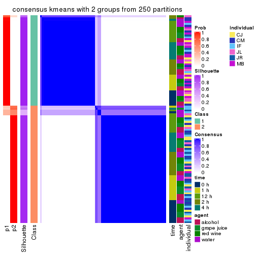</p>

</div>
<div id='tab-CV-kmeans-consensus-heatmap-2'>
<pre><code class="r">consensus_heatmap(res, k = 3)
</code></pre>

<p>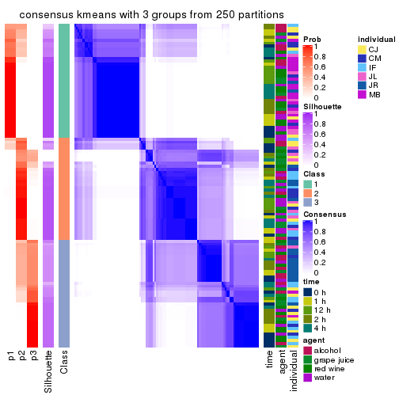</p>

</div>
<div id='tab-CV-kmeans-consensus-heatmap-3'>
<pre><code class="r">consensus_heatmap(res, k = 4)
</code></pre>

<p>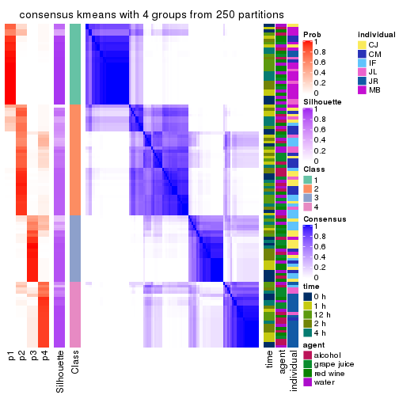</p>

</div>
<div id='tab-CV-kmeans-consensus-heatmap-4'>
<pre><code class="r">consensus_heatmap(res, k = 5)
</code></pre>

<p>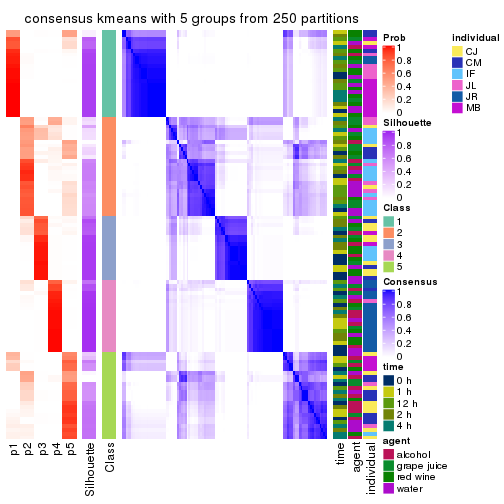</p>

</div>
<div id='tab-CV-kmeans-consensus-heatmap-5'>
<pre><code class="r">consensus_heatmap(res, k = 6)
</code></pre>

<p>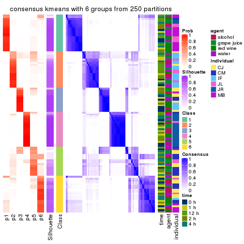</p>

</div>
</div>

Heatmaps for the membership of samples in all partitions to see how consistent they are:


<script>
$( function() {
	$( '#tabs-CV-kmeans-membership-heatmap' ).tabs();
} );
</script>
<div id='tabs-CV-kmeans-membership-heatmap'>
<ul>
<li><a href='#tab-CV-kmeans-membership-heatmap-1'>k = 2</a></li>
<li><a href='#tab-CV-kmeans-membership-heatmap-2'>k = 3</a></li>
<li><a href='#tab-CV-kmeans-membership-heatmap-3'>k = 4</a></li>
<li><a href='#tab-CV-kmeans-membership-heatmap-4'>k = 5</a></li>
<li><a href='#tab-CV-kmeans-membership-heatmap-5'>k = 6</a></li>
</ul>
<div id='tab-CV-kmeans-membership-heatmap-1'>
<pre><code class="r">membership_heatmap(res, k = 2)
</code></pre>

<p>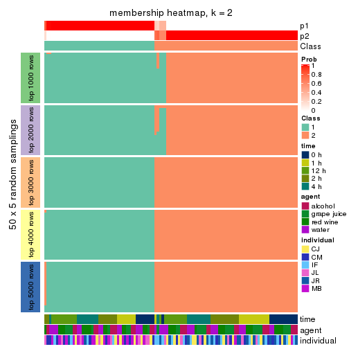</p>

</div>
<div id='tab-CV-kmeans-membership-heatmap-2'>
<pre><code class="r">membership_heatmap(res, k = 3)
</code></pre>

<p>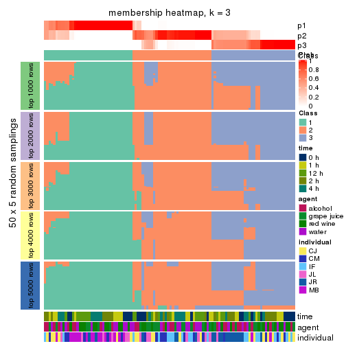</p>

</div>
<div id='tab-CV-kmeans-membership-heatmap-3'>
<pre><code class="r">membership_heatmap(res, k = 4)
</code></pre>

<p>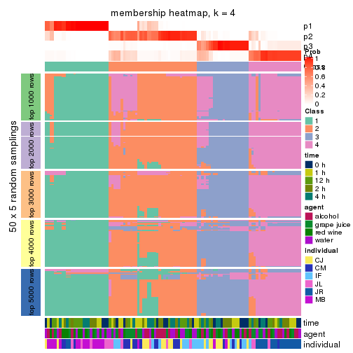</p>

</div>
<div id='tab-CV-kmeans-membership-heatmap-4'>
<pre><code class="r">membership_heatmap(res, k = 5)
</code></pre>

<p>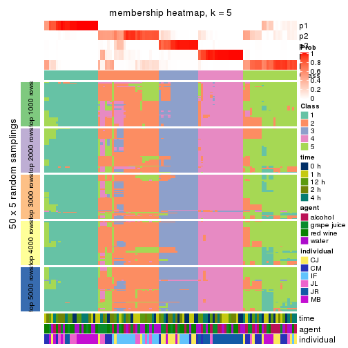</p>

</div>
<div id='tab-CV-kmeans-membership-heatmap-5'>
<pre><code class="r">membership_heatmap(res, k = 6)
</code></pre>

<p>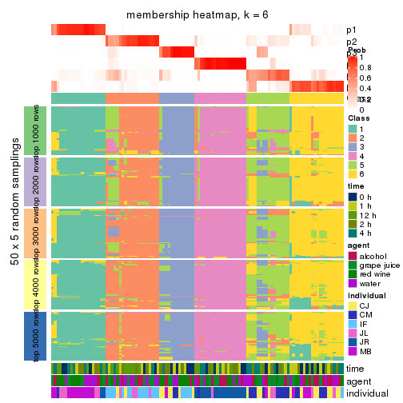</p>

</div>
</div>

As soon as we have had the classes for columns, we can look for signatures
which are significantly different between classes which can be candidate marks
for certain classes. Following are the heatmaps for signatures.


Signature heatmaps where rows are scaled:


<script>
$( function() {
	$( '#tabs-CV-kmeans-get-signatures' ).tabs();
} );
</script>
<div id='tabs-CV-kmeans-get-signatures'>
<ul>
<li><a href='#tab-CV-kmeans-get-signatures-1'>k = 2</a></li>
<li><a href='#tab-CV-kmeans-get-signatures-2'>k = 3</a></li>
<li><a href='#tab-CV-kmeans-get-signatures-3'>k = 4</a></li>
<li><a href='#tab-CV-kmeans-get-signatures-4'>k = 5</a></li>
<li><a href='#tab-CV-kmeans-get-signatures-5'>k = 6</a></li>
</ul>
<div id='tab-CV-kmeans-get-signatures-1'>
<pre><code class="r">get_signatures(res, k = 2)
</code></pre>

<p>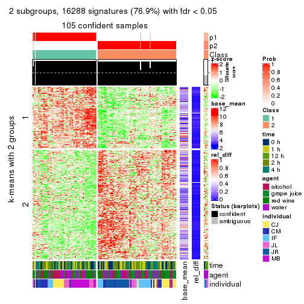</p>

</div>
<div id='tab-CV-kmeans-get-signatures-2'>
<pre><code class="r">get_signatures(res, k = 3)
</code></pre>

<p>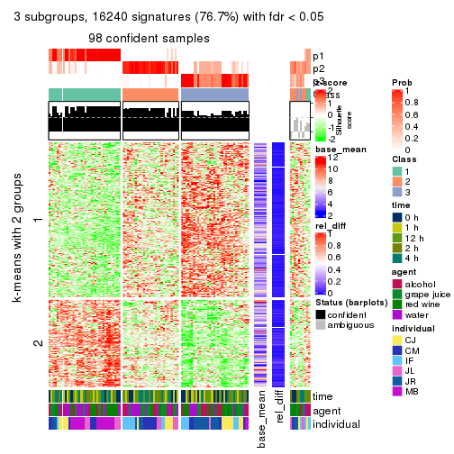</p>

</div>
<div id='tab-CV-kmeans-get-signatures-3'>
<pre><code class="r">get_signatures(res, k = 4)
</code></pre>

<p>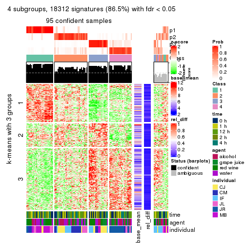</p>

</div>
<div id='tab-CV-kmeans-get-signatures-4'>
<pre><code class="r">get_signatures(res, k = 5)
</code></pre>

<p>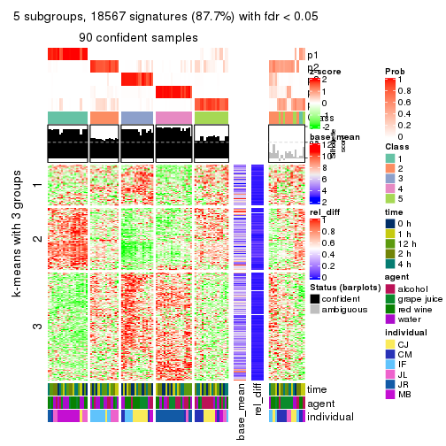</p>

</div>
<div id='tab-CV-kmeans-get-signatures-5'>
<pre><code class="r">get_signatures(res, k = 6)
</code></pre>

<p>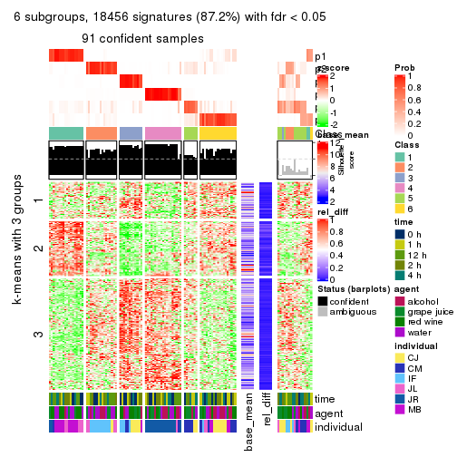</p>

</div>
</div>


Signature heatmaps where rows are not scaled:


<script>
$( function() {
	$( '#tabs-CV-kmeans-get-signatures-no-scale' ).tabs();
} );
</script>
<div id='tabs-CV-kmeans-get-signatures-no-scale'>
<ul>
<li><a href='#tab-CV-kmeans-get-signatures-no-scale-1'>k = 2</a></li>
<li><a href='#tab-CV-kmeans-get-signatures-no-scale-2'>k = 3</a></li>
<li><a href='#tab-CV-kmeans-get-signatures-no-scale-3'>k = 4</a></li>
<li><a href='#tab-CV-kmeans-get-signatures-no-scale-4'>k = 5</a></li>
<li><a href='#tab-CV-kmeans-get-signatures-no-scale-5'>k = 6</a></li>
</ul>
<div id='tab-CV-kmeans-get-signatures-no-scale-1'>
<pre><code class="r">get_signatures(res, k = 2, scale_rows = FALSE)
</code></pre>

<p>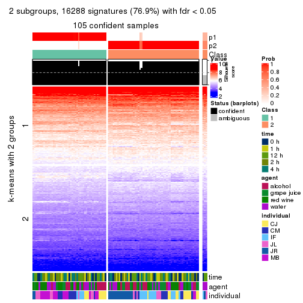</p>

</div>
<div id='tab-CV-kmeans-get-signatures-no-scale-2'>
<pre><code class="r">get_signatures(res, k = 3, scale_rows = FALSE)
</code></pre>

<p>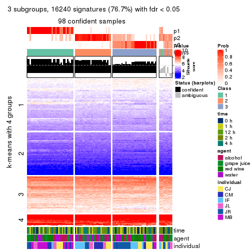</p>

</div>
<div id='tab-CV-kmeans-get-signatures-no-scale-3'>
<pre><code class="r">get_signatures(res, k = 4, scale_rows = FALSE)
</code></pre>

<p>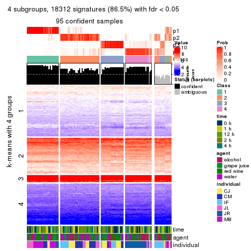</p>

</div>
<div id='tab-CV-kmeans-get-signatures-no-scale-4'>
<pre><code class="r">get_signatures(res, k = 5, scale_rows = FALSE)
</code></pre>

<p>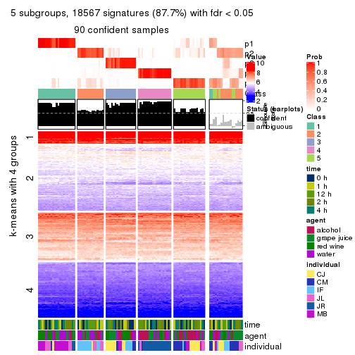</p>

</div>
<div id='tab-CV-kmeans-get-signatures-no-scale-5'>
<pre><code class="r">get_signatures(res, k = 6, scale_rows = FALSE)
</code></pre>

<p>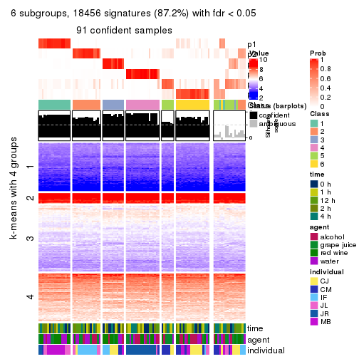</p>

</div>
</div>


Compare the overlap of signatures from different k:

```r
compare_signatures(res)
```

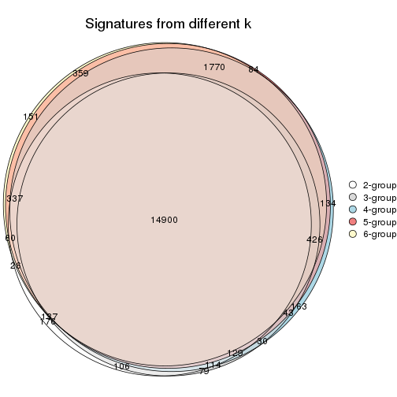

`get_signature()` returns a data frame invisibly. TO get the list of signatures, the function
call should be assigned to a variable explicitly. In following code, if `plot` argument is set
to `FALSE`, no heatmap is plotted while only the differential analysis is performed.

```r
# code only for demonstration
tb = get_signature(res, k = ..., plot = FALSE)
```

An example of the output of `tb` is:

```
#>   which_row         fdr    mean_1    mean_2 scaled_mean_1 scaled_mean_2 km
#> 1        38 0.042760348  8.373488  9.131774    -0.5533452     0.5164555  1
#> 2        40 0.018707592  7.106213  8.469186    -0.6173731     0.5762149  1
#> 3        55 0.019134737 10.221463 11.207825    -0.6159697     0.5749050  1
#> 4        59 0.006059896  5.921854  7.869574    -0.6899429     0.6439467  1
#> 5        60 0.018055526  8.928898 10.211722    -0.6204761     0.5791110  1
#> 6        98 0.009384629 15.714769 14.887706     0.6635654    -0.6193277  2
...
```

The columns in `tb` are:

1. `which_row`: row indices corresponding to the input matrix.
2. `fdr`: FDR for the differential test. 
3. `mean_x`: The mean value in group x.
4. `scaled_mean_x`: The mean value in group x after rows are scaled.
5. `km`: Row groups if k-means clustering is applied to rows.


UMAP plot which shows how samples are separated.


<script>
$( function() {
	$( '#tabs-CV-kmeans-dimension-reduction' ).tabs();
} );
</script>
<div id='tabs-CV-kmeans-dimension-reduction'>
<ul>
<li><a href='#tab-CV-kmeans-dimension-reduction-1'>k = 2</a></li>
<li><a href='#tab-CV-kmeans-dimension-reduction-2'>k = 3</a></li>
<li><a href='#tab-CV-kmeans-dimension-reduction-3'>k = 4</a></li>
<li><a href='#tab-CV-kmeans-dimension-reduction-4'>k = 5</a></li>
<li><a href='#tab-CV-kmeans-dimension-reduction-5'>k = 6</a></li>
</ul>
<div id='tab-CV-kmeans-dimension-reduction-1'>
<pre><code class="r">dimension_reduction(res, k = 2, method = &quot;UMAP&quot;)
</code></pre>

<p>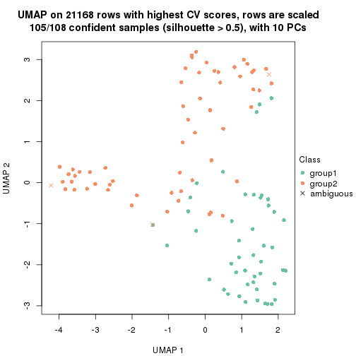</p>

</div>
<div id='tab-CV-kmeans-dimension-reduction-2'>
<pre><code class="r">dimension_reduction(res, k = 3, method = &quot;UMAP&quot;)
</code></pre>

<p>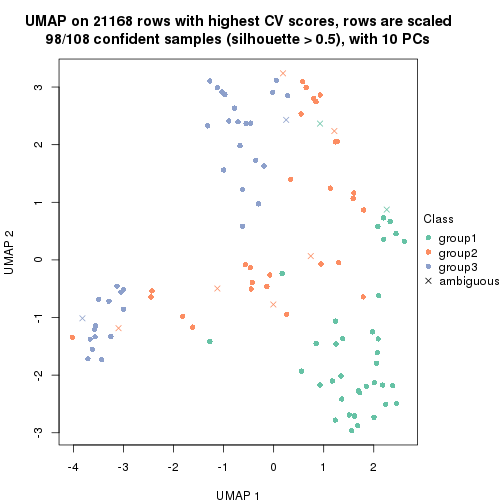</p>

</div>
<div id='tab-CV-kmeans-dimension-reduction-3'>
<pre><code class="r">dimension_reduction(res, k = 4, method = &quot;UMAP&quot;)
</code></pre>

<p>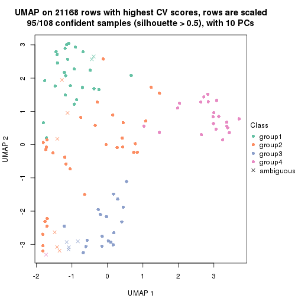</p>

</div>
<div id='tab-CV-kmeans-dimension-reduction-4'>
<pre><code class="r">dimension_reduction(res, k = 5, method = &quot;UMAP&quot;)
</code></pre>

<p>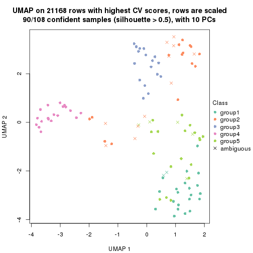</p>

</div>
<div id='tab-CV-kmeans-dimension-reduction-5'>
<pre><code class="r">dimension_reduction(res, k = 6, method = &quot;UMAP&quot;)
</code></pre>

<p>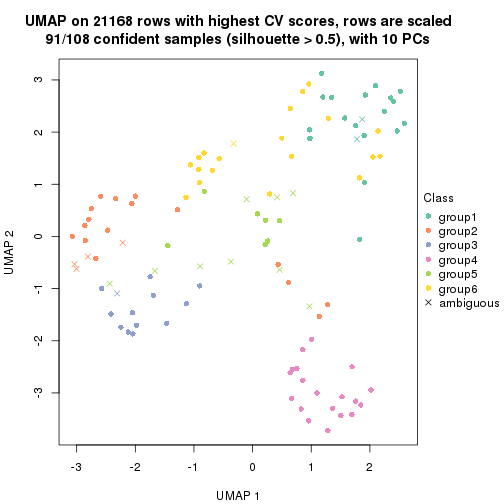</p>

</div>
</div>


Following heatmap shows how subgroups are split when increasing `k`:

```r
collect_classes(res)
```

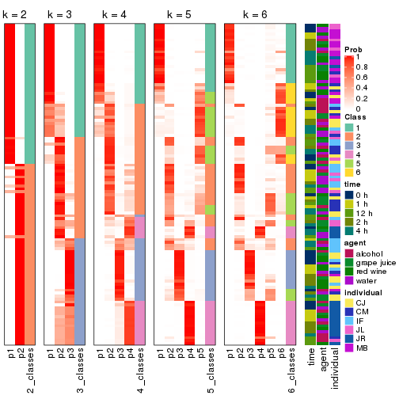


Test correlation between subgroups and known annotations. If the known
annotation is numeric, one-way ANOVA test is applied, and if the known
annotation is discrete, chi-squared contingency table test is applied.

```r
test_to_known_factors(res)
```

```
#>             n time(p) agent(p) individual(p) k
#> CV:kmeans 105   0.785    0.429      3.67e-05 2
#> CV:kmeans  98   0.785    0.146      2.77e-06 3
#> CV:kmeans  95   0.957    0.410      2.13e-17 4
#> CV:kmeans  90   0.865    0.256      1.55e-20 5
#> CV:kmeans  91   0.941    0.111      1.18e-21 6
```


If matrix rows can be associated to genes, consider to use `GO_Enrichment(res,
...)` to perform function enrichment for the signature genes.


 

---------------------------------------------------


### CV:skmeans*


The object with results only for a single top-value method and a single partition method 
can be extracted as:

```r
res = res_list["CV", "skmeans"]
# you can also extract it by
# res = res_list["CV:skmeans"]
```

A summary of `res` and all the functions that can be applied to it:

```r
res
```

```
#> A 'ConsensusPartition' object with k = 2, 3, 4, 5, 6.
#>   On a matrix with 21168 rows and 108 columns.
#>   Top rows (1000, 2000, 3000, 4000, 5000) are extracted by 'CV' method.
#>   Subgroups are detected by 'skmeans' method.
#>   Performed in total 1250 partitions by row resampling.
#>   Best k for subgroups seems to be 3.
#> 
#> Following methods can be applied to this 'ConsensusPartition' object:
#>  [1] "cola_report"             "collect_classes"         "collect_plots"          
#>  [4] "collect_stats"           "colnames"                "compare_signatures"     
#>  [7] "consensus_heatmap"       "dimension_reduction"     "functional_enrichment"  
#> [10] "get_anno_col"            "get_anno"                "get_classes"            
#> [13] "get_consensus"           "get_matrix"              "get_membership"         
#> [16] "get_param"               "get_signatures"          "get_stats"              
#> [19] "is_best_k"               "is_stable_k"             "membership_heatmap"     
#> [22] "ncol"                    "nrow"                    "plot_ecdf"              
#> [25] "rownames"                "select_partition_number" "show"                   
#> [28] "suggest_best_k"          "test_to_known_factors"
```

`collect_plots()` function collects all the plots made from `res` for all `k` (number of partitions)
into one single page to provide an easy and fast comparison between different `k`.

```r
collect_plots(res)
```

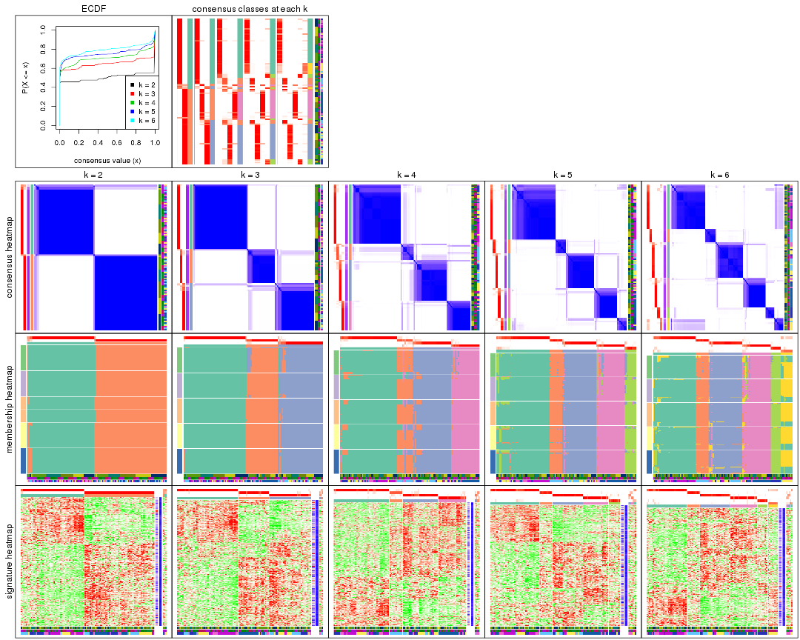

The plots are:

- The first row: a plot of the ECDF (Empirical cumulative distribution
  function) curves of the consensus matrix for each `k` and the heatmap of
  predicted classes for each `k`.
- The second row: heatmaps of the consensus matrix for each `k`.
- The third row: heatmaps of the membership matrix for each `k`.
- The fouth row: heatmaps of the signatures for each `k`.

All the plots in panels can be made by individual functions and they are
plotted later in this section.

`select_partition_number()` produces several plots showing different
statistics for choosing "optimized" `k`. There are following statistics:

- ECDF curves of the consensus matrix for each `k`;
- 1-PAC. [The PAC
  score](https://en.wikipedia.org/wiki/Consensus_clustering#Over-interpretation_potential_of_consensus_clustering)
  measures the proportion of the ambiguous subgrouping.
- Mean silhouette score.
- Concordance. The mean probability of fiting the consensus class ids in all
  partitions.
- Area increased. Denote $A_k$ as the area under the ECDF curve for current
  `k`, the area increased is defined as $A_k - A_{k-1}$.
- Rand index. The percent of pairs of samples that are both in a same cluster
  or both are not in a same cluster in the partition of k and k-1.
- Jaccard index. The ratio of pairs of samples are both in a same cluster in
  the partition of k and k-1 and the pairs of samples are both in a same
  cluster in the partition k or k-1.

The detailed explanations of these statistics can be found in [the cola
vignette](http://bioconductor.org/packages/devel/bioc/vignettes/cola/inst/doc/cola.html#toc_13).

Generally speaking, lower PAC score, higher mean silhouette score or higher
concordance corresponds to better partition. Rand index and Jaccard index
measure how similar the current partition is compared to partition with `k-1`.
If they are too similar, we won't accept `k` is better than `k-1`.

```r
select_partition_number(res)
```

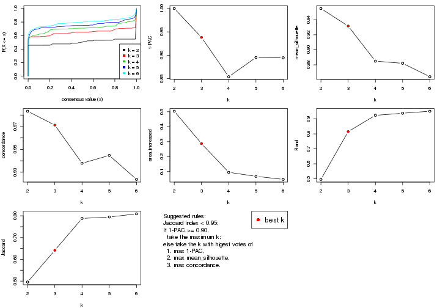

The numeric values for all these statistics can be obtained by `get_stats()`.

```r
get_stats(res)
```

```
#>   k 1-PAC mean_silhouette concordance area_increased  Rand Jaccard
#> 2 2 1.000           0.955       0.983         0.5035 0.496   0.496
#> 3 3 0.938           0.932       0.971         0.2872 0.815   0.642
#> 4 4 0.854           0.885       0.938         0.0953 0.924   0.788
#> 5 5 0.895           0.882       0.945         0.0683 0.938   0.795
#> 6 6 0.895           0.864       0.924         0.0480 0.952   0.809
```

`suggest_best_k()` suggests the best $k$ based on these statistics. The rules are as follows:

- All $k$ with Jaccard index larger than 0.95 are removed because the increase of
  the partition number does not provides enough extra information. If all $k$ are removed,
  the best $k$ is assigned by `NA`.
- For $k$ with 1-PAC larger than 0.9, the maximal $k$ is taken as the "best k". Other $k$ is called "optional k".
- If it does not fit the second rule. The $k$ with the highest vote of highest
  1-PAC, mean silhouette and concordance is taken as the "best k".

```r
suggest_best_k(res)
```

```
#> [1] 3
#> attr(,"optional")
#> [1] 2
```

There is also optional best $k$ = 2 that is worth to check.

Following shows the table of the partitions (You need to click the **show/hide
code output** link to see it). The membership matrix (columns with name `p*`)
is inferred by
[`clue::cl_consensus()`](https://www.rdocumentation.org/link/cl_consensus?package=clue)
function with the `SE` method. Basically the value in the membership matrix
represents the probability to belong to a certain group. The finall class
label for an item is determined with the group with highest probability it
belongs to.

In `get_classes()` function, the entropy is calculated from the membership
matrix and the silhouette score is calculated from the consensus matrix.


<script>
$( function() {
	$( '#tabs-CV-skmeans-get-classes' ).tabs();
} );
</script>
<div id='tabs-CV-skmeans-get-classes'>
<ul>
<li><a href='#tab-CV-skmeans-get-classes-1'>k = 2</a></li>
<li><a href='#tab-CV-skmeans-get-classes-2'>k = 3</a></li>
<li><a href='#tab-CV-skmeans-get-classes-3'>k = 4</a></li>
<li><a href='#tab-CV-skmeans-get-classes-4'>k = 5</a></li>
<li><a href='#tab-CV-skmeans-get-classes-5'>k = 6</a></li>
</ul>

<div id='tab-CV-skmeans-get-classes-1'>
<p><a id='tab-CV-skmeans-get-classes-1-a' style='color:#0366d6' href='#'>show/hide code output</a></p>
<pre><code class="r">cbind(get_classes(res, k = 2), get_membership(res, k = 2))
</code></pre>

<pre><code>#&gt;          class entropy silhouette    p1    p2
#&gt; GSM87863     1  0.0000     0.9739 1.000 0.000
#&gt; GSM87887     1  0.0000     0.9739 1.000 0.000
#&gt; GSM87896     2  0.0000     0.9905 0.000 1.000
#&gt; GSM87934     2  0.0000     0.9905 0.000 1.000
#&gt; GSM87943     2  0.0000     0.9905 0.000 1.000
#&gt; GSM87853     2  0.0000     0.9905 0.000 1.000
#&gt; GSM87906     2  0.0000     0.9905 0.000 1.000
#&gt; GSM87920     1  0.0000     0.9739 1.000 0.000
#&gt; GSM87924     2  0.0000     0.9905 0.000 1.000
#&gt; GSM87858     2  0.0000     0.9905 0.000 1.000
#&gt; GSM87882     2  0.0000     0.9905 0.000 1.000
#&gt; GSM87891     2  0.0000     0.9905 0.000 1.000
#&gt; GSM87917     1  0.0000     0.9739 1.000 0.000
#&gt; GSM87929     2  0.0000     0.9905 0.000 1.000
#&gt; GSM87948     1  0.0000     0.9739 1.000 0.000
#&gt; GSM87868     1  0.0000     0.9739 1.000 0.000
#&gt; GSM87873     2  0.0000     0.9905 0.000 1.000
#&gt; GSM87901     1  0.7453     0.7283 0.788 0.212
#&gt; GSM87910     1  0.0000     0.9739 1.000 0.000
#&gt; GSM87938     2  0.0000     0.9905 0.000 1.000
#&gt; GSM87953     1  0.0000     0.9739 1.000 0.000
#&gt; GSM87864     1  0.0000     0.9739 1.000 0.000
#&gt; GSM87888     2  0.0000     0.9905 0.000 1.000
#&gt; GSM87897     2  0.0000     0.9905 0.000 1.000
#&gt; GSM87935     2  0.0000     0.9905 0.000 1.000
#&gt; GSM87944     1  0.0000     0.9739 1.000 0.000
#&gt; GSM87854     2  0.0000     0.9905 0.000 1.000
#&gt; GSM87878     1  0.0000     0.9739 1.000 0.000
#&gt; GSM87907     2  0.0000     0.9905 0.000 1.000
#&gt; GSM87921     2  0.0000     0.9905 0.000 1.000
#&gt; GSM87925     2  0.0000     0.9905 0.000 1.000
#&gt; GSM87957     1  0.0000     0.9739 1.000 0.000
#&gt; GSM87859     2  0.0000     0.9905 0.000 1.000
#&gt; GSM87883     1  0.0000     0.9739 1.000 0.000
#&gt; GSM87892     2  0.0000     0.9905 0.000 1.000
#&gt; GSM87930     2  0.0000     0.9905 0.000 1.000
#&gt; GSM87949     1  0.0000     0.9739 1.000 0.000
#&gt; GSM87869     1  0.0000     0.9739 1.000 0.000
#&gt; GSM87874     2  0.0000     0.9905 0.000 1.000
#&gt; GSM87902     1  0.7602     0.7162 0.780 0.220
#&gt; GSM87911     2  0.0672     0.9824 0.008 0.992
#&gt; GSM87939     2  0.0000     0.9905 0.000 1.000
#&gt; GSM87954     1  0.0000     0.9739 1.000 0.000
#&gt; GSM87865     1  0.0000     0.9739 1.000 0.000
#&gt; GSM87889     1  0.0000     0.9739 1.000 0.000
#&gt; GSM87898     1  0.0000     0.9739 1.000 0.000
#&gt; GSM87915     1  0.0000     0.9739 1.000 0.000
#&gt; GSM87936     2  0.0000     0.9905 0.000 1.000
#&gt; GSM87945     2  0.0000     0.9905 0.000 1.000
#&gt; GSM87855     2  0.0000     0.9905 0.000 1.000
#&gt; GSM87879     2  0.0000     0.9905 0.000 1.000
#&gt; GSM87922     2  0.0000     0.9905 0.000 1.000
#&gt; GSM87926     2  0.0000     0.9905 0.000 1.000
#&gt; GSM87958     1  0.0000     0.9739 1.000 0.000
#&gt; GSM87860     2  0.0000     0.9905 0.000 1.000
#&gt; GSM87884     1  0.0000     0.9739 1.000 0.000
#&gt; GSM87893     2  0.0000     0.9905 0.000 1.000
#&gt; GSM87918     1  0.0000     0.9739 1.000 0.000
#&gt; GSM87931     2  0.0000     0.9905 0.000 1.000
#&gt; GSM87950     1  0.0000     0.9739 1.000 0.000
#&gt; GSM87870     1  0.0000     0.9739 1.000 0.000
#&gt; GSM87875     2  0.0000     0.9905 0.000 1.000
#&gt; GSM87903     2  0.0000     0.9905 0.000 1.000
#&gt; GSM87912     1  0.0000     0.9739 1.000 0.000
#&gt; GSM87940     2  0.0000     0.9905 0.000 1.000
#&gt; GSM87866     1  0.0000     0.9739 1.000 0.000
#&gt; GSM87899     2  0.0000     0.9905 0.000 1.000
#&gt; GSM87937     2  0.0000     0.9905 0.000 1.000
#&gt; GSM87946     1  0.0000     0.9739 1.000 0.000
#&gt; GSM87856     2  0.0000     0.9905 0.000 1.000
#&gt; GSM87880     2  0.0000     0.9905 0.000 1.000
#&gt; GSM87908     1  0.0000     0.9739 1.000 0.000
#&gt; GSM87923     2  0.0000     0.9905 0.000 1.000
#&gt; GSM87927     2  0.0000     0.9905 0.000 1.000
#&gt; GSM87959     1  0.0000     0.9739 1.000 0.000
#&gt; GSM87861     2  0.0000     0.9905 0.000 1.000
#&gt; GSM87885     1  0.0000     0.9739 1.000 0.000
#&gt; GSM87894     1  0.0000     0.9739 1.000 0.000
#&gt; GSM87932     1  0.0000     0.9739 1.000 0.000
#&gt; GSM87951     1  0.0000     0.9739 1.000 0.000
#&gt; GSM87871     1  0.9732     0.3236 0.596 0.404
#&gt; GSM87876     1  0.0000     0.9739 1.000 0.000
#&gt; GSM87904     2  0.0000     0.9905 0.000 1.000
#&gt; GSM87913     1  0.0000     0.9739 1.000 0.000
#&gt; GSM87941     2  0.0000     0.9905 0.000 1.000
#&gt; GSM87955     1  0.0000     0.9739 1.000 0.000
#&gt; GSM87867     1  0.0000     0.9739 1.000 0.000
#&gt; GSM87890     2  0.0000     0.9905 0.000 1.000
#&gt; GSM87900     2  0.0000     0.9905 0.000 1.000
#&gt; GSM87916     2  0.0000     0.9905 0.000 1.000
#&gt; GSM87947     1  0.0000     0.9739 1.000 0.000
#&gt; GSM87857     2  0.0000     0.9905 0.000 1.000
#&gt; GSM87881     2  0.0000     0.9905 0.000 1.000
#&gt; GSM87909     1  0.0000     0.9739 1.000 0.000
#&gt; GSM87928     1  0.0000     0.9739 1.000 0.000
#&gt; GSM87960     1  0.0000     0.9739 1.000 0.000
#&gt; GSM87862     2  0.0000     0.9905 0.000 1.000
#&gt; GSM87886     1  0.0000     0.9739 1.000 0.000
#&gt; GSM87895     2  0.0000     0.9905 0.000 1.000
#&gt; GSM87919     1  0.0000     0.9739 1.000 0.000
#&gt; GSM87933     2  0.0000     0.9905 0.000 1.000
#&gt; GSM87952     1  0.0000     0.9739 1.000 0.000
#&gt; GSM87872     2  0.0000     0.9905 0.000 1.000
#&gt; GSM87877     1  0.0000     0.9739 1.000 0.000
#&gt; GSM87905     1  0.0000     0.9739 1.000 0.000
#&gt; GSM87914     1  0.9954     0.1644 0.540 0.460
#&gt; GSM87942     2  0.9998    -0.0226 0.492 0.508
#&gt; GSM87956     1  0.0000     0.9739 1.000 0.000
</code></pre>

<script>
$('#tab-CV-skmeans-get-classes-1-a').parent().next().next().hide();
$('#tab-CV-skmeans-get-classes-1-a').click(function(){
  $('#tab-CV-skmeans-get-classes-1-a').parent().next().next().toggle();
  return(false);
});
</script>
</div>

<div id='tab-CV-skmeans-get-classes-2'>
<p><a id='tab-CV-skmeans-get-classes-2-a' style='color:#0366d6' href='#'>show/hide code output</a></p>
<pre><code class="r">cbind(get_classes(res, k = 3), get_membership(res, k = 3))
</code></pre>

<pre><code>#&gt;          class entropy silhouette    p1    p2    p3
#&gt; GSM87863     1  0.0000      0.995 1.000 0.000 0.000
#&gt; GSM87887     1  0.0000      0.995 1.000 0.000 0.000
#&gt; GSM87896     3  0.0000      0.945 0.000 0.000 1.000
#&gt; GSM87934     2  0.0237      0.946 0.000 0.996 0.004
#&gt; GSM87943     3  0.0000      0.945 0.000 0.000 1.000
#&gt; GSM87853     3  0.0000      0.945 0.000 0.000 1.000
#&gt; GSM87906     3  0.4887      0.708 0.000 0.228 0.772
#&gt; GSM87920     1  0.0000      0.995 1.000 0.000 0.000
#&gt; GSM87924     2  0.4555      0.759 0.000 0.800 0.200
#&gt; GSM87858     3  0.0000      0.945 0.000 0.000 1.000
#&gt; GSM87882     3  0.0000      0.945 0.000 0.000 1.000
#&gt; GSM87891     3  0.0000      0.945 0.000 0.000 1.000
#&gt; GSM87917     1  0.0000      0.995 1.000 0.000 0.000
#&gt; GSM87929     2  0.0000      0.944 0.000 1.000 0.000
#&gt; GSM87948     1  0.0000      0.995 1.000 0.000 0.000
#&gt; GSM87868     1  0.0000      0.995 1.000 0.000 0.000
#&gt; GSM87873     3  0.0000      0.945 0.000 0.000 1.000
#&gt; GSM87901     2  0.6140      0.324 0.404 0.596 0.000
#&gt; GSM87910     1  0.0000      0.995 1.000 0.000 0.000
#&gt; GSM87938     2  0.0237      0.946 0.000 0.996 0.004
#&gt; GSM87953     1  0.0000      0.995 1.000 0.000 0.000
#&gt; GSM87864     1  0.0000      0.995 1.000 0.000 0.000
#&gt; GSM87888     3  0.0000      0.945 0.000 0.000 1.000
#&gt; GSM87897     3  0.4121      0.785 0.000 0.168 0.832
#&gt; GSM87935     2  0.0237      0.946 0.000 0.996 0.004
#&gt; GSM87944     1  0.0000      0.995 1.000 0.000 0.000
#&gt; GSM87854     3  0.0000      0.945 0.000 0.000 1.000
#&gt; GSM87878     1  0.0000      0.995 1.000 0.000 0.000
#&gt; GSM87907     3  0.0000      0.945 0.000 0.000 1.000
#&gt; GSM87921     2  0.0000      0.944 0.000 1.000 0.000
#&gt; GSM87925     2  0.0237      0.946 0.000 0.996 0.004
#&gt; GSM87957     1  0.0000      0.995 1.000 0.000 0.000
#&gt; GSM87859     3  0.0000      0.945 0.000 0.000 1.000
#&gt; GSM87883     1  0.0000      0.995 1.000 0.000 0.000
#&gt; GSM87892     3  0.0000      0.945 0.000 0.000 1.000
#&gt; GSM87930     2  0.0237      0.946 0.000 0.996 0.004
#&gt; GSM87949     1  0.0000      0.995 1.000 0.000 0.000
#&gt; GSM87869     1  0.0000      0.995 1.000 0.000 0.000
#&gt; GSM87874     3  0.0000      0.945 0.000 0.000 1.000
#&gt; GSM87902     3  0.6529      0.407 0.368 0.012 0.620
#&gt; GSM87911     3  0.4974      0.696 0.000 0.236 0.764
#&gt; GSM87939     2  0.0237      0.946 0.000 0.996 0.004
#&gt; GSM87954     1  0.0000      0.995 1.000 0.000 0.000
#&gt; GSM87865     1  0.0000      0.995 1.000 0.000 0.000
#&gt; GSM87889     1  0.0000      0.995 1.000 0.000 0.000
#&gt; GSM87898     1  0.0000      0.995 1.000 0.000 0.000
#&gt; GSM87915     1  0.0000      0.995 1.000 0.000 0.000
#&gt; GSM87936     2  0.0237      0.946 0.000 0.996 0.004
#&gt; GSM87945     3  0.0000      0.945 0.000 0.000 1.000
#&gt; GSM87855     3  0.0000      0.945 0.000 0.000 1.000
#&gt; GSM87879     3  0.0000      0.945 0.000 0.000 1.000
#&gt; GSM87922     3  0.6244      0.146 0.000 0.440 0.560
#&gt; GSM87926     2  0.0237      0.946 0.000 0.996 0.004
#&gt; GSM87958     1  0.0000      0.995 1.000 0.000 0.000
#&gt; GSM87860     3  0.0000      0.945 0.000 0.000 1.000
#&gt; GSM87884     1  0.0000      0.995 1.000 0.000 0.000
#&gt; GSM87893     3  0.0000      0.945 0.000 0.000 1.000
#&gt; GSM87918     1  0.4452      0.751 0.808 0.192 0.000
#&gt; GSM87931     2  0.0237      0.946 0.000 0.996 0.004
#&gt; GSM87950     1  0.0000      0.995 1.000 0.000 0.000
#&gt; GSM87870     1  0.0000      0.995 1.000 0.000 0.000
#&gt; GSM87875     3  0.0000      0.945 0.000 0.000 1.000
#&gt; GSM87903     3  0.0237      0.942 0.000 0.004 0.996
#&gt; GSM87912     1  0.0000      0.995 1.000 0.000 0.000
#&gt; GSM87940     2  0.0237      0.946 0.000 0.996 0.004
#&gt; GSM87866     1  0.0000      0.995 1.000 0.000 0.000
#&gt; GSM87899     3  0.0000      0.945 0.000 0.000 1.000
#&gt; GSM87937     2  0.0237      0.946 0.000 0.996 0.004
#&gt; GSM87946     1  0.0000      0.995 1.000 0.000 0.000
#&gt; GSM87856     3  0.0000      0.945 0.000 0.000 1.000
#&gt; GSM87880     3  0.0000      0.945 0.000 0.000 1.000
#&gt; GSM87908     1  0.1399      0.963 0.968 0.004 0.028
#&gt; GSM87923     3  0.0000      0.945 0.000 0.000 1.000
#&gt; GSM87927     2  0.0237      0.946 0.000 0.996 0.004
#&gt; GSM87959     1  0.0000      0.995 1.000 0.000 0.000
#&gt; GSM87861     3  0.0000      0.945 0.000 0.000 1.000
#&gt; GSM87885     1  0.0000      0.995 1.000 0.000 0.000
#&gt; GSM87894     1  0.0000      0.995 1.000 0.000 0.000
#&gt; GSM87932     1  0.0000      0.995 1.000 0.000 0.000
#&gt; GSM87951     1  0.0000      0.995 1.000 0.000 0.000
#&gt; GSM87871     3  0.4605      0.707 0.204 0.000 0.796
#&gt; GSM87876     1  0.0000      0.995 1.000 0.000 0.000
#&gt; GSM87904     3  0.0000      0.945 0.000 0.000 1.000
#&gt; GSM87913     1  0.0000      0.995 1.000 0.000 0.000
#&gt; GSM87941     2  0.0000      0.944 0.000 1.000 0.000
#&gt; GSM87955     1  0.0000      0.995 1.000 0.000 0.000
#&gt; GSM87867     1  0.0000      0.995 1.000 0.000 0.000
#&gt; GSM87890     2  0.4842      0.727 0.000 0.776 0.224
#&gt; GSM87900     2  0.0000      0.944 0.000 1.000 0.000
#&gt; GSM87916     2  0.0237      0.946 0.000 0.996 0.004
#&gt; GSM87947     1  0.0000      0.995 1.000 0.000 0.000
#&gt; GSM87857     3  0.0000      0.945 0.000 0.000 1.000
#&gt; GSM87881     2  0.4842      0.727 0.000 0.776 0.224
#&gt; GSM87909     1  0.0237      0.992 0.996 0.004 0.000
#&gt; GSM87928     1  0.0000      0.995 1.000 0.000 0.000
#&gt; GSM87960     1  0.0000      0.995 1.000 0.000 0.000
#&gt; GSM87862     3  0.0000      0.945 0.000 0.000 1.000
#&gt; GSM87886     1  0.0000      0.995 1.000 0.000 0.000
#&gt; GSM87895     3  0.0000      0.945 0.000 0.000 1.000
#&gt; GSM87919     1  0.0000      0.995 1.000 0.000 0.000
#&gt; GSM87933     2  0.0237      0.946 0.000 0.996 0.004
#&gt; GSM87952     1  0.0000      0.995 1.000 0.000 0.000
#&gt; GSM87872     2  0.3192      0.856 0.000 0.888 0.112
#&gt; GSM87877     1  0.0000      0.995 1.000 0.000 0.000
#&gt; GSM87905     1  0.0237      0.992 0.996 0.004 0.000
#&gt; GSM87914     2  0.0000      0.944 0.000 1.000 0.000
#&gt; GSM87942     2  0.0000      0.944 0.000 1.000 0.000
#&gt; GSM87956     1  0.0000      0.995 1.000 0.000 0.000
</code></pre>

<script>
$('#tab-CV-skmeans-get-classes-2-a').parent().next().next().hide();
$('#tab-CV-skmeans-get-classes-2-a').click(function(){
  $('#tab-CV-skmeans-get-classes-2-a').parent().next().next().toggle();
  return(false);
});
</script>
</div>

<div id='tab-CV-skmeans-get-classes-3'>
<p><a id='tab-CV-skmeans-get-classes-3-a' style='color:#0366d6' href='#'>show/hide code output</a></p>
<pre><code class="r">cbind(get_classes(res, k = 4), get_membership(res, k = 4))
</code></pre>

<pre><code>#&gt;          class entropy silhouette    p1    p2    p3    p4
#&gt; GSM87863     1  0.0707      0.959 0.980 0.020 0.000 0.000
#&gt; GSM87887     1  0.2469      0.883 0.892 0.108 0.000 0.000
#&gt; GSM87896     3  0.0336      0.926 0.000 0.008 0.992 0.000
#&gt; GSM87934     4  0.0000      0.948 0.000 0.000 0.000 1.000
#&gt; GSM87943     3  0.0000      0.928 0.000 0.000 1.000 0.000
#&gt; GSM87853     3  0.0000      0.928 0.000 0.000 1.000 0.000
#&gt; GSM87906     2  0.3626      0.761 0.000 0.812 0.184 0.004
#&gt; GSM87920     1  0.0188      0.969 0.996 0.004 0.000 0.000
#&gt; GSM87924     4  0.2345      0.847 0.000 0.000 0.100 0.900
#&gt; GSM87858     3  0.0188      0.927 0.000 0.004 0.996 0.000
#&gt; GSM87882     3  0.3219      0.803 0.000 0.164 0.836 0.000
#&gt; GSM87891     3  0.0336      0.926 0.000 0.008 0.992 0.000
#&gt; GSM87917     1  0.0188      0.969 0.996 0.004 0.000 0.000
#&gt; GSM87929     4  0.0000      0.948 0.000 0.000 0.000 1.000
#&gt; GSM87948     1  0.0000      0.971 1.000 0.000 0.000 0.000
#&gt; GSM87868     1  0.0188      0.970 0.996 0.004 0.000 0.000
#&gt; GSM87873     3  0.0000      0.928 0.000 0.000 1.000 0.000
#&gt; GSM87901     2  0.4547      0.749 0.056 0.816 0.012 0.116
#&gt; GSM87910     1  0.0000      0.971 1.000 0.000 0.000 0.000
#&gt; GSM87938     4  0.0000      0.948 0.000 0.000 0.000 1.000
#&gt; GSM87953     1  0.0000      0.971 1.000 0.000 0.000 0.000
#&gt; GSM87864     1  0.0336      0.968 0.992 0.008 0.000 0.000
#&gt; GSM87888     3  0.3400      0.788 0.000 0.180 0.820 0.000
#&gt; GSM87897     2  0.3626      0.761 0.000 0.812 0.184 0.004
#&gt; GSM87935     4  0.0000      0.948 0.000 0.000 0.000 1.000
#&gt; GSM87944     1  0.0000      0.971 1.000 0.000 0.000 0.000
#&gt; GSM87854     3  0.0000      0.928 0.000 0.000 1.000 0.000
#&gt; GSM87878     1  0.2081      0.902 0.916 0.084 0.000 0.000
#&gt; GSM87907     3  0.0336      0.926 0.000 0.008 0.992 0.000
#&gt; GSM87921     2  0.4916      0.313 0.000 0.576 0.000 0.424
#&gt; GSM87925     4  0.0000      0.948 0.000 0.000 0.000 1.000
#&gt; GSM87957     1  0.0000      0.971 1.000 0.000 0.000 0.000
#&gt; GSM87859     3  0.0000      0.928 0.000 0.000 1.000 0.000
#&gt; GSM87883     1  0.0188      0.970 0.996 0.004 0.000 0.000
#&gt; GSM87892     3  0.0336      0.926 0.000 0.008 0.992 0.000
#&gt; GSM87930     4  0.0000      0.948 0.000 0.000 0.000 1.000
#&gt; GSM87949     1  0.0000      0.971 1.000 0.000 0.000 0.000
#&gt; GSM87869     1  0.0000      0.971 1.000 0.000 0.000 0.000
#&gt; GSM87874     3  0.0000      0.928 0.000 0.000 1.000 0.000
#&gt; GSM87902     2  0.4100      0.782 0.036 0.816 0.148 0.000
#&gt; GSM87911     2  0.5888      0.358 0.000 0.540 0.424 0.036
#&gt; GSM87939     4  0.0000      0.948 0.000 0.000 0.000 1.000
#&gt; GSM87954     1  0.0000      0.971 1.000 0.000 0.000 0.000
#&gt; GSM87865     1  0.0188      0.970 0.996 0.004 0.000 0.000
#&gt; GSM87889     1  0.3444      0.801 0.816 0.184 0.000 0.000
#&gt; GSM87898     2  0.3649      0.743 0.204 0.796 0.000 0.000
#&gt; GSM87915     1  0.0188      0.969 0.996 0.004 0.000 0.000
#&gt; GSM87936     4  0.0000      0.948 0.000 0.000 0.000 1.000
#&gt; GSM87945     3  0.0000      0.928 0.000 0.000 1.000 0.000
#&gt; GSM87855     3  0.0000      0.928 0.000 0.000 1.000 0.000
#&gt; GSM87879     3  0.3219      0.803 0.000 0.164 0.836 0.000
#&gt; GSM87922     3  0.4761      0.393 0.000 0.000 0.628 0.372
#&gt; GSM87926     4  0.0000      0.948 0.000 0.000 0.000 1.000
#&gt; GSM87958     1  0.0000      0.971 1.000 0.000 0.000 0.000
#&gt; GSM87860     3  0.0188      0.927 0.000 0.004 0.996 0.000
#&gt; GSM87884     1  0.0188      0.970 0.996 0.004 0.000 0.000
#&gt; GSM87893     3  0.0188      0.927 0.000 0.004 0.996 0.000
#&gt; GSM87918     1  0.5690      0.574 0.708 0.196 0.000 0.096
#&gt; GSM87931     4  0.0000      0.948 0.000 0.000 0.000 1.000
#&gt; GSM87950     1  0.0000      0.971 1.000 0.000 0.000 0.000
#&gt; GSM87870     1  0.0188      0.970 0.996 0.004 0.000 0.000
#&gt; GSM87875     3  0.0188      0.926 0.000 0.004 0.996 0.000
#&gt; GSM87903     2  0.3837      0.725 0.000 0.776 0.224 0.000
#&gt; GSM87912     1  0.0188      0.969 0.996 0.004 0.000 0.000
#&gt; GSM87940     4  0.0000      0.948 0.000 0.000 0.000 1.000
#&gt; GSM87866     1  0.0188      0.970 0.996 0.004 0.000 0.000
#&gt; GSM87899     3  0.4406      0.488 0.000 0.300 0.700 0.000
#&gt; GSM87937     4  0.0000      0.948 0.000 0.000 0.000 1.000
#&gt; GSM87946     1  0.0000      0.971 1.000 0.000 0.000 0.000
#&gt; GSM87856     3  0.0000      0.928 0.000 0.000 1.000 0.000
#&gt; GSM87880     3  0.3400      0.788 0.000 0.180 0.820 0.000
#&gt; GSM87908     2  0.4139      0.780 0.144 0.816 0.040 0.000
#&gt; GSM87923     3  0.0592      0.916 0.000 0.000 0.984 0.016
#&gt; GSM87927     4  0.0000      0.948 0.000 0.000 0.000 1.000
#&gt; GSM87959     1  0.0000      0.971 1.000 0.000 0.000 0.000
#&gt; GSM87861     3  0.0000      0.928 0.000 0.000 1.000 0.000
#&gt; GSM87885     1  0.3444      0.801 0.816 0.184 0.000 0.000
#&gt; GSM87894     1  0.0188      0.970 0.996 0.004 0.000 0.000
#&gt; GSM87932     1  0.0188      0.969 0.996 0.004 0.000 0.000
#&gt; GSM87951     1  0.0000      0.971 1.000 0.000 0.000 0.000
#&gt; GSM87871     3  0.6236      0.561 0.152 0.180 0.668 0.000
#&gt; GSM87876     1  0.3444      0.801 0.816 0.184 0.000 0.000
#&gt; GSM87904     3  0.0336      0.926 0.000 0.008 0.992 0.000
#&gt; GSM87913     1  0.0188      0.969 0.996 0.004 0.000 0.000
#&gt; GSM87941     4  0.0000      0.948 0.000 0.000 0.000 1.000
#&gt; GSM87955     1  0.0000      0.971 1.000 0.000 0.000 0.000
#&gt; GSM87867     1  0.1302      0.941 0.956 0.044 0.000 0.000
#&gt; GSM87890     4  0.4175      0.698 0.000 0.016 0.200 0.784
#&gt; GSM87900     2  0.3725      0.690 0.000 0.812 0.008 0.180
#&gt; GSM87916     4  0.0000      0.948 0.000 0.000 0.000 1.000
#&gt; GSM87947     1  0.0188      0.970 0.996 0.004 0.000 0.000
#&gt; GSM87857     3  0.0000      0.928 0.000 0.000 1.000 0.000
#&gt; GSM87881     4  0.6476      0.553 0.000 0.180 0.176 0.644
#&gt; GSM87909     2  0.3486      0.756 0.188 0.812 0.000 0.000
#&gt; GSM87928     1  0.0188      0.969 0.996 0.004 0.000 0.000
#&gt; GSM87960     1  0.0000      0.971 1.000 0.000 0.000 0.000
#&gt; GSM87862     3  0.0336      0.926 0.000 0.008 0.992 0.000
#&gt; GSM87886     1  0.0000      0.971 1.000 0.000 0.000 0.000
#&gt; GSM87895     3  0.0336      0.926 0.000 0.008 0.992 0.000
#&gt; GSM87919     1  0.0188      0.969 0.996 0.004 0.000 0.000
#&gt; GSM87933     4  0.0000      0.948 0.000 0.000 0.000 1.000
#&gt; GSM87952     1  0.0000      0.971 1.000 0.000 0.000 0.000
#&gt; GSM87872     4  0.2124      0.902 0.000 0.040 0.028 0.932
#&gt; GSM87877     1  0.0817      0.957 0.976 0.024 0.000 0.000
#&gt; GSM87905     2  0.3528      0.753 0.192 0.808 0.000 0.000
#&gt; GSM87914     4  0.3052      0.818 0.004 0.136 0.000 0.860
#&gt; GSM87942     4  0.1389      0.913 0.000 0.048 0.000 0.952
#&gt; GSM87956     1  0.0000      0.971 1.000 0.000 0.000 0.000
</code></pre>

<script>
$('#tab-CV-skmeans-get-classes-3-a').parent().next().next().hide();
$('#tab-CV-skmeans-get-classes-3-a').click(function(){
  $('#tab-CV-skmeans-get-classes-3-a').parent().next().next().toggle();
  return(false);
});
</script>
</div>

<div id='tab-CV-skmeans-get-classes-4'>
<p><a id='tab-CV-skmeans-get-classes-4-a' style='color:#0366d6' href='#'>show/hide code output</a></p>
<pre><code class="r">cbind(get_classes(res, k = 5), get_membership(res, k = 5))
</code></pre>

<pre><code>#&gt;          class entropy silhouette    p1    p2    p3    p4    p5
#&gt; GSM87863     1  0.4380      0.673 0.708 0.032 0.000 0.000 0.260
#&gt; GSM87887     1  0.4114      0.480 0.624 0.000 0.000 0.000 0.376
#&gt; GSM87896     3  0.0162      0.957 0.000 0.004 0.996 0.000 0.000
#&gt; GSM87934     4  0.0000      0.931 0.000 0.000 0.000 1.000 0.000
#&gt; GSM87943     3  0.0000      0.958 0.000 0.000 1.000 0.000 0.000
#&gt; GSM87853     3  0.0000      0.958 0.000 0.000 1.000 0.000 0.000
#&gt; GSM87906     2  0.0880      0.943 0.000 0.968 0.032 0.000 0.000
#&gt; GSM87920     1  0.0324      0.939 0.992 0.004 0.000 0.000 0.004
#&gt; GSM87924     4  0.2471      0.788 0.000 0.000 0.136 0.864 0.000
#&gt; GSM87858     3  0.0000      0.958 0.000 0.000 1.000 0.000 0.000
#&gt; GSM87882     5  0.3999      0.545 0.000 0.000 0.344 0.000 0.656
#&gt; GSM87891     3  0.0162      0.957 0.000 0.004 0.996 0.000 0.000
#&gt; GSM87917     1  0.0162      0.940 0.996 0.000 0.000 0.000 0.004
#&gt; GSM87929     4  0.0000      0.931 0.000 0.000 0.000 1.000 0.000
#&gt; GSM87948     1  0.0000      0.941 1.000 0.000 0.000 0.000 0.000
#&gt; GSM87868     1  0.2300      0.891 0.904 0.024 0.000 0.000 0.072
#&gt; GSM87873     3  0.0000      0.958 0.000 0.000 1.000 0.000 0.000
#&gt; GSM87901     2  0.0740      0.948 0.004 0.980 0.008 0.008 0.000
#&gt; GSM87910     1  0.0162      0.940 0.996 0.000 0.000 0.000 0.004
#&gt; GSM87938     4  0.0000      0.931 0.000 0.000 0.000 1.000 0.000
#&gt; GSM87953     1  0.0000      0.941 1.000 0.000 0.000 0.000 0.000
#&gt; GSM87864     1  0.2932      0.862 0.864 0.032 0.000 0.000 0.104
#&gt; GSM87888     5  0.1478      0.846 0.000 0.000 0.064 0.000 0.936
#&gt; GSM87897     2  0.0880      0.943 0.000 0.968 0.032 0.000 0.000
#&gt; GSM87935     4  0.0000      0.931 0.000 0.000 0.000 1.000 0.000
#&gt; GSM87944     1  0.0000      0.941 1.000 0.000 0.000 0.000 0.000
#&gt; GSM87854     3  0.0566      0.946 0.000 0.012 0.984 0.000 0.004
#&gt; GSM87878     1  0.3774      0.595 0.704 0.000 0.000 0.000 0.296
#&gt; GSM87907     3  0.0162      0.957 0.000 0.004 0.996 0.000 0.000
#&gt; GSM87921     4  0.4101      0.393 0.000 0.372 0.000 0.628 0.000
#&gt; GSM87925     4  0.0000      0.931 0.000 0.000 0.000 1.000 0.000
#&gt; GSM87957     1  0.0000      0.941 1.000 0.000 0.000 0.000 0.000
#&gt; GSM87859     3  0.0000      0.958 0.000 0.000 1.000 0.000 0.000
#&gt; GSM87883     1  0.0404      0.937 0.988 0.000 0.000 0.000 0.012
#&gt; GSM87892     3  0.0162      0.957 0.000 0.004 0.996 0.000 0.000
#&gt; GSM87930     4  0.0000      0.931 0.000 0.000 0.000 1.000 0.000
#&gt; GSM87949     1  0.0000      0.941 1.000 0.000 0.000 0.000 0.000
#&gt; GSM87869     1  0.1012      0.927 0.968 0.020 0.000 0.000 0.012
#&gt; GSM87874     3  0.0000      0.958 0.000 0.000 1.000 0.000 0.000
#&gt; GSM87902     2  0.0671      0.949 0.004 0.980 0.016 0.000 0.000
#&gt; GSM87911     3  0.5107      0.441 0.004 0.316 0.632 0.048 0.000
#&gt; GSM87939     4  0.0000      0.931 0.000 0.000 0.000 1.000 0.000
#&gt; GSM87954     1  0.0000      0.941 1.000 0.000 0.000 0.000 0.000
#&gt; GSM87865     1  0.2984      0.858 0.860 0.032 0.000 0.000 0.108
#&gt; GSM87889     5  0.0609      0.842 0.020 0.000 0.000 0.000 0.980
#&gt; GSM87898     2  0.2233      0.834 0.104 0.892 0.000 0.000 0.004
#&gt; GSM87915     1  0.0162      0.940 0.996 0.000 0.000 0.000 0.004
#&gt; GSM87936     4  0.0000      0.931 0.000 0.000 0.000 1.000 0.000
#&gt; GSM87945     3  0.0000      0.958 0.000 0.000 1.000 0.000 0.000
#&gt; GSM87855     3  0.0000      0.958 0.000 0.000 1.000 0.000 0.000
#&gt; GSM87879     5  0.3561      0.682 0.000 0.000 0.260 0.000 0.740
#&gt; GSM87922     3  0.4171      0.315 0.000 0.000 0.604 0.396 0.000
#&gt; GSM87926     4  0.0000      0.931 0.000 0.000 0.000 1.000 0.000
#&gt; GSM87958     1  0.0000      0.941 1.000 0.000 0.000 0.000 0.000
#&gt; GSM87860     3  0.0000      0.958 0.000 0.000 1.000 0.000 0.000
#&gt; GSM87884     1  0.0290      0.938 0.992 0.000 0.000 0.000 0.008
#&gt; GSM87893     3  0.0000      0.958 0.000 0.000 1.000 0.000 0.000
#&gt; GSM87918     1  0.3425      0.806 0.840 0.112 0.000 0.044 0.004
#&gt; GSM87931     4  0.0000      0.931 0.000 0.000 0.000 1.000 0.000
#&gt; GSM87950     1  0.0000      0.941 1.000 0.000 0.000 0.000 0.000
#&gt; GSM87870     1  0.2712      0.874 0.880 0.032 0.000 0.000 0.088
#&gt; GSM87875     3  0.0404      0.949 0.000 0.000 0.988 0.000 0.012
#&gt; GSM87903     2  0.1792      0.885 0.000 0.916 0.084 0.000 0.000
#&gt; GSM87912     1  0.0162      0.940 0.996 0.000 0.000 0.000 0.004
#&gt; GSM87940     4  0.0000      0.931 0.000 0.000 0.000 1.000 0.000
#&gt; GSM87866     1  0.2712      0.874 0.880 0.032 0.000 0.000 0.088
#&gt; GSM87899     3  0.0609      0.944 0.000 0.020 0.980 0.000 0.000
#&gt; GSM87937     4  0.0000      0.931 0.000 0.000 0.000 1.000 0.000
#&gt; GSM87946     1  0.0000      0.941 1.000 0.000 0.000 0.000 0.000
#&gt; GSM87856     3  0.0000      0.958 0.000 0.000 1.000 0.000 0.000
#&gt; GSM87880     5  0.1270      0.851 0.000 0.000 0.052 0.000 0.948
#&gt; GSM87908     2  0.0162      0.942 0.004 0.996 0.000 0.000 0.000
#&gt; GSM87923     3  0.0703      0.935 0.000 0.000 0.976 0.024 0.000
#&gt; GSM87927     4  0.0000      0.931 0.000 0.000 0.000 1.000 0.000
#&gt; GSM87959     1  0.0000      0.941 1.000 0.000 0.000 0.000 0.000
#&gt; GSM87861     3  0.0000      0.958 0.000 0.000 1.000 0.000 0.000
#&gt; GSM87885     5  0.0510      0.843 0.016 0.000 0.000 0.000 0.984
#&gt; GSM87894     1  0.2450      0.886 0.896 0.028 0.000 0.000 0.076
#&gt; GSM87932     1  0.0162      0.940 0.996 0.000 0.000 0.000 0.004
#&gt; GSM87951     1  0.0000      0.941 1.000 0.000 0.000 0.000 0.000
#&gt; GSM87871     5  0.1668      0.831 0.000 0.032 0.028 0.000 0.940
#&gt; GSM87876     5  0.0162      0.842 0.004 0.000 0.000 0.000 0.996
#&gt; GSM87904     3  0.0162      0.957 0.000 0.004 0.996 0.000 0.000
#&gt; GSM87913     1  0.0566      0.936 0.984 0.012 0.000 0.000 0.004
#&gt; GSM87941     4  0.0000      0.931 0.000 0.000 0.000 1.000 0.000
#&gt; GSM87955     1  0.0000      0.941 1.000 0.000 0.000 0.000 0.000
#&gt; GSM87867     1  0.4974      0.369 0.560 0.032 0.000 0.000 0.408
#&gt; GSM87890     4  0.4808      0.636 0.000 0.000 0.168 0.724 0.108
#&gt; GSM87900     2  0.1012      0.941 0.000 0.968 0.012 0.020 0.000
#&gt; GSM87916     4  0.0000      0.931 0.000 0.000 0.000 1.000 0.000
#&gt; GSM87947     1  0.0162      0.940 0.996 0.000 0.000 0.000 0.004
#&gt; GSM87857     3  0.0000      0.958 0.000 0.000 1.000 0.000 0.000
#&gt; GSM87881     5  0.2358      0.784 0.000 0.000 0.008 0.104 0.888
#&gt; GSM87909     2  0.0955      0.939 0.028 0.968 0.000 0.000 0.004
#&gt; GSM87928     1  0.0162      0.940 0.996 0.000 0.000 0.000 0.004
#&gt; GSM87960     1  0.0000      0.941 1.000 0.000 0.000 0.000 0.000
#&gt; GSM87862     3  0.0162      0.957 0.000 0.004 0.996 0.000 0.000
#&gt; GSM87886     1  0.0000      0.941 1.000 0.000 0.000 0.000 0.000
#&gt; GSM87895     3  0.0162      0.957 0.000 0.004 0.996 0.000 0.000
#&gt; GSM87919     1  0.0162      0.940 0.996 0.000 0.000 0.000 0.004
#&gt; GSM87933     4  0.0000      0.931 0.000 0.000 0.000 1.000 0.000
#&gt; GSM87952     1  0.0000      0.941 1.000 0.000 0.000 0.000 0.000
#&gt; GSM87872     4  0.5006      0.468 0.000 0.048 0.000 0.624 0.328
#&gt; GSM87877     1  0.0880      0.928 0.968 0.000 0.000 0.000 0.032
#&gt; GSM87905     2  0.0955      0.939 0.028 0.968 0.000 0.000 0.004
#&gt; GSM87914     4  0.3080      0.818 0.020 0.124 0.000 0.852 0.004
#&gt; GSM87942     4  0.1357      0.896 0.000 0.048 0.000 0.948 0.004
#&gt; GSM87956     1  0.0000      0.941 1.000 0.000 0.000 0.000 0.000
</code></pre>

<script>
$('#tab-CV-skmeans-get-classes-4-a').parent().next().next().hide();
$('#tab-CV-skmeans-get-classes-4-a').click(function(){
  $('#tab-CV-skmeans-get-classes-4-a').parent().next().next().toggle();
  return(false);
});
</script>
</div>

<div id='tab-CV-skmeans-get-classes-5'>
<p><a id='tab-CV-skmeans-get-classes-5-a' style='color:#0366d6' href='#'>show/hide code output</a></p>
<pre><code class="r">cbind(get_classes(res, k = 6), get_membership(res, k = 6))
</code></pre>

<pre><code>#&gt;          class entropy silhouette    p1    p2    p3    p4    p5    p6
#&gt; GSM87863     6  0.3766      0.851 0.232 0.000 0.000 0.000 0.032 0.736
#&gt; GSM87887     1  0.3592      0.579 0.740 0.000 0.000 0.000 0.240 0.020
#&gt; GSM87896     3  0.0622      0.938 0.000 0.012 0.980 0.000 0.000 0.008
#&gt; GSM87934     4  0.0000      0.924 0.000 0.000 0.000 1.000 0.000 0.000
#&gt; GSM87943     3  0.0692      0.937 0.000 0.000 0.976 0.000 0.004 0.020
#&gt; GSM87853     3  0.0547      0.938 0.000 0.000 0.980 0.000 0.000 0.020
#&gt; GSM87906     2  0.0405      0.964 0.000 0.988 0.000 0.000 0.004 0.008
#&gt; GSM87920     1  0.3265      0.644 0.748 0.000 0.000 0.000 0.004 0.248
#&gt; GSM87924     4  0.2454      0.763 0.000 0.000 0.160 0.840 0.000 0.000
#&gt; GSM87858     3  0.0146      0.940 0.000 0.000 0.996 0.000 0.000 0.004
#&gt; GSM87882     5  0.1814      0.874 0.000 0.000 0.100 0.000 0.900 0.000
#&gt; GSM87891     3  0.0622      0.938 0.000 0.012 0.980 0.000 0.000 0.008
#&gt; GSM87917     1  0.0632      0.913 0.976 0.000 0.000 0.000 0.000 0.024
#&gt; GSM87929     4  0.0000      0.924 0.000 0.000 0.000 1.000 0.000 0.000
#&gt; GSM87948     1  0.0146      0.922 0.996 0.000 0.000 0.000 0.000 0.004
#&gt; GSM87868     6  0.3695      0.750 0.376 0.000 0.000 0.000 0.000 0.624
#&gt; GSM87873     3  0.0000      0.940 0.000 0.000 1.000 0.000 0.000 0.000
#&gt; GSM87901     2  0.0146      0.966 0.000 0.996 0.000 0.000 0.004 0.000
#&gt; GSM87910     1  0.0260      0.921 0.992 0.000 0.000 0.000 0.000 0.008
#&gt; GSM87938     4  0.0000      0.924 0.000 0.000 0.000 1.000 0.000 0.000
#&gt; GSM87953     1  0.0146      0.923 0.996 0.000 0.000 0.000 0.000 0.004
#&gt; GSM87864     6  0.3221      0.873 0.264 0.000 0.000 0.000 0.000 0.736
#&gt; GSM87888     5  0.0363      0.958 0.000 0.000 0.012 0.000 0.988 0.000
#&gt; GSM87897     2  0.0146      0.966 0.000 0.996 0.000 0.000 0.000 0.004
#&gt; GSM87935     4  0.0000      0.924 0.000 0.000 0.000 1.000 0.000 0.000
#&gt; GSM87944     1  0.0146      0.922 0.996 0.000 0.000 0.000 0.000 0.004
#&gt; GSM87854     3  0.1588      0.901 0.000 0.000 0.924 0.000 0.004 0.072
#&gt; GSM87878     1  0.3201      0.655 0.780 0.000 0.000 0.000 0.208 0.012
#&gt; GSM87907     3  0.0891      0.934 0.000 0.024 0.968 0.000 0.000 0.008
#&gt; GSM87921     4  0.5790      0.385 0.000 0.248 0.000 0.544 0.008 0.200
#&gt; GSM87925     4  0.0000      0.924 0.000 0.000 0.000 1.000 0.000 0.000
#&gt; GSM87957     1  0.0146      0.922 0.996 0.000 0.000 0.000 0.000 0.004
#&gt; GSM87859     3  0.0000      0.940 0.000 0.000 1.000 0.000 0.000 0.000
#&gt; GSM87883     1  0.0547      0.911 0.980 0.000 0.000 0.000 0.000 0.020
#&gt; GSM87892     3  0.0622      0.938 0.000 0.012 0.980 0.000 0.000 0.008
#&gt; GSM87930     4  0.0000      0.924 0.000 0.000 0.000 1.000 0.000 0.000
#&gt; GSM87949     1  0.0000      0.923 1.000 0.000 0.000 0.000 0.000 0.000
#&gt; GSM87869     1  0.3868     -0.492 0.504 0.000 0.000 0.000 0.000 0.496
#&gt; GSM87874     3  0.0508      0.939 0.000 0.000 0.984 0.000 0.004 0.012
#&gt; GSM87902     2  0.0146      0.966 0.000 0.996 0.000 0.000 0.004 0.000
#&gt; GSM87911     3  0.6695      0.281 0.000 0.216 0.488 0.036 0.012 0.248
#&gt; GSM87939     4  0.0000      0.924 0.000 0.000 0.000 1.000 0.000 0.000
#&gt; GSM87954     1  0.0146      0.923 0.996 0.000 0.000 0.000 0.000 0.004
#&gt; GSM87865     6  0.3221      0.873 0.264 0.000 0.000 0.000 0.000 0.736
#&gt; GSM87889     5  0.0508      0.955 0.004 0.000 0.000 0.000 0.984 0.012
#&gt; GSM87898     2  0.2052      0.898 0.056 0.912 0.000 0.000 0.004 0.028
#&gt; GSM87915     1  0.0632      0.913 0.976 0.000 0.000 0.000 0.000 0.024
#&gt; GSM87936     4  0.0000      0.924 0.000 0.000 0.000 1.000 0.000 0.000
#&gt; GSM87945     3  0.0692      0.937 0.000 0.000 0.976 0.000 0.004 0.020
#&gt; GSM87855     3  0.0547      0.938 0.000 0.000 0.980 0.000 0.000 0.020
#&gt; GSM87879     5  0.1327      0.916 0.000 0.000 0.064 0.000 0.936 0.000
#&gt; GSM87922     3  0.5473      0.293 0.000 0.000 0.536 0.348 0.008 0.108
#&gt; GSM87926     4  0.0000      0.924 0.000 0.000 0.000 1.000 0.000 0.000
#&gt; GSM87958     1  0.0000      0.923 1.000 0.000 0.000 0.000 0.000 0.000
#&gt; GSM87860     3  0.0000      0.940 0.000 0.000 1.000 0.000 0.000 0.000
#&gt; GSM87884     1  0.0260      0.920 0.992 0.000 0.000 0.000 0.000 0.008
#&gt; GSM87893     3  0.0405      0.940 0.000 0.004 0.988 0.000 0.000 0.008
#&gt; GSM87918     1  0.4096      0.636 0.748 0.036 0.000 0.012 0.004 0.200
#&gt; GSM87931     4  0.0000      0.924 0.000 0.000 0.000 1.000 0.000 0.000
#&gt; GSM87950     1  0.0000      0.923 1.000 0.000 0.000 0.000 0.000 0.000
#&gt; GSM87870     6  0.3244      0.873 0.268 0.000 0.000 0.000 0.000 0.732
#&gt; GSM87875     3  0.0692      0.937 0.000 0.000 0.976 0.000 0.004 0.020
#&gt; GSM87903     2  0.1477      0.917 0.000 0.940 0.048 0.000 0.004 0.008
#&gt; GSM87912     1  0.0632      0.913 0.976 0.000 0.000 0.000 0.000 0.024
#&gt; GSM87940     4  0.0000      0.924 0.000 0.000 0.000 1.000 0.000 0.000
#&gt; GSM87866     6  0.3244      0.873 0.268 0.000 0.000 0.000 0.000 0.732
#&gt; GSM87899     3  0.0972      0.932 0.000 0.028 0.964 0.000 0.000 0.008
#&gt; GSM87937     4  0.0000      0.924 0.000 0.000 0.000 1.000 0.000 0.000
#&gt; GSM87946     1  0.0146      0.922 0.996 0.000 0.000 0.000 0.000 0.004
#&gt; GSM87856     3  0.0692      0.937 0.000 0.000 0.976 0.000 0.004 0.020
#&gt; GSM87880     5  0.0363      0.958 0.000 0.000 0.012 0.000 0.988 0.000
#&gt; GSM87908     2  0.0508      0.961 0.000 0.984 0.000 0.000 0.004 0.012
#&gt; GSM87923     3  0.2062      0.880 0.000 0.000 0.900 0.004 0.008 0.088
#&gt; GSM87927     4  0.0000      0.924 0.000 0.000 0.000 1.000 0.000 0.000
#&gt; GSM87959     1  0.0000      0.923 1.000 0.000 0.000 0.000 0.000 0.000
#&gt; GSM87861     3  0.0000      0.940 0.000 0.000 1.000 0.000 0.000 0.000
#&gt; GSM87885     5  0.0508      0.955 0.004 0.000 0.000 0.000 0.984 0.012
#&gt; GSM87894     6  0.3774      0.689 0.408 0.000 0.000 0.000 0.000 0.592
#&gt; GSM87932     1  0.0713      0.910 0.972 0.000 0.000 0.000 0.000 0.028
#&gt; GSM87951     1  0.0000      0.923 1.000 0.000 0.000 0.000 0.000 0.000
#&gt; GSM87871     6  0.3314      0.400 0.000 0.000 0.004 0.000 0.256 0.740
#&gt; GSM87876     5  0.0458      0.954 0.000 0.000 0.000 0.000 0.984 0.016
#&gt; GSM87904     3  0.0806      0.936 0.000 0.020 0.972 0.000 0.000 0.008
#&gt; GSM87913     1  0.2178      0.810 0.868 0.000 0.000 0.000 0.000 0.132
#&gt; GSM87941     4  0.0000      0.924 0.000 0.000 0.000 1.000 0.000 0.000
#&gt; GSM87955     1  0.0000      0.923 1.000 0.000 0.000 0.000 0.000 0.000
#&gt; GSM87867     6  0.4143      0.790 0.180 0.000 0.000 0.000 0.084 0.736
#&gt; GSM87890     4  0.4469      0.628 0.000 0.000 0.076 0.700 0.220 0.004
#&gt; GSM87900     2  0.0291      0.965 0.000 0.992 0.000 0.000 0.004 0.004
#&gt; GSM87916     4  0.0000      0.924 0.000 0.000 0.000 1.000 0.000 0.000
#&gt; GSM87947     1  0.0146      0.922 0.996 0.000 0.000 0.000 0.000 0.004
#&gt; GSM87857     3  0.0363      0.940 0.000 0.000 0.988 0.000 0.000 0.012
#&gt; GSM87881     5  0.0458      0.949 0.000 0.000 0.000 0.016 0.984 0.000
#&gt; GSM87909     2  0.1296      0.951 0.012 0.952 0.000 0.000 0.004 0.032
#&gt; GSM87928     1  0.0790      0.907 0.968 0.000 0.000 0.000 0.000 0.032
#&gt; GSM87960     1  0.0146      0.922 0.996 0.000 0.000 0.000 0.000 0.004
#&gt; GSM87862     3  0.0891      0.934 0.000 0.024 0.968 0.000 0.000 0.008
#&gt; GSM87886     1  0.0000      0.923 1.000 0.000 0.000 0.000 0.000 0.000
#&gt; GSM87895     3  0.0891      0.934 0.000 0.024 0.968 0.000 0.000 0.008
#&gt; GSM87919     1  0.0632      0.913 0.976 0.000 0.000 0.000 0.000 0.024
#&gt; GSM87933     4  0.0000      0.924 0.000 0.000 0.000 1.000 0.000 0.000
#&gt; GSM87952     1  0.0000      0.923 1.000 0.000 0.000 0.000 0.000 0.000
#&gt; GSM87872     4  0.5903      0.579 0.000 0.096 0.000 0.632 0.136 0.136
#&gt; GSM87877     1  0.0291      0.921 0.992 0.000 0.000 0.000 0.004 0.004
#&gt; GSM87905     2  0.1296      0.951 0.012 0.952 0.000 0.000 0.004 0.032
#&gt; GSM87914     4  0.5121      0.681 0.068 0.068 0.000 0.696 0.000 0.168
#&gt; GSM87942     4  0.1794      0.877 0.000 0.036 0.000 0.924 0.000 0.040
#&gt; GSM87956     1  0.0000      0.923 1.000 0.000 0.000 0.000 0.000 0.000
</code></pre>

<script>
$('#tab-CV-skmeans-get-classes-5-a').parent().next().next().hide();
$('#tab-CV-skmeans-get-classes-5-a').click(function(){
  $('#tab-CV-skmeans-get-classes-5-a').parent().next().next().toggle();
  return(false);
});
</script>
</div>
</div>

Heatmaps for the consensus matrix. It visualizes the probability of two
samples to be in a same group.


<script>
$( function() {
	$( '#tabs-CV-skmeans-consensus-heatmap' ).tabs();
} );
</script>
<div id='tabs-CV-skmeans-consensus-heatmap'>
<ul>
<li><a href='#tab-CV-skmeans-consensus-heatmap-1'>k = 2</a></li>
<li><a href='#tab-CV-skmeans-consensus-heatmap-2'>k = 3</a></li>
<li><a href='#tab-CV-skmeans-consensus-heatmap-3'>k = 4</a></li>
<li><a href='#tab-CV-skmeans-consensus-heatmap-4'>k = 5</a></li>
<li><a href='#tab-CV-skmeans-consensus-heatmap-5'>k = 6</a></li>
</ul>
<div id='tab-CV-skmeans-consensus-heatmap-1'>
<pre><code class="r">consensus_heatmap(res, k = 2)
</code></pre>

<p>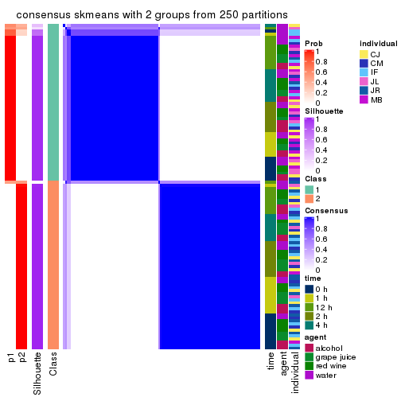</p>

</div>
<div id='tab-CV-skmeans-consensus-heatmap-2'>
<pre><code class="r">consensus_heatmap(res, k = 3)
</code></pre>

<p>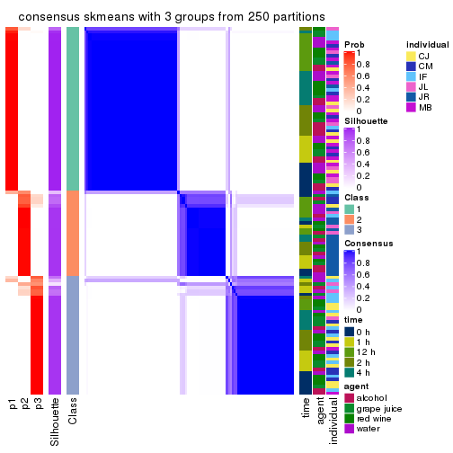</p>

</div>
<div id='tab-CV-skmeans-consensus-heatmap-3'>
<pre><code class="r">consensus_heatmap(res, k = 4)
</code></pre>

<p>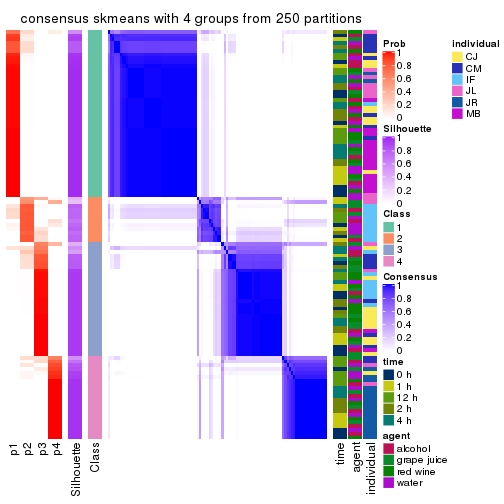</p>

</div>
<div id='tab-CV-skmeans-consensus-heatmap-4'>
<pre><code class="r">consensus_heatmap(res, k = 5)
</code></pre>

<p>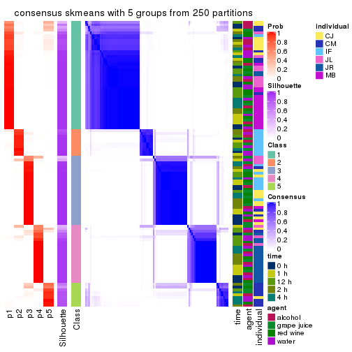</p>

</div>
<div id='tab-CV-skmeans-consensus-heatmap-5'>
<pre><code class="r">consensus_heatmap(res, k = 6)
</code></pre>

<p>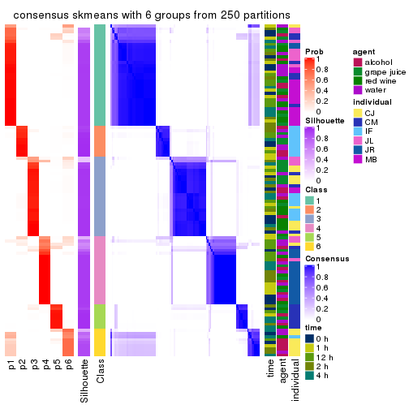</p>

</div>
</div>

Heatmaps for the membership of samples in all partitions to see how consistent they are:


<script>
$( function() {
	$( '#tabs-CV-skmeans-membership-heatmap' ).tabs();
} );
</script>
<div id='tabs-CV-skmeans-membership-heatmap'>
<ul>
<li><a href='#tab-CV-skmeans-membership-heatmap-1'>k = 2</a></li>
<li><a href='#tab-CV-skmeans-membership-heatmap-2'>k = 3</a></li>
<li><a href='#tab-CV-skmeans-membership-heatmap-3'>k = 4</a></li>
<li><a href='#tab-CV-skmeans-membership-heatmap-4'>k = 5</a></li>
<li><a href='#tab-CV-skmeans-membership-heatmap-5'>k = 6</a></li>
</ul>
<div id='tab-CV-skmeans-membership-heatmap-1'>
<pre><code class="r">membership_heatmap(res, k = 2)
</code></pre>

<p>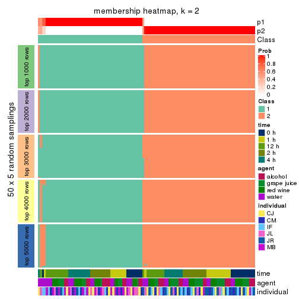</p>

</div>
<div id='tab-CV-skmeans-membership-heatmap-2'>
<pre><code class="r">membership_heatmap(res, k = 3)
</code></pre>

<p>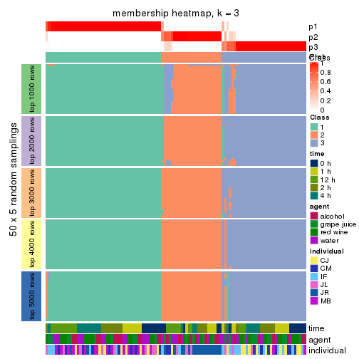</p>

</div>
<div id='tab-CV-skmeans-membership-heatmap-3'>
<pre><code class="r">membership_heatmap(res, k = 4)
</code></pre>

<p>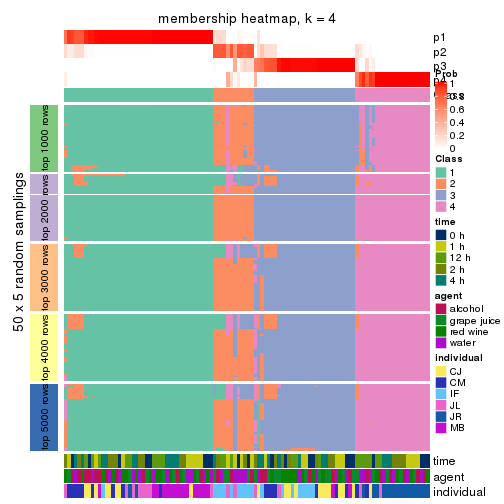</p>

</div>
<div id='tab-CV-skmeans-membership-heatmap-4'>
<pre><code class="r">membership_heatmap(res, k = 5)
</code></pre>

<p>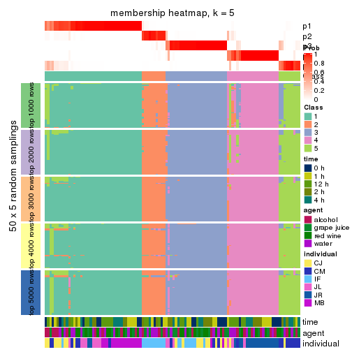</p>

</div>
<div id='tab-CV-skmeans-membership-heatmap-5'>
<pre><code class="r">membership_heatmap(res, k = 6)
</code></pre>

<p>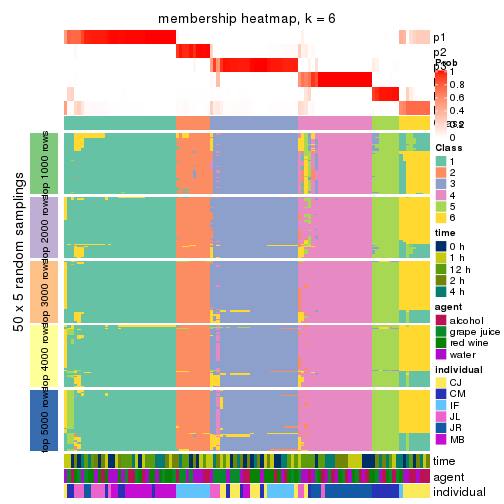</p>

</div>
</div>

As soon as we have had the classes for columns, we can look for signatures
which are significantly different between classes which can be candidate marks
for certain classes. Following are the heatmaps for signatures.


Signature heatmaps where rows are scaled:


<script>
$( function() {
	$( '#tabs-CV-skmeans-get-signatures' ).tabs();
} );
</script>
<div id='tabs-CV-skmeans-get-signatures'>
<ul>
<li><a href='#tab-CV-skmeans-get-signatures-1'>k = 2</a></li>
<li><a href='#tab-CV-skmeans-get-signatures-2'>k = 3</a></li>
<li><a href='#tab-CV-skmeans-get-signatures-3'>k = 4</a></li>
<li><a href='#tab-CV-skmeans-get-signatures-4'>k = 5</a></li>
<li><a href='#tab-CV-skmeans-get-signatures-5'>k = 6</a></li>
</ul>
<div id='tab-CV-skmeans-get-signatures-1'>
<pre><code class="r">get_signatures(res, k = 2)
</code></pre>

<p>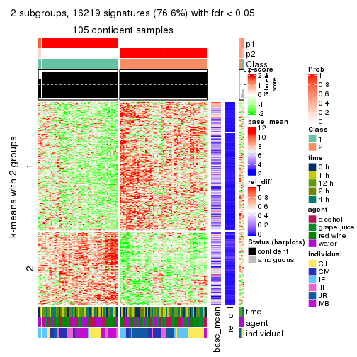</p>

</div>
<div id='tab-CV-skmeans-get-signatures-2'>
<pre><code class="r">get_signatures(res, k = 3)
</code></pre>

<p>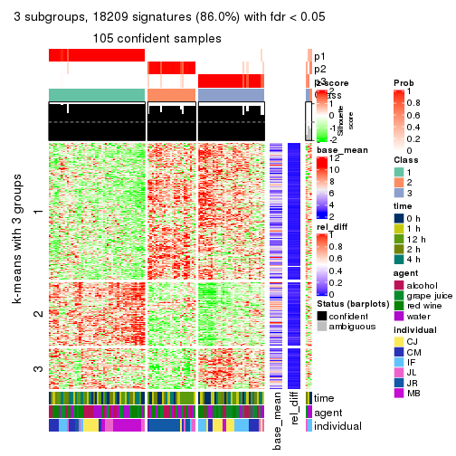</p>

</div>
<div id='tab-CV-skmeans-get-signatures-3'>
<pre><code class="r">get_signatures(res, k = 4)
</code></pre>

<p>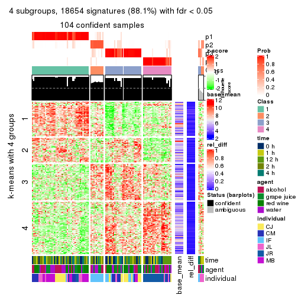</p>

</div>
<div id='tab-CV-skmeans-get-signatures-4'>
<pre><code class="r">get_signatures(res, k = 5)
</code></pre>

<p>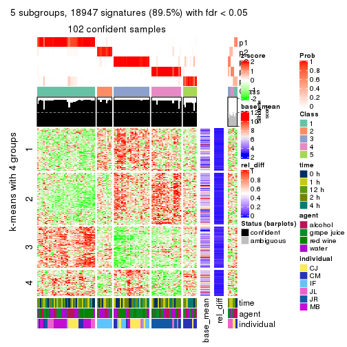</p>

</div>
<div id='tab-CV-skmeans-get-signatures-5'>
<pre><code class="r">get_signatures(res, k = 6)
</code></pre>

<p>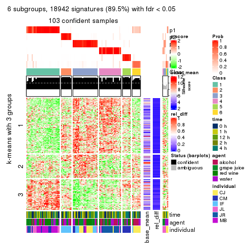</p>

</div>
</div>


Signature heatmaps where rows are not scaled:


<script>
$( function() {
	$( '#tabs-CV-skmeans-get-signatures-no-scale' ).tabs();
} );
</script>
<div id='tabs-CV-skmeans-get-signatures-no-scale'>
<ul>
<li><a href='#tab-CV-skmeans-get-signatures-no-scale-1'>k = 2</a></li>
<li><a href='#tab-CV-skmeans-get-signatures-no-scale-2'>k = 3</a></li>
<li><a href='#tab-CV-skmeans-get-signatures-no-scale-3'>k = 4</a></li>
<li><a href='#tab-CV-skmeans-get-signatures-no-scale-4'>k = 5</a></li>
<li><a href='#tab-CV-skmeans-get-signatures-no-scale-5'>k = 6</a></li>
</ul>
<div id='tab-CV-skmeans-get-signatures-no-scale-1'>
<pre><code class="r">get_signatures(res, k = 2, scale_rows = FALSE)
</code></pre>

<p>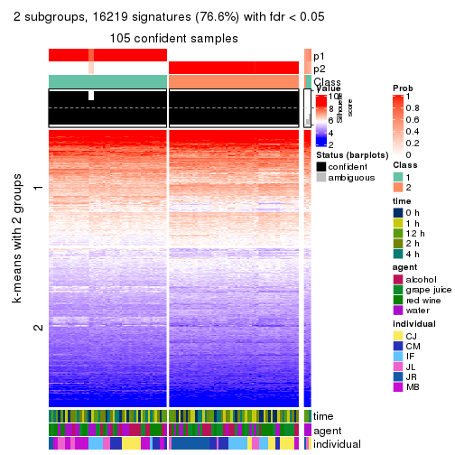</p>

</div>
<div id='tab-CV-skmeans-get-signatures-no-scale-2'>
<pre><code class="r">get_signatures(res, k = 3, scale_rows = FALSE)
</code></pre>

<p>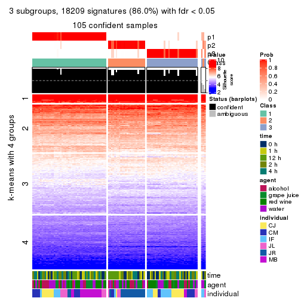</p>

</div>
<div id='tab-CV-skmeans-get-signatures-no-scale-3'>
<pre><code class="r">get_signatures(res, k = 4, scale_rows = FALSE)
</code></pre>

<p>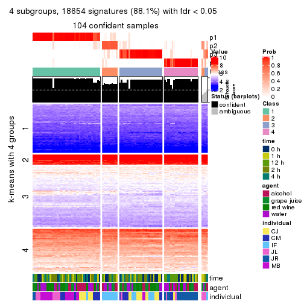</p>

</div>
<div id='tab-CV-skmeans-get-signatures-no-scale-4'>
<pre><code class="r">get_signatures(res, k = 5, scale_rows = FALSE)
</code></pre>

<p>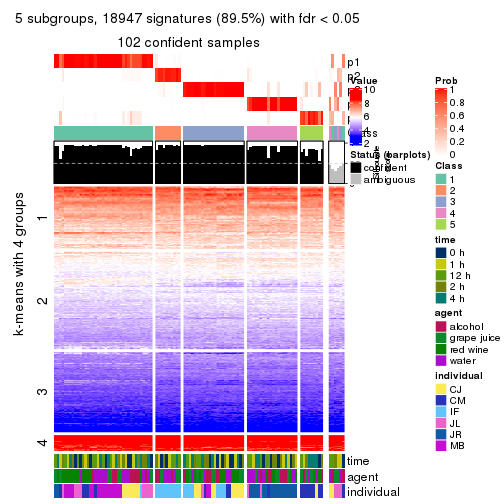</p>

</div>
<div id='tab-CV-skmeans-get-signatures-no-scale-5'>
<pre><code class="r">get_signatures(res, k = 6, scale_rows = FALSE)
</code></pre>

<p>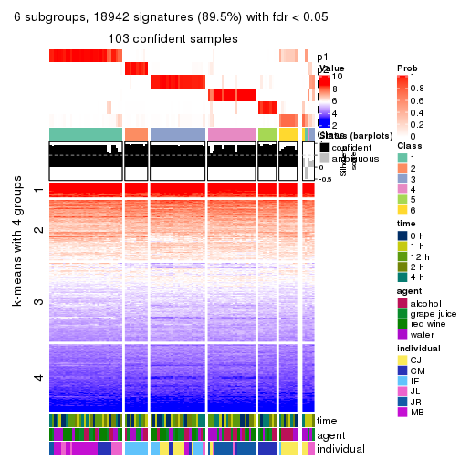</p>

</div>
</div>


Compare the overlap of signatures from different k:

```r
compare_signatures(res)
```

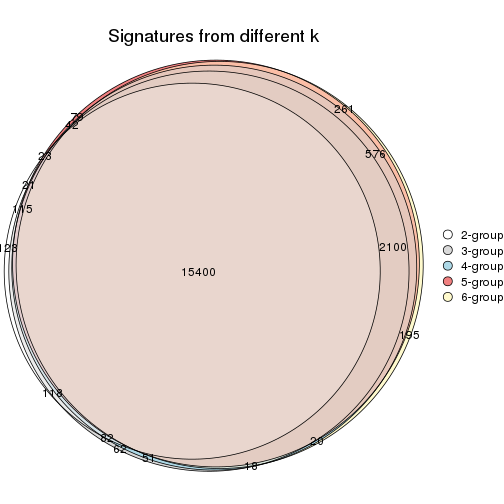

`get_signature()` returns a data frame invisibly. TO get the list of signatures, the function
call should be assigned to a variable explicitly. In following code, if `plot` argument is set
to `FALSE`, no heatmap is plotted while only the differential analysis is performed.

```r
# code only for demonstration
tb = get_signature(res, k = ..., plot = FALSE)
```

An example of the output of `tb` is:

```
#>   which_row         fdr    mean_1    mean_2 scaled_mean_1 scaled_mean_2 km
#> 1        38 0.042760348  8.373488  9.131774    -0.5533452     0.5164555  1
#> 2        40 0.018707592  7.106213  8.469186    -0.6173731     0.5762149  1
#> 3        55 0.019134737 10.221463 11.207825    -0.6159697     0.5749050  1
#> 4        59 0.006059896  5.921854  7.869574    -0.6899429     0.6439467  1
#> 5        60 0.018055526  8.928898 10.211722    -0.6204761     0.5791110  1
#> 6        98 0.009384629 15.714769 14.887706     0.6635654    -0.6193277  2
...
```

The columns in `tb` are:

1. `which_row`: row indices corresponding to the input matrix.
2. `fdr`: FDR for the differential test. 
3. `mean_x`: The mean value in group x.
4. `scaled_mean_x`: The mean value in group x after rows are scaled.
5. `km`: Row groups if k-means clustering is applied to rows.


UMAP plot which shows how samples are separated.


<script>
$( function() {
	$( '#tabs-CV-skmeans-dimension-reduction' ).tabs();
} );
</script>
<div id='tabs-CV-skmeans-dimension-reduction'>
<ul>
<li><a href='#tab-CV-skmeans-dimension-reduction-1'>k = 2</a></li>
<li><a href='#tab-CV-skmeans-dimension-reduction-2'>k = 3</a></li>
<li><a href='#tab-CV-skmeans-dimension-reduction-3'>k = 4</a></li>
<li><a href='#tab-CV-skmeans-dimension-reduction-4'>k = 5</a></li>
<li><a href='#tab-CV-skmeans-dimension-reduction-5'>k = 6</a></li>
</ul>
<div id='tab-CV-skmeans-dimension-reduction-1'>
<pre><code class="r">dimension_reduction(res, k = 2, method = &quot;UMAP&quot;)
</code></pre>

<p>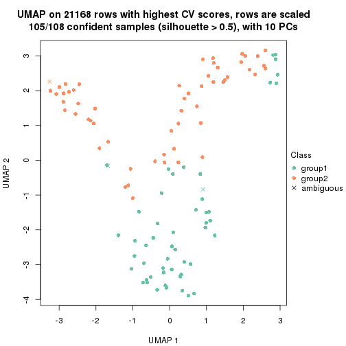</p>

</div>
<div id='tab-CV-skmeans-dimension-reduction-2'>
<pre><code class="r">dimension_reduction(res, k = 3, method = &quot;UMAP&quot;)
</code></pre>

<p>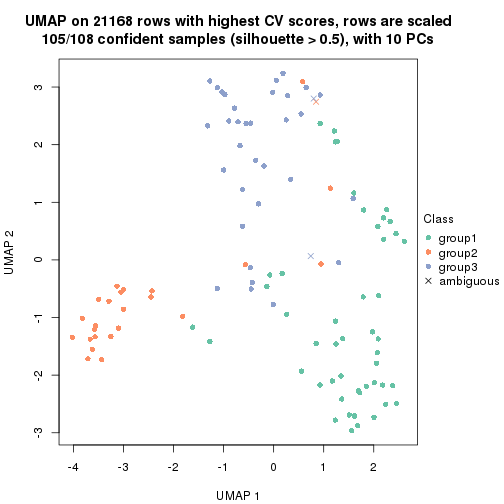</p>

</div>
<div id='tab-CV-skmeans-dimension-reduction-3'>
<pre><code class="r">dimension_reduction(res, k = 4, method = &quot;UMAP&quot;)
</code></pre>

<p>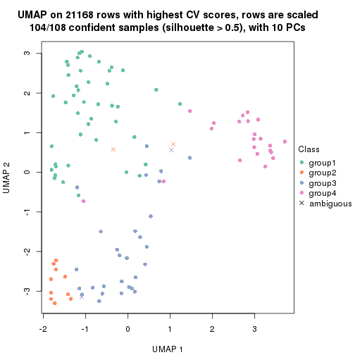</p>

</div>
<div id='tab-CV-skmeans-dimension-reduction-4'>
<pre><code class="r">dimension_reduction(res, k = 5, method = &quot;UMAP&quot;)
</code></pre>

<p>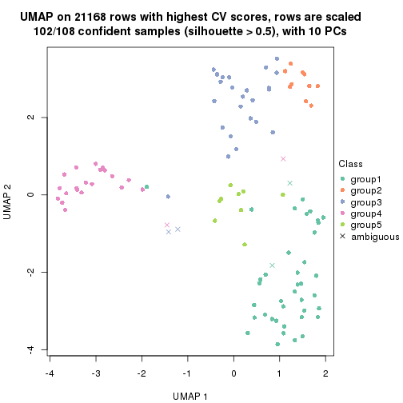</p>

</div>
<div id='tab-CV-skmeans-dimension-reduction-5'>
<pre><code class="r">dimension_reduction(res, k = 6, method = &quot;UMAP&quot;)
</code></pre>

<p>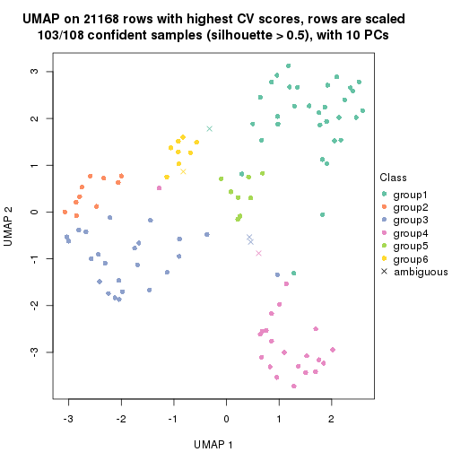</p>

</div>
</div>


Following heatmap shows how subgroups are split when increasing `k`:

```r
collect_classes(res)
```

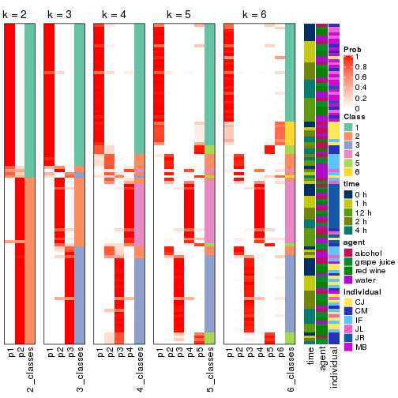


Test correlation between subgroups and known annotations. If the known
annotation is numeric, one-way ANOVA test is applied, and if the known
annotation is discrete, chi-squared contingency table test is applied.

```r
test_to_known_factors(res)
```

```
#>              n time(p) agent(p) individual(p) k
#> CV:skmeans 105   0.826    0.410      2.10e-04 2
#> CV:skmeans 105   0.603    0.750      3.71e-13 3
#> CV:skmeans 104   0.965    0.369      4.08e-22 4
#> CV:skmeans 102   0.985    0.699      8.54e-28 5
#> CV:skmeans 103   0.999    0.230      1.05e-33 6
```


If matrix rows can be associated to genes, consider to use `GO_Enrichment(res,
...)` to perform function enrichment for the signature genes.


 

---------------------------------------------------


### CV:pam*


The object with results only for a single top-value method and a single partition method 
can be extracted as:

```r
res = res_list["CV", "pam"]
# you can also extract it by
# res = res_list["CV:pam"]
```

A summary of `res` and all the functions that can be applied to it:

```r
res
```

```
#> A 'ConsensusPartition' object with k = 2, 3, 4, 5, 6.
#>   On a matrix with 21168 rows and 108 columns.
#>   Top rows (1000, 2000, 3000, 4000, 5000) are extracted by 'CV' method.
#>   Subgroups are detected by 'pam' method.
#>   Performed in total 1250 partitions by row resampling.
#>   Best k for subgroups seems to be 6.
#> 
#> Following methods can be applied to this 'ConsensusPartition' object:
#>  [1] "cola_report"             "collect_classes"         "collect_plots"          
#>  [4] "collect_stats"           "colnames"                "compare_signatures"     
#>  [7] "consensus_heatmap"       "dimension_reduction"     "functional_enrichment"  
#> [10] "get_anno_col"            "get_anno"                "get_classes"            
#> [13] "get_consensus"           "get_matrix"              "get_membership"         
#> [16] "get_param"               "get_signatures"          "get_stats"              
#> [19] "is_best_k"               "is_stable_k"             "membership_heatmap"     
#> [22] "ncol"                    "nrow"                    "plot_ecdf"              
#> [25] "rownames"                "select_partition_number" "show"                   
#> [28] "suggest_best_k"          "test_to_known_factors"
```

`collect_plots()` function collects all the plots made from `res` for all `k` (number of partitions)
into one single page to provide an easy and fast comparison between different `k`.

```r
collect_plots(res)
```

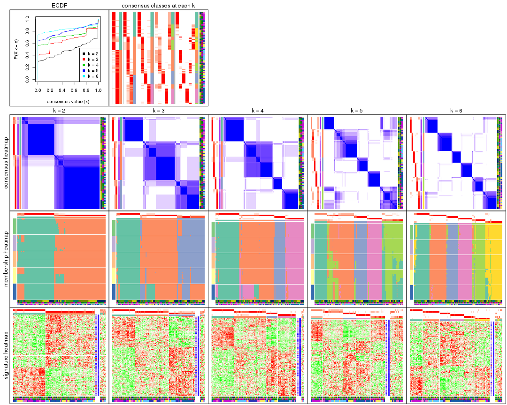

The plots are:

- The first row: a plot of the ECDF (Empirical cumulative distribution
  function) curves of the consensus matrix for each `k` and the heatmap of
  predicted classes for each `k`.
- The second row: heatmaps of the consensus matrix for each `k`.
- The third row: heatmaps of the membership matrix for each `k`.
- The fouth row: heatmaps of the signatures for each `k`.

All the plots in panels can be made by individual functions and they are
plotted later in this section.

`select_partition_number()` produces several plots showing different
statistics for choosing "optimized" `k`. There are following statistics:

- ECDF curves of the consensus matrix for each `k`;
- 1-PAC. [The PAC
  score](https://en.wikipedia.org/wiki/Consensus_clustering#Over-interpretation_potential_of_consensus_clustering)
  measures the proportion of the ambiguous subgrouping.
- Mean silhouette score.
- Concordance. The mean probability of fiting the consensus class ids in all
  partitions.
- Area increased. Denote $A_k$ as the area under the ECDF curve for current
  `k`, the area increased is defined as $A_k - A_{k-1}$.
- Rand index. The percent of pairs of samples that are both in a same cluster
  or both are not in a same cluster in the partition of k and k-1.
- Jaccard index. The ratio of pairs of samples are both in a same cluster in
  the partition of k and k-1 and the pairs of samples are both in a same
  cluster in the partition k or k-1.

The detailed explanations of these statistics can be found in [the cola
vignette](http://bioconductor.org/packages/devel/bioc/vignettes/cola/inst/doc/cola.html#toc_13).

Generally speaking, lower PAC score, higher mean silhouette score or higher
concordance corresponds to better partition. Rand index and Jaccard index
measure how similar the current partition is compared to partition with `k-1`.
If they are too similar, we won't accept `k` is better than `k-1`.

```r
select_partition_number(res)
```

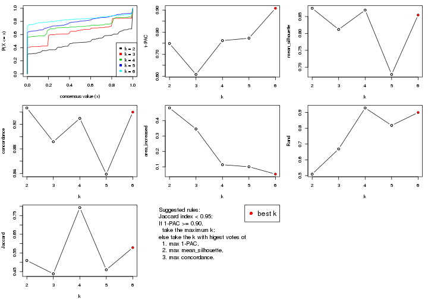

The numeric values for all these statistics can be obtained by `get_stats()`.

```r
get_stats(res)
```

```
#>   k 1-PAC mean_silhouette concordance area_increased  Rand Jaccard
#> 2 2 0.749           0.875       0.947         0.4817 0.509   0.509
#> 3 3 0.608           0.812       0.892         0.3452 0.669   0.438
#> 4 4 0.762           0.869       0.930         0.1136 0.929   0.793
#> 5 5 0.773           0.678       0.839         0.1004 0.818   0.460
#> 6 6 0.908           0.854       0.940         0.0526 0.900   0.579
```

`suggest_best_k()` suggests the best $k$ based on these statistics. The rules are as follows:

- All $k$ with Jaccard index larger than 0.95 are removed because the increase of
  the partition number does not provides enough extra information. If all $k$ are removed,
  the best $k$ is assigned by `NA`.
- For $k$ with 1-PAC larger than 0.9, the maximal $k$ is taken as the "best k". Other $k$ is called "optional k".
- If it does not fit the second rule. The $k$ with the highest vote of highest
  1-PAC, mean silhouette and concordance is taken as the "best k".

```r
suggest_best_k(res)
```

```
#> [1] 6
```


Following shows the table of the partitions (You need to click the **show/hide
code output** link to see it). The membership matrix (columns with name `p*`)
is inferred by
[`clue::cl_consensus()`](https://www.rdocumentation.org/link/cl_consensus?package=clue)
function with the `SE` method. Basically the value in the membership matrix
represents the probability to belong to a certain group. The finall class
label for an item is determined with the group with highest probability it
belongs to.

In `get_classes()` function, the entropy is calculated from the membership
matrix and the silhouette score is calculated from the consensus matrix.


<script>
$( function() {
	$( '#tabs-CV-pam-get-classes' ).tabs();
} );
</script>
<div id='tabs-CV-pam-get-classes'>
<ul>
<li><a href='#tab-CV-pam-get-classes-1'>k = 2</a></li>
<li><a href='#tab-CV-pam-get-classes-2'>k = 3</a></li>
<li><a href='#tab-CV-pam-get-classes-3'>k = 4</a></li>
<li><a href='#tab-CV-pam-get-classes-4'>k = 5</a></li>
<li><a href='#tab-CV-pam-get-classes-5'>k = 6</a></li>
</ul>

<div id='tab-CV-pam-get-classes-1'>
<p><a id='tab-CV-pam-get-classes-1-a' style='color:#0366d6' href='#'>show/hide code output</a></p>
<pre><code class="r">cbind(get_classes(res, k = 2), get_membership(res, k = 2))
</code></pre>

<pre><code>#&gt;          class entropy silhouette    p1    p2
#&gt; GSM87863     1  0.0376      0.917 0.996 0.004
#&gt; GSM87887     1  0.0000      0.920 1.000 0.000
#&gt; GSM87896     2  0.0000      0.953 0.000 1.000
#&gt; GSM87934     2  0.0000      0.953 0.000 1.000
#&gt; GSM87943     2  0.4298      0.882 0.088 0.912
#&gt; GSM87853     2  0.0000      0.953 0.000 1.000
#&gt; GSM87906     2  0.0000      0.953 0.000 1.000
#&gt; GSM87920     1  0.9170      0.528 0.668 0.332
#&gt; GSM87924     2  0.0000      0.953 0.000 1.000
#&gt; GSM87858     2  0.0000      0.953 0.000 1.000
#&gt; GSM87882     2  0.0000      0.953 0.000 1.000
#&gt; GSM87891     2  0.0000      0.953 0.000 1.000
#&gt; GSM87917     1  0.0000      0.920 1.000 0.000
#&gt; GSM87929     2  0.0000      0.953 0.000 1.000
#&gt; GSM87948     1  0.0000      0.920 1.000 0.000
#&gt; GSM87868     1  0.0000      0.920 1.000 0.000
#&gt; GSM87873     2  0.0000      0.953 0.000 1.000
#&gt; GSM87901     2  0.8386      0.638 0.268 0.732
#&gt; GSM87910     1  0.0000      0.920 1.000 0.000
#&gt; GSM87938     2  0.0000      0.953 0.000 1.000
#&gt; GSM87953     1  0.0000      0.920 1.000 0.000
#&gt; GSM87864     1  0.0000      0.920 1.000 0.000
#&gt; GSM87888     2  0.0672      0.948 0.008 0.992
#&gt; GSM87897     2  0.0000      0.953 0.000 1.000
#&gt; GSM87935     2  0.0000      0.953 0.000 1.000
#&gt; GSM87944     1  0.0000      0.920 1.000 0.000
#&gt; GSM87854     2  0.5842      0.829 0.140 0.860
#&gt; GSM87878     1  0.0000      0.920 1.000 0.000
#&gt; GSM87907     2  0.0000      0.953 0.000 1.000
#&gt; GSM87921     2  0.0000      0.953 0.000 1.000
#&gt; GSM87925     2  0.0000      0.953 0.000 1.000
#&gt; GSM87957     1  0.0000      0.920 1.000 0.000
#&gt; GSM87859     2  0.0000      0.953 0.000 1.000
#&gt; GSM87883     1  0.0000      0.920 1.000 0.000
#&gt; GSM87892     2  0.0000      0.953 0.000 1.000
#&gt; GSM87930     2  0.0000      0.953 0.000 1.000
#&gt; GSM87949     1  0.0000      0.920 1.000 0.000
#&gt; GSM87869     1  0.0000      0.920 1.000 0.000
#&gt; GSM87874     2  0.0000      0.953 0.000 1.000
#&gt; GSM87902     2  0.7139      0.757 0.196 0.804
#&gt; GSM87911     2  0.5842      0.829 0.140 0.860
#&gt; GSM87939     2  0.0000      0.953 0.000 1.000
#&gt; GSM87954     1  0.0000      0.920 1.000 0.000
#&gt; GSM87865     1  0.0000      0.920 1.000 0.000
#&gt; GSM87889     1  0.9661      0.397 0.608 0.392
#&gt; GSM87898     1  0.8499      0.625 0.724 0.276
#&gt; GSM87915     1  0.0000      0.920 1.000 0.000
#&gt; GSM87936     2  0.0000      0.953 0.000 1.000
#&gt; GSM87945     2  0.0000      0.953 0.000 1.000
#&gt; GSM87855     2  0.0000      0.953 0.000 1.000
#&gt; GSM87879     2  0.0000      0.953 0.000 1.000
#&gt; GSM87922     2  0.0000      0.953 0.000 1.000
#&gt; GSM87926     2  0.0000      0.953 0.000 1.000
#&gt; GSM87958     1  0.0000      0.920 1.000 0.000
#&gt; GSM87860     2  0.0000      0.953 0.000 1.000
#&gt; GSM87884     1  0.0000      0.920 1.000 0.000
#&gt; GSM87893     2  0.0000      0.953 0.000 1.000
#&gt; GSM87918     2  0.9661      0.311 0.392 0.608
#&gt; GSM87931     2  0.0000      0.953 0.000 1.000
#&gt; GSM87950     1  0.0000      0.920 1.000 0.000
#&gt; GSM87870     1  0.0000      0.920 1.000 0.000
#&gt; GSM87875     2  0.0000      0.953 0.000 1.000
#&gt; GSM87903     2  0.0000      0.953 0.000 1.000
#&gt; GSM87912     1  0.0000      0.920 1.000 0.000
#&gt; GSM87940     2  0.0000      0.953 0.000 1.000
#&gt; GSM87866     1  0.0000      0.920 1.000 0.000
#&gt; GSM87899     2  0.0000      0.953 0.000 1.000
#&gt; GSM87937     2  0.0000      0.953 0.000 1.000
#&gt; GSM87946     1  0.0000      0.920 1.000 0.000
#&gt; GSM87856     2  0.5294      0.850 0.120 0.880
#&gt; GSM87880     2  0.5408      0.846 0.124 0.876
#&gt; GSM87908     2  0.5629      0.838 0.132 0.868
#&gt; GSM87923     2  0.0000      0.953 0.000 1.000
#&gt; GSM87927     2  0.0000      0.953 0.000 1.000
#&gt; GSM87959     1  0.0000      0.920 1.000 0.000
#&gt; GSM87861     2  0.0000      0.953 0.000 1.000
#&gt; GSM87885     1  0.9635      0.407 0.612 0.388
#&gt; GSM87894     1  0.0000      0.920 1.000 0.000
#&gt; GSM87932     1  0.8555      0.619 0.720 0.280
#&gt; GSM87951     1  0.0000      0.920 1.000 0.000
#&gt; GSM87871     2  0.8661      0.600 0.288 0.712
#&gt; GSM87876     1  0.9710      0.377 0.600 0.400
#&gt; GSM87904     2  0.0000      0.953 0.000 1.000
#&gt; GSM87913     1  0.0000      0.920 1.000 0.000
#&gt; GSM87941     2  0.0000      0.953 0.000 1.000
#&gt; GSM87955     1  0.0000      0.920 1.000 0.000
#&gt; GSM87867     1  0.9710      0.377 0.600 0.400
#&gt; GSM87890     2  0.0000      0.953 0.000 1.000
#&gt; GSM87900     2  0.0000      0.953 0.000 1.000
#&gt; GSM87916     2  0.0000      0.953 0.000 1.000
#&gt; GSM87947     1  0.0000      0.920 1.000 0.000
#&gt; GSM87857     2  0.0000      0.953 0.000 1.000
#&gt; GSM87881     2  0.0000      0.953 0.000 1.000
#&gt; GSM87909     2  0.9323      0.464 0.348 0.652
#&gt; GSM87928     1  0.8555      0.619 0.720 0.280
#&gt; GSM87960     1  0.0000      0.920 1.000 0.000
#&gt; GSM87862     2  0.0000      0.953 0.000 1.000
#&gt; GSM87886     1  0.0000      0.920 1.000 0.000
#&gt; GSM87895     2  0.0000      0.953 0.000 1.000
#&gt; GSM87919     1  0.0000      0.920 1.000 0.000
#&gt; GSM87933     2  0.0000      0.953 0.000 1.000
#&gt; GSM87952     1  0.0000      0.920 1.000 0.000
#&gt; GSM87872     2  0.2778      0.916 0.048 0.952
#&gt; GSM87877     1  0.0000      0.920 1.000 0.000
#&gt; GSM87905     1  0.9850      0.286 0.572 0.428
#&gt; GSM87914     2  0.4562      0.872 0.096 0.904
#&gt; GSM87942     2  0.6973      0.755 0.188 0.812
#&gt; GSM87956     1  0.0000      0.920 1.000 0.000
</code></pre>

<script>
$('#tab-CV-pam-get-classes-1-a').parent().next().next().hide();
$('#tab-CV-pam-get-classes-1-a').click(function(){
  $('#tab-CV-pam-get-classes-1-a').parent().next().next().toggle();
  return(false);
});
</script>
</div>

<div id='tab-CV-pam-get-classes-2'>
<p><a id='tab-CV-pam-get-classes-2-a' style='color:#0366d6' href='#'>show/hide code output</a></p>
<pre><code class="r">cbind(get_classes(res, k = 3), get_membership(res, k = 3))
</code></pre>

<pre><code>#&gt;          class entropy silhouette    p1    p2    p3
#&gt; GSM87863     2  0.4555     0.7591 0.200 0.800 0.000
#&gt; GSM87887     2  0.4555     0.7591 0.200 0.800 0.000
#&gt; GSM87896     3  0.0000     0.7778 0.000 0.000 1.000
#&gt; GSM87934     3  0.4555     0.8513 0.000 0.200 0.800
#&gt; GSM87943     2  0.4842     0.7246 0.000 0.776 0.224
#&gt; GSM87853     3  0.6154     0.0852 0.000 0.408 0.592
#&gt; GSM87906     2  0.0000     0.8711 0.000 1.000 0.000
#&gt; GSM87920     2  0.0000     0.8711 0.000 1.000 0.000
#&gt; GSM87924     3  0.4555     0.8513 0.000 0.200 0.800
#&gt; GSM87858     3  0.0000     0.7778 0.000 0.000 1.000
#&gt; GSM87882     2  0.0000     0.8711 0.000 1.000 0.000
#&gt; GSM87891     3  0.0000     0.7778 0.000 0.000 1.000
#&gt; GSM87917     1  0.0000     0.9544 1.000 0.000 0.000
#&gt; GSM87929     3  0.6126     0.6263 0.000 0.400 0.600
#&gt; GSM87948     1  0.0000     0.9544 1.000 0.000 0.000
#&gt; GSM87868     1  0.4654     0.6952 0.792 0.208 0.000
#&gt; GSM87873     3  0.0000     0.7778 0.000 0.000 1.000
#&gt; GSM87901     2  0.0000     0.8711 0.000 1.000 0.000
#&gt; GSM87910     1  0.0000     0.9544 1.000 0.000 0.000
#&gt; GSM87938     3  0.4555     0.8513 0.000 0.200 0.800
#&gt; GSM87953     1  0.0000     0.9544 1.000 0.000 0.000
#&gt; GSM87864     2  0.4555     0.7591 0.200 0.800 0.000
#&gt; GSM87888     2  0.0000     0.8711 0.000 1.000 0.000
#&gt; GSM87897     2  0.0000     0.8711 0.000 1.000 0.000
#&gt; GSM87935     3  0.4555     0.8513 0.000 0.200 0.800
#&gt; GSM87944     1  0.0000     0.9544 1.000 0.000 0.000
#&gt; GSM87854     2  0.0000     0.8711 0.000 1.000 0.000
#&gt; GSM87878     2  0.4555     0.7591 0.200 0.800 0.000
#&gt; GSM87907     3  0.4555     0.8513 0.000 0.200 0.800
#&gt; GSM87921     2  0.0000     0.8711 0.000 1.000 0.000
#&gt; GSM87925     3  0.4555     0.8513 0.000 0.200 0.800
#&gt; GSM87957     1  0.0000     0.9544 1.000 0.000 0.000
#&gt; GSM87859     3  0.0000     0.7778 0.000 0.000 1.000
#&gt; GSM87883     1  0.0000     0.9544 1.000 0.000 0.000
#&gt; GSM87892     3  0.0000     0.7778 0.000 0.000 1.000
#&gt; GSM87930     3  0.4555     0.8513 0.000 0.200 0.800
#&gt; GSM87949     1  0.0000     0.9544 1.000 0.000 0.000
#&gt; GSM87869     1  0.0000     0.9544 1.000 0.000 0.000
#&gt; GSM87874     3  0.0000     0.7778 0.000 0.000 1.000
#&gt; GSM87902     2  0.0000     0.8711 0.000 1.000 0.000
#&gt; GSM87911     2  0.0000     0.8711 0.000 1.000 0.000
#&gt; GSM87939     3  0.4555     0.8513 0.000 0.200 0.800
#&gt; GSM87954     1  0.0000     0.9544 1.000 0.000 0.000
#&gt; GSM87865     2  0.4555     0.7591 0.200 0.800 0.000
#&gt; GSM87889     2  0.0000     0.8711 0.000 1.000 0.000
#&gt; GSM87898     1  0.6295     0.1683 0.528 0.472 0.000
#&gt; GSM87915     1  0.0000     0.9544 1.000 0.000 0.000
#&gt; GSM87936     3  0.4555     0.8513 0.000 0.200 0.800
#&gt; GSM87945     3  0.3412     0.6953 0.000 0.124 0.876
#&gt; GSM87855     2  0.6126     0.4595 0.000 0.600 0.400
#&gt; GSM87879     2  0.0000     0.8711 0.000 1.000 0.000
#&gt; GSM87922     3  0.6140     0.6075 0.000 0.404 0.596
#&gt; GSM87926     3  0.4555     0.8513 0.000 0.200 0.800
#&gt; GSM87958     1  0.0000     0.9544 1.000 0.000 0.000
#&gt; GSM87860     2  0.4555     0.7434 0.000 0.800 0.200
#&gt; GSM87884     1  0.0000     0.9544 1.000 0.000 0.000
#&gt; GSM87893     3  0.0000     0.7778 0.000 0.000 1.000
#&gt; GSM87918     2  0.0000     0.8711 0.000 1.000 0.000
#&gt; GSM87931     3  0.4555     0.8513 0.000 0.200 0.800
#&gt; GSM87950     1  0.0000     0.9544 1.000 0.000 0.000
#&gt; GSM87870     2  0.4555     0.7591 0.200 0.800 0.000
#&gt; GSM87875     3  0.1031     0.7693 0.000 0.024 0.976
#&gt; GSM87903     2  0.0000     0.8711 0.000 1.000 0.000
#&gt; GSM87912     1  0.0000     0.9544 1.000 0.000 0.000
#&gt; GSM87940     3  0.4555     0.8513 0.000 0.200 0.800
#&gt; GSM87866     2  0.4555     0.7591 0.200 0.800 0.000
#&gt; GSM87899     2  0.0000     0.8711 0.000 1.000 0.000
#&gt; GSM87937     3  0.4555     0.8513 0.000 0.200 0.800
#&gt; GSM87946     1  0.0000     0.9544 1.000 0.000 0.000
#&gt; GSM87856     2  0.4555     0.7434 0.000 0.800 0.200
#&gt; GSM87880     2  0.0000     0.8711 0.000 1.000 0.000
#&gt; GSM87908     2  0.0000     0.8711 0.000 1.000 0.000
#&gt; GSM87923     3  0.4555     0.8513 0.000 0.200 0.800
#&gt; GSM87927     3  0.6126     0.6263 0.000 0.400 0.600
#&gt; GSM87959     1  0.0000     0.9544 1.000 0.000 0.000
#&gt; GSM87861     2  0.6309     0.2169 0.000 0.504 0.496
#&gt; GSM87885     2  0.0000     0.8711 0.000 1.000 0.000
#&gt; GSM87894     2  0.4555     0.7591 0.200 0.800 0.000
#&gt; GSM87932     1  0.4555     0.6922 0.800 0.200 0.000
#&gt; GSM87951     1  0.0000     0.9544 1.000 0.000 0.000
#&gt; GSM87871     2  0.0000     0.8711 0.000 1.000 0.000
#&gt; GSM87876     2  0.0000     0.8711 0.000 1.000 0.000
#&gt; GSM87904     2  0.0000     0.8711 0.000 1.000 0.000
#&gt; GSM87913     2  0.4555     0.7591 0.200 0.800 0.000
#&gt; GSM87941     3  0.6126     0.6263 0.000 0.400 0.600
#&gt; GSM87955     1  0.0000     0.9544 1.000 0.000 0.000
#&gt; GSM87867     2  0.0000     0.8711 0.000 1.000 0.000
#&gt; GSM87890     3  0.4555     0.8513 0.000 0.200 0.800
#&gt; GSM87900     2  0.4555     0.5800 0.000 0.800 0.200
#&gt; GSM87916     3  0.6126     0.6263 0.000 0.400 0.600
#&gt; GSM87947     1  0.0000     0.9544 1.000 0.000 0.000
#&gt; GSM87857     2  0.4555     0.7434 0.000 0.800 0.200
#&gt; GSM87881     2  0.0000     0.8711 0.000 1.000 0.000
#&gt; GSM87909     2  0.0000     0.8711 0.000 1.000 0.000
#&gt; GSM87928     1  0.4555     0.6922 0.800 0.200 0.000
#&gt; GSM87960     1  0.0000     0.9544 1.000 0.000 0.000
#&gt; GSM87862     2  0.0424     0.8640 0.000 0.992 0.008
#&gt; GSM87886     1  0.0000     0.9544 1.000 0.000 0.000
#&gt; GSM87895     3  0.4555     0.8513 0.000 0.200 0.800
#&gt; GSM87919     1  0.0000     0.9544 1.000 0.000 0.000
#&gt; GSM87933     3  0.4555     0.8513 0.000 0.200 0.800
#&gt; GSM87952     1  0.0000     0.9544 1.000 0.000 0.000
#&gt; GSM87872     2  0.0000     0.8711 0.000 1.000 0.000
#&gt; GSM87877     2  0.4555     0.7591 0.200 0.800 0.000
#&gt; GSM87905     2  0.0000     0.8711 0.000 1.000 0.000
#&gt; GSM87914     2  0.5291     0.4136 0.000 0.732 0.268
#&gt; GSM87942     3  0.6291     0.4822 0.000 0.468 0.532
#&gt; GSM87956     1  0.0000     0.9544 1.000 0.000 0.000
</code></pre>

<script>
$('#tab-CV-pam-get-classes-2-a').parent().next().next().hide();
$('#tab-CV-pam-get-classes-2-a').click(function(){
  $('#tab-CV-pam-get-classes-2-a').parent().next().next().toggle();
  return(false);
});
</script>
</div>

<div id='tab-CV-pam-get-classes-3'>
<p><a id='tab-CV-pam-get-classes-3-a' style='color:#0366d6' href='#'>show/hide code output</a></p>
<pre><code class="r">cbind(get_classes(res, k = 4), get_membership(res, k = 4))
</code></pre>

<pre><code>#&gt;          class entropy silhouette    p1    p2    p3    p4
#&gt; GSM87863     2   0.000      0.859 0.000 1.000 0.000 0.000
#&gt; GSM87887     2   0.000      0.859 0.000 1.000 0.000 0.000
#&gt; GSM87896     3   0.000      0.965 0.000 0.000 1.000 0.000
#&gt; GSM87934     4   0.000      0.949 0.000 0.000 0.000 1.000
#&gt; GSM87943     2   0.130      0.833 0.000 0.956 0.044 0.000
#&gt; GSM87853     3   0.000      0.965 0.000 0.000 1.000 0.000
#&gt; GSM87906     2   0.349      0.826 0.000 0.812 0.000 0.188
#&gt; GSM87920     2   0.000      0.859 0.000 1.000 0.000 0.000
#&gt; GSM87924     4   0.000      0.949 0.000 0.000 0.000 1.000
#&gt; GSM87858     3   0.000      0.965 0.000 0.000 1.000 0.000
#&gt; GSM87882     2   0.000      0.859 0.000 1.000 0.000 0.000
#&gt; GSM87891     3   0.000      0.965 0.000 0.000 1.000 0.000
#&gt; GSM87917     1   0.000      0.956 1.000 0.000 0.000 0.000
#&gt; GSM87929     4   0.000      0.949 0.000 0.000 0.000 1.000
#&gt; GSM87948     1   0.000      0.956 1.000 0.000 0.000 0.000
#&gt; GSM87868     1   0.373      0.693 0.788 0.212 0.000 0.000
#&gt; GSM87873     3   0.000      0.965 0.000 0.000 1.000 0.000
#&gt; GSM87901     2   0.349      0.826 0.000 0.812 0.000 0.188
#&gt; GSM87910     1   0.000      0.956 1.000 0.000 0.000 0.000
#&gt; GSM87938     4   0.000      0.949 0.000 0.000 0.000 1.000
#&gt; GSM87953     1   0.000      0.956 1.000 0.000 0.000 0.000
#&gt; GSM87864     2   0.322      0.799 0.164 0.836 0.000 0.000
#&gt; GSM87888     2   0.000      0.859 0.000 1.000 0.000 0.000
#&gt; GSM87897     2   0.349      0.826 0.000 0.812 0.000 0.188
#&gt; GSM87935     4   0.000      0.949 0.000 0.000 0.000 1.000
#&gt; GSM87944     1   0.000      0.956 1.000 0.000 0.000 0.000
#&gt; GSM87854     2   0.000      0.859 0.000 1.000 0.000 0.000
#&gt; GSM87878     2   0.000      0.859 0.000 1.000 0.000 0.000
#&gt; GSM87907     4   0.000      0.949 0.000 0.000 0.000 1.000
#&gt; GSM87921     2   0.353      0.823 0.000 0.808 0.000 0.192
#&gt; GSM87925     4   0.000      0.949 0.000 0.000 0.000 1.000
#&gt; GSM87957     1   0.000      0.956 1.000 0.000 0.000 0.000
#&gt; GSM87859     3   0.000      0.965 0.000 0.000 1.000 0.000
#&gt; GSM87883     1   0.000      0.956 1.000 0.000 0.000 0.000
#&gt; GSM87892     3   0.000      0.965 0.000 0.000 1.000 0.000
#&gt; GSM87930     4   0.000      0.949 0.000 0.000 0.000 1.000
#&gt; GSM87949     1   0.000      0.956 1.000 0.000 0.000 0.000
#&gt; GSM87869     1   0.000      0.956 1.000 0.000 0.000 0.000
#&gt; GSM87874     3   0.000      0.965 0.000 0.000 1.000 0.000
#&gt; GSM87902     2   0.349      0.826 0.000 0.812 0.000 0.188
#&gt; GSM87911     2   0.349      0.826 0.000 0.812 0.000 0.188
#&gt; GSM87939     4   0.000      0.949 0.000 0.000 0.000 1.000
#&gt; GSM87954     1   0.000      0.956 1.000 0.000 0.000 0.000
#&gt; GSM87865     2   0.322      0.799 0.164 0.836 0.000 0.000
#&gt; GSM87889     2   0.000      0.859 0.000 1.000 0.000 0.000
#&gt; GSM87898     1   0.702      0.338 0.564 0.272 0.000 0.164
#&gt; GSM87915     1   0.000      0.956 1.000 0.000 0.000 0.000
#&gt; GSM87936     4   0.000      0.949 0.000 0.000 0.000 1.000
#&gt; GSM87945     3   0.000      0.965 0.000 0.000 1.000 0.000
#&gt; GSM87855     3   0.000      0.965 0.000 0.000 1.000 0.000
#&gt; GSM87879     2   0.000      0.859 0.000 1.000 0.000 0.000
#&gt; GSM87922     4   0.452      0.564 0.000 0.320 0.000 0.680
#&gt; GSM87926     4   0.000      0.949 0.000 0.000 0.000 1.000
#&gt; GSM87958     1   0.000      0.956 1.000 0.000 0.000 0.000
#&gt; GSM87860     3   0.365      0.707 0.000 0.204 0.796 0.000
#&gt; GSM87884     1   0.000      0.956 1.000 0.000 0.000 0.000
#&gt; GSM87893     3   0.000      0.965 0.000 0.000 1.000 0.000
#&gt; GSM87918     2   0.349      0.826 0.000 0.812 0.000 0.188
#&gt; GSM87931     4   0.000      0.949 0.000 0.000 0.000 1.000
#&gt; GSM87950     1   0.000      0.956 1.000 0.000 0.000 0.000
#&gt; GSM87870     2   0.340      0.789 0.180 0.820 0.000 0.000
#&gt; GSM87875     3   0.349      0.795 0.000 0.188 0.812 0.000
#&gt; GSM87903     2   0.349      0.826 0.000 0.812 0.000 0.188
#&gt; GSM87912     1   0.000      0.956 1.000 0.000 0.000 0.000
#&gt; GSM87940     4   0.000      0.949 0.000 0.000 0.000 1.000
#&gt; GSM87866     2   0.349      0.783 0.188 0.812 0.000 0.000
#&gt; GSM87899     2   0.394      0.821 0.000 0.800 0.012 0.188
#&gt; GSM87937     4   0.000      0.949 0.000 0.000 0.000 1.000
#&gt; GSM87946     1   0.000      0.956 1.000 0.000 0.000 0.000
#&gt; GSM87856     2   0.485      0.423 0.000 0.600 0.400 0.000
#&gt; GSM87880     2   0.000      0.859 0.000 1.000 0.000 0.000
#&gt; GSM87908     2   0.349      0.826 0.000 0.812 0.000 0.188
#&gt; GSM87923     4   0.208      0.864 0.000 0.084 0.000 0.916
#&gt; GSM87927     4   0.000      0.949 0.000 0.000 0.000 1.000
#&gt; GSM87959     1   0.000      0.956 1.000 0.000 0.000 0.000
#&gt; GSM87861     3   0.000      0.965 0.000 0.000 1.000 0.000
#&gt; GSM87885     2   0.000      0.859 0.000 1.000 0.000 0.000
#&gt; GSM87894     2   0.349      0.783 0.188 0.812 0.000 0.000
#&gt; GSM87932     1   0.322      0.764 0.836 0.000 0.000 0.164
#&gt; GSM87951     1   0.000      0.956 1.000 0.000 0.000 0.000
#&gt; GSM87871     2   0.000      0.859 0.000 1.000 0.000 0.000
#&gt; GSM87876     2   0.000      0.859 0.000 1.000 0.000 0.000
#&gt; GSM87904     2   0.000      0.859 0.000 1.000 0.000 0.000
#&gt; GSM87913     2   0.349      0.783 0.188 0.812 0.000 0.000
#&gt; GSM87941     4   0.000      0.949 0.000 0.000 0.000 1.000
#&gt; GSM87955     1   0.000      0.956 1.000 0.000 0.000 0.000
#&gt; GSM87867     2   0.000      0.859 0.000 1.000 0.000 0.000
#&gt; GSM87890     4   0.349      0.730 0.000 0.188 0.000 0.812
#&gt; GSM87900     2   0.485      0.508 0.000 0.600 0.000 0.400
#&gt; GSM87916     4   0.121      0.909 0.000 0.040 0.000 0.960
#&gt; GSM87947     1   0.000      0.956 1.000 0.000 0.000 0.000
#&gt; GSM87857     2   0.416      0.685 0.000 0.736 0.264 0.000
#&gt; GSM87881     2   0.000      0.859 0.000 1.000 0.000 0.000
#&gt; GSM87909     2   0.349      0.826 0.000 0.812 0.000 0.188
#&gt; GSM87928     1   0.340      0.740 0.820 0.000 0.000 0.180
#&gt; GSM87960     1   0.000      0.956 1.000 0.000 0.000 0.000
#&gt; GSM87862     2   0.369      0.809 0.000 0.792 0.000 0.208
#&gt; GSM87886     1   0.000      0.956 1.000 0.000 0.000 0.000
#&gt; GSM87895     4   0.000      0.949 0.000 0.000 0.000 1.000
#&gt; GSM87919     1   0.000      0.956 1.000 0.000 0.000 0.000
#&gt; GSM87933     4   0.000      0.949 0.000 0.000 0.000 1.000
#&gt; GSM87952     1   0.000      0.956 1.000 0.000 0.000 0.000
#&gt; GSM87872     2   0.336      0.830 0.000 0.824 0.000 0.176
#&gt; GSM87877     2   0.000      0.859 0.000 1.000 0.000 0.000
#&gt; GSM87905     2   0.349      0.826 0.000 0.812 0.000 0.188
#&gt; GSM87914     2   0.499      0.331 0.000 0.532 0.000 0.468
#&gt; GSM87942     4   0.419      0.541 0.000 0.268 0.000 0.732
#&gt; GSM87956     1   0.000      0.956 1.000 0.000 0.000 0.000
</code></pre>

<script>
$('#tab-CV-pam-get-classes-3-a').parent().next().next().hide();
$('#tab-CV-pam-get-classes-3-a').click(function(){
  $('#tab-CV-pam-get-classes-3-a').parent().next().next().toggle();
  return(false);
});
</script>
</div>

<div id='tab-CV-pam-get-classes-4'>
<p><a id='tab-CV-pam-get-classes-4-a' style='color:#0366d6' href='#'>show/hide code output</a></p>
<pre><code class="r">cbind(get_classes(res, k = 5), get_membership(res, k = 5))
</code></pre>

<pre><code>#&gt;          class entropy silhouette    p1    p2    p3    p4    p5
#&gt; GSM87863     5  0.4161      0.562 0.000 0.392 0.000 0.000 0.608
#&gt; GSM87887     5  0.4161      0.562 0.000 0.392 0.000 0.000 0.608
#&gt; GSM87896     3  0.0000      0.927 0.000 0.000 1.000 0.000 0.000
#&gt; GSM87934     4  0.0000      0.967 0.000 0.000 0.000 1.000 0.000
#&gt; GSM87943     3  0.4299      0.510 0.000 0.388 0.608 0.000 0.004
#&gt; GSM87853     3  0.0000      0.927 0.000 0.000 1.000 0.000 0.000
#&gt; GSM87906     2  0.4161      0.750 0.392 0.608 0.000 0.000 0.000
#&gt; GSM87920     2  0.4278     -0.334 0.000 0.548 0.000 0.000 0.452
#&gt; GSM87924     4  0.0000      0.967 0.000 0.000 0.000 1.000 0.000
#&gt; GSM87858     3  0.0000      0.927 0.000 0.000 1.000 0.000 0.000
#&gt; GSM87882     2  0.0000      0.567 0.000 1.000 0.000 0.000 0.000
#&gt; GSM87891     3  0.0000      0.927 0.000 0.000 1.000 0.000 0.000
#&gt; GSM87917     1  0.4161      1.000 0.608 0.000 0.000 0.000 0.392
#&gt; GSM87929     4  0.3003      0.731 0.000 0.188 0.000 0.812 0.000
#&gt; GSM87948     5  0.1965      0.409 0.096 0.000 0.000 0.000 0.904
#&gt; GSM87868     5  0.1270      0.583 0.000 0.052 0.000 0.000 0.948
#&gt; GSM87873     3  0.0000      0.927 0.000 0.000 1.000 0.000 0.000
#&gt; GSM87901     2  0.4161      0.750 0.392 0.608 0.000 0.000 0.000
#&gt; GSM87910     1  0.4161      1.000 0.608 0.000 0.000 0.000 0.392
#&gt; GSM87938     4  0.0000      0.967 0.000 0.000 0.000 1.000 0.000
#&gt; GSM87953     1  0.4161      1.000 0.608 0.000 0.000 0.000 0.392
#&gt; GSM87864     5  0.4161      0.562 0.000 0.392 0.000 0.000 0.608
#&gt; GSM87888     2  0.3274      0.275 0.000 0.780 0.000 0.000 0.220
#&gt; GSM87897     2  0.4161      0.750 0.392 0.608 0.000 0.000 0.000
#&gt; GSM87935     4  0.0000      0.967 0.000 0.000 0.000 1.000 0.000
#&gt; GSM87944     5  0.0404      0.533 0.012 0.000 0.000 0.000 0.988
#&gt; GSM87854     2  0.3452      0.230 0.000 0.756 0.000 0.000 0.244
#&gt; GSM87878     2  0.4781     -0.373 0.020 0.552 0.000 0.000 0.428
#&gt; GSM87907     2  0.4161      0.750 0.392 0.608 0.000 0.000 0.000
#&gt; GSM87921     2  0.4161      0.750 0.392 0.608 0.000 0.000 0.000
#&gt; GSM87925     4  0.0000      0.967 0.000 0.000 0.000 1.000 0.000
#&gt; GSM87957     5  0.1851      0.424 0.088 0.000 0.000 0.000 0.912
#&gt; GSM87859     3  0.0000      0.927 0.000 0.000 1.000 0.000 0.000
#&gt; GSM87883     5  0.0609      0.524 0.020 0.000 0.000 0.000 0.980
#&gt; GSM87892     3  0.0000      0.927 0.000 0.000 1.000 0.000 0.000
#&gt; GSM87930     4  0.0000      0.967 0.000 0.000 0.000 1.000 0.000
#&gt; GSM87949     1  0.4161      1.000 0.608 0.000 0.000 0.000 0.392
#&gt; GSM87869     5  0.0000      0.544 0.000 0.000 0.000 0.000 1.000
#&gt; GSM87874     3  0.0000      0.927 0.000 0.000 1.000 0.000 0.000
#&gt; GSM87902     2  0.4161      0.750 0.392 0.608 0.000 0.000 0.000
#&gt; GSM87911     2  0.3480      0.708 0.248 0.752 0.000 0.000 0.000
#&gt; GSM87939     4  0.0000      0.967 0.000 0.000 0.000 1.000 0.000
#&gt; GSM87954     1  0.4161      1.000 0.608 0.000 0.000 0.000 0.392
#&gt; GSM87865     5  0.4161      0.562 0.000 0.392 0.000 0.000 0.608
#&gt; GSM87889     5  0.4182      0.553 0.000 0.400 0.000 0.000 0.600
#&gt; GSM87898     5  0.2511      0.604 0.028 0.080 0.000 0.000 0.892
#&gt; GSM87915     5  0.2813      0.229 0.168 0.000 0.000 0.000 0.832
#&gt; GSM87936     4  0.0000      0.967 0.000 0.000 0.000 1.000 0.000
#&gt; GSM87945     3  0.0000      0.927 0.000 0.000 1.000 0.000 0.000
#&gt; GSM87855     3  0.0000      0.927 0.000 0.000 1.000 0.000 0.000
#&gt; GSM87879     2  0.0000      0.567 0.000 1.000 0.000 0.000 0.000
#&gt; GSM87922     2  0.6571      0.558 0.392 0.404 0.000 0.204 0.000
#&gt; GSM87926     4  0.0000      0.967 0.000 0.000 0.000 1.000 0.000
#&gt; GSM87958     1  0.4161      1.000 0.608 0.000 0.000 0.000 0.392
#&gt; GSM87860     3  0.3109      0.688 0.000 0.200 0.800 0.000 0.000
#&gt; GSM87884     5  0.1270      0.483 0.052 0.000 0.000 0.000 0.948
#&gt; GSM87893     3  0.0000      0.927 0.000 0.000 1.000 0.000 0.000
#&gt; GSM87918     2  0.3508      0.208 0.000 0.748 0.000 0.000 0.252
#&gt; GSM87931     4  0.0000      0.967 0.000 0.000 0.000 1.000 0.000
#&gt; GSM87950     1  0.4161      1.000 0.608 0.000 0.000 0.000 0.392
#&gt; GSM87870     5  0.3661      0.628 0.000 0.276 0.000 0.000 0.724
#&gt; GSM87875     3  0.3366      0.721 0.000 0.232 0.768 0.000 0.000
#&gt; GSM87903     2  0.4161      0.750 0.392 0.608 0.000 0.000 0.000
#&gt; GSM87912     5  0.4268     -0.672 0.444 0.000 0.000 0.000 0.556
#&gt; GSM87940     4  0.0000      0.967 0.000 0.000 0.000 1.000 0.000
#&gt; GSM87866     5  0.2732      0.625 0.000 0.160 0.000 0.000 0.840
#&gt; GSM87899     2  0.4161      0.750 0.392 0.608 0.000 0.000 0.000
#&gt; GSM87937     4  0.0000      0.967 0.000 0.000 0.000 1.000 0.000
#&gt; GSM87946     5  0.3752     -0.228 0.292 0.000 0.000 0.000 0.708
#&gt; GSM87856     3  0.2732      0.789 0.000 0.160 0.840 0.000 0.000
#&gt; GSM87880     2  0.0609      0.548 0.000 0.980 0.000 0.000 0.020
#&gt; GSM87908     2  0.4161      0.750 0.392 0.608 0.000 0.000 0.000
#&gt; GSM87923     4  0.3366      0.706 0.000 0.232 0.000 0.768 0.000
#&gt; GSM87927     4  0.0000      0.967 0.000 0.000 0.000 1.000 0.000
#&gt; GSM87959     1  0.4161      1.000 0.608 0.000 0.000 0.000 0.392
#&gt; GSM87861     3  0.0000      0.927 0.000 0.000 1.000 0.000 0.000
#&gt; GSM87885     2  0.3395      0.204 0.000 0.764 0.000 0.000 0.236
#&gt; GSM87894     5  0.5043      0.563 0.136 0.160 0.000 0.000 0.704
#&gt; GSM87932     5  0.4278     -0.691 0.452 0.000 0.000 0.000 0.548
#&gt; GSM87951     1  0.4161      1.000 0.608 0.000 0.000 0.000 0.392
#&gt; GSM87871     2  0.3424      0.238 0.000 0.760 0.000 0.000 0.240
#&gt; GSM87876     5  0.4161      0.562 0.000 0.392 0.000 0.000 0.608
#&gt; GSM87904     2  0.4161      0.750 0.392 0.608 0.000 0.000 0.000
#&gt; GSM87913     5  0.2732      0.625 0.000 0.160 0.000 0.000 0.840
#&gt; GSM87941     4  0.1197      0.920 0.000 0.048 0.000 0.952 0.000
#&gt; GSM87955     1  0.4161      1.000 0.608 0.000 0.000 0.000 0.392
#&gt; GSM87867     5  0.4161      0.562 0.000 0.392 0.000 0.000 0.608
#&gt; GSM87890     4  0.0000      0.967 0.000 0.000 0.000 1.000 0.000
#&gt; GSM87900     2  0.4161      0.750 0.392 0.608 0.000 0.000 0.000
#&gt; GSM87916     2  0.4161      0.750 0.392 0.608 0.000 0.000 0.000
#&gt; GSM87947     5  0.0000      0.544 0.000 0.000 0.000 0.000 1.000
#&gt; GSM87857     2  0.4305     -0.143 0.000 0.512 0.488 0.000 0.000
#&gt; GSM87881     2  0.1478      0.612 0.064 0.936 0.000 0.000 0.000
#&gt; GSM87909     2  0.4161      0.750 0.392 0.608 0.000 0.000 0.000
#&gt; GSM87928     1  0.4161      1.000 0.608 0.000 0.000 0.000 0.392
#&gt; GSM87960     5  0.4235     -0.620 0.424 0.000 0.000 0.000 0.576
#&gt; GSM87862     2  0.4310      0.749 0.392 0.604 0.000 0.004 0.000
#&gt; GSM87886     1  0.4161      1.000 0.608 0.000 0.000 0.000 0.392
#&gt; GSM87895     2  0.4161      0.750 0.392 0.608 0.000 0.000 0.000
#&gt; GSM87919     1  0.4161      1.000 0.608 0.000 0.000 0.000 0.392
#&gt; GSM87933     4  0.0000      0.967 0.000 0.000 0.000 1.000 0.000
#&gt; GSM87952     1  0.4161      1.000 0.608 0.000 0.000 0.000 0.392
#&gt; GSM87872     2  0.3305      0.698 0.224 0.776 0.000 0.000 0.000
#&gt; GSM87877     5  0.4161      0.562 0.000 0.392 0.000 0.000 0.608
#&gt; GSM87905     2  0.4161      0.750 0.392 0.608 0.000 0.000 0.000
#&gt; GSM87914     2  0.5505      0.712 0.304 0.604 0.000 0.092 0.000
#&gt; GSM87942     2  0.5570      0.703 0.288 0.608 0.000 0.104 0.000
#&gt; GSM87956     1  0.4161      1.000 0.608 0.000 0.000 0.000 0.392
</code></pre>

<script>
$('#tab-CV-pam-get-classes-4-a').parent().next().next().hide();
$('#tab-CV-pam-get-classes-4-a').click(function(){
  $('#tab-CV-pam-get-classes-4-a').parent().next().next().toggle();
  return(false);
});
</script>
</div>

<div id='tab-CV-pam-get-classes-5'>
<p><a id='tab-CV-pam-get-classes-5-a' style='color:#0366d6' href='#'>show/hide code output</a></p>
<pre><code class="r">cbind(get_classes(res, k = 6), get_membership(res, k = 6))
</code></pre>

<pre><code>#&gt;          class entropy silhouette    p1    p2    p3    p4    p5    p6
#&gt; GSM87863     6  0.0000     0.8897 0.000 0.000 0.000 0.000 0.000 1.000
#&gt; GSM87887     6  0.3126     0.6352 0.000 0.000 0.000 0.000 0.248 0.752
#&gt; GSM87896     3  0.0000     0.9569 0.000 0.000 1.000 0.000 0.000 0.000
#&gt; GSM87934     4  0.0000     0.9778 0.000 0.000 0.000 1.000 0.000 0.000
#&gt; GSM87943     5  0.0000     0.8692 0.000 0.000 0.000 0.000 1.000 0.000
#&gt; GSM87853     3  0.0000     0.9569 0.000 0.000 1.000 0.000 0.000 0.000
#&gt; GSM87906     2  0.0000     0.9666 0.000 1.000 0.000 0.000 0.000 0.000
#&gt; GSM87920     6  0.2859     0.7229 0.000 0.156 0.000 0.000 0.016 0.828
#&gt; GSM87924     4  0.0000     0.9778 0.000 0.000 0.000 1.000 0.000 0.000
#&gt; GSM87858     3  0.0000     0.9569 0.000 0.000 1.000 0.000 0.000 0.000
#&gt; GSM87882     5  0.0000     0.8692 0.000 0.000 0.000 0.000 1.000 0.000
#&gt; GSM87891     3  0.0000     0.9569 0.000 0.000 1.000 0.000 0.000 0.000
#&gt; GSM87917     1  0.0000     0.9125 1.000 0.000 0.000 0.000 0.000 0.000
#&gt; GSM87929     4  0.1556     0.8989 0.000 0.080 0.000 0.920 0.000 0.000
#&gt; GSM87948     6  0.3531     0.4973 0.328 0.000 0.000 0.000 0.000 0.672
#&gt; GSM87868     6  0.0000     0.8897 0.000 0.000 0.000 0.000 0.000 1.000
#&gt; GSM87873     3  0.0000     0.9569 0.000 0.000 1.000 0.000 0.000 0.000
#&gt; GSM87901     2  0.0000     0.9666 0.000 1.000 0.000 0.000 0.000 0.000
#&gt; GSM87910     1  0.0000     0.9125 1.000 0.000 0.000 0.000 0.000 0.000
#&gt; GSM87938     4  0.0000     0.9778 0.000 0.000 0.000 1.000 0.000 0.000
#&gt; GSM87953     1  0.0000     0.9125 1.000 0.000 0.000 0.000 0.000 0.000
#&gt; GSM87864     6  0.0000     0.8897 0.000 0.000 0.000 0.000 0.000 1.000
#&gt; GSM87888     5  0.0000     0.8692 0.000 0.000 0.000 0.000 1.000 0.000
#&gt; GSM87897     2  0.0000     0.9666 0.000 1.000 0.000 0.000 0.000 0.000
#&gt; GSM87935     4  0.0000     0.9778 0.000 0.000 0.000 1.000 0.000 0.000
#&gt; GSM87944     6  0.0000     0.8897 0.000 0.000 0.000 0.000 0.000 1.000
#&gt; GSM87854     5  0.3578     0.4880 0.000 0.000 0.000 0.000 0.660 0.340
#&gt; GSM87878     5  0.3428     0.4841 0.000 0.000 0.000 0.000 0.696 0.304
#&gt; GSM87907     2  0.0000     0.9666 0.000 1.000 0.000 0.000 0.000 0.000
#&gt; GSM87921     2  0.0000     0.9666 0.000 1.000 0.000 0.000 0.000 0.000
#&gt; GSM87925     4  0.0000     0.9778 0.000 0.000 0.000 1.000 0.000 0.000
#&gt; GSM87957     6  0.3351     0.5733 0.288 0.000 0.000 0.000 0.000 0.712
#&gt; GSM87859     3  0.0000     0.9569 0.000 0.000 1.000 0.000 0.000 0.000
#&gt; GSM87883     6  0.0000     0.8897 0.000 0.000 0.000 0.000 0.000 1.000
#&gt; GSM87892     3  0.0000     0.9569 0.000 0.000 1.000 0.000 0.000 0.000
#&gt; GSM87930     4  0.0000     0.9778 0.000 0.000 0.000 1.000 0.000 0.000
#&gt; GSM87949     1  0.0000     0.9125 1.000 0.000 0.000 0.000 0.000 0.000
#&gt; GSM87869     6  0.0000     0.8897 0.000 0.000 0.000 0.000 0.000 1.000
#&gt; GSM87874     3  0.0000     0.9569 0.000 0.000 1.000 0.000 0.000 0.000
#&gt; GSM87902     2  0.0000     0.9666 0.000 1.000 0.000 0.000 0.000 0.000
#&gt; GSM87911     2  0.0363     0.9589 0.000 0.988 0.000 0.000 0.012 0.000
#&gt; GSM87939     4  0.0000     0.9778 0.000 0.000 0.000 1.000 0.000 0.000
#&gt; GSM87954     1  0.0000     0.9125 1.000 0.000 0.000 0.000 0.000 0.000
#&gt; GSM87865     6  0.0000     0.8897 0.000 0.000 0.000 0.000 0.000 1.000
#&gt; GSM87889     5  0.0000     0.8692 0.000 0.000 0.000 0.000 1.000 0.000
#&gt; GSM87898     6  0.0000     0.8897 0.000 0.000 0.000 0.000 0.000 1.000
#&gt; GSM87915     6  0.3371     0.5673 0.292 0.000 0.000 0.000 0.000 0.708
#&gt; GSM87936     4  0.0000     0.9778 0.000 0.000 0.000 1.000 0.000 0.000
#&gt; GSM87945     3  0.0000     0.9569 0.000 0.000 1.000 0.000 0.000 0.000
#&gt; GSM87855     3  0.0000     0.9569 0.000 0.000 1.000 0.000 0.000 0.000
#&gt; GSM87879     5  0.0000     0.8692 0.000 0.000 0.000 0.000 1.000 0.000
#&gt; GSM87922     2  0.3189     0.7460 0.000 0.796 0.000 0.020 0.184 0.000
#&gt; GSM87926     4  0.0000     0.9778 0.000 0.000 0.000 1.000 0.000 0.000
#&gt; GSM87958     1  0.0000     0.9125 1.000 0.000 0.000 0.000 0.000 0.000
#&gt; GSM87860     3  0.3544     0.7681 0.000 0.080 0.800 0.000 0.120 0.000
#&gt; GSM87884     6  0.1610     0.8345 0.084 0.000 0.000 0.000 0.000 0.916
#&gt; GSM87893     3  0.0000     0.9569 0.000 0.000 1.000 0.000 0.000 0.000
#&gt; GSM87918     5  0.4487     0.5816 0.000 0.264 0.000 0.000 0.668 0.068
#&gt; GSM87931     4  0.0000     0.9778 0.000 0.000 0.000 1.000 0.000 0.000
#&gt; GSM87950     1  0.0000     0.9125 1.000 0.000 0.000 0.000 0.000 0.000
#&gt; GSM87870     6  0.0000     0.8897 0.000 0.000 0.000 0.000 0.000 1.000
#&gt; GSM87875     5  0.0000     0.8692 0.000 0.000 0.000 0.000 1.000 0.000
#&gt; GSM87903     2  0.0000     0.9666 0.000 1.000 0.000 0.000 0.000 0.000
#&gt; GSM87912     1  0.3659     0.4079 0.636 0.000 0.000 0.000 0.000 0.364
#&gt; GSM87940     4  0.0000     0.9778 0.000 0.000 0.000 1.000 0.000 0.000
#&gt; GSM87866     6  0.0000     0.8897 0.000 0.000 0.000 0.000 0.000 1.000
#&gt; GSM87899     2  0.0000     0.9666 0.000 1.000 0.000 0.000 0.000 0.000
#&gt; GSM87937     4  0.0000     0.9778 0.000 0.000 0.000 1.000 0.000 0.000
#&gt; GSM87946     1  0.3782     0.2776 0.588 0.000 0.000 0.000 0.000 0.412
#&gt; GSM87856     3  0.3592     0.4901 0.000 0.000 0.656 0.000 0.344 0.000
#&gt; GSM87880     5  0.0000     0.8692 0.000 0.000 0.000 0.000 1.000 0.000
#&gt; GSM87908     2  0.0000     0.9666 0.000 1.000 0.000 0.000 0.000 0.000
#&gt; GSM87923     5  0.0000     0.8692 0.000 0.000 0.000 0.000 1.000 0.000
#&gt; GSM87927     4  0.0000     0.9778 0.000 0.000 0.000 1.000 0.000 0.000
#&gt; GSM87959     1  0.0000     0.9125 1.000 0.000 0.000 0.000 0.000 0.000
#&gt; GSM87861     3  0.0000     0.9569 0.000 0.000 1.000 0.000 0.000 0.000
#&gt; GSM87885     5  0.0000     0.8692 0.000 0.000 0.000 0.000 1.000 0.000
#&gt; GSM87894     6  0.0000     0.8897 0.000 0.000 0.000 0.000 0.000 1.000
#&gt; GSM87932     1  0.3765     0.3011 0.596 0.000 0.000 0.000 0.000 0.404
#&gt; GSM87951     1  0.0000     0.9125 1.000 0.000 0.000 0.000 0.000 0.000
#&gt; GSM87871     5  0.4370     0.6047 0.000 0.252 0.000 0.000 0.684 0.064
#&gt; GSM87876     5  0.0000     0.8692 0.000 0.000 0.000 0.000 1.000 0.000
#&gt; GSM87904     2  0.0000     0.9666 0.000 1.000 0.000 0.000 0.000 0.000
#&gt; GSM87913     6  0.0000     0.8897 0.000 0.000 0.000 0.000 0.000 1.000
#&gt; GSM87941     4  0.0632     0.9569 0.000 0.024 0.000 0.976 0.000 0.000
#&gt; GSM87955     1  0.0000     0.9125 1.000 0.000 0.000 0.000 0.000 0.000
#&gt; GSM87867     6  0.0000     0.8897 0.000 0.000 0.000 0.000 0.000 1.000
#&gt; GSM87890     4  0.2969     0.7058 0.000 0.000 0.000 0.776 0.224 0.000
#&gt; GSM87900     2  0.0000     0.9666 0.000 1.000 0.000 0.000 0.000 0.000
#&gt; GSM87916     2  0.0000     0.9666 0.000 1.000 0.000 0.000 0.000 0.000
#&gt; GSM87947     6  0.1267     0.8545 0.060 0.000 0.000 0.000 0.000 0.940
#&gt; GSM87857     5  0.3843     0.0678 0.000 0.000 0.452 0.000 0.548 0.000
#&gt; GSM87881     5  0.0000     0.8692 0.000 0.000 0.000 0.000 1.000 0.000
#&gt; GSM87909     2  0.0000     0.9666 0.000 1.000 0.000 0.000 0.000 0.000
#&gt; GSM87928     1  0.0000     0.9125 1.000 0.000 0.000 0.000 0.000 0.000
#&gt; GSM87960     1  0.2823     0.6968 0.796 0.000 0.000 0.000 0.000 0.204
#&gt; GSM87862     2  0.2527     0.7862 0.000 0.832 0.000 0.000 0.168 0.000
#&gt; GSM87886     1  0.0000     0.9125 1.000 0.000 0.000 0.000 0.000 0.000
#&gt; GSM87895     2  0.0000     0.9666 0.000 1.000 0.000 0.000 0.000 0.000
#&gt; GSM87919     1  0.0000     0.9125 1.000 0.000 0.000 0.000 0.000 0.000
#&gt; GSM87933     4  0.0000     0.9778 0.000 0.000 0.000 1.000 0.000 0.000
#&gt; GSM87952     1  0.0000     0.9125 1.000 0.000 0.000 0.000 0.000 0.000
#&gt; GSM87872     2  0.0547     0.9525 0.000 0.980 0.000 0.000 0.020 0.000
#&gt; GSM87877     6  0.3789     0.1755 0.000 0.000 0.000 0.000 0.416 0.584
#&gt; GSM87905     2  0.0000     0.9666 0.000 1.000 0.000 0.000 0.000 0.000
#&gt; GSM87914     2  0.1714     0.8874 0.000 0.908 0.000 0.092 0.000 0.000
#&gt; GSM87942     2  0.1863     0.8747 0.000 0.896 0.000 0.104 0.000 0.000
#&gt; GSM87956     1  0.0000     0.9125 1.000 0.000 0.000 0.000 0.000 0.000
</code></pre>

<script>
$('#tab-CV-pam-get-classes-5-a').parent().next().next().hide();
$('#tab-CV-pam-get-classes-5-a').click(function(){
  $('#tab-CV-pam-get-classes-5-a').parent().next().next().toggle();
  return(false);
});
</script>
</div>
</div>

Heatmaps for the consensus matrix. It visualizes the probability of two
samples to be in a same group.


<script>
$( function() {
	$( '#tabs-CV-pam-consensus-heatmap' ).tabs();
} );
</script>
<div id='tabs-CV-pam-consensus-heatmap'>
<ul>
<li><a href='#tab-CV-pam-consensus-heatmap-1'>k = 2</a></li>
<li><a href='#tab-CV-pam-consensus-heatmap-2'>k = 3</a></li>
<li><a href='#tab-CV-pam-consensus-heatmap-3'>k = 4</a></li>
<li><a href='#tab-CV-pam-consensus-heatmap-4'>k = 5</a></li>
<li><a href='#tab-CV-pam-consensus-heatmap-5'>k = 6</a></li>
</ul>
<div id='tab-CV-pam-consensus-heatmap-1'>
<pre><code class="r">consensus_heatmap(res, k = 2)
</code></pre>

<p>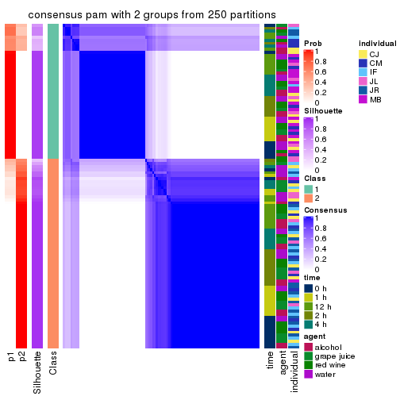</p>

</div>
<div id='tab-CV-pam-consensus-heatmap-2'>
<pre><code class="r">consensus_heatmap(res, k = 3)
</code></pre>

<p>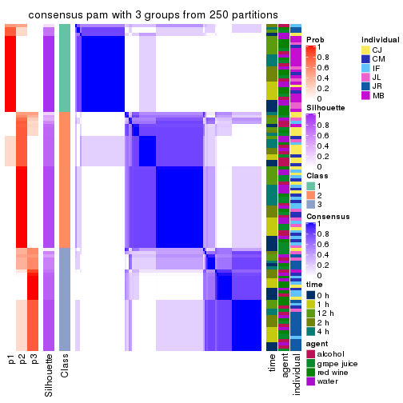</p>

</div>
<div id='tab-CV-pam-consensus-heatmap-3'>
<pre><code class="r">consensus_heatmap(res, k = 4)
</code></pre>

<p>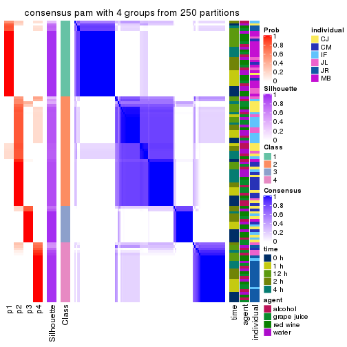</p>

</div>
<div id='tab-CV-pam-consensus-heatmap-4'>
<pre><code class="r">consensus_heatmap(res, k = 5)
</code></pre>

<p>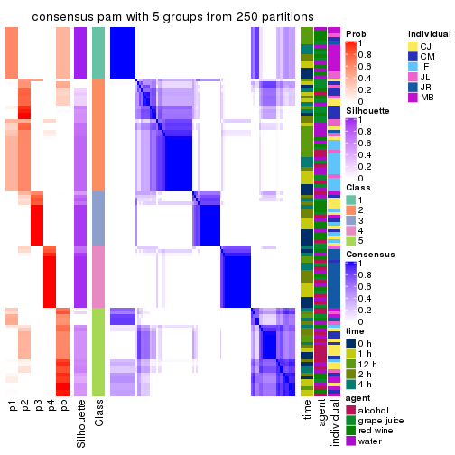</p>

</div>
<div id='tab-CV-pam-consensus-heatmap-5'>
<pre><code class="r">consensus_heatmap(res, k = 6)
</code></pre>

<p>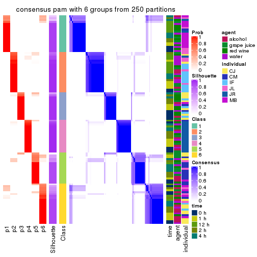</p>

</div>
</div>

Heatmaps for the membership of samples in all partitions to see how consistent they are:


<script>
$( function() {
	$( '#tabs-CV-pam-membership-heatmap' ).tabs();
} );
</script>
<div id='tabs-CV-pam-membership-heatmap'>
<ul>
<li><a href='#tab-CV-pam-membership-heatmap-1'>k = 2</a></li>
<li><a href='#tab-CV-pam-membership-heatmap-2'>k = 3</a></li>
<li><a href='#tab-CV-pam-membership-heatmap-3'>k = 4</a></li>
<li><a href='#tab-CV-pam-membership-heatmap-4'>k = 5</a></li>
<li><a href='#tab-CV-pam-membership-heatmap-5'>k = 6</a></li>
</ul>
<div id='tab-CV-pam-membership-heatmap-1'>
<pre><code class="r">membership_heatmap(res, k = 2)
</code></pre>

<p>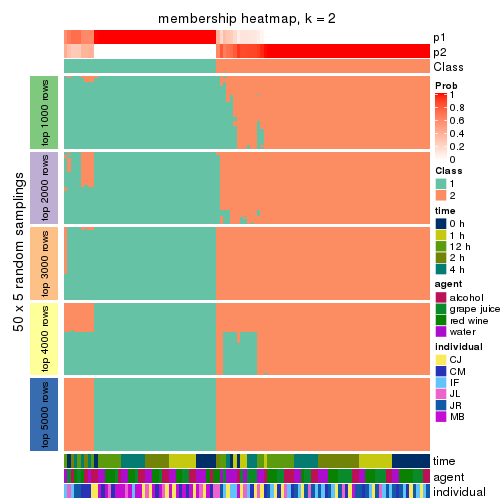</p>

</div>
<div id='tab-CV-pam-membership-heatmap-2'>
<pre><code class="r">membership_heatmap(res, k = 3)
</code></pre>

<p>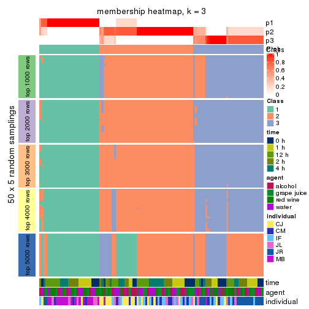</p>

</div>
<div id='tab-CV-pam-membership-heatmap-3'>
<pre><code class="r">membership_heatmap(res, k = 4)
</code></pre>

<p>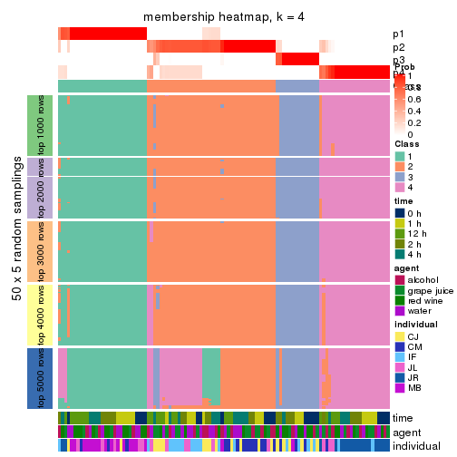</p>

</div>
<div id='tab-CV-pam-membership-heatmap-4'>
<pre><code class="r">membership_heatmap(res, k = 5)
</code></pre>

<p>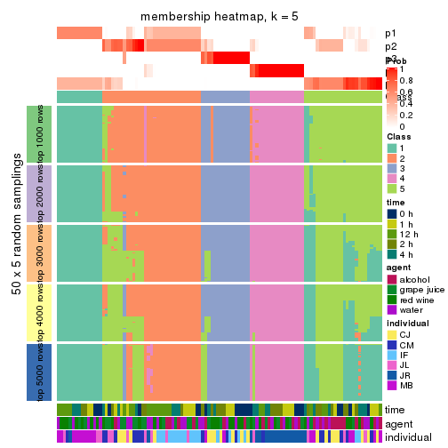</p>

</div>
<div id='tab-CV-pam-membership-heatmap-5'>
<pre><code class="r">membership_heatmap(res, k = 6)
</code></pre>

<p>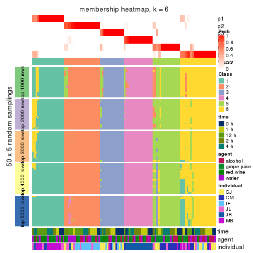</p>

</div>
</div>

As soon as we have had the classes for columns, we can look for signatures
which are significantly different between classes which can be candidate marks
for certain classes. Following are the heatmaps for signatures.


Signature heatmaps where rows are scaled:


<script>
$( function() {
	$( '#tabs-CV-pam-get-signatures' ).tabs();
} );
</script>
<div id='tabs-CV-pam-get-signatures'>
<ul>
<li><a href='#tab-CV-pam-get-signatures-1'>k = 2</a></li>
<li><a href='#tab-CV-pam-get-signatures-2'>k = 3</a></li>
<li><a href='#tab-CV-pam-get-signatures-3'>k = 4</a></li>
<li><a href='#tab-CV-pam-get-signatures-4'>k = 5</a></li>
<li><a href='#tab-CV-pam-get-signatures-5'>k = 6</a></li>
</ul>
<div id='tab-CV-pam-get-signatures-1'>
<pre><code class="r">get_signatures(res, k = 2)
</code></pre>

<p>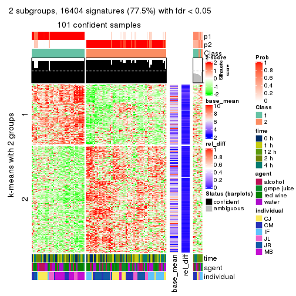</p>

</div>
<div id='tab-CV-pam-get-signatures-2'>
<pre><code class="r">get_signatures(res, k = 3)
</code></pre>

<p>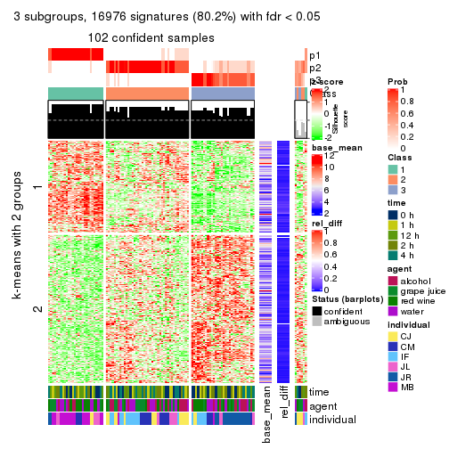</p>

</div>
<div id='tab-CV-pam-get-signatures-3'>
<pre><code class="r">get_signatures(res, k = 4)
</code></pre>

<p>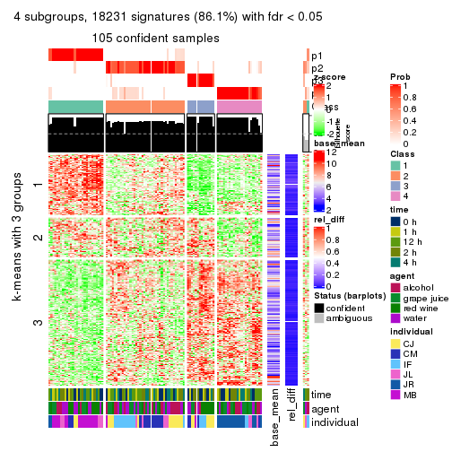</p>

</div>
<div id='tab-CV-pam-get-signatures-4'>
<pre><code class="r">get_signatures(res, k = 5)
</code></pre>

<p>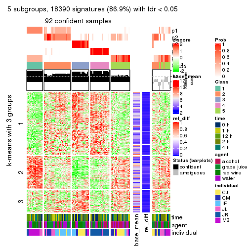</p>

</div>
<div id='tab-CV-pam-get-signatures-5'>
<pre><code class="r">get_signatures(res, k = 6)
</code></pre>

<p>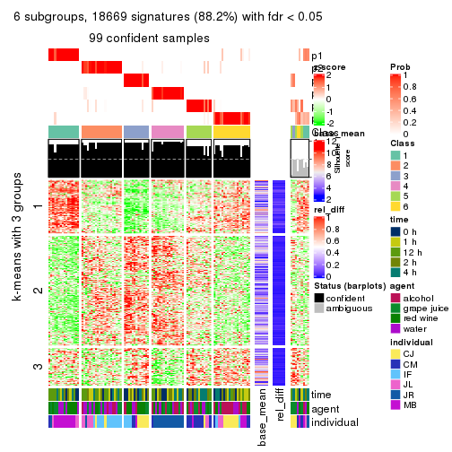</p>

</div>
</div>


Signature heatmaps where rows are not scaled:


<script>
$( function() {
	$( '#tabs-CV-pam-get-signatures-no-scale' ).tabs();
} );
</script>
<div id='tabs-CV-pam-get-signatures-no-scale'>
<ul>
<li><a href='#tab-CV-pam-get-signatures-no-scale-1'>k = 2</a></li>
<li><a href='#tab-CV-pam-get-signatures-no-scale-2'>k = 3</a></li>
<li><a href='#tab-CV-pam-get-signatures-no-scale-3'>k = 4</a></li>
<li><a href='#tab-CV-pam-get-signatures-no-scale-4'>k = 5</a></li>
<li><a href='#tab-CV-pam-get-signatures-no-scale-5'>k = 6</a></li>
</ul>
<div id='tab-CV-pam-get-signatures-no-scale-1'>
<pre><code class="r">get_signatures(res, k = 2, scale_rows = FALSE)
</code></pre>

<p>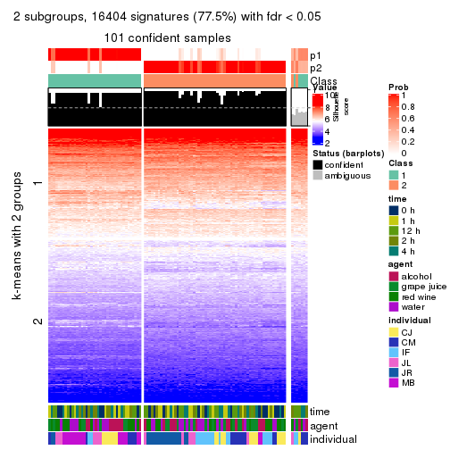</p>

</div>
<div id='tab-CV-pam-get-signatures-no-scale-2'>
<pre><code class="r">get_signatures(res, k = 3, scale_rows = FALSE)
</code></pre>

<p>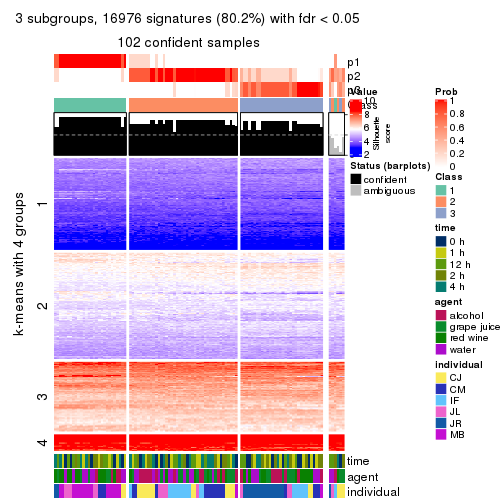</p>

</div>
<div id='tab-CV-pam-get-signatures-no-scale-3'>
<pre><code class="r">get_signatures(res, k = 4, scale_rows = FALSE)
</code></pre>

<p>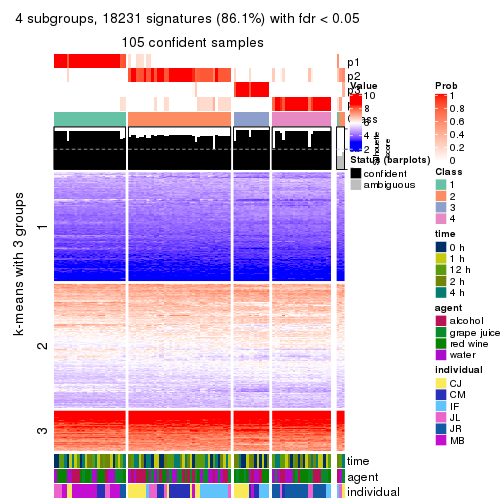</p>

</div>
<div id='tab-CV-pam-get-signatures-no-scale-4'>
<pre><code class="r">get_signatures(res, k = 5, scale_rows = FALSE)
</code></pre>

<p>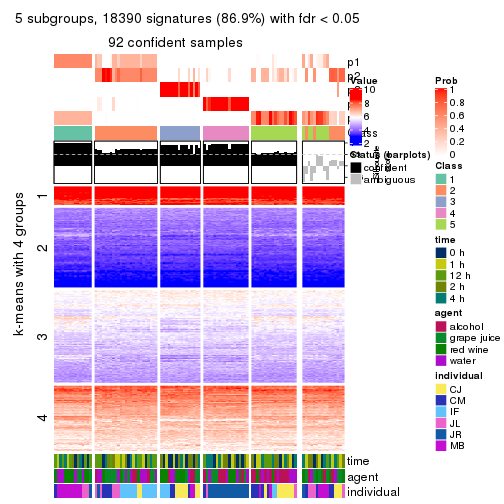</p>

</div>
<div id='tab-CV-pam-get-signatures-no-scale-5'>
<pre><code class="r">get_signatures(res, k = 6, scale_rows = FALSE)
</code></pre>

<p>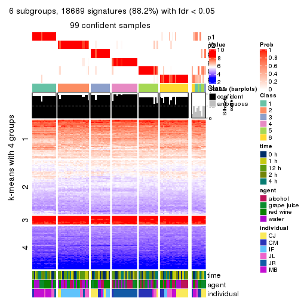</p>

</div>
</div>


Compare the overlap of signatures from different k:

```r
compare_signatures(res)
```

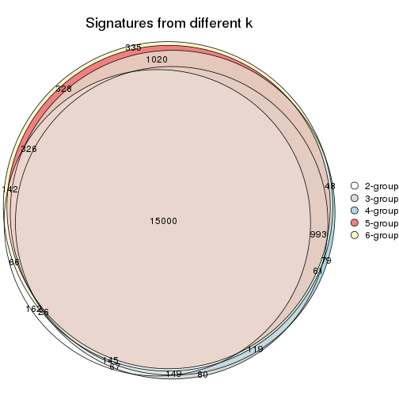

`get_signature()` returns a data frame invisibly. TO get the list of signatures, the function
call should be assigned to a variable explicitly. In following code, if `plot` argument is set
to `FALSE`, no heatmap is plotted while only the differential analysis is performed.

```r
# code only for demonstration
tb = get_signature(res, k = ..., plot = FALSE)
```

An example of the output of `tb` is:

```
#>   which_row         fdr    mean_1    mean_2 scaled_mean_1 scaled_mean_2 km
#> 1        38 0.042760348  8.373488  9.131774    -0.5533452     0.5164555  1
#> 2        40 0.018707592  7.106213  8.469186    -0.6173731     0.5762149  1
#> 3        55 0.019134737 10.221463 11.207825    -0.6159697     0.5749050  1
#> 4        59 0.006059896  5.921854  7.869574    -0.6899429     0.6439467  1
#> 5        60 0.018055526  8.928898 10.211722    -0.6204761     0.5791110  1
#> 6        98 0.009384629 15.714769 14.887706     0.6635654    -0.6193277  2
...
```

The columns in `tb` are:

1. `which_row`: row indices corresponding to the input matrix.
2. `fdr`: FDR for the differential test. 
3. `mean_x`: The mean value in group x.
4. `scaled_mean_x`: The mean value in group x after rows are scaled.
5. `km`: Row groups if k-means clustering is applied to rows.


UMAP plot which shows how samples are separated.


<script>
$( function() {
	$( '#tabs-CV-pam-dimension-reduction' ).tabs();
} );
</script>
<div id='tabs-CV-pam-dimension-reduction'>
<ul>
<li><a href='#tab-CV-pam-dimension-reduction-1'>k = 2</a></li>
<li><a href='#tab-CV-pam-dimension-reduction-2'>k = 3</a></li>
<li><a href='#tab-CV-pam-dimension-reduction-3'>k = 4</a></li>
<li><a href='#tab-CV-pam-dimension-reduction-4'>k = 5</a></li>
<li><a href='#tab-CV-pam-dimension-reduction-5'>k = 6</a></li>
</ul>
<div id='tab-CV-pam-dimension-reduction-1'>
<pre><code class="r">dimension_reduction(res, k = 2, method = &quot;UMAP&quot;)
</code></pre>

<p>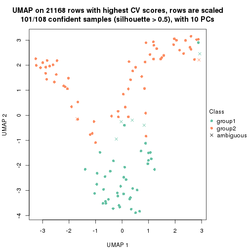</p>

</div>
<div id='tab-CV-pam-dimension-reduction-2'>
<pre><code class="r">dimension_reduction(res, k = 3, method = &quot;UMAP&quot;)
</code></pre>

<p>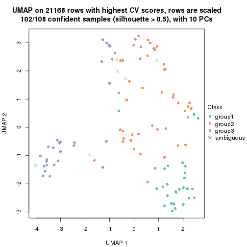</p>

</div>
<div id='tab-CV-pam-dimension-reduction-3'>
<pre><code class="r">dimension_reduction(res, k = 4, method = &quot;UMAP&quot;)
</code></pre>

<p>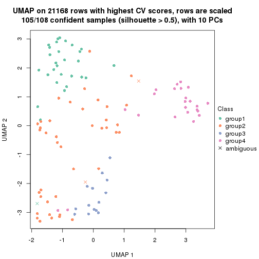</p>

</div>
<div id='tab-CV-pam-dimension-reduction-4'>
<pre><code class="r">dimension_reduction(res, k = 5, method = &quot;UMAP&quot;)
</code></pre>

<p>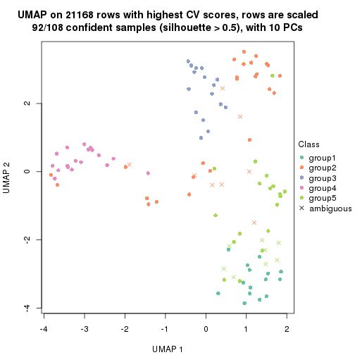</p>

</div>
<div id='tab-CV-pam-dimension-reduction-5'>
<pre><code class="r">dimension_reduction(res, k = 6, method = &quot;UMAP&quot;)
</code></pre>

<p>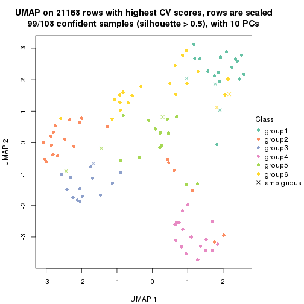</p>

</div>
</div>


Following heatmap shows how subgroups are split when increasing `k`:

```r
collect_classes(res)
```

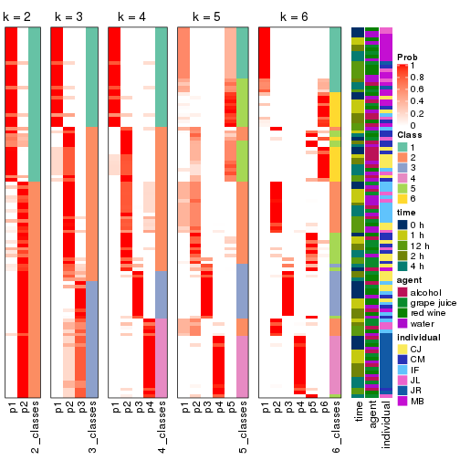


Test correlation between subgroups and known annotations. If the known
annotation is numeric, one-way ANOVA test is applied, and if the known
annotation is discrete, chi-squared contingency table test is applied.

```r
test_to_known_factors(res)
```

```
#>          n time(p) agent(p) individual(p) k
#> CV:pam 101   0.995  0.56567      6.91e-06 2
#> CV:pam 102   0.777  0.31035      1.49e-13 3
#> CV:pam 105   0.660  0.19909      3.75e-18 4
#> CV:pam  92   0.449  0.00485      1.83e-19 5
#> CV:pam  99   0.172  0.04727      2.02e-26 6
```


If matrix rows can be associated to genes, consider to use `GO_Enrichment(res,
...)` to perform function enrichment for the signature genes.


 

---------------------------------------------------


### CV:mclust


The object with results only for a single top-value method and a single partition method 
can be extracted as:

```r
res = res_list["CV", "mclust"]
# you can also extract it by
# res = res_list["CV:mclust"]
```

A summary of `res` and all the functions that can be applied to it:

```r
res
```

```
#> A 'ConsensusPartition' object with k = 2, 3, 4, 5, 6.
#>   On a matrix with 21168 rows and 108 columns.
#>   Top rows (1000, 2000, 3000, 4000, 5000) are extracted by 'CV' method.
#>   Subgroups are detected by 'mclust' method.
#>   Performed in total 1250 partitions by row resampling.
#>   Best k for subgroups seems to be 5.
#> 
#> Following methods can be applied to this 'ConsensusPartition' object:
#>  [1] "cola_report"             "collect_classes"         "collect_plots"          
#>  [4] "collect_stats"           "colnames"                "compare_signatures"     
#>  [7] "consensus_heatmap"       "dimension_reduction"     "functional_enrichment"  
#> [10] "get_anno_col"            "get_anno"                "get_classes"            
#> [13] "get_consensus"           "get_matrix"              "get_membership"         
#> [16] "get_param"               "get_signatures"          "get_stats"              
#> [19] "is_best_k"               "is_stable_k"             "membership_heatmap"     
#> [22] "ncol"                    "nrow"                    "plot_ecdf"              
#> [25] "rownames"                "select_partition_number" "show"                   
#> [28] "suggest_best_k"          "test_to_known_factors"
```

`collect_plots()` function collects all the plots made from `res` for all `k` (number of partitions)
into one single page to provide an easy and fast comparison between different `k`.

```r
collect_plots(res)
```

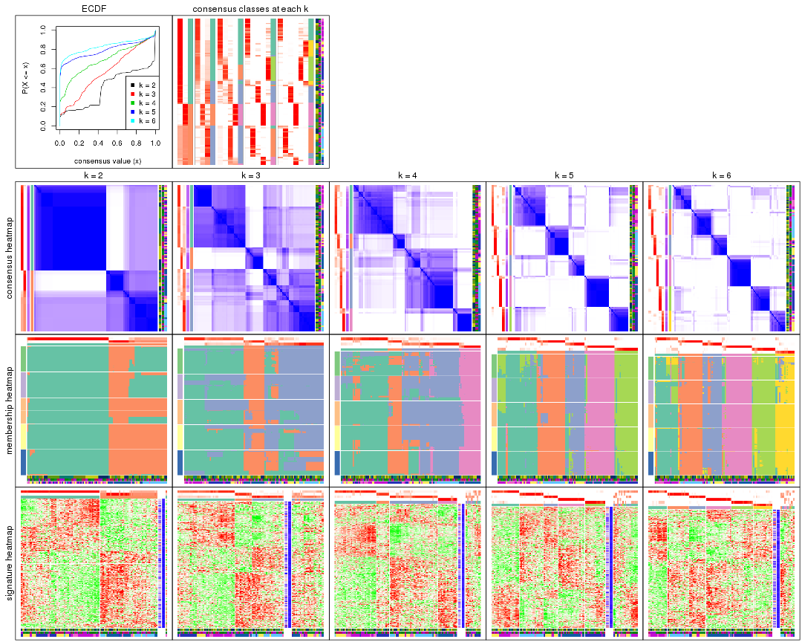

The plots are:

- The first row: a plot of the ECDF (Empirical cumulative distribution
  function) curves of the consensus matrix for each `k` and the heatmap of
  predicted classes for each `k`.
- The second row: heatmaps of the consensus matrix for each `k`.
- The third row: heatmaps of the membership matrix for each `k`.
- The fouth row: heatmaps of the signatures for each `k`.

All the plots in panels can be made by individual functions and they are
plotted later in this section.

`select_partition_number()` produces several plots showing different
statistics for choosing "optimized" `k`. There are following statistics:

- ECDF curves of the consensus matrix for each `k`;
- 1-PAC. [The PAC
  score](https://en.wikipedia.org/wiki/Consensus_clustering#Over-interpretation_potential_of_consensus_clustering)
  measures the proportion of the ambiguous subgrouping.
- Mean silhouette score.
- Concordance. The mean probability of fiting the consensus class ids in all
  partitions.
- Area increased. Denote $A_k$ as the area under the ECDF curve for current
  `k`, the area increased is defined as $A_k - A_{k-1}$.
- Rand index. The percent of pairs of samples that are both in a same cluster
  or both are not in a same cluster in the partition of k and k-1.
- Jaccard index. The ratio of pairs of samples are both in a same cluster in
  the partition of k and k-1 and the pairs of samples are both in a same
  cluster in the partition k or k-1.

The detailed explanations of these statistics can be found in [the cola
vignette](http://bioconductor.org/packages/devel/bioc/vignettes/cola/inst/doc/cola.html#toc_13).

Generally speaking, lower PAC score, higher mean silhouette score or higher
concordance corresponds to better partition. Rand index and Jaccard index
measure how similar the current partition is compared to partition with `k-1`.
If they are too similar, we won't accept `k` is better than `k-1`.

```r
select_partition_number(res)
```

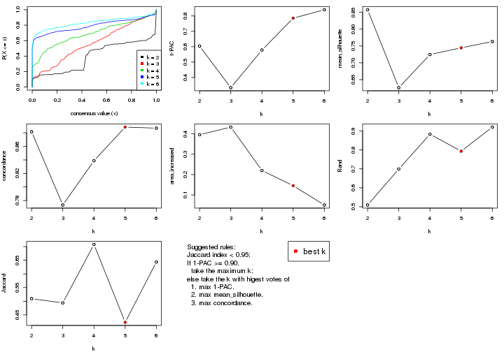

The numeric values for all these statistics can be obtained by `get_stats()`.

```r
get_stats(res)
```

```
#>   k 1-PAC mean_silhouette concordance area_increased  Rand Jaccard
#> 2 2 0.604           0.857       0.882         0.3959 0.509   0.509
#> 3 3 0.334           0.626       0.773         0.4335 0.699   0.494
#> 4 4 0.578           0.725       0.839         0.2199 0.883   0.708
#> 5 5 0.785           0.744       0.888         0.1454 0.793   0.423
#> 6 6 0.840           0.763       0.887         0.0506 0.921   0.644
```

`suggest_best_k()` suggests the best $k$ based on these statistics. The rules are as follows:

- All $k$ with Jaccard index larger than 0.95 are removed because the increase of
  the partition number does not provides enough extra information. If all $k$ are removed,
  the best $k$ is assigned by `NA`.
- For $k$ with 1-PAC larger than 0.9, the maximal $k$ is taken as the "best k". Other $k$ is called "optional k".
- If it does not fit the second rule. The $k$ with the highest vote of highest
  1-PAC, mean silhouette and concordance is taken as the "best k".

```r
suggest_best_k(res)
```

```
#> [1] 5
```


Following shows the table of the partitions (You need to click the **show/hide
code output** link to see it). The membership matrix (columns with name `p*`)
is inferred by
[`clue::cl_consensus()`](https://www.rdocumentation.org/link/cl_consensus?package=clue)
function with the `SE` method. Basically the value in the membership matrix
represents the probability to belong to a certain group. The finall class
label for an item is determined with the group with highest probability it
belongs to.

In `get_classes()` function, the entropy is calculated from the membership
matrix and the silhouette score is calculated from the consensus matrix.


<script>
$( function() {
	$( '#tabs-CV-mclust-get-classes' ).tabs();
} );
</script>
<div id='tabs-CV-mclust-get-classes'>
<ul>
<li><a href='#tab-CV-mclust-get-classes-1'>k = 2</a></li>
<li><a href='#tab-CV-mclust-get-classes-2'>k = 3</a></li>
<li><a href='#tab-CV-mclust-get-classes-3'>k = 4</a></li>
<li><a href='#tab-CV-mclust-get-classes-4'>k = 5</a></li>
<li><a href='#tab-CV-mclust-get-classes-5'>k = 6</a></li>
</ul>

<div id='tab-CV-mclust-get-classes-1'>
<p><a id='tab-CV-mclust-get-classes-1-a' style='color:#0366d6' href='#'>show/hide code output</a></p>
<pre><code class="r">cbind(get_classes(res, k = 2), get_membership(res, k = 2))
</code></pre>

<pre><code>#&gt;          class entropy silhouette    p1    p2
#&gt; GSM87863     1  0.0000      0.986 1.000 0.000
#&gt; GSM87887     1  0.0000      0.986 1.000 0.000
#&gt; GSM87896     2  0.9815      0.714 0.420 0.580
#&gt; GSM87934     2  0.0000      0.681 0.000 1.000
#&gt; GSM87943     1  0.0672      0.979 0.992 0.008
#&gt; GSM87853     1  0.0672      0.979 0.992 0.008
#&gt; GSM87906     2  0.9850      0.709 0.428 0.572
#&gt; GSM87920     1  0.0000      0.986 1.000 0.000
#&gt; GSM87924     2  0.8267      0.724 0.260 0.740
#&gt; GSM87858     2  0.9933      0.666 0.452 0.548
#&gt; GSM87882     1  0.0672      0.979 0.992 0.008
#&gt; GSM87891     2  0.9815      0.714 0.420 0.580
#&gt; GSM87917     1  0.0000      0.986 1.000 0.000
#&gt; GSM87929     2  0.0000      0.681 0.000 1.000
#&gt; GSM87948     1  0.0000      0.986 1.000 0.000
#&gt; GSM87868     1  0.0000      0.986 1.000 0.000
#&gt; GSM87873     1  0.2236      0.946 0.964 0.036
#&gt; GSM87901     2  0.9850      0.709 0.428 0.572
#&gt; GSM87910     1  0.0000      0.986 1.000 0.000
#&gt; GSM87938     2  0.0000      0.681 0.000 1.000
#&gt; GSM87953     1  0.0000      0.986 1.000 0.000
#&gt; GSM87864     1  0.0000      0.986 1.000 0.000
#&gt; GSM87888     1  0.0000      0.986 1.000 0.000
#&gt; GSM87897     2  0.9850      0.709 0.428 0.572
#&gt; GSM87935     2  0.2948      0.695 0.052 0.948
#&gt; GSM87944     1  0.0000      0.986 1.000 0.000
#&gt; GSM87854     1  0.0000      0.986 1.000 0.000
#&gt; GSM87878     1  0.0000      0.986 1.000 0.000
#&gt; GSM87907     2  0.9815      0.714 0.420 0.580
#&gt; GSM87921     2  0.9850      0.709 0.428 0.572
#&gt; GSM87925     2  0.0000      0.681 0.000 1.000
#&gt; GSM87957     1  0.0000      0.986 1.000 0.000
#&gt; GSM87859     1  0.2948      0.923 0.948 0.052
#&gt; GSM87883     1  0.0000      0.986 1.000 0.000
#&gt; GSM87892     2  0.9815      0.714 0.420 0.580
#&gt; GSM87930     2  0.0000      0.681 0.000 1.000
#&gt; GSM87949     1  0.0000      0.986 1.000 0.000
#&gt; GSM87869     1  0.0000      0.986 1.000 0.000
#&gt; GSM87874     1  0.0672      0.979 0.992 0.008
#&gt; GSM87902     2  0.9850      0.709 0.428 0.572
#&gt; GSM87911     1  0.3733      0.885 0.928 0.072
#&gt; GSM87939     2  0.0000      0.681 0.000 1.000
#&gt; GSM87954     1  0.0000      0.986 1.000 0.000
#&gt; GSM87865     1  0.0000      0.986 1.000 0.000
#&gt; GSM87889     1  0.0000      0.986 1.000 0.000
#&gt; GSM87898     2  0.9850      0.709 0.428 0.572
#&gt; GSM87915     1  0.0000      0.986 1.000 0.000
#&gt; GSM87936     2  0.2778      0.694 0.048 0.952
#&gt; GSM87945     1  0.0672      0.979 0.992 0.008
#&gt; GSM87855     1  0.0672      0.979 0.992 0.008
#&gt; GSM87879     1  0.0000      0.986 1.000 0.000
#&gt; GSM87922     1  0.8144      0.456 0.748 0.252
#&gt; GSM87926     2  0.0000      0.681 0.000 1.000
#&gt; GSM87958     1  0.0000      0.986 1.000 0.000
#&gt; GSM87860     1  0.3733      0.892 0.928 0.072
#&gt; GSM87884     1  0.0000      0.986 1.000 0.000
#&gt; GSM87893     2  0.9815      0.714 0.420 0.580
#&gt; GSM87918     2  0.9944      0.664 0.456 0.544
#&gt; GSM87931     2  0.0000      0.681 0.000 1.000
#&gt; GSM87950     1  0.0000      0.986 1.000 0.000
#&gt; GSM87870     1  0.0000      0.986 1.000 0.000
#&gt; GSM87875     1  0.0672      0.979 0.992 0.008
#&gt; GSM87903     2  0.9815      0.714 0.420 0.580
#&gt; GSM87912     1  0.0000      0.986 1.000 0.000
#&gt; GSM87940     2  0.0000      0.681 0.000 1.000
#&gt; GSM87866     1  0.0000      0.986 1.000 0.000
#&gt; GSM87899     2  0.9815      0.714 0.420 0.580
#&gt; GSM87937     2  0.0000      0.681 0.000 1.000
#&gt; GSM87946     1  0.0000      0.986 1.000 0.000
#&gt; GSM87856     1  0.0672      0.979 0.992 0.008
#&gt; GSM87880     1  0.0000      0.986 1.000 0.000
#&gt; GSM87908     2  0.9850      0.709 0.428 0.572
#&gt; GSM87923     1  0.0672      0.979 0.992 0.008
#&gt; GSM87927     2  0.8081      0.722 0.248 0.752
#&gt; GSM87959     1  0.0000      0.986 1.000 0.000
#&gt; GSM87861     1  0.2236      0.946 0.964 0.036
#&gt; GSM87885     1  0.0000      0.986 1.000 0.000
#&gt; GSM87894     1  0.0000      0.986 1.000 0.000
#&gt; GSM87932     2  0.9833      0.712 0.424 0.576
#&gt; GSM87951     1  0.0000      0.986 1.000 0.000
#&gt; GSM87871     1  0.0000      0.986 1.000 0.000
#&gt; GSM87876     1  0.0000      0.986 1.000 0.000
#&gt; GSM87904     2  0.9815      0.714 0.420 0.580
#&gt; GSM87913     1  0.0000      0.986 1.000 0.000
#&gt; GSM87941     2  0.2778      0.694 0.048 0.952
#&gt; GSM87955     1  0.0000      0.986 1.000 0.000
#&gt; GSM87867     1  0.0000      0.986 1.000 0.000
#&gt; GSM87890     2  0.9933      0.666 0.452 0.548
#&gt; GSM87900     2  0.9815      0.714 0.420 0.580
#&gt; GSM87916     2  0.0938      0.685 0.012 0.988
#&gt; GSM87947     1  0.0000      0.986 1.000 0.000
#&gt; GSM87857     1  0.0672      0.979 0.992 0.008
#&gt; GSM87881     1  0.0000      0.986 1.000 0.000
#&gt; GSM87909     2  0.9850      0.709 0.428 0.572
#&gt; GSM87928     2  0.8861      0.724 0.304 0.696
#&gt; GSM87960     1  0.0000      0.986 1.000 0.000
#&gt; GSM87862     2  0.9933      0.666 0.452 0.548
#&gt; GSM87886     1  0.0000      0.986 1.000 0.000
#&gt; GSM87895     2  0.9815      0.714 0.420 0.580
#&gt; GSM87919     1  0.0000      0.986 1.000 0.000
#&gt; GSM87933     2  0.0000      0.681 0.000 1.000
#&gt; GSM87952     1  0.0000      0.986 1.000 0.000
#&gt; GSM87872     2  0.9954      0.657 0.460 0.540
#&gt; GSM87877     1  0.0000      0.986 1.000 0.000
#&gt; GSM87905     2  0.9850      0.709 0.428 0.572
#&gt; GSM87914     2  0.8861      0.724 0.304 0.696
#&gt; GSM87942     2  0.6531      0.712 0.168 0.832
#&gt; GSM87956     1  0.0000      0.986 1.000 0.000
</code></pre>

<script>
$('#tab-CV-mclust-get-classes-1-a').parent().next().next().hide();
$('#tab-CV-mclust-get-classes-1-a').click(function(){
  $('#tab-CV-mclust-get-classes-1-a').parent().next().next().toggle();
  return(false);
});
</script>
</div>

<div id='tab-CV-mclust-get-classes-2'>
<p><a id='tab-CV-mclust-get-classes-2-a' style='color:#0366d6' href='#'>show/hide code output</a></p>
<pre><code class="r">cbind(get_classes(res, k = 3), get_membership(res, k = 3))
</code></pre>

<pre><code>#&gt;          class entropy silhouette    p1    p2    p3
#&gt; GSM87863     1  0.6140    0.53296 0.596 0.000 0.404
#&gt; GSM87887     1  0.6491    0.77050 0.732 0.052 0.216
#&gt; GSM87896     3  0.0424    0.67132 0.000 0.008 0.992
#&gt; GSM87934     2  0.2165    0.83681 0.000 0.936 0.064
#&gt; GSM87943     3  0.6172    0.34640 0.308 0.012 0.680
#&gt; GSM87853     3  0.5919    0.41427 0.276 0.012 0.712
#&gt; GSM87906     3  0.2711    0.66792 0.000 0.088 0.912
#&gt; GSM87920     1  0.5431    0.76240 0.716 0.000 0.284
#&gt; GSM87924     3  0.6252   -0.02840 0.000 0.444 0.556
#&gt; GSM87858     3  0.0237    0.67034 0.004 0.000 0.996
#&gt; GSM87882     1  0.6662    0.76072 0.716 0.052 0.232
#&gt; GSM87891     3  0.2860    0.66983 0.004 0.084 0.912
#&gt; GSM87917     1  0.1964    0.74298 0.944 0.000 0.056
#&gt; GSM87929     2  0.2165    0.83681 0.000 0.936 0.064
#&gt; GSM87948     1  0.4702    0.79253 0.788 0.000 0.212
#&gt; GSM87868     1  0.5216    0.77786 0.740 0.000 0.260
#&gt; GSM87873     3  0.4194    0.66100 0.060 0.064 0.876
#&gt; GSM87901     3  0.2945    0.66816 0.004 0.088 0.908
#&gt; GSM87910     1  0.1964    0.74298 0.944 0.000 0.056
#&gt; GSM87938     2  0.2165    0.83681 0.000 0.936 0.064
#&gt; GSM87953     1  0.1964    0.74298 0.944 0.000 0.056
#&gt; GSM87864     1  0.5465    0.75540 0.712 0.000 0.288
#&gt; GSM87888     1  0.6621    0.76344 0.720 0.052 0.228
#&gt; GSM87897     3  0.2860    0.67094 0.004 0.084 0.912
#&gt; GSM87935     2  0.6244    0.41267 0.000 0.560 0.440
#&gt; GSM87944     1  0.5216    0.77786 0.740 0.000 0.260
#&gt; GSM87854     3  0.5919    0.41427 0.276 0.012 0.712
#&gt; GSM87878     1  0.6999    0.76719 0.680 0.052 0.268
#&gt; GSM87907     3  0.2625    0.66989 0.000 0.084 0.916
#&gt; GSM87921     3  0.7072    0.57445 0.160 0.116 0.724
#&gt; GSM87925     2  0.5138    0.73564 0.000 0.748 0.252
#&gt; GSM87957     1  0.5254    0.77714 0.736 0.000 0.264
#&gt; GSM87859     3  0.3377    0.65910 0.092 0.012 0.896
#&gt; GSM87883     1  0.4654    0.79236 0.792 0.000 0.208
#&gt; GSM87892     3  0.0237    0.67034 0.004 0.000 0.996
#&gt; GSM87930     2  0.2165    0.83681 0.000 0.936 0.064
#&gt; GSM87949     1  0.1964    0.74298 0.944 0.000 0.056
#&gt; GSM87869     1  0.5254    0.77714 0.736 0.000 0.264
#&gt; GSM87874     3  0.7164    0.37630 0.256 0.064 0.680
#&gt; GSM87902     3  0.2860    0.67094 0.004 0.084 0.912
#&gt; GSM87911     3  0.5397    0.46666 0.280 0.000 0.720
#&gt; GSM87939     2  0.2165    0.83681 0.000 0.936 0.064
#&gt; GSM87954     1  0.2448    0.72840 0.924 0.000 0.076
#&gt; GSM87865     3  0.6274   -0.07565 0.456 0.000 0.544
#&gt; GSM87889     1  0.6578    0.76600 0.724 0.052 0.224
#&gt; GSM87898     3  0.3043    0.67056 0.008 0.084 0.908
#&gt; GSM87915     1  0.2796    0.75272 0.908 0.000 0.092
#&gt; GSM87936     2  0.6215    0.44248 0.000 0.572 0.428
#&gt; GSM87945     3  0.6172    0.34640 0.308 0.012 0.680
#&gt; GSM87855     3  0.5919    0.41427 0.276 0.012 0.712
#&gt; GSM87879     1  0.6662    0.76072 0.716 0.052 0.232
#&gt; GSM87922     3  0.8357    0.43109 0.232 0.148 0.620
#&gt; GSM87926     2  0.2165    0.83681 0.000 0.936 0.064
#&gt; GSM87958     1  0.1964    0.74298 0.944 0.000 0.056
#&gt; GSM87860     3  0.3618    0.65043 0.104 0.012 0.884
#&gt; GSM87884     1  0.4883    0.79204 0.788 0.004 0.208
#&gt; GSM87893     3  0.0237    0.67034 0.004 0.000 0.996
#&gt; GSM87918     3  0.8435    0.40733 0.268 0.132 0.600
#&gt; GSM87931     2  0.2165    0.83681 0.000 0.936 0.064
#&gt; GSM87950     1  0.1964    0.74298 0.944 0.000 0.056
#&gt; GSM87870     1  0.5465    0.75930 0.712 0.000 0.288
#&gt; GSM87875     1  0.7053    0.74021 0.692 0.064 0.244
#&gt; GSM87903     3  0.2625    0.66989 0.000 0.084 0.916
#&gt; GSM87912     1  0.2066    0.74260 0.940 0.000 0.060
#&gt; GSM87940     2  0.2165    0.83681 0.000 0.936 0.064
#&gt; GSM87866     1  0.5465    0.75520 0.712 0.000 0.288
#&gt; GSM87899     3  0.2625    0.66989 0.000 0.084 0.916
#&gt; GSM87937     2  0.3879    0.80253 0.000 0.848 0.152
#&gt; GSM87946     1  0.5216    0.77786 0.740 0.000 0.260
#&gt; GSM87856     3  0.5919    0.41427 0.276 0.012 0.712
#&gt; GSM87880     1  0.6621    0.76344 0.720 0.052 0.228
#&gt; GSM87908     3  0.2860    0.67094 0.004 0.084 0.912
#&gt; GSM87923     1  0.7924    0.67816 0.612 0.084 0.304
#&gt; GSM87927     3  0.6267   -0.07708 0.000 0.452 0.548
#&gt; GSM87959     1  0.1964    0.74298 0.944 0.000 0.056
#&gt; GSM87861     3  0.3989    0.63435 0.124 0.012 0.864
#&gt; GSM87885     1  0.6535    0.76832 0.728 0.052 0.220
#&gt; GSM87894     3  0.6225    0.01734 0.432 0.000 0.568
#&gt; GSM87932     3  0.8554    0.25923 0.116 0.324 0.560
#&gt; GSM87951     1  0.1964    0.74298 0.944 0.000 0.056
#&gt; GSM87871     3  0.6235   -0.00626 0.436 0.000 0.564
#&gt; GSM87876     1  0.6535    0.76832 0.728 0.052 0.220
#&gt; GSM87904     3  0.0000    0.67054 0.000 0.000 1.000
#&gt; GSM87913     1  0.6295    0.33988 0.528 0.000 0.472
#&gt; GSM87941     2  0.6299    0.28377 0.000 0.524 0.476
#&gt; GSM87955     1  0.1964    0.74298 0.944 0.000 0.056
#&gt; GSM87867     1  0.5291    0.77249 0.732 0.000 0.268
#&gt; GSM87890     3  0.9258    0.28098 0.204 0.272 0.524
#&gt; GSM87900     3  0.2711    0.66792 0.000 0.088 0.912
#&gt; GSM87916     2  0.5291    0.71945 0.000 0.732 0.268
#&gt; GSM87947     1  0.4796    0.79085 0.780 0.000 0.220
#&gt; GSM87857     3  0.5919    0.41427 0.276 0.012 0.712
#&gt; GSM87881     1  0.7453    0.72239 0.680 0.092 0.228
#&gt; GSM87909     3  0.6488    0.60215 0.160 0.084 0.756
#&gt; GSM87928     3  0.8530    0.20918 0.108 0.344 0.548
#&gt; GSM87960     1  0.2261    0.74819 0.932 0.000 0.068
#&gt; GSM87862     3  0.2625    0.66989 0.000 0.084 0.916
#&gt; GSM87886     1  0.4883    0.79204 0.788 0.004 0.208
#&gt; GSM87895     3  0.2625    0.66989 0.000 0.084 0.916
#&gt; GSM87919     1  0.1964    0.74298 0.944 0.000 0.056
#&gt; GSM87933     2  0.2165    0.83681 0.000 0.936 0.064
#&gt; GSM87952     1  0.1964    0.74298 0.944 0.000 0.056
#&gt; GSM87872     3  0.8728    0.35157 0.288 0.144 0.568
#&gt; GSM87877     1  0.4883    0.79204 0.788 0.004 0.208
#&gt; GSM87905     3  0.3043    0.67056 0.008 0.084 0.908
#&gt; GSM87914     3  0.7601    0.02970 0.044 0.416 0.540
#&gt; GSM87942     2  0.5588    0.55452 0.004 0.720 0.276
#&gt; GSM87956     1  0.1964    0.74298 0.944 0.000 0.056
</code></pre>

<script>
$('#tab-CV-mclust-get-classes-2-a').parent().next().next().hide();
$('#tab-CV-mclust-get-classes-2-a').click(function(){
  $('#tab-CV-mclust-get-classes-2-a').parent().next().next().toggle();
  return(false);
});
</script>
</div>

<div id='tab-CV-mclust-get-classes-3'>
<p><a id='tab-CV-mclust-get-classes-3-a' style='color:#0366d6' href='#'>show/hide code output</a></p>
<pre><code class="r">cbind(get_classes(res, k = 4), get_membership(res, k = 4))
</code></pre>

<pre><code>#&gt;          class entropy silhouette    p1    p2    p3    p4
#&gt; GSM87863     1  0.3743     0.7584 0.824 0.016 0.160 0.000
#&gt; GSM87887     2  0.3444     0.8233 0.184 0.816 0.000 0.000
#&gt; GSM87896     3  0.1557     0.7997 0.056 0.000 0.944 0.000
#&gt; GSM87934     4  0.0000     0.8713 0.000 0.000 0.000 1.000
#&gt; GSM87943     3  0.6639     0.5110 0.284 0.120 0.596 0.000
#&gt; GSM87853     3  0.6613     0.5088 0.288 0.116 0.596 0.000
#&gt; GSM87906     3  0.1557     0.7997 0.056 0.000 0.944 0.000
#&gt; GSM87920     1  0.3249     0.7759 0.852 0.008 0.140 0.000
#&gt; GSM87924     4  0.6268    -0.0983 0.056 0.000 0.448 0.496
#&gt; GSM87858     3  0.1452     0.7675 0.008 0.036 0.956 0.000
#&gt; GSM87882     2  0.2081     0.9158 0.084 0.916 0.000 0.000
#&gt; GSM87891     3  0.1557     0.7997 0.056 0.000 0.944 0.000
#&gt; GSM87917     1  0.1706     0.8458 0.948 0.036 0.016 0.000
#&gt; GSM87929     4  0.0000     0.8713 0.000 0.000 0.000 1.000
#&gt; GSM87948     1  0.3688     0.6961 0.792 0.208 0.000 0.000
#&gt; GSM87868     1  0.0779     0.8544 0.980 0.004 0.016 0.000
#&gt; GSM87873     3  0.5331     0.5385 0.024 0.332 0.644 0.000
#&gt; GSM87901     3  0.1557     0.7997 0.056 0.000 0.944 0.000
#&gt; GSM87910     1  0.1798     0.8473 0.944 0.040 0.016 0.000
#&gt; GSM87938     4  0.0000     0.8713 0.000 0.000 0.000 1.000
#&gt; GSM87953     1  0.1706     0.8458 0.948 0.036 0.016 0.000
#&gt; GSM87864     1  0.2593     0.8143 0.892 0.004 0.104 0.000
#&gt; GSM87888     2  0.2081     0.9158 0.084 0.916 0.000 0.000
#&gt; GSM87897     3  0.1557     0.7997 0.056 0.000 0.944 0.000
#&gt; GSM87935     4  0.4331     0.5518 0.000 0.000 0.288 0.712
#&gt; GSM87944     1  0.0672     0.8542 0.984 0.008 0.008 0.000
#&gt; GSM87854     3  0.6779     0.5020 0.324 0.116 0.560 0.000
#&gt; GSM87878     2  0.6909     0.4303 0.364 0.520 0.116 0.000
#&gt; GSM87907     3  0.1557     0.7997 0.056 0.000 0.944 0.000
#&gt; GSM87921     3  0.2984     0.7853 0.084 0.000 0.888 0.028
#&gt; GSM87925     4  0.0000     0.8713 0.000 0.000 0.000 1.000
#&gt; GSM87957     1  0.0817     0.8521 0.976 0.024 0.000 0.000
#&gt; GSM87859     3  0.2924     0.7412 0.016 0.100 0.884 0.000
#&gt; GSM87883     1  0.4522     0.5100 0.680 0.320 0.000 0.000
#&gt; GSM87892     3  0.1557     0.7997 0.056 0.000 0.944 0.000
#&gt; GSM87930     4  0.0000     0.8713 0.000 0.000 0.000 1.000
#&gt; GSM87949     1  0.0921     0.8486 0.972 0.028 0.000 0.000
#&gt; GSM87869     1  0.0779     0.8544 0.980 0.004 0.016 0.000
#&gt; GSM87874     3  0.5331     0.5385 0.024 0.332 0.644 0.000
#&gt; GSM87902     3  0.1557     0.7997 0.056 0.000 0.944 0.000
#&gt; GSM87911     3  0.4483     0.6377 0.284 0.004 0.712 0.000
#&gt; GSM87939     4  0.0000     0.8713 0.000 0.000 0.000 1.000
#&gt; GSM87954     1  0.1929     0.8454 0.940 0.036 0.024 0.000
#&gt; GSM87865     1  0.4511     0.7213 0.784 0.040 0.176 0.000
#&gt; GSM87889     2  0.2081     0.9158 0.084 0.916 0.000 0.000
#&gt; GSM87898     3  0.1557     0.7997 0.056 0.000 0.944 0.000
#&gt; GSM87915     1  0.3166     0.7959 0.868 0.016 0.116 0.000
#&gt; GSM87936     4  0.3873     0.6536 0.000 0.000 0.228 0.772
#&gt; GSM87945     3  0.6232     0.4835 0.072 0.332 0.596 0.000
#&gt; GSM87855     3  0.6613     0.5088 0.288 0.116 0.596 0.000
#&gt; GSM87879     2  0.2081     0.9158 0.084 0.916 0.000 0.000
#&gt; GSM87922     3  0.8302     0.5360 0.104 0.236 0.548 0.112
#&gt; GSM87926     4  0.0000     0.8713 0.000 0.000 0.000 1.000
#&gt; GSM87958     1  0.0592     0.8522 0.984 0.016 0.000 0.000
#&gt; GSM87860     3  0.3144     0.7908 0.072 0.044 0.884 0.000
#&gt; GSM87884     1  0.4994    -0.0116 0.520 0.480 0.000 0.000
#&gt; GSM87893     3  0.1389     0.7966 0.048 0.000 0.952 0.000
#&gt; GSM87918     3  0.3400     0.7440 0.180 0.000 0.820 0.000
#&gt; GSM87931     4  0.0000     0.8713 0.000 0.000 0.000 1.000
#&gt; GSM87950     1  0.0921     0.8486 0.972 0.028 0.000 0.000
#&gt; GSM87870     1  0.2831     0.8031 0.876 0.004 0.120 0.000
#&gt; GSM87875     2  0.4171     0.8508 0.084 0.828 0.088 0.000
#&gt; GSM87903     3  0.1557     0.7997 0.056 0.000 0.944 0.000
#&gt; GSM87912     1  0.1837     0.8480 0.944 0.028 0.028 0.000
#&gt; GSM87940     4  0.0000     0.8713 0.000 0.000 0.000 1.000
#&gt; GSM87866     1  0.2714     0.8093 0.884 0.004 0.112 0.000
#&gt; GSM87899     3  0.1557     0.7997 0.056 0.000 0.944 0.000
#&gt; GSM87937     4  0.0000     0.8713 0.000 0.000 0.000 1.000
#&gt; GSM87946     1  0.1059     0.8550 0.972 0.016 0.012 0.000
#&gt; GSM87856     3  0.6613     0.5088 0.288 0.116 0.596 0.000
#&gt; GSM87880     2  0.2081     0.9158 0.084 0.916 0.000 0.000
#&gt; GSM87908     3  0.1557     0.7997 0.056 0.000 0.944 0.000
#&gt; GSM87923     3  0.7065     0.2252 0.124 0.404 0.472 0.000
#&gt; GSM87927     3  0.5157     0.5216 0.028 0.000 0.688 0.284
#&gt; GSM87959     1  0.1118     0.8473 0.964 0.036 0.000 0.000
#&gt; GSM87861     3  0.3080     0.7427 0.024 0.096 0.880 0.000
#&gt; GSM87885     2  0.2081     0.9158 0.084 0.916 0.000 0.000
#&gt; GSM87894     1  0.4755     0.6898 0.760 0.040 0.200 0.000
#&gt; GSM87932     3  0.4827     0.7157 0.092 0.000 0.784 0.124
#&gt; GSM87951     1  0.0921     0.8486 0.972 0.028 0.000 0.000
#&gt; GSM87871     3  0.6538     0.4392 0.392 0.080 0.528 0.000
#&gt; GSM87876     2  0.2149     0.9142 0.088 0.912 0.000 0.000
#&gt; GSM87904     3  0.1557     0.7997 0.056 0.000 0.944 0.000
#&gt; GSM87913     1  0.3539     0.7560 0.820 0.004 0.176 0.000
#&gt; GSM87941     4  0.4888     0.2411 0.000 0.000 0.412 0.588
#&gt; GSM87955     1  0.0592     0.8522 0.984 0.016 0.000 0.000
#&gt; GSM87867     1  0.2915     0.8277 0.892 0.028 0.080 0.000
#&gt; GSM87890     3  0.9132     0.1985 0.084 0.244 0.416 0.256
#&gt; GSM87900     3  0.1557     0.7997 0.056 0.000 0.944 0.000
#&gt; GSM87916     4  0.0524     0.8618 0.004 0.000 0.008 0.988
#&gt; GSM87947     1  0.4522     0.5249 0.680 0.320 0.000 0.000
#&gt; GSM87857     3  0.6613     0.5088 0.288 0.116 0.596 0.000
#&gt; GSM87881     2  0.4591     0.8194 0.084 0.800 0.116 0.000
#&gt; GSM87909     3  0.2342     0.7914 0.080 0.000 0.912 0.008
#&gt; GSM87928     3  0.6223     0.3633 0.060 0.000 0.556 0.384
#&gt; GSM87960     1  0.0921     0.8505 0.972 0.028 0.000 0.000
#&gt; GSM87862     3  0.2892     0.7930 0.068 0.036 0.896 0.000
#&gt; GSM87886     1  0.4761     0.3949 0.628 0.372 0.000 0.000
#&gt; GSM87895     3  0.1557     0.7997 0.056 0.000 0.944 0.000
#&gt; GSM87919     1  0.1706     0.8508 0.948 0.036 0.016 0.000
#&gt; GSM87933     4  0.0000     0.8713 0.000 0.000 0.000 1.000
#&gt; GSM87952     1  0.1022     0.8488 0.968 0.032 0.000 0.000
#&gt; GSM87872     3  0.4598     0.7228 0.160 0.044 0.792 0.004
#&gt; GSM87877     1  0.4866     0.3381 0.596 0.404 0.000 0.000
#&gt; GSM87905     3  0.1557     0.7997 0.056 0.000 0.944 0.000
#&gt; GSM87914     3  0.6111     0.3447 0.052 0.000 0.556 0.392
#&gt; GSM87942     4  0.0000     0.8713 0.000 0.000 0.000 1.000
#&gt; GSM87956     1  0.0921     0.8486 0.972 0.028 0.000 0.000
</code></pre>

<script>
$('#tab-CV-mclust-get-classes-3-a').parent().next().next().hide();
$('#tab-CV-mclust-get-classes-3-a').click(function(){
  $('#tab-CV-mclust-get-classes-3-a').parent().next().next().toggle();
  return(false);
});
</script>
</div>

<div id='tab-CV-mclust-get-classes-4'>
<p><a id='tab-CV-mclust-get-classes-4-a' style='color:#0366d6' href='#'>show/hide code output</a></p>
<pre><code class="r">cbind(get_classes(res, k = 5), get_membership(res, k = 5))
</code></pre>

<pre><code>#&gt;          class entropy silhouette    p1    p2    p3    p4    p5
#&gt; GSM87863     3  0.4425     0.1446 0.452 0.000 0.544 0.000 0.004
#&gt; GSM87887     5  0.0000     0.9079 0.000 0.000 0.000 0.000 1.000
#&gt; GSM87896     2  0.0162     0.8850 0.000 0.996 0.004 0.000 0.000
#&gt; GSM87934     4  0.0000     0.9442 0.000 0.000 0.000 1.000 0.000
#&gt; GSM87943     3  0.0609     0.8132 0.000 0.000 0.980 0.000 0.020
#&gt; GSM87853     3  0.0000     0.8172 0.000 0.000 1.000 0.000 0.000
#&gt; GSM87906     2  0.0000     0.8865 0.000 1.000 0.000 0.000 0.000
#&gt; GSM87920     1  0.0162     0.7788 0.996 0.000 0.000 0.000 0.004
#&gt; GSM87924     4  0.0290     0.9408 0.000 0.008 0.000 0.992 0.000
#&gt; GSM87858     2  0.4304     0.1860 0.000 0.516 0.484 0.000 0.000
#&gt; GSM87882     5  0.0000     0.9079 0.000 0.000 0.000 0.000 1.000
#&gt; GSM87891     2  0.2179     0.8312 0.000 0.888 0.112 0.000 0.000
#&gt; GSM87917     1  0.0000     0.7785 1.000 0.000 0.000 0.000 0.000
#&gt; GSM87929     4  0.0000     0.9442 0.000 0.000 0.000 1.000 0.000
#&gt; GSM87948     5  0.4256    -0.0344 0.436 0.000 0.000 0.000 0.564
#&gt; GSM87868     1  0.2362     0.7857 0.900 0.000 0.024 0.000 0.076
#&gt; GSM87873     3  0.2890     0.7294 0.000 0.004 0.836 0.000 0.160
#&gt; GSM87901     2  0.0000     0.8865 0.000 1.000 0.000 0.000 0.000
#&gt; GSM87910     1  0.0000     0.7785 1.000 0.000 0.000 0.000 0.000
#&gt; GSM87938     4  0.0000     0.9442 0.000 0.000 0.000 1.000 0.000
#&gt; GSM87953     1  0.0000     0.7785 1.000 0.000 0.000 0.000 0.000
#&gt; GSM87864     1  0.4602     0.4523 0.656 0.000 0.316 0.000 0.028
#&gt; GSM87888     5  0.0000     0.9079 0.000 0.000 0.000 0.000 1.000
#&gt; GSM87897     2  0.0000     0.8865 0.000 1.000 0.000 0.000 0.000
#&gt; GSM87935     4  0.0510     0.9342 0.000 0.016 0.000 0.984 0.000
#&gt; GSM87944     1  0.2561     0.7680 0.856 0.000 0.000 0.000 0.144
#&gt; GSM87854     3  0.0000     0.8172 0.000 0.000 1.000 0.000 0.000
#&gt; GSM87878     5  0.1410     0.8716 0.060 0.000 0.000 0.000 0.940
#&gt; GSM87907     2  0.0000     0.8865 0.000 1.000 0.000 0.000 0.000
#&gt; GSM87921     2  0.3898     0.7522 0.116 0.804 0.000 0.080 0.000
#&gt; GSM87925     4  0.0162     0.9431 0.000 0.004 0.000 0.996 0.000
#&gt; GSM87957     1  0.2561     0.7662 0.856 0.000 0.000 0.000 0.144
#&gt; GSM87859     3  0.0290     0.8140 0.000 0.008 0.992 0.000 0.000
#&gt; GSM87883     5  0.0794     0.8964 0.028 0.000 0.000 0.000 0.972
#&gt; GSM87892     2  0.2179     0.8312 0.000 0.888 0.112 0.000 0.000
#&gt; GSM87930     4  0.0000     0.9442 0.000 0.000 0.000 1.000 0.000
#&gt; GSM87949     1  0.4171     0.4543 0.604 0.000 0.000 0.000 0.396
#&gt; GSM87869     1  0.2248     0.7872 0.900 0.000 0.012 0.000 0.088
#&gt; GSM87874     3  0.4182     0.4856 0.000 0.004 0.644 0.000 0.352
#&gt; GSM87902     2  0.0000     0.8865 0.000 1.000 0.000 0.000 0.000
#&gt; GSM87911     2  0.4451    -0.1134 0.492 0.504 0.000 0.000 0.004
#&gt; GSM87939     4  0.0000     0.9442 0.000 0.000 0.000 1.000 0.000
#&gt; GSM87954     1  0.0000     0.7785 1.000 0.000 0.000 0.000 0.000
#&gt; GSM87865     3  0.4367     0.2424 0.416 0.000 0.580 0.000 0.004
#&gt; GSM87889     5  0.0000     0.9079 0.000 0.000 0.000 0.000 1.000
#&gt; GSM87898     2  0.0000     0.8865 0.000 1.000 0.000 0.000 0.000
#&gt; GSM87915     1  0.0000     0.7785 1.000 0.000 0.000 0.000 0.000
#&gt; GSM87936     4  0.0162     0.9431 0.000 0.004 0.000 0.996 0.000
#&gt; GSM87945     3  0.2471     0.7536 0.000 0.000 0.864 0.000 0.136
#&gt; GSM87855     3  0.0000     0.8172 0.000 0.000 1.000 0.000 0.000
#&gt; GSM87879     5  0.0000     0.9079 0.000 0.000 0.000 0.000 1.000
#&gt; GSM87922     4  0.6559     0.2402 0.356 0.004 0.000 0.460 0.180
#&gt; GSM87926     4  0.0000     0.9442 0.000 0.000 0.000 1.000 0.000
#&gt; GSM87958     1  0.1671     0.7900 0.924 0.000 0.000 0.000 0.076
#&gt; GSM87860     3  0.2891     0.6459 0.000 0.176 0.824 0.000 0.000
#&gt; GSM87884     5  0.0404     0.9046 0.012 0.000 0.000 0.000 0.988
#&gt; GSM87893     2  0.2179     0.8312 0.000 0.888 0.112 0.000 0.000
#&gt; GSM87918     1  0.4201     0.0809 0.592 0.408 0.000 0.000 0.000
#&gt; GSM87931     4  0.0000     0.9442 0.000 0.000 0.000 1.000 0.000
#&gt; GSM87950     1  0.4278     0.3356 0.548 0.000 0.000 0.000 0.452
#&gt; GSM87870     1  0.2179     0.7424 0.896 0.000 0.100 0.000 0.004
#&gt; GSM87875     5  0.0000     0.9079 0.000 0.000 0.000 0.000 1.000
#&gt; GSM87903     2  0.0000     0.8865 0.000 1.000 0.000 0.000 0.000
#&gt; GSM87912     1  0.0000     0.7785 1.000 0.000 0.000 0.000 0.000
#&gt; GSM87940     4  0.0000     0.9442 0.000 0.000 0.000 1.000 0.000
#&gt; GSM87866     1  0.2873     0.7244 0.856 0.000 0.128 0.000 0.016
#&gt; GSM87899     2  0.0000     0.8865 0.000 1.000 0.000 0.000 0.000
#&gt; GSM87937     4  0.0000     0.9442 0.000 0.000 0.000 1.000 0.000
#&gt; GSM87946     1  0.4088     0.5046 0.632 0.000 0.000 0.000 0.368
#&gt; GSM87856     3  0.0000     0.8172 0.000 0.000 1.000 0.000 0.000
#&gt; GSM87880     5  0.0000     0.9079 0.000 0.000 0.000 0.000 1.000
#&gt; GSM87908     2  0.0000     0.8865 0.000 1.000 0.000 0.000 0.000
#&gt; GSM87923     5  0.4848     0.4190 0.304 0.004 0.036 0.000 0.656
#&gt; GSM87927     4  0.1341     0.8930 0.000 0.056 0.000 0.944 0.000
#&gt; GSM87959     1  0.4294     0.3017 0.532 0.000 0.000 0.000 0.468
#&gt; GSM87861     3  0.0162     0.8158 0.000 0.004 0.996 0.000 0.000
#&gt; GSM87885     5  0.0000     0.9079 0.000 0.000 0.000 0.000 1.000
#&gt; GSM87894     3  0.5078     0.2841 0.388 0.032 0.576 0.000 0.004
#&gt; GSM87932     4  0.0451     0.9378 0.008 0.004 0.000 0.988 0.000
#&gt; GSM87951     1  0.4171     0.4512 0.604 0.000 0.000 0.000 0.396
#&gt; GSM87871     1  0.3521     0.6081 0.764 0.000 0.232 0.000 0.004
#&gt; GSM87876     5  0.0000     0.9079 0.000 0.000 0.000 0.000 1.000
#&gt; GSM87904     2  0.2127     0.8338 0.000 0.892 0.108 0.000 0.000
#&gt; GSM87913     1  0.0324     0.7785 0.992 0.000 0.004 0.000 0.004
#&gt; GSM87941     4  0.0162     0.9431 0.000 0.004 0.000 0.996 0.000
#&gt; GSM87955     1  0.1851     0.7885 0.912 0.000 0.000 0.000 0.088
#&gt; GSM87867     1  0.2690     0.7609 0.844 0.000 0.000 0.000 0.156
#&gt; GSM87890     4  0.4452    -0.0367 0.000 0.004 0.000 0.500 0.496
#&gt; GSM87900     2  0.0000     0.8865 0.000 1.000 0.000 0.000 0.000
#&gt; GSM87916     4  0.0000     0.9442 0.000 0.000 0.000 1.000 0.000
#&gt; GSM87947     5  0.2605     0.7646 0.148 0.000 0.000 0.000 0.852
#&gt; GSM87857     3  0.0000     0.8172 0.000 0.000 1.000 0.000 0.000
#&gt; GSM87881     5  0.0162     0.9054 0.000 0.004 0.000 0.000 0.996
#&gt; GSM87909     2  0.2873     0.7977 0.120 0.860 0.000 0.020 0.000
#&gt; GSM87928     4  0.0162     0.9431 0.000 0.004 0.000 0.996 0.000
#&gt; GSM87960     1  0.3109     0.7256 0.800 0.000 0.000 0.000 0.200
#&gt; GSM87862     2  0.4192     0.4006 0.000 0.596 0.404 0.000 0.000
#&gt; GSM87886     5  0.1410     0.8715 0.060 0.000 0.000 0.000 0.940
#&gt; GSM87895     2  0.0000     0.8865 0.000 1.000 0.000 0.000 0.000
#&gt; GSM87919     1  0.0000     0.7785 1.000 0.000 0.000 0.000 0.000
#&gt; GSM87933     4  0.0000     0.9442 0.000 0.000 0.000 1.000 0.000
#&gt; GSM87952     1  0.4283     0.3262 0.544 0.000 0.000 0.000 0.456
#&gt; GSM87872     1  0.6940     0.2240 0.528 0.248 0.000 0.188 0.036
#&gt; GSM87877     5  0.2127     0.8200 0.108 0.000 0.000 0.000 0.892
#&gt; GSM87905     2  0.0000     0.8865 0.000 1.000 0.000 0.000 0.000
#&gt; GSM87914     4  0.0162     0.9431 0.000 0.004 0.000 0.996 0.000
#&gt; GSM87942     4  0.0000     0.9442 0.000 0.000 0.000 1.000 0.000
#&gt; GSM87956     1  0.2020     0.7862 0.900 0.000 0.000 0.000 0.100
</code></pre>

<script>
$('#tab-CV-mclust-get-classes-4-a').parent().next().next().hide();
$('#tab-CV-mclust-get-classes-4-a').click(function(){
  $('#tab-CV-mclust-get-classes-4-a').parent().next().next().toggle();
  return(false);
});
</script>
</div>

<div id='tab-CV-mclust-get-classes-5'>
<p><a id='tab-CV-mclust-get-classes-5-a' style='color:#0366d6' href='#'>show/hide code output</a></p>
<pre><code class="r">cbind(get_classes(res, k = 6), get_membership(res, k = 6))
</code></pre>

<pre><code>#&gt;          class entropy silhouette    p1    p2    p3    p4    p5    p6
#&gt; GSM87863     6  0.1141     0.8464 0.000 0.000 0.052 0.000 0.000 0.948
#&gt; GSM87887     5  0.0000     0.9128 0.000 0.000 0.000 0.000 1.000 0.000
#&gt; GSM87896     2  0.0632     0.8800 0.000 0.976 0.024 0.000 0.000 0.000
#&gt; GSM87934     4  0.0000     0.9175 0.000 0.000 0.000 1.000 0.000 0.000
#&gt; GSM87943     3  0.1753     0.8473 0.000 0.000 0.912 0.000 0.004 0.084
#&gt; GSM87853     3  0.0000     0.8921 0.000 0.000 1.000 0.000 0.000 0.000
#&gt; GSM87906     2  0.0146     0.8907 0.004 0.996 0.000 0.000 0.000 0.000
#&gt; GSM87920     6  0.4046     0.5204 0.368 0.004 0.000 0.000 0.008 0.620
#&gt; GSM87924     4  0.0146     0.9160 0.000 0.004 0.000 0.996 0.000 0.000
#&gt; GSM87858     3  0.1910     0.8313 0.000 0.108 0.892 0.000 0.000 0.000
#&gt; GSM87882     5  0.0000     0.9128 0.000 0.000 0.000 0.000 1.000 0.000
#&gt; GSM87891     2  0.3868    -0.1203 0.000 0.508 0.492 0.000 0.000 0.000
#&gt; GSM87917     1  0.0858     0.7288 0.968 0.004 0.000 0.000 0.000 0.028
#&gt; GSM87929     4  0.0000     0.9175 0.000 0.000 0.000 1.000 0.000 0.000
#&gt; GSM87948     5  0.4668     0.4358 0.064 0.000 0.000 0.000 0.620 0.316
#&gt; GSM87868     6  0.0260     0.8510 0.000 0.000 0.008 0.000 0.000 0.992
#&gt; GSM87873     3  0.0547     0.8860 0.000 0.000 0.980 0.000 0.020 0.000
#&gt; GSM87901     2  0.0146     0.8909 0.000 0.996 0.000 0.000 0.000 0.004
#&gt; GSM87910     1  0.0935     0.7290 0.964 0.004 0.000 0.000 0.000 0.032
#&gt; GSM87938     4  0.0000     0.9175 0.000 0.000 0.000 1.000 0.000 0.000
#&gt; GSM87953     1  0.0692     0.7281 0.976 0.004 0.000 0.000 0.000 0.020
#&gt; GSM87864     6  0.0547     0.8538 0.000 0.000 0.020 0.000 0.000 0.980
#&gt; GSM87888     5  0.0000     0.9128 0.000 0.000 0.000 0.000 1.000 0.000
#&gt; GSM87897     2  0.0291     0.8907 0.004 0.992 0.000 0.000 0.000 0.004
#&gt; GSM87935     4  0.0260     0.9139 0.000 0.008 0.000 0.992 0.000 0.000
#&gt; GSM87944     6  0.2838     0.7260 0.004 0.000 0.000 0.000 0.188 0.808
#&gt; GSM87854     3  0.0713     0.8824 0.000 0.000 0.972 0.000 0.000 0.028
#&gt; GSM87878     5  0.1779     0.8668 0.016 0.000 0.000 0.000 0.920 0.064
#&gt; GSM87907     2  0.0146     0.8906 0.000 0.996 0.004 0.000 0.000 0.000
#&gt; GSM87921     2  0.2738     0.7592 0.176 0.820 0.000 0.004 0.000 0.000
#&gt; GSM87925     4  0.0000     0.9175 0.000 0.000 0.000 1.000 0.000 0.000
#&gt; GSM87957     6  0.4881     0.5543 0.232 0.000 0.000 0.000 0.120 0.648
#&gt; GSM87859     3  0.0000     0.8921 0.000 0.000 1.000 0.000 0.000 0.000
#&gt; GSM87883     5  0.1444     0.8781 0.000 0.000 0.000 0.000 0.928 0.072
#&gt; GSM87892     3  0.3854     0.1947 0.000 0.464 0.536 0.000 0.000 0.000
#&gt; GSM87930     4  0.0000     0.9175 0.000 0.000 0.000 1.000 0.000 0.000
#&gt; GSM87949     1  0.4570     0.6081 0.644 0.000 0.000 0.000 0.292 0.064
#&gt; GSM87869     6  0.0260     0.8510 0.000 0.000 0.008 0.000 0.000 0.992
#&gt; GSM87874     3  0.1501     0.8532 0.000 0.000 0.924 0.000 0.076 0.000
#&gt; GSM87902     2  0.0146     0.8909 0.000 0.996 0.000 0.000 0.000 0.004
#&gt; GSM87911     2  0.4948     0.2148 0.076 0.564 0.000 0.000 0.000 0.360
#&gt; GSM87939     4  0.0000     0.9175 0.000 0.000 0.000 1.000 0.000 0.000
#&gt; GSM87954     1  0.0692     0.7281 0.976 0.004 0.000 0.000 0.000 0.020
#&gt; GSM87865     6  0.1753     0.8345 0.000 0.004 0.084 0.000 0.000 0.912
#&gt; GSM87889     5  0.0000     0.9128 0.000 0.000 0.000 0.000 1.000 0.000
#&gt; GSM87898     2  0.0291     0.8907 0.004 0.992 0.000 0.000 0.000 0.004
#&gt; GSM87915     1  0.0820     0.7251 0.972 0.012 0.000 0.000 0.000 0.016
#&gt; GSM87936     4  0.0260     0.9139 0.000 0.008 0.000 0.992 0.000 0.000
#&gt; GSM87945     3  0.1075     0.8729 0.000 0.000 0.952 0.000 0.048 0.000
#&gt; GSM87855     3  0.0000     0.8921 0.000 0.000 1.000 0.000 0.000 0.000
#&gt; GSM87879     5  0.0000     0.9128 0.000 0.000 0.000 0.000 1.000 0.000
#&gt; GSM87922     4  0.6186     0.2142 0.304 0.004 0.004 0.448 0.240 0.000
#&gt; GSM87926     4  0.0000     0.9175 0.000 0.000 0.000 1.000 0.000 0.000
#&gt; GSM87958     1  0.3125     0.7268 0.836 0.000 0.000 0.000 0.084 0.080
#&gt; GSM87860     3  0.1814     0.8361 0.000 0.100 0.900 0.000 0.000 0.000
#&gt; GSM87884     5  0.0790     0.9018 0.000 0.000 0.000 0.000 0.968 0.032
#&gt; GSM87893     3  0.3747     0.3769 0.000 0.396 0.604 0.000 0.000 0.000
#&gt; GSM87918     1  0.4652    -0.1435 0.508 0.460 0.000 0.016 0.000 0.016
#&gt; GSM87931     4  0.0000     0.9175 0.000 0.000 0.000 1.000 0.000 0.000
#&gt; GSM87950     1  0.4535     0.6050 0.644 0.000 0.000 0.000 0.296 0.060
#&gt; GSM87870     6  0.0547     0.8538 0.000 0.000 0.020 0.000 0.000 0.980
#&gt; GSM87875     5  0.0632     0.8994 0.000 0.000 0.024 0.000 0.976 0.000
#&gt; GSM87903     2  0.0000     0.8911 0.000 1.000 0.000 0.000 0.000 0.000
#&gt; GSM87912     1  0.0603     0.7268 0.980 0.004 0.000 0.000 0.000 0.016
#&gt; GSM87940     4  0.0000     0.9175 0.000 0.000 0.000 1.000 0.000 0.000
#&gt; GSM87866     6  0.0547     0.8538 0.000 0.000 0.020 0.000 0.000 0.980
#&gt; GSM87899     2  0.0291     0.8907 0.004 0.992 0.000 0.000 0.000 0.004
#&gt; GSM87937     4  0.0000     0.9175 0.000 0.000 0.000 1.000 0.000 0.000
#&gt; GSM87946     6  0.2274     0.8074 0.012 0.000 0.008 0.000 0.088 0.892
#&gt; GSM87856     3  0.0146     0.8914 0.000 0.000 0.996 0.000 0.000 0.004
#&gt; GSM87880     5  0.0000     0.9128 0.000 0.000 0.000 0.000 1.000 0.000
#&gt; GSM87908     2  0.0146     0.8907 0.004 0.996 0.000 0.000 0.000 0.000
#&gt; GSM87923     5  0.2454     0.7314 0.160 0.000 0.000 0.000 0.840 0.000
#&gt; GSM87927     4  0.1501     0.8531 0.000 0.076 0.000 0.924 0.000 0.000
#&gt; GSM87959     1  0.4498     0.6003 0.644 0.000 0.000 0.000 0.300 0.056
#&gt; GSM87861     3  0.0000     0.8921 0.000 0.000 1.000 0.000 0.000 0.000
#&gt; GSM87885     5  0.0000     0.9128 0.000 0.000 0.000 0.000 1.000 0.000
#&gt; GSM87894     6  0.4085     0.6637 0.000 0.044 0.252 0.000 0.000 0.704
#&gt; GSM87932     1  0.4322     0.1270 0.528 0.020 0.000 0.452 0.000 0.000
#&gt; GSM87951     1  0.4585     0.6151 0.648 0.000 0.000 0.000 0.284 0.068
#&gt; GSM87871     6  0.2632     0.7837 0.000 0.004 0.164 0.000 0.000 0.832
#&gt; GSM87876     5  0.0000     0.9128 0.000 0.000 0.000 0.000 1.000 0.000
#&gt; GSM87904     2  0.1444     0.8427 0.000 0.928 0.072 0.000 0.000 0.000
#&gt; GSM87913     6  0.3354     0.7539 0.184 0.016 0.008 0.000 0.000 0.792
#&gt; GSM87941     4  0.0146     0.9160 0.000 0.004 0.000 0.996 0.000 0.000
#&gt; GSM87955     1  0.3225     0.7254 0.828 0.000 0.000 0.000 0.092 0.080
#&gt; GSM87867     6  0.2491     0.7885 0.020 0.000 0.000 0.000 0.112 0.868
#&gt; GSM87890     4  0.4117     0.0759 0.004 0.004 0.000 0.528 0.464 0.000
#&gt; GSM87900     2  0.0291     0.8907 0.004 0.992 0.000 0.000 0.000 0.004
#&gt; GSM87916     4  0.0000     0.9175 0.000 0.000 0.000 1.000 0.000 0.000
#&gt; GSM87947     5  0.3464     0.5261 0.000 0.000 0.000 0.000 0.688 0.312
#&gt; GSM87857     3  0.0000     0.8921 0.000 0.000 1.000 0.000 0.000 0.000
#&gt; GSM87881     5  0.0000     0.9128 0.000 0.000 0.000 0.000 1.000 0.000
#&gt; GSM87909     2  0.2631     0.7612 0.180 0.820 0.000 0.000 0.000 0.000
#&gt; GSM87928     4  0.0858     0.8948 0.028 0.004 0.000 0.968 0.000 0.000
#&gt; GSM87960     1  0.6029     0.3260 0.424 0.000 0.000 0.000 0.276 0.300
#&gt; GSM87862     2  0.4152     0.5100 0.032 0.664 0.304 0.000 0.000 0.000
#&gt; GSM87886     5  0.2218     0.8186 0.104 0.000 0.000 0.000 0.884 0.012
#&gt; GSM87895     2  0.0146     0.8906 0.000 0.996 0.004 0.000 0.000 0.000
#&gt; GSM87919     1  0.0777     0.7287 0.972 0.004 0.000 0.000 0.000 0.024
#&gt; GSM87933     4  0.0000     0.9175 0.000 0.000 0.000 1.000 0.000 0.000
#&gt; GSM87952     1  0.4535     0.6050 0.644 0.000 0.000 0.000 0.296 0.060
#&gt; GSM87872     4  0.7178     0.0817 0.300 0.260 0.000 0.380 0.020 0.040
#&gt; GSM87877     5  0.1075     0.8911 0.000 0.000 0.000 0.000 0.952 0.048
#&gt; GSM87905     2  0.0363     0.8895 0.012 0.988 0.000 0.000 0.000 0.000
#&gt; GSM87914     4  0.0146     0.9160 0.000 0.004 0.000 0.996 0.000 0.000
#&gt; GSM87942     4  0.0000     0.9175 0.000 0.000 0.000 1.000 0.000 0.000
#&gt; GSM87956     1  0.3321     0.7250 0.820 0.000 0.000 0.000 0.100 0.080
</code></pre>

<script>
$('#tab-CV-mclust-get-classes-5-a').parent().next().next().hide();
$('#tab-CV-mclust-get-classes-5-a').click(function(){
  $('#tab-CV-mclust-get-classes-5-a').parent().next().next().toggle();
  return(false);
});
</script>
</div>
</div>

Heatmaps for the consensus matrix. It visualizes the probability of two
samples to be in a same group.


<script>
$( function() {
	$( '#tabs-CV-mclust-consensus-heatmap' ).tabs();
} );
</script>
<div id='tabs-CV-mclust-consensus-heatmap'>
<ul>
<li><a href='#tab-CV-mclust-consensus-heatmap-1'>k = 2</a></li>
<li><a href='#tab-CV-mclust-consensus-heatmap-2'>k = 3</a></li>
<li><a href='#tab-CV-mclust-consensus-heatmap-3'>k = 4</a></li>
<li><a href='#tab-CV-mclust-consensus-heatmap-4'>k = 5</a></li>
<li><a href='#tab-CV-mclust-consensus-heatmap-5'>k = 6</a></li>
</ul>
<div id='tab-CV-mclust-consensus-heatmap-1'>
<pre><code class="r">consensus_heatmap(res, k = 2)
</code></pre>

<p>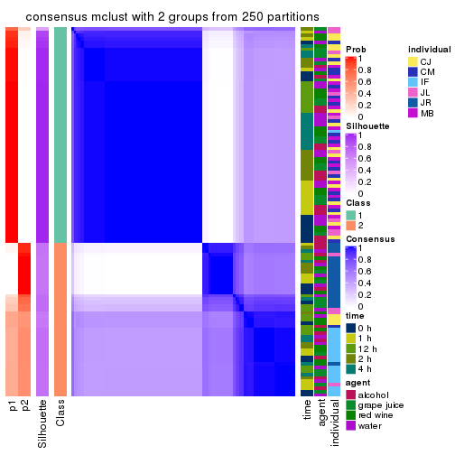</p>

</div>
<div id='tab-CV-mclust-consensus-heatmap-2'>
<pre><code class="r">consensus_heatmap(res, k = 3)
</code></pre>

<p>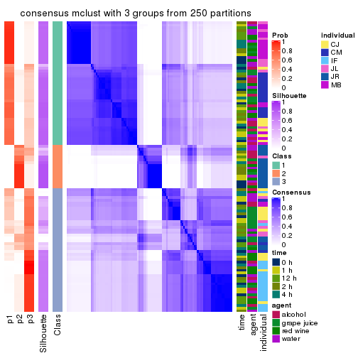</p>

</div>
<div id='tab-CV-mclust-consensus-heatmap-3'>
<pre><code class="r">consensus_heatmap(res, k = 4)
</code></pre>

<p>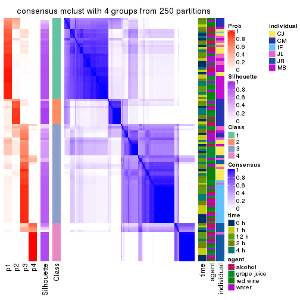</p>

</div>
<div id='tab-CV-mclust-consensus-heatmap-4'>
<pre><code class="r">consensus_heatmap(res, k = 5)
</code></pre>

<p>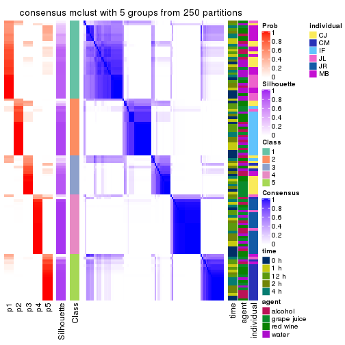</p>

</div>
<div id='tab-CV-mclust-consensus-heatmap-5'>
<pre><code class="r">consensus_heatmap(res, k = 6)
</code></pre>

<p>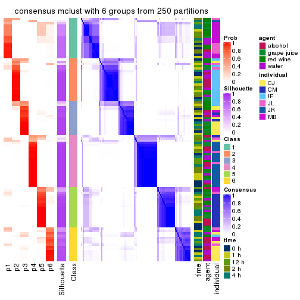</p>

</div>
</div>

Heatmaps for the membership of samples in all partitions to see how consistent they are:


<script>
$( function() {
	$( '#tabs-CV-mclust-membership-heatmap' ).tabs();
} );
</script>
<div id='tabs-CV-mclust-membership-heatmap'>
<ul>
<li><a href='#tab-CV-mclust-membership-heatmap-1'>k = 2</a></li>
<li><a href='#tab-CV-mclust-membership-heatmap-2'>k = 3</a></li>
<li><a href='#tab-CV-mclust-membership-heatmap-3'>k = 4</a></li>
<li><a href='#tab-CV-mclust-membership-heatmap-4'>k = 5</a></li>
<li><a href='#tab-CV-mclust-membership-heatmap-5'>k = 6</a></li>
</ul>
<div id='tab-CV-mclust-membership-heatmap-1'>
<pre><code class="r">membership_heatmap(res, k = 2)
</code></pre>

<p>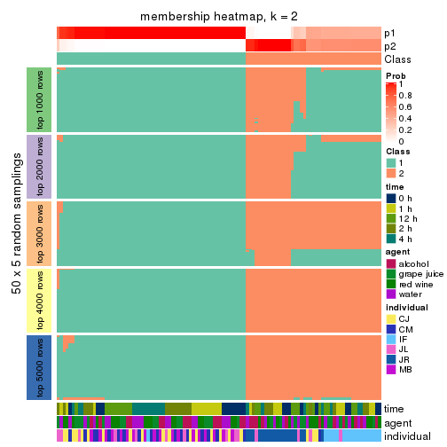</p>

</div>
<div id='tab-CV-mclust-membership-heatmap-2'>
<pre><code class="r">membership_heatmap(res, k = 3)
</code></pre>

<p>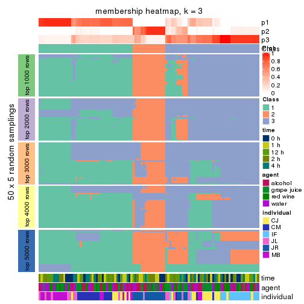</p>

</div>
<div id='tab-CV-mclust-membership-heatmap-3'>
<pre><code class="r">membership_heatmap(res, k = 4)
</code></pre>

<p>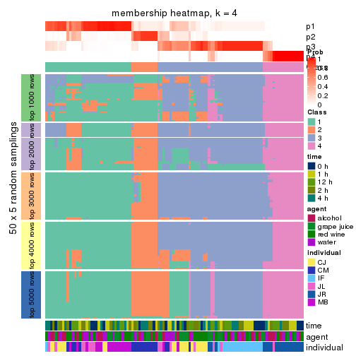</p>

</div>
<div id='tab-CV-mclust-membership-heatmap-4'>
<pre><code class="r">membership_heatmap(res, k = 5)
</code></pre>

<p>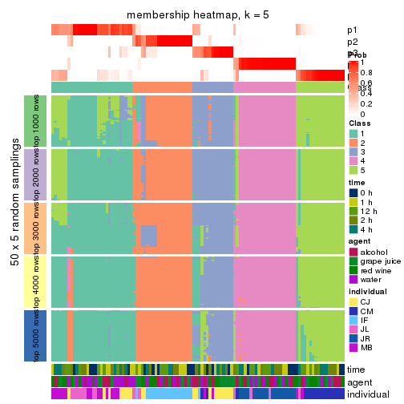</p>

</div>
<div id='tab-CV-mclust-membership-heatmap-5'>
<pre><code class="r">membership_heatmap(res, k = 6)
</code></pre>

<p>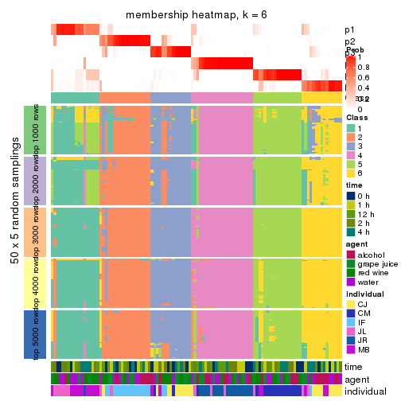</p>

</div>
</div>

As soon as we have had the classes for columns, we can look for signatures
which are significantly different between classes which can be candidate marks
for certain classes. Following are the heatmaps for signatures.


Signature heatmaps where rows are scaled:


<script>
$( function() {
	$( '#tabs-CV-mclust-get-signatures' ).tabs();
} );
</script>
<div id='tabs-CV-mclust-get-signatures'>
<ul>
<li><a href='#tab-CV-mclust-get-signatures-1'>k = 2</a></li>
<li><a href='#tab-CV-mclust-get-signatures-2'>k = 3</a></li>
<li><a href='#tab-CV-mclust-get-signatures-3'>k = 4</a></li>
<li><a href='#tab-CV-mclust-get-signatures-4'>k = 5</a></li>
<li><a href='#tab-CV-mclust-get-signatures-5'>k = 6</a></li>
</ul>
<div id='tab-CV-mclust-get-signatures-1'>
<pre><code class="r">get_signatures(res, k = 2)
</code></pre>

<p>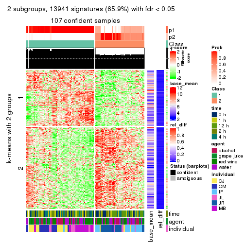</p>

</div>
<div id='tab-CV-mclust-get-signatures-2'>
<pre><code class="r">get_signatures(res, k = 3)
</code></pre>

<p>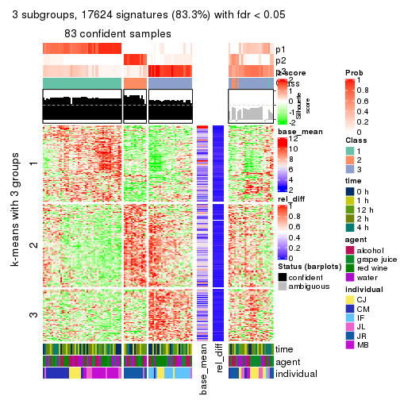</p>

</div>
<div id='tab-CV-mclust-get-signatures-3'>
<pre><code class="r">get_signatures(res, k = 4)
</code></pre>

<p>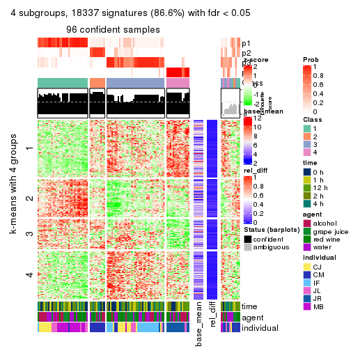</p>

</div>
<div id='tab-CV-mclust-get-signatures-4'>
<pre><code class="r">get_signatures(res, k = 5)
</code></pre>

<p>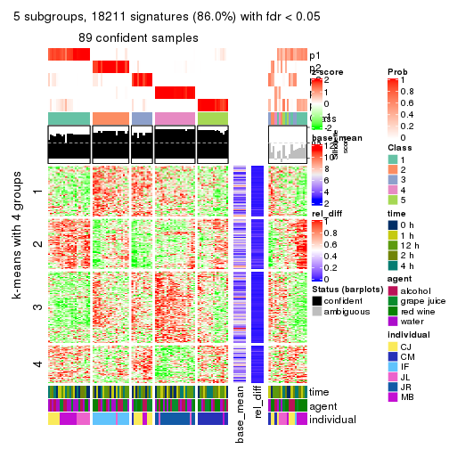</p>

</div>
<div id='tab-CV-mclust-get-signatures-5'>
<pre><code class="r">get_signatures(res, k = 6)
</code></pre>

<p>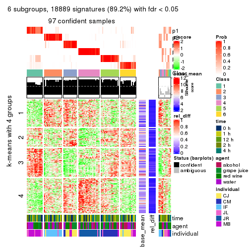</p>

</div>
</div>


Signature heatmaps where rows are not scaled:


<script>
$( function() {
	$( '#tabs-CV-mclust-get-signatures-no-scale' ).tabs();
} );
</script>
<div id='tabs-CV-mclust-get-signatures-no-scale'>
<ul>
<li><a href='#tab-CV-mclust-get-signatures-no-scale-1'>k = 2</a></li>
<li><a href='#tab-CV-mclust-get-signatures-no-scale-2'>k = 3</a></li>
<li><a href='#tab-CV-mclust-get-signatures-no-scale-3'>k = 4</a></li>
<li><a href='#tab-CV-mclust-get-signatures-no-scale-4'>k = 5</a></li>
<li><a href='#tab-CV-mclust-get-signatures-no-scale-5'>k = 6</a></li>
</ul>
<div id='tab-CV-mclust-get-signatures-no-scale-1'>
<pre><code class="r">get_signatures(res, k = 2, scale_rows = FALSE)
</code></pre>

<p>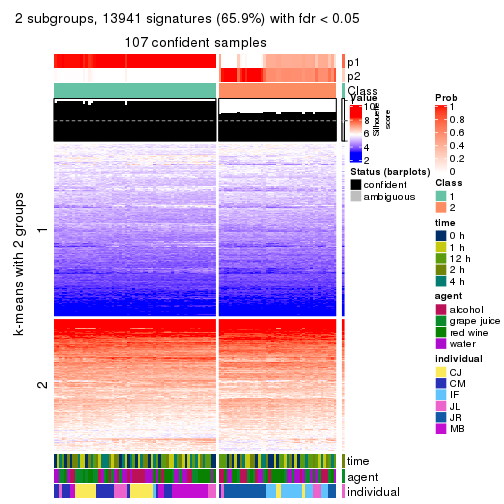</p>

</div>
<div id='tab-CV-mclust-get-signatures-no-scale-2'>
<pre><code class="r">get_signatures(res, k = 3, scale_rows = FALSE)
</code></pre>

<p>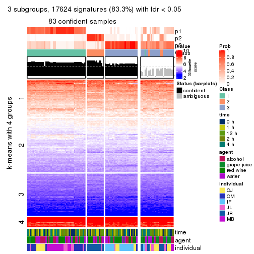</p>

</div>
<div id='tab-CV-mclust-get-signatures-no-scale-3'>
<pre><code class="r">get_signatures(res, k = 4, scale_rows = FALSE)
</code></pre>

<p>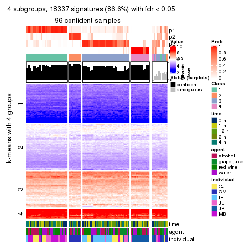</p>

</div>
<div id='tab-CV-mclust-get-signatures-no-scale-4'>
<pre><code class="r">get_signatures(res, k = 5, scale_rows = FALSE)
</code></pre>

<p>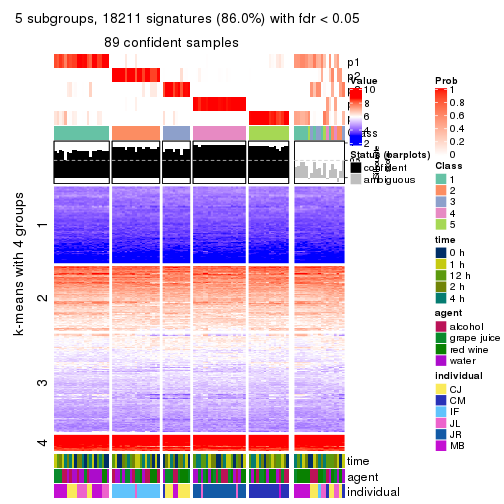</p>

</div>
<div id='tab-CV-mclust-get-signatures-no-scale-5'>
<pre><code class="r">get_signatures(res, k = 6, scale_rows = FALSE)
</code></pre>

<p>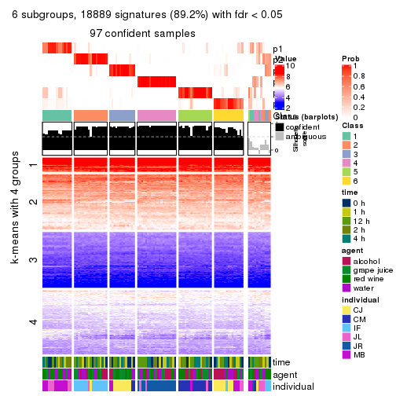</p>

</div>
</div>


Compare the overlap of signatures from different k:

```r
compare_signatures(res)
```

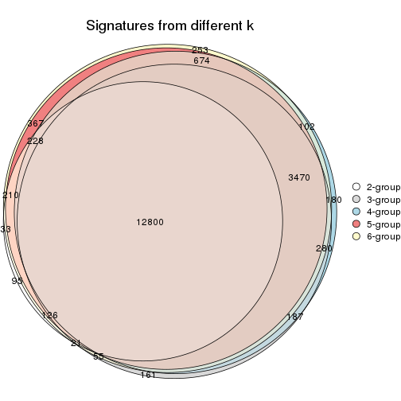

`get_signature()` returns a data frame invisibly. TO get the list of signatures, the function
call should be assigned to a variable explicitly. In following code, if `plot` argument is set
to `FALSE`, no heatmap is plotted while only the differential analysis is performed.

```r
# code only for demonstration
tb = get_signature(res, k = ..., plot = FALSE)
```

An example of the output of `tb` is:

```
#>   which_row         fdr    mean_1    mean_2 scaled_mean_1 scaled_mean_2 km
#> 1        38 0.042760348  8.373488  9.131774    -0.5533452     0.5164555  1
#> 2        40 0.018707592  7.106213  8.469186    -0.6173731     0.5762149  1
#> 3        55 0.019134737 10.221463 11.207825    -0.6159697     0.5749050  1
#> 4        59 0.006059896  5.921854  7.869574    -0.6899429     0.6439467  1
#> 5        60 0.018055526  8.928898 10.211722    -0.6204761     0.5791110  1
#> 6        98 0.009384629 15.714769 14.887706     0.6635654    -0.6193277  2
...
```

The columns in `tb` are:

1. `which_row`: row indices corresponding to the input matrix.
2. `fdr`: FDR for the differential test. 
3. `mean_x`: The mean value in group x.
4. `scaled_mean_x`: The mean value in group x after rows are scaled.
5. `km`: Row groups if k-means clustering is applied to rows.


UMAP plot which shows how samples are separated.


<script>
$( function() {
	$( '#tabs-CV-mclust-dimension-reduction' ).tabs();
} );
</script>
<div id='tabs-CV-mclust-dimension-reduction'>
<ul>
<li><a href='#tab-CV-mclust-dimension-reduction-1'>k = 2</a></li>
<li><a href='#tab-CV-mclust-dimension-reduction-2'>k = 3</a></li>
<li><a href='#tab-CV-mclust-dimension-reduction-3'>k = 4</a></li>
<li><a href='#tab-CV-mclust-dimension-reduction-4'>k = 5</a></li>
<li><a href='#tab-CV-mclust-dimension-reduction-5'>k = 6</a></li>
</ul>
<div id='tab-CV-mclust-dimension-reduction-1'>
<pre><code class="r">dimension_reduction(res, k = 2, method = &quot;UMAP&quot;)
</code></pre>

<p>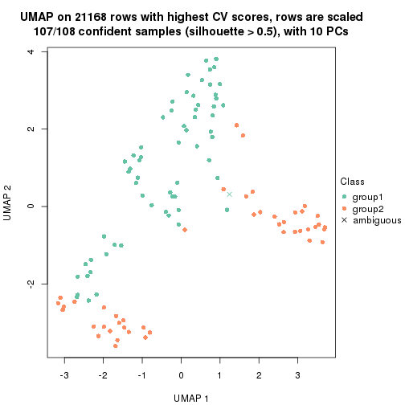</p>

</div>
<div id='tab-CV-mclust-dimension-reduction-2'>
<pre><code class="r">dimension_reduction(res, k = 3, method = &quot;UMAP&quot;)
</code></pre>

<p>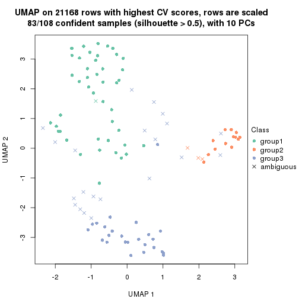</p>

</div>
<div id='tab-CV-mclust-dimension-reduction-3'>
<pre><code class="r">dimension_reduction(res, k = 4, method = &quot;UMAP&quot;)
</code></pre>

<p>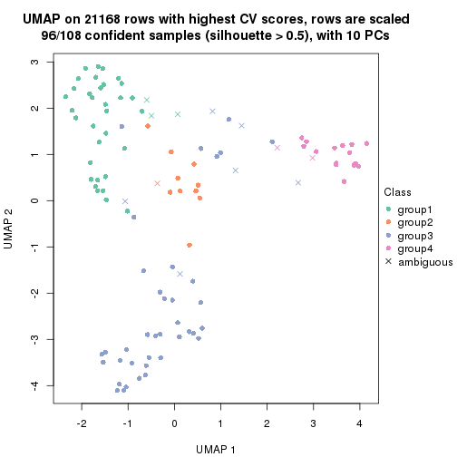</p>

</div>
<div id='tab-CV-mclust-dimension-reduction-4'>
<pre><code class="r">dimension_reduction(res, k = 5, method = &quot;UMAP&quot;)
</code></pre>

<p>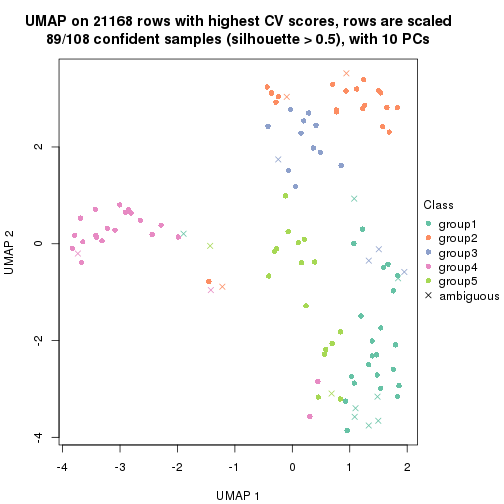</p>

</div>
<div id='tab-CV-mclust-dimension-reduction-5'>
<pre><code class="r">dimension_reduction(res, k = 6, method = &quot;UMAP&quot;)
</code></pre>

<p>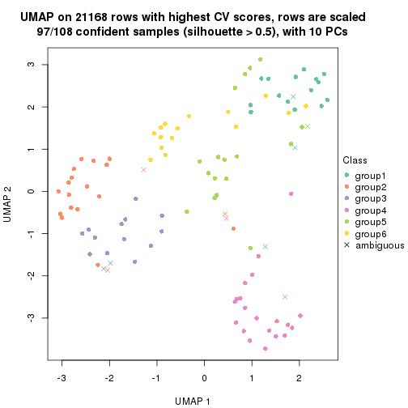</p>

</div>
</div>


Following heatmap shows how subgroups are split when increasing `k`:

```r
collect_classes(res)
```

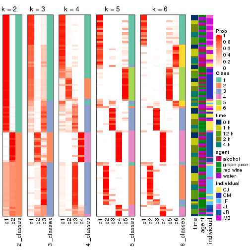


Test correlation between subgroups and known annotations. If the known
annotation is numeric, one-way ANOVA test is applied, and if the known
annotation is discrete, chi-squared contingency table test is applied.

```r
test_to_known_factors(res)
```

```
#>             n time(p) agent(p) individual(p) k
#> CV:mclust 107   0.696    0.992      2.92e-15 2
#> CV:mclust  83   0.993    0.986      5.37e-24 3
#> CV:mclust  96   0.982    0.786      1.04e-31 4
#> CV:mclust  89   1.000    0.585      1.47e-42 5
#> CV:mclust  97   0.983    0.375      9.36e-44 6
```


If matrix rows can be associated to genes, consider to use `GO_Enrichment(res,
...)` to perform function enrichment for the signature genes.


 

---------------------------------------------------


### CV:NMF


The object with results only for a single top-value method and a single partition method 
can be extracted as:

```r
res = res_list["CV", "NMF"]
# you can also extract it by
# res = res_list["CV:NMF"]
```

A summary of `res` and all the functions that can be applied to it:

```r
res
```

```
#> A 'ConsensusPartition' object with k = 2, 3, 4, 5, 6.
#>   On a matrix with 21168 rows and 108 columns.
#>   Top rows (1000, 2000, 3000, 4000, 5000) are extracted by 'CV' method.
#>   Subgroups are detected by 'NMF' method.
#>   Performed in total 1250 partitions by row resampling.
#>   Best k for subgroups seems to be 2.
#> 
#> Following methods can be applied to this 'ConsensusPartition' object:
#>  [1] "cola_report"             "collect_classes"         "collect_plots"          
#>  [4] "collect_stats"           "colnames"                "compare_signatures"     
#>  [7] "consensus_heatmap"       "dimension_reduction"     "functional_enrichment"  
#> [10] "get_anno_col"            "get_anno"                "get_classes"            
#> [13] "get_consensus"           "get_matrix"              "get_membership"         
#> [16] "get_param"               "get_signatures"          "get_stats"              
#> [19] "is_best_k"               "is_stable_k"             "membership_heatmap"     
#> [22] "ncol"                    "nrow"                    "plot_ecdf"              
#> [25] "rownames"                "select_partition_number" "show"                   
#> [28] "suggest_best_k"          "test_to_known_factors"
```

`collect_plots()` function collects all the plots made from `res` for all `k` (number of partitions)
into one single page to provide an easy and fast comparison between different `k`.

```r
collect_plots(res)
```

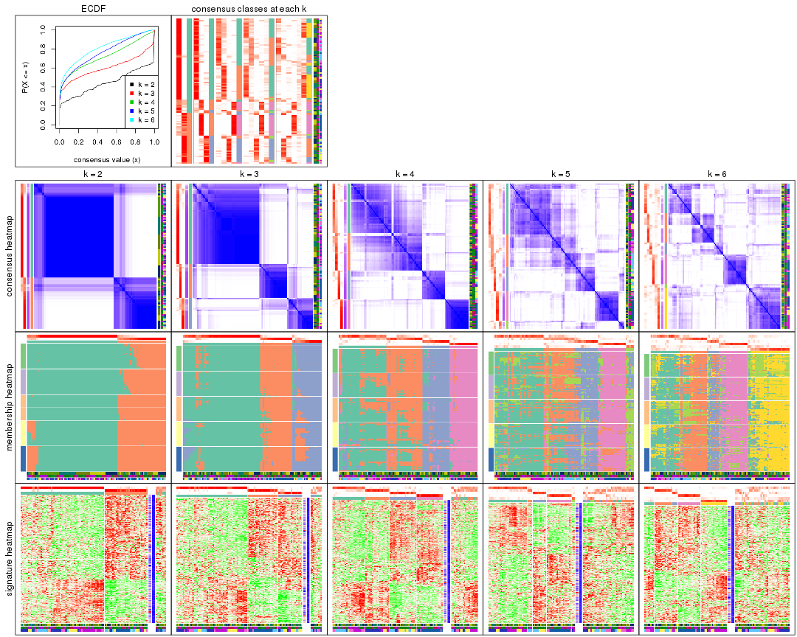

The plots are:

- The first row: a plot of the ECDF (Empirical cumulative distribution
  function) curves of the consensus matrix for each `k` and the heatmap of
  predicted classes for each `k`.
- The second row: heatmaps of the consensus matrix for each `k`.
- The third row: heatmaps of the membership matrix for each `k`.
- The fouth row: heatmaps of the signatures for each `k`.

All the plots in panels can be made by individual functions and they are
plotted later in this section.

`select_partition_number()` produces several plots showing different
statistics for choosing "optimized" `k`. There are following statistics:

- ECDF curves of the consensus matrix for each `k`;
- 1-PAC. [The PAC
  score](https://en.wikipedia.org/wiki/Consensus_clustering#Over-interpretation_potential_of_consensus_clustering)
  measures the proportion of the ambiguous subgrouping.
- Mean silhouette score.
- Concordance. The mean probability of fiting the consensus class ids in all
  partitions.
- Area increased. Denote $A_k$ as the area under the ECDF curve for current
  `k`, the area increased is defined as $A_k - A_{k-1}$.
- Rand index. The percent of pairs of samples that are both in a same cluster
  or both are not in a same cluster in the partition of k and k-1.
- Jaccard index. The ratio of pairs of samples are both in a same cluster in
  the partition of k and k-1 and the pairs of samples are both in a same
  cluster in the partition k or k-1.

The detailed explanations of these statistics can be found in [the cola
vignette](http://bioconductor.org/packages/devel/bioc/vignettes/cola/inst/doc/cola.html#toc_13).

Generally speaking, lower PAC score, higher mean silhouette score or higher
concordance corresponds to better partition. Rand index and Jaccard index
measure how similar the current partition is compared to partition with `k-1`.
If they are too similar, we won't accept `k` is better than `k-1`.

```r
select_partition_number(res)
```

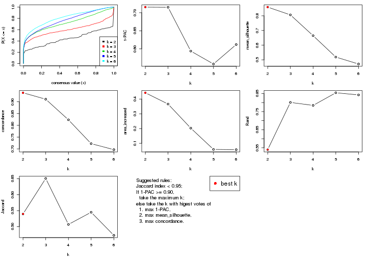

The numeric values for all these statistics can be obtained by `get_stats()`.

```r
get_stats(res)
```

```
#>   k 1-PAC mean_silhouette concordance area_increased  Rand Jaccard
#> 2 2 0.715           0.859       0.938         0.4424 0.540   0.540
#> 3 3 0.715           0.806       0.911         0.3661 0.801   0.651
#> 4 4 0.594           0.665       0.824         0.2029 0.784   0.507
#> 5 5 0.558           0.519       0.722         0.0589 0.854   0.545
#> 6 6 0.612           0.471       0.697         0.0571 0.842   0.473
```

`suggest_best_k()` suggests the best $k$ based on these statistics. The rules are as follows:

- All $k$ with Jaccard index larger than 0.95 are removed because the increase of
  the partition number does not provides enough extra information. If all $k$ are removed,
  the best $k$ is assigned by `NA`.
- For $k$ with 1-PAC larger than 0.9, the maximal $k$ is taken as the "best k". Other $k$ is called "optional k".
- If it does not fit the second rule. The $k$ with the highest vote of highest
  1-PAC, mean silhouette and concordance is taken as the "best k".

```r
suggest_best_k(res)
```

```
#> [1] 2
```


Following shows the table of the partitions (You need to click the **show/hide
code output** link to see it). The membership matrix (columns with name `p*`)
is inferred by
[`clue::cl_consensus()`](https://www.rdocumentation.org/link/cl_consensus?package=clue)
function with the `SE` method. Basically the value in the membership matrix
represents the probability to belong to a certain group. The finall class
label for an item is determined with the group with highest probability it
belongs to.

In `get_classes()` function, the entropy is calculated from the membership
matrix and the silhouette score is calculated from the consensus matrix.


<script>
$( function() {
	$( '#tabs-CV-NMF-get-classes' ).tabs();
} );
</script>
<div id='tabs-CV-NMF-get-classes'>
<ul>
<li><a href='#tab-CV-NMF-get-classes-1'>k = 2</a></li>
<li><a href='#tab-CV-NMF-get-classes-2'>k = 3</a></li>
<li><a href='#tab-CV-NMF-get-classes-3'>k = 4</a></li>
<li><a href='#tab-CV-NMF-get-classes-4'>k = 5</a></li>
<li><a href='#tab-CV-NMF-get-classes-5'>k = 6</a></li>
</ul>

<div id='tab-CV-NMF-get-classes-1'>
<p><a id='tab-CV-NMF-get-classes-1-a' style='color:#0366d6' href='#'>show/hide code output</a></p>
<pre><code class="r">cbind(get_classes(res, k = 2), get_membership(res, k = 2))
</code></pre>

<pre><code>#&gt;          class entropy silhouette    p1    p2
#&gt; GSM87863     1  0.0000      0.954 1.000 0.000
#&gt; GSM87887     1  0.0000      0.954 1.000 0.000
#&gt; GSM87896     2  0.0000      0.882 0.000 1.000
#&gt; GSM87934     2  0.6531      0.797 0.168 0.832
#&gt; GSM87943     2  0.0672      0.880 0.008 0.992
#&gt; GSM87853     2  0.0000      0.882 0.000 1.000
#&gt; GSM87906     1  0.5946      0.791 0.856 0.144
#&gt; GSM87920     1  0.0000      0.954 1.000 0.000
#&gt; GSM87924     2  0.0000      0.882 0.000 1.000
#&gt; GSM87858     2  0.0000      0.882 0.000 1.000
#&gt; GSM87882     1  0.8144      0.617 0.748 0.252
#&gt; GSM87891     2  0.0000      0.882 0.000 1.000
#&gt; GSM87917     1  0.0000      0.954 1.000 0.000
#&gt; GSM87929     1  0.9427      0.365 0.640 0.360
#&gt; GSM87948     1  0.0000      0.954 1.000 0.000
#&gt; GSM87868     1  0.0000      0.954 1.000 0.000
#&gt; GSM87873     2  0.0000      0.882 0.000 1.000
#&gt; GSM87901     1  0.0000      0.954 1.000 0.000
#&gt; GSM87910     1  0.0000      0.954 1.000 0.000
#&gt; GSM87938     2  0.4562      0.847 0.096 0.904
#&gt; GSM87953     1  0.0000      0.954 1.000 0.000
#&gt; GSM87864     1  0.0000      0.954 1.000 0.000
#&gt; GSM87888     1  0.0000      0.954 1.000 0.000
#&gt; GSM87897     1  0.9393      0.377 0.644 0.356
#&gt; GSM87935     2  0.0938      0.880 0.012 0.988
#&gt; GSM87944     1  0.0000      0.954 1.000 0.000
#&gt; GSM87854     1  0.2236      0.919 0.964 0.036
#&gt; GSM87878     1  0.0000      0.954 1.000 0.000
#&gt; GSM87907     2  0.0376      0.881 0.004 0.996
#&gt; GSM87921     1  0.0000      0.954 1.000 0.000
#&gt; GSM87925     2  0.7815      0.738 0.232 0.768
#&gt; GSM87957     1  0.0000      0.954 1.000 0.000
#&gt; GSM87859     2  0.0000      0.882 0.000 1.000
#&gt; GSM87883     1  0.0000      0.954 1.000 0.000
#&gt; GSM87892     2  0.0000      0.882 0.000 1.000
#&gt; GSM87930     2  0.0000      0.882 0.000 1.000
#&gt; GSM87949     1  0.0000      0.954 1.000 0.000
#&gt; GSM87869     1  0.0000      0.954 1.000 0.000
#&gt; GSM87874     2  0.0000      0.882 0.000 1.000
#&gt; GSM87902     1  0.0000      0.954 1.000 0.000
#&gt; GSM87911     1  0.0000      0.954 1.000 0.000
#&gt; GSM87939     2  0.9393      0.546 0.356 0.644
#&gt; GSM87954     1  0.0000      0.954 1.000 0.000
#&gt; GSM87865     1  0.0000      0.954 1.000 0.000
#&gt; GSM87889     1  0.0000      0.954 1.000 0.000
#&gt; GSM87898     1  0.0000      0.954 1.000 0.000
#&gt; GSM87915     1  0.0000      0.954 1.000 0.000
#&gt; GSM87936     2  0.3584      0.861 0.068 0.932
#&gt; GSM87945     2  0.0000      0.882 0.000 1.000
#&gt; GSM87855     2  0.0000      0.882 0.000 1.000
#&gt; GSM87879     1  0.0000      0.954 1.000 0.000
#&gt; GSM87922     1  0.9552      0.316 0.624 0.376
#&gt; GSM87926     2  0.9909      0.330 0.444 0.556
#&gt; GSM87958     1  0.0000      0.954 1.000 0.000
#&gt; GSM87860     2  0.0000      0.882 0.000 1.000
#&gt; GSM87884     1  0.0000      0.954 1.000 0.000
#&gt; GSM87893     2  0.0000      0.882 0.000 1.000
#&gt; GSM87918     1  0.0000      0.954 1.000 0.000
#&gt; GSM87931     2  0.8713      0.658 0.292 0.708
#&gt; GSM87950     1  0.0000      0.954 1.000 0.000
#&gt; GSM87870     1  0.0000      0.954 1.000 0.000
#&gt; GSM87875     2  0.0000      0.882 0.000 1.000
#&gt; GSM87903     1  0.8763      0.527 0.704 0.296
#&gt; GSM87912     1  0.0000      0.954 1.000 0.000
#&gt; GSM87940     2  0.8207      0.710 0.256 0.744
#&gt; GSM87866     1  0.0000      0.954 1.000 0.000
#&gt; GSM87899     2  0.0938      0.880 0.012 0.988
#&gt; GSM87937     2  0.5408      0.830 0.124 0.876
#&gt; GSM87946     1  0.0000      0.954 1.000 0.000
#&gt; GSM87856     2  0.0000      0.882 0.000 1.000
#&gt; GSM87880     1  0.0000      0.954 1.000 0.000
#&gt; GSM87908     1  0.0000      0.954 1.000 0.000
#&gt; GSM87923     2  0.8081      0.720 0.248 0.752
#&gt; GSM87927     1  0.6973      0.727 0.812 0.188
#&gt; GSM87959     1  0.0000      0.954 1.000 0.000
#&gt; GSM87861     2  0.0000      0.882 0.000 1.000
#&gt; GSM87885     1  0.0000      0.954 1.000 0.000
#&gt; GSM87894     1  0.0000      0.954 1.000 0.000
#&gt; GSM87932     1  0.0000      0.954 1.000 0.000
#&gt; GSM87951     1  0.0000      0.954 1.000 0.000
#&gt; GSM87871     1  0.0000      0.954 1.000 0.000
#&gt; GSM87876     1  0.0000      0.954 1.000 0.000
#&gt; GSM87904     2  0.4939      0.841 0.108 0.892
#&gt; GSM87913     1  0.0000      0.954 1.000 0.000
#&gt; GSM87941     1  0.8661      0.545 0.712 0.288
#&gt; GSM87955     1  0.0000      0.954 1.000 0.000
#&gt; GSM87867     1  0.0000      0.954 1.000 0.000
#&gt; GSM87890     2  0.9686      0.460 0.396 0.604
#&gt; GSM87900     1  0.9323      0.399 0.652 0.348
#&gt; GSM87916     2  0.9998      0.168 0.492 0.508
#&gt; GSM87947     1  0.0000      0.954 1.000 0.000
#&gt; GSM87857     2  0.2603      0.871 0.044 0.956
#&gt; GSM87881     1  0.0000      0.954 1.000 0.000
#&gt; GSM87909     1  0.0000      0.954 1.000 0.000
#&gt; GSM87928     1  0.0000      0.954 1.000 0.000
#&gt; GSM87960     1  0.0000      0.954 1.000 0.000
#&gt; GSM87862     2  0.8081      0.720 0.248 0.752
#&gt; GSM87886     1  0.0000      0.954 1.000 0.000
#&gt; GSM87895     2  0.1184      0.879 0.016 0.984
#&gt; GSM87919     1  0.0000      0.954 1.000 0.000
#&gt; GSM87933     2  0.9661      0.469 0.392 0.608
#&gt; GSM87952     1  0.0000      0.954 1.000 0.000
#&gt; GSM87872     1  0.0376      0.950 0.996 0.004
#&gt; GSM87877     1  0.0000      0.954 1.000 0.000
#&gt; GSM87905     1  0.0000      0.954 1.000 0.000
#&gt; GSM87914     1  0.0000      0.954 1.000 0.000
#&gt; GSM87942     1  0.0000      0.954 1.000 0.000
#&gt; GSM87956     1  0.0000      0.954 1.000 0.000
</code></pre>

<script>
$('#tab-CV-NMF-get-classes-1-a').parent().next().next().hide();
$('#tab-CV-NMF-get-classes-1-a').click(function(){
  $('#tab-CV-NMF-get-classes-1-a').parent().next().next().toggle();
  return(false);
});
</script>
</div>

<div id='tab-CV-NMF-get-classes-2'>
<p><a id='tab-CV-NMF-get-classes-2-a' style='color:#0366d6' href='#'>show/hide code output</a></p>
<pre><code class="r">cbind(get_classes(res, k = 3), get_membership(res, k = 3))
</code></pre>

<pre><code>#&gt;          class entropy silhouette    p1    p2    p3
#&gt; GSM87863     1  0.5254     0.6632 0.736 0.000 0.264
#&gt; GSM87887     1  0.0000     0.9261 1.000 0.000 0.000
#&gt; GSM87896     3  0.6260     0.4044 0.000 0.448 0.552
#&gt; GSM87934     2  0.0000     0.8913 0.000 1.000 0.000
#&gt; GSM87943     3  0.0237     0.8034 0.004 0.000 0.996
#&gt; GSM87853     3  0.0000     0.8039 0.000 0.000 1.000
#&gt; GSM87906     1  0.5905     0.4728 0.648 0.352 0.000
#&gt; GSM87920     1  0.0000     0.9261 1.000 0.000 0.000
#&gt; GSM87924     2  0.0237     0.8883 0.000 0.996 0.004
#&gt; GSM87858     3  0.5178     0.6845 0.000 0.256 0.744
#&gt; GSM87882     3  0.6302    -0.0670 0.480 0.000 0.520
#&gt; GSM87891     3  0.6215     0.4470 0.000 0.428 0.572
#&gt; GSM87917     1  0.0000     0.9261 1.000 0.000 0.000
#&gt; GSM87929     2  0.1643     0.8726 0.044 0.956 0.000
#&gt; GSM87948     1  0.0000     0.9261 1.000 0.000 0.000
#&gt; GSM87868     1  0.0747     0.9200 0.984 0.000 0.016
#&gt; GSM87873     3  0.5178     0.6842 0.000 0.256 0.744
#&gt; GSM87901     1  0.3267     0.8428 0.884 0.116 0.000
#&gt; GSM87910     1  0.0000     0.9261 1.000 0.000 0.000
#&gt; GSM87938     2  0.0000     0.8913 0.000 1.000 0.000
#&gt; GSM87953     1  0.0237     0.9252 0.996 0.004 0.000
#&gt; GSM87864     1  0.4842     0.7236 0.776 0.000 0.224
#&gt; GSM87888     1  0.3267     0.8486 0.884 0.000 0.116
#&gt; GSM87897     2  0.6304     0.6749 0.192 0.752 0.056
#&gt; GSM87935     2  0.0000     0.8913 0.000 1.000 0.000
#&gt; GSM87944     1  0.0000     0.9261 1.000 0.000 0.000
#&gt; GSM87854     3  0.4750     0.6070 0.216 0.000 0.784
#&gt; GSM87878     1  0.0000     0.9261 1.000 0.000 0.000
#&gt; GSM87907     2  0.5058     0.5252 0.000 0.756 0.244
#&gt; GSM87921     1  0.6286     0.0934 0.536 0.464 0.000
#&gt; GSM87925     2  0.0000     0.8913 0.000 1.000 0.000
#&gt; GSM87957     1  0.0000     0.9261 1.000 0.000 0.000
#&gt; GSM87859     3  0.2066     0.7956 0.000 0.060 0.940
#&gt; GSM87883     1  0.0237     0.9249 0.996 0.000 0.004
#&gt; GSM87892     3  0.5733     0.6145 0.000 0.324 0.676
#&gt; GSM87930     2  0.0000     0.8913 0.000 1.000 0.000
#&gt; GSM87949     1  0.0000     0.9261 1.000 0.000 0.000
#&gt; GSM87869     1  0.0237     0.9249 0.996 0.000 0.004
#&gt; GSM87874     3  0.2537     0.7898 0.000 0.080 0.920
#&gt; GSM87902     1  0.0237     0.9252 0.996 0.004 0.000
#&gt; GSM87911     1  0.3983     0.8044 0.852 0.144 0.004
#&gt; GSM87939     2  0.0237     0.8919 0.004 0.996 0.000
#&gt; GSM87954     1  0.0237     0.9252 0.996 0.004 0.000
#&gt; GSM87865     1  0.4452     0.7659 0.808 0.000 0.192
#&gt; GSM87889     1  0.0000     0.9261 1.000 0.000 0.000
#&gt; GSM87898     1  0.0237     0.9252 0.996 0.004 0.000
#&gt; GSM87915     1  0.0237     0.9252 0.996 0.004 0.000
#&gt; GSM87936     2  0.0000     0.8913 0.000 1.000 0.000
#&gt; GSM87945     3  0.0000     0.8039 0.000 0.000 1.000
#&gt; GSM87855     3  0.0000     0.8039 0.000 0.000 1.000
#&gt; GSM87879     1  0.6260     0.2608 0.552 0.000 0.448
#&gt; GSM87922     2  0.4062     0.7431 0.164 0.836 0.000
#&gt; GSM87926     2  0.0424     0.8912 0.008 0.992 0.000
#&gt; GSM87958     1  0.0000     0.9261 1.000 0.000 0.000
#&gt; GSM87860     3  0.0424     0.8046 0.000 0.008 0.992
#&gt; GSM87884     1  0.0000     0.9261 1.000 0.000 0.000
#&gt; GSM87893     3  0.5497     0.6502 0.000 0.292 0.708
#&gt; GSM87918     1  0.0237     0.9252 0.996 0.004 0.000
#&gt; GSM87931     2  0.0237     0.8919 0.004 0.996 0.000
#&gt; GSM87950     1  0.0000     0.9261 1.000 0.000 0.000
#&gt; GSM87870     1  0.0424     0.9237 0.992 0.000 0.008
#&gt; GSM87875     3  0.0237     0.8034 0.004 0.000 0.996
#&gt; GSM87903     1  0.6621     0.5689 0.684 0.284 0.032
#&gt; GSM87912     1  0.0237     0.9252 0.996 0.004 0.000
#&gt; GSM87940     2  0.0000     0.8913 0.000 1.000 0.000
#&gt; GSM87866     1  0.1753     0.9018 0.952 0.000 0.048
#&gt; GSM87899     3  0.0424     0.8044 0.000 0.008 0.992
#&gt; GSM87937     2  0.0000     0.8913 0.000 1.000 0.000
#&gt; GSM87946     1  0.0237     0.9249 0.996 0.000 0.004
#&gt; GSM87856     3  0.0237     0.8034 0.004 0.000 0.996
#&gt; GSM87880     1  0.2796     0.8698 0.908 0.000 0.092
#&gt; GSM87908     1  0.0237     0.9252 0.996 0.004 0.000
#&gt; GSM87923     3  0.8157     0.4496 0.076 0.384 0.540
#&gt; GSM87927     2  0.3267     0.8047 0.116 0.884 0.000
#&gt; GSM87959     1  0.0000     0.9261 1.000 0.000 0.000
#&gt; GSM87861     3  0.0237     0.8046 0.000 0.004 0.996
#&gt; GSM87885     1  0.0000     0.9261 1.000 0.000 0.000
#&gt; GSM87894     1  0.3551     0.8338 0.868 0.000 0.132
#&gt; GSM87932     1  0.3340     0.8341 0.880 0.120 0.000
#&gt; GSM87951     1  0.0000     0.9261 1.000 0.000 0.000
#&gt; GSM87871     1  0.2448     0.8825 0.924 0.000 0.076
#&gt; GSM87876     1  0.0424     0.9234 0.992 0.000 0.008
#&gt; GSM87904     3  0.2860     0.7897 0.004 0.084 0.912
#&gt; GSM87913     1  0.1031     0.9161 0.976 0.000 0.024
#&gt; GSM87941     2  0.2261     0.8543 0.068 0.932 0.000
#&gt; GSM87955     1  0.0000     0.9261 1.000 0.000 0.000
#&gt; GSM87867     1  0.0747     0.9200 0.984 0.000 0.016
#&gt; GSM87890     2  0.0892     0.8830 0.020 0.980 0.000
#&gt; GSM87900     2  0.2066     0.8609 0.060 0.940 0.000
#&gt; GSM87916     2  0.0747     0.8887 0.016 0.984 0.000
#&gt; GSM87947     1  0.1753     0.9018 0.952 0.000 0.048
#&gt; GSM87857     3  0.0892     0.7957 0.020 0.000 0.980
#&gt; GSM87881     1  0.2878     0.8602 0.904 0.096 0.000
#&gt; GSM87909     1  0.2878     0.8583 0.904 0.096 0.000
#&gt; GSM87928     1  0.6111     0.3239 0.604 0.396 0.000
#&gt; GSM87960     1  0.0000     0.9261 1.000 0.000 0.000
#&gt; GSM87862     3  0.8247     0.5524 0.096 0.324 0.580
#&gt; GSM87886     1  0.0000     0.9261 1.000 0.000 0.000
#&gt; GSM87895     2  0.1643     0.8517 0.000 0.956 0.044
#&gt; GSM87919     1  0.0237     0.9252 0.996 0.004 0.000
#&gt; GSM87933     2  0.0237     0.8919 0.004 0.996 0.000
#&gt; GSM87952     1  0.0000     0.9261 1.000 0.000 0.000
#&gt; GSM87872     1  0.4002     0.7932 0.840 0.160 0.000
#&gt; GSM87877     1  0.0000     0.9261 1.000 0.000 0.000
#&gt; GSM87905     1  0.1031     0.9143 0.976 0.024 0.000
#&gt; GSM87914     2  0.6062     0.3913 0.384 0.616 0.000
#&gt; GSM87942     2  0.5327     0.6025 0.272 0.728 0.000
#&gt; GSM87956     1  0.0000     0.9261 1.000 0.000 0.000
</code></pre>

<script>
$('#tab-CV-NMF-get-classes-2-a').parent().next().next().hide();
$('#tab-CV-NMF-get-classes-2-a').click(function(){
  $('#tab-CV-NMF-get-classes-2-a').parent().next().next().toggle();
  return(false);
});
</script>
</div>

<div id='tab-CV-NMF-get-classes-3'>
<p><a id='tab-CV-NMF-get-classes-3-a' style='color:#0366d6' href='#'>show/hide code output</a></p>
<pre><code class="r">cbind(get_classes(res, k = 4), get_membership(res, k = 4))
</code></pre>

<pre><code>#&gt;          class entropy silhouette    p1    p2    p3    p4
#&gt; GSM87863     2  0.2742     0.6946 0.076 0.900 0.024 0.000
#&gt; GSM87887     2  0.1902     0.7179 0.064 0.932 0.000 0.004
#&gt; GSM87896     3  0.3105     0.8183 0.004 0.000 0.856 0.140
#&gt; GSM87934     4  0.0000     0.9362 0.000 0.000 0.000 1.000
#&gt; GSM87943     2  0.4776     0.1386 0.000 0.624 0.376 0.000
#&gt; GSM87853     3  0.0707     0.8711 0.000 0.020 0.980 0.000
#&gt; GSM87906     1  0.3447     0.5887 0.852 0.000 0.128 0.020
#&gt; GSM87920     2  0.4477     0.4357 0.312 0.688 0.000 0.000
#&gt; GSM87924     4  0.0592     0.9271 0.000 0.000 0.016 0.984
#&gt; GSM87858     3  0.0817     0.8735 0.000 0.000 0.976 0.024
#&gt; GSM87882     2  0.3885     0.6567 0.000 0.844 0.092 0.064
#&gt; GSM87891     3  0.3105     0.8198 0.004 0.000 0.856 0.140
#&gt; GSM87917     1  0.3610     0.6927 0.800 0.200 0.000 0.000
#&gt; GSM87929     4  0.0672     0.9325 0.008 0.008 0.000 0.984
#&gt; GSM87948     2  0.3356     0.6566 0.176 0.824 0.000 0.000
#&gt; GSM87868     2  0.4999    -0.1558 0.492 0.508 0.000 0.000
#&gt; GSM87873     3  0.2197     0.8496 0.000 0.004 0.916 0.080
#&gt; GSM87901     1  0.1516     0.6716 0.960 0.008 0.016 0.016
#&gt; GSM87910     1  0.3356     0.7000 0.824 0.176 0.000 0.000
#&gt; GSM87938     4  0.0188     0.9351 0.000 0.000 0.004 0.996
#&gt; GSM87953     1  0.3610     0.6922 0.800 0.200 0.000 0.000
#&gt; GSM87864     2  0.2976     0.7008 0.120 0.872 0.008 0.000
#&gt; GSM87888     2  0.1913     0.6970 0.000 0.940 0.040 0.020
#&gt; GSM87897     1  0.4477     0.2579 0.688 0.000 0.312 0.000
#&gt; GSM87935     4  0.0376     0.9350 0.004 0.000 0.004 0.992
#&gt; GSM87944     2  0.2868     0.6844 0.136 0.864 0.000 0.000
#&gt; GSM87854     3  0.5432     0.7217 0.068 0.216 0.716 0.000
#&gt; GSM87878     2  0.5858    -0.1500 0.468 0.500 0.000 0.032
#&gt; GSM87907     3  0.4776     0.7286 0.272 0.000 0.712 0.016
#&gt; GSM87921     1  0.3486     0.5683 0.812 0.000 0.000 0.188
#&gt; GSM87925     4  0.0000     0.9362 0.000 0.000 0.000 1.000
#&gt; GSM87957     2  0.4941     0.1468 0.436 0.564 0.000 0.000
#&gt; GSM87859     3  0.0779     0.8742 0.000 0.004 0.980 0.016
#&gt; GSM87883     2  0.1118     0.7205 0.036 0.964 0.000 0.000
#&gt; GSM87892     3  0.1182     0.8743 0.016 0.000 0.968 0.016
#&gt; GSM87930     4  0.0188     0.9351 0.000 0.000 0.004 0.996
#&gt; GSM87949     1  0.4643     0.5548 0.656 0.344 0.000 0.000
#&gt; GSM87869     1  0.4817     0.4305 0.612 0.388 0.000 0.000
#&gt; GSM87874     3  0.2198     0.8507 0.000 0.008 0.920 0.072
#&gt; GSM87902     1  0.1661     0.6477 0.944 0.000 0.052 0.004
#&gt; GSM87911     1  0.1978     0.6802 0.928 0.068 0.004 0.000
#&gt; GSM87939     4  0.0188     0.9357 0.000 0.004 0.000 0.996
#&gt; GSM87954     1  0.3123     0.6998 0.844 0.156 0.000 0.000
#&gt; GSM87865     1  0.5331     0.4601 0.644 0.332 0.024 0.000
#&gt; GSM87889     2  0.2214     0.7159 0.028 0.928 0.000 0.044
#&gt; GSM87898     1  0.1118     0.6568 0.964 0.000 0.036 0.000
#&gt; GSM87915     1  0.3610     0.6916 0.800 0.200 0.000 0.000
#&gt; GSM87936     4  0.0524     0.9340 0.008 0.000 0.004 0.988
#&gt; GSM87945     3  0.3444     0.7743 0.000 0.184 0.816 0.000
#&gt; GSM87855     3  0.1118     0.8681 0.000 0.036 0.964 0.000
#&gt; GSM87879     2  0.1792     0.6799 0.000 0.932 0.068 0.000
#&gt; GSM87922     4  0.2401     0.8657 0.000 0.092 0.004 0.904
#&gt; GSM87926     4  0.0188     0.9357 0.000 0.004 0.000 0.996
#&gt; GSM87958     1  0.4925     0.3783 0.572 0.428 0.000 0.000
#&gt; GSM87860     3  0.1576     0.8701 0.048 0.000 0.948 0.004
#&gt; GSM87884     2  0.1398     0.7208 0.040 0.956 0.000 0.004
#&gt; GSM87893     3  0.0707     0.8741 0.000 0.000 0.980 0.020
#&gt; GSM87918     1  0.3638     0.6981 0.848 0.120 0.000 0.032
#&gt; GSM87931     4  0.0000     0.9362 0.000 0.000 0.000 1.000
#&gt; GSM87950     1  0.4955     0.3470 0.556 0.444 0.000 0.000
#&gt; GSM87870     1  0.4072     0.6470 0.748 0.252 0.000 0.000
#&gt; GSM87875     2  0.4188     0.4446 0.000 0.752 0.244 0.004
#&gt; GSM87903     1  0.4663     0.3590 0.716 0.000 0.272 0.012
#&gt; GSM87912     1  0.3873     0.6792 0.772 0.228 0.000 0.000
#&gt; GSM87940     4  0.0000     0.9362 0.000 0.000 0.000 1.000
#&gt; GSM87866     1  0.4888     0.3478 0.588 0.412 0.000 0.000
#&gt; GSM87899     3  0.4643     0.6391 0.344 0.000 0.656 0.000
#&gt; GSM87937     4  0.0188     0.9351 0.000 0.000 0.004 0.996
#&gt; GSM87946     2  0.4356     0.5060 0.292 0.708 0.000 0.000
#&gt; GSM87856     3  0.3808     0.7790 0.012 0.176 0.812 0.000
#&gt; GSM87880     2  0.0921     0.7016 0.000 0.972 0.028 0.000
#&gt; GSM87908     1  0.1716     0.6406 0.936 0.000 0.064 0.000
#&gt; GSM87923     4  0.7006     0.2748 0.000 0.340 0.132 0.528
#&gt; GSM87927     4  0.2546     0.8735 0.092 0.008 0.000 0.900
#&gt; GSM87959     2  0.4776     0.2903 0.376 0.624 0.000 0.000
#&gt; GSM87861     3  0.0188     0.8741 0.000 0.000 0.996 0.004
#&gt; GSM87885     2  0.2227     0.7181 0.036 0.928 0.000 0.036
#&gt; GSM87894     1  0.3249     0.6692 0.852 0.140 0.008 0.000
#&gt; GSM87932     1  0.3881     0.6923 0.812 0.172 0.000 0.016
#&gt; GSM87951     1  0.4585     0.5735 0.668 0.332 0.000 0.000
#&gt; GSM87871     1  0.5427     0.3660 0.568 0.416 0.016 0.000
#&gt; GSM87876     2  0.0657     0.7168 0.012 0.984 0.000 0.004
#&gt; GSM87904     3  0.4356     0.7092 0.292 0.000 0.708 0.000
#&gt; GSM87913     1  0.3266     0.6795 0.832 0.168 0.000 0.000
#&gt; GSM87941     4  0.1042     0.9263 0.020 0.008 0.000 0.972
#&gt; GSM87955     1  0.4222     0.6361 0.728 0.272 0.000 0.000
#&gt; GSM87867     2  0.4222     0.5361 0.272 0.728 0.000 0.000
#&gt; GSM87890     4  0.2704     0.8340 0.000 0.124 0.000 0.876
#&gt; GSM87900     1  0.4181     0.5835 0.820 0.000 0.128 0.052
#&gt; GSM87916     4  0.0188     0.9357 0.000 0.004 0.000 0.996
#&gt; GSM87947     2  0.0657     0.7107 0.004 0.984 0.012 0.000
#&gt; GSM87857     3  0.0779     0.8738 0.016 0.004 0.980 0.000
#&gt; GSM87881     2  0.5460     0.4404 0.028 0.632 0.000 0.340
#&gt; GSM87909     1  0.1247     0.6789 0.968 0.016 0.004 0.012
#&gt; GSM87928     1  0.7138     0.4156 0.552 0.180 0.000 0.268
#&gt; GSM87960     2  0.4967     0.0251 0.452 0.548 0.000 0.000
#&gt; GSM87862     3  0.4044     0.8170 0.152 0.004 0.820 0.024
#&gt; GSM87886     2  0.3668     0.6425 0.188 0.808 0.000 0.004
#&gt; GSM87895     3  0.6393     0.6686 0.160 0.000 0.652 0.188
#&gt; GSM87919     1  0.3726     0.6827 0.788 0.212 0.000 0.000
#&gt; GSM87933     4  0.0000     0.9362 0.000 0.000 0.000 1.000
#&gt; GSM87952     1  0.4898     0.4162 0.584 0.416 0.000 0.000
#&gt; GSM87872     1  0.7495     0.0917 0.448 0.368 0.000 0.184
#&gt; GSM87877     2  0.2868     0.6872 0.136 0.864 0.000 0.000
#&gt; GSM87905     1  0.1247     0.6789 0.968 0.016 0.004 0.012
#&gt; GSM87914     4  0.4323     0.7536 0.184 0.028 0.000 0.788
#&gt; GSM87942     4  0.2722     0.8808 0.064 0.032 0.000 0.904
#&gt; GSM87956     1  0.4564     0.5785 0.672 0.328 0.000 0.000
</code></pre>

<script>
$('#tab-CV-NMF-get-classes-3-a').parent().next().next().hide();
$('#tab-CV-NMF-get-classes-3-a').click(function(){
  $('#tab-CV-NMF-get-classes-3-a').parent().next().next().toggle();
  return(false);
});
</script>
</div>

<div id='tab-CV-NMF-get-classes-4'>
<p><a id='tab-CV-NMF-get-classes-4-a' style='color:#0366d6' href='#'>show/hide code output</a></p>
<pre><code class="r">cbind(get_classes(res, k = 5), get_membership(res, k = 5))
</code></pre>

<pre><code>#&gt;          class entropy silhouette    p1    p2    p3    p4    p5
#&gt; GSM87863     1  0.5518    0.38786 0.580 0.068 0.004 0.000 0.348
#&gt; GSM87887     1  0.4400    0.59677 0.736 0.052 0.000 0.000 0.212
#&gt; GSM87896     3  0.1883    0.67234 0.000 0.012 0.932 0.048 0.008
#&gt; GSM87934     4  0.0865    0.85340 0.000 0.024 0.004 0.972 0.000
#&gt; GSM87943     5  0.5159    0.56763 0.072 0.032 0.168 0.000 0.728
#&gt; GSM87853     3  0.4182    0.18211 0.000 0.000 0.600 0.000 0.400
#&gt; GSM87906     2  0.5983    0.28517 0.060 0.556 0.356 0.000 0.028
#&gt; GSM87920     5  0.7274   -0.03957 0.124 0.368 0.000 0.068 0.440
#&gt; GSM87924     4  0.2178    0.83601 0.000 0.048 0.024 0.920 0.008
#&gt; GSM87858     3  0.1798    0.67195 0.000 0.004 0.928 0.004 0.064
#&gt; GSM87882     1  0.7990    0.06820 0.412 0.052 0.060 0.100 0.376
#&gt; GSM87891     3  0.2710    0.65834 0.000 0.016 0.896 0.056 0.032
#&gt; GSM87917     2  0.5766    0.22749 0.392 0.516 0.000 0.000 0.092
#&gt; GSM87929     4  0.1934    0.84736 0.004 0.052 0.000 0.928 0.016
#&gt; GSM87948     1  0.2664    0.69242 0.892 0.040 0.000 0.004 0.064
#&gt; GSM87868     1  0.3012    0.67416 0.852 0.124 0.000 0.000 0.024
#&gt; GSM87873     3  0.5392    0.44278 0.000 0.064 0.728 0.072 0.136
#&gt; GSM87901     2  0.6768    0.52373 0.204 0.596 0.120 0.000 0.080
#&gt; GSM87910     2  0.5583    0.36141 0.336 0.584 0.000 0.004 0.076
#&gt; GSM87938     4  0.2482    0.81659 0.000 0.064 0.016 0.904 0.016
#&gt; GSM87953     2  0.5696    0.23384 0.400 0.524 0.000 0.004 0.072
#&gt; GSM87864     1  0.4555    0.60967 0.732 0.068 0.000 0.000 0.200
#&gt; GSM87888     1  0.4992    0.54278 0.712 0.016 0.008 0.036 0.228
#&gt; GSM87897     2  0.4753    0.25400 0.004 0.636 0.340 0.004 0.016
#&gt; GSM87935     4  0.2570    0.83611 0.000 0.108 0.004 0.880 0.008
#&gt; GSM87944     1  0.4840    0.65084 0.724 0.152 0.000 0.000 0.124
#&gt; GSM87854     5  0.6285    0.30636 0.016 0.100 0.388 0.000 0.496
#&gt; GSM87878     1  0.5571    0.47086 0.668 0.176 0.000 0.008 0.148
#&gt; GSM87907     3  0.4915    0.48232 0.000 0.300 0.660 0.016 0.024
#&gt; GSM87921     2  0.5290   -0.13619 0.004 0.540 0.004 0.420 0.032
#&gt; GSM87925     4  0.2352    0.84219 0.000 0.092 0.004 0.896 0.008
#&gt; GSM87957     2  0.6948   -0.01317 0.416 0.432 0.000 0.068 0.084
#&gt; GSM87859     3  0.2561    0.62113 0.000 0.000 0.856 0.000 0.144
#&gt; GSM87883     1  0.3368    0.67511 0.820 0.024 0.000 0.000 0.156
#&gt; GSM87892     3  0.0671    0.68419 0.000 0.016 0.980 0.000 0.004
#&gt; GSM87930     4  0.1525    0.83802 0.000 0.036 0.012 0.948 0.004
#&gt; GSM87949     1  0.3365    0.63285 0.808 0.180 0.000 0.004 0.008
#&gt; GSM87869     1  0.4132    0.53336 0.720 0.260 0.000 0.000 0.020
#&gt; GSM87874     3  0.6048    0.30271 0.000 0.060 0.632 0.060 0.248
#&gt; GSM87902     2  0.6568    0.47092 0.108 0.584 0.256 0.000 0.052
#&gt; GSM87911     2  0.6202    0.12735 0.004 0.556 0.000 0.160 0.280
#&gt; GSM87939     4  0.0880    0.85357 0.000 0.032 0.000 0.968 0.000
#&gt; GSM87954     2  0.5447    0.34184 0.356 0.572 0.000 0.000 0.072
#&gt; GSM87865     1  0.5414    0.18697 0.528 0.412 0.000 0.000 0.060
#&gt; GSM87889     1  0.3170    0.66327 0.828 0.004 0.000 0.008 0.160
#&gt; GSM87898     2  0.5341    0.53475 0.116 0.704 0.164 0.000 0.016
#&gt; GSM87915     2  0.6215    0.44416 0.232 0.620 0.000 0.036 0.112
#&gt; GSM87936     4  0.2621    0.83419 0.000 0.112 0.004 0.876 0.008
#&gt; GSM87945     5  0.3814    0.49363 0.000 0.004 0.276 0.000 0.720
#&gt; GSM87855     3  0.4894   -0.12173 0.000 0.024 0.520 0.000 0.456
#&gt; GSM87879     1  0.4902    0.50147 0.676 0.008 0.024 0.008 0.284
#&gt; GSM87922     4  0.5864    0.65804 0.028 0.128 0.000 0.664 0.180
#&gt; GSM87926     4  0.1704    0.84913 0.000 0.068 0.000 0.928 0.004
#&gt; GSM87958     2  0.6513   -0.00209 0.428 0.456 0.000 0.072 0.044
#&gt; GSM87860     3  0.2157    0.68201 0.004 0.040 0.920 0.000 0.036
#&gt; GSM87884     1  0.4679    0.59783 0.716 0.068 0.000 0.000 0.216
#&gt; GSM87893     3  0.1557    0.67393 0.000 0.000 0.940 0.008 0.052
#&gt; GSM87918     2  0.7022    0.27358 0.180 0.504 0.000 0.280 0.036
#&gt; GSM87931     4  0.0451    0.85197 0.000 0.008 0.004 0.988 0.000
#&gt; GSM87950     1  0.3219    0.66257 0.840 0.136 0.000 0.004 0.020
#&gt; GSM87870     1  0.5503    0.32464 0.596 0.328 0.004 0.000 0.072
#&gt; GSM87875     5  0.4728    0.51029 0.164 0.004 0.092 0.000 0.740
#&gt; GSM87903     2  0.5730    0.14457 0.040 0.524 0.412 0.000 0.024
#&gt; GSM87912     2  0.6103    0.29958 0.352 0.532 0.000 0.008 0.108
#&gt; GSM87940     4  0.1731    0.84178 0.000 0.040 0.008 0.940 0.012
#&gt; GSM87866     1  0.4250    0.53496 0.720 0.252 0.000 0.000 0.028
#&gt; GSM87899     3  0.4953    0.27258 0.000 0.440 0.532 0.000 0.028
#&gt; GSM87937     4  0.1492    0.85222 0.000 0.040 0.004 0.948 0.008
#&gt; GSM87946     1  0.2850    0.68829 0.872 0.092 0.000 0.000 0.036
#&gt; GSM87856     5  0.5608    0.30936 0.020 0.036 0.428 0.000 0.516
#&gt; GSM87880     1  0.3087    0.65056 0.836 0.008 0.004 0.000 0.152
#&gt; GSM87908     2  0.5476    0.39931 0.060 0.636 0.288 0.000 0.016
#&gt; GSM87923     4  0.6823    0.37592 0.196 0.016 0.012 0.556 0.220
#&gt; GSM87927     4  0.3069    0.81946 0.004 0.136 0.004 0.848 0.008
#&gt; GSM87959     1  0.2407    0.68440 0.896 0.088 0.000 0.004 0.012
#&gt; GSM87861     3  0.2352    0.66950 0.004 0.008 0.896 0.000 0.092
#&gt; GSM87885     1  0.4792    0.59394 0.712 0.044 0.000 0.012 0.232
#&gt; GSM87894     2  0.6117    0.30431 0.368 0.524 0.012 0.000 0.096
#&gt; GSM87932     2  0.6976    0.41391 0.276 0.540 0.000 0.072 0.112
#&gt; GSM87951     1  0.3656    0.61926 0.784 0.196 0.000 0.000 0.020
#&gt; GSM87871     1  0.3906    0.66237 0.816 0.128 0.032 0.000 0.024
#&gt; GSM87876     1  0.2179    0.67541 0.896 0.004 0.000 0.000 0.100
#&gt; GSM87904     3  0.3500    0.60688 0.004 0.172 0.808 0.000 0.016
#&gt; GSM87913     2  0.5170    0.08901 0.028 0.552 0.000 0.008 0.412
#&gt; GSM87941     4  0.2228    0.84287 0.004 0.092 0.000 0.900 0.004
#&gt; GSM87955     1  0.4335    0.50261 0.708 0.268 0.000 0.004 0.020
#&gt; GSM87867     1  0.1743    0.69352 0.940 0.028 0.004 0.000 0.028
#&gt; GSM87890     4  0.8309    0.17008 0.308 0.076 0.104 0.444 0.068
#&gt; GSM87900     2  0.5811    0.34298 0.044 0.608 0.316 0.012 0.020
#&gt; GSM87916     4  0.6405    0.62435 0.032 0.112 0.036 0.668 0.152
#&gt; GSM87947     1  0.3596    0.63220 0.784 0.016 0.000 0.000 0.200
#&gt; GSM87857     3  0.3420    0.63296 0.004 0.036 0.836 0.000 0.124
#&gt; GSM87881     1  0.4424    0.60011 0.788 0.024 0.000 0.124 0.064
#&gt; GSM87909     2  0.5800    0.54586 0.180 0.676 0.108 0.000 0.036
#&gt; GSM87928     1  0.8207   -0.22736 0.316 0.300 0.000 0.276 0.108
#&gt; GSM87960     1  0.3441    0.65677 0.828 0.140 0.000 0.004 0.028
#&gt; GSM87862     3  0.6548    0.43326 0.164 0.144 0.636 0.012 0.044
#&gt; GSM87886     1  0.2208    0.68895 0.908 0.020 0.000 0.000 0.072
#&gt; GSM87895     3  0.4352    0.59295 0.000 0.160 0.772 0.060 0.008
#&gt; GSM87919     1  0.5849    0.07246 0.508 0.392 0.000 0.000 0.100
#&gt; GSM87933     4  0.1934    0.83143 0.004 0.052 0.000 0.928 0.016
#&gt; GSM87952     1  0.2886    0.66022 0.844 0.148 0.000 0.000 0.008
#&gt; GSM87872     1  0.3968    0.66333 0.844 0.056 0.032 0.020 0.048
#&gt; GSM87877     1  0.0794    0.69096 0.972 0.000 0.000 0.000 0.028
#&gt; GSM87905     2  0.4991    0.54835 0.180 0.720 0.092 0.000 0.008
#&gt; GSM87914     4  0.3379    0.80468 0.008 0.148 0.000 0.828 0.016
#&gt; GSM87942     4  0.4135    0.76928 0.008 0.084 0.000 0.800 0.108
#&gt; GSM87956     1  0.3527    0.63323 0.804 0.172 0.000 0.000 0.024
</code></pre>

<script>
$('#tab-CV-NMF-get-classes-4-a').parent().next().next().hide();
$('#tab-CV-NMF-get-classes-4-a').click(function(){
  $('#tab-CV-NMF-get-classes-4-a').parent().next().next().toggle();
  return(false);
});
</script>
</div>

<div id='tab-CV-NMF-get-classes-5'>
<p><a id='tab-CV-NMF-get-classes-5-a' style='color:#0366d6' href='#'>show/hide code output</a></p>
<pre><code class="r">cbind(get_classes(res, k = 6), get_membership(res, k = 6))
</code></pre>

<pre><code>#&gt;          class entropy silhouette    p1    p2    p3    p4    p5    p6
#&gt; GSM87863     3  0.6041  -0.090982 0.036 0.008 0.460 0.000 0.080 0.416
#&gt; GSM87887     1  0.6365  -0.209674 0.448 0.000 0.028 0.000 0.336 0.188
#&gt; GSM87896     2  0.1320   0.634342 0.000 0.948 0.016 0.000 0.036 0.000
#&gt; GSM87934     4  0.0260   0.826536 0.000 0.000 0.000 0.992 0.008 0.000
#&gt; GSM87943     3  0.2123   0.533289 0.000 0.012 0.912 0.000 0.052 0.024
#&gt; GSM87853     3  0.4882   0.237510 0.000 0.428 0.512 0.000 0.060 0.000
#&gt; GSM87906     2  0.5291   0.421023 0.340 0.580 0.004 0.000 0.052 0.024
#&gt; GSM87920     1  0.5579   0.256797 0.572 0.000 0.292 0.000 0.120 0.016
#&gt; GSM87924     4  0.2269   0.820585 0.000 0.012 0.012 0.896 0.080 0.000
#&gt; GSM87858     2  0.2647   0.581715 0.000 0.868 0.088 0.000 0.044 0.000
#&gt; GSM87882     5  0.7218   0.174889 0.196 0.004 0.256 0.044 0.468 0.032
#&gt; GSM87891     2  0.2420   0.604331 0.000 0.884 0.040 0.000 0.076 0.000
#&gt; GSM87917     1  0.2911   0.559891 0.832 0.000 0.000 0.000 0.024 0.144
#&gt; GSM87929     4  0.2728   0.795213 0.040 0.000 0.000 0.860 0.100 0.000
#&gt; GSM87948     6  0.1340   0.681106 0.004 0.000 0.008 0.000 0.040 0.948
#&gt; GSM87868     6  0.3787   0.623914 0.120 0.000 0.012 0.000 0.072 0.796
#&gt; GSM87873     2  0.6596  -0.000407 0.000 0.480 0.204 0.052 0.264 0.000
#&gt; GSM87901     1  0.4672   0.477351 0.716 0.192 0.000 0.000 0.036 0.056
#&gt; GSM87910     1  0.3610   0.559276 0.792 0.000 0.004 0.000 0.052 0.152
#&gt; GSM87938     4  0.2837   0.782438 0.008 0.004 0.004 0.840 0.144 0.000
#&gt; GSM87953     1  0.3527   0.555760 0.792 0.000 0.004 0.000 0.040 0.164
#&gt; GSM87864     6  0.2650   0.658987 0.004 0.004 0.072 0.000 0.040 0.880
#&gt; GSM87888     6  0.5285   0.313169 0.012 0.000 0.068 0.012 0.292 0.616
#&gt; GSM87897     2  0.6568   0.421880 0.268 0.512 0.020 0.000 0.172 0.028
#&gt; GSM87935     4  0.2146   0.803998 0.000 0.004 0.000 0.880 0.116 0.000
#&gt; GSM87944     1  0.7080   0.115919 0.372 0.000 0.172 0.000 0.100 0.356
#&gt; GSM87854     3  0.5008   0.551675 0.032 0.232 0.684 0.000 0.032 0.020
#&gt; GSM87878     1  0.4989   0.247020 0.628 0.000 0.000 0.000 0.252 0.120
#&gt; GSM87907     2  0.4362   0.608268 0.060 0.788 0.036 0.004 0.100 0.012
#&gt; GSM87921     4  0.7014   0.364536 0.168 0.008 0.048 0.484 0.276 0.016
#&gt; GSM87925     4  0.1958   0.808938 0.004 0.000 0.000 0.896 0.100 0.000
#&gt; GSM87957     6  0.4538   0.543746 0.040 0.000 0.020 0.012 0.200 0.728
#&gt; GSM87859     2  0.4172   0.402560 0.000 0.724 0.204 0.000 0.072 0.000
#&gt; GSM87883     1  0.7263  -0.334207 0.336 0.000 0.092 0.000 0.272 0.300
#&gt; GSM87892     2  0.1261   0.632820 0.000 0.952 0.024 0.000 0.024 0.000
#&gt; GSM87930     4  0.1908   0.808866 0.004 0.000 0.000 0.900 0.096 0.000
#&gt; GSM87949     6  0.1858   0.679726 0.076 0.000 0.000 0.000 0.012 0.912
#&gt; GSM87869     6  0.3768   0.610916 0.136 0.004 0.008 0.000 0.056 0.796
#&gt; GSM87874     2  0.6691  -0.229871 0.000 0.384 0.352 0.040 0.224 0.000
#&gt; GSM87902     1  0.5360  -0.146498 0.488 0.436 0.000 0.000 0.040 0.036
#&gt; GSM87911     1  0.7111  -0.140008 0.400 0.004 0.356 0.068 0.164 0.008
#&gt; GSM87939     4  0.0458   0.825953 0.000 0.000 0.000 0.984 0.016 0.000
#&gt; GSM87954     1  0.4963   0.503665 0.648 0.004 0.000 0.000 0.112 0.236
#&gt; GSM87865     6  0.8179   0.033048 0.200 0.076 0.224 0.000 0.112 0.388
#&gt; GSM87889     6  0.6670  -0.058449 0.124 0.000 0.052 0.016 0.324 0.484
#&gt; GSM87898     1  0.6406   0.164226 0.532 0.284 0.008 0.000 0.120 0.056
#&gt; GSM87915     1  0.1794   0.530182 0.924 0.000 0.000 0.000 0.036 0.040
#&gt; GSM87936     4  0.2257   0.801876 0.008 0.000 0.000 0.876 0.116 0.000
#&gt; GSM87945     3  0.2618   0.538296 0.000 0.052 0.872 0.000 0.076 0.000
#&gt; GSM87855     3  0.3721   0.473687 0.004 0.308 0.684 0.000 0.004 0.000
#&gt; GSM87879     6  0.5980  -0.048259 0.012 0.000 0.164 0.000 0.352 0.472
#&gt; GSM87922     4  0.6377   0.455057 0.088 0.000 0.132 0.556 0.224 0.000
#&gt; GSM87926     4  0.0717   0.826094 0.008 0.000 0.000 0.976 0.016 0.000
#&gt; GSM87958     6  0.6452   0.339286 0.132 0.000 0.028 0.036 0.244 0.560
#&gt; GSM87860     2  0.2575   0.628235 0.020 0.884 0.076 0.000 0.020 0.000
#&gt; GSM87884     1  0.6577  -0.127989 0.460 0.000 0.044 0.000 0.292 0.204
#&gt; GSM87893     2  0.2499   0.593728 0.000 0.880 0.072 0.000 0.048 0.000
#&gt; GSM87918     6  0.6401   0.338544 0.072 0.004 0.012 0.120 0.196 0.596
#&gt; GSM87931     4  0.1196   0.821230 0.008 0.000 0.000 0.952 0.040 0.000
#&gt; GSM87950     6  0.2182   0.679977 0.076 0.000 0.004 0.000 0.020 0.900
#&gt; GSM87870     1  0.5139   0.363667 0.624 0.016 0.008 0.000 0.056 0.296
#&gt; GSM87875     3  0.5190   0.266240 0.000 0.016 0.632 0.000 0.256 0.096
#&gt; GSM87903     2  0.4662   0.519446 0.288 0.652 0.004 0.000 0.052 0.004
#&gt; GSM87912     1  0.2119   0.542418 0.904 0.000 0.000 0.000 0.036 0.060
#&gt; GSM87940     4  0.2001   0.809965 0.004 0.004 0.000 0.900 0.092 0.000
#&gt; GSM87866     6  0.6173   0.178942 0.348 0.012 0.056 0.000 0.068 0.516
#&gt; GSM87899     2  0.5202   0.564840 0.144 0.696 0.040 0.000 0.116 0.004
#&gt; GSM87937     4  0.1349   0.827098 0.000 0.004 0.000 0.940 0.056 0.000
#&gt; GSM87946     6  0.2818   0.677214 0.052 0.000 0.024 0.000 0.048 0.876
#&gt; GSM87856     3  0.4314   0.574390 0.012 0.220 0.728 0.000 0.024 0.016
#&gt; GSM87880     6  0.3650   0.539194 0.004 0.000 0.024 0.000 0.216 0.756
#&gt; GSM87908     2  0.6590   0.396614 0.280 0.524 0.012 0.000 0.116 0.068
#&gt; GSM87923     4  0.6070   0.448955 0.008 0.004 0.260 0.576 0.124 0.028
#&gt; GSM87927     4  0.2664   0.787658 0.016 0.000 0.000 0.848 0.136 0.000
#&gt; GSM87959     6  0.1675   0.684697 0.024 0.000 0.008 0.000 0.032 0.936
#&gt; GSM87861     2  0.2368   0.622983 0.008 0.888 0.092 0.000 0.008 0.004
#&gt; GSM87885     5  0.6868   0.180732 0.280 0.000 0.036 0.004 0.360 0.320
#&gt; GSM87894     1  0.2821   0.544865 0.880 0.020 0.008 0.000 0.028 0.064
#&gt; GSM87932     1  0.3270   0.546039 0.844 0.000 0.000 0.028 0.040 0.088
#&gt; GSM87951     6  0.2750   0.651312 0.136 0.000 0.000 0.000 0.020 0.844
#&gt; GSM87871     6  0.7113   0.207613 0.212 0.148 0.008 0.000 0.140 0.492
#&gt; GSM87876     6  0.3168   0.573663 0.000 0.000 0.016 0.000 0.192 0.792
#&gt; GSM87904     2  0.1511   0.644831 0.032 0.944 0.012 0.000 0.012 0.000
#&gt; GSM87913     3  0.6064   0.071870 0.380 0.004 0.468 0.000 0.128 0.020
#&gt; GSM87941     4  0.1398   0.820960 0.008 0.000 0.000 0.940 0.052 0.000
#&gt; GSM87955     6  0.2688   0.663343 0.068 0.000 0.000 0.000 0.064 0.868
#&gt; GSM87867     6  0.2563   0.649428 0.008 0.008 0.004 0.000 0.108 0.872
#&gt; GSM87890     5  0.7271   0.279552 0.004 0.056 0.008 0.280 0.372 0.280
#&gt; GSM87900     2  0.6089   0.353556 0.336 0.520 0.004 0.000 0.096 0.044
#&gt; GSM87916     4  0.6571   0.060100 0.224 0.012 0.008 0.428 0.324 0.004
#&gt; GSM87947     6  0.2278   0.666178 0.004 0.000 0.052 0.000 0.044 0.900
#&gt; GSM87857     2  0.2809   0.625524 0.012 0.872 0.088 0.000 0.020 0.008
#&gt; GSM87881     6  0.3928   0.543614 0.004 0.000 0.004 0.040 0.196 0.756
#&gt; GSM87909     2  0.7762  -0.026473 0.256 0.320 0.004 0.004 0.144 0.272
#&gt; GSM87928     1  0.6292   0.254942 0.524 0.000 0.000 0.264 0.044 0.168
#&gt; GSM87960     6  0.1644   0.681678 0.028 0.000 0.000 0.000 0.040 0.932
#&gt; GSM87862     2  0.4029   0.556015 0.020 0.792 0.008 0.000 0.056 0.124
#&gt; GSM87886     6  0.5557   0.251988 0.184 0.000 0.004 0.000 0.240 0.572
#&gt; GSM87895     2  0.2193   0.644051 0.032 0.916 0.004 0.008 0.036 0.004
#&gt; GSM87919     1  0.3997   0.455235 0.688 0.004 0.000 0.000 0.020 0.288
#&gt; GSM87933     4  0.2765   0.791138 0.016 0.000 0.004 0.848 0.132 0.000
#&gt; GSM87952     6  0.2383   0.676832 0.096 0.000 0.000 0.000 0.024 0.880
#&gt; GSM87872     6  0.3068   0.656179 0.012 0.012 0.004 0.012 0.104 0.856
#&gt; GSM87877     6  0.2191   0.640544 0.000 0.000 0.004 0.000 0.120 0.876
#&gt; GSM87905     1  0.5788   0.383628 0.624 0.208 0.000 0.000 0.084 0.084
#&gt; GSM87914     4  0.2973   0.794056 0.016 0.000 0.004 0.864 0.084 0.032
#&gt; GSM87942     4  0.3608   0.720042 0.148 0.000 0.000 0.788 0.064 0.000
#&gt; GSM87956     6  0.1829   0.682903 0.056 0.000 0.000 0.000 0.024 0.920
</code></pre>

<script>
$('#tab-CV-NMF-get-classes-5-a').parent().next().next().hide();
$('#tab-CV-NMF-get-classes-5-a').click(function(){
  $('#tab-CV-NMF-get-classes-5-a').parent().next().next().toggle();
  return(false);
});
</script>
</div>
</div>

Heatmaps for the consensus matrix. It visualizes the probability of two
samples to be in a same group.


<script>
$( function() {
	$( '#tabs-CV-NMF-consensus-heatmap' ).tabs();
} );
</script>
<div id='tabs-CV-NMF-consensus-heatmap'>
<ul>
<li><a href='#tab-CV-NMF-consensus-heatmap-1'>k = 2</a></li>
<li><a href='#tab-CV-NMF-consensus-heatmap-2'>k = 3</a></li>
<li><a href='#tab-CV-NMF-consensus-heatmap-3'>k = 4</a></li>
<li><a href='#tab-CV-NMF-consensus-heatmap-4'>k = 5</a></li>
<li><a href='#tab-CV-NMF-consensus-heatmap-5'>k = 6</a></li>
</ul>
<div id='tab-CV-NMF-consensus-heatmap-1'>
<pre><code class="r">consensus_heatmap(res, k = 2)
</code></pre>

<p>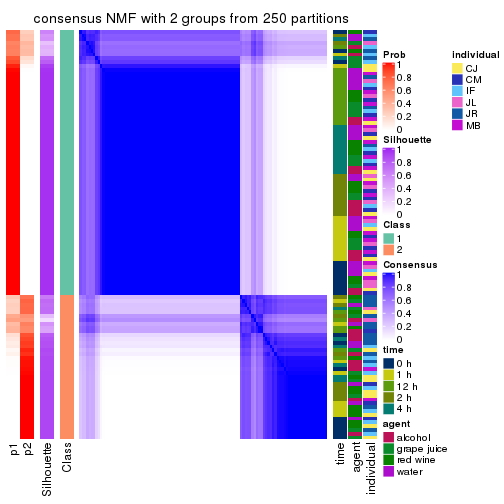</p>

</div>
<div id='tab-CV-NMF-consensus-heatmap-2'>
<pre><code class="r">consensus_heatmap(res, k = 3)
</code></pre>

<p>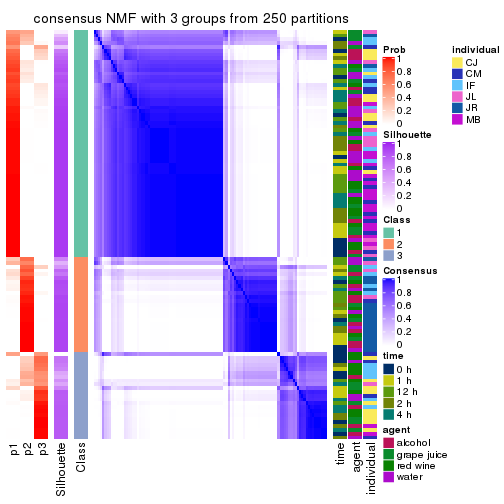</p>

</div>
<div id='tab-CV-NMF-consensus-heatmap-3'>
<pre><code class="r">consensus_heatmap(res, k = 4)
</code></pre>

<p>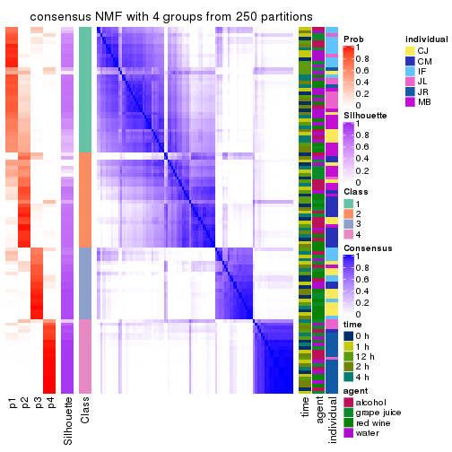</p>

</div>
<div id='tab-CV-NMF-consensus-heatmap-4'>
<pre><code class="r">consensus_heatmap(res, k = 5)
</code></pre>

<p>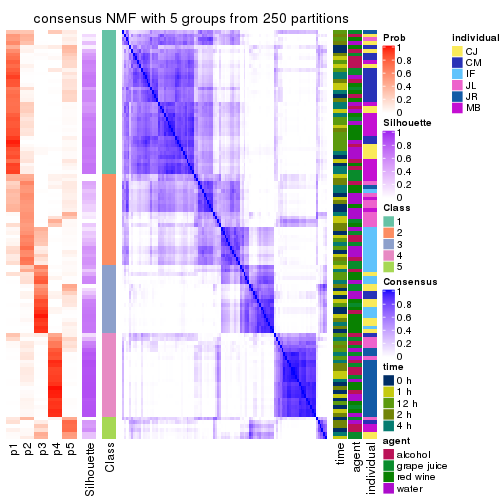</p>

</div>
<div id='tab-CV-NMF-consensus-heatmap-5'>
<pre><code class="r">consensus_heatmap(res, k = 6)
</code></pre>

<p>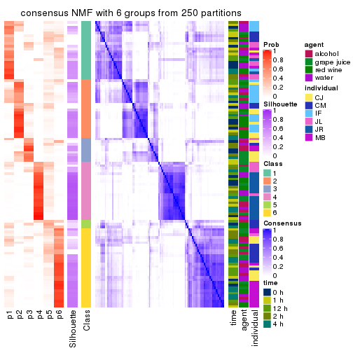</p>

</div>
</div>

Heatmaps for the membership of samples in all partitions to see how consistent they are:


<script>
$( function() {
	$( '#tabs-CV-NMF-membership-heatmap' ).tabs();
} );
</script>
<div id='tabs-CV-NMF-membership-heatmap'>
<ul>
<li><a href='#tab-CV-NMF-membership-heatmap-1'>k = 2</a></li>
<li><a href='#tab-CV-NMF-membership-heatmap-2'>k = 3</a></li>
<li><a href='#tab-CV-NMF-membership-heatmap-3'>k = 4</a></li>
<li><a href='#tab-CV-NMF-membership-heatmap-4'>k = 5</a></li>
<li><a href='#tab-CV-NMF-membership-heatmap-5'>k = 6</a></li>
</ul>
<div id='tab-CV-NMF-membership-heatmap-1'>
<pre><code class="r">membership_heatmap(res, k = 2)
</code></pre>

<p>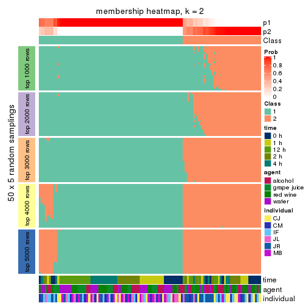</p>

</div>
<div id='tab-CV-NMF-membership-heatmap-2'>
<pre><code class="r">membership_heatmap(res, k = 3)
</code></pre>

<p>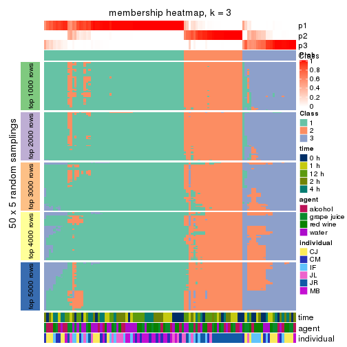</p>

</div>
<div id='tab-CV-NMF-membership-heatmap-3'>
<pre><code class="r">membership_heatmap(res, k = 4)
</code></pre>

<p>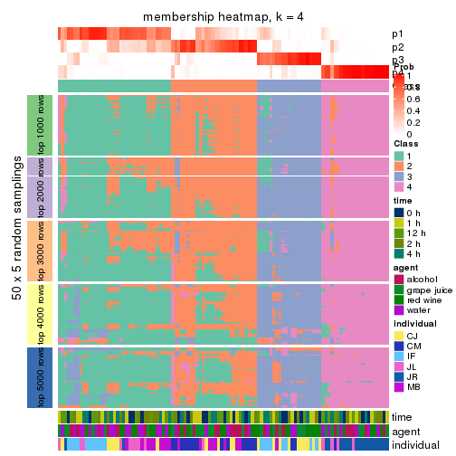</p>

</div>
<div id='tab-CV-NMF-membership-heatmap-4'>
<pre><code class="r">membership_heatmap(res, k = 5)
</code></pre>

<p>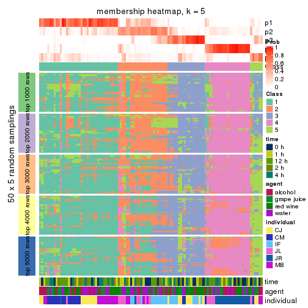</p>

</div>
<div id='tab-CV-NMF-membership-heatmap-5'>
<pre><code class="r">membership_heatmap(res, k = 6)
</code></pre>

<p>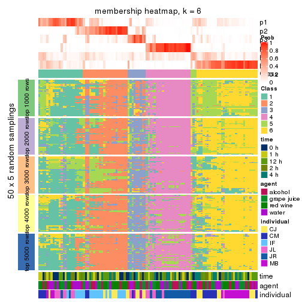</p>

</div>
</div>

As soon as we have had the classes for columns, we can look for signatures
which are significantly different between classes which can be candidate marks
for certain classes. Following are the heatmaps for signatures.


Signature heatmaps where rows are scaled:


<script>
$( function() {
	$( '#tabs-CV-NMF-get-signatures' ).tabs();
} );
</script>
<div id='tabs-CV-NMF-get-signatures'>
<ul>
<li><a href='#tab-CV-NMF-get-signatures-1'>k = 2</a></li>
<li><a href='#tab-CV-NMF-get-signatures-2'>k = 3</a></li>
<li><a href='#tab-CV-NMF-get-signatures-3'>k = 4</a></li>
<li><a href='#tab-CV-NMF-get-signatures-4'>k = 5</a></li>
<li><a href='#tab-CV-NMF-get-signatures-5'>k = 6</a></li>
</ul>
<div id='tab-CV-NMF-get-signatures-1'>
<pre><code class="r">get_signatures(res, k = 2)
</code></pre>

<p>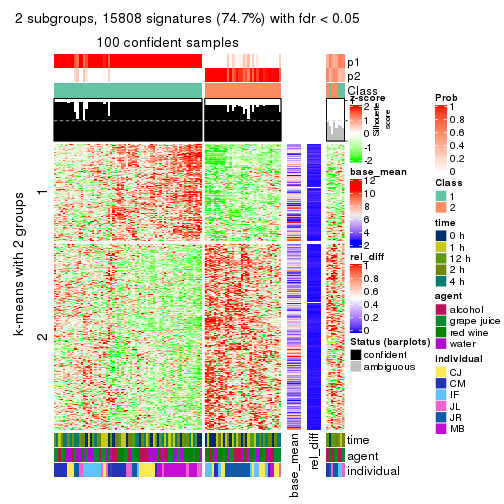</p>

</div>
<div id='tab-CV-NMF-get-signatures-2'>
<pre><code class="r">get_signatures(res, k = 3)
</code></pre>

<p>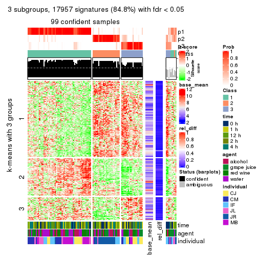</p>

</div>
<div id='tab-CV-NMF-get-signatures-3'>
<pre><code class="r">get_signatures(res, k = 4)
</code></pre>

<p>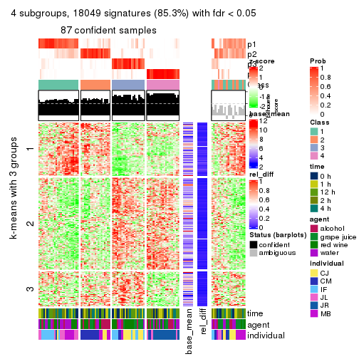</p>

</div>
<div id='tab-CV-NMF-get-signatures-4'>
<pre><code class="r">get_signatures(res, k = 5)
</code></pre>

<p>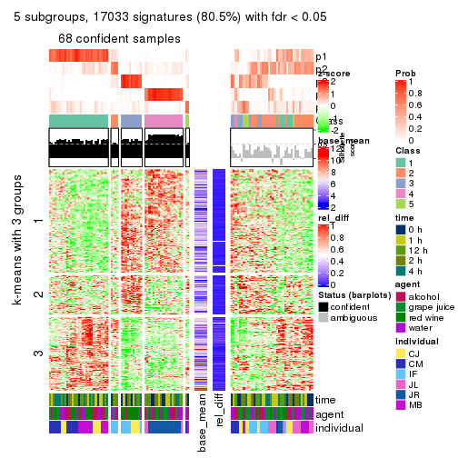</p>

</div>
<div id='tab-CV-NMF-get-signatures-5'>
<pre><code class="r">get_signatures(res, k = 6)
</code></pre>

<p>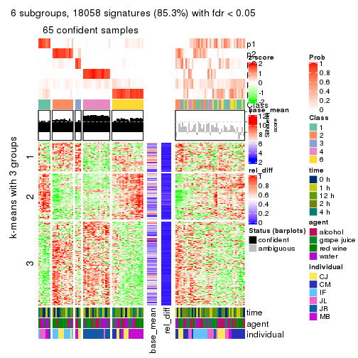</p>

</div>
</div>


Signature heatmaps where rows are not scaled:


<script>
$( function() {
	$( '#tabs-CV-NMF-get-signatures-no-scale' ).tabs();
} );
</script>
<div id='tabs-CV-NMF-get-signatures-no-scale'>
<ul>
<li><a href='#tab-CV-NMF-get-signatures-no-scale-1'>k = 2</a></li>
<li><a href='#tab-CV-NMF-get-signatures-no-scale-2'>k = 3</a></li>
<li><a href='#tab-CV-NMF-get-signatures-no-scale-3'>k = 4</a></li>
<li><a href='#tab-CV-NMF-get-signatures-no-scale-4'>k = 5</a></li>
<li><a href='#tab-CV-NMF-get-signatures-no-scale-5'>k = 6</a></li>
</ul>
<div id='tab-CV-NMF-get-signatures-no-scale-1'>
<pre><code class="r">get_signatures(res, k = 2, scale_rows = FALSE)
</code></pre>

<p>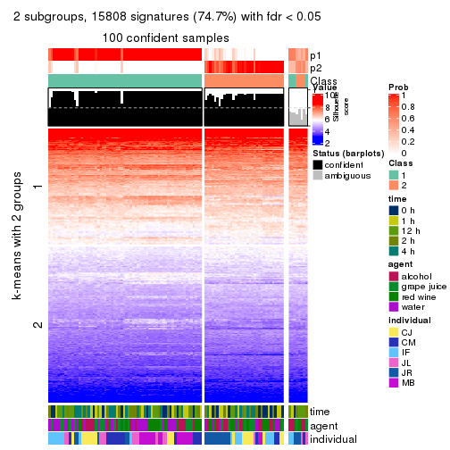</p>

</div>
<div id='tab-CV-NMF-get-signatures-no-scale-2'>
<pre><code class="r">get_signatures(res, k = 3, scale_rows = FALSE)
</code></pre>

<p>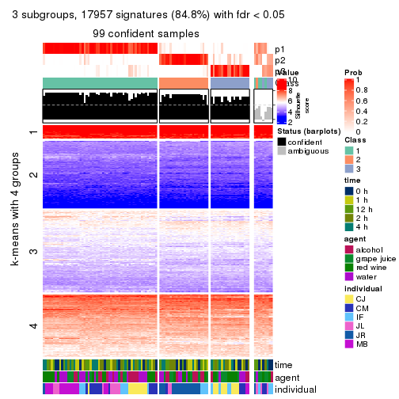</p>

</div>
<div id='tab-CV-NMF-get-signatures-no-scale-3'>
<pre><code class="r">get_signatures(res, k = 4, scale_rows = FALSE)
</code></pre>

<p>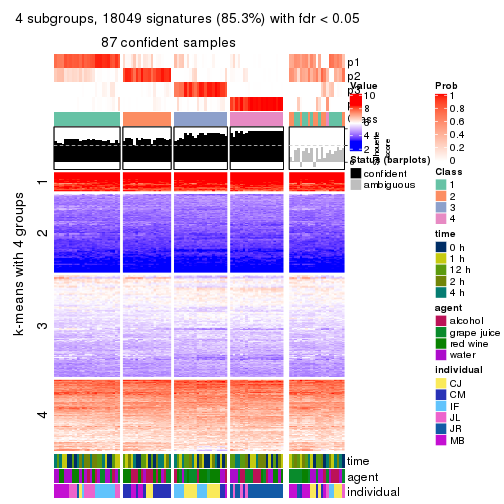</p>

</div>
<div id='tab-CV-NMF-get-signatures-no-scale-4'>
<pre><code class="r">get_signatures(res, k = 5, scale_rows = FALSE)
</code></pre>

<p>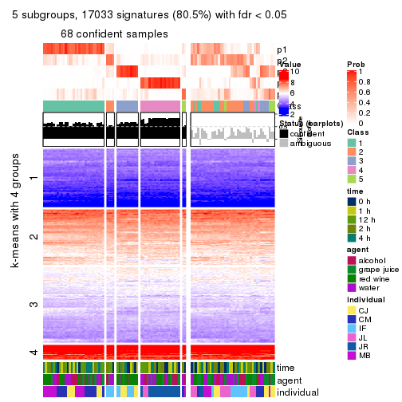</p>

</div>
<div id='tab-CV-NMF-get-signatures-no-scale-5'>
<pre><code class="r">get_signatures(res, k = 6, scale_rows = FALSE)
</code></pre>

<p>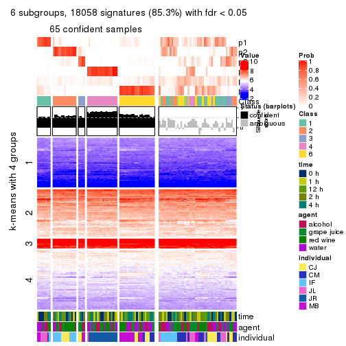</p>

</div>
</div>


Compare the overlap of signatures from different k:

```r
compare_signatures(res)
```

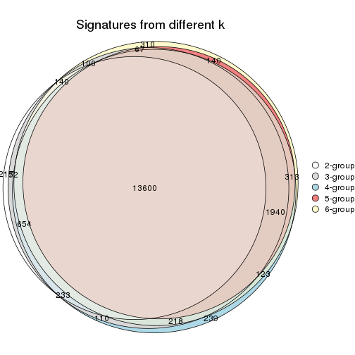

`get_signature()` returns a data frame invisibly. TO get the list of signatures, the function
call should be assigned to a variable explicitly. In following code, if `plot` argument is set
to `FALSE`, no heatmap is plotted while only the differential analysis is performed.

```r
# code only for demonstration
tb = get_signature(res, k = ..., plot = FALSE)
```

An example of the output of `tb` is:

```
#>   which_row         fdr    mean_1    mean_2 scaled_mean_1 scaled_mean_2 km
#> 1        38 0.042760348  8.373488  9.131774    -0.5533452     0.5164555  1
#> 2        40 0.018707592  7.106213  8.469186    -0.6173731     0.5762149  1
#> 3        55 0.019134737 10.221463 11.207825    -0.6159697     0.5749050  1
#> 4        59 0.006059896  5.921854  7.869574    -0.6899429     0.6439467  1
#> 5        60 0.018055526  8.928898 10.211722    -0.6204761     0.5791110  1
#> 6        98 0.009384629 15.714769 14.887706     0.6635654    -0.6193277  2
...
```

The columns in `tb` are:

1. `which_row`: row indices corresponding to the input matrix.
2. `fdr`: FDR for the differential test. 
3. `mean_x`: The mean value in group x.
4. `scaled_mean_x`: The mean value in group x after rows are scaled.
5. `km`: Row groups if k-means clustering is applied to rows.


UMAP plot which shows how samples are separated.


<script>
$( function() {
	$( '#tabs-CV-NMF-dimension-reduction' ).tabs();
} );
</script>
<div id='tabs-CV-NMF-dimension-reduction'>
<ul>
<li><a href='#tab-CV-NMF-dimension-reduction-1'>k = 2</a></li>
<li><a href='#tab-CV-NMF-dimension-reduction-2'>k = 3</a></li>
<li><a href='#tab-CV-NMF-dimension-reduction-3'>k = 4</a></li>
<li><a href='#tab-CV-NMF-dimension-reduction-4'>k = 5</a></li>
<li><a href='#tab-CV-NMF-dimension-reduction-5'>k = 6</a></li>
</ul>
<div id='tab-CV-NMF-dimension-reduction-1'>
<pre><code class="r">dimension_reduction(res, k = 2, method = &quot;UMAP&quot;)
</code></pre>

<p>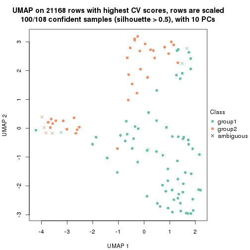</p>

</div>
<div id='tab-CV-NMF-dimension-reduction-2'>
<pre><code class="r">dimension_reduction(res, k = 3, method = &quot;UMAP&quot;)
</code></pre>

<p>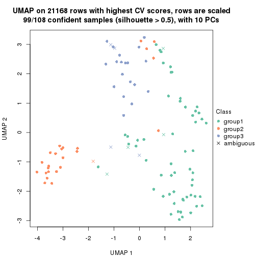</p>

</div>
<div id='tab-CV-NMF-dimension-reduction-3'>
<pre><code class="r">dimension_reduction(res, k = 4, method = &quot;UMAP&quot;)
</code></pre>

<p>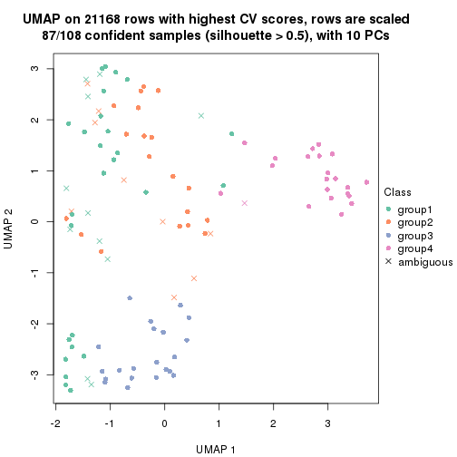</p>

</div>
<div id='tab-CV-NMF-dimension-reduction-4'>
<pre><code class="r">dimension_reduction(res, k = 5, method = &quot;UMAP&quot;)
</code></pre>

<p>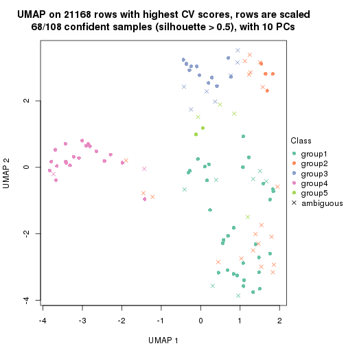</p>

</div>
<div id='tab-CV-NMF-dimension-reduction-5'>
<pre><code class="r">dimension_reduction(res, k = 6, method = &quot;UMAP&quot;)
</code></pre>

<p>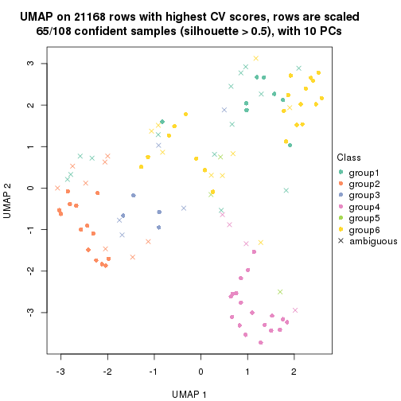</p>

</div>
</div>


Following heatmap shows how subgroups are split when increasing `k`:

```r
collect_classes(res)
```

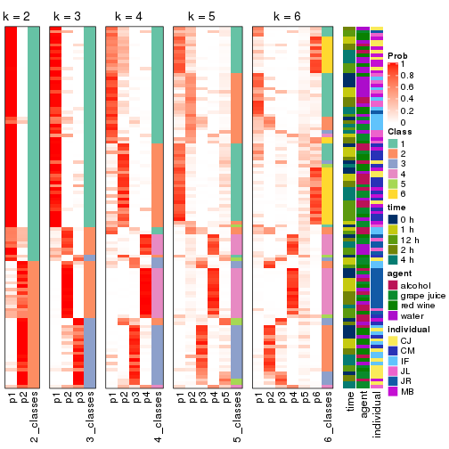


Test correlation between subgroups and known annotations. If the known
annotation is numeric, one-way ANOVA test is applied, and if the known
annotation is discrete, chi-squared contingency table test is applied.

```r
test_to_known_factors(res)
```

```
#>          n time(p) agent(p) individual(p) k
#> CV:NMF 100   0.374   0.5284      9.10e-04 2
#> CV:NMF  99   0.941   0.5879      9.68e-13 3
#> CV:NMF  87   1.000   0.0349      5.40e-21 4
#> CV:NMF  68   0.806   0.2469      3.19e-17 5
#> CV:NMF  65   0.754   0.2388      1.81e-17 6
```


If matrix rows can be associated to genes, consider to use `GO_Enrichment(res,
...)` to perform function enrichment for the signature genes.


 

---------------------------------------------------


### MAD:hclust


The object with results only for a single top-value method and a single partition method 
can be extracted as:

```r
res = res_list["MAD", "hclust"]
# you can also extract it by
# res = res_list["MAD:hclust"]
```

A summary of `res` and all the functions that can be applied to it:

```r
res
```

```
#> A 'ConsensusPartition' object with k = 2, 3, 4, 5, 6.
#>   On a matrix with 21168 rows and 108 columns.
#>   Top rows (1000, 2000, 3000, 4000, 5000) are extracted by 'MAD' method.
#>   Subgroups are detected by 'hclust' method.
#>   Performed in total 1250 partitions by row resampling.
#>   Best k for subgroups seems to be 2.
#> 
#> Following methods can be applied to this 'ConsensusPartition' object:
#>  [1] "cola_report"             "collect_classes"         "collect_plots"          
#>  [4] "collect_stats"           "colnames"                "compare_signatures"     
#>  [7] "consensus_heatmap"       "dimension_reduction"     "functional_enrichment"  
#> [10] "get_anno_col"            "get_anno"                "get_classes"            
#> [13] "get_consensus"           "get_matrix"              "get_membership"         
#> [16] "get_param"               "get_signatures"          "get_stats"              
#> [19] "is_best_k"               "is_stable_k"             "membership_heatmap"     
#> [22] "ncol"                    "nrow"                    "plot_ecdf"              
#> [25] "rownames"                "select_partition_number" "show"                   
#> [28] "suggest_best_k"          "test_to_known_factors"
```

`collect_plots()` function collects all the plots made from `res` for all `k` (number of partitions)
into one single page to provide an easy and fast comparison between different `k`.

```r
collect_plots(res)
```

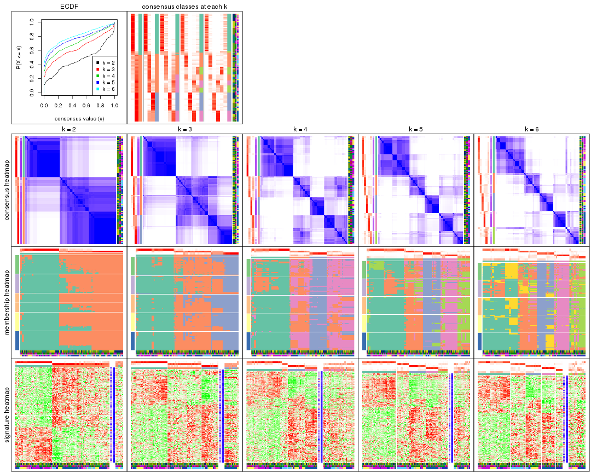

The plots are:

- The first row: a plot of the ECDF (Empirical cumulative distribution
  function) curves of the consensus matrix for each `k` and the heatmap of
  predicted classes for each `k`.
- The second row: heatmaps of the consensus matrix for each `k`.
- The third row: heatmaps of the membership matrix for each `k`.
- The fouth row: heatmaps of the signatures for each `k`.

All the plots in panels can be made by individual functions and they are
plotted later in this section.

`select_partition_number()` produces several plots showing different
statistics for choosing "optimized" `k`. There are following statistics:

- ECDF curves of the consensus matrix for each `k`;
- 1-PAC. [The PAC
  score](https://en.wikipedia.org/wiki/Consensus_clustering#Over-interpretation_potential_of_consensus_clustering)
  measures the proportion of the ambiguous subgrouping.
- Mean silhouette score.
- Concordance. The mean probability of fiting the consensus class ids in all
  partitions.
- Area increased. Denote $A_k$ as the area under the ECDF curve for current
  `k`, the area increased is defined as $A_k - A_{k-1}$.
- Rand index. The percent of pairs of samples that are both in a same cluster
  or both are not in a same cluster in the partition of k and k-1.
- Jaccard index. The ratio of pairs of samples are both in a same cluster in
  the partition of k and k-1 and the pairs of samples are both in a same
  cluster in the partition k or k-1.

The detailed explanations of these statistics can be found in [the cola
vignette](http://bioconductor.org/packages/devel/bioc/vignettes/cola/inst/doc/cola.html#toc_13).

Generally speaking, lower PAC score, higher mean silhouette score or higher
concordance corresponds to better partition. Rand index and Jaccard index
measure how similar the current partition is compared to partition with `k-1`.
If they are too similar, we won't accept `k` is better than `k-1`.

```r
select_partition_number(res)
```

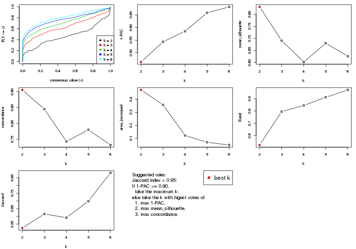

The numeric values for all these statistics can be obtained by `get_stats()`.

```r
get_stats(res)
```

```
#>   k 1-PAC mean_silhouette concordance area_increased  Rand Jaccard
#> 2 2 0.463           0.831       0.906         0.4718 0.525   0.525
#> 3 3 0.544           0.691       0.845         0.3572 0.796   0.616
#> 4 4 0.585           0.602       0.743         0.1226 0.846   0.592
#> 5 5 0.659           0.680       0.780         0.0703 0.912   0.699
#> 6 6 0.682           0.626       0.732         0.0494 0.972   0.882
```

`suggest_best_k()` suggests the best $k$ based on these statistics. The rules are as follows:

- All $k$ with Jaccard index larger than 0.95 are removed because the increase of
  the partition number does not provides enough extra information. If all $k$ are removed,
  the best $k$ is assigned by `NA`.
- For $k$ with 1-PAC larger than 0.9, the maximal $k$ is taken as the "best k". Other $k$ is called "optional k".
- If it does not fit the second rule. The $k$ with the highest vote of highest
  1-PAC, mean silhouette and concordance is taken as the "best k".

```r
suggest_best_k(res)
```

```
#> [1] 2
```


Following shows the table of the partitions (You need to click the **show/hide
code output** link to see it). The membership matrix (columns with name `p*`)
is inferred by
[`clue::cl_consensus()`](https://www.rdocumentation.org/link/cl_consensus?package=clue)
function with the `SE` method. Basically the value in the membership matrix
represents the probability to belong to a certain group. The finall class
label for an item is determined with the group with highest probability it
belongs to.

In `get_classes()` function, the entropy is calculated from the membership
matrix and the silhouette score is calculated from the consensus matrix.


<script>
$( function() {
	$( '#tabs-MAD-hclust-get-classes' ).tabs();
} );
</script>
<div id='tabs-MAD-hclust-get-classes'>
<ul>
<li><a href='#tab-MAD-hclust-get-classes-1'>k = 2</a></li>
<li><a href='#tab-MAD-hclust-get-classes-2'>k = 3</a></li>
<li><a href='#tab-MAD-hclust-get-classes-3'>k = 4</a></li>
<li><a href='#tab-MAD-hclust-get-classes-4'>k = 5</a></li>
<li><a href='#tab-MAD-hclust-get-classes-5'>k = 6</a></li>
</ul>

<div id='tab-MAD-hclust-get-classes-1'>
<p><a id='tab-MAD-hclust-get-classes-1-a' style='color:#0366d6' href='#'>show/hide code output</a></p>
<pre><code class="r">cbind(get_classes(res, k = 2), get_membership(res, k = 2))
</code></pre>

<pre><code>#&gt;          class entropy silhouette    p1    p2
#&gt; GSM87863     1  0.2948      0.917 0.948 0.052
#&gt; GSM87887     1  0.6887      0.727 0.816 0.184
#&gt; GSM87896     2  0.0000      0.861 0.000 1.000
#&gt; GSM87934     2  0.0000      0.861 0.000 1.000
#&gt; GSM87943     2  0.0000      0.861 0.000 1.000
#&gt; GSM87853     2  0.0000      0.861 0.000 1.000
#&gt; GSM87906     2  0.7219      0.811 0.200 0.800
#&gt; GSM87920     1  0.4939      0.853 0.892 0.108
#&gt; GSM87924     2  0.0000      0.861 0.000 1.000
#&gt; GSM87858     2  0.0000      0.861 0.000 1.000
#&gt; GSM87882     2  0.7139      0.813 0.196 0.804
#&gt; GSM87891     2  0.0000      0.861 0.000 1.000
#&gt; GSM87917     1  0.0000      0.950 1.000 0.000
#&gt; GSM87929     2  0.7376      0.803 0.208 0.792
#&gt; GSM87948     1  0.1633      0.938 0.976 0.024
#&gt; GSM87868     1  0.0000      0.950 1.000 0.000
#&gt; GSM87873     2  0.0000      0.861 0.000 1.000
#&gt; GSM87901     2  0.9896      0.442 0.440 0.560
#&gt; GSM87910     1  0.0000      0.950 1.000 0.000
#&gt; GSM87938     2  0.0000      0.861 0.000 1.000
#&gt; GSM87953     1  0.0000      0.950 1.000 0.000
#&gt; GSM87864     1  0.2948      0.917 0.948 0.052
#&gt; GSM87888     2  0.7219      0.810 0.200 0.800
#&gt; GSM87897     2  0.6531      0.829 0.168 0.832
#&gt; GSM87935     2  0.0000      0.861 0.000 1.000
#&gt; GSM87944     1  0.0000      0.950 1.000 0.000
#&gt; GSM87854     2  0.5294      0.823 0.120 0.880
#&gt; GSM87878     1  0.6887      0.727 0.816 0.184
#&gt; GSM87907     2  0.6247      0.835 0.156 0.844
#&gt; GSM87921     2  0.6623      0.829 0.172 0.828
#&gt; GSM87925     2  0.0000      0.861 0.000 1.000
#&gt; GSM87957     1  0.0000      0.950 1.000 0.000
#&gt; GSM87859     2  0.0000      0.861 0.000 1.000
#&gt; GSM87883     1  0.0000      0.950 1.000 0.000
#&gt; GSM87892     2  0.0000      0.861 0.000 1.000
#&gt; GSM87930     2  0.0000      0.861 0.000 1.000
#&gt; GSM87949     1  0.0000      0.950 1.000 0.000
#&gt; GSM87869     1  0.0000      0.950 1.000 0.000
#&gt; GSM87874     2  0.0000      0.861 0.000 1.000
#&gt; GSM87902     2  0.9896      0.442 0.440 0.560
#&gt; GSM87911     2  0.9358      0.613 0.352 0.648
#&gt; GSM87939     2  0.0938      0.861 0.012 0.988
#&gt; GSM87954     1  0.0000      0.950 1.000 0.000
#&gt; GSM87865     1  0.2948      0.917 0.948 0.052
#&gt; GSM87889     2  0.8267      0.753 0.260 0.740
#&gt; GSM87898     2  0.9996      0.310 0.488 0.512
#&gt; GSM87915     1  0.0376      0.948 0.996 0.004
#&gt; GSM87936     2  0.0000      0.861 0.000 1.000
#&gt; GSM87945     2  0.0000      0.861 0.000 1.000
#&gt; GSM87855     2  0.0000      0.861 0.000 1.000
#&gt; GSM87879     2  0.7219      0.810 0.200 0.800
#&gt; GSM87922     2  0.5178      0.847 0.116 0.884
#&gt; GSM87926     2  0.0938      0.861 0.012 0.988
#&gt; GSM87958     1  0.0000      0.950 1.000 0.000
#&gt; GSM87860     2  0.1184      0.861 0.016 0.984
#&gt; GSM87884     1  0.0000      0.950 1.000 0.000
#&gt; GSM87893     2  0.0000      0.861 0.000 1.000
#&gt; GSM87918     2  0.9286      0.635 0.344 0.656
#&gt; GSM87931     2  0.0000      0.861 0.000 1.000
#&gt; GSM87950     1  0.0000      0.950 1.000 0.000
#&gt; GSM87870     1  0.2948      0.917 0.948 0.052
#&gt; GSM87875     2  0.0000      0.861 0.000 1.000
#&gt; GSM87903     2  0.7219      0.811 0.200 0.800
#&gt; GSM87912     1  0.0376      0.948 0.996 0.004
#&gt; GSM87940     2  0.0000      0.861 0.000 1.000
#&gt; GSM87866     1  0.2948      0.917 0.948 0.052
#&gt; GSM87899     2  0.6531      0.829 0.168 0.832
#&gt; GSM87937     2  0.0000      0.861 0.000 1.000
#&gt; GSM87946     1  0.0000      0.950 1.000 0.000
#&gt; GSM87856     2  0.0000      0.861 0.000 1.000
#&gt; GSM87880     2  0.7219      0.810 0.200 0.800
#&gt; GSM87908     2  0.9833      0.481 0.424 0.576
#&gt; GSM87923     2  0.5178      0.847 0.116 0.884
#&gt; GSM87927     2  0.5519      0.845 0.128 0.872
#&gt; GSM87959     1  0.0000      0.950 1.000 0.000
#&gt; GSM87861     2  0.0000      0.861 0.000 1.000
#&gt; GSM87885     2  0.8267      0.753 0.260 0.740
#&gt; GSM87894     1  0.0376      0.949 0.996 0.004
#&gt; GSM87932     1  0.0000      0.950 1.000 0.000
#&gt; GSM87951     1  0.0000      0.950 1.000 0.000
#&gt; GSM87871     1  0.9522      0.299 0.628 0.372
#&gt; GSM87876     2  0.8081      0.766 0.248 0.752
#&gt; GSM87904     2  0.6247      0.835 0.156 0.844
#&gt; GSM87913     1  0.2236      0.929 0.964 0.036
#&gt; GSM87941     2  0.5519      0.845 0.128 0.872
#&gt; GSM87955     1  0.0000      0.950 1.000 0.000
#&gt; GSM87867     1  0.9732      0.158 0.596 0.404
#&gt; GSM87890     2  0.1184      0.862 0.016 0.984
#&gt; GSM87900     2  0.8081      0.767 0.248 0.752
#&gt; GSM87916     2  0.1414      0.862 0.020 0.980
#&gt; GSM87947     1  0.1633      0.938 0.976 0.024
#&gt; GSM87857     2  0.1184      0.861 0.016 0.984
#&gt; GSM87881     2  0.5059      0.850 0.112 0.888
#&gt; GSM87909     2  0.9988      0.335 0.480 0.520
#&gt; GSM87928     1  0.0000      0.950 1.000 0.000
#&gt; GSM87960     1  0.0000      0.950 1.000 0.000
#&gt; GSM87862     2  0.5519      0.845 0.128 0.872
#&gt; GSM87886     1  0.0000      0.950 1.000 0.000
#&gt; GSM87895     2  0.6247      0.835 0.156 0.844
#&gt; GSM87919     1  0.0000      0.950 1.000 0.000
#&gt; GSM87933     2  0.0000      0.861 0.000 1.000
#&gt; GSM87952     1  0.0000      0.950 1.000 0.000
#&gt; GSM87872     2  0.7299      0.809 0.204 0.796
#&gt; GSM87877     1  0.1633      0.938 0.976 0.024
#&gt; GSM87905     2  0.9988      0.335 0.480 0.520
#&gt; GSM87914     2  0.9286      0.635 0.344 0.656
#&gt; GSM87942     2  0.7815      0.783 0.232 0.768
#&gt; GSM87956     1  0.0000      0.950 1.000 0.000
</code></pre>

<script>
$('#tab-MAD-hclust-get-classes-1-a').parent().next().next().hide();
$('#tab-MAD-hclust-get-classes-1-a').click(function(){
  $('#tab-MAD-hclust-get-classes-1-a').parent().next().next().toggle();
  return(false);
});
</script>
</div>

<div id='tab-MAD-hclust-get-classes-2'>
<p><a id='tab-MAD-hclust-get-classes-2-a' style='color:#0366d6' href='#'>show/hide code output</a></p>
<pre><code class="r">cbind(get_classes(res, k = 3), get_membership(res, k = 3))
</code></pre>

<pre><code>#&gt;          class entropy silhouette    p1    p2    p3
#&gt; GSM87863     1  0.3116     0.8841 0.892 0.108 0.000
#&gt; GSM87887     1  0.5591     0.5837 0.696 0.304 0.000
#&gt; GSM87896     3  0.0000     0.7069 0.000 0.000 1.000
#&gt; GSM87934     3  0.6307     0.2459 0.000 0.488 0.512
#&gt; GSM87943     3  0.0747     0.7085 0.000 0.016 0.984
#&gt; GSM87853     3  0.0000     0.7069 0.000 0.000 1.000
#&gt; GSM87906     2  0.3528     0.7532 0.016 0.892 0.092
#&gt; GSM87920     1  0.4062     0.8198 0.836 0.164 0.000
#&gt; GSM87924     3  0.6192     0.3475 0.000 0.420 0.580
#&gt; GSM87858     3  0.0000     0.7069 0.000 0.000 1.000
#&gt; GSM87882     2  0.3832     0.7524 0.020 0.880 0.100
#&gt; GSM87891     3  0.0000     0.7069 0.000 0.000 1.000
#&gt; GSM87917     1  0.0000     0.9331 1.000 0.000 0.000
#&gt; GSM87929     2  0.3193     0.7304 0.004 0.896 0.100
#&gt; GSM87948     1  0.1753     0.9219 0.952 0.048 0.000
#&gt; GSM87868     1  0.0592     0.9343 0.988 0.012 0.000
#&gt; GSM87873     3  0.0000     0.7069 0.000 0.000 1.000
#&gt; GSM87901     2  0.4346     0.6419 0.184 0.816 0.000
#&gt; GSM87910     1  0.0000     0.9331 1.000 0.000 0.000
#&gt; GSM87938     3  0.6309     0.2114 0.000 0.500 0.500
#&gt; GSM87953     1  0.0000     0.9331 1.000 0.000 0.000
#&gt; GSM87864     1  0.3116     0.8841 0.892 0.108 0.000
#&gt; GSM87888     2  0.3752     0.7528 0.020 0.884 0.096
#&gt; GSM87897     2  0.3116     0.7399 0.000 0.892 0.108
#&gt; GSM87935     3  0.6302     0.2605 0.000 0.480 0.520
#&gt; GSM87944     1  0.0592     0.9343 0.988 0.012 0.000
#&gt; GSM87854     3  0.7244     0.5187 0.092 0.208 0.700
#&gt; GSM87878     1  0.5835     0.5110 0.660 0.340 0.000
#&gt; GSM87907     2  0.3686     0.7295 0.000 0.860 0.140
#&gt; GSM87921     2  0.5115     0.6960 0.016 0.796 0.188
#&gt; GSM87925     3  0.6305     0.2529 0.000 0.484 0.516
#&gt; GSM87957     1  0.0592     0.9343 0.988 0.012 0.000
#&gt; GSM87859     3  0.0000     0.7069 0.000 0.000 1.000
#&gt; GSM87883     1  0.0592     0.9343 0.988 0.012 0.000
#&gt; GSM87892     3  0.0000     0.7069 0.000 0.000 1.000
#&gt; GSM87930     3  0.6307     0.2437 0.000 0.488 0.512
#&gt; GSM87949     1  0.0000     0.9331 1.000 0.000 0.000
#&gt; GSM87869     1  0.0592     0.9343 0.988 0.012 0.000
#&gt; GSM87874     3  0.0000     0.7069 0.000 0.000 1.000
#&gt; GSM87902     2  0.4346     0.6419 0.184 0.816 0.000
#&gt; GSM87911     2  0.8122     0.6047 0.184 0.648 0.168
#&gt; GSM87939     2  0.6286    -0.1277 0.000 0.536 0.464
#&gt; GSM87954     1  0.0000     0.9331 1.000 0.000 0.000
#&gt; GSM87865     1  0.3116     0.8841 0.892 0.108 0.000
#&gt; GSM87889     2  0.4443     0.7409 0.084 0.864 0.052
#&gt; GSM87898     2  0.4974     0.5907 0.236 0.764 0.000
#&gt; GSM87915     1  0.0424     0.9323 0.992 0.008 0.000
#&gt; GSM87936     3  0.6302     0.2605 0.000 0.480 0.520
#&gt; GSM87945     3  0.0747     0.7085 0.000 0.016 0.984
#&gt; GSM87855     3  0.0592     0.7085 0.000 0.012 0.988
#&gt; GSM87879     2  0.3752     0.7528 0.020 0.884 0.096
#&gt; GSM87922     2  0.5098     0.6163 0.000 0.752 0.248
#&gt; GSM87926     2  0.6286    -0.1277 0.000 0.536 0.464
#&gt; GSM87958     1  0.0592     0.9343 0.988 0.012 0.000
#&gt; GSM87860     3  0.4235     0.6327 0.000 0.176 0.824
#&gt; GSM87884     1  0.0592     0.9343 0.988 0.012 0.000
#&gt; GSM87893     3  0.0000     0.7069 0.000 0.000 1.000
#&gt; GSM87918     2  0.3375     0.7106 0.100 0.892 0.008
#&gt; GSM87931     3  0.6308     0.2349 0.000 0.492 0.508
#&gt; GSM87950     1  0.0000     0.9331 1.000 0.000 0.000
#&gt; GSM87870     1  0.3116     0.8841 0.892 0.108 0.000
#&gt; GSM87875     3  0.2261     0.6929 0.000 0.068 0.932
#&gt; GSM87903     2  0.3528     0.7532 0.016 0.892 0.092
#&gt; GSM87912     1  0.0424     0.9323 0.992 0.008 0.000
#&gt; GSM87940     3  0.6309     0.2114 0.000 0.500 0.500
#&gt; GSM87866     1  0.3116     0.8841 0.892 0.108 0.000
#&gt; GSM87899     2  0.3116     0.7399 0.000 0.892 0.108
#&gt; GSM87937     3  0.6302     0.2605 0.000 0.480 0.520
#&gt; GSM87946     1  0.0592     0.9343 0.988 0.012 0.000
#&gt; GSM87856     3  0.0747     0.7085 0.000 0.016 0.984
#&gt; GSM87880     2  0.3752     0.7528 0.020 0.884 0.096
#&gt; GSM87908     2  0.4409     0.6567 0.172 0.824 0.004
#&gt; GSM87923     2  0.5560     0.5593 0.000 0.700 0.300
#&gt; GSM87927     2  0.4931     0.5903 0.000 0.768 0.232
#&gt; GSM87959     1  0.0237     0.9337 0.996 0.004 0.000
#&gt; GSM87861     3  0.1031     0.7061 0.000 0.024 0.976
#&gt; GSM87885     2  0.4269     0.7437 0.076 0.872 0.052
#&gt; GSM87894     1  0.1031     0.9315 0.976 0.024 0.000
#&gt; GSM87932     1  0.4121     0.8063 0.832 0.168 0.000
#&gt; GSM87951     1  0.0000     0.9331 1.000 0.000 0.000
#&gt; GSM87871     1  0.7681     0.1652 0.540 0.412 0.048
#&gt; GSM87876     2  0.4194     0.7491 0.060 0.876 0.064
#&gt; GSM87904     2  0.3686     0.7295 0.000 0.860 0.140
#&gt; GSM87913     1  0.2165     0.9132 0.936 0.064 0.000
#&gt; GSM87941     2  0.4931     0.5903 0.000 0.768 0.232
#&gt; GSM87955     1  0.0000     0.9331 1.000 0.000 0.000
#&gt; GSM87867     2  0.6669     0.0202 0.468 0.524 0.008
#&gt; GSM87890     2  0.5529     0.5101 0.000 0.704 0.296
#&gt; GSM87900     2  0.1774     0.7444 0.016 0.960 0.024
#&gt; GSM87916     2  0.5327     0.5386 0.000 0.728 0.272
#&gt; GSM87947     1  0.1753     0.9219 0.952 0.048 0.000
#&gt; GSM87857     3  0.4291     0.6307 0.000 0.180 0.820
#&gt; GSM87881     2  0.4291     0.6956 0.000 0.820 0.180
#&gt; GSM87909     2  0.4887     0.5995 0.228 0.772 0.000
#&gt; GSM87928     1  0.4121     0.8063 0.832 0.168 0.000
#&gt; GSM87960     1  0.0592     0.9343 0.988 0.012 0.000
#&gt; GSM87862     2  0.5058     0.6550 0.000 0.756 0.244
#&gt; GSM87886     1  0.0592     0.9343 0.988 0.012 0.000
#&gt; GSM87895     2  0.3686     0.7295 0.000 0.860 0.140
#&gt; GSM87919     1  0.0000     0.9331 1.000 0.000 0.000
#&gt; GSM87933     3  0.6309     0.2114 0.000 0.500 0.500
#&gt; GSM87952     1  0.0000     0.9331 1.000 0.000 0.000
#&gt; GSM87872     2  0.3637     0.7560 0.024 0.892 0.084
#&gt; GSM87877     1  0.1860     0.9201 0.948 0.052 0.000
#&gt; GSM87905     2  0.4887     0.5995 0.228 0.772 0.000
#&gt; GSM87914     2  0.3375     0.7106 0.100 0.892 0.008
#&gt; GSM87942     2  0.2384     0.7459 0.008 0.936 0.056
#&gt; GSM87956     1  0.0000     0.9331 1.000 0.000 0.000
</code></pre>

<script>
$('#tab-MAD-hclust-get-classes-2-a').parent().next().next().hide();
$('#tab-MAD-hclust-get-classes-2-a').click(function(){
  $('#tab-MAD-hclust-get-classes-2-a').parent().next().next().toggle();
  return(false);
});
</script>
</div>

<div id='tab-MAD-hclust-get-classes-3'>
<p><a id='tab-MAD-hclust-get-classes-3-a' style='color:#0366d6' href='#'>show/hide code output</a></p>
<pre><code class="r">cbind(get_classes(res, k = 4), get_membership(res, k = 4))
</code></pre>

<pre><code>#&gt;          class entropy silhouette    p1    p2    p3    p4
#&gt; GSM87863     1  0.4522     0.7713 0.680 0.320 0.000 0.000
#&gt; GSM87887     1  0.6125     0.5376 0.516 0.436 0.000 0.048
#&gt; GSM87896     3  0.0707     0.9221 0.000 0.000 0.980 0.020
#&gt; GSM87934     4  0.3311     0.6100 0.000 0.000 0.172 0.828
#&gt; GSM87943     3  0.1510     0.9101 0.000 0.016 0.956 0.028
#&gt; GSM87853     3  0.0469     0.9208 0.000 0.000 0.988 0.012
#&gt; GSM87906     2  0.5378     0.1979 0.000 0.540 0.012 0.448
#&gt; GSM87920     1  0.5847     0.7206 0.628 0.320 0.000 0.052
#&gt; GSM87924     4  0.4283     0.5421 0.000 0.004 0.256 0.740
#&gt; GSM87858     3  0.0707     0.9221 0.000 0.000 0.980 0.020
#&gt; GSM87882     2  0.5792     0.3050 0.000 0.552 0.032 0.416
#&gt; GSM87891     3  0.0707     0.9221 0.000 0.000 0.980 0.020
#&gt; GSM87917     1  0.0000     0.8452 1.000 0.000 0.000 0.000
#&gt; GSM87929     4  0.4936     0.1846 0.000 0.316 0.012 0.672
#&gt; GSM87948     1  0.4008     0.8218 0.756 0.244 0.000 0.000
#&gt; GSM87868     1  0.2530     0.8584 0.888 0.112 0.000 0.000
#&gt; GSM87873     3  0.0707     0.9221 0.000 0.000 0.980 0.020
#&gt; GSM87901     2  0.3725     0.5303 0.008 0.812 0.000 0.180
#&gt; GSM87910     1  0.0000     0.8452 1.000 0.000 0.000 0.000
#&gt; GSM87938     4  0.3172     0.6105 0.000 0.000 0.160 0.840
#&gt; GSM87953     1  0.0000     0.8452 1.000 0.000 0.000 0.000
#&gt; GSM87864     1  0.4522     0.7713 0.680 0.320 0.000 0.000
#&gt; GSM87888     2  0.5887     0.3110 0.004 0.548 0.028 0.420
#&gt; GSM87897     4  0.5404    -0.0729 0.000 0.476 0.012 0.512
#&gt; GSM87935     4  0.3583     0.6080 0.000 0.004 0.180 0.816
#&gt; GSM87944     1  0.2469     0.8586 0.892 0.108 0.000 0.000
#&gt; GSM87854     3  0.6617     0.5448 0.000 0.176 0.628 0.196
#&gt; GSM87878     1  0.6149     0.4581 0.480 0.472 0.000 0.048
#&gt; GSM87907     4  0.5901     0.0321 0.000 0.432 0.036 0.532
#&gt; GSM87921     4  0.6602    -0.1182 0.000 0.436 0.080 0.484
#&gt; GSM87925     4  0.3539     0.6096 0.000 0.004 0.176 0.820
#&gt; GSM87957     1  0.2408     0.8588 0.896 0.104 0.000 0.000
#&gt; GSM87859     3  0.0469     0.9208 0.000 0.000 0.988 0.012
#&gt; GSM87883     1  0.3356     0.8458 0.824 0.176 0.000 0.000
#&gt; GSM87892     3  0.0707     0.9221 0.000 0.000 0.980 0.020
#&gt; GSM87930     4  0.3311     0.6084 0.000 0.000 0.172 0.828
#&gt; GSM87949     1  0.0000     0.8452 1.000 0.000 0.000 0.000
#&gt; GSM87869     1  0.2530     0.8584 0.888 0.112 0.000 0.000
#&gt; GSM87874     3  0.0707     0.9221 0.000 0.000 0.980 0.020
#&gt; GSM87902     2  0.3725     0.5303 0.008 0.812 0.000 0.180
#&gt; GSM87911     2  0.6443     0.3446 0.012 0.628 0.072 0.288
#&gt; GSM87939     4  0.3390     0.6022 0.000 0.016 0.132 0.852
#&gt; GSM87954     1  0.0000     0.8452 1.000 0.000 0.000 0.000
#&gt; GSM87865     1  0.4522     0.7713 0.680 0.320 0.000 0.000
#&gt; GSM87889     2  0.5699     0.3923 0.032 0.588 0.000 0.380
#&gt; GSM87898     2  0.4188     0.5112 0.040 0.812 0.000 0.148
#&gt; GSM87915     1  0.1576     0.8515 0.948 0.048 0.000 0.004
#&gt; GSM87936     4  0.3583     0.6080 0.000 0.004 0.180 0.816
#&gt; GSM87945     3  0.1510     0.9101 0.000 0.016 0.956 0.028
#&gt; GSM87855     3  0.1059     0.9144 0.000 0.012 0.972 0.016
#&gt; GSM87879     2  0.5887     0.3110 0.004 0.548 0.028 0.420
#&gt; GSM87922     4  0.6725     0.1319 0.000 0.348 0.104 0.548
#&gt; GSM87926     4  0.3390     0.6022 0.000 0.016 0.132 0.852
#&gt; GSM87958     1  0.2408     0.8588 0.896 0.104 0.000 0.000
#&gt; GSM87860     3  0.4679     0.6997 0.000 0.044 0.772 0.184
#&gt; GSM87884     1  0.3356     0.8458 0.824 0.176 0.000 0.000
#&gt; GSM87893     3  0.0707     0.9221 0.000 0.000 0.980 0.020
#&gt; GSM87918     2  0.5085     0.4803 0.020 0.676 0.000 0.304
#&gt; GSM87931     4  0.3266     0.6101 0.000 0.000 0.168 0.832
#&gt; GSM87950     1  0.0000     0.8452 1.000 0.000 0.000 0.000
#&gt; GSM87870     1  0.4522     0.7713 0.680 0.320 0.000 0.000
#&gt; GSM87875     3  0.2813     0.8684 0.000 0.024 0.896 0.080
#&gt; GSM87903     2  0.5378     0.1979 0.000 0.540 0.012 0.448
#&gt; GSM87912     1  0.1576     0.8515 0.948 0.048 0.000 0.004
#&gt; GSM87940     4  0.3172     0.6105 0.000 0.000 0.160 0.840
#&gt; GSM87866     1  0.4522     0.7713 0.680 0.320 0.000 0.000
#&gt; GSM87899     4  0.5404    -0.0729 0.000 0.476 0.012 0.512
#&gt; GSM87937     4  0.3583     0.6080 0.000 0.004 0.180 0.816
#&gt; GSM87946     1  0.2469     0.8586 0.892 0.108 0.000 0.000
#&gt; GSM87856     3  0.1510     0.9101 0.000 0.016 0.956 0.028
#&gt; GSM87880     2  0.5887     0.3110 0.004 0.548 0.028 0.420
#&gt; GSM87908     2  0.4175     0.5279 0.016 0.784 0.000 0.200
#&gt; GSM87923     4  0.7272     0.0955 0.000 0.344 0.160 0.496
#&gt; GSM87927     4  0.5394     0.4430 0.000 0.228 0.060 0.712
#&gt; GSM87959     1  0.1557     0.8557 0.944 0.056 0.000 0.000
#&gt; GSM87861     3  0.1677     0.9062 0.000 0.012 0.948 0.040
#&gt; GSM87885     2  0.5523     0.3958 0.024 0.596 0.000 0.380
#&gt; GSM87894     1  0.3942     0.8272 0.764 0.236 0.000 0.000
#&gt; GSM87932     1  0.4235     0.7329 0.824 0.084 0.000 0.092
#&gt; GSM87951     1  0.0000     0.8452 1.000 0.000 0.000 0.000
#&gt; GSM87871     2  0.7729    -0.0212 0.396 0.408 0.004 0.192
#&gt; GSM87876     2  0.5299     0.3875 0.008 0.600 0.004 0.388
#&gt; GSM87904     4  0.5901     0.0321 0.000 0.432 0.036 0.532
#&gt; GSM87913     1  0.4482     0.8140 0.728 0.264 0.000 0.008
#&gt; GSM87941     4  0.5394     0.4430 0.000 0.228 0.060 0.712
#&gt; GSM87955     1  0.0000     0.8452 1.000 0.000 0.000 0.000
#&gt; GSM87867     1  0.7666    -0.1639 0.396 0.392 0.000 0.212
#&gt; GSM87890     4  0.6338     0.4457 0.000 0.236 0.120 0.644
#&gt; GSM87900     2  0.4830     0.3513 0.000 0.608 0.000 0.392
#&gt; GSM87916     4  0.5763     0.4595 0.000 0.204 0.096 0.700
#&gt; GSM87947     1  0.4008     0.8218 0.756 0.244 0.000 0.000
#&gt; GSM87857     3  0.4998     0.6804 0.000 0.052 0.748 0.200
#&gt; GSM87881     4  0.5453     0.2439 0.000 0.304 0.036 0.660
#&gt; GSM87909     2  0.4057     0.5160 0.032 0.816 0.000 0.152
#&gt; GSM87928     1  0.4235     0.7329 0.824 0.084 0.000 0.092
#&gt; GSM87960     1  0.2345     0.8582 0.900 0.100 0.000 0.000
#&gt; GSM87862     4  0.7098     0.0817 0.000 0.400 0.128 0.472
#&gt; GSM87886     1  0.3356     0.8458 0.824 0.176 0.000 0.000
#&gt; GSM87895     4  0.5901     0.0321 0.000 0.432 0.036 0.532
#&gt; GSM87919     1  0.0000     0.8452 1.000 0.000 0.000 0.000
#&gt; GSM87933     4  0.3172     0.6105 0.000 0.000 0.160 0.840
#&gt; GSM87952     1  0.0000     0.8452 1.000 0.000 0.000 0.000
#&gt; GSM87872     2  0.5163     0.1829 0.000 0.516 0.004 0.480
#&gt; GSM87877     1  0.4040     0.8198 0.752 0.248 0.000 0.000
#&gt; GSM87905     2  0.4057     0.5160 0.032 0.816 0.000 0.152
#&gt; GSM87914     2  0.5085     0.4803 0.020 0.676 0.000 0.304
#&gt; GSM87942     4  0.4713     0.0457 0.000 0.360 0.000 0.640
#&gt; GSM87956     1  0.0000     0.8452 1.000 0.000 0.000 0.000
</code></pre>

<script>
$('#tab-MAD-hclust-get-classes-3-a').parent().next().next().hide();
$('#tab-MAD-hclust-get-classes-3-a').click(function(){
  $('#tab-MAD-hclust-get-classes-3-a').parent().next().next().toggle();
  return(false);
});
</script>
</div>

<div id='tab-MAD-hclust-get-classes-4'>
<p><a id='tab-MAD-hclust-get-classes-4-a' style='color:#0366d6' href='#'>show/hide code output</a></p>
<pre><code class="r">cbind(get_classes(res, k = 5), get_membership(res, k = 5))
</code></pre>

<pre><code>#&gt;          class entropy silhouette    p1    p2    p3    p4    p5
#&gt; GSM87863     1  0.4768    0.74147 0.704 0.244 0.000 0.008 0.044
#&gt; GSM87887     1  0.6188    0.49452 0.540 0.124 0.000 0.008 0.328
#&gt; GSM87896     3  0.0404    0.89471 0.000 0.000 0.988 0.012 0.000
#&gt; GSM87934     4  0.1484    0.80630 0.000 0.000 0.048 0.944 0.008
#&gt; GSM87943     3  0.2513    0.87320 0.000 0.000 0.876 0.008 0.116
#&gt; GSM87853     3  0.0162    0.89383 0.000 0.000 0.996 0.004 0.000
#&gt; GSM87906     2  0.5120    0.53785 0.000 0.696 0.000 0.164 0.140
#&gt; GSM87920     1  0.5463    0.71203 0.668 0.248 0.000 0.032 0.052
#&gt; GSM87924     4  0.2771    0.73321 0.000 0.000 0.128 0.860 0.012
#&gt; GSM87858     3  0.0404    0.89471 0.000 0.000 0.988 0.012 0.000
#&gt; GSM87882     5  0.5172    0.73397 0.004 0.164 0.004 0.116 0.712
#&gt; GSM87891     3  0.0404    0.89471 0.000 0.000 0.988 0.012 0.000
#&gt; GSM87917     1  0.2349    0.81453 0.900 0.004 0.000 0.012 0.084
#&gt; GSM87929     4  0.6493   -0.16307 0.000 0.188 0.000 0.428 0.384
#&gt; GSM87948     1  0.4088    0.79382 0.780 0.176 0.000 0.008 0.036
#&gt; GSM87868     1  0.1914    0.83806 0.924 0.060 0.000 0.000 0.016
#&gt; GSM87873     3  0.0404    0.89471 0.000 0.000 0.988 0.012 0.000
#&gt; GSM87901     2  0.1300    0.57934 0.028 0.956 0.000 0.000 0.016
#&gt; GSM87910     1  0.2349    0.81453 0.900 0.004 0.000 0.012 0.084
#&gt; GSM87938     4  0.1618    0.80536 0.000 0.008 0.040 0.944 0.008
#&gt; GSM87953     1  0.2349    0.81453 0.900 0.004 0.000 0.012 0.084
#&gt; GSM87864     1  0.4768    0.74147 0.704 0.244 0.000 0.008 0.044
#&gt; GSM87888     5  0.5208    0.73607 0.004 0.168 0.004 0.116 0.708
#&gt; GSM87897     2  0.5555    0.51029 0.000 0.640 0.000 0.220 0.140
#&gt; GSM87935     4  0.1670    0.80452 0.000 0.000 0.052 0.936 0.012
#&gt; GSM87944     1  0.1740    0.83868 0.932 0.056 0.000 0.000 0.012
#&gt; GSM87854     3  0.7611    0.50166 0.016 0.148 0.552 0.112 0.172
#&gt; GSM87878     1  0.6479    0.41234 0.504 0.160 0.000 0.008 0.328
#&gt; GSM87907     2  0.6333    0.47210 0.000 0.592 0.024 0.244 0.140
#&gt; GSM87921     5  0.6389    0.56690 0.004 0.192 0.004 0.240 0.560
#&gt; GSM87925     4  0.1597    0.80566 0.000 0.000 0.048 0.940 0.012
#&gt; GSM87957     1  0.1502    0.83897 0.940 0.056 0.000 0.000 0.004
#&gt; GSM87859     3  0.0162    0.89383 0.000 0.000 0.996 0.004 0.000
#&gt; GSM87883     1  0.3246    0.82108 0.848 0.120 0.000 0.008 0.024
#&gt; GSM87892     3  0.0404    0.89471 0.000 0.000 0.988 0.012 0.000
#&gt; GSM87930     4  0.1270    0.80607 0.000 0.000 0.052 0.948 0.000
#&gt; GSM87949     1  0.2349    0.81453 0.900 0.004 0.000 0.012 0.084
#&gt; GSM87869     1  0.1914    0.83806 0.924 0.060 0.000 0.000 0.016
#&gt; GSM87874     3  0.0404    0.89471 0.000 0.000 0.988 0.012 0.000
#&gt; GSM87902     2  0.1300    0.57934 0.028 0.956 0.000 0.000 0.016
#&gt; GSM87911     5  0.7041    0.38299 0.056 0.300 0.004 0.116 0.524
#&gt; GSM87939     4  0.2610    0.77558 0.000 0.036 0.024 0.904 0.036
#&gt; GSM87954     1  0.2349    0.81453 0.900 0.004 0.000 0.012 0.084
#&gt; GSM87865     1  0.4768    0.74147 0.704 0.244 0.000 0.008 0.044
#&gt; GSM87889     5  0.5606    0.69315 0.044 0.188 0.000 0.076 0.692
#&gt; GSM87898     2  0.1894    0.55296 0.072 0.920 0.000 0.000 0.008
#&gt; GSM87915     1  0.2778    0.83158 0.892 0.032 0.000 0.016 0.060
#&gt; GSM87936     4  0.1670    0.80452 0.000 0.000 0.052 0.936 0.012
#&gt; GSM87945     3  0.2513    0.87320 0.000 0.000 0.876 0.008 0.116
#&gt; GSM87855     3  0.2127    0.87760 0.000 0.000 0.892 0.000 0.108
#&gt; GSM87879     5  0.5208    0.73607 0.004 0.168 0.004 0.116 0.708
#&gt; GSM87922     5  0.6199    0.54263 0.000 0.104 0.020 0.308 0.568
#&gt; GSM87926     4  0.2610    0.77558 0.000 0.036 0.024 0.904 0.036
#&gt; GSM87958     1  0.1502    0.83897 0.940 0.056 0.000 0.000 0.004
#&gt; GSM87860     3  0.5665    0.68974 0.000 0.060 0.708 0.104 0.128
#&gt; GSM87884     1  0.3246    0.82108 0.848 0.120 0.000 0.008 0.024
#&gt; GSM87893     3  0.0404    0.89471 0.000 0.000 0.988 0.012 0.000
#&gt; GSM87918     2  0.3506    0.59102 0.020 0.852 0.000 0.052 0.076
#&gt; GSM87931     4  0.1197    0.80620 0.000 0.000 0.048 0.952 0.000
#&gt; GSM87950     1  0.2289    0.81585 0.904 0.004 0.000 0.012 0.080
#&gt; GSM87870     1  0.4768    0.74147 0.704 0.244 0.000 0.008 0.044
#&gt; GSM87875     3  0.3764    0.83278 0.000 0.004 0.808 0.040 0.148
#&gt; GSM87903     2  0.5120    0.53785 0.000 0.696 0.000 0.164 0.140
#&gt; GSM87912     1  0.2778    0.83158 0.892 0.032 0.000 0.016 0.060
#&gt; GSM87940     4  0.1618    0.80536 0.000 0.008 0.040 0.944 0.008
#&gt; GSM87866     1  0.4768    0.74147 0.704 0.244 0.000 0.008 0.044
#&gt; GSM87899     2  0.5555    0.51029 0.000 0.640 0.000 0.220 0.140
#&gt; GSM87937     4  0.1670    0.80452 0.000 0.000 0.052 0.936 0.012
#&gt; GSM87946     1  0.1740    0.83868 0.932 0.056 0.000 0.000 0.012
#&gt; GSM87856     3  0.2513    0.87320 0.000 0.000 0.876 0.008 0.116
#&gt; GSM87880     5  0.5208    0.73607 0.004 0.168 0.004 0.116 0.708
#&gt; GSM87908     2  0.1780    0.58769 0.028 0.940 0.000 0.024 0.008
#&gt; GSM87923     5  0.7032    0.55990 0.000 0.120 0.076 0.260 0.544
#&gt; GSM87927     4  0.5185    0.48753 0.000 0.220 0.004 0.684 0.092
#&gt; GSM87959     1  0.1990    0.83408 0.928 0.028 0.000 0.004 0.040
#&gt; GSM87861     3  0.2519    0.87178 0.000 0.000 0.884 0.016 0.100
#&gt; GSM87885     5  0.5528    0.69894 0.036 0.196 0.000 0.076 0.692
#&gt; GSM87894     1  0.4082    0.80065 0.788 0.160 0.000 0.008 0.044
#&gt; GSM87932     1  0.5028    0.68902 0.728 0.052 0.000 0.032 0.188
#&gt; GSM87951     1  0.2349    0.81453 0.900 0.004 0.000 0.012 0.084
#&gt; GSM87871     2  0.7334   -0.00164 0.392 0.416 0.000 0.108 0.084
#&gt; GSM87876     5  0.5392    0.70738 0.020 0.200 0.004 0.076 0.700
#&gt; GSM87904     2  0.6333    0.47210 0.000 0.592 0.024 0.244 0.140
#&gt; GSM87913     1  0.4226    0.79312 0.768 0.188 0.000 0.012 0.032
#&gt; GSM87941     4  0.5185    0.48753 0.000 0.220 0.004 0.684 0.092
#&gt; GSM87955     1  0.2289    0.81585 0.904 0.004 0.000 0.012 0.080
#&gt; GSM87867     2  0.6900    0.14299 0.376 0.472 0.000 0.060 0.092
#&gt; GSM87890     4  0.6432   -0.21238 0.000 0.096 0.024 0.468 0.412
#&gt; GSM87900     2  0.4002    0.57447 0.000 0.796 0.000 0.120 0.084
#&gt; GSM87916     4  0.6201   -0.00105 0.000 0.100 0.016 0.536 0.348
#&gt; GSM87947     1  0.4088    0.79382 0.780 0.176 0.000 0.008 0.036
#&gt; GSM87857     3  0.6104    0.65901 0.000 0.060 0.664 0.112 0.164
#&gt; GSM87881     5  0.6590    0.44994 0.000 0.152 0.012 0.360 0.476
#&gt; GSM87909     2  0.2037    0.55982 0.064 0.920 0.000 0.004 0.012
#&gt; GSM87928     1  0.5028    0.68902 0.728 0.052 0.000 0.032 0.188
#&gt; GSM87960     1  0.1430    0.83846 0.944 0.052 0.000 0.000 0.004
#&gt; GSM87862     2  0.7962    0.07166 0.000 0.412 0.112 0.292 0.184
#&gt; GSM87886     1  0.3246    0.82108 0.848 0.120 0.000 0.008 0.024
#&gt; GSM87895     2  0.6333    0.47210 0.000 0.592 0.024 0.244 0.140
#&gt; GSM87919     1  0.2349    0.81453 0.900 0.004 0.000 0.012 0.084
#&gt; GSM87933     4  0.1618    0.80536 0.000 0.008 0.040 0.944 0.008
#&gt; GSM87952     1  0.2349    0.81453 0.900 0.004 0.000 0.012 0.084
#&gt; GSM87872     2  0.6241    0.28719 0.000 0.564 0.004 0.240 0.192
#&gt; GSM87877     1  0.4124    0.79152 0.776 0.180 0.000 0.008 0.036
#&gt; GSM87905     2  0.2037    0.55982 0.064 0.920 0.000 0.004 0.012
#&gt; GSM87914     2  0.3506    0.59102 0.020 0.852 0.000 0.052 0.076
#&gt; GSM87942     5  0.6575    0.21091 0.000 0.208 0.000 0.368 0.424
#&gt; GSM87956     1  0.2289    0.81585 0.904 0.004 0.000 0.012 0.080
</code></pre>

<script>
$('#tab-MAD-hclust-get-classes-4-a').parent().next().next().hide();
$('#tab-MAD-hclust-get-classes-4-a').click(function(){
  $('#tab-MAD-hclust-get-classes-4-a').parent().next().next().toggle();
  return(false);
});
</script>
</div>

<div id='tab-MAD-hclust-get-classes-5'>
<p><a id='tab-MAD-hclust-get-classes-5-a' style='color:#0366d6' href='#'>show/hide code output</a></p>
<pre><code class="r">cbind(get_classes(res, k = 6), get_membership(res, k = 6))
</code></pre>

<pre><code>#&gt;          class entropy silhouette    p1    p2    p3    p4    p5    p6
#&gt; GSM87863     1  0.6023      0.642 0.484 0.108 0.000 0.000 0.036 0.372
#&gt; GSM87887     5  0.6951     -0.333 0.316 0.052 0.000 0.000 0.328 0.304
#&gt; GSM87896     3  0.2996      0.809 0.000 0.000 0.772 0.000 0.000 0.228
#&gt; GSM87934     4  0.0653      0.869 0.000 0.004 0.012 0.980 0.004 0.000
#&gt; GSM87943     3  0.2376      0.771 0.000 0.000 0.888 0.000 0.068 0.044
#&gt; GSM87853     3  0.2697      0.812 0.000 0.000 0.812 0.000 0.000 0.188
#&gt; GSM87906     2  0.4700      0.633 0.000 0.716 0.004 0.128 0.144 0.008
#&gt; GSM87920     1  0.6472      0.621 0.500 0.176 0.000 0.004 0.040 0.280
#&gt; GSM87924     4  0.2113      0.802 0.000 0.004 0.092 0.896 0.008 0.000
#&gt; GSM87858     3  0.2969      0.810 0.000 0.000 0.776 0.000 0.000 0.224
#&gt; GSM87882     5  0.2001      0.618 0.000 0.048 0.000 0.040 0.912 0.000
#&gt; GSM87891     3  0.2996      0.809 0.000 0.000 0.772 0.000 0.000 0.228
#&gt; GSM87917     1  0.2378      0.610 0.848 0.000 0.000 0.000 0.000 0.152
#&gt; GSM87929     5  0.7078      0.133 0.000 0.164 0.000 0.324 0.404 0.108
#&gt; GSM87948     1  0.5005      0.683 0.520 0.052 0.000 0.000 0.008 0.420
#&gt; GSM87868     1  0.3584      0.736 0.688 0.004 0.000 0.000 0.000 0.308
#&gt; GSM87873     3  0.2996      0.809 0.000 0.000 0.772 0.000 0.000 0.228
#&gt; GSM87901     2  0.2365      0.639 0.000 0.888 0.000 0.000 0.040 0.072
#&gt; GSM87910     1  0.2378      0.610 0.848 0.000 0.000 0.000 0.000 0.152
#&gt; GSM87938     4  0.0767      0.864 0.000 0.004 0.000 0.976 0.008 0.012
#&gt; GSM87953     1  0.0260      0.686 0.992 0.000 0.000 0.000 0.000 0.008
#&gt; GSM87864     1  0.6023      0.642 0.484 0.108 0.000 0.000 0.036 0.372
#&gt; GSM87888     5  0.2138      0.619 0.000 0.052 0.000 0.036 0.908 0.004
#&gt; GSM87897     2  0.4983      0.617 0.000 0.684 0.004 0.160 0.144 0.008
#&gt; GSM87935     4  0.0862      0.867 0.000 0.004 0.016 0.972 0.008 0.000
#&gt; GSM87944     1  0.3221      0.740 0.736 0.000 0.000 0.000 0.000 0.264
#&gt; GSM87854     3  0.6972      0.422 0.000 0.100 0.564 0.044 0.168 0.124
#&gt; GSM87878     5  0.7244     -0.239 0.280 0.088 0.000 0.000 0.328 0.304
#&gt; GSM87907     2  0.5643      0.594 0.000 0.640 0.028 0.184 0.140 0.008
#&gt; GSM87921     5  0.7027      0.419 0.000 0.184 0.052 0.168 0.540 0.056
#&gt; GSM87925     4  0.0748      0.868 0.000 0.004 0.016 0.976 0.004 0.000
#&gt; GSM87957     1  0.3244      0.740 0.732 0.000 0.000 0.000 0.000 0.268
#&gt; GSM87859     3  0.2697      0.812 0.000 0.000 0.812 0.000 0.000 0.188
#&gt; GSM87883     1  0.4666      0.713 0.564 0.048 0.000 0.000 0.000 0.388
#&gt; GSM87892     3  0.2996      0.809 0.000 0.000 0.772 0.000 0.000 0.228
#&gt; GSM87930     4  0.0551      0.868 0.000 0.004 0.008 0.984 0.004 0.000
#&gt; GSM87949     1  0.2378      0.610 0.848 0.000 0.000 0.000 0.000 0.152
#&gt; GSM87869     1  0.3584      0.736 0.688 0.004 0.000 0.000 0.000 0.308
#&gt; GSM87874     3  0.2996      0.809 0.000 0.000 0.772 0.000 0.000 0.228
#&gt; GSM87902     2  0.2365      0.639 0.000 0.888 0.000 0.000 0.040 0.072
#&gt; GSM87911     5  0.7546      0.322 0.000 0.220 0.052 0.084 0.472 0.172
#&gt; GSM87939     4  0.2356      0.823 0.000 0.044 0.004 0.900 0.048 0.004
#&gt; GSM87954     1  0.0260      0.686 0.992 0.000 0.000 0.000 0.000 0.008
#&gt; GSM87865     1  0.6023      0.642 0.484 0.108 0.000 0.000 0.036 0.372
#&gt; GSM87889     5  0.2316      0.601 0.016 0.040 0.000 0.000 0.904 0.040
#&gt; GSM87898     2  0.2613      0.612 0.000 0.848 0.000 0.000 0.012 0.140
#&gt; GSM87915     1  0.3473      0.729 0.780 0.024 0.000 0.000 0.004 0.192
#&gt; GSM87936     4  0.0862      0.867 0.000 0.004 0.016 0.972 0.008 0.000
#&gt; GSM87945     3  0.2376      0.771 0.000 0.000 0.888 0.000 0.068 0.044
#&gt; GSM87855     3  0.2134      0.777 0.000 0.000 0.904 0.000 0.052 0.044
#&gt; GSM87879     5  0.2138      0.619 0.000 0.052 0.000 0.036 0.908 0.004
#&gt; GSM87922     5  0.6724      0.452 0.000 0.116 0.056 0.244 0.548 0.036
#&gt; GSM87926     4  0.2288      0.825 0.000 0.040 0.004 0.904 0.048 0.004
#&gt; GSM87958     1  0.3244      0.740 0.732 0.000 0.000 0.000 0.000 0.268
#&gt; GSM87860     3  0.4703      0.624 0.000 0.072 0.752 0.048 0.120 0.008
#&gt; GSM87884     1  0.4666      0.713 0.564 0.048 0.000 0.000 0.000 0.388
#&gt; GSM87893     3  0.2996      0.809 0.000 0.000 0.772 0.000 0.000 0.228
#&gt; GSM87918     2  0.2796      0.653 0.008 0.868 0.000 0.000 0.080 0.044
#&gt; GSM87931     4  0.0405      0.869 0.000 0.004 0.008 0.988 0.000 0.000
#&gt; GSM87950     1  0.2454      0.614 0.840 0.000 0.000 0.000 0.000 0.160
#&gt; GSM87870     1  0.6023      0.642 0.484 0.108 0.000 0.000 0.036 0.372
#&gt; GSM87875     3  0.3507      0.729 0.000 0.000 0.816 0.016 0.124 0.044
#&gt; GSM87903     2  0.4700      0.633 0.000 0.716 0.004 0.128 0.144 0.008
#&gt; GSM87912     1  0.3473      0.729 0.780 0.024 0.000 0.000 0.004 0.192
#&gt; GSM87940     4  0.0767      0.864 0.000 0.004 0.000 0.976 0.008 0.012
#&gt; GSM87866     1  0.6023      0.642 0.484 0.108 0.000 0.000 0.036 0.372
#&gt; GSM87899     2  0.4983      0.617 0.000 0.684 0.004 0.160 0.144 0.008
#&gt; GSM87937     4  0.0862      0.867 0.000 0.004 0.016 0.972 0.008 0.000
#&gt; GSM87946     1  0.3221      0.740 0.736 0.000 0.000 0.000 0.000 0.264
#&gt; GSM87856     3  0.2376      0.771 0.000 0.000 0.888 0.000 0.068 0.044
#&gt; GSM87880     5  0.2138      0.619 0.000 0.052 0.000 0.036 0.908 0.004
#&gt; GSM87908     2  0.2863      0.647 0.000 0.864 0.000 0.012 0.036 0.088
#&gt; GSM87923     5  0.6945      0.449 0.000 0.120 0.116 0.196 0.544 0.024
#&gt; GSM87927     4  0.5520      0.538 0.000 0.212 0.000 0.644 0.084 0.060
#&gt; GSM87959     1  0.2491      0.732 0.836 0.000 0.000 0.000 0.000 0.164
#&gt; GSM87861     3  0.1799      0.779 0.000 0.008 0.928 0.008 0.052 0.004
#&gt; GSM87885     5  0.2257      0.603 0.008 0.048 0.000 0.000 0.904 0.040
#&gt; GSM87894     1  0.5413      0.689 0.536 0.072 0.000 0.000 0.020 0.372
#&gt; GSM87932     1  0.4878      0.454 0.668 0.036 0.000 0.000 0.044 0.252
#&gt; GSM87951     1  0.2378      0.610 0.848 0.000 0.000 0.000 0.000 0.152
#&gt; GSM87871     2  0.8049      0.043 0.260 0.352 0.000 0.044 0.116 0.228
#&gt; GSM87876     5  0.1921      0.605 0.000 0.052 0.000 0.000 0.916 0.032
#&gt; GSM87904     2  0.5643      0.594 0.000 0.640 0.028 0.184 0.140 0.008
#&gt; GSM87913     1  0.5638      0.692 0.548 0.116 0.000 0.000 0.016 0.320
#&gt; GSM87941     4  0.5520      0.538 0.000 0.212 0.000 0.644 0.084 0.060
#&gt; GSM87955     1  0.0458      0.688 0.984 0.000 0.000 0.000 0.000 0.016
#&gt; GSM87867     2  0.6757      0.194 0.260 0.488 0.000 0.000 0.088 0.164
#&gt; GSM87890     5  0.4598      0.222 0.000 0.020 0.008 0.392 0.576 0.004
#&gt; GSM87900     2  0.2944      0.655 0.000 0.856 0.000 0.068 0.072 0.004
#&gt; GSM87916     4  0.4866     -0.108 0.000 0.028 0.000 0.480 0.476 0.016
#&gt; GSM87947     1  0.5005      0.683 0.520 0.052 0.000 0.000 0.008 0.420
#&gt; GSM87857     3  0.5804      0.573 0.000 0.072 0.676 0.048 0.152 0.052
#&gt; GSM87881     5  0.4663      0.457 0.000 0.068 0.000 0.272 0.656 0.004
#&gt; GSM87909     2  0.2489      0.617 0.000 0.860 0.000 0.000 0.012 0.128
#&gt; GSM87928     1  0.4878      0.454 0.668 0.036 0.000 0.000 0.044 0.252
#&gt; GSM87960     1  0.3151      0.739 0.748 0.000 0.000 0.000 0.000 0.252
#&gt; GSM87862     2  0.7394      0.241 0.000 0.412 0.108 0.220 0.252 0.008
#&gt; GSM87886     1  0.4666      0.713 0.564 0.048 0.000 0.000 0.000 0.388
#&gt; GSM87895     2  0.5643      0.594 0.000 0.640 0.028 0.184 0.140 0.008
#&gt; GSM87919     1  0.2378      0.610 0.848 0.000 0.000 0.000 0.000 0.152
#&gt; GSM87933     4  0.0767      0.864 0.000 0.004 0.000 0.976 0.008 0.012
#&gt; GSM87952     1  0.2378      0.610 0.848 0.000 0.000 0.000 0.000 0.152
#&gt; GSM87872     2  0.5784      0.419 0.000 0.576 0.000 0.168 0.236 0.020
#&gt; GSM87877     1  0.5093      0.681 0.516 0.052 0.000 0.000 0.012 0.420
#&gt; GSM87905     2  0.2489      0.617 0.000 0.860 0.000 0.000 0.012 0.128
#&gt; GSM87914     2  0.2796      0.653 0.008 0.868 0.000 0.000 0.080 0.044
#&gt; GSM87942     5  0.6998      0.253 0.000 0.164 0.000 0.260 0.460 0.116
#&gt; GSM87956     1  0.0458      0.688 0.984 0.000 0.000 0.000 0.000 0.016
</code></pre>

<script>
$('#tab-MAD-hclust-get-classes-5-a').parent().next().next().hide();
$('#tab-MAD-hclust-get-classes-5-a').click(function(){
  $('#tab-MAD-hclust-get-classes-5-a').parent().next().next().toggle();
  return(false);
});
</script>
</div>
</div>

Heatmaps for the consensus matrix. It visualizes the probability of two
samples to be in a same group.


<script>
$( function() {
	$( '#tabs-MAD-hclust-consensus-heatmap' ).tabs();
} );
</script>
<div id='tabs-MAD-hclust-consensus-heatmap'>
<ul>
<li><a href='#tab-MAD-hclust-consensus-heatmap-1'>k = 2</a></li>
<li><a href='#tab-MAD-hclust-consensus-heatmap-2'>k = 3</a></li>
<li><a href='#tab-MAD-hclust-consensus-heatmap-3'>k = 4</a></li>
<li><a href='#tab-MAD-hclust-consensus-heatmap-4'>k = 5</a></li>
<li><a href='#tab-MAD-hclust-consensus-heatmap-5'>k = 6</a></li>
</ul>
<div id='tab-MAD-hclust-consensus-heatmap-1'>
<pre><code class="r">consensus_heatmap(res, k = 2)
</code></pre>

<p>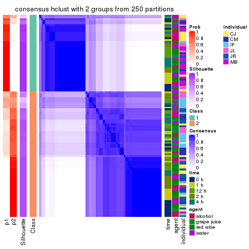</p>

</div>
<div id='tab-MAD-hclust-consensus-heatmap-2'>
<pre><code class="r">consensus_heatmap(res, k = 3)
</code></pre>

<p>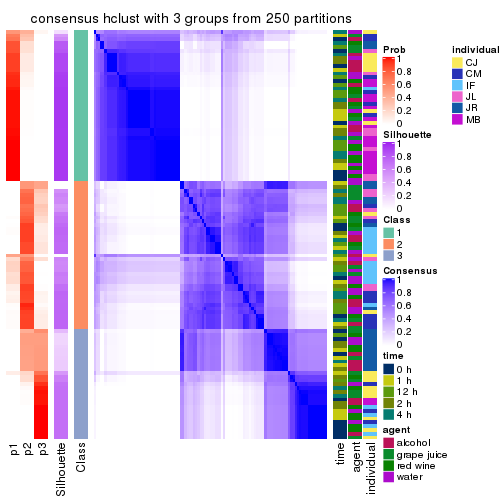</p>

</div>
<div id='tab-MAD-hclust-consensus-heatmap-3'>
<pre><code class="r">consensus_heatmap(res, k = 4)
</code></pre>

<p>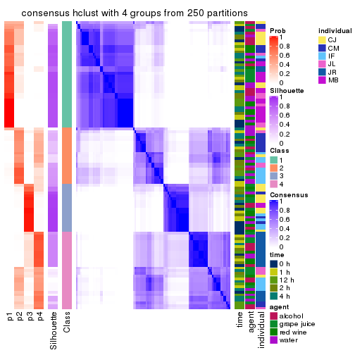</p>

</div>
<div id='tab-MAD-hclust-consensus-heatmap-4'>
<pre><code class="r">consensus_heatmap(res, k = 5)
</code></pre>

<p>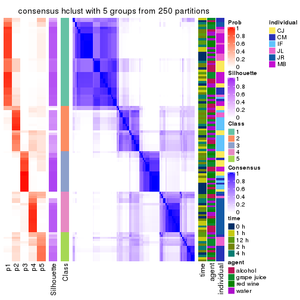</p>

</div>
<div id='tab-MAD-hclust-consensus-heatmap-5'>
<pre><code class="r">consensus_heatmap(res, k = 6)
</code></pre>

<p></p>

</div>
</div>

Heatmaps for the membership of samples in all partitions to see how consistent they are:


<script>
$( function() {
	$( '#tabs-MAD-hclust-membership-heatmap' ).tabs();
} );
</script>
<div id='tabs-MAD-hclust-membership-heatmap'>
<ul>
<li><a href='#tab-MAD-hclust-membership-heatmap-1'>k = 2</a></li>
<li><a href='#tab-MAD-hclust-membership-heatmap-2'>k = 3</a></li>
<li><a href='#tab-MAD-hclust-membership-heatmap-3'>k = 4</a></li>
<li><a href='#tab-MAD-hclust-membership-heatmap-4'>k = 5</a></li>
<li><a href='#tab-MAD-hclust-membership-heatmap-5'>k = 6</a></li>
</ul>
<div id='tab-MAD-hclust-membership-heatmap-1'>
<pre><code class="r">membership_heatmap(res, k = 2)
</code></pre>

<p>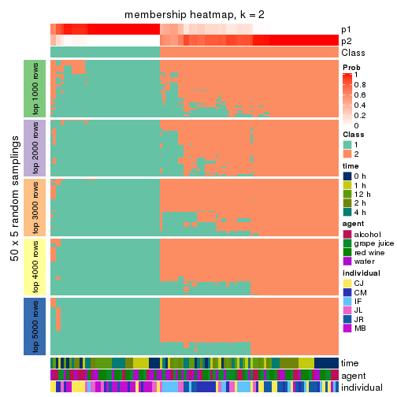</p>

</div>
<div id='tab-MAD-hclust-membership-heatmap-2'>
<pre><code class="r">membership_heatmap(res, k = 3)
</code></pre>

<p>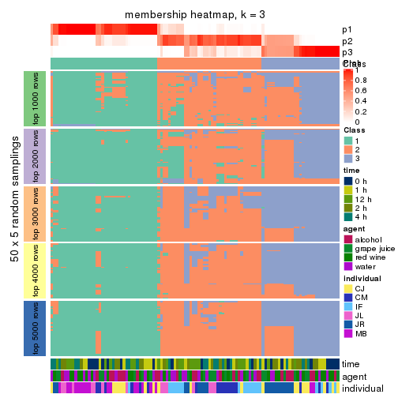</p>

</div>
<div id='tab-MAD-hclust-membership-heatmap-3'>
<pre><code class="r">membership_heatmap(res, k = 4)
</code></pre>

<p>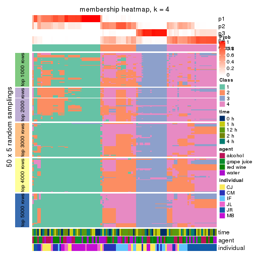</p>

</div>
<div id='tab-MAD-hclust-membership-heatmap-4'>
<pre><code class="r">membership_heatmap(res, k = 5)
</code></pre>

<p>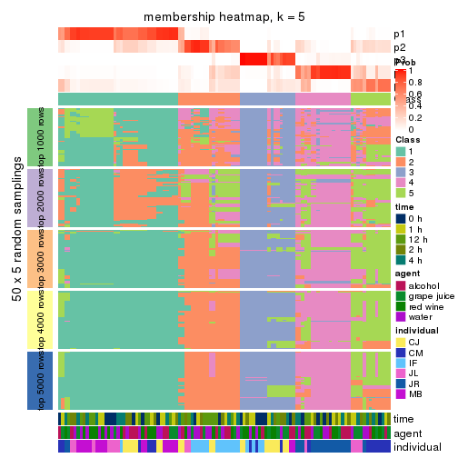</p>

</div>
<div id='tab-MAD-hclust-membership-heatmap-5'>
<pre><code class="r">membership_heatmap(res, k = 6)
</code></pre>

<p>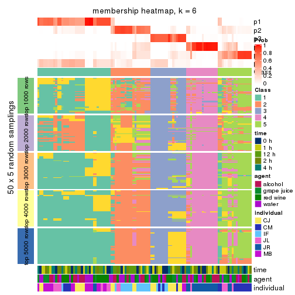</p>

</div>
</div>

As soon as we have had the classes for columns, we can look for signatures
which are significantly different between classes which can be candidate marks
for certain classes. Following are the heatmaps for signatures.


Signature heatmaps where rows are scaled:


<script>
$( function() {
	$( '#tabs-MAD-hclust-get-signatures' ).tabs();
} );
</script>
<div id='tabs-MAD-hclust-get-signatures'>
<ul>
<li><a href='#tab-MAD-hclust-get-signatures-1'>k = 2</a></li>
<li><a href='#tab-MAD-hclust-get-signatures-2'>k = 3</a></li>
<li><a href='#tab-MAD-hclust-get-signatures-3'>k = 4</a></li>
<li><a href='#tab-MAD-hclust-get-signatures-4'>k = 5</a></li>
<li><a href='#tab-MAD-hclust-get-signatures-5'>k = 6</a></li>
</ul>
<div id='tab-MAD-hclust-get-signatures-1'>
<pre><code class="r">get_signatures(res, k = 2)
</code></pre>

<p>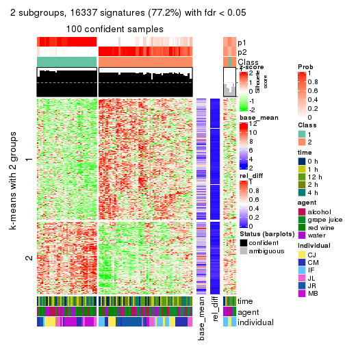</p>

</div>
<div id='tab-MAD-hclust-get-signatures-2'>
<pre><code class="r">get_signatures(res, k = 3)
</code></pre>

<p>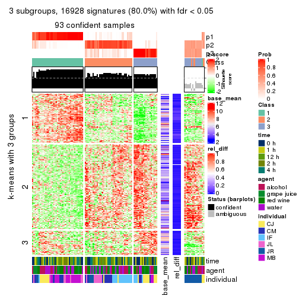</p>

</div>
<div id='tab-MAD-hclust-get-signatures-3'>
<pre><code class="r">get_signatures(res, k = 4)
</code></pre>

<p>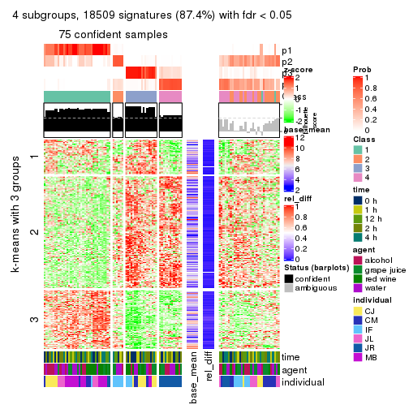</p>

</div>
<div id='tab-MAD-hclust-get-signatures-4'>
<pre><code class="r">get_signatures(res, k = 5)
</code></pre>

<p>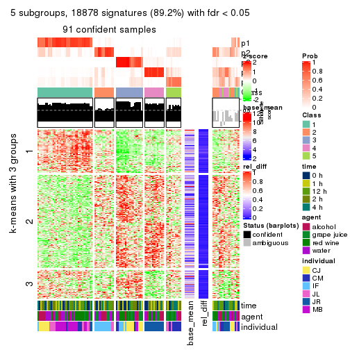</p>

</div>
<div id='tab-MAD-hclust-get-signatures-5'>
<pre><code class="r">get_signatures(res, k = 6)
</code></pre>

<p>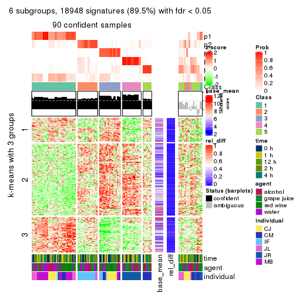</p>

</div>
</div>


Signature heatmaps where rows are not scaled:


<script>
$( function() {
	$( '#tabs-MAD-hclust-get-signatures-no-scale' ).tabs();
} );
</script>
<div id='tabs-MAD-hclust-get-signatures-no-scale'>
<ul>
<li><a href='#tab-MAD-hclust-get-signatures-no-scale-1'>k = 2</a></li>
<li><a href='#tab-MAD-hclust-get-signatures-no-scale-2'>k = 3</a></li>
<li><a href='#tab-MAD-hclust-get-signatures-no-scale-3'>k = 4</a></li>
<li><a href='#tab-MAD-hclust-get-signatures-no-scale-4'>k = 5</a></li>
<li><a href='#tab-MAD-hclust-get-signatures-no-scale-5'>k = 6</a></li>
</ul>
<div id='tab-MAD-hclust-get-signatures-no-scale-1'>
<pre><code class="r">get_signatures(res, k = 2, scale_rows = FALSE)
</code></pre>

<p>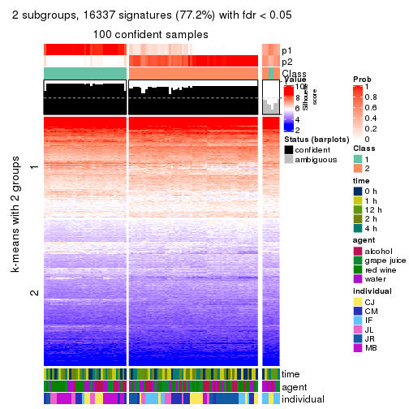</p>

</div>
<div id='tab-MAD-hclust-get-signatures-no-scale-2'>
<pre><code class="r">get_signatures(res, k = 3, scale_rows = FALSE)
</code></pre>

<p>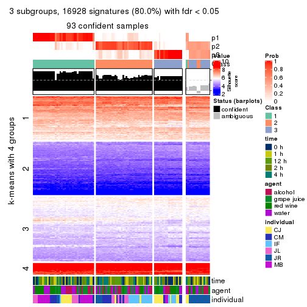</p>

</div>
<div id='tab-MAD-hclust-get-signatures-no-scale-3'>
<pre><code class="r">get_signatures(res, k = 4, scale_rows = FALSE)
</code></pre>

<p>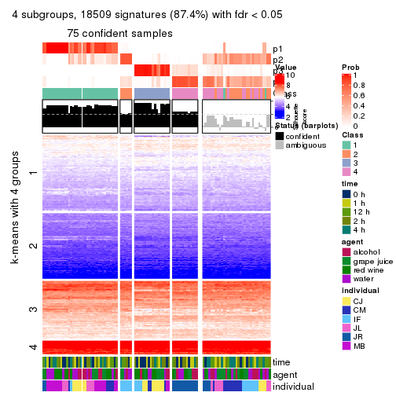</p>

</div>
<div id='tab-MAD-hclust-get-signatures-no-scale-4'>
<pre><code class="r">get_signatures(res, k = 5, scale_rows = FALSE)
</code></pre>

<p>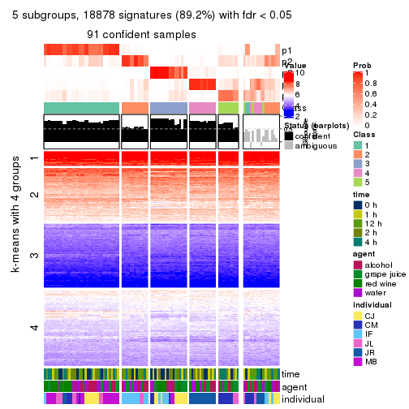</p>

</div>
<div id='tab-MAD-hclust-get-signatures-no-scale-5'>
<pre><code class="r">get_signatures(res, k = 6, scale_rows = FALSE)
</code></pre>

<p>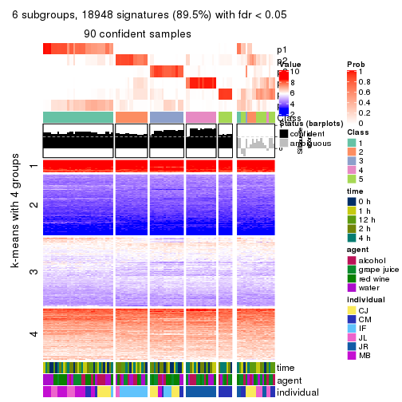</p>

</div>
</div>


Compare the overlap of signatures from different k:

```r
compare_signatures(res)
```

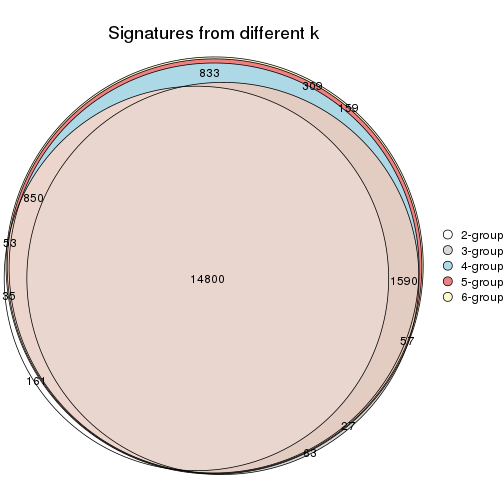

`get_signature()` returns a data frame invisibly. TO get the list of signatures, the function
call should be assigned to a variable explicitly. In following code, if `plot` argument is set
to `FALSE`, no heatmap is plotted while only the differential analysis is performed.

```r
# code only for demonstration
tb = get_signature(res, k = ..., plot = FALSE)
```

An example of the output of `tb` is:

```
#>   which_row         fdr    mean_1    mean_2 scaled_mean_1 scaled_mean_2 km
#> 1        38 0.042760348  8.373488  9.131774    -0.5533452     0.5164555  1
#> 2        40 0.018707592  7.106213  8.469186    -0.6173731     0.5762149  1
#> 3        55 0.019134737 10.221463 11.207825    -0.6159697     0.5749050  1
#> 4        59 0.006059896  5.921854  7.869574    -0.6899429     0.6439467  1
#> 5        60 0.018055526  8.928898 10.211722    -0.6204761     0.5791110  1
#> 6        98 0.009384629 15.714769 14.887706     0.6635654    -0.6193277  2
...
```

The columns in `tb` are:

1. `which_row`: row indices corresponding to the input matrix.
2. `fdr`: FDR for the differential test. 
3. `mean_x`: The mean value in group x.
4. `scaled_mean_x`: The mean value in group x after rows are scaled.
5. `km`: Row groups if k-means clustering is applied to rows.


UMAP plot which shows how samples are separated.


<script>
$( function() {
	$( '#tabs-MAD-hclust-dimension-reduction' ).tabs();
} );
</script>
<div id='tabs-MAD-hclust-dimension-reduction'>
<ul>
<li><a href='#tab-MAD-hclust-dimension-reduction-1'>k = 2</a></li>
<li><a href='#tab-MAD-hclust-dimension-reduction-2'>k = 3</a></li>
<li><a href='#tab-MAD-hclust-dimension-reduction-3'>k = 4</a></li>
<li><a href='#tab-MAD-hclust-dimension-reduction-4'>k = 5</a></li>
<li><a href='#tab-MAD-hclust-dimension-reduction-5'>k = 6</a></li>
</ul>
<div id='tab-MAD-hclust-dimension-reduction-1'>
<pre><code class="r">dimension_reduction(res, k = 2, method = &quot;UMAP&quot;)
</code></pre>

<p>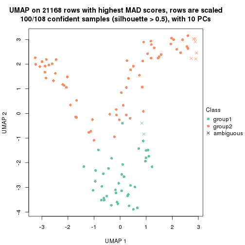</p>

</div>
<div id='tab-MAD-hclust-dimension-reduction-2'>
<pre><code class="r">dimension_reduction(res, k = 3, method = &quot;UMAP&quot;)
</code></pre>

<p>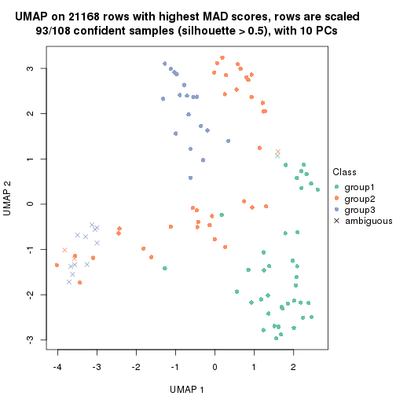</p>

</div>
<div id='tab-MAD-hclust-dimension-reduction-3'>
<pre><code class="r">dimension_reduction(res, k = 4, method = &quot;UMAP&quot;)
</code></pre>

<p>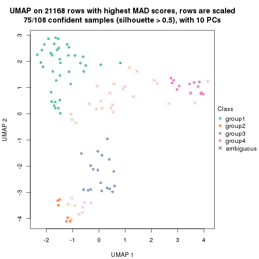</p>

</div>
<div id='tab-MAD-hclust-dimension-reduction-4'>
<pre><code class="r">dimension_reduction(res, k = 5, method = &quot;UMAP&quot;)
</code></pre>

<p>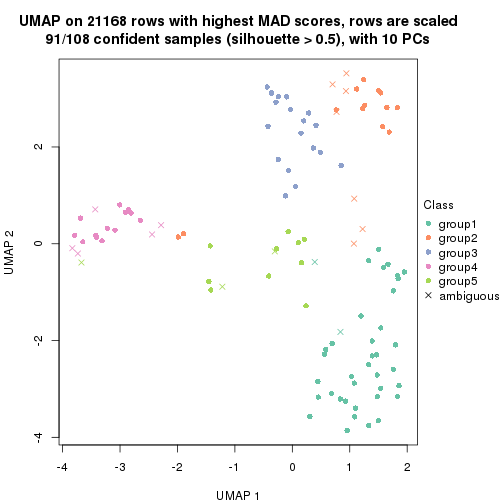</p>

</div>
<div id='tab-MAD-hclust-dimension-reduction-5'>
<pre><code class="r">dimension_reduction(res, k = 6, method = &quot;UMAP&quot;)
</code></pre>

<p>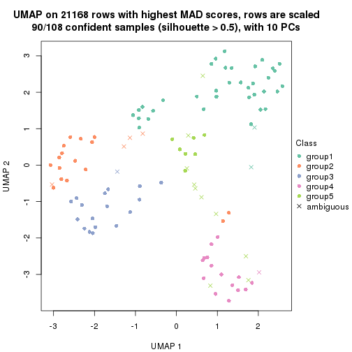</p>

</div>
</div>


Following heatmap shows how subgroups are split when increasing `k`:

```r
collect_classes(res)
```

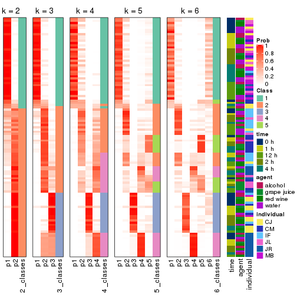


Test correlation between subgroups and known annotations. If the known
annotation is numeric, one-way ANOVA test is applied, and if the known
annotation is discrete, chi-squared contingency table test is applied.

```r
test_to_known_factors(res)
```

```
#>              n time(p) agent(p) individual(p) k
#> MAD:hclust 100   0.978    0.702      7.07e-06 2
#> MAD:hclust  93   0.357    0.541      5.36e-07 3
#> MAD:hclust  75   0.813    0.669      3.73e-18 4
#> MAD:hclust  91   0.587    0.538      2.25e-26 5
#> MAD:hclust  90   0.753    0.889      1.62e-31 6
```


If matrix rows can be associated to genes, consider to use `GO_Enrichment(res,
...)` to perform function enrichment for the signature genes.


 

---------------------------------------------------


### MAD:kmeans**


The object with results only for a single top-value method and a single partition method 
can be extracted as:

```r
res = res_list["MAD", "kmeans"]
# you can also extract it by
# res = res_list["MAD:kmeans"]
```

A summary of `res` and all the functions that can be applied to it:

```r
res
```

```
#> A 'ConsensusPartition' object with k = 2, 3, 4, 5, 6.
#>   On a matrix with 21168 rows and 108 columns.
#>   Top rows (1000, 2000, 3000, 4000, 5000) are extracted by 'MAD' method.
#>   Subgroups are detected by 'kmeans' method.
#>   Performed in total 1250 partitions by row resampling.
#>   Best k for subgroups seems to be 2.
#> 
#> Following methods can be applied to this 'ConsensusPartition' object:
#>  [1] "cola_report"             "collect_classes"         "collect_plots"          
#>  [4] "collect_stats"           "colnames"                "compare_signatures"     
#>  [7] "consensus_heatmap"       "dimension_reduction"     "functional_enrichment"  
#> [10] "get_anno_col"            "get_anno"                "get_classes"            
#> [13] "get_consensus"           "get_matrix"              "get_membership"         
#> [16] "get_param"               "get_signatures"          "get_stats"              
#> [19] "is_best_k"               "is_stable_k"             "membership_heatmap"     
#> [22] "ncol"                    "nrow"                    "plot_ecdf"              
#> [25] "rownames"                "select_partition_number" "show"                   
#> [28] "suggest_best_k"          "test_to_known_factors"
```

`collect_plots()` function collects all the plots made from `res` for all `k` (number of partitions)
into one single page to provide an easy and fast comparison between different `k`.

```r
collect_plots(res)
```

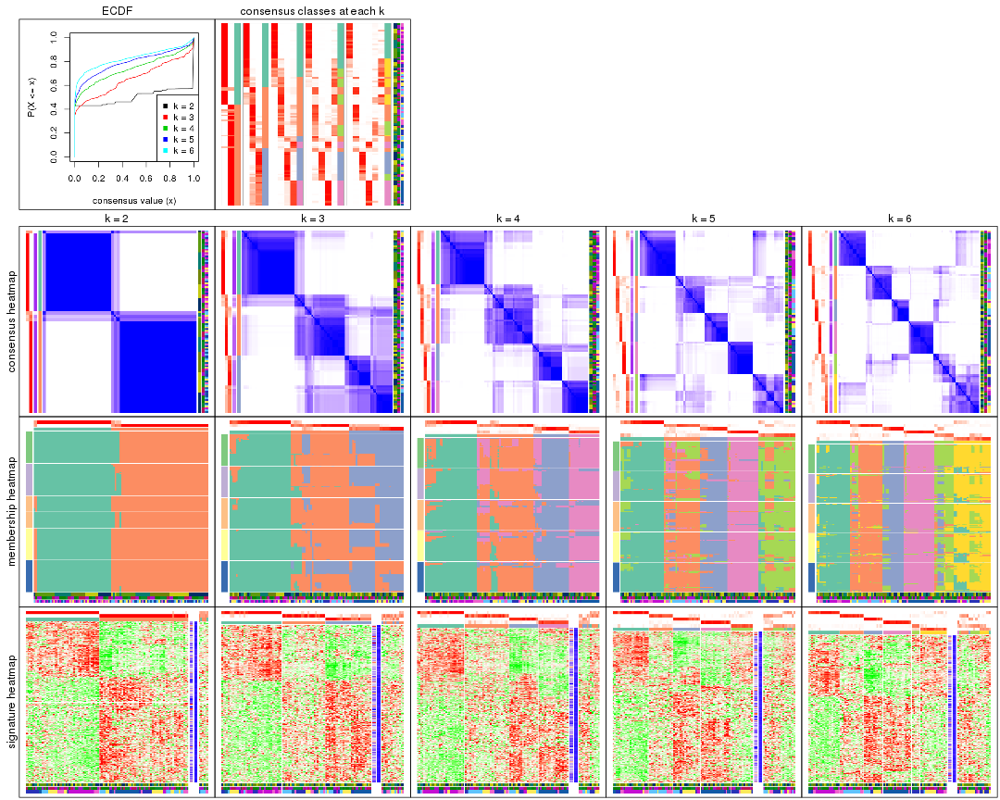

The plots are:

- The first row: a plot of the ECDF (Empirical cumulative distribution
  function) curves of the consensus matrix for each `k` and the heatmap of
  predicted classes for each `k`.
- The second row: heatmaps of the consensus matrix for each `k`.
- The third row: heatmaps of the membership matrix for each `k`.
- The fouth row: heatmaps of the signatures for each `k`.

All the plots in panels can be made by individual functions and they are
plotted later in this section.

`select_partition_number()` produces several plots showing different
statistics for choosing "optimized" `k`. There are following statistics:

- ECDF curves of the consensus matrix for each `k`;
- 1-PAC. [The PAC
  score](https://en.wikipedia.org/wiki/Consensus_clustering#Over-interpretation_potential_of_consensus_clustering)
  measures the proportion of the ambiguous subgrouping.
- Mean silhouette score.
- Concordance. The mean probability of fiting the consensus class ids in all
  partitions.
- Area increased. Denote $A_k$ as the area under the ECDF curve for current
  `k`, the area increased is defined as $A_k - A_{k-1}$.
- Rand index. The percent of pairs of samples that are both in a same cluster
  or both are not in a same cluster in the partition of k and k-1.
- Jaccard index. The ratio of pairs of samples are both in a same cluster in
  the partition of k and k-1 and the pairs of samples are both in a same
  cluster in the partition k or k-1.

The detailed explanations of these statistics can be found in [the cola
vignette](http://bioconductor.org/packages/devel/bioc/vignettes/cola/inst/doc/cola.html#toc_13).

Generally speaking, lower PAC score, higher mean silhouette score or higher
concordance corresponds to better partition. Rand index and Jaccard index
measure how similar the current partition is compared to partition with `k-1`.
If they are too similar, we won't accept `k` is better than `k-1`.

```r
select_partition_number(res)
```

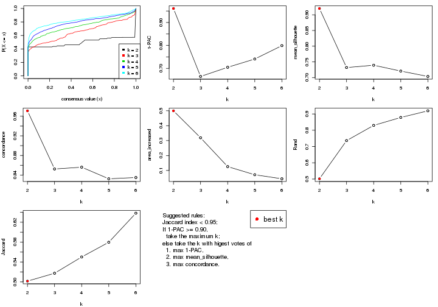

The numeric values for all these statistics can be obtained by `get_stats()`.

```r
get_stats(res)
```

```
#>   k 1-PAC mean_silhouette concordance area_increased  Rand Jaccard
#> 2 2 0.961           0.920       0.971         0.4994 0.502   0.502
#> 3 3 0.665           0.732       0.852         0.3190 0.736   0.517
#> 4 4 0.705           0.739       0.856         0.1259 0.830   0.550
#> 5 5 0.741           0.721       0.832         0.0713 0.879   0.580
#> 6 6 0.799           0.703       0.835         0.0443 0.919   0.638
```

`suggest_best_k()` suggests the best $k$ based on these statistics. The rules are as follows:

- All $k$ with Jaccard index larger than 0.95 are removed because the increase of
  the partition number does not provides enough extra information. If all $k$ are removed,
  the best $k$ is assigned by `NA`.
- For $k$ with 1-PAC larger than 0.9, the maximal $k$ is taken as the "best k". Other $k$ is called "optional k".
- If it does not fit the second rule. The $k$ with the highest vote of highest
  1-PAC, mean silhouette and concordance is taken as the "best k".

```r
suggest_best_k(res)
```

```
#> [1] 2
```


Following shows the table of the partitions (You need to click the **show/hide
code output** link to see it). The membership matrix (columns with name `p*`)
is inferred by
[`clue::cl_consensus()`](https://www.rdocumentation.org/link/cl_consensus?package=clue)
function with the `SE` method. Basically the value in the membership matrix
represents the probability to belong to a certain group. The finall class
label for an item is determined with the group with highest probability it
belongs to.

In `get_classes()` function, the entropy is calculated from the membership
matrix and the silhouette score is calculated from the consensus matrix.


<script>
$( function() {
	$( '#tabs-MAD-kmeans-get-classes' ).tabs();
} );
</script>
<div id='tabs-MAD-kmeans-get-classes'>
<ul>
<li><a href='#tab-MAD-kmeans-get-classes-1'>k = 2</a></li>
<li><a href='#tab-MAD-kmeans-get-classes-2'>k = 3</a></li>
<li><a href='#tab-MAD-kmeans-get-classes-3'>k = 4</a></li>
<li><a href='#tab-MAD-kmeans-get-classes-4'>k = 5</a></li>
<li><a href='#tab-MAD-kmeans-get-classes-5'>k = 6</a></li>
</ul>

<div id='tab-MAD-kmeans-get-classes-1'>
<p><a id='tab-MAD-kmeans-get-classes-1-a' style='color:#0366d6' href='#'>show/hide code output</a></p>
<pre><code class="r">cbind(get_classes(res, k = 2), get_membership(res, k = 2))
</code></pre>

<pre><code>#&gt;          class entropy silhouette    p1    p2
#&gt; GSM87863     1   0.000     0.9778 1.000 0.000
#&gt; GSM87887     1   0.000     0.9778 1.000 0.000
#&gt; GSM87896     2   0.000     0.9620 0.000 1.000
#&gt; GSM87934     2   0.000     0.9620 0.000 1.000
#&gt; GSM87943     2   0.000     0.9620 0.000 1.000
#&gt; GSM87853     2   0.000     0.9620 0.000 1.000
#&gt; GSM87906     2   0.000     0.9620 0.000 1.000
#&gt; GSM87920     1   0.000     0.9778 1.000 0.000
#&gt; GSM87924     2   0.000     0.9620 0.000 1.000
#&gt; GSM87858     2   0.000     0.9620 0.000 1.000
#&gt; GSM87882     2   0.000     0.9620 0.000 1.000
#&gt; GSM87891     2   0.000     0.9620 0.000 1.000
#&gt; GSM87917     1   0.000     0.9778 1.000 0.000
#&gt; GSM87929     2   0.000     0.9620 0.000 1.000
#&gt; GSM87948     1   0.000     0.9778 1.000 0.000
#&gt; GSM87868     1   0.000     0.9778 1.000 0.000
#&gt; GSM87873     2   0.000     0.9620 0.000 1.000
#&gt; GSM87901     1   0.998     0.0256 0.524 0.476
#&gt; GSM87910     1   0.000     0.9778 1.000 0.000
#&gt; GSM87938     2   0.000     0.9620 0.000 1.000
#&gt; GSM87953     1   0.000     0.9778 1.000 0.000
#&gt; GSM87864     1   0.000     0.9778 1.000 0.000
#&gt; GSM87888     2   0.000     0.9620 0.000 1.000
#&gt; GSM87897     2   0.000     0.9620 0.000 1.000
#&gt; GSM87935     2   0.000     0.9620 0.000 1.000
#&gt; GSM87944     1   0.000     0.9778 1.000 0.000
#&gt; GSM87854     2   0.000     0.9620 0.000 1.000
#&gt; GSM87878     1   0.000     0.9778 1.000 0.000
#&gt; GSM87907     2   0.000     0.9620 0.000 1.000
#&gt; GSM87921     2   0.000     0.9620 0.000 1.000
#&gt; GSM87925     2   0.000     0.9620 0.000 1.000
#&gt; GSM87957     1   0.000     0.9778 1.000 0.000
#&gt; GSM87859     2   0.000     0.9620 0.000 1.000
#&gt; GSM87883     1   0.000     0.9778 1.000 0.000
#&gt; GSM87892     2   0.000     0.9620 0.000 1.000
#&gt; GSM87930     2   0.000     0.9620 0.000 1.000
#&gt; GSM87949     1   0.000     0.9778 1.000 0.000
#&gt; GSM87869     1   0.000     0.9778 1.000 0.000
#&gt; GSM87874     2   0.000     0.9620 0.000 1.000
#&gt; GSM87902     2   1.000     0.0628 0.492 0.508
#&gt; GSM87911     2   0.775     0.6968 0.228 0.772
#&gt; GSM87939     2   0.000     0.9620 0.000 1.000
#&gt; GSM87954     1   0.000     0.9778 1.000 0.000
#&gt; GSM87865     1   0.000     0.9778 1.000 0.000
#&gt; GSM87889     1   0.000     0.9778 1.000 0.000
#&gt; GSM87898     1   0.000     0.9778 1.000 0.000
#&gt; GSM87915     1   0.000     0.9778 1.000 0.000
#&gt; GSM87936     2   0.000     0.9620 0.000 1.000
#&gt; GSM87945     2   0.000     0.9620 0.000 1.000
#&gt; GSM87855     2   0.000     0.9620 0.000 1.000
#&gt; GSM87879     2   0.000     0.9620 0.000 1.000
#&gt; GSM87922     2   0.000     0.9620 0.000 1.000
#&gt; GSM87926     2   0.000     0.9620 0.000 1.000
#&gt; GSM87958     1   0.000     0.9778 1.000 0.000
#&gt; GSM87860     2   0.000     0.9620 0.000 1.000
#&gt; GSM87884     1   0.000     0.9778 1.000 0.000
#&gt; GSM87893     2   0.000     0.9620 0.000 1.000
#&gt; GSM87918     1   1.000    -0.0677 0.500 0.500
#&gt; GSM87931     2   0.000     0.9620 0.000 1.000
#&gt; GSM87950     1   0.000     0.9778 1.000 0.000
#&gt; GSM87870     1   0.000     0.9778 1.000 0.000
#&gt; GSM87875     2   0.000     0.9620 0.000 1.000
#&gt; GSM87903     2   0.000     0.9620 0.000 1.000
#&gt; GSM87912     1   0.000     0.9778 1.000 0.000
#&gt; GSM87940     2   0.000     0.9620 0.000 1.000
#&gt; GSM87866     1   0.000     0.9778 1.000 0.000
#&gt; GSM87899     2   0.000     0.9620 0.000 1.000
#&gt; GSM87937     2   0.000     0.9620 0.000 1.000
#&gt; GSM87946     1   0.000     0.9778 1.000 0.000
#&gt; GSM87856     2   0.000     0.9620 0.000 1.000
#&gt; GSM87880     2   0.000     0.9620 0.000 1.000
#&gt; GSM87908     2   0.999     0.1069 0.480 0.520
#&gt; GSM87923     2   0.000     0.9620 0.000 1.000
#&gt; GSM87927     2   0.000     0.9620 0.000 1.000
#&gt; GSM87959     1   0.000     0.9778 1.000 0.000
#&gt; GSM87861     2   0.000     0.9620 0.000 1.000
#&gt; GSM87885     1   0.000     0.9778 1.000 0.000
#&gt; GSM87894     1   0.000     0.9778 1.000 0.000
#&gt; GSM87932     1   0.000     0.9778 1.000 0.000
#&gt; GSM87951     1   0.000     0.9778 1.000 0.000
#&gt; GSM87871     2   0.844     0.6276 0.272 0.728
#&gt; GSM87876     1   0.000     0.9778 1.000 0.000
#&gt; GSM87904     2   0.000     0.9620 0.000 1.000
#&gt; GSM87913     1   0.000     0.9778 1.000 0.000
#&gt; GSM87941     2   0.000     0.9620 0.000 1.000
#&gt; GSM87955     1   0.000     0.9778 1.000 0.000
#&gt; GSM87867     1   0.000     0.9778 1.000 0.000
#&gt; GSM87890     2   0.000     0.9620 0.000 1.000
#&gt; GSM87900     2   0.000     0.9620 0.000 1.000
#&gt; GSM87916     2   0.000     0.9620 0.000 1.000
#&gt; GSM87947     1   0.000     0.9778 1.000 0.000
#&gt; GSM87857     2   0.000     0.9620 0.000 1.000
#&gt; GSM87881     2   0.000     0.9620 0.000 1.000
#&gt; GSM87909     1   0.000     0.9778 1.000 0.000
#&gt; GSM87928     1   0.000     0.9778 1.000 0.000
#&gt; GSM87960     1   0.000     0.9778 1.000 0.000
#&gt; GSM87862     2   0.000     0.9620 0.000 1.000
#&gt; GSM87886     1   0.000     0.9778 1.000 0.000
#&gt; GSM87895     2   0.000     0.9620 0.000 1.000
#&gt; GSM87919     1   0.000     0.9778 1.000 0.000
#&gt; GSM87933     2   0.000     0.9620 0.000 1.000
#&gt; GSM87952     1   0.000     0.9778 1.000 0.000
#&gt; GSM87872     2   0.000     0.9620 0.000 1.000
#&gt; GSM87877     1   0.000     0.9778 1.000 0.000
#&gt; GSM87905     1   0.000     0.9778 1.000 0.000
#&gt; GSM87914     2   0.925     0.4960 0.340 0.660
#&gt; GSM87942     2   0.925     0.4960 0.340 0.660
#&gt; GSM87956     1   0.000     0.9778 1.000 0.000
</code></pre>

<script>
$('#tab-MAD-kmeans-get-classes-1-a').parent().next().next().hide();
$('#tab-MAD-kmeans-get-classes-1-a').click(function(){
  $('#tab-MAD-kmeans-get-classes-1-a').parent().next().next().toggle();
  return(false);
});
</script>
</div>

<div id='tab-MAD-kmeans-get-classes-2'>
<p><a id='tab-MAD-kmeans-get-classes-2-a' style='color:#0366d6' href='#'>show/hide code output</a></p>
<pre><code class="r">cbind(get_classes(res, k = 3), get_membership(res, k = 3))
</code></pre>

<pre><code>#&gt;          class entropy silhouette    p1    p2    p3
#&gt; GSM87863     2  0.5733     0.4856 0.324 0.676 0.000
#&gt; GSM87887     1  0.2165     0.9202 0.936 0.064 0.000
#&gt; GSM87896     3  0.0424     0.7173 0.000 0.008 0.992
#&gt; GSM87934     3  0.5926     0.6349 0.000 0.356 0.644
#&gt; GSM87943     3  0.5905     0.3500 0.000 0.352 0.648
#&gt; GSM87853     3  0.2448     0.7008 0.000 0.076 0.924
#&gt; GSM87906     2  0.0000     0.7915 0.000 1.000 0.000
#&gt; GSM87920     2  0.6062     0.3543 0.384 0.616 0.000
#&gt; GSM87924     3  0.1529     0.7183 0.000 0.040 0.960
#&gt; GSM87858     3  0.0424     0.7173 0.000 0.008 0.992
#&gt; GSM87882     2  0.0892     0.7855 0.000 0.980 0.020
#&gt; GSM87891     3  0.0424     0.7173 0.000 0.008 0.992
#&gt; GSM87917     1  0.0000     0.9598 1.000 0.000 0.000
#&gt; GSM87929     2  0.5178     0.4457 0.000 0.744 0.256
#&gt; GSM87948     1  0.0892     0.9504 0.980 0.020 0.000
#&gt; GSM87868     1  0.0000     0.9598 1.000 0.000 0.000
#&gt; GSM87873     3  0.0424     0.7173 0.000 0.008 0.992
#&gt; GSM87901     2  0.0237     0.7922 0.004 0.996 0.000
#&gt; GSM87910     1  0.0000     0.9598 1.000 0.000 0.000
#&gt; GSM87938     3  0.5926     0.6349 0.000 0.356 0.644
#&gt; GSM87953     1  0.0000     0.9598 1.000 0.000 0.000
#&gt; GSM87864     1  0.5291     0.6587 0.732 0.268 0.000
#&gt; GSM87888     2  0.0424     0.7904 0.000 0.992 0.008
#&gt; GSM87897     2  0.0237     0.7897 0.000 0.996 0.004
#&gt; GSM87935     3  0.5926     0.6349 0.000 0.356 0.644
#&gt; GSM87944     1  0.0000     0.9598 1.000 0.000 0.000
#&gt; GSM87854     2  0.4452     0.6200 0.000 0.808 0.192
#&gt; GSM87878     1  0.2356     0.9136 0.928 0.072 0.000
#&gt; GSM87907     3  0.5560     0.6619 0.000 0.300 0.700
#&gt; GSM87921     2  0.0000     0.7915 0.000 1.000 0.000
#&gt; GSM87925     3  0.5926     0.6349 0.000 0.356 0.644
#&gt; GSM87957     1  0.1529     0.9388 0.960 0.040 0.000
#&gt; GSM87859     3  0.0424     0.7173 0.000 0.008 0.992
#&gt; GSM87883     1  0.0000     0.9598 1.000 0.000 0.000
#&gt; GSM87892     3  0.0424     0.7173 0.000 0.008 0.992
#&gt; GSM87930     3  0.5465     0.6683 0.000 0.288 0.712
#&gt; GSM87949     1  0.0000     0.9598 1.000 0.000 0.000
#&gt; GSM87869     1  0.0000     0.9598 1.000 0.000 0.000
#&gt; GSM87874     3  0.0424     0.7173 0.000 0.008 0.992
#&gt; GSM87902     2  0.0237     0.7922 0.004 0.996 0.000
#&gt; GSM87911     2  0.0000     0.7915 0.000 1.000 0.000
#&gt; GSM87939     3  0.5948     0.6302 0.000 0.360 0.640
#&gt; GSM87954     1  0.0000     0.9598 1.000 0.000 0.000
#&gt; GSM87865     1  0.5291     0.6587 0.732 0.268 0.000
#&gt; GSM87889     2  0.5254     0.5902 0.264 0.736 0.000
#&gt; GSM87898     1  0.4796     0.7341 0.780 0.220 0.000
#&gt; GSM87915     1  0.0000     0.9598 1.000 0.000 0.000
#&gt; GSM87936     3  0.5926     0.6349 0.000 0.356 0.644
#&gt; GSM87945     3  0.2711     0.6970 0.000 0.088 0.912
#&gt; GSM87855     3  0.3412     0.6748 0.000 0.124 0.876
#&gt; GSM87879     2  0.0892     0.7855 0.000 0.980 0.020
#&gt; GSM87922     2  0.5706     0.1679 0.000 0.680 0.320
#&gt; GSM87926     3  0.6235     0.4932 0.000 0.436 0.564
#&gt; GSM87958     1  0.0000     0.9598 1.000 0.000 0.000
#&gt; GSM87860     3  0.2711     0.6970 0.000 0.088 0.912
#&gt; GSM87884     1  0.0000     0.9598 1.000 0.000 0.000
#&gt; GSM87893     3  0.0424     0.7173 0.000 0.008 0.992
#&gt; GSM87918     2  0.0237     0.7922 0.004 0.996 0.000
#&gt; GSM87931     3  0.5948     0.6302 0.000 0.360 0.640
#&gt; GSM87950     1  0.0000     0.9598 1.000 0.000 0.000
#&gt; GSM87870     1  0.4399     0.7825 0.812 0.188 0.000
#&gt; GSM87875     3  0.3412     0.6748 0.000 0.124 0.876
#&gt; GSM87903     2  0.0237     0.7897 0.000 0.996 0.004
#&gt; GSM87912     1  0.0000     0.9598 1.000 0.000 0.000
#&gt; GSM87940     3  0.5926     0.6349 0.000 0.356 0.644
#&gt; GSM87866     1  0.1411     0.9413 0.964 0.036 0.000
#&gt; GSM87899     2  0.5810     0.3182 0.000 0.664 0.336
#&gt; GSM87937     3  0.5926     0.6349 0.000 0.356 0.644
#&gt; GSM87946     1  0.0000     0.9598 1.000 0.000 0.000
#&gt; GSM87856     3  0.5905     0.3500 0.000 0.352 0.648
#&gt; GSM87880     2  0.0424     0.7904 0.000 0.992 0.008
#&gt; GSM87908     2  0.0237     0.7922 0.004 0.996 0.000
#&gt; GSM87923     2  0.5529     0.2652 0.000 0.704 0.296
#&gt; GSM87927     2  0.2066     0.7546 0.000 0.940 0.060
#&gt; GSM87959     1  0.0000     0.9598 1.000 0.000 0.000
#&gt; GSM87861     3  0.2711     0.6970 0.000 0.088 0.912
#&gt; GSM87885     2  0.4555     0.6486 0.200 0.800 0.000
#&gt; GSM87894     1  0.0237     0.9581 0.996 0.004 0.000
#&gt; GSM87932     1  0.0000     0.9598 1.000 0.000 0.000
#&gt; GSM87951     1  0.0000     0.9598 1.000 0.000 0.000
#&gt; GSM87871     2  0.1163     0.7820 0.028 0.972 0.000
#&gt; GSM87876     2  0.4702     0.6383 0.212 0.788 0.000
#&gt; GSM87904     2  0.6295    -0.1488 0.000 0.528 0.472
#&gt; GSM87913     1  0.1289     0.9437 0.968 0.032 0.000
#&gt; GSM87941     2  0.2448     0.7402 0.000 0.924 0.076
#&gt; GSM87955     1  0.0000     0.9598 1.000 0.000 0.000
#&gt; GSM87867     2  0.5254     0.5902 0.264 0.736 0.000
#&gt; GSM87890     3  0.5926     0.6331 0.000 0.356 0.644
#&gt; GSM87900     2  0.2356     0.7443 0.000 0.928 0.072
#&gt; GSM87916     3  0.6305     0.3810 0.000 0.484 0.516
#&gt; GSM87947     1  0.1529     0.9388 0.960 0.040 0.000
#&gt; GSM87857     3  0.5905     0.3500 0.000 0.352 0.648
#&gt; GSM87881     2  0.0000     0.7915 0.000 1.000 0.000
#&gt; GSM87909     2  0.0592     0.7899 0.012 0.988 0.000
#&gt; GSM87928     1  0.0000     0.9598 1.000 0.000 0.000
#&gt; GSM87960     1  0.0000     0.9598 1.000 0.000 0.000
#&gt; GSM87862     2  0.6045    -0.0438 0.000 0.620 0.380
#&gt; GSM87886     1  0.0000     0.9598 1.000 0.000 0.000
#&gt; GSM87895     3  0.5178     0.6814 0.000 0.256 0.744
#&gt; GSM87919     1  0.0000     0.9598 1.000 0.000 0.000
#&gt; GSM87933     3  0.5948     0.6302 0.000 0.360 0.640
#&gt; GSM87952     1  0.0000     0.9598 1.000 0.000 0.000
#&gt; GSM87872     2  0.0000     0.7915 0.000 1.000 0.000
#&gt; GSM87877     1  0.3482     0.8561 0.872 0.128 0.000
#&gt; GSM87905     2  0.6204     0.2232 0.424 0.576 0.000
#&gt; GSM87914     2  0.0424     0.7885 0.000 0.992 0.008
#&gt; GSM87942     2  0.2356     0.7429 0.000 0.928 0.072
#&gt; GSM87956     1  0.0000     0.9598 1.000 0.000 0.000
</code></pre>

<script>
$('#tab-MAD-kmeans-get-classes-2-a').parent().next().next().hide();
$('#tab-MAD-kmeans-get-classes-2-a').click(function(){
  $('#tab-MAD-kmeans-get-classes-2-a').parent().next().next().toggle();
  return(false);
});
</script>
</div>

<div id='tab-MAD-kmeans-get-classes-3'>
<p><a id='tab-MAD-kmeans-get-classes-3-a' style='color:#0366d6' href='#'>show/hide code output</a></p>
<pre><code class="r">cbind(get_classes(res, k = 4), get_membership(res, k = 4))
</code></pre>

<pre><code>#&gt;          class entropy silhouette    p1    p2    p3    p4
#&gt; GSM87863     2  0.1284     0.7572 0.012 0.964 0.000 0.024
#&gt; GSM87887     1  0.5859     0.2772 0.496 0.472 0.000 0.032
#&gt; GSM87896     3  0.1474     0.8272 0.000 0.000 0.948 0.052
#&gt; GSM87934     4  0.2589     0.9367 0.000 0.000 0.116 0.884
#&gt; GSM87943     3  0.2563     0.7782 0.000 0.072 0.908 0.020
#&gt; GSM87853     3  0.0188     0.8315 0.000 0.000 0.996 0.004
#&gt; GSM87906     2  0.5713     0.5492 0.000 0.620 0.040 0.340
#&gt; GSM87920     2  0.1297     0.7583 0.016 0.964 0.000 0.020
#&gt; GSM87924     4  0.3266     0.8705 0.000 0.000 0.168 0.832
#&gt; GSM87858     3  0.1474     0.8272 0.000 0.000 0.948 0.052
#&gt; GSM87882     2  0.3229     0.7707 0.000 0.880 0.048 0.072
#&gt; GSM87891     3  0.1474     0.8272 0.000 0.000 0.948 0.052
#&gt; GSM87917     1  0.0000     0.8993 1.000 0.000 0.000 0.000
#&gt; GSM87929     4  0.1151     0.8530 0.000 0.024 0.008 0.968
#&gt; GSM87948     1  0.5113     0.6493 0.684 0.292 0.000 0.024
#&gt; GSM87868     1  0.3080     0.8455 0.880 0.096 0.000 0.024
#&gt; GSM87873     3  0.1474     0.8272 0.000 0.000 0.948 0.052
#&gt; GSM87901     2  0.3279     0.7776 0.000 0.872 0.032 0.096
#&gt; GSM87910     1  0.0000     0.8993 1.000 0.000 0.000 0.000
#&gt; GSM87938     4  0.2589     0.9367 0.000 0.000 0.116 0.884
#&gt; GSM87953     1  0.0000     0.8993 1.000 0.000 0.000 0.000
#&gt; GSM87864     2  0.5088     0.3734 0.288 0.688 0.000 0.024
#&gt; GSM87888     2  0.3144     0.7722 0.000 0.884 0.044 0.072
#&gt; GSM87897     2  0.5778     0.5239 0.000 0.604 0.040 0.356
#&gt; GSM87935     4  0.2589     0.9367 0.000 0.000 0.116 0.884
#&gt; GSM87944     1  0.3143     0.8427 0.876 0.100 0.000 0.024
#&gt; GSM87854     2  0.2174     0.7749 0.000 0.928 0.052 0.020
#&gt; GSM87878     2  0.5411     0.3153 0.312 0.656 0.000 0.032
#&gt; GSM87907     3  0.5793     0.2898 0.000 0.040 0.600 0.360
#&gt; GSM87921     2  0.5417     0.6258 0.000 0.676 0.040 0.284
#&gt; GSM87925     4  0.2589     0.9367 0.000 0.000 0.116 0.884
#&gt; GSM87957     1  0.5137     0.6436 0.680 0.296 0.000 0.024
#&gt; GSM87859     3  0.1474     0.8272 0.000 0.000 0.948 0.052
#&gt; GSM87883     1  0.2282     0.8718 0.924 0.052 0.000 0.024
#&gt; GSM87892     3  0.1474     0.8272 0.000 0.000 0.948 0.052
#&gt; GSM87930     4  0.2589     0.9367 0.000 0.000 0.116 0.884
#&gt; GSM87949     1  0.0000     0.8993 1.000 0.000 0.000 0.000
#&gt; GSM87869     1  0.0817     0.8937 0.976 0.000 0.000 0.024
#&gt; GSM87874     3  0.1474     0.8272 0.000 0.000 0.948 0.052
#&gt; GSM87902     2  0.3308     0.7769 0.000 0.872 0.036 0.092
#&gt; GSM87911     2  0.3399     0.7761 0.000 0.868 0.040 0.092
#&gt; GSM87939     4  0.2654     0.9342 0.000 0.004 0.108 0.888
#&gt; GSM87954     1  0.0000     0.8993 1.000 0.000 0.000 0.000
#&gt; GSM87865     2  0.4307     0.5665 0.192 0.784 0.000 0.024
#&gt; GSM87889     2  0.0804     0.7673 0.000 0.980 0.012 0.008
#&gt; GSM87898     2  0.5716     0.5731 0.212 0.700 0.000 0.088
#&gt; GSM87915     1  0.0188     0.8989 0.996 0.004 0.000 0.000
#&gt; GSM87936     4  0.2589     0.9367 0.000 0.000 0.116 0.884
#&gt; GSM87945     3  0.0000     0.8312 0.000 0.000 1.000 0.000
#&gt; GSM87855     3  0.0000     0.8312 0.000 0.000 1.000 0.000
#&gt; GSM87879     2  0.3144     0.7722 0.000 0.884 0.044 0.072
#&gt; GSM87922     2  0.7253     0.0707 0.000 0.432 0.144 0.424
#&gt; GSM87926     4  0.2843     0.9219 0.000 0.020 0.088 0.892
#&gt; GSM87958     1  0.0000     0.8993 1.000 0.000 0.000 0.000
#&gt; GSM87860     3  0.0188     0.8303 0.000 0.004 0.996 0.000
#&gt; GSM87884     1  0.2282     0.8718 0.924 0.052 0.000 0.024
#&gt; GSM87893     3  0.1474     0.8272 0.000 0.000 0.948 0.052
#&gt; GSM87918     2  0.3243     0.7772 0.000 0.876 0.036 0.088
#&gt; GSM87931     4  0.2589     0.9367 0.000 0.000 0.116 0.884
#&gt; GSM87950     1  0.0000     0.8993 1.000 0.000 0.000 0.000
#&gt; GSM87870     2  0.5620    -0.0372 0.416 0.560 0.000 0.024
#&gt; GSM87875     3  0.0188     0.8306 0.000 0.004 0.996 0.000
#&gt; GSM87903     2  0.5762     0.5304 0.000 0.608 0.040 0.352
#&gt; GSM87912     1  0.0000     0.8993 1.000 0.000 0.000 0.000
#&gt; GSM87940     4  0.2589     0.9367 0.000 0.000 0.116 0.884
#&gt; GSM87866     1  0.5536     0.4986 0.592 0.384 0.000 0.024
#&gt; GSM87899     3  0.7902     0.0283 0.000 0.300 0.364 0.336
#&gt; GSM87937     4  0.2589     0.9367 0.000 0.000 0.116 0.884
#&gt; GSM87946     1  0.0817     0.8937 0.976 0.000 0.000 0.024
#&gt; GSM87856     3  0.2563     0.7782 0.000 0.072 0.908 0.020
#&gt; GSM87880     2  0.2111     0.7744 0.000 0.932 0.044 0.024
#&gt; GSM87908     2  0.3308     0.7769 0.000 0.872 0.036 0.092
#&gt; GSM87923     2  0.7392     0.2189 0.000 0.472 0.172 0.356
#&gt; GSM87927     4  0.2500     0.7979 0.000 0.044 0.040 0.916
#&gt; GSM87959     1  0.0000     0.8993 1.000 0.000 0.000 0.000
#&gt; GSM87861     3  0.0000     0.8312 0.000 0.000 1.000 0.000
#&gt; GSM87885     2  0.0804     0.7673 0.000 0.980 0.012 0.008
#&gt; GSM87894     1  0.5228     0.6263 0.664 0.312 0.000 0.024
#&gt; GSM87932     1  0.0524     0.8965 0.988 0.004 0.000 0.008
#&gt; GSM87951     1  0.0000     0.8993 1.000 0.000 0.000 0.000
#&gt; GSM87871     2  0.1297     0.7738 0.000 0.964 0.020 0.016
#&gt; GSM87876     2  0.0657     0.7677 0.000 0.984 0.012 0.004
#&gt; GSM87904     3  0.5732     0.5029 0.000 0.064 0.672 0.264
#&gt; GSM87913     1  0.5161     0.6366 0.676 0.300 0.000 0.024
#&gt; GSM87941     4  0.2111     0.8148 0.000 0.044 0.024 0.932
#&gt; GSM87955     1  0.0000     0.8993 1.000 0.000 0.000 0.000
#&gt; GSM87867     2  0.0469     0.7684 0.000 0.988 0.012 0.000
#&gt; GSM87890     4  0.2773     0.9337 0.000 0.004 0.116 0.880
#&gt; GSM87900     2  0.5950     0.4198 0.000 0.544 0.040 0.416
#&gt; GSM87916     4  0.2882     0.9185 0.000 0.024 0.084 0.892
#&gt; GSM87947     1  0.5206     0.6257 0.668 0.308 0.000 0.024
#&gt; GSM87857     3  0.2635     0.7762 0.000 0.076 0.904 0.020
#&gt; GSM87881     2  0.3216     0.7720 0.000 0.880 0.044 0.076
#&gt; GSM87909     2  0.3308     0.7769 0.000 0.872 0.036 0.092
#&gt; GSM87928     1  0.0524     0.8965 0.988 0.004 0.000 0.008
#&gt; GSM87960     1  0.0469     0.8972 0.988 0.000 0.000 0.012
#&gt; GSM87862     3  0.6949     0.2241 0.000 0.124 0.528 0.348
#&gt; GSM87886     1  0.0188     0.8989 0.996 0.000 0.000 0.004
#&gt; GSM87895     3  0.4941     0.1898 0.000 0.000 0.564 0.436
#&gt; GSM87919     1  0.0000     0.8993 1.000 0.000 0.000 0.000
#&gt; GSM87933     4  0.2714     0.9357 0.000 0.004 0.112 0.884
#&gt; GSM87952     1  0.0000     0.8993 1.000 0.000 0.000 0.000
#&gt; GSM87872     2  0.4332     0.7451 0.000 0.800 0.040 0.160
#&gt; GSM87877     2  0.5778    -0.2422 0.472 0.500 0.000 0.028
#&gt; GSM87905     2  0.2940     0.7764 0.012 0.892 0.008 0.088
#&gt; GSM87914     2  0.5200     0.6493 0.000 0.700 0.036 0.264
#&gt; GSM87942     4  0.3479     0.6920 0.000 0.148 0.012 0.840
#&gt; GSM87956     1  0.0000     0.8993 1.000 0.000 0.000 0.000
</code></pre>

<script>
$('#tab-MAD-kmeans-get-classes-3-a').parent().next().next().hide();
$('#tab-MAD-kmeans-get-classes-3-a').click(function(){
  $('#tab-MAD-kmeans-get-classes-3-a').parent().next().next().toggle();
  return(false);
});
</script>
</div>

<div id='tab-MAD-kmeans-get-classes-4'>
<p><a id='tab-MAD-kmeans-get-classes-4-a' style='color:#0366d6' href='#'>show/hide code output</a></p>
<pre><code class="r">cbind(get_classes(res, k = 5), get_membership(res, k = 5))
</code></pre>

<pre><code>#&gt;          class entropy silhouette    p1    p2    p3    p4    p5
#&gt; GSM87863     5  0.2124     0.6358 0.000 0.096 0.000 0.004 0.900
#&gt; GSM87887     5  0.2911     0.6498 0.136 0.004 0.008 0.000 0.852
#&gt; GSM87896     3  0.1331     0.8989 0.000 0.008 0.952 0.040 0.000
#&gt; GSM87934     4  0.0162     0.9666 0.000 0.000 0.004 0.996 0.000
#&gt; GSM87943     3  0.5180     0.7342 0.000 0.188 0.696 0.004 0.112
#&gt; GSM87853     3  0.1483     0.8985 0.000 0.008 0.952 0.028 0.012
#&gt; GSM87906     2  0.2588     0.7222 0.000 0.892 0.000 0.060 0.048
#&gt; GSM87920     5  0.2848     0.6119 0.000 0.156 0.000 0.004 0.840
#&gt; GSM87924     4  0.0290     0.9631 0.000 0.000 0.008 0.992 0.000
#&gt; GSM87858     3  0.1043     0.9003 0.000 0.000 0.960 0.040 0.000
#&gt; GSM87882     5  0.5114     0.3250 0.000 0.404 0.032 0.004 0.560
#&gt; GSM87891     3  0.1331     0.8989 0.000 0.008 0.952 0.040 0.000
#&gt; GSM87917     1  0.0162     0.8846 0.996 0.004 0.000 0.000 0.000
#&gt; GSM87929     4  0.1124     0.9406 0.000 0.036 0.004 0.960 0.000
#&gt; GSM87948     1  0.4803     0.1230 0.496 0.012 0.000 0.004 0.488
#&gt; GSM87868     1  0.4620     0.4468 0.612 0.012 0.000 0.004 0.372
#&gt; GSM87873     3  0.1043     0.9003 0.000 0.000 0.960 0.040 0.000
#&gt; GSM87901     2  0.3231     0.6827 0.000 0.800 0.000 0.004 0.196
#&gt; GSM87910     1  0.0162     0.8846 0.996 0.004 0.000 0.000 0.000
#&gt; GSM87938     4  0.0162     0.9666 0.000 0.000 0.004 0.996 0.000
#&gt; GSM87953     1  0.0162     0.8850 0.996 0.000 0.004 0.000 0.000
#&gt; GSM87864     5  0.3191     0.6528 0.084 0.052 0.000 0.004 0.860
#&gt; GSM87888     5  0.5068     0.3416 0.000 0.384 0.032 0.004 0.580
#&gt; GSM87897     2  0.2504     0.7225 0.000 0.896 0.000 0.064 0.040
#&gt; GSM87935     4  0.0162     0.9666 0.000 0.000 0.004 0.996 0.000
#&gt; GSM87944     1  0.4581     0.4678 0.624 0.012 0.000 0.004 0.360
#&gt; GSM87854     5  0.4807     0.3034 0.000 0.448 0.020 0.000 0.532
#&gt; GSM87878     5  0.3799     0.6429 0.144 0.032 0.012 0.000 0.812
#&gt; GSM87907     2  0.5970     0.4674 0.000 0.588 0.184 0.228 0.000
#&gt; GSM87921     2  0.3242     0.7213 0.000 0.844 0.000 0.040 0.116
#&gt; GSM87925     4  0.0162     0.9666 0.000 0.000 0.004 0.996 0.000
#&gt; GSM87957     5  0.5034    -0.1419 0.476 0.016 0.004 0.004 0.500
#&gt; GSM87859     3  0.1043     0.9003 0.000 0.000 0.960 0.040 0.000
#&gt; GSM87883     1  0.3662     0.6629 0.744 0.000 0.000 0.004 0.252
#&gt; GSM87892     3  0.1331     0.8989 0.000 0.008 0.952 0.040 0.000
#&gt; GSM87930     4  0.0162     0.9666 0.000 0.000 0.004 0.996 0.000
#&gt; GSM87949     1  0.0000     0.8852 1.000 0.000 0.000 0.000 0.000
#&gt; GSM87869     1  0.1952     0.8405 0.912 0.000 0.000 0.004 0.084
#&gt; GSM87874     3  0.1043     0.9003 0.000 0.000 0.960 0.040 0.000
#&gt; GSM87902     2  0.3231     0.6827 0.000 0.800 0.000 0.004 0.196
#&gt; GSM87911     2  0.3048     0.6978 0.000 0.820 0.000 0.004 0.176
#&gt; GSM87939     4  0.0162     0.9666 0.000 0.000 0.004 0.996 0.000
#&gt; GSM87954     1  0.0162     0.8850 0.996 0.000 0.004 0.000 0.000
#&gt; GSM87865     5  0.3268     0.6508 0.080 0.060 0.000 0.004 0.856
#&gt; GSM87889     5  0.2813     0.6278 0.000 0.108 0.024 0.000 0.868
#&gt; GSM87898     2  0.4730     0.2856 0.012 0.568 0.004 0.000 0.416
#&gt; GSM87915     1  0.0613     0.8826 0.984 0.004 0.004 0.000 0.008
#&gt; GSM87936     4  0.0162     0.9666 0.000 0.000 0.004 0.996 0.000
#&gt; GSM87945     3  0.2333     0.8937 0.000 0.040 0.916 0.028 0.016
#&gt; GSM87855     3  0.2887     0.8853 0.000 0.072 0.884 0.028 0.016
#&gt; GSM87879     5  0.5114     0.3250 0.000 0.404 0.032 0.004 0.560
#&gt; GSM87922     2  0.6070     0.4668 0.000 0.576 0.016 0.308 0.100
#&gt; GSM87926     4  0.0609     0.9556 0.000 0.020 0.000 0.980 0.000
#&gt; GSM87958     1  0.0162     0.8850 0.996 0.000 0.004 0.000 0.000
#&gt; GSM87860     3  0.4319     0.8165 0.000 0.176 0.772 0.028 0.024
#&gt; GSM87884     1  0.3662     0.6629 0.744 0.000 0.000 0.004 0.252
#&gt; GSM87893     3  0.1043     0.9003 0.000 0.000 0.960 0.040 0.000
#&gt; GSM87918     2  0.3266     0.6805 0.000 0.796 0.000 0.004 0.200
#&gt; GSM87931     4  0.0162     0.9666 0.000 0.000 0.004 0.996 0.000
#&gt; GSM87950     1  0.0000     0.8852 1.000 0.000 0.000 0.000 0.000
#&gt; GSM87870     5  0.3395     0.6461 0.104 0.048 0.000 0.004 0.844
#&gt; GSM87875     3  0.4827     0.7974 0.000 0.136 0.752 0.016 0.096
#&gt; GSM87903     2  0.2193     0.7187 0.000 0.912 0.000 0.060 0.028
#&gt; GSM87912     1  0.0324     0.8841 0.992 0.004 0.004 0.000 0.000
#&gt; GSM87940     4  0.0162     0.9666 0.000 0.000 0.004 0.996 0.000
#&gt; GSM87866     5  0.4096     0.5328 0.232 0.020 0.000 0.004 0.744
#&gt; GSM87899     2  0.2299     0.6996 0.000 0.912 0.032 0.052 0.004
#&gt; GSM87937     4  0.0162     0.9666 0.000 0.000 0.004 0.996 0.000
#&gt; GSM87946     1  0.1704     0.8505 0.928 0.000 0.000 0.004 0.068
#&gt; GSM87856     3  0.4888     0.7597 0.000 0.188 0.720 0.004 0.088
#&gt; GSM87880     5  0.4920     0.3472 0.000 0.384 0.032 0.000 0.584
#&gt; GSM87908     2  0.3266     0.6818 0.000 0.796 0.000 0.004 0.200
#&gt; GSM87923     2  0.6910     0.4630 0.000 0.584 0.080 0.192 0.144
#&gt; GSM87927     4  0.1121     0.9366 0.000 0.044 0.000 0.956 0.000
#&gt; GSM87959     1  0.0000     0.8852 1.000 0.000 0.000 0.000 0.000
#&gt; GSM87861     3  0.2784     0.8863 0.000 0.072 0.888 0.028 0.012
#&gt; GSM87885     5  0.2915     0.6256 0.000 0.116 0.024 0.000 0.860
#&gt; GSM87894     5  0.4492     0.4234 0.296 0.020 0.000 0.004 0.680
#&gt; GSM87932     1  0.1186     0.8723 0.964 0.008 0.008 0.000 0.020
#&gt; GSM87951     1  0.0000     0.8852 1.000 0.000 0.000 0.000 0.000
#&gt; GSM87871     5  0.3690     0.5575 0.000 0.224 0.012 0.000 0.764
#&gt; GSM87876     5  0.2964     0.6228 0.000 0.120 0.024 0.000 0.856
#&gt; GSM87904     2  0.6130     0.4307 0.000 0.628 0.236 0.096 0.040
#&gt; GSM87913     1  0.5036     0.2221 0.520 0.024 0.000 0.004 0.452
#&gt; GSM87941     4  0.1043     0.9394 0.000 0.040 0.000 0.960 0.000
#&gt; GSM87955     1  0.0000     0.8852 1.000 0.000 0.000 0.000 0.000
#&gt; GSM87867     5  0.2516     0.6235 0.000 0.140 0.000 0.000 0.860
#&gt; GSM87890     4  0.3405     0.8177 0.000 0.104 0.012 0.848 0.036
#&gt; GSM87900     2  0.3012     0.7146 0.000 0.860 0.000 0.104 0.036
#&gt; GSM87916     4  0.0955     0.9507 0.000 0.028 0.004 0.968 0.000
#&gt; GSM87947     5  0.4791    -0.0679 0.460 0.012 0.000 0.004 0.524
#&gt; GSM87857     3  0.5052     0.7482 0.000 0.200 0.708 0.008 0.084
#&gt; GSM87881     5  0.5211     0.2952 0.000 0.396 0.032 0.008 0.564
#&gt; GSM87909     2  0.3333     0.6786 0.000 0.788 0.000 0.004 0.208
#&gt; GSM87928     1  0.1186     0.8723 0.964 0.008 0.008 0.000 0.020
#&gt; GSM87960     1  0.0963     0.8719 0.964 0.000 0.000 0.000 0.036
#&gt; GSM87862     2  0.6627     0.4571 0.000 0.588 0.192 0.180 0.040
#&gt; GSM87886     1  0.0794     0.8766 0.972 0.000 0.000 0.000 0.028
#&gt; GSM87895     2  0.6255     0.4042 0.000 0.540 0.208 0.252 0.000
#&gt; GSM87919     1  0.0162     0.8846 0.996 0.004 0.000 0.000 0.000
#&gt; GSM87933     4  0.0162     0.9666 0.000 0.000 0.004 0.996 0.000
#&gt; GSM87952     1  0.0000     0.8852 1.000 0.000 0.000 0.000 0.000
#&gt; GSM87872     2  0.3847     0.6482 0.000 0.784 0.000 0.036 0.180
#&gt; GSM87877     5  0.2865     0.6509 0.132 0.004 0.008 0.000 0.856
#&gt; GSM87905     2  0.3461     0.6581 0.000 0.772 0.004 0.000 0.224
#&gt; GSM87914     2  0.4058     0.7061 0.000 0.784 0.000 0.064 0.152
#&gt; GSM87942     4  0.3516     0.7560 0.000 0.164 0.004 0.812 0.020
#&gt; GSM87956     1  0.0000     0.8852 1.000 0.000 0.000 0.000 0.000
</code></pre>

<script>
$('#tab-MAD-kmeans-get-classes-4-a').parent().next().next().hide();
$('#tab-MAD-kmeans-get-classes-4-a').click(function(){
  $('#tab-MAD-kmeans-get-classes-4-a').parent().next().next().toggle();
  return(false);
});
</script>
</div>

<div id='tab-MAD-kmeans-get-classes-5'>
<p><a id='tab-MAD-kmeans-get-classes-5-a' style='color:#0366d6' href='#'>show/hide code output</a></p>
<pre><code class="r">cbind(get_classes(res, k = 6), get_membership(res, k = 6))
</code></pre>

<pre><code>#&gt;          class entropy silhouette    p1    p2    p3    p4    p5    p6
#&gt; GSM87863     6  0.1625     0.6924 0.000 0.060 0.000 0.000 0.012 0.928
#&gt; GSM87887     6  0.3753     0.6023 0.028 0.000 0.004 0.000 0.220 0.748
#&gt; GSM87896     3  0.0405     0.8820 0.000 0.004 0.988 0.008 0.000 0.000
#&gt; GSM87934     4  0.0000     0.9451 0.000 0.000 0.000 1.000 0.000 0.000
#&gt; GSM87943     5  0.4172     0.1469 0.000 0.004 0.424 0.000 0.564 0.008
#&gt; GSM87853     3  0.1644     0.8501 0.000 0.000 0.920 0.004 0.076 0.000
#&gt; GSM87906     2  0.0665     0.8198 0.000 0.980 0.000 0.004 0.008 0.008
#&gt; GSM87920     6  0.1807     0.6914 0.000 0.060 0.000 0.000 0.020 0.920
#&gt; GSM87924     4  0.0862     0.9410 0.000 0.000 0.004 0.972 0.016 0.008
#&gt; GSM87858     3  0.0260     0.8828 0.000 0.000 0.992 0.008 0.000 0.000
#&gt; GSM87882     5  0.4452     0.5734 0.000 0.068 0.004 0.004 0.712 0.212
#&gt; GSM87891     3  0.0405     0.8820 0.000 0.004 0.988 0.008 0.000 0.000
#&gt; GSM87917     1  0.1082     0.9104 0.956 0.004 0.000 0.000 0.040 0.000
#&gt; GSM87929     4  0.1375     0.9379 0.000 0.008 0.004 0.952 0.028 0.008
#&gt; GSM87948     6  0.3463     0.6490 0.240 0.000 0.004 0.000 0.008 0.748
#&gt; GSM87868     6  0.3244     0.6174 0.268 0.000 0.000 0.000 0.000 0.732
#&gt; GSM87873     3  0.0260     0.8828 0.000 0.000 0.992 0.008 0.000 0.000
#&gt; GSM87901     2  0.1485     0.8185 0.000 0.944 0.000 0.004 0.028 0.024
#&gt; GSM87910     1  0.1082     0.9104 0.956 0.004 0.000 0.000 0.040 0.000
#&gt; GSM87938     4  0.0951     0.9427 0.000 0.004 0.000 0.968 0.020 0.008
#&gt; GSM87953     1  0.1116     0.9116 0.960 0.008 0.000 0.000 0.028 0.004
#&gt; GSM87864     6  0.1719     0.6973 0.008 0.056 0.000 0.000 0.008 0.928
#&gt; GSM87888     5  0.4514     0.5435 0.000 0.068 0.000 0.004 0.684 0.244
#&gt; GSM87897     2  0.0653     0.8193 0.000 0.980 0.000 0.004 0.012 0.004
#&gt; GSM87935     4  0.0717     0.9424 0.000 0.000 0.000 0.976 0.016 0.008
#&gt; GSM87944     6  0.3672     0.6064 0.276 0.000 0.004 0.000 0.008 0.712
#&gt; GSM87854     5  0.5219     0.4651 0.000 0.124 0.000 0.000 0.580 0.296
#&gt; GSM87878     6  0.4314     0.5958 0.036 0.012 0.004 0.000 0.232 0.716
#&gt; GSM87907     2  0.6708     0.3931 0.000 0.552 0.104 0.124 0.208 0.012
#&gt; GSM87921     2  0.1059     0.8209 0.000 0.964 0.000 0.004 0.016 0.016
#&gt; GSM87925     4  0.0717     0.9424 0.000 0.000 0.000 0.976 0.016 0.008
#&gt; GSM87957     6  0.4220     0.6511 0.224 0.020 0.004 0.000 0.024 0.728
#&gt; GSM87859     3  0.0260     0.8828 0.000 0.000 0.992 0.008 0.000 0.000
#&gt; GSM87883     6  0.4467     0.3646 0.408 0.000 0.004 0.000 0.024 0.564
#&gt; GSM87892     3  0.0405     0.8820 0.000 0.004 0.988 0.008 0.000 0.000
#&gt; GSM87930     4  0.0951     0.9427 0.000 0.004 0.000 0.968 0.020 0.008
#&gt; GSM87949     1  0.0363     0.9138 0.988 0.000 0.000 0.000 0.012 0.000
#&gt; GSM87869     1  0.3899     0.2536 0.592 0.000 0.000 0.000 0.004 0.404
#&gt; GSM87874     3  0.0260     0.8828 0.000 0.000 0.992 0.008 0.000 0.000
#&gt; GSM87902     2  0.1341     0.8181 0.000 0.948 0.000 0.000 0.024 0.028
#&gt; GSM87911     2  0.1682     0.8082 0.000 0.928 0.000 0.000 0.052 0.020
#&gt; GSM87939     4  0.0000     0.9451 0.000 0.000 0.000 1.000 0.000 0.000
#&gt; GSM87954     1  0.1116     0.9116 0.960 0.008 0.000 0.000 0.028 0.004
#&gt; GSM87865     6  0.1719     0.6973 0.008 0.056 0.000 0.000 0.008 0.928
#&gt; GSM87889     6  0.4593     0.1716 0.000 0.028 0.004 0.000 0.456 0.512
#&gt; GSM87898     2  0.3954     0.6427 0.008 0.764 0.000 0.000 0.056 0.172
#&gt; GSM87915     1  0.2226     0.8948 0.904 0.008 0.000 0.000 0.060 0.028
#&gt; GSM87936     4  0.0717     0.9424 0.000 0.000 0.000 0.976 0.016 0.008
#&gt; GSM87945     3  0.2632     0.7883 0.000 0.000 0.832 0.004 0.164 0.000
#&gt; GSM87855     3  0.3415     0.7099 0.000 0.004 0.760 0.004 0.228 0.004
#&gt; GSM87879     5  0.4341     0.5718 0.000 0.068 0.000 0.004 0.712 0.216
#&gt; GSM87922     5  0.5034     0.2598 0.000 0.328 0.000 0.080 0.588 0.004
#&gt; GSM87926     4  0.0146     0.9452 0.000 0.004 0.000 0.996 0.000 0.000
#&gt; GSM87958     1  0.0922     0.9112 0.968 0.004 0.000 0.000 0.024 0.004
#&gt; GSM87860     3  0.4360     0.2683 0.000 0.012 0.576 0.004 0.404 0.004
#&gt; GSM87884     6  0.4467     0.3646 0.408 0.000 0.004 0.000 0.024 0.564
#&gt; GSM87893     3  0.0405     0.8820 0.000 0.004 0.988 0.008 0.000 0.000
#&gt; GSM87918     2  0.1793     0.8173 0.000 0.928 0.000 0.004 0.036 0.032
#&gt; GSM87931     4  0.0951     0.9427 0.000 0.004 0.000 0.968 0.020 0.008
#&gt; GSM87950     1  0.0363     0.9138 0.988 0.000 0.000 0.000 0.012 0.000
#&gt; GSM87870     6  0.1657     0.7002 0.016 0.056 0.000 0.000 0.000 0.928
#&gt; GSM87875     5  0.3944     0.1402 0.000 0.004 0.428 0.000 0.568 0.000
#&gt; GSM87903     2  0.0748     0.8182 0.000 0.976 0.000 0.004 0.016 0.004
#&gt; GSM87912     1  0.2164     0.8965 0.908 0.008 0.000 0.000 0.056 0.028
#&gt; GSM87940     4  0.0951     0.9427 0.000 0.004 0.000 0.968 0.020 0.008
#&gt; GSM87866     6  0.2176     0.7112 0.080 0.024 0.000 0.000 0.000 0.896
#&gt; GSM87899     2  0.2043     0.7832 0.000 0.912 0.012 0.000 0.064 0.012
#&gt; GSM87937     4  0.0717     0.9424 0.000 0.000 0.000 0.976 0.016 0.008
#&gt; GSM87946     1  0.3512     0.5491 0.720 0.000 0.000 0.000 0.008 0.272
#&gt; GSM87856     5  0.4128    -0.0479 0.000 0.004 0.488 0.000 0.504 0.004
#&gt; GSM87880     5  0.4400     0.5384 0.000 0.068 0.000 0.000 0.684 0.248
#&gt; GSM87908     2  0.0632     0.8198 0.000 0.976 0.000 0.000 0.000 0.024
#&gt; GSM87923     5  0.5016     0.3981 0.000 0.264 0.020 0.052 0.656 0.008
#&gt; GSM87927     4  0.1149     0.9389 0.000 0.008 0.000 0.960 0.024 0.008
#&gt; GSM87959     1  0.0363     0.9138 0.988 0.000 0.000 0.000 0.012 0.000
#&gt; GSM87861     3  0.3415     0.7099 0.000 0.004 0.760 0.004 0.228 0.004
#&gt; GSM87885     6  0.4536     0.2910 0.000 0.028 0.004 0.000 0.408 0.560
#&gt; GSM87894     6  0.2745     0.7103 0.112 0.020 0.000 0.000 0.008 0.860
#&gt; GSM87932     1  0.3405     0.8446 0.828 0.012 0.004 0.000 0.116 0.040
#&gt; GSM87951     1  0.0363     0.9138 0.988 0.000 0.000 0.000 0.012 0.000
#&gt; GSM87871     6  0.4960     0.2964 0.000 0.092 0.000 0.000 0.308 0.600
#&gt; GSM87876     6  0.4591     0.1640 0.000 0.028 0.004 0.000 0.452 0.516
#&gt; GSM87904     2  0.6127     0.1387 0.000 0.488 0.128 0.020 0.356 0.008
#&gt; GSM87913     6  0.4233     0.6623 0.184 0.036 0.000 0.000 0.032 0.748
#&gt; GSM87941     4  0.0862     0.9413 0.000 0.008 0.000 0.972 0.016 0.004
#&gt; GSM87955     1  0.0291     0.9139 0.992 0.000 0.000 0.000 0.004 0.004
#&gt; GSM87867     6  0.3771     0.5497 0.000 0.056 0.000 0.000 0.180 0.764
#&gt; GSM87890     4  0.4101     0.4855 0.000 0.008 0.000 0.632 0.352 0.008
#&gt; GSM87900     2  0.0837     0.8157 0.000 0.972 0.000 0.020 0.004 0.004
#&gt; GSM87916     4  0.1692     0.9273 0.000 0.012 0.000 0.932 0.048 0.008
#&gt; GSM87947     6  0.3243     0.6766 0.208 0.000 0.004 0.000 0.008 0.780
#&gt; GSM87857     5  0.4392    -0.0124 0.000 0.016 0.476 0.000 0.504 0.004
#&gt; GSM87881     5  0.4693     0.5637 0.000 0.088 0.000 0.008 0.688 0.216
#&gt; GSM87909     2  0.1341     0.8169 0.000 0.948 0.000 0.000 0.024 0.028
#&gt; GSM87928     1  0.3471     0.8415 0.824 0.012 0.004 0.000 0.116 0.044
#&gt; GSM87960     1  0.1701     0.8649 0.920 0.000 0.000 0.000 0.008 0.072
#&gt; GSM87862     2  0.6106     0.1135 0.000 0.476 0.072 0.048 0.396 0.008
#&gt; GSM87886     1  0.2265     0.8589 0.896 0.000 0.004 0.000 0.024 0.076
#&gt; GSM87895     2  0.6875     0.3744 0.000 0.536 0.116 0.140 0.196 0.012
#&gt; GSM87919     1  0.1082     0.9104 0.956 0.004 0.000 0.000 0.040 0.000
#&gt; GSM87933     4  0.0951     0.9427 0.000 0.004 0.000 0.968 0.020 0.008
#&gt; GSM87952     1  0.0363     0.9138 0.988 0.000 0.000 0.000 0.012 0.000
#&gt; GSM87872     2  0.4527     0.4991 0.000 0.680 0.000 0.008 0.256 0.056
#&gt; GSM87877     6  0.3280     0.6429 0.028 0.000 0.004 0.000 0.160 0.808
#&gt; GSM87905     2  0.1713     0.8077 0.000 0.928 0.000 0.000 0.044 0.028
#&gt; GSM87914     2  0.1930     0.8172 0.000 0.924 0.000 0.012 0.036 0.028
#&gt; GSM87942     4  0.4475     0.7237 0.000 0.172 0.004 0.740 0.064 0.020
#&gt; GSM87956     1  0.0291     0.9139 0.992 0.000 0.000 0.000 0.004 0.004
</code></pre>

<script>
$('#tab-MAD-kmeans-get-classes-5-a').parent().next().next().hide();
$('#tab-MAD-kmeans-get-classes-5-a').click(function(){
  $('#tab-MAD-kmeans-get-classes-5-a').parent().next().next().toggle();
  return(false);
});
</script>
</div>
</div>

Heatmaps for the consensus matrix. It visualizes the probability of two
samples to be in a same group.


<script>
$( function() {
	$( '#tabs-MAD-kmeans-consensus-heatmap' ).tabs();
} );
</script>
<div id='tabs-MAD-kmeans-consensus-heatmap'>
<ul>
<li><a href='#tab-MAD-kmeans-consensus-heatmap-1'>k = 2</a></li>
<li><a href='#tab-MAD-kmeans-consensus-heatmap-2'>k = 3</a></li>
<li><a href='#tab-MAD-kmeans-consensus-heatmap-3'>k = 4</a></li>
<li><a href='#tab-MAD-kmeans-consensus-heatmap-4'>k = 5</a></li>
<li><a href='#tab-MAD-kmeans-consensus-heatmap-5'>k = 6</a></li>
</ul>
<div id='tab-MAD-kmeans-consensus-heatmap-1'>
<pre><code class="r">consensus_heatmap(res, k = 2)
</code></pre>

<p>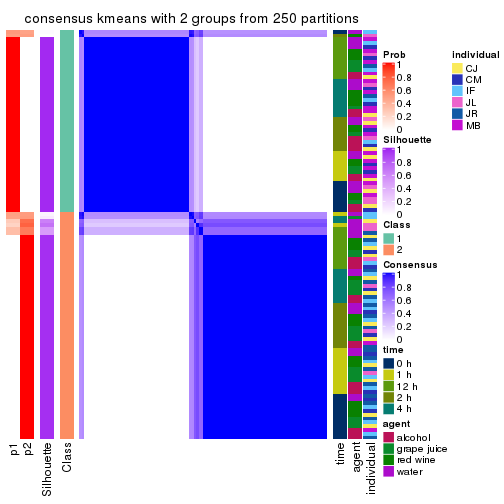</p>

</div>
<div id='tab-MAD-kmeans-consensus-heatmap-2'>
<pre><code class="r">consensus_heatmap(res, k = 3)
</code></pre>

<p>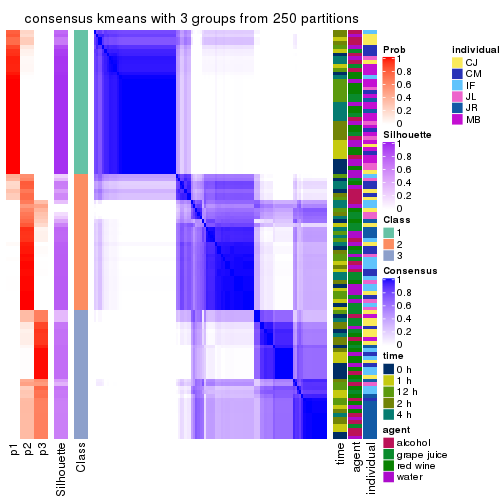</p>

</div>
<div id='tab-MAD-kmeans-consensus-heatmap-3'>
<pre><code class="r">consensus_heatmap(res, k = 4)
</code></pre>

<p>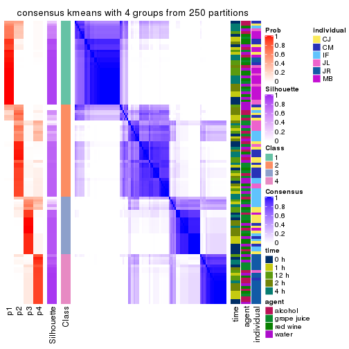</p>

</div>
<div id='tab-MAD-kmeans-consensus-heatmap-4'>
<pre><code class="r">consensus_heatmap(res, k = 5)
</code></pre>

<p>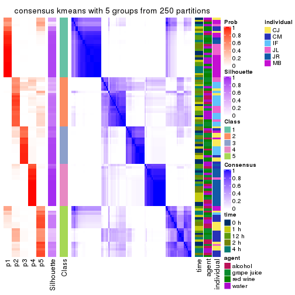</p>

</div>
<div id='tab-MAD-kmeans-consensus-heatmap-5'>
<pre><code class="r">consensus_heatmap(res, k = 6)
</code></pre>

<p>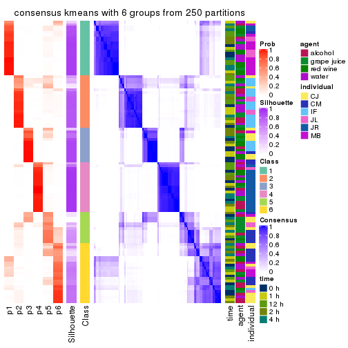</p>

</div>
</div>

Heatmaps for the membership of samples in all partitions to see how consistent they are:


<script>
$( function() {
	$( '#tabs-MAD-kmeans-membership-heatmap' ).tabs();
} );
</script>
<div id='tabs-MAD-kmeans-membership-heatmap'>
<ul>
<li><a href='#tab-MAD-kmeans-membership-heatmap-1'>k = 2</a></li>
<li><a href='#tab-MAD-kmeans-membership-heatmap-2'>k = 3</a></li>
<li><a href='#tab-MAD-kmeans-membership-heatmap-3'>k = 4</a></li>
<li><a href='#tab-MAD-kmeans-membership-heatmap-4'>k = 5</a></li>
<li><a href='#tab-MAD-kmeans-membership-heatmap-5'>k = 6</a></li>
</ul>
<div id='tab-MAD-kmeans-membership-heatmap-1'>
<pre><code class="r">membership_heatmap(res, k = 2)
</code></pre>

<p>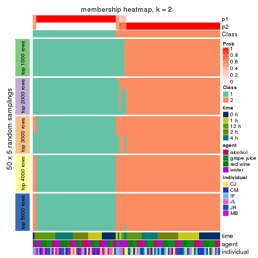</p>

</div>
<div id='tab-MAD-kmeans-membership-heatmap-2'>
<pre><code class="r">membership_heatmap(res, k = 3)
</code></pre>

<p>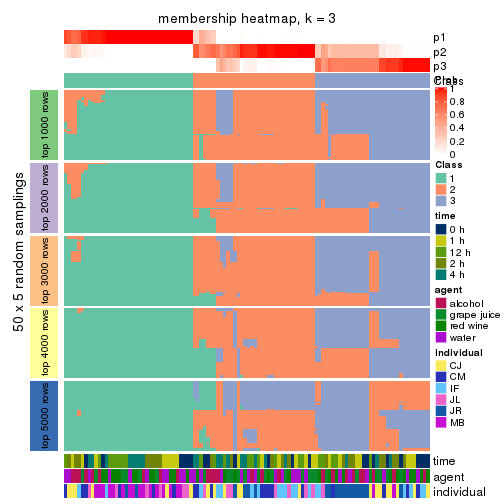</p>

</div>
<div id='tab-MAD-kmeans-membership-heatmap-3'>
<pre><code class="r">membership_heatmap(res, k = 4)
</code></pre>

<p>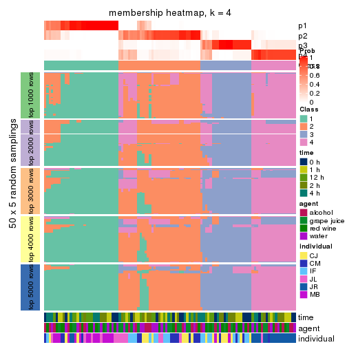</p>

</div>
<div id='tab-MAD-kmeans-membership-heatmap-4'>
<pre><code class="r">membership_heatmap(res, k = 5)
</code></pre>

<p>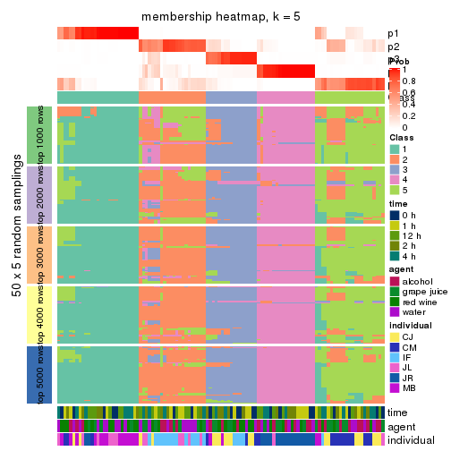</p>

</div>
<div id='tab-MAD-kmeans-membership-heatmap-5'>
<pre><code class="r">membership_heatmap(res, k = 6)
</code></pre>

<p>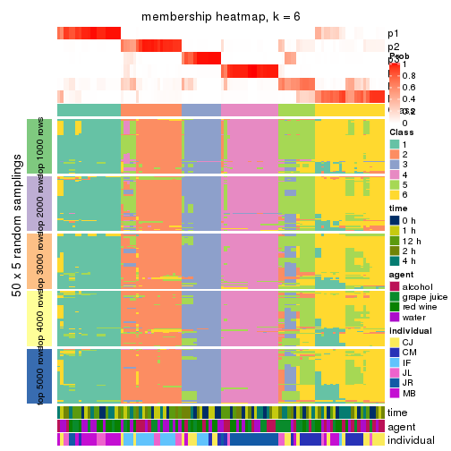</p>

</div>
</div>

As soon as we have had the classes for columns, we can look for signatures
which are significantly different between classes which can be candidate marks
for certain classes. Following are the heatmaps for signatures.


Signature heatmaps where rows are scaled:


<script>
$( function() {
	$( '#tabs-MAD-kmeans-get-signatures' ).tabs();
} );
</script>
<div id='tabs-MAD-kmeans-get-signatures'>
<ul>
<li><a href='#tab-MAD-kmeans-get-signatures-1'>k = 2</a></li>
<li><a href='#tab-MAD-kmeans-get-signatures-2'>k = 3</a></li>
<li><a href='#tab-MAD-kmeans-get-signatures-3'>k = 4</a></li>
<li><a href='#tab-MAD-kmeans-get-signatures-4'>k = 5</a></li>
<li><a href='#tab-MAD-kmeans-get-signatures-5'>k = 6</a></li>
</ul>
<div id='tab-MAD-kmeans-get-signatures-1'>
<pre><code class="r">get_signatures(res, k = 2)
</code></pre>

<p>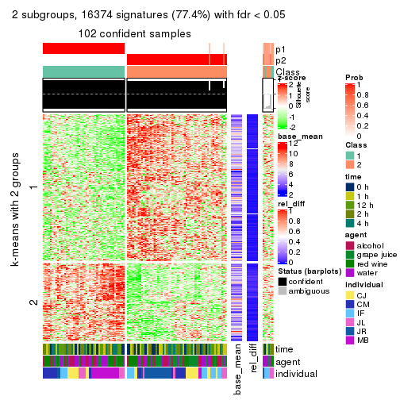</p>

</div>
<div id='tab-MAD-kmeans-get-signatures-2'>
<pre><code class="r">get_signatures(res, k = 3)
</code></pre>

<p>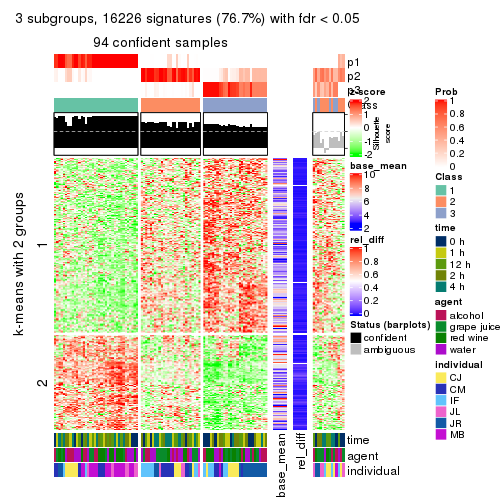</p>

</div>
<div id='tab-MAD-kmeans-get-signatures-3'>
<pre><code class="r">get_signatures(res, k = 4)
</code></pre>

<p>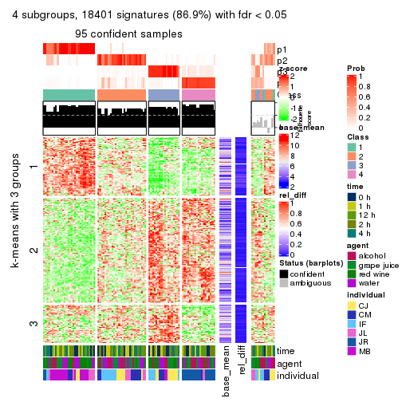</p>

</div>
<div id='tab-MAD-kmeans-get-signatures-4'>
<pre><code class="r">get_signatures(res, k = 5)
</code></pre>

<p>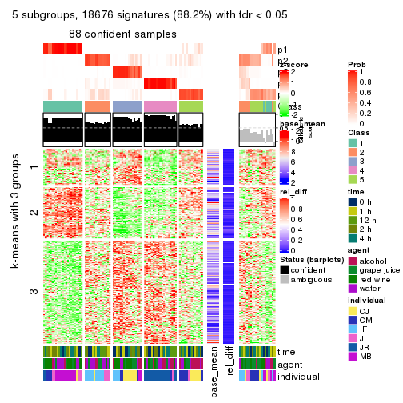</p>

</div>
<div id='tab-MAD-kmeans-get-signatures-5'>
<pre><code class="r">get_signatures(res, k = 6)
</code></pre>

<p>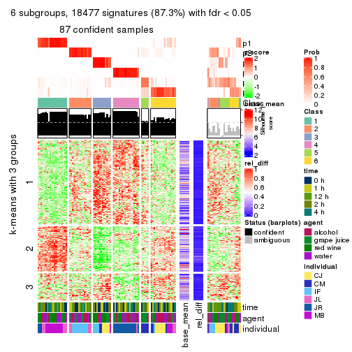</p>

</div>
</div>


Signature heatmaps where rows are not scaled:


<script>
$( function() {
	$( '#tabs-MAD-kmeans-get-signatures-no-scale' ).tabs();
} );
</script>
<div id='tabs-MAD-kmeans-get-signatures-no-scale'>
<ul>
<li><a href='#tab-MAD-kmeans-get-signatures-no-scale-1'>k = 2</a></li>
<li><a href='#tab-MAD-kmeans-get-signatures-no-scale-2'>k = 3</a></li>
<li><a href='#tab-MAD-kmeans-get-signatures-no-scale-3'>k = 4</a></li>
<li><a href='#tab-MAD-kmeans-get-signatures-no-scale-4'>k = 5</a></li>
<li><a href='#tab-MAD-kmeans-get-signatures-no-scale-5'>k = 6</a></li>
</ul>
<div id='tab-MAD-kmeans-get-signatures-no-scale-1'>
<pre><code class="r">get_signatures(res, k = 2, scale_rows = FALSE)
</code></pre>

<p>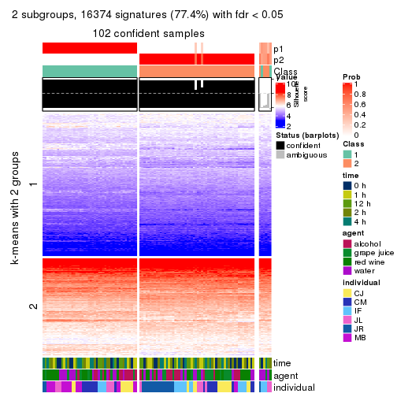</p>

</div>
<div id='tab-MAD-kmeans-get-signatures-no-scale-2'>
<pre><code class="r">get_signatures(res, k = 3, scale_rows = FALSE)
</code></pre>

<p>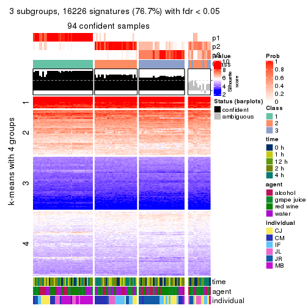</p>

</div>
<div id='tab-MAD-kmeans-get-signatures-no-scale-3'>
<pre><code class="r">get_signatures(res, k = 4, scale_rows = FALSE)
</code></pre>

<p>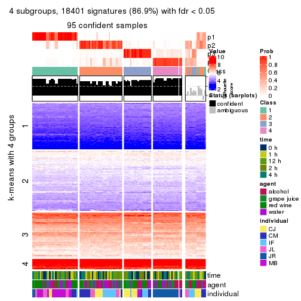</p>

</div>
<div id='tab-MAD-kmeans-get-signatures-no-scale-4'>
<pre><code class="r">get_signatures(res, k = 5, scale_rows = FALSE)
</code></pre>

<p>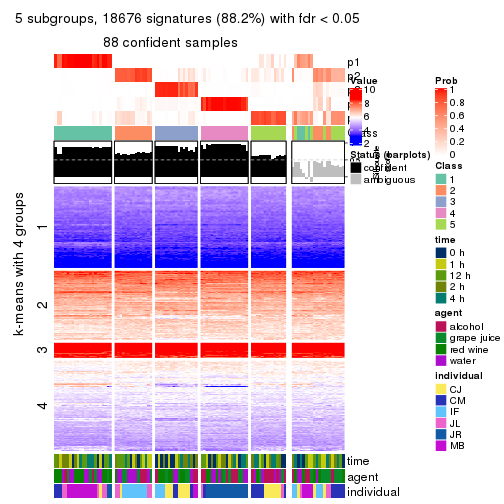</p>

</div>
<div id='tab-MAD-kmeans-get-signatures-no-scale-5'>
<pre><code class="r">get_signatures(res, k = 6, scale_rows = FALSE)
</code></pre>

<p>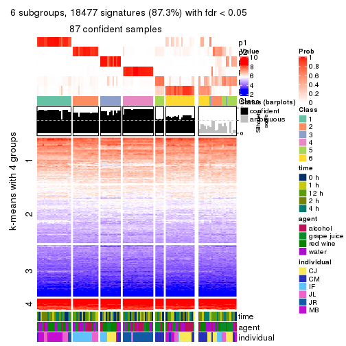</p>

</div>
</div>


Compare the overlap of signatures from different k:

```r
compare_signatures(res)
```

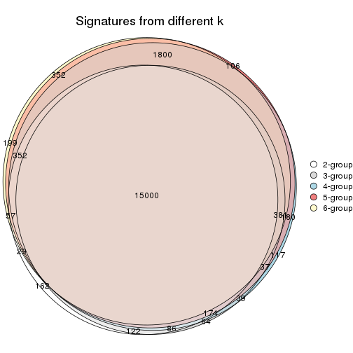

`get_signature()` returns a data frame invisibly. TO get the list of signatures, the function
call should be assigned to a variable explicitly. In following code, if `plot` argument is set
to `FALSE`, no heatmap is plotted while only the differential analysis is performed.

```r
# code only for demonstration
tb = get_signature(res, k = ..., plot = FALSE)
```

An example of the output of `tb` is:

```
#>   which_row         fdr    mean_1    mean_2 scaled_mean_1 scaled_mean_2 km
#> 1        38 0.042760348  8.373488  9.131774    -0.5533452     0.5164555  1
#> 2        40 0.018707592  7.106213  8.469186    -0.6173731     0.5762149  1
#> 3        55 0.019134737 10.221463 11.207825    -0.6159697     0.5749050  1
#> 4        59 0.006059896  5.921854  7.869574    -0.6899429     0.6439467  1
#> 5        60 0.018055526  8.928898 10.211722    -0.6204761     0.5791110  1
#> 6        98 0.009384629 15.714769 14.887706     0.6635654    -0.6193277  2
...
```

The columns in `tb` are:

1. `which_row`: row indices corresponding to the input matrix.
2. `fdr`: FDR for the differential test. 
3. `mean_x`: The mean value in group x.
4. `scaled_mean_x`: The mean value in group x after rows are scaled.
5. `km`: Row groups if k-means clustering is applied to rows.


UMAP plot which shows how samples are separated.


<script>
$( function() {
	$( '#tabs-MAD-kmeans-dimension-reduction' ).tabs();
} );
</script>
<div id='tabs-MAD-kmeans-dimension-reduction'>
<ul>
<li><a href='#tab-MAD-kmeans-dimension-reduction-1'>k = 2</a></li>
<li><a href='#tab-MAD-kmeans-dimension-reduction-2'>k = 3</a></li>
<li><a href='#tab-MAD-kmeans-dimension-reduction-3'>k = 4</a></li>
<li><a href='#tab-MAD-kmeans-dimension-reduction-4'>k = 5</a></li>
<li><a href='#tab-MAD-kmeans-dimension-reduction-5'>k = 6</a></li>
</ul>
<div id='tab-MAD-kmeans-dimension-reduction-1'>
<pre><code class="r">dimension_reduction(res, k = 2, method = &quot;UMAP&quot;)
</code></pre>

<p>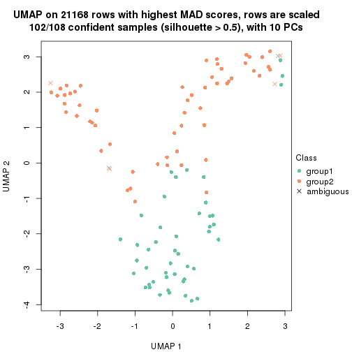</p>

</div>
<div id='tab-MAD-kmeans-dimension-reduction-2'>
<pre><code class="r">dimension_reduction(res, k = 3, method = &quot;UMAP&quot;)
</code></pre>

<p>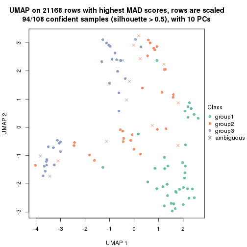</p>

</div>
<div id='tab-MAD-kmeans-dimension-reduction-3'>
<pre><code class="r">dimension_reduction(res, k = 4, method = &quot;UMAP&quot;)
</code></pre>

<p>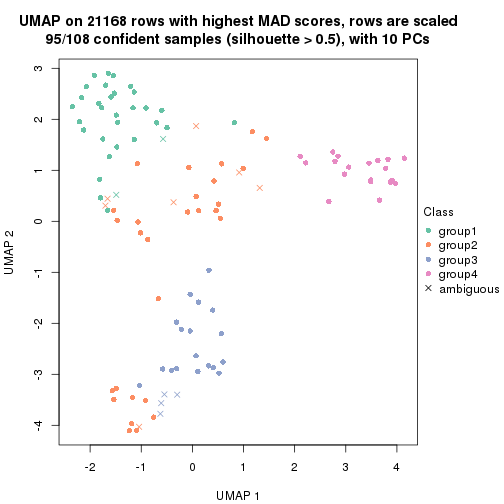</p>

</div>
<div id='tab-MAD-kmeans-dimension-reduction-4'>
<pre><code class="r">dimension_reduction(res, k = 5, method = &quot;UMAP&quot;)
</code></pre>

<p>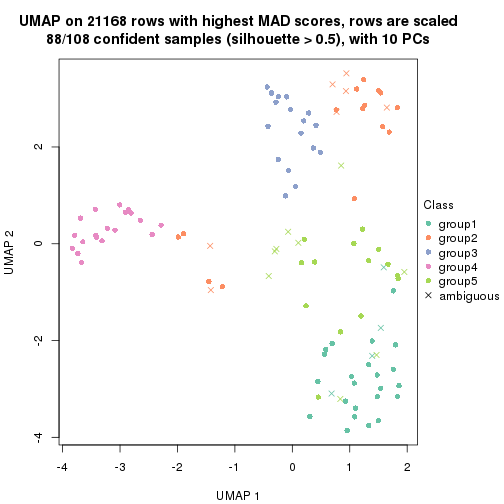</p>

</div>
<div id='tab-MAD-kmeans-dimension-reduction-5'>
<pre><code class="r">dimension_reduction(res, k = 6, method = &quot;UMAP&quot;)
</code></pre>

<p>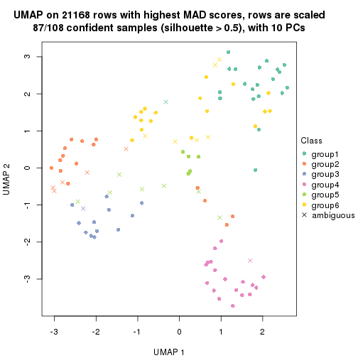</p>

</div>
</div>


Following heatmap shows how subgroups are split when increasing `k`:

```r
collect_classes(res)
```

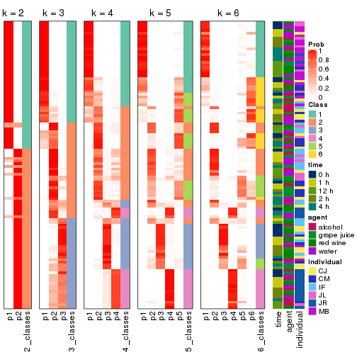


Test correlation between subgroups and known annotations. If the known
annotation is numeric, one-way ANOVA test is applied, and if the known
annotation is discrete, chi-squared contingency table test is applied.

```r
test_to_known_factors(res)
```

```
#>              n time(p) agent(p) individual(p) k
#> MAD:kmeans 102   0.799   0.4937      8.23e-05 2
#> MAD:kmeans  94   0.370   0.2276      1.33e-06 3
#> MAD:kmeans  95   0.954   0.3539      9.02e-19 4
#> MAD:kmeans  88   0.881   0.0988      2.28e-22 5
#> MAD:kmeans  87   0.946   0.1701      6.47e-26 6
```


If matrix rows can be associated to genes, consider to use `GO_Enrichment(res,
...)` to perform function enrichment for the signature genes.


 

---------------------------------------------------


### MAD:skmeans*


The object with results only for a single top-value method and a single partition method 
can be extracted as:

```r
res = res_list["MAD", "skmeans"]
# you can also extract it by
# res = res_list["MAD:skmeans"]
```

A summary of `res` and all the functions that can be applied to it:

```r
res
```

```
#> A 'ConsensusPartition' object with k = 2, 3, 4, 5, 6.
#>   On a matrix with 21168 rows and 108 columns.
#>   Top rows (1000, 2000, 3000, 4000, 5000) are extracted by 'MAD' method.
#>   Subgroups are detected by 'skmeans' method.
#>   Performed in total 1250 partitions by row resampling.
#>   Best k for subgroups seems to be 6.
#> 
#> Following methods can be applied to this 'ConsensusPartition' object:
#>  [1] "cola_report"             "collect_classes"         "collect_plots"          
#>  [4] "collect_stats"           "colnames"                "compare_signatures"     
#>  [7] "consensus_heatmap"       "dimension_reduction"     "functional_enrichment"  
#> [10] "get_anno_col"            "get_anno"                "get_classes"            
#> [13] "get_consensus"           "get_matrix"              "get_membership"         
#> [16] "get_param"               "get_signatures"          "get_stats"              
#> [19] "is_best_k"               "is_stable_k"             "membership_heatmap"     
#> [22] "ncol"                    "nrow"                    "plot_ecdf"              
#> [25] "rownames"                "select_partition_number" "show"                   
#> [28] "suggest_best_k"          "test_to_known_factors"
```

`collect_plots()` function collects all the plots made from `res` for all `k` (number of partitions)
into one single page to provide an easy and fast comparison between different `k`.

```r
collect_plots(res)
```

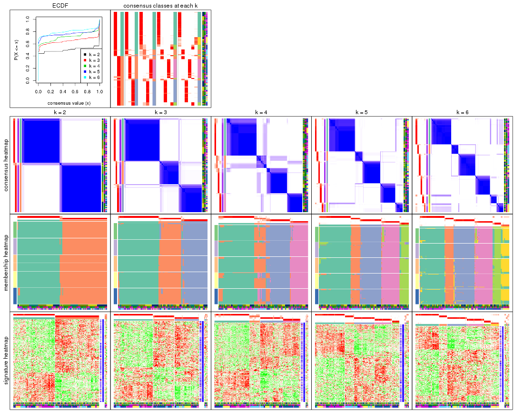

The plots are:

- The first row: a plot of the ECDF (Empirical cumulative distribution
  function) curves of the consensus matrix for each `k` and the heatmap of
  predicted classes for each `k`.
- The second row: heatmaps of the consensus matrix for each `k`.
- The third row: heatmaps of the membership matrix for each `k`.
- The fouth row: heatmaps of the signatures for each `k`.

All the plots in panels can be made by individual functions and they are
plotted later in this section.

`select_partition_number()` produces several plots showing different
statistics for choosing "optimized" `k`. There are following statistics:

- ECDF curves of the consensus matrix for each `k`;
- 1-PAC. [The PAC
  score](https://en.wikipedia.org/wiki/Consensus_clustering#Over-interpretation_potential_of_consensus_clustering)
  measures the proportion of the ambiguous subgrouping.
- Mean silhouette score.
- Concordance. The mean probability of fiting the consensus class ids in all
  partitions.
- Area increased. Denote $A_k$ as the area under the ECDF curve for current
  `k`, the area increased is defined as $A_k - A_{k-1}$.
- Rand index. The percent of pairs of samples that are both in a same cluster
  or both are not in a same cluster in the partition of k and k-1.
- Jaccard index. The ratio of pairs of samples are both in a same cluster in
  the partition of k and k-1 and the pairs of samples are both in a same
  cluster in the partition k or k-1.

The detailed explanations of these statistics can be found in [the cola
vignette](http://bioconductor.org/packages/devel/bioc/vignettes/cola/inst/doc/cola.html#toc_13).

Generally speaking, lower PAC score, higher mean silhouette score or higher
concordance corresponds to better partition. Rand index and Jaccard index
measure how similar the current partition is compared to partition with `k-1`.
If they are too similar, we won't accept `k` is better than `k-1`.

```r
select_partition_number(res)
```

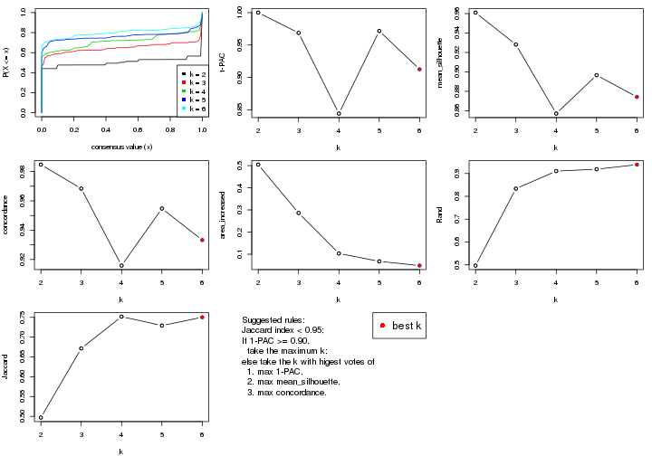

The numeric values for all these statistics can be obtained by `get_stats()`.

```r
get_stats(res)
```

```
#>   k 1-PAC mean_silhouette concordance area_increased  Rand Jaccard
#> 2 2 1.000           0.961       0.985         0.5043 0.497   0.497
#> 3 3 0.969           0.928       0.968         0.2861 0.834   0.671
#> 4 4 0.844           0.857       0.916         0.1035 0.910   0.752
#> 5 5 0.972           0.897       0.955         0.0679 0.919   0.729
#> 6 6 0.913           0.874       0.933         0.0489 0.939   0.750
```

`suggest_best_k()` suggests the best $k$ based on these statistics. The rules are as follows:

- All $k$ with Jaccard index larger than 0.95 are removed because the increase of
  the partition number does not provides enough extra information. If all $k$ are removed,
  the best $k$ is assigned by `NA`.
- For $k$ with 1-PAC larger than 0.9, the maximal $k$ is taken as the "best k". Other $k$ is called "optional k".
- If it does not fit the second rule. The $k$ with the highest vote of highest
  1-PAC, mean silhouette and concordance is taken as the "best k".

```r
suggest_best_k(res)
```

```
#> [1] 6
#> attr(,"optional")
#> [1] 2 3 5
```

There is also optional best $k$ = 2 3 5 that is worth to check.

Following shows the table of the partitions (You need to click the **show/hide
code output** link to see it). The membership matrix (columns with name `p*`)
is inferred by
[`clue::cl_consensus()`](https://www.rdocumentation.org/link/cl_consensus?package=clue)
function with the `SE` method. Basically the value in the membership matrix
represents the probability to belong to a certain group. The finall class
label for an item is determined with the group with highest probability it
belongs to.

In `get_classes()` function, the entropy is calculated from the membership
matrix and the silhouette score is calculated from the consensus matrix.


<script>
$( function() {
	$( '#tabs-MAD-skmeans-get-classes' ).tabs();
} );
</script>
<div id='tabs-MAD-skmeans-get-classes'>
<ul>
<li><a href='#tab-MAD-skmeans-get-classes-1'>k = 2</a></li>
<li><a href='#tab-MAD-skmeans-get-classes-2'>k = 3</a></li>
<li><a href='#tab-MAD-skmeans-get-classes-3'>k = 4</a></li>
<li><a href='#tab-MAD-skmeans-get-classes-4'>k = 5</a></li>
<li><a href='#tab-MAD-skmeans-get-classes-5'>k = 6</a></li>
</ul>

<div id='tab-MAD-skmeans-get-classes-1'>
<p><a id='tab-MAD-skmeans-get-classes-1-a' style='color:#0366d6' href='#'>show/hide code output</a></p>
<pre><code class="r">cbind(get_classes(res, k = 2), get_membership(res, k = 2))
</code></pre>

<pre><code>#&gt;          class entropy silhouette    p1    p2
#&gt; GSM87863     1   0.000      0.994 1.000 0.000
#&gt; GSM87887     1   0.000      0.994 1.000 0.000
#&gt; GSM87896     2   0.000      0.975 0.000 1.000
#&gt; GSM87934     2   0.000      0.975 0.000 1.000
#&gt; GSM87943     2   0.000      0.975 0.000 1.000
#&gt; GSM87853     2   0.000      0.975 0.000 1.000
#&gt; GSM87906     2   0.000      0.975 0.000 1.000
#&gt; GSM87920     1   0.000      0.994 1.000 0.000
#&gt; GSM87924     2   0.000      0.975 0.000 1.000
#&gt; GSM87858     2   0.000      0.975 0.000 1.000
#&gt; GSM87882     2   0.000      0.975 0.000 1.000
#&gt; GSM87891     2   0.000      0.975 0.000 1.000
#&gt; GSM87917     1   0.000      0.994 1.000 0.000
#&gt; GSM87929     2   0.000      0.975 0.000 1.000
#&gt; GSM87948     1   0.000      0.994 1.000 0.000
#&gt; GSM87868     1   0.000      0.994 1.000 0.000
#&gt; GSM87873     2   0.000      0.975 0.000 1.000
#&gt; GSM87901     1   0.443      0.898 0.908 0.092
#&gt; GSM87910     1   0.000      0.994 1.000 0.000
#&gt; GSM87938     2   0.000      0.975 0.000 1.000
#&gt; GSM87953     1   0.000      0.994 1.000 0.000
#&gt; GSM87864     1   0.000      0.994 1.000 0.000
#&gt; GSM87888     2   0.000      0.975 0.000 1.000
#&gt; GSM87897     2   0.000      0.975 0.000 1.000
#&gt; GSM87935     2   0.000      0.975 0.000 1.000
#&gt; GSM87944     1   0.000      0.994 1.000 0.000
#&gt; GSM87854     2   0.443      0.882 0.092 0.908
#&gt; GSM87878     1   0.000      0.994 1.000 0.000
#&gt; GSM87907     2   0.000      0.975 0.000 1.000
#&gt; GSM87921     2   0.000      0.975 0.000 1.000
#&gt; GSM87925     2   0.000      0.975 0.000 1.000
#&gt; GSM87957     1   0.000      0.994 1.000 0.000
#&gt; GSM87859     2   0.000      0.975 0.000 1.000
#&gt; GSM87883     1   0.000      0.994 1.000 0.000
#&gt; GSM87892     2   0.000      0.975 0.000 1.000
#&gt; GSM87930     2   0.000      0.975 0.000 1.000
#&gt; GSM87949     1   0.000      0.994 1.000 0.000
#&gt; GSM87869     1   0.000      0.994 1.000 0.000
#&gt; GSM87874     2   0.000      0.975 0.000 1.000
#&gt; GSM87902     1   0.443      0.898 0.908 0.092
#&gt; GSM87911     2   0.999      0.112 0.480 0.520
#&gt; GSM87939     2   0.000      0.975 0.000 1.000
#&gt; GSM87954     1   0.000      0.994 1.000 0.000
#&gt; GSM87865     1   0.000      0.994 1.000 0.000
#&gt; GSM87889     1   0.000      0.994 1.000 0.000
#&gt; GSM87898     1   0.000      0.994 1.000 0.000
#&gt; GSM87915     1   0.000      0.994 1.000 0.000
#&gt; GSM87936     2   0.000      0.975 0.000 1.000
#&gt; GSM87945     2   0.000      0.975 0.000 1.000
#&gt; GSM87855     2   0.000      0.975 0.000 1.000
#&gt; GSM87879     2   0.000      0.975 0.000 1.000
#&gt; GSM87922     2   0.000      0.975 0.000 1.000
#&gt; GSM87926     2   0.000      0.975 0.000 1.000
#&gt; GSM87958     1   0.000      0.994 1.000 0.000
#&gt; GSM87860     2   0.000      0.975 0.000 1.000
#&gt; GSM87884     1   0.000      0.994 1.000 0.000
#&gt; GSM87893     2   0.000      0.975 0.000 1.000
#&gt; GSM87918     1   0.000      0.994 1.000 0.000
#&gt; GSM87931     2   0.000      0.975 0.000 1.000
#&gt; GSM87950     1   0.000      0.994 1.000 0.000
#&gt; GSM87870     1   0.000      0.994 1.000 0.000
#&gt; GSM87875     2   0.000      0.975 0.000 1.000
#&gt; GSM87903     2   0.000      0.975 0.000 1.000
#&gt; GSM87912     1   0.000      0.994 1.000 0.000
#&gt; GSM87940     2   0.000      0.975 0.000 1.000
#&gt; GSM87866     1   0.000      0.994 1.000 0.000
#&gt; GSM87899     2   0.000      0.975 0.000 1.000
#&gt; GSM87937     2   0.000      0.975 0.000 1.000
#&gt; GSM87946     1   0.000      0.994 1.000 0.000
#&gt; GSM87856     2   0.000      0.975 0.000 1.000
#&gt; GSM87880     2   0.000      0.975 0.000 1.000
#&gt; GSM87908     1   0.000      0.994 1.000 0.000
#&gt; GSM87923     2   0.000      0.975 0.000 1.000
#&gt; GSM87927     2   0.000      0.975 0.000 1.000
#&gt; GSM87959     1   0.000      0.994 1.000 0.000
#&gt; GSM87861     2   0.000      0.975 0.000 1.000
#&gt; GSM87885     1   0.000      0.994 1.000 0.000
#&gt; GSM87894     1   0.000      0.994 1.000 0.000
#&gt; GSM87932     1   0.000      0.994 1.000 0.000
#&gt; GSM87951     1   0.000      0.994 1.000 0.000
#&gt; GSM87871     1   0.469      0.886 0.900 0.100
#&gt; GSM87876     1   0.000      0.994 1.000 0.000
#&gt; GSM87904     2   0.000      0.975 0.000 1.000
#&gt; GSM87913     1   0.000      0.994 1.000 0.000
#&gt; GSM87941     2   0.000      0.975 0.000 1.000
#&gt; GSM87955     1   0.000      0.994 1.000 0.000
#&gt; GSM87867     1   0.000      0.994 1.000 0.000
#&gt; GSM87890     2   0.000      0.975 0.000 1.000
#&gt; GSM87900     2   0.000      0.975 0.000 1.000
#&gt; GSM87916     2   0.000      0.975 0.000 1.000
#&gt; GSM87947     1   0.000      0.994 1.000 0.000
#&gt; GSM87857     2   0.000      0.975 0.000 1.000
#&gt; GSM87881     2   0.000      0.975 0.000 1.000
#&gt; GSM87909     1   0.000      0.994 1.000 0.000
#&gt; GSM87928     1   0.000      0.994 1.000 0.000
#&gt; GSM87960     1   0.000      0.994 1.000 0.000
#&gt; GSM87862     2   0.000      0.975 0.000 1.000
#&gt; GSM87886     1   0.000      0.994 1.000 0.000
#&gt; GSM87895     2   0.000      0.975 0.000 1.000
#&gt; GSM87919     1   0.000      0.994 1.000 0.000
#&gt; GSM87933     2   0.000      0.975 0.000 1.000
#&gt; GSM87952     1   0.000      0.994 1.000 0.000
#&gt; GSM87872     2   0.000      0.975 0.000 1.000
#&gt; GSM87877     1   0.000      0.994 1.000 0.000
#&gt; GSM87905     1   0.000      0.994 1.000 0.000
#&gt; GSM87914     2   0.971      0.348 0.400 0.600
#&gt; GSM87942     2   0.969      0.359 0.396 0.604
#&gt; GSM87956     1   0.000      0.994 1.000 0.000
</code></pre>

<script>
$('#tab-MAD-skmeans-get-classes-1-a').parent().next().next().hide();
$('#tab-MAD-skmeans-get-classes-1-a').click(function(){
  $('#tab-MAD-skmeans-get-classes-1-a').parent().next().next().toggle();
  return(false);
});
</script>
</div>

<div id='tab-MAD-skmeans-get-classes-2'>
<p><a id='tab-MAD-skmeans-get-classes-2-a' style='color:#0366d6' href='#'>show/hide code output</a></p>
<pre><code class="r">cbind(get_classes(res, k = 3), get_membership(res, k = 3))
</code></pre>

<pre><code>#&gt;          class entropy silhouette    p1    p2    p3
#&gt; GSM87863     1  0.0000      0.983 1.000 0.000 0.000
#&gt; GSM87887     1  0.0000      0.983 1.000 0.000 0.000
#&gt; GSM87896     3  0.0747      0.942 0.000 0.016 0.984
#&gt; GSM87934     2  0.0747      0.954 0.000 0.984 0.016
#&gt; GSM87943     3  0.0000      0.952 0.000 0.000 1.000
#&gt; GSM87853     3  0.0000      0.952 0.000 0.000 1.000
#&gt; GSM87906     2  0.2261      0.902 0.000 0.932 0.068
#&gt; GSM87920     1  0.0000      0.983 1.000 0.000 0.000
#&gt; GSM87924     2  0.1163      0.947 0.000 0.972 0.028
#&gt; GSM87858     3  0.0000      0.952 0.000 0.000 1.000
#&gt; GSM87882     3  0.0000      0.952 0.000 0.000 1.000
#&gt; GSM87891     3  0.0747      0.942 0.000 0.016 0.984
#&gt; GSM87917     1  0.0000      0.983 1.000 0.000 0.000
#&gt; GSM87929     2  0.0237      0.948 0.000 0.996 0.004
#&gt; GSM87948     1  0.0000      0.983 1.000 0.000 0.000
#&gt; GSM87868     1  0.0000      0.983 1.000 0.000 0.000
#&gt; GSM87873     3  0.0000      0.952 0.000 0.000 1.000
#&gt; GSM87901     1  0.6180      0.280 0.584 0.416 0.000
#&gt; GSM87910     1  0.0000      0.983 1.000 0.000 0.000
#&gt; GSM87938     2  0.0747      0.954 0.000 0.984 0.016
#&gt; GSM87953     1  0.0000      0.983 1.000 0.000 0.000
#&gt; GSM87864     1  0.0000      0.983 1.000 0.000 0.000
#&gt; GSM87888     3  0.0000      0.952 0.000 0.000 1.000
#&gt; GSM87897     2  0.2356      0.898 0.000 0.928 0.072
#&gt; GSM87935     2  0.0747      0.954 0.000 0.984 0.016
#&gt; GSM87944     1  0.0000      0.983 1.000 0.000 0.000
#&gt; GSM87854     3  0.0000      0.952 0.000 0.000 1.000
#&gt; GSM87878     1  0.0000      0.983 1.000 0.000 0.000
#&gt; GSM87907     3  0.0892      0.940 0.000 0.020 0.980
#&gt; GSM87921     2  0.0000      0.946 0.000 1.000 0.000
#&gt; GSM87925     2  0.0747      0.954 0.000 0.984 0.016
#&gt; GSM87957     1  0.0000      0.983 1.000 0.000 0.000
#&gt; GSM87859     3  0.0000      0.952 0.000 0.000 1.000
#&gt; GSM87883     1  0.0000      0.983 1.000 0.000 0.000
#&gt; GSM87892     3  0.0000      0.952 0.000 0.000 1.000
#&gt; GSM87930     2  0.0747      0.954 0.000 0.984 0.016
#&gt; GSM87949     1  0.0000      0.983 1.000 0.000 0.000
#&gt; GSM87869     1  0.0000      0.983 1.000 0.000 0.000
#&gt; GSM87874     3  0.0000      0.952 0.000 0.000 1.000
#&gt; GSM87902     1  0.7680      0.584 0.680 0.188 0.132
#&gt; GSM87911     3  0.6168      0.733 0.124 0.096 0.780
#&gt; GSM87939     2  0.0747      0.954 0.000 0.984 0.016
#&gt; GSM87954     1  0.0000      0.983 1.000 0.000 0.000
#&gt; GSM87865     1  0.0000      0.983 1.000 0.000 0.000
#&gt; GSM87889     1  0.0000      0.983 1.000 0.000 0.000
#&gt; GSM87898     1  0.0747      0.971 0.984 0.016 0.000
#&gt; GSM87915     1  0.0000      0.983 1.000 0.000 0.000
#&gt; GSM87936     2  0.0747      0.954 0.000 0.984 0.016
#&gt; GSM87945     3  0.0000      0.952 0.000 0.000 1.000
#&gt; GSM87855     3  0.0000      0.952 0.000 0.000 1.000
#&gt; GSM87879     3  0.0000      0.952 0.000 0.000 1.000
#&gt; GSM87922     3  0.1031      0.934 0.000 0.024 0.976
#&gt; GSM87926     2  0.0747      0.954 0.000 0.984 0.016
#&gt; GSM87958     1  0.0000      0.983 1.000 0.000 0.000
#&gt; GSM87860     3  0.0000      0.952 0.000 0.000 1.000
#&gt; GSM87884     1  0.0000      0.983 1.000 0.000 0.000
#&gt; GSM87893     3  0.0000      0.952 0.000 0.000 1.000
#&gt; GSM87918     2  0.6095      0.335 0.392 0.608 0.000
#&gt; GSM87931     2  0.0747      0.954 0.000 0.984 0.016
#&gt; GSM87950     1  0.0000      0.983 1.000 0.000 0.000
#&gt; GSM87870     1  0.0000      0.983 1.000 0.000 0.000
#&gt; GSM87875     3  0.0000      0.952 0.000 0.000 1.000
#&gt; GSM87903     3  0.4555      0.741 0.000 0.200 0.800
#&gt; GSM87912     1  0.0000      0.983 1.000 0.000 0.000
#&gt; GSM87940     2  0.0747      0.954 0.000 0.984 0.016
#&gt; GSM87866     1  0.0000      0.983 1.000 0.000 0.000
#&gt; GSM87899     3  0.0424      0.948 0.000 0.008 0.992
#&gt; GSM87937     2  0.0747      0.954 0.000 0.984 0.016
#&gt; GSM87946     1  0.0000      0.983 1.000 0.000 0.000
#&gt; GSM87856     3  0.0000      0.952 0.000 0.000 1.000
#&gt; GSM87880     3  0.0000      0.952 0.000 0.000 1.000
#&gt; GSM87908     1  0.1031      0.965 0.976 0.024 0.000
#&gt; GSM87923     3  0.0000      0.952 0.000 0.000 1.000
#&gt; GSM87927     2  0.0747      0.954 0.000 0.984 0.016
#&gt; GSM87959     1  0.0000      0.983 1.000 0.000 0.000
#&gt; GSM87861     3  0.0000      0.952 0.000 0.000 1.000
#&gt; GSM87885     1  0.0000      0.983 1.000 0.000 0.000
#&gt; GSM87894     1  0.0000      0.983 1.000 0.000 0.000
#&gt; GSM87932     1  0.0000      0.983 1.000 0.000 0.000
#&gt; GSM87951     1  0.0000      0.983 1.000 0.000 0.000
#&gt; GSM87871     3  0.6274      0.177 0.456 0.000 0.544
#&gt; GSM87876     1  0.0424      0.976 0.992 0.000 0.008
#&gt; GSM87904     3  0.0000      0.952 0.000 0.000 1.000
#&gt; GSM87913     1  0.0000      0.983 1.000 0.000 0.000
#&gt; GSM87941     2  0.0592      0.952 0.000 0.988 0.012
#&gt; GSM87955     1  0.0000      0.983 1.000 0.000 0.000
#&gt; GSM87867     1  0.0000      0.983 1.000 0.000 0.000
#&gt; GSM87890     2  0.4605      0.757 0.000 0.796 0.204
#&gt; GSM87900     2  0.0000      0.946 0.000 1.000 0.000
#&gt; GSM87916     2  0.0747      0.954 0.000 0.984 0.016
#&gt; GSM87947     1  0.0000      0.983 1.000 0.000 0.000
#&gt; GSM87857     3  0.0000      0.952 0.000 0.000 1.000
#&gt; GSM87881     2  0.4750      0.739 0.000 0.784 0.216
#&gt; GSM87909     1  0.0747      0.971 0.984 0.016 0.000
#&gt; GSM87928     1  0.0000      0.983 1.000 0.000 0.000
#&gt; GSM87960     1  0.0000      0.983 1.000 0.000 0.000
#&gt; GSM87862     3  0.0747      0.942 0.000 0.016 0.984
#&gt; GSM87886     1  0.0000      0.983 1.000 0.000 0.000
#&gt; GSM87895     3  0.5905      0.425 0.000 0.352 0.648
#&gt; GSM87919     1  0.0000      0.983 1.000 0.000 0.000
#&gt; GSM87933     2  0.0747      0.954 0.000 0.984 0.016
#&gt; GSM87952     1  0.0000      0.983 1.000 0.000 0.000
#&gt; GSM87872     2  0.1860      0.929 0.000 0.948 0.052
#&gt; GSM87877     1  0.0000      0.983 1.000 0.000 0.000
#&gt; GSM87905     1  0.0747      0.971 0.984 0.016 0.000
#&gt; GSM87914     2  0.0000      0.946 0.000 1.000 0.000
#&gt; GSM87942     2  0.0000      0.946 0.000 1.000 0.000
#&gt; GSM87956     1  0.0000      0.983 1.000 0.000 0.000
</code></pre>

<script>
$('#tab-MAD-skmeans-get-classes-2-a').parent().next().next().hide();
$('#tab-MAD-skmeans-get-classes-2-a').click(function(){
  $('#tab-MAD-skmeans-get-classes-2-a').parent().next().next().toggle();
  return(false);
});
</script>
</div>

<div id='tab-MAD-skmeans-get-classes-3'>
<p><a id='tab-MAD-skmeans-get-classes-3-a' style='color:#0366d6' href='#'>show/hide code output</a></p>
<pre><code class="r">cbind(get_classes(res, k = 4), get_membership(res, k = 4))
</code></pre>

<pre><code>#&gt;          class entropy silhouette    p1    p2    p3    p4
#&gt; GSM87863     1  0.0592      0.945 0.984 0.016 0.000 0.000
#&gt; GSM87887     1  0.4331      0.669 0.712 0.288 0.000 0.000
#&gt; GSM87896     3  0.0000      0.920 0.000 0.000 1.000 0.000
#&gt; GSM87934     4  0.0000      0.957 0.000 0.000 0.000 1.000
#&gt; GSM87943     3  0.0000      0.920 0.000 0.000 1.000 0.000
#&gt; GSM87853     3  0.0000      0.920 0.000 0.000 1.000 0.000
#&gt; GSM87906     2  0.4908      0.647 0.000 0.692 0.292 0.016
#&gt; GSM87920     1  0.0000      0.950 1.000 0.000 0.000 0.000
#&gt; GSM87924     4  0.0469      0.946 0.000 0.000 0.012 0.988
#&gt; GSM87858     3  0.0000      0.920 0.000 0.000 1.000 0.000
#&gt; GSM87882     3  0.4356      0.657 0.000 0.292 0.708 0.000
#&gt; GSM87891     3  0.0000      0.920 0.000 0.000 1.000 0.000
#&gt; GSM87917     1  0.0000      0.950 1.000 0.000 0.000 0.000
#&gt; GSM87929     4  0.0000      0.957 0.000 0.000 0.000 1.000
#&gt; GSM87948     1  0.0000      0.950 1.000 0.000 0.000 0.000
#&gt; GSM87868     1  0.0592      0.945 0.984 0.016 0.000 0.000
#&gt; GSM87873     3  0.0000      0.920 0.000 0.000 1.000 0.000
#&gt; GSM87901     2  0.5395      0.642 0.084 0.732 0.000 0.184
#&gt; GSM87910     1  0.0000      0.950 1.000 0.000 0.000 0.000
#&gt; GSM87938     4  0.0000      0.957 0.000 0.000 0.000 1.000
#&gt; GSM87953     1  0.0000      0.950 1.000 0.000 0.000 0.000
#&gt; GSM87864     1  0.0592      0.945 0.984 0.016 0.000 0.000
#&gt; GSM87888     3  0.4382      0.653 0.000 0.296 0.704 0.000
#&gt; GSM87897     2  0.4908      0.647 0.000 0.692 0.292 0.016
#&gt; GSM87935     4  0.0000      0.957 0.000 0.000 0.000 1.000
#&gt; GSM87944     1  0.0000      0.950 1.000 0.000 0.000 0.000
#&gt; GSM87854     3  0.0000      0.920 0.000 0.000 1.000 0.000
#&gt; GSM87878     1  0.4193      0.690 0.732 0.268 0.000 0.000
#&gt; GSM87907     3  0.0921      0.893 0.000 0.028 0.972 0.000
#&gt; GSM87921     2  0.4761      0.411 0.000 0.628 0.000 0.372
#&gt; GSM87925     4  0.0000      0.957 0.000 0.000 0.000 1.000
#&gt; GSM87957     1  0.0000      0.950 1.000 0.000 0.000 0.000
#&gt; GSM87859     3  0.0000      0.920 0.000 0.000 1.000 0.000
#&gt; GSM87883     1  0.0469      0.946 0.988 0.012 0.000 0.000
#&gt; GSM87892     3  0.0000      0.920 0.000 0.000 1.000 0.000
#&gt; GSM87930     4  0.0000      0.957 0.000 0.000 0.000 1.000
#&gt; GSM87949     1  0.0000      0.950 1.000 0.000 0.000 0.000
#&gt; GSM87869     1  0.0000      0.950 1.000 0.000 0.000 0.000
#&gt; GSM87874     3  0.0000      0.920 0.000 0.000 1.000 0.000
#&gt; GSM87902     2  0.5473      0.704 0.084 0.724 0.192 0.000
#&gt; GSM87911     2  0.5574      0.659 0.048 0.668 0.284 0.000
#&gt; GSM87939     4  0.0000      0.957 0.000 0.000 0.000 1.000
#&gt; GSM87954     1  0.0000      0.950 1.000 0.000 0.000 0.000
#&gt; GSM87865     1  0.0592      0.945 0.984 0.016 0.000 0.000
#&gt; GSM87889     1  0.4454      0.645 0.692 0.308 0.000 0.000
#&gt; GSM87898     2  0.4454      0.656 0.308 0.692 0.000 0.000
#&gt; GSM87915     1  0.0000      0.950 1.000 0.000 0.000 0.000
#&gt; GSM87936     4  0.0000      0.957 0.000 0.000 0.000 1.000
#&gt; GSM87945     3  0.0000      0.920 0.000 0.000 1.000 0.000
#&gt; GSM87855     3  0.0000      0.920 0.000 0.000 1.000 0.000
#&gt; GSM87879     3  0.4356      0.657 0.000 0.292 0.708 0.000
#&gt; GSM87922     3  0.2589      0.795 0.000 0.000 0.884 0.116
#&gt; GSM87926     4  0.0000      0.957 0.000 0.000 0.000 1.000
#&gt; GSM87958     1  0.0000      0.950 1.000 0.000 0.000 0.000
#&gt; GSM87860     3  0.0000      0.920 0.000 0.000 1.000 0.000
#&gt; GSM87884     1  0.0469      0.946 0.988 0.012 0.000 0.000
#&gt; GSM87893     3  0.0000      0.920 0.000 0.000 1.000 0.000
#&gt; GSM87918     2  0.7304      0.526 0.208 0.532 0.000 0.260
#&gt; GSM87931     4  0.0000      0.957 0.000 0.000 0.000 1.000
#&gt; GSM87950     1  0.0000      0.950 1.000 0.000 0.000 0.000
#&gt; GSM87870     1  0.0592      0.945 0.984 0.016 0.000 0.000
#&gt; GSM87875     3  0.0000      0.920 0.000 0.000 1.000 0.000
#&gt; GSM87903     2  0.4454      0.630 0.000 0.692 0.308 0.000
#&gt; GSM87912     1  0.0000      0.950 1.000 0.000 0.000 0.000
#&gt; GSM87940     4  0.0000      0.957 0.000 0.000 0.000 1.000
#&gt; GSM87866     1  0.0592      0.945 0.984 0.016 0.000 0.000
#&gt; GSM87899     2  0.4697      0.561 0.000 0.644 0.356 0.000
#&gt; GSM87937     4  0.0000      0.957 0.000 0.000 0.000 1.000
#&gt; GSM87946     1  0.0000      0.950 1.000 0.000 0.000 0.000
#&gt; GSM87856     3  0.0000      0.920 0.000 0.000 1.000 0.000
#&gt; GSM87880     3  0.4382      0.653 0.000 0.296 0.704 0.000
#&gt; GSM87908     2  0.4454      0.656 0.308 0.692 0.000 0.000
#&gt; GSM87923     3  0.0000      0.920 0.000 0.000 1.000 0.000
#&gt; GSM87927     4  0.0000      0.957 0.000 0.000 0.000 1.000
#&gt; GSM87959     1  0.0000      0.950 1.000 0.000 0.000 0.000
#&gt; GSM87861     3  0.0000      0.920 0.000 0.000 1.000 0.000
#&gt; GSM87885     1  0.4454      0.645 0.692 0.308 0.000 0.000
#&gt; GSM87894     1  0.0469      0.946 0.988 0.012 0.000 0.000
#&gt; GSM87932     1  0.0000      0.950 1.000 0.000 0.000 0.000
#&gt; GSM87951     1  0.0000      0.950 1.000 0.000 0.000 0.000
#&gt; GSM87871     3  0.7758      0.199 0.260 0.308 0.432 0.000
#&gt; GSM87876     1  0.4454      0.645 0.692 0.308 0.000 0.000
#&gt; GSM87904     3  0.0000      0.920 0.000 0.000 1.000 0.000
#&gt; GSM87913     1  0.0000      0.950 1.000 0.000 0.000 0.000
#&gt; GSM87941     4  0.0000      0.957 0.000 0.000 0.000 1.000
#&gt; GSM87955     1  0.0000      0.950 1.000 0.000 0.000 0.000
#&gt; GSM87867     1  0.2760      0.849 0.872 0.128 0.000 0.000
#&gt; GSM87890     4  0.4012      0.704 0.000 0.016 0.184 0.800
#&gt; GSM87900     2  0.4454      0.511 0.000 0.692 0.000 0.308
#&gt; GSM87916     4  0.0000      0.957 0.000 0.000 0.000 1.000
#&gt; GSM87947     1  0.0592      0.945 0.984 0.016 0.000 0.000
#&gt; GSM87857     3  0.0000      0.920 0.000 0.000 1.000 0.000
#&gt; GSM87881     4  0.7252      0.366 0.000 0.292 0.180 0.528
#&gt; GSM87909     2  0.4454      0.656 0.308 0.692 0.000 0.000
#&gt; GSM87928     1  0.0000      0.950 1.000 0.000 0.000 0.000
#&gt; GSM87960     1  0.0000      0.950 1.000 0.000 0.000 0.000
#&gt; GSM87862     3  0.0000      0.920 0.000 0.000 1.000 0.000
#&gt; GSM87886     1  0.0000      0.950 1.000 0.000 0.000 0.000
#&gt; GSM87895     3  0.0000      0.920 0.000 0.000 1.000 0.000
#&gt; GSM87919     1  0.0000      0.950 1.000 0.000 0.000 0.000
#&gt; GSM87933     4  0.0000      0.957 0.000 0.000 0.000 1.000
#&gt; GSM87952     1  0.0000      0.950 1.000 0.000 0.000 0.000
#&gt; GSM87872     4  0.1629      0.916 0.000 0.024 0.024 0.952
#&gt; GSM87877     1  0.2647      0.856 0.880 0.120 0.000 0.000
#&gt; GSM87905     2  0.4454      0.656 0.308 0.692 0.000 0.000
#&gt; GSM87914     4  0.1389      0.912 0.000 0.048 0.000 0.952
#&gt; GSM87942     4  0.0000      0.957 0.000 0.000 0.000 1.000
#&gt; GSM87956     1  0.0000      0.950 1.000 0.000 0.000 0.000
</code></pre>

<script>
$('#tab-MAD-skmeans-get-classes-3-a').parent().next().next().hide();
$('#tab-MAD-skmeans-get-classes-3-a').click(function(){
  $('#tab-MAD-skmeans-get-classes-3-a').parent().next().next().toggle();
  return(false);
});
</script>
</div>

<div id='tab-MAD-skmeans-get-classes-4'>
<p><a id='tab-MAD-skmeans-get-classes-4-a' style='color:#0366d6' href='#'>show/hide code output</a></p>
<pre><code class="r">cbind(get_classes(res, k = 5), get_membership(res, k = 5))
</code></pre>

<pre><code>#&gt;          class entropy silhouette    p1    p2    p3    p4    p5
#&gt; GSM87863     1  0.2228      0.918 0.912 0.040 0.000 0.000 0.048
#&gt; GSM87887     5  0.4201      0.318 0.408 0.000 0.000 0.000 0.592
#&gt; GSM87896     3  0.0000      0.969 0.000 0.000 1.000 0.000 0.000
#&gt; GSM87934     4  0.0000      0.948 0.000 0.000 0.000 1.000 0.000
#&gt; GSM87943     3  0.0000      0.969 0.000 0.000 1.000 0.000 0.000
#&gt; GSM87853     3  0.0000      0.969 0.000 0.000 1.000 0.000 0.000
#&gt; GSM87906     2  0.1043      0.917 0.000 0.960 0.040 0.000 0.000
#&gt; GSM87920     1  0.0693      0.958 0.980 0.012 0.000 0.000 0.008
#&gt; GSM87924     4  0.1608      0.879 0.000 0.000 0.072 0.928 0.000
#&gt; GSM87858     3  0.0000      0.969 0.000 0.000 1.000 0.000 0.000
#&gt; GSM87882     5  0.1270      0.826 0.000 0.000 0.052 0.000 0.948
#&gt; GSM87891     3  0.0000      0.969 0.000 0.000 1.000 0.000 0.000
#&gt; GSM87917     1  0.0000      0.966 1.000 0.000 0.000 0.000 0.000
#&gt; GSM87929     4  0.0000      0.948 0.000 0.000 0.000 1.000 0.000
#&gt; GSM87948     1  0.0000      0.966 1.000 0.000 0.000 0.000 0.000
#&gt; GSM87868     1  0.2077      0.924 0.920 0.040 0.000 0.000 0.040
#&gt; GSM87873     3  0.0000      0.969 0.000 0.000 1.000 0.000 0.000
#&gt; GSM87901     2  0.0833      0.920 0.004 0.976 0.000 0.016 0.004
#&gt; GSM87910     1  0.0000      0.966 1.000 0.000 0.000 0.000 0.000
#&gt; GSM87938     4  0.0000      0.948 0.000 0.000 0.000 1.000 0.000
#&gt; GSM87953     1  0.0000      0.966 1.000 0.000 0.000 0.000 0.000
#&gt; GSM87864     1  0.2228      0.918 0.912 0.040 0.000 0.000 0.048
#&gt; GSM87888     5  0.1197      0.828 0.000 0.000 0.048 0.000 0.952
#&gt; GSM87897     2  0.1043      0.917 0.000 0.960 0.040 0.000 0.000
#&gt; GSM87935     4  0.0000      0.948 0.000 0.000 0.000 1.000 0.000
#&gt; GSM87944     1  0.0000      0.966 1.000 0.000 0.000 0.000 0.000
#&gt; GSM87854     3  0.0865      0.945 0.000 0.024 0.972 0.000 0.004
#&gt; GSM87878     5  0.4249      0.274 0.432 0.000 0.000 0.000 0.568
#&gt; GSM87907     3  0.0162      0.967 0.000 0.004 0.996 0.000 0.000
#&gt; GSM87921     4  0.4415      0.185 0.000 0.444 0.000 0.552 0.004
#&gt; GSM87925     4  0.0000      0.948 0.000 0.000 0.000 1.000 0.000
#&gt; GSM87957     1  0.0000      0.966 1.000 0.000 0.000 0.000 0.000
#&gt; GSM87859     3  0.0000      0.969 0.000 0.000 1.000 0.000 0.000
#&gt; GSM87883     1  0.0609      0.957 0.980 0.000 0.000 0.000 0.020
#&gt; GSM87892     3  0.0000      0.969 0.000 0.000 1.000 0.000 0.000
#&gt; GSM87930     4  0.0000      0.948 0.000 0.000 0.000 1.000 0.000
#&gt; GSM87949     1  0.0000      0.966 1.000 0.000 0.000 0.000 0.000
#&gt; GSM87869     1  0.0955      0.951 0.968 0.028 0.000 0.000 0.004
#&gt; GSM87874     3  0.0000      0.969 0.000 0.000 1.000 0.000 0.000
#&gt; GSM87902     2  0.0703      0.922 0.000 0.976 0.024 0.000 0.000
#&gt; GSM87911     3  0.4549      0.115 0.000 0.464 0.528 0.000 0.008
#&gt; GSM87939     4  0.0000      0.948 0.000 0.000 0.000 1.000 0.000
#&gt; GSM87954     1  0.0000      0.966 1.000 0.000 0.000 0.000 0.000
#&gt; GSM87865     1  0.2228      0.918 0.912 0.040 0.000 0.000 0.048
#&gt; GSM87889     5  0.0290      0.831 0.008 0.000 0.000 0.000 0.992
#&gt; GSM87898     2  0.0880      0.918 0.032 0.968 0.000 0.000 0.000
#&gt; GSM87915     1  0.0000      0.966 1.000 0.000 0.000 0.000 0.000
#&gt; GSM87936     4  0.0000      0.948 0.000 0.000 0.000 1.000 0.000
#&gt; GSM87945     3  0.0000      0.969 0.000 0.000 1.000 0.000 0.000
#&gt; GSM87855     3  0.0000      0.969 0.000 0.000 1.000 0.000 0.000
#&gt; GSM87879     5  0.1270      0.826 0.000 0.000 0.052 0.000 0.948
#&gt; GSM87922     3  0.2605      0.799 0.000 0.000 0.852 0.148 0.000
#&gt; GSM87926     4  0.0000      0.948 0.000 0.000 0.000 1.000 0.000
#&gt; GSM87958     1  0.0000      0.966 1.000 0.000 0.000 0.000 0.000
#&gt; GSM87860     3  0.0000      0.969 0.000 0.000 1.000 0.000 0.000
#&gt; GSM87884     1  0.0609      0.957 0.980 0.000 0.000 0.000 0.020
#&gt; GSM87893     3  0.0000      0.969 0.000 0.000 1.000 0.000 0.000
#&gt; GSM87918     2  0.5889      0.501 0.244 0.608 0.000 0.144 0.004
#&gt; GSM87931     4  0.0000      0.948 0.000 0.000 0.000 1.000 0.000
#&gt; GSM87950     1  0.0000      0.966 1.000 0.000 0.000 0.000 0.000
#&gt; GSM87870     1  0.2153      0.921 0.916 0.040 0.000 0.000 0.044
#&gt; GSM87875     3  0.0000      0.969 0.000 0.000 1.000 0.000 0.000
#&gt; GSM87903     2  0.1043      0.917 0.000 0.960 0.040 0.000 0.000
#&gt; GSM87912     1  0.0000      0.966 1.000 0.000 0.000 0.000 0.000
#&gt; GSM87940     4  0.0000      0.948 0.000 0.000 0.000 1.000 0.000
#&gt; GSM87866     1  0.2077      0.924 0.920 0.040 0.000 0.000 0.040
#&gt; GSM87899     3  0.1608      0.902 0.000 0.072 0.928 0.000 0.000
#&gt; GSM87937     4  0.0000      0.948 0.000 0.000 0.000 1.000 0.000
#&gt; GSM87946     1  0.0000      0.966 1.000 0.000 0.000 0.000 0.000
#&gt; GSM87856     3  0.0000      0.969 0.000 0.000 1.000 0.000 0.000
#&gt; GSM87880     5  0.1197      0.828 0.000 0.000 0.048 0.000 0.952
#&gt; GSM87908     2  0.0000      0.914 0.000 1.000 0.000 0.000 0.000
#&gt; GSM87923     3  0.0000      0.969 0.000 0.000 1.000 0.000 0.000
#&gt; GSM87927     4  0.0000      0.948 0.000 0.000 0.000 1.000 0.000
#&gt; GSM87959     1  0.0000      0.966 1.000 0.000 0.000 0.000 0.000
#&gt; GSM87861     3  0.0000      0.969 0.000 0.000 1.000 0.000 0.000
#&gt; GSM87885     5  0.0290      0.831 0.008 0.000 0.000 0.000 0.992
#&gt; GSM87894     1  0.2077      0.924 0.920 0.040 0.000 0.000 0.040
#&gt; GSM87932     1  0.0000      0.966 1.000 0.000 0.000 0.000 0.000
#&gt; GSM87951     1  0.0000      0.966 1.000 0.000 0.000 0.000 0.000
#&gt; GSM87871     5  0.1205      0.811 0.000 0.040 0.004 0.000 0.956
#&gt; GSM87876     5  0.0290      0.831 0.008 0.000 0.000 0.000 0.992
#&gt; GSM87904     3  0.0000      0.969 0.000 0.000 1.000 0.000 0.000
#&gt; GSM87913     1  0.0566      0.959 0.984 0.012 0.000 0.000 0.004
#&gt; GSM87941     4  0.0000      0.948 0.000 0.000 0.000 1.000 0.000
#&gt; GSM87955     1  0.0000      0.966 1.000 0.000 0.000 0.000 0.000
#&gt; GSM87867     1  0.5086      0.261 0.564 0.040 0.000 0.000 0.396
#&gt; GSM87890     4  0.3266      0.755 0.000 0.000 0.004 0.796 0.200
#&gt; GSM87900     2  0.1043      0.906 0.000 0.960 0.000 0.040 0.000
#&gt; GSM87916     4  0.0000      0.948 0.000 0.000 0.000 1.000 0.000
#&gt; GSM87947     1  0.0290      0.963 0.992 0.000 0.000 0.000 0.008
#&gt; GSM87857     3  0.0000      0.969 0.000 0.000 1.000 0.000 0.000
#&gt; GSM87881     5  0.1408      0.810 0.000 0.000 0.008 0.044 0.948
#&gt; GSM87909     2  0.0880      0.919 0.032 0.968 0.000 0.000 0.000
#&gt; GSM87928     1  0.0000      0.966 1.000 0.000 0.000 0.000 0.000
#&gt; GSM87960     1  0.0000      0.966 1.000 0.000 0.000 0.000 0.000
#&gt; GSM87862     3  0.0162      0.967 0.000 0.004 0.996 0.000 0.000
#&gt; GSM87886     1  0.0000      0.966 1.000 0.000 0.000 0.000 0.000
#&gt; GSM87895     3  0.0162      0.967 0.000 0.004 0.996 0.000 0.000
#&gt; GSM87919     1  0.0000      0.966 1.000 0.000 0.000 0.000 0.000
#&gt; GSM87933     4  0.0000      0.948 0.000 0.000 0.000 1.000 0.000
#&gt; GSM87952     1  0.0000      0.966 1.000 0.000 0.000 0.000 0.000
#&gt; GSM87872     4  0.3551      0.727 0.000 0.008 0.000 0.772 0.220
#&gt; GSM87877     1  0.2230      0.869 0.884 0.000 0.000 0.000 0.116
#&gt; GSM87905     2  0.0880      0.919 0.032 0.968 0.000 0.000 0.000
#&gt; GSM87914     4  0.1952      0.876 0.000 0.084 0.000 0.912 0.004
#&gt; GSM87942     4  0.0000      0.948 0.000 0.000 0.000 1.000 0.000
#&gt; GSM87956     1  0.0000      0.966 1.000 0.000 0.000 0.000 0.000
</code></pre>

<script>
$('#tab-MAD-skmeans-get-classes-4-a').parent().next().next().hide();
$('#tab-MAD-skmeans-get-classes-4-a').click(function(){
  $('#tab-MAD-skmeans-get-classes-4-a').parent().next().next().toggle();
  return(false);
});
</script>
</div>

<div id='tab-MAD-skmeans-get-classes-5'>
<p><a id='tab-MAD-skmeans-get-classes-5-a' style='color:#0366d6' href='#'>show/hide code output</a></p>
<pre><code class="r">cbind(get_classes(res, k = 6), get_membership(res, k = 6))
</code></pre>

<pre><code>#&gt;          class entropy silhouette    p1    p2    p3    p4    p5    p6
#&gt; GSM87863     6  0.2697      0.881 0.188 0.000 0.000 0.000 0.000 0.812
#&gt; GSM87887     5  0.4262      0.130 0.476 0.000 0.000 0.000 0.508 0.016
#&gt; GSM87896     3  0.0508      0.958 0.000 0.004 0.984 0.000 0.000 0.012
#&gt; GSM87934     4  0.0000      0.947 0.000 0.000 0.000 1.000 0.000 0.000
#&gt; GSM87943     3  0.0146      0.960 0.000 0.000 0.996 0.000 0.000 0.004
#&gt; GSM87853     3  0.0146      0.960 0.000 0.000 0.996 0.000 0.000 0.004
#&gt; GSM87906     2  0.0363      0.925 0.000 0.988 0.000 0.000 0.000 0.012
#&gt; GSM87920     1  0.2664      0.763 0.816 0.000 0.000 0.000 0.000 0.184
#&gt; GSM87924     4  0.1219      0.905 0.000 0.000 0.048 0.948 0.000 0.004
#&gt; GSM87858     3  0.0146      0.960 0.000 0.000 0.996 0.000 0.000 0.004
#&gt; GSM87882     5  0.0146      0.832 0.000 0.000 0.004 0.000 0.996 0.000
#&gt; GSM87891     3  0.0508      0.958 0.000 0.004 0.984 0.000 0.000 0.012
#&gt; GSM87917     1  0.0146      0.956 0.996 0.000 0.000 0.000 0.000 0.004
#&gt; GSM87929     4  0.0000      0.947 0.000 0.000 0.000 1.000 0.000 0.000
#&gt; GSM87948     1  0.0260      0.957 0.992 0.000 0.000 0.000 0.000 0.008
#&gt; GSM87868     6  0.2912      0.863 0.216 0.000 0.000 0.000 0.000 0.784
#&gt; GSM87873     3  0.0146      0.960 0.000 0.000 0.996 0.000 0.000 0.004
#&gt; GSM87901     2  0.0146      0.927 0.000 0.996 0.000 0.000 0.000 0.004
#&gt; GSM87910     1  0.0146      0.956 0.996 0.000 0.000 0.000 0.000 0.004
#&gt; GSM87938     4  0.0000      0.947 0.000 0.000 0.000 1.000 0.000 0.000
#&gt; GSM87953     1  0.0146      0.956 0.996 0.000 0.000 0.000 0.000 0.004
#&gt; GSM87864     6  0.2697      0.881 0.188 0.000 0.000 0.000 0.000 0.812
#&gt; GSM87888     5  0.0000      0.834 0.000 0.000 0.000 0.000 1.000 0.000
#&gt; GSM87897     2  0.0146      0.927 0.000 0.996 0.000 0.000 0.000 0.004
#&gt; GSM87935     4  0.0146      0.946 0.000 0.000 0.000 0.996 0.000 0.004
#&gt; GSM87944     1  0.0260      0.957 0.992 0.000 0.000 0.000 0.000 0.008
#&gt; GSM87854     3  0.3797      0.310 0.000 0.000 0.580 0.000 0.000 0.420
#&gt; GSM87878     5  0.4183      0.133 0.480 0.000 0.000 0.000 0.508 0.012
#&gt; GSM87907     3  0.0508      0.958 0.000 0.004 0.984 0.000 0.000 0.012
#&gt; GSM87921     4  0.5461      0.286 0.000 0.332 0.000 0.528 0.000 0.140
#&gt; GSM87925     4  0.0146      0.946 0.000 0.000 0.000 0.996 0.000 0.004
#&gt; GSM87957     1  0.0146      0.957 0.996 0.000 0.000 0.000 0.000 0.004
#&gt; GSM87859     3  0.0000      0.960 0.000 0.000 1.000 0.000 0.000 0.000
#&gt; GSM87883     1  0.0260      0.957 0.992 0.000 0.000 0.000 0.000 0.008
#&gt; GSM87892     3  0.0508      0.958 0.000 0.004 0.984 0.000 0.000 0.012
#&gt; GSM87930     4  0.0000      0.947 0.000 0.000 0.000 1.000 0.000 0.000
#&gt; GSM87949     1  0.0146      0.957 0.996 0.000 0.000 0.000 0.000 0.004
#&gt; GSM87869     6  0.3828      0.531 0.440 0.000 0.000 0.000 0.000 0.560
#&gt; GSM87874     3  0.0146      0.960 0.000 0.000 0.996 0.000 0.000 0.004
#&gt; GSM87902     2  0.0146      0.927 0.000 0.996 0.000 0.000 0.000 0.004
#&gt; GSM87911     2  0.6292      0.150 0.016 0.392 0.384 0.000 0.000 0.208
#&gt; GSM87939     4  0.0000      0.947 0.000 0.000 0.000 1.000 0.000 0.000
#&gt; GSM87954     1  0.0146      0.956 0.996 0.000 0.000 0.000 0.000 0.004
#&gt; GSM87865     6  0.2697      0.881 0.188 0.000 0.000 0.000 0.000 0.812
#&gt; GSM87889     5  0.0260      0.833 0.000 0.000 0.000 0.000 0.992 0.008
#&gt; GSM87898     2  0.0891      0.903 0.024 0.968 0.000 0.000 0.000 0.008
#&gt; GSM87915     1  0.0632      0.943 0.976 0.000 0.000 0.000 0.000 0.024
#&gt; GSM87936     4  0.0146      0.946 0.000 0.000 0.000 0.996 0.000 0.004
#&gt; GSM87945     3  0.0146      0.960 0.000 0.000 0.996 0.000 0.000 0.004
#&gt; GSM87855     3  0.0146      0.960 0.000 0.000 0.996 0.000 0.000 0.004
#&gt; GSM87879     5  0.0000      0.834 0.000 0.000 0.000 0.000 1.000 0.000
#&gt; GSM87922     3  0.3939      0.695 0.000 0.000 0.752 0.180 0.000 0.068
#&gt; GSM87926     4  0.0000      0.947 0.000 0.000 0.000 1.000 0.000 0.000
#&gt; GSM87958     1  0.0146      0.956 0.996 0.000 0.000 0.000 0.000 0.004
#&gt; GSM87860     3  0.0000      0.960 0.000 0.000 1.000 0.000 0.000 0.000
#&gt; GSM87884     1  0.0260      0.957 0.992 0.000 0.000 0.000 0.000 0.008
#&gt; GSM87893     3  0.0260      0.959 0.000 0.000 0.992 0.000 0.000 0.008
#&gt; GSM87918     1  0.6573      0.220 0.508 0.284 0.000 0.068 0.004 0.136
#&gt; GSM87931     4  0.0000      0.947 0.000 0.000 0.000 1.000 0.000 0.000
#&gt; GSM87950     1  0.0146      0.957 0.996 0.000 0.000 0.000 0.000 0.004
#&gt; GSM87870     6  0.2697      0.881 0.188 0.000 0.000 0.000 0.000 0.812
#&gt; GSM87875     3  0.0291      0.959 0.000 0.000 0.992 0.000 0.004 0.004
#&gt; GSM87903     2  0.0508      0.923 0.000 0.984 0.004 0.000 0.000 0.012
#&gt; GSM87912     1  0.0632      0.943 0.976 0.000 0.000 0.000 0.000 0.024
#&gt; GSM87940     4  0.0000      0.947 0.000 0.000 0.000 1.000 0.000 0.000
#&gt; GSM87866     6  0.2697      0.881 0.188 0.000 0.000 0.000 0.000 0.812
#&gt; GSM87899     3  0.1411      0.916 0.000 0.060 0.936 0.000 0.000 0.004
#&gt; GSM87937     4  0.0146      0.946 0.000 0.000 0.000 0.996 0.000 0.004
#&gt; GSM87946     1  0.0260      0.957 0.992 0.000 0.000 0.000 0.000 0.008
#&gt; GSM87856     3  0.0146      0.960 0.000 0.000 0.996 0.000 0.000 0.004
#&gt; GSM87880     5  0.0000      0.834 0.000 0.000 0.000 0.000 1.000 0.000
#&gt; GSM87908     2  0.0260      0.925 0.000 0.992 0.000 0.000 0.000 0.008
#&gt; GSM87923     3  0.1141      0.928 0.000 0.000 0.948 0.000 0.000 0.052
#&gt; GSM87927     4  0.0146      0.946 0.000 0.000 0.000 0.996 0.000 0.004
#&gt; GSM87959     1  0.0260      0.957 0.992 0.000 0.000 0.000 0.000 0.008
#&gt; GSM87861     3  0.0000      0.960 0.000 0.000 1.000 0.000 0.000 0.000
#&gt; GSM87885     5  0.0260      0.833 0.000 0.000 0.000 0.000 0.992 0.008
#&gt; GSM87894     6  0.3563      0.744 0.336 0.000 0.000 0.000 0.000 0.664
#&gt; GSM87932     1  0.0777      0.941 0.972 0.004 0.000 0.000 0.000 0.024
#&gt; GSM87951     1  0.0146      0.957 0.996 0.000 0.000 0.000 0.000 0.004
#&gt; GSM87871     6  0.2730      0.581 0.000 0.000 0.000 0.000 0.192 0.808
#&gt; GSM87876     5  0.0260      0.833 0.000 0.000 0.000 0.000 0.992 0.008
#&gt; GSM87904     3  0.0508      0.958 0.000 0.004 0.984 0.000 0.000 0.012
#&gt; GSM87913     1  0.1765      0.873 0.904 0.000 0.000 0.000 0.000 0.096
#&gt; GSM87941     4  0.0146      0.946 0.000 0.000 0.000 0.996 0.000 0.004
#&gt; GSM87955     1  0.0000      0.957 1.000 0.000 0.000 0.000 0.000 0.000
#&gt; GSM87867     6  0.3328      0.804 0.120 0.000 0.000 0.000 0.064 0.816
#&gt; GSM87890     4  0.3023      0.750 0.000 0.000 0.000 0.784 0.212 0.004
#&gt; GSM87900     2  0.0260      0.926 0.000 0.992 0.000 0.000 0.000 0.008
#&gt; GSM87916     4  0.0000      0.947 0.000 0.000 0.000 1.000 0.000 0.000
#&gt; GSM87947     1  0.0260      0.957 0.992 0.000 0.000 0.000 0.000 0.008
#&gt; GSM87857     3  0.0146      0.960 0.000 0.000 0.996 0.000 0.000 0.004
#&gt; GSM87881     5  0.0146      0.832 0.000 0.000 0.000 0.000 0.996 0.004
#&gt; GSM87909     2  0.0363      0.924 0.000 0.988 0.000 0.000 0.000 0.012
#&gt; GSM87928     1  0.1010      0.930 0.960 0.004 0.000 0.000 0.000 0.036
#&gt; GSM87960     1  0.0260      0.957 0.992 0.000 0.000 0.000 0.000 0.008
#&gt; GSM87862     3  0.0508      0.958 0.000 0.004 0.984 0.000 0.000 0.012
#&gt; GSM87886     1  0.0260      0.957 0.992 0.000 0.000 0.000 0.000 0.008
#&gt; GSM87895     3  0.0508      0.958 0.000 0.004 0.984 0.000 0.000 0.012
#&gt; GSM87919     1  0.0260      0.955 0.992 0.000 0.000 0.000 0.000 0.008
#&gt; GSM87933     4  0.0000      0.947 0.000 0.000 0.000 1.000 0.000 0.000
#&gt; GSM87952     1  0.0146      0.957 0.996 0.000 0.000 0.000 0.000 0.004
#&gt; GSM87872     4  0.4248      0.725 0.000 0.024 0.000 0.744 0.188 0.044
#&gt; GSM87877     1  0.1074      0.930 0.960 0.000 0.000 0.000 0.028 0.012
#&gt; GSM87905     2  0.0363      0.924 0.000 0.988 0.000 0.000 0.000 0.012
#&gt; GSM87914     4  0.2728      0.855 0.000 0.040 0.000 0.860 0.000 0.100
#&gt; GSM87942     4  0.0777      0.933 0.000 0.004 0.000 0.972 0.000 0.024
#&gt; GSM87956     1  0.0000      0.957 1.000 0.000 0.000 0.000 0.000 0.000
</code></pre>

<script>
$('#tab-MAD-skmeans-get-classes-5-a').parent().next().next().hide();
$('#tab-MAD-skmeans-get-classes-5-a').click(function(){
  $('#tab-MAD-skmeans-get-classes-5-a').parent().next().next().toggle();
  return(false);
});
</script>
</div>
</div>

Heatmaps for the consensus matrix. It visualizes the probability of two
samples to be in a same group.


<script>
$( function() {
	$( '#tabs-MAD-skmeans-consensus-heatmap' ).tabs();
} );
</script>
<div id='tabs-MAD-skmeans-consensus-heatmap'>
<ul>
<li><a href='#tab-MAD-skmeans-consensus-heatmap-1'>k = 2</a></li>
<li><a href='#tab-MAD-skmeans-consensus-heatmap-2'>k = 3</a></li>
<li><a href='#tab-MAD-skmeans-consensus-heatmap-3'>k = 4</a></li>
<li><a href='#tab-MAD-skmeans-consensus-heatmap-4'>k = 5</a></li>
<li><a href='#tab-MAD-skmeans-consensus-heatmap-5'>k = 6</a></li>
</ul>
<div id='tab-MAD-skmeans-consensus-heatmap-1'>
<pre><code class="r">consensus_heatmap(res, k = 2)
</code></pre>

<p>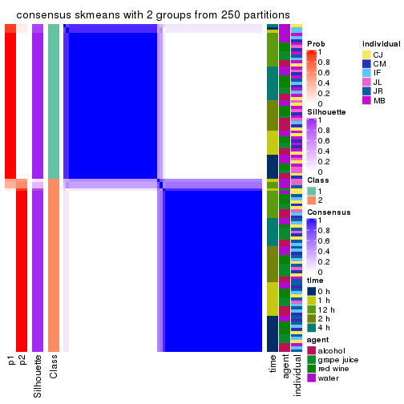</p>

</div>
<div id='tab-MAD-skmeans-consensus-heatmap-2'>
<pre><code class="r">consensus_heatmap(res, k = 3)
</code></pre>

<p>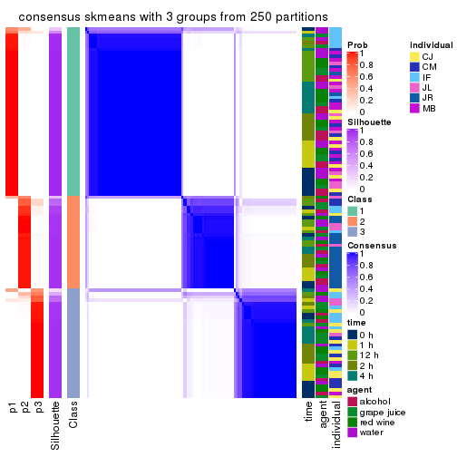</p>

</div>
<div id='tab-MAD-skmeans-consensus-heatmap-3'>
<pre><code class="r">consensus_heatmap(res, k = 4)
</code></pre>

<p>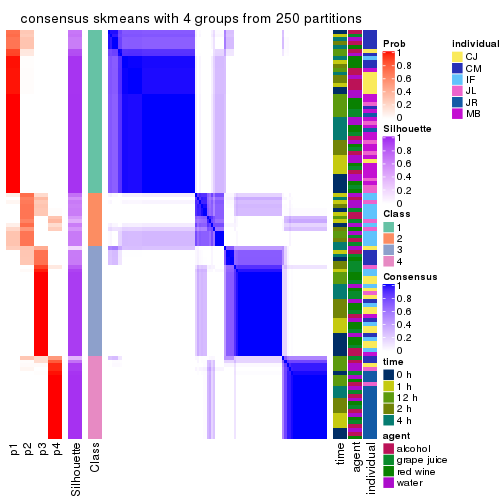</p>

</div>
<div id='tab-MAD-skmeans-consensus-heatmap-4'>
<pre><code class="r">consensus_heatmap(res, k = 5)
</code></pre>

<p>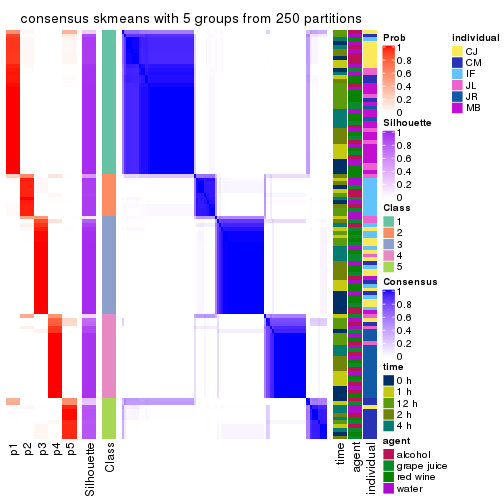</p>

</div>
<div id='tab-MAD-skmeans-consensus-heatmap-5'>
<pre><code class="r">consensus_heatmap(res, k = 6)
</code></pre>

<p>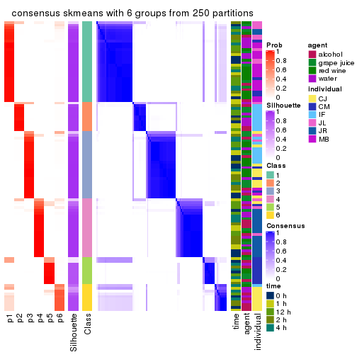</p>

</div>
</div>

Heatmaps for the membership of samples in all partitions to see how consistent they are:


<script>
$( function() {
	$( '#tabs-MAD-skmeans-membership-heatmap' ).tabs();
} );
</script>
<div id='tabs-MAD-skmeans-membership-heatmap'>
<ul>
<li><a href='#tab-MAD-skmeans-membership-heatmap-1'>k = 2</a></li>
<li><a href='#tab-MAD-skmeans-membership-heatmap-2'>k = 3</a></li>
<li><a href='#tab-MAD-skmeans-membership-heatmap-3'>k = 4</a></li>
<li><a href='#tab-MAD-skmeans-membership-heatmap-4'>k = 5</a></li>
<li><a href='#tab-MAD-skmeans-membership-heatmap-5'>k = 6</a></li>
</ul>
<div id='tab-MAD-skmeans-membership-heatmap-1'>
<pre><code class="r">membership_heatmap(res, k = 2)
</code></pre>

<p>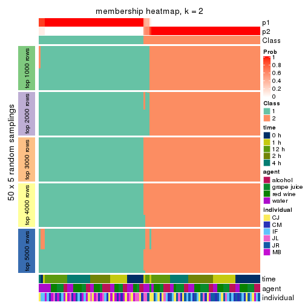</p>

</div>
<div id='tab-MAD-skmeans-membership-heatmap-2'>
<pre><code class="r">membership_heatmap(res, k = 3)
</code></pre>

<p>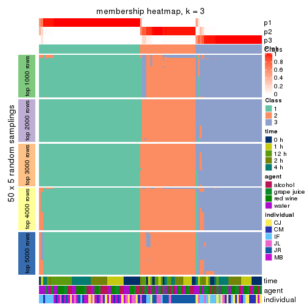</p>

</div>
<div id='tab-MAD-skmeans-membership-heatmap-3'>
<pre><code class="r">membership_heatmap(res, k = 4)
</code></pre>

<p>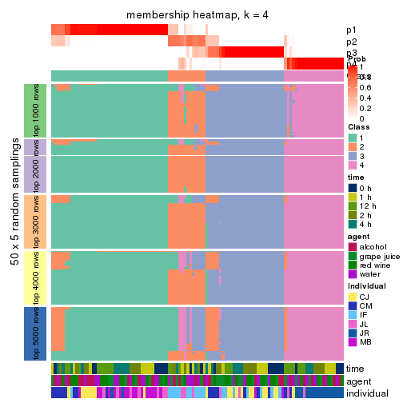</p>

</div>
<div id='tab-MAD-skmeans-membership-heatmap-4'>
<pre><code class="r">membership_heatmap(res, k = 5)
</code></pre>

<p>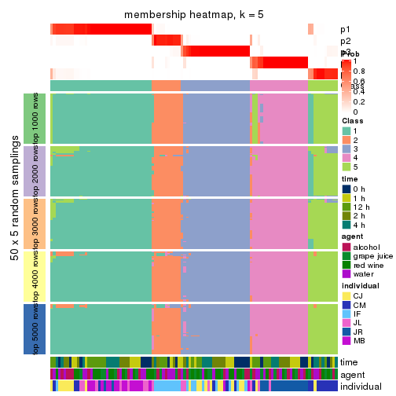</p>

</div>
<div id='tab-MAD-skmeans-membership-heatmap-5'>
<pre><code class="r">membership_heatmap(res, k = 6)
</code></pre>

<p>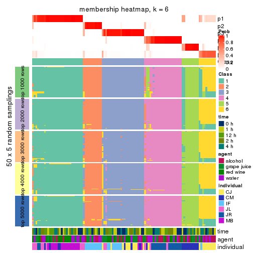</p>

</div>
</div>

As soon as we have had the classes for columns, we can look for signatures
which are significantly different between classes which can be candidate marks
for certain classes. Following are the heatmaps for signatures.


Signature heatmaps where rows are scaled:


<script>
$( function() {
	$( '#tabs-MAD-skmeans-get-signatures' ).tabs();
} );
</script>
<div id='tabs-MAD-skmeans-get-signatures'>
<ul>
<li><a href='#tab-MAD-skmeans-get-signatures-1'>k = 2</a></li>
<li><a href='#tab-MAD-skmeans-get-signatures-2'>k = 3</a></li>
<li><a href='#tab-MAD-skmeans-get-signatures-3'>k = 4</a></li>
<li><a href='#tab-MAD-skmeans-get-signatures-4'>k = 5</a></li>
<li><a href='#tab-MAD-skmeans-get-signatures-5'>k = 6</a></li>
</ul>
<div id='tab-MAD-skmeans-get-signatures-1'>
<pre><code class="r">get_signatures(res, k = 2)
</code></pre>

<p>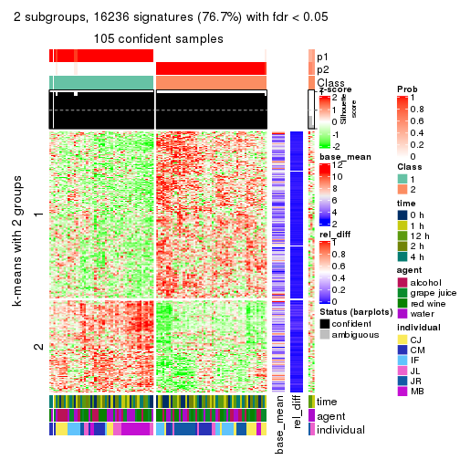</p>

</div>
<div id='tab-MAD-skmeans-get-signatures-2'>
<pre><code class="r">get_signatures(res, k = 3)
</code></pre>

<p>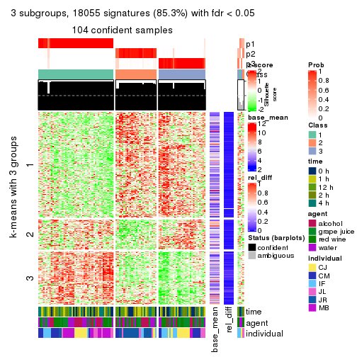</p>

</div>
<div id='tab-MAD-skmeans-get-signatures-3'>
<pre><code class="r">get_signatures(res, k = 4)
</code></pre>

<p>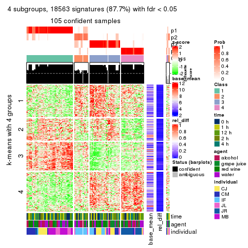</p>

</div>
<div id='tab-MAD-skmeans-get-signatures-4'>
<pre><code class="r">get_signatures(res, k = 5)
</code></pre>

<p>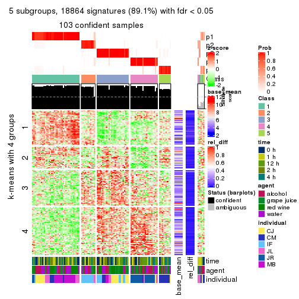</p>

</div>
<div id='tab-MAD-skmeans-get-signatures-5'>
<pre><code class="r">get_signatures(res, k = 6)
</code></pre>

<p>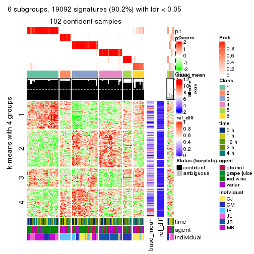</p>

</div>
</div>


Signature heatmaps where rows are not scaled:


<script>
$( function() {
	$( '#tabs-MAD-skmeans-get-signatures-no-scale' ).tabs();
} );
</script>
<div id='tabs-MAD-skmeans-get-signatures-no-scale'>
<ul>
<li><a href='#tab-MAD-skmeans-get-signatures-no-scale-1'>k = 2</a></li>
<li><a href='#tab-MAD-skmeans-get-signatures-no-scale-2'>k = 3</a></li>
<li><a href='#tab-MAD-skmeans-get-signatures-no-scale-3'>k = 4</a></li>
<li><a href='#tab-MAD-skmeans-get-signatures-no-scale-4'>k = 5</a></li>
<li><a href='#tab-MAD-skmeans-get-signatures-no-scale-5'>k = 6</a></li>
</ul>
<div id='tab-MAD-skmeans-get-signatures-no-scale-1'>
<pre><code class="r">get_signatures(res, k = 2, scale_rows = FALSE)
</code></pre>

<p>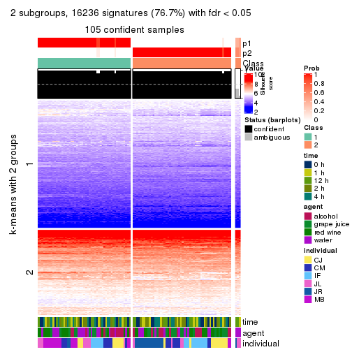</p>

</div>
<div id='tab-MAD-skmeans-get-signatures-no-scale-2'>
<pre><code class="r">get_signatures(res, k = 3, scale_rows = FALSE)
</code></pre>

<p>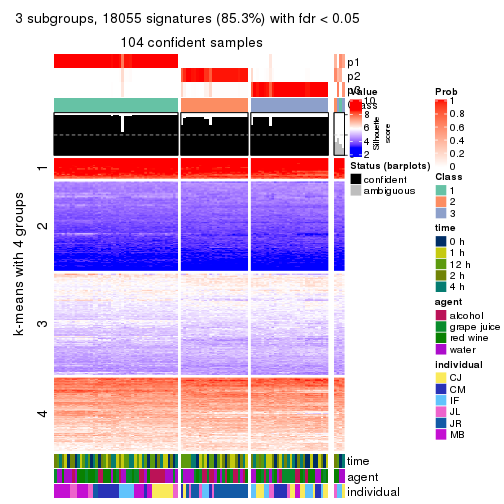</p>

</div>
<div id='tab-MAD-skmeans-get-signatures-no-scale-3'>
<pre><code class="r">get_signatures(res, k = 4, scale_rows = FALSE)
</code></pre>

<p>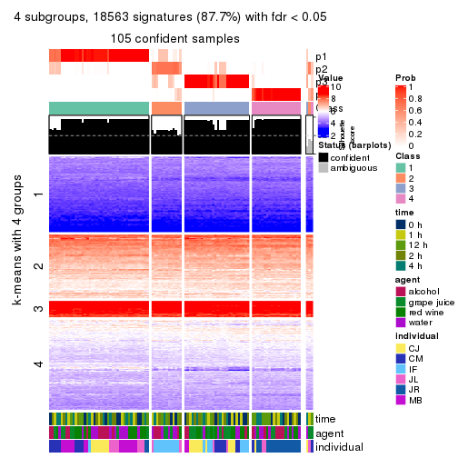</p>

</div>
<div id='tab-MAD-skmeans-get-signatures-no-scale-4'>
<pre><code class="r">get_signatures(res, k = 5, scale_rows = FALSE)
</code></pre>

<p>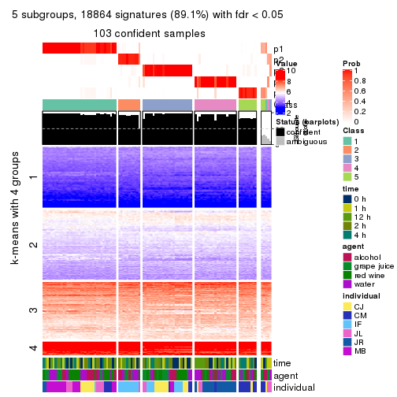</p>

</div>
<div id='tab-MAD-skmeans-get-signatures-no-scale-5'>
<pre><code class="r">get_signatures(res, k = 6, scale_rows = FALSE)
</code></pre>

<p>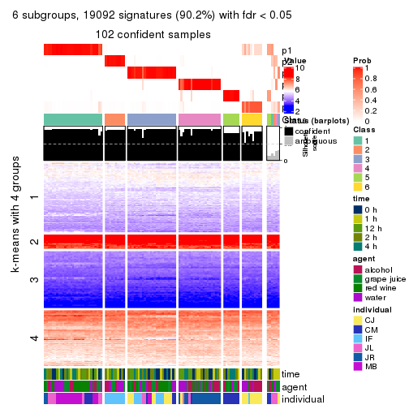</p>

</div>
</div>


Compare the overlap of signatures from different k:

```r
compare_signatures(res)
```

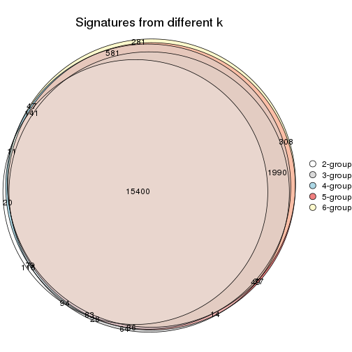

`get_signature()` returns a data frame invisibly. TO get the list of signatures, the function
call should be assigned to a variable explicitly. In following code, if `plot` argument is set
to `FALSE`, no heatmap is plotted while only the differential analysis is performed.

```r
# code only for demonstration
tb = get_signature(res, k = ..., plot = FALSE)
```

An example of the output of `tb` is:

```
#>   which_row         fdr    mean_1    mean_2 scaled_mean_1 scaled_mean_2 km
#> 1        38 0.042760348  8.373488  9.131774    -0.5533452     0.5164555  1
#> 2        40 0.018707592  7.106213  8.469186    -0.6173731     0.5762149  1
#> 3        55 0.019134737 10.221463 11.207825    -0.6159697     0.5749050  1
#> 4        59 0.006059896  5.921854  7.869574    -0.6899429     0.6439467  1
#> 5        60 0.018055526  8.928898 10.211722    -0.6204761     0.5791110  1
#> 6        98 0.009384629 15.714769 14.887706     0.6635654    -0.6193277  2
...
```

The columns in `tb` are:

1. `which_row`: row indices corresponding to the input matrix.
2. `fdr`: FDR for the differential test. 
3. `mean_x`: The mean value in group x.
4. `scaled_mean_x`: The mean value in group x after rows are scaled.
5. `km`: Row groups if k-means clustering is applied to rows.


UMAP plot which shows how samples are separated.


<script>
$( function() {
	$( '#tabs-MAD-skmeans-dimension-reduction' ).tabs();
} );
</script>
<div id='tabs-MAD-skmeans-dimension-reduction'>
<ul>
<li><a href='#tab-MAD-skmeans-dimension-reduction-1'>k = 2</a></li>
<li><a href='#tab-MAD-skmeans-dimension-reduction-2'>k = 3</a></li>
<li><a href='#tab-MAD-skmeans-dimension-reduction-3'>k = 4</a></li>
<li><a href='#tab-MAD-skmeans-dimension-reduction-4'>k = 5</a></li>
<li><a href='#tab-MAD-skmeans-dimension-reduction-5'>k = 6</a></li>
</ul>
<div id='tab-MAD-skmeans-dimension-reduction-1'>
<pre><code class="r">dimension_reduction(res, k = 2, method = &quot;UMAP&quot;)
</code></pre>

<p>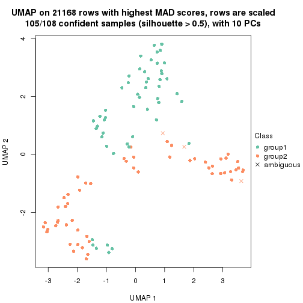</p>

</div>
<div id='tab-MAD-skmeans-dimension-reduction-2'>
<pre><code class="r">dimension_reduction(res, k = 3, method = &quot;UMAP&quot;)
</code></pre>

<p>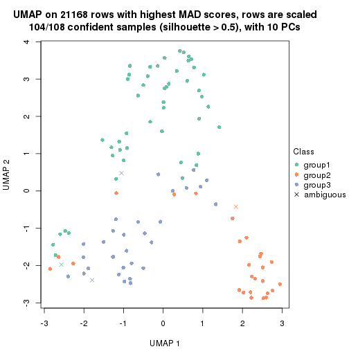</p>

</div>
<div id='tab-MAD-skmeans-dimension-reduction-3'>
<pre><code class="r">dimension_reduction(res, k = 4, method = &quot;UMAP&quot;)
</code></pre>

<p>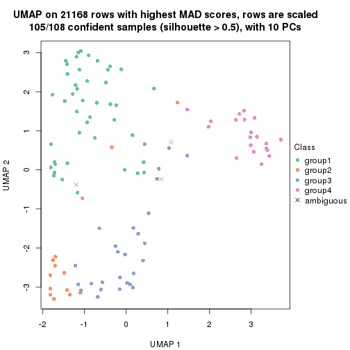</p>

</div>
<div id='tab-MAD-skmeans-dimension-reduction-4'>
<pre><code class="r">dimension_reduction(res, k = 5, method = &quot;UMAP&quot;)
</code></pre>

<p>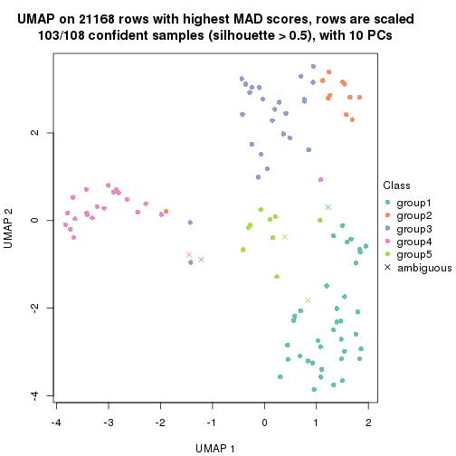</p>

</div>
<div id='tab-MAD-skmeans-dimension-reduction-5'>
<pre><code class="r">dimension_reduction(res, k = 6, method = &quot;UMAP&quot;)
</code></pre>

<p>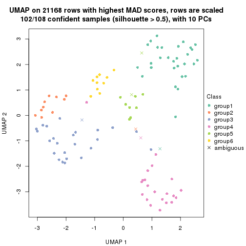</p>

</div>
</div>


Following heatmap shows how subgroups are split when increasing `k`:

```r
collect_classes(res)
```

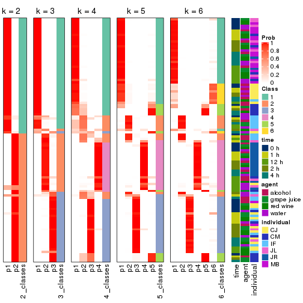


Test correlation between subgroups and known annotations. If the known
annotation is numeric, one-way ANOVA test is applied, and if the known
annotation is discrete, chi-squared contingency table test is applied.

```r
test_to_known_factors(res)
```

```
#>               n time(p) agent(p) individual(p) k
#> MAD:skmeans 105   0.812    0.283      1.69e-04 2
#> MAD:skmeans 104   0.523    0.575      1.17e-10 3
#> MAD:skmeans 105   0.985    0.312      3.98e-21 4
#> MAD:skmeans 103   0.969    0.774      3.43e-26 5
#> MAD:skmeans 102   0.997    0.228      4.26e-35 6
```


If matrix rows can be associated to genes, consider to use `GO_Enrichment(res,
...)` to perform function enrichment for the signature genes.


 

---------------------------------------------------


### MAD:pam*


The object with results only for a single top-value method and a single partition method 
can be extracted as:

```r
res = res_list["MAD", "pam"]
# you can also extract it by
# res = res_list["MAD:pam"]
```

A summary of `res` and all the functions that can be applied to it:

```r
res
```

```
#> A 'ConsensusPartition' object with k = 2, 3, 4, 5, 6.
#>   On a matrix with 21168 rows and 108 columns.
#>   Top rows (1000, 2000, 3000, 4000, 5000) are extracted by 'MAD' method.
#>   Subgroups are detected by 'pam' method.
#>   Performed in total 1250 partitions by row resampling.
#>   Best k for subgroups seems to be 6.
#> 
#> Following methods can be applied to this 'ConsensusPartition' object:
#>  [1] "cola_report"             "collect_classes"         "collect_plots"          
#>  [4] "collect_stats"           "colnames"                "compare_signatures"     
#>  [7] "consensus_heatmap"       "dimension_reduction"     "functional_enrichment"  
#> [10] "get_anno_col"            "get_anno"                "get_classes"            
#> [13] "get_consensus"           "get_matrix"              "get_membership"         
#> [16] "get_param"               "get_signatures"          "get_stats"              
#> [19] "is_best_k"               "is_stable_k"             "membership_heatmap"     
#> [22] "ncol"                    "nrow"                    "plot_ecdf"              
#> [25] "rownames"                "select_partition_number" "show"                   
#> [28] "suggest_best_k"          "test_to_known_factors"
```

`collect_plots()` function collects all the plots made from `res` for all `k` (number of partitions)
into one single page to provide an easy and fast comparison between different `k`.

```r
collect_plots(res)
```

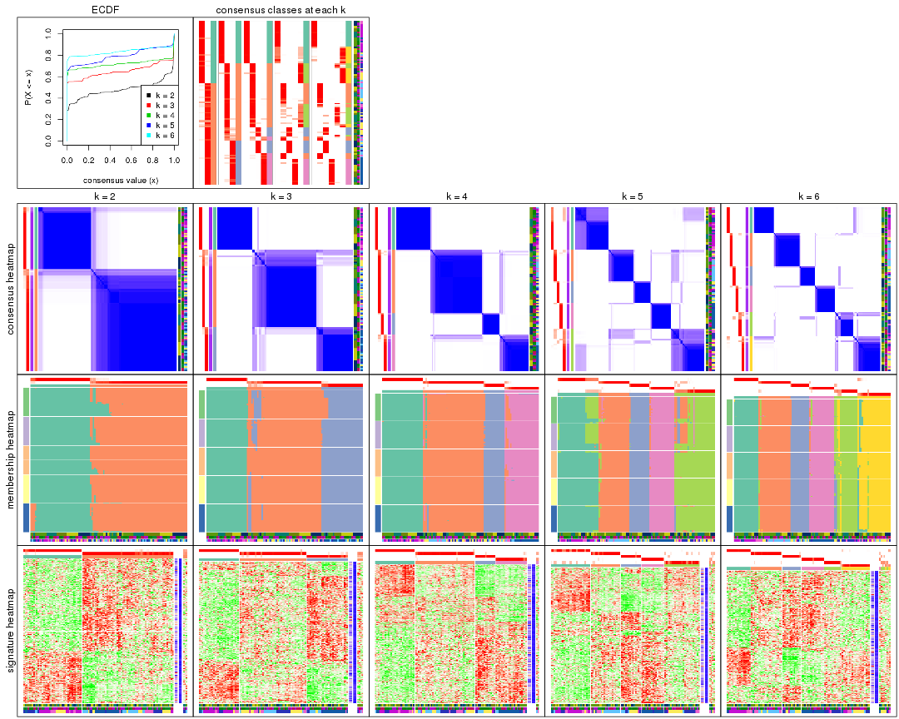

The plots are:

- The first row: a plot of the ECDF (Empirical cumulative distribution
  function) curves of the consensus matrix for each `k` and the heatmap of
  predicted classes for each `k`.
- The second row: heatmaps of the consensus matrix for each `k`.
- The third row: heatmaps of the membership matrix for each `k`.
- The fouth row: heatmaps of the signatures for each `k`.

All the plots in panels can be made by individual functions and they are
plotted later in this section.

`select_partition_number()` produces several plots showing different
statistics for choosing "optimized" `k`. There are following statistics:

- ECDF curves of the consensus matrix for each `k`;
- 1-PAC. [The PAC
  score](https://en.wikipedia.org/wiki/Consensus_clustering#Over-interpretation_potential_of_consensus_clustering)
  measures the proportion of the ambiguous subgrouping.
- Mean silhouette score.
- Concordance. The mean probability of fiting the consensus class ids in all
  partitions.
- Area increased. Denote $A_k$ as the area under the ECDF curve for current
  `k`, the area increased is defined as $A_k - A_{k-1}$.
- Rand index. The percent of pairs of samples that are both in a same cluster
  or both are not in a same cluster in the partition of k and k-1.
- Jaccard index. The ratio of pairs of samples are both in a same cluster in
  the partition of k and k-1 and the pairs of samples are both in a same
  cluster in the partition k or k-1.

The detailed explanations of these statistics can be found in [the cola
vignette](http://bioconductor.org/packages/devel/bioc/vignettes/cola/inst/doc/cola.html#toc_13).

Generally speaking, lower PAC score, higher mean silhouette score or higher
concordance corresponds to better partition. Rand index and Jaccard index
measure how similar the current partition is compared to partition with `k-1`.
If they are too similar, we won't accept `k` is better than `k-1`.

```r
select_partition_number(res)
```

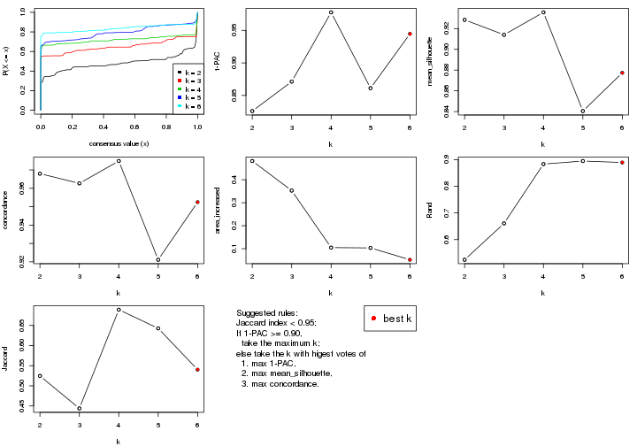

The numeric values for all these statistics can be obtained by `get_stats()`.

```r
get_stats(res)
```

```
#>   k 1-PAC mean_silhouette concordance area_increased  Rand Jaccard
#> 2 2 0.826           0.928       0.968          0.481 0.525   0.525
#> 3 3 0.871           0.914       0.963          0.353 0.661   0.444
#> 4 4 0.978           0.936       0.975          0.105 0.883   0.689
#> 5 5 0.861           0.840       0.921          0.103 0.895   0.643
#> 6 6 0.945           0.877       0.952          0.052 0.889   0.540
```

`suggest_best_k()` suggests the best $k$ based on these statistics. The rules are as follows:

- All $k$ with Jaccard index larger than 0.95 are removed because the increase of
  the partition number does not provides enough extra information. If all $k$ are removed,
  the best $k$ is assigned by `NA`.
- For $k$ with 1-PAC larger than 0.9, the maximal $k$ is taken as the "best k". Other $k$ is called "optional k".
- If it does not fit the second rule. The $k$ with the highest vote of highest
  1-PAC, mean silhouette and concordance is taken as the "best k".

```r
suggest_best_k(res)
```

```
#> [1] 6
#> attr(,"optional")
#> [1] 4
```

There is also optional best $k$ = 4 that is worth to check.

Following shows the table of the partitions (You need to click the **show/hide
code output** link to see it). The membership matrix (columns with name `p*`)
is inferred by
[`clue::cl_consensus()`](https://www.rdocumentation.org/link/cl_consensus?package=clue)
function with the `SE` method. Basically the value in the membership matrix
represents the probability to belong to a certain group. The finall class
label for an item is determined with the group with highest probability it
belongs to.

In `get_classes()` function, the entropy is calculated from the membership
matrix and the silhouette score is calculated from the consensus matrix.


<script>
$( function() {
	$( '#tabs-MAD-pam-get-classes' ).tabs();
} );
</script>
<div id='tabs-MAD-pam-get-classes'>
<ul>
<li><a href='#tab-MAD-pam-get-classes-1'>k = 2</a></li>
<li><a href='#tab-MAD-pam-get-classes-2'>k = 3</a></li>
<li><a href='#tab-MAD-pam-get-classes-3'>k = 4</a></li>
<li><a href='#tab-MAD-pam-get-classes-4'>k = 5</a></li>
<li><a href='#tab-MAD-pam-get-classes-5'>k = 6</a></li>
</ul>

<div id='tab-MAD-pam-get-classes-1'>
<p><a id='tab-MAD-pam-get-classes-1-a' style='color:#0366d6' href='#'>show/hide code output</a></p>
<pre><code class="r">cbind(get_classes(res, k = 2), get_membership(res, k = 2))
</code></pre>

<pre><code>#&gt;          class entropy silhouette    p1    p2
#&gt; GSM87863     1  0.0000      0.983 1.000 0.000
#&gt; GSM87887     1  0.0000      0.983 1.000 0.000
#&gt; GSM87896     2  0.0000      0.957 0.000 1.000
#&gt; GSM87934     2  0.0000      0.957 0.000 1.000
#&gt; GSM87943     2  0.0938      0.951 0.012 0.988
#&gt; GSM87853     2  0.0000      0.957 0.000 1.000
#&gt; GSM87906     2  0.0000      0.957 0.000 1.000
#&gt; GSM87920     1  0.0000      0.983 1.000 0.000
#&gt; GSM87924     2  0.0000      0.957 0.000 1.000
#&gt; GSM87858     2  0.0000      0.957 0.000 1.000
#&gt; GSM87882     2  0.0938      0.951 0.012 0.988
#&gt; GSM87891     2  0.0000      0.957 0.000 1.000
#&gt; GSM87917     1  0.0000      0.983 1.000 0.000
#&gt; GSM87929     2  0.0000      0.957 0.000 1.000
#&gt; GSM87948     1  0.0000      0.983 1.000 0.000
#&gt; GSM87868     1  0.0000      0.983 1.000 0.000
#&gt; GSM87873     2  0.0000      0.957 0.000 1.000
#&gt; GSM87901     2  0.4690      0.885 0.100 0.900
#&gt; GSM87910     1  0.0000      0.983 1.000 0.000
#&gt; GSM87938     2  0.0000      0.957 0.000 1.000
#&gt; GSM87953     1  0.0000      0.983 1.000 0.000
#&gt; GSM87864     1  0.0000      0.983 1.000 0.000
#&gt; GSM87888     2  0.0938      0.951 0.012 0.988
#&gt; GSM87897     2  0.0000      0.957 0.000 1.000
#&gt; GSM87935     2  0.0000      0.957 0.000 1.000
#&gt; GSM87944     1  0.0000      0.983 1.000 0.000
#&gt; GSM87854     2  0.5294      0.866 0.120 0.880
#&gt; GSM87878     1  0.0000      0.983 1.000 0.000
#&gt; GSM87907     2  0.0000      0.957 0.000 1.000
#&gt; GSM87921     2  0.0376      0.955 0.004 0.996
#&gt; GSM87925     2  0.0000      0.957 0.000 1.000
#&gt; GSM87957     1  0.0000      0.983 1.000 0.000
#&gt; GSM87859     2  0.0000      0.957 0.000 1.000
#&gt; GSM87883     1  0.0000      0.983 1.000 0.000
#&gt; GSM87892     2  0.0000      0.957 0.000 1.000
#&gt; GSM87930     2  0.0000      0.957 0.000 1.000
#&gt; GSM87949     1  0.0000      0.983 1.000 0.000
#&gt; GSM87869     1  0.0000      0.983 1.000 0.000
#&gt; GSM87874     2  0.0000      0.957 0.000 1.000
#&gt; GSM87902     2  0.4562      0.888 0.096 0.904
#&gt; GSM87911     2  0.4690      0.885 0.100 0.900
#&gt; GSM87939     2  0.0000      0.957 0.000 1.000
#&gt; GSM87954     1  0.0000      0.983 1.000 0.000
#&gt; GSM87865     1  0.0000      0.983 1.000 0.000
#&gt; GSM87889     1  0.3584      0.916 0.932 0.068
#&gt; GSM87898     1  0.7056      0.758 0.808 0.192
#&gt; GSM87915     1  0.0000      0.983 1.000 0.000
#&gt; GSM87936     2  0.0000      0.957 0.000 1.000
#&gt; GSM87945     2  0.0000      0.957 0.000 1.000
#&gt; GSM87855     2  0.0000      0.957 0.000 1.000
#&gt; GSM87879     2  0.0938      0.951 0.012 0.988
#&gt; GSM87922     2  0.0000      0.957 0.000 1.000
#&gt; GSM87926     2  0.0000      0.957 0.000 1.000
#&gt; GSM87958     1  0.0000      0.983 1.000 0.000
#&gt; GSM87860     2  0.0000      0.957 0.000 1.000
#&gt; GSM87884     1  0.0000      0.983 1.000 0.000
#&gt; GSM87893     2  0.0000      0.957 0.000 1.000
#&gt; GSM87918     2  0.5178      0.868 0.116 0.884
#&gt; GSM87931     2  0.0000      0.957 0.000 1.000
#&gt; GSM87950     1  0.0000      0.983 1.000 0.000
#&gt; GSM87870     1  0.0000      0.983 1.000 0.000
#&gt; GSM87875     2  0.0000      0.957 0.000 1.000
#&gt; GSM87903     2  0.0000      0.957 0.000 1.000
#&gt; GSM87912     1  0.0000      0.983 1.000 0.000
#&gt; GSM87940     2  0.0000      0.957 0.000 1.000
#&gt; GSM87866     1  0.0000      0.983 1.000 0.000
#&gt; GSM87899     2  0.0000      0.957 0.000 1.000
#&gt; GSM87937     2  0.0000      0.957 0.000 1.000
#&gt; GSM87946     1  0.0000      0.983 1.000 0.000
#&gt; GSM87856     2  0.0938      0.951 0.012 0.988
#&gt; GSM87880     2  0.1843      0.941 0.028 0.972
#&gt; GSM87908     2  0.0938      0.951 0.012 0.988
#&gt; GSM87923     2  0.0000      0.957 0.000 1.000
#&gt; GSM87927     2  0.0000      0.957 0.000 1.000
#&gt; GSM87959     1  0.0000      0.983 1.000 0.000
#&gt; GSM87861     2  0.0000      0.957 0.000 1.000
#&gt; GSM87885     2  0.9833      0.318 0.424 0.576
#&gt; GSM87894     1  0.0000      0.983 1.000 0.000
#&gt; GSM87932     1  0.7056      0.758 0.808 0.192
#&gt; GSM87951     1  0.0000      0.983 1.000 0.000
#&gt; GSM87871     2  0.6148      0.830 0.152 0.848
#&gt; GSM87876     2  0.9998      0.105 0.492 0.508
#&gt; GSM87904     2  0.0000      0.957 0.000 1.000
#&gt; GSM87913     1  0.0000      0.983 1.000 0.000
#&gt; GSM87941     2  0.0000      0.957 0.000 1.000
#&gt; GSM87955     1  0.0000      0.983 1.000 0.000
#&gt; GSM87867     2  0.8955      0.595 0.312 0.688
#&gt; GSM87890     2  0.0000      0.957 0.000 1.000
#&gt; GSM87900     2  0.0000      0.957 0.000 1.000
#&gt; GSM87916     2  0.0000      0.957 0.000 1.000
#&gt; GSM87947     1  0.0000      0.983 1.000 0.000
#&gt; GSM87857     2  0.0938      0.951 0.012 0.988
#&gt; GSM87881     2  0.0000      0.957 0.000 1.000
#&gt; GSM87909     2  0.5842      0.844 0.140 0.860
#&gt; GSM87928     1  0.7056      0.758 0.808 0.192
#&gt; GSM87960     1  0.0000      0.983 1.000 0.000
#&gt; GSM87862     2  0.0000      0.957 0.000 1.000
#&gt; GSM87886     1  0.0000      0.983 1.000 0.000
#&gt; GSM87895     2  0.0000      0.957 0.000 1.000
#&gt; GSM87919     1  0.0000      0.983 1.000 0.000
#&gt; GSM87933     2  0.0000      0.957 0.000 1.000
#&gt; GSM87952     1  0.0000      0.983 1.000 0.000
#&gt; GSM87872     2  0.1414      0.946 0.020 0.980
#&gt; GSM87877     1  0.0000      0.983 1.000 0.000
#&gt; GSM87905     2  0.9896      0.269 0.440 0.560
#&gt; GSM87914     2  0.4298      0.894 0.088 0.912
#&gt; GSM87942     2  0.4690      0.884 0.100 0.900
#&gt; GSM87956     1  0.0000      0.983 1.000 0.000
</code></pre>

<script>
$('#tab-MAD-pam-get-classes-1-a').parent().next().next().hide();
$('#tab-MAD-pam-get-classes-1-a').click(function(){
  $('#tab-MAD-pam-get-classes-1-a').parent().next().next().toggle();
  return(false);
});
</script>
</div>

<div id='tab-MAD-pam-get-classes-2'>
<p><a id='tab-MAD-pam-get-classes-2-a' style='color:#0366d6' href='#'>show/hide code output</a></p>
<pre><code class="r">cbind(get_classes(res, k = 3), get_membership(res, k = 3))
</code></pre>

<pre><code>#&gt;          class entropy silhouette    p1    p2    p3
#&gt; GSM87863     2  0.0000      0.934 0.000 1.000 0.000
#&gt; GSM87887     2  0.0000      0.934 0.000 1.000 0.000
#&gt; GSM87896     3  0.0000      0.962 0.000 0.000 1.000
#&gt; GSM87934     3  0.0000      0.962 0.000 0.000 1.000
#&gt; GSM87943     2  0.0000      0.934 0.000 1.000 0.000
#&gt; GSM87853     2  0.4702      0.737 0.000 0.788 0.212
#&gt; GSM87906     2  0.0000      0.934 0.000 1.000 0.000
#&gt; GSM87920     2  0.0000      0.934 0.000 1.000 0.000
#&gt; GSM87924     3  0.0000      0.962 0.000 0.000 1.000
#&gt; GSM87858     3  0.0000      0.962 0.000 0.000 1.000
#&gt; GSM87882     2  0.0000      0.934 0.000 1.000 0.000
#&gt; GSM87891     3  0.0000      0.962 0.000 0.000 1.000
#&gt; GSM87917     1  0.0000      1.000 1.000 0.000 0.000
#&gt; GSM87929     3  0.3816      0.827 0.000 0.148 0.852
#&gt; GSM87948     1  0.0000      1.000 1.000 0.000 0.000
#&gt; GSM87868     2  0.5706      0.539 0.320 0.680 0.000
#&gt; GSM87873     3  0.0000      0.962 0.000 0.000 1.000
#&gt; GSM87901     2  0.0000      0.934 0.000 1.000 0.000
#&gt; GSM87910     1  0.0000      1.000 1.000 0.000 0.000
#&gt; GSM87938     3  0.0000      0.962 0.000 0.000 1.000
#&gt; GSM87953     1  0.0000      1.000 1.000 0.000 0.000
#&gt; GSM87864     2  0.0000      0.934 0.000 1.000 0.000
#&gt; GSM87888     2  0.0000      0.934 0.000 1.000 0.000
#&gt; GSM87897     2  0.0000      0.934 0.000 1.000 0.000
#&gt; GSM87935     3  0.0000      0.962 0.000 0.000 1.000
#&gt; GSM87944     1  0.0000      1.000 1.000 0.000 0.000
#&gt; GSM87854     2  0.0000      0.934 0.000 1.000 0.000
#&gt; GSM87878     2  0.0000      0.934 0.000 1.000 0.000
#&gt; GSM87907     3  0.0000      0.962 0.000 0.000 1.000
#&gt; GSM87921     2  0.0000      0.934 0.000 1.000 0.000
#&gt; GSM87925     3  0.0000      0.962 0.000 0.000 1.000
#&gt; GSM87957     1  0.0000      1.000 1.000 0.000 0.000
#&gt; GSM87859     3  0.0000      0.962 0.000 0.000 1.000
#&gt; GSM87883     1  0.0000      1.000 1.000 0.000 0.000
#&gt; GSM87892     3  0.0000      0.962 0.000 0.000 1.000
#&gt; GSM87930     3  0.0000      0.962 0.000 0.000 1.000
#&gt; GSM87949     1  0.0000      1.000 1.000 0.000 0.000
#&gt; GSM87869     1  0.0000      1.000 1.000 0.000 0.000
#&gt; GSM87874     3  0.0000      0.962 0.000 0.000 1.000
#&gt; GSM87902     2  0.0000      0.934 0.000 1.000 0.000
#&gt; GSM87911     2  0.0000      0.934 0.000 1.000 0.000
#&gt; GSM87939     3  0.0000      0.962 0.000 0.000 1.000
#&gt; GSM87954     1  0.0000      1.000 1.000 0.000 0.000
#&gt; GSM87865     2  0.0000      0.934 0.000 1.000 0.000
#&gt; GSM87889     2  0.0000      0.934 0.000 1.000 0.000
#&gt; GSM87898     1  0.0237      0.995 0.996 0.004 0.000
#&gt; GSM87915     1  0.0000      1.000 1.000 0.000 0.000
#&gt; GSM87936     3  0.0000      0.962 0.000 0.000 1.000
#&gt; GSM87945     2  0.5988      0.479 0.000 0.632 0.368
#&gt; GSM87855     2  0.3879      0.801 0.000 0.848 0.152
#&gt; GSM87879     2  0.0000      0.934 0.000 1.000 0.000
#&gt; GSM87922     2  0.4931      0.698 0.000 0.768 0.232
#&gt; GSM87926     3  0.0000      0.962 0.000 0.000 1.000
#&gt; GSM87958     1  0.0000      1.000 1.000 0.000 0.000
#&gt; GSM87860     2  0.0000      0.934 0.000 1.000 0.000
#&gt; GSM87884     1  0.0000      1.000 1.000 0.000 0.000
#&gt; GSM87893     3  0.0000      0.962 0.000 0.000 1.000
#&gt; GSM87918     2  0.0000      0.934 0.000 1.000 0.000
#&gt; GSM87931     3  0.0000      0.962 0.000 0.000 1.000
#&gt; GSM87950     1  0.0000      1.000 1.000 0.000 0.000
#&gt; GSM87870     2  0.0000      0.934 0.000 1.000 0.000
#&gt; GSM87875     2  0.6192      0.355 0.000 0.580 0.420
#&gt; GSM87903     2  0.0000      0.934 0.000 1.000 0.000
#&gt; GSM87912     1  0.0000      1.000 1.000 0.000 0.000
#&gt; GSM87940     3  0.0000      0.962 0.000 0.000 1.000
#&gt; GSM87866     2  0.0000      0.934 0.000 1.000 0.000
#&gt; GSM87899     2  0.0000      0.934 0.000 1.000 0.000
#&gt; GSM87937     3  0.0000      0.962 0.000 0.000 1.000
#&gt; GSM87946     1  0.0000      1.000 1.000 0.000 0.000
#&gt; GSM87856     2  0.0000      0.934 0.000 1.000 0.000
#&gt; GSM87880     2  0.0000      0.934 0.000 1.000 0.000
#&gt; GSM87908     2  0.0000      0.934 0.000 1.000 0.000
#&gt; GSM87923     2  0.4796      0.724 0.000 0.780 0.220
#&gt; GSM87927     3  0.3816      0.827 0.000 0.148 0.852
#&gt; GSM87959     1  0.0000      1.000 1.000 0.000 0.000
#&gt; GSM87861     2  0.4555      0.751 0.000 0.800 0.200
#&gt; GSM87885     2  0.0000      0.934 0.000 1.000 0.000
#&gt; GSM87894     2  0.0000      0.934 0.000 1.000 0.000
#&gt; GSM87932     1  0.0000      1.000 1.000 0.000 0.000
#&gt; GSM87951     1  0.0000      1.000 1.000 0.000 0.000
#&gt; GSM87871     2  0.0000      0.934 0.000 1.000 0.000
#&gt; GSM87876     2  0.0000      0.934 0.000 1.000 0.000
#&gt; GSM87904     2  0.0000      0.934 0.000 1.000 0.000
#&gt; GSM87913     2  0.0237      0.931 0.004 0.996 0.000
#&gt; GSM87941     3  0.3816      0.827 0.000 0.148 0.852
#&gt; GSM87955     1  0.0000      1.000 1.000 0.000 0.000
#&gt; GSM87867     2  0.0000      0.934 0.000 1.000 0.000
#&gt; GSM87890     3  0.0000      0.962 0.000 0.000 1.000
#&gt; GSM87900     2  0.6126      0.304 0.000 0.600 0.400
#&gt; GSM87916     3  0.4555      0.760 0.000 0.200 0.800
#&gt; GSM87947     1  0.0000      1.000 1.000 0.000 0.000
#&gt; GSM87857     2  0.0000      0.934 0.000 1.000 0.000
#&gt; GSM87881     2  0.0000      0.934 0.000 1.000 0.000
#&gt; GSM87909     2  0.0000      0.934 0.000 1.000 0.000
#&gt; GSM87928     1  0.0000      1.000 1.000 0.000 0.000
#&gt; GSM87960     1  0.0000      1.000 1.000 0.000 0.000
#&gt; GSM87862     2  0.3619      0.808 0.000 0.864 0.136
#&gt; GSM87886     1  0.0000      1.000 1.000 0.000 0.000
#&gt; GSM87895     3  0.0000      0.962 0.000 0.000 1.000
#&gt; GSM87919     1  0.0000      1.000 1.000 0.000 0.000
#&gt; GSM87933     3  0.0000      0.962 0.000 0.000 1.000
#&gt; GSM87952     1  0.0000      1.000 1.000 0.000 0.000
#&gt; GSM87872     2  0.0000      0.934 0.000 1.000 0.000
#&gt; GSM87877     2  0.0000      0.934 0.000 1.000 0.000
#&gt; GSM87905     2  0.0424      0.928 0.008 0.992 0.000
#&gt; GSM87914     2  0.6192      0.243 0.000 0.580 0.420
#&gt; GSM87942     3  0.5465      0.614 0.000 0.288 0.712
#&gt; GSM87956     1  0.0000      1.000 1.000 0.000 0.000
</code></pre>

<script>
$('#tab-MAD-pam-get-classes-2-a').parent().next().next().hide();
$('#tab-MAD-pam-get-classes-2-a').click(function(){
  $('#tab-MAD-pam-get-classes-2-a').parent().next().next().toggle();
  return(false);
});
</script>
</div>

<div id='tab-MAD-pam-get-classes-3'>
<p><a id='tab-MAD-pam-get-classes-3-a' style='color:#0366d6' href='#'>show/hide code output</a></p>
<pre><code class="r">cbind(get_classes(res, k = 4), get_membership(res, k = 4))
</code></pre>

<pre><code>#&gt;          class entropy silhouette    p1    p2    p3    p4
#&gt; GSM87863     2  0.0000      0.974 0.000 1.000 0.000 0.000
#&gt; GSM87887     2  0.0000      0.974 0.000 1.000 0.000 0.000
#&gt; GSM87896     3  0.0000      0.973 0.000 0.000 1.000 0.000
#&gt; GSM87934     4  0.0188      0.917 0.000 0.000 0.004 0.996
#&gt; GSM87943     2  0.0000      0.974 0.000 1.000 0.000 0.000
#&gt; GSM87853     3  0.0000      0.973 0.000 0.000 1.000 0.000
#&gt; GSM87906     2  0.0188      0.973 0.000 0.996 0.000 0.004
#&gt; GSM87920     2  0.0000      0.974 0.000 1.000 0.000 0.000
#&gt; GSM87924     4  0.0188      0.917 0.000 0.000 0.004 0.996
#&gt; GSM87858     3  0.0000      0.973 0.000 0.000 1.000 0.000
#&gt; GSM87882     2  0.0000      0.974 0.000 1.000 0.000 0.000
#&gt; GSM87891     3  0.0000      0.973 0.000 0.000 1.000 0.000
#&gt; GSM87917     1  0.0000      1.000 1.000 0.000 0.000 0.000
#&gt; GSM87929     4  0.0000      0.915 0.000 0.000 0.000 1.000
#&gt; GSM87948     1  0.0000      1.000 1.000 0.000 0.000 0.000
#&gt; GSM87868     2  0.4522      0.532 0.320 0.680 0.000 0.000
#&gt; GSM87873     3  0.0000      0.973 0.000 0.000 1.000 0.000
#&gt; GSM87901     2  0.0188      0.973 0.000 0.996 0.000 0.004
#&gt; GSM87910     1  0.0000      1.000 1.000 0.000 0.000 0.000
#&gt; GSM87938     4  0.0188      0.917 0.000 0.000 0.004 0.996
#&gt; GSM87953     1  0.0000      1.000 1.000 0.000 0.000 0.000
#&gt; GSM87864     2  0.0000      0.974 0.000 1.000 0.000 0.000
#&gt; GSM87888     2  0.0000      0.974 0.000 1.000 0.000 0.000
#&gt; GSM87897     2  0.0188      0.973 0.000 0.996 0.000 0.004
#&gt; GSM87935     4  0.0188      0.917 0.000 0.000 0.004 0.996
#&gt; GSM87944     1  0.0000      1.000 1.000 0.000 0.000 0.000
#&gt; GSM87854     2  0.0000      0.974 0.000 1.000 0.000 0.000
#&gt; GSM87878     2  0.0000      0.974 0.000 1.000 0.000 0.000
#&gt; GSM87907     4  0.0469      0.909 0.000 0.000 0.012 0.988
#&gt; GSM87921     2  0.0188      0.973 0.000 0.996 0.000 0.004
#&gt; GSM87925     4  0.0188      0.917 0.000 0.000 0.004 0.996
#&gt; GSM87957     1  0.0000      1.000 1.000 0.000 0.000 0.000
#&gt; GSM87859     3  0.0000      0.973 0.000 0.000 1.000 0.000
#&gt; GSM87883     1  0.0000      1.000 1.000 0.000 0.000 0.000
#&gt; GSM87892     3  0.0000      0.973 0.000 0.000 1.000 0.000
#&gt; GSM87930     4  0.0188      0.917 0.000 0.000 0.004 0.996
#&gt; GSM87949     1  0.0000      1.000 1.000 0.000 0.000 0.000
#&gt; GSM87869     1  0.0000      1.000 1.000 0.000 0.000 0.000
#&gt; GSM87874     3  0.0000      0.973 0.000 0.000 1.000 0.000
#&gt; GSM87902     2  0.0188      0.973 0.000 0.996 0.000 0.004
#&gt; GSM87911     2  0.0188      0.973 0.000 0.996 0.000 0.004
#&gt; GSM87939     4  0.0188      0.917 0.000 0.000 0.004 0.996
#&gt; GSM87954     1  0.0000      1.000 1.000 0.000 0.000 0.000
#&gt; GSM87865     2  0.0000      0.974 0.000 1.000 0.000 0.000
#&gt; GSM87889     2  0.0000      0.974 0.000 1.000 0.000 0.000
#&gt; GSM87898     1  0.0188      0.995 0.996 0.004 0.000 0.000
#&gt; GSM87915     1  0.0000      1.000 1.000 0.000 0.000 0.000
#&gt; GSM87936     4  0.0188      0.917 0.000 0.000 0.004 0.996
#&gt; GSM87945     3  0.0000      0.973 0.000 0.000 1.000 0.000
#&gt; GSM87855     3  0.0000      0.973 0.000 0.000 1.000 0.000
#&gt; GSM87879     2  0.0000      0.974 0.000 1.000 0.000 0.000
#&gt; GSM87922     4  0.4972      0.174 0.000 0.456 0.000 0.544
#&gt; GSM87926     4  0.0188      0.917 0.000 0.000 0.004 0.996
#&gt; GSM87958     1  0.0000      1.000 1.000 0.000 0.000 0.000
#&gt; GSM87860     3  0.4222      0.618 0.000 0.272 0.728 0.000
#&gt; GSM87884     1  0.0000      1.000 1.000 0.000 0.000 0.000
#&gt; GSM87893     3  0.0000      0.973 0.000 0.000 1.000 0.000
#&gt; GSM87918     2  0.0000      0.974 0.000 1.000 0.000 0.000
#&gt; GSM87931     4  0.0188      0.917 0.000 0.000 0.004 0.996
#&gt; GSM87950     1  0.0000      1.000 1.000 0.000 0.000 0.000
#&gt; GSM87870     2  0.0000      0.974 0.000 1.000 0.000 0.000
#&gt; GSM87875     3  0.0000      0.973 0.000 0.000 1.000 0.000
#&gt; GSM87903     2  0.0188      0.973 0.000 0.996 0.000 0.004
#&gt; GSM87912     1  0.0000      1.000 1.000 0.000 0.000 0.000
#&gt; GSM87940     4  0.0188      0.917 0.000 0.000 0.004 0.996
#&gt; GSM87866     2  0.0000      0.974 0.000 1.000 0.000 0.000
#&gt; GSM87899     2  0.0376      0.970 0.000 0.992 0.004 0.004
#&gt; GSM87937     4  0.0188      0.917 0.000 0.000 0.004 0.996
#&gt; GSM87946     1  0.0000      1.000 1.000 0.000 0.000 0.000
#&gt; GSM87856     2  0.0336      0.968 0.000 0.992 0.008 0.000
#&gt; GSM87880     2  0.0000      0.974 0.000 1.000 0.000 0.000
#&gt; GSM87908     2  0.0188      0.973 0.000 0.996 0.000 0.004
#&gt; GSM87923     2  0.4008      0.654 0.000 0.756 0.000 0.244
#&gt; GSM87927     4  0.0000      0.915 0.000 0.000 0.000 1.000
#&gt; GSM87959     1  0.0000      1.000 1.000 0.000 0.000 0.000
#&gt; GSM87861     3  0.0000      0.973 0.000 0.000 1.000 0.000
#&gt; GSM87885     2  0.0000      0.974 0.000 1.000 0.000 0.000
#&gt; GSM87894     2  0.0000      0.974 0.000 1.000 0.000 0.000
#&gt; GSM87932     1  0.0000      1.000 1.000 0.000 0.000 0.000
#&gt; GSM87951     1  0.0000      1.000 1.000 0.000 0.000 0.000
#&gt; GSM87871     2  0.0000      0.974 0.000 1.000 0.000 0.000
#&gt; GSM87876     2  0.0000      0.974 0.000 1.000 0.000 0.000
#&gt; GSM87904     2  0.0188      0.973 0.000 0.996 0.000 0.004
#&gt; GSM87913     2  0.0188      0.971 0.004 0.996 0.000 0.000
#&gt; GSM87941     4  0.0000      0.915 0.000 0.000 0.000 1.000
#&gt; GSM87955     1  0.0000      1.000 1.000 0.000 0.000 0.000
#&gt; GSM87867     2  0.0000      0.974 0.000 1.000 0.000 0.000
#&gt; GSM87890     4  0.0188      0.917 0.000 0.000 0.004 0.996
#&gt; GSM87900     4  0.4948      0.262 0.000 0.440 0.000 0.560
#&gt; GSM87916     4  0.2216      0.832 0.000 0.092 0.000 0.908
#&gt; GSM87947     1  0.0000      1.000 1.000 0.000 0.000 0.000
#&gt; GSM87857     2  0.3610      0.739 0.000 0.800 0.200 0.000
#&gt; GSM87881     2  0.0000      0.974 0.000 1.000 0.000 0.000
#&gt; GSM87909     2  0.0188      0.973 0.000 0.996 0.000 0.004
#&gt; GSM87928     1  0.0000      1.000 1.000 0.000 0.000 0.000
#&gt; GSM87960     1  0.0000      1.000 1.000 0.000 0.000 0.000
#&gt; GSM87862     2  0.2868      0.821 0.000 0.864 0.000 0.136
#&gt; GSM87886     1  0.0000      1.000 1.000 0.000 0.000 0.000
#&gt; GSM87895     4  0.0592      0.906 0.000 0.000 0.016 0.984
#&gt; GSM87919     1  0.0000      1.000 1.000 0.000 0.000 0.000
#&gt; GSM87933     4  0.0188      0.917 0.000 0.000 0.004 0.996
#&gt; GSM87952     1  0.0000      1.000 1.000 0.000 0.000 0.000
#&gt; GSM87872     2  0.0000      0.974 0.000 1.000 0.000 0.000
#&gt; GSM87877     2  0.0000      0.974 0.000 1.000 0.000 0.000
#&gt; GSM87905     2  0.0524      0.966 0.008 0.988 0.000 0.004
#&gt; GSM87914     4  0.4454      0.569 0.000 0.308 0.000 0.692
#&gt; GSM87942     4  0.2149      0.837 0.000 0.088 0.000 0.912
#&gt; GSM87956     1  0.0000      1.000 1.000 0.000 0.000 0.000
</code></pre>

<script>
$('#tab-MAD-pam-get-classes-3-a').parent().next().next().hide();
$('#tab-MAD-pam-get-classes-3-a').click(function(){
  $('#tab-MAD-pam-get-classes-3-a').parent().next().next().toggle();
  return(false);
});
</script>
</div>

<div id='tab-MAD-pam-get-classes-4'>
<p><a id='tab-MAD-pam-get-classes-4-a' style='color:#0366d6' href='#'>show/hide code output</a></p>
<pre><code class="r">cbind(get_classes(res, k = 5), get_membership(res, k = 5))
</code></pre>

<pre><code>#&gt;          class entropy silhouette    p1    p2    p3    p4    p5
#&gt; GSM87863     5  0.0000      0.833 0.000 0.000 0.000 0.000 1.000
#&gt; GSM87887     5  0.0000      0.833 0.000 0.000 0.000 0.000 1.000
#&gt; GSM87896     3  0.0000      0.981 0.000 0.000 1.000 0.000 0.000
#&gt; GSM87934     4  0.0000      0.969 0.000 0.000 0.000 1.000 0.000
#&gt; GSM87943     5  0.3913      0.522 0.000 0.000 0.324 0.000 0.676
#&gt; GSM87853     3  0.0000      0.981 0.000 0.000 1.000 0.000 0.000
#&gt; GSM87906     2  0.0000      0.957 0.000 1.000 0.000 0.000 0.000
#&gt; GSM87920     5  0.0000      0.833 0.000 0.000 0.000 0.000 1.000
#&gt; GSM87924     4  0.0000      0.969 0.000 0.000 0.000 1.000 0.000
#&gt; GSM87858     3  0.0000      0.981 0.000 0.000 1.000 0.000 0.000
#&gt; GSM87882     5  0.4045      0.515 0.000 0.356 0.000 0.000 0.644
#&gt; GSM87891     3  0.0000      0.981 0.000 0.000 1.000 0.000 0.000
#&gt; GSM87917     1  0.0000      0.871 1.000 0.000 0.000 0.000 0.000
#&gt; GSM87929     4  0.4192      0.277 0.000 0.404 0.000 0.596 0.000
#&gt; GSM87948     1  0.3949      0.692 0.668 0.000 0.000 0.000 0.332
#&gt; GSM87868     5  0.1478      0.772 0.064 0.000 0.000 0.000 0.936
#&gt; GSM87873     3  0.0000      0.981 0.000 0.000 1.000 0.000 0.000
#&gt; GSM87901     2  0.0000      0.957 0.000 1.000 0.000 0.000 0.000
#&gt; GSM87910     1  0.0000      0.871 1.000 0.000 0.000 0.000 0.000
#&gt; GSM87938     4  0.0000      0.969 0.000 0.000 0.000 1.000 0.000
#&gt; GSM87953     1  0.0000      0.871 1.000 0.000 0.000 0.000 0.000
#&gt; GSM87864     5  0.0000      0.833 0.000 0.000 0.000 0.000 1.000
#&gt; GSM87888     5  0.3913      0.562 0.000 0.324 0.000 0.000 0.676
#&gt; GSM87897     2  0.0000      0.957 0.000 1.000 0.000 0.000 0.000
#&gt; GSM87935     4  0.0000      0.969 0.000 0.000 0.000 1.000 0.000
#&gt; GSM87944     1  0.4015      0.676 0.652 0.000 0.000 0.000 0.348
#&gt; GSM87854     5  0.1908      0.792 0.000 0.092 0.000 0.000 0.908
#&gt; GSM87878     5  0.0865      0.819 0.024 0.004 0.000 0.000 0.972
#&gt; GSM87907     2  0.0000      0.957 0.000 1.000 0.000 0.000 0.000
#&gt; GSM87921     2  0.0404      0.947 0.000 0.988 0.000 0.000 0.012
#&gt; GSM87925     4  0.0000      0.969 0.000 0.000 0.000 1.000 0.000
#&gt; GSM87957     1  0.3983      0.685 0.660 0.000 0.000 0.000 0.340
#&gt; GSM87859     3  0.0000      0.981 0.000 0.000 1.000 0.000 0.000
#&gt; GSM87883     1  0.3949      0.693 0.668 0.000 0.000 0.000 0.332
#&gt; GSM87892     3  0.0000      0.981 0.000 0.000 1.000 0.000 0.000
#&gt; GSM87930     4  0.0000      0.969 0.000 0.000 0.000 1.000 0.000
#&gt; GSM87949     1  0.0000      0.871 1.000 0.000 0.000 0.000 0.000
#&gt; GSM87869     1  0.4030      0.672 0.648 0.000 0.000 0.000 0.352
#&gt; GSM87874     3  0.0000      0.981 0.000 0.000 1.000 0.000 0.000
#&gt; GSM87902     2  0.0000      0.957 0.000 1.000 0.000 0.000 0.000
#&gt; GSM87911     5  0.4182      0.440 0.000 0.400 0.000 0.000 0.600
#&gt; GSM87939     4  0.0000      0.969 0.000 0.000 0.000 1.000 0.000
#&gt; GSM87954     1  0.0000      0.871 1.000 0.000 0.000 0.000 0.000
#&gt; GSM87865     5  0.0000      0.833 0.000 0.000 0.000 0.000 1.000
#&gt; GSM87889     5  0.0000      0.833 0.000 0.000 0.000 0.000 1.000
#&gt; GSM87898     1  0.4654      0.657 0.628 0.024 0.000 0.000 0.348
#&gt; GSM87915     1  0.3661      0.735 0.724 0.000 0.000 0.000 0.276
#&gt; GSM87936     4  0.0000      0.969 0.000 0.000 0.000 1.000 0.000
#&gt; GSM87945     3  0.0000      0.981 0.000 0.000 1.000 0.000 0.000
#&gt; GSM87855     3  0.0000      0.981 0.000 0.000 1.000 0.000 0.000
#&gt; GSM87879     5  0.3999      0.535 0.000 0.344 0.000 0.000 0.656
#&gt; GSM87922     2  0.2813      0.766 0.000 0.832 0.000 0.168 0.000
#&gt; GSM87926     4  0.0000      0.969 0.000 0.000 0.000 1.000 0.000
#&gt; GSM87958     1  0.0000      0.871 1.000 0.000 0.000 0.000 0.000
#&gt; GSM87860     3  0.4059      0.715 0.000 0.172 0.776 0.000 0.052
#&gt; GSM87884     1  0.3949      0.693 0.668 0.000 0.000 0.000 0.332
#&gt; GSM87893     3  0.0000      0.981 0.000 0.000 1.000 0.000 0.000
#&gt; GSM87918     5  0.3983      0.542 0.000 0.340 0.000 0.000 0.660
#&gt; GSM87931     4  0.0000      0.969 0.000 0.000 0.000 1.000 0.000
#&gt; GSM87950     1  0.0000      0.871 1.000 0.000 0.000 0.000 0.000
#&gt; GSM87870     5  0.0000      0.833 0.000 0.000 0.000 0.000 1.000
#&gt; GSM87875     3  0.0000      0.981 0.000 0.000 1.000 0.000 0.000
#&gt; GSM87903     2  0.0000      0.957 0.000 1.000 0.000 0.000 0.000
#&gt; GSM87912     1  0.0510      0.867 0.984 0.000 0.000 0.000 0.016
#&gt; GSM87940     4  0.0000      0.969 0.000 0.000 0.000 1.000 0.000
#&gt; GSM87866     5  0.0000      0.833 0.000 0.000 0.000 0.000 1.000
#&gt; GSM87899     2  0.0000      0.957 0.000 1.000 0.000 0.000 0.000
#&gt; GSM87937     4  0.0000      0.969 0.000 0.000 0.000 1.000 0.000
#&gt; GSM87946     1  0.0404      0.868 0.988 0.000 0.000 0.000 0.012
#&gt; GSM87856     5  0.3966      0.503 0.000 0.000 0.336 0.000 0.664
#&gt; GSM87880     5  0.3999      0.535 0.000 0.344 0.000 0.000 0.656
#&gt; GSM87908     2  0.0000      0.957 0.000 1.000 0.000 0.000 0.000
#&gt; GSM87923     5  0.4210      0.342 0.000 0.000 0.000 0.412 0.588
#&gt; GSM87927     4  0.0000      0.969 0.000 0.000 0.000 1.000 0.000
#&gt; GSM87959     1  0.0000      0.871 1.000 0.000 0.000 0.000 0.000
#&gt; GSM87861     3  0.0000      0.981 0.000 0.000 1.000 0.000 0.000
#&gt; GSM87885     5  0.0609      0.827 0.000 0.020 0.000 0.000 0.980
#&gt; GSM87894     5  0.0000      0.833 0.000 0.000 0.000 0.000 1.000
#&gt; GSM87932     1  0.2471      0.818 0.864 0.000 0.000 0.000 0.136
#&gt; GSM87951     1  0.0000      0.871 1.000 0.000 0.000 0.000 0.000
#&gt; GSM87871     5  0.0000      0.833 0.000 0.000 0.000 0.000 1.000
#&gt; GSM87876     5  0.0000      0.833 0.000 0.000 0.000 0.000 1.000
#&gt; GSM87904     2  0.0000      0.957 0.000 1.000 0.000 0.000 0.000
#&gt; GSM87913     5  0.0000      0.833 0.000 0.000 0.000 0.000 1.000
#&gt; GSM87941     4  0.0794      0.940 0.000 0.028 0.000 0.972 0.000
#&gt; GSM87955     1  0.0000      0.871 1.000 0.000 0.000 0.000 0.000
#&gt; GSM87867     5  0.0000      0.833 0.000 0.000 0.000 0.000 1.000
#&gt; GSM87890     4  0.0000      0.969 0.000 0.000 0.000 1.000 0.000
#&gt; GSM87900     2  0.0000      0.957 0.000 1.000 0.000 0.000 0.000
#&gt; GSM87916     2  0.0000      0.957 0.000 1.000 0.000 0.000 0.000
#&gt; GSM87947     1  0.4045      0.666 0.644 0.000 0.000 0.000 0.356
#&gt; GSM87857     5  0.6564      0.350 0.000 0.296 0.236 0.000 0.468
#&gt; GSM87881     2  0.3508      0.605 0.000 0.748 0.000 0.000 0.252
#&gt; GSM87909     2  0.0000      0.957 0.000 1.000 0.000 0.000 0.000
#&gt; GSM87928     1  0.0000      0.871 1.000 0.000 0.000 0.000 0.000
#&gt; GSM87960     1  0.0000      0.871 1.000 0.000 0.000 0.000 0.000
#&gt; GSM87862     2  0.1750      0.913 0.000 0.936 0.000 0.036 0.028
#&gt; GSM87886     1  0.0000      0.871 1.000 0.000 0.000 0.000 0.000
#&gt; GSM87895     2  0.0000      0.957 0.000 1.000 0.000 0.000 0.000
#&gt; GSM87919     1  0.0000      0.871 1.000 0.000 0.000 0.000 0.000
#&gt; GSM87933     4  0.0000      0.969 0.000 0.000 0.000 1.000 0.000
#&gt; GSM87952     1  0.0000      0.871 1.000 0.000 0.000 0.000 0.000
#&gt; GSM87872     2  0.3452      0.622 0.000 0.756 0.000 0.000 0.244
#&gt; GSM87877     5  0.0000      0.833 0.000 0.000 0.000 0.000 1.000
#&gt; GSM87905     2  0.0000      0.957 0.000 1.000 0.000 0.000 0.000
#&gt; GSM87914     2  0.0000      0.957 0.000 1.000 0.000 0.000 0.000
#&gt; GSM87942     2  0.0000      0.957 0.000 1.000 0.000 0.000 0.000
#&gt; GSM87956     1  0.0000      0.871 1.000 0.000 0.000 0.000 0.000
</code></pre>

<script>
$('#tab-MAD-pam-get-classes-4-a').parent().next().next().hide();
$('#tab-MAD-pam-get-classes-4-a').click(function(){
  $('#tab-MAD-pam-get-classes-4-a').parent().next().next().toggle();
  return(false);
});
</script>
</div>

<div id='tab-MAD-pam-get-classes-5'>
<p><a id='tab-MAD-pam-get-classes-5-a' style='color:#0366d6' href='#'>show/hide code output</a></p>
<pre><code class="r">cbind(get_classes(res, k = 6), get_membership(res, k = 6))
</code></pre>

<pre><code>#&gt;          class entropy silhouette    p1    p2    p3    p4    p5    p6
#&gt; GSM87863     6  0.0000      0.905 0.000 0.000 0.000 0.000 0.000 1.000
#&gt; GSM87887     6  0.0000      0.905 0.000 0.000 0.000 0.000 0.000 1.000
#&gt; GSM87896     3  0.0000      0.979 0.000 0.000 1.000 0.000 0.000 0.000
#&gt; GSM87934     4  0.0000      0.961 0.000 0.000 0.000 1.000 0.000 0.000
#&gt; GSM87943     5  0.0000      0.844 0.000 0.000 0.000 0.000 1.000 0.000
#&gt; GSM87853     3  0.0000      0.979 0.000 0.000 1.000 0.000 0.000 0.000
#&gt; GSM87906     2  0.0000      0.972 0.000 1.000 0.000 0.000 0.000 0.000
#&gt; GSM87920     6  0.0000      0.905 0.000 0.000 0.000 0.000 0.000 1.000
#&gt; GSM87924     4  0.0000      0.961 0.000 0.000 0.000 1.000 0.000 0.000
#&gt; GSM87858     3  0.0000      0.979 0.000 0.000 1.000 0.000 0.000 0.000
#&gt; GSM87882     5  0.0000      0.844 0.000 0.000 0.000 0.000 1.000 0.000
#&gt; GSM87891     3  0.0000      0.979 0.000 0.000 1.000 0.000 0.000 0.000
#&gt; GSM87917     1  0.0000      0.999 1.000 0.000 0.000 0.000 0.000 0.000
#&gt; GSM87929     4  0.3592      0.471 0.000 0.344 0.000 0.656 0.000 0.000
#&gt; GSM87948     6  0.3866      0.111 0.484 0.000 0.000 0.000 0.000 0.516
#&gt; GSM87868     6  0.0000      0.905 0.000 0.000 0.000 0.000 0.000 1.000
#&gt; GSM87873     3  0.0000      0.979 0.000 0.000 1.000 0.000 0.000 0.000
#&gt; GSM87901     2  0.0000      0.972 0.000 1.000 0.000 0.000 0.000 0.000
#&gt; GSM87910     1  0.0000      0.999 1.000 0.000 0.000 0.000 0.000 0.000
#&gt; GSM87938     4  0.0000      0.961 0.000 0.000 0.000 1.000 0.000 0.000
#&gt; GSM87953     1  0.0000      0.999 1.000 0.000 0.000 0.000 0.000 0.000
#&gt; GSM87864     6  0.0000      0.905 0.000 0.000 0.000 0.000 0.000 1.000
#&gt; GSM87888     5  0.0000      0.844 0.000 0.000 0.000 0.000 1.000 0.000
#&gt; GSM87897     2  0.0000      0.972 0.000 1.000 0.000 0.000 0.000 0.000
#&gt; GSM87935     4  0.0000      0.961 0.000 0.000 0.000 1.000 0.000 0.000
#&gt; GSM87944     6  0.0146      0.904 0.004 0.000 0.000 0.000 0.000 0.996
#&gt; GSM87854     5  0.3838      0.201 0.000 0.000 0.000 0.000 0.552 0.448
#&gt; GSM87878     5  0.3838      0.169 0.000 0.000 0.000 0.000 0.552 0.448
#&gt; GSM87907     2  0.0000      0.972 0.000 1.000 0.000 0.000 0.000 0.000
#&gt; GSM87921     2  0.0000      0.972 0.000 1.000 0.000 0.000 0.000 0.000
#&gt; GSM87925     4  0.0000      0.961 0.000 0.000 0.000 1.000 0.000 0.000
#&gt; GSM87957     6  0.0632      0.893 0.024 0.000 0.000 0.000 0.000 0.976
#&gt; GSM87859     3  0.0000      0.979 0.000 0.000 1.000 0.000 0.000 0.000
#&gt; GSM87883     6  0.0458      0.898 0.016 0.000 0.000 0.000 0.000 0.984
#&gt; GSM87892     3  0.0000      0.979 0.000 0.000 1.000 0.000 0.000 0.000
#&gt; GSM87930     4  0.0000      0.961 0.000 0.000 0.000 1.000 0.000 0.000
#&gt; GSM87949     1  0.0000      0.999 1.000 0.000 0.000 0.000 0.000 0.000
#&gt; GSM87869     6  0.0000      0.905 0.000 0.000 0.000 0.000 0.000 1.000
#&gt; GSM87874     3  0.0000      0.979 0.000 0.000 1.000 0.000 0.000 0.000
#&gt; GSM87902     2  0.0000      0.972 0.000 1.000 0.000 0.000 0.000 0.000
#&gt; GSM87911     2  0.0458      0.958 0.000 0.984 0.000 0.000 0.000 0.016
#&gt; GSM87939     4  0.0000      0.961 0.000 0.000 0.000 1.000 0.000 0.000
#&gt; GSM87954     1  0.0000      0.999 1.000 0.000 0.000 0.000 0.000 0.000
#&gt; GSM87865     6  0.0000      0.905 0.000 0.000 0.000 0.000 0.000 1.000
#&gt; GSM87889     5  0.0000      0.844 0.000 0.000 0.000 0.000 1.000 0.000
#&gt; GSM87898     6  0.0000      0.905 0.000 0.000 0.000 0.000 0.000 1.000
#&gt; GSM87915     6  0.1814      0.828 0.100 0.000 0.000 0.000 0.000 0.900
#&gt; GSM87936     4  0.0000      0.961 0.000 0.000 0.000 1.000 0.000 0.000
#&gt; GSM87945     3  0.0000      0.979 0.000 0.000 1.000 0.000 0.000 0.000
#&gt; GSM87855     3  0.0000      0.979 0.000 0.000 1.000 0.000 0.000 0.000
#&gt; GSM87879     5  0.0000      0.844 0.000 0.000 0.000 0.000 1.000 0.000
#&gt; GSM87922     2  0.3081      0.700 0.000 0.776 0.000 0.004 0.220 0.000
#&gt; GSM87926     4  0.0000      0.961 0.000 0.000 0.000 1.000 0.000 0.000
#&gt; GSM87958     1  0.0000      0.999 1.000 0.000 0.000 0.000 0.000 0.000
#&gt; GSM87860     3  0.2793      0.733 0.000 0.200 0.800 0.000 0.000 0.000
#&gt; GSM87884     6  0.0547      0.895 0.020 0.000 0.000 0.000 0.000 0.980
#&gt; GSM87893     3  0.0000      0.979 0.000 0.000 1.000 0.000 0.000 0.000
#&gt; GSM87918     2  0.3840      0.576 0.000 0.696 0.000 0.000 0.284 0.020
#&gt; GSM87931     4  0.0000      0.961 0.000 0.000 0.000 1.000 0.000 0.000
#&gt; GSM87950     1  0.0000      0.999 1.000 0.000 0.000 0.000 0.000 0.000
#&gt; GSM87870     6  0.0000      0.905 0.000 0.000 0.000 0.000 0.000 1.000
#&gt; GSM87875     5  0.0000      0.844 0.000 0.000 0.000 0.000 1.000 0.000
#&gt; GSM87903     2  0.0000      0.972 0.000 1.000 0.000 0.000 0.000 0.000
#&gt; GSM87912     6  0.3817      0.285 0.432 0.000 0.000 0.000 0.000 0.568
#&gt; GSM87940     4  0.0000      0.961 0.000 0.000 0.000 1.000 0.000 0.000
#&gt; GSM87866     6  0.0000      0.905 0.000 0.000 0.000 0.000 0.000 1.000
#&gt; GSM87899     2  0.0000      0.972 0.000 1.000 0.000 0.000 0.000 0.000
#&gt; GSM87937     4  0.0000      0.961 0.000 0.000 0.000 1.000 0.000 0.000
#&gt; GSM87946     1  0.0458      0.981 0.984 0.000 0.000 0.000 0.000 0.016
#&gt; GSM87856     5  0.4039      0.234 0.000 0.000 0.424 0.000 0.568 0.008
#&gt; GSM87880     5  0.0000      0.844 0.000 0.000 0.000 0.000 1.000 0.000
#&gt; GSM87908     2  0.0000      0.972 0.000 1.000 0.000 0.000 0.000 0.000
#&gt; GSM87923     5  0.0000      0.844 0.000 0.000 0.000 0.000 1.000 0.000
#&gt; GSM87927     4  0.0000      0.961 0.000 0.000 0.000 1.000 0.000 0.000
#&gt; GSM87959     1  0.0000      0.999 1.000 0.000 0.000 0.000 0.000 0.000
#&gt; GSM87861     3  0.0000      0.979 0.000 0.000 1.000 0.000 0.000 0.000
#&gt; GSM87885     5  0.0000      0.844 0.000 0.000 0.000 0.000 1.000 0.000
#&gt; GSM87894     6  0.0000      0.905 0.000 0.000 0.000 0.000 0.000 1.000
#&gt; GSM87932     6  0.3175      0.654 0.256 0.000 0.000 0.000 0.000 0.744
#&gt; GSM87951     1  0.0000      0.999 1.000 0.000 0.000 0.000 0.000 0.000
#&gt; GSM87871     6  0.3774      0.208 0.000 0.000 0.000 0.000 0.408 0.592
#&gt; GSM87876     5  0.0000      0.844 0.000 0.000 0.000 0.000 1.000 0.000
#&gt; GSM87904     2  0.0000      0.972 0.000 1.000 0.000 0.000 0.000 0.000
#&gt; GSM87913     6  0.0000      0.905 0.000 0.000 0.000 0.000 0.000 1.000
#&gt; GSM87941     4  0.0146      0.957 0.000 0.004 0.000 0.996 0.000 0.000
#&gt; GSM87955     1  0.0000      0.999 1.000 0.000 0.000 0.000 0.000 0.000
#&gt; GSM87867     6  0.0000      0.905 0.000 0.000 0.000 0.000 0.000 1.000
#&gt; GSM87890     4  0.2883      0.711 0.000 0.000 0.000 0.788 0.212 0.000
#&gt; GSM87900     2  0.0000      0.972 0.000 1.000 0.000 0.000 0.000 0.000
#&gt; GSM87916     2  0.0000      0.972 0.000 1.000 0.000 0.000 0.000 0.000
#&gt; GSM87947     6  0.0146      0.904 0.004 0.000 0.000 0.000 0.000 0.996
#&gt; GSM87857     5  0.3756      0.304 0.000 0.000 0.400 0.000 0.600 0.000
#&gt; GSM87881     5  0.0000      0.844 0.000 0.000 0.000 0.000 1.000 0.000
#&gt; GSM87909     2  0.0000      0.972 0.000 1.000 0.000 0.000 0.000 0.000
#&gt; GSM87928     1  0.0000      0.999 1.000 0.000 0.000 0.000 0.000 0.000
#&gt; GSM87960     1  0.0146      0.995 0.996 0.000 0.000 0.000 0.000 0.004
#&gt; GSM87862     2  0.0458      0.958 0.000 0.984 0.000 0.016 0.000 0.000
#&gt; GSM87886     1  0.0000      0.999 1.000 0.000 0.000 0.000 0.000 0.000
#&gt; GSM87895     2  0.0000      0.972 0.000 1.000 0.000 0.000 0.000 0.000
#&gt; GSM87919     1  0.0000      0.999 1.000 0.000 0.000 0.000 0.000 0.000
#&gt; GSM87933     4  0.0000      0.961 0.000 0.000 0.000 1.000 0.000 0.000
#&gt; GSM87952     1  0.0000      0.999 1.000 0.000 0.000 0.000 0.000 0.000
#&gt; GSM87872     2  0.0146      0.969 0.000 0.996 0.000 0.000 0.004 0.000
#&gt; GSM87877     5  0.3464      0.504 0.000 0.000 0.000 0.000 0.688 0.312
#&gt; GSM87905     2  0.0000      0.972 0.000 1.000 0.000 0.000 0.000 0.000
#&gt; GSM87914     2  0.0000      0.972 0.000 1.000 0.000 0.000 0.000 0.000
#&gt; GSM87942     2  0.0000      0.972 0.000 1.000 0.000 0.000 0.000 0.000
#&gt; GSM87956     1  0.0000      0.999 1.000 0.000 0.000 0.000 0.000 0.000
</code></pre>

<script>
$('#tab-MAD-pam-get-classes-5-a').parent().next().next().hide();
$('#tab-MAD-pam-get-classes-5-a').click(function(){
  $('#tab-MAD-pam-get-classes-5-a').parent().next().next().toggle();
  return(false);
});
</script>
</div>
</div>

Heatmaps for the consensus matrix. It visualizes the probability of two
samples to be in a same group.


<script>
$( function() {
	$( '#tabs-MAD-pam-consensus-heatmap' ).tabs();
} );
</script>
<div id='tabs-MAD-pam-consensus-heatmap'>
<ul>
<li><a href='#tab-MAD-pam-consensus-heatmap-1'>k = 2</a></li>
<li><a href='#tab-MAD-pam-consensus-heatmap-2'>k = 3</a></li>
<li><a href='#tab-MAD-pam-consensus-heatmap-3'>k = 4</a></li>
<li><a href='#tab-MAD-pam-consensus-heatmap-4'>k = 5</a></li>
<li><a href='#tab-MAD-pam-consensus-heatmap-5'>k = 6</a></li>
</ul>
<div id='tab-MAD-pam-consensus-heatmap-1'>
<pre><code class="r">consensus_heatmap(res, k = 2)
</code></pre>

<p>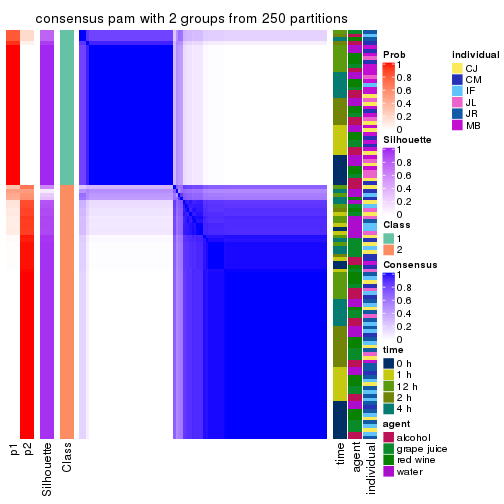</p>

</div>
<div id='tab-MAD-pam-consensus-heatmap-2'>
<pre><code class="r">consensus_heatmap(res, k = 3)
</code></pre>

<p>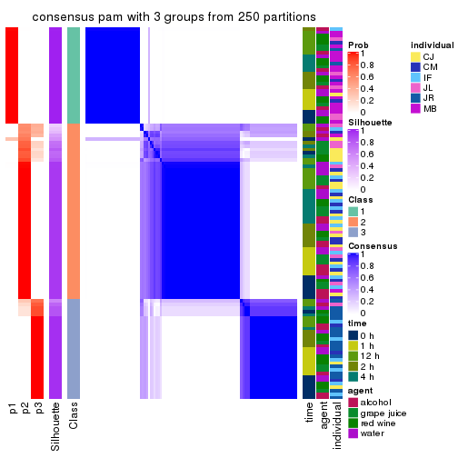</p>

</div>
<div id='tab-MAD-pam-consensus-heatmap-3'>
<pre><code class="r">consensus_heatmap(res, k = 4)
</code></pre>

<p>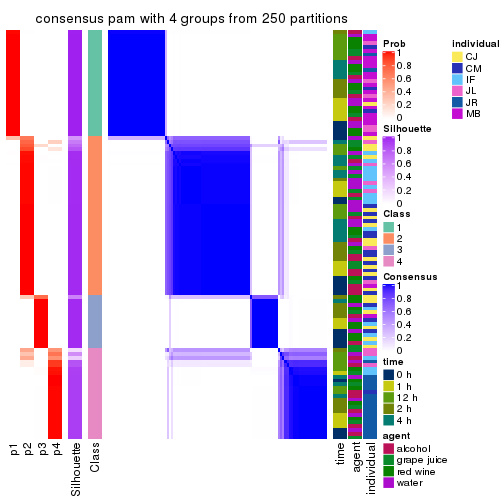</p>

</div>
<div id='tab-MAD-pam-consensus-heatmap-4'>
<pre><code class="r">consensus_heatmap(res, k = 5)
</code></pre>

<p>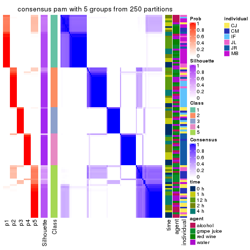</p>

</div>
<div id='tab-MAD-pam-consensus-heatmap-5'>
<pre><code class="r">consensus_heatmap(res, k = 6)
</code></pre>

<p>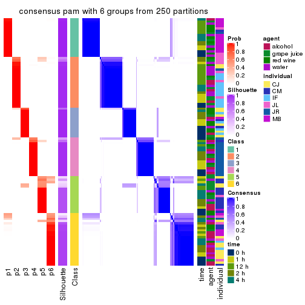</p>

</div>
</div>

Heatmaps for the membership of samples in all partitions to see how consistent they are:


<script>
$( function() {
	$( '#tabs-MAD-pam-membership-heatmap' ).tabs();
} );
</script>
<div id='tabs-MAD-pam-membership-heatmap'>
<ul>
<li><a href='#tab-MAD-pam-membership-heatmap-1'>k = 2</a></li>
<li><a href='#tab-MAD-pam-membership-heatmap-2'>k = 3</a></li>
<li><a href='#tab-MAD-pam-membership-heatmap-3'>k = 4</a></li>
<li><a href='#tab-MAD-pam-membership-heatmap-4'>k = 5</a></li>
<li><a href='#tab-MAD-pam-membership-heatmap-5'>k = 6</a></li>
</ul>
<div id='tab-MAD-pam-membership-heatmap-1'>
<pre><code class="r">membership_heatmap(res, k = 2)
</code></pre>

<p>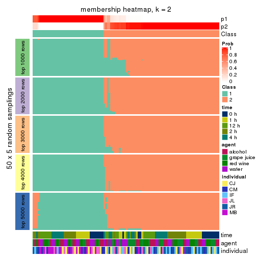</p>

</div>
<div id='tab-MAD-pam-membership-heatmap-2'>
<pre><code class="r">membership_heatmap(res, k = 3)
</code></pre>

<p>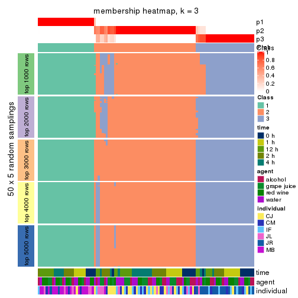</p>

</div>
<div id='tab-MAD-pam-membership-heatmap-3'>
<pre><code class="r">membership_heatmap(res, k = 4)
</code></pre>

<p>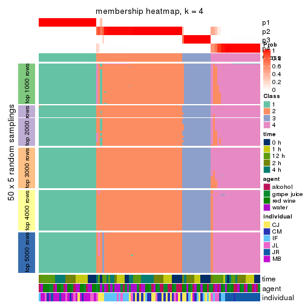</p>

</div>
<div id='tab-MAD-pam-membership-heatmap-4'>
<pre><code class="r">membership_heatmap(res, k = 5)
</code></pre>

<p>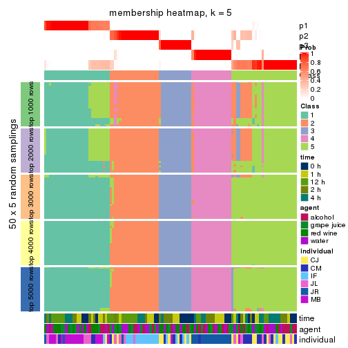</p>

</div>
<div id='tab-MAD-pam-membership-heatmap-5'>
<pre><code class="r">membership_heatmap(res, k = 6)
</code></pre>

<p>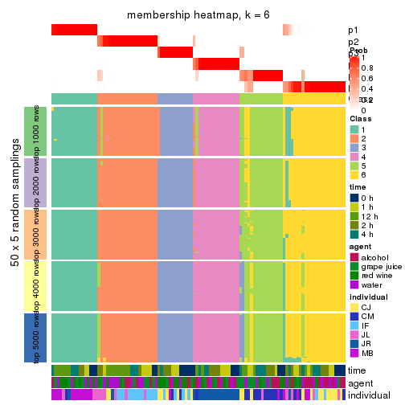</p>

</div>
</div>

As soon as we have had the classes for columns, we can look for signatures
which are significantly different between classes which can be candidate marks
for certain classes. Following are the heatmaps for signatures.


Signature heatmaps where rows are scaled:


<script>
$( function() {
	$( '#tabs-MAD-pam-get-signatures' ).tabs();
} );
</script>
<div id='tabs-MAD-pam-get-signatures'>
<ul>
<li><a href='#tab-MAD-pam-get-signatures-1'>k = 2</a></li>
<li><a href='#tab-MAD-pam-get-signatures-2'>k = 3</a></li>
<li><a href='#tab-MAD-pam-get-signatures-3'>k = 4</a></li>
<li><a href='#tab-MAD-pam-get-signatures-4'>k = 5</a></li>
<li><a href='#tab-MAD-pam-get-signatures-5'>k = 6</a></li>
</ul>
<div id='tab-MAD-pam-get-signatures-1'>
<pre><code class="r">get_signatures(res, k = 2)
</code></pre>

<p>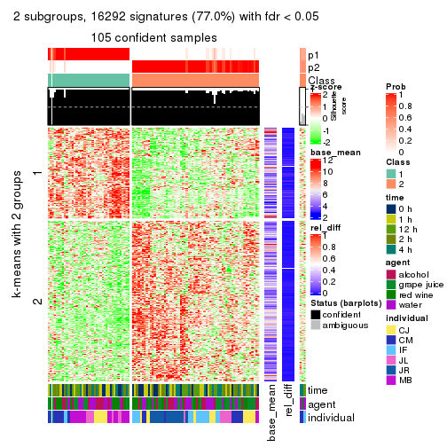</p>

</div>
<div id='tab-MAD-pam-get-signatures-2'>
<pre><code class="r">get_signatures(res, k = 3)
</code></pre>

<p>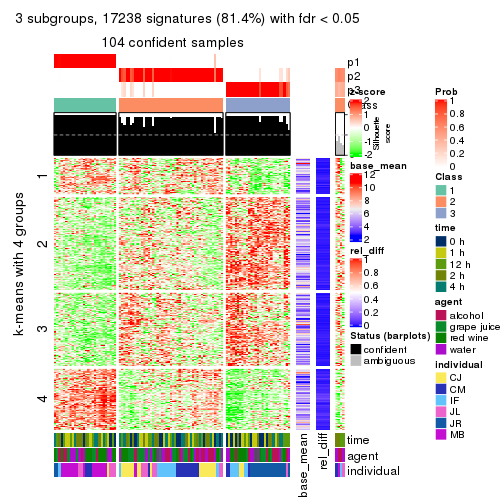</p>

</div>
<div id='tab-MAD-pam-get-signatures-3'>
<pre><code class="r">get_signatures(res, k = 4)
</code></pre>

<p>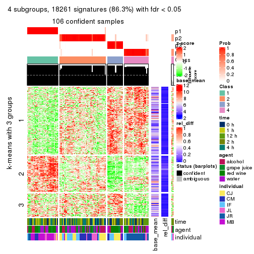</p>

</div>
<div id='tab-MAD-pam-get-signatures-4'>
<pre><code class="r">get_signatures(res, k = 5)
</code></pre>

<p>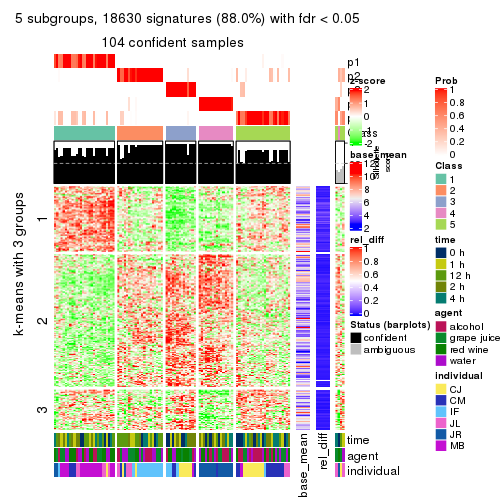</p>

</div>
<div id='tab-MAD-pam-get-signatures-5'>
<pre><code class="r">get_signatures(res, k = 6)
</code></pre>

<p>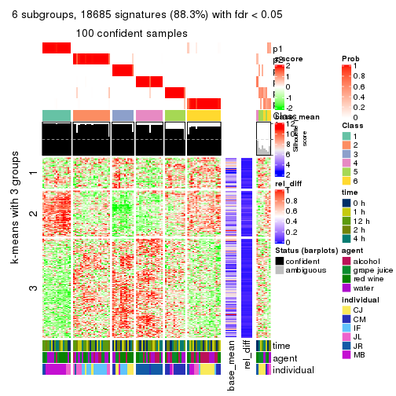</p>

</div>
</div>


Signature heatmaps where rows are not scaled:


<script>
$( function() {
	$( '#tabs-MAD-pam-get-signatures-no-scale' ).tabs();
} );
</script>
<div id='tabs-MAD-pam-get-signatures-no-scale'>
<ul>
<li><a href='#tab-MAD-pam-get-signatures-no-scale-1'>k = 2</a></li>
<li><a href='#tab-MAD-pam-get-signatures-no-scale-2'>k = 3</a></li>
<li><a href='#tab-MAD-pam-get-signatures-no-scale-3'>k = 4</a></li>
<li><a href='#tab-MAD-pam-get-signatures-no-scale-4'>k = 5</a></li>
<li><a href='#tab-MAD-pam-get-signatures-no-scale-5'>k = 6</a></li>
</ul>
<div id='tab-MAD-pam-get-signatures-no-scale-1'>
<pre><code class="r">get_signatures(res, k = 2, scale_rows = FALSE)
</code></pre>

<p>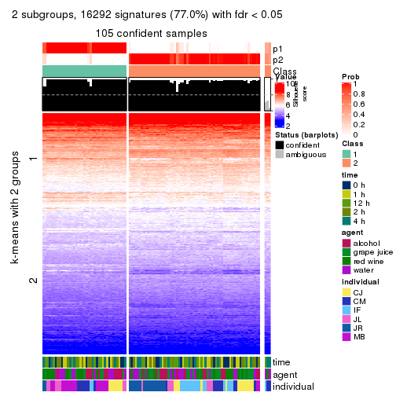</p>

</div>
<div id='tab-MAD-pam-get-signatures-no-scale-2'>
<pre><code class="r">get_signatures(res, k = 3, scale_rows = FALSE)
</code></pre>

<p>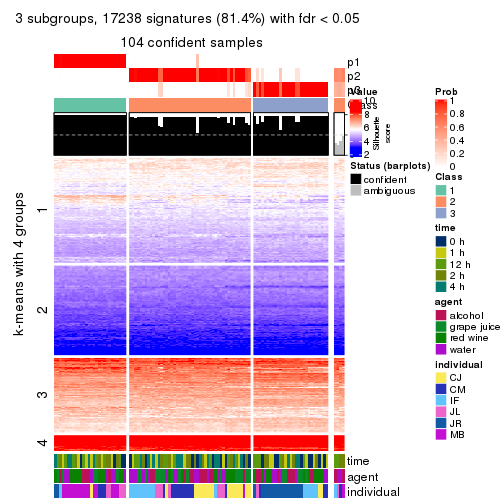</p>

</div>
<div id='tab-MAD-pam-get-signatures-no-scale-3'>
<pre><code class="r">get_signatures(res, k = 4, scale_rows = FALSE)
</code></pre>

<p>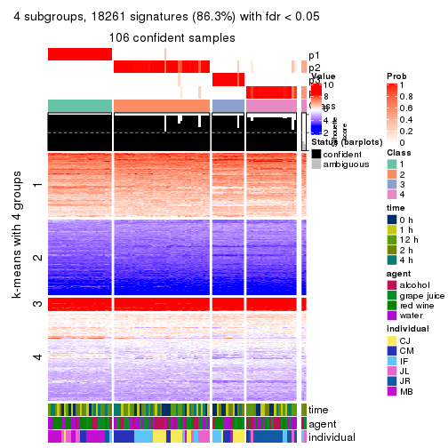</p>

</div>
<div id='tab-MAD-pam-get-signatures-no-scale-4'>
<pre><code class="r">get_signatures(res, k = 5, scale_rows = FALSE)
</code></pre>

<p>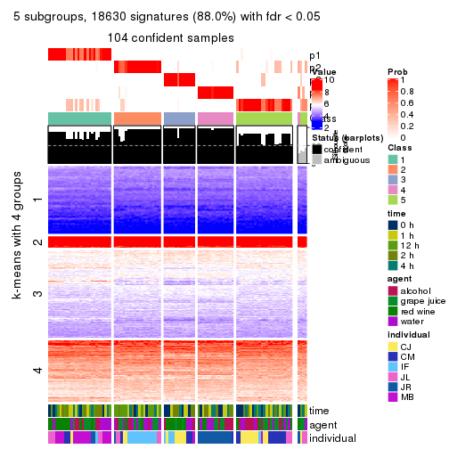</p>

</div>
<div id='tab-MAD-pam-get-signatures-no-scale-5'>
<pre><code class="r">get_signatures(res, k = 6, scale_rows = FALSE)
</code></pre>

<p>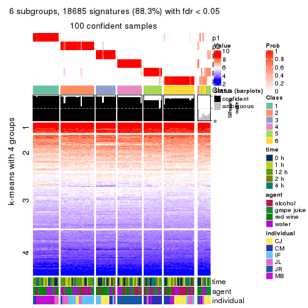</p>

</div>
</div>


Compare the overlap of signatures from different k:

```r
compare_signatures(res)
```

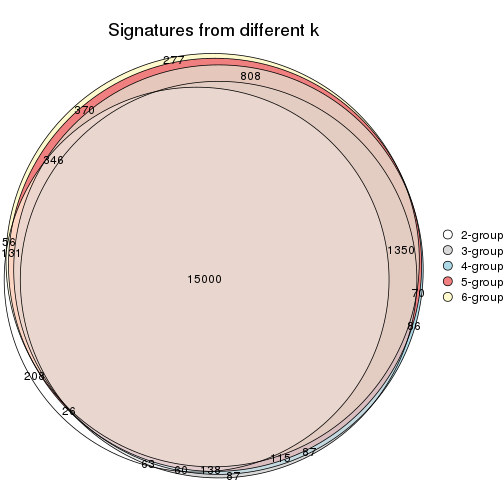

`get_signature()` returns a data frame invisibly. TO get the list of signatures, the function
call should be assigned to a variable explicitly. In following code, if `plot` argument is set
to `FALSE`, no heatmap is plotted while only the differential analysis is performed.

```r
# code only for demonstration
tb = get_signature(res, k = ..., plot = FALSE)
```

An example of the output of `tb` is:

```
#>   which_row         fdr    mean_1    mean_2 scaled_mean_1 scaled_mean_2 km
#> 1        38 0.042760348  8.373488  9.131774    -0.5533452     0.5164555  1
#> 2        40 0.018707592  7.106213  8.469186    -0.6173731     0.5762149  1
#> 3        55 0.019134737 10.221463 11.207825    -0.6159697     0.5749050  1
#> 4        59 0.006059896  5.921854  7.869574    -0.6899429     0.6439467  1
#> 5        60 0.018055526  8.928898 10.211722    -0.6204761     0.5791110  1
#> 6        98 0.009384629 15.714769 14.887706     0.6635654    -0.6193277  2
...
```

The columns in `tb` are:

1. `which_row`: row indices corresponding to the input matrix.
2. `fdr`: FDR for the differential test. 
3. `mean_x`: The mean value in group x.
4. `scaled_mean_x`: The mean value in group x after rows are scaled.
5. `km`: Row groups if k-means clustering is applied to rows.


UMAP plot which shows how samples are separated.


<script>
$( function() {
	$( '#tabs-MAD-pam-dimension-reduction' ).tabs();
} );
</script>
<div id='tabs-MAD-pam-dimension-reduction'>
<ul>
<li><a href='#tab-MAD-pam-dimension-reduction-1'>k = 2</a></li>
<li><a href='#tab-MAD-pam-dimension-reduction-2'>k = 3</a></li>
<li><a href='#tab-MAD-pam-dimension-reduction-3'>k = 4</a></li>
<li><a href='#tab-MAD-pam-dimension-reduction-4'>k = 5</a></li>
<li><a href='#tab-MAD-pam-dimension-reduction-5'>k = 6</a></li>
</ul>
<div id='tab-MAD-pam-dimension-reduction-1'>
<pre><code class="r">dimension_reduction(res, k = 2, method = &quot;UMAP&quot;)
</code></pre>

<p>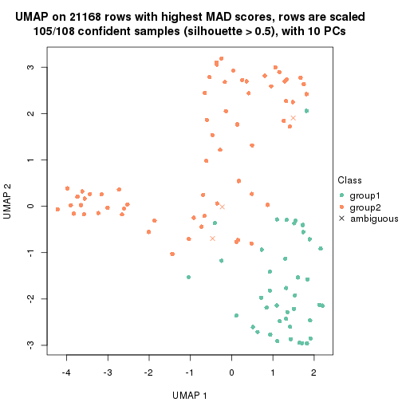</p>

</div>
<div id='tab-MAD-pam-dimension-reduction-2'>
<pre><code class="r">dimension_reduction(res, k = 3, method = &quot;UMAP&quot;)
</code></pre>

<p>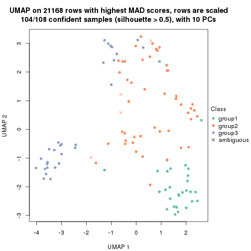</p>

</div>
<div id='tab-MAD-pam-dimension-reduction-3'>
<pre><code class="r">dimension_reduction(res, k = 4, method = &quot;UMAP&quot;)
</code></pre>

<p>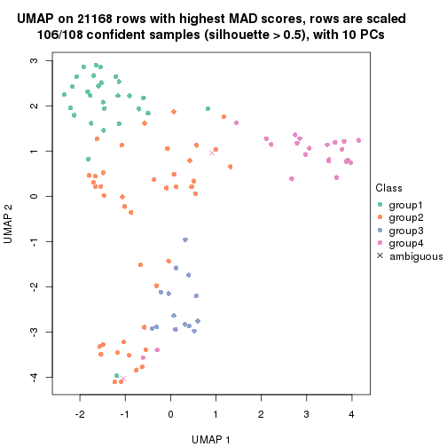</p>

</div>
<div id='tab-MAD-pam-dimension-reduction-4'>
<pre><code class="r">dimension_reduction(res, k = 5, method = &quot;UMAP&quot;)
</code></pre>

<p>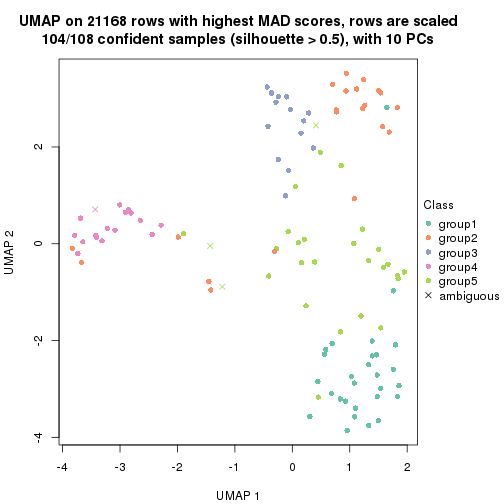</p>

</div>
<div id='tab-MAD-pam-dimension-reduction-5'>
<pre><code class="r">dimension_reduction(res, k = 6, method = &quot;UMAP&quot;)
</code></pre>

<p>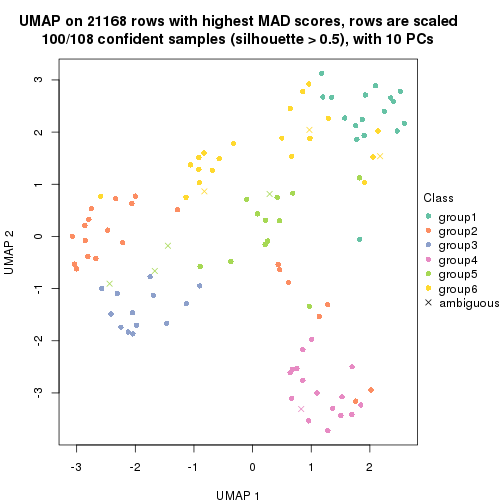</p>

</div>
</div>


Following heatmap shows how subgroups are split when increasing `k`:

```r
collect_classes(res)
```

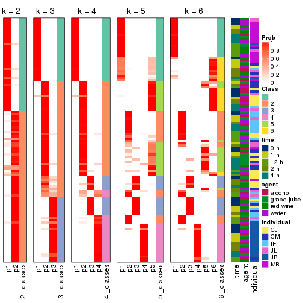


Test correlation between subgroups and known annotations. If the known
annotation is numeric, one-way ANOVA test is applied, and if the known
annotation is discrete, chi-squared contingency table test is applied.

```r
test_to_known_factors(res)
```

```
#>           n time(p) agent(p) individual(p) k
#> MAD:pam 105  0.9958    0.527      5.48e-06 2
#> MAD:pam 104  0.6694    0.241      1.43e-16 3
#> MAD:pam 106  0.4542    0.235      1.07e-18 4
#> MAD:pam 104  0.0953    0.264      4.09e-25 5
#> MAD:pam 100  0.3949    0.119      4.85e-28 6
```


If matrix rows can be associated to genes, consider to use `GO_Enrichment(res,
...)` to perform function enrichment for the signature genes.


 

---------------------------------------------------


### MAD:mclust


The object with results only for a single top-value method and a single partition method 
can be extracted as:

```r
res = res_list["MAD", "mclust"]
# you can also extract it by
# res = res_list["MAD:mclust"]
```

A summary of `res` and all the functions that can be applied to it:

```r
res
```

```
#> A 'ConsensusPartition' object with k = 2, 3, 4, 5, 6.
#>   On a matrix with 21168 rows and 108 columns.
#>   Top rows (1000, 2000, 3000, 4000, 5000) are extracted by 'MAD' method.
#>   Subgroups are detected by 'mclust' method.
#>   Performed in total 1250 partitions by row resampling.
#>   Best k for subgroups seems to be 5.
#> 
#> Following methods can be applied to this 'ConsensusPartition' object:
#>  [1] "cola_report"             "collect_classes"         "collect_plots"          
#>  [4] "collect_stats"           "colnames"                "compare_signatures"     
#>  [7] "consensus_heatmap"       "dimension_reduction"     "functional_enrichment"  
#> [10] "get_anno_col"            "get_anno"                "get_classes"            
#> [13] "get_consensus"           "get_matrix"              "get_membership"         
#> [16] "get_param"               "get_signatures"          "get_stats"              
#> [19] "is_best_k"               "is_stable_k"             "membership_heatmap"     
#> [22] "ncol"                    "nrow"                    "plot_ecdf"              
#> [25] "rownames"                "select_partition_number" "show"                   
#> [28] "suggest_best_k"          "test_to_known_factors"
```

`collect_plots()` function collects all the plots made from `res` for all `k` (number of partitions)
into one single page to provide an easy and fast comparison between different `k`.

```r
collect_plots(res)
```

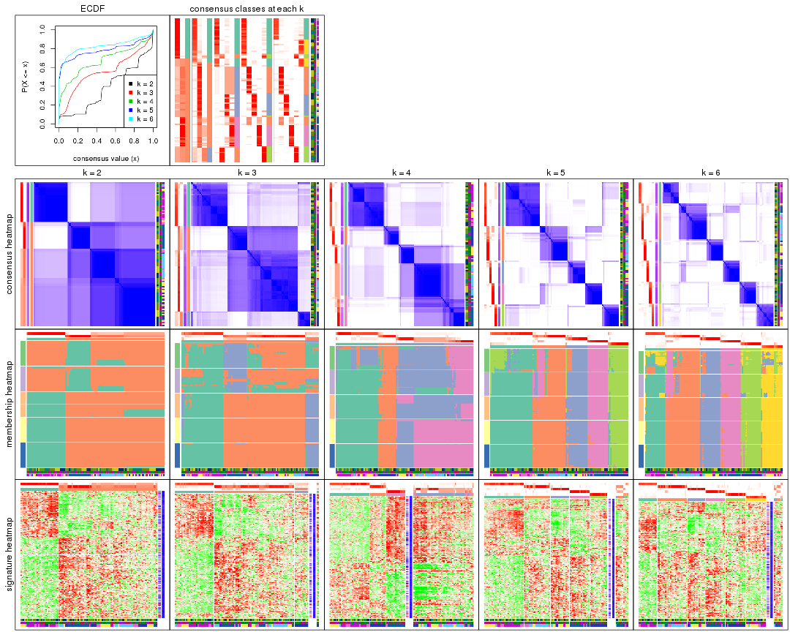

The plots are:

- The first row: a plot of the ECDF (Empirical cumulative distribution
  function) curves of the consensus matrix for each `k` and the heatmap of
  predicted classes for each `k`.
- The second row: heatmaps of the consensus matrix for each `k`.
- The third row: heatmaps of the membership matrix for each `k`.
- The fouth row: heatmaps of the signatures for each `k`.

All the plots in panels can be made by individual functions and they are
plotted later in this section.

`select_partition_number()` produces several plots showing different
statistics for choosing "optimized" `k`. There are following statistics:

- ECDF curves of the consensus matrix for each `k`;
- 1-PAC. [The PAC
  score](https://en.wikipedia.org/wiki/Consensus_clustering#Over-interpretation_potential_of_consensus_clustering)
  measures the proportion of the ambiguous subgrouping.
- Mean silhouette score.
- Concordance. The mean probability of fiting the consensus class ids in all
  partitions.
- Area increased. Denote $A_k$ as the area under the ECDF curve for current
  `k`, the area increased is defined as $A_k - A_{k-1}$.
- Rand index. The percent of pairs of samples that are both in a same cluster
  or both are not in a same cluster in the partition of k and k-1.
- Jaccard index. The ratio of pairs of samples are both in a same cluster in
  the partition of k and k-1 and the pairs of samples are both in a same
  cluster in the partition k or k-1.

The detailed explanations of these statistics can be found in [the cola
vignette](http://bioconductor.org/packages/devel/bioc/vignettes/cola/inst/doc/cola.html#toc_13).

Generally speaking, lower PAC score, higher mean silhouette score or higher
concordance corresponds to better partition. Rand index and Jaccard index
measure how similar the current partition is compared to partition with `k-1`.
If they are too similar, we won't accept `k` is better than `k-1`.

```r
select_partition_number(res)
```

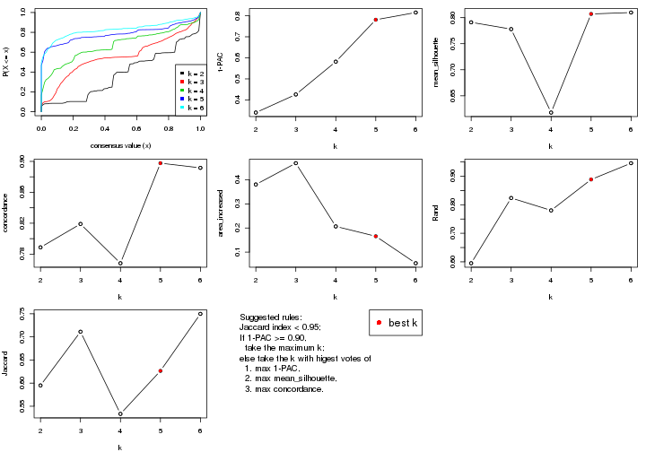

The numeric values for all these statistics can be obtained by `get_stats()`.

```r
get_stats(res)
```

```
#>   k 1-PAC mean_silhouette concordance area_increased  Rand Jaccard
#> 2 2 0.340           0.791       0.789         0.3805 0.595   0.595
#> 3 3 0.426           0.778       0.819         0.4687 0.824   0.711
#> 4 4 0.582           0.618       0.768         0.2065 0.780   0.533
#> 5 5 0.781           0.807       0.898         0.1657 0.889   0.626
#> 6 6 0.815           0.810       0.892         0.0538 0.946   0.750
```

`suggest_best_k()` suggests the best $k$ based on these statistics. The rules are as follows:

- All $k$ with Jaccard index larger than 0.95 are removed because the increase of
  the partition number does not provides enough extra information. If all $k$ are removed,
  the best $k$ is assigned by `NA`.
- For $k$ with 1-PAC larger than 0.9, the maximal $k$ is taken as the "best k". Other $k$ is called "optional k".
- If it does not fit the second rule. The $k$ with the highest vote of highest
  1-PAC, mean silhouette and concordance is taken as the "best k".

```r
suggest_best_k(res)
```

```
#> [1] 5
```


Following shows the table of the partitions (You need to click the **show/hide
code output** link to see it). The membership matrix (columns with name `p*`)
is inferred by
[`clue::cl_consensus()`](https://www.rdocumentation.org/link/cl_consensus?package=clue)
function with the `SE` method. Basically the value in the membership matrix
represents the probability to belong to a certain group. The finall class
label for an item is determined with the group with highest probability it
belongs to.

In `get_classes()` function, the entropy is calculated from the membership
matrix and the silhouette score is calculated from the consensus matrix.


<script>
$( function() {
	$( '#tabs-MAD-mclust-get-classes' ).tabs();
} );
</script>
<div id='tabs-MAD-mclust-get-classes'>
<ul>
<li><a href='#tab-MAD-mclust-get-classes-1'>k = 2</a></li>
<li><a href='#tab-MAD-mclust-get-classes-2'>k = 3</a></li>
<li><a href='#tab-MAD-mclust-get-classes-3'>k = 4</a></li>
<li><a href='#tab-MAD-mclust-get-classes-4'>k = 5</a></li>
<li><a href='#tab-MAD-mclust-get-classes-5'>k = 6</a></li>
</ul>

<div id='tab-MAD-mclust-get-classes-1'>
<p><a id='tab-MAD-mclust-get-classes-1-a' style='color:#0366d6' href='#'>show/hide code output</a></p>
<pre><code class="r">cbind(get_classes(res, k = 2), get_membership(res, k = 2))
</code></pre>

<pre><code>#&gt;          class entropy silhouette    p1    p2
#&gt; GSM87863     2  0.9922      0.737 0.448 0.552
#&gt; GSM87887     2  0.9922      0.737 0.448 0.552
#&gt; GSM87896     2  0.8713      0.777 0.292 0.708
#&gt; GSM87934     2  0.0000      0.606 0.000 1.000
#&gt; GSM87943     2  0.9922      0.737 0.448 0.552
#&gt; GSM87853     2  0.9922      0.737 0.448 0.552
#&gt; GSM87906     2  0.8713      0.777 0.292 0.708
#&gt; GSM87920     2  0.9922      0.737 0.448 0.552
#&gt; GSM87924     2  0.2603      0.632 0.044 0.956
#&gt; GSM87858     2  0.9833      0.749 0.424 0.576
#&gt; GSM87882     2  0.9922      0.737 0.448 0.552
#&gt; GSM87891     2  0.8713      0.777 0.292 0.708
#&gt; GSM87917     1  0.0000      0.987 1.000 0.000
#&gt; GSM87929     2  0.0000      0.606 0.000 1.000
#&gt; GSM87948     1  0.0376      0.985 0.996 0.004
#&gt; GSM87868     1  0.0000      0.987 1.000 0.000
#&gt; GSM87873     2  0.9922      0.737 0.448 0.552
#&gt; GSM87901     2  0.8713      0.777 0.292 0.708
#&gt; GSM87910     1  0.0000      0.987 1.000 0.000
#&gt; GSM87938     2  0.0000      0.606 0.000 1.000
#&gt; GSM87953     1  0.0000      0.987 1.000 0.000
#&gt; GSM87864     2  0.9933      0.732 0.452 0.548
#&gt; GSM87888     2  0.9922      0.737 0.448 0.552
#&gt; GSM87897     2  0.8713      0.777 0.292 0.708
#&gt; GSM87935     2  0.0000      0.606 0.000 1.000
#&gt; GSM87944     1  0.0000      0.987 1.000 0.000
#&gt; GSM87854     2  0.9922      0.737 0.448 0.552
#&gt; GSM87878     2  0.9922      0.737 0.448 0.552
#&gt; GSM87907     2  0.8713      0.777 0.292 0.708
#&gt; GSM87921     2  0.8713      0.777 0.292 0.708
#&gt; GSM87925     2  0.0000      0.606 0.000 1.000
#&gt; GSM87957     1  0.0376      0.985 0.996 0.004
#&gt; GSM87859     2  0.9922      0.737 0.448 0.552
#&gt; GSM87883     1  0.0376      0.985 0.996 0.004
#&gt; GSM87892     2  0.8713      0.777 0.292 0.708
#&gt; GSM87930     2  0.0000      0.606 0.000 1.000
#&gt; GSM87949     1  0.0000      0.987 1.000 0.000
#&gt; GSM87869     1  0.0000      0.987 1.000 0.000
#&gt; GSM87874     2  0.9922      0.737 0.448 0.552
#&gt; GSM87902     2  0.8713      0.777 0.292 0.708
#&gt; GSM87911     2  0.8813      0.776 0.300 0.700
#&gt; GSM87939     2  0.0000      0.606 0.000 1.000
#&gt; GSM87954     1  0.0000      0.987 1.000 0.000
#&gt; GSM87865     2  0.9922      0.737 0.448 0.552
#&gt; GSM87889     2  0.9922      0.737 0.448 0.552
#&gt; GSM87898     2  0.8713      0.777 0.292 0.708
#&gt; GSM87915     1  0.0000      0.987 1.000 0.000
#&gt; GSM87936     2  0.0000      0.606 0.000 1.000
#&gt; GSM87945     2  0.9922      0.737 0.448 0.552
#&gt; GSM87855     2  0.9922      0.737 0.448 0.552
#&gt; GSM87879     2  0.9922      0.737 0.448 0.552
#&gt; GSM87922     2  0.9661      0.761 0.392 0.608
#&gt; GSM87926     2  0.0000      0.606 0.000 1.000
#&gt; GSM87958     1  0.0000      0.987 1.000 0.000
#&gt; GSM87860     2  0.9833      0.748 0.424 0.576
#&gt; GSM87884     1  0.5629      0.735 0.868 0.132
#&gt; GSM87893     2  0.8713      0.777 0.292 0.708
#&gt; GSM87918     2  0.9323      0.771 0.348 0.652
#&gt; GSM87931     2  0.0000      0.606 0.000 1.000
#&gt; GSM87950     1  0.0000      0.987 1.000 0.000
#&gt; GSM87870     1  0.0672      0.981 0.992 0.008
#&gt; GSM87875     2  0.9922      0.737 0.448 0.552
#&gt; GSM87903     2  0.8713      0.777 0.292 0.708
#&gt; GSM87912     1  0.0000      0.987 1.000 0.000
#&gt; GSM87940     2  0.0000      0.606 0.000 1.000
#&gt; GSM87866     1  0.0376      0.985 0.996 0.004
#&gt; GSM87899     2  0.8713      0.777 0.292 0.708
#&gt; GSM87937     2  0.0000      0.606 0.000 1.000
#&gt; GSM87946     1  0.0000      0.987 1.000 0.000
#&gt; GSM87856     2  0.9922      0.737 0.448 0.552
#&gt; GSM87880     2  0.9922      0.737 0.448 0.552
#&gt; GSM87908     2  0.8713      0.777 0.292 0.708
#&gt; GSM87923     2  0.9922      0.737 0.448 0.552
#&gt; GSM87927     2  0.0672      0.611 0.008 0.992
#&gt; GSM87959     1  0.0000      0.987 1.000 0.000
#&gt; GSM87861     2  0.9922      0.737 0.448 0.552
#&gt; GSM87885     2  0.9922      0.737 0.448 0.552
#&gt; GSM87894     1  0.1414      0.965 0.980 0.020
#&gt; GSM87932     2  0.8661      0.775 0.288 0.712
#&gt; GSM87951     1  0.0000      0.987 1.000 0.000
#&gt; GSM87871     2  0.9922      0.737 0.448 0.552
#&gt; GSM87876     2  0.9922      0.737 0.448 0.552
#&gt; GSM87904     2  0.9129      0.774 0.328 0.672
#&gt; GSM87913     1  0.1414      0.965 0.980 0.020
#&gt; GSM87941     2  0.0000      0.606 0.000 1.000
#&gt; GSM87955     1  0.0000      0.987 1.000 0.000
#&gt; GSM87867     2  0.9922      0.737 0.448 0.552
#&gt; GSM87890     2  0.9608      0.763 0.384 0.616
#&gt; GSM87900     2  0.8713      0.777 0.292 0.708
#&gt; GSM87916     2  0.6247      0.701 0.156 0.844
#&gt; GSM87947     1  0.1414      0.965 0.980 0.020
#&gt; GSM87857     2  0.9922      0.737 0.448 0.552
#&gt; GSM87881     2  0.9922      0.737 0.448 0.552
#&gt; GSM87909     2  0.8713      0.777 0.292 0.708
#&gt; GSM87928     2  0.6148      0.699 0.152 0.848
#&gt; GSM87960     1  0.0000      0.987 1.000 0.000
#&gt; GSM87862     2  0.9608      0.763 0.384 0.616
#&gt; GSM87886     1  0.0672      0.981 0.992 0.008
#&gt; GSM87895     2  0.8713      0.777 0.292 0.708
#&gt; GSM87919     1  0.0000      0.987 1.000 0.000
#&gt; GSM87933     2  0.0000      0.606 0.000 1.000
#&gt; GSM87952     1  0.0000      0.987 1.000 0.000
#&gt; GSM87872     2  0.9635      0.762 0.388 0.612
#&gt; GSM87877     2  0.9963      0.713 0.464 0.536
#&gt; GSM87905     2  0.8713      0.777 0.292 0.708
#&gt; GSM87914     2  0.6048      0.696 0.148 0.852
#&gt; GSM87942     2  0.0000      0.606 0.000 1.000
#&gt; GSM87956     1  0.0000      0.987 1.000 0.000
</code></pre>

<script>
$('#tab-MAD-mclust-get-classes-1-a').parent().next().next().hide();
$('#tab-MAD-mclust-get-classes-1-a').click(function(){
  $('#tab-MAD-mclust-get-classes-1-a').parent().next().next().toggle();
  return(false);
});
</script>
</div>

<div id='tab-MAD-mclust-get-classes-2'>
<p><a id='tab-MAD-mclust-get-classes-2-a' style='color:#0366d6' href='#'>show/hide code output</a></p>
<pre><code class="r">cbind(get_classes(res, k = 3), get_membership(res, k = 3))
</code></pre>

<pre><code>#&gt;          class entropy silhouette    p1    p2    p3
#&gt; GSM87863     2  0.6228     0.5345 0.316 0.672 0.012
#&gt; GSM87887     3  0.7902     0.9323 0.280 0.092 0.628
#&gt; GSM87896     2  0.0237     0.8361 0.004 0.996 0.000
#&gt; GSM87934     2  0.6008     0.6727 0.000 0.628 0.372
#&gt; GSM87943     2  0.2383     0.8220 0.044 0.940 0.016
#&gt; GSM87853     2  0.2229     0.8237 0.044 0.944 0.012
#&gt; GSM87906     2  0.1529     0.8360 0.040 0.960 0.000
#&gt; GSM87920     1  0.4842     0.7127 0.776 0.224 0.000
#&gt; GSM87924     2  0.5012     0.7758 0.008 0.788 0.204
#&gt; GSM87858     2  0.0747     0.8360 0.016 0.984 0.000
#&gt; GSM87882     3  0.8187     0.9309 0.244 0.128 0.628
#&gt; GSM87891     2  0.0592     0.8363 0.012 0.988 0.000
#&gt; GSM87917     1  0.2261     0.8525 0.932 0.068 0.000
#&gt; GSM87929     2  0.6008     0.6727 0.000 0.628 0.372
#&gt; GSM87948     1  0.3375     0.8297 0.892 0.100 0.008
#&gt; GSM87868     1  0.3896     0.8365 0.864 0.128 0.008
#&gt; GSM87873     2  0.0829     0.8340 0.004 0.984 0.012
#&gt; GSM87901     2  0.1163     0.8377 0.028 0.972 0.000
#&gt; GSM87910     1  0.2261     0.8525 0.932 0.068 0.000
#&gt; GSM87938     2  0.6008     0.6727 0.000 0.628 0.372
#&gt; GSM87953     1  0.2261     0.8525 0.932 0.068 0.000
#&gt; GSM87864     1  0.5406     0.6977 0.764 0.224 0.012
#&gt; GSM87888     3  0.8187     0.9309 0.244 0.128 0.628
#&gt; GSM87897     2  0.0892     0.8380 0.020 0.980 0.000
#&gt; GSM87935     2  0.5859     0.6956 0.000 0.656 0.344
#&gt; GSM87944     1  0.3192     0.8399 0.888 0.112 0.000
#&gt; GSM87854     2  0.2339     0.8232 0.048 0.940 0.012
#&gt; GSM87878     3  0.8079     0.9155 0.260 0.112 0.628
#&gt; GSM87907     2  0.0747     0.8375 0.016 0.984 0.000
#&gt; GSM87921     2  0.1529     0.8372 0.040 0.960 0.000
#&gt; GSM87925     2  0.5948     0.6825 0.000 0.640 0.360
#&gt; GSM87957     1  0.3038     0.8430 0.896 0.104 0.000
#&gt; GSM87859     2  0.0747     0.8360 0.016 0.984 0.000
#&gt; GSM87883     1  0.5554     0.7556 0.812 0.112 0.076
#&gt; GSM87892     2  0.0592     0.8363 0.012 0.988 0.000
#&gt; GSM87930     2  0.6008     0.6727 0.000 0.628 0.372
#&gt; GSM87949     1  0.1860     0.8495 0.948 0.052 0.000
#&gt; GSM87869     1  0.3412     0.8406 0.876 0.124 0.000
#&gt; GSM87874     2  0.1774     0.8292 0.024 0.960 0.016
#&gt; GSM87902     2  0.1529     0.8360 0.040 0.960 0.000
#&gt; GSM87911     2  0.1529     0.8360 0.040 0.960 0.000
#&gt; GSM87939     2  0.6008     0.6727 0.000 0.628 0.372
#&gt; GSM87954     1  0.2356     0.8509 0.928 0.072 0.000
#&gt; GSM87865     1  0.6357     0.5593 0.652 0.336 0.012
#&gt; GSM87889     3  0.7902     0.9323 0.280 0.092 0.628
#&gt; GSM87898     2  0.1163     0.8377 0.028 0.972 0.000
#&gt; GSM87915     1  0.3816     0.7838 0.852 0.148 0.000
#&gt; GSM87936     2  0.5882     0.6926 0.000 0.652 0.348
#&gt; GSM87945     2  0.2229     0.8237 0.044 0.944 0.012
#&gt; GSM87855     2  0.2229     0.8237 0.044 0.944 0.012
#&gt; GSM87879     3  0.8187     0.9309 0.244 0.128 0.628
#&gt; GSM87922     2  0.3412     0.7878 0.124 0.876 0.000
#&gt; GSM87926     2  0.6008     0.6727 0.000 0.628 0.372
#&gt; GSM87958     1  0.1860     0.8495 0.948 0.052 0.000
#&gt; GSM87860     2  0.0747     0.8360 0.016 0.984 0.000
#&gt; GSM87884     1  0.8326    -0.5338 0.488 0.080 0.432
#&gt; GSM87893     2  0.0592     0.8363 0.012 0.988 0.000
#&gt; GSM87918     2  0.4002     0.7659 0.160 0.840 0.000
#&gt; GSM87931     2  0.6008     0.6727 0.000 0.628 0.372
#&gt; GSM87950     1  0.1860     0.8495 0.948 0.052 0.000
#&gt; GSM87870     1  0.3551     0.8376 0.868 0.132 0.000
#&gt; GSM87875     2  0.6168     0.6654 0.224 0.740 0.036
#&gt; GSM87903     2  0.1163     0.8367 0.028 0.972 0.000
#&gt; GSM87912     1  0.2448     0.8499 0.924 0.076 0.000
#&gt; GSM87940     2  0.6008     0.6727 0.000 0.628 0.372
#&gt; GSM87866     1  0.3482     0.8393 0.872 0.128 0.000
#&gt; GSM87899     2  0.0747     0.8375 0.016 0.984 0.000
#&gt; GSM87937     2  0.5968     0.6790 0.000 0.636 0.364
#&gt; GSM87946     1  0.3845     0.8344 0.872 0.116 0.012
#&gt; GSM87856     2  0.2229     0.8237 0.044 0.944 0.012
#&gt; GSM87880     3  0.8137     0.9340 0.252 0.120 0.628
#&gt; GSM87908     2  0.1529     0.8360 0.040 0.960 0.000
#&gt; GSM87923     2  0.4291     0.7455 0.180 0.820 0.000
#&gt; GSM87927     2  0.5315     0.7707 0.012 0.772 0.216
#&gt; GSM87959     1  0.1964     0.8497 0.944 0.056 0.000
#&gt; GSM87861     2  0.1289     0.8337 0.032 0.968 0.000
#&gt; GSM87885     3  0.7902     0.9323 0.280 0.092 0.628
#&gt; GSM87894     1  0.6082     0.6313 0.692 0.296 0.012
#&gt; GSM87932     2  0.3918     0.7753 0.140 0.856 0.004
#&gt; GSM87951     1  0.1964     0.8497 0.944 0.056 0.000
#&gt; GSM87871     2  0.2537     0.8194 0.080 0.920 0.000
#&gt; GSM87876     3  0.7941     0.9332 0.276 0.096 0.628
#&gt; GSM87904     2  0.0747     0.8368 0.016 0.984 0.000
#&gt; GSM87913     1  0.5465     0.6381 0.712 0.288 0.000
#&gt; GSM87941     2  0.5591     0.7171 0.000 0.696 0.304
#&gt; GSM87955     1  0.1860     0.8495 0.948 0.052 0.000
#&gt; GSM87867     2  0.5953     0.6046 0.280 0.708 0.012
#&gt; GSM87890     2  0.5115     0.7301 0.188 0.796 0.016
#&gt; GSM87900     2  0.1163     0.8377 0.028 0.972 0.000
#&gt; GSM87916     2  0.5178     0.7483 0.000 0.744 0.256
#&gt; GSM87947     1  0.4068     0.8086 0.864 0.120 0.016
#&gt; GSM87857     2  0.2229     0.8237 0.044 0.944 0.012
#&gt; GSM87881     3  0.8298     0.8962 0.220 0.152 0.628
#&gt; GSM87909     2  0.3482     0.7884 0.128 0.872 0.000
#&gt; GSM87928     2  0.5159     0.7731 0.140 0.820 0.040
#&gt; GSM87960     1  0.1964     0.8497 0.944 0.056 0.000
#&gt; GSM87862     2  0.0892     0.8363 0.020 0.980 0.000
#&gt; GSM87886     1  0.7666     0.0161 0.636 0.076 0.288
#&gt; GSM87895     2  0.0592     0.8372 0.012 0.988 0.000
#&gt; GSM87919     1  0.2261     0.8525 0.932 0.068 0.000
#&gt; GSM87933     2  0.6008     0.6727 0.000 0.628 0.372
#&gt; GSM87952     1  0.1964     0.8497 0.944 0.056 0.000
#&gt; GSM87872     2  0.4235     0.7550 0.176 0.824 0.000
#&gt; GSM87877     3  0.8523     0.6491 0.444 0.092 0.464
#&gt; GSM87905     2  0.1163     0.8377 0.028 0.972 0.000
#&gt; GSM87914     2  0.5377     0.7869 0.112 0.820 0.068
#&gt; GSM87942     2  0.5845     0.7191 0.004 0.688 0.308
#&gt; GSM87956     1  0.1860     0.8495 0.948 0.052 0.000
</code></pre>

<script>
$('#tab-MAD-mclust-get-classes-2-a').parent().next().next().hide();
$('#tab-MAD-mclust-get-classes-2-a').click(function(){
  $('#tab-MAD-mclust-get-classes-2-a').parent().next().next().toggle();
  return(false);
});
</script>
</div>

<div id='tab-MAD-mclust-get-classes-3'>
<p><a id='tab-MAD-mclust-get-classes-3-a' style='color:#0366d6' href='#'>show/hide code output</a></p>
<pre><code class="r">cbind(get_classes(res, k = 4), get_membership(res, k = 4))
</code></pre>

<pre><code>#&gt;          class entropy silhouette    p1    p2    p3    p4
#&gt; GSM87863     1  0.3249     0.8886 0.852 0.008 0.140 0.000
#&gt; GSM87887     2  0.0592     0.9064 0.016 0.984 0.000 0.000
#&gt; GSM87896     3  0.7009     0.4520 0.072 0.016 0.464 0.448
#&gt; GSM87934     4  0.0000     0.7024 0.000 0.000 0.000 1.000
#&gt; GSM87943     3  0.0469     0.4211 0.000 0.012 0.988 0.000
#&gt; GSM87853     3  0.0469     0.4211 0.000 0.012 0.988 0.000
#&gt; GSM87906     3  0.7062     0.4553 0.076 0.016 0.460 0.448
#&gt; GSM87920     1  0.3306     0.8706 0.840 0.004 0.156 0.000
#&gt; GSM87924     4  0.5361     0.4870 0.068 0.000 0.208 0.724
#&gt; GSM87858     3  0.5581     0.3439 0.000 0.020 0.532 0.448
#&gt; GSM87882     2  0.0592     0.9064 0.016 0.984 0.000 0.000
#&gt; GSM87891     3  0.7048     0.4470 0.068 0.020 0.464 0.448
#&gt; GSM87917     1  0.2760     0.8933 0.872 0.000 0.128 0.000
#&gt; GSM87929     4  0.0000     0.7024 0.000 0.000 0.000 1.000
#&gt; GSM87948     1  0.3356     0.7630 0.824 0.176 0.000 0.000
#&gt; GSM87868     1  0.3032     0.8932 0.868 0.008 0.124 0.000
#&gt; GSM87873     3  0.0469     0.4211 0.000 0.012 0.988 0.000
#&gt; GSM87901     3  0.7062     0.4553 0.076 0.016 0.460 0.448
#&gt; GSM87910     1  0.2760     0.8933 0.872 0.000 0.128 0.000
#&gt; GSM87938     4  0.0000     0.7024 0.000 0.000 0.000 1.000
#&gt; GSM87953     1  0.2760     0.8933 0.872 0.000 0.128 0.000
#&gt; GSM87864     1  0.3088     0.8927 0.864 0.008 0.128 0.000
#&gt; GSM87888     2  0.0592     0.9064 0.016 0.984 0.000 0.000
#&gt; GSM87897     3  0.7062     0.4553 0.076 0.016 0.460 0.448
#&gt; GSM87935     4  0.3208     0.6504 0.004 0.000 0.148 0.848
#&gt; GSM87944     1  0.2179     0.8769 0.924 0.012 0.064 0.000
#&gt; GSM87854     3  0.0804     0.4217 0.008 0.012 0.980 0.000
#&gt; GSM87878     2  0.4158     0.7862 0.224 0.768 0.008 0.000
#&gt; GSM87907     3  0.7062     0.4553 0.076 0.016 0.460 0.448
#&gt; GSM87921     3  0.7062     0.4553 0.076 0.016 0.460 0.448
#&gt; GSM87925     4  0.3208     0.6504 0.004 0.000 0.148 0.848
#&gt; GSM87957     1  0.0336     0.8443 0.992 0.008 0.000 0.000
#&gt; GSM87859     3  0.0469     0.4211 0.000 0.012 0.988 0.000
#&gt; GSM87883     2  0.4961     0.3953 0.448 0.552 0.000 0.000
#&gt; GSM87892     3  0.6954     0.4480 0.068 0.016 0.468 0.448
#&gt; GSM87930     4  0.0000     0.7024 0.000 0.000 0.000 1.000
#&gt; GSM87949     1  0.0188     0.8469 0.996 0.004 0.000 0.000
#&gt; GSM87869     1  0.2888     0.8933 0.872 0.004 0.124 0.000
#&gt; GSM87874     3  0.0469     0.4211 0.000 0.012 0.988 0.000
#&gt; GSM87902     3  0.7062     0.4553 0.076 0.016 0.460 0.448
#&gt; GSM87911     3  0.7062     0.4553 0.076 0.016 0.460 0.448
#&gt; GSM87939     4  0.0000     0.7024 0.000 0.000 0.000 1.000
#&gt; GSM87954     1  0.2814     0.8922 0.868 0.000 0.132 0.000
#&gt; GSM87865     1  0.3208     0.8827 0.848 0.004 0.148 0.000
#&gt; GSM87889     2  0.0592     0.9064 0.016 0.984 0.000 0.000
#&gt; GSM87898     3  0.7062     0.4553 0.076 0.016 0.460 0.448
#&gt; GSM87915     1  0.3400     0.8506 0.820 0.000 0.180 0.000
#&gt; GSM87936     4  0.3208     0.6504 0.004 0.000 0.148 0.848
#&gt; GSM87945     3  0.0469     0.4211 0.000 0.012 0.988 0.000
#&gt; GSM87855     3  0.0469     0.4211 0.000 0.012 0.988 0.000
#&gt; GSM87879     2  0.0592     0.9064 0.016 0.984 0.000 0.000
#&gt; GSM87922     3  0.7155     0.4528 0.076 0.020 0.456 0.448
#&gt; GSM87926     4  0.0000     0.7024 0.000 0.000 0.000 1.000
#&gt; GSM87958     1  0.0188     0.8511 0.996 0.000 0.004 0.000
#&gt; GSM87860     3  0.2060     0.4208 0.052 0.016 0.932 0.000
#&gt; GSM87884     2  0.4500     0.6700 0.316 0.684 0.000 0.000
#&gt; GSM87893     3  0.6810     0.4247 0.052 0.020 0.480 0.448
#&gt; GSM87918     3  0.6801     0.4249 0.096 0.000 0.456 0.448
#&gt; GSM87931     4  0.0000     0.7024 0.000 0.000 0.000 1.000
#&gt; GSM87950     1  0.0336     0.8443 0.992 0.008 0.000 0.000
#&gt; GSM87870     1  0.2944     0.8923 0.868 0.004 0.128 0.000
#&gt; GSM87875     3  0.5173    -0.0930 0.020 0.320 0.660 0.000
#&gt; GSM87903     3  0.7062     0.4553 0.076 0.016 0.460 0.448
#&gt; GSM87912     1  0.2814     0.8920 0.868 0.000 0.132 0.000
#&gt; GSM87940     4  0.0000     0.7024 0.000 0.000 0.000 1.000
#&gt; GSM87866     1  0.2944     0.8923 0.868 0.004 0.128 0.000
#&gt; GSM87899     3  0.7062     0.4553 0.076 0.016 0.460 0.448
#&gt; GSM87937     4  0.2125     0.6847 0.004 0.000 0.076 0.920
#&gt; GSM87946     1  0.3105     0.8924 0.868 0.012 0.120 0.000
#&gt; GSM87856     3  0.0469     0.4211 0.000 0.012 0.988 0.000
#&gt; GSM87880     2  0.0592     0.9064 0.016 0.984 0.000 0.000
#&gt; GSM87908     3  0.7062     0.4553 0.076 0.016 0.460 0.448
#&gt; GSM87923     3  0.8346     0.2232 0.076 0.160 0.540 0.224
#&gt; GSM87927     4  0.5839     0.3144 0.060 0.000 0.292 0.648
#&gt; GSM87959     1  0.0336     0.8443 0.992 0.008 0.000 0.000
#&gt; GSM87861     3  0.0469     0.4211 0.000 0.012 0.988 0.000
#&gt; GSM87885     2  0.0592     0.9064 0.016 0.984 0.000 0.000
#&gt; GSM87894     1  0.3583     0.8543 0.816 0.004 0.180 0.000
#&gt; GSM87932     4  0.6611    -0.4563 0.080 0.000 0.456 0.464
#&gt; GSM87951     1  0.0188     0.8469 0.996 0.004 0.000 0.000
#&gt; GSM87871     1  0.5310     0.3617 0.576 0.012 0.412 0.000
#&gt; GSM87876     2  0.0592     0.9064 0.016 0.984 0.000 0.000
#&gt; GSM87904     3  0.7062     0.4553 0.076 0.016 0.460 0.448
#&gt; GSM87913     1  0.3266     0.8635 0.832 0.000 0.168 0.000
#&gt; GSM87941     4  0.4535     0.4363 0.004 0.000 0.292 0.704
#&gt; GSM87955     1  0.0000     0.8485 1.000 0.000 0.000 0.000
#&gt; GSM87867     1  0.3708     0.7974 0.832 0.148 0.020 0.000
#&gt; GSM87890     4  0.8069     0.0543 0.016 0.216 0.312 0.456
#&gt; GSM87900     3  0.7062     0.4553 0.076 0.016 0.460 0.448
#&gt; GSM87916     4  0.4018     0.5551 0.004 0.000 0.224 0.772
#&gt; GSM87947     1  0.3486     0.7434 0.812 0.188 0.000 0.000
#&gt; GSM87857     3  0.0469     0.4211 0.000 0.012 0.988 0.000
#&gt; GSM87881     2  0.1610     0.8829 0.016 0.952 0.032 0.000
#&gt; GSM87909     3  0.6961     0.4482 0.076 0.012 0.460 0.452
#&gt; GSM87928     4  0.5970     0.1249 0.052 0.000 0.348 0.600
#&gt; GSM87960     1  0.0336     0.8443 0.992 0.008 0.000 0.000
#&gt; GSM87862     3  0.7155     0.4528 0.076 0.020 0.456 0.448
#&gt; GSM87886     2  0.3975     0.7167 0.240 0.760 0.000 0.000
#&gt; GSM87895     3  0.7062     0.4553 0.076 0.016 0.460 0.448
#&gt; GSM87919     1  0.2760     0.8933 0.872 0.000 0.128 0.000
#&gt; GSM87933     4  0.0000     0.7024 0.000 0.000 0.000 1.000
#&gt; GSM87952     1  0.0336     0.8443 0.992 0.008 0.000 0.000
#&gt; GSM87872     4  0.8598    -0.1374 0.080 0.128 0.344 0.448
#&gt; GSM87877     2  0.1389     0.8921 0.048 0.952 0.000 0.000
#&gt; GSM87905     3  0.7062     0.4553 0.076 0.016 0.460 0.448
#&gt; GSM87914     4  0.5717     0.2566 0.044 0.000 0.324 0.632
#&gt; GSM87942     4  0.0188     0.7021 0.000 0.000 0.004 0.996
#&gt; GSM87956     1  0.0000     0.8485 1.000 0.000 0.000 0.000
</code></pre>

<script>
$('#tab-MAD-mclust-get-classes-3-a').parent().next().next().hide();
$('#tab-MAD-mclust-get-classes-3-a').click(function(){
  $('#tab-MAD-mclust-get-classes-3-a').parent().next().next().toggle();
  return(false);
});
</script>
</div>

<div id='tab-MAD-mclust-get-classes-4'>
<p><a id='tab-MAD-mclust-get-classes-4-a' style='color:#0366d6' href='#'>show/hide code output</a></p>
<pre><code class="r">cbind(get_classes(res, k = 5), get_membership(res, k = 5))
</code></pre>

<pre><code>#&gt;          class entropy silhouette    p1    p2    p3    p4    p5
#&gt; GSM87863     1  0.2605     0.8449 0.852 0.000 0.148 0.000 0.000
#&gt; GSM87887     5  0.0000     0.9074 0.000 0.000 0.000 0.000 1.000
#&gt; GSM87896     2  0.0290     0.8154 0.000 0.992 0.008 0.000 0.000
#&gt; GSM87934     4  0.0000     0.9664 0.000 0.000 0.000 1.000 0.000
#&gt; GSM87943     3  0.0000     0.8825 0.000 0.000 1.000 0.000 0.000
#&gt; GSM87853     3  0.0000     0.8825 0.000 0.000 1.000 0.000 0.000
#&gt; GSM87906     2  0.0000     0.8192 0.000 1.000 0.000 0.000 0.000
#&gt; GSM87920     1  0.0566     0.8868 0.984 0.012 0.004 0.000 0.000
#&gt; GSM87924     2  0.4192     0.4619 0.000 0.596 0.000 0.404 0.000
#&gt; GSM87858     3  0.1043     0.8726 0.000 0.040 0.960 0.000 0.000
#&gt; GSM87882     5  0.0000     0.9074 0.000 0.000 0.000 0.000 1.000
#&gt; GSM87891     3  0.4268     0.2954 0.000 0.444 0.556 0.000 0.000
#&gt; GSM87917     1  0.0510     0.8867 0.984 0.016 0.000 0.000 0.000
#&gt; GSM87929     4  0.0000     0.9664 0.000 0.000 0.000 1.000 0.000
#&gt; GSM87948     1  0.3177     0.8216 0.792 0.000 0.000 0.000 0.208
#&gt; GSM87868     1  0.1780     0.8926 0.940 0.008 0.024 0.000 0.028
#&gt; GSM87873     3  0.0510     0.8828 0.000 0.016 0.984 0.000 0.000
#&gt; GSM87901     2  0.0000     0.8192 0.000 1.000 0.000 0.000 0.000
#&gt; GSM87910     1  0.0510     0.8867 0.984 0.016 0.000 0.000 0.000
#&gt; GSM87938     4  0.0000     0.9664 0.000 0.000 0.000 1.000 0.000
#&gt; GSM87953     1  0.0510     0.8867 0.984 0.016 0.000 0.000 0.000
#&gt; GSM87864     1  0.1965     0.8715 0.904 0.000 0.096 0.000 0.000
#&gt; GSM87888     5  0.0000     0.9074 0.000 0.000 0.000 0.000 1.000
#&gt; GSM87897     2  0.0000     0.8192 0.000 1.000 0.000 0.000 0.000
#&gt; GSM87935     2  0.4192     0.4619 0.000 0.596 0.000 0.404 0.000
#&gt; GSM87944     1  0.2921     0.8607 0.844 0.004 0.004 0.000 0.148
#&gt; GSM87854     3  0.0000     0.8825 0.000 0.000 1.000 0.000 0.000
#&gt; GSM87878     5  0.1121     0.8846 0.044 0.000 0.000 0.000 0.956
#&gt; GSM87907     2  0.0000     0.8192 0.000 1.000 0.000 0.000 0.000
#&gt; GSM87921     2  0.2193     0.7811 0.092 0.900 0.000 0.008 0.000
#&gt; GSM87925     2  0.4291     0.3188 0.000 0.536 0.000 0.464 0.000
#&gt; GSM87957     1  0.2074     0.8769 0.896 0.000 0.000 0.000 0.104
#&gt; GSM87859     3  0.0510     0.8828 0.000 0.016 0.984 0.000 0.000
#&gt; GSM87883     5  0.4262     0.0427 0.440 0.000 0.000 0.000 0.560
#&gt; GSM87892     3  0.3508     0.7040 0.000 0.252 0.748 0.000 0.000
#&gt; GSM87930     4  0.0000     0.9664 0.000 0.000 0.000 1.000 0.000
#&gt; GSM87949     1  0.2852     0.8454 0.828 0.000 0.000 0.000 0.172
#&gt; GSM87869     1  0.1588     0.8913 0.948 0.008 0.028 0.000 0.016
#&gt; GSM87874     3  0.0510     0.8828 0.000 0.016 0.984 0.000 0.000
#&gt; GSM87902     2  0.0000     0.8192 0.000 1.000 0.000 0.000 0.000
#&gt; GSM87911     2  0.0000     0.8192 0.000 1.000 0.000 0.000 0.000
#&gt; GSM87939     4  0.0000     0.9664 0.000 0.000 0.000 1.000 0.000
#&gt; GSM87954     1  0.0510     0.8867 0.984 0.016 0.000 0.000 0.000
#&gt; GSM87865     1  0.3209     0.8227 0.812 0.008 0.180 0.000 0.000
#&gt; GSM87889     5  0.0000     0.9074 0.000 0.000 0.000 0.000 1.000
#&gt; GSM87898     2  0.0000     0.8192 0.000 1.000 0.000 0.000 0.000
#&gt; GSM87915     1  0.0510     0.8867 0.984 0.016 0.000 0.000 0.000
#&gt; GSM87936     2  0.4192     0.4619 0.000 0.596 0.000 0.404 0.000
#&gt; GSM87945     3  0.0000     0.8825 0.000 0.000 1.000 0.000 0.000
#&gt; GSM87855     3  0.0000     0.8825 0.000 0.000 1.000 0.000 0.000
#&gt; GSM87879     5  0.0000     0.9074 0.000 0.000 0.000 0.000 1.000
#&gt; GSM87922     2  0.7236     0.5972 0.176 0.580 0.052 0.168 0.024
#&gt; GSM87926     4  0.0000     0.9664 0.000 0.000 0.000 1.000 0.000
#&gt; GSM87958     1  0.0404     0.8892 0.988 0.000 0.000 0.000 0.012
#&gt; GSM87860     3  0.3039     0.7663 0.000 0.192 0.808 0.000 0.000
#&gt; GSM87884     5  0.0880     0.8926 0.032 0.000 0.000 0.000 0.968
#&gt; GSM87893     3  0.3480     0.7087 0.000 0.248 0.752 0.000 0.000
#&gt; GSM87918     2  0.4138     0.5168 0.384 0.616 0.000 0.000 0.000
#&gt; GSM87931     4  0.0000     0.9664 0.000 0.000 0.000 1.000 0.000
#&gt; GSM87950     1  0.2891     0.8428 0.824 0.000 0.000 0.000 0.176
#&gt; GSM87870     1  0.1444     0.8864 0.948 0.012 0.040 0.000 0.000
#&gt; GSM87875     3  0.4297     0.0460 0.000 0.000 0.528 0.000 0.472
#&gt; GSM87903     2  0.0000     0.8192 0.000 1.000 0.000 0.000 0.000
#&gt; GSM87912     1  0.0510     0.8867 0.984 0.016 0.000 0.000 0.000
#&gt; GSM87940     4  0.0000     0.9664 0.000 0.000 0.000 1.000 0.000
#&gt; GSM87866     1  0.1697     0.8828 0.932 0.008 0.060 0.000 0.000
#&gt; GSM87899     2  0.0000     0.8192 0.000 1.000 0.000 0.000 0.000
#&gt; GSM87937     4  0.2773     0.7742 0.000 0.164 0.000 0.836 0.000
#&gt; GSM87946     1  0.3328     0.8454 0.812 0.004 0.008 0.000 0.176
#&gt; GSM87856     3  0.0000     0.8825 0.000 0.000 1.000 0.000 0.000
#&gt; GSM87880     5  0.0000     0.9074 0.000 0.000 0.000 0.000 1.000
#&gt; GSM87908     2  0.0000     0.8192 0.000 1.000 0.000 0.000 0.000
#&gt; GSM87923     5  0.6224     0.2966 0.112 0.016 0.316 0.000 0.556
#&gt; GSM87927     2  0.4192     0.4619 0.000 0.596 0.000 0.404 0.000
#&gt; GSM87959     1  0.2891     0.8428 0.824 0.000 0.000 0.000 0.176
#&gt; GSM87861     3  0.0510     0.8828 0.000 0.016 0.984 0.000 0.000
#&gt; GSM87885     5  0.0000     0.9074 0.000 0.000 0.000 0.000 1.000
#&gt; GSM87894     1  0.3565     0.8188 0.800 0.024 0.176 0.000 0.000
#&gt; GSM87932     4  0.1168     0.9409 0.008 0.032 0.000 0.960 0.000
#&gt; GSM87951     1  0.2852     0.8454 0.828 0.000 0.000 0.000 0.172
#&gt; GSM87871     1  0.1956     0.8781 0.916 0.008 0.076 0.000 0.000
#&gt; GSM87876     5  0.0000     0.9074 0.000 0.000 0.000 0.000 1.000
#&gt; GSM87904     2  0.3395     0.6018 0.000 0.764 0.236 0.000 0.000
#&gt; GSM87913     1  0.0771     0.8864 0.976 0.020 0.004 0.000 0.000
#&gt; GSM87941     4  0.0794     0.9506 0.000 0.028 0.000 0.972 0.000
#&gt; GSM87955     1  0.0963     0.8899 0.964 0.000 0.000 0.000 0.036
#&gt; GSM87867     1  0.3074     0.8332 0.804 0.000 0.000 0.000 0.196
#&gt; GSM87890     5  0.1211     0.8838 0.000 0.016 0.000 0.024 0.960
#&gt; GSM87900     2  0.0000     0.8192 0.000 1.000 0.000 0.000 0.000
#&gt; GSM87916     4  0.0510     0.9590 0.000 0.016 0.000 0.984 0.000
#&gt; GSM87947     1  0.4182     0.4695 0.600 0.000 0.000 0.000 0.400
#&gt; GSM87857     3  0.0000     0.8825 0.000 0.000 1.000 0.000 0.000
#&gt; GSM87881     5  0.0000     0.9074 0.000 0.000 0.000 0.000 1.000
#&gt; GSM87909     2  0.3165     0.7595 0.036 0.848 0.000 0.116 0.000
#&gt; GSM87928     4  0.0510     0.9590 0.000 0.016 0.000 0.984 0.000
#&gt; GSM87960     1  0.2891     0.8428 0.824 0.000 0.000 0.000 0.176
#&gt; GSM87862     2  0.5911     0.5362 0.176 0.596 0.228 0.000 0.000
#&gt; GSM87886     5  0.2852     0.7293 0.172 0.000 0.000 0.000 0.828
#&gt; GSM87895     2  0.0000     0.8192 0.000 1.000 0.000 0.000 0.000
#&gt; GSM87919     1  0.0510     0.8867 0.984 0.016 0.000 0.000 0.000
#&gt; GSM87933     4  0.0000     0.9664 0.000 0.000 0.000 1.000 0.000
#&gt; GSM87952     1  0.2891     0.8428 0.824 0.000 0.000 0.000 0.176
#&gt; GSM87872     2  0.6839     0.5769 0.164 0.580 0.000 0.196 0.060
#&gt; GSM87877     5  0.0510     0.9000 0.016 0.000 0.000 0.000 0.984
#&gt; GSM87905     2  0.0000     0.8192 0.000 1.000 0.000 0.000 0.000
#&gt; GSM87914     4  0.2471     0.8204 0.000 0.136 0.000 0.864 0.000
#&gt; GSM87942     4  0.0162     0.9651 0.000 0.004 0.000 0.996 0.000
#&gt; GSM87956     1  0.1965     0.8791 0.904 0.000 0.000 0.000 0.096
</code></pre>

<script>
$('#tab-MAD-mclust-get-classes-4-a').parent().next().next().hide();
$('#tab-MAD-mclust-get-classes-4-a').click(function(){
  $('#tab-MAD-mclust-get-classes-4-a').parent().next().next().toggle();
  return(false);
});
</script>
</div>

<div id='tab-MAD-mclust-get-classes-5'>
<p><a id='tab-MAD-mclust-get-classes-5-a' style='color:#0366d6' href='#'>show/hide code output</a></p>
<pre><code class="r">cbind(get_classes(res, k = 6), get_membership(res, k = 6))
</code></pre>

<pre><code>#&gt;          class entropy silhouette    p1    p2    p3    p4    p5    p6
#&gt; GSM87863     6  0.1757    0.84924 0.008 0.000 0.076 0.000 0.000 0.916
#&gt; GSM87887     5  0.0000    0.93014 0.000 0.000 0.000 0.000 1.000 0.000
#&gt; GSM87896     2  0.0260    0.85381 0.000 0.992 0.008 0.000 0.000 0.000
#&gt; GSM87934     4  0.0146    0.93801 0.000 0.000 0.000 0.996 0.000 0.004
#&gt; GSM87943     3  0.0632    0.89475 0.000 0.000 0.976 0.000 0.000 0.024
#&gt; GSM87853     3  0.0000    0.90903 0.000 0.000 1.000 0.000 0.000 0.000
#&gt; GSM87906     2  0.0146    0.85543 0.004 0.996 0.000 0.000 0.000 0.000
#&gt; GSM87920     6  0.3607    0.79627 0.056 0.068 0.048 0.000 0.000 0.828
#&gt; GSM87924     2  0.3647    0.52933 0.000 0.640 0.000 0.360 0.000 0.000
#&gt; GSM87858     3  0.0146    0.90638 0.000 0.004 0.996 0.000 0.000 0.000
#&gt; GSM87882     5  0.0146    0.92931 0.000 0.000 0.000 0.000 0.996 0.004
#&gt; GSM87891     2  0.2762    0.72326 0.000 0.804 0.196 0.000 0.000 0.000
#&gt; GSM87917     1  0.2649    0.85123 0.876 0.068 0.004 0.000 0.000 0.052
#&gt; GSM87929     4  0.0000    0.93809 0.000 0.000 0.000 1.000 0.000 0.000
#&gt; GSM87948     6  0.3198    0.67118 0.000 0.000 0.000 0.000 0.260 0.740
#&gt; GSM87868     6  0.0692    0.85189 0.004 0.000 0.020 0.000 0.000 0.976
#&gt; GSM87873     3  0.0000    0.90903 0.000 0.000 1.000 0.000 0.000 0.000
#&gt; GSM87901     2  0.0000    0.85582 0.000 1.000 0.000 0.000 0.000 0.000
#&gt; GSM87910     1  0.2649    0.85123 0.876 0.068 0.004 0.000 0.000 0.052
#&gt; GSM87938     4  0.0146    0.93801 0.000 0.000 0.000 0.996 0.000 0.004
#&gt; GSM87953     1  0.2307    0.84923 0.896 0.068 0.004 0.000 0.000 0.032
#&gt; GSM87864     6  0.1398    0.85575 0.008 0.000 0.052 0.000 0.000 0.940
#&gt; GSM87888     5  0.0000    0.93014 0.000 0.000 0.000 0.000 1.000 0.000
#&gt; GSM87897     2  0.0000    0.85582 0.000 1.000 0.000 0.000 0.000 0.000
#&gt; GSM87935     2  0.3756    0.47204 0.000 0.600 0.000 0.400 0.000 0.000
#&gt; GSM87944     6  0.1251    0.84005 0.012 0.000 0.008 0.000 0.024 0.956
#&gt; GSM87854     3  0.0000    0.90903 0.000 0.000 1.000 0.000 0.000 0.000
#&gt; GSM87878     5  0.3901    0.79268 0.084 0.000 0.036 0.000 0.804 0.076
#&gt; GSM87907     2  0.0146    0.85512 0.000 0.996 0.004 0.000 0.000 0.000
#&gt; GSM87921     2  0.1863    0.82052 0.104 0.896 0.000 0.000 0.000 0.000
#&gt; GSM87925     2  0.3867    0.24007 0.000 0.512 0.000 0.488 0.000 0.000
#&gt; GSM87957     6  0.6472   -0.00182 0.368 0.176 0.004 0.000 0.028 0.424
#&gt; GSM87859     3  0.0000    0.90903 0.000 0.000 1.000 0.000 0.000 0.000
#&gt; GSM87883     5  0.3046    0.73864 0.012 0.000 0.000 0.000 0.800 0.188
#&gt; GSM87892     3  0.3765    0.36515 0.000 0.404 0.596 0.000 0.000 0.000
#&gt; GSM87930     4  0.0146    0.93801 0.000 0.000 0.000 0.996 0.000 0.004
#&gt; GSM87949     1  0.2985    0.84593 0.844 0.000 0.000 0.000 0.056 0.100
#&gt; GSM87869     6  0.0806    0.85164 0.008 0.000 0.020 0.000 0.000 0.972
#&gt; GSM87874     3  0.0000    0.90903 0.000 0.000 1.000 0.000 0.000 0.000
#&gt; GSM87902     2  0.0000    0.85582 0.000 1.000 0.000 0.000 0.000 0.000
#&gt; GSM87911     2  0.0000    0.85582 0.000 1.000 0.000 0.000 0.000 0.000
#&gt; GSM87939     4  0.0146    0.93801 0.000 0.000 0.000 0.996 0.000 0.004
#&gt; GSM87954     1  0.2152    0.84705 0.904 0.068 0.004 0.000 0.000 0.024
#&gt; GSM87865     6  0.1918    0.84502 0.008 0.000 0.088 0.000 0.000 0.904
#&gt; GSM87889     5  0.0000    0.93014 0.000 0.000 0.000 0.000 1.000 0.000
#&gt; GSM87898     2  0.0000    0.85582 0.000 1.000 0.000 0.000 0.000 0.000
#&gt; GSM87915     1  0.2009    0.83183 0.904 0.084 0.004 0.000 0.000 0.008
#&gt; GSM87936     2  0.3756    0.47204 0.000 0.600 0.000 0.400 0.000 0.000
#&gt; GSM87945     3  0.0000    0.90903 0.000 0.000 1.000 0.000 0.000 0.000
#&gt; GSM87855     3  0.0000    0.90903 0.000 0.000 1.000 0.000 0.000 0.000
#&gt; GSM87879     5  0.0000    0.93014 0.000 0.000 0.000 0.000 1.000 0.000
#&gt; GSM87922     2  0.4993    0.73391 0.088 0.728 0.028 0.136 0.000 0.020
#&gt; GSM87926     4  0.0000    0.93809 0.000 0.000 0.000 1.000 0.000 0.000
#&gt; GSM87958     1  0.2162    0.85846 0.896 0.000 0.004 0.000 0.012 0.088
#&gt; GSM87860     3  0.2527    0.78325 0.000 0.168 0.832 0.000 0.000 0.000
#&gt; GSM87884     5  0.1196    0.90369 0.008 0.000 0.000 0.000 0.952 0.040
#&gt; GSM87893     3  0.2793    0.74772 0.000 0.200 0.800 0.000 0.000 0.000
#&gt; GSM87918     2  0.3142    0.78518 0.132 0.832 0.012 0.000 0.000 0.024
#&gt; GSM87931     4  0.0000    0.93809 0.000 0.000 0.000 1.000 0.000 0.000
#&gt; GSM87950     1  0.2997    0.84526 0.844 0.000 0.000 0.000 0.060 0.096
#&gt; GSM87870     6  0.1391    0.85566 0.016 0.000 0.040 0.000 0.000 0.944
#&gt; GSM87875     3  0.3737    0.32685 0.000 0.000 0.608 0.000 0.392 0.000
#&gt; GSM87903     2  0.0000    0.85582 0.000 1.000 0.000 0.000 0.000 0.000
#&gt; GSM87912     1  0.2152    0.84705 0.904 0.068 0.004 0.000 0.000 0.024
#&gt; GSM87940     4  0.0146    0.93801 0.000 0.000 0.000 0.996 0.000 0.004
#&gt; GSM87866     6  0.1333    0.85594 0.008 0.000 0.048 0.000 0.000 0.944
#&gt; GSM87899     2  0.0000    0.85582 0.000 1.000 0.000 0.000 0.000 0.000
#&gt; GSM87937     4  0.2912    0.66916 0.000 0.216 0.000 0.784 0.000 0.000
#&gt; GSM87946     6  0.1785    0.83847 0.008 0.000 0.016 0.000 0.048 0.928
#&gt; GSM87856     3  0.0000    0.90903 0.000 0.000 1.000 0.000 0.000 0.000
#&gt; GSM87880     5  0.0000    0.93014 0.000 0.000 0.000 0.000 1.000 0.000
#&gt; GSM87908     2  0.0146    0.85543 0.004 0.996 0.000 0.000 0.000 0.000
#&gt; GSM87923     5  0.4695    0.68515 0.004 0.168 0.044 0.000 0.732 0.052
#&gt; GSM87927     2  0.3647    0.52933 0.000 0.640 0.000 0.360 0.000 0.000
#&gt; GSM87959     1  0.3006    0.84415 0.844 0.000 0.000 0.000 0.064 0.092
#&gt; GSM87861     3  0.0000    0.90903 0.000 0.000 1.000 0.000 0.000 0.000
#&gt; GSM87885     5  0.0146    0.92931 0.000 0.000 0.000 0.000 0.996 0.004
#&gt; GSM87894     6  0.3605    0.79577 0.004 0.108 0.084 0.000 0.000 0.804
#&gt; GSM87932     4  0.4264    0.68142 0.124 0.128 0.000 0.744 0.000 0.004
#&gt; GSM87951     1  0.2954    0.84696 0.844 0.000 0.000 0.000 0.048 0.108
#&gt; GSM87871     6  0.2100    0.83451 0.004 0.000 0.112 0.000 0.000 0.884
#&gt; GSM87876     5  0.0000    0.93014 0.000 0.000 0.000 0.000 1.000 0.000
#&gt; GSM87904     2  0.2416    0.75808 0.000 0.844 0.156 0.000 0.000 0.000
#&gt; GSM87913     6  0.3627    0.76838 0.092 0.092 0.008 0.000 0.000 0.808
#&gt; GSM87941     4  0.1663    0.88155 0.000 0.088 0.000 0.912 0.000 0.000
#&gt; GSM87955     1  0.2342    0.85843 0.888 0.000 0.004 0.000 0.020 0.088
#&gt; GSM87867     6  0.2624    0.78392 0.004 0.000 0.004 0.000 0.148 0.844
#&gt; GSM87890     5  0.3679    0.73120 0.000 0.000 0.040 0.200 0.760 0.000
#&gt; GSM87900     2  0.0000    0.85582 0.000 1.000 0.000 0.000 0.000 0.000
#&gt; GSM87916     4  0.0937    0.91788 0.000 0.040 0.000 0.960 0.000 0.000
#&gt; GSM87947     6  0.3578    0.54253 0.000 0.000 0.000 0.000 0.340 0.660
#&gt; GSM87857     3  0.0000    0.90903 0.000 0.000 1.000 0.000 0.000 0.000
#&gt; GSM87881     5  0.0937    0.90678 0.000 0.000 0.040 0.000 0.960 0.000
#&gt; GSM87909     2  0.1863    0.82052 0.104 0.896 0.000 0.000 0.000 0.000
#&gt; GSM87928     4  0.1082    0.91712 0.000 0.040 0.000 0.956 0.000 0.004
#&gt; GSM87960     1  0.4780    0.34157 0.552 0.000 0.000 0.000 0.056 0.392
#&gt; GSM87862     2  0.4449    0.67170 0.088 0.696 0.216 0.000 0.000 0.000
#&gt; GSM87886     5  0.0405    0.92602 0.004 0.000 0.000 0.000 0.988 0.008
#&gt; GSM87895     2  0.0146    0.85512 0.000 0.996 0.004 0.000 0.000 0.000
#&gt; GSM87919     1  0.2519    0.85155 0.884 0.068 0.004 0.000 0.000 0.044
#&gt; GSM87933     4  0.0000    0.93809 0.000 0.000 0.000 1.000 0.000 0.000
#&gt; GSM87952     1  0.3006    0.84415 0.844 0.000 0.000 0.000 0.064 0.092
#&gt; GSM87872     2  0.6782    0.59937 0.016 0.604 0.040 0.144 0.140 0.056
#&gt; GSM87877     5  0.0000    0.93014 0.000 0.000 0.000 0.000 1.000 0.000
#&gt; GSM87905     2  0.0458    0.85318 0.016 0.984 0.000 0.000 0.000 0.000
#&gt; GSM87914     4  0.2340    0.80819 0.000 0.148 0.000 0.852 0.000 0.000
#&gt; GSM87942     4  0.0000    0.93809 0.000 0.000 0.000 1.000 0.000 0.000
#&gt; GSM87956     1  0.2331    0.85770 0.888 0.000 0.000 0.000 0.032 0.080
</code></pre>

<script>
$('#tab-MAD-mclust-get-classes-5-a').parent().next().next().hide();
$('#tab-MAD-mclust-get-classes-5-a').click(function(){
  $('#tab-MAD-mclust-get-classes-5-a').parent().next().next().toggle();
  return(false);
});
</script>
</div>
</div>

Heatmaps for the consensus matrix. It visualizes the probability of two
samples to be in a same group.


<script>
$( function() {
	$( '#tabs-MAD-mclust-consensus-heatmap' ).tabs();
} );
</script>
<div id='tabs-MAD-mclust-consensus-heatmap'>
<ul>
<li><a href='#tab-MAD-mclust-consensus-heatmap-1'>k = 2</a></li>
<li><a href='#tab-MAD-mclust-consensus-heatmap-2'>k = 3</a></li>
<li><a href='#tab-MAD-mclust-consensus-heatmap-3'>k = 4</a></li>
<li><a href='#tab-MAD-mclust-consensus-heatmap-4'>k = 5</a></li>
<li><a href='#tab-MAD-mclust-consensus-heatmap-5'>k = 6</a></li>
</ul>
<div id='tab-MAD-mclust-consensus-heatmap-1'>
<pre><code class="r">consensus_heatmap(res, k = 2)
</code></pre>

<p>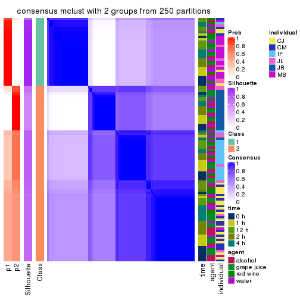</p>

</div>
<div id='tab-MAD-mclust-consensus-heatmap-2'>
<pre><code class="r">consensus_heatmap(res, k = 3)
</code></pre>

<p>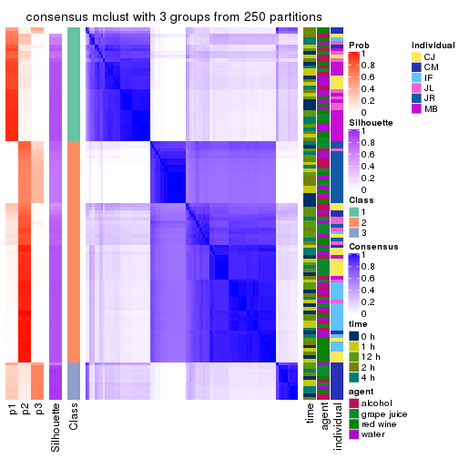</p>

</div>
<div id='tab-MAD-mclust-consensus-heatmap-3'>
<pre><code class="r">consensus_heatmap(res, k = 4)
</code></pre>

<p>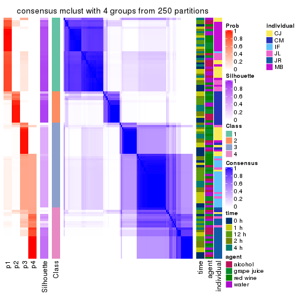</p>

</div>
<div id='tab-MAD-mclust-consensus-heatmap-4'>
<pre><code class="r">consensus_heatmap(res, k = 5)
</code></pre>

<p>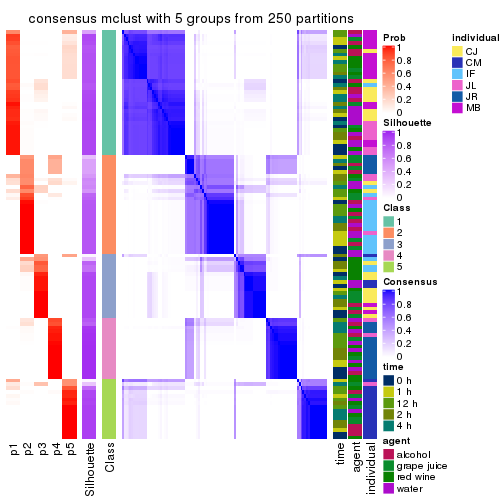</p>

</div>
<div id='tab-MAD-mclust-consensus-heatmap-5'>
<pre><code class="r">consensus_heatmap(res, k = 6)
</code></pre>

<p>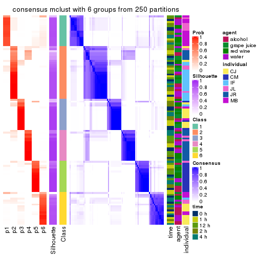</p>

</div>
</div>

Heatmaps for the membership of samples in all partitions to see how consistent they are:


<script>
$( function() {
	$( '#tabs-MAD-mclust-membership-heatmap' ).tabs();
} );
</script>
<div id='tabs-MAD-mclust-membership-heatmap'>
<ul>
<li><a href='#tab-MAD-mclust-membership-heatmap-1'>k = 2</a></li>
<li><a href='#tab-MAD-mclust-membership-heatmap-2'>k = 3</a></li>
<li><a href='#tab-MAD-mclust-membership-heatmap-3'>k = 4</a></li>
<li><a href='#tab-MAD-mclust-membership-heatmap-4'>k = 5</a></li>
<li><a href='#tab-MAD-mclust-membership-heatmap-5'>k = 6</a></li>
</ul>
<div id='tab-MAD-mclust-membership-heatmap-1'>
<pre><code class="r">membership_heatmap(res, k = 2)
</code></pre>

<p>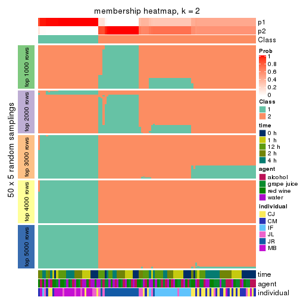</p>

</div>
<div id='tab-MAD-mclust-membership-heatmap-2'>
<pre><code class="r">membership_heatmap(res, k = 3)
</code></pre>

<p>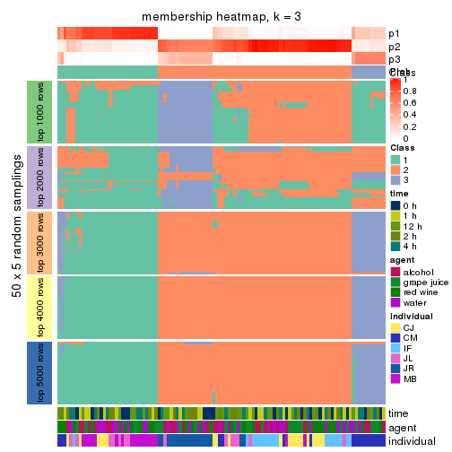</p>

</div>
<div id='tab-MAD-mclust-membership-heatmap-3'>
<pre><code class="r">membership_heatmap(res, k = 4)
</code></pre>

<p>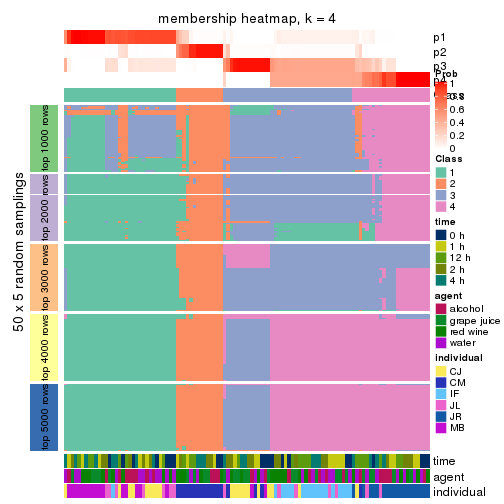</p>

</div>
<div id='tab-MAD-mclust-membership-heatmap-4'>
<pre><code class="r">membership_heatmap(res, k = 5)
</code></pre>

<p>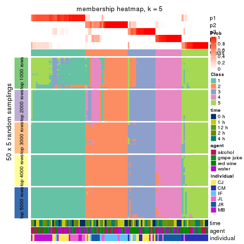</p>

</div>
<div id='tab-MAD-mclust-membership-heatmap-5'>
<pre><code class="r">membership_heatmap(res, k = 6)
</code></pre>

<p>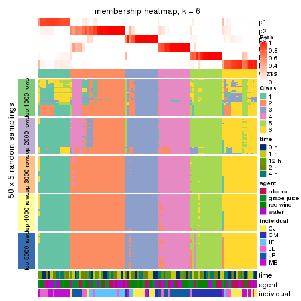</p>

</div>
</div>

As soon as we have had the classes for columns, we can look for signatures
which are significantly different between classes which can be candidate marks
for certain classes. Following are the heatmaps for signatures.


Signature heatmaps where rows are scaled:


<script>
$( function() {
	$( '#tabs-MAD-mclust-get-signatures' ).tabs();
} );
</script>
<div id='tabs-MAD-mclust-get-signatures'>
<ul>
<li><a href='#tab-MAD-mclust-get-signatures-1'>k = 2</a></li>
<li><a href='#tab-MAD-mclust-get-signatures-2'>k = 3</a></li>
<li><a href='#tab-MAD-mclust-get-signatures-3'>k = 4</a></li>
<li><a href='#tab-MAD-mclust-get-signatures-4'>k = 5</a></li>
<li><a href='#tab-MAD-mclust-get-signatures-5'>k = 6</a></li>
</ul>
<div id='tab-MAD-mclust-get-signatures-1'>
<pre><code class="r">get_signatures(res, k = 2)
</code></pre>

<p>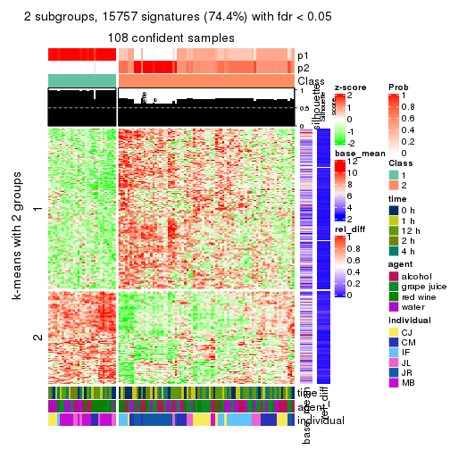</p>

</div>
<div id='tab-MAD-mclust-get-signatures-2'>
<pre><code class="r">get_signatures(res, k = 3)
</code></pre>

<p>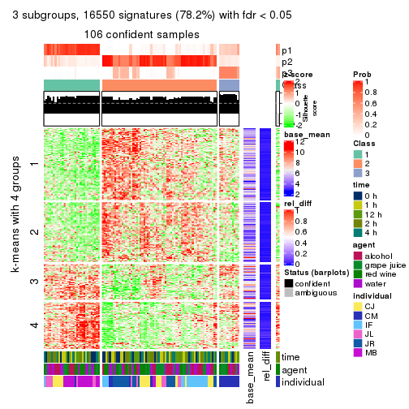</p>

</div>
<div id='tab-MAD-mclust-get-signatures-3'>
<pre><code class="r">get_signatures(res, k = 4)
</code></pre>

<p>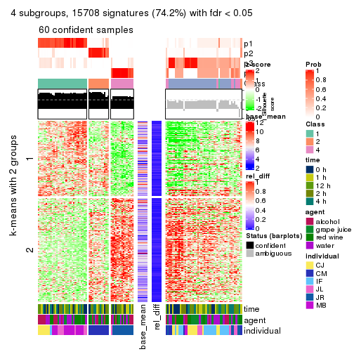</p>

</div>
<div id='tab-MAD-mclust-get-signatures-4'>
<pre><code class="r">get_signatures(res, k = 5)
</code></pre>

<p>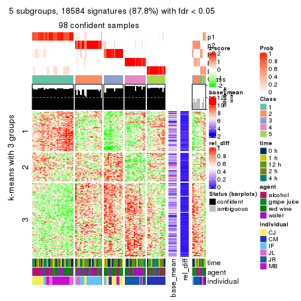</p>

</div>
<div id='tab-MAD-mclust-get-signatures-5'>
<pre><code class="r">get_signatures(res, k = 6)
</code></pre>

<p>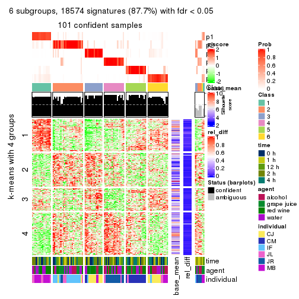</p>

</div>
</div>


Signature heatmaps where rows are not scaled:


<script>
$( function() {
	$( '#tabs-MAD-mclust-get-signatures-no-scale' ).tabs();
} );
</script>
<div id='tabs-MAD-mclust-get-signatures-no-scale'>
<ul>
<li><a href='#tab-MAD-mclust-get-signatures-no-scale-1'>k = 2</a></li>
<li><a href='#tab-MAD-mclust-get-signatures-no-scale-2'>k = 3</a></li>
<li><a href='#tab-MAD-mclust-get-signatures-no-scale-3'>k = 4</a></li>
<li><a href='#tab-MAD-mclust-get-signatures-no-scale-4'>k = 5</a></li>
<li><a href='#tab-MAD-mclust-get-signatures-no-scale-5'>k = 6</a></li>
</ul>
<div id='tab-MAD-mclust-get-signatures-no-scale-1'>
<pre><code class="r">get_signatures(res, k = 2, scale_rows = FALSE)
</code></pre>

<p>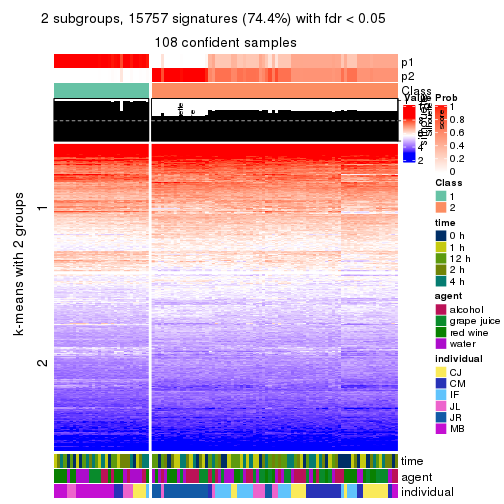</p>

</div>
<div id='tab-MAD-mclust-get-signatures-no-scale-2'>
<pre><code class="r">get_signatures(res, k = 3, scale_rows = FALSE)
</code></pre>

<p>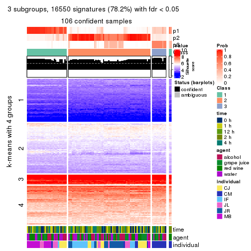</p>

</div>
<div id='tab-MAD-mclust-get-signatures-no-scale-3'>
<pre><code class="r">get_signatures(res, k = 4, scale_rows = FALSE)
</code></pre>

<p></p>

</div>
<div id='tab-MAD-mclust-get-signatures-no-scale-4'>
<pre><code class="r">get_signatures(res, k = 5, scale_rows = FALSE)
</code></pre>

<p>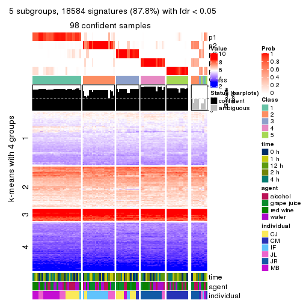</p>

</div>
<div id='tab-MAD-mclust-get-signatures-no-scale-5'>
<pre><code class="r">get_signatures(res, k = 6, scale_rows = FALSE)
</code></pre>

<p>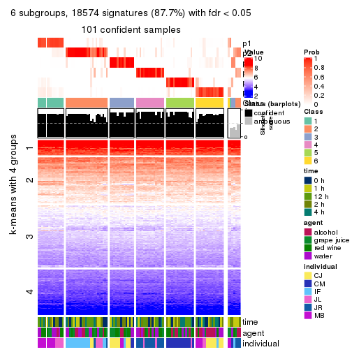</p>

</div>
</div>


Compare the overlap of signatures from different k:

```r
compare_signatures(res)
```

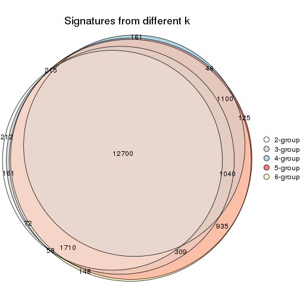

`get_signature()` returns a data frame invisibly. TO get the list of signatures, the function
call should be assigned to a variable explicitly. In following code, if `plot` argument is set
to `FALSE`, no heatmap is plotted while only the differential analysis is performed.

```r
# code only for demonstration
tb = get_signature(res, k = ..., plot = FALSE)
```

An example of the output of `tb` is:

```
#>   which_row         fdr    mean_1    mean_2 scaled_mean_1 scaled_mean_2 km
#> 1        38 0.042760348  8.373488  9.131774    -0.5533452     0.5164555  1
#> 2        40 0.018707592  7.106213  8.469186    -0.6173731     0.5762149  1
#> 3        55 0.019134737 10.221463 11.207825    -0.6159697     0.5749050  1
#> 4        59 0.006059896  5.921854  7.869574    -0.6899429     0.6439467  1
#> 5        60 0.018055526  8.928898 10.211722    -0.6204761     0.5791110  1
#> 6        98 0.009384629 15.714769 14.887706     0.6635654    -0.6193277  2
...
```

The columns in `tb` are:

1. `which_row`: row indices corresponding to the input matrix.
2. `fdr`: FDR for the differential test. 
3. `mean_x`: The mean value in group x.
4. `scaled_mean_x`: The mean value in group x after rows are scaled.
5. `km`: Row groups if k-means clustering is applied to rows.


UMAP plot which shows how samples are separated.


<script>
$( function() {
	$( '#tabs-MAD-mclust-dimension-reduction' ).tabs();
} );
</script>
<div id='tabs-MAD-mclust-dimension-reduction'>
<ul>
<li><a href='#tab-MAD-mclust-dimension-reduction-1'>k = 2</a></li>
<li><a href='#tab-MAD-mclust-dimension-reduction-2'>k = 3</a></li>
<li><a href='#tab-MAD-mclust-dimension-reduction-3'>k = 4</a></li>
<li><a href='#tab-MAD-mclust-dimension-reduction-4'>k = 5</a></li>
<li><a href='#tab-MAD-mclust-dimension-reduction-5'>k = 6</a></li>
</ul>
<div id='tab-MAD-mclust-dimension-reduction-1'>
<pre><code class="r">dimension_reduction(res, k = 2, method = &quot;UMAP&quot;)
</code></pre>

<p>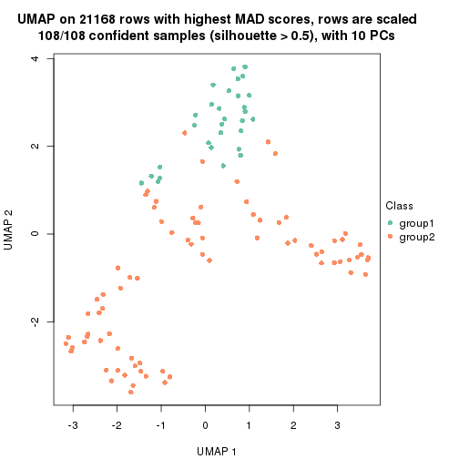</p>

</div>
<div id='tab-MAD-mclust-dimension-reduction-2'>
<pre><code class="r">dimension_reduction(res, k = 3, method = &quot;UMAP&quot;)
</code></pre>

<p>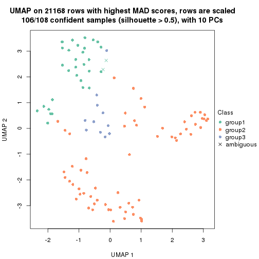</p>

</div>
<div id='tab-MAD-mclust-dimension-reduction-3'>
<pre><code class="r">dimension_reduction(res, k = 4, method = &quot;UMAP&quot;)
</code></pre>

<p>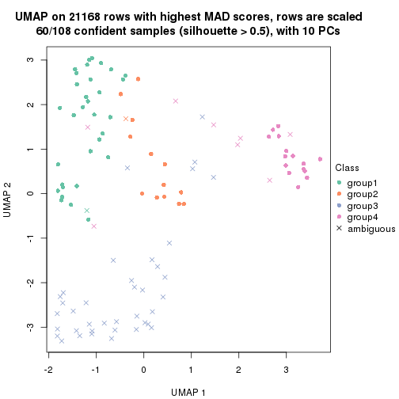</p>

</div>
<div id='tab-MAD-mclust-dimension-reduction-4'>
<pre><code class="r">dimension_reduction(res, k = 5, method = &quot;UMAP&quot;)
</code></pre>

<p>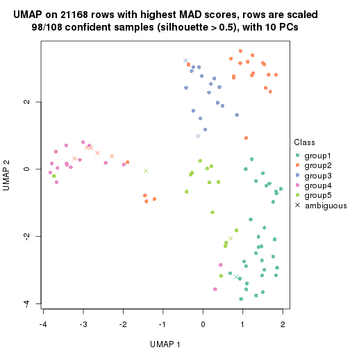</p>

</div>
<div id='tab-MAD-mclust-dimension-reduction-5'>
<pre><code class="r">dimension_reduction(res, k = 6, method = &quot;UMAP&quot;)
</code></pre>

<p>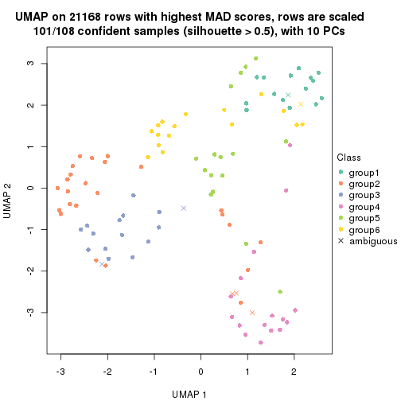</p>

</div>
</div>


Following heatmap shows how subgroups are split when increasing `k`:

```r
collect_classes(res)
```

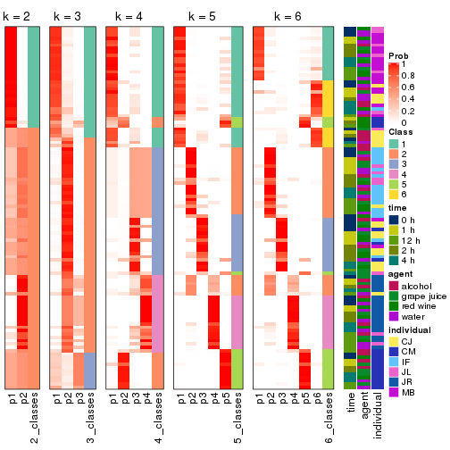


Test correlation between subgroups and known annotations. If the known
annotation is numeric, one-way ANOVA test is applied, and if the known
annotation is discrete, chi-squared contingency table test is applied.

```r
test_to_known_factors(res)
```

```
#>              n time(p) agent(p) individual(p) k
#> MAD:mclust 108   0.974    0.155      2.31e-09 2
#> MAD:mclust 106   0.997    0.834      1.42e-20 3
#> MAD:mclust  60   0.958    0.848      5.57e-20 4
#> MAD:mclust  98   0.968    0.673      7.06e-39 5
#> MAD:mclust 101   0.994    0.137      5.54e-39 6
```


If matrix rows can be associated to genes, consider to use `GO_Enrichment(res,
...)` to perform function enrichment for the signature genes.


 

---------------------------------------------------


### MAD:NMF


The object with results only for a single top-value method and a single partition method 
can be extracted as:

```r
res = res_list["MAD", "NMF"]
# you can also extract it by
# res = res_list["MAD:NMF"]
```

A summary of `res` and all the functions that can be applied to it:

```r
res
```

```
#> A 'ConsensusPartition' object with k = 2, 3, 4, 5, 6.
#>   On a matrix with 21168 rows and 108 columns.
#>   Top rows (1000, 2000, 3000, 4000, 5000) are extracted by 'MAD' method.
#>   Subgroups are detected by 'NMF' method.
#>   Performed in total 1250 partitions by row resampling.
#>   Best k for subgroups seems to be 2.
#> 
#> Following methods can be applied to this 'ConsensusPartition' object:
#>  [1] "cola_report"             "collect_classes"         "collect_plots"          
#>  [4] "collect_stats"           "colnames"                "compare_signatures"     
#>  [7] "consensus_heatmap"       "dimension_reduction"     "functional_enrichment"  
#> [10] "get_anno_col"            "get_anno"                "get_classes"            
#> [13] "get_consensus"           "get_matrix"              "get_membership"         
#> [16] "get_param"               "get_signatures"          "get_stats"              
#> [19] "is_best_k"               "is_stable_k"             "membership_heatmap"     
#> [22] "ncol"                    "nrow"                    "plot_ecdf"              
#> [25] "rownames"                "select_partition_number" "show"                   
#> [28] "suggest_best_k"          "test_to_known_factors"
```

`collect_plots()` function collects all the plots made from `res` for all `k` (number of partitions)
into one single page to provide an easy and fast comparison between different `k`.

```r
collect_plots(res)
```

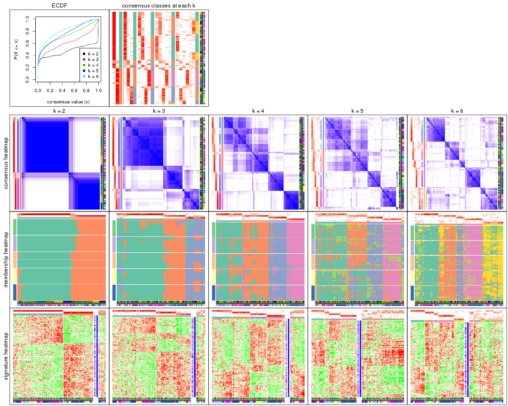

The plots are:

- The first row: a plot of the ECDF (Empirical cumulative distribution
  function) curves of the consensus matrix for each `k` and the heatmap of
  predicted classes for each `k`.
- The second row: heatmaps of the consensus matrix for each `k`.
- The third row: heatmaps of the membership matrix for each `k`.
- The fouth row: heatmaps of the signatures for each `k`.

All the plots in panels can be made by individual functions and they are
plotted later in this section.

`select_partition_number()` produces several plots showing different
statistics for choosing "optimized" `k`. There are following statistics:

- ECDF curves of the consensus matrix for each `k`;
- 1-PAC. [The PAC
  score](https://en.wikipedia.org/wiki/Consensus_clustering#Over-interpretation_potential_of_consensus_clustering)
  measures the proportion of the ambiguous subgrouping.
- Mean silhouette score.
- Concordance. The mean probability of fiting the consensus class ids in all
  partitions.
- Area increased. Denote $A_k$ as the area under the ECDF curve for current
  `k`, the area increased is defined as $A_k - A_{k-1}$.
- Rand index. The percent of pairs of samples that are both in a same cluster
  or both are not in a same cluster in the partition of k and k-1.
- Jaccard index. The ratio of pairs of samples are both in a same cluster in
  the partition of k and k-1 and the pairs of samples are both in a same
  cluster in the partition k or k-1.

The detailed explanations of these statistics can be found in [the cola
vignette](http://bioconductor.org/packages/devel/bioc/vignettes/cola/inst/doc/cola.html#toc_13).

Generally speaking, lower PAC score, higher mean silhouette score or higher
concordance corresponds to better partition. Rand index and Jaccard index
measure how similar the current partition is compared to partition with `k-1`.
If they are too similar, we won't accept `k` is better than `k-1`.

```r
select_partition_number(res)
```

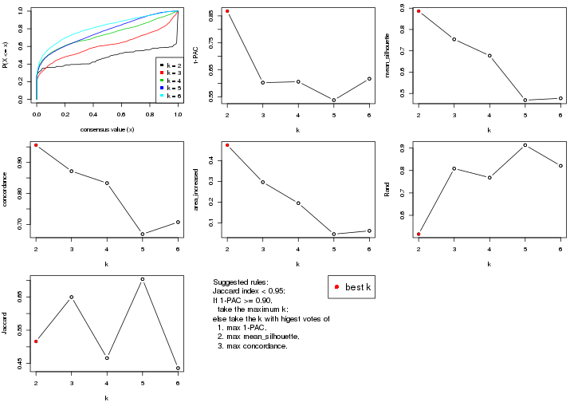

The numeric values for all these statistics can be obtained by `get_stats()`.

```r
get_stats(res)
```

```
#>   k 1-PAC mean_silhouette concordance area_increased  Rand Jaccard
#> 2 2 0.868           0.886       0.956         0.4747 0.516   0.516
#> 3 3 0.602           0.754       0.872         0.2961 0.809   0.650
#> 4 4 0.606           0.677       0.833         0.1948 0.768   0.466
#> 5 5 0.538           0.469       0.669         0.0456 0.913   0.703
#> 6 6 0.617           0.477       0.708         0.0614 0.821   0.436
```

`suggest_best_k()` suggests the best $k$ based on these statistics. The rules are as follows:

- All $k$ with Jaccard index larger than 0.95 are removed because the increase of
  the partition number does not provides enough extra information. If all $k$ are removed,
  the best $k$ is assigned by `NA`.
- For $k$ with 1-PAC larger than 0.9, the maximal $k$ is taken as the "best k". Other $k$ is called "optional k".
- If it does not fit the second rule. The $k$ with the highest vote of highest
  1-PAC, mean silhouette and concordance is taken as the "best k".

```r
suggest_best_k(res)
```

```
#> [1] 2
```


Following shows the table of the partitions (You need to click the **show/hide
code output** link to see it). The membership matrix (columns with name `p*`)
is inferred by
[`clue::cl_consensus()`](https://www.rdocumentation.org/link/cl_consensus?package=clue)
function with the `SE` method. Basically the value in the membership matrix
represents the probability to belong to a certain group. The finall class
label for an item is determined with the group with highest probability it
belongs to.

In `get_classes()` function, the entropy is calculated from the membership
matrix and the silhouette score is calculated from the consensus matrix.


<script>
$( function() {
	$( '#tabs-MAD-NMF-get-classes' ).tabs();
} );
</script>
<div id='tabs-MAD-NMF-get-classes'>
<ul>
<li><a href='#tab-MAD-NMF-get-classes-1'>k = 2</a></li>
<li><a href='#tab-MAD-NMF-get-classes-2'>k = 3</a></li>
<li><a href='#tab-MAD-NMF-get-classes-3'>k = 4</a></li>
<li><a href='#tab-MAD-NMF-get-classes-4'>k = 5</a></li>
<li><a href='#tab-MAD-NMF-get-classes-5'>k = 6</a></li>
</ul>

<div id='tab-MAD-NMF-get-classes-1'>
<p><a id='tab-MAD-NMF-get-classes-1-a' style='color:#0366d6' href='#'>show/hide code output</a></p>
<pre><code class="r">cbind(get_classes(res, k = 2), get_membership(res, k = 2))
</code></pre>

<pre><code>#&gt;          class entropy silhouette    p1    p2
#&gt; GSM87863     1  0.0000     0.9688 1.000 0.000
#&gt; GSM87887     1  0.0000     0.9688 1.000 0.000
#&gt; GSM87896     2  0.0000     0.9240 0.000 1.000
#&gt; GSM87934     2  0.0000     0.9240 0.000 1.000
#&gt; GSM87943     2  0.9833     0.3247 0.424 0.576
#&gt; GSM87853     2  0.0000     0.9240 0.000 1.000
#&gt; GSM87906     1  0.8955     0.4995 0.688 0.312
#&gt; GSM87920     1  0.0000     0.9688 1.000 0.000
#&gt; GSM87924     2  0.0000     0.9240 0.000 1.000
#&gt; GSM87858     2  0.0000     0.9240 0.000 1.000
#&gt; GSM87882     1  0.7950     0.6487 0.760 0.240
#&gt; GSM87891     2  0.0000     0.9240 0.000 1.000
#&gt; GSM87917     1  0.0000     0.9688 1.000 0.000
#&gt; GSM87929     2  0.9795     0.3511 0.416 0.584
#&gt; GSM87948     1  0.0000     0.9688 1.000 0.000
#&gt; GSM87868     1  0.0000     0.9688 1.000 0.000
#&gt; GSM87873     2  0.0000     0.9240 0.000 1.000
#&gt; GSM87901     1  0.0000     0.9688 1.000 0.000
#&gt; GSM87910     1  0.0000     0.9688 1.000 0.000
#&gt; GSM87938     2  0.0000     0.9240 0.000 1.000
#&gt; GSM87953     1  0.0000     0.9688 1.000 0.000
#&gt; GSM87864     1  0.0000     0.9688 1.000 0.000
#&gt; GSM87888     1  0.0376     0.9657 0.996 0.004
#&gt; GSM87897     1  0.9998    -0.0815 0.508 0.492
#&gt; GSM87935     2  0.0000     0.9240 0.000 1.000
#&gt; GSM87944     1  0.0000     0.9688 1.000 0.000
#&gt; GSM87854     1  0.0000     0.9688 1.000 0.000
#&gt; GSM87878     1  0.0000     0.9688 1.000 0.000
#&gt; GSM87907     2  0.0000     0.9240 0.000 1.000
#&gt; GSM87921     1  0.0672     0.9622 0.992 0.008
#&gt; GSM87925     2  0.0000     0.9240 0.000 1.000
#&gt; GSM87957     1  0.0000     0.9688 1.000 0.000
#&gt; GSM87859     2  0.0000     0.9240 0.000 1.000
#&gt; GSM87883     1  0.0000     0.9688 1.000 0.000
#&gt; GSM87892     2  0.0000     0.9240 0.000 1.000
#&gt; GSM87930     2  0.0000     0.9240 0.000 1.000
#&gt; GSM87949     1  0.0000     0.9688 1.000 0.000
#&gt; GSM87869     1  0.0000     0.9688 1.000 0.000
#&gt; GSM87874     2  0.0000     0.9240 0.000 1.000
#&gt; GSM87902     1  0.0000     0.9688 1.000 0.000
#&gt; GSM87911     1  0.0000     0.9688 1.000 0.000
#&gt; GSM87939     2  0.0000     0.9240 0.000 1.000
#&gt; GSM87954     1  0.0000     0.9688 1.000 0.000
#&gt; GSM87865     1  0.0000     0.9688 1.000 0.000
#&gt; GSM87889     1  0.0000     0.9688 1.000 0.000
#&gt; GSM87898     1  0.0000     0.9688 1.000 0.000
#&gt; GSM87915     1  0.0000     0.9688 1.000 0.000
#&gt; GSM87936     2  0.0000     0.9240 0.000 1.000
#&gt; GSM87945     2  0.0000     0.9240 0.000 1.000
#&gt; GSM87855     2  0.0000     0.9240 0.000 1.000
#&gt; GSM87879     1  0.1414     0.9507 0.980 0.020
#&gt; GSM87922     2  0.9552     0.4472 0.376 0.624
#&gt; GSM87926     2  0.3431     0.8806 0.064 0.936
#&gt; GSM87958     1  0.0000     0.9688 1.000 0.000
#&gt; GSM87860     2  0.0000     0.9240 0.000 1.000
#&gt; GSM87884     1  0.0000     0.9688 1.000 0.000
#&gt; GSM87893     2  0.0000     0.9240 0.000 1.000
#&gt; GSM87918     1  0.0000     0.9688 1.000 0.000
#&gt; GSM87931     2  0.0000     0.9240 0.000 1.000
#&gt; GSM87950     1  0.0000     0.9688 1.000 0.000
#&gt; GSM87870     1  0.0000     0.9688 1.000 0.000
#&gt; GSM87875     2  0.0000     0.9240 0.000 1.000
#&gt; GSM87903     1  0.9983    -0.0176 0.524 0.476
#&gt; GSM87912     1  0.0000     0.9688 1.000 0.000
#&gt; GSM87940     2  0.0000     0.9240 0.000 1.000
#&gt; GSM87866     1  0.0000     0.9688 1.000 0.000
#&gt; GSM87899     2  0.2043     0.9053 0.032 0.968
#&gt; GSM87937     2  0.0000     0.9240 0.000 1.000
#&gt; GSM87946     1  0.0000     0.9688 1.000 0.000
#&gt; GSM87856     2  0.2236     0.9026 0.036 0.964
#&gt; GSM87880     1  0.0376     0.9657 0.996 0.004
#&gt; GSM87908     1  0.0000     0.9688 1.000 0.000
#&gt; GSM87923     2  0.5629     0.8175 0.132 0.868
#&gt; GSM87927     2  0.9944     0.2350 0.456 0.544
#&gt; GSM87959     1  0.0000     0.9688 1.000 0.000
#&gt; GSM87861     2  0.0000     0.9240 0.000 1.000
#&gt; GSM87885     1  0.0000     0.9688 1.000 0.000
#&gt; GSM87894     1  0.0000     0.9688 1.000 0.000
#&gt; GSM87932     1  0.0000     0.9688 1.000 0.000
#&gt; GSM87951     1  0.0000     0.9688 1.000 0.000
#&gt; GSM87871     1  0.0000     0.9688 1.000 0.000
#&gt; GSM87876     1  0.0000     0.9688 1.000 0.000
#&gt; GSM87904     2  0.0938     0.9176 0.012 0.988
#&gt; GSM87913     1  0.0000     0.9688 1.000 0.000
#&gt; GSM87941     2  0.9635     0.4203 0.388 0.612
#&gt; GSM87955     1  0.0000     0.9688 1.000 0.000
#&gt; GSM87867     1  0.0000     0.9688 1.000 0.000
#&gt; GSM87890     2  0.0000     0.9240 0.000 1.000
#&gt; GSM87900     2  0.9909     0.2723 0.444 0.556
#&gt; GSM87916     2  0.7219     0.7400 0.200 0.800
#&gt; GSM87947     1  0.0000     0.9688 1.000 0.000
#&gt; GSM87857     2  0.1633     0.9105 0.024 0.976
#&gt; GSM87881     1  0.2236     0.9344 0.964 0.036
#&gt; GSM87909     1  0.0000     0.9688 1.000 0.000
#&gt; GSM87928     1  0.0000     0.9688 1.000 0.000
#&gt; GSM87960     1  0.0000     0.9688 1.000 0.000
#&gt; GSM87862     2  0.0000     0.9240 0.000 1.000
#&gt; GSM87886     1  0.0000     0.9688 1.000 0.000
#&gt; GSM87895     2  0.0000     0.9240 0.000 1.000
#&gt; GSM87919     1  0.0000     0.9688 1.000 0.000
#&gt; GSM87933     2  0.0000     0.9240 0.000 1.000
#&gt; GSM87952     1  0.0000     0.9688 1.000 0.000
#&gt; GSM87872     1  0.6887     0.7434 0.816 0.184
#&gt; GSM87877     1  0.0000     0.9688 1.000 0.000
#&gt; GSM87905     1  0.0000     0.9688 1.000 0.000
#&gt; GSM87914     1  0.0376     0.9657 0.996 0.004
#&gt; GSM87942     1  0.0376     0.9657 0.996 0.004
#&gt; GSM87956     1  0.0000     0.9688 1.000 0.000
</code></pre>

<script>
$('#tab-MAD-NMF-get-classes-1-a').parent().next().next().hide();
$('#tab-MAD-NMF-get-classes-1-a').click(function(){
  $('#tab-MAD-NMF-get-classes-1-a').parent().next().next().toggle();
  return(false);
});
</script>
</div>

<div id='tab-MAD-NMF-get-classes-2'>
<p><a id='tab-MAD-NMF-get-classes-2-a' style='color:#0366d6' href='#'>show/hide code output</a></p>
<pre><code class="r">cbind(get_classes(res, k = 3), get_membership(res, k = 3))
</code></pre>

<pre><code>#&gt;          class entropy silhouette    p1    p2    p3
#&gt; GSM87863     1  0.5529      0.630 0.704 0.000 0.296
#&gt; GSM87887     1  0.1163      0.893 0.972 0.000 0.028
#&gt; GSM87896     3  0.6309      0.347 0.000 0.496 0.504
#&gt; GSM87934     2  0.0237      0.808 0.000 0.996 0.004
#&gt; GSM87943     3  0.2625      0.706 0.084 0.000 0.916
#&gt; GSM87853     3  0.1529      0.731 0.000 0.040 0.960
#&gt; GSM87906     2  0.5785      0.566 0.332 0.668 0.000
#&gt; GSM87920     1  0.0848      0.898 0.984 0.008 0.008
#&gt; GSM87924     2  0.2448      0.743 0.000 0.924 0.076
#&gt; GSM87858     3  0.5905      0.593 0.000 0.352 0.648
#&gt; GSM87882     3  0.5733      0.413 0.324 0.000 0.676
#&gt; GSM87891     3  0.6299      0.392 0.000 0.476 0.524
#&gt; GSM87917     1  0.0424      0.898 0.992 0.008 0.000
#&gt; GSM87929     2  0.3192      0.803 0.112 0.888 0.000
#&gt; GSM87948     1  0.1031      0.894 0.976 0.000 0.024
#&gt; GSM87868     1  0.1753      0.887 0.952 0.000 0.048
#&gt; GSM87873     3  0.5835      0.605 0.000 0.340 0.660
#&gt; GSM87901     1  0.5591      0.536 0.696 0.304 0.000
#&gt; GSM87910     1  0.0592      0.898 0.988 0.012 0.000
#&gt; GSM87938     2  0.0237      0.808 0.000 0.996 0.004
#&gt; GSM87953     1  0.1031      0.895 0.976 0.024 0.000
#&gt; GSM87864     1  0.5560      0.623 0.700 0.000 0.300
#&gt; GSM87888     1  0.4887      0.730 0.772 0.000 0.228
#&gt; GSM87897     2  0.4834      0.713 0.204 0.792 0.004
#&gt; GSM87935     2  0.0592      0.802 0.000 0.988 0.012
#&gt; GSM87944     1  0.1289      0.892 0.968 0.000 0.032
#&gt; GSM87854     3  0.5497      0.478 0.292 0.000 0.708
#&gt; GSM87878     1  0.0747      0.897 0.984 0.016 0.000
#&gt; GSM87907     2  0.5465      0.302 0.000 0.712 0.288
#&gt; GSM87921     1  0.6204      0.197 0.576 0.424 0.000
#&gt; GSM87925     2  0.0829      0.814 0.012 0.984 0.004
#&gt; GSM87957     1  0.0237      0.898 0.996 0.004 0.000
#&gt; GSM87859     3  0.4346      0.707 0.000 0.184 0.816
#&gt; GSM87883     1  0.1411      0.891 0.964 0.000 0.036
#&gt; GSM87892     3  0.6111      0.539 0.000 0.396 0.604
#&gt; GSM87930     2  0.0747      0.799 0.000 0.984 0.016
#&gt; GSM87949     1  0.0592      0.898 0.988 0.012 0.000
#&gt; GSM87869     1  0.1643      0.889 0.956 0.000 0.044
#&gt; GSM87874     3  0.4235      0.710 0.000 0.176 0.824
#&gt; GSM87902     1  0.1964      0.877 0.944 0.056 0.000
#&gt; GSM87911     1  0.2584      0.872 0.928 0.064 0.008
#&gt; GSM87939     2  0.1753      0.822 0.048 0.952 0.000
#&gt; GSM87954     1  0.1031      0.895 0.976 0.024 0.000
#&gt; GSM87865     1  0.5178      0.691 0.744 0.000 0.256
#&gt; GSM87889     1  0.1529      0.889 0.960 0.000 0.040
#&gt; GSM87898     1  0.1860      0.880 0.948 0.052 0.000
#&gt; GSM87915     1  0.1964      0.877 0.944 0.056 0.000
#&gt; GSM87936     2  0.0424      0.805 0.000 0.992 0.008
#&gt; GSM87945     3  0.0237      0.728 0.004 0.000 0.996
#&gt; GSM87855     3  0.0592      0.727 0.012 0.000 0.988
#&gt; GSM87879     3  0.5859      0.362 0.344 0.000 0.656
#&gt; GSM87922     2  0.3500      0.802 0.116 0.880 0.004
#&gt; GSM87926     2  0.2165      0.820 0.064 0.936 0.000
#&gt; GSM87958     1  0.0747      0.897 0.984 0.016 0.000
#&gt; GSM87860     3  0.2590      0.733 0.004 0.072 0.924
#&gt; GSM87884     1  0.1289      0.892 0.968 0.000 0.032
#&gt; GSM87893     3  0.6045      0.561 0.000 0.380 0.620
#&gt; GSM87918     1  0.2537      0.859 0.920 0.080 0.000
#&gt; GSM87931     2  0.1529      0.821 0.040 0.960 0.000
#&gt; GSM87950     1  0.0592      0.898 0.988 0.012 0.000
#&gt; GSM87870     1  0.1031      0.895 0.976 0.000 0.024
#&gt; GSM87875     3  0.1860      0.719 0.052 0.000 0.948
#&gt; GSM87903     2  0.6252      0.533 0.344 0.648 0.008
#&gt; GSM87912     1  0.1163      0.893 0.972 0.028 0.000
#&gt; GSM87940     2  0.0983      0.815 0.016 0.980 0.004
#&gt; GSM87866     1  0.2448      0.872 0.924 0.000 0.076
#&gt; GSM87899     3  0.4840      0.713 0.016 0.168 0.816
#&gt; GSM87937     2  0.0424      0.805 0.000 0.992 0.008
#&gt; GSM87946     1  0.1753      0.886 0.952 0.000 0.048
#&gt; GSM87856     3  0.2537      0.709 0.080 0.000 0.920
#&gt; GSM87880     1  0.5835      0.553 0.660 0.000 0.340
#&gt; GSM87908     1  0.1860      0.880 0.948 0.052 0.000
#&gt; GSM87923     3  0.7462      0.663 0.124 0.180 0.696
#&gt; GSM87927     2  0.3482      0.792 0.128 0.872 0.000
#&gt; GSM87959     1  0.0237      0.898 0.996 0.000 0.004
#&gt; GSM87861     3  0.1753      0.734 0.000 0.048 0.952
#&gt; GSM87885     1  0.1411      0.891 0.964 0.000 0.036
#&gt; GSM87894     1  0.4346      0.778 0.816 0.000 0.184
#&gt; GSM87932     1  0.3038      0.836 0.896 0.104 0.000
#&gt; GSM87951     1  0.0592      0.898 0.988 0.012 0.000
#&gt; GSM87871     1  0.4452      0.772 0.808 0.000 0.192
#&gt; GSM87876     1  0.2448      0.869 0.924 0.000 0.076
#&gt; GSM87904     3  0.5656      0.652 0.004 0.284 0.712
#&gt; GSM87913     1  0.1711      0.896 0.960 0.008 0.032
#&gt; GSM87941     2  0.3192      0.803 0.112 0.888 0.000
#&gt; GSM87955     1  0.0592      0.898 0.988 0.012 0.000
#&gt; GSM87867     1  0.2537      0.868 0.920 0.000 0.080
#&gt; GSM87890     2  0.2537      0.739 0.000 0.920 0.080
#&gt; GSM87900     2  0.3412      0.795 0.124 0.876 0.000
#&gt; GSM87916     2  0.2448      0.818 0.076 0.924 0.000
#&gt; GSM87947     1  0.4062      0.798 0.836 0.000 0.164
#&gt; GSM87857     3  0.2448      0.710 0.076 0.000 0.924
#&gt; GSM87881     1  0.4045      0.835 0.872 0.104 0.024
#&gt; GSM87909     1  0.4452      0.729 0.808 0.192 0.000
#&gt; GSM87928     1  0.5706      0.492 0.680 0.320 0.000
#&gt; GSM87960     1  0.0237      0.898 0.996 0.000 0.004
#&gt; GSM87862     3  0.6204      0.494 0.000 0.424 0.576
#&gt; GSM87886     1  0.0000      0.898 1.000 0.000 0.000
#&gt; GSM87895     2  0.2625      0.734 0.000 0.916 0.084
#&gt; GSM87919     1  0.1031      0.895 0.976 0.024 0.000
#&gt; GSM87933     2  0.1753      0.822 0.048 0.952 0.000
#&gt; GSM87952     1  0.0237      0.898 0.996 0.004 0.000
#&gt; GSM87872     1  0.6008      0.346 0.628 0.372 0.000
#&gt; GSM87877     1  0.1643      0.888 0.956 0.000 0.044
#&gt; GSM87905     1  0.2796      0.848 0.908 0.092 0.000
#&gt; GSM87914     2  0.6140      0.390 0.404 0.596 0.000
#&gt; GSM87942     2  0.5859      0.537 0.344 0.656 0.000
#&gt; GSM87956     1  0.0747      0.897 0.984 0.016 0.000
</code></pre>

<script>
$('#tab-MAD-NMF-get-classes-2-a').parent().next().next().hide();
$('#tab-MAD-NMF-get-classes-2-a').click(function(){
  $('#tab-MAD-NMF-get-classes-2-a').parent().next().next().toggle();
  return(false);
});
</script>
</div>

<div id='tab-MAD-NMF-get-classes-3'>
<p><a id='tab-MAD-NMF-get-classes-3-a' style='color:#0366d6' href='#'>show/hide code output</a></p>
<pre><code class="r">cbind(get_classes(res, k = 4), get_membership(res, k = 4))
</code></pre>

<pre><code>#&gt;          class entropy silhouette    p1    p2    p3    p4
#&gt; GSM87863     2  0.3497     0.6863 0.124 0.852 0.024 0.000
#&gt; GSM87887     2  0.1151     0.7372 0.024 0.968 0.000 0.008
#&gt; GSM87896     3  0.3873     0.7462 0.000 0.000 0.772 0.228
#&gt; GSM87934     4  0.0779     0.9337 0.016 0.000 0.004 0.980
#&gt; GSM87943     3  0.5147     0.2577 0.004 0.460 0.536 0.000
#&gt; GSM87853     3  0.1004     0.8653 0.004 0.024 0.972 0.000
#&gt; GSM87906     1  0.4426     0.6560 0.812 0.000 0.096 0.092
#&gt; GSM87920     2  0.4950     0.2462 0.376 0.620 0.000 0.004
#&gt; GSM87924     4  0.0921     0.9158 0.000 0.000 0.028 0.972
#&gt; GSM87858     3  0.2081     0.8547 0.000 0.000 0.916 0.084
#&gt; GSM87882     2  0.3707     0.6665 0.000 0.840 0.132 0.028
#&gt; GSM87891     3  0.4250     0.6879 0.000 0.000 0.724 0.276
#&gt; GSM87917     1  0.4222     0.6465 0.728 0.272 0.000 0.000
#&gt; GSM87929     4  0.1807     0.9246 0.052 0.008 0.000 0.940
#&gt; GSM87948     2  0.2611     0.7169 0.096 0.896 0.000 0.008
#&gt; GSM87868     2  0.4454     0.4605 0.308 0.692 0.000 0.000
#&gt; GSM87873     3  0.2281     0.8498 0.000 0.000 0.904 0.096
#&gt; GSM87901     1  0.2813     0.7180 0.896 0.024 0.000 0.080
#&gt; GSM87910     1  0.3123     0.7212 0.844 0.156 0.000 0.000
#&gt; GSM87938     4  0.0188     0.9288 0.000 0.000 0.004 0.996
#&gt; GSM87953     1  0.3801     0.6974 0.780 0.220 0.000 0.000
#&gt; GSM87864     2  0.3335     0.6861 0.128 0.856 0.016 0.000
#&gt; GSM87888     2  0.2542     0.6997 0.000 0.904 0.084 0.012
#&gt; GSM87897     1  0.2944     0.6482 0.868 0.000 0.128 0.004
#&gt; GSM87935     4  0.1388     0.9317 0.028 0.000 0.012 0.960
#&gt; GSM87944     2  0.1867     0.7305 0.072 0.928 0.000 0.000
#&gt; GSM87854     3  0.6160     0.5060 0.072 0.316 0.612 0.000
#&gt; GSM87878     2  0.5694     0.5146 0.224 0.696 0.000 0.080
#&gt; GSM87907     3  0.4139     0.7738 0.176 0.000 0.800 0.024
#&gt; GSM87921     1  0.1492     0.7247 0.956 0.004 0.004 0.036
#&gt; GSM87925     4  0.1743     0.9245 0.056 0.000 0.004 0.940
#&gt; GSM87957     1  0.5172     0.2463 0.588 0.404 0.000 0.008
#&gt; GSM87859     3  0.0592     0.8673 0.000 0.000 0.984 0.016
#&gt; GSM87883     2  0.1109     0.7377 0.028 0.968 0.000 0.004
#&gt; GSM87892     3  0.1792     0.8587 0.000 0.000 0.932 0.068
#&gt; GSM87930     4  0.0524     0.9294 0.004 0.000 0.008 0.988
#&gt; GSM87949     1  0.5147     0.2968 0.536 0.460 0.000 0.004
#&gt; GSM87869     1  0.4907     0.2320 0.580 0.420 0.000 0.000
#&gt; GSM87874     3  0.1520     0.8664 0.000 0.020 0.956 0.024
#&gt; GSM87902     1  0.1593     0.7288 0.956 0.024 0.016 0.004
#&gt; GSM87911     1  0.2466     0.6965 0.900 0.004 0.096 0.000
#&gt; GSM87939     4  0.0592     0.9339 0.016 0.000 0.000 0.984
#&gt; GSM87954     1  0.3266     0.7237 0.832 0.168 0.000 0.000
#&gt; GSM87865     2  0.5398     0.3746 0.404 0.580 0.016 0.000
#&gt; GSM87889     2  0.1488     0.7348 0.012 0.956 0.000 0.032
#&gt; GSM87898     1  0.1004     0.7149 0.972 0.000 0.024 0.004
#&gt; GSM87915     1  0.3219     0.7256 0.836 0.164 0.000 0.000
#&gt; GSM87936     4  0.1824     0.9226 0.060 0.000 0.004 0.936
#&gt; GSM87945     3  0.1637     0.8568 0.000 0.060 0.940 0.000
#&gt; GSM87855     3  0.1305     0.8635 0.004 0.036 0.960 0.000
#&gt; GSM87879     2  0.2814     0.6660 0.000 0.868 0.132 0.000
#&gt; GSM87922     4  0.1631     0.9164 0.008 0.016 0.020 0.956
#&gt; GSM87926     4  0.1118     0.9312 0.036 0.000 0.000 0.964
#&gt; GSM87958     1  0.3257     0.7267 0.844 0.152 0.000 0.004
#&gt; GSM87860     3  0.0376     0.8669 0.000 0.004 0.992 0.004
#&gt; GSM87884     2  0.1209     0.7373 0.032 0.964 0.000 0.004
#&gt; GSM87893     3  0.1792     0.8596 0.000 0.000 0.932 0.068
#&gt; GSM87918     1  0.1724     0.7335 0.948 0.032 0.000 0.020
#&gt; GSM87931     4  0.0469     0.9337 0.012 0.000 0.000 0.988
#&gt; GSM87950     2  0.5263    -0.0308 0.448 0.544 0.000 0.008
#&gt; GSM87870     1  0.4985     0.2406 0.532 0.468 0.000 0.000
#&gt; GSM87875     2  0.5407    -0.1892 0.000 0.504 0.484 0.012
#&gt; GSM87903     1  0.5740     0.5245 0.700 0.000 0.208 0.092
#&gt; GSM87912     1  0.4072     0.6732 0.748 0.252 0.000 0.000
#&gt; GSM87940     4  0.0336     0.9330 0.008 0.000 0.000 0.992
#&gt; GSM87866     2  0.4898     0.2812 0.416 0.584 0.000 0.000
#&gt; GSM87899     3  0.4331     0.6363 0.288 0.000 0.712 0.000
#&gt; GSM87937     4  0.0779     0.9337 0.016 0.000 0.004 0.980
#&gt; GSM87946     2  0.2647     0.7053 0.120 0.880 0.000 0.000
#&gt; GSM87856     3  0.2530     0.8292 0.004 0.100 0.896 0.000
#&gt; GSM87880     2  0.2281     0.6911 0.000 0.904 0.096 0.000
#&gt; GSM87908     1  0.1109     0.7137 0.968 0.000 0.028 0.004
#&gt; GSM87923     2  0.7301     0.1103 0.000 0.452 0.152 0.396
#&gt; GSM87927     4  0.3528     0.8142 0.192 0.000 0.000 0.808
#&gt; GSM87959     2  0.4155     0.5701 0.240 0.756 0.000 0.004
#&gt; GSM87861     3  0.0336     0.8664 0.000 0.008 0.992 0.000
#&gt; GSM87885     2  0.2010     0.7324 0.012 0.940 0.008 0.040
#&gt; GSM87894     1  0.5263     0.1453 0.544 0.448 0.008 0.000
#&gt; GSM87932     1  0.3625     0.7160 0.828 0.160 0.000 0.012
#&gt; GSM87951     1  0.5168     0.1775 0.500 0.496 0.000 0.004
#&gt; GSM87871     2  0.4989     0.6630 0.164 0.764 0.072 0.000
#&gt; GSM87876     2  0.0657     0.7291 0.000 0.984 0.012 0.004
#&gt; GSM87904     3  0.2401     0.8404 0.092 0.000 0.904 0.004
#&gt; GSM87913     1  0.3306     0.6971 0.840 0.156 0.004 0.000
#&gt; GSM87941     4  0.2011     0.9105 0.080 0.000 0.000 0.920
#&gt; GSM87955     1  0.4741     0.5744 0.668 0.328 0.000 0.004
#&gt; GSM87867     2  0.2412     0.7276 0.084 0.908 0.008 0.000
#&gt; GSM87890     4  0.0779     0.9233 0.000 0.016 0.004 0.980
#&gt; GSM87900     1  0.4286     0.6537 0.812 0.000 0.052 0.136
#&gt; GSM87916     4  0.0376     0.9273 0.000 0.004 0.004 0.992
#&gt; GSM87947     2  0.0524     0.7316 0.004 0.988 0.008 0.000
#&gt; GSM87857     3  0.0657     0.8659 0.004 0.012 0.984 0.000
#&gt; GSM87881     2  0.5702     0.3099 0.016 0.572 0.008 0.404
#&gt; GSM87909     1  0.1114     0.7277 0.972 0.016 0.008 0.004
#&gt; GSM87928     1  0.5204     0.6735 0.752 0.160 0.000 0.088
#&gt; GSM87960     2  0.4855     0.3441 0.352 0.644 0.000 0.004
#&gt; GSM87862     3  0.3074     0.8104 0.000 0.000 0.848 0.152
#&gt; GSM87886     2  0.2048     0.7311 0.064 0.928 0.000 0.008
#&gt; GSM87895     3  0.4364     0.7204 0.016 0.000 0.764 0.220
#&gt; GSM87919     1  0.4401     0.6535 0.724 0.272 0.000 0.004
#&gt; GSM87933     4  0.0336     0.9330 0.008 0.000 0.000 0.992
#&gt; GSM87952     2  0.5050     0.1414 0.408 0.588 0.000 0.004
#&gt; GSM87872     4  0.5361     0.6730 0.108 0.148 0.000 0.744
#&gt; GSM87877     2  0.1256     0.7373 0.028 0.964 0.000 0.008
#&gt; GSM87905     1  0.0779     0.7291 0.980 0.016 0.000 0.004
#&gt; GSM87914     4  0.4663     0.6994 0.272 0.012 0.000 0.716
#&gt; GSM87942     4  0.3863     0.8424 0.144 0.028 0.000 0.828
#&gt; GSM87956     1  0.5250     0.3417 0.552 0.440 0.000 0.008
</code></pre>

<script>
$('#tab-MAD-NMF-get-classes-3-a').parent().next().next().hide();
$('#tab-MAD-NMF-get-classes-3-a').click(function(){
  $('#tab-MAD-NMF-get-classes-3-a').parent().next().next().toggle();
  return(false);
});
</script>
</div>

<div id='tab-MAD-NMF-get-classes-4'>
<p><a id='tab-MAD-NMF-get-classes-4-a' style='color:#0366d6' href='#'>show/hide code output</a></p>
<pre><code class="r">cbind(get_classes(res, k = 5), get_membership(res, k = 5))
</code></pre>

<pre><code>#&gt;          class entropy silhouette    p1    p2    p3    p4    p5
#&gt; GSM87863     1  0.4682     0.5169 0.724 0.060 0.004 0.000 0.212
#&gt; GSM87887     1  0.4558     0.5704 0.744 0.168 0.000 0.000 0.088
#&gt; GSM87896     3  0.3206     0.6522 0.000 0.016 0.868 0.072 0.044
#&gt; GSM87934     4  0.0693     0.8085 0.000 0.012 0.000 0.980 0.008
#&gt; GSM87943     5  0.6133     0.4820 0.328 0.000 0.148 0.000 0.524
#&gt; GSM87853     3  0.4009     0.3410 0.004 0.000 0.684 0.000 0.312
#&gt; GSM87906     2  0.5556     0.2569 0.000 0.572 0.364 0.012 0.052
#&gt; GSM87920     1  0.6249     0.3654 0.548 0.284 0.000 0.004 0.164
#&gt; GSM87924     4  0.4431     0.7822 0.000 0.056 0.052 0.800 0.092
#&gt; GSM87858     3  0.1281     0.6742 0.000 0.012 0.956 0.000 0.032
#&gt; GSM87882     1  0.7505     0.3160 0.596 0.060 0.080 0.104 0.160
#&gt; GSM87891     3  0.3597     0.6214 0.000 0.024 0.848 0.052 0.076
#&gt; GSM87917     2  0.3967     0.4402 0.264 0.724 0.000 0.000 0.012
#&gt; GSM87929     4  0.4317     0.7679 0.036 0.064 0.004 0.812 0.084
#&gt; GSM87948     1  0.3346     0.5900 0.844 0.092 0.000 0.000 0.064
#&gt; GSM87868     1  0.4663     0.3699 0.604 0.376 0.000 0.000 0.020
#&gt; GSM87873     3  0.4563     0.5146 0.008 0.072 0.800 0.036 0.084
#&gt; GSM87901     2  0.5167     0.5320 0.144 0.740 0.064 0.000 0.052
#&gt; GSM87910     2  0.4536     0.4635 0.240 0.712 0.000 0.000 0.048
#&gt; GSM87938     4  0.5267     0.7227 0.012 0.080 0.048 0.756 0.104
#&gt; GSM87953     2  0.4114     0.4278 0.272 0.712 0.000 0.000 0.016
#&gt; GSM87864     1  0.3493     0.5708 0.832 0.060 0.000 0.000 0.108
#&gt; GSM87888     1  0.4703     0.4761 0.792 0.024 0.028 0.044 0.112
#&gt; GSM87897     2  0.6724     0.0558 0.004 0.480 0.336 0.008 0.172
#&gt; GSM87935     4  0.3820     0.7595 0.004 0.044 0.004 0.816 0.132
#&gt; GSM87944     1  0.3193     0.5934 0.840 0.132 0.000 0.000 0.028
#&gt; GSM87854     5  0.6752     0.4067 0.152 0.020 0.356 0.000 0.472
#&gt; GSM87878     1  0.5729     0.2177 0.516 0.396 0.000 0.000 0.088
#&gt; GSM87907     3  0.5317     0.5359 0.000 0.172 0.708 0.020 0.100
#&gt; GSM87921     4  0.6455     0.4833 0.008 0.240 0.000 0.544 0.208
#&gt; GSM87925     4  0.3201     0.7755 0.000 0.052 0.000 0.852 0.096
#&gt; GSM87957     1  0.8547    -0.0235 0.308 0.256 0.000 0.216 0.220
#&gt; GSM87859     3  0.2707     0.6279 0.000 0.008 0.860 0.000 0.132
#&gt; GSM87883     1  0.3906     0.5922 0.804 0.112 0.000 0.000 0.084
#&gt; GSM87892     3  0.1280     0.6860 0.000 0.024 0.960 0.008 0.008
#&gt; GSM87930     4  0.3383     0.7796 0.000 0.060 0.012 0.856 0.072
#&gt; GSM87949     1  0.4902     0.2813 0.564 0.408 0.000 0.000 0.028
#&gt; GSM87869     1  0.5557     0.0910 0.472 0.460 0.000 0.000 0.068
#&gt; GSM87874     3  0.5374     0.4515 0.008 0.068 0.732 0.040 0.152
#&gt; GSM87902     2  0.5036     0.5353 0.036 0.732 0.180 0.000 0.052
#&gt; GSM87911     2  0.7952     0.0527 0.008 0.372 0.060 0.232 0.328
#&gt; GSM87939     4  0.0912     0.8089 0.000 0.012 0.000 0.972 0.016
#&gt; GSM87954     2  0.5033     0.4589 0.236 0.692 0.000 0.008 0.064
#&gt; GSM87865     1  0.6198     0.0967 0.464 0.428 0.012 0.000 0.096
#&gt; GSM87889     1  0.3499     0.5844 0.860 0.028 0.012 0.020 0.080
#&gt; GSM87898     2  0.4723     0.5467 0.040 0.776 0.112 0.000 0.072
#&gt; GSM87915     2  0.4971     0.4818 0.216 0.716 0.000 0.032 0.036
#&gt; GSM87936     4  0.3869     0.7597 0.004 0.052 0.004 0.816 0.124
#&gt; GSM87945     5  0.5650     0.2471 0.076 0.000 0.456 0.000 0.468
#&gt; GSM87855     3  0.4251     0.1852 0.000 0.004 0.624 0.000 0.372
#&gt; GSM87879     1  0.4701     0.3974 0.752 0.012 0.056 0.004 0.176
#&gt; GSM87922     4  0.3446     0.7884 0.016 0.024 0.028 0.868 0.064
#&gt; GSM87926     4  0.1364     0.8063 0.000 0.036 0.000 0.952 0.012
#&gt; GSM87958     2  0.8451     0.0650 0.276 0.332 0.000 0.196 0.196
#&gt; GSM87860     3  0.2645     0.6735 0.000 0.068 0.888 0.000 0.044
#&gt; GSM87884     1  0.4478     0.5798 0.756 0.144 0.000 0.000 0.100
#&gt; GSM87893     3  0.0451     0.6838 0.000 0.004 0.988 0.000 0.008
#&gt; GSM87918     4  0.8002     0.1674 0.112 0.284 0.000 0.408 0.196
#&gt; GSM87931     4  0.2142     0.7981 0.000 0.028 0.004 0.920 0.048
#&gt; GSM87950     1  0.4655     0.4241 0.644 0.328 0.000 0.000 0.028
#&gt; GSM87870     2  0.4894     0.2828 0.352 0.612 0.000 0.000 0.036
#&gt; GSM87875     1  0.6285    -0.4322 0.456 0.000 0.152 0.000 0.392
#&gt; GSM87903     2  0.5637     0.0696 0.000 0.508 0.428 0.008 0.056
#&gt; GSM87912     2  0.4326     0.4381 0.264 0.708 0.000 0.000 0.028
#&gt; GSM87940     4  0.3634     0.7754 0.000 0.056 0.020 0.844 0.080
#&gt; GSM87866     1  0.5157     0.1832 0.520 0.440 0.000 0.000 0.040
#&gt; GSM87899     3  0.5895     0.3702 0.000 0.260 0.588 0.000 0.152
#&gt; GSM87937     4  0.1605     0.8070 0.004 0.012 0.000 0.944 0.040
#&gt; GSM87946     1  0.3602     0.5689 0.796 0.180 0.000 0.000 0.024
#&gt; GSM87856     3  0.5675    -0.2963 0.068 0.004 0.508 0.000 0.420
#&gt; GSM87880     1  0.3096     0.5330 0.872 0.004 0.032 0.008 0.084
#&gt; GSM87908     2  0.6024     0.3986 0.012 0.604 0.256 0.000 0.128
#&gt; GSM87923     1  0.7960    -0.1421 0.420 0.028 0.052 0.336 0.164
#&gt; GSM87927     4  0.4192     0.7373 0.004 0.068 0.000 0.784 0.144
#&gt; GSM87959     1  0.4297     0.5263 0.728 0.236 0.000 0.000 0.036
#&gt; GSM87861     3  0.2723     0.6538 0.000 0.012 0.864 0.000 0.124
#&gt; GSM87885     1  0.5445     0.5576 0.748 0.084 0.020 0.044 0.104
#&gt; GSM87894     2  0.4996     0.4195 0.280 0.664 0.004 0.000 0.052
#&gt; GSM87932     2  0.5909     0.4741 0.156 0.680 0.000 0.112 0.052
#&gt; GSM87951     2  0.5048    -0.1076 0.476 0.492 0.000 0.000 0.032
#&gt; GSM87871     1  0.6139     0.3126 0.528 0.380 0.048 0.000 0.044
#&gt; GSM87876     1  0.2032     0.5861 0.924 0.004 0.020 0.000 0.052
#&gt; GSM87904     3  0.3437     0.6316 0.000 0.120 0.832 0.000 0.048
#&gt; GSM87913     2  0.6529     0.3278 0.176 0.468 0.000 0.004 0.352
#&gt; GSM87941     4  0.1626     0.8045 0.000 0.044 0.000 0.940 0.016
#&gt; GSM87955     1  0.5556     0.0699 0.476 0.456 0.000 0.000 0.068
#&gt; GSM87867     1  0.3883     0.5653 0.780 0.184 0.000 0.000 0.036
#&gt; GSM87890     4  0.8766     0.3522 0.200 0.080 0.140 0.460 0.120
#&gt; GSM87900     2  0.5895     0.3789 0.000 0.632 0.264 0.056 0.048
#&gt; GSM87916     4  0.7677     0.5761 0.056 0.120 0.088 0.580 0.156
#&gt; GSM87947     1  0.3183     0.5365 0.828 0.016 0.000 0.000 0.156
#&gt; GSM87857     3  0.3368     0.6175 0.000 0.024 0.820 0.000 0.156
#&gt; GSM87881     1  0.5849     0.4163 0.668 0.028 0.008 0.216 0.080
#&gt; GSM87909     2  0.6326     0.5201 0.072 0.692 0.088 0.032 0.116
#&gt; GSM87928     2  0.6816     0.3122 0.140 0.520 0.000 0.304 0.036
#&gt; GSM87960     1  0.4644     0.4837 0.680 0.280 0.000 0.000 0.040
#&gt; GSM87862     3  0.5068     0.5897 0.068 0.040 0.784 0.044 0.064
#&gt; GSM87886     1  0.4370     0.5673 0.744 0.200 0.000 0.000 0.056
#&gt; GSM87895     3  0.4268     0.6225 0.000 0.064 0.804 0.104 0.028
#&gt; GSM87919     2  0.4546     0.3731 0.304 0.668 0.000 0.000 0.028
#&gt; GSM87933     4  0.4735     0.7539 0.028 0.068 0.024 0.796 0.084
#&gt; GSM87952     1  0.4624     0.4134 0.636 0.340 0.000 0.000 0.024
#&gt; GSM87872     1  0.8687     0.2374 0.464 0.208 0.120 0.136 0.072
#&gt; GSM87877     1  0.2540     0.6024 0.888 0.088 0.000 0.000 0.024
#&gt; GSM87905     2  0.4577     0.5514 0.092 0.796 0.064 0.004 0.044
#&gt; GSM87914     4  0.2609     0.7982 0.008 0.068 0.000 0.896 0.028
#&gt; GSM87942     4  0.3921     0.7819 0.024 0.072 0.000 0.828 0.076
#&gt; GSM87956     1  0.4949     0.3018 0.572 0.396 0.000 0.000 0.032
</code></pre>

<script>
$('#tab-MAD-NMF-get-classes-4-a').parent().next().next().hide();
$('#tab-MAD-NMF-get-classes-4-a').click(function(){
  $('#tab-MAD-NMF-get-classes-4-a').parent().next().next().toggle();
  return(false);
});
</script>
</div>

<div id='tab-MAD-NMF-get-classes-5'>
<p><a id='tab-MAD-NMF-get-classes-5-a' style='color:#0366d6' href='#'>show/hide code output</a></p>
<pre><code class="r">cbind(get_classes(res, k = 6), get_membership(res, k = 6))
</code></pre>

<pre><code>#&gt;          class entropy silhouette    p1    p2    p3    p4    p5    p6
#&gt; GSM87863     3  0.4800     0.4042 0.192 0.012 0.716 0.000 0.024 0.056
#&gt; GSM87887     6  0.6514     0.2973 0.176 0.000 0.056 0.004 0.236 0.528
#&gt; GSM87896     2  0.2239     0.6056 0.000 0.908 0.024 0.020 0.048 0.000
#&gt; GSM87934     4  0.0547     0.7564 0.000 0.000 0.000 0.980 0.020 0.000
#&gt; GSM87943     3  0.1787     0.6318 0.016 0.020 0.932 0.000 0.032 0.000
#&gt; GSM87853     3  0.4210     0.4157 0.000 0.336 0.636 0.000 0.028 0.000
#&gt; GSM87906     2  0.6068     0.3578 0.032 0.536 0.000 0.000 0.152 0.280
#&gt; GSM87920     6  0.5682     0.4037 0.040 0.000 0.232 0.008 0.092 0.628
#&gt; GSM87924     4  0.2809     0.7342 0.000 0.020 0.004 0.848 0.128 0.000
#&gt; GSM87858     2  0.2794     0.5804 0.000 0.860 0.060 0.000 0.080 0.000
#&gt; GSM87882     6  0.8089    -0.0702 0.064 0.012 0.184 0.064 0.328 0.348
#&gt; GSM87891     2  0.3438     0.5591 0.000 0.812 0.024 0.020 0.144 0.000
#&gt; GSM87917     6  0.3996     0.6061 0.168 0.000 0.000 0.000 0.080 0.752
#&gt; GSM87929     4  0.4079     0.6392 0.000 0.000 0.000 0.744 0.172 0.084
#&gt; GSM87948     1  0.0964     0.6473 0.968 0.000 0.012 0.000 0.016 0.004
#&gt; GSM87868     1  0.5029     0.2403 0.564 0.000 0.028 0.000 0.032 0.376
#&gt; GSM87873     2  0.5279     0.3488 0.000 0.628 0.088 0.024 0.260 0.000
#&gt; GSM87901     6  0.4635     0.5234 0.048 0.144 0.000 0.000 0.068 0.740
#&gt; GSM87910     6  0.4600     0.6030 0.152 0.004 0.000 0.000 0.136 0.708
#&gt; GSM87938     4  0.4137     0.6260 0.000 0.024 0.004 0.732 0.224 0.016
#&gt; GSM87953     6  0.4545     0.5902 0.176 0.000 0.000 0.000 0.124 0.700
#&gt; GSM87864     1  0.4332     0.4618 0.700 0.004 0.256 0.000 0.016 0.024
#&gt; GSM87888     1  0.6219     0.1621 0.592 0.004 0.120 0.020 0.232 0.032
#&gt; GSM87897     2  0.7007     0.3323 0.020 0.440 0.024 0.008 0.300 0.208
#&gt; GSM87935     4  0.2101     0.7369 0.000 0.004 0.000 0.892 0.100 0.004
#&gt; GSM87944     1  0.5614     0.3916 0.612 0.000 0.120 0.000 0.032 0.236
#&gt; GSM87854     3  0.3329     0.6386 0.000 0.184 0.792 0.000 0.020 0.004
#&gt; GSM87878     6  0.4288     0.4863 0.060 0.000 0.004 0.004 0.204 0.728
#&gt; GSM87907     2  0.5348     0.5359 0.008 0.684 0.040 0.012 0.204 0.052
#&gt; GSM87921     4  0.4941     0.5695 0.016 0.012 0.016 0.708 0.208 0.040
#&gt; GSM87925     4  0.2019     0.7368 0.000 0.000 0.000 0.900 0.088 0.012
#&gt; GSM87957     1  0.3477     0.5504 0.804 0.000 0.004 0.016 0.160 0.016
#&gt; GSM87859     2  0.4178     0.4668 0.000 0.728 0.208 0.004 0.060 0.000
#&gt; GSM87883     6  0.6928     0.2716 0.248 0.000 0.104 0.000 0.176 0.472
#&gt; GSM87892     2  0.1649     0.6110 0.000 0.932 0.032 0.000 0.036 0.000
#&gt; GSM87930     4  0.2841     0.7041 0.000 0.004 0.004 0.832 0.156 0.004
#&gt; GSM87949     1  0.1564     0.6575 0.936 0.000 0.000 0.000 0.024 0.040
#&gt; GSM87869     1  0.5855     0.2783 0.564 0.000 0.024 0.000 0.152 0.260
#&gt; GSM87874     2  0.5954     0.2160 0.004 0.560 0.228 0.016 0.192 0.000
#&gt; GSM87902     6  0.5723     0.2243 0.032 0.304 0.000 0.000 0.100 0.564
#&gt; GSM87911     3  0.7604     0.2289 0.004 0.008 0.388 0.168 0.140 0.292
#&gt; GSM87939     4  0.1141     0.7514 0.000 0.000 0.000 0.948 0.052 0.000
#&gt; GSM87954     6  0.5637     0.4962 0.232 0.004 0.000 0.000 0.204 0.560
#&gt; GSM87865     6  0.8082     0.2126 0.156 0.088 0.308 0.000 0.088 0.360
#&gt; GSM87889     1  0.8149    -0.2493 0.336 0.000 0.100 0.060 0.256 0.248
#&gt; GSM87898     6  0.6990     0.2255 0.072 0.216 0.004 0.000 0.260 0.448
#&gt; GSM87915     6  0.1823     0.6056 0.028 0.000 0.004 0.008 0.028 0.932
#&gt; GSM87936     4  0.2214     0.7322 0.000 0.000 0.000 0.888 0.096 0.016
#&gt; GSM87945     3  0.2702     0.6650 0.004 0.092 0.868 0.000 0.036 0.000
#&gt; GSM87855     3  0.2969     0.5973 0.000 0.224 0.776 0.000 0.000 0.000
#&gt; GSM87879     1  0.7054    -0.2345 0.392 0.012 0.260 0.004 0.300 0.032
#&gt; GSM87922     4  0.4892     0.6364 0.012 0.008 0.048 0.756 0.092 0.084
#&gt; GSM87926     4  0.0692     0.7552 0.000 0.000 0.000 0.976 0.020 0.004
#&gt; GSM87958     1  0.5762     0.3856 0.628 0.000 0.016 0.044 0.236 0.076
#&gt; GSM87860     2  0.3207     0.6004 0.000 0.844 0.092 0.000 0.016 0.048
#&gt; GSM87884     6  0.6214     0.4001 0.164 0.000 0.072 0.000 0.184 0.580
#&gt; GSM87893     2  0.2328     0.5963 0.000 0.892 0.052 0.000 0.056 0.000
#&gt; GSM87918     1  0.5075     0.3938 0.684 0.012 0.000 0.072 0.212 0.020
#&gt; GSM87931     4  0.1500     0.7489 0.000 0.000 0.000 0.936 0.052 0.012
#&gt; GSM87950     1  0.1124     0.6607 0.956 0.000 0.000 0.000 0.008 0.036
#&gt; GSM87870     6  0.3350     0.6278 0.096 0.024 0.012 0.000 0.024 0.844
#&gt; GSM87875     3  0.6796     0.1325 0.168 0.104 0.524 0.004 0.200 0.000
#&gt; GSM87903     2  0.5144     0.4385 0.008 0.612 0.000 0.000 0.096 0.284
#&gt; GSM87912     6  0.2009     0.6176 0.068 0.000 0.000 0.000 0.024 0.908
#&gt; GSM87940     4  0.3061     0.6944 0.000 0.008 0.004 0.816 0.168 0.004
#&gt; GSM87866     6  0.6124     0.5208 0.228 0.008 0.068 0.000 0.100 0.596
#&gt; GSM87899     2  0.6440     0.4345 0.004 0.536 0.084 0.000 0.272 0.104
#&gt; GSM87937     4  0.1970     0.7515 0.000 0.008 0.000 0.900 0.092 0.000
#&gt; GSM87946     1  0.2164     0.6515 0.908 0.000 0.020 0.000 0.012 0.060
#&gt; GSM87856     3  0.2773     0.6640 0.004 0.152 0.836 0.000 0.008 0.000
#&gt; GSM87880     1  0.3686     0.5247 0.796 0.000 0.060 0.000 0.136 0.008
#&gt; GSM87908     2  0.7339     0.1470 0.096 0.380 0.004 0.000 0.252 0.268
#&gt; GSM87923     4  0.6740     0.0586 0.068 0.008 0.348 0.484 0.072 0.020
#&gt; GSM87927     4  0.2358     0.7268 0.000 0.000 0.000 0.876 0.108 0.016
#&gt; GSM87959     1  0.0806     0.6602 0.972 0.000 0.000 0.000 0.008 0.020
#&gt; GSM87861     2  0.3594     0.5373 0.000 0.768 0.204 0.000 0.020 0.008
#&gt; GSM87885     6  0.7595     0.0985 0.172 0.000 0.072 0.048 0.288 0.420
#&gt; GSM87894     6  0.3340     0.6209 0.060 0.040 0.020 0.000 0.024 0.856
#&gt; GSM87932     6  0.2781     0.5974 0.044 0.000 0.000 0.036 0.040 0.880
#&gt; GSM87951     1  0.2218     0.6404 0.884 0.000 0.000 0.000 0.012 0.104
#&gt; GSM87871     6  0.6802     0.5153 0.116 0.152 0.072 0.000 0.068 0.592
#&gt; GSM87876     1  0.4006     0.5394 0.792 0.000 0.048 0.000 0.116 0.044
#&gt; GSM87904     2  0.1708     0.6190 0.000 0.932 0.004 0.000 0.040 0.024
#&gt; GSM87913     6  0.6004     0.0289 0.020 0.004 0.420 0.000 0.116 0.440
#&gt; GSM87941     4  0.0909     0.7557 0.000 0.000 0.000 0.968 0.020 0.012
#&gt; GSM87955     1  0.2294     0.6330 0.892 0.000 0.000 0.000 0.072 0.036
#&gt; GSM87867     1  0.1851     0.6477 0.928 0.000 0.012 0.000 0.036 0.024
#&gt; GSM87890     5  0.7482     0.0000 0.312 0.096 0.004 0.236 0.348 0.004
#&gt; GSM87900     2  0.7022     0.1037 0.052 0.380 0.000 0.008 0.216 0.344
#&gt; GSM87916     4  0.6809    -0.1928 0.008 0.028 0.000 0.360 0.356 0.248
#&gt; GSM87947     1  0.2052     0.6285 0.912 0.000 0.056 0.000 0.028 0.004
#&gt; GSM87857     2  0.4281     0.4356 0.004 0.688 0.276 0.000 0.016 0.016
#&gt; GSM87881     1  0.2952     0.5774 0.864 0.004 0.008 0.020 0.096 0.008
#&gt; GSM87909     1  0.7849    -0.1525 0.336 0.212 0.004 0.004 0.240 0.204
#&gt; GSM87928     4  0.5842     0.0774 0.096 0.000 0.000 0.464 0.028 0.412
#&gt; GSM87960     1  0.1003     0.6600 0.964 0.000 0.000 0.000 0.020 0.016
#&gt; GSM87862     2  0.4057     0.5244 0.168 0.776 0.012 0.008 0.028 0.008
#&gt; GSM87886     1  0.5799     0.2566 0.560 0.000 0.024 0.000 0.132 0.284
#&gt; GSM87895     2  0.2092     0.6214 0.008 0.920 0.004 0.008 0.048 0.012
#&gt; GSM87919     6  0.3979     0.5417 0.256 0.000 0.000 0.000 0.036 0.708
#&gt; GSM87933     4  0.3674     0.6639 0.000 0.004 0.004 0.768 0.200 0.024
#&gt; GSM87952     1  0.1075     0.6612 0.952 0.000 0.000 0.000 0.000 0.048
#&gt; GSM87872     1  0.2441     0.6384 0.908 0.012 0.012 0.012 0.044 0.012
#&gt; GSM87877     1  0.2265     0.6254 0.904 0.000 0.028 0.000 0.056 0.012
#&gt; GSM87905     6  0.7183     0.2007 0.116 0.236 0.000 0.000 0.220 0.428
#&gt; GSM87914     4  0.2556     0.7292 0.048 0.000 0.000 0.888 0.052 0.012
#&gt; GSM87942     4  0.3796     0.6556 0.000 0.000 0.000 0.776 0.084 0.140
#&gt; GSM87956     1  0.1257     0.6572 0.952 0.000 0.000 0.000 0.028 0.020
</code></pre>

<script>
$('#tab-MAD-NMF-get-classes-5-a').parent().next().next().hide();
$('#tab-MAD-NMF-get-classes-5-a').click(function(){
  $('#tab-MAD-NMF-get-classes-5-a').parent().next().next().toggle();
  return(false);
});
</script>
</div>
</div>

Heatmaps for the consensus matrix. It visualizes the probability of two
samples to be in a same group.


<script>
$( function() {
	$( '#tabs-MAD-NMF-consensus-heatmap' ).tabs();
} );
</script>
<div id='tabs-MAD-NMF-consensus-heatmap'>
<ul>
<li><a href='#tab-MAD-NMF-consensus-heatmap-1'>k = 2</a></li>
<li><a href='#tab-MAD-NMF-consensus-heatmap-2'>k = 3</a></li>
<li><a href='#tab-MAD-NMF-consensus-heatmap-3'>k = 4</a></li>
<li><a href='#tab-MAD-NMF-consensus-heatmap-4'>k = 5</a></li>
<li><a href='#tab-MAD-NMF-consensus-heatmap-5'>k = 6</a></li>
</ul>
<div id='tab-MAD-NMF-consensus-heatmap-1'>
<pre><code class="r">consensus_heatmap(res, k = 2)
</code></pre>

<p>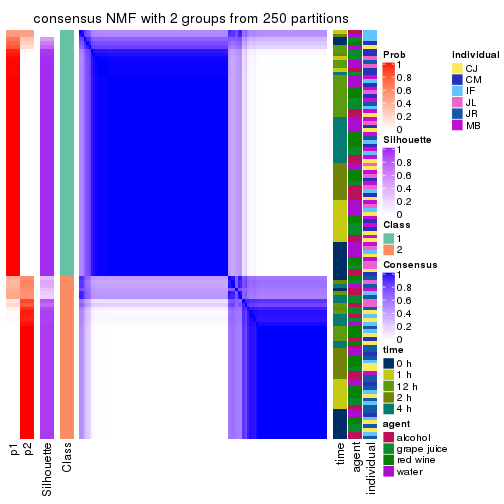</p>

</div>
<div id='tab-MAD-NMF-consensus-heatmap-2'>
<pre><code class="r">consensus_heatmap(res, k = 3)
</code></pre>

<p>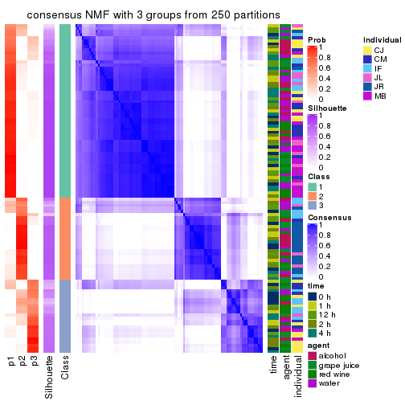</p>

</div>
<div id='tab-MAD-NMF-consensus-heatmap-3'>
<pre><code class="r">consensus_heatmap(res, k = 4)
</code></pre>

<p>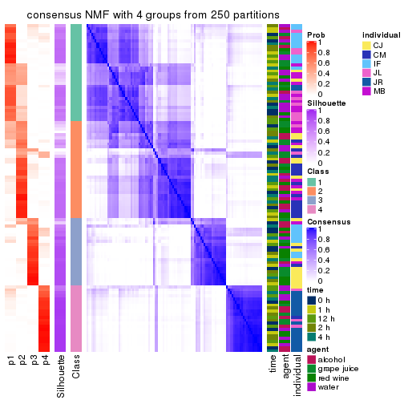</p>

</div>
<div id='tab-MAD-NMF-consensus-heatmap-4'>
<pre><code class="r">consensus_heatmap(res, k = 5)
</code></pre>

<p>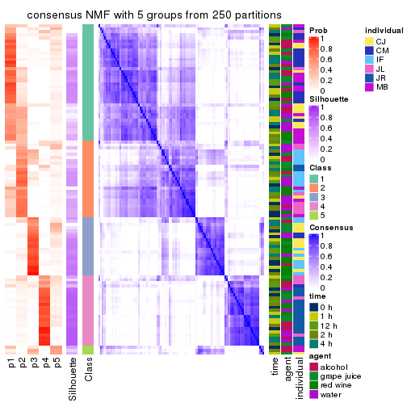</p>

</div>
<div id='tab-MAD-NMF-consensus-heatmap-5'>
<pre><code class="r">consensus_heatmap(res, k = 6)
</code></pre>

<p>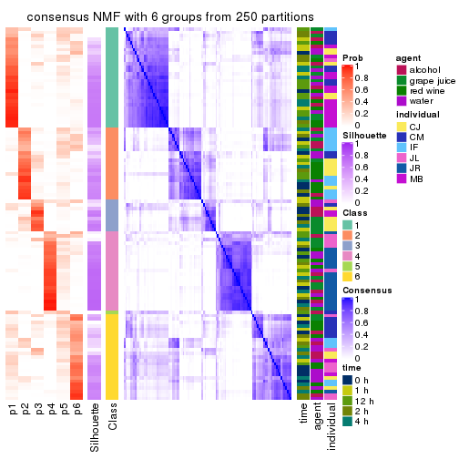</p>

</div>
</div>

Heatmaps for the membership of samples in all partitions to see how consistent they are:


<script>
$( function() {
	$( '#tabs-MAD-NMF-membership-heatmap' ).tabs();
} );
</script>
<div id='tabs-MAD-NMF-membership-heatmap'>
<ul>
<li><a href='#tab-MAD-NMF-membership-heatmap-1'>k = 2</a></li>
<li><a href='#tab-MAD-NMF-membership-heatmap-2'>k = 3</a></li>
<li><a href='#tab-MAD-NMF-membership-heatmap-3'>k = 4</a></li>
<li><a href='#tab-MAD-NMF-membership-heatmap-4'>k = 5</a></li>
<li><a href='#tab-MAD-NMF-membership-heatmap-5'>k = 6</a></li>
</ul>
<div id='tab-MAD-NMF-membership-heatmap-1'>
<pre><code class="r">membership_heatmap(res, k = 2)
</code></pre>

<p>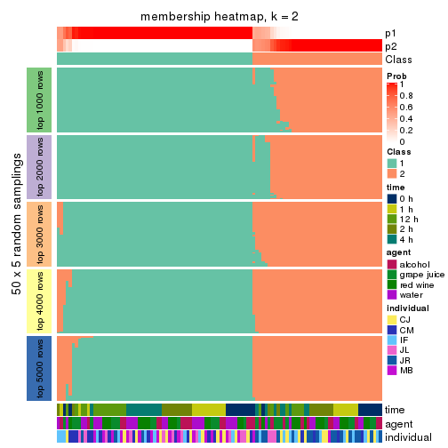</p>

</div>
<div id='tab-MAD-NMF-membership-heatmap-2'>
<pre><code class="r">membership_heatmap(res, k = 3)
</code></pre>

<p>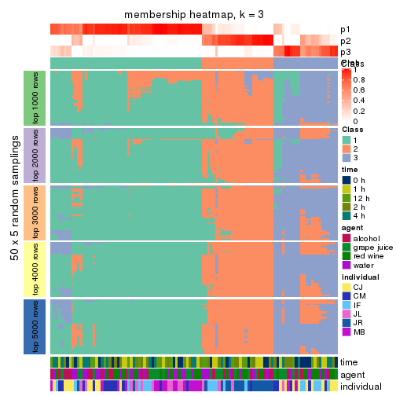</p>

</div>
<div id='tab-MAD-NMF-membership-heatmap-3'>
<pre><code class="r">membership_heatmap(res, k = 4)
</code></pre>

<p>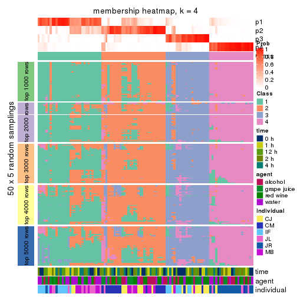</p>

</div>
<div id='tab-MAD-NMF-membership-heatmap-4'>
<pre><code class="r">membership_heatmap(res, k = 5)
</code></pre>

<p>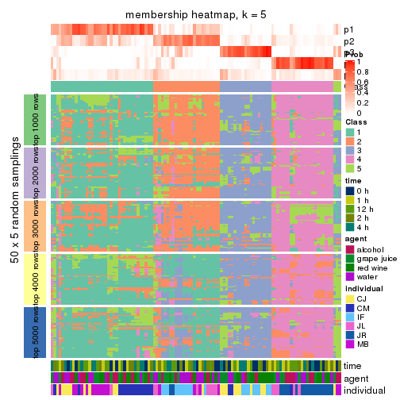</p>

</div>
<div id='tab-MAD-NMF-membership-heatmap-5'>
<pre><code class="r">membership_heatmap(res, k = 6)
</code></pre>

<p>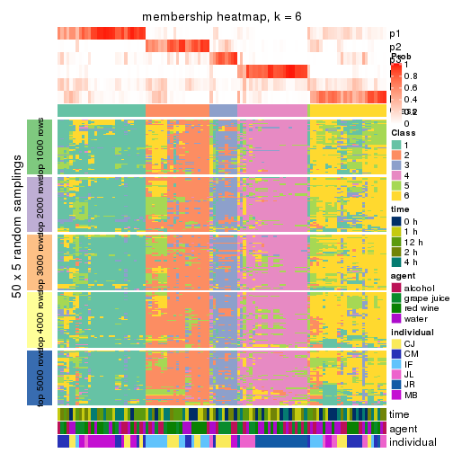</p>

</div>
</div>

As soon as we have had the classes for columns, we can look for signatures
which are significantly different between classes which can be candidate marks
for certain classes. Following are the heatmaps for signatures.


Signature heatmaps where rows are scaled:


<script>
$( function() {
	$( '#tabs-MAD-NMF-get-signatures' ).tabs();
} );
</script>
<div id='tabs-MAD-NMF-get-signatures'>
<ul>
<li><a href='#tab-MAD-NMF-get-signatures-1'>k = 2</a></li>
<li><a href='#tab-MAD-NMF-get-signatures-2'>k = 3</a></li>
<li><a href='#tab-MAD-NMF-get-signatures-3'>k = 4</a></li>
<li><a href='#tab-MAD-NMF-get-signatures-4'>k = 5</a></li>
<li><a href='#tab-MAD-NMF-get-signatures-5'>k = 6</a></li>
</ul>
<div id='tab-MAD-NMF-get-signatures-1'>
<pre><code class="r">get_signatures(res, k = 2)
</code></pre>

<p>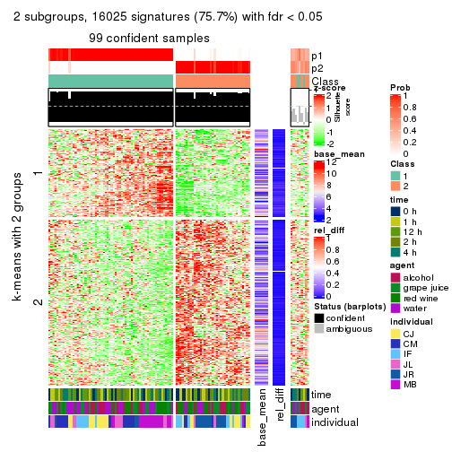</p>

</div>
<div id='tab-MAD-NMF-get-signatures-2'>
<pre><code class="r">get_signatures(res, k = 3)
</code></pre>

<p>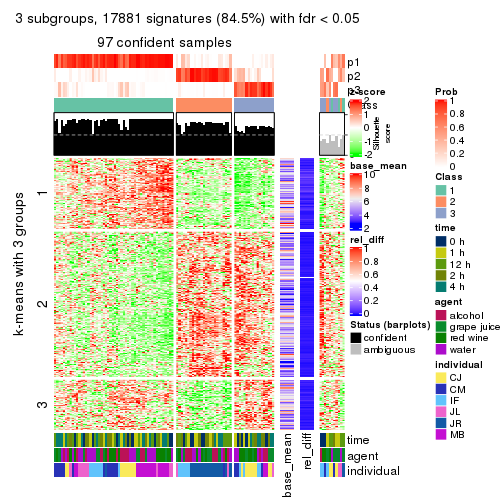</p>

</div>
<div id='tab-MAD-NMF-get-signatures-3'>
<pre><code class="r">get_signatures(res, k = 4)
</code></pre>

<p>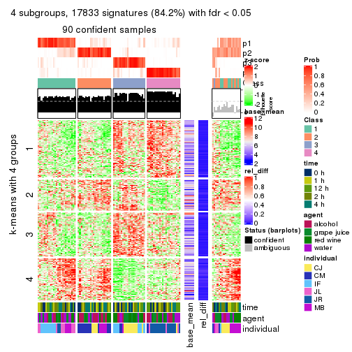</p>

</div>
<div id='tab-MAD-NMF-get-signatures-4'>
<pre><code class="r">get_signatures(res, k = 5)
</code></pre>

<p>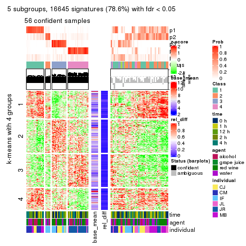</p>

</div>
<div id='tab-MAD-NMF-get-signatures-5'>
<pre><code class="r">get_signatures(res, k = 6)
</code></pre>

<p>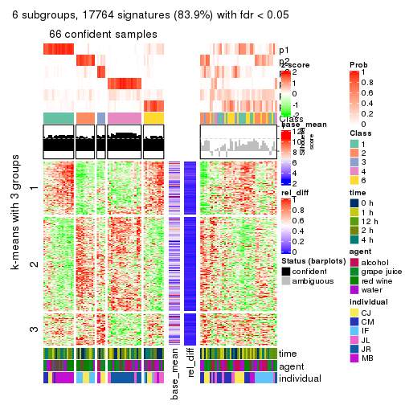</p>

</div>
</div>


Signature heatmaps where rows are not scaled:


<script>
$( function() {
	$( '#tabs-MAD-NMF-get-signatures-no-scale' ).tabs();
} );
</script>
<div id='tabs-MAD-NMF-get-signatures-no-scale'>
<ul>
<li><a href='#tab-MAD-NMF-get-signatures-no-scale-1'>k = 2</a></li>
<li><a href='#tab-MAD-NMF-get-signatures-no-scale-2'>k = 3</a></li>
<li><a href='#tab-MAD-NMF-get-signatures-no-scale-3'>k = 4</a></li>
<li><a href='#tab-MAD-NMF-get-signatures-no-scale-4'>k = 5</a></li>
<li><a href='#tab-MAD-NMF-get-signatures-no-scale-5'>k = 6</a></li>
</ul>
<div id='tab-MAD-NMF-get-signatures-no-scale-1'>
<pre><code class="r">get_signatures(res, k = 2, scale_rows = FALSE)
</code></pre>

<p>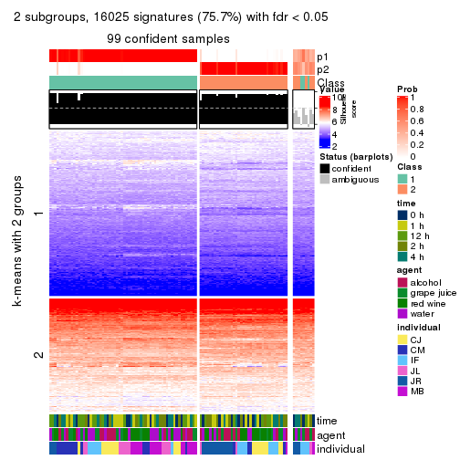</p>

</div>
<div id='tab-MAD-NMF-get-signatures-no-scale-2'>
<pre><code class="r">get_signatures(res, k = 3, scale_rows = FALSE)
</code></pre>

<p>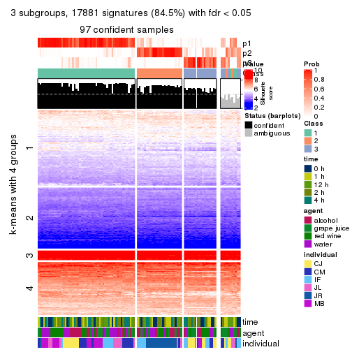</p>

</div>
<div id='tab-MAD-NMF-get-signatures-no-scale-3'>
<pre><code class="r">get_signatures(res, k = 4, scale_rows = FALSE)
</code></pre>

<p>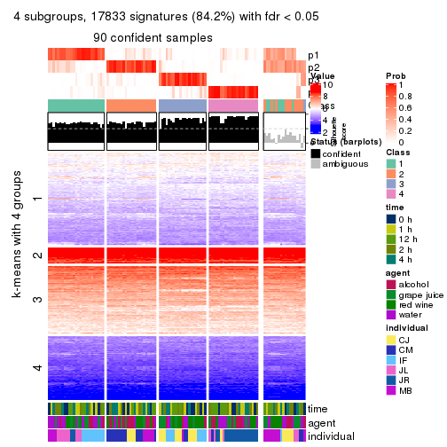</p>

</div>
<div id='tab-MAD-NMF-get-signatures-no-scale-4'>
<pre><code class="r">get_signatures(res, k = 5, scale_rows = FALSE)
</code></pre>

<p>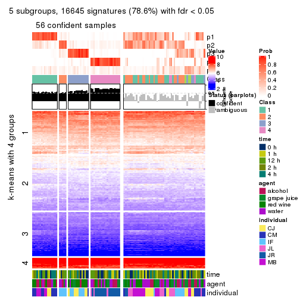</p>

</div>
<div id='tab-MAD-NMF-get-signatures-no-scale-5'>
<pre><code class="r">get_signatures(res, k = 6, scale_rows = FALSE)
</code></pre>

<p>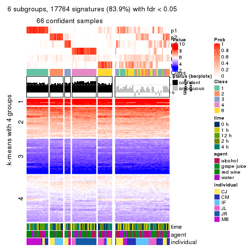</p>

</div>
</div>


Compare the overlap of signatures from different k:

```r
compare_signatures(res)
```

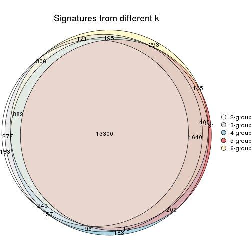

`get_signature()` returns a data frame invisibly. TO get the list of signatures, the function
call should be assigned to a variable explicitly. In following code, if `plot` argument is set
to `FALSE`, no heatmap is plotted while only the differential analysis is performed.

```r
# code only for demonstration
tb = get_signature(res, k = ..., plot = FALSE)
```

An example of the output of `tb` is:

```
#>   which_row         fdr    mean_1    mean_2 scaled_mean_1 scaled_mean_2 km
#> 1        38 0.042760348  8.373488  9.131774    -0.5533452     0.5164555  1
#> 2        40 0.018707592  7.106213  8.469186    -0.6173731     0.5762149  1
#> 3        55 0.019134737 10.221463 11.207825    -0.6159697     0.5749050  1
#> 4        59 0.006059896  5.921854  7.869574    -0.6899429     0.6439467  1
#> 5        60 0.018055526  8.928898 10.211722    -0.6204761     0.5791110  1
#> 6        98 0.009384629 15.714769 14.887706     0.6635654    -0.6193277  2
...
```

The columns in `tb` are:

1. `which_row`: row indices corresponding to the input matrix.
2. `fdr`: FDR for the differential test. 
3. `mean_x`: The mean value in group x.
4. `scaled_mean_x`: The mean value in group x after rows are scaled.
5. `km`: Row groups if k-means clustering is applied to rows.


UMAP plot which shows how samples are separated.


<script>
$( function() {
	$( '#tabs-MAD-NMF-dimension-reduction' ).tabs();
} );
</script>
<div id='tabs-MAD-NMF-dimension-reduction'>
<ul>
<li><a href='#tab-MAD-NMF-dimension-reduction-1'>k = 2</a></li>
<li><a href='#tab-MAD-NMF-dimension-reduction-2'>k = 3</a></li>
<li><a href='#tab-MAD-NMF-dimension-reduction-3'>k = 4</a></li>
<li><a href='#tab-MAD-NMF-dimension-reduction-4'>k = 5</a></li>
<li><a href='#tab-MAD-NMF-dimension-reduction-5'>k = 6</a></li>
</ul>
<div id='tab-MAD-NMF-dimension-reduction-1'>
<pre><code class="r">dimension_reduction(res, k = 2, method = &quot;UMAP&quot;)
</code></pre>

<p>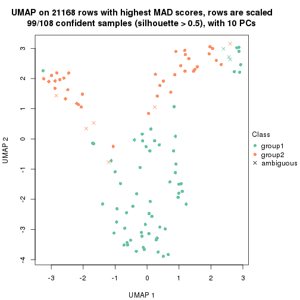</p>

</div>
<div id='tab-MAD-NMF-dimension-reduction-2'>
<pre><code class="r">dimension_reduction(res, k = 3, method = &quot;UMAP&quot;)
</code></pre>

<p>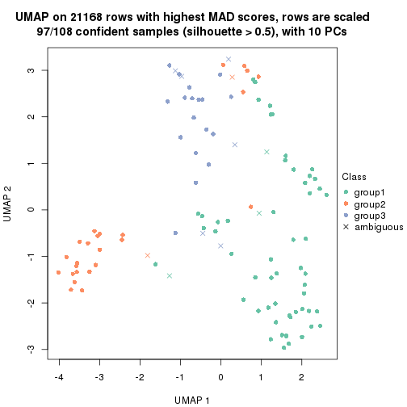</p>

</div>
<div id='tab-MAD-NMF-dimension-reduction-3'>
<pre><code class="r">dimension_reduction(res, k = 4, method = &quot;UMAP&quot;)
</code></pre>

<p>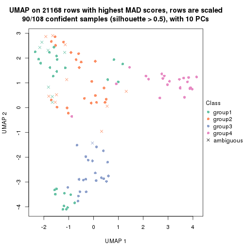</p>

</div>
<div id='tab-MAD-NMF-dimension-reduction-4'>
<pre><code class="r">dimension_reduction(res, k = 5, method = &quot;UMAP&quot;)
</code></pre>

<p>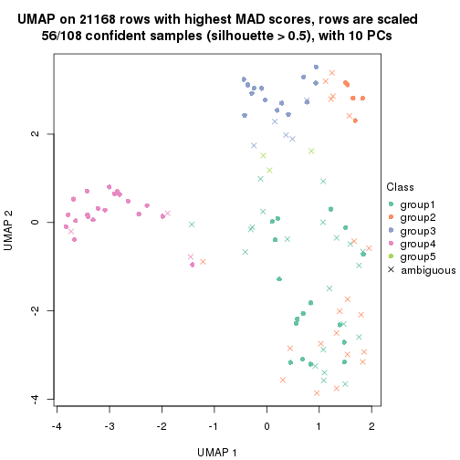</p>

</div>
<div id='tab-MAD-NMF-dimension-reduction-5'>
<pre><code class="r">dimension_reduction(res, k = 6, method = &quot;UMAP&quot;)
</code></pre>

<p>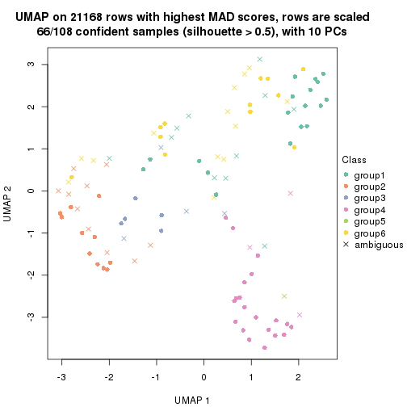</p>

</div>
</div>


Following heatmap shows how subgroups are split when increasing `k`:

```r
collect_classes(res)
```

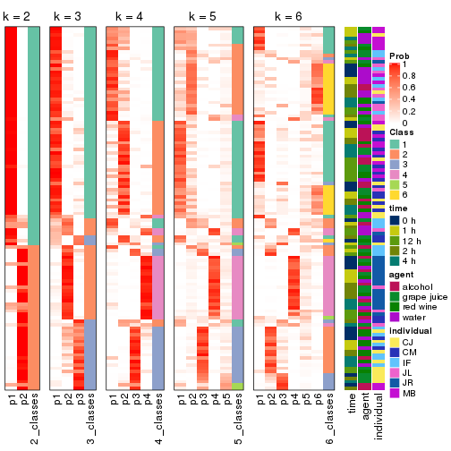


Test correlation between subgroups and known annotations. If the known
annotation is numeric, one-way ANOVA test is applied, and if the known
annotation is discrete, chi-squared contingency table test is applied.

```r
test_to_known_factors(res)
```

```
#>          n time(p) agent(p) individual(p) k
#> MAD:NMF 99   0.763   0.5248      5.85e-05 2
#> MAD:NMF 97   0.794   0.8146      2.55e-11 3
#> MAD:NMF 90   0.992   0.1180      2.38e-20 4
#> MAD:NMF 56   0.969   0.0403      4.35e-15 5
#> MAD:NMF 66   0.269   0.0312      2.51e-16 6
```


If matrix rows can be associated to genes, consider to use `GO_Enrichment(res,
...)` to perform function enrichment for the signature genes.


 

---------------------------------------------------


### ATC:hclust


The object with results only for a single top-value method and a single partition method 
can be extracted as:

```r
res = res_list["ATC", "hclust"]
# you can also extract it by
# res = res_list["ATC:hclust"]
```

A summary of `res` and all the functions that can be applied to it:

```r
res
```

```
#> A 'ConsensusPartition' object with k = 2, 3, 4, 5, 6.
#>   On a matrix with 21168 rows and 108 columns.
#>   Top rows (1000, 2000, 3000, 4000, 5000) are extracted by 'ATC' method.
#>   Subgroups are detected by 'hclust' method.
#>   Performed in total 1250 partitions by row resampling.
#>   Best k for subgroups seems to be 2.
#> 
#> Following methods can be applied to this 'ConsensusPartition' object:
#>  [1] "cola_report"             "collect_classes"         "collect_plots"          
#>  [4] "collect_stats"           "colnames"                "compare_signatures"     
#>  [7] "consensus_heatmap"       "dimension_reduction"     "functional_enrichment"  
#> [10] "get_anno_col"            "get_anno"                "get_classes"            
#> [13] "get_consensus"           "get_matrix"              "get_membership"         
#> [16] "get_param"               "get_signatures"          "get_stats"              
#> [19] "is_best_k"               "is_stable_k"             "membership_heatmap"     
#> [22] "ncol"                    "nrow"                    "plot_ecdf"              
#> [25] "rownames"                "select_partition_number" "show"                   
#> [28] "suggest_best_k"          "test_to_known_factors"
```

`collect_plots()` function collects all the plots made from `res` for all `k` (number of partitions)
into one single page to provide an easy and fast comparison between different `k`.

```r
collect_plots(res)
```

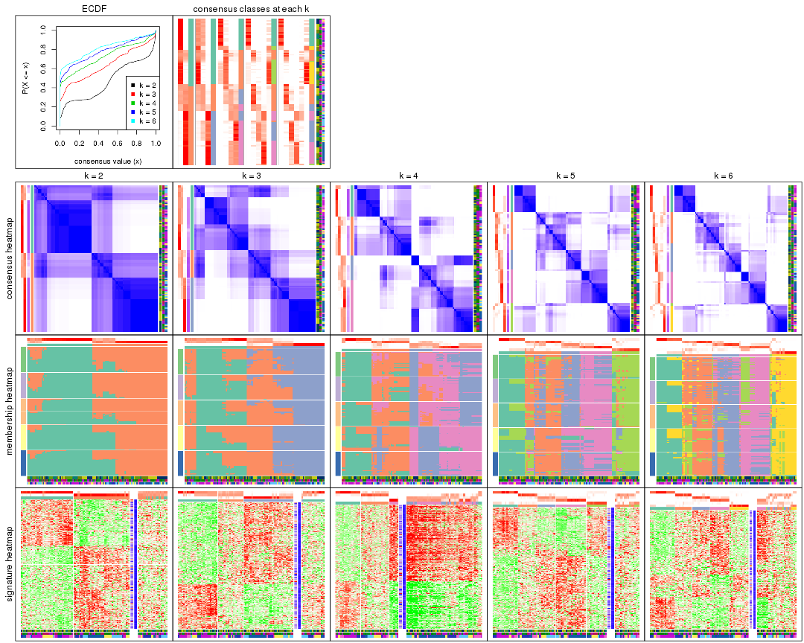

The plots are:

- The first row: a plot of the ECDF (Empirical cumulative distribution
  function) curves of the consensus matrix for each `k` and the heatmap of
  predicted classes for each `k`.
- The second row: heatmaps of the consensus matrix for each `k`.
- The third row: heatmaps of the membership matrix for each `k`.
- The fouth row: heatmaps of the signatures for each `k`.

All the plots in panels can be made by individual functions and they are
plotted later in this section.

`select_partition_number()` produces several plots showing different
statistics for choosing "optimized" `k`. There are following statistics:

- ECDF curves of the consensus matrix for each `k`;
- 1-PAC. [The PAC
  score](https://en.wikipedia.org/wiki/Consensus_clustering#Over-interpretation_potential_of_consensus_clustering)
  measures the proportion of the ambiguous subgrouping.
- Mean silhouette score.
- Concordance. The mean probability of fiting the consensus class ids in all
  partitions.
- Area increased. Denote $A_k$ as the area under the ECDF curve for current
  `k`, the area increased is defined as $A_k - A_{k-1}$.
- Rand index. The percent of pairs of samples that are both in a same cluster
  or both are not in a same cluster in the partition of k and k-1.
- Jaccard index. The ratio of pairs of samples are both in a same cluster in
  the partition of k and k-1 and the pairs of samples are both in a same
  cluster in the partition k or k-1.

The detailed explanations of these statistics can be found in [the cola
vignette](http://bioconductor.org/packages/devel/bioc/vignettes/cola/inst/doc/cola.html#toc_13).

Generally speaking, lower PAC score, higher mean silhouette score or higher
concordance corresponds to better partition. Rand index and Jaccard index
measure how similar the current partition is compared to partition with `k-1`.
If they are too similar, we won't accept `k` is better than `k-1`.

```r
select_partition_number(res)
```

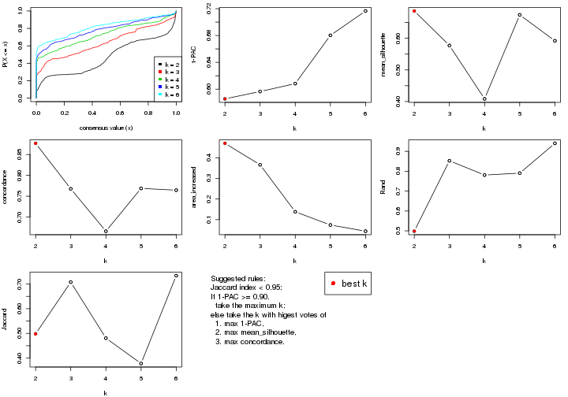

The numeric values for all these statistics can be obtained by `get_stats()`.

```r
get_stats(res)
```

```
#>   k 1-PAC mean_silhouette concordance area_increased  Rand Jaccard
#> 2 2 0.586           0.686       0.877         0.4698 0.498   0.498
#> 3 3 0.597           0.577       0.768         0.3657 0.853   0.708
#> 4 4 0.608           0.408       0.666         0.1381 0.781   0.481
#> 5 5 0.680           0.674       0.769         0.0742 0.790   0.378
#> 6 6 0.717           0.592       0.764         0.0440 0.940   0.734
```

`suggest_best_k()` suggests the best $k$ based on these statistics. The rules are as follows:

- All $k$ with Jaccard index larger than 0.95 are removed because the increase of
  the partition number does not provides enough extra information. If all $k$ are removed,
  the best $k$ is assigned by `NA`.
- For $k$ with 1-PAC larger than 0.9, the maximal $k$ is taken as the "best k". Other $k$ is called "optional k".
- If it does not fit the second rule. The $k$ with the highest vote of highest
  1-PAC, mean silhouette and concordance is taken as the "best k".

```r
suggest_best_k(res)
```

```
#> [1] 2
```


Following shows the table of the partitions (You need to click the **show/hide
code output** link to see it). The membership matrix (columns with name `p*`)
is inferred by
[`clue::cl_consensus()`](https://www.rdocumentation.org/link/cl_consensus?package=clue)
function with the `SE` method. Basically the value in the membership matrix
represents the probability to belong to a certain group. The finall class
label for an item is determined with the group with highest probability it
belongs to.

In `get_classes()` function, the entropy is calculated from the membership
matrix and the silhouette score is calculated from the consensus matrix.


<script>
$( function() {
	$( '#tabs-ATC-hclust-get-classes' ).tabs();
} );
</script>
<div id='tabs-ATC-hclust-get-classes'>
<ul>
<li><a href='#tab-ATC-hclust-get-classes-1'>k = 2</a></li>
<li><a href='#tab-ATC-hclust-get-classes-2'>k = 3</a></li>
<li><a href='#tab-ATC-hclust-get-classes-3'>k = 4</a></li>
<li><a href='#tab-ATC-hclust-get-classes-4'>k = 5</a></li>
<li><a href='#tab-ATC-hclust-get-classes-5'>k = 6</a></li>
</ul>

<div id='tab-ATC-hclust-get-classes-1'>
<p><a id='tab-ATC-hclust-get-classes-1-a' style='color:#0366d6' href='#'>show/hide code output</a></p>
<pre><code class="r">cbind(get_classes(res, k = 2), get_membership(res, k = 2))
</code></pre>

<pre><code>#&gt;          class entropy silhouette    p1    p2
#&gt; GSM87863     1  0.5629     0.7655 0.868 0.132
#&gt; GSM87887     1  0.1843     0.8613 0.972 0.028
#&gt; GSM87896     2  0.0000     0.8186 0.000 1.000
#&gt; GSM87934     2  0.0000     0.8186 0.000 1.000
#&gt; GSM87943     2  0.9248     0.5066 0.340 0.660
#&gt; GSM87853     2  0.0000     0.8186 0.000 1.000
#&gt; GSM87906     2  0.2603     0.8114 0.044 0.956
#&gt; GSM87920     1  0.3584     0.8307 0.932 0.068
#&gt; GSM87924     2  0.0000     0.8186 0.000 1.000
#&gt; GSM87858     2  0.0000     0.8186 0.000 1.000
#&gt; GSM87882     2  0.9087     0.5302 0.324 0.676
#&gt; GSM87891     2  0.0000     0.8186 0.000 1.000
#&gt; GSM87917     1  0.0000     0.8677 1.000 0.000
#&gt; GSM87929     2  0.2948     0.8059 0.052 0.948
#&gt; GSM87948     1  0.1184     0.8673 0.984 0.016
#&gt; GSM87868     1  0.0000     0.8677 1.000 0.000
#&gt; GSM87873     2  0.0000     0.8186 0.000 1.000
#&gt; GSM87901     2  1.0000     0.1199 0.496 0.504
#&gt; GSM87910     1  0.0000     0.8677 1.000 0.000
#&gt; GSM87938     2  0.0000     0.8186 0.000 1.000
#&gt; GSM87953     1  0.0000     0.8677 1.000 0.000
#&gt; GSM87864     1  0.1184     0.8673 0.984 0.016
#&gt; GSM87888     2  0.9977     0.2065 0.472 0.528
#&gt; GSM87897     2  0.3114     0.8056 0.056 0.944
#&gt; GSM87935     2  0.0000     0.8186 0.000 1.000
#&gt; GSM87944     1  0.0672     0.8681 0.992 0.008
#&gt; GSM87854     2  0.9754     0.3759 0.408 0.592
#&gt; GSM87878     1  0.4562     0.8048 0.904 0.096
#&gt; GSM87907     2  0.1633     0.8177 0.024 0.976
#&gt; GSM87921     2  0.9850     0.3297 0.428 0.572
#&gt; GSM87925     2  0.0000     0.8186 0.000 1.000
#&gt; GSM87957     1  0.1184     0.8673 0.984 0.016
#&gt; GSM87859     2  0.0000     0.8186 0.000 1.000
#&gt; GSM87883     1  0.0000     0.8677 1.000 0.000
#&gt; GSM87892     2  0.0000     0.8186 0.000 1.000
#&gt; GSM87930     2  0.0000     0.8186 0.000 1.000
#&gt; GSM87949     1  0.0000     0.8677 1.000 0.000
#&gt; GSM87869     1  0.0000     0.8677 1.000 0.000
#&gt; GSM87874     2  0.0000     0.8186 0.000 1.000
#&gt; GSM87902     2  1.0000     0.1199 0.496 0.504
#&gt; GSM87911     2  0.9833     0.3394 0.424 0.576
#&gt; GSM87939     2  0.0000     0.8186 0.000 1.000
#&gt; GSM87954     1  0.0000     0.8677 1.000 0.000
#&gt; GSM87865     1  0.2423     0.8532 0.960 0.040
#&gt; GSM87889     1  0.9491     0.3424 0.632 0.368
#&gt; GSM87898     1  0.7745     0.6325 0.772 0.228
#&gt; GSM87915     1  0.0672     0.8681 0.992 0.008
#&gt; GSM87936     2  0.0000     0.8186 0.000 1.000
#&gt; GSM87945     2  0.1633     0.8177 0.024 0.976
#&gt; GSM87855     2  0.2948     0.8071 0.052 0.948
#&gt; GSM87879     2  0.9977     0.2065 0.472 0.528
#&gt; GSM87922     2  0.9087     0.5302 0.324 0.676
#&gt; GSM87926     2  0.0000     0.8186 0.000 1.000
#&gt; GSM87958     1  0.0000     0.8677 1.000 0.000
#&gt; GSM87860     2  0.1633     0.8177 0.024 0.976
#&gt; GSM87884     1  0.0000     0.8677 1.000 0.000
#&gt; GSM87893     2  0.0000     0.8186 0.000 1.000
#&gt; GSM87918     1  0.9996    -0.0882 0.512 0.488
#&gt; GSM87931     2  0.0000     0.8186 0.000 1.000
#&gt; GSM87950     1  0.0000     0.8677 1.000 0.000
#&gt; GSM87870     1  0.1184     0.8673 0.984 0.016
#&gt; GSM87875     2  0.2236     0.8146 0.036 0.964
#&gt; GSM87903     2  0.2603     0.8114 0.044 0.956
#&gt; GSM87912     1  0.0672     0.8681 0.992 0.008
#&gt; GSM87940     2  0.0000     0.8186 0.000 1.000
#&gt; GSM87866     1  0.1184     0.8673 0.984 0.016
#&gt; GSM87899     2  0.3114     0.8056 0.056 0.944
#&gt; GSM87937     2  0.0000     0.8186 0.000 1.000
#&gt; GSM87946     1  0.0000     0.8677 1.000 0.000
#&gt; GSM87856     2  0.9248     0.5066 0.340 0.660
#&gt; GSM87880     2  0.9977     0.2065 0.472 0.528
#&gt; GSM87908     1  0.9608     0.3010 0.616 0.384
#&gt; GSM87923     2  0.9358     0.4860 0.352 0.648
#&gt; GSM87927     2  0.9909     0.2882 0.444 0.556
#&gt; GSM87959     1  0.0000     0.8677 1.000 0.000
#&gt; GSM87861     2  0.1633     0.8177 0.024 0.976
#&gt; GSM87885     1  0.9944     0.0479 0.544 0.456
#&gt; GSM87894     1  0.1184     0.8673 0.984 0.016
#&gt; GSM87932     1  0.2043     0.8589 0.968 0.032
#&gt; GSM87951     1  0.0000     0.8677 1.000 0.000
#&gt; GSM87871     1  0.9963     0.0188 0.536 0.464
#&gt; GSM87876     1  0.9944     0.0479 0.544 0.456
#&gt; GSM87904     2  0.1633     0.8177 0.024 0.976
#&gt; GSM87913     1  0.1184     0.8673 0.984 0.016
#&gt; GSM87941     2  0.9909     0.2882 0.444 0.556
#&gt; GSM87955     1  0.0000     0.8677 1.000 0.000
#&gt; GSM87867     1  0.8661     0.5266 0.712 0.288
#&gt; GSM87890     2  0.0000     0.8186 0.000 1.000
#&gt; GSM87900     2  0.3879     0.7924 0.076 0.924
#&gt; GSM87916     2  0.0000     0.8186 0.000 1.000
#&gt; GSM87947     1  0.1184     0.8673 0.984 0.016
#&gt; GSM87857     2  0.2603     0.8116 0.044 0.956
#&gt; GSM87881     2  0.9993     0.1652 0.484 0.516
#&gt; GSM87909     1  0.9608     0.3010 0.616 0.384
#&gt; GSM87928     1  0.2043     0.8589 0.968 0.032
#&gt; GSM87960     1  0.0000     0.8677 1.000 0.000
#&gt; GSM87862     2  0.1633     0.8177 0.024 0.976
#&gt; GSM87886     1  0.0000     0.8677 1.000 0.000
#&gt; GSM87895     2  0.1633     0.8177 0.024 0.976
#&gt; GSM87919     1  0.0000     0.8677 1.000 0.000
#&gt; GSM87933     2  0.0000     0.8186 0.000 1.000
#&gt; GSM87952     1  0.0000     0.8677 1.000 0.000
#&gt; GSM87872     2  0.9988     0.1793 0.480 0.520
#&gt; GSM87877     1  0.1184     0.8673 0.984 0.016
#&gt; GSM87905     1  0.9608     0.3010 0.616 0.384
#&gt; GSM87914     1  0.9996    -0.0882 0.512 0.488
#&gt; GSM87942     2  0.9993     0.1651 0.484 0.516
#&gt; GSM87956     1  0.0000     0.8677 1.000 0.000
</code></pre>

<script>
$('#tab-ATC-hclust-get-classes-1-a').parent().next().next().hide();
$('#tab-ATC-hclust-get-classes-1-a').click(function(){
  $('#tab-ATC-hclust-get-classes-1-a').parent().next().next().toggle();
  return(false);
});
</script>
</div>

<div id='tab-ATC-hclust-get-classes-2'>
<p><a id='tab-ATC-hclust-get-classes-2-a' style='color:#0366d6' href='#'>show/hide code output</a></p>
<pre><code class="r">cbind(get_classes(res, k = 3), get_membership(res, k = 3))
</code></pre>

<pre><code>#&gt;          class entropy silhouette    p1    p2    p3
#&gt; GSM87863     1  0.3551      0.257 0.868 0.132 0.000
#&gt; GSM87887     1  0.0592      0.486 0.988 0.012 0.000
#&gt; GSM87896     3  0.0000      0.845 0.000 0.000 1.000
#&gt; GSM87934     3  0.0237      0.845 0.000 0.004 0.996
#&gt; GSM87943     2  0.9641      0.755 0.324 0.452 0.224
#&gt; GSM87853     3  0.0592      0.842 0.000 0.012 0.988
#&gt; GSM87906     3  0.7553      0.554 0.060 0.320 0.620
#&gt; GSM87920     1  0.2537      0.386 0.920 0.080 0.000
#&gt; GSM87924     3  0.0000      0.845 0.000 0.000 1.000
#&gt; GSM87858     3  0.0000      0.845 0.000 0.000 1.000
#&gt; GSM87882     2  0.9751      0.711 0.308 0.440 0.252
#&gt; GSM87891     3  0.0000      0.845 0.000 0.000 1.000
#&gt; GSM87917     1  0.6302      0.587 0.520 0.480 0.000
#&gt; GSM87929     3  0.6203      0.707 0.056 0.184 0.760
#&gt; GSM87948     1  0.0000      0.501 1.000 0.000 0.000
#&gt; GSM87868     1  0.6204      0.608 0.576 0.424 0.000
#&gt; GSM87873     3  0.0000      0.845 0.000 0.000 1.000
#&gt; GSM87901     2  0.6941      0.844 0.464 0.520 0.016
#&gt; GSM87910     1  0.6302      0.587 0.520 0.480 0.000
#&gt; GSM87938     3  0.0000      0.845 0.000 0.000 1.000
#&gt; GSM87953     1  0.6154      0.611 0.592 0.408 0.000
#&gt; GSM87864     1  0.0237      0.497 0.996 0.004 0.000
#&gt; GSM87888     2  0.7561      0.867 0.444 0.516 0.040
#&gt; GSM87897     3  0.7773      0.529 0.072 0.316 0.612
#&gt; GSM87935     3  0.0237      0.845 0.000 0.004 0.996
#&gt; GSM87944     1  0.3340      0.554 0.880 0.120 0.000
#&gt; GSM87854     2  0.8597      0.849 0.380 0.516 0.104
#&gt; GSM87878     1  0.3482      0.289 0.872 0.128 0.000
#&gt; GSM87907     3  0.6521      0.686 0.040 0.248 0.712
#&gt; GSM87921     2  0.8338      0.861 0.400 0.516 0.084
#&gt; GSM87925     3  0.0237      0.845 0.000 0.004 0.996
#&gt; GSM87957     1  0.0000      0.501 1.000 0.000 0.000
#&gt; GSM87859     3  0.0000      0.845 0.000 0.000 1.000
#&gt; GSM87883     1  0.6154      0.611 0.592 0.408 0.000
#&gt; GSM87892     3  0.0000      0.845 0.000 0.000 1.000
#&gt; GSM87930     3  0.0000      0.845 0.000 0.000 1.000
#&gt; GSM87949     1  0.6302      0.587 0.520 0.480 0.000
#&gt; GSM87869     1  0.6204      0.608 0.576 0.424 0.000
#&gt; GSM87874     3  0.0000      0.845 0.000 0.000 1.000
#&gt; GSM87902     2  0.6941      0.844 0.464 0.520 0.016
#&gt; GSM87911     2  0.8393      0.859 0.396 0.516 0.088
#&gt; GSM87939     3  0.0237      0.845 0.000 0.004 0.996
#&gt; GSM87954     1  0.6154      0.611 0.592 0.408 0.000
#&gt; GSM87865     1  0.1411      0.460 0.964 0.036 0.000
#&gt; GSM87889     1  0.6126     -0.599 0.600 0.400 0.000
#&gt; GSM87898     1  0.5178     -0.173 0.744 0.256 0.000
#&gt; GSM87915     1  0.3482      0.557 0.872 0.128 0.000
#&gt; GSM87936     3  0.0237      0.845 0.000 0.004 0.996
#&gt; GSM87945     3  0.6099      0.710 0.032 0.228 0.740
#&gt; GSM87855     3  0.7164      0.644 0.064 0.256 0.680
#&gt; GSM87879     2  0.7561      0.867 0.444 0.516 0.040
#&gt; GSM87922     2  0.9790      0.696 0.308 0.432 0.260
#&gt; GSM87926     3  0.0237      0.845 0.000 0.004 0.996
#&gt; GSM87958     1  0.6204      0.608 0.576 0.424 0.000
#&gt; GSM87860     3  0.6521      0.686 0.040 0.248 0.712
#&gt; GSM87884     1  0.6154      0.611 0.592 0.408 0.000
#&gt; GSM87893     3  0.0000      0.845 0.000 0.000 1.000
#&gt; GSM87918     2  0.6678      0.823 0.480 0.512 0.008
#&gt; GSM87931     3  0.0237      0.845 0.000 0.004 0.996
#&gt; GSM87950     1  0.6302      0.587 0.520 0.480 0.000
#&gt; GSM87870     1  0.0000      0.501 1.000 0.000 0.000
#&gt; GSM87875     3  0.6624      0.682 0.044 0.248 0.708
#&gt; GSM87903     3  0.7553      0.554 0.060 0.320 0.620
#&gt; GSM87912     1  0.3482      0.557 0.872 0.128 0.000
#&gt; GSM87940     3  0.0000      0.845 0.000 0.000 1.000
#&gt; GSM87866     1  0.0000      0.501 1.000 0.000 0.000
#&gt; GSM87899     3  0.7773      0.529 0.072 0.316 0.612
#&gt; GSM87937     3  0.0237      0.845 0.000 0.004 0.996
#&gt; GSM87946     1  0.6168      0.610 0.588 0.412 0.000
#&gt; GSM87856     2  0.9666      0.752 0.324 0.448 0.228
#&gt; GSM87880     2  0.7561      0.867 0.444 0.516 0.040
#&gt; GSM87908     1  0.6180     -0.627 0.584 0.416 0.000
#&gt; GSM87923     2  0.9556      0.771 0.332 0.460 0.208
#&gt; GSM87927     2  0.8093      0.869 0.416 0.516 0.068
#&gt; GSM87959     1  0.6302      0.587 0.520 0.480 0.000
#&gt; GSM87861     3  0.6559      0.681 0.040 0.252 0.708
#&gt; GSM87885     1  0.6678     -0.782 0.512 0.480 0.008
#&gt; GSM87894     1  0.0000      0.501 1.000 0.000 0.000
#&gt; GSM87932     1  0.1753      0.438 0.952 0.048 0.000
#&gt; GSM87951     1  0.6302      0.587 0.520 0.480 0.000
#&gt; GSM87871     1  0.7181     -0.787 0.508 0.468 0.024
#&gt; GSM87876     1  0.6678     -0.782 0.512 0.480 0.008
#&gt; GSM87904     3  0.6521      0.686 0.040 0.248 0.712
#&gt; GSM87913     1  0.0000      0.501 1.000 0.000 0.000
#&gt; GSM87941     2  0.8093      0.869 0.416 0.516 0.068
#&gt; GSM87955     1  0.6154      0.611 0.592 0.408 0.000
#&gt; GSM87867     1  0.5678     -0.381 0.684 0.316 0.000
#&gt; GSM87890     3  0.0000      0.845 0.000 0.000 1.000
#&gt; GSM87900     3  0.8295      0.379 0.088 0.364 0.548
#&gt; GSM87916     3  0.0000      0.845 0.000 0.000 1.000
#&gt; GSM87947     1  0.0000      0.501 1.000 0.000 0.000
#&gt; GSM87857     3  0.7367      0.598 0.060 0.292 0.648
#&gt; GSM87881     2  0.7278      0.858 0.456 0.516 0.028
#&gt; GSM87909     1  0.6180     -0.627 0.584 0.416 0.000
#&gt; GSM87928     1  0.1753      0.438 0.952 0.048 0.000
#&gt; GSM87960     1  0.6168      0.610 0.588 0.412 0.000
#&gt; GSM87862     3  0.6521      0.686 0.040 0.248 0.712
#&gt; GSM87886     1  0.6154      0.611 0.592 0.408 0.000
#&gt; GSM87895     3  0.6521      0.686 0.040 0.248 0.712
#&gt; GSM87919     1  0.6302      0.587 0.520 0.480 0.000
#&gt; GSM87933     3  0.0000      0.845 0.000 0.000 1.000
#&gt; GSM87952     1  0.6302      0.587 0.520 0.480 0.000
#&gt; GSM87872     2  0.7377      0.862 0.452 0.516 0.032
#&gt; GSM87877     1  0.0000      0.501 1.000 0.000 0.000
#&gt; GSM87905     1  0.6180     -0.627 0.584 0.416 0.000
#&gt; GSM87914     2  0.6678      0.823 0.480 0.512 0.008
#&gt; GSM87942     2  0.7274      0.859 0.452 0.520 0.028
#&gt; GSM87956     1  0.6154      0.611 0.592 0.408 0.000
</code></pre>

<script>
$('#tab-ATC-hclust-get-classes-2-a').parent().next().next().hide();
$('#tab-ATC-hclust-get-classes-2-a').click(function(){
  $('#tab-ATC-hclust-get-classes-2-a').parent().next().next().toggle();
  return(false);
});
</script>
</div>

<div id='tab-ATC-hclust-get-classes-3'>
<p><a id='tab-ATC-hclust-get-classes-3-a' style='color:#0366d6' href='#'>show/hide code output</a></p>
<pre><code class="r">cbind(get_classes(res, k = 4), get_membership(res, k = 4))
</code></pre>

<pre><code>#&gt;          class entropy silhouette    p1    p2    p3    p4
#&gt; GSM87863     2  0.3545     0.5941 0.164 0.828 0.000 0.008
#&gt; GSM87887     2  0.4382     0.5213 0.296 0.704 0.000 0.000
#&gt; GSM87896     3  0.4989    -0.4342 0.000 0.000 0.528 0.472
#&gt; GSM87934     4  0.4941     0.4813 0.000 0.000 0.436 0.564
#&gt; GSM87943     4  0.6213    -0.1947 0.000 0.052 0.464 0.484
#&gt; GSM87853     4  0.4992     0.4290 0.000 0.000 0.476 0.524
#&gt; GSM87906     4  0.3818     0.4208 0.000 0.108 0.048 0.844
#&gt; GSM87920     2  0.3870     0.5790 0.208 0.788 0.004 0.000
#&gt; GSM87924     4  0.4994     0.4450 0.000 0.000 0.480 0.520
#&gt; GSM87858     3  0.4989    -0.4342 0.000 0.000 0.528 0.472
#&gt; GSM87882     4  0.6366    -0.1518 0.000 0.064 0.424 0.512
#&gt; GSM87891     3  0.4989    -0.4342 0.000 0.000 0.528 0.472
#&gt; GSM87917     1  0.0000     0.8458 1.000 0.000 0.000 0.000
#&gt; GSM87929     4  0.5835     0.4342 0.000 0.040 0.372 0.588
#&gt; GSM87948     2  0.4356     0.5304 0.292 0.708 0.000 0.000
#&gt; GSM87868     1  0.2149     0.8695 0.912 0.088 0.000 0.000
#&gt; GSM87873     3  0.4989    -0.4342 0.000 0.000 0.528 0.472
#&gt; GSM87901     2  0.5951     0.3422 0.000 0.696 0.152 0.152
#&gt; GSM87910     1  0.0000     0.8458 1.000 0.000 0.000 0.000
#&gt; GSM87938     4  0.4992     0.4485 0.000 0.000 0.476 0.524
#&gt; GSM87953     1  0.2408     0.8678 0.896 0.104 0.000 0.000
#&gt; GSM87864     2  0.4331     0.5345 0.288 0.712 0.000 0.000
#&gt; GSM87888     3  0.7645     0.2379 0.000 0.360 0.428 0.212
#&gt; GSM87897     4  0.2924     0.4198 0.000 0.016 0.100 0.884
#&gt; GSM87935     4  0.4925     0.4853 0.000 0.000 0.428 0.572
#&gt; GSM87944     1  0.4996     0.0729 0.516 0.484 0.000 0.000
#&gt; GSM87854     3  0.7542     0.2846 0.000 0.208 0.472 0.320
#&gt; GSM87878     2  0.3591     0.5901 0.168 0.824 0.008 0.000
#&gt; GSM87907     4  0.0000     0.5062 0.000 0.000 0.000 1.000
#&gt; GSM87921     3  0.7640     0.2818 0.000 0.280 0.468 0.252
#&gt; GSM87925     4  0.4925     0.4853 0.000 0.000 0.428 0.572
#&gt; GSM87957     2  0.4356     0.5304 0.292 0.708 0.000 0.000
#&gt; GSM87859     4  0.5000     0.4124 0.000 0.000 0.496 0.504
#&gt; GSM87883     1  0.2469     0.8657 0.892 0.108 0.000 0.000
#&gt; GSM87892     3  0.4989    -0.4342 0.000 0.000 0.528 0.472
#&gt; GSM87930     4  0.4992     0.4485 0.000 0.000 0.476 0.524
#&gt; GSM87949     1  0.0000     0.8458 1.000 0.000 0.000 0.000
#&gt; GSM87869     1  0.2149     0.8695 0.912 0.088 0.000 0.000
#&gt; GSM87874     3  0.4989    -0.4342 0.000 0.000 0.528 0.472
#&gt; GSM87902     2  0.5951     0.3422 0.000 0.696 0.152 0.152
#&gt; GSM87911     3  0.7625     0.2825 0.000 0.276 0.472 0.252
#&gt; GSM87939     4  0.4925     0.4853 0.000 0.000 0.428 0.572
#&gt; GSM87954     1  0.2408     0.8678 0.896 0.104 0.000 0.000
#&gt; GSM87865     2  0.4103     0.5585 0.256 0.744 0.000 0.000
#&gt; GSM87889     2  0.3885     0.5277 0.000 0.844 0.092 0.064
#&gt; GSM87898     2  0.4546     0.6012 0.104 0.824 0.024 0.048
#&gt; GSM87915     1  0.4989     0.1220 0.528 0.472 0.000 0.000
#&gt; GSM87936     4  0.4925     0.4853 0.000 0.000 0.428 0.572
#&gt; GSM87945     4  0.1792     0.5056 0.000 0.000 0.068 0.932
#&gt; GSM87855     4  0.2589     0.4697 0.000 0.000 0.116 0.884
#&gt; GSM87879     3  0.7645     0.2379 0.000 0.360 0.428 0.212
#&gt; GSM87922     4  0.6182    -0.1446 0.000 0.052 0.428 0.520
#&gt; GSM87926     4  0.4933     0.4835 0.000 0.000 0.432 0.568
#&gt; GSM87958     1  0.2149     0.8695 0.912 0.088 0.000 0.000
#&gt; GSM87860     4  0.0000     0.5062 0.000 0.000 0.000 1.000
#&gt; GSM87884     1  0.2469     0.8657 0.892 0.108 0.000 0.000
#&gt; GSM87893     3  0.4989    -0.4342 0.000 0.000 0.528 0.472
#&gt; GSM87918     2  0.7167    -0.1355 0.000 0.468 0.396 0.136
#&gt; GSM87931     4  0.4933     0.4835 0.000 0.000 0.432 0.568
#&gt; GSM87950     1  0.0000     0.8458 1.000 0.000 0.000 0.000
#&gt; GSM87870     2  0.4356     0.5304 0.292 0.708 0.000 0.000
#&gt; GSM87875     4  0.2466     0.4944 0.000 0.004 0.096 0.900
#&gt; GSM87903     4  0.3818     0.4208 0.000 0.108 0.048 0.844
#&gt; GSM87912     1  0.4989     0.1220 0.528 0.472 0.000 0.000
#&gt; GSM87940     4  0.4992     0.4485 0.000 0.000 0.476 0.524
#&gt; GSM87866     2  0.4356     0.5304 0.292 0.708 0.000 0.000
#&gt; GSM87899     4  0.2924     0.4198 0.000 0.016 0.100 0.884
#&gt; GSM87937     4  0.4925     0.4853 0.000 0.000 0.428 0.572
#&gt; GSM87946     1  0.2469     0.8639 0.892 0.108 0.000 0.000
#&gt; GSM87856     4  0.6147    -0.1912 0.000 0.048 0.464 0.488
#&gt; GSM87880     3  0.7645     0.2379 0.000 0.360 0.428 0.212
#&gt; GSM87908     2  0.3542     0.5300 0.000 0.864 0.076 0.060
#&gt; GSM87923     4  0.6610    -0.2138 0.000 0.080 0.452 0.468
#&gt; GSM87927     3  0.7747     0.2762 0.000 0.316 0.432 0.252
#&gt; GSM87959     1  0.0000     0.8458 1.000 0.000 0.000 0.000
#&gt; GSM87861     4  0.0188     0.5046 0.000 0.000 0.004 0.996
#&gt; GSM87885     2  0.7042    -0.0781 0.000 0.488 0.388 0.124
#&gt; GSM87894     2  0.4356     0.5304 0.292 0.708 0.000 0.000
#&gt; GSM87932     2  0.4134     0.5435 0.260 0.740 0.000 0.000
#&gt; GSM87951     1  0.0000     0.8458 1.000 0.000 0.000 0.000
#&gt; GSM87871     2  0.6353     0.2824 0.000 0.652 0.208 0.140
#&gt; GSM87876     2  0.7042    -0.0781 0.000 0.488 0.388 0.124
#&gt; GSM87904     4  0.0000     0.5062 0.000 0.000 0.000 1.000
#&gt; GSM87913     2  0.4356     0.5304 0.292 0.708 0.000 0.000
#&gt; GSM87941     3  0.7747     0.2762 0.000 0.316 0.432 0.252
#&gt; GSM87955     1  0.2408     0.8678 0.896 0.104 0.000 0.000
#&gt; GSM87867     2  0.5279     0.5442 0.044 0.788 0.112 0.056
#&gt; GSM87890     4  0.4961     0.4731 0.000 0.000 0.448 0.552
#&gt; GSM87900     4  0.5332     0.3055 0.000 0.128 0.124 0.748
#&gt; GSM87916     4  0.4961     0.4731 0.000 0.000 0.448 0.552
#&gt; GSM87947     2  0.4356     0.5304 0.292 0.708 0.000 0.000
#&gt; GSM87857     4  0.2198     0.4532 0.000 0.008 0.072 0.920
#&gt; GSM87881     3  0.7492     0.2091 0.000 0.388 0.432 0.180
#&gt; GSM87909     2  0.3542     0.5300 0.000 0.864 0.076 0.060
#&gt; GSM87928     2  0.4134     0.5435 0.260 0.740 0.000 0.000
#&gt; GSM87960     1  0.2469     0.8639 0.892 0.108 0.000 0.000
#&gt; GSM87862     4  0.0000     0.5062 0.000 0.000 0.000 1.000
#&gt; GSM87886     1  0.2469     0.8657 0.892 0.108 0.000 0.000
#&gt; GSM87895     4  0.0000     0.5062 0.000 0.000 0.000 1.000
#&gt; GSM87919     1  0.0000     0.8458 1.000 0.000 0.000 0.000
#&gt; GSM87933     4  0.4961     0.4731 0.000 0.000 0.448 0.552
#&gt; GSM87952     1  0.0000     0.8458 1.000 0.000 0.000 0.000
#&gt; GSM87872     3  0.7517     0.2138 0.000 0.388 0.428 0.184
#&gt; GSM87877     2  0.4356     0.5304 0.292 0.708 0.000 0.000
#&gt; GSM87905     2  0.3542     0.5300 0.000 0.864 0.076 0.060
#&gt; GSM87914     2  0.7167    -0.1355 0.000 0.468 0.396 0.136
#&gt; GSM87942     3  0.7495     0.2019 0.000 0.392 0.428 0.180
#&gt; GSM87956     1  0.2408     0.8678 0.896 0.104 0.000 0.000
</code></pre>

<script>
$('#tab-ATC-hclust-get-classes-3-a').parent().next().next().hide();
$('#tab-ATC-hclust-get-classes-3-a').click(function(){
  $('#tab-ATC-hclust-get-classes-3-a').parent().next().next().toggle();
  return(false);
});
</script>
</div>

<div id='tab-ATC-hclust-get-classes-4'>
<p><a id='tab-ATC-hclust-get-classes-4-a' style='color:#0366d6' href='#'>show/hide code output</a></p>
<pre><code class="r">cbind(get_classes(res, k = 5), get_membership(res, k = 5))
</code></pre>

<pre><code>#&gt;          class entropy silhouette    p1    p2    p3    p4    p5
#&gt; GSM87863     5  0.4504     0.7065 0.068 0.152 0.012 0.000 0.768
#&gt; GSM87887     5  0.2462     0.8123 0.112 0.000 0.008 0.000 0.880
#&gt; GSM87896     4  0.4080     0.7000 0.000 0.000 0.252 0.728 0.020
#&gt; GSM87934     4  0.1357     0.7720 0.000 0.004 0.048 0.948 0.000
#&gt; GSM87943     2  0.5776     0.1290 0.000 0.488 0.448 0.036 0.028
#&gt; GSM87853     4  0.4323     0.5151 0.000 0.000 0.332 0.656 0.012
#&gt; GSM87906     3  0.6605     0.7107 0.000 0.236 0.452 0.312 0.000
#&gt; GSM87920     5  0.2726     0.7880 0.052 0.064 0.000 0.000 0.884
#&gt; GSM87924     4  0.2136     0.7597 0.000 0.000 0.088 0.904 0.008
#&gt; GSM87858     4  0.4080     0.7000 0.000 0.000 0.252 0.728 0.020
#&gt; GSM87882     2  0.6277     0.1062 0.000 0.496 0.400 0.076 0.028
#&gt; GSM87891     4  0.4080     0.7000 0.000 0.000 0.252 0.728 0.020
#&gt; GSM87917     1  0.0000     0.8444 1.000 0.000 0.000 0.000 0.000
#&gt; GSM87929     4  0.5164     0.2761 0.000 0.232 0.096 0.672 0.000
#&gt; GSM87948     5  0.2020     0.8212 0.100 0.000 0.000 0.000 0.900
#&gt; GSM87868     1  0.2929     0.8796 0.820 0.000 0.000 0.000 0.180
#&gt; GSM87873     4  0.4080     0.7000 0.000 0.000 0.252 0.728 0.020
#&gt; GSM87901     2  0.5442     0.4834 0.000 0.644 0.116 0.000 0.240
#&gt; GSM87910     1  0.0000     0.8444 1.000 0.000 0.000 0.000 0.000
#&gt; GSM87938     4  0.0162     0.7842 0.000 0.000 0.004 0.996 0.000
#&gt; GSM87953     1  0.3074     0.8748 0.804 0.000 0.000 0.000 0.196
#&gt; GSM87864     5  0.2179     0.8205 0.100 0.004 0.000 0.000 0.896
#&gt; GSM87888     2  0.2747     0.6803 0.000 0.888 0.060 0.004 0.048
#&gt; GSM87897     3  0.5657     0.8309 0.000 0.128 0.616 0.256 0.000
#&gt; GSM87935     4  0.1502     0.7659 0.000 0.004 0.056 0.940 0.000
#&gt; GSM87944     5  0.4161     0.3373 0.392 0.000 0.000 0.000 0.608
#&gt; GSM87854     2  0.4527     0.4907 0.000 0.692 0.272 0.000 0.036
#&gt; GSM87878     5  0.5280     0.6357 0.048 0.124 0.092 0.000 0.736
#&gt; GSM87907     3  0.4639     0.8859 0.000 0.020 0.612 0.368 0.000
#&gt; GSM87921     2  0.4201     0.5767 0.000 0.752 0.204 0.000 0.044
#&gt; GSM87925     4  0.1502     0.7659 0.000 0.004 0.056 0.940 0.000
#&gt; GSM87957     5  0.2020     0.8212 0.100 0.000 0.000 0.000 0.900
#&gt; GSM87859     4  0.4309     0.5914 0.000 0.000 0.308 0.676 0.016
#&gt; GSM87883     1  0.3109     0.8718 0.800 0.000 0.000 0.000 0.200
#&gt; GSM87892     4  0.4080     0.7000 0.000 0.000 0.252 0.728 0.020
#&gt; GSM87930     4  0.0162     0.7842 0.000 0.000 0.004 0.996 0.000
#&gt; GSM87949     1  0.0000     0.8444 1.000 0.000 0.000 0.000 0.000
#&gt; GSM87869     1  0.2929     0.8796 0.820 0.000 0.000 0.000 0.180
#&gt; GSM87874     4  0.4080     0.7000 0.000 0.000 0.252 0.728 0.020
#&gt; GSM87902     2  0.5442     0.4834 0.000 0.644 0.116 0.000 0.240
#&gt; GSM87911     2  0.4161     0.5702 0.000 0.752 0.208 0.000 0.040
#&gt; GSM87939     4  0.1502     0.7659 0.000 0.004 0.056 0.940 0.000
#&gt; GSM87954     1  0.3074     0.8748 0.804 0.000 0.000 0.000 0.196
#&gt; GSM87865     5  0.3019     0.8078 0.088 0.048 0.000 0.000 0.864
#&gt; GSM87889     2  0.4562     0.0193 0.000 0.496 0.008 0.000 0.496
#&gt; GSM87898     5  0.5512     0.3280 0.000 0.276 0.104 0.000 0.620
#&gt; GSM87915     5  0.4192     0.3031 0.404 0.000 0.000 0.000 0.596
#&gt; GSM87936     4  0.1502     0.7659 0.000 0.004 0.056 0.940 0.000
#&gt; GSM87945     3  0.4946     0.8509 0.000 0.036 0.596 0.368 0.000
#&gt; GSM87855     3  0.5658     0.8445 0.000 0.096 0.572 0.332 0.000
#&gt; GSM87879     2  0.2747     0.6803 0.000 0.888 0.060 0.004 0.048
#&gt; GSM87922     2  0.6307     0.0275 0.000 0.460 0.436 0.076 0.028
#&gt; GSM87926     4  0.1430     0.7692 0.000 0.004 0.052 0.944 0.000
#&gt; GSM87958     1  0.2929     0.8796 0.820 0.000 0.000 0.000 0.180
#&gt; GSM87860     3  0.4639     0.8859 0.000 0.020 0.612 0.368 0.000
#&gt; GSM87884     1  0.3109     0.8718 0.800 0.000 0.000 0.000 0.200
#&gt; GSM87893     4  0.4080     0.7000 0.000 0.000 0.252 0.728 0.020
#&gt; GSM87918     2  0.2179     0.6728 0.000 0.896 0.004 0.000 0.100
#&gt; GSM87931     4  0.1430     0.7692 0.000 0.004 0.052 0.944 0.000
#&gt; GSM87950     1  0.0000     0.8444 1.000 0.000 0.000 0.000 0.000
#&gt; GSM87870     5  0.2020     0.8212 0.100 0.000 0.000 0.000 0.900
#&gt; GSM87875     3  0.5246     0.8658 0.000 0.060 0.596 0.344 0.000
#&gt; GSM87903     3  0.6605     0.7107 0.000 0.236 0.452 0.312 0.000
#&gt; GSM87912     5  0.4192     0.3031 0.404 0.000 0.000 0.000 0.596
#&gt; GSM87940     4  0.0162     0.7842 0.000 0.000 0.004 0.996 0.000
#&gt; GSM87866     5  0.2020     0.8212 0.100 0.000 0.000 0.000 0.900
#&gt; GSM87899     3  0.5657     0.8309 0.000 0.128 0.616 0.256 0.000
#&gt; GSM87937     4  0.1502     0.7659 0.000 0.004 0.056 0.940 0.000
#&gt; GSM87946     1  0.3109     0.8688 0.800 0.000 0.000 0.000 0.200
#&gt; GSM87856     2  0.5778     0.1204 0.000 0.484 0.452 0.036 0.028
#&gt; GSM87880     2  0.2747     0.6803 0.000 0.888 0.060 0.004 0.048
#&gt; GSM87908     2  0.5939     0.2054 0.000 0.492 0.108 0.000 0.400
#&gt; GSM87923     2  0.5959     0.2247 0.000 0.532 0.388 0.048 0.032
#&gt; GSM87927     2  0.3374     0.6600 0.000 0.844 0.108 0.004 0.044
#&gt; GSM87959     1  0.0000     0.8444 1.000 0.000 0.000 0.000 0.000
#&gt; GSM87861     3  0.4626     0.8861 0.000 0.020 0.616 0.364 0.000
#&gt; GSM87885     2  0.2536     0.6559 0.000 0.868 0.004 0.000 0.128
#&gt; GSM87894     5  0.2020     0.8212 0.100 0.000 0.000 0.000 0.900
#&gt; GSM87932     5  0.4028     0.7524 0.076 0.012 0.100 0.000 0.812
#&gt; GSM87951     1  0.0000     0.8444 1.000 0.000 0.000 0.000 0.000
#&gt; GSM87871     2  0.5348     0.5164 0.000 0.656 0.112 0.000 0.232
#&gt; GSM87876     2  0.2536     0.6559 0.000 0.868 0.004 0.000 0.128
#&gt; GSM87904     3  0.4639     0.8859 0.000 0.020 0.612 0.368 0.000
#&gt; GSM87913     5  0.2020     0.8212 0.100 0.000 0.000 0.000 0.900
#&gt; GSM87941     2  0.3374     0.6600 0.000 0.844 0.108 0.004 0.044
#&gt; GSM87955     1  0.3039     0.8766 0.808 0.000 0.000 0.000 0.192
#&gt; GSM87867     5  0.5677    -0.0271 0.000 0.424 0.080 0.000 0.496
#&gt; GSM87890     4  0.0955     0.7808 0.000 0.004 0.028 0.968 0.000
#&gt; GSM87900     2  0.6779    -0.4643 0.000 0.392 0.308 0.300 0.000
#&gt; GSM87916     4  0.0955     0.7808 0.000 0.004 0.028 0.968 0.000
#&gt; GSM87947     5  0.2020     0.8212 0.100 0.000 0.000 0.000 0.900
#&gt; GSM87857     3  0.5433     0.8616 0.000 0.092 0.620 0.288 0.000
#&gt; GSM87881     2  0.1630     0.6813 0.000 0.944 0.016 0.004 0.036
#&gt; GSM87909     2  0.5939     0.2054 0.000 0.492 0.108 0.000 0.400
#&gt; GSM87928     5  0.4028     0.7524 0.076 0.012 0.100 0.000 0.812
#&gt; GSM87960     1  0.3109     0.8688 0.800 0.000 0.000 0.000 0.200
#&gt; GSM87862     3  0.4639     0.8859 0.000 0.020 0.612 0.368 0.000
#&gt; GSM87886     1  0.3109     0.8718 0.800 0.000 0.000 0.000 0.200
#&gt; GSM87895     3  0.4639     0.8859 0.000 0.020 0.612 0.368 0.000
#&gt; GSM87919     1  0.0000     0.8444 1.000 0.000 0.000 0.000 0.000
#&gt; GSM87933     4  0.0955     0.7808 0.000 0.004 0.028 0.968 0.000
#&gt; GSM87952     1  0.0000     0.8444 1.000 0.000 0.000 0.000 0.000
#&gt; GSM87872     2  0.1808     0.6814 0.000 0.936 0.020 0.004 0.040
#&gt; GSM87877     5  0.2020     0.8212 0.100 0.000 0.000 0.000 0.900
#&gt; GSM87905     2  0.5939     0.2054 0.000 0.492 0.108 0.000 0.400
#&gt; GSM87914     2  0.2179     0.6728 0.000 0.896 0.004 0.000 0.100
#&gt; GSM87942     2  0.1568     0.6805 0.000 0.944 0.020 0.000 0.036
#&gt; GSM87956     1  0.3003     0.8776 0.812 0.000 0.000 0.000 0.188
</code></pre>

<script>
$('#tab-ATC-hclust-get-classes-4-a').parent().next().next().hide();
$('#tab-ATC-hclust-get-classes-4-a').click(function(){
  $('#tab-ATC-hclust-get-classes-4-a').parent().next().next().toggle();
  return(false);
});
</script>
</div>

<div id='tab-ATC-hclust-get-classes-5'>
<p><a id='tab-ATC-hclust-get-classes-5-a' style='color:#0366d6' href='#'>show/hide code output</a></p>
<pre><code class="r">cbind(get_classes(res, k = 6), get_membership(res, k = 6))
</code></pre>

<pre><code>#&gt;          class entropy silhouette    p1    p2    p3    p4    p5    p6
#&gt; GSM87863     6  0.3352      0.616 0.000 0.176 0.000 0.000 0.032 0.792
#&gt; GSM87887     6  0.0909      0.811 0.020 0.000 0.000 0.000 0.012 0.968
#&gt; GSM87896     4  0.3765      0.313 0.000 0.000 0.000 0.596 0.404 0.000
#&gt; GSM87934     4  0.3023      0.694 0.000 0.000 0.212 0.784 0.004 0.000
#&gt; GSM87943     3  0.5537      0.231 0.000 0.328 0.520 0.000 0.152 0.000
#&gt; GSM87853     3  0.5903     -0.248 0.000 0.000 0.400 0.204 0.396 0.000
#&gt; GSM87906     3  0.4627      0.560 0.000 0.196 0.696 0.104 0.004 0.000
#&gt; GSM87920     6  0.2201      0.753 0.000 0.076 0.000 0.000 0.028 0.896
#&gt; GSM87924     4  0.2625      0.594 0.000 0.000 0.056 0.872 0.072 0.000
#&gt; GSM87858     4  0.3765      0.313 0.000 0.000 0.000 0.596 0.404 0.000
#&gt; GSM87882     3  0.6226      0.225 0.000 0.348 0.476 0.036 0.140 0.000
#&gt; GSM87891     4  0.3765      0.313 0.000 0.000 0.000 0.596 0.404 0.000
#&gt; GSM87917     1  0.0363      0.820 0.988 0.000 0.000 0.000 0.012 0.000
#&gt; GSM87929     4  0.6408      0.322 0.000 0.164 0.260 0.520 0.056 0.000
#&gt; GSM87948     6  0.0260      0.821 0.008 0.000 0.000 0.000 0.000 0.992
#&gt; GSM87868     1  0.2854      0.858 0.792 0.000 0.000 0.000 0.000 0.208
#&gt; GSM87873     4  0.3765      0.313 0.000 0.000 0.000 0.596 0.404 0.000
#&gt; GSM87901     2  0.4341      0.474 0.000 0.616 0.024 0.004 0.356 0.000
#&gt; GSM87910     1  0.0363      0.820 0.988 0.000 0.000 0.000 0.012 0.000
#&gt; GSM87938     4  0.3672      0.680 0.000 0.000 0.168 0.776 0.056 0.000
#&gt; GSM87953     1  0.2969      0.853 0.776 0.000 0.000 0.000 0.000 0.224
#&gt; GSM87864     6  0.0405      0.819 0.008 0.004 0.000 0.000 0.000 0.988
#&gt; GSM87888     2  0.1843      0.684 0.000 0.912 0.080 0.004 0.004 0.000
#&gt; GSM87897     3  0.1693      0.666 0.000 0.044 0.932 0.020 0.004 0.000
#&gt; GSM87935     4  0.2941      0.691 0.000 0.000 0.220 0.780 0.000 0.000
#&gt; GSM87944     6  0.3428      0.450 0.304 0.000 0.000 0.000 0.000 0.696
#&gt; GSM87854     2  0.5531      0.239 0.000 0.528 0.316 0.000 0.156 0.000
#&gt; GSM87878     6  0.5063      0.345 0.000 0.112 0.000 0.000 0.284 0.604
#&gt; GSM87907     3  0.2219      0.664 0.000 0.000 0.864 0.136 0.000 0.000
#&gt; GSM87921     2  0.5202      0.426 0.000 0.612 0.224 0.000 0.164 0.000
#&gt; GSM87925     4  0.2941      0.691 0.000 0.000 0.220 0.780 0.000 0.000
#&gt; GSM87957     6  0.0260      0.821 0.008 0.000 0.000 0.000 0.000 0.992
#&gt; GSM87859     5  0.6067     -0.436 0.000 0.000 0.332 0.272 0.396 0.000
#&gt; GSM87883     1  0.3023      0.847 0.768 0.000 0.000 0.000 0.000 0.232
#&gt; GSM87892     4  0.3765      0.313 0.000 0.000 0.000 0.596 0.404 0.000
#&gt; GSM87930     4  0.3672      0.680 0.000 0.000 0.168 0.776 0.056 0.000
#&gt; GSM87949     1  0.0363      0.820 0.988 0.000 0.000 0.000 0.012 0.000
#&gt; GSM87869     1  0.2854      0.858 0.792 0.000 0.000 0.000 0.000 0.208
#&gt; GSM87874     4  0.3765      0.313 0.000 0.000 0.000 0.596 0.404 0.000
#&gt; GSM87902     2  0.4341      0.474 0.000 0.616 0.024 0.004 0.356 0.000
#&gt; GSM87911     2  0.5246      0.415 0.000 0.604 0.232 0.000 0.164 0.000
#&gt; GSM87939     4  0.2941      0.691 0.000 0.000 0.220 0.780 0.000 0.000
#&gt; GSM87954     1  0.2969      0.853 0.776 0.000 0.000 0.000 0.000 0.224
#&gt; GSM87865     6  0.1781      0.779 0.008 0.060 0.000 0.000 0.008 0.924
#&gt; GSM87889     2  0.4654      0.221 0.000 0.544 0.000 0.000 0.044 0.412
#&gt; GSM87898     5  0.6076     -0.349 0.000 0.268 0.000 0.000 0.368 0.364
#&gt; GSM87915     6  0.3499      0.413 0.320 0.000 0.000 0.000 0.000 0.680
#&gt; GSM87936     4  0.2941      0.691 0.000 0.000 0.220 0.780 0.000 0.000
#&gt; GSM87945     3  0.2680      0.641 0.000 0.000 0.868 0.076 0.056 0.000
#&gt; GSM87855     3  0.3699      0.636 0.000 0.028 0.816 0.068 0.088 0.000
#&gt; GSM87879     2  0.1843      0.684 0.000 0.912 0.080 0.004 0.004 0.000
#&gt; GSM87922     3  0.6195      0.291 0.000 0.300 0.512 0.036 0.152 0.000
#&gt; GSM87926     4  0.2912      0.692 0.000 0.000 0.216 0.784 0.000 0.000
#&gt; GSM87958     1  0.2854      0.858 0.792 0.000 0.000 0.000 0.000 0.208
#&gt; GSM87860     3  0.2219      0.664 0.000 0.000 0.864 0.136 0.000 0.000
#&gt; GSM87884     1  0.3023      0.847 0.768 0.000 0.000 0.000 0.000 0.232
#&gt; GSM87893     4  0.3765      0.313 0.000 0.000 0.000 0.596 0.404 0.000
#&gt; GSM87918     2  0.1297      0.681 0.000 0.948 0.000 0.000 0.040 0.012
#&gt; GSM87931     4  0.2912      0.692 0.000 0.000 0.216 0.784 0.000 0.000
#&gt; GSM87950     1  0.0363      0.820 0.988 0.000 0.000 0.000 0.012 0.000
#&gt; GSM87870     6  0.0260      0.821 0.008 0.000 0.000 0.000 0.000 0.992
#&gt; GSM87875     3  0.2532      0.650 0.000 0.004 0.884 0.060 0.052 0.000
#&gt; GSM87903     3  0.4627      0.560 0.000 0.196 0.696 0.104 0.004 0.000
#&gt; GSM87912     6  0.3499      0.413 0.320 0.000 0.000 0.000 0.000 0.680
#&gt; GSM87940     4  0.3672      0.680 0.000 0.000 0.168 0.776 0.056 0.000
#&gt; GSM87866     6  0.0260      0.821 0.008 0.000 0.000 0.000 0.000 0.992
#&gt; GSM87899     3  0.1693      0.666 0.000 0.044 0.932 0.020 0.004 0.000
#&gt; GSM87937     4  0.2941      0.691 0.000 0.000 0.220 0.780 0.000 0.000
#&gt; GSM87946     1  0.3023      0.844 0.768 0.000 0.000 0.000 0.000 0.232
#&gt; GSM87856     3  0.5526      0.237 0.000 0.324 0.524 0.000 0.152 0.000
#&gt; GSM87880     2  0.1843      0.684 0.000 0.912 0.080 0.004 0.004 0.000
#&gt; GSM87908     2  0.5486      0.301 0.000 0.496 0.000 0.000 0.372 0.132
#&gt; GSM87923     3  0.5693      0.117 0.000 0.388 0.468 0.004 0.140 0.000
#&gt; GSM87927     2  0.3292      0.651 0.000 0.824 0.120 0.004 0.052 0.000
#&gt; GSM87959     1  0.0363      0.820 0.988 0.000 0.000 0.000 0.012 0.000
#&gt; GSM87861     3  0.2100      0.667 0.000 0.000 0.884 0.112 0.004 0.000
#&gt; GSM87885     2  0.2034      0.669 0.000 0.912 0.004 0.000 0.024 0.060
#&gt; GSM87894     6  0.0260      0.821 0.008 0.000 0.000 0.000 0.000 0.992
#&gt; GSM87932     6  0.3934      0.515 0.020 0.000 0.000 0.000 0.304 0.676
#&gt; GSM87951     1  0.0363      0.820 0.988 0.000 0.000 0.000 0.012 0.000
#&gt; GSM87871     2  0.5623      0.523 0.000 0.612 0.072 0.000 0.256 0.060
#&gt; GSM87876     2  0.2034      0.669 0.000 0.912 0.004 0.000 0.024 0.060
#&gt; GSM87904     3  0.2219      0.664 0.000 0.000 0.864 0.136 0.000 0.000
#&gt; GSM87913     6  0.0260      0.821 0.008 0.000 0.000 0.000 0.000 0.992
#&gt; GSM87941     2  0.3292      0.651 0.000 0.824 0.120 0.004 0.052 0.000
#&gt; GSM87955     1  0.2941      0.855 0.780 0.000 0.000 0.000 0.000 0.220
#&gt; GSM87867     2  0.6001      0.106 0.000 0.428 0.000 0.000 0.252 0.320
#&gt; GSM87890     4  0.2631      0.696 0.000 0.000 0.180 0.820 0.000 0.000
#&gt; GSM87900     3  0.6172      0.400 0.000 0.316 0.520 0.108 0.056 0.000
#&gt; GSM87916     4  0.2631      0.696 0.000 0.000 0.180 0.820 0.000 0.000
#&gt; GSM87947     6  0.0260      0.821 0.008 0.000 0.000 0.000 0.000 0.992
#&gt; GSM87857     3  0.1780      0.673 0.000 0.028 0.924 0.048 0.000 0.000
#&gt; GSM87881     2  0.1777      0.685 0.000 0.928 0.024 0.004 0.044 0.000
#&gt; GSM87909     2  0.5486      0.301 0.000 0.496 0.000 0.000 0.372 0.132
#&gt; GSM87928     6  0.3934      0.515 0.020 0.000 0.000 0.000 0.304 0.676
#&gt; GSM87960     1  0.3023      0.844 0.768 0.000 0.000 0.000 0.000 0.232
#&gt; GSM87862     3  0.2219      0.664 0.000 0.000 0.864 0.136 0.000 0.000
#&gt; GSM87886     1  0.3023      0.847 0.768 0.000 0.000 0.000 0.000 0.232
#&gt; GSM87895     3  0.2219      0.664 0.000 0.000 0.864 0.136 0.000 0.000
#&gt; GSM87919     1  0.0363      0.820 0.988 0.000 0.000 0.000 0.012 0.000
#&gt; GSM87933     4  0.2631      0.696 0.000 0.000 0.180 0.820 0.000 0.000
#&gt; GSM87952     1  0.0363      0.820 0.988 0.000 0.000 0.000 0.012 0.000
#&gt; GSM87872     2  0.2000      0.685 0.000 0.916 0.032 0.004 0.048 0.000
#&gt; GSM87877     6  0.0260      0.821 0.008 0.000 0.000 0.000 0.000 0.992
#&gt; GSM87905     2  0.5486      0.301 0.000 0.496 0.000 0.000 0.372 0.132
#&gt; GSM87914     2  0.1297      0.681 0.000 0.948 0.000 0.000 0.040 0.012
#&gt; GSM87942     2  0.1923      0.684 0.000 0.916 0.016 0.004 0.064 0.000
#&gt; GSM87956     1  0.2912      0.856 0.784 0.000 0.000 0.000 0.000 0.216
</code></pre>

<script>
$('#tab-ATC-hclust-get-classes-5-a').parent().next().next().hide();
$('#tab-ATC-hclust-get-classes-5-a').click(function(){
  $('#tab-ATC-hclust-get-classes-5-a').parent().next().next().toggle();
  return(false);
});
</script>
</div>
</div>

Heatmaps for the consensus matrix. It visualizes the probability of two
samples to be in a same group.


<script>
$( function() {
	$( '#tabs-ATC-hclust-consensus-heatmap' ).tabs();
} );
</script>
<div id='tabs-ATC-hclust-consensus-heatmap'>
<ul>
<li><a href='#tab-ATC-hclust-consensus-heatmap-1'>k = 2</a></li>
<li><a href='#tab-ATC-hclust-consensus-heatmap-2'>k = 3</a></li>
<li><a href='#tab-ATC-hclust-consensus-heatmap-3'>k = 4</a></li>
<li><a href='#tab-ATC-hclust-consensus-heatmap-4'>k = 5</a></li>
<li><a href='#tab-ATC-hclust-consensus-heatmap-5'>k = 6</a></li>
</ul>
<div id='tab-ATC-hclust-consensus-heatmap-1'>
<pre><code class="r">consensus_heatmap(res, k = 2)
</code></pre>

<p>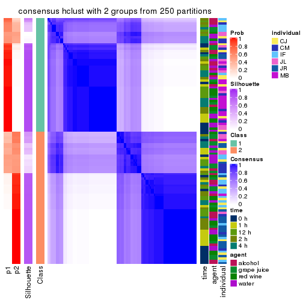</p>

</div>
<div id='tab-ATC-hclust-consensus-heatmap-2'>
<pre><code class="r">consensus_heatmap(res, k = 3)
</code></pre>

<p>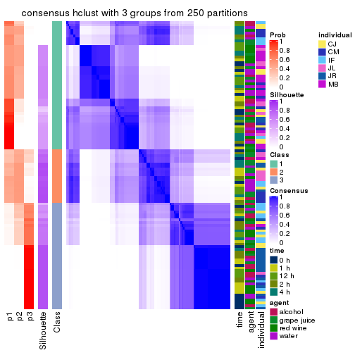</p>

</div>
<div id='tab-ATC-hclust-consensus-heatmap-3'>
<pre><code class="r">consensus_heatmap(res, k = 4)
</code></pre>

<p>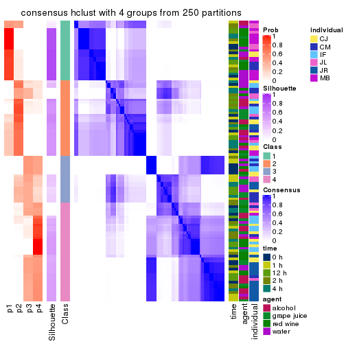</p>

</div>
<div id='tab-ATC-hclust-consensus-heatmap-4'>
<pre><code class="r">consensus_heatmap(res, k = 5)
</code></pre>

<p>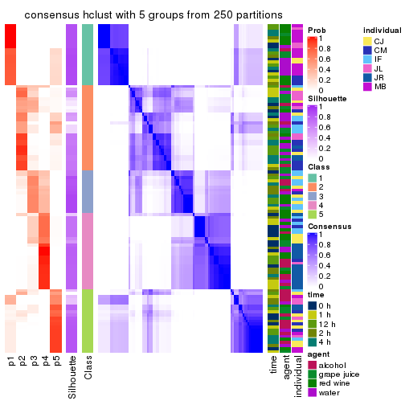</p>

</div>
<div id='tab-ATC-hclust-consensus-heatmap-5'>
<pre><code class="r">consensus_heatmap(res, k = 6)
</code></pre>

<p>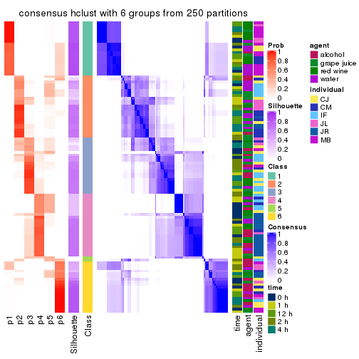</p>

</div>
</div>

Heatmaps for the membership of samples in all partitions to see how consistent they are:


<script>
$( function() {
	$( '#tabs-ATC-hclust-membership-heatmap' ).tabs();
} );
</script>
<div id='tabs-ATC-hclust-membership-heatmap'>
<ul>
<li><a href='#tab-ATC-hclust-membership-heatmap-1'>k = 2</a></li>
<li><a href='#tab-ATC-hclust-membership-heatmap-2'>k = 3</a></li>
<li><a href='#tab-ATC-hclust-membership-heatmap-3'>k = 4</a></li>
<li><a href='#tab-ATC-hclust-membership-heatmap-4'>k = 5</a></li>
<li><a href='#tab-ATC-hclust-membership-heatmap-5'>k = 6</a></li>
</ul>
<div id='tab-ATC-hclust-membership-heatmap-1'>
<pre><code class="r">membership_heatmap(res, k = 2)
</code></pre>

<p>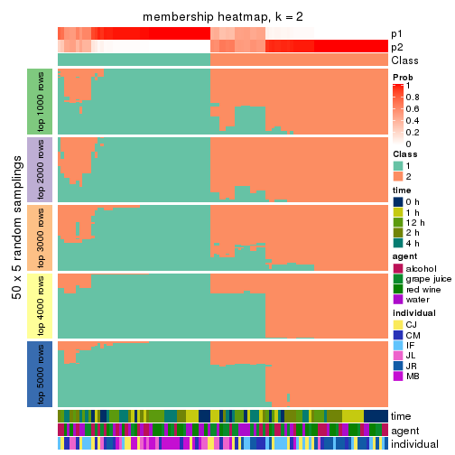</p>

</div>
<div id='tab-ATC-hclust-membership-heatmap-2'>
<pre><code class="r">membership_heatmap(res, k = 3)
</code></pre>

<p>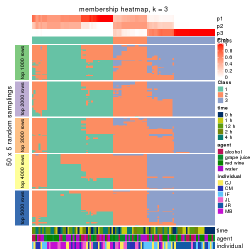</p>

</div>
<div id='tab-ATC-hclust-membership-heatmap-3'>
<pre><code class="r">membership_heatmap(res, k = 4)
</code></pre>

<p>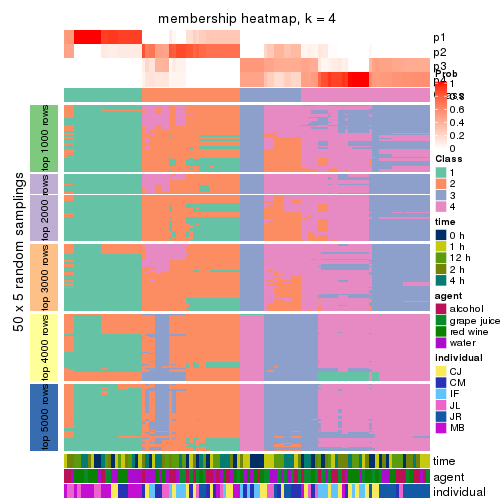</p>

</div>
<div id='tab-ATC-hclust-membership-heatmap-4'>
<pre><code class="r">membership_heatmap(res, k = 5)
</code></pre>

<p>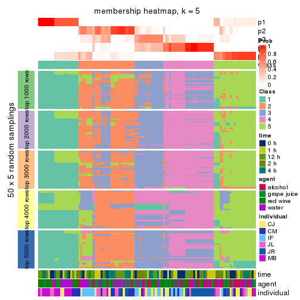</p>

</div>
<div id='tab-ATC-hclust-membership-heatmap-5'>
<pre><code class="r">membership_heatmap(res, k = 6)
</code></pre>

<p>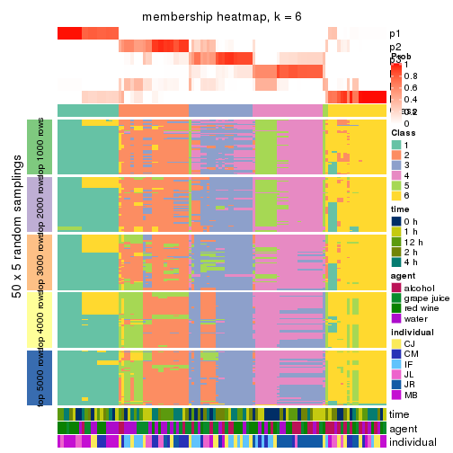</p>

</div>
</div>

As soon as we have had the classes for columns, we can look for signatures
which are significantly different between classes which can be candidate marks
for certain classes. Following are the heatmaps for signatures.


Signature heatmaps where rows are scaled:


<script>
$( function() {
	$( '#tabs-ATC-hclust-get-signatures' ).tabs();
} );
</script>
<div id='tabs-ATC-hclust-get-signatures'>
<ul>
<li><a href='#tab-ATC-hclust-get-signatures-1'>k = 2</a></li>
<li><a href='#tab-ATC-hclust-get-signatures-2'>k = 3</a></li>
<li><a href='#tab-ATC-hclust-get-signatures-3'>k = 4</a></li>
<li><a href='#tab-ATC-hclust-get-signatures-4'>k = 5</a></li>
<li><a href='#tab-ATC-hclust-get-signatures-5'>k = 6</a></li>
</ul>
<div id='tab-ATC-hclust-get-signatures-1'>
<pre><code class="r">get_signatures(res, k = 2)
</code></pre>

<p>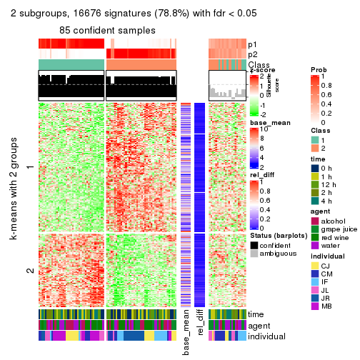</p>

</div>
<div id='tab-ATC-hclust-get-signatures-2'>
<pre><code class="r">get_signatures(res, k = 3)
</code></pre>

<p>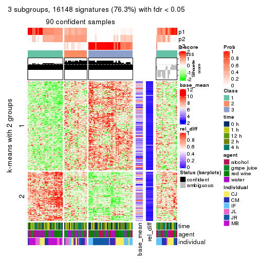</p>

</div>
<div id='tab-ATC-hclust-get-signatures-3'>
<pre><code class="r">get_signatures(res, k = 4)
</code></pre>

<p>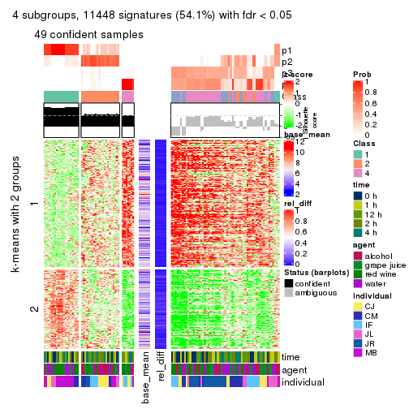</p>

</div>
<div id='tab-ATC-hclust-get-signatures-4'>
<pre><code class="r">get_signatures(res, k = 5)
</code></pre>

<p>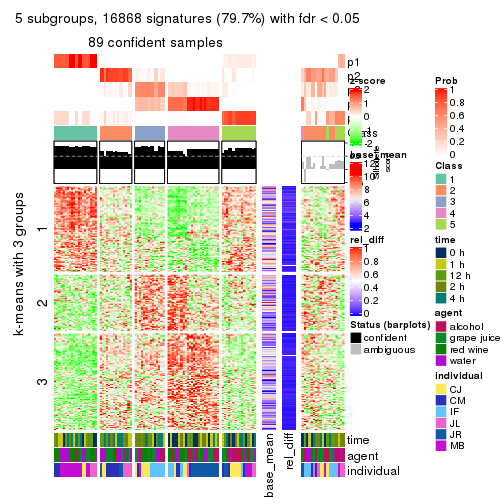</p>

</div>
<div id='tab-ATC-hclust-get-signatures-5'>
<pre><code class="r">get_signatures(res, k = 6)
</code></pre>

<p>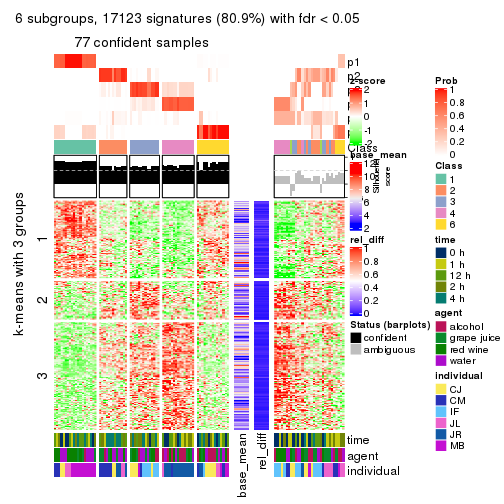</p>

</div>
</div>


Signature heatmaps where rows are not scaled:


<script>
$( function() {
	$( '#tabs-ATC-hclust-get-signatures-no-scale' ).tabs();
} );
</script>
<div id='tabs-ATC-hclust-get-signatures-no-scale'>
<ul>
<li><a href='#tab-ATC-hclust-get-signatures-no-scale-1'>k = 2</a></li>
<li><a href='#tab-ATC-hclust-get-signatures-no-scale-2'>k = 3</a></li>
<li><a href='#tab-ATC-hclust-get-signatures-no-scale-3'>k = 4</a></li>
<li><a href='#tab-ATC-hclust-get-signatures-no-scale-4'>k = 5</a></li>
<li><a href='#tab-ATC-hclust-get-signatures-no-scale-5'>k = 6</a></li>
</ul>
<div id='tab-ATC-hclust-get-signatures-no-scale-1'>
<pre><code class="r">get_signatures(res, k = 2, scale_rows = FALSE)
</code></pre>

<p>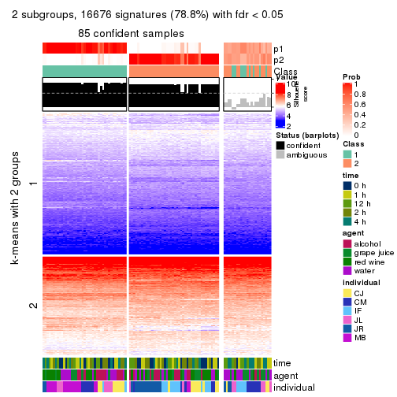</p>

</div>
<div id='tab-ATC-hclust-get-signatures-no-scale-2'>
<pre><code class="r">get_signatures(res, k = 3, scale_rows = FALSE)
</code></pre>

<p>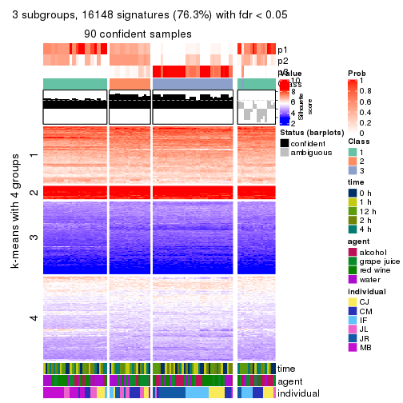</p>

</div>
<div id='tab-ATC-hclust-get-signatures-no-scale-3'>
<pre><code class="r">get_signatures(res, k = 4, scale_rows = FALSE)
</code></pre>

<p>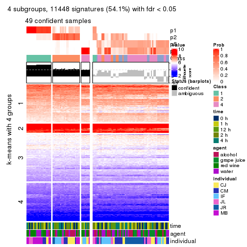</p>

</div>
<div id='tab-ATC-hclust-get-signatures-no-scale-4'>
<pre><code class="r">get_signatures(res, k = 5, scale_rows = FALSE)
</code></pre>

<p>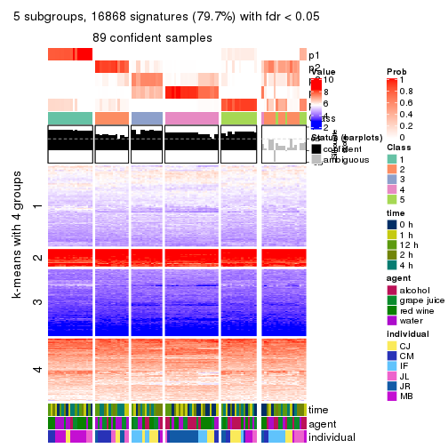</p>

</div>
<div id='tab-ATC-hclust-get-signatures-no-scale-5'>
<pre><code class="r">get_signatures(res, k = 6, scale_rows = FALSE)
</code></pre>

<p>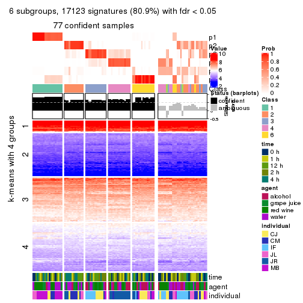</p>

</div>
</div>


Compare the overlap of signatures from different k:

```r
compare_signatures(res)
```

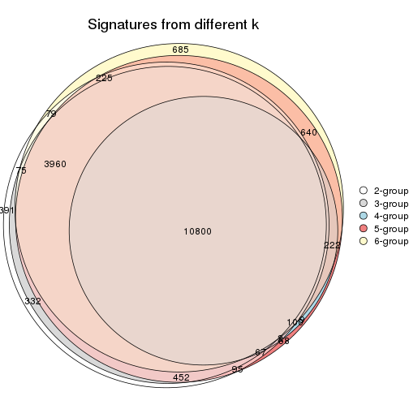

`get_signature()` returns a data frame invisibly. TO get the list of signatures, the function
call should be assigned to a variable explicitly. In following code, if `plot` argument is set
to `FALSE`, no heatmap is plotted while only the differential analysis is performed.

```r
# code only for demonstration
tb = get_signature(res, k = ..., plot = FALSE)
```

An example of the output of `tb` is:

```
#>   which_row         fdr    mean_1    mean_2 scaled_mean_1 scaled_mean_2 km
#> 1        38 0.042760348  8.373488  9.131774    -0.5533452     0.5164555  1
#> 2        40 0.018707592  7.106213  8.469186    -0.6173731     0.5762149  1
#> 3        55 0.019134737 10.221463 11.207825    -0.6159697     0.5749050  1
#> 4        59 0.006059896  5.921854  7.869574    -0.6899429     0.6439467  1
#> 5        60 0.018055526  8.928898 10.211722    -0.6204761     0.5791110  1
#> 6        98 0.009384629 15.714769 14.887706     0.6635654    -0.6193277  2
...
```

The columns in `tb` are:

1. `which_row`: row indices corresponding to the input matrix.
2. `fdr`: FDR for the differential test. 
3. `mean_x`: The mean value in group x.
4. `scaled_mean_x`: The mean value in group x after rows are scaled.
5. `km`: Row groups if k-means clustering is applied to rows.


UMAP plot which shows how samples are separated.


<script>
$( function() {
	$( '#tabs-ATC-hclust-dimension-reduction' ).tabs();
} );
</script>
<div id='tabs-ATC-hclust-dimension-reduction'>
<ul>
<li><a href='#tab-ATC-hclust-dimension-reduction-1'>k = 2</a></li>
<li><a href='#tab-ATC-hclust-dimension-reduction-2'>k = 3</a></li>
<li><a href='#tab-ATC-hclust-dimension-reduction-3'>k = 4</a></li>
<li><a href='#tab-ATC-hclust-dimension-reduction-4'>k = 5</a></li>
<li><a href='#tab-ATC-hclust-dimension-reduction-5'>k = 6</a></li>
</ul>
<div id='tab-ATC-hclust-dimension-reduction-1'>
<pre><code class="r">dimension_reduction(res, k = 2, method = &quot;UMAP&quot;)
</code></pre>

<p>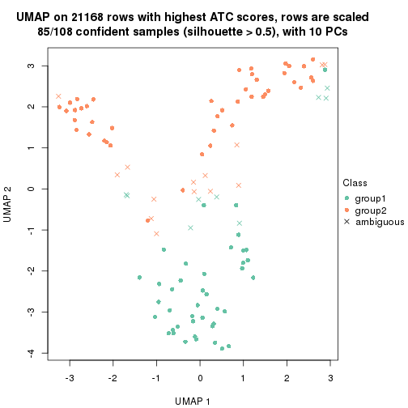</p>

</div>
<div id='tab-ATC-hclust-dimension-reduction-2'>
<pre><code class="r">dimension_reduction(res, k = 3, method = &quot;UMAP&quot;)
</code></pre>

<p>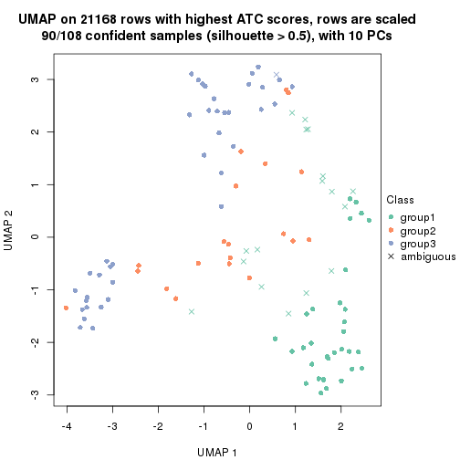</p>

</div>
<div id='tab-ATC-hclust-dimension-reduction-3'>
<pre><code class="r">dimension_reduction(res, k = 4, method = &quot;UMAP&quot;)
</code></pre>

<p>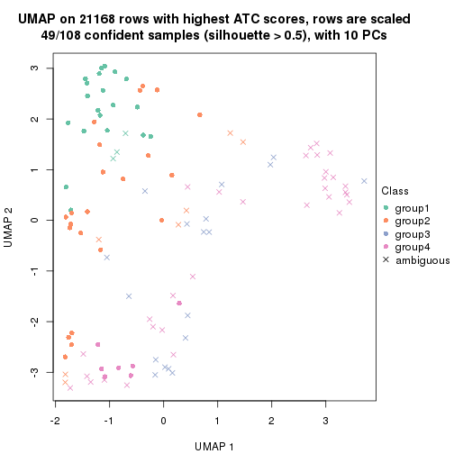</p>

</div>
<div id='tab-ATC-hclust-dimension-reduction-4'>
<pre><code class="r">dimension_reduction(res, k = 5, method = &quot;UMAP&quot;)
</code></pre>

<p>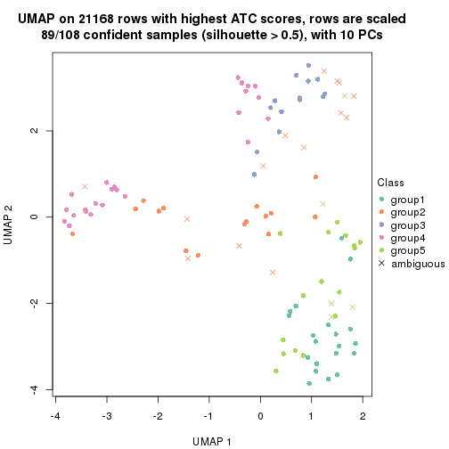</p>

</div>
<div id='tab-ATC-hclust-dimension-reduction-5'>
<pre><code class="r">dimension_reduction(res, k = 6, method = &quot;UMAP&quot;)
</code></pre>

<p>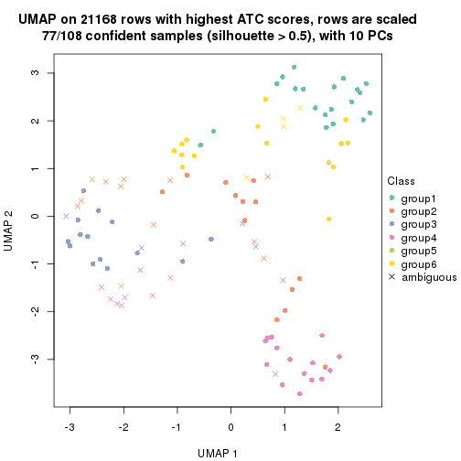</p>

</div>
</div>


Following heatmap shows how subgroups are split when increasing `k`:

```r
collect_classes(res)
```

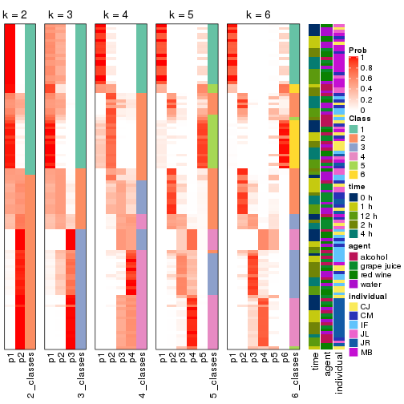


Test correlation between subgroups and known annotations. If the known
annotation is numeric, one-way ANOVA test is applied, and if the known
annotation is discrete, chi-squared contingency table test is applied.

```r
test_to_known_factors(res)
```

```
#>             n time(p) agent(p) individual(p) k
#> ATC:hclust 85   0.704   0.7781      1.55e-05 2
#> ATC:hclust 90   0.779   0.0540      6.05e-08 3
#> ATC:hclust 49   0.968   0.0372      1.33e-02 4
#> ATC:hclust 89   0.316   0.1917      6.79e-10 5
#> ATC:hclust 77   0.592   0.2035      7.50e-13 6
```


If matrix rows can be associated to genes, consider to use `GO_Enrichment(res,
...)` to perform function enrichment for the signature genes.


 

---------------------------------------------------


### ATC:kmeans**


The object with results only for a single top-value method and a single partition method 
can be extracted as:

```r
res = res_list["ATC", "kmeans"]
# you can also extract it by
# res = res_list["ATC:kmeans"]
```

A summary of `res` and all the functions that can be applied to it:

```r
res
```

```
#> A 'ConsensusPartition' object with k = 2, 3, 4, 5, 6.
#>   On a matrix with 21168 rows and 108 columns.
#>   Top rows (1000, 2000, 3000, 4000, 5000) are extracted by 'ATC' method.
#>   Subgroups are detected by 'kmeans' method.
#>   Performed in total 1250 partitions by row resampling.
#>   Best k for subgroups seems to be 3.
#> 
#> Following methods can be applied to this 'ConsensusPartition' object:
#>  [1] "cola_report"             "collect_classes"         "collect_plots"          
#>  [4] "collect_stats"           "colnames"                "compare_signatures"     
#>  [7] "consensus_heatmap"       "dimension_reduction"     "functional_enrichment"  
#> [10] "get_anno_col"            "get_anno"                "get_classes"            
#> [13] "get_consensus"           "get_matrix"              "get_membership"         
#> [16] "get_param"               "get_signatures"          "get_stats"              
#> [19] "is_best_k"               "is_stable_k"             "membership_heatmap"     
#> [22] "ncol"                    "nrow"                    "plot_ecdf"              
#> [25] "rownames"                "select_partition_number" "show"                   
#> [28] "suggest_best_k"          "test_to_known_factors"
```

`collect_plots()` function collects all the plots made from `res` for all `k` (number of partitions)
into one single page to provide an easy and fast comparison between different `k`.

```r
collect_plots(res)
```

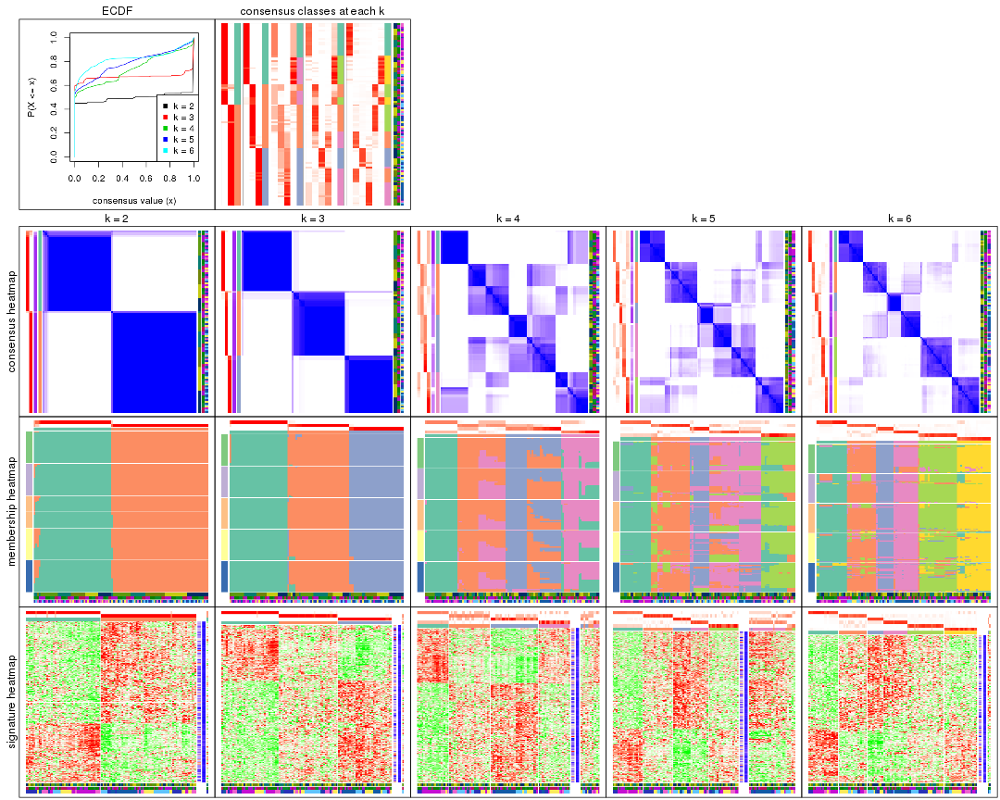

The plots are:

- The first row: a plot of the ECDF (Empirical cumulative distribution
  function) curves of the consensus matrix for each `k` and the heatmap of
  predicted classes for each `k`.
- The second row: heatmaps of the consensus matrix for each `k`.
- The third row: heatmaps of the membership matrix for each `k`.
- The fouth row: heatmaps of the signatures for each `k`.

All the plots in panels can be made by individual functions and they are
plotted later in this section.

`select_partition_number()` produces several plots showing different
statistics for choosing "optimized" `k`. There are following statistics:

- ECDF curves of the consensus matrix for each `k`;
- 1-PAC. [The PAC
  score](https://en.wikipedia.org/wiki/Consensus_clustering#Over-interpretation_potential_of_consensus_clustering)
  measures the proportion of the ambiguous subgrouping.
- Mean silhouette score.
- Concordance. The mean probability of fiting the consensus class ids in all
  partitions.
- Area increased. Denote $A_k$ as the area under the ECDF curve for current
  `k`, the area increased is defined as $A_k - A_{k-1}$.
- Rand index. The percent of pairs of samples that are both in a same cluster
  or both are not in a same cluster in the partition of k and k-1.
- Jaccard index. The ratio of pairs of samples are both in a same cluster in
  the partition of k and k-1 and the pairs of samples are both in a same
  cluster in the partition k or k-1.

The detailed explanations of these statistics can be found in [the cola
vignette](http://bioconductor.org/packages/devel/bioc/vignettes/cola/inst/doc/cola.html#toc_13).

Generally speaking, lower PAC score, higher mean silhouette score or higher
concordance corresponds to better partition. Rand index and Jaccard index
measure how similar the current partition is compared to partition with `k-1`.
If they are too similar, we won't accept `k` is better than `k-1`.

```r
select_partition_number(res)
```

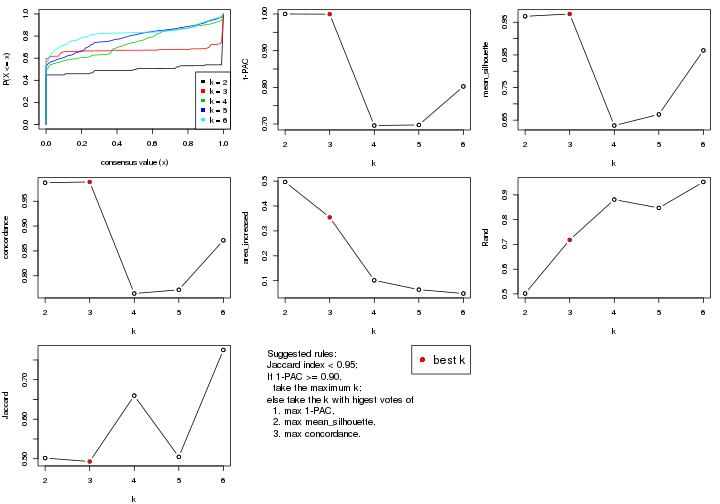

The numeric values for all these statistics can be obtained by `get_stats()`.

```r
get_stats(res)
```

```
#>   k 1-PAC mean_silhouette concordance area_increased  Rand Jaccard
#> 2 2 1.000           0.968       0.987         0.4965 0.502   0.502
#> 3 3 0.999           0.975       0.989         0.3543 0.718   0.493
#> 4 4 0.696           0.634       0.764         0.1014 0.881   0.660
#> 5 5 0.698           0.668       0.772         0.0641 0.847   0.504
#> 6 6 0.802           0.864       0.871         0.0486 0.952   0.775
```

`suggest_best_k()` suggests the best $k$ based on these statistics. The rules are as follows:

- All $k$ with Jaccard index larger than 0.95 are removed because the increase of
  the partition number does not provides enough extra information. If all $k$ are removed,
  the best $k$ is assigned by `NA`.
- For $k$ with 1-PAC larger than 0.9, the maximal $k$ is taken as the "best k". Other $k$ is called "optional k".
- If it does not fit the second rule. The $k$ with the highest vote of highest
  1-PAC, mean silhouette and concordance is taken as the "best k".

```r
suggest_best_k(res)
```

```
#> [1] 3
#> attr(,"optional")
#> [1] 2
```

There is also optional best $k$ = 2 that is worth to check.

Following shows the table of the partitions (You need to click the **show/hide
code output** link to see it). The membership matrix (columns with name `p*`)
is inferred by
[`clue::cl_consensus()`](https://www.rdocumentation.org/link/cl_consensus?package=clue)
function with the `SE` method. Basically the value in the membership matrix
represents the probability to belong to a certain group. The finall class
label for an item is determined with the group with highest probability it
belongs to.

In `get_classes()` function, the entropy is calculated from the membership
matrix and the silhouette score is calculated from the consensus matrix.


<script>
$( function() {
	$( '#tabs-ATC-kmeans-get-classes' ).tabs();
} );
</script>
<div id='tabs-ATC-kmeans-get-classes'>
<ul>
<li><a href='#tab-ATC-kmeans-get-classes-1'>k = 2</a></li>
<li><a href='#tab-ATC-kmeans-get-classes-2'>k = 3</a></li>
<li><a href='#tab-ATC-kmeans-get-classes-3'>k = 4</a></li>
<li><a href='#tab-ATC-kmeans-get-classes-4'>k = 5</a></li>
<li><a href='#tab-ATC-kmeans-get-classes-5'>k = 6</a></li>
</ul>

<div id='tab-ATC-kmeans-get-classes-1'>
<p><a id='tab-ATC-kmeans-get-classes-1-a' style='color:#0366d6' href='#'>show/hide code output</a></p>
<pre><code class="r">cbind(get_classes(res, k = 2), get_membership(res, k = 2))
</code></pre>

<pre><code>#&gt;          class entropy silhouette    p1    p2
#&gt; GSM87863     1   0.000     0.9756 1.000 0.000
#&gt; GSM87887     1   0.000     0.9756 1.000 0.000
#&gt; GSM87896     2   0.000     0.9957 0.000 1.000
#&gt; GSM87934     2   0.000     0.9957 0.000 1.000
#&gt; GSM87943     2   0.000     0.9957 0.000 1.000
#&gt; GSM87853     2   0.000     0.9957 0.000 1.000
#&gt; GSM87906     2   0.000     0.9957 0.000 1.000
#&gt; GSM87920     1   0.000     0.9756 1.000 0.000
#&gt; GSM87924     2   0.000     0.9957 0.000 1.000
#&gt; GSM87858     2   0.000     0.9957 0.000 1.000
#&gt; GSM87882     2   0.000     0.9957 0.000 1.000
#&gt; GSM87891     2   0.000     0.9957 0.000 1.000
#&gt; GSM87917     1   0.000     0.9756 1.000 0.000
#&gt; GSM87929     2   0.000     0.9957 0.000 1.000
#&gt; GSM87948     1   0.000     0.9756 1.000 0.000
#&gt; GSM87868     1   0.000     0.9756 1.000 0.000
#&gt; GSM87873     2   0.000     0.9957 0.000 1.000
#&gt; GSM87901     2   0.000     0.9957 0.000 1.000
#&gt; GSM87910     1   0.000     0.9756 1.000 0.000
#&gt; GSM87938     2   0.000     0.9957 0.000 1.000
#&gt; GSM87953     1   0.000     0.9756 1.000 0.000
#&gt; GSM87864     1   0.000     0.9756 1.000 0.000
#&gt; GSM87888     2   0.000     0.9957 0.000 1.000
#&gt; GSM87897     2   0.000     0.9957 0.000 1.000
#&gt; GSM87935     2   0.000     0.9957 0.000 1.000
#&gt; GSM87944     1   0.000     0.9756 1.000 0.000
#&gt; GSM87854     2   0.000     0.9957 0.000 1.000
#&gt; GSM87878     1   0.000     0.9756 1.000 0.000
#&gt; GSM87907     2   0.000     0.9957 0.000 1.000
#&gt; GSM87921     2   0.000     0.9957 0.000 1.000
#&gt; GSM87925     2   0.000     0.9957 0.000 1.000
#&gt; GSM87957     1   0.000     0.9756 1.000 0.000
#&gt; GSM87859     2   0.000     0.9957 0.000 1.000
#&gt; GSM87883     1   0.000     0.9756 1.000 0.000
#&gt; GSM87892     2   0.000     0.9957 0.000 1.000
#&gt; GSM87930     2   0.000     0.9957 0.000 1.000
#&gt; GSM87949     1   0.000     0.9756 1.000 0.000
#&gt; GSM87869     1   0.000     0.9756 1.000 0.000
#&gt; GSM87874     2   0.000     0.9957 0.000 1.000
#&gt; GSM87902     2   0.000     0.9957 0.000 1.000
#&gt; GSM87911     2   0.000     0.9957 0.000 1.000
#&gt; GSM87939     2   0.000     0.9957 0.000 1.000
#&gt; GSM87954     1   0.000     0.9756 1.000 0.000
#&gt; GSM87865     1   0.000     0.9756 1.000 0.000
#&gt; GSM87889     1   0.000     0.9756 1.000 0.000
#&gt; GSM87898     1   0.000     0.9756 1.000 0.000
#&gt; GSM87915     1   0.000     0.9756 1.000 0.000
#&gt; GSM87936     2   0.000     0.9957 0.000 1.000
#&gt; GSM87945     2   0.000     0.9957 0.000 1.000
#&gt; GSM87855     2   0.000     0.9957 0.000 1.000
#&gt; GSM87879     2   0.000     0.9957 0.000 1.000
#&gt; GSM87922     2   0.000     0.9957 0.000 1.000
#&gt; GSM87926     2   0.000     0.9957 0.000 1.000
#&gt; GSM87958     1   0.000     0.9756 1.000 0.000
#&gt; GSM87860     2   0.000     0.9957 0.000 1.000
#&gt; GSM87884     1   0.000     0.9756 1.000 0.000
#&gt; GSM87893     2   0.000     0.9957 0.000 1.000
#&gt; GSM87918     1   0.844     0.6359 0.728 0.272
#&gt; GSM87931     2   0.000     0.9957 0.000 1.000
#&gt; GSM87950     1   0.000     0.9756 1.000 0.000
#&gt; GSM87870     1   0.000     0.9756 1.000 0.000
#&gt; GSM87875     2   0.000     0.9957 0.000 1.000
#&gt; GSM87903     2   0.000     0.9957 0.000 1.000
#&gt; GSM87912     1   0.000     0.9756 1.000 0.000
#&gt; GSM87940     2   0.000     0.9957 0.000 1.000
#&gt; GSM87866     1   0.000     0.9756 1.000 0.000
#&gt; GSM87899     2   0.000     0.9957 0.000 1.000
#&gt; GSM87937     2   0.000     0.9957 0.000 1.000
#&gt; GSM87946     1   0.000     0.9756 1.000 0.000
#&gt; GSM87856     2   0.000     0.9957 0.000 1.000
#&gt; GSM87880     2   0.000     0.9957 0.000 1.000
#&gt; GSM87908     1   0.833     0.6499 0.736 0.264
#&gt; GSM87923     2   0.000     0.9957 0.000 1.000
#&gt; GSM87927     2   0.000     0.9957 0.000 1.000
#&gt; GSM87959     1   0.000     0.9756 1.000 0.000
#&gt; GSM87861     2   0.000     0.9957 0.000 1.000
#&gt; GSM87885     1   1.000     0.0747 0.512 0.488
#&gt; GSM87894     1   0.000     0.9756 1.000 0.000
#&gt; GSM87932     1   0.000     0.9756 1.000 0.000
#&gt; GSM87951     1   0.000     0.9756 1.000 0.000
#&gt; GSM87871     2   0.802     0.6626 0.244 0.756
#&gt; GSM87876     1   0.494     0.8677 0.892 0.108
#&gt; GSM87904     2   0.000     0.9957 0.000 1.000
#&gt; GSM87913     1   0.000     0.9756 1.000 0.000
#&gt; GSM87941     2   0.000     0.9957 0.000 1.000
#&gt; GSM87955     1   0.000     0.9756 1.000 0.000
#&gt; GSM87867     1   0.000     0.9756 1.000 0.000
#&gt; GSM87890     2   0.000     0.9957 0.000 1.000
#&gt; GSM87900     2   0.000     0.9957 0.000 1.000
#&gt; GSM87916     2   0.000     0.9957 0.000 1.000
#&gt; GSM87947     1   0.000     0.9756 1.000 0.000
#&gt; GSM87857     2   0.000     0.9957 0.000 1.000
#&gt; GSM87881     2   0.000     0.9957 0.000 1.000
#&gt; GSM87909     1   0.000     0.9756 1.000 0.000
#&gt; GSM87928     1   0.000     0.9756 1.000 0.000
#&gt; GSM87960     1   0.000     0.9756 1.000 0.000
#&gt; GSM87862     2   0.000     0.9957 0.000 1.000
#&gt; GSM87886     1   0.000     0.9756 1.000 0.000
#&gt; GSM87895     2   0.000     0.9957 0.000 1.000
#&gt; GSM87919     1   0.000     0.9756 1.000 0.000
#&gt; GSM87933     2   0.000     0.9957 0.000 1.000
#&gt; GSM87952     1   0.000     0.9756 1.000 0.000
#&gt; GSM87872     2   0.000     0.9957 0.000 1.000
#&gt; GSM87877     1   0.000     0.9756 1.000 0.000
#&gt; GSM87905     1   0.000     0.9756 1.000 0.000
#&gt; GSM87914     2   0.000     0.9957 0.000 1.000
#&gt; GSM87942     2   0.000     0.9957 0.000 1.000
#&gt; GSM87956     1   0.000     0.9756 1.000 0.000
</code></pre>

<script>
$('#tab-ATC-kmeans-get-classes-1-a').parent().next().next().hide();
$('#tab-ATC-kmeans-get-classes-1-a').click(function(){
  $('#tab-ATC-kmeans-get-classes-1-a').parent().next().next().toggle();
  return(false);
});
</script>
</div>

<div id='tab-ATC-kmeans-get-classes-2'>
<p><a id='tab-ATC-kmeans-get-classes-2-a' style='color:#0366d6' href='#'>show/hide code output</a></p>
<pre><code class="r">cbind(get_classes(res, k = 3), get_membership(res, k = 3))
</code></pre>

<pre><code>#&gt;          class entropy silhouette    p1    p2    p3
#&gt; GSM87863     2  0.2448      0.913 0.076 0.924 0.000
#&gt; GSM87887     1  0.0000      0.994 1.000 0.000 0.000
#&gt; GSM87896     3  0.0000      0.993 0.000 0.000 1.000
#&gt; GSM87934     3  0.0000      0.993 0.000 0.000 1.000
#&gt; GSM87943     2  0.0000      0.978 0.000 1.000 0.000
#&gt; GSM87853     3  0.0000      0.993 0.000 0.000 1.000
#&gt; GSM87906     2  0.0000      0.978 0.000 1.000 0.000
#&gt; GSM87920     2  0.2448      0.913 0.076 0.924 0.000
#&gt; GSM87924     3  0.0000      0.993 0.000 0.000 1.000
#&gt; GSM87858     3  0.0000      0.993 0.000 0.000 1.000
#&gt; GSM87882     2  0.0000      0.978 0.000 1.000 0.000
#&gt; GSM87891     3  0.0000      0.993 0.000 0.000 1.000
#&gt; GSM87917     1  0.0000      0.994 1.000 0.000 0.000
#&gt; GSM87929     3  0.0000      0.993 0.000 0.000 1.000
#&gt; GSM87948     1  0.0000      0.994 1.000 0.000 0.000
#&gt; GSM87868     1  0.0000      0.994 1.000 0.000 0.000
#&gt; GSM87873     3  0.0000      0.993 0.000 0.000 1.000
#&gt; GSM87901     2  0.0000      0.978 0.000 1.000 0.000
#&gt; GSM87910     1  0.0000      0.994 1.000 0.000 0.000
#&gt; GSM87938     3  0.0000      0.993 0.000 0.000 1.000
#&gt; GSM87953     1  0.0000      0.994 1.000 0.000 0.000
#&gt; GSM87864     1  0.0000      0.994 1.000 0.000 0.000
#&gt; GSM87888     2  0.0000      0.978 0.000 1.000 0.000
#&gt; GSM87897     2  0.0000      0.978 0.000 1.000 0.000
#&gt; GSM87935     3  0.0000      0.993 0.000 0.000 1.000
#&gt; GSM87944     1  0.0000      0.994 1.000 0.000 0.000
#&gt; GSM87854     2  0.0000      0.978 0.000 1.000 0.000
#&gt; GSM87878     2  0.2625      0.905 0.084 0.916 0.000
#&gt; GSM87907     3  0.0000      0.993 0.000 0.000 1.000
#&gt; GSM87921     2  0.0000      0.978 0.000 1.000 0.000
#&gt; GSM87925     3  0.0000      0.993 0.000 0.000 1.000
#&gt; GSM87957     1  0.0000      0.994 1.000 0.000 0.000
#&gt; GSM87859     3  0.0000      0.993 0.000 0.000 1.000
#&gt; GSM87883     1  0.0000      0.994 1.000 0.000 0.000
#&gt; GSM87892     3  0.0000      0.993 0.000 0.000 1.000
#&gt; GSM87930     3  0.0000      0.993 0.000 0.000 1.000
#&gt; GSM87949     1  0.0000      0.994 1.000 0.000 0.000
#&gt; GSM87869     1  0.0000      0.994 1.000 0.000 0.000
#&gt; GSM87874     3  0.0000      0.993 0.000 0.000 1.000
#&gt; GSM87902     2  0.0000      0.978 0.000 1.000 0.000
#&gt; GSM87911     2  0.0000      0.978 0.000 1.000 0.000
#&gt; GSM87939     3  0.0000      0.993 0.000 0.000 1.000
#&gt; GSM87954     1  0.0000      0.994 1.000 0.000 0.000
#&gt; GSM87865     1  0.4399      0.763 0.812 0.188 0.000
#&gt; GSM87889     2  0.0000      0.978 0.000 1.000 0.000
#&gt; GSM87898     2  0.2959      0.888 0.100 0.900 0.000
#&gt; GSM87915     1  0.0000      0.994 1.000 0.000 0.000
#&gt; GSM87936     3  0.0000      0.993 0.000 0.000 1.000
#&gt; GSM87945     3  0.0000      0.993 0.000 0.000 1.000
#&gt; GSM87855     3  0.2448      0.923 0.000 0.076 0.924
#&gt; GSM87879     2  0.0000      0.978 0.000 1.000 0.000
#&gt; GSM87922     2  0.1529      0.946 0.000 0.960 0.040
#&gt; GSM87926     3  0.0000      0.993 0.000 0.000 1.000
#&gt; GSM87958     1  0.0000      0.994 1.000 0.000 0.000
#&gt; GSM87860     3  0.0000      0.993 0.000 0.000 1.000
#&gt; GSM87884     1  0.0000      0.994 1.000 0.000 0.000
#&gt; GSM87893     3  0.0000      0.993 0.000 0.000 1.000
#&gt; GSM87918     2  0.0000      0.978 0.000 1.000 0.000
#&gt; GSM87931     3  0.0000      0.993 0.000 0.000 1.000
#&gt; GSM87950     1  0.0000      0.994 1.000 0.000 0.000
#&gt; GSM87870     1  0.0000      0.994 1.000 0.000 0.000
#&gt; GSM87875     3  0.2448      0.923 0.000 0.076 0.924
#&gt; GSM87903     2  0.0892      0.963 0.000 0.980 0.020
#&gt; GSM87912     1  0.0000      0.994 1.000 0.000 0.000
#&gt; GSM87940     3  0.0000      0.993 0.000 0.000 1.000
#&gt; GSM87866     1  0.0000      0.994 1.000 0.000 0.000
#&gt; GSM87899     2  0.0747      0.967 0.000 0.984 0.016
#&gt; GSM87937     3  0.0000      0.993 0.000 0.000 1.000
#&gt; GSM87946     1  0.0000      0.994 1.000 0.000 0.000
#&gt; GSM87856     2  0.0000      0.978 0.000 1.000 0.000
#&gt; GSM87880     2  0.0000      0.978 0.000 1.000 0.000
#&gt; GSM87908     2  0.0000      0.978 0.000 1.000 0.000
#&gt; GSM87923     2  0.0000      0.978 0.000 1.000 0.000
#&gt; GSM87927     2  0.0000      0.978 0.000 1.000 0.000
#&gt; GSM87959     1  0.0000      0.994 1.000 0.000 0.000
#&gt; GSM87861     3  0.0000      0.993 0.000 0.000 1.000
#&gt; GSM87885     2  0.0000      0.978 0.000 1.000 0.000
#&gt; GSM87894     1  0.0000      0.994 1.000 0.000 0.000
#&gt; GSM87932     1  0.0000      0.994 1.000 0.000 0.000
#&gt; GSM87951     1  0.0000      0.994 1.000 0.000 0.000
#&gt; GSM87871     2  0.0000      0.978 0.000 1.000 0.000
#&gt; GSM87876     2  0.0000      0.978 0.000 1.000 0.000
#&gt; GSM87904     3  0.2448      0.923 0.000 0.076 0.924
#&gt; GSM87913     1  0.0000      0.994 1.000 0.000 0.000
#&gt; GSM87941     2  0.0000      0.978 0.000 1.000 0.000
#&gt; GSM87955     1  0.0000      0.994 1.000 0.000 0.000
#&gt; GSM87867     2  0.0000      0.978 0.000 1.000 0.000
#&gt; GSM87890     3  0.0000      0.993 0.000 0.000 1.000
#&gt; GSM87900     2  0.6008      0.402 0.000 0.628 0.372
#&gt; GSM87916     3  0.0000      0.993 0.000 0.000 1.000
#&gt; GSM87947     1  0.0000      0.994 1.000 0.000 0.000
#&gt; GSM87857     2  0.0747      0.967 0.000 0.984 0.016
#&gt; GSM87881     2  0.0000      0.978 0.000 1.000 0.000
#&gt; GSM87909     2  0.0000      0.978 0.000 1.000 0.000
#&gt; GSM87928     1  0.0000      0.994 1.000 0.000 0.000
#&gt; GSM87960     1  0.0000      0.994 1.000 0.000 0.000
#&gt; GSM87862     3  0.0000      0.993 0.000 0.000 1.000
#&gt; GSM87886     1  0.0000      0.994 1.000 0.000 0.000
#&gt; GSM87895     3  0.0000      0.993 0.000 0.000 1.000
#&gt; GSM87919     1  0.0000      0.994 1.000 0.000 0.000
#&gt; GSM87933     3  0.0000      0.993 0.000 0.000 1.000
#&gt; GSM87952     1  0.0000      0.994 1.000 0.000 0.000
#&gt; GSM87872     2  0.0000      0.978 0.000 1.000 0.000
#&gt; GSM87877     1  0.0000      0.994 1.000 0.000 0.000
#&gt; GSM87905     2  0.0000      0.978 0.000 1.000 0.000
#&gt; GSM87914     2  0.0000      0.978 0.000 1.000 0.000
#&gt; GSM87942     2  0.0000      0.978 0.000 1.000 0.000
#&gt; GSM87956     1  0.0000      0.994 1.000 0.000 0.000
</code></pre>

<script>
$('#tab-ATC-kmeans-get-classes-2-a').parent().next().next().hide();
$('#tab-ATC-kmeans-get-classes-2-a').click(function(){
  $('#tab-ATC-kmeans-get-classes-2-a').parent().next().next().toggle();
  return(false);
});
</script>
</div>

<div id='tab-ATC-kmeans-get-classes-3'>
<p><a id='tab-ATC-kmeans-get-classes-3-a' style='color:#0366d6' href='#'>show/hide code output</a></p>
<pre><code class="r">cbind(get_classes(res, k = 4), get_membership(res, k = 4))
</code></pre>

<pre><code>#&gt;          class entropy silhouette    p1    p2    p3    p4
#&gt; GSM87863     4  0.4955     0.5699 0.344 0.008 0.000 0.648
#&gt; GSM87887     4  0.0188     0.6279 0.004 0.000 0.000 0.996
#&gt; GSM87896     3  0.5371     0.6548 0.020 0.364 0.616 0.000
#&gt; GSM87934     3  0.0000     0.6902 0.000 0.000 1.000 0.000
#&gt; GSM87943     2  0.6301     0.6269 0.104 0.636 0.260 0.000
#&gt; GSM87853     3  0.5508     0.6427 0.020 0.408 0.572 0.000
#&gt; GSM87906     2  0.4730     0.5646 0.000 0.636 0.364 0.000
#&gt; GSM87920     4  0.4955     0.5699 0.344 0.008 0.000 0.648
#&gt; GSM87924     3  0.5371     0.6548 0.020 0.364 0.616 0.000
#&gt; GSM87858     3  0.5371     0.6548 0.020 0.364 0.616 0.000
#&gt; GSM87882     2  0.4746     0.5592 0.000 0.632 0.368 0.000
#&gt; GSM87891     3  0.5371     0.6548 0.020 0.364 0.616 0.000
#&gt; GSM87917     1  0.4730     0.9954 0.636 0.000 0.000 0.364
#&gt; GSM87929     3  0.3444     0.5319 0.000 0.184 0.816 0.000
#&gt; GSM87948     4  0.0188     0.6279 0.004 0.000 0.000 0.996
#&gt; GSM87868     4  0.4996    -0.7414 0.484 0.000 0.000 0.516
#&gt; GSM87873     3  0.5371     0.6548 0.020 0.364 0.616 0.000
#&gt; GSM87901     2  0.6454     0.6581 0.344 0.572 0.000 0.084
#&gt; GSM87910     1  0.4730     0.9954 0.636 0.000 0.000 0.364
#&gt; GSM87938     3  0.4730     0.6562 0.000 0.364 0.636 0.000
#&gt; GSM87953     1  0.4730     0.9954 0.636 0.000 0.000 0.364
#&gt; GSM87864     4  0.2408     0.6605 0.104 0.000 0.000 0.896
#&gt; GSM87888     2  0.6795     0.6922 0.344 0.576 0.044 0.036
#&gt; GSM87897     2  0.4730     0.5646 0.000 0.636 0.364 0.000
#&gt; GSM87935     3  0.1302     0.6745 0.000 0.044 0.956 0.000
#&gt; GSM87944     4  0.3024     0.3363 0.148 0.000 0.000 0.852
#&gt; GSM87854     2  0.6663     0.6426 0.344 0.556 0.000 0.100
#&gt; GSM87878     4  0.4955     0.5699 0.344 0.008 0.000 0.648
#&gt; GSM87907     3  0.3751     0.5489 0.004 0.196 0.800 0.000
#&gt; GSM87921     2  0.6585     0.7055 0.344 0.576 0.072 0.008
#&gt; GSM87925     3  0.1637     0.6664 0.000 0.060 0.940 0.000
#&gt; GSM87957     4  0.0000     0.6315 0.000 0.000 0.000 1.000
#&gt; GSM87859     3  0.5371     0.6548 0.020 0.364 0.616 0.000
#&gt; GSM87883     1  0.4730     0.9954 0.636 0.000 0.000 0.364
#&gt; GSM87892     3  0.5371     0.6548 0.020 0.364 0.616 0.000
#&gt; GSM87930     3  0.4905     0.6553 0.004 0.364 0.632 0.000
#&gt; GSM87949     1  0.4730     0.9954 0.636 0.000 0.000 0.364
#&gt; GSM87869     1  0.4730     0.9954 0.636 0.000 0.000 0.364
#&gt; GSM87874     3  0.5371     0.6548 0.020 0.364 0.616 0.000
#&gt; GSM87902     2  0.6454     0.6581 0.344 0.572 0.000 0.084
#&gt; GSM87911     2  0.6894     0.6198 0.344 0.536 0.000 0.120
#&gt; GSM87939     3  0.1637     0.6664 0.000 0.060 0.940 0.000
#&gt; GSM87954     1  0.4730     0.9954 0.636 0.000 0.000 0.364
#&gt; GSM87865     4  0.4643     0.5769 0.344 0.000 0.000 0.656
#&gt; GSM87889     4  0.5649     0.5299 0.344 0.036 0.000 0.620
#&gt; GSM87898     4  0.4955     0.5699 0.344 0.008 0.000 0.648
#&gt; GSM87915     4  0.3486     0.2171 0.188 0.000 0.000 0.812
#&gt; GSM87936     3  0.1792     0.6623 0.000 0.068 0.932 0.000
#&gt; GSM87945     3  0.3448     0.5845 0.004 0.168 0.828 0.000
#&gt; GSM87855     3  0.4991     0.0912 0.004 0.388 0.608 0.000
#&gt; GSM87879     2  0.6398     0.7074 0.344 0.576 0.080 0.000
#&gt; GSM87922     2  0.4746     0.5592 0.000 0.632 0.368 0.000
#&gt; GSM87926     3  0.2921     0.5937 0.000 0.140 0.860 0.000
#&gt; GSM87958     1  0.4730     0.9954 0.636 0.000 0.000 0.364
#&gt; GSM87860     3  0.3448     0.5857 0.004 0.168 0.828 0.000
#&gt; GSM87884     1  0.4730     0.9954 0.636 0.000 0.000 0.364
#&gt; GSM87893     3  0.5371     0.6548 0.020 0.364 0.616 0.000
#&gt; GSM87918     2  0.7808     0.4192 0.344 0.400 0.000 0.256
#&gt; GSM87931     3  0.0000     0.6902 0.000 0.000 1.000 0.000
#&gt; GSM87950     1  0.4730     0.9954 0.636 0.000 0.000 0.364
#&gt; GSM87870     4  0.2408     0.6605 0.104 0.000 0.000 0.896
#&gt; GSM87875     3  0.5151    -0.1658 0.004 0.464 0.532 0.000
#&gt; GSM87903     2  0.4746     0.5592 0.000 0.632 0.368 0.000
#&gt; GSM87912     1  0.4916     0.9056 0.576 0.000 0.000 0.424
#&gt; GSM87940     3  0.4730     0.6562 0.000 0.364 0.636 0.000
#&gt; GSM87866     4  0.0188     0.6279 0.004 0.000 0.000 0.996
#&gt; GSM87899     2  0.4730     0.5646 0.000 0.636 0.364 0.000
#&gt; GSM87937     3  0.0000     0.6902 0.000 0.000 1.000 0.000
#&gt; GSM87946     1  0.4730     0.9954 0.636 0.000 0.000 0.364
#&gt; GSM87856     2  0.5289     0.5802 0.020 0.636 0.344 0.000
#&gt; GSM87880     2  0.6512     0.7069 0.344 0.576 0.076 0.004
#&gt; GSM87908     2  0.7781     0.4354 0.344 0.408 0.000 0.248
#&gt; GSM87923     2  0.4730     0.5646 0.000 0.636 0.364 0.000
#&gt; GSM87927     2  0.6028     0.5895 0.052 0.584 0.364 0.000
#&gt; GSM87959     1  0.4730     0.9954 0.636 0.000 0.000 0.364
#&gt; GSM87861     3  0.3306     0.5980 0.004 0.156 0.840 0.000
#&gt; GSM87885     2  0.7766     0.4428 0.344 0.412 0.000 0.244
#&gt; GSM87894     4  0.0188     0.6279 0.004 0.000 0.000 0.996
#&gt; GSM87932     4  0.0000     0.6315 0.000 0.000 0.000 1.000
#&gt; GSM87951     1  0.4730     0.9954 0.636 0.000 0.000 0.364
#&gt; GSM87871     2  0.7576     0.5096 0.344 0.452 0.000 0.204
#&gt; GSM87876     2  0.7808     0.4192 0.344 0.400 0.000 0.256
#&gt; GSM87904     3  0.5158    -0.1915 0.004 0.472 0.524 0.000
#&gt; GSM87913     4  0.0188     0.6279 0.004 0.000 0.000 0.996
#&gt; GSM87941     2  0.6028     0.5895 0.052 0.584 0.364 0.000
#&gt; GSM87955     1  0.4730     0.9954 0.636 0.000 0.000 0.364
#&gt; GSM87867     4  0.5478     0.5418 0.344 0.028 0.000 0.628
#&gt; GSM87890     3  0.0592     0.6862 0.000 0.016 0.984 0.000
#&gt; GSM87900     2  0.4761     0.5535 0.000 0.628 0.372 0.000
#&gt; GSM87916     3  0.0592     0.6862 0.000 0.016 0.984 0.000
#&gt; GSM87947     4  0.4522    -0.2925 0.320 0.000 0.000 0.680
#&gt; GSM87857     2  0.4730     0.5646 0.000 0.636 0.364 0.000
#&gt; GSM87881     2  0.6512     0.7069 0.344 0.576 0.076 0.004
#&gt; GSM87909     4  0.5565     0.5361 0.344 0.032 0.000 0.624
#&gt; GSM87928     4  0.0000     0.6315 0.000 0.000 0.000 1.000
#&gt; GSM87960     1  0.4730     0.9954 0.636 0.000 0.000 0.364
#&gt; GSM87862     3  0.4991     0.1081 0.004 0.388 0.608 0.000
#&gt; GSM87886     1  0.4730     0.9954 0.636 0.000 0.000 0.364
#&gt; GSM87895     3  0.0376     0.6898 0.004 0.004 0.992 0.000
#&gt; GSM87919     1  0.4730     0.9954 0.636 0.000 0.000 0.364
#&gt; GSM87933     3  0.0000     0.6902 0.000 0.000 1.000 0.000
#&gt; GSM87952     1  0.4730     0.9954 0.636 0.000 0.000 0.364
#&gt; GSM87872     2  0.6512     0.7069 0.344 0.576 0.076 0.004
#&gt; GSM87877     4  0.0469     0.6368 0.012 0.000 0.000 0.988
#&gt; GSM87905     4  0.5478     0.5418 0.344 0.028 0.000 0.628
#&gt; GSM87914     2  0.6454     0.6581 0.344 0.572 0.000 0.084
#&gt; GSM87942     2  0.6858     0.6895 0.340 0.576 0.040 0.044
#&gt; GSM87956     1  0.4730     0.9954 0.636 0.000 0.000 0.364
</code></pre>

<script>
$('#tab-ATC-kmeans-get-classes-3-a').parent().next().next().hide();
$('#tab-ATC-kmeans-get-classes-3-a').click(function(){
  $('#tab-ATC-kmeans-get-classes-3-a').parent().next().next().toggle();
  return(false);
});
</script>
</div>

<div id='tab-ATC-kmeans-get-classes-4'>
<p><a id='tab-ATC-kmeans-get-classes-4-a' style='color:#0366d6' href='#'>show/hide code output</a></p>
<pre><code class="r">cbind(get_classes(res, k = 5), get_membership(res, k = 5))
</code></pre>

<pre><code>#&gt;          class entropy silhouette    p1    p2    p3    p4    p5
#&gt; GSM87863     5  0.3508     0.6182 0.000 0.252 0.000 0.000 0.748
#&gt; GSM87887     5  0.0162     0.7990 0.000 0.000 0.000 0.004 0.996
#&gt; GSM87896     3  0.1270     0.9146 0.000 0.000 0.948 0.052 0.000
#&gt; GSM87934     4  0.6059     0.4081 0.204 0.000 0.220 0.576 0.000
#&gt; GSM87943     4  0.4622     0.1717 0.012 0.440 0.000 0.548 0.000
#&gt; GSM87853     3  0.2732     0.7744 0.000 0.000 0.840 0.160 0.000
#&gt; GSM87906     2  0.4597     0.1893 0.012 0.564 0.000 0.424 0.000
#&gt; GSM87920     5  0.3508     0.6182 0.000 0.252 0.000 0.000 0.748
#&gt; GSM87924     3  0.1270     0.9146 0.000 0.000 0.948 0.052 0.000
#&gt; GSM87858     3  0.1270     0.9146 0.000 0.000 0.948 0.052 0.000
#&gt; GSM87882     4  0.4537     0.2770 0.012 0.396 0.000 0.592 0.000
#&gt; GSM87891     3  0.1270     0.9146 0.000 0.000 0.948 0.052 0.000
#&gt; GSM87917     1  0.4811     0.9390 0.720 0.000 0.052 0.012 0.216
#&gt; GSM87929     4  0.6325     0.4405 0.204 0.024 0.168 0.604 0.000
#&gt; GSM87948     5  0.0162     0.8001 0.000 0.004 0.000 0.000 0.996
#&gt; GSM87868     5  0.3586     0.4116 0.264 0.000 0.000 0.000 0.736
#&gt; GSM87873     3  0.1270     0.9146 0.000 0.000 0.948 0.052 0.000
#&gt; GSM87901     2  0.1893     0.8150 0.000 0.928 0.000 0.048 0.024
#&gt; GSM87910     1  0.4811     0.9390 0.720 0.000 0.052 0.012 0.216
#&gt; GSM87938     3  0.6432     0.2512 0.204 0.000 0.492 0.304 0.000
#&gt; GSM87953     1  0.3424     0.9513 0.760 0.000 0.000 0.000 0.240
#&gt; GSM87864     5  0.2020     0.7870 0.000 0.100 0.000 0.000 0.900
#&gt; GSM87888     2  0.1430     0.8080 0.000 0.944 0.000 0.052 0.004
#&gt; GSM87897     4  0.4622     0.1757 0.012 0.440 0.000 0.548 0.000
#&gt; GSM87935     4  0.6269     0.4284 0.204 0.012 0.196 0.588 0.000
#&gt; GSM87944     5  0.2377     0.6799 0.128 0.000 0.000 0.000 0.872
#&gt; GSM87854     2  0.1697     0.7987 0.008 0.932 0.000 0.060 0.000
#&gt; GSM87878     5  0.3715     0.6096 0.000 0.260 0.000 0.004 0.736
#&gt; GSM87907     4  0.2482     0.5745 0.000 0.084 0.024 0.892 0.000
#&gt; GSM87921     2  0.1518     0.8092 0.004 0.944 0.000 0.048 0.004
#&gt; GSM87925     4  0.6195     0.4259 0.204 0.008 0.200 0.588 0.000
#&gt; GSM87957     5  0.0162     0.8001 0.000 0.004 0.000 0.000 0.996
#&gt; GSM87859     3  0.1270     0.9146 0.000 0.000 0.948 0.052 0.000
#&gt; GSM87883     1  0.3586     0.9367 0.736 0.000 0.000 0.000 0.264
#&gt; GSM87892     3  0.1270     0.9146 0.000 0.000 0.948 0.052 0.000
#&gt; GSM87930     3  0.4711     0.7036 0.148 0.000 0.736 0.116 0.000
#&gt; GSM87949     1  0.4811     0.9390 0.720 0.000 0.052 0.012 0.216
#&gt; GSM87869     1  0.3366     0.9510 0.768 0.000 0.000 0.000 0.232
#&gt; GSM87874     3  0.1270     0.9146 0.000 0.000 0.948 0.052 0.000
#&gt; GSM87902     2  0.1893     0.8150 0.000 0.928 0.000 0.048 0.024
#&gt; GSM87911     2  0.1364     0.8122 0.000 0.952 0.000 0.036 0.012
#&gt; GSM87939     4  0.6242     0.4312 0.204 0.012 0.192 0.592 0.000
#&gt; GSM87954     1  0.3424     0.9513 0.760 0.000 0.000 0.000 0.240
#&gt; GSM87865     5  0.3480     0.6233 0.000 0.248 0.000 0.000 0.752
#&gt; GSM87889     2  0.3913     0.4883 0.000 0.676 0.000 0.000 0.324
#&gt; GSM87898     5  0.3534     0.6159 0.000 0.256 0.000 0.000 0.744
#&gt; GSM87915     5  0.2719     0.6546 0.144 0.000 0.000 0.004 0.852
#&gt; GSM87936     4  0.6335     0.4305 0.204 0.016 0.192 0.588 0.000
#&gt; GSM87945     4  0.4036     0.5569 0.012 0.132 0.052 0.804 0.000
#&gt; GSM87855     4  0.3552     0.5664 0.012 0.164 0.012 0.812 0.000
#&gt; GSM87879     2  0.2522     0.7511 0.012 0.880 0.000 0.108 0.000
#&gt; GSM87922     4  0.3750     0.5131 0.012 0.232 0.000 0.756 0.000
#&gt; GSM87926     4  0.6248     0.4380 0.204 0.016 0.180 0.600 0.000
#&gt; GSM87958     1  0.3480     0.9487 0.752 0.000 0.000 0.000 0.248
#&gt; GSM87860     4  0.2797     0.5597 0.000 0.060 0.060 0.880 0.000
#&gt; GSM87884     1  0.3586     0.9367 0.736 0.000 0.000 0.000 0.264
#&gt; GSM87893     3  0.1270     0.9146 0.000 0.000 0.948 0.052 0.000
#&gt; GSM87918     2  0.2249     0.7876 0.000 0.896 0.000 0.008 0.096
#&gt; GSM87931     4  0.6059     0.4081 0.204 0.000 0.220 0.576 0.000
#&gt; GSM87950     1  0.4811     0.9390 0.720 0.000 0.052 0.012 0.216
#&gt; GSM87870     5  0.2020     0.7870 0.000 0.100 0.000 0.000 0.900
#&gt; GSM87875     4  0.3242     0.5679 0.012 0.172 0.000 0.816 0.000
#&gt; GSM87903     4  0.3246     0.5594 0.008 0.184 0.000 0.808 0.000
#&gt; GSM87912     5  0.4009     0.2537 0.312 0.000 0.000 0.004 0.684
#&gt; GSM87940     4  0.6568    -0.0272 0.204 0.000 0.384 0.412 0.000
#&gt; GSM87866     5  0.0162     0.7974 0.004 0.000 0.000 0.000 0.996
#&gt; GSM87899     4  0.4387     0.3423 0.012 0.348 0.000 0.640 0.000
#&gt; GSM87937     4  0.6059     0.4081 0.204 0.000 0.220 0.576 0.000
#&gt; GSM87946     1  0.3480     0.9487 0.752 0.000 0.000 0.000 0.248
#&gt; GSM87856     4  0.4622     0.1717 0.012 0.440 0.000 0.548 0.000
#&gt; GSM87880     2  0.1430     0.8080 0.000 0.944 0.000 0.052 0.004
#&gt; GSM87908     2  0.2462     0.7801 0.000 0.880 0.000 0.008 0.112
#&gt; GSM87923     4  0.4622     0.1756 0.012 0.440 0.000 0.548 0.000
#&gt; GSM87927     2  0.3160     0.6905 0.004 0.808 0.000 0.188 0.000
#&gt; GSM87959     1  0.4811     0.9390 0.720 0.000 0.052 0.012 0.216
#&gt; GSM87861     4  0.3392     0.5581 0.008 0.080 0.060 0.852 0.000
#&gt; GSM87885     2  0.2127     0.7816 0.000 0.892 0.000 0.000 0.108
#&gt; GSM87894     5  0.0162     0.7974 0.004 0.000 0.000 0.000 0.996
#&gt; GSM87932     5  0.1205     0.8006 0.000 0.040 0.000 0.004 0.956
#&gt; GSM87951     1  0.4811     0.9390 0.720 0.000 0.052 0.012 0.216
#&gt; GSM87871     2  0.2230     0.7759 0.000 0.884 0.000 0.000 0.116
#&gt; GSM87876     2  0.2329     0.7683 0.000 0.876 0.000 0.000 0.124
#&gt; GSM87904     4  0.2127     0.5803 0.000 0.108 0.000 0.892 0.000
#&gt; GSM87913     5  0.0162     0.7974 0.004 0.000 0.000 0.000 0.996
#&gt; GSM87941     2  0.3496     0.6688 0.012 0.788 0.000 0.200 0.000
#&gt; GSM87955     1  0.3424     0.9513 0.760 0.000 0.000 0.000 0.240
#&gt; GSM87867     2  0.4182     0.3131 0.000 0.600 0.000 0.000 0.400
#&gt; GSM87890     4  0.6059     0.4081 0.204 0.000 0.220 0.576 0.000
#&gt; GSM87900     4  0.3053     0.5725 0.008 0.164 0.000 0.828 0.000
#&gt; GSM87916     4  0.6059     0.4081 0.204 0.000 0.220 0.576 0.000
#&gt; GSM87947     5  0.3305     0.5086 0.224 0.000 0.000 0.000 0.776
#&gt; GSM87857     4  0.4387     0.3415 0.012 0.348 0.000 0.640 0.000
#&gt; GSM87881     2  0.1270     0.8073 0.000 0.948 0.000 0.052 0.000
#&gt; GSM87909     2  0.4225     0.4052 0.000 0.632 0.000 0.004 0.364
#&gt; GSM87928     5  0.1205     0.8006 0.000 0.040 0.000 0.004 0.956
#&gt; GSM87960     1  0.3480     0.9487 0.752 0.000 0.000 0.000 0.248
#&gt; GSM87862     4  0.2358     0.5807 0.008 0.104 0.000 0.888 0.000
#&gt; GSM87886     1  0.3480     0.9488 0.752 0.000 0.000 0.000 0.248
#&gt; GSM87895     4  0.5867     0.4251 0.180 0.000 0.216 0.604 0.000
#&gt; GSM87919     1  0.4811     0.9390 0.720 0.000 0.052 0.012 0.216
#&gt; GSM87933     4  0.6059     0.4081 0.204 0.000 0.220 0.576 0.000
#&gt; GSM87952     1  0.4811     0.9390 0.720 0.000 0.052 0.012 0.216
#&gt; GSM87872     2  0.1732     0.8017 0.000 0.920 0.000 0.080 0.000
#&gt; GSM87877     5  0.1410     0.7987 0.000 0.060 0.000 0.000 0.940
#&gt; GSM87905     2  0.4367     0.2677 0.000 0.580 0.000 0.004 0.416
#&gt; GSM87914     2  0.1661     0.8150 0.000 0.940 0.000 0.036 0.024
#&gt; GSM87942     2  0.1608     0.8043 0.000 0.928 0.000 0.072 0.000
#&gt; GSM87956     1  0.3424     0.9513 0.760 0.000 0.000 0.000 0.240
</code></pre>

<script>
$('#tab-ATC-kmeans-get-classes-4-a').parent().next().next().hide();
$('#tab-ATC-kmeans-get-classes-4-a').click(function(){
  $('#tab-ATC-kmeans-get-classes-4-a').parent().next().next().toggle();
  return(false);
});
</script>
</div>

<div id='tab-ATC-kmeans-get-classes-5'>
<p><a id='tab-ATC-kmeans-get-classes-5-a' style='color:#0366d6' href='#'>show/hide code output</a></p>
<pre><code class="r">cbind(get_classes(res, k = 6), get_membership(res, k = 6))
</code></pre>

<pre><code>#&gt;          class entropy silhouette    p1    p2    p3    p4    p5    p6
#&gt; GSM87863     6  0.1938      0.886 0.000 0.000 0.008 0.020 0.052 0.920
#&gt; GSM87887     6  0.2413      0.899 0.028 0.020 0.028 0.016 0.000 0.908
#&gt; GSM87896     3  0.2048      0.942 0.000 0.000 0.880 0.120 0.000 0.000
#&gt; GSM87934     4  0.1584      0.958 0.000 0.064 0.008 0.928 0.000 0.000
#&gt; GSM87943     2  0.2872      0.821 0.000 0.832 0.004 0.000 0.152 0.012
#&gt; GSM87853     3  0.2609      0.835 0.000 0.096 0.868 0.036 0.000 0.000
#&gt; GSM87906     5  0.4994      0.131 0.000 0.416 0.024 0.012 0.536 0.012
#&gt; GSM87920     6  0.1938      0.886 0.000 0.000 0.008 0.020 0.052 0.920
#&gt; GSM87924     3  0.2092      0.940 0.000 0.000 0.876 0.124 0.000 0.000
#&gt; GSM87858     3  0.2048      0.942 0.000 0.000 0.880 0.120 0.000 0.000
#&gt; GSM87882     2  0.3825      0.779 0.000 0.764 0.016 0.008 0.200 0.012
#&gt; GSM87891     3  0.2048      0.942 0.000 0.000 0.880 0.120 0.000 0.000
#&gt; GSM87917     1  0.2780      0.907 0.868 0.092 0.024 0.016 0.000 0.000
#&gt; GSM87929     4  0.2182      0.939 0.000 0.068 0.020 0.904 0.008 0.000
#&gt; GSM87948     6  0.0858      0.908 0.028 0.004 0.000 0.000 0.000 0.968
#&gt; GSM87868     6  0.3221      0.778 0.220 0.004 0.004 0.000 0.000 0.772
#&gt; GSM87873     3  0.2048      0.942 0.000 0.000 0.880 0.120 0.000 0.000
#&gt; GSM87901     5  0.2008      0.869 0.000 0.040 0.032 0.004 0.920 0.004
#&gt; GSM87910     1  0.2780      0.907 0.868 0.092 0.024 0.016 0.000 0.000
#&gt; GSM87938     4  0.2092      0.801 0.000 0.000 0.124 0.876 0.000 0.000
#&gt; GSM87953     1  0.0547      0.928 0.980 0.000 0.000 0.000 0.000 0.020
#&gt; GSM87864     6  0.1465      0.905 0.020 0.000 0.004 0.004 0.024 0.948
#&gt; GSM87888     5  0.1951      0.862 0.000 0.076 0.016 0.000 0.908 0.000
#&gt; GSM87897     2  0.3930      0.796 0.000 0.772 0.024 0.012 0.180 0.012
#&gt; GSM87935     4  0.1802      0.952 0.000 0.072 0.000 0.916 0.000 0.012
#&gt; GSM87944     6  0.2809      0.831 0.168 0.004 0.004 0.000 0.000 0.824
#&gt; GSM87854     5  0.3286      0.853 0.000 0.092 0.032 0.016 0.848 0.012
#&gt; GSM87878     6  0.3882      0.852 0.000 0.024 0.044 0.036 0.072 0.824
#&gt; GSM87907     2  0.3568      0.816 0.000 0.780 0.000 0.188 0.020 0.012
#&gt; GSM87921     5  0.1888      0.868 0.000 0.068 0.012 0.004 0.916 0.000
#&gt; GSM87925     4  0.1387      0.958 0.000 0.068 0.000 0.932 0.000 0.000
#&gt; GSM87957     6  0.0713      0.908 0.028 0.000 0.000 0.000 0.000 0.972
#&gt; GSM87859     3  0.2048      0.942 0.000 0.000 0.880 0.120 0.000 0.000
#&gt; GSM87883     1  0.1787      0.895 0.920 0.004 0.008 0.000 0.000 0.068
#&gt; GSM87892     3  0.2048      0.942 0.000 0.000 0.880 0.120 0.000 0.000
#&gt; GSM87930     3  0.3868      0.254 0.000 0.000 0.508 0.492 0.000 0.000
#&gt; GSM87949     1  0.2747      0.907 0.868 0.096 0.020 0.016 0.000 0.000
#&gt; GSM87869     1  0.0603      0.928 0.980 0.000 0.004 0.000 0.000 0.016
#&gt; GSM87874     3  0.2048      0.942 0.000 0.000 0.880 0.120 0.000 0.000
#&gt; GSM87902     5  0.2008      0.869 0.000 0.040 0.032 0.004 0.920 0.004
#&gt; GSM87911     5  0.2724      0.865 0.000 0.076 0.032 0.016 0.876 0.000
#&gt; GSM87939     4  0.1531      0.958 0.000 0.068 0.000 0.928 0.004 0.000
#&gt; GSM87954     1  0.0547      0.928 0.980 0.000 0.000 0.000 0.000 0.020
#&gt; GSM87865     6  0.1760      0.890 0.000 0.000 0.004 0.020 0.048 0.928
#&gt; GSM87889     5  0.3879      0.776 0.000 0.004 0.024 0.036 0.792 0.144
#&gt; GSM87898     6  0.3150      0.859 0.000 0.012 0.024 0.036 0.064 0.864
#&gt; GSM87915     6  0.3742      0.824 0.168 0.016 0.020 0.008 0.000 0.788
#&gt; GSM87936     4  0.1802      0.952 0.000 0.072 0.000 0.916 0.000 0.012
#&gt; GSM87945     2  0.3222      0.842 0.000 0.824 0.000 0.140 0.024 0.012
#&gt; GSM87855     2  0.3293      0.847 0.000 0.824 0.000 0.132 0.032 0.012
#&gt; GSM87879     5  0.2467      0.850 0.000 0.088 0.016 0.000 0.884 0.012
#&gt; GSM87922     2  0.3994      0.848 0.000 0.792 0.008 0.116 0.072 0.012
#&gt; GSM87926     4  0.1701      0.954 0.000 0.072 0.000 0.920 0.008 0.000
#&gt; GSM87958     1  0.0713      0.926 0.972 0.000 0.000 0.000 0.000 0.028
#&gt; GSM87860     2  0.3386      0.818 0.000 0.788 0.000 0.188 0.016 0.008
#&gt; GSM87884     1  0.1787      0.895 0.920 0.004 0.008 0.000 0.000 0.068
#&gt; GSM87893     3  0.2048      0.942 0.000 0.000 0.880 0.120 0.000 0.000
#&gt; GSM87918     5  0.1642      0.870 0.000 0.004 0.028 0.000 0.936 0.032
#&gt; GSM87931     4  0.1728      0.959 0.000 0.064 0.008 0.924 0.004 0.000
#&gt; GSM87950     1  0.2747      0.907 0.868 0.096 0.020 0.016 0.000 0.000
#&gt; GSM87870     6  0.1321      0.906 0.020 0.000 0.004 0.000 0.024 0.952
#&gt; GSM87875     2  0.3374      0.851 0.000 0.824 0.000 0.120 0.044 0.012
#&gt; GSM87903     2  0.4746      0.826 0.000 0.736 0.024 0.152 0.076 0.012
#&gt; GSM87912     6  0.4268      0.741 0.240 0.016 0.020 0.008 0.000 0.716
#&gt; GSM87940     4  0.1501      0.876 0.000 0.000 0.076 0.924 0.000 0.000
#&gt; GSM87866     6  0.0858      0.907 0.028 0.000 0.004 0.000 0.000 0.968
#&gt; GSM87899     2  0.2744      0.836 0.000 0.840 0.000 0.016 0.144 0.000
#&gt; GSM87937     4  0.1728      0.958 0.000 0.064 0.008 0.924 0.000 0.004
#&gt; GSM87946     1  0.0713      0.926 0.972 0.000 0.000 0.000 0.000 0.028
#&gt; GSM87856     2  0.2692      0.824 0.000 0.840 0.000 0.000 0.148 0.012
#&gt; GSM87880     5  0.1951      0.862 0.000 0.076 0.016 0.000 0.908 0.000
#&gt; GSM87908     5  0.2553      0.861 0.000 0.016 0.024 0.020 0.900 0.040
#&gt; GSM87923     2  0.3450      0.780 0.000 0.772 0.008 0.000 0.208 0.012
#&gt; GSM87927     5  0.2786      0.844 0.000 0.080 0.024 0.008 0.876 0.012
#&gt; GSM87959     1  0.2780      0.907 0.868 0.092 0.024 0.016 0.000 0.000
#&gt; GSM87861     2  0.2989      0.824 0.000 0.812 0.000 0.176 0.008 0.004
#&gt; GSM87885     5  0.1478      0.870 0.000 0.004 0.020 0.000 0.944 0.032
#&gt; GSM87894     6  0.0858      0.907 0.028 0.000 0.004 0.000 0.000 0.968
#&gt; GSM87932     6  0.3658      0.883 0.024 0.024 0.032 0.032 0.036 0.852
#&gt; GSM87951     1  0.2747      0.907 0.868 0.096 0.020 0.016 0.000 0.000
#&gt; GSM87871     5  0.2457      0.864 0.000 0.012 0.036 0.016 0.904 0.032
#&gt; GSM87876     5  0.1552      0.869 0.000 0.004 0.020 0.000 0.940 0.036
#&gt; GSM87904     2  0.3701      0.832 0.000 0.784 0.000 0.168 0.036 0.012
#&gt; GSM87913     6  0.0858      0.907 0.028 0.000 0.004 0.000 0.000 0.968
#&gt; GSM87941     5  0.2786      0.844 0.000 0.080 0.024 0.008 0.876 0.012
#&gt; GSM87955     1  0.0547      0.928 0.980 0.000 0.000 0.000 0.000 0.020
#&gt; GSM87867     5  0.4783      0.700 0.000 0.020 0.028 0.032 0.712 0.208
#&gt; GSM87890     4  0.1728      0.959 0.000 0.064 0.008 0.924 0.004 0.000
#&gt; GSM87900     2  0.5233      0.720 0.000 0.652 0.024 0.252 0.060 0.012
#&gt; GSM87916     4  0.1728      0.959 0.000 0.064 0.008 0.924 0.004 0.000
#&gt; GSM87947     6  0.3163      0.786 0.212 0.004 0.004 0.000 0.000 0.780
#&gt; GSM87857     2  0.2613      0.837 0.000 0.848 0.000 0.012 0.140 0.000
#&gt; GSM87881     5  0.2203      0.862 0.000 0.084 0.016 0.004 0.896 0.000
#&gt; GSM87909     5  0.4665      0.723 0.000 0.016 0.032 0.036 0.732 0.184
#&gt; GSM87928     6  0.3658      0.883 0.024 0.024 0.032 0.032 0.036 0.852
#&gt; GSM87960     1  0.0713      0.926 0.972 0.000 0.000 0.000 0.000 0.028
#&gt; GSM87862     2  0.4177      0.790 0.000 0.736 0.008 0.216 0.028 0.012
#&gt; GSM87886     1  0.1116      0.923 0.960 0.004 0.008 0.000 0.000 0.028
#&gt; GSM87895     4  0.3018      0.833 0.000 0.168 0.004 0.816 0.000 0.012
#&gt; GSM87919     1  0.2747      0.907 0.868 0.096 0.020 0.016 0.000 0.000
#&gt; GSM87933     4  0.1728      0.959 0.000 0.064 0.008 0.924 0.004 0.000
#&gt; GSM87952     1  0.2747      0.907 0.868 0.096 0.020 0.016 0.000 0.000
#&gt; GSM87872     5  0.2100      0.863 0.000 0.048 0.024 0.008 0.916 0.004
#&gt; GSM87877     6  0.1774      0.907 0.024 0.004 0.000 0.016 0.020 0.936
#&gt; GSM87905     5  0.4959      0.690 0.000 0.020 0.032 0.040 0.704 0.204
#&gt; GSM87914     5  0.1490      0.872 0.000 0.024 0.016 0.004 0.948 0.008
#&gt; GSM87942     5  0.1862      0.868 0.000 0.020 0.024 0.020 0.932 0.004
#&gt; GSM87956     1  0.0547      0.928 0.980 0.000 0.000 0.000 0.000 0.020
</code></pre>

<script>
$('#tab-ATC-kmeans-get-classes-5-a').parent().next().next().hide();
$('#tab-ATC-kmeans-get-classes-5-a').click(function(){
  $('#tab-ATC-kmeans-get-classes-5-a').parent().next().next().toggle();
  return(false);
});
</script>
</div>
</div>

Heatmaps for the consensus matrix. It visualizes the probability of two
samples to be in a same group.


<script>
$( function() {
	$( '#tabs-ATC-kmeans-consensus-heatmap' ).tabs();
} );
</script>
<div id='tabs-ATC-kmeans-consensus-heatmap'>
<ul>
<li><a href='#tab-ATC-kmeans-consensus-heatmap-1'>k = 2</a></li>
<li><a href='#tab-ATC-kmeans-consensus-heatmap-2'>k = 3</a></li>
<li><a href='#tab-ATC-kmeans-consensus-heatmap-3'>k = 4</a></li>
<li><a href='#tab-ATC-kmeans-consensus-heatmap-4'>k = 5</a></li>
<li><a href='#tab-ATC-kmeans-consensus-heatmap-5'>k = 6</a></li>
</ul>
<div id='tab-ATC-kmeans-consensus-heatmap-1'>
<pre><code class="r">consensus_heatmap(res, k = 2)
</code></pre>

<p>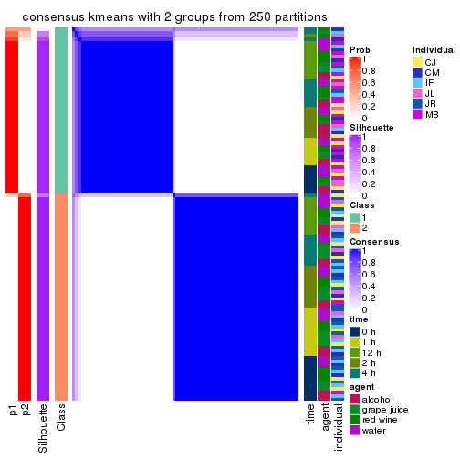</p>

</div>
<div id='tab-ATC-kmeans-consensus-heatmap-2'>
<pre><code class="r">consensus_heatmap(res, k = 3)
</code></pre>

<p>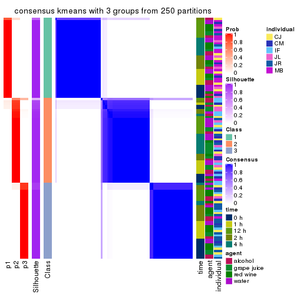</p>

</div>
<div id='tab-ATC-kmeans-consensus-heatmap-3'>
<pre><code class="r">consensus_heatmap(res, k = 4)
</code></pre>

<p>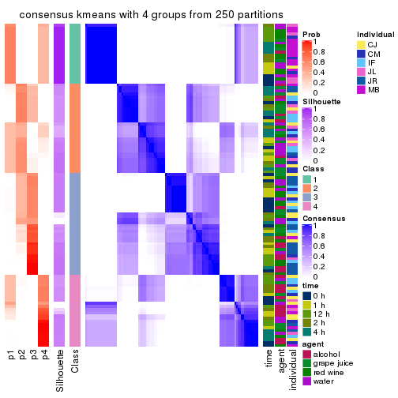</p>

</div>
<div id='tab-ATC-kmeans-consensus-heatmap-4'>
<pre><code class="r">consensus_heatmap(res, k = 5)
</code></pre>

<p>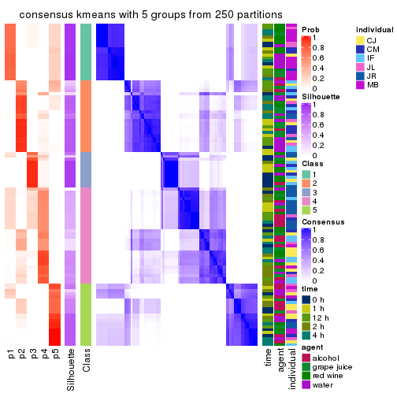</p>

</div>
<div id='tab-ATC-kmeans-consensus-heatmap-5'>
<pre><code class="r">consensus_heatmap(res, k = 6)
</code></pre>

<p>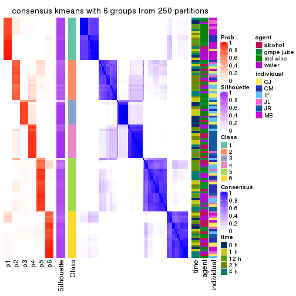</p>

</div>
</div>

Heatmaps for the membership of samples in all partitions to see how consistent they are:


<script>
$( function() {
	$( '#tabs-ATC-kmeans-membership-heatmap' ).tabs();
} );
</script>
<div id='tabs-ATC-kmeans-membership-heatmap'>
<ul>
<li><a href='#tab-ATC-kmeans-membership-heatmap-1'>k = 2</a></li>
<li><a href='#tab-ATC-kmeans-membership-heatmap-2'>k = 3</a></li>
<li><a href='#tab-ATC-kmeans-membership-heatmap-3'>k = 4</a></li>
<li><a href='#tab-ATC-kmeans-membership-heatmap-4'>k = 5</a></li>
<li><a href='#tab-ATC-kmeans-membership-heatmap-5'>k = 6</a></li>
</ul>
<div id='tab-ATC-kmeans-membership-heatmap-1'>
<pre><code class="r">membership_heatmap(res, k = 2)
</code></pre>

<p>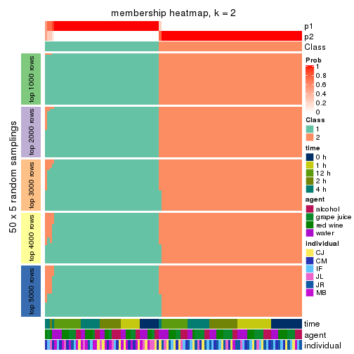</p>

</div>
<div id='tab-ATC-kmeans-membership-heatmap-2'>
<pre><code class="r">membership_heatmap(res, k = 3)
</code></pre>

<p>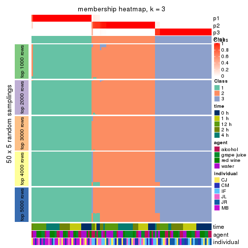</p>

</div>
<div id='tab-ATC-kmeans-membership-heatmap-3'>
<pre><code class="r">membership_heatmap(res, k = 4)
</code></pre>

<p>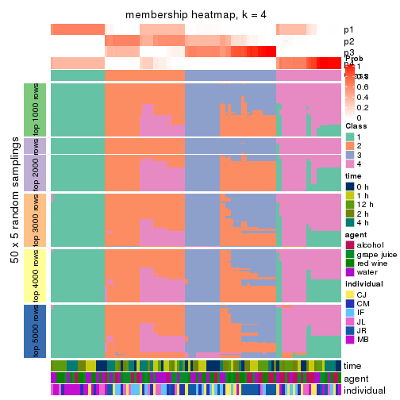</p>

</div>
<div id='tab-ATC-kmeans-membership-heatmap-4'>
<pre><code class="r">membership_heatmap(res, k = 5)
</code></pre>

<p>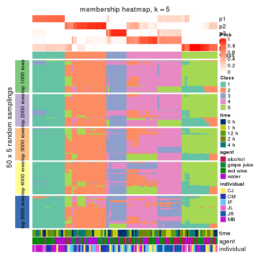</p>

</div>
<div id='tab-ATC-kmeans-membership-heatmap-5'>
<pre><code class="r">membership_heatmap(res, k = 6)
</code></pre>

<p>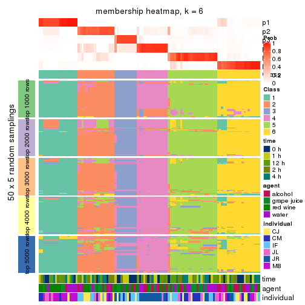</p>

</div>
</div>

As soon as we have had the classes for columns, we can look for signatures
which are significantly different between classes which can be candidate marks
for certain classes. Following are the heatmaps for signatures.


Signature heatmaps where rows are scaled:


<script>
$( function() {
	$( '#tabs-ATC-kmeans-get-signatures' ).tabs();
} );
</script>
<div id='tabs-ATC-kmeans-get-signatures'>
<ul>
<li><a href='#tab-ATC-kmeans-get-signatures-1'>k = 2</a></li>
<li><a href='#tab-ATC-kmeans-get-signatures-2'>k = 3</a></li>
<li><a href='#tab-ATC-kmeans-get-signatures-3'>k = 4</a></li>
<li><a href='#tab-ATC-kmeans-get-signatures-4'>k = 5</a></li>
<li><a href='#tab-ATC-kmeans-get-signatures-5'>k = 6</a></li>
</ul>
<div id='tab-ATC-kmeans-get-signatures-1'>
<pre><code class="r">get_signatures(res, k = 2)
</code></pre>

<p>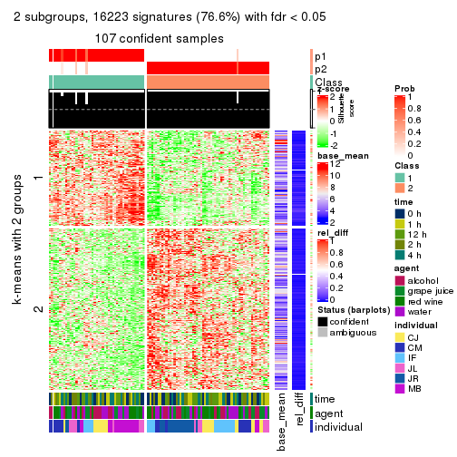</p>

</div>
<div id='tab-ATC-kmeans-get-signatures-2'>
<pre><code class="r">get_signatures(res, k = 3)
</code></pre>

<p>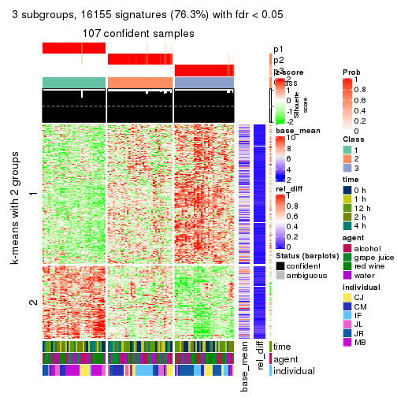</p>

</div>
<div id='tab-ATC-kmeans-get-signatures-3'>
<pre><code class="r">get_signatures(res, k = 4)
</code></pre>

<p>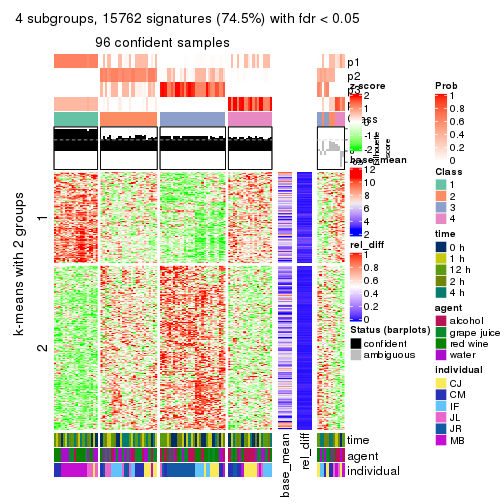</p>

</div>
<div id='tab-ATC-kmeans-get-signatures-4'>
<pre><code class="r">get_signatures(res, k = 5)
</code></pre>

<p>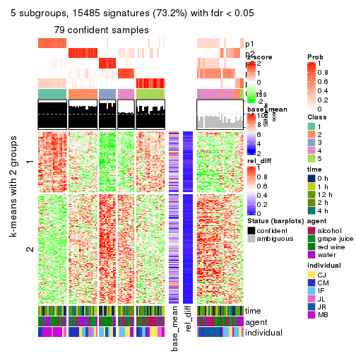</p>

</div>
<div id='tab-ATC-kmeans-get-signatures-5'>
<pre><code class="r">get_signatures(res, k = 6)
</code></pre>

<p>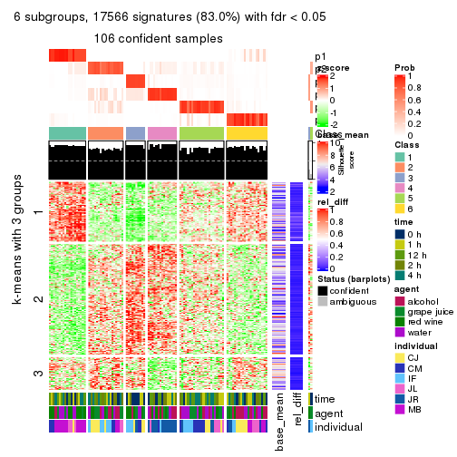</p>

</div>
</div>


Signature heatmaps where rows are not scaled:


<script>
$( function() {
	$( '#tabs-ATC-kmeans-get-signatures-no-scale' ).tabs();
} );
</script>
<div id='tabs-ATC-kmeans-get-signatures-no-scale'>
<ul>
<li><a href='#tab-ATC-kmeans-get-signatures-no-scale-1'>k = 2</a></li>
<li><a href='#tab-ATC-kmeans-get-signatures-no-scale-2'>k = 3</a></li>
<li><a href='#tab-ATC-kmeans-get-signatures-no-scale-3'>k = 4</a></li>
<li><a href='#tab-ATC-kmeans-get-signatures-no-scale-4'>k = 5</a></li>
<li><a href='#tab-ATC-kmeans-get-signatures-no-scale-5'>k = 6</a></li>
</ul>
<div id='tab-ATC-kmeans-get-signatures-no-scale-1'>
<pre><code class="r">get_signatures(res, k = 2, scale_rows = FALSE)
</code></pre>

<p>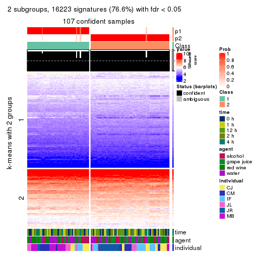</p>

</div>
<div id='tab-ATC-kmeans-get-signatures-no-scale-2'>
<pre><code class="r">get_signatures(res, k = 3, scale_rows = FALSE)
</code></pre>

<p>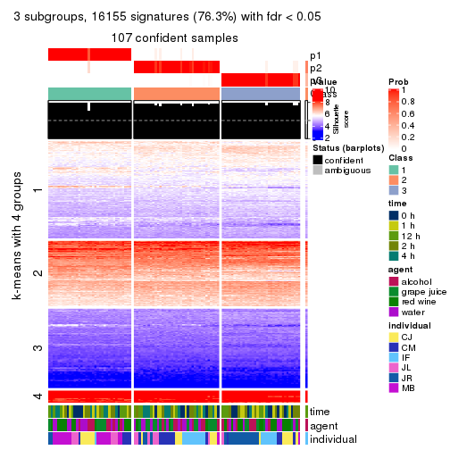</p>

</div>
<div id='tab-ATC-kmeans-get-signatures-no-scale-3'>
<pre><code class="r">get_signatures(res, k = 4, scale_rows = FALSE)
</code></pre>

<p>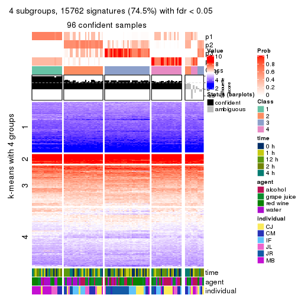</p>

</div>
<div id='tab-ATC-kmeans-get-signatures-no-scale-4'>
<pre><code class="r">get_signatures(res, k = 5, scale_rows = FALSE)
</code></pre>

<p>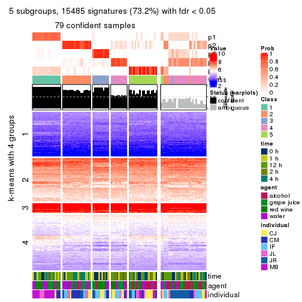</p>

</div>
<div id='tab-ATC-kmeans-get-signatures-no-scale-5'>
<pre><code class="r">get_signatures(res, k = 6, scale_rows = FALSE)
</code></pre>

<p>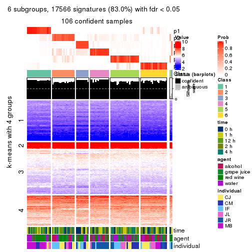</p>

</div>
</div>


Compare the overlap of signatures from different k:

```r
compare_signatures(res)
```

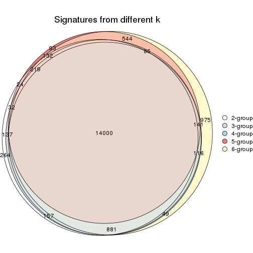

`get_signature()` returns a data frame invisibly. TO get the list of signatures, the function
call should be assigned to a variable explicitly. In following code, if `plot` argument is set
to `FALSE`, no heatmap is plotted while only the differential analysis is performed.

```r
# code only for demonstration
tb = get_signature(res, k = ..., plot = FALSE)
```

An example of the output of `tb` is:

```
#>   which_row         fdr    mean_1    mean_2 scaled_mean_1 scaled_mean_2 km
#> 1        38 0.042760348  8.373488  9.131774    -0.5533452     0.5164555  1
#> 2        40 0.018707592  7.106213  8.469186    -0.6173731     0.5762149  1
#> 3        55 0.019134737 10.221463 11.207825    -0.6159697     0.5749050  1
#> 4        59 0.006059896  5.921854  7.869574    -0.6899429     0.6439467  1
#> 5        60 0.018055526  8.928898 10.211722    -0.6204761     0.5791110  1
#> 6        98 0.009384629 15.714769 14.887706     0.6635654    -0.6193277  2
...
```

The columns in `tb` are:

1. `which_row`: row indices corresponding to the input matrix.
2. `fdr`: FDR for the differential test. 
3. `mean_x`: The mean value in group x.
4. `scaled_mean_x`: The mean value in group x after rows are scaled.
5. `km`: Row groups if k-means clustering is applied to rows.


UMAP plot which shows how samples are separated.


<script>
$( function() {
	$( '#tabs-ATC-kmeans-dimension-reduction' ).tabs();
} );
</script>
<div id='tabs-ATC-kmeans-dimension-reduction'>
<ul>
<li><a href='#tab-ATC-kmeans-dimension-reduction-1'>k = 2</a></li>
<li><a href='#tab-ATC-kmeans-dimension-reduction-2'>k = 3</a></li>
<li><a href='#tab-ATC-kmeans-dimension-reduction-3'>k = 4</a></li>
<li><a href='#tab-ATC-kmeans-dimension-reduction-4'>k = 5</a></li>
<li><a href='#tab-ATC-kmeans-dimension-reduction-5'>k = 6</a></li>
</ul>
<div id='tab-ATC-kmeans-dimension-reduction-1'>
<pre><code class="r">dimension_reduction(res, k = 2, method = &quot;UMAP&quot;)
</code></pre>

<p>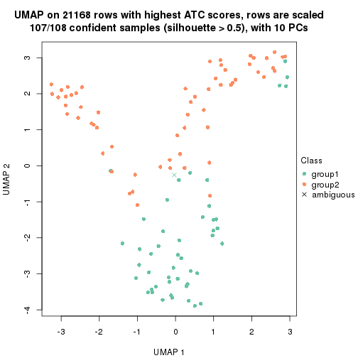</p>

</div>
<div id='tab-ATC-kmeans-dimension-reduction-2'>
<pre><code class="r">dimension_reduction(res, k = 3, method = &quot;UMAP&quot;)
</code></pre>

<p>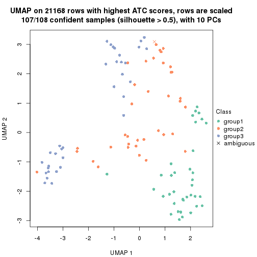</p>

</div>
<div id='tab-ATC-kmeans-dimension-reduction-3'>
<pre><code class="r">dimension_reduction(res, k = 4, method = &quot;UMAP&quot;)
</code></pre>

<p>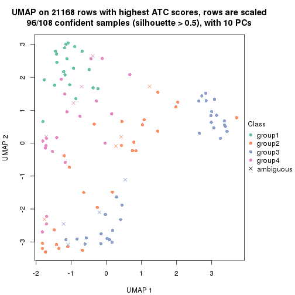</p>

</div>
<div id='tab-ATC-kmeans-dimension-reduction-4'>
<pre><code class="r">dimension_reduction(res, k = 5, method = &quot;UMAP&quot;)
</code></pre>

<p>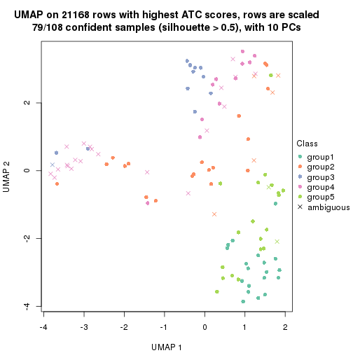</p>

</div>
<div id='tab-ATC-kmeans-dimension-reduction-5'>
<pre><code class="r">dimension_reduction(res, k = 6, method = &quot;UMAP&quot;)
</code></pre>

<p>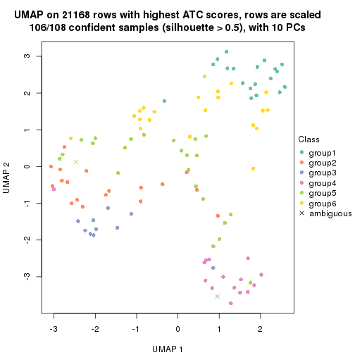</p>

</div>
</div>


Following heatmap shows how subgroups are split when increasing `k`:

```r
collect_classes(res)
```

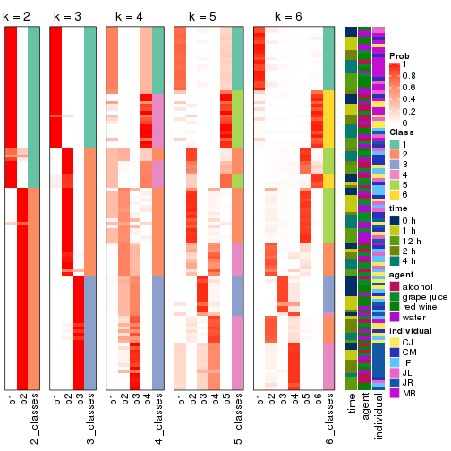


Test correlation between subgroups and known annotations. If the known
annotation is numeric, one-way ANOVA test is applied, and if the known
annotation is discrete, chi-squared contingency table test is applied.

```r
test_to_known_factors(res)
```

```
#>              n time(p) agent(p) individual(p) k
#> ATC:kmeans 107  0.8353  0.73187      5.81e-05 2
#> ATC:kmeans 107  0.6313  0.02680      7.64e-08 3
#> ATC:kmeans  96  0.7501  0.00440      3.52e-07 4
#> ATC:kmeans  79  0.0197  0.00722      9.73e-04 5
#> ATC:kmeans 106  0.1549  0.03484      3.88e-11 6
```


If matrix rows can be associated to genes, consider to use `GO_Enrichment(res,
...)` to perform function enrichment for the signature genes.


 

---------------------------------------------------


### ATC:skmeans**


The object with results only for a single top-value method and a single partition method 
can be extracted as:

```r
res = res_list["ATC", "skmeans"]
# you can also extract it by
# res = res_list["ATC:skmeans"]
```

A summary of `res` and all the functions that can be applied to it:

```r
res
```

```
#> A 'ConsensusPartition' object with k = 2, 3, 4, 5, 6.
#>   On a matrix with 21168 rows and 108 columns.
#>   Top rows (1000, 2000, 3000, 4000, 5000) are extracted by 'ATC' method.
#>   Subgroups are detected by 'skmeans' method.
#>   Performed in total 1250 partitions by row resampling.
#>   Best k for subgroups seems to be 2.
#> 
#> Following methods can be applied to this 'ConsensusPartition' object:
#>  [1] "cola_report"             "collect_classes"         "collect_plots"          
#>  [4] "collect_stats"           "colnames"                "compare_signatures"     
#>  [7] "consensus_heatmap"       "dimension_reduction"     "functional_enrichment"  
#> [10] "get_anno_col"            "get_anno"                "get_classes"            
#> [13] "get_consensus"           "get_matrix"              "get_membership"         
#> [16] "get_param"               "get_signatures"          "get_stats"              
#> [19] "is_best_k"               "is_stable_k"             "membership_heatmap"     
#> [22] "ncol"                    "nrow"                    "plot_ecdf"              
#> [25] "rownames"                "select_partition_number" "show"                   
#> [28] "suggest_best_k"          "test_to_known_factors"
```

`collect_plots()` function collects all the plots made from `res` for all `k` (number of partitions)
into one single page to provide an easy and fast comparison between different `k`.

```r
collect_plots(res)
```

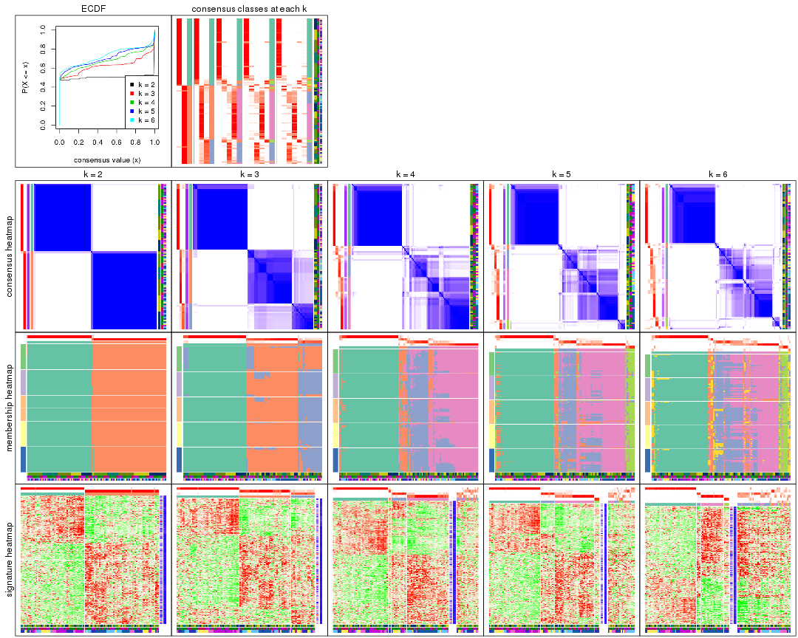

The plots are:

- The first row: a plot of the ECDF (Empirical cumulative distribution
  function) curves of the consensus matrix for each `k` and the heatmap of
  predicted classes for each `k`.
- The second row: heatmaps of the consensus matrix for each `k`.
- The third row: heatmaps of the membership matrix for each `k`.
- The fouth row: heatmaps of the signatures for each `k`.

All the plots in panels can be made by individual functions and they are
plotted later in this section.

`select_partition_number()` produces several plots showing different
statistics for choosing "optimized" `k`. There are following statistics:

- ECDF curves of the consensus matrix for each `k`;
- 1-PAC. [The PAC
  score](https://en.wikipedia.org/wiki/Consensus_clustering#Over-interpretation_potential_of_consensus_clustering)
  measures the proportion of the ambiguous subgrouping.
- Mean silhouette score.
- Concordance. The mean probability of fiting the consensus class ids in all
  partitions.
- Area increased. Denote $A_k$ as the area under the ECDF curve for current
  `k`, the area increased is defined as $A_k - A_{k-1}$.
- Rand index. The percent of pairs of samples that are both in a same cluster
  or both are not in a same cluster in the partition of k and k-1.
- Jaccard index. The ratio of pairs of samples are both in a same cluster in
  the partition of k and k-1 and the pairs of samples are both in a same
  cluster in the partition k or k-1.

The detailed explanations of these statistics can be found in [the cola
vignette](http://bioconductor.org/packages/devel/bioc/vignettes/cola/inst/doc/cola.html#toc_13).

Generally speaking, lower PAC score, higher mean silhouette score or higher
concordance corresponds to better partition. Rand index and Jaccard index
measure how similar the current partition is compared to partition with `k-1`.
If they are too similar, we won't accept `k` is better than `k-1`.

```r
select_partition_number(res)
```

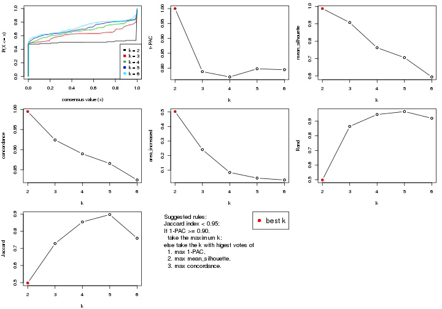

The numeric values for all these statistics can be obtained by `get_stats()`.

```r
get_stats(res)
```

```
#>   k 1-PAC mean_silhouette concordance area_increased  Rand Jaccard
#> 2 2 1.000           0.988       0.995         0.5029 0.498   0.498
#> 3 3 0.788           0.907       0.924         0.2408 0.864   0.728
#> 4 4 0.771           0.762       0.890         0.0837 0.945   0.854
#> 5 5 0.798           0.706       0.866         0.0447 0.965   0.897
#> 6 6 0.795           0.594       0.825         0.0320 0.919   0.759
```

`suggest_best_k()` suggests the best $k$ based on these statistics. The rules are as follows:

- All $k$ with Jaccard index larger than 0.95 are removed because the increase of
  the partition number does not provides enough extra information. If all $k$ are removed,
  the best $k$ is assigned by `NA`.
- For $k$ with 1-PAC larger than 0.9, the maximal $k$ is taken as the "best k". Other $k$ is called "optional k".
- If it does not fit the second rule. The $k$ with the highest vote of highest
  1-PAC, mean silhouette and concordance is taken as the "best k".

```r
suggest_best_k(res)
```

```
#> [1] 2
```


Following shows the table of the partitions (You need to click the **show/hide
code output** link to see it). The membership matrix (columns with name `p*`)
is inferred by
[`clue::cl_consensus()`](https://www.rdocumentation.org/link/cl_consensus?package=clue)
function with the `SE` method. Basically the value in the membership matrix
represents the probability to belong to a certain group. The finall class
label for an item is determined with the group with highest probability it
belongs to.

In `get_classes()` function, the entropy is calculated from the membership
matrix and the silhouette score is calculated from the consensus matrix.


<script>
$( function() {
	$( '#tabs-ATC-skmeans-get-classes' ).tabs();
} );
</script>
<div id='tabs-ATC-skmeans-get-classes'>
<ul>
<li><a href='#tab-ATC-skmeans-get-classes-1'>k = 2</a></li>
<li><a href='#tab-ATC-skmeans-get-classes-2'>k = 3</a></li>
<li><a href='#tab-ATC-skmeans-get-classes-3'>k = 4</a></li>
<li><a href='#tab-ATC-skmeans-get-classes-4'>k = 5</a></li>
<li><a href='#tab-ATC-skmeans-get-classes-5'>k = 6</a></li>
</ul>

<div id='tab-ATC-skmeans-get-classes-1'>
<p><a id='tab-ATC-skmeans-get-classes-1-a' style='color:#0366d6' href='#'>show/hide code output</a></p>
<pre><code class="r">cbind(get_classes(res, k = 2), get_membership(res, k = 2))
</code></pre>

<pre><code>#&gt;          class entropy silhouette    p1    p2
#&gt; GSM87863     1   0.000      0.998 1.000 0.000
#&gt; GSM87887     1   0.000      0.998 1.000 0.000
#&gt; GSM87896     2   0.000      0.991 0.000 1.000
#&gt; GSM87934     2   0.000      0.991 0.000 1.000
#&gt; GSM87943     2   0.000      0.991 0.000 1.000
#&gt; GSM87853     2   0.000      0.991 0.000 1.000
#&gt; GSM87906     2   0.000      0.991 0.000 1.000
#&gt; GSM87920     1   0.000      0.998 1.000 0.000
#&gt; GSM87924     2   0.000      0.991 0.000 1.000
#&gt; GSM87858     2   0.000      0.991 0.000 1.000
#&gt; GSM87882     2   0.000      0.991 0.000 1.000
#&gt; GSM87891     2   0.000      0.991 0.000 1.000
#&gt; GSM87917     1   0.000      0.998 1.000 0.000
#&gt; GSM87929     2   0.000      0.991 0.000 1.000
#&gt; GSM87948     1   0.000      0.998 1.000 0.000
#&gt; GSM87868     1   0.000      0.998 1.000 0.000
#&gt; GSM87873     2   0.000      0.991 0.000 1.000
#&gt; GSM87901     2   0.000      0.991 0.000 1.000
#&gt; GSM87910     1   0.000      0.998 1.000 0.000
#&gt; GSM87938     2   0.000      0.991 0.000 1.000
#&gt; GSM87953     1   0.000      0.998 1.000 0.000
#&gt; GSM87864     1   0.000      0.998 1.000 0.000
#&gt; GSM87888     2   0.000      0.991 0.000 1.000
#&gt; GSM87897     2   0.000      0.991 0.000 1.000
#&gt; GSM87935     2   0.000      0.991 0.000 1.000
#&gt; GSM87944     1   0.000      0.998 1.000 0.000
#&gt; GSM87854     2   0.738      0.738 0.208 0.792
#&gt; GSM87878     1   0.000      0.998 1.000 0.000
#&gt; GSM87907     2   0.000      0.991 0.000 1.000
#&gt; GSM87921     2   0.000      0.991 0.000 1.000
#&gt; GSM87925     2   0.000      0.991 0.000 1.000
#&gt; GSM87957     1   0.000      0.998 1.000 0.000
#&gt; GSM87859     2   0.000      0.991 0.000 1.000
#&gt; GSM87883     1   0.000      0.998 1.000 0.000
#&gt; GSM87892     2   0.000      0.991 0.000 1.000
#&gt; GSM87930     2   0.000      0.991 0.000 1.000
#&gt; GSM87949     1   0.000      0.998 1.000 0.000
#&gt; GSM87869     1   0.000      0.998 1.000 0.000
#&gt; GSM87874     2   0.000      0.991 0.000 1.000
#&gt; GSM87902     2   0.000      0.991 0.000 1.000
#&gt; GSM87911     1   0.482      0.882 0.896 0.104
#&gt; GSM87939     2   0.000      0.991 0.000 1.000
#&gt; GSM87954     1   0.000      0.998 1.000 0.000
#&gt; GSM87865     1   0.000      0.998 1.000 0.000
#&gt; GSM87889     1   0.000      0.998 1.000 0.000
#&gt; GSM87898     1   0.000      0.998 1.000 0.000
#&gt; GSM87915     1   0.000      0.998 1.000 0.000
#&gt; GSM87936     2   0.000      0.991 0.000 1.000
#&gt; GSM87945     2   0.000      0.991 0.000 1.000
#&gt; GSM87855     2   0.000      0.991 0.000 1.000
#&gt; GSM87879     2   0.000      0.991 0.000 1.000
#&gt; GSM87922     2   0.000      0.991 0.000 1.000
#&gt; GSM87926     2   0.000      0.991 0.000 1.000
#&gt; GSM87958     1   0.000      0.998 1.000 0.000
#&gt; GSM87860     2   0.000      0.991 0.000 1.000
#&gt; GSM87884     1   0.000      0.998 1.000 0.000
#&gt; GSM87893     2   0.000      0.991 0.000 1.000
#&gt; GSM87918     1   0.000      0.998 1.000 0.000
#&gt; GSM87931     2   0.000      0.991 0.000 1.000
#&gt; GSM87950     1   0.000      0.998 1.000 0.000
#&gt; GSM87870     1   0.000      0.998 1.000 0.000
#&gt; GSM87875     2   0.000      0.991 0.000 1.000
#&gt; GSM87903     2   0.000      0.991 0.000 1.000
#&gt; GSM87912     1   0.000      0.998 1.000 0.000
#&gt; GSM87940     2   0.000      0.991 0.000 1.000
#&gt; GSM87866     1   0.000      0.998 1.000 0.000
#&gt; GSM87899     2   0.000      0.991 0.000 1.000
#&gt; GSM87937     2   0.000      0.991 0.000 1.000
#&gt; GSM87946     1   0.000      0.998 1.000 0.000
#&gt; GSM87856     2   0.000      0.991 0.000 1.000
#&gt; GSM87880     2   0.000      0.991 0.000 1.000
#&gt; GSM87908     1   0.000      0.998 1.000 0.000
#&gt; GSM87923     2   0.000      0.991 0.000 1.000
#&gt; GSM87927     2   0.000      0.991 0.000 1.000
#&gt; GSM87959     1   0.000      0.998 1.000 0.000
#&gt; GSM87861     2   0.000      0.991 0.000 1.000
#&gt; GSM87885     1   0.000      0.998 1.000 0.000
#&gt; GSM87894     1   0.000      0.998 1.000 0.000
#&gt; GSM87932     1   0.000      0.998 1.000 0.000
#&gt; GSM87951     1   0.000      0.998 1.000 0.000
#&gt; GSM87871     1   0.000      0.998 1.000 0.000
#&gt; GSM87876     1   0.000      0.998 1.000 0.000
#&gt; GSM87904     2   0.000      0.991 0.000 1.000
#&gt; GSM87913     1   0.000      0.998 1.000 0.000
#&gt; GSM87941     2   0.000      0.991 0.000 1.000
#&gt; GSM87955     1   0.000      0.998 1.000 0.000
#&gt; GSM87867     1   0.000      0.998 1.000 0.000
#&gt; GSM87890     2   0.000      0.991 0.000 1.000
#&gt; GSM87900     2   0.000      0.991 0.000 1.000
#&gt; GSM87916     2   0.000      0.991 0.000 1.000
#&gt; GSM87947     1   0.000      0.998 1.000 0.000
#&gt; GSM87857     2   0.000      0.991 0.000 1.000
#&gt; GSM87881     2   0.000      0.991 0.000 1.000
#&gt; GSM87909     1   0.000      0.998 1.000 0.000
#&gt; GSM87928     1   0.000      0.998 1.000 0.000
#&gt; GSM87960     1   0.000      0.998 1.000 0.000
#&gt; GSM87862     2   0.000      0.991 0.000 1.000
#&gt; GSM87886     1   0.000      0.998 1.000 0.000
#&gt; GSM87895     2   0.000      0.991 0.000 1.000
#&gt; GSM87919     1   0.000      0.998 1.000 0.000
#&gt; GSM87933     2   0.000      0.991 0.000 1.000
#&gt; GSM87952     1   0.000      0.998 1.000 0.000
#&gt; GSM87872     2   0.000      0.991 0.000 1.000
#&gt; GSM87877     1   0.000      0.998 1.000 0.000
#&gt; GSM87905     1   0.000      0.998 1.000 0.000
#&gt; GSM87914     2   0.850      0.622 0.276 0.724
#&gt; GSM87942     2   0.000      0.991 0.000 1.000
#&gt; GSM87956     1   0.000      0.998 1.000 0.000
</code></pre>

<script>
$('#tab-ATC-skmeans-get-classes-1-a').parent().next().next().hide();
$('#tab-ATC-skmeans-get-classes-1-a').click(function(){
  $('#tab-ATC-skmeans-get-classes-1-a').parent().next().next().toggle();
  return(false);
});
</script>
</div>

<div id='tab-ATC-skmeans-get-classes-2'>
<p><a id='tab-ATC-skmeans-get-classes-2-a' style='color:#0366d6' href='#'>show/hide code output</a></p>
<pre><code class="r">cbind(get_classes(res, k = 3), get_membership(res, k = 3))
</code></pre>

<pre><code>#&gt;          class entropy silhouette    p1    p2    p3
#&gt; GSM87863     1  0.0000      0.986 1.000 0.000 0.000
#&gt; GSM87887     1  0.0000      0.986 1.000 0.000 0.000
#&gt; GSM87896     2  0.2878      0.859 0.000 0.904 0.096
#&gt; GSM87934     2  0.0000      0.906 0.000 1.000 0.000
#&gt; GSM87943     3  0.4555      0.907 0.000 0.200 0.800
#&gt; GSM87853     3  0.4750      0.903 0.000 0.216 0.784
#&gt; GSM87906     2  0.1031      0.900 0.000 0.976 0.024
#&gt; GSM87920     1  0.0000      0.986 1.000 0.000 0.000
#&gt; GSM87924     2  0.1529      0.891 0.000 0.960 0.040
#&gt; GSM87858     2  0.3482      0.830 0.000 0.872 0.128
#&gt; GSM87882     3  0.4931      0.896 0.000 0.232 0.768
#&gt; GSM87891     2  0.2356      0.877 0.000 0.928 0.072
#&gt; GSM87917     1  0.0000      0.986 1.000 0.000 0.000
#&gt; GSM87929     2  0.0000      0.906 0.000 1.000 0.000
#&gt; GSM87948     1  0.0000      0.986 1.000 0.000 0.000
#&gt; GSM87868     1  0.0000      0.986 1.000 0.000 0.000
#&gt; GSM87873     2  0.3482      0.830 0.000 0.872 0.128
#&gt; GSM87901     2  0.4796      0.726 0.000 0.780 0.220
#&gt; GSM87910     1  0.0000      0.986 1.000 0.000 0.000
#&gt; GSM87938     2  0.0000      0.906 0.000 1.000 0.000
#&gt; GSM87953     1  0.0000      0.986 1.000 0.000 0.000
#&gt; GSM87864     1  0.0000      0.986 1.000 0.000 0.000
#&gt; GSM87888     3  0.3941      0.847 0.000 0.156 0.844
#&gt; GSM87897     2  0.3412      0.837 0.000 0.876 0.124
#&gt; GSM87935     2  0.0424      0.905 0.000 0.992 0.008
#&gt; GSM87944     1  0.0000      0.986 1.000 0.000 0.000
#&gt; GSM87854     3  0.4555      0.907 0.000 0.200 0.800
#&gt; GSM87878     1  0.0000      0.986 1.000 0.000 0.000
#&gt; GSM87907     2  0.3482      0.830 0.000 0.872 0.128
#&gt; GSM87921     2  0.2537      0.862 0.000 0.920 0.080
#&gt; GSM87925     2  0.0000      0.906 0.000 1.000 0.000
#&gt; GSM87957     1  0.0000      0.986 1.000 0.000 0.000
#&gt; GSM87859     3  0.6154      0.628 0.000 0.408 0.592
#&gt; GSM87883     1  0.0000      0.986 1.000 0.000 0.000
#&gt; GSM87892     2  0.3482      0.830 0.000 0.872 0.128
#&gt; GSM87930     2  0.0000      0.906 0.000 1.000 0.000
#&gt; GSM87949     1  0.0000      0.986 1.000 0.000 0.000
#&gt; GSM87869     1  0.0000      0.986 1.000 0.000 0.000
#&gt; GSM87874     3  0.5098      0.887 0.000 0.248 0.752
#&gt; GSM87902     2  0.4796      0.726 0.000 0.780 0.220
#&gt; GSM87911     3  0.7078      0.682 0.200 0.088 0.712
#&gt; GSM87939     2  0.0000      0.906 0.000 1.000 0.000
#&gt; GSM87954     1  0.0000      0.986 1.000 0.000 0.000
#&gt; GSM87865     1  0.0000      0.986 1.000 0.000 0.000
#&gt; GSM87889     1  0.0237      0.982 0.996 0.000 0.004
#&gt; GSM87898     1  0.0000      0.986 1.000 0.000 0.000
#&gt; GSM87915     1  0.0000      0.986 1.000 0.000 0.000
#&gt; GSM87936     2  0.0424      0.905 0.000 0.992 0.008
#&gt; GSM87945     3  0.4555      0.907 0.000 0.200 0.800
#&gt; GSM87855     3  0.4654      0.906 0.000 0.208 0.792
#&gt; GSM87879     3  0.4504      0.905 0.000 0.196 0.804
#&gt; GSM87922     3  0.5591      0.842 0.000 0.304 0.696
#&gt; GSM87926     2  0.0000      0.906 0.000 1.000 0.000
#&gt; GSM87958     1  0.0000      0.986 1.000 0.000 0.000
#&gt; GSM87860     2  0.3686      0.814 0.000 0.860 0.140
#&gt; GSM87884     1  0.0000      0.986 1.000 0.000 0.000
#&gt; GSM87893     2  0.3482      0.830 0.000 0.872 0.128
#&gt; GSM87918     1  0.3551      0.870 0.868 0.000 0.132
#&gt; GSM87931     2  0.0000      0.906 0.000 1.000 0.000
#&gt; GSM87950     1  0.0000      0.986 1.000 0.000 0.000
#&gt; GSM87870     1  0.0000      0.986 1.000 0.000 0.000
#&gt; GSM87875     3  0.4555      0.907 0.000 0.200 0.800
#&gt; GSM87903     2  0.1031      0.900 0.000 0.976 0.024
#&gt; GSM87912     1  0.0000      0.986 1.000 0.000 0.000
#&gt; GSM87940     2  0.0000      0.906 0.000 1.000 0.000
#&gt; GSM87866     1  0.0000      0.986 1.000 0.000 0.000
#&gt; GSM87899     3  0.5706      0.800 0.000 0.320 0.680
#&gt; GSM87937     2  0.0000      0.906 0.000 1.000 0.000
#&gt; GSM87946     1  0.0000      0.986 1.000 0.000 0.000
#&gt; GSM87856     3  0.4555      0.907 0.000 0.200 0.800
#&gt; GSM87880     3  0.1964      0.706 0.000 0.056 0.944
#&gt; GSM87908     1  0.0000      0.986 1.000 0.000 0.000
#&gt; GSM87923     3  0.4887      0.898 0.000 0.228 0.772
#&gt; GSM87927     2  0.0000      0.906 0.000 1.000 0.000
#&gt; GSM87959     1  0.0000      0.986 1.000 0.000 0.000
#&gt; GSM87861     3  0.5560      0.829 0.000 0.300 0.700
#&gt; GSM87885     1  0.4702      0.787 0.788 0.000 0.212
#&gt; GSM87894     1  0.0000      0.986 1.000 0.000 0.000
#&gt; GSM87932     1  0.0000      0.986 1.000 0.000 0.000
#&gt; GSM87951     1  0.0000      0.986 1.000 0.000 0.000
#&gt; GSM87871     1  0.4504      0.804 0.804 0.000 0.196
#&gt; GSM87876     1  0.4654      0.791 0.792 0.000 0.208
#&gt; GSM87904     2  0.3482      0.830 0.000 0.872 0.128
#&gt; GSM87913     1  0.0000      0.986 1.000 0.000 0.000
#&gt; GSM87941     2  0.0000      0.906 0.000 1.000 0.000
#&gt; GSM87955     1  0.0000      0.986 1.000 0.000 0.000
#&gt; GSM87867     1  0.0000      0.986 1.000 0.000 0.000
#&gt; GSM87890     2  0.0000      0.906 0.000 1.000 0.000
#&gt; GSM87900     2  0.1031      0.900 0.000 0.976 0.024
#&gt; GSM87916     2  0.0000      0.906 0.000 1.000 0.000
#&gt; GSM87947     1  0.0000      0.986 1.000 0.000 0.000
#&gt; GSM87857     3  0.5098      0.885 0.000 0.248 0.752
#&gt; GSM87881     2  0.5706      0.578 0.000 0.680 0.320
#&gt; GSM87909     1  0.0000      0.986 1.000 0.000 0.000
#&gt; GSM87928     1  0.0000      0.986 1.000 0.000 0.000
#&gt; GSM87960     1  0.0000      0.986 1.000 0.000 0.000
#&gt; GSM87862     2  0.1031      0.900 0.000 0.976 0.024
#&gt; GSM87886     1  0.0000      0.986 1.000 0.000 0.000
#&gt; GSM87895     2  0.1031      0.900 0.000 0.976 0.024
#&gt; GSM87919     1  0.0000      0.986 1.000 0.000 0.000
#&gt; GSM87933     2  0.0000      0.906 0.000 1.000 0.000
#&gt; GSM87952     1  0.0000      0.986 1.000 0.000 0.000
#&gt; GSM87872     2  0.4504      0.724 0.000 0.804 0.196
#&gt; GSM87877     1  0.0000      0.986 1.000 0.000 0.000
#&gt; GSM87905     1  0.0000      0.986 1.000 0.000 0.000
#&gt; GSM87914     2  0.5122      0.709 0.012 0.788 0.200
#&gt; GSM87942     2  0.4504      0.724 0.000 0.804 0.196
#&gt; GSM87956     1  0.0000      0.986 1.000 0.000 0.000
</code></pre>

<script>
$('#tab-ATC-skmeans-get-classes-2-a').parent().next().next().hide();
$('#tab-ATC-skmeans-get-classes-2-a').click(function(){
  $('#tab-ATC-skmeans-get-classes-2-a').parent().next().next().toggle();
  return(false);
});
</script>
</div>

<div id='tab-ATC-skmeans-get-classes-3'>
<p><a id='tab-ATC-skmeans-get-classes-3-a' style='color:#0366d6' href='#'>show/hide code output</a></p>
<pre><code class="r">cbind(get_classes(res, k = 4), get_membership(res, k = 4))
</code></pre>

<pre><code>#&gt;          class entropy silhouette    p1    p2    p3    p4
#&gt; GSM87863     1  0.0000    0.97300 1.000 0.000 0.000 0.000
#&gt; GSM87887     1  0.0000    0.97300 1.000 0.000 0.000 0.000
#&gt; GSM87896     4  0.4072    0.67774 0.000 0.000 0.252 0.748
#&gt; GSM87934     4  0.0188    0.80512 0.000 0.000 0.004 0.996
#&gt; GSM87943     3  0.1388    0.78191 0.000 0.012 0.960 0.028
#&gt; GSM87853     3  0.2216    0.78834 0.000 0.000 0.908 0.092
#&gt; GSM87906     4  0.2271    0.78887 0.000 0.008 0.076 0.916
#&gt; GSM87920     1  0.0000    0.97300 1.000 0.000 0.000 0.000
#&gt; GSM87924     4  0.1022    0.80147 0.000 0.000 0.032 0.968
#&gt; GSM87858     4  0.4406    0.62225 0.000 0.000 0.300 0.700
#&gt; GSM87882     3  0.6170    0.63326 0.000 0.136 0.672 0.192
#&gt; GSM87891     4  0.3688    0.71911 0.000 0.000 0.208 0.792
#&gt; GSM87917     1  0.0000    0.97300 1.000 0.000 0.000 0.000
#&gt; GSM87929     4  0.0000    0.80425 0.000 0.000 0.000 1.000
#&gt; GSM87948     1  0.0000    0.97300 1.000 0.000 0.000 0.000
#&gt; GSM87868     1  0.0000    0.97300 1.000 0.000 0.000 0.000
#&gt; GSM87873     4  0.4406    0.62225 0.000 0.000 0.300 0.700
#&gt; GSM87901     4  0.6707   -0.00511 0.000 0.444 0.088 0.468
#&gt; GSM87910     1  0.0000    0.97300 1.000 0.000 0.000 0.000
#&gt; GSM87938     4  0.0000    0.80425 0.000 0.000 0.000 1.000
#&gt; GSM87953     1  0.0000    0.97300 1.000 0.000 0.000 0.000
#&gt; GSM87864     1  0.0000    0.97300 1.000 0.000 0.000 0.000
#&gt; GSM87888     2  0.5903    0.23962 0.000 0.616 0.332 0.052
#&gt; GSM87897     4  0.5055    0.52839 0.000 0.008 0.368 0.624
#&gt; GSM87935     4  0.0336    0.80508 0.000 0.000 0.008 0.992
#&gt; GSM87944     1  0.0000    0.97300 1.000 0.000 0.000 0.000
#&gt; GSM87854     3  0.1610    0.75895 0.000 0.032 0.952 0.016
#&gt; GSM87878     1  0.0817    0.95148 0.976 0.024 0.000 0.000
#&gt; GSM87907     4  0.4406    0.62225 0.000 0.000 0.300 0.700
#&gt; GSM87921     4  0.5123    0.62526 0.000 0.044 0.232 0.724
#&gt; GSM87925     4  0.0188    0.80512 0.000 0.000 0.004 0.996
#&gt; GSM87957     1  0.0000    0.97300 1.000 0.000 0.000 0.000
#&gt; GSM87859     3  0.4843    0.29522 0.000 0.000 0.604 0.396
#&gt; GSM87883     1  0.0000    0.97300 1.000 0.000 0.000 0.000
#&gt; GSM87892     4  0.4406    0.62225 0.000 0.000 0.300 0.700
#&gt; GSM87930     4  0.0188    0.80512 0.000 0.000 0.004 0.996
#&gt; GSM87949     1  0.0000    0.97300 1.000 0.000 0.000 0.000
#&gt; GSM87869     1  0.0000    0.97300 1.000 0.000 0.000 0.000
#&gt; GSM87874     3  0.4624    0.46136 0.000 0.000 0.660 0.340
#&gt; GSM87902     2  0.6969   -0.12538 0.000 0.448 0.112 0.440
#&gt; GSM87911     3  0.5474    0.40862 0.188 0.060 0.740 0.012
#&gt; GSM87939     4  0.0000    0.80425 0.000 0.000 0.000 1.000
#&gt; GSM87954     1  0.0000    0.97300 1.000 0.000 0.000 0.000
#&gt; GSM87865     1  0.0000    0.97300 1.000 0.000 0.000 0.000
#&gt; GSM87889     1  0.4855    0.26980 0.600 0.400 0.000 0.000
#&gt; GSM87898     1  0.0188    0.96962 0.996 0.004 0.000 0.000
#&gt; GSM87915     1  0.0000    0.97300 1.000 0.000 0.000 0.000
#&gt; GSM87936     4  0.0336    0.80508 0.000 0.000 0.008 0.992
#&gt; GSM87945     3  0.1677    0.78989 0.000 0.012 0.948 0.040
#&gt; GSM87855     3  0.1677    0.78989 0.000 0.012 0.948 0.040
#&gt; GSM87879     3  0.6326    0.25934 0.000 0.376 0.556 0.068
#&gt; GSM87922     4  0.5406   -0.06649 0.000 0.012 0.480 0.508
#&gt; GSM87926     4  0.0000    0.80425 0.000 0.000 0.000 1.000
#&gt; GSM87958     1  0.0000    0.97300 1.000 0.000 0.000 0.000
#&gt; GSM87860     4  0.4761    0.48591 0.000 0.000 0.372 0.628
#&gt; GSM87884     1  0.0000    0.97300 1.000 0.000 0.000 0.000
#&gt; GSM87893     4  0.4406    0.62225 0.000 0.000 0.300 0.700
#&gt; GSM87918     1  0.5323    0.39044 0.628 0.352 0.020 0.000
#&gt; GSM87931     4  0.0188    0.80512 0.000 0.000 0.004 0.996
#&gt; GSM87950     1  0.0000    0.97300 1.000 0.000 0.000 0.000
#&gt; GSM87870     1  0.0000    0.97300 1.000 0.000 0.000 0.000
#&gt; GSM87875     3  0.2741    0.78556 0.000 0.012 0.892 0.096
#&gt; GSM87903     4  0.2611    0.78311 0.000 0.008 0.096 0.896
#&gt; GSM87912     1  0.0000    0.97300 1.000 0.000 0.000 0.000
#&gt; GSM87940     4  0.0000    0.80425 0.000 0.000 0.000 1.000
#&gt; GSM87866     1  0.0000    0.97300 1.000 0.000 0.000 0.000
#&gt; GSM87899     3  0.1716    0.79089 0.000 0.000 0.936 0.064
#&gt; GSM87937     4  0.0188    0.80512 0.000 0.000 0.004 0.996
#&gt; GSM87946     1  0.0000    0.97300 1.000 0.000 0.000 0.000
#&gt; GSM87856     3  0.1488    0.78524 0.000 0.012 0.956 0.032
#&gt; GSM87880     2  0.5096    0.47291 0.000 0.760 0.156 0.084
#&gt; GSM87908     1  0.2928    0.85288 0.880 0.108 0.012 0.000
#&gt; GSM87923     3  0.2676    0.75843 0.000 0.012 0.896 0.092
#&gt; GSM87927     4  0.0000    0.80425 0.000 0.000 0.000 1.000
#&gt; GSM87959     1  0.0000    0.97300 1.000 0.000 0.000 0.000
#&gt; GSM87861     3  0.3444    0.71412 0.000 0.000 0.816 0.184
#&gt; GSM87885     2  0.2831    0.58132 0.120 0.876 0.004 0.000
#&gt; GSM87894     1  0.0000    0.97300 1.000 0.000 0.000 0.000
#&gt; GSM87932     1  0.0000    0.97300 1.000 0.000 0.000 0.000
#&gt; GSM87951     1  0.0000    0.97300 1.000 0.000 0.000 0.000
#&gt; GSM87871     2  0.5322    0.45508 0.312 0.660 0.028 0.000
#&gt; GSM87876     2  0.3448    0.57462 0.168 0.828 0.004 0.000
#&gt; GSM87904     4  0.4406    0.62225 0.000 0.000 0.300 0.700
#&gt; GSM87913     1  0.0000    0.97300 1.000 0.000 0.000 0.000
#&gt; GSM87941     4  0.0000    0.80425 0.000 0.000 0.000 1.000
#&gt; GSM87955     1  0.0000    0.97300 1.000 0.000 0.000 0.000
#&gt; GSM87867     1  0.0000    0.97300 1.000 0.000 0.000 0.000
#&gt; GSM87890     4  0.0000    0.80425 0.000 0.000 0.000 1.000
#&gt; GSM87900     4  0.2124    0.79076 0.000 0.008 0.068 0.924
#&gt; GSM87916     4  0.0000    0.80425 0.000 0.000 0.000 1.000
#&gt; GSM87947     1  0.0000    0.97300 1.000 0.000 0.000 0.000
#&gt; GSM87857     3  0.2408    0.78194 0.000 0.000 0.896 0.104
#&gt; GSM87881     2  0.5159    0.38521 0.000 0.624 0.012 0.364
#&gt; GSM87909     1  0.2401    0.87927 0.904 0.092 0.004 0.000
#&gt; GSM87928     1  0.0000    0.97300 1.000 0.000 0.000 0.000
#&gt; GSM87960     1  0.0000    0.97300 1.000 0.000 0.000 0.000
#&gt; GSM87862     4  0.3074    0.76111 0.000 0.000 0.152 0.848
#&gt; GSM87886     1  0.0000    0.97300 1.000 0.000 0.000 0.000
#&gt; GSM87895     4  0.2530    0.78072 0.000 0.000 0.112 0.888
#&gt; GSM87919     1  0.0000    0.97300 1.000 0.000 0.000 0.000
#&gt; GSM87933     4  0.0000    0.80425 0.000 0.000 0.000 1.000
#&gt; GSM87952     1  0.0000    0.97300 1.000 0.000 0.000 0.000
#&gt; GSM87872     4  0.4767    0.45565 0.000 0.256 0.020 0.724
#&gt; GSM87877     1  0.0000    0.97300 1.000 0.000 0.000 0.000
#&gt; GSM87905     1  0.2401    0.87927 0.904 0.092 0.004 0.000
#&gt; GSM87914     4  0.5526    0.08467 0.000 0.416 0.020 0.564
#&gt; GSM87942     4  0.4963    0.40665 0.000 0.284 0.020 0.696
#&gt; GSM87956     1  0.0000    0.97300 1.000 0.000 0.000 0.000
</code></pre>

<script>
$('#tab-ATC-skmeans-get-classes-3-a').parent().next().next().hide();
$('#tab-ATC-skmeans-get-classes-3-a').click(function(){
  $('#tab-ATC-skmeans-get-classes-3-a').parent().next().next().toggle();
  return(false);
});
</script>
</div>

<div id='tab-ATC-skmeans-get-classes-4'>
<p><a id='tab-ATC-skmeans-get-classes-4-a' style='color:#0366d6' href='#'>show/hide code output</a></p>
<pre><code class="r">cbind(get_classes(res, k = 5), get_membership(res, k = 5))
</code></pre>

<pre><code>#&gt;          class entropy silhouette    p1    p2    p3    p4    p5
#&gt; GSM87863     1  0.0162      0.951 0.996 0.004 0.000 0.000 0.000
#&gt; GSM87887     1  0.0000      0.953 1.000 0.000 0.000 0.000 0.000
#&gt; GSM87896     4  0.4928      0.591 0.000 0.056 0.284 0.660 0.000
#&gt; GSM87934     4  0.0404      0.749 0.000 0.012 0.000 0.988 0.000
#&gt; GSM87943     3  0.1267      0.719 0.000 0.012 0.960 0.004 0.024
#&gt; GSM87853     3  0.2959      0.715 0.000 0.036 0.864 0.100 0.000
#&gt; GSM87906     4  0.4559      0.678 0.000 0.152 0.100 0.748 0.000
#&gt; GSM87920     1  0.0162      0.951 0.996 0.004 0.000 0.000 0.000
#&gt; GSM87924     4  0.2079      0.736 0.000 0.020 0.064 0.916 0.000
#&gt; GSM87858     4  0.5129      0.538 0.000 0.056 0.328 0.616 0.000
#&gt; GSM87882     3  0.6472      0.389 0.000 0.004 0.504 0.308 0.184
#&gt; GSM87891     4  0.4793      0.615 0.000 0.056 0.260 0.684 0.000
#&gt; GSM87917     1  0.0000      0.953 1.000 0.000 0.000 0.000 0.000
#&gt; GSM87929     4  0.0404      0.749 0.000 0.012 0.000 0.988 0.000
#&gt; GSM87948     1  0.0000      0.953 1.000 0.000 0.000 0.000 0.000
#&gt; GSM87868     1  0.0000      0.953 1.000 0.000 0.000 0.000 0.000
#&gt; GSM87873     4  0.5129      0.538 0.000 0.056 0.328 0.616 0.000
#&gt; GSM87901     2  0.2800      0.442 0.000 0.892 0.016 0.040 0.052
#&gt; GSM87910     1  0.0000      0.953 1.000 0.000 0.000 0.000 0.000
#&gt; GSM87938     4  0.0404      0.749 0.000 0.012 0.000 0.988 0.000
#&gt; GSM87953     1  0.0000      0.953 1.000 0.000 0.000 0.000 0.000
#&gt; GSM87864     1  0.0162      0.951 0.996 0.004 0.000 0.000 0.000
#&gt; GSM87888     5  0.2006      0.691 0.000 0.000 0.072 0.012 0.916
#&gt; GSM87897     4  0.6244      0.218 0.000 0.144 0.412 0.444 0.000
#&gt; GSM87935     4  0.0000      0.751 0.000 0.000 0.000 1.000 0.000
#&gt; GSM87944     1  0.0000      0.953 1.000 0.000 0.000 0.000 0.000
#&gt; GSM87854     3  0.2770      0.640 0.000 0.076 0.880 0.000 0.044
#&gt; GSM87878     1  0.0671      0.936 0.980 0.004 0.000 0.000 0.016
#&gt; GSM87907     4  0.5113      0.544 0.000 0.056 0.324 0.620 0.000
#&gt; GSM87921     4  0.6625      0.321 0.000 0.188 0.244 0.548 0.020
#&gt; GSM87925     4  0.0290      0.750 0.000 0.008 0.000 0.992 0.000
#&gt; GSM87957     1  0.0000      0.953 1.000 0.000 0.000 0.000 0.000
#&gt; GSM87859     4  0.5403      0.235 0.000 0.056 0.456 0.488 0.000
#&gt; GSM87883     1  0.0000      0.953 1.000 0.000 0.000 0.000 0.000
#&gt; GSM87892     4  0.5129      0.538 0.000 0.056 0.328 0.616 0.000
#&gt; GSM87930     4  0.0000      0.751 0.000 0.000 0.000 1.000 0.000
#&gt; GSM87949     1  0.0000      0.953 1.000 0.000 0.000 0.000 0.000
#&gt; GSM87869     1  0.0000      0.953 1.000 0.000 0.000 0.000 0.000
#&gt; GSM87874     3  0.5178     -0.245 0.000 0.040 0.484 0.476 0.000
#&gt; GSM87902     2  0.2747      0.440 0.000 0.896 0.020 0.036 0.048
#&gt; GSM87911     3  0.5852      0.325 0.116 0.152 0.684 0.000 0.048
#&gt; GSM87939     4  0.0404      0.749 0.000 0.012 0.000 0.988 0.000
#&gt; GSM87954     1  0.0000      0.953 1.000 0.000 0.000 0.000 0.000
#&gt; GSM87865     1  0.0162      0.951 0.996 0.004 0.000 0.000 0.000
#&gt; GSM87889     1  0.4430      0.152 0.540 0.004 0.000 0.000 0.456
#&gt; GSM87898     1  0.1638      0.888 0.932 0.064 0.000 0.000 0.004
#&gt; GSM87915     1  0.0000      0.953 1.000 0.000 0.000 0.000 0.000
#&gt; GSM87936     4  0.0000      0.751 0.000 0.000 0.000 1.000 0.000
#&gt; GSM87945     3  0.1059      0.728 0.000 0.004 0.968 0.008 0.020
#&gt; GSM87855     3  0.0854      0.730 0.000 0.004 0.976 0.008 0.012
#&gt; GSM87879     5  0.5360      0.236 0.000 0.000 0.384 0.060 0.556
#&gt; GSM87922     4  0.4925      0.423 0.000 0.020 0.344 0.624 0.012
#&gt; GSM87926     4  0.0404      0.749 0.000 0.012 0.000 0.988 0.000
#&gt; GSM87958     1  0.0000      0.953 1.000 0.000 0.000 0.000 0.000
#&gt; GSM87860     4  0.5294      0.439 0.000 0.056 0.380 0.564 0.000
#&gt; GSM87884     1  0.0000      0.953 1.000 0.000 0.000 0.000 0.000
#&gt; GSM87893     4  0.5129      0.538 0.000 0.056 0.328 0.616 0.000
#&gt; GSM87918     2  0.5476      0.164 0.388 0.544 0.000 0.000 0.068
#&gt; GSM87931     4  0.0404      0.749 0.000 0.012 0.000 0.988 0.000
#&gt; GSM87950     1  0.0000      0.953 1.000 0.000 0.000 0.000 0.000
#&gt; GSM87870     1  0.0162      0.951 0.996 0.004 0.000 0.000 0.000
#&gt; GSM87875     3  0.2864      0.717 0.000 0.000 0.864 0.112 0.024
#&gt; GSM87903     4  0.5049      0.649 0.000 0.148 0.148 0.704 0.000
#&gt; GSM87912     1  0.0000      0.953 1.000 0.000 0.000 0.000 0.000
#&gt; GSM87940     4  0.0290      0.750 0.000 0.008 0.000 0.992 0.000
#&gt; GSM87866     1  0.0162      0.951 0.996 0.004 0.000 0.000 0.000
#&gt; GSM87899     3  0.2209      0.719 0.000 0.056 0.912 0.032 0.000
#&gt; GSM87937     4  0.0000      0.751 0.000 0.000 0.000 1.000 0.000
#&gt; GSM87946     1  0.0000      0.953 1.000 0.000 0.000 0.000 0.000
#&gt; GSM87856     3  0.1059      0.724 0.000 0.008 0.968 0.004 0.020
#&gt; GSM87880     5  0.1281      0.698 0.000 0.000 0.032 0.012 0.956
#&gt; GSM87908     1  0.5083      0.159 0.540 0.428 0.004 0.000 0.028
#&gt; GSM87923     3  0.2550      0.689 0.000 0.004 0.892 0.084 0.020
#&gt; GSM87927     4  0.0000      0.751 0.000 0.000 0.000 1.000 0.000
#&gt; GSM87959     1  0.0000      0.953 1.000 0.000 0.000 0.000 0.000
#&gt; GSM87861     3  0.4666      0.516 0.000 0.056 0.704 0.240 0.000
#&gt; GSM87885     5  0.1661      0.684 0.024 0.036 0.000 0.000 0.940
#&gt; GSM87894     1  0.0162      0.951 0.996 0.004 0.000 0.000 0.000
#&gt; GSM87932     1  0.0000      0.953 1.000 0.000 0.000 0.000 0.000
#&gt; GSM87951     1  0.0000      0.953 1.000 0.000 0.000 0.000 0.000
#&gt; GSM87871     5  0.5502      0.444 0.132 0.144 0.024 0.000 0.700
#&gt; GSM87876     5  0.1408      0.681 0.044 0.008 0.000 0.000 0.948
#&gt; GSM87904     4  0.5113      0.544 0.000 0.056 0.324 0.620 0.000
#&gt; GSM87913     1  0.0000      0.953 1.000 0.000 0.000 0.000 0.000
#&gt; GSM87941     4  0.0404      0.749 0.000 0.012 0.000 0.988 0.000
#&gt; GSM87955     1  0.0000      0.953 1.000 0.000 0.000 0.000 0.000
#&gt; GSM87867     1  0.0771      0.934 0.976 0.020 0.000 0.000 0.004
#&gt; GSM87890     4  0.0404      0.749 0.000 0.012 0.000 0.988 0.000
#&gt; GSM87900     4  0.4058      0.694 0.000 0.152 0.064 0.784 0.000
#&gt; GSM87916     4  0.0404      0.749 0.000 0.012 0.000 0.988 0.000
#&gt; GSM87947     1  0.0000      0.953 1.000 0.000 0.000 0.000 0.000
#&gt; GSM87857     3  0.3043      0.713 0.000 0.056 0.864 0.080 0.000
#&gt; GSM87881     5  0.4714      0.310 0.000 0.032 0.000 0.324 0.644
#&gt; GSM87909     1  0.4639      0.356 0.612 0.368 0.000 0.000 0.020
#&gt; GSM87928     1  0.0000      0.953 1.000 0.000 0.000 0.000 0.000
#&gt; GSM87960     1  0.0000      0.953 1.000 0.000 0.000 0.000 0.000
#&gt; GSM87862     4  0.4639      0.635 0.000 0.056 0.236 0.708 0.000
#&gt; GSM87886     1  0.0000      0.953 1.000 0.000 0.000 0.000 0.000
#&gt; GSM87895     4  0.4496      0.650 0.000 0.056 0.216 0.728 0.000
#&gt; GSM87919     1  0.0000      0.953 1.000 0.000 0.000 0.000 0.000
#&gt; GSM87933     4  0.0404      0.749 0.000 0.012 0.000 0.988 0.000
#&gt; GSM87952     1  0.0000      0.953 1.000 0.000 0.000 0.000 0.000
#&gt; GSM87872     4  0.4869      0.381 0.000 0.192 0.000 0.712 0.096
#&gt; GSM87877     1  0.0000      0.953 1.000 0.000 0.000 0.000 0.000
#&gt; GSM87905     1  0.4588      0.334 0.604 0.380 0.000 0.000 0.016
#&gt; GSM87914     2  0.5297      0.229 0.000 0.580 0.000 0.360 0.060
#&gt; GSM87942     4  0.5052     -0.127 0.000 0.412 0.000 0.552 0.036
#&gt; GSM87956     1  0.0000      0.953 1.000 0.000 0.000 0.000 0.000
</code></pre>

<script>
$('#tab-ATC-skmeans-get-classes-4-a').parent().next().next().hide();
$('#tab-ATC-skmeans-get-classes-4-a').click(function(){
  $('#tab-ATC-skmeans-get-classes-4-a').parent().next().next().toggle();
  return(false);
});
</script>
</div>

<div id='tab-ATC-skmeans-get-classes-5'>
<p><a id='tab-ATC-skmeans-get-classes-5-a' style='color:#0366d6' href='#'>show/hide code output</a></p>
<pre><code class="r">cbind(get_classes(res, k = 6), get_membership(res, k = 6))
</code></pre>

<pre><code>#&gt;          class entropy silhouette    p1    p2    p3    p4    p5    p6
#&gt; GSM87863     1  0.0790     0.9264 0.968 0.000 0.000 0.000 0.000 0.032
#&gt; GSM87887     1  0.0146     0.9420 0.996 0.000 0.000 0.000 0.004 0.000
#&gt; GSM87896     3  0.3999     0.2622 0.000 0.004 0.500 0.496 0.000 0.000
#&gt; GSM87934     4  0.0000     0.7504 0.000 0.000 0.000 1.000 0.000 0.000
#&gt; GSM87943     3  0.2848     0.2595 0.000 0.000 0.816 0.000 0.008 0.176
#&gt; GSM87853     3  0.1714     0.5412 0.000 0.000 0.908 0.092 0.000 0.000
#&gt; GSM87906     4  0.5482     0.3175 0.000 0.292 0.160 0.548 0.000 0.000
#&gt; GSM87920     1  0.0547     0.9339 0.980 0.000 0.000 0.000 0.000 0.020
#&gt; GSM87924     4  0.2883     0.5219 0.000 0.000 0.212 0.788 0.000 0.000
#&gt; GSM87858     3  0.3991     0.3324 0.000 0.004 0.524 0.472 0.000 0.000
#&gt; GSM87882     3  0.6899     0.3583 0.000 0.000 0.452 0.284 0.176 0.088
#&gt; GSM87891     4  0.3989    -0.2164 0.000 0.004 0.468 0.528 0.000 0.000
#&gt; GSM87917     1  0.0000     0.9442 1.000 0.000 0.000 0.000 0.000 0.000
#&gt; GSM87929     4  0.0000     0.7504 0.000 0.000 0.000 1.000 0.000 0.000
#&gt; GSM87948     1  0.0000     0.9442 1.000 0.000 0.000 0.000 0.000 0.000
#&gt; GSM87868     1  0.0146     0.9424 0.996 0.000 0.000 0.000 0.000 0.004
#&gt; GSM87873     3  0.3991     0.3324 0.000 0.004 0.524 0.472 0.000 0.000
#&gt; GSM87901     2  0.1226     0.3493 0.000 0.952 0.004 0.004 0.040 0.000
#&gt; GSM87910     1  0.0000     0.9442 1.000 0.000 0.000 0.000 0.000 0.000
#&gt; GSM87938     4  0.0000     0.7504 0.000 0.000 0.000 1.000 0.000 0.000
#&gt; GSM87953     1  0.0000     0.9442 1.000 0.000 0.000 0.000 0.000 0.000
#&gt; GSM87864     1  0.0790     0.9264 0.968 0.000 0.000 0.000 0.000 0.032
#&gt; GSM87888     5  0.1667     0.6706 0.000 0.008 0.044 0.004 0.936 0.008
#&gt; GSM87897     3  0.5966     0.2608 0.000 0.256 0.448 0.296 0.000 0.000
#&gt; GSM87935     4  0.1204     0.7206 0.000 0.000 0.056 0.944 0.000 0.000
#&gt; GSM87944     1  0.0000     0.9442 1.000 0.000 0.000 0.000 0.000 0.000
#&gt; GSM87854     3  0.4117    -0.3703 0.000 0.004 0.528 0.000 0.004 0.464
#&gt; GSM87878     1  0.1503     0.8951 0.944 0.016 0.000 0.000 0.032 0.008
#&gt; GSM87907     3  0.3991     0.3324 0.000 0.004 0.524 0.472 0.000 0.000
#&gt; GSM87921     4  0.7575    -0.0552 0.000 0.156 0.192 0.348 0.004 0.300
#&gt; GSM87925     4  0.0000     0.7504 0.000 0.000 0.000 1.000 0.000 0.000
#&gt; GSM87957     1  0.0146     0.9424 0.996 0.000 0.000 0.000 0.000 0.004
#&gt; GSM87859     3  0.3756     0.4724 0.000 0.004 0.644 0.352 0.000 0.000
#&gt; GSM87883     1  0.0000     0.9442 1.000 0.000 0.000 0.000 0.000 0.000
#&gt; GSM87892     3  0.3991     0.3324 0.000 0.004 0.524 0.472 0.000 0.000
#&gt; GSM87930     4  0.1007     0.7289 0.000 0.000 0.044 0.956 0.000 0.000
#&gt; GSM87949     1  0.0000     0.9442 1.000 0.000 0.000 0.000 0.000 0.000
#&gt; GSM87869     1  0.0000     0.9442 1.000 0.000 0.000 0.000 0.000 0.000
#&gt; GSM87874     3  0.3684     0.4559 0.000 0.000 0.628 0.372 0.000 0.000
#&gt; GSM87902     2  0.1226     0.3493 0.000 0.952 0.004 0.004 0.040 0.000
#&gt; GSM87911     6  0.4550     0.1639 0.020 0.028 0.296 0.000 0.000 0.656
#&gt; GSM87939     4  0.0000     0.7504 0.000 0.000 0.000 1.000 0.000 0.000
#&gt; GSM87954     1  0.0000     0.9442 1.000 0.000 0.000 0.000 0.000 0.000
#&gt; GSM87865     1  0.0790     0.9264 0.968 0.000 0.000 0.000 0.000 0.032
#&gt; GSM87889     1  0.4564    -0.0298 0.500 0.008 0.000 0.000 0.472 0.020
#&gt; GSM87898     1  0.2119     0.8614 0.904 0.036 0.000 0.000 0.000 0.060
#&gt; GSM87915     1  0.0000     0.9442 1.000 0.000 0.000 0.000 0.000 0.000
#&gt; GSM87936     4  0.1075     0.7265 0.000 0.000 0.048 0.952 0.000 0.000
#&gt; GSM87945     3  0.2466     0.3619 0.000 0.000 0.872 0.008 0.008 0.112
#&gt; GSM87855     3  0.2213     0.3771 0.000 0.000 0.888 0.008 0.004 0.100
#&gt; GSM87879     5  0.5299     0.3152 0.000 0.000 0.320 0.040 0.592 0.048
#&gt; GSM87922     4  0.5004     0.2357 0.000 0.000 0.276 0.624 0.004 0.096
#&gt; GSM87926     4  0.0000     0.7504 0.000 0.000 0.000 1.000 0.000 0.000
#&gt; GSM87958     1  0.0000     0.9442 1.000 0.000 0.000 0.000 0.000 0.000
#&gt; GSM87860     3  0.3944     0.3932 0.000 0.004 0.568 0.428 0.000 0.000
#&gt; GSM87884     1  0.0000     0.9442 1.000 0.000 0.000 0.000 0.000 0.000
#&gt; GSM87893     3  0.3991     0.3324 0.000 0.004 0.524 0.472 0.000 0.000
#&gt; GSM87918     2  0.6646    -0.0354 0.312 0.368 0.000 0.000 0.028 0.292
#&gt; GSM87931     4  0.0000     0.7504 0.000 0.000 0.000 1.000 0.000 0.000
#&gt; GSM87950     1  0.0000     0.9442 1.000 0.000 0.000 0.000 0.000 0.000
#&gt; GSM87870     1  0.0790     0.9264 0.968 0.000 0.000 0.000 0.000 0.032
#&gt; GSM87875     3  0.4050     0.4857 0.000 0.000 0.780 0.104 0.016 0.100
#&gt; GSM87903     4  0.5783     0.2052 0.000 0.292 0.212 0.496 0.000 0.000
#&gt; GSM87912     1  0.0000     0.9442 1.000 0.000 0.000 0.000 0.000 0.000
#&gt; GSM87940     4  0.0000     0.7504 0.000 0.000 0.000 1.000 0.000 0.000
#&gt; GSM87866     1  0.0790     0.9264 0.968 0.000 0.000 0.000 0.000 0.032
#&gt; GSM87899     3  0.1296     0.4951 0.000 0.004 0.948 0.044 0.000 0.004
#&gt; GSM87937     4  0.0713     0.7381 0.000 0.000 0.028 0.972 0.000 0.000
#&gt; GSM87946     1  0.0000     0.9442 1.000 0.000 0.000 0.000 0.000 0.000
#&gt; GSM87856     3  0.2848     0.2593 0.000 0.000 0.816 0.000 0.008 0.176
#&gt; GSM87880     5  0.0748     0.6783 0.000 0.000 0.016 0.004 0.976 0.004
#&gt; GSM87908     6  0.5824     0.0629 0.216 0.300 0.000 0.000 0.000 0.484
#&gt; GSM87923     3  0.3958     0.3539 0.000 0.000 0.784 0.096 0.012 0.108
#&gt; GSM87927     4  0.0260     0.7472 0.000 0.000 0.000 0.992 0.000 0.008
#&gt; GSM87959     1  0.0000     0.9442 1.000 0.000 0.000 0.000 0.000 0.000
#&gt; GSM87861     3  0.2838     0.5655 0.000 0.004 0.808 0.188 0.000 0.000
#&gt; GSM87885     5  0.1577     0.6678 0.008 0.036 0.000 0.000 0.940 0.016
#&gt; GSM87894     1  0.0632     0.9315 0.976 0.000 0.000 0.000 0.000 0.024
#&gt; GSM87932     1  0.0000     0.9442 1.000 0.000 0.000 0.000 0.000 0.000
#&gt; GSM87951     1  0.0000     0.9442 1.000 0.000 0.000 0.000 0.000 0.000
#&gt; GSM87871     5  0.6882     0.1590 0.096 0.120 0.012 0.000 0.500 0.272
#&gt; GSM87876     5  0.1167     0.6727 0.008 0.012 0.000 0.000 0.960 0.020
#&gt; GSM87904     3  0.3991     0.3324 0.000 0.004 0.524 0.472 0.000 0.000
#&gt; GSM87913     1  0.0458     0.9361 0.984 0.000 0.000 0.000 0.000 0.016
#&gt; GSM87941     4  0.0260     0.7456 0.000 0.000 0.000 0.992 0.000 0.008
#&gt; GSM87955     1  0.0000     0.9442 1.000 0.000 0.000 0.000 0.000 0.000
#&gt; GSM87867     1  0.2113     0.8554 0.896 0.008 0.000 0.000 0.004 0.092
#&gt; GSM87890     4  0.0000     0.7504 0.000 0.000 0.000 1.000 0.000 0.000
#&gt; GSM87900     4  0.5454     0.3284 0.000 0.300 0.152 0.548 0.000 0.000
#&gt; GSM87916     4  0.0000     0.7504 0.000 0.000 0.000 1.000 0.000 0.000
#&gt; GSM87947     1  0.0000     0.9442 1.000 0.000 0.000 0.000 0.000 0.000
#&gt; GSM87857     3  0.1588     0.5265 0.000 0.004 0.924 0.072 0.000 0.000
#&gt; GSM87881     5  0.5448     0.2077 0.000 0.024 0.004 0.360 0.552 0.060
#&gt; GSM87909     1  0.6013    -0.3260 0.432 0.292 0.000 0.000 0.000 0.276
#&gt; GSM87928     1  0.0000     0.9442 1.000 0.000 0.000 0.000 0.000 0.000
#&gt; GSM87960     1  0.0000     0.9442 1.000 0.000 0.000 0.000 0.000 0.000
#&gt; GSM87862     4  0.4057    -0.1127 0.000 0.008 0.436 0.556 0.000 0.000
#&gt; GSM87886     1  0.0000     0.9442 1.000 0.000 0.000 0.000 0.000 0.000
#&gt; GSM87895     4  0.3923    -0.0319 0.000 0.004 0.416 0.580 0.000 0.000
#&gt; GSM87919     1  0.0000     0.9442 1.000 0.000 0.000 0.000 0.000 0.000
#&gt; GSM87933     4  0.0000     0.7504 0.000 0.000 0.000 1.000 0.000 0.000
#&gt; GSM87952     1  0.0000     0.9442 1.000 0.000 0.000 0.000 0.000 0.000
#&gt; GSM87872     4  0.5849     0.2741 0.000 0.180 0.000 0.628 0.080 0.112
#&gt; GSM87877     1  0.0000     0.9442 1.000 0.000 0.000 0.000 0.000 0.000
#&gt; GSM87905     1  0.5978    -0.3001 0.444 0.296 0.000 0.000 0.000 0.260
#&gt; GSM87914     2  0.6436     0.1949 0.000 0.392 0.000 0.312 0.016 0.280
#&gt; GSM87942     4  0.6047    -0.1627 0.000 0.244 0.000 0.520 0.016 0.220
#&gt; GSM87956     1  0.0000     0.9442 1.000 0.000 0.000 0.000 0.000 0.000
</code></pre>

<script>
$('#tab-ATC-skmeans-get-classes-5-a').parent().next().next().hide();
$('#tab-ATC-skmeans-get-classes-5-a').click(function(){
  $('#tab-ATC-skmeans-get-classes-5-a').parent().next().next().toggle();
  return(false);
});
</script>
</div>
</div>

Heatmaps for the consensus matrix. It visualizes the probability of two
samples to be in a same group.


<script>
$( function() {
	$( '#tabs-ATC-skmeans-consensus-heatmap' ).tabs();
} );
</script>
<div id='tabs-ATC-skmeans-consensus-heatmap'>
<ul>
<li><a href='#tab-ATC-skmeans-consensus-heatmap-1'>k = 2</a></li>
<li><a href='#tab-ATC-skmeans-consensus-heatmap-2'>k = 3</a></li>
<li><a href='#tab-ATC-skmeans-consensus-heatmap-3'>k = 4</a></li>
<li><a href='#tab-ATC-skmeans-consensus-heatmap-4'>k = 5</a></li>
<li><a href='#tab-ATC-skmeans-consensus-heatmap-5'>k = 6</a></li>
</ul>
<div id='tab-ATC-skmeans-consensus-heatmap-1'>
<pre><code class="r">consensus_heatmap(res, k = 2)
</code></pre>

<p>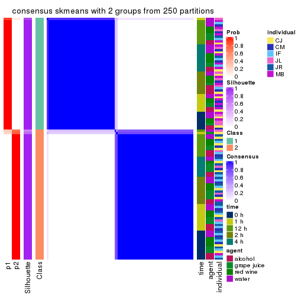</p>

</div>
<div id='tab-ATC-skmeans-consensus-heatmap-2'>
<pre><code class="r">consensus_heatmap(res, k = 3)
</code></pre>

<p>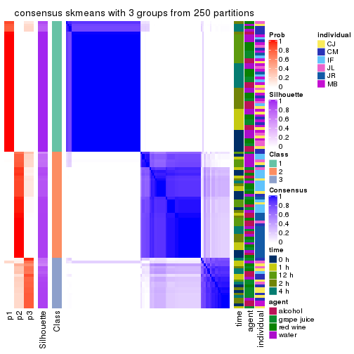</p>

</div>
<div id='tab-ATC-skmeans-consensus-heatmap-3'>
<pre><code class="r">consensus_heatmap(res, k = 4)
</code></pre>

<p>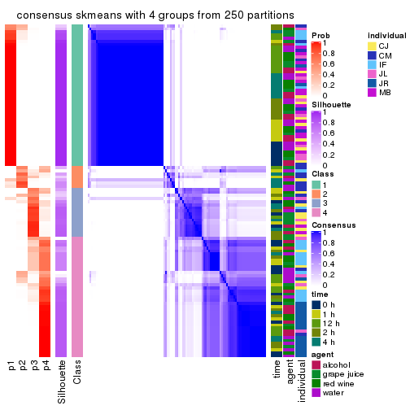</p>

</div>
<div id='tab-ATC-skmeans-consensus-heatmap-4'>
<pre><code class="r">consensus_heatmap(res, k = 5)
</code></pre>

<p>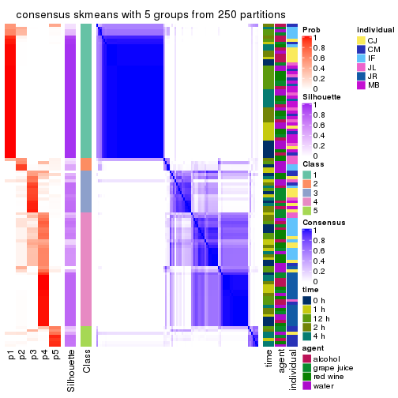</p>

</div>
<div id='tab-ATC-skmeans-consensus-heatmap-5'>
<pre><code class="r">consensus_heatmap(res, k = 6)
</code></pre>

<p>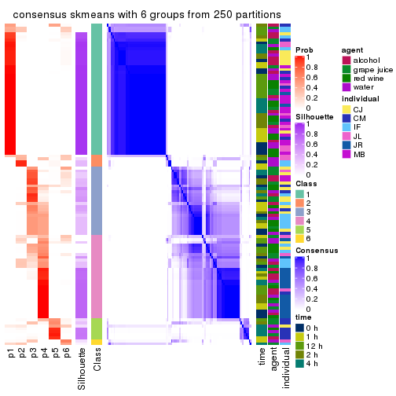</p>

</div>
</div>

Heatmaps for the membership of samples in all partitions to see how consistent they are:


<script>
$( function() {
	$( '#tabs-ATC-skmeans-membership-heatmap' ).tabs();
} );
</script>
<div id='tabs-ATC-skmeans-membership-heatmap'>
<ul>
<li><a href='#tab-ATC-skmeans-membership-heatmap-1'>k = 2</a></li>
<li><a href='#tab-ATC-skmeans-membership-heatmap-2'>k = 3</a></li>
<li><a href='#tab-ATC-skmeans-membership-heatmap-3'>k = 4</a></li>
<li><a href='#tab-ATC-skmeans-membership-heatmap-4'>k = 5</a></li>
<li><a href='#tab-ATC-skmeans-membership-heatmap-5'>k = 6</a></li>
</ul>
<div id='tab-ATC-skmeans-membership-heatmap-1'>
<pre><code class="r">membership_heatmap(res, k = 2)
</code></pre>

<p>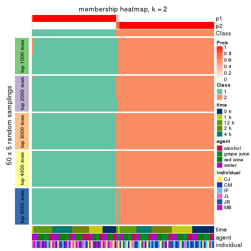</p>

</div>
<div id='tab-ATC-skmeans-membership-heatmap-2'>
<pre><code class="r">membership_heatmap(res, k = 3)
</code></pre>

<p>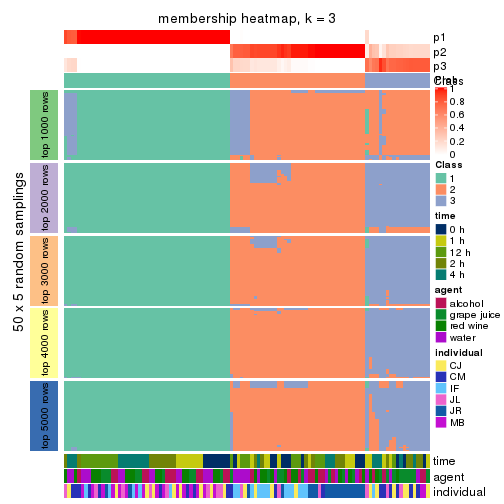</p>

</div>
<div id='tab-ATC-skmeans-membership-heatmap-3'>
<pre><code class="r">membership_heatmap(res, k = 4)
</code></pre>

<p>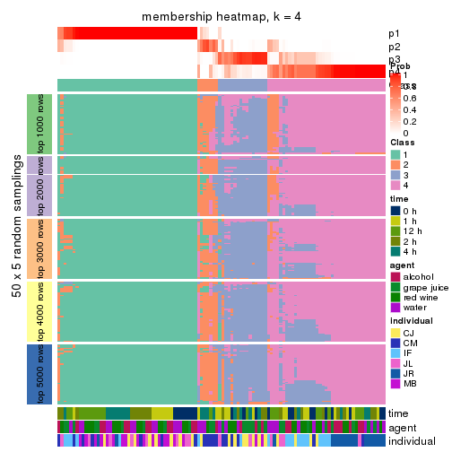</p>

</div>
<div id='tab-ATC-skmeans-membership-heatmap-4'>
<pre><code class="r">membership_heatmap(res, k = 5)
</code></pre>

<p>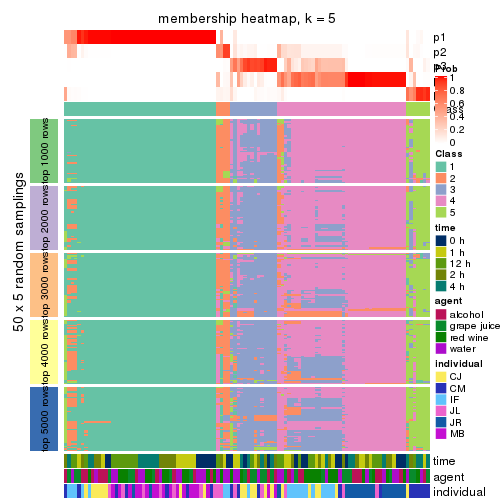</p>

</div>
<div id='tab-ATC-skmeans-membership-heatmap-5'>
<pre><code class="r">membership_heatmap(res, k = 6)
</code></pre>

<p>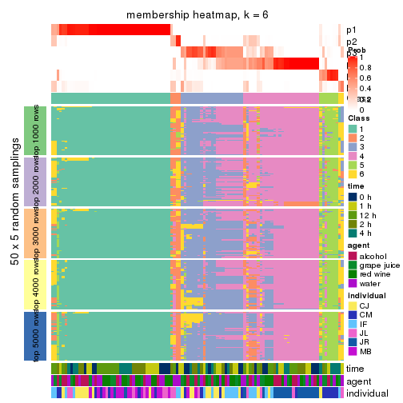</p>

</div>
</div>

As soon as we have had the classes for columns, we can look for signatures
which are significantly different between classes which can be candidate marks
for certain classes. Following are the heatmaps for signatures.


Signature heatmaps where rows are scaled:


<script>
$( function() {
	$( '#tabs-ATC-skmeans-get-signatures' ).tabs();
} );
</script>
<div id='tabs-ATC-skmeans-get-signatures'>
<ul>
<li><a href='#tab-ATC-skmeans-get-signatures-1'>k = 2</a></li>
<li><a href='#tab-ATC-skmeans-get-signatures-2'>k = 3</a></li>
<li><a href='#tab-ATC-skmeans-get-signatures-3'>k = 4</a></li>
<li><a href='#tab-ATC-skmeans-get-signatures-4'>k = 5</a></li>
<li><a href='#tab-ATC-skmeans-get-signatures-5'>k = 6</a></li>
</ul>
<div id='tab-ATC-skmeans-get-signatures-1'>
<pre><code class="r">get_signatures(res, k = 2)
</code></pre>

<p>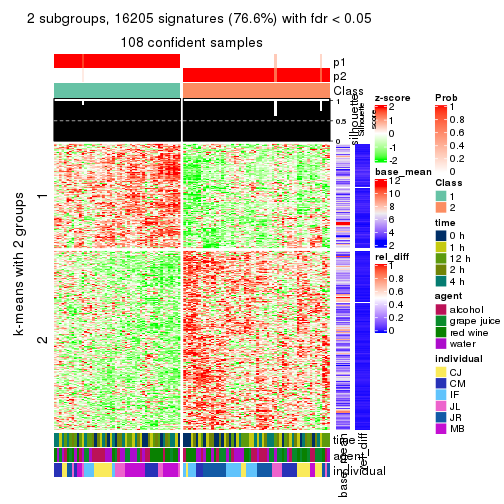</p>

</div>
<div id='tab-ATC-skmeans-get-signatures-2'>
<pre><code class="r">get_signatures(res, k = 3)
</code></pre>

<p>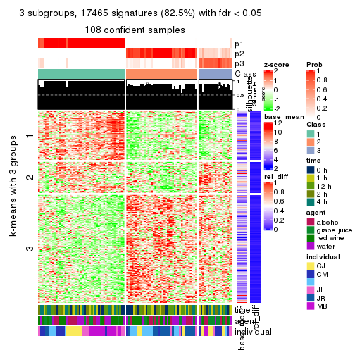</p>

</div>
<div id='tab-ATC-skmeans-get-signatures-3'>
<pre><code class="r">get_signatures(res, k = 4)
</code></pre>

<p>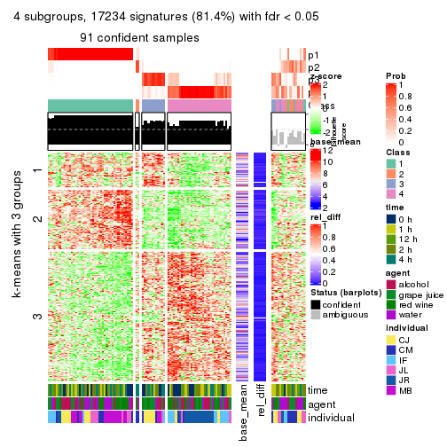</p>

</div>
<div id='tab-ATC-skmeans-get-signatures-4'>
<pre><code class="r">get_signatures(res, k = 5)
</code></pre>

<p>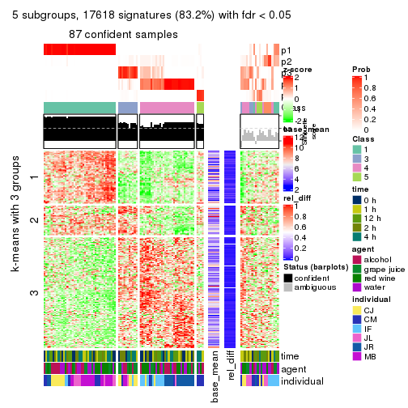</p>

</div>
<div id='tab-ATC-skmeans-get-signatures-5'>
<pre><code class="r">get_signatures(res, k = 6)
</code></pre>

<p>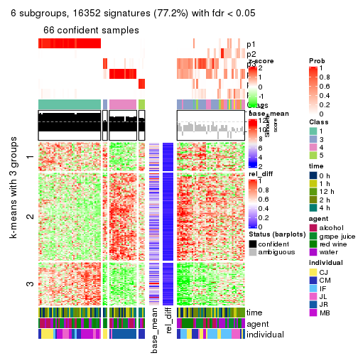</p>

</div>
</div>


Signature heatmaps where rows are not scaled:


<script>
$( function() {
	$( '#tabs-ATC-skmeans-get-signatures-no-scale' ).tabs();
} );
</script>
<div id='tabs-ATC-skmeans-get-signatures-no-scale'>
<ul>
<li><a href='#tab-ATC-skmeans-get-signatures-no-scale-1'>k = 2</a></li>
<li><a href='#tab-ATC-skmeans-get-signatures-no-scale-2'>k = 3</a></li>
<li><a href='#tab-ATC-skmeans-get-signatures-no-scale-3'>k = 4</a></li>
<li><a href='#tab-ATC-skmeans-get-signatures-no-scale-4'>k = 5</a></li>
<li><a href='#tab-ATC-skmeans-get-signatures-no-scale-5'>k = 6</a></li>
</ul>
<div id='tab-ATC-skmeans-get-signatures-no-scale-1'>
<pre><code class="r">get_signatures(res, k = 2, scale_rows = FALSE)
</code></pre>

<p>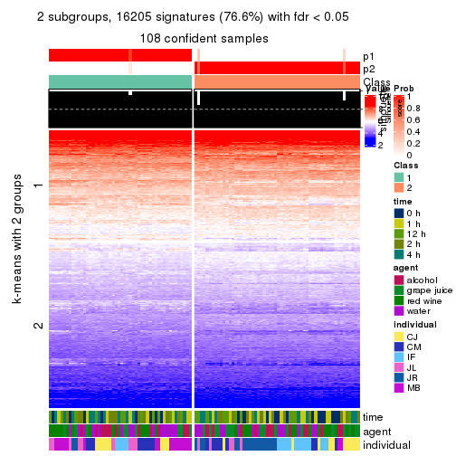</p>

</div>
<div id='tab-ATC-skmeans-get-signatures-no-scale-2'>
<pre><code class="r">get_signatures(res, k = 3, scale_rows = FALSE)
</code></pre>

<p>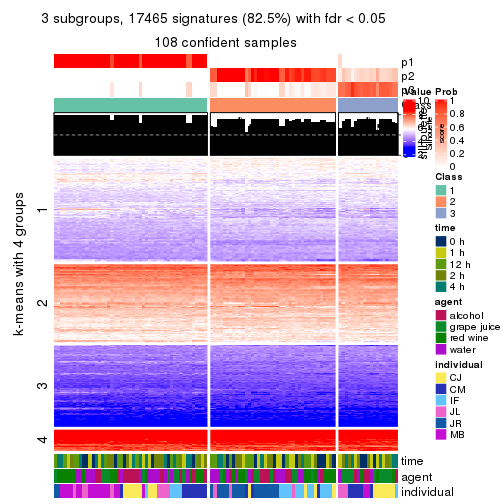</p>

</div>
<div id='tab-ATC-skmeans-get-signatures-no-scale-3'>
<pre><code class="r">get_signatures(res, k = 4, scale_rows = FALSE)
</code></pre>

<p>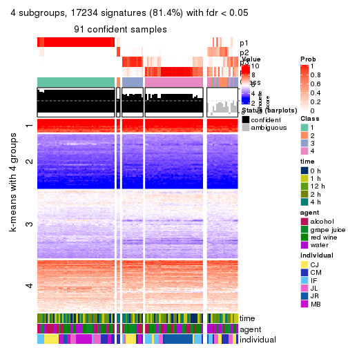</p>

</div>
<div id='tab-ATC-skmeans-get-signatures-no-scale-4'>
<pre><code class="r">get_signatures(res, k = 5, scale_rows = FALSE)
</code></pre>

<p>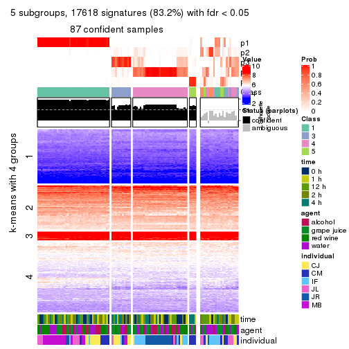</p>

</div>
<div id='tab-ATC-skmeans-get-signatures-no-scale-5'>
<pre><code class="r">get_signatures(res, k = 6, scale_rows = FALSE)
</code></pre>

<p>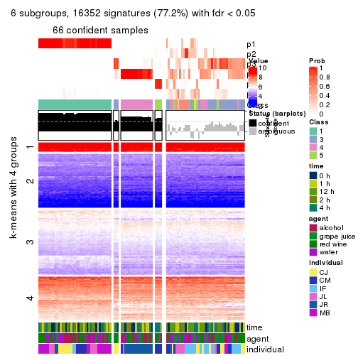</p>

</div>
</div>


Compare the overlap of signatures from different k:

```r
compare_signatures(res)
```

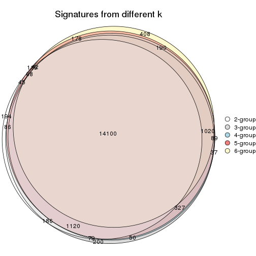

`get_signature()` returns a data frame invisibly. TO get the list of signatures, the function
call should be assigned to a variable explicitly. In following code, if `plot` argument is set
to `FALSE`, no heatmap is plotted while only the differential analysis is performed.

```r
# code only for demonstration
tb = get_signature(res, k = ..., plot = FALSE)
```

An example of the output of `tb` is:

```
#>   which_row         fdr    mean_1    mean_2 scaled_mean_1 scaled_mean_2 km
#> 1        38 0.042760348  8.373488  9.131774    -0.5533452     0.5164555  1
#> 2        40 0.018707592  7.106213  8.469186    -0.6173731     0.5762149  1
#> 3        55 0.019134737 10.221463 11.207825    -0.6159697     0.5749050  1
#> 4        59 0.006059896  5.921854  7.869574    -0.6899429     0.6439467  1
#> 5        60 0.018055526  8.928898 10.211722    -0.6204761     0.5791110  1
#> 6        98 0.009384629 15.714769 14.887706     0.6635654    -0.6193277  2
...
```

The columns in `tb` are:

1. `which_row`: row indices corresponding to the input matrix.
2. `fdr`: FDR for the differential test. 
3. `mean_x`: The mean value in group x.
4. `scaled_mean_x`: The mean value in group x after rows are scaled.
5. `km`: Row groups if k-means clustering is applied to rows.


UMAP plot which shows how samples are separated.


<script>
$( function() {
	$( '#tabs-ATC-skmeans-dimension-reduction' ).tabs();
} );
</script>
<div id='tabs-ATC-skmeans-dimension-reduction'>
<ul>
<li><a href='#tab-ATC-skmeans-dimension-reduction-1'>k = 2</a></li>
<li><a href='#tab-ATC-skmeans-dimension-reduction-2'>k = 3</a></li>
<li><a href='#tab-ATC-skmeans-dimension-reduction-3'>k = 4</a></li>
<li><a href='#tab-ATC-skmeans-dimension-reduction-4'>k = 5</a></li>
<li><a href='#tab-ATC-skmeans-dimension-reduction-5'>k = 6</a></li>
</ul>
<div id='tab-ATC-skmeans-dimension-reduction-1'>
<pre><code class="r">dimension_reduction(res, k = 2, method = &quot;UMAP&quot;)
</code></pre>

<p>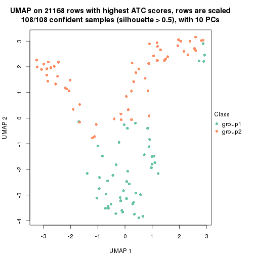</p>

</div>
<div id='tab-ATC-skmeans-dimension-reduction-2'>
<pre><code class="r">dimension_reduction(res, k = 3, method = &quot;UMAP&quot;)
</code></pre>

<p>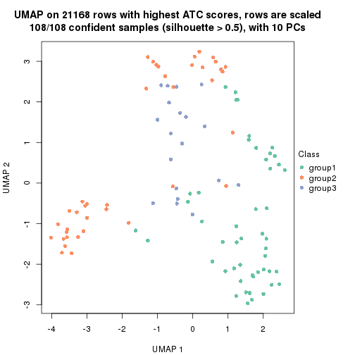</p>

</div>
<div id='tab-ATC-skmeans-dimension-reduction-3'>
<pre><code class="r">dimension_reduction(res, k = 4, method = &quot;UMAP&quot;)
</code></pre>

<p>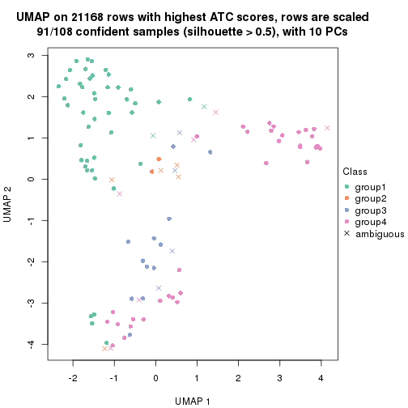</p>

</div>
<div id='tab-ATC-skmeans-dimension-reduction-4'>
<pre><code class="r">dimension_reduction(res, k = 5, method = &quot;UMAP&quot;)
</code></pre>

<p>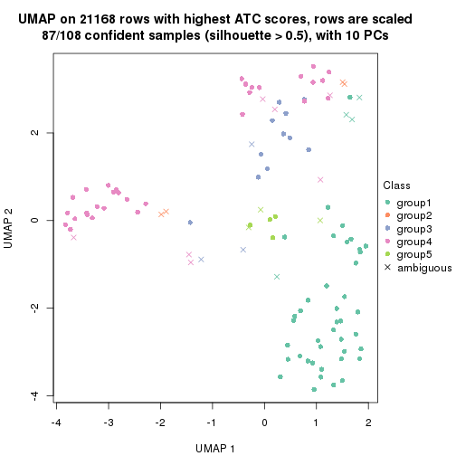</p>

</div>
<div id='tab-ATC-skmeans-dimension-reduction-5'>
<pre><code class="r">dimension_reduction(res, k = 6, method = &quot;UMAP&quot;)
</code></pre>

<p>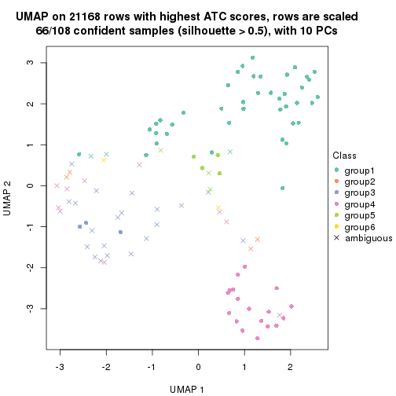</p>

</div>
</div>


Following heatmap shows how subgroups are split when increasing `k`:

```r
collect_classes(res)
```

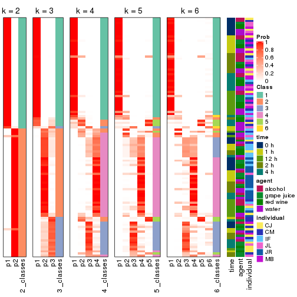


Test correlation between subgroups and known annotations. If the known
annotation is numeric, one-way ANOVA test is applied, and if the known
annotation is discrete, chi-squared contingency table test is applied.

```r
test_to_known_factors(res)
```

```
#>               n time(p) agent(p) individual(p) k
#> ATC:skmeans 108   0.746    0.582      3.81e-05 2
#> ATC:skmeans 108   0.443    0.295      1.67e-08 3
#> ATC:skmeans  91   0.341    0.550      2.54e-08 4
#> ATC:skmeans  87   0.401    0.490      2.98e-11 5
#> ATC:skmeans  66   0.615    0.788      2.17e-11 6
```


If matrix rows can be associated to genes, consider to use `GO_Enrichment(res,
...)` to perform function enrichment for the signature genes.


 

---------------------------------------------------


### ATC:pam*


The object with results only for a single top-value method and a single partition method 
can be extracted as:

```r
res = res_list["ATC", "pam"]
# you can also extract it by
# res = res_list["ATC:pam"]
```

A summary of `res` and all the functions that can be applied to it:

```r
res
```

```
#> A 'ConsensusPartition' object with k = 2, 3, 4, 5, 6.
#>   On a matrix with 21168 rows and 108 columns.
#>   Top rows (1000, 2000, 3000, 4000, 5000) are extracted by 'ATC' method.
#>   Subgroups are detected by 'pam' method.
#>   Performed in total 1250 partitions by row resampling.
#>   Best k for subgroups seems to be 4.
#> 
#> Following methods can be applied to this 'ConsensusPartition' object:
#>  [1] "cola_report"             "collect_classes"         "collect_plots"          
#>  [4] "collect_stats"           "colnames"                "compare_signatures"     
#>  [7] "consensus_heatmap"       "dimension_reduction"     "functional_enrichment"  
#> [10] "get_anno_col"            "get_anno"                "get_classes"            
#> [13] "get_consensus"           "get_matrix"              "get_membership"         
#> [16] "get_param"               "get_signatures"          "get_stats"              
#> [19] "is_best_k"               "is_stable_k"             "membership_heatmap"     
#> [22] "ncol"                    "nrow"                    "plot_ecdf"              
#> [25] "rownames"                "select_partition_number" "show"                   
#> [28] "suggest_best_k"          "test_to_known_factors"
```

`collect_plots()` function collects all the plots made from `res` for all `k` (number of partitions)
into one single page to provide an easy and fast comparison between different `k`.

```r
collect_plots(res)
```

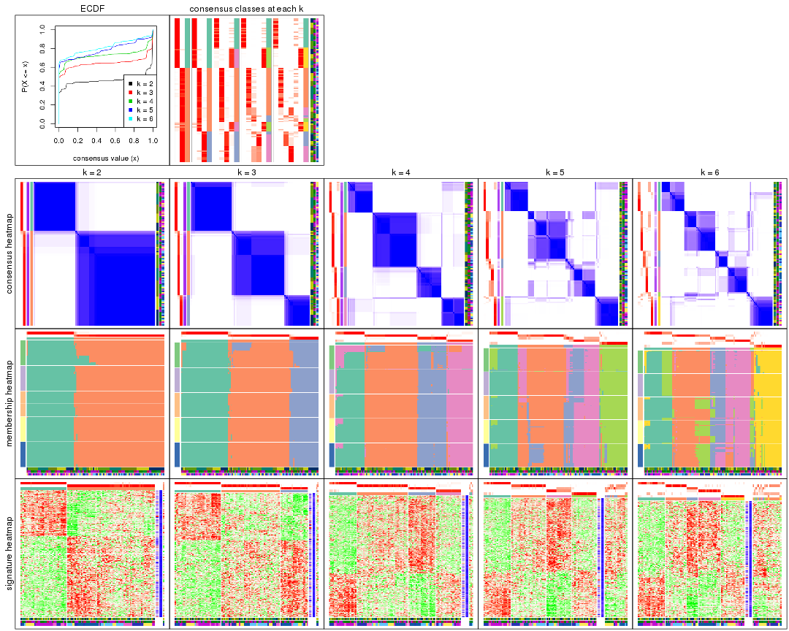

The plots are:

- The first row: a plot of the ECDF (Empirical cumulative distribution
  function) curves of the consensus matrix for each `k` and the heatmap of
  predicted classes for each `k`.
- The second row: heatmaps of the consensus matrix for each `k`.
- The third row: heatmaps of the membership matrix for each `k`.
- The fouth row: heatmaps of the signatures for each `k`.

All the plots in panels can be made by individual functions and they are
plotted later in this section.

`select_partition_number()` produces several plots showing different
statistics for choosing "optimized" `k`. There are following statistics:

- ECDF curves of the consensus matrix for each `k`;
- 1-PAC. [The PAC
  score](https://en.wikipedia.org/wiki/Consensus_clustering#Over-interpretation_potential_of_consensus_clustering)
  measures the proportion of the ambiguous subgrouping.
- Mean silhouette score.
- Concordance. The mean probability of fiting the consensus class ids in all
  partitions.
- Area increased. Denote $A_k$ as the area under the ECDF curve for current
  `k`, the area increased is defined as $A_k - A_{k-1}$.
- Rand index. The percent of pairs of samples that are both in a same cluster
  or both are not in a same cluster in the partition of k and k-1.
- Jaccard index. The ratio of pairs of samples are both in a same cluster in
  the partition of k and k-1 and the pairs of samples are both in a same
  cluster in the partition k or k-1.

The detailed explanations of these statistics can be found in [the cola
vignette](http://bioconductor.org/packages/devel/bioc/vignettes/cola/inst/doc/cola.html#toc_13).

Generally speaking, lower PAC score, higher mean silhouette score or higher
concordance corresponds to better partition. Rand index and Jaccard index
measure how similar the current partition is compared to partition with `k-1`.
If they are too similar, we won't accept `k` is better than `k-1`.

```r
select_partition_number(res)
```

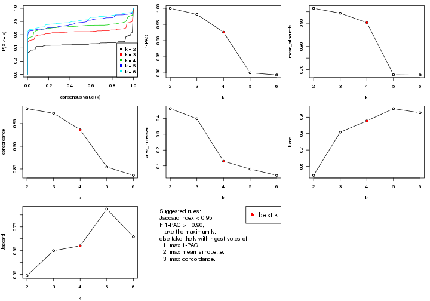

The numeric values for all these statistics can be obtained by `get_stats()`.

```r
get_stats(res)
```

```
#>   k 1-PAC mean_silhouette concordance area_increased  Rand Jaccard
#> 2 2 1.000           0.965       0.983         0.4617 0.545   0.545
#> 3 3 0.981           0.944       0.973         0.3975 0.809   0.650
#> 4 4 0.926           0.903       0.936         0.1293 0.878   0.670
#> 5 5 0.800           0.678       0.854         0.0798 0.952   0.825
#> 6 6 0.794           0.677       0.836         0.0403 0.927   0.708
```

`suggest_best_k()` suggests the best $k$ based on these statistics. The rules are as follows:

- All $k$ with Jaccard index larger than 0.95 are removed because the increase of
  the partition number does not provides enough extra information. If all $k$ are removed,
  the best $k$ is assigned by `NA`.
- For $k$ with 1-PAC larger than 0.9, the maximal $k$ is taken as the "best k". Other $k$ is called "optional k".
- If it does not fit the second rule. The $k$ with the highest vote of highest
  1-PAC, mean silhouette and concordance is taken as the "best k".

```r
suggest_best_k(res)
```

```
#> [1] 4
#> attr(,"optional")
#> [1] 2 3
```

There is also optional best $k$ = 2 3 that is worth to check.

Following shows the table of the partitions (You need to click the **show/hide
code output** link to see it). The membership matrix (columns with name `p*`)
is inferred by
[`clue::cl_consensus()`](https://www.rdocumentation.org/link/cl_consensus?package=clue)
function with the `SE` method. Basically the value in the membership matrix
represents the probability to belong to a certain group. The finall class
label for an item is determined with the group with highest probability it
belongs to.

In `get_classes()` function, the entropy is calculated from the membership
matrix and the silhouette score is calculated from the consensus matrix.


<script>
$( function() {
	$( '#tabs-ATC-pam-get-classes' ).tabs();
} );
</script>
<div id='tabs-ATC-pam-get-classes'>
<ul>
<li><a href='#tab-ATC-pam-get-classes-1'>k = 2</a></li>
<li><a href='#tab-ATC-pam-get-classes-2'>k = 3</a></li>
<li><a href='#tab-ATC-pam-get-classes-3'>k = 4</a></li>
<li><a href='#tab-ATC-pam-get-classes-4'>k = 5</a></li>
<li><a href='#tab-ATC-pam-get-classes-5'>k = 6</a></li>
</ul>

<div id='tab-ATC-pam-get-classes-1'>
<p><a id='tab-ATC-pam-get-classes-1-a' style='color:#0366d6' href='#'>show/hide code output</a></p>
<pre><code class="r">cbind(get_classes(res, k = 2), get_membership(res, k = 2))
</code></pre>

<pre><code>#&gt;          class entropy silhouette    p1    p2
#&gt; GSM87863     1  0.5946      0.824 0.856 0.144
#&gt; GSM87887     1  0.0000      0.996 1.000 0.000
#&gt; GSM87896     2  0.0000      0.976 0.000 1.000
#&gt; GSM87934     2  0.0000      0.976 0.000 1.000
#&gt; GSM87943     2  0.0000      0.976 0.000 1.000
#&gt; GSM87853     2  0.0000      0.976 0.000 1.000
#&gt; GSM87906     2  0.0000      0.976 0.000 1.000
#&gt; GSM87920     2  0.6531      0.818 0.168 0.832
#&gt; GSM87924     2  0.0000      0.976 0.000 1.000
#&gt; GSM87858     2  0.0000      0.976 0.000 1.000
#&gt; GSM87882     2  0.0000      0.976 0.000 1.000
#&gt; GSM87891     2  0.0000      0.976 0.000 1.000
#&gt; GSM87917     1  0.0000      0.996 1.000 0.000
#&gt; GSM87929     2  0.0000      0.976 0.000 1.000
#&gt; GSM87948     1  0.0000      0.996 1.000 0.000
#&gt; GSM87868     1  0.0000      0.996 1.000 0.000
#&gt; GSM87873     2  0.0000      0.976 0.000 1.000
#&gt; GSM87901     2  0.1633      0.962 0.024 0.976
#&gt; GSM87910     1  0.0000      0.996 1.000 0.000
#&gt; GSM87938     2  0.0000      0.976 0.000 1.000
#&gt; GSM87953     1  0.0000      0.996 1.000 0.000
#&gt; GSM87864     1  0.0000      0.996 1.000 0.000
#&gt; GSM87888     2  0.0376      0.974 0.004 0.996
#&gt; GSM87897     2  0.0000      0.976 0.000 1.000
#&gt; GSM87935     2  0.0000      0.976 0.000 1.000
#&gt; GSM87944     1  0.0000      0.996 1.000 0.000
#&gt; GSM87854     2  0.1414      0.964 0.020 0.980
#&gt; GSM87878     2  0.9833      0.312 0.424 0.576
#&gt; GSM87907     2  0.0000      0.976 0.000 1.000
#&gt; GSM87921     2  0.0000      0.976 0.000 1.000
#&gt; GSM87925     2  0.0000      0.976 0.000 1.000
#&gt; GSM87957     1  0.0000      0.996 1.000 0.000
#&gt; GSM87859     2  0.0000      0.976 0.000 1.000
#&gt; GSM87883     1  0.0000      0.996 1.000 0.000
#&gt; GSM87892     2  0.0000      0.976 0.000 1.000
#&gt; GSM87930     2  0.0000      0.976 0.000 1.000
#&gt; GSM87949     1  0.0000      0.996 1.000 0.000
#&gt; GSM87869     1  0.0000      0.996 1.000 0.000
#&gt; GSM87874     2  0.0000      0.976 0.000 1.000
#&gt; GSM87902     2  0.1633      0.962 0.024 0.976
#&gt; GSM87911     2  0.1633      0.962 0.024 0.976
#&gt; GSM87939     2  0.0000      0.976 0.000 1.000
#&gt; GSM87954     1  0.0000      0.996 1.000 0.000
#&gt; GSM87865     1  0.0000      0.996 1.000 0.000
#&gt; GSM87889     2  0.3879      0.922 0.076 0.924
#&gt; GSM87898     2  0.9044      0.567 0.320 0.680
#&gt; GSM87915     1  0.0000      0.996 1.000 0.000
#&gt; GSM87936     2  0.0000      0.976 0.000 1.000
#&gt; GSM87945     2  0.0000      0.976 0.000 1.000
#&gt; GSM87855     2  0.0000      0.976 0.000 1.000
#&gt; GSM87879     2  0.0000      0.976 0.000 1.000
#&gt; GSM87922     2  0.0000      0.976 0.000 1.000
#&gt; GSM87926     2  0.0000      0.976 0.000 1.000
#&gt; GSM87958     1  0.0000      0.996 1.000 0.000
#&gt; GSM87860     2  0.0000      0.976 0.000 1.000
#&gt; GSM87884     1  0.0000      0.996 1.000 0.000
#&gt; GSM87893     2  0.0000      0.976 0.000 1.000
#&gt; GSM87918     2  0.3879      0.922 0.076 0.924
#&gt; GSM87931     2  0.0000      0.976 0.000 1.000
#&gt; GSM87950     1  0.0000      0.996 1.000 0.000
#&gt; GSM87870     1  0.0000      0.996 1.000 0.000
#&gt; GSM87875     2  0.0000      0.976 0.000 1.000
#&gt; GSM87903     2  0.0000      0.976 0.000 1.000
#&gt; GSM87912     1  0.0000      0.996 1.000 0.000
#&gt; GSM87940     2  0.0000      0.976 0.000 1.000
#&gt; GSM87866     1  0.0000      0.996 1.000 0.000
#&gt; GSM87899     2  0.0000      0.976 0.000 1.000
#&gt; GSM87937     2  0.0000      0.976 0.000 1.000
#&gt; GSM87946     1  0.0000      0.996 1.000 0.000
#&gt; GSM87856     2  0.0000      0.976 0.000 1.000
#&gt; GSM87880     2  0.0000      0.976 0.000 1.000
#&gt; GSM87908     2  0.3879      0.922 0.076 0.924
#&gt; GSM87923     2  0.0000      0.976 0.000 1.000
#&gt; GSM87927     2  0.0000      0.976 0.000 1.000
#&gt; GSM87959     1  0.0000      0.996 1.000 0.000
#&gt; GSM87861     2  0.0000      0.976 0.000 1.000
#&gt; GSM87885     2  0.3879      0.922 0.076 0.924
#&gt; GSM87894     1  0.0000      0.996 1.000 0.000
#&gt; GSM87932     1  0.0000      0.996 1.000 0.000
#&gt; GSM87951     1  0.0000      0.996 1.000 0.000
#&gt; GSM87871     2  0.2948      0.941 0.052 0.948
#&gt; GSM87876     2  0.3879      0.922 0.076 0.924
#&gt; GSM87904     2  0.0000      0.976 0.000 1.000
#&gt; GSM87913     1  0.0000      0.996 1.000 0.000
#&gt; GSM87941     2  0.0000      0.976 0.000 1.000
#&gt; GSM87955     1  0.0000      0.996 1.000 0.000
#&gt; GSM87867     2  0.3879      0.922 0.076 0.924
#&gt; GSM87890     2  0.0000      0.976 0.000 1.000
#&gt; GSM87900     2  0.0000      0.976 0.000 1.000
#&gt; GSM87916     2  0.0000      0.976 0.000 1.000
#&gt; GSM87947     1  0.0000      0.996 1.000 0.000
#&gt; GSM87857     2  0.0000      0.976 0.000 1.000
#&gt; GSM87881     2  0.0000      0.976 0.000 1.000
#&gt; GSM87909     2  0.3879      0.922 0.076 0.924
#&gt; GSM87928     1  0.0000      0.996 1.000 0.000
#&gt; GSM87960     1  0.0000      0.996 1.000 0.000
#&gt; GSM87862     2  0.0000      0.976 0.000 1.000
#&gt; GSM87886     1  0.0000      0.996 1.000 0.000
#&gt; GSM87895     2  0.0000      0.976 0.000 1.000
#&gt; GSM87919     1  0.0000      0.996 1.000 0.000
#&gt; GSM87933     2  0.0000      0.976 0.000 1.000
#&gt; GSM87952     1  0.0000      0.996 1.000 0.000
#&gt; GSM87872     2  0.0000      0.976 0.000 1.000
#&gt; GSM87877     1  0.0000      0.996 1.000 0.000
#&gt; GSM87905     2  0.3879      0.922 0.076 0.924
#&gt; GSM87914     2  0.1633      0.962 0.024 0.976
#&gt; GSM87942     2  0.0376      0.974 0.004 0.996
#&gt; GSM87956     1  0.0000      0.996 1.000 0.000
</code></pre>

<script>
$('#tab-ATC-pam-get-classes-1-a').parent().next().next().hide();
$('#tab-ATC-pam-get-classes-1-a').click(function(){
  $('#tab-ATC-pam-get-classes-1-a').parent().next().next().toggle();
  return(false);
});
</script>
</div>

<div id='tab-ATC-pam-get-classes-2'>
<p><a id='tab-ATC-pam-get-classes-2-a' style='color:#0366d6' href='#'>show/hide code output</a></p>
<pre><code class="r">cbind(get_classes(res, k = 3), get_membership(res, k = 3))
</code></pre>

<pre><code>#&gt;          class entropy silhouette    p1    p2    p3
#&gt; GSM87863     1  0.4796      0.722 0.780 0.220 0.000
#&gt; GSM87887     1  0.0000      0.987 1.000 0.000 0.000
#&gt; GSM87896     3  0.0000      0.960 0.000 0.000 1.000
#&gt; GSM87934     3  0.0000      0.960 0.000 0.000 1.000
#&gt; GSM87943     2  0.0000      0.959 0.000 1.000 0.000
#&gt; GSM87853     3  0.0000      0.960 0.000 0.000 1.000
#&gt; GSM87906     2  0.0000      0.959 0.000 1.000 0.000
#&gt; GSM87920     2  0.2796      0.873 0.092 0.908 0.000
#&gt; GSM87924     3  0.0000      0.960 0.000 0.000 1.000
#&gt; GSM87858     3  0.0000      0.960 0.000 0.000 1.000
#&gt; GSM87882     2  0.0000      0.959 0.000 1.000 0.000
#&gt; GSM87891     3  0.0000      0.960 0.000 0.000 1.000
#&gt; GSM87917     1  0.0000      0.987 1.000 0.000 0.000
#&gt; GSM87929     2  0.2165      0.932 0.000 0.936 0.064
#&gt; GSM87948     1  0.0000      0.987 1.000 0.000 0.000
#&gt; GSM87868     1  0.0000      0.987 1.000 0.000 0.000
#&gt; GSM87873     3  0.0000      0.960 0.000 0.000 1.000
#&gt; GSM87901     2  0.0000      0.959 0.000 1.000 0.000
#&gt; GSM87910     1  0.0000      0.987 1.000 0.000 0.000
#&gt; GSM87938     3  0.0000      0.960 0.000 0.000 1.000
#&gt; GSM87953     1  0.0000      0.987 1.000 0.000 0.000
#&gt; GSM87864     1  0.2165      0.928 0.936 0.064 0.000
#&gt; GSM87888     2  0.0000      0.959 0.000 1.000 0.000
#&gt; GSM87897     2  0.0000      0.959 0.000 1.000 0.000
#&gt; GSM87935     2  0.3879      0.842 0.000 0.848 0.152
#&gt; GSM87944     1  0.0000      0.987 1.000 0.000 0.000
#&gt; GSM87854     2  0.0000      0.959 0.000 1.000 0.000
#&gt; GSM87878     2  0.5859      0.469 0.344 0.656 0.000
#&gt; GSM87907     2  0.2165      0.932 0.000 0.936 0.064
#&gt; GSM87921     2  0.0000      0.959 0.000 1.000 0.000
#&gt; GSM87925     3  0.6045      0.393 0.000 0.380 0.620
#&gt; GSM87957     1  0.0000      0.987 1.000 0.000 0.000
#&gt; GSM87859     3  0.0000      0.960 0.000 0.000 1.000
#&gt; GSM87883     1  0.0000      0.987 1.000 0.000 0.000
#&gt; GSM87892     3  0.0000      0.960 0.000 0.000 1.000
#&gt; GSM87930     3  0.0000      0.960 0.000 0.000 1.000
#&gt; GSM87949     1  0.0000      0.987 1.000 0.000 0.000
#&gt; GSM87869     1  0.0000      0.987 1.000 0.000 0.000
#&gt; GSM87874     3  0.0000      0.960 0.000 0.000 1.000
#&gt; GSM87902     2  0.0000      0.959 0.000 1.000 0.000
#&gt; GSM87911     2  0.0000      0.959 0.000 1.000 0.000
#&gt; GSM87939     2  0.2165      0.932 0.000 0.936 0.064
#&gt; GSM87954     1  0.0000      0.987 1.000 0.000 0.000
#&gt; GSM87865     1  0.2165      0.928 0.936 0.064 0.000
#&gt; GSM87889     2  0.0000      0.959 0.000 1.000 0.000
#&gt; GSM87898     2  0.4931      0.691 0.232 0.768 0.000
#&gt; GSM87915     1  0.0000      0.987 1.000 0.000 0.000
#&gt; GSM87936     2  0.2165      0.932 0.000 0.936 0.064
#&gt; GSM87945     3  0.0000      0.960 0.000 0.000 1.000
#&gt; GSM87855     2  0.2537      0.921 0.000 0.920 0.080
#&gt; GSM87879     2  0.0000      0.959 0.000 1.000 0.000
#&gt; GSM87922     2  0.2165      0.932 0.000 0.936 0.064
#&gt; GSM87926     2  0.2165      0.932 0.000 0.936 0.064
#&gt; GSM87958     1  0.0000      0.987 1.000 0.000 0.000
#&gt; GSM87860     2  0.2165      0.932 0.000 0.936 0.064
#&gt; GSM87884     1  0.0000      0.987 1.000 0.000 0.000
#&gt; GSM87893     3  0.0000      0.960 0.000 0.000 1.000
#&gt; GSM87918     2  0.0000      0.959 0.000 1.000 0.000
#&gt; GSM87931     3  0.1289      0.942 0.000 0.032 0.968
#&gt; GSM87950     1  0.0000      0.987 1.000 0.000 0.000
#&gt; GSM87870     1  0.2165      0.928 0.936 0.064 0.000
#&gt; GSM87875     2  0.2165      0.932 0.000 0.936 0.064
#&gt; GSM87903     2  0.2066      0.934 0.000 0.940 0.060
#&gt; GSM87912     1  0.0000      0.987 1.000 0.000 0.000
#&gt; GSM87940     3  0.0000      0.960 0.000 0.000 1.000
#&gt; GSM87866     1  0.0000      0.987 1.000 0.000 0.000
#&gt; GSM87899     2  0.0237      0.958 0.000 0.996 0.004
#&gt; GSM87937     3  0.0592      0.955 0.000 0.012 0.988
#&gt; GSM87946     1  0.0000      0.987 1.000 0.000 0.000
#&gt; GSM87856     2  0.0000      0.959 0.000 1.000 0.000
#&gt; GSM87880     2  0.0000      0.959 0.000 1.000 0.000
#&gt; GSM87908     2  0.0000      0.959 0.000 1.000 0.000
#&gt; GSM87923     2  0.0000      0.959 0.000 1.000 0.000
#&gt; GSM87927     2  0.0000      0.959 0.000 1.000 0.000
#&gt; GSM87959     1  0.0000      0.987 1.000 0.000 0.000
#&gt; GSM87861     3  0.2537      0.897 0.000 0.080 0.920
#&gt; GSM87885     2  0.0000      0.959 0.000 1.000 0.000
#&gt; GSM87894     1  0.0000      0.987 1.000 0.000 0.000
#&gt; GSM87932     1  0.0000      0.987 1.000 0.000 0.000
#&gt; GSM87951     1  0.0000      0.987 1.000 0.000 0.000
#&gt; GSM87871     2  0.0000      0.959 0.000 1.000 0.000
#&gt; GSM87876     2  0.0000      0.959 0.000 1.000 0.000
#&gt; GSM87904     2  0.2165      0.932 0.000 0.936 0.064
#&gt; GSM87913     1  0.0000      0.987 1.000 0.000 0.000
#&gt; GSM87941     2  0.0000      0.959 0.000 1.000 0.000
#&gt; GSM87955     1  0.0000      0.987 1.000 0.000 0.000
#&gt; GSM87867     2  0.0000      0.959 0.000 1.000 0.000
#&gt; GSM87890     3  0.3482      0.851 0.000 0.128 0.872
#&gt; GSM87900     2  0.2165      0.932 0.000 0.936 0.064
#&gt; GSM87916     3  0.4062      0.807 0.000 0.164 0.836
#&gt; GSM87947     1  0.0000      0.987 1.000 0.000 0.000
#&gt; GSM87857     2  0.1529      0.943 0.000 0.960 0.040
#&gt; GSM87881     2  0.0000      0.959 0.000 1.000 0.000
#&gt; GSM87909     2  0.0000      0.959 0.000 1.000 0.000
#&gt; GSM87928     1  0.0000      0.987 1.000 0.000 0.000
#&gt; GSM87960     1  0.0000      0.987 1.000 0.000 0.000
#&gt; GSM87862     2  0.2165      0.932 0.000 0.936 0.064
#&gt; GSM87886     1  0.0000      0.987 1.000 0.000 0.000
#&gt; GSM87895     3  0.0592      0.955 0.000 0.012 0.988
#&gt; GSM87919     1  0.0000      0.987 1.000 0.000 0.000
#&gt; GSM87933     3  0.0592      0.955 0.000 0.012 0.988
#&gt; GSM87952     1  0.0000      0.987 1.000 0.000 0.000
#&gt; GSM87872     2  0.0000      0.959 0.000 1.000 0.000
#&gt; GSM87877     1  0.0000      0.987 1.000 0.000 0.000
#&gt; GSM87905     2  0.0000      0.959 0.000 1.000 0.000
#&gt; GSM87914     2  0.0000      0.959 0.000 1.000 0.000
#&gt; GSM87942     2  0.0000      0.959 0.000 1.000 0.000
#&gt; GSM87956     1  0.0000      0.987 1.000 0.000 0.000
</code></pre>

<script>
$('#tab-ATC-pam-get-classes-2-a').parent().next().next().hide();
$('#tab-ATC-pam-get-classes-2-a').click(function(){
  $('#tab-ATC-pam-get-classes-2-a').parent().next().next().toggle();
  return(false);
});
</script>
</div>

<div id='tab-ATC-pam-get-classes-3'>
<p><a id='tab-ATC-pam-get-classes-3-a' style='color:#0366d6' href='#'>show/hide code output</a></p>
<pre><code class="r">cbind(get_classes(res, k = 4), get_membership(res, k = 4))
</code></pre>

<pre><code>#&gt;          class entropy silhouette    p1    p2    p3    p4
#&gt; GSM87863     4  0.1637      0.919 0.000 0.060 0.000 0.940
#&gt; GSM87887     4  0.1637      0.913 0.060 0.000 0.000 0.940
#&gt; GSM87896     3  0.1637      0.927 0.000 0.000 0.940 0.060
#&gt; GSM87934     3  0.0000      0.928 0.000 0.000 1.000 0.000
#&gt; GSM87943     2  0.0000      0.971 0.000 1.000 0.000 0.000
#&gt; GSM87853     3  0.1637      0.927 0.000 0.000 0.940 0.060
#&gt; GSM87906     2  0.0000      0.971 0.000 1.000 0.000 0.000
#&gt; GSM87920     4  0.1637      0.919 0.000 0.060 0.000 0.940
#&gt; GSM87924     3  0.0707      0.930 0.000 0.000 0.980 0.020
#&gt; GSM87858     3  0.1637      0.927 0.000 0.000 0.940 0.060
#&gt; GSM87882     2  0.0000      0.971 0.000 1.000 0.000 0.000
#&gt; GSM87891     3  0.1637      0.927 0.000 0.000 0.940 0.060
#&gt; GSM87917     1  0.0000      0.912 1.000 0.000 0.000 0.000
#&gt; GSM87929     2  0.1637      0.950 0.000 0.940 0.060 0.000
#&gt; GSM87948     4  0.1637      0.913 0.060 0.000 0.000 0.940
#&gt; GSM87868     4  0.2408      0.870 0.104 0.000 0.000 0.896
#&gt; GSM87873     3  0.1637      0.927 0.000 0.000 0.940 0.060
#&gt; GSM87901     2  0.0000      0.971 0.000 1.000 0.000 0.000
#&gt; GSM87910     1  0.0000      0.912 1.000 0.000 0.000 0.000
#&gt; GSM87938     3  0.0000      0.928 0.000 0.000 1.000 0.000
#&gt; GSM87953     1  0.0000      0.912 1.000 0.000 0.000 0.000
#&gt; GSM87864     4  0.1637      0.919 0.000 0.060 0.000 0.940
#&gt; GSM87888     2  0.0000      0.971 0.000 1.000 0.000 0.000
#&gt; GSM87897     2  0.0000      0.971 0.000 1.000 0.000 0.000
#&gt; GSM87935     2  0.3074      0.861 0.000 0.848 0.152 0.000
#&gt; GSM87944     4  0.1637      0.913 0.060 0.000 0.000 0.940
#&gt; GSM87854     2  0.2281      0.878 0.000 0.904 0.000 0.096
#&gt; GSM87878     4  0.1637      0.919 0.000 0.060 0.000 0.940
#&gt; GSM87907     2  0.1716      0.948 0.000 0.936 0.064 0.000
#&gt; GSM87921     2  0.0000      0.971 0.000 1.000 0.000 0.000
#&gt; GSM87925     3  0.4790      0.371 0.000 0.380 0.620 0.000
#&gt; GSM87957     4  0.1637      0.913 0.060 0.000 0.000 0.940
#&gt; GSM87859     3  0.1637      0.927 0.000 0.000 0.940 0.060
#&gt; GSM87883     1  0.3942      0.740 0.764 0.000 0.000 0.236
#&gt; GSM87892     3  0.1637      0.927 0.000 0.000 0.940 0.060
#&gt; GSM87930     3  0.0336      0.929 0.000 0.000 0.992 0.008
#&gt; GSM87949     1  0.0000      0.912 1.000 0.000 0.000 0.000
#&gt; GSM87869     1  0.0000      0.912 1.000 0.000 0.000 0.000
#&gt; GSM87874     3  0.1637      0.927 0.000 0.000 0.940 0.060
#&gt; GSM87902     2  0.0000      0.971 0.000 1.000 0.000 0.000
#&gt; GSM87911     2  0.0000      0.971 0.000 1.000 0.000 0.000
#&gt; GSM87939     2  0.1716      0.948 0.000 0.936 0.064 0.000
#&gt; GSM87954     1  0.0000      0.912 1.000 0.000 0.000 0.000
#&gt; GSM87865     4  0.1637      0.919 0.000 0.060 0.000 0.940
#&gt; GSM87889     4  0.1637      0.919 0.000 0.060 0.000 0.940
#&gt; GSM87898     4  0.1637      0.919 0.000 0.060 0.000 0.940
#&gt; GSM87915     1  0.4164      0.701 0.736 0.000 0.000 0.264
#&gt; GSM87936     2  0.1716      0.948 0.000 0.936 0.064 0.000
#&gt; GSM87945     3  0.1022      0.930 0.000 0.000 0.968 0.032
#&gt; GSM87855     2  0.2399      0.936 0.000 0.920 0.048 0.032
#&gt; GSM87879     2  0.0000      0.971 0.000 1.000 0.000 0.000
#&gt; GSM87922     2  0.1637      0.950 0.000 0.940 0.060 0.000
#&gt; GSM87926     2  0.1716      0.948 0.000 0.936 0.064 0.000
#&gt; GSM87958     1  0.0336      0.909 0.992 0.000 0.000 0.008
#&gt; GSM87860     2  0.1716      0.948 0.000 0.936 0.064 0.000
#&gt; GSM87884     1  0.3801      0.758 0.780 0.000 0.000 0.220
#&gt; GSM87893     3  0.1637      0.927 0.000 0.000 0.940 0.060
#&gt; GSM87918     2  0.0000      0.971 0.000 1.000 0.000 0.000
#&gt; GSM87931     3  0.1022      0.914 0.000 0.032 0.968 0.000
#&gt; GSM87950     1  0.0000      0.912 1.000 0.000 0.000 0.000
#&gt; GSM87870     4  0.1637      0.919 0.000 0.060 0.000 0.940
#&gt; GSM87875     2  0.1716      0.948 0.000 0.936 0.064 0.000
#&gt; GSM87903     2  0.1557      0.952 0.000 0.944 0.056 0.000
#&gt; GSM87912     1  0.3801      0.758 0.780 0.000 0.000 0.220
#&gt; GSM87940     3  0.0000      0.928 0.000 0.000 1.000 0.000
#&gt; GSM87866     4  0.1637      0.913 0.060 0.000 0.000 0.940
#&gt; GSM87899     2  0.0188      0.970 0.000 0.996 0.004 0.000
#&gt; GSM87937     3  0.0469      0.925 0.000 0.012 0.988 0.000
#&gt; GSM87946     1  0.0188      0.911 0.996 0.000 0.000 0.004
#&gt; GSM87856     2  0.0000      0.971 0.000 1.000 0.000 0.000
#&gt; GSM87880     2  0.0000      0.971 0.000 1.000 0.000 0.000
#&gt; GSM87908     2  0.0000      0.971 0.000 1.000 0.000 0.000
#&gt; GSM87923     2  0.0000      0.971 0.000 1.000 0.000 0.000
#&gt; GSM87927     2  0.0000      0.971 0.000 1.000 0.000 0.000
#&gt; GSM87959     1  0.0000      0.912 1.000 0.000 0.000 0.000
#&gt; GSM87861     3  0.2011      0.871 0.000 0.080 0.920 0.000
#&gt; GSM87885     2  0.0000      0.971 0.000 1.000 0.000 0.000
#&gt; GSM87894     4  0.1637      0.913 0.060 0.000 0.000 0.940
#&gt; GSM87932     1  0.3942      0.740 0.764 0.000 0.000 0.236
#&gt; GSM87951     1  0.0000      0.912 1.000 0.000 0.000 0.000
#&gt; GSM87871     2  0.0188      0.968 0.000 0.996 0.000 0.004
#&gt; GSM87876     2  0.0000      0.971 0.000 1.000 0.000 0.000
#&gt; GSM87904     2  0.1716      0.948 0.000 0.936 0.064 0.000
#&gt; GSM87913     4  0.1637      0.913 0.060 0.000 0.000 0.940
#&gt; GSM87941     2  0.0000      0.971 0.000 1.000 0.000 0.000
#&gt; GSM87955     1  0.0000      0.912 1.000 0.000 0.000 0.000
#&gt; GSM87867     4  0.1637      0.919 0.000 0.060 0.000 0.940
#&gt; GSM87890     3  0.2760      0.825 0.000 0.128 0.872 0.000
#&gt; GSM87900     2  0.1637      0.950 0.000 0.940 0.060 0.000
#&gt; GSM87916     3  0.3219      0.784 0.000 0.164 0.836 0.000
#&gt; GSM87947     4  0.1637      0.913 0.060 0.000 0.000 0.940
#&gt; GSM87857     2  0.1118      0.960 0.000 0.964 0.036 0.000
#&gt; GSM87881     2  0.0000      0.971 0.000 1.000 0.000 0.000
#&gt; GSM87909     4  0.4994      0.172 0.000 0.480 0.000 0.520
#&gt; GSM87928     1  0.4977      0.251 0.540 0.000 0.000 0.460
#&gt; GSM87960     1  0.2814      0.833 0.868 0.000 0.000 0.132
#&gt; GSM87862     2  0.1716      0.948 0.000 0.936 0.064 0.000
#&gt; GSM87886     1  0.0000      0.912 1.000 0.000 0.000 0.000
#&gt; GSM87895     3  0.0469      0.925 0.000 0.012 0.988 0.000
#&gt; GSM87919     1  0.0000      0.912 1.000 0.000 0.000 0.000
#&gt; GSM87933     3  0.0469      0.925 0.000 0.012 0.988 0.000
#&gt; GSM87952     1  0.0000      0.912 1.000 0.000 0.000 0.000
#&gt; GSM87872     2  0.0000      0.971 0.000 1.000 0.000 0.000
#&gt; GSM87877     4  0.1637      0.913 0.060 0.000 0.000 0.940
#&gt; GSM87905     4  0.2868      0.839 0.000 0.136 0.000 0.864
#&gt; GSM87914     2  0.0000      0.971 0.000 1.000 0.000 0.000
#&gt; GSM87942     2  0.0000      0.971 0.000 1.000 0.000 0.000
#&gt; GSM87956     1  0.0000      0.912 1.000 0.000 0.000 0.000
</code></pre>

<script>
$('#tab-ATC-pam-get-classes-3-a').parent().next().next().hide();
$('#tab-ATC-pam-get-classes-3-a').click(function(){
  $('#tab-ATC-pam-get-classes-3-a').parent().next().next().toggle();
  return(false);
});
</script>
</div>

<div id='tab-ATC-pam-get-classes-4'>
<p><a id='tab-ATC-pam-get-classes-4-a' style='color:#0366d6' href='#'>show/hide code output</a></p>
<pre><code class="r">cbind(get_classes(res, k = 5), get_membership(res, k = 5))
</code></pre>

<pre><code>#&gt;          class entropy silhouette    p1    p2    p3    p4    p5
#&gt; GSM87863     5  0.0000     0.9163 0.000 0.000 0.000 0.000 1.000
#&gt; GSM87887     5  0.0162     0.9167 0.004 0.000 0.000 0.000 0.996
#&gt; GSM87896     4  0.0000     0.5840 0.000 0.000 0.000 1.000 0.000
#&gt; GSM87934     4  0.4262     0.6986 0.000 0.000 0.440 0.560 0.000
#&gt; GSM87943     3  0.4273     0.0997 0.000 0.448 0.552 0.000 0.000
#&gt; GSM87853     4  0.4138    -0.1893 0.000 0.000 0.384 0.616 0.000
#&gt; GSM87906     2  0.0000     0.7597 0.000 1.000 0.000 0.000 0.000
#&gt; GSM87920     5  0.0000     0.9163 0.000 0.000 0.000 0.000 1.000
#&gt; GSM87924     4  0.4192     0.6941 0.000 0.000 0.404 0.596 0.000
#&gt; GSM87858     4  0.0000     0.5840 0.000 0.000 0.000 1.000 0.000
#&gt; GSM87882     2  0.3074     0.6655 0.000 0.804 0.196 0.000 0.000
#&gt; GSM87891     4  0.0000     0.5840 0.000 0.000 0.000 1.000 0.000
#&gt; GSM87917     1  0.0162     0.9041 0.996 0.000 0.004 0.000 0.000
#&gt; GSM87929     2  0.0404     0.7555 0.000 0.988 0.012 0.000 0.000
#&gt; GSM87948     5  0.0162     0.9167 0.004 0.000 0.000 0.000 0.996
#&gt; GSM87868     5  0.1270     0.8776 0.052 0.000 0.000 0.000 0.948
#&gt; GSM87873     4  0.0000     0.5840 0.000 0.000 0.000 1.000 0.000
#&gt; GSM87901     2  0.0162     0.7602 0.000 0.996 0.000 0.000 0.004
#&gt; GSM87910     1  0.0162     0.9041 0.996 0.000 0.004 0.000 0.000
#&gt; GSM87938     4  0.4262     0.6986 0.000 0.000 0.440 0.560 0.000
#&gt; GSM87953     1  0.0000     0.9042 1.000 0.000 0.000 0.000 0.000
#&gt; GSM87864     5  0.0000     0.9163 0.000 0.000 0.000 0.000 1.000
#&gt; GSM87888     2  0.3010     0.6905 0.000 0.824 0.172 0.000 0.004
#&gt; GSM87897     2  0.0000     0.7597 0.000 1.000 0.000 0.000 0.000
#&gt; GSM87935     2  0.4410     0.2102 0.000 0.556 0.440 0.004 0.000
#&gt; GSM87944     5  0.0290     0.9150 0.008 0.000 0.000 0.000 0.992
#&gt; GSM87854     2  0.4238     0.3562 0.000 0.628 0.368 0.000 0.004
#&gt; GSM87878     5  0.2732     0.7668 0.000 0.000 0.160 0.000 0.840
#&gt; GSM87907     2  0.4283     0.1886 0.000 0.544 0.456 0.000 0.000
#&gt; GSM87921     2  0.0162     0.7602 0.000 0.996 0.000 0.000 0.004
#&gt; GSM87925     4  0.5337     0.6286 0.000 0.052 0.440 0.508 0.000
#&gt; GSM87957     5  0.0162     0.9167 0.004 0.000 0.000 0.000 0.996
#&gt; GSM87859     4  0.0000     0.5840 0.000 0.000 0.000 1.000 0.000
#&gt; GSM87883     1  0.3730     0.6670 0.712 0.000 0.000 0.000 0.288
#&gt; GSM87892     4  0.0000     0.5840 0.000 0.000 0.000 1.000 0.000
#&gt; GSM87930     4  0.4227     0.6973 0.000 0.000 0.420 0.580 0.000
#&gt; GSM87949     1  0.0162     0.9041 0.996 0.000 0.004 0.000 0.000
#&gt; GSM87869     1  0.0000     0.9042 1.000 0.000 0.000 0.000 0.000
#&gt; GSM87874     4  0.0000     0.5840 0.000 0.000 0.000 1.000 0.000
#&gt; GSM87902     2  0.0162     0.7602 0.000 0.996 0.000 0.000 0.004
#&gt; GSM87911     2  0.1892     0.7356 0.000 0.916 0.080 0.000 0.004
#&gt; GSM87939     2  0.4262     0.2171 0.000 0.560 0.440 0.000 0.000
#&gt; GSM87954     1  0.0000     0.9042 1.000 0.000 0.000 0.000 0.000
#&gt; GSM87865     5  0.0000     0.9163 0.000 0.000 0.000 0.000 1.000
#&gt; GSM87889     5  0.2852     0.7517 0.000 0.000 0.172 0.000 0.828
#&gt; GSM87898     5  0.0000     0.9163 0.000 0.000 0.000 0.000 1.000
#&gt; GSM87915     1  0.3876     0.6200 0.684 0.000 0.000 0.000 0.316
#&gt; GSM87936     2  0.4262     0.2171 0.000 0.560 0.440 0.000 0.000
#&gt; GSM87945     3  0.4196     0.4405 0.000 0.004 0.640 0.356 0.000
#&gt; GSM87855     3  0.4268     0.4492 0.000 0.008 0.648 0.344 0.000
#&gt; GSM87879     2  0.3010     0.6905 0.000 0.824 0.172 0.000 0.004
#&gt; GSM87922     2  0.2773     0.6953 0.000 0.836 0.164 0.000 0.000
#&gt; GSM87926     2  0.4171     0.2839 0.000 0.604 0.396 0.000 0.000
#&gt; GSM87958     1  0.0290     0.9016 0.992 0.000 0.000 0.000 0.008
#&gt; GSM87860     3  0.3318     0.2673 0.000 0.180 0.808 0.012 0.000
#&gt; GSM87884     1  0.3612     0.6945 0.732 0.000 0.000 0.000 0.268
#&gt; GSM87893     4  0.0000     0.5840 0.000 0.000 0.000 1.000 0.000
#&gt; GSM87918     2  0.0162     0.7602 0.000 0.996 0.000 0.000 0.004
#&gt; GSM87931     4  0.4262     0.6986 0.000 0.000 0.440 0.560 0.000
#&gt; GSM87950     1  0.0162     0.9041 0.996 0.000 0.004 0.000 0.000
#&gt; GSM87870     5  0.0000     0.9163 0.000 0.000 0.000 0.000 1.000
#&gt; GSM87875     3  0.0609     0.3463 0.000 0.020 0.980 0.000 0.000
#&gt; GSM87903     2  0.0000     0.7597 0.000 1.000 0.000 0.000 0.000
#&gt; GSM87912     1  0.3636     0.6891 0.728 0.000 0.000 0.000 0.272
#&gt; GSM87940     4  0.4262     0.6986 0.000 0.000 0.440 0.560 0.000
#&gt; GSM87866     5  0.0162     0.9167 0.004 0.000 0.000 0.000 0.996
#&gt; GSM87899     2  0.2966     0.5610 0.000 0.816 0.184 0.000 0.000
#&gt; GSM87937     4  0.4262     0.6986 0.000 0.000 0.440 0.560 0.000
#&gt; GSM87946     1  0.0290     0.9015 0.992 0.000 0.000 0.000 0.008
#&gt; GSM87856     3  0.4268     0.1094 0.000 0.444 0.556 0.000 0.000
#&gt; GSM87880     2  0.3010     0.6905 0.000 0.824 0.172 0.000 0.004
#&gt; GSM87908     2  0.0162     0.7602 0.000 0.996 0.000 0.000 0.004
#&gt; GSM87923     2  0.2852     0.6896 0.000 0.828 0.172 0.000 0.000
#&gt; GSM87927     2  0.0000     0.7597 0.000 1.000 0.000 0.000 0.000
#&gt; GSM87959     1  0.0162     0.9041 0.996 0.000 0.004 0.000 0.000
#&gt; GSM87861     3  0.5410     0.2590 0.000 0.072 0.584 0.344 0.000
#&gt; GSM87885     2  0.3010     0.6905 0.000 0.824 0.172 0.000 0.004
#&gt; GSM87894     5  0.0162     0.9167 0.004 0.000 0.000 0.000 0.996
#&gt; GSM87932     1  0.3752     0.6633 0.708 0.000 0.000 0.000 0.292
#&gt; GSM87951     1  0.0162     0.9041 0.996 0.000 0.004 0.000 0.000
#&gt; GSM87871     2  0.3010     0.6905 0.000 0.824 0.172 0.000 0.004
#&gt; GSM87876     2  0.3010     0.6905 0.000 0.824 0.172 0.000 0.004
#&gt; GSM87904     2  0.2929     0.5904 0.000 0.820 0.180 0.000 0.000
#&gt; GSM87913     5  0.0162     0.9167 0.004 0.000 0.000 0.000 0.996
#&gt; GSM87941     2  0.0000     0.7597 0.000 1.000 0.000 0.000 0.000
#&gt; GSM87955     1  0.0000     0.9042 1.000 0.000 0.000 0.000 0.000
#&gt; GSM87867     5  0.0000     0.9163 0.000 0.000 0.000 0.000 1.000
#&gt; GSM87890     4  0.4410     0.6949 0.000 0.004 0.440 0.556 0.000
#&gt; GSM87900     2  0.0000     0.7597 0.000 1.000 0.000 0.000 0.000
#&gt; GSM87916     4  0.4410     0.6949 0.000 0.004 0.440 0.556 0.000
#&gt; GSM87947     5  0.0290     0.9150 0.008 0.000 0.000 0.000 0.992
#&gt; GSM87857     2  0.4138     0.0525 0.000 0.616 0.384 0.000 0.000
#&gt; GSM87881     2  0.3010     0.6905 0.000 0.824 0.172 0.000 0.004
#&gt; GSM87909     5  0.4278     0.1998 0.000 0.452 0.000 0.000 0.548
#&gt; GSM87928     5  0.4304    -0.1281 0.484 0.000 0.000 0.000 0.516
#&gt; GSM87960     1  0.2966     0.7812 0.816 0.000 0.000 0.000 0.184
#&gt; GSM87862     2  0.4262     0.2123 0.000 0.560 0.440 0.000 0.000
#&gt; GSM87886     1  0.0000     0.9042 1.000 0.000 0.000 0.000 0.000
#&gt; GSM87895     4  0.4268     0.6959 0.000 0.000 0.444 0.556 0.000
#&gt; GSM87919     1  0.0162     0.9041 0.996 0.000 0.004 0.000 0.000
#&gt; GSM87933     4  0.4262     0.6986 0.000 0.000 0.440 0.560 0.000
#&gt; GSM87952     1  0.0162     0.9041 0.996 0.000 0.004 0.000 0.000
#&gt; GSM87872     2  0.0162     0.7602 0.000 0.996 0.000 0.000 0.004
#&gt; GSM87877     5  0.0162     0.9167 0.004 0.000 0.000 0.000 0.996
#&gt; GSM87905     5  0.1671     0.8465 0.000 0.076 0.000 0.000 0.924
#&gt; GSM87914     2  0.0162     0.7602 0.000 0.996 0.000 0.000 0.004
#&gt; GSM87942     2  0.0162     0.7602 0.000 0.996 0.000 0.000 0.004
#&gt; GSM87956     1  0.0000     0.9042 1.000 0.000 0.000 0.000 0.000
</code></pre>

<script>
$('#tab-ATC-pam-get-classes-4-a').parent().next().next().hide();
$('#tab-ATC-pam-get-classes-4-a').click(function(){
  $('#tab-ATC-pam-get-classes-4-a').parent().next().next().toggle();
  return(false);
});
</script>
</div>

<div id='tab-ATC-pam-get-classes-5'>
<p><a id='tab-ATC-pam-get-classes-5-a' style='color:#0366d6' href='#'>show/hide code output</a></p>
<pre><code class="r">cbind(get_classes(res, k = 6), get_membership(res, k = 6))
</code></pre>

<pre><code>#&gt;          class entropy silhouette    p1    p2    p3    p4    p5    p6
#&gt; GSM87863     6  0.0000    0.89438 0.000 0.000 0.000 0.000 0.000 1.000
#&gt; GSM87887     6  0.0363    0.88900 0.012 0.000 0.000 0.000 0.000 0.988
#&gt; GSM87896     3  0.2527    0.83528 0.000 0.000 0.832 0.168 0.000 0.000
#&gt; GSM87934     4  0.0000    0.87353 0.000 0.000 0.000 1.000 0.000 0.000
#&gt; GSM87943     5  0.5305    0.27174 0.000 0.404 0.104 0.000 0.492 0.000
#&gt; GSM87853     3  0.2491    0.62497 0.000 0.000 0.836 0.000 0.164 0.000
#&gt; GSM87906     2  0.0146    0.68569 0.000 0.996 0.000 0.000 0.004 0.000
#&gt; GSM87920     6  0.0146    0.89259 0.000 0.004 0.000 0.000 0.000 0.996
#&gt; GSM87924     4  0.0865    0.84393 0.000 0.000 0.036 0.964 0.000 0.000
#&gt; GSM87858     3  0.2527    0.83528 0.000 0.000 0.832 0.168 0.000 0.000
#&gt; GSM87882     2  0.3797    0.31955 0.000 0.580 0.000 0.000 0.420 0.000
#&gt; GSM87891     3  0.2527    0.83528 0.000 0.000 0.832 0.168 0.000 0.000
#&gt; GSM87917     1  0.3782    0.71151 0.588 0.000 0.000 0.000 0.412 0.000
#&gt; GSM87929     2  0.1814    0.59380 0.000 0.900 0.000 0.100 0.000 0.000
#&gt; GSM87948     6  0.0000    0.89438 0.000 0.000 0.000 0.000 0.000 1.000
#&gt; GSM87868     6  0.1863    0.82672 0.104 0.000 0.000 0.000 0.000 0.896
#&gt; GSM87873     3  0.2527    0.83528 0.000 0.000 0.832 0.168 0.000 0.000
#&gt; GSM87901     2  0.0000    0.68666 0.000 1.000 0.000 0.000 0.000 0.000
#&gt; GSM87910     1  0.3782    0.71151 0.588 0.000 0.000 0.000 0.412 0.000
#&gt; GSM87938     4  0.0000    0.87353 0.000 0.000 0.000 1.000 0.000 0.000
#&gt; GSM87953     1  0.0000    0.80202 1.000 0.000 0.000 0.000 0.000 0.000
#&gt; GSM87864     6  0.0000    0.89438 0.000 0.000 0.000 0.000 0.000 1.000
#&gt; GSM87888     2  0.3789    0.32343 0.000 0.584 0.000 0.000 0.416 0.000
#&gt; GSM87897     2  0.0260    0.68379 0.000 0.992 0.000 0.000 0.008 0.000
#&gt; GSM87935     4  0.2527    0.77834 0.000 0.168 0.000 0.832 0.000 0.000
#&gt; GSM87944     6  0.1327    0.85656 0.064 0.000 0.000 0.000 0.000 0.936
#&gt; GSM87854     2  0.4258    0.08972 0.000 0.516 0.016 0.000 0.468 0.000
#&gt; GSM87878     6  0.2994    0.71679 0.000 0.004 0.000 0.000 0.208 0.788
#&gt; GSM87907     4  0.2768    0.78246 0.000 0.156 0.012 0.832 0.000 0.000
#&gt; GSM87921     2  0.0000    0.68666 0.000 1.000 0.000 0.000 0.000 0.000
#&gt; GSM87925     4  0.0000    0.87353 0.000 0.000 0.000 1.000 0.000 0.000
#&gt; GSM87957     6  0.0000    0.89438 0.000 0.000 0.000 0.000 0.000 1.000
#&gt; GSM87859     3  0.2454    0.83140 0.000 0.000 0.840 0.160 0.000 0.000
#&gt; GSM87883     1  0.1957    0.74617 0.888 0.000 0.000 0.000 0.000 0.112
#&gt; GSM87892     3  0.2527    0.83528 0.000 0.000 0.832 0.168 0.000 0.000
#&gt; GSM87930     4  0.0547    0.85854 0.000 0.000 0.020 0.980 0.000 0.000
#&gt; GSM87949     1  0.3782    0.71151 0.588 0.000 0.000 0.000 0.412 0.000
#&gt; GSM87869     1  0.0000    0.80202 1.000 0.000 0.000 0.000 0.000 0.000
#&gt; GSM87874     3  0.2527    0.83528 0.000 0.000 0.832 0.168 0.000 0.000
#&gt; GSM87902     2  0.0000    0.68666 0.000 1.000 0.000 0.000 0.000 0.000
#&gt; GSM87911     2  0.3101    0.50846 0.000 0.756 0.000 0.000 0.244 0.000
#&gt; GSM87939     4  0.2527    0.77834 0.000 0.168 0.000 0.832 0.000 0.000
#&gt; GSM87954     1  0.0000    0.80202 1.000 0.000 0.000 0.000 0.000 0.000
#&gt; GSM87865     6  0.0000    0.89438 0.000 0.000 0.000 0.000 0.000 1.000
#&gt; GSM87889     6  0.4025    0.35065 0.000 0.008 0.000 0.000 0.416 0.576
#&gt; GSM87898     6  0.0000    0.89438 0.000 0.000 0.000 0.000 0.000 1.000
#&gt; GSM87915     1  0.3244    0.59579 0.732 0.000 0.000 0.000 0.000 0.268
#&gt; GSM87936     4  0.2527    0.77834 0.000 0.168 0.000 0.832 0.000 0.000
#&gt; GSM87945     3  0.4473    0.49640 0.000 0.000 0.676 0.072 0.252 0.000
#&gt; GSM87855     3  0.4548    0.49530 0.000 0.000 0.672 0.080 0.248 0.000
#&gt; GSM87879     2  0.3789    0.32343 0.000 0.584 0.000 0.000 0.416 0.000
#&gt; GSM87922     2  0.3563    0.41802 0.000 0.664 0.000 0.000 0.336 0.000
#&gt; GSM87926     4  0.2912    0.70947 0.000 0.216 0.000 0.784 0.000 0.000
#&gt; GSM87958     1  0.0000    0.80202 1.000 0.000 0.000 0.000 0.000 0.000
#&gt; GSM87860     4  0.5713    0.12241 0.000 0.000 0.352 0.476 0.172 0.000
#&gt; GSM87884     1  0.1957    0.74617 0.888 0.000 0.000 0.000 0.000 0.112
#&gt; GSM87893     3  0.2527    0.83528 0.000 0.000 0.832 0.168 0.000 0.000
#&gt; GSM87918     2  0.0000    0.68666 0.000 1.000 0.000 0.000 0.000 0.000
#&gt; GSM87931     4  0.0000    0.87353 0.000 0.000 0.000 1.000 0.000 0.000
#&gt; GSM87950     1  0.3782    0.71151 0.588 0.000 0.000 0.000 0.412 0.000
#&gt; GSM87870     6  0.0000    0.89438 0.000 0.000 0.000 0.000 0.000 1.000
#&gt; GSM87875     5  0.5460   -0.00108 0.000 0.004 0.108 0.396 0.492 0.000
#&gt; GSM87903     2  0.0260    0.68379 0.000 0.992 0.000 0.000 0.008 0.000
#&gt; GSM87912     1  0.1814    0.75534 0.900 0.000 0.000 0.000 0.000 0.100
#&gt; GSM87940     4  0.0000    0.87353 0.000 0.000 0.000 1.000 0.000 0.000
#&gt; GSM87866     6  0.0000    0.89438 0.000 0.000 0.000 0.000 0.000 1.000
#&gt; GSM87899     2  0.2302    0.53745 0.000 0.872 0.008 0.000 0.120 0.000
#&gt; GSM87937     4  0.0000    0.87353 0.000 0.000 0.000 1.000 0.000 0.000
#&gt; GSM87946     1  0.0000    0.80202 1.000 0.000 0.000 0.000 0.000 0.000
#&gt; GSM87856     5  0.5743    0.31408 0.000 0.404 0.168 0.000 0.428 0.000
#&gt; GSM87880     2  0.3789    0.32343 0.000 0.584 0.000 0.000 0.416 0.000
#&gt; GSM87908     2  0.0260    0.68076 0.000 0.992 0.000 0.000 0.000 0.008
#&gt; GSM87923     2  0.3515    0.42775 0.000 0.676 0.000 0.000 0.324 0.000
#&gt; GSM87927     2  0.0146    0.68569 0.000 0.996 0.000 0.000 0.004 0.000
#&gt; GSM87959     1  0.3782    0.71151 0.588 0.000 0.000 0.000 0.412 0.000
#&gt; GSM87861     3  0.5471    0.37032 0.000 0.000 0.560 0.268 0.172 0.000
#&gt; GSM87885     2  0.3789    0.32343 0.000 0.584 0.000 0.000 0.416 0.000
#&gt; GSM87894     6  0.0000    0.89438 0.000 0.000 0.000 0.000 0.000 1.000
#&gt; GSM87932     1  0.3428    0.56593 0.696 0.000 0.000 0.000 0.000 0.304
#&gt; GSM87951     1  0.3782    0.71151 0.588 0.000 0.000 0.000 0.412 0.000
#&gt; GSM87871     2  0.3789    0.32343 0.000 0.584 0.000 0.000 0.416 0.000
#&gt; GSM87876     2  0.3789    0.32343 0.000 0.584 0.000 0.000 0.416 0.000
#&gt; GSM87904     2  0.3163    0.40398 0.000 0.808 0.012 0.172 0.008 0.000
#&gt; GSM87913     6  0.0000    0.89438 0.000 0.000 0.000 0.000 0.000 1.000
#&gt; GSM87941     2  0.0146    0.68569 0.000 0.996 0.000 0.000 0.004 0.000
#&gt; GSM87955     1  0.0000    0.80202 1.000 0.000 0.000 0.000 0.000 0.000
#&gt; GSM87867     6  0.0146    0.89259 0.000 0.004 0.000 0.000 0.000 0.996
#&gt; GSM87890     4  0.0000    0.87353 0.000 0.000 0.000 1.000 0.000 0.000
#&gt; GSM87900     2  0.0260    0.68379 0.000 0.992 0.000 0.000 0.008 0.000
#&gt; GSM87916     4  0.0000    0.87353 0.000 0.000 0.000 1.000 0.000 0.000
#&gt; GSM87947     6  0.2454    0.77085 0.160 0.000 0.000 0.000 0.000 0.840
#&gt; GSM87857     2  0.4893    0.10426 0.000 0.660 0.168 0.000 0.172 0.000
#&gt; GSM87881     2  0.3782    0.32866 0.000 0.588 0.000 0.000 0.412 0.000
#&gt; GSM87909     6  0.3789    0.32422 0.000 0.416 0.000 0.000 0.000 0.584
#&gt; GSM87928     6  0.3864   -0.10003 0.480 0.000 0.000 0.000 0.000 0.520
#&gt; GSM87960     1  0.0260    0.79945 0.992 0.000 0.000 0.000 0.000 0.008
#&gt; GSM87862     4  0.3020    0.77782 0.000 0.156 0.012 0.824 0.008 0.000
#&gt; GSM87886     1  0.0000    0.80202 1.000 0.000 0.000 0.000 0.000 0.000
#&gt; GSM87895     4  0.0363    0.86897 0.000 0.000 0.012 0.988 0.000 0.000
#&gt; GSM87919     1  0.3782    0.71151 0.588 0.000 0.000 0.000 0.412 0.000
#&gt; GSM87933     4  0.0000    0.87353 0.000 0.000 0.000 1.000 0.000 0.000
#&gt; GSM87952     1  0.3782    0.71151 0.588 0.000 0.000 0.000 0.412 0.000
#&gt; GSM87872     2  0.0000    0.68666 0.000 1.000 0.000 0.000 0.000 0.000
#&gt; GSM87877     6  0.0000    0.89438 0.000 0.000 0.000 0.000 0.000 1.000
#&gt; GSM87905     6  0.1556    0.83735 0.000 0.080 0.000 0.000 0.000 0.920
#&gt; GSM87914     2  0.0000    0.68666 0.000 1.000 0.000 0.000 0.000 0.000
#&gt; GSM87942     2  0.0000    0.68666 0.000 1.000 0.000 0.000 0.000 0.000
#&gt; GSM87956     1  0.0000    0.80202 1.000 0.000 0.000 0.000 0.000 0.000
</code></pre>

<script>
$('#tab-ATC-pam-get-classes-5-a').parent().next().next().hide();
$('#tab-ATC-pam-get-classes-5-a').click(function(){
  $('#tab-ATC-pam-get-classes-5-a').parent().next().next().toggle();
  return(false);
});
</script>
</div>
</div>

Heatmaps for the consensus matrix. It visualizes the probability of two
samples to be in a same group.


<script>
$( function() {
	$( '#tabs-ATC-pam-consensus-heatmap' ).tabs();
} );
</script>
<div id='tabs-ATC-pam-consensus-heatmap'>
<ul>
<li><a href='#tab-ATC-pam-consensus-heatmap-1'>k = 2</a></li>
<li><a href='#tab-ATC-pam-consensus-heatmap-2'>k = 3</a></li>
<li><a href='#tab-ATC-pam-consensus-heatmap-3'>k = 4</a></li>
<li><a href='#tab-ATC-pam-consensus-heatmap-4'>k = 5</a></li>
<li><a href='#tab-ATC-pam-consensus-heatmap-5'>k = 6</a></li>
</ul>
<div id='tab-ATC-pam-consensus-heatmap-1'>
<pre><code class="r">consensus_heatmap(res, k = 2)
</code></pre>

<p>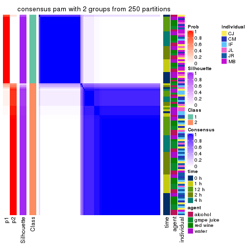</p>

</div>
<div id='tab-ATC-pam-consensus-heatmap-2'>
<pre><code class="r">consensus_heatmap(res, k = 3)
</code></pre>

<p>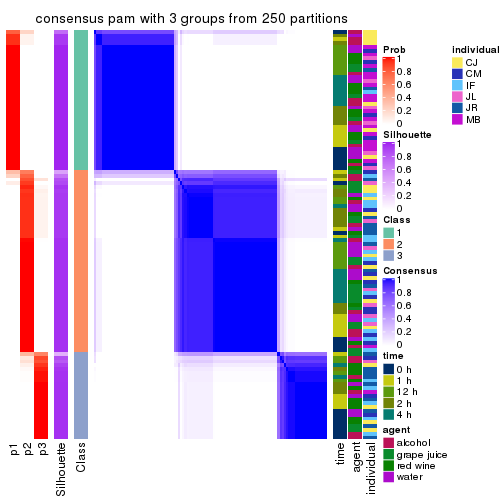</p>

</div>
<div id='tab-ATC-pam-consensus-heatmap-3'>
<pre><code class="r">consensus_heatmap(res, k = 4)
</code></pre>

<p>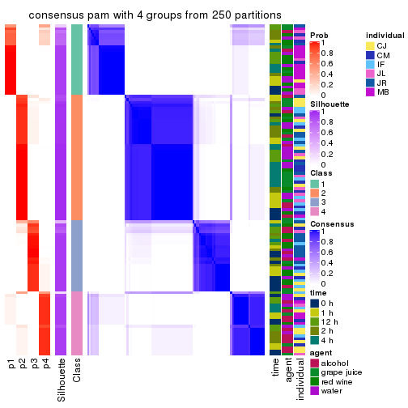</p>

</div>
<div id='tab-ATC-pam-consensus-heatmap-4'>
<pre><code class="r">consensus_heatmap(res, k = 5)
</code></pre>

<p>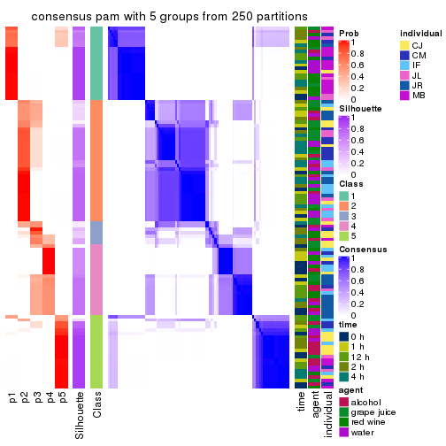</p>

</div>
<div id='tab-ATC-pam-consensus-heatmap-5'>
<pre><code class="r">consensus_heatmap(res, k = 6)
</code></pre>

<p>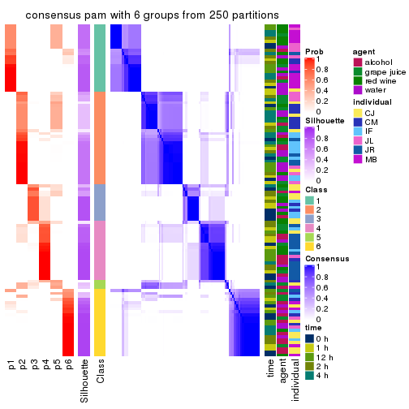</p>

</div>
</div>

Heatmaps for the membership of samples in all partitions to see how consistent they are:


<script>
$( function() {
	$( '#tabs-ATC-pam-membership-heatmap' ).tabs();
} );
</script>
<div id='tabs-ATC-pam-membership-heatmap'>
<ul>
<li><a href='#tab-ATC-pam-membership-heatmap-1'>k = 2</a></li>
<li><a href='#tab-ATC-pam-membership-heatmap-2'>k = 3</a></li>
<li><a href='#tab-ATC-pam-membership-heatmap-3'>k = 4</a></li>
<li><a href='#tab-ATC-pam-membership-heatmap-4'>k = 5</a></li>
<li><a href='#tab-ATC-pam-membership-heatmap-5'>k = 6</a></li>
</ul>
<div id='tab-ATC-pam-membership-heatmap-1'>
<pre><code class="r">membership_heatmap(res, k = 2)
</code></pre>

<p>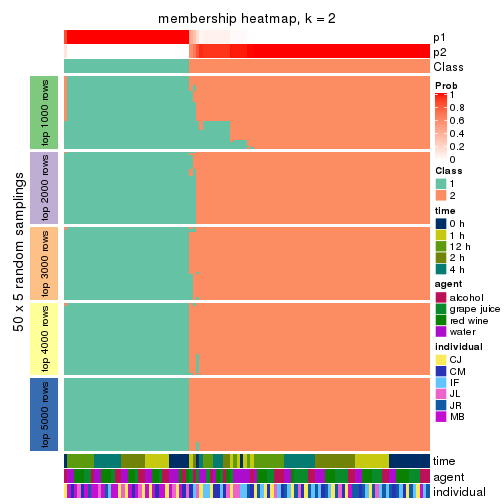</p>

</div>
<div id='tab-ATC-pam-membership-heatmap-2'>
<pre><code class="r">membership_heatmap(res, k = 3)
</code></pre>

<p>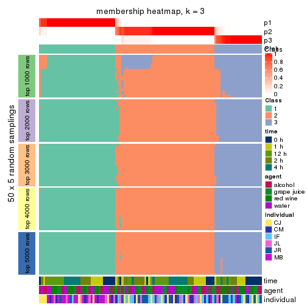</p>

</div>
<div id='tab-ATC-pam-membership-heatmap-3'>
<pre><code class="r">membership_heatmap(res, k = 4)
</code></pre>

<p>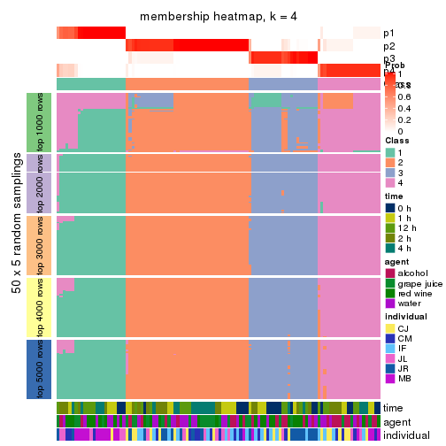</p>

</div>
<div id='tab-ATC-pam-membership-heatmap-4'>
<pre><code class="r">membership_heatmap(res, k = 5)
</code></pre>

<p>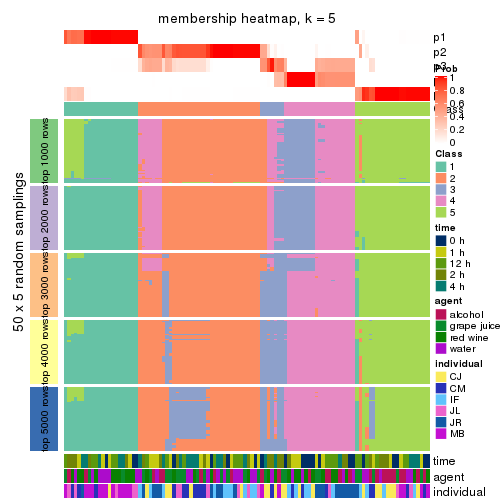</p>

</div>
<div id='tab-ATC-pam-membership-heatmap-5'>
<pre><code class="r">membership_heatmap(res, k = 6)
</code></pre>

<p>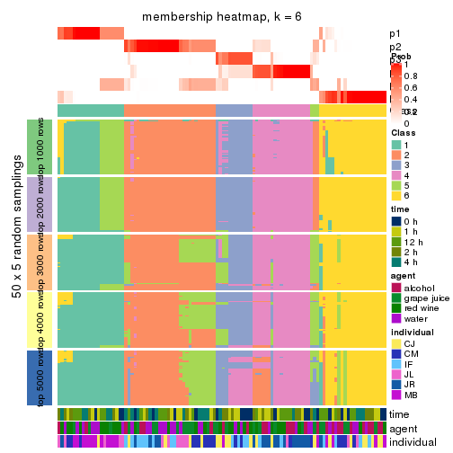</p>

</div>
</div>

As soon as we have had the classes for columns, we can look for signatures
which are significantly different between classes which can be candidate marks
for certain classes. Following are the heatmaps for signatures.


Signature heatmaps where rows are scaled:


<script>
$( function() {
	$( '#tabs-ATC-pam-get-signatures' ).tabs();
} );
</script>
<div id='tabs-ATC-pam-get-signatures'>
<ul>
<li><a href='#tab-ATC-pam-get-signatures-1'>k = 2</a></li>
<li><a href='#tab-ATC-pam-get-signatures-2'>k = 3</a></li>
<li><a href='#tab-ATC-pam-get-signatures-3'>k = 4</a></li>
<li><a href='#tab-ATC-pam-get-signatures-4'>k = 5</a></li>
<li><a href='#tab-ATC-pam-get-signatures-5'>k = 6</a></li>
</ul>
<div id='tab-ATC-pam-get-signatures-1'>
<pre><code class="r">get_signatures(res, k = 2)
</code></pre>

<p>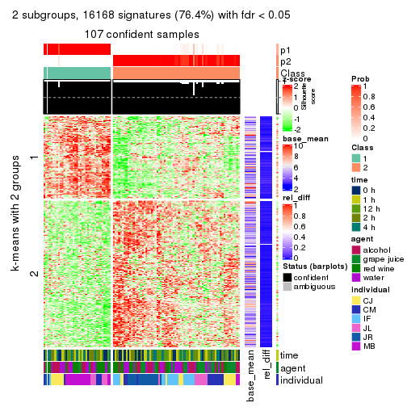</p>

</div>
<div id='tab-ATC-pam-get-signatures-2'>
<pre><code class="r">get_signatures(res, k = 3)
</code></pre>

<p>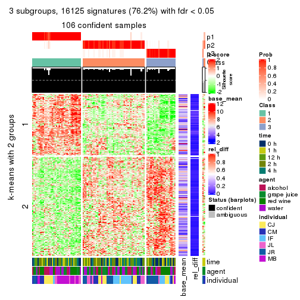</p>

</div>
<div id='tab-ATC-pam-get-signatures-3'>
<pre><code class="r">get_signatures(res, k = 4)
</code></pre>

<p>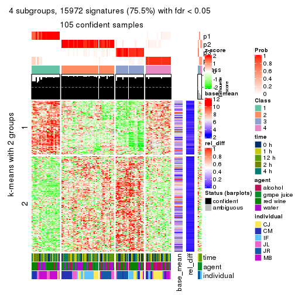</p>

</div>
<div id='tab-ATC-pam-get-signatures-4'>
<pre><code class="r">get_signatures(res, k = 5)
</code></pre>

<p>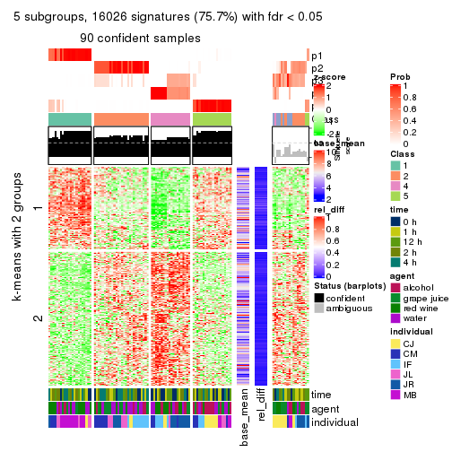</p>

</div>
<div id='tab-ATC-pam-get-signatures-5'>
<pre><code class="r">get_signatures(res, k = 6)
</code></pre>

<p>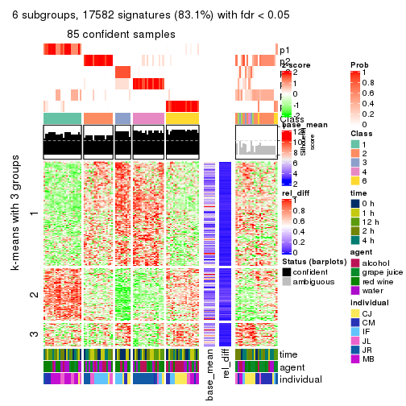</p>

</div>
</div>


Signature heatmaps where rows are not scaled:


<script>
$( function() {
	$( '#tabs-ATC-pam-get-signatures-no-scale' ).tabs();
} );
</script>
<div id='tabs-ATC-pam-get-signatures-no-scale'>
<ul>
<li><a href='#tab-ATC-pam-get-signatures-no-scale-1'>k = 2</a></li>
<li><a href='#tab-ATC-pam-get-signatures-no-scale-2'>k = 3</a></li>
<li><a href='#tab-ATC-pam-get-signatures-no-scale-3'>k = 4</a></li>
<li><a href='#tab-ATC-pam-get-signatures-no-scale-4'>k = 5</a></li>
<li><a href='#tab-ATC-pam-get-signatures-no-scale-5'>k = 6</a></li>
</ul>
<div id='tab-ATC-pam-get-signatures-no-scale-1'>
<pre><code class="r">get_signatures(res, k = 2, scale_rows = FALSE)
</code></pre>

<p>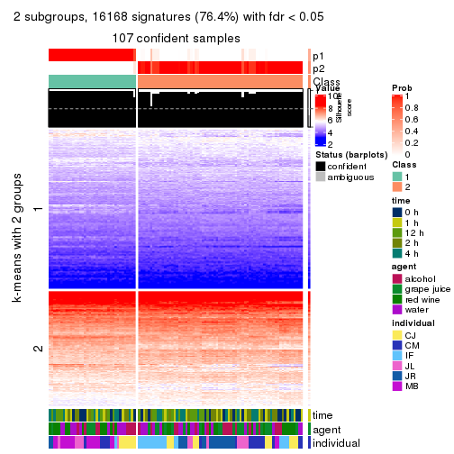</p>

</div>
<div id='tab-ATC-pam-get-signatures-no-scale-2'>
<pre><code class="r">get_signatures(res, k = 3, scale_rows = FALSE)
</code></pre>

<p>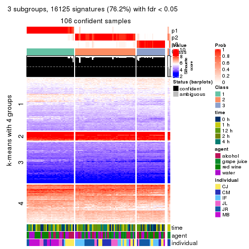</p>

</div>
<div id='tab-ATC-pam-get-signatures-no-scale-3'>
<pre><code class="r">get_signatures(res, k = 4, scale_rows = FALSE)
</code></pre>

<p>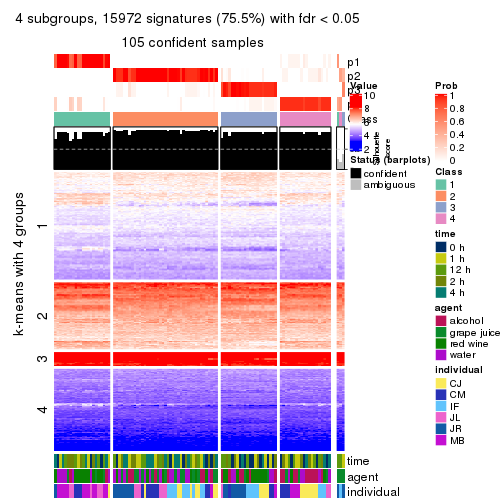</p>

</div>
<div id='tab-ATC-pam-get-signatures-no-scale-4'>
<pre><code class="r">get_signatures(res, k = 5, scale_rows = FALSE)
</code></pre>

<p>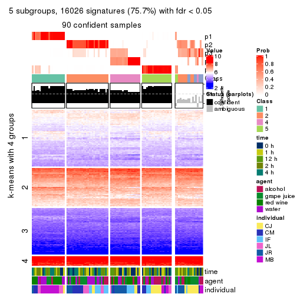</p>

</div>
<div id='tab-ATC-pam-get-signatures-no-scale-5'>
<pre><code class="r">get_signatures(res, k = 6, scale_rows = FALSE)
</code></pre>

<p>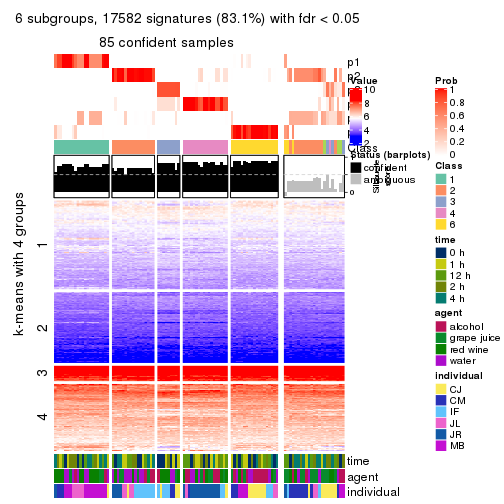</p>

</div>
</div>


Compare the overlap of signatures from different k:

```r
compare_signatures(res)
```

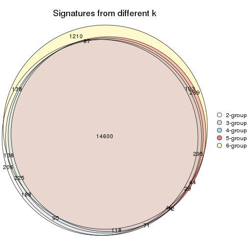

`get_signature()` returns a data frame invisibly. TO get the list of signatures, the function
call should be assigned to a variable explicitly. In following code, if `plot` argument is set
to `FALSE`, no heatmap is plotted while only the differential analysis is performed.

```r
# code only for demonstration
tb = get_signature(res, k = ..., plot = FALSE)
```

An example of the output of `tb` is:

```
#>   which_row         fdr    mean_1    mean_2 scaled_mean_1 scaled_mean_2 km
#> 1        38 0.042760348  8.373488  9.131774    -0.5533452     0.5164555  1
#> 2        40 0.018707592  7.106213  8.469186    -0.6173731     0.5762149  1
#> 3        55 0.019134737 10.221463 11.207825    -0.6159697     0.5749050  1
#> 4        59 0.006059896  5.921854  7.869574    -0.6899429     0.6439467  1
#> 5        60 0.018055526  8.928898 10.211722    -0.6204761     0.5791110  1
#> 6        98 0.009384629 15.714769 14.887706     0.6635654    -0.6193277  2
...
```

The columns in `tb` are:

1. `which_row`: row indices corresponding to the input matrix.
2. `fdr`: FDR for the differential test. 
3. `mean_x`: The mean value in group x.
4. `scaled_mean_x`: The mean value in group x after rows are scaled.
5. `km`: Row groups if k-means clustering is applied to rows.


UMAP plot which shows how samples are separated.


<script>
$( function() {
	$( '#tabs-ATC-pam-dimension-reduction' ).tabs();
} );
</script>
<div id='tabs-ATC-pam-dimension-reduction'>
<ul>
<li><a href='#tab-ATC-pam-dimension-reduction-1'>k = 2</a></li>
<li><a href='#tab-ATC-pam-dimension-reduction-2'>k = 3</a></li>
<li><a href='#tab-ATC-pam-dimension-reduction-3'>k = 4</a></li>
<li><a href='#tab-ATC-pam-dimension-reduction-4'>k = 5</a></li>
<li><a href='#tab-ATC-pam-dimension-reduction-5'>k = 6</a></li>
</ul>
<div id='tab-ATC-pam-dimension-reduction-1'>
<pre><code class="r">dimension_reduction(res, k = 2, method = &quot;UMAP&quot;)
</code></pre>

<p>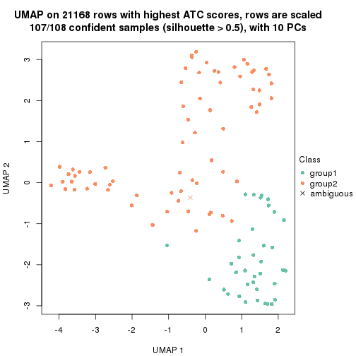</p>

</div>
<div id='tab-ATC-pam-dimension-reduction-2'>
<pre><code class="r">dimension_reduction(res, k = 3, method = &quot;UMAP&quot;)
</code></pre>

<p>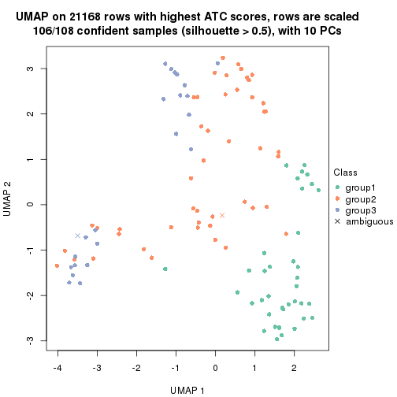</p>

</div>
<div id='tab-ATC-pam-dimension-reduction-3'>
<pre><code class="r">dimension_reduction(res, k = 4, method = &quot;UMAP&quot;)
</code></pre>

<p>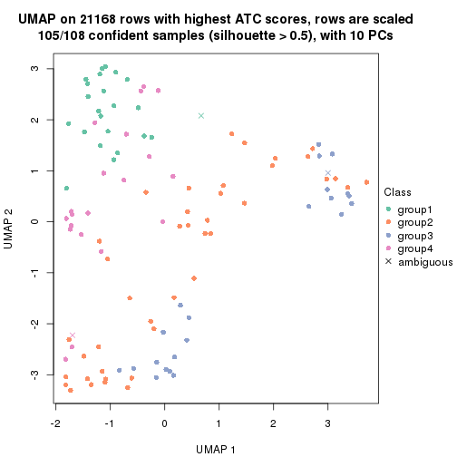</p>

</div>
<div id='tab-ATC-pam-dimension-reduction-4'>
<pre><code class="r">dimension_reduction(res, k = 5, method = &quot;UMAP&quot;)
</code></pre>

<p>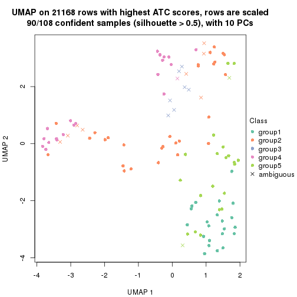</p>

</div>
<div id='tab-ATC-pam-dimension-reduction-5'>
<pre><code class="r">dimension_reduction(res, k = 6, method = &quot;UMAP&quot;)
</code></pre>

<p>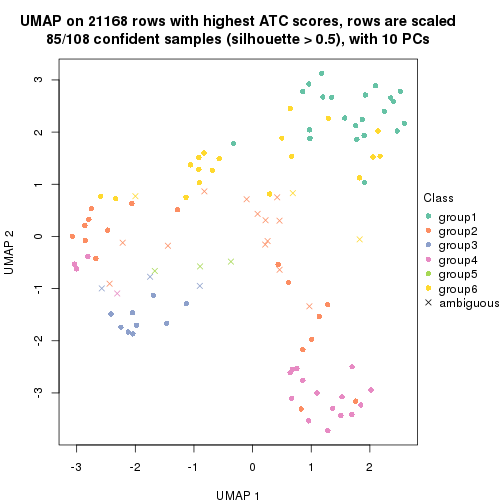</p>

</div>
</div>


Following heatmap shows how subgroups are split when increasing `k`:

```r
collect_classes(res)
```

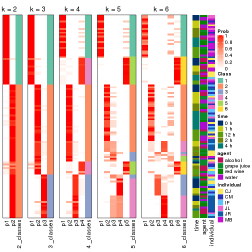


Test correlation between subgroups and known annotations. If the known
annotation is numeric, one-way ANOVA test is applied, and if the known
annotation is discrete, chi-squared contingency table test is applied.

```r
test_to_known_factors(res)
```

```
#>           n time(p) agent(p) individual(p) k
#> ATC:pam 107   0.993  0.33891      8.77e-07 2
#> ATC:pam 106   0.618  0.02119      1.33e-05 3
#> ATC:pam 105   0.782  0.00154      1.10e-05 4
#> ATC:pam  90   0.618  0.00552      1.07e-07 5
#> ATC:pam  85   0.592  0.06387      1.33e-10 6
```


If matrix rows can be associated to genes, consider to use `GO_Enrichment(res,
...)` to perform function enrichment for the signature genes.


 

---------------------------------------------------


### ATC:mclust**


The object with results only for a single top-value method and a single partition method 
can be extracted as:

```r
res = res_list["ATC", "mclust"]
# you can also extract it by
# res = res_list["ATC:mclust"]
```

A summary of `res` and all the functions that can be applied to it:

```r
res
```

```
#> A 'ConsensusPartition' object with k = 2, 3, 4, 5, 6.
#>   On a matrix with 21168 rows and 108 columns.
#>   Top rows (1000, 2000, 3000, 4000, 5000) are extracted by 'ATC' method.
#>   Subgroups are detected by 'mclust' method.
#>   Performed in total 1250 partitions by row resampling.
#>   Best k for subgroups seems to be 2.
#> 
#> Following methods can be applied to this 'ConsensusPartition' object:
#>  [1] "cola_report"             "collect_classes"         "collect_plots"          
#>  [4] "collect_stats"           "colnames"                "compare_signatures"     
#>  [7] "consensus_heatmap"       "dimension_reduction"     "functional_enrichment"  
#> [10] "get_anno_col"            "get_anno"                "get_classes"            
#> [13] "get_consensus"           "get_matrix"              "get_membership"         
#> [16] "get_param"               "get_signatures"          "get_stats"              
#> [19] "is_best_k"               "is_stable_k"             "membership_heatmap"     
#> [22] "ncol"                    "nrow"                    "plot_ecdf"              
#> [25] "rownames"                "select_partition_number" "show"                   
#> [28] "suggest_best_k"          "test_to_known_factors"
```

`collect_plots()` function collects all the plots made from `res` for all `k` (number of partitions)
into one single page to provide an easy and fast comparison between different `k`.

```r
collect_plots(res)
```

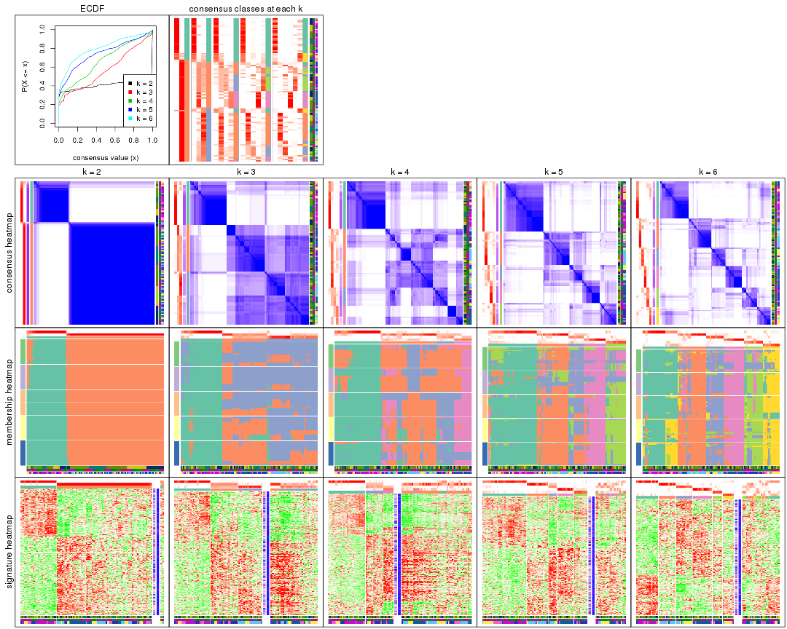

The plots are:

- The first row: a plot of the ECDF (Empirical cumulative distribution
  function) curves of the consensus matrix for each `k` and the heatmap of
  predicted classes for each `k`.
- The second row: heatmaps of the consensus matrix for each `k`.
- The third row: heatmaps of the membership matrix for each `k`.
- The fouth row: heatmaps of the signatures for each `k`.

All the plots in panels can be made by individual functions and they are
plotted later in this section.

`select_partition_number()` produces several plots showing different
statistics for choosing "optimized" `k`. There are following statistics:

- ECDF curves of the consensus matrix for each `k`;
- 1-PAC. [The PAC
  score](https://en.wikipedia.org/wiki/Consensus_clustering#Over-interpretation_potential_of_consensus_clustering)
  measures the proportion of the ambiguous subgrouping.
- Mean silhouette score.
- Concordance. The mean probability of fiting the consensus class ids in all
  partitions.
- Area increased. Denote $A_k$ as the area under the ECDF curve for current
  `k`, the area increased is defined as $A_k - A_{k-1}$.
- Rand index. The percent of pairs of samples that are both in a same cluster
  or both are not in a same cluster in the partition of k and k-1.
- Jaccard index. The ratio of pairs of samples are both in a same cluster in
  the partition of k and k-1 and the pairs of samples are both in a same
  cluster in the partition k or k-1.

The detailed explanations of these statistics can be found in [the cola
vignette](http://bioconductor.org/packages/devel/bioc/vignettes/cola/inst/doc/cola.html#toc_13).

Generally speaking, lower PAC score, higher mean silhouette score or higher
concordance corresponds to better partition. Rand index and Jaccard index
measure how similar the current partition is compared to partition with `k-1`.
If they are too similar, we won't accept `k` is better than `k-1`.

```r
select_partition_number(res)
```

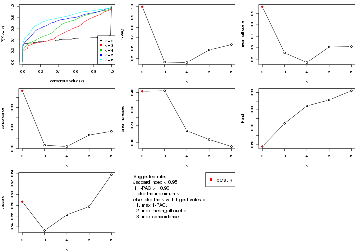

The numeric values for all these statistics can be obtained by `get_stats()`.

```r
get_stats(res)
```

```
#>   k 1-PAC mean_silhouette concordance area_increased  Rand Jaccard
#> 2 2 1.000           0.958       0.983         0.4064 0.587   0.587
#> 3 3 0.464           0.555       0.716         0.4099 0.721   0.533
#> 4 4 0.460           0.471       0.709         0.1691 0.823   0.563
#> 5 5 0.581           0.606       0.765         0.1166 0.857   0.578
#> 6 6 0.633           0.610       0.784         0.0746 0.911   0.637
```

`suggest_best_k()` suggests the best $k$ based on these statistics. The rules are as follows:

- All $k$ with Jaccard index larger than 0.95 are removed because the increase of
  the partition number does not provides enough extra information. If all $k$ are removed,
  the best $k$ is assigned by `NA`.
- For $k$ with 1-PAC larger than 0.9, the maximal $k$ is taken as the "best k". Other $k$ is called "optional k".
- If it does not fit the second rule. The $k$ with the highest vote of highest
  1-PAC, mean silhouette and concordance is taken as the "best k".

```r
suggest_best_k(res)
```

```
#> [1] 2
```


Following shows the table of the partitions (You need to click the **show/hide
code output** link to see it). The membership matrix (columns with name `p*`)
is inferred by
[`clue::cl_consensus()`](https://www.rdocumentation.org/link/cl_consensus?package=clue)
function with the `SE` method. Basically the value in the membership matrix
represents the probability to belong to a certain group. The finall class
label for an item is determined with the group with highest probability it
belongs to.

In `get_classes()` function, the entropy is calculated from the membership
matrix and the silhouette score is calculated from the consensus matrix.


<script>
$( function() {
	$( '#tabs-ATC-mclust-get-classes' ).tabs();
} );
</script>
<div id='tabs-ATC-mclust-get-classes'>
<ul>
<li><a href='#tab-ATC-mclust-get-classes-1'>k = 2</a></li>
<li><a href='#tab-ATC-mclust-get-classes-2'>k = 3</a></li>
<li><a href='#tab-ATC-mclust-get-classes-3'>k = 4</a></li>
<li><a href='#tab-ATC-mclust-get-classes-4'>k = 5</a></li>
<li><a href='#tab-ATC-mclust-get-classes-5'>k = 6</a></li>
</ul>

<div id='tab-ATC-mclust-get-classes-1'>
<p><a id='tab-ATC-mclust-get-classes-1-a' style='color:#0366d6' href='#'>show/hide code output</a></p>
<pre><code class="r">cbind(get_classes(res, k = 2), get_membership(res, k = 2))
</code></pre>

<pre><code>#&gt;          class entropy silhouette    p1    p2
#&gt; GSM87863     2   0.000      0.992 0.000 1.000
#&gt; GSM87887     2   0.204      0.959 0.032 0.968
#&gt; GSM87896     2   0.000      0.992 0.000 1.000
#&gt; GSM87934     2   0.000      0.992 0.000 1.000
#&gt; GSM87943     2   0.000      0.992 0.000 1.000
#&gt; GSM87853     2   0.000      0.992 0.000 1.000
#&gt; GSM87906     2   0.000      0.992 0.000 1.000
#&gt; GSM87920     2   0.358      0.918 0.068 0.932
#&gt; GSM87924     2   0.000      0.992 0.000 1.000
#&gt; GSM87858     2   0.000      0.992 0.000 1.000
#&gt; GSM87882     2   0.000      0.992 0.000 1.000
#&gt; GSM87891     2   0.000      0.992 0.000 1.000
#&gt; GSM87917     1   0.000      0.955 1.000 0.000
#&gt; GSM87929     2   0.000      0.992 0.000 1.000
#&gt; GSM87948     1   0.000      0.955 1.000 0.000
#&gt; GSM87868     1   0.000      0.955 1.000 0.000
#&gt; GSM87873     2   0.000      0.992 0.000 1.000
#&gt; GSM87901     2   0.000      0.992 0.000 1.000
#&gt; GSM87910     1   0.000      0.955 1.000 0.000
#&gt; GSM87938     2   0.000      0.992 0.000 1.000
#&gt; GSM87953     1   0.000      0.955 1.000 0.000
#&gt; GSM87864     1   0.975      0.363 0.592 0.408
#&gt; GSM87888     2   0.000      0.992 0.000 1.000
#&gt; GSM87897     2   0.000      0.992 0.000 1.000
#&gt; GSM87935     2   0.000      0.992 0.000 1.000
#&gt; GSM87944     1   0.000      0.955 1.000 0.000
#&gt; GSM87854     2   0.000      0.992 0.000 1.000
#&gt; GSM87878     2   0.000      0.992 0.000 1.000
#&gt; GSM87907     2   0.000      0.992 0.000 1.000
#&gt; GSM87921     2   0.000      0.992 0.000 1.000
#&gt; GSM87925     2   0.000      0.992 0.000 1.000
#&gt; GSM87957     1   0.653      0.801 0.832 0.168
#&gt; GSM87859     2   0.000      0.992 0.000 1.000
#&gt; GSM87883     1   0.000      0.955 1.000 0.000
#&gt; GSM87892     2   0.000      0.992 0.000 1.000
#&gt; GSM87930     2   0.000      0.992 0.000 1.000
#&gt; GSM87949     1   0.000      0.955 1.000 0.000
#&gt; GSM87869     1   0.000      0.955 1.000 0.000
#&gt; GSM87874     2   0.000      0.992 0.000 1.000
#&gt; GSM87902     2   0.000      0.992 0.000 1.000
#&gt; GSM87911     2   0.000      0.992 0.000 1.000
#&gt; GSM87939     2   0.000      0.992 0.000 1.000
#&gt; GSM87954     1   0.000      0.955 1.000 0.000
#&gt; GSM87865     2   0.000      0.992 0.000 1.000
#&gt; GSM87889     2   0.000      0.992 0.000 1.000
#&gt; GSM87898     2   0.000      0.992 0.000 1.000
#&gt; GSM87915     1   0.000      0.955 1.000 0.000
#&gt; GSM87936     2   0.000      0.992 0.000 1.000
#&gt; GSM87945     2   0.000      0.992 0.000 1.000
#&gt; GSM87855     2   0.000      0.992 0.000 1.000
#&gt; GSM87879     2   0.000      0.992 0.000 1.000
#&gt; GSM87922     2   0.000      0.992 0.000 1.000
#&gt; GSM87926     2   0.000      0.992 0.000 1.000
#&gt; GSM87958     1   0.000      0.955 1.000 0.000
#&gt; GSM87860     2   0.000      0.992 0.000 1.000
#&gt; GSM87884     1   0.000      0.955 1.000 0.000
#&gt; GSM87893     2   0.000      0.992 0.000 1.000
#&gt; GSM87918     2   0.000      0.992 0.000 1.000
#&gt; GSM87931     2   0.000      0.992 0.000 1.000
#&gt; GSM87950     1   0.000      0.955 1.000 0.000
#&gt; GSM87870     1   0.949      0.463 0.632 0.368
#&gt; GSM87875     2   0.000      0.992 0.000 1.000
#&gt; GSM87903     2   0.000      0.992 0.000 1.000
#&gt; GSM87912     1   0.000      0.955 1.000 0.000
#&gt; GSM87940     2   0.000      0.992 0.000 1.000
#&gt; GSM87866     1   0.518      0.858 0.884 0.116
#&gt; GSM87899     2   0.000      0.992 0.000 1.000
#&gt; GSM87937     2   0.000      0.992 0.000 1.000
#&gt; GSM87946     1   0.000      0.955 1.000 0.000
#&gt; GSM87856     2   0.000      0.992 0.000 1.000
#&gt; GSM87880     2   0.000      0.992 0.000 1.000
#&gt; GSM87908     2   0.000      0.992 0.000 1.000
#&gt; GSM87923     2   0.000      0.992 0.000 1.000
#&gt; GSM87927     2   0.000      0.992 0.000 1.000
#&gt; GSM87959     1   0.000      0.955 1.000 0.000
#&gt; GSM87861     2   0.000      0.992 0.000 1.000
#&gt; GSM87885     2   0.000      0.992 0.000 1.000
#&gt; GSM87894     2   0.991      0.121 0.444 0.556
#&gt; GSM87932     2   0.000      0.992 0.000 1.000
#&gt; GSM87951     1   0.000      0.955 1.000 0.000
#&gt; GSM87871     2   0.000      0.992 0.000 1.000
#&gt; GSM87876     2   0.000      0.992 0.000 1.000
#&gt; GSM87904     2   0.000      0.992 0.000 1.000
#&gt; GSM87913     1   0.795      0.704 0.760 0.240
#&gt; GSM87941     2   0.000      0.992 0.000 1.000
#&gt; GSM87955     1   0.000      0.955 1.000 0.000
#&gt; GSM87867     2   0.000      0.992 0.000 1.000
#&gt; GSM87890     2   0.000      0.992 0.000 1.000
#&gt; GSM87900     2   0.000      0.992 0.000 1.000
#&gt; GSM87916     2   0.000      0.992 0.000 1.000
#&gt; GSM87947     1   0.141      0.941 0.980 0.020
#&gt; GSM87857     2   0.000      0.992 0.000 1.000
#&gt; GSM87881     2   0.000      0.992 0.000 1.000
#&gt; GSM87909     2   0.000      0.992 0.000 1.000
#&gt; GSM87928     2   0.000      0.992 0.000 1.000
#&gt; GSM87960     1   0.000      0.955 1.000 0.000
#&gt; GSM87862     2   0.000      0.992 0.000 1.000
#&gt; GSM87886     1   0.000      0.955 1.000 0.000
#&gt; GSM87895     2   0.000      0.992 0.000 1.000
#&gt; GSM87919     1   0.000      0.955 1.000 0.000
#&gt; GSM87933     2   0.000      0.992 0.000 1.000
#&gt; GSM87952     1   0.000      0.955 1.000 0.000
#&gt; GSM87872     2   0.000      0.992 0.000 1.000
#&gt; GSM87877     1   0.118      0.944 0.984 0.016
#&gt; GSM87905     2   0.000      0.992 0.000 1.000
#&gt; GSM87914     2   0.000      0.992 0.000 1.000
#&gt; GSM87942     2   0.000      0.992 0.000 1.000
#&gt; GSM87956     1   0.000      0.955 1.000 0.000
</code></pre>

<script>
$('#tab-ATC-mclust-get-classes-1-a').parent().next().next().hide();
$('#tab-ATC-mclust-get-classes-1-a').click(function(){
  $('#tab-ATC-mclust-get-classes-1-a').parent().next().next().toggle();
  return(false);
});
</script>
</div>

<div id='tab-ATC-mclust-get-classes-2'>
<p><a id='tab-ATC-mclust-get-classes-2-a' style='color:#0366d6' href='#'>show/hide code output</a></p>
<pre><code class="r">cbind(get_classes(res, k = 3), get_membership(res, k = 3))
</code></pre>

<pre><code>#&gt;          class entropy silhouette    p1    p2    p3
#&gt; GSM87863     1  0.9515    -0.2853 0.424 0.188 0.388
#&gt; GSM87887     2  0.8230     0.5831 0.088 0.564 0.348
#&gt; GSM87896     3  0.5621     0.4610 0.000 0.308 0.692
#&gt; GSM87934     2  0.2066     0.4020 0.000 0.940 0.060
#&gt; GSM87943     2  0.6235     0.5240 0.000 0.564 0.436
#&gt; GSM87853     2  0.6252     0.5053 0.000 0.556 0.444
#&gt; GSM87906     3  0.1964     0.5658 0.000 0.056 0.944
#&gt; GSM87920     1  0.8362     0.0360 0.528 0.088 0.384
#&gt; GSM87924     2  0.6204     0.4873 0.000 0.576 0.424
#&gt; GSM87858     3  0.5621     0.4610 0.000 0.308 0.692
#&gt; GSM87882     2  0.7676     0.6172 0.056 0.584 0.360
#&gt; GSM87891     3  0.5650     0.4604 0.000 0.312 0.688
#&gt; GSM87917     1  0.0000     0.8750 1.000 0.000 0.000
#&gt; GSM87929     2  0.6309     0.2108 0.000 0.504 0.496
#&gt; GSM87948     1  0.0000     0.8750 1.000 0.000 0.000
#&gt; GSM87868     1  0.1031     0.8642 0.976 0.000 0.024
#&gt; GSM87873     2  0.6299     0.4920 0.000 0.524 0.476
#&gt; GSM87901     3  0.1860     0.5669 0.000 0.052 0.948
#&gt; GSM87910     1  0.0000     0.8750 1.000 0.000 0.000
#&gt; GSM87938     2  0.2066     0.4020 0.000 0.940 0.060
#&gt; GSM87953     1  0.0000     0.8750 1.000 0.000 0.000
#&gt; GSM87864     1  0.7222     0.2026 0.580 0.032 0.388
#&gt; GSM87888     2  0.7676     0.6172 0.056 0.584 0.360
#&gt; GSM87897     3  0.0000     0.5623 0.000 0.000 1.000
#&gt; GSM87935     3  0.5988     0.4164 0.000 0.368 0.632
#&gt; GSM87944     1  0.5012     0.7081 0.788 0.204 0.008
#&gt; GSM87854     3  0.5988     0.3373 0.000 0.368 0.632
#&gt; GSM87878     2  0.8489     0.5278 0.092 0.496 0.412
#&gt; GSM87907     3  0.2448     0.5890 0.000 0.076 0.924
#&gt; GSM87921     3  0.5882     0.4592 0.000 0.348 0.652
#&gt; GSM87925     2  0.6140     0.5202 0.000 0.596 0.404
#&gt; GSM87957     1  0.4353     0.7423 0.836 0.008 0.156
#&gt; GSM87859     3  0.5621     0.4610 0.000 0.308 0.692
#&gt; GSM87883     1  0.4861     0.7210 0.800 0.192 0.008
#&gt; GSM87892     3  0.5560     0.4750 0.000 0.300 0.700
#&gt; GSM87930     2  0.6168     0.5145 0.000 0.588 0.412
#&gt; GSM87949     1  0.0000     0.8750 1.000 0.000 0.000
#&gt; GSM87869     1  0.1031     0.8642 0.976 0.000 0.024
#&gt; GSM87874     2  0.6192     0.5628 0.000 0.580 0.420
#&gt; GSM87902     3  0.1964     0.5658 0.000 0.056 0.944
#&gt; GSM87911     2  0.7784     0.5702 0.056 0.556 0.388
#&gt; GSM87939     2  0.2066     0.4020 0.000 0.940 0.060
#&gt; GSM87954     1  0.0000     0.8750 1.000 0.000 0.000
#&gt; GSM87865     3  0.7571     0.2534 0.356 0.052 0.592
#&gt; GSM87889     2  0.7676     0.6172 0.056 0.584 0.360
#&gt; GSM87898     3  0.1753     0.5673 0.000 0.048 0.952
#&gt; GSM87915     1  0.0000     0.8750 1.000 0.000 0.000
#&gt; GSM87936     3  0.6126     0.3194 0.000 0.400 0.600
#&gt; GSM87945     2  0.6235     0.5240 0.000 0.564 0.436
#&gt; GSM87855     2  0.6244     0.5150 0.000 0.560 0.440
#&gt; GSM87879     2  0.7676     0.6172 0.056 0.584 0.360
#&gt; GSM87922     2  0.7676     0.6172 0.056 0.584 0.360
#&gt; GSM87926     2  0.2066     0.4020 0.000 0.940 0.060
#&gt; GSM87958     1  0.0000     0.8750 1.000 0.000 0.000
#&gt; GSM87860     3  0.5098     0.5325 0.000 0.248 0.752
#&gt; GSM87884     1  0.6082     0.5673 0.692 0.296 0.012
#&gt; GSM87893     3  0.5621     0.4610 0.000 0.308 0.692
#&gt; GSM87918     3  0.5905     0.4403 0.000 0.352 0.648
#&gt; GSM87931     2  0.2066     0.4020 0.000 0.940 0.060
#&gt; GSM87950     1  0.0000     0.8750 1.000 0.000 0.000
#&gt; GSM87870     1  0.6387     0.4979 0.680 0.020 0.300
#&gt; GSM87875     2  0.7676     0.6172 0.056 0.584 0.360
#&gt; GSM87903     3  0.1860     0.5669 0.000 0.052 0.948
#&gt; GSM87912     1  0.0000     0.8750 1.000 0.000 0.000
#&gt; GSM87940     3  0.6180     0.2585 0.000 0.416 0.584
#&gt; GSM87866     1  0.5461     0.6129 0.748 0.008 0.244
#&gt; GSM87899     3  0.1860     0.5873 0.000 0.052 0.948
#&gt; GSM87937     3  0.6204     0.2219 0.000 0.424 0.576
#&gt; GSM87946     1  0.0000     0.8750 1.000 0.000 0.000
#&gt; GSM87856     3  0.6286    -0.1870 0.000 0.464 0.536
#&gt; GSM87880     2  0.7676     0.6172 0.056 0.584 0.360
#&gt; GSM87908     3  0.1289     0.5806 0.000 0.032 0.968
#&gt; GSM87923     2  0.7676     0.6172 0.056 0.584 0.360
#&gt; GSM87927     3  0.5760     0.4888 0.000 0.328 0.672
#&gt; GSM87959     1  0.0000     0.8750 1.000 0.000 0.000
#&gt; GSM87861     3  0.5621     0.4610 0.000 0.308 0.692
#&gt; GSM87885     2  0.7741     0.6079 0.056 0.568 0.376
#&gt; GSM87894     3  0.7286     0.0352 0.464 0.028 0.508
#&gt; GSM87932     3  0.5497     0.5256 0.000 0.292 0.708
#&gt; GSM87951     1  0.0000     0.8750 1.000 0.000 0.000
#&gt; GSM87871     3  0.7022     0.4703 0.056 0.260 0.684
#&gt; GSM87876     2  0.7693     0.6156 0.056 0.580 0.364
#&gt; GSM87904     3  0.3816     0.5798 0.000 0.148 0.852
#&gt; GSM87913     1  0.6388     0.5107 0.692 0.024 0.284
#&gt; GSM87941     3  0.6260     0.0938 0.000 0.448 0.552
#&gt; GSM87955     1  0.0000     0.8750 1.000 0.000 0.000
#&gt; GSM87867     3  0.8198     0.3266 0.100 0.304 0.596
#&gt; GSM87890     2  0.2066     0.4020 0.000 0.940 0.060
#&gt; GSM87900     3  0.0000     0.5623 0.000 0.000 1.000
#&gt; GSM87916     2  0.2066     0.4020 0.000 0.940 0.060
#&gt; GSM87947     1  0.3237     0.8262 0.912 0.032 0.056
#&gt; GSM87857     3  0.5291     0.5154 0.000 0.268 0.732
#&gt; GSM87881     2  0.7726     0.6111 0.056 0.572 0.372
#&gt; GSM87909     3  0.1964     0.5658 0.000 0.056 0.944
#&gt; GSM87928     2  0.7814     0.4206 0.052 0.512 0.436
#&gt; GSM87960     1  0.0000     0.8750 1.000 0.000 0.000
#&gt; GSM87862     3  0.0237     0.5652 0.000 0.004 0.996
#&gt; GSM87886     1  0.0000     0.8750 1.000 0.000 0.000
#&gt; GSM87895     3  0.1964     0.5881 0.000 0.056 0.944
#&gt; GSM87919     1  0.0000     0.8750 1.000 0.000 0.000
#&gt; GSM87933     2  0.2066     0.4020 0.000 0.940 0.060
#&gt; GSM87952     1  0.0000     0.8750 1.000 0.000 0.000
#&gt; GSM87872     3  0.3941     0.5822 0.000 0.156 0.844
#&gt; GSM87877     1  0.0592     0.8696 0.988 0.000 0.012
#&gt; GSM87905     3  0.1964     0.5658 0.000 0.056 0.944
#&gt; GSM87914     2  0.6309     0.2107 0.000 0.504 0.496
#&gt; GSM87942     2  0.6168     0.5145 0.000 0.588 0.412
#&gt; GSM87956     1  0.0000     0.8750 1.000 0.000 0.000
</code></pre>

<script>
$('#tab-ATC-mclust-get-classes-2-a').parent().next().next().hide();
$('#tab-ATC-mclust-get-classes-2-a').click(function(){
  $('#tab-ATC-mclust-get-classes-2-a').parent().next().next().toggle();
  return(false);
});
</script>
</div>

<div id='tab-ATC-mclust-get-classes-3'>
<p><a id='tab-ATC-mclust-get-classes-3-a' style='color:#0366d6' href='#'>show/hide code output</a></p>
<pre><code class="r">cbind(get_classes(res, k = 4), get_membership(res, k = 4))
</code></pre>

<pre><code>#&gt;          class entropy silhouette    p1    p2    p3    p4
#&gt; GSM87863     1  0.5323     0.2856 0.592 0.396 0.008 0.004
#&gt; GSM87887     3  0.9145     0.5791 0.268 0.332 0.332 0.068
#&gt; GSM87896     2  0.6896     0.1225 0.000 0.568 0.140 0.292
#&gt; GSM87934     4  0.4605     0.6910 0.000 0.000 0.336 0.664
#&gt; GSM87943     3  0.8172     0.6962 0.100 0.352 0.480 0.068
#&gt; GSM87853     3  0.6876     0.7500 0.020 0.352 0.560 0.068
#&gt; GSM87906     2  0.4720     0.4170 0.000 0.672 0.004 0.324
#&gt; GSM87920     1  0.5198     0.3590 0.628 0.360 0.008 0.004
#&gt; GSM87924     4  0.5921     0.1143 0.000 0.448 0.036 0.516
#&gt; GSM87858     2  0.6251     0.2580 0.000 0.664 0.140 0.196
#&gt; GSM87882     3  0.8659     0.6959 0.036 0.344 0.372 0.248
#&gt; GSM87891     2  0.6975     0.1121 0.000 0.560 0.148 0.292
#&gt; GSM87917     1  0.0000     0.8401 1.000 0.000 0.000 0.000
#&gt; GSM87929     4  0.5217     0.2653 0.000 0.380 0.012 0.608
#&gt; GSM87948     1  0.0592     0.8342 0.984 0.016 0.000 0.000
#&gt; GSM87868     1  0.1022     0.8300 0.968 0.032 0.000 0.000
#&gt; GSM87873     2  0.7623    -0.2399 0.000 0.416 0.204 0.380
#&gt; GSM87901     2  0.4917     0.4073 0.000 0.656 0.008 0.336
#&gt; GSM87910     1  0.0000     0.8401 1.000 0.000 0.000 0.000
#&gt; GSM87938     4  0.4605     0.6910 0.000 0.000 0.336 0.664
#&gt; GSM87953     1  0.0000     0.8401 1.000 0.000 0.000 0.000
#&gt; GSM87864     1  0.5007     0.4132 0.636 0.356 0.008 0.000
#&gt; GSM87888     3  0.9380     0.6902 0.152 0.344 0.360 0.144
#&gt; GSM87897     2  0.4917     0.4073 0.000 0.656 0.008 0.336
#&gt; GSM87935     2  0.4327     0.3241 0.000 0.768 0.016 0.216
#&gt; GSM87944     1  0.3681     0.7561 0.856 0.104 0.036 0.004
#&gt; GSM87854     2  0.9063    -0.3992 0.312 0.380 0.240 0.068
#&gt; GSM87878     2  0.6985    -0.0109 0.228 0.644 0.048 0.080
#&gt; GSM87907     2  0.0895     0.4728 0.000 0.976 0.020 0.004
#&gt; GSM87921     2  0.1576     0.4381 0.000 0.948 0.004 0.048
#&gt; GSM87925     4  0.5057     0.3055 0.000 0.340 0.012 0.648
#&gt; GSM87957     1  0.3528     0.7132 0.808 0.192 0.000 0.000
#&gt; GSM87859     2  0.5212     0.2207 0.000 0.740 0.192 0.068
#&gt; GSM87883     1  0.3221     0.7816 0.888 0.068 0.036 0.008
#&gt; GSM87892     2  0.5092     0.3634 0.000 0.764 0.140 0.096
#&gt; GSM87930     4  0.5204     0.2710 0.000 0.376 0.012 0.612
#&gt; GSM87949     1  0.0000     0.8401 1.000 0.000 0.000 0.000
#&gt; GSM87869     1  0.0921     0.8304 0.972 0.028 0.000 0.000
#&gt; GSM87874     3  0.6219     0.7468 0.000 0.344 0.588 0.068
#&gt; GSM87902     2  0.4917     0.4073 0.000 0.656 0.008 0.336
#&gt; GSM87911     2  0.9062    -0.5898 0.248 0.388 0.296 0.068
#&gt; GSM87939     4  0.4605     0.6910 0.000 0.000 0.336 0.664
#&gt; GSM87954     1  0.0000     0.8401 1.000 0.000 0.000 0.000
#&gt; GSM87865     1  0.5323     0.3021 0.592 0.396 0.008 0.004
#&gt; GSM87889     3  0.9342     0.6723 0.176 0.344 0.360 0.120
#&gt; GSM87898     2  0.4917     0.4073 0.000 0.656 0.008 0.336
#&gt; GSM87915     1  0.0000     0.8401 1.000 0.000 0.000 0.000
#&gt; GSM87936     2  0.4546     0.2651 0.000 0.732 0.012 0.256
#&gt; GSM87945     3  0.6234     0.7458 0.000 0.348 0.584 0.068
#&gt; GSM87855     3  0.7299     0.7458 0.040 0.352 0.540 0.068
#&gt; GSM87879     3  0.7885     0.7710 0.036 0.360 0.484 0.120
#&gt; GSM87922     3  0.8659     0.6959 0.036 0.344 0.372 0.248
#&gt; GSM87926     4  0.4605     0.6910 0.000 0.000 0.336 0.664
#&gt; GSM87958     1  0.0000     0.8401 1.000 0.000 0.000 0.000
#&gt; GSM87860     2  0.1174     0.4756 0.000 0.968 0.020 0.012
#&gt; GSM87884     1  0.4764     0.7099 0.820 0.080 0.036 0.064
#&gt; GSM87893     2  0.5902     0.3014 0.000 0.700 0.140 0.160
#&gt; GSM87918     2  0.3662     0.3816 0.104 0.860 0.012 0.024
#&gt; GSM87931     4  0.4605     0.6910 0.000 0.000 0.336 0.664
#&gt; GSM87950     1  0.0000     0.8401 1.000 0.000 0.000 0.000
#&gt; GSM87870     1  0.4876     0.5060 0.672 0.320 0.004 0.004
#&gt; GSM87875     3  0.7470     0.7715 0.024 0.344 0.524 0.108
#&gt; GSM87903     2  0.4917     0.4073 0.000 0.656 0.008 0.336
#&gt; GSM87912     1  0.0000     0.8401 1.000 0.000 0.000 0.000
#&gt; GSM87940     4  0.5204     0.2765 0.000 0.376 0.012 0.612
#&gt; GSM87866     1  0.3908     0.6906 0.784 0.212 0.004 0.000
#&gt; GSM87899     2  0.1042     0.4743 0.000 0.972 0.020 0.008
#&gt; GSM87937     2  0.5383    -0.0976 0.000 0.536 0.012 0.452
#&gt; GSM87946     1  0.0000     0.8401 1.000 0.000 0.000 0.000
#&gt; GSM87856     3  0.9026     0.5214 0.220 0.352 0.360 0.068
#&gt; GSM87880     2  0.9224    -0.7004 0.160 0.364 0.360 0.116
#&gt; GSM87908     2  0.0707     0.4774 0.000 0.980 0.000 0.020
#&gt; GSM87923     3  0.8073     0.7681 0.036 0.344 0.476 0.144
#&gt; GSM87927     2  0.1174     0.4619 0.000 0.968 0.012 0.020
#&gt; GSM87959     1  0.0000     0.8401 1.000 0.000 0.000 0.000
#&gt; GSM87861     2  0.4022     0.3637 0.000 0.836 0.096 0.068
#&gt; GSM87885     2  0.9373    -0.7025 0.160 0.360 0.344 0.136
#&gt; GSM87894     1  0.5658     0.3172 0.588 0.388 0.008 0.016
#&gt; GSM87932     2  0.5909     0.2033 0.172 0.708 0.004 0.116
#&gt; GSM87951     1  0.0000     0.8401 1.000 0.000 0.000 0.000
#&gt; GSM87871     2  0.5292     0.1239 0.216 0.724 0.000 0.060
#&gt; GSM87876     2  0.9311    -0.6913 0.176 0.360 0.348 0.116
#&gt; GSM87904     2  0.0895     0.4725 0.000 0.976 0.020 0.004
#&gt; GSM87913     1  0.4401     0.5894 0.724 0.272 0.004 0.000
#&gt; GSM87941     2  0.4770     0.1868 0.000 0.700 0.012 0.288
#&gt; GSM87955     1  0.0000     0.8401 1.000 0.000 0.000 0.000
#&gt; GSM87867     1  0.6545     0.0970 0.540 0.392 0.008 0.060
#&gt; GSM87890     4  0.4605     0.6910 0.000 0.000 0.336 0.664
#&gt; GSM87900     2  0.4917     0.4073 0.000 0.656 0.008 0.336
#&gt; GSM87916     4  0.4605     0.6910 0.000 0.000 0.336 0.664
#&gt; GSM87947     1  0.4004     0.7200 0.812 0.164 0.024 0.000
#&gt; GSM87857     2  0.0921     0.4685 0.000 0.972 0.028 0.000
#&gt; GSM87881     2  0.8613    -0.6725 0.028 0.344 0.328 0.300
#&gt; GSM87909     2  0.4761     0.4125 0.000 0.664 0.004 0.332
#&gt; GSM87928     2  0.6204     0.1441 0.192 0.692 0.012 0.104
#&gt; GSM87960     1  0.0000     0.8401 1.000 0.000 0.000 0.000
#&gt; GSM87862     2  0.4610     0.4494 0.000 0.744 0.020 0.236
#&gt; GSM87886     1  0.0000     0.8401 1.000 0.000 0.000 0.000
#&gt; GSM87895     2  0.2256     0.4802 0.000 0.924 0.020 0.056
#&gt; GSM87919     1  0.0000     0.8401 1.000 0.000 0.000 0.000
#&gt; GSM87933     4  0.4624     0.6891 0.000 0.000 0.340 0.660
#&gt; GSM87952     1  0.0000     0.8401 1.000 0.000 0.000 0.000
#&gt; GSM87872     2  0.1716     0.4815 0.000 0.936 0.000 0.064
#&gt; GSM87877     1  0.1302     0.8261 0.956 0.044 0.000 0.000
#&gt; GSM87905     2  0.4917     0.4073 0.000 0.656 0.008 0.336
#&gt; GSM87914     2  0.4820     0.1666 0.000 0.692 0.012 0.296
#&gt; GSM87942     4  0.4800     0.3146 0.000 0.340 0.004 0.656
#&gt; GSM87956     1  0.0000     0.8401 1.000 0.000 0.000 0.000
</code></pre>

<script>
$('#tab-ATC-mclust-get-classes-3-a').parent().next().next().hide();
$('#tab-ATC-mclust-get-classes-3-a').click(function(){
  $('#tab-ATC-mclust-get-classes-3-a').parent().next().next().toggle();
  return(false);
});
</script>
</div>

<div id='tab-ATC-mclust-get-classes-4'>
<p><a id='tab-ATC-mclust-get-classes-4-a' style='color:#0366d6' href='#'>show/hide code output</a></p>
<pre><code class="r">cbind(get_classes(res, k = 5), get_membership(res, k = 5))
</code></pre>

<pre><code>#&gt;          class entropy silhouette    p1    p2    p3    p4    p5
#&gt; GSM87863     1  0.5205     0.7039 0.672 0.000 0.104 0.000 0.224
#&gt; GSM87887     5  0.3774     0.4994 0.296 0.000 0.000 0.000 0.704
#&gt; GSM87896     3  0.5798     0.5919 0.000 0.300 0.596 0.008 0.096
#&gt; GSM87934     4  0.0000     0.7556 0.000 0.000 0.000 1.000 0.000
#&gt; GSM87943     5  0.4866     0.2561 0.004 0.020 0.396 0.000 0.580
#&gt; GSM87853     3  0.4675     0.1498 0.000 0.020 0.600 0.000 0.380
#&gt; GSM87906     2  0.0000     0.6846 0.000 1.000 0.000 0.000 0.000
#&gt; GSM87920     1  0.4314     0.6932 0.700 0.004 0.016 0.000 0.280
#&gt; GSM87924     4  0.7708     0.0497 0.000 0.104 0.332 0.424 0.140
#&gt; GSM87858     3  0.5568     0.5878 0.000 0.308 0.596 0.000 0.096
#&gt; GSM87882     5  0.2648     0.7206 0.000 0.000 0.000 0.152 0.848
#&gt; GSM87891     3  0.6094     0.5916 0.000 0.292 0.572 0.008 0.128
#&gt; GSM87917     1  0.0703     0.8415 0.976 0.000 0.024 0.000 0.000
#&gt; GSM87929     4  0.3291     0.7039 0.000 0.040 0.000 0.840 0.120
#&gt; GSM87948     1  0.1809     0.8368 0.928 0.000 0.012 0.000 0.060
#&gt; GSM87868     1  0.3291     0.8098 0.848 0.000 0.064 0.000 0.088
#&gt; GSM87873     3  0.6962     0.5895 0.000 0.208 0.568 0.068 0.156
#&gt; GSM87901     2  0.0000     0.6846 0.000 1.000 0.000 0.000 0.000
#&gt; GSM87910     1  0.0703     0.8415 0.976 0.000 0.024 0.000 0.000
#&gt; GSM87938     4  0.0000     0.7556 0.000 0.000 0.000 1.000 0.000
#&gt; GSM87953     1  0.0703     0.8415 0.976 0.000 0.024 0.000 0.000
#&gt; GSM87864     1  0.5513     0.6947 0.652 0.000 0.168 0.000 0.180
#&gt; GSM87888     5  0.3048     0.7195 0.000 0.004 0.000 0.176 0.820
#&gt; GSM87897     2  0.0000     0.6846 0.000 1.000 0.000 0.000 0.000
#&gt; GSM87935     3  0.7818     0.3959 0.000 0.316 0.424 0.132 0.128
#&gt; GSM87944     1  0.2124     0.8152 0.900 0.000 0.004 0.000 0.096
#&gt; GSM87854     3  0.7434     0.2473 0.228 0.088 0.512 0.000 0.172
#&gt; GSM87878     1  0.7462    -0.0985 0.412 0.220 0.000 0.044 0.324
#&gt; GSM87907     2  0.5258     0.3992 0.000 0.664 0.232 0.000 0.104
#&gt; GSM87921     2  0.4912     0.5299 0.056 0.700 0.008 0.000 0.236
#&gt; GSM87925     4  0.2424     0.7072 0.000 0.000 0.000 0.868 0.132
#&gt; GSM87957     1  0.5025     0.7322 0.704 0.000 0.124 0.000 0.172
#&gt; GSM87859     3  0.5873     0.5764 0.000 0.312 0.564 0.000 0.124
#&gt; GSM87883     1  0.1768     0.8213 0.924 0.000 0.004 0.000 0.072
#&gt; GSM87892     3  0.5568     0.5878 0.000 0.308 0.596 0.000 0.096
#&gt; GSM87930     4  0.3355     0.6971 0.000 0.036 0.000 0.832 0.132
#&gt; GSM87949     1  0.0703     0.8415 0.976 0.000 0.024 0.000 0.000
#&gt; GSM87869     1  0.2659     0.8262 0.888 0.000 0.060 0.000 0.052
#&gt; GSM87874     5  0.2929     0.5490 0.000 0.008 0.152 0.000 0.840
#&gt; GSM87902     2  0.0000     0.6846 0.000 1.000 0.000 0.000 0.000
#&gt; GSM87911     5  0.5043    -0.1078 0.420 0.012 0.016 0.000 0.552
#&gt; GSM87939     4  0.0000     0.7556 0.000 0.000 0.000 1.000 0.000
#&gt; GSM87954     1  0.0794     0.8406 0.972 0.000 0.028 0.000 0.000
#&gt; GSM87865     1  0.6287     0.6672 0.616 0.028 0.164 0.000 0.192
#&gt; GSM87889     5  0.4335     0.7158 0.064 0.008 0.000 0.152 0.776
#&gt; GSM87898     2  0.0000     0.6846 0.000 1.000 0.000 0.000 0.000
#&gt; GSM87915     1  0.0000     0.8427 1.000 0.000 0.000 0.000 0.000
#&gt; GSM87936     2  0.8318    -0.2739 0.000 0.316 0.284 0.272 0.128
#&gt; GSM87945     5  0.4416     0.3332 0.000 0.012 0.356 0.000 0.632
#&gt; GSM87855     3  0.4813     0.1556 0.004 0.020 0.600 0.000 0.376
#&gt; GSM87879     5  0.2690     0.7259 0.000 0.000 0.000 0.156 0.844
#&gt; GSM87922     5  0.3039     0.7086 0.000 0.000 0.000 0.192 0.808
#&gt; GSM87926     4  0.0000     0.7556 0.000 0.000 0.000 1.000 0.000
#&gt; GSM87958     1  0.0000     0.8427 1.000 0.000 0.000 0.000 0.000
#&gt; GSM87860     2  0.5289     0.3673 0.000 0.652 0.252 0.000 0.096
#&gt; GSM87884     1  0.1768     0.8213 0.924 0.000 0.004 0.000 0.072
#&gt; GSM87893     3  0.5568     0.5878 0.000 0.308 0.596 0.000 0.096
#&gt; GSM87918     2  0.7706     0.2311 0.196 0.496 0.000 0.132 0.176
#&gt; GSM87931     4  0.0000     0.7556 0.000 0.000 0.000 1.000 0.000
#&gt; GSM87950     1  0.0703     0.8415 0.976 0.000 0.024 0.000 0.000
#&gt; GSM87870     1  0.5632     0.7117 0.668 0.012 0.140 0.000 0.180
#&gt; GSM87875     5  0.3165     0.7012 0.000 0.000 0.036 0.116 0.848
#&gt; GSM87903     2  0.0000     0.6846 0.000 1.000 0.000 0.000 0.000
#&gt; GSM87912     1  0.0000     0.8427 1.000 0.000 0.000 0.000 0.000
#&gt; GSM87940     4  0.3389     0.7025 0.000 0.048 0.000 0.836 0.116
#&gt; GSM87866     1  0.5305     0.7140 0.676 0.000 0.152 0.000 0.172
#&gt; GSM87899     2  0.4164     0.5741 0.000 0.784 0.120 0.000 0.096
#&gt; GSM87937     4  0.7815     0.2425 0.000 0.196 0.200 0.476 0.128
#&gt; GSM87946     1  0.1753     0.8377 0.936 0.000 0.032 0.000 0.032
#&gt; GSM87856     3  0.6215     0.2628 0.136 0.020 0.600 0.000 0.244
#&gt; GSM87880     5  0.3737     0.6809 0.004 0.008 0.000 0.224 0.764
#&gt; GSM87908     2  0.1792     0.6719 0.000 0.916 0.000 0.000 0.084
#&gt; GSM87923     5  0.2561     0.7222 0.000 0.000 0.000 0.144 0.856
#&gt; GSM87927     2  0.4929     0.5078 0.000 0.716 0.000 0.136 0.148
#&gt; GSM87959     1  0.0000     0.8427 1.000 0.000 0.000 0.000 0.000
#&gt; GSM87861     2  0.5970     0.0151 0.000 0.524 0.356 0.000 0.120
#&gt; GSM87885     5  0.5821     0.5928 0.120 0.008 0.000 0.252 0.620
#&gt; GSM87894     1  0.7349     0.5233 0.532 0.160 0.096 0.000 0.212
#&gt; GSM87932     2  0.5131     0.5284 0.152 0.720 0.000 0.012 0.116
#&gt; GSM87951     1  0.0703     0.8415 0.976 0.000 0.024 0.000 0.000
#&gt; GSM87871     2  0.7430     0.1356 0.280 0.428 0.040 0.000 0.252
#&gt; GSM87876     5  0.5806     0.5616 0.212 0.008 0.000 0.144 0.636
#&gt; GSM87904     2  0.5137     0.4329 0.000 0.684 0.208 0.000 0.108
#&gt; GSM87913     1  0.4734     0.7195 0.704 0.000 0.064 0.000 0.232
#&gt; GSM87941     4  0.6074     0.2139 0.000 0.372 0.000 0.500 0.128
#&gt; GSM87955     1  0.0703     0.8415 0.976 0.000 0.024 0.000 0.000
#&gt; GSM87867     1  0.5830     0.6331 0.636 0.044 0.056 0.000 0.264
#&gt; GSM87890     4  0.0162     0.7560 0.000 0.000 0.000 0.996 0.004
#&gt; GSM87900     2  0.0000     0.6846 0.000 1.000 0.000 0.000 0.000
#&gt; GSM87916     4  0.0000     0.7556 0.000 0.000 0.000 1.000 0.000
#&gt; GSM87947     1  0.2612     0.8022 0.868 0.000 0.008 0.000 0.124
#&gt; GSM87857     2  0.5578     0.2921 0.000 0.616 0.272 0.000 0.112
#&gt; GSM87881     5  0.4225     0.4901 0.000 0.004 0.000 0.364 0.632
#&gt; GSM87909     2  0.2020     0.6514 0.000 0.900 0.000 0.000 0.100
#&gt; GSM87928     1  0.8297    -0.1423 0.356 0.276 0.000 0.228 0.140
#&gt; GSM87960     1  0.1725     0.8387 0.936 0.000 0.044 0.000 0.020
#&gt; GSM87862     2  0.1386     0.6845 0.000 0.952 0.016 0.000 0.032
#&gt; GSM87886     1  0.0000     0.8427 1.000 0.000 0.000 0.000 0.000
#&gt; GSM87895     2  0.2012     0.6758 0.000 0.920 0.020 0.000 0.060
#&gt; GSM87919     1  0.0794     0.8406 0.972 0.000 0.028 0.000 0.000
#&gt; GSM87933     4  0.0162     0.7560 0.000 0.000 0.000 0.996 0.004
#&gt; GSM87952     1  0.0703     0.8415 0.976 0.000 0.024 0.000 0.000
#&gt; GSM87872     2  0.3493     0.6371 0.000 0.832 0.000 0.060 0.108
#&gt; GSM87877     1  0.2193     0.8381 0.920 0.008 0.028 0.000 0.044
#&gt; GSM87905     2  0.1197     0.6740 0.000 0.952 0.000 0.000 0.048
#&gt; GSM87914     4  0.5868     0.4182 0.000 0.292 0.000 0.576 0.132
#&gt; GSM87942     4  0.2583     0.7016 0.000 0.004 0.000 0.864 0.132
#&gt; GSM87956     1  0.0794     0.8406 0.972 0.000 0.028 0.000 0.000
</code></pre>

<script>
$('#tab-ATC-mclust-get-classes-4-a').parent().next().next().hide();
$('#tab-ATC-mclust-get-classes-4-a').click(function(){
  $('#tab-ATC-mclust-get-classes-4-a').parent().next().next().toggle();
  return(false);
});
</script>
</div>

<div id='tab-ATC-mclust-get-classes-5'>
<p><a id='tab-ATC-mclust-get-classes-5-a' style='color:#0366d6' href='#'>show/hide code output</a></p>
<pre><code class="r">cbind(get_classes(res, k = 6), get_membership(res, k = 6))
</code></pre>

<pre><code>#&gt;          class entropy silhouette    p1    p2    p3    p4    p5    p6
#&gt; GSM87863     6  0.3601     0.7338 0.092 0.000 0.040 0.000 0.044 0.824
#&gt; GSM87887     5  0.4906     0.4212 0.284 0.000 0.040 0.004 0.648 0.024
#&gt; GSM87896     3  0.2402     0.7440 0.000 0.140 0.856 0.004 0.000 0.000
#&gt; GSM87934     4  0.0146     0.8293 0.000 0.000 0.000 0.996 0.004 0.000
#&gt; GSM87943     5  0.5012     0.3111 0.000 0.000 0.336 0.000 0.576 0.088
#&gt; GSM87853     3  0.3595     0.6909 0.000 0.000 0.796 0.000 0.120 0.084
#&gt; GSM87906     2  0.0291     0.7524 0.000 0.992 0.004 0.000 0.000 0.004
#&gt; GSM87920     6  0.5711     0.3713 0.312 0.000 0.040 0.000 0.084 0.564
#&gt; GSM87924     3  0.6978     0.1051 0.000 0.180 0.396 0.340 0.084 0.000
#&gt; GSM87858     3  0.1556     0.7796 0.000 0.080 0.920 0.000 0.000 0.000
#&gt; GSM87882     5  0.2103     0.6892 0.000 0.000 0.040 0.024 0.916 0.020
#&gt; GSM87891     3  0.3414     0.7536 0.000 0.140 0.812 0.008 0.040 0.000
#&gt; GSM87917     1  0.0000     0.7514 1.000 0.000 0.000 0.000 0.000 0.000
#&gt; GSM87929     4  0.3524     0.7786 0.000 0.064 0.036 0.832 0.068 0.000
#&gt; GSM87948     1  0.4386     0.4839 0.600 0.000 0.004 0.000 0.024 0.372
#&gt; GSM87868     1  0.3823     0.4110 0.564 0.000 0.000 0.000 0.000 0.436
#&gt; GSM87873     3  0.2881     0.7707 0.000 0.040 0.864 0.012 0.084 0.000
#&gt; GSM87901     2  0.0146     0.7518 0.000 0.996 0.000 0.000 0.000 0.004
#&gt; GSM87910     1  0.0000     0.7514 1.000 0.000 0.000 0.000 0.000 0.000
#&gt; GSM87938     4  0.0000     0.8309 0.000 0.000 0.000 1.000 0.000 0.000
#&gt; GSM87953     1  0.0260     0.7526 0.992 0.000 0.000 0.000 0.000 0.008
#&gt; GSM87864     6  0.1610     0.7409 0.084 0.000 0.000 0.000 0.000 0.916
#&gt; GSM87888     5  0.2898     0.6961 0.000 0.000 0.040 0.072 0.868 0.020
#&gt; GSM87897     2  0.0622     0.7505 0.000 0.980 0.012 0.000 0.000 0.008
#&gt; GSM87935     2  0.6774     0.0238 0.000 0.400 0.368 0.164 0.068 0.000
#&gt; GSM87944     1  0.5630     0.4430 0.536 0.000 0.000 0.000 0.260 0.204
#&gt; GSM87854     6  0.5177     0.1171 0.000 0.004 0.320 0.000 0.096 0.580
#&gt; GSM87878     1  0.6639     0.3634 0.600 0.184 0.040 0.076 0.096 0.004
#&gt; GSM87907     2  0.4466     0.1066 0.000 0.536 0.440 0.000 0.016 0.008
#&gt; GSM87921     2  0.5899     0.4160 0.000 0.544 0.060 0.004 0.060 0.332
#&gt; GSM87925     4  0.2658     0.7905 0.000 0.008 0.036 0.876 0.080 0.000
#&gt; GSM87957     6  0.2912     0.5994 0.216 0.000 0.000 0.000 0.000 0.784
#&gt; GSM87859     3  0.2604     0.7744 0.000 0.036 0.880 0.000 0.076 0.008
#&gt; GSM87883     1  0.5534     0.4769 0.556 0.000 0.000 0.000 0.248 0.196
#&gt; GSM87892     3  0.1957     0.7665 0.000 0.112 0.888 0.000 0.000 0.000
#&gt; GSM87930     4  0.3628     0.7767 0.000 0.060 0.036 0.824 0.080 0.000
#&gt; GSM87949     1  0.0000     0.7514 1.000 0.000 0.000 0.000 0.000 0.000
#&gt; GSM87869     1  0.3756     0.4637 0.600 0.000 0.000 0.000 0.000 0.400
#&gt; GSM87874     5  0.3592     0.4004 0.000 0.000 0.344 0.000 0.656 0.000
#&gt; GSM87902     2  0.0146     0.7518 0.000 0.996 0.000 0.000 0.000 0.004
#&gt; GSM87911     6  0.5469     0.2862 0.052 0.000 0.040 0.000 0.360 0.548
#&gt; GSM87939     4  0.0000     0.8309 0.000 0.000 0.000 1.000 0.000 0.000
#&gt; GSM87954     1  0.0260     0.7526 0.992 0.000 0.000 0.000 0.000 0.008
#&gt; GSM87865     6  0.1556     0.7414 0.080 0.000 0.000 0.000 0.000 0.920
#&gt; GSM87889     5  0.3801     0.6693 0.072 0.000 0.036 0.044 0.828 0.020
#&gt; GSM87898     2  0.0363     0.7519 0.000 0.988 0.000 0.000 0.000 0.012
#&gt; GSM87915     1  0.0713     0.7506 0.972 0.000 0.000 0.000 0.000 0.028
#&gt; GSM87936     2  0.6936    -0.0202 0.000 0.380 0.184 0.360 0.076 0.000
#&gt; GSM87945     5  0.4881     0.3256 0.000 0.000 0.336 0.000 0.588 0.076
#&gt; GSM87855     3  0.3602     0.6918 0.000 0.000 0.796 0.000 0.116 0.088
#&gt; GSM87879     5  0.2664     0.6976 0.000 0.000 0.040 0.056 0.884 0.020
#&gt; GSM87922     5  0.2725     0.6977 0.000 0.000 0.040 0.060 0.880 0.020
#&gt; GSM87926     4  0.0000     0.8309 0.000 0.000 0.000 1.000 0.000 0.000
#&gt; GSM87958     1  0.3046     0.6764 0.800 0.000 0.000 0.000 0.012 0.188
#&gt; GSM87860     3  0.4384     0.5938 0.000 0.296 0.664 0.000 0.028 0.012
#&gt; GSM87884     1  0.5488     0.4721 0.556 0.000 0.000 0.000 0.272 0.172
#&gt; GSM87893     3  0.1387     0.7782 0.000 0.068 0.932 0.000 0.000 0.000
#&gt; GSM87918     2  0.8317     0.3336 0.168 0.472 0.056 0.080 0.068 0.156
#&gt; GSM87931     4  0.0000     0.8309 0.000 0.000 0.000 1.000 0.000 0.000
#&gt; GSM87950     1  0.0260     0.7526 0.992 0.000 0.000 0.000 0.000 0.008
#&gt; GSM87870     6  0.1556     0.7414 0.080 0.000 0.000 0.000 0.000 0.920
#&gt; GSM87875     5  0.3560     0.5110 0.000 0.000 0.256 0.008 0.732 0.004
#&gt; GSM87903     2  0.0000     0.7514 0.000 1.000 0.000 0.000 0.000 0.000
#&gt; GSM87912     1  0.0547     0.7517 0.980 0.000 0.000 0.000 0.000 0.020
#&gt; GSM87940     4  0.3898     0.7615 0.000 0.088 0.036 0.804 0.072 0.000
#&gt; GSM87866     6  0.1765     0.7361 0.096 0.000 0.000 0.000 0.000 0.904
#&gt; GSM87899     2  0.4113     0.4152 0.000 0.668 0.308 0.000 0.008 0.016
#&gt; GSM87937     4  0.5847     0.5832 0.000 0.204 0.096 0.620 0.080 0.000
#&gt; GSM87946     1  0.3992     0.5131 0.624 0.000 0.000 0.000 0.012 0.364
#&gt; GSM87856     3  0.4403     0.6388 0.000 0.004 0.724 0.000 0.100 0.172
#&gt; GSM87880     5  0.4158     0.5991 0.000 0.000 0.036 0.204 0.740 0.020
#&gt; GSM87908     2  0.3054     0.6923 0.004 0.840 0.040 0.000 0.000 0.116
#&gt; GSM87923     5  0.1737     0.6830 0.000 0.000 0.040 0.008 0.932 0.020
#&gt; GSM87927     2  0.5530     0.5103 0.000 0.656 0.056 0.216 0.060 0.012
#&gt; GSM87959     1  0.2513     0.7053 0.852 0.000 0.000 0.000 0.008 0.140
#&gt; GSM87861     3  0.3700     0.7652 0.000 0.116 0.800 0.000 0.076 0.008
#&gt; GSM87885     5  0.5989     0.1916 0.012 0.004 0.040 0.400 0.492 0.052
#&gt; GSM87894     6  0.2993     0.7439 0.080 0.036 0.004 0.000 0.016 0.864
#&gt; GSM87932     2  0.6110     0.4732 0.204 0.628 0.020 0.080 0.064 0.004
#&gt; GSM87951     1  0.0000     0.7514 1.000 0.000 0.000 0.000 0.000 0.000
#&gt; GSM87871     6  0.5758     0.3603 0.020 0.260 0.040 0.000 0.064 0.616
#&gt; GSM87876     5  0.7544     0.2352 0.220 0.000 0.036 0.100 0.460 0.184
#&gt; GSM87904     2  0.4591     0.0420 0.000 0.516 0.452 0.000 0.028 0.004
#&gt; GSM87913     6  0.4963     0.5333 0.256 0.000 0.040 0.000 0.044 0.660
#&gt; GSM87941     4  0.5352     0.6011 0.000 0.224 0.040 0.648 0.088 0.000
#&gt; GSM87955     1  0.0000     0.7514 1.000 0.000 0.000 0.000 0.000 0.000
#&gt; GSM87867     6  0.3849     0.7241 0.072 0.016 0.040 0.000 0.048 0.824
#&gt; GSM87890     4  0.0000     0.8309 0.000 0.000 0.000 1.000 0.000 0.000
#&gt; GSM87900     2  0.0000     0.7514 0.000 1.000 0.000 0.000 0.000 0.000
#&gt; GSM87916     4  0.0000     0.8309 0.000 0.000 0.000 1.000 0.000 0.000
#&gt; GSM87947     1  0.5242     0.3645 0.516 0.000 0.000 0.000 0.100 0.384
#&gt; GSM87857     3  0.4197     0.7401 0.000 0.172 0.752 0.000 0.060 0.016
#&gt; GSM87881     5  0.5079     0.2124 0.004 0.000 0.036 0.416 0.528 0.016
#&gt; GSM87909     2  0.0458     0.7514 0.000 0.984 0.000 0.000 0.000 0.016
#&gt; GSM87928     1  0.6863     0.3302 0.572 0.200 0.040 0.104 0.080 0.004
#&gt; GSM87960     1  0.3954     0.5290 0.636 0.000 0.000 0.000 0.012 0.352
#&gt; GSM87862     2  0.0547     0.7491 0.000 0.980 0.020 0.000 0.000 0.000
#&gt; GSM87886     1  0.1812     0.7337 0.912 0.000 0.000 0.000 0.008 0.080
#&gt; GSM87895     2  0.0937     0.7424 0.000 0.960 0.040 0.000 0.000 0.000
#&gt; GSM87919     1  0.0000     0.7514 1.000 0.000 0.000 0.000 0.000 0.000
#&gt; GSM87933     4  0.0000     0.8309 0.000 0.000 0.000 1.000 0.000 0.000
#&gt; GSM87952     1  0.0000     0.7514 1.000 0.000 0.000 0.000 0.000 0.000
#&gt; GSM87872     2  0.2171     0.7335 0.000 0.916 0.032 0.032 0.016 0.004
#&gt; GSM87877     1  0.4234     0.4711 0.596 0.000 0.008 0.004 0.004 0.388
#&gt; GSM87905     2  0.0260     0.7520 0.000 0.992 0.000 0.000 0.000 0.008
#&gt; GSM87914     4  0.5290     0.6282 0.000 0.200 0.040 0.672 0.084 0.004
#&gt; GSM87942     4  0.2294     0.7937 0.000 0.000 0.036 0.892 0.072 0.000
#&gt; GSM87956     1  0.0260     0.7526 0.992 0.000 0.000 0.000 0.000 0.008
</code></pre>

<script>
$('#tab-ATC-mclust-get-classes-5-a').parent().next().next().hide();
$('#tab-ATC-mclust-get-classes-5-a').click(function(){
  $('#tab-ATC-mclust-get-classes-5-a').parent().next().next().toggle();
  return(false);
});
</script>
</div>
</div>

Heatmaps for the consensus matrix. It visualizes the probability of two
samples to be in a same group.


<script>
$( function() {
	$( '#tabs-ATC-mclust-consensus-heatmap' ).tabs();
} );
</script>
<div id='tabs-ATC-mclust-consensus-heatmap'>
<ul>
<li><a href='#tab-ATC-mclust-consensus-heatmap-1'>k = 2</a></li>
<li><a href='#tab-ATC-mclust-consensus-heatmap-2'>k = 3</a></li>
<li><a href='#tab-ATC-mclust-consensus-heatmap-3'>k = 4</a></li>
<li><a href='#tab-ATC-mclust-consensus-heatmap-4'>k = 5</a></li>
<li><a href='#tab-ATC-mclust-consensus-heatmap-5'>k = 6</a></li>
</ul>
<div id='tab-ATC-mclust-consensus-heatmap-1'>
<pre><code class="r">consensus_heatmap(res, k = 2)
</code></pre>

<p>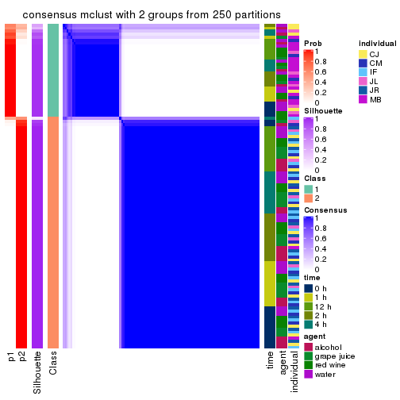</p>

</div>
<div id='tab-ATC-mclust-consensus-heatmap-2'>
<pre><code class="r">consensus_heatmap(res, k = 3)
</code></pre>

<p>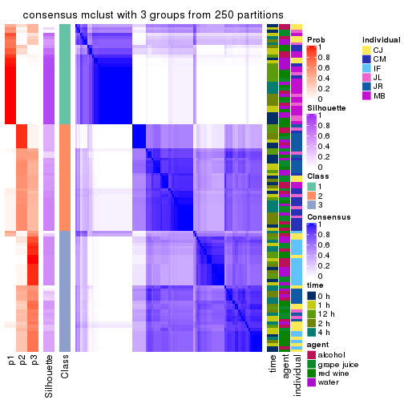</p>

</div>
<div id='tab-ATC-mclust-consensus-heatmap-3'>
<pre><code class="r">consensus_heatmap(res, k = 4)
</code></pre>

<p>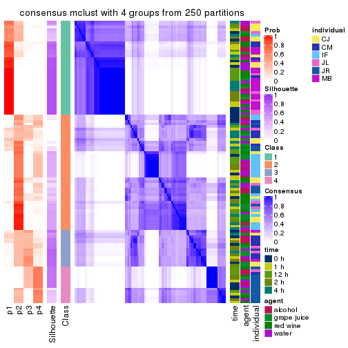</p>

</div>
<div id='tab-ATC-mclust-consensus-heatmap-4'>
<pre><code class="r">consensus_heatmap(res, k = 5)
</code></pre>

<p>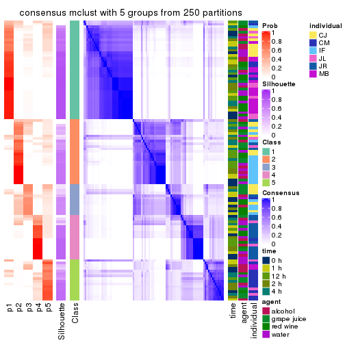</p>

</div>
<div id='tab-ATC-mclust-consensus-heatmap-5'>
<pre><code class="r">consensus_heatmap(res, k = 6)
</code></pre>

<p>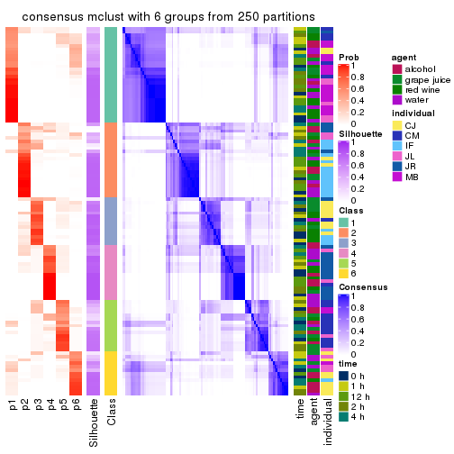</p>

</div>
</div>

Heatmaps for the membership of samples in all partitions to see how consistent they are:


<script>
$( function() {
	$( '#tabs-ATC-mclust-membership-heatmap' ).tabs();
} );
</script>
<div id='tabs-ATC-mclust-membership-heatmap'>
<ul>
<li><a href='#tab-ATC-mclust-membership-heatmap-1'>k = 2</a></li>
<li><a href='#tab-ATC-mclust-membership-heatmap-2'>k = 3</a></li>
<li><a href='#tab-ATC-mclust-membership-heatmap-3'>k = 4</a></li>
<li><a href='#tab-ATC-mclust-membership-heatmap-4'>k = 5</a></li>
<li><a href='#tab-ATC-mclust-membership-heatmap-5'>k = 6</a></li>
</ul>
<div id='tab-ATC-mclust-membership-heatmap-1'>
<pre><code class="r">membership_heatmap(res, k = 2)
</code></pre>

<p>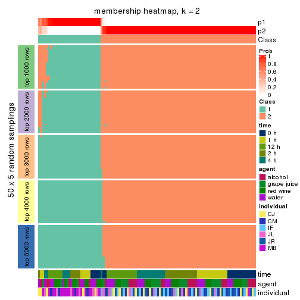</p>

</div>
<div id='tab-ATC-mclust-membership-heatmap-2'>
<pre><code class="r">membership_heatmap(res, k = 3)
</code></pre>

<p>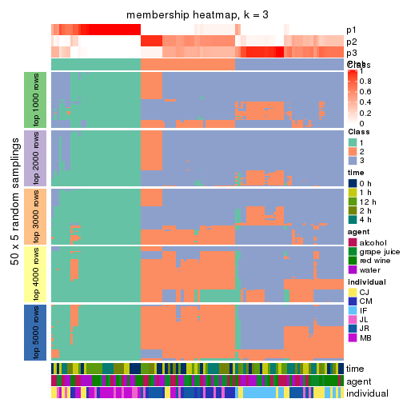</p>

</div>
<div id='tab-ATC-mclust-membership-heatmap-3'>
<pre><code class="r">membership_heatmap(res, k = 4)
</code></pre>

<p>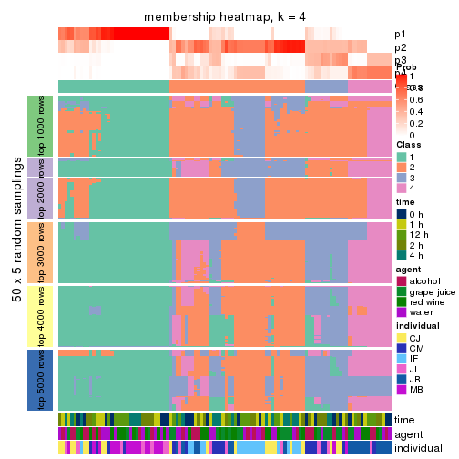</p>

</div>
<div id='tab-ATC-mclust-membership-heatmap-4'>
<pre><code class="r">membership_heatmap(res, k = 5)
</code></pre>

<p>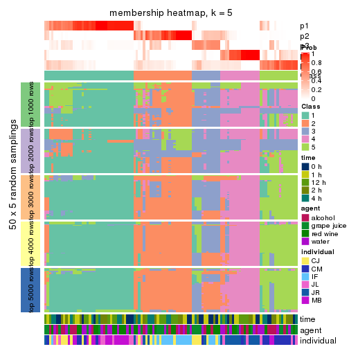</p>

</div>
<div id='tab-ATC-mclust-membership-heatmap-5'>
<pre><code class="r">membership_heatmap(res, k = 6)
</code></pre>

<p>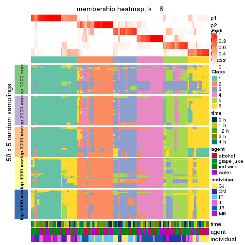</p>

</div>
</div>

As soon as we have had the classes for columns, we can look for signatures
which are significantly different between classes which can be candidate marks
for certain classes. Following are the heatmaps for signatures.


Signature heatmaps where rows are scaled:


<script>
$( function() {
	$( '#tabs-ATC-mclust-get-signatures' ).tabs();
} );
</script>
<div id='tabs-ATC-mclust-get-signatures'>
<ul>
<li><a href='#tab-ATC-mclust-get-signatures-1'>k = 2</a></li>
<li><a href='#tab-ATC-mclust-get-signatures-2'>k = 3</a></li>
<li><a href='#tab-ATC-mclust-get-signatures-3'>k = 4</a></li>
<li><a href='#tab-ATC-mclust-get-signatures-4'>k = 5</a></li>
<li><a href='#tab-ATC-mclust-get-signatures-5'>k = 6</a></li>
</ul>
<div id='tab-ATC-mclust-get-signatures-1'>
<pre><code class="r">get_signatures(res, k = 2)
</code></pre>

<p>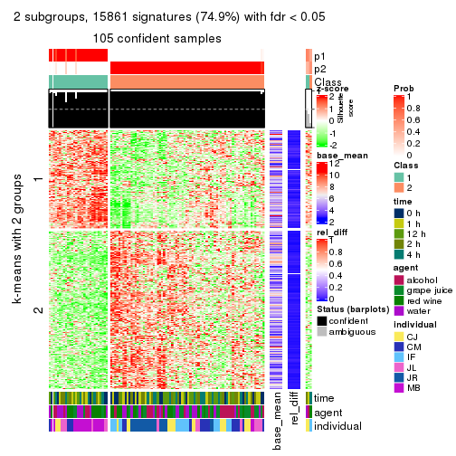</p>

</div>
<div id='tab-ATC-mclust-get-signatures-2'>
<pre><code class="r">get_signatures(res, k = 3)
</code></pre>

<p>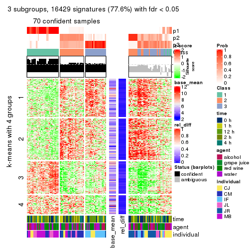</p>

</div>
<div id='tab-ATC-mclust-get-signatures-3'>
<pre><code class="r">get_signatures(res, k = 4)
</code></pre>

<p>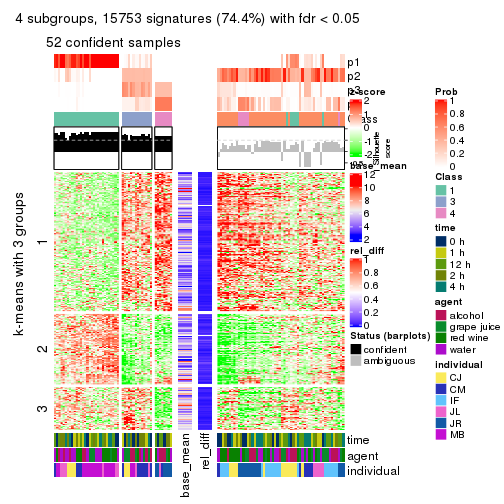</p>

</div>
<div id='tab-ATC-mclust-get-signatures-4'>
<pre><code class="r">get_signatures(res, k = 5)
</code></pre>

<p>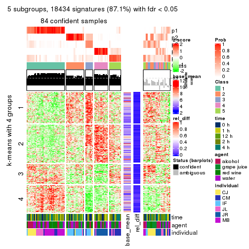</p>

</div>
<div id='tab-ATC-mclust-get-signatures-5'>
<pre><code class="r">get_signatures(res, k = 6)
</code></pre>

<p>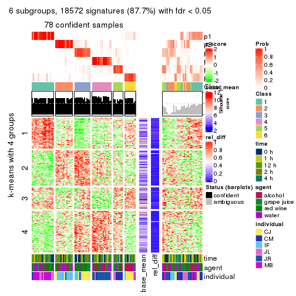</p>

</div>
</div>


Signature heatmaps where rows are not scaled:


<script>
$( function() {
	$( '#tabs-ATC-mclust-get-signatures-no-scale' ).tabs();
} );
</script>
<div id='tabs-ATC-mclust-get-signatures-no-scale'>
<ul>
<li><a href='#tab-ATC-mclust-get-signatures-no-scale-1'>k = 2</a></li>
<li><a href='#tab-ATC-mclust-get-signatures-no-scale-2'>k = 3</a></li>
<li><a href='#tab-ATC-mclust-get-signatures-no-scale-3'>k = 4</a></li>
<li><a href='#tab-ATC-mclust-get-signatures-no-scale-4'>k = 5</a></li>
<li><a href='#tab-ATC-mclust-get-signatures-no-scale-5'>k = 6</a></li>
</ul>
<div id='tab-ATC-mclust-get-signatures-no-scale-1'>
<pre><code class="r">get_signatures(res, k = 2, scale_rows = FALSE)
</code></pre>

<p>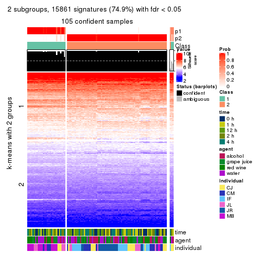</p>

</div>
<div id='tab-ATC-mclust-get-signatures-no-scale-2'>
<pre><code class="r">get_signatures(res, k = 3, scale_rows = FALSE)
</code></pre>

<p>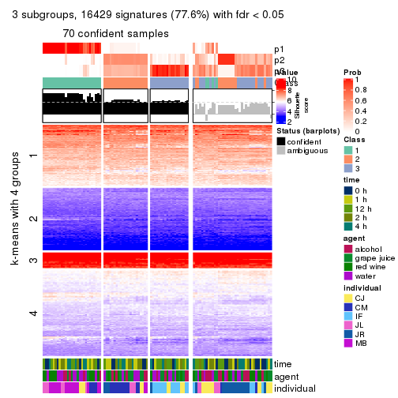</p>

</div>
<div id='tab-ATC-mclust-get-signatures-no-scale-3'>
<pre><code class="r">get_signatures(res, k = 4, scale_rows = FALSE)
</code></pre>

<p>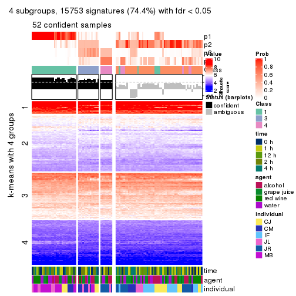</p>

</div>
<div id='tab-ATC-mclust-get-signatures-no-scale-4'>
<pre><code class="r">get_signatures(res, k = 5, scale_rows = FALSE)
</code></pre>

<p>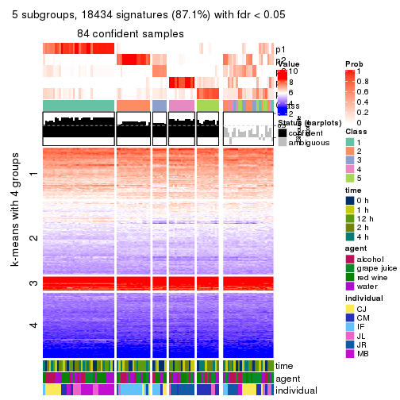</p>

</div>
<div id='tab-ATC-mclust-get-signatures-no-scale-5'>
<pre><code class="r">get_signatures(res, k = 6, scale_rows = FALSE)
</code></pre>

<p>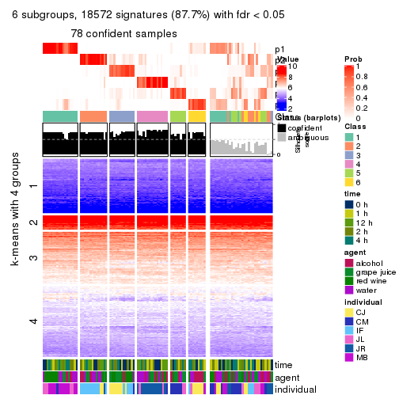</p>

</div>
</div>


Compare the overlap of signatures from different k:

```r
compare_signatures(res)
```

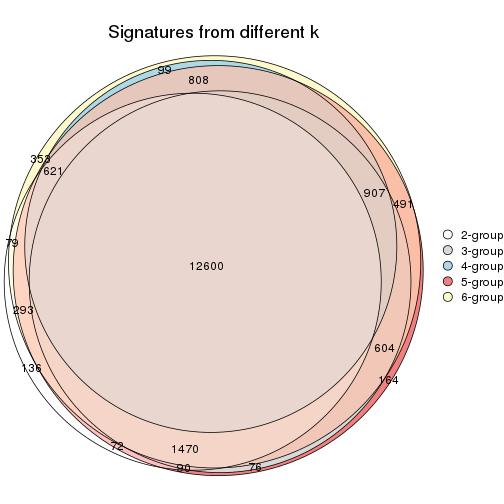

`get_signature()` returns a data frame invisibly. TO get the list of signatures, the function
call should be assigned to a variable explicitly. In following code, if `plot` argument is set
to `FALSE`, no heatmap is plotted while only the differential analysis is performed.

```r
# code only for demonstration
tb = get_signature(res, k = ..., plot = FALSE)
```

An example of the output of `tb` is:

```
#>   which_row         fdr    mean_1    mean_2 scaled_mean_1 scaled_mean_2 km
#> 1        38 0.042760348  8.373488  9.131774    -0.5533452     0.5164555  1
#> 2        40 0.018707592  7.106213  8.469186    -0.6173731     0.5762149  1
#> 3        55 0.019134737 10.221463 11.207825    -0.6159697     0.5749050  1
#> 4        59 0.006059896  5.921854  7.869574    -0.6899429     0.6439467  1
#> 5        60 0.018055526  8.928898 10.211722    -0.6204761     0.5791110  1
#> 6        98 0.009384629 15.714769 14.887706     0.6635654    -0.6193277  2
...
```

The columns in `tb` are:

1. `which_row`: row indices corresponding to the input matrix.
2. `fdr`: FDR for the differential test. 
3. `mean_x`: The mean value in group x.
4. `scaled_mean_x`: The mean value in group x after rows are scaled.
5. `km`: Row groups if k-means clustering is applied to rows.


UMAP plot which shows how samples are separated.


<script>
$( function() {
	$( '#tabs-ATC-mclust-dimension-reduction' ).tabs();
} );
</script>
<div id='tabs-ATC-mclust-dimension-reduction'>
<ul>
<li><a href='#tab-ATC-mclust-dimension-reduction-1'>k = 2</a></li>
<li><a href='#tab-ATC-mclust-dimension-reduction-2'>k = 3</a></li>
<li><a href='#tab-ATC-mclust-dimension-reduction-3'>k = 4</a></li>
<li><a href='#tab-ATC-mclust-dimension-reduction-4'>k = 5</a></li>
<li><a href='#tab-ATC-mclust-dimension-reduction-5'>k = 6</a></li>
</ul>
<div id='tab-ATC-mclust-dimension-reduction-1'>
<pre><code class="r">dimension_reduction(res, k = 2, method = &quot;UMAP&quot;)
</code></pre>

<p>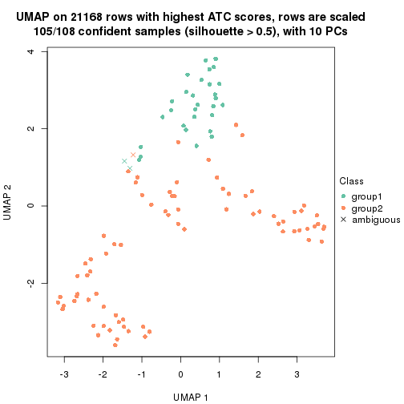</p>

</div>
<div id='tab-ATC-mclust-dimension-reduction-2'>
<pre><code class="r">dimension_reduction(res, k = 3, method = &quot;UMAP&quot;)
</code></pre>

<p>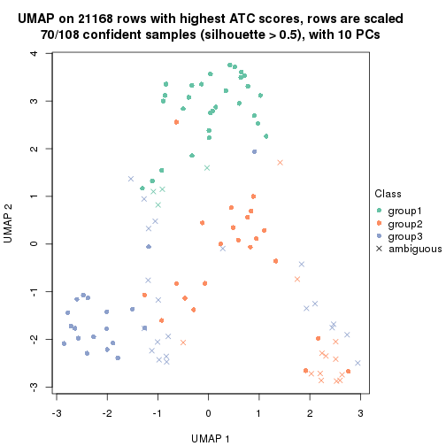</p>

</div>
<div id='tab-ATC-mclust-dimension-reduction-3'>
<pre><code class="r">dimension_reduction(res, k = 4, method = &quot;UMAP&quot;)
</code></pre>

<p>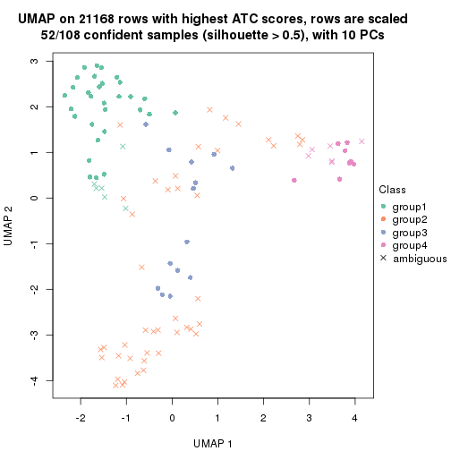</p>

</div>
<div id='tab-ATC-mclust-dimension-reduction-4'>
<pre><code class="r">dimension_reduction(res, k = 5, method = &quot;UMAP&quot;)
</code></pre>

<p>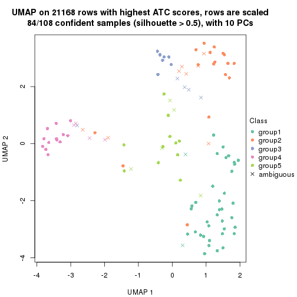</p>

</div>
<div id='tab-ATC-mclust-dimension-reduction-5'>
<pre><code class="r">dimension_reduction(res, k = 6, method = &quot;UMAP&quot;)
</code></pre>

<p>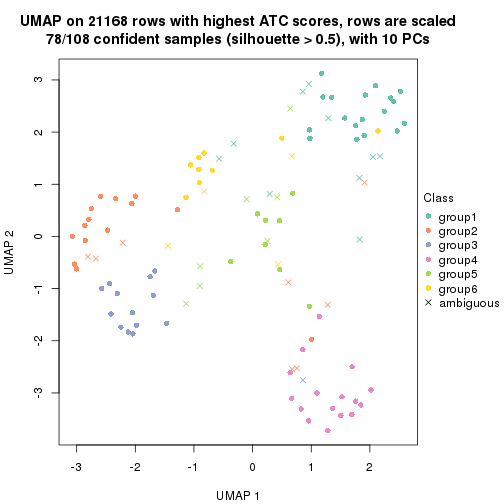</p>

</div>
</div>


Following heatmap shows how subgroups are split when increasing `k`:

```r
collect_classes(res)
```

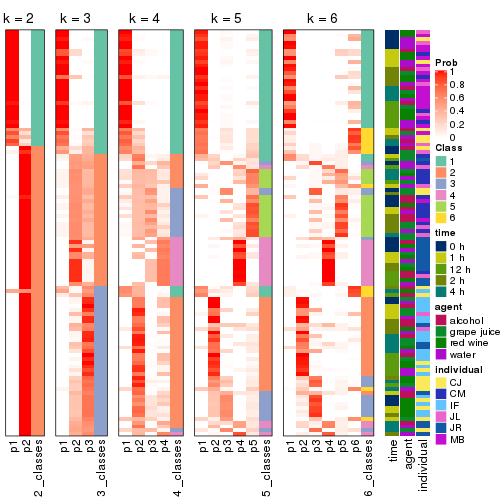


Test correlation between subgroups and known annotations. If the known
annotation is numeric, one-way ANOVA test is applied, and if the known
annotation is discrete, chi-squared contingency table test is applied.

```r
test_to_known_factors(res)
```

```
#>              n time(p) agent(p) individual(p) k
#> ATC:mclust 105   0.967    0.202      9.12e-10 2
#> ATC:mclust  70   0.705    0.346      8.02e-13 3
#> ATC:mclust  52   0.353    0.103      7.79e-08 4
#> ATC:mclust  84   0.195    0.526      4.48e-21 5
#> ATC:mclust  78   0.743    0.111      9.61e-26 6
```


If matrix rows can be associated to genes, consider to use `GO_Enrichment(res,
...)` to perform function enrichment for the signature genes.


 

---------------------------------------------------


### ATC:NMF*


The object with results only for a single top-value method and a single partition method 
can be extracted as:

```r
res = res_list["ATC", "NMF"]
# you can also extract it by
# res = res_list["ATC:NMF"]
```

A summary of `res` and all the functions that can be applied to it:

```r
res
```

```
#> A 'ConsensusPartition' object with k = 2, 3, 4, 5, 6.
#>   On a matrix with 21168 rows and 108 columns.
#>   Top rows (1000, 2000, 3000, 4000, 5000) are extracted by 'ATC' method.
#>   Subgroups are detected by 'NMF' method.
#>   Performed in total 1250 partitions by row resampling.
#>   Best k for subgroups seems to be 2.
#> 
#> Following methods can be applied to this 'ConsensusPartition' object:
#>  [1] "cola_report"             "collect_classes"         "collect_plots"          
#>  [4] "collect_stats"           "colnames"                "compare_signatures"     
#>  [7] "consensus_heatmap"       "dimension_reduction"     "functional_enrichment"  
#> [10] "get_anno_col"            "get_anno"                "get_classes"            
#> [13] "get_consensus"           "get_matrix"              "get_membership"         
#> [16] "get_param"               "get_signatures"          "get_stats"              
#> [19] "is_best_k"               "is_stable_k"             "membership_heatmap"     
#> [22] "ncol"                    "nrow"                    "plot_ecdf"              
#> [25] "rownames"                "select_partition_number" "show"                   
#> [28] "suggest_best_k"          "test_to_known_factors"
```

`collect_plots()` function collects all the plots made from `res` for all `k` (number of partitions)
into one single page to provide an easy and fast comparison between different `k`.

```r
collect_plots(res)
```

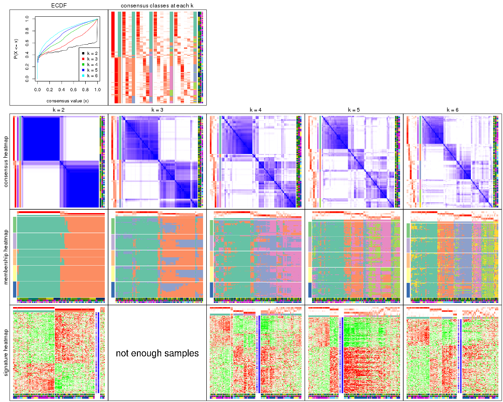

The plots are:

- The first row: a plot of the ECDF (Empirical cumulative distribution
  function) curves of the consensus matrix for each `k` and the heatmap of
  predicted classes for each `k`.
- The second row: heatmaps of the consensus matrix for each `k`.
- The third row: heatmaps of the membership matrix for each `k`.
- The fouth row: heatmaps of the signatures for each `k`.

All the plots in panels can be made by individual functions and they are
plotted later in this section.

`select_partition_number()` produces several plots showing different
statistics for choosing "optimized" `k`. There are following statistics:

- ECDF curves of the consensus matrix for each `k`;
- 1-PAC. [The PAC
  score](https://en.wikipedia.org/wiki/Consensus_clustering#Over-interpretation_potential_of_consensus_clustering)
  measures the proportion of the ambiguous subgrouping.
- Mean silhouette score.
- Concordance. The mean probability of fiting the consensus class ids in all
  partitions.
- Area increased. Denote $A_k$ as the area under the ECDF curve for current
  `k`, the area increased is defined as $A_k - A_{k-1}$.
- Rand index. The percent of pairs of samples that are both in a same cluster
  or both are not in a same cluster in the partition of k and k-1.
- Jaccard index. The ratio of pairs of samples are both in a same cluster in
  the partition of k and k-1 and the pairs of samples are both in a same
  cluster in the partition k or k-1.

The detailed explanations of these statistics can be found in [the cola
vignette](http://bioconductor.org/packages/devel/bioc/vignettes/cola/inst/doc/cola.html#toc_13).

Generally speaking, lower PAC score, higher mean silhouette score or higher
concordance corresponds to better partition. Rand index and Jaccard index
measure how similar the current partition is compared to partition with `k-1`.
If they are too similar, we won't accept `k` is better than `k-1`.

```r
select_partition_number(res)
```

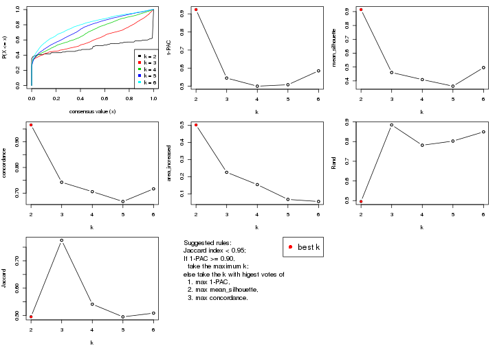

The numeric values for all these statistics can be obtained by `get_stats()`.

```r
get_stats(res)
```

```
#>   k 1-PAC mean_silhouette concordance area_increased  Rand Jaccard
#> 2 2 0.924           0.915       0.966         0.5019 0.496   0.496
#> 3 3 0.545           0.461       0.742         0.2258 0.885   0.775
#> 4 4 0.500           0.409       0.706         0.1540 0.781   0.541
#> 5 5 0.508           0.362       0.667         0.0679 0.803   0.495
#> 6 6 0.585           0.496       0.717         0.0556 0.849   0.509
```

`suggest_best_k()` suggests the best $k$ based on these statistics. The rules are as follows:

- All $k$ with Jaccard index larger than 0.95 are removed because the increase of
  the partition number does not provides enough extra information. If all $k$ are removed,
  the best $k$ is assigned by `NA`.
- For $k$ with 1-PAC larger than 0.9, the maximal $k$ is taken as the "best k". Other $k$ is called "optional k".
- If it does not fit the second rule. The $k$ with the highest vote of highest
  1-PAC, mean silhouette and concordance is taken as the "best k".

```r
suggest_best_k(res)
```

```
#> [1] 2
```


Following shows the table of the partitions (You need to click the **show/hide
code output** link to see it). The membership matrix (columns with name `p*`)
is inferred by
[`clue::cl_consensus()`](https://www.rdocumentation.org/link/cl_consensus?package=clue)
function with the `SE` method. Basically the value in the membership matrix
represents the probability to belong to a certain group. The finall class
label for an item is determined with the group with highest probability it
belongs to.

In `get_classes()` function, the entropy is calculated from the membership
matrix and the silhouette score is calculated from the consensus matrix.


<script>
$( function() {
	$( '#tabs-ATC-NMF-get-classes' ).tabs();
} );
</script>
<div id='tabs-ATC-NMF-get-classes'>
<ul>
<li><a href='#tab-ATC-NMF-get-classes-1'>k = 2</a></li>
<li><a href='#tab-ATC-NMF-get-classes-2'>k = 3</a></li>
<li><a href='#tab-ATC-NMF-get-classes-3'>k = 4</a></li>
<li><a href='#tab-ATC-NMF-get-classes-4'>k = 5</a></li>
<li><a href='#tab-ATC-NMF-get-classes-5'>k = 6</a></li>
</ul>

<div id='tab-ATC-NMF-get-classes-1'>
<p><a id='tab-ATC-NMF-get-classes-1-a' style='color:#0366d6' href='#'>show/hide code output</a></p>
<pre><code class="r">cbind(get_classes(res, k = 2), get_membership(res, k = 2))
</code></pre>

<pre><code>#&gt;          class entropy silhouette    p1    p2
#&gt; GSM87863     1  0.0000     0.9859 1.000 0.000
#&gt; GSM87887     1  0.0000     0.9859 1.000 0.000
#&gt; GSM87896     2  0.0000     0.9423 0.000 1.000
#&gt; GSM87934     2  0.0000     0.9423 0.000 1.000
#&gt; GSM87943     2  0.4562     0.8638 0.096 0.904
#&gt; GSM87853     2  0.0000     0.9423 0.000 1.000
#&gt; GSM87906     2  0.0000     0.9423 0.000 1.000
#&gt; GSM87920     1  0.0000     0.9859 1.000 0.000
#&gt; GSM87924     2  0.0000     0.9423 0.000 1.000
#&gt; GSM87858     2  0.0000     0.9423 0.000 1.000
#&gt; GSM87882     2  0.0000     0.9423 0.000 1.000
#&gt; GSM87891     2  0.0000     0.9423 0.000 1.000
#&gt; GSM87917     1  0.0000     0.9859 1.000 0.000
#&gt; GSM87929     2  0.0000     0.9423 0.000 1.000
#&gt; GSM87948     1  0.0000     0.9859 1.000 0.000
#&gt; GSM87868     1  0.0000     0.9859 1.000 0.000
#&gt; GSM87873     2  0.0000     0.9423 0.000 1.000
#&gt; GSM87901     2  1.0000     0.0987 0.496 0.504
#&gt; GSM87910     1  0.0000     0.9859 1.000 0.000
#&gt; GSM87938     2  0.0000     0.9423 0.000 1.000
#&gt; GSM87953     1  0.0000     0.9859 1.000 0.000
#&gt; GSM87864     1  0.0000     0.9859 1.000 0.000
#&gt; GSM87888     2  0.9993     0.1410 0.484 0.516
#&gt; GSM87897     2  0.0376     0.9399 0.004 0.996
#&gt; GSM87935     2  0.0000     0.9423 0.000 1.000
#&gt; GSM87944     1  0.0000     0.9859 1.000 0.000
#&gt; GSM87854     1  0.2236     0.9480 0.964 0.036
#&gt; GSM87878     1  0.0000     0.9859 1.000 0.000
#&gt; GSM87907     2  0.0000     0.9423 0.000 1.000
#&gt; GSM87921     2  1.0000     0.0987 0.496 0.504
#&gt; GSM87925     2  0.0000     0.9423 0.000 1.000
#&gt; GSM87957     1  0.0000     0.9859 1.000 0.000
#&gt; GSM87859     2  0.0000     0.9423 0.000 1.000
#&gt; GSM87883     1  0.0000     0.9859 1.000 0.000
#&gt; GSM87892     2  0.0000     0.9423 0.000 1.000
#&gt; GSM87930     2  0.0000     0.9423 0.000 1.000
#&gt; GSM87949     1  0.0000     0.9859 1.000 0.000
#&gt; GSM87869     1  0.0000     0.9859 1.000 0.000
#&gt; GSM87874     2  0.0000     0.9423 0.000 1.000
#&gt; GSM87902     1  0.9393     0.3884 0.644 0.356
#&gt; GSM87911     1  0.0000     0.9859 1.000 0.000
#&gt; GSM87939     2  0.0000     0.9423 0.000 1.000
#&gt; GSM87954     1  0.0000     0.9859 1.000 0.000
#&gt; GSM87865     1  0.0000     0.9859 1.000 0.000
#&gt; GSM87889     1  0.0000     0.9859 1.000 0.000
#&gt; GSM87898     1  0.0000     0.9859 1.000 0.000
#&gt; GSM87915     1  0.0000     0.9859 1.000 0.000
#&gt; GSM87936     2  0.0000     0.9423 0.000 1.000
#&gt; GSM87945     2  0.0000     0.9423 0.000 1.000
#&gt; GSM87855     2  0.0000     0.9423 0.000 1.000
#&gt; GSM87879     2  0.8081     0.6789 0.248 0.752
#&gt; GSM87922     2  0.0000     0.9423 0.000 1.000
#&gt; GSM87926     2  0.0000     0.9423 0.000 1.000
#&gt; GSM87958     1  0.0000     0.9859 1.000 0.000
#&gt; GSM87860     2  0.0000     0.9423 0.000 1.000
#&gt; GSM87884     1  0.0000     0.9859 1.000 0.000
#&gt; GSM87893     2  0.0000     0.9423 0.000 1.000
#&gt; GSM87918     1  0.0000     0.9859 1.000 0.000
#&gt; GSM87931     2  0.0000     0.9423 0.000 1.000
#&gt; GSM87950     1  0.0000     0.9859 1.000 0.000
#&gt; GSM87870     1  0.0000     0.9859 1.000 0.000
#&gt; GSM87875     2  0.0000     0.9423 0.000 1.000
#&gt; GSM87903     2  0.0000     0.9423 0.000 1.000
#&gt; GSM87912     1  0.0000     0.9859 1.000 0.000
#&gt; GSM87940     2  0.0000     0.9423 0.000 1.000
#&gt; GSM87866     1  0.0000     0.9859 1.000 0.000
#&gt; GSM87899     2  0.0000     0.9423 0.000 1.000
#&gt; GSM87937     2  0.0000     0.9423 0.000 1.000
#&gt; GSM87946     1  0.0000     0.9859 1.000 0.000
#&gt; GSM87856     2  0.0672     0.9373 0.008 0.992
#&gt; GSM87880     2  0.9552     0.4414 0.376 0.624
#&gt; GSM87908     1  0.0000     0.9859 1.000 0.000
#&gt; GSM87923     2  0.0672     0.9373 0.008 0.992
#&gt; GSM87927     2  0.2603     0.9100 0.044 0.956
#&gt; GSM87959     1  0.0000     0.9859 1.000 0.000
#&gt; GSM87861     2  0.0000     0.9423 0.000 1.000
#&gt; GSM87885     1  0.0000     0.9859 1.000 0.000
#&gt; GSM87894     1  0.0000     0.9859 1.000 0.000
#&gt; GSM87932     1  0.0000     0.9859 1.000 0.000
#&gt; GSM87951     1  0.0000     0.9859 1.000 0.000
#&gt; GSM87871     1  0.0000     0.9859 1.000 0.000
#&gt; GSM87876     1  0.0000     0.9859 1.000 0.000
#&gt; GSM87904     2  0.0000     0.9423 0.000 1.000
#&gt; GSM87913     1  0.0000     0.9859 1.000 0.000
#&gt; GSM87941     2  0.1414     0.9288 0.020 0.980
#&gt; GSM87955     1  0.0000     0.9859 1.000 0.000
#&gt; GSM87867     1  0.0000     0.9859 1.000 0.000
#&gt; GSM87890     2  0.0000     0.9423 0.000 1.000
#&gt; GSM87900     2  0.0000     0.9423 0.000 1.000
#&gt; GSM87916     2  0.0000     0.9423 0.000 1.000
#&gt; GSM87947     1  0.0000     0.9859 1.000 0.000
#&gt; GSM87857     2  0.0000     0.9423 0.000 1.000
#&gt; GSM87881     2  0.6247     0.8014 0.156 0.844
#&gt; GSM87909     1  0.0000     0.9859 1.000 0.000
#&gt; GSM87928     1  0.0000     0.9859 1.000 0.000
#&gt; GSM87960     1  0.0000     0.9859 1.000 0.000
#&gt; GSM87862     2  0.0000     0.9423 0.000 1.000
#&gt; GSM87886     1  0.0000     0.9859 1.000 0.000
#&gt; GSM87895     2  0.0000     0.9423 0.000 1.000
#&gt; GSM87919     1  0.0000     0.9859 1.000 0.000
#&gt; GSM87933     2  0.0000     0.9423 0.000 1.000
#&gt; GSM87952     1  0.0000     0.9859 1.000 0.000
#&gt; GSM87872     2  0.6343     0.7968 0.160 0.840
#&gt; GSM87877     1  0.0000     0.9859 1.000 0.000
#&gt; GSM87905     1  0.0000     0.9859 1.000 0.000
#&gt; GSM87914     1  0.8499     0.5797 0.724 0.276
#&gt; GSM87942     2  0.9775     0.3546 0.412 0.588
#&gt; GSM87956     1  0.0000     0.9859 1.000 0.000
</code></pre>

<script>
$('#tab-ATC-NMF-get-classes-1-a').parent().next().next().hide();
$('#tab-ATC-NMF-get-classes-1-a').click(function(){
  $('#tab-ATC-NMF-get-classes-1-a').parent().next().next().toggle();
  return(false);
});
</script>
</div>

<div id='tab-ATC-NMF-get-classes-2'>
<p><a id='tab-ATC-NMF-get-classes-2-a' style='color:#0366d6' href='#'>show/hide code output</a></p>
<pre><code class="r">cbind(get_classes(res, k = 3), get_membership(res, k = 3))
</code></pre>

<pre><code>#&gt;          class entropy silhouette    p1    p2    p3
#&gt; GSM87863     1  0.5948    0.68194 0.640 0.000 0.360
#&gt; GSM87887     1  0.2537    0.86172 0.920 0.000 0.080
#&gt; GSM87896     2  0.6274    0.02818 0.000 0.544 0.456
#&gt; GSM87934     2  0.0747    0.42997 0.000 0.984 0.016
#&gt; GSM87943     3  0.4915    0.21301 0.132 0.036 0.832
#&gt; GSM87853     3  0.6299    0.11477 0.000 0.476 0.524
#&gt; GSM87906     2  0.6225    0.08348 0.000 0.568 0.432
#&gt; GSM87920     1  0.1753    0.86218 0.952 0.000 0.048
#&gt; GSM87924     2  0.6244    0.06880 0.000 0.560 0.440
#&gt; GSM87858     2  0.6308   -0.09797 0.000 0.508 0.492
#&gt; GSM87882     2  0.6280    0.01268 0.000 0.540 0.460
#&gt; GSM87891     2  0.6274    0.02818 0.000 0.544 0.456
#&gt; GSM87917     1  0.0747    0.86435 0.984 0.000 0.016
#&gt; GSM87929     2  0.1860    0.41012 0.000 0.948 0.052
#&gt; GSM87948     1  0.1289    0.86452 0.968 0.000 0.032
#&gt; GSM87868     1  0.3192    0.84946 0.888 0.000 0.112
#&gt; GSM87873     2  0.6302   -0.05273 0.000 0.520 0.480
#&gt; GSM87901     1  0.9399    0.09609 0.452 0.372 0.176
#&gt; GSM87910     1  0.0892    0.86465 0.980 0.000 0.020
#&gt; GSM87938     2  0.3267    0.43223 0.000 0.884 0.116
#&gt; GSM87953     1  0.2261    0.85019 0.932 0.000 0.068
#&gt; GSM87864     1  0.5678    0.72616 0.684 0.000 0.316
#&gt; GSM87888     2  0.9285   -0.01842 0.392 0.448 0.160
#&gt; GSM87897     2  0.6500   -0.00890 0.004 0.532 0.464
#&gt; GSM87935     2  0.5431    0.33022 0.000 0.716 0.284
#&gt; GSM87944     1  0.4291    0.82503 0.820 0.000 0.180
#&gt; GSM87854     3  0.6302   -0.48953 0.480 0.000 0.520
#&gt; GSM87878     1  0.2356    0.84884 0.928 0.000 0.072
#&gt; GSM87907     2  0.6305   -0.06886 0.000 0.516 0.484
#&gt; GSM87921     2  0.8464    0.17309 0.272 0.596 0.132
#&gt; GSM87925     2  0.1529    0.44211 0.000 0.960 0.040
#&gt; GSM87957     1  0.0424    0.86455 0.992 0.000 0.008
#&gt; GSM87859     2  0.6308   -0.09797 0.000 0.508 0.492
#&gt; GSM87883     1  0.4702    0.80784 0.788 0.000 0.212
#&gt; GSM87892     2  0.6305   -0.06791 0.000 0.516 0.484
#&gt; GSM87930     2  0.5465    0.32524 0.000 0.712 0.288
#&gt; GSM87949     1  0.1643    0.85684 0.956 0.000 0.044
#&gt; GSM87869     1  0.4062    0.83142 0.836 0.000 0.164
#&gt; GSM87874     2  0.6308   -0.09797 0.000 0.508 0.492
#&gt; GSM87902     1  0.8250    0.30609 0.600 0.292 0.108
#&gt; GSM87911     1  0.3670    0.81866 0.888 0.092 0.020
#&gt; GSM87939     2  0.1411    0.42095 0.000 0.964 0.036
#&gt; GSM87954     1  0.2356    0.84884 0.928 0.000 0.072
#&gt; GSM87865     1  0.5058    0.78794 0.756 0.000 0.244
#&gt; GSM87889     1  0.5304    0.83423 0.824 0.068 0.108
#&gt; GSM87898     1  0.2261    0.85021 0.932 0.000 0.068
#&gt; GSM87915     1  0.2356    0.84884 0.928 0.000 0.072
#&gt; GSM87936     2  0.3941    0.41656 0.000 0.844 0.156
#&gt; GSM87945     3  0.6026    0.23502 0.000 0.376 0.624
#&gt; GSM87855     3  0.6026    0.23502 0.000 0.376 0.624
#&gt; GSM87879     2  0.9105   -0.09442 0.140 0.448 0.412
#&gt; GSM87922     2  0.6008    0.18177 0.000 0.628 0.372
#&gt; GSM87926     2  0.1411    0.42120 0.000 0.964 0.036
#&gt; GSM87958     1  0.1031    0.86210 0.976 0.000 0.024
#&gt; GSM87860     2  0.6308   -0.09797 0.000 0.508 0.492
#&gt; GSM87884     1  0.4121    0.83042 0.832 0.000 0.168
#&gt; GSM87893     2  0.6308   -0.09797 0.000 0.508 0.492
#&gt; GSM87918     1  0.8875    0.38455 0.508 0.364 0.128
#&gt; GSM87931     2  0.0892    0.42842 0.000 0.980 0.020
#&gt; GSM87950     1  0.1289    0.85949 0.968 0.000 0.032
#&gt; GSM87870     1  0.3192    0.84944 0.888 0.000 0.112
#&gt; GSM87875     3  0.6280    0.14548 0.000 0.460 0.540
#&gt; GSM87903     2  0.6295   -0.02471 0.000 0.528 0.472
#&gt; GSM87912     1  0.1529    0.85769 0.960 0.000 0.040
#&gt; GSM87940     2  0.0592    0.43641 0.000 0.988 0.012
#&gt; GSM87866     1  0.4555    0.81400 0.800 0.000 0.200
#&gt; GSM87899     3  0.6309    0.01891 0.000 0.500 0.500
#&gt; GSM87937     2  0.5254    0.34850 0.000 0.736 0.264
#&gt; GSM87946     1  0.4399    0.82046 0.812 0.000 0.188
#&gt; GSM87856     3  0.5020    0.23758 0.056 0.108 0.836
#&gt; GSM87880     2  0.9565   -0.00833 0.228 0.476 0.296
#&gt; GSM87908     1  0.2806    0.85360 0.928 0.032 0.040
#&gt; GSM87923     2  0.6421    0.09637 0.004 0.572 0.424
#&gt; GSM87927     2  0.2590    0.44176 0.004 0.924 0.072
#&gt; GSM87959     1  0.2165    0.86063 0.936 0.000 0.064
#&gt; GSM87861     3  0.6309    0.03830 0.000 0.496 0.504
#&gt; GSM87885     1  0.4371    0.80021 0.860 0.108 0.032
#&gt; GSM87894     1  0.5948    0.68134 0.640 0.000 0.360
#&gt; GSM87932     1  0.8405    0.54552 0.604 0.264 0.132
#&gt; GSM87951     1  0.0892    0.86248 0.980 0.000 0.020
#&gt; GSM87871     1  0.4087    0.83400 0.880 0.068 0.052
#&gt; GSM87876     1  0.4811    0.82950 0.828 0.024 0.148
#&gt; GSM87904     2  0.6308   -0.09797 0.000 0.508 0.492
#&gt; GSM87913     1  0.4702    0.80726 0.788 0.000 0.212
#&gt; GSM87941     2  0.2446    0.40196 0.012 0.936 0.052
#&gt; GSM87955     1  0.1753    0.85567 0.952 0.000 0.048
#&gt; GSM87867     1  0.4121    0.83129 0.832 0.000 0.168
#&gt; GSM87890     2  0.2261    0.44138 0.000 0.932 0.068
#&gt; GSM87900     2  0.2261    0.43704 0.000 0.932 0.068
#&gt; GSM87916     2  0.1031    0.44002 0.000 0.976 0.024
#&gt; GSM87947     1  0.4842    0.79987 0.776 0.000 0.224
#&gt; GSM87857     3  0.6299    0.11477 0.000 0.476 0.524
#&gt; GSM87881     2  0.3375    0.43566 0.008 0.892 0.100
#&gt; GSM87909     1  0.2878    0.83851 0.904 0.000 0.096
#&gt; GSM87928     1  0.8921    0.40854 0.516 0.348 0.136
#&gt; GSM87960     1  0.2261    0.85933 0.932 0.000 0.068
#&gt; GSM87862     2  0.6295   -0.02471 0.000 0.528 0.472
#&gt; GSM87886     1  0.1031    0.86467 0.976 0.000 0.024
#&gt; GSM87895     2  0.6280    0.01595 0.000 0.540 0.460
#&gt; GSM87919     1  0.2356    0.84884 0.928 0.000 0.072
#&gt; GSM87933     2  0.1411    0.42120 0.000 0.964 0.036
#&gt; GSM87952     1  0.0592    0.86339 0.988 0.000 0.012
#&gt; GSM87872     2  0.7180    0.30075 0.060 0.672 0.268
#&gt; GSM87877     1  0.1163    0.86385 0.972 0.000 0.028
#&gt; GSM87905     1  0.3272    0.83247 0.892 0.004 0.104
#&gt; GSM87914     2  0.8825   -0.04510 0.336 0.532 0.132
#&gt; GSM87942     2  0.8546    0.10962 0.284 0.584 0.132
#&gt; GSM87956     1  0.2356    0.84884 0.928 0.000 0.072
</code></pre>

<script>
$('#tab-ATC-NMF-get-classes-2-a').parent().next().next().hide();
$('#tab-ATC-NMF-get-classes-2-a').click(function(){
  $('#tab-ATC-NMF-get-classes-2-a').parent().next().next().toggle();
  return(false);
});
</script>
</div>

<div id='tab-ATC-NMF-get-classes-3'>
<p><a id='tab-ATC-NMF-get-classes-3-a' style='color:#0366d6' href='#'>show/hide code output</a></p>
<pre><code class="r">cbind(get_classes(res, k = 4), get_membership(res, k = 4))
</code></pre>

<pre><code>#&gt;          class entropy silhouette    p1    p2    p3    p4
#&gt; GSM87863     1  0.5212   -0.22330 0.572 0.420 0.008 0.000
#&gt; GSM87887     1  0.7726   -0.36176 0.444 0.296 0.000 0.260
#&gt; GSM87896     3  0.4981    0.13503 0.000 0.000 0.536 0.464
#&gt; GSM87934     4  0.1545    0.65274 0.000 0.040 0.008 0.952
#&gt; GSM87943     2  0.7514    0.24421 0.068 0.632 0.156 0.144
#&gt; GSM87853     3  0.5203    0.22555 0.000 0.008 0.576 0.416
#&gt; GSM87906     3  0.3219    0.57131 0.000 0.112 0.868 0.020
#&gt; GSM87920     1  0.2760    0.58976 0.872 0.128 0.000 0.000
#&gt; GSM87924     4  0.4967    0.07339 0.000 0.000 0.452 0.548
#&gt; GSM87858     3  0.5112    0.19103 0.000 0.004 0.560 0.436
#&gt; GSM87882     4  0.3647    0.62477 0.004 0.096 0.040 0.860
#&gt; GSM87891     3  0.4981    0.12613 0.000 0.000 0.536 0.464
#&gt; GSM87917     1  0.0469    0.65519 0.988 0.012 0.000 0.000
#&gt; GSM87929     4  0.3972    0.57689 0.000 0.204 0.008 0.788
#&gt; GSM87948     1  0.2469    0.61027 0.892 0.108 0.000 0.000
#&gt; GSM87868     1  0.2216    0.62581 0.908 0.092 0.000 0.000
#&gt; GSM87873     4  0.5296   -0.06854 0.000 0.008 0.496 0.496
#&gt; GSM87901     3  0.8028    0.12367 0.304 0.232 0.452 0.012
#&gt; GSM87910     1  0.0000    0.65692 1.000 0.000 0.000 0.000
#&gt; GSM87938     4  0.1637    0.64292 0.000 0.000 0.060 0.940
#&gt; GSM87953     1  0.0817    0.65521 0.976 0.024 0.000 0.000
#&gt; GSM87864     1  0.4647    0.33045 0.704 0.288 0.008 0.000
#&gt; GSM87888     4  0.6296    0.39980 0.204 0.112 0.008 0.676
#&gt; GSM87897     3  0.3565    0.56360 0.036 0.080 0.872 0.012
#&gt; GSM87935     4  0.6758    0.18792 0.000 0.096 0.400 0.504
#&gt; GSM87944     2  0.4998    0.54658 0.488 0.512 0.000 0.000
#&gt; GSM87854     3  0.6338    0.23004 0.120 0.236 0.644 0.000
#&gt; GSM87878     1  0.1388    0.65188 0.960 0.028 0.000 0.012
#&gt; GSM87907     3  0.1042    0.59580 0.000 0.008 0.972 0.020
#&gt; GSM87921     1  0.9136    0.00586 0.380 0.276 0.272 0.072
#&gt; GSM87925     4  0.1256    0.65330 0.000 0.008 0.028 0.964
#&gt; GSM87957     1  0.1489    0.65535 0.952 0.044 0.004 0.000
#&gt; GSM87859     3  0.5193    0.23864 0.000 0.008 0.580 0.412
#&gt; GSM87883     2  0.4955    0.62278 0.444 0.556 0.000 0.000
#&gt; GSM87892     3  0.4866    0.26419 0.000 0.000 0.596 0.404
#&gt; GSM87930     4  0.4382    0.42253 0.000 0.000 0.296 0.704
#&gt; GSM87949     1  0.0817    0.65521 0.976 0.024 0.000 0.000
#&gt; GSM87869     1  0.2216    0.62765 0.908 0.092 0.000 0.000
#&gt; GSM87874     3  0.5296    0.01048 0.000 0.008 0.500 0.492
#&gt; GSM87902     3  0.7154    0.20587 0.300 0.132 0.560 0.008
#&gt; GSM87911     1  0.6143    0.31746 0.732 0.068 0.056 0.144
#&gt; GSM87939     4  0.2266    0.64115 0.000 0.084 0.004 0.912
#&gt; GSM87954     1  0.1022    0.65352 0.968 0.032 0.000 0.000
#&gt; GSM87865     1  0.5695    0.29846 0.624 0.040 0.336 0.000
#&gt; GSM87889     4  0.7712   -0.36705 0.372 0.224 0.000 0.404
#&gt; GSM87898     1  0.7171    0.15709 0.464 0.136 0.400 0.000
#&gt; GSM87915     1  0.0817    0.65521 0.976 0.024 0.000 0.000
#&gt; GSM87936     4  0.6701    0.34875 0.000 0.108 0.328 0.564
#&gt; GSM87945     4  0.7641    0.14470 0.000 0.224 0.324 0.452
#&gt; GSM87855     3  0.5030    0.50515 0.000 0.060 0.752 0.188
#&gt; GSM87879     4  0.8741    0.16787 0.156 0.356 0.072 0.416
#&gt; GSM87922     4  0.2131    0.64774 0.000 0.036 0.032 0.932
#&gt; GSM87926     4  0.2081    0.64041 0.000 0.084 0.000 0.916
#&gt; GSM87958     1  0.0188    0.65680 0.996 0.004 0.000 0.000
#&gt; GSM87860     3  0.3105    0.56490 0.000 0.004 0.856 0.140
#&gt; GSM87884     2  0.5105    0.63195 0.432 0.564 0.000 0.004
#&gt; GSM87893     3  0.5112    0.19103 0.000 0.004 0.560 0.436
#&gt; GSM87918     1  0.6032    0.37126 0.688 0.208 0.004 0.100
#&gt; GSM87931     4  0.0921    0.65202 0.000 0.028 0.000 0.972
#&gt; GSM87950     1  0.0469    0.65712 0.988 0.012 0.000 0.000
#&gt; GSM87870     1  0.3312    0.61774 0.876 0.072 0.052 0.000
#&gt; GSM87875     4  0.7478    0.29390 0.000 0.256 0.240 0.504
#&gt; GSM87903     3  0.1584    0.59243 0.000 0.036 0.952 0.012
#&gt; GSM87912     1  0.0817    0.65645 0.976 0.024 0.000 0.000
#&gt; GSM87940     4  0.5463    0.47998 0.000 0.052 0.256 0.692
#&gt; GSM87866     1  0.4388    0.54954 0.808 0.132 0.060 0.000
#&gt; GSM87899     3  0.0469    0.59328 0.000 0.012 0.988 0.000
#&gt; GSM87937     4  0.5384    0.37412 0.000 0.028 0.324 0.648
#&gt; GSM87946     1  0.4103    0.40106 0.744 0.256 0.000 0.000
#&gt; GSM87856     3  0.4018    0.52355 0.004 0.168 0.812 0.016
#&gt; GSM87880     4  0.9445    0.27152 0.176 0.184 0.212 0.428
#&gt; GSM87908     3  0.5744   -0.14097 0.436 0.028 0.536 0.000
#&gt; GSM87923     4  0.2660    0.63963 0.000 0.056 0.036 0.908
#&gt; GSM87927     4  0.8242    0.11435 0.016 0.236 0.372 0.376
#&gt; GSM87959     1  0.2469    0.60738 0.892 0.108 0.000 0.000
#&gt; GSM87861     3  0.3583    0.53430 0.000 0.004 0.816 0.180
#&gt; GSM87885     1  0.6554   -0.13751 0.500 0.056 0.008 0.436
#&gt; GSM87894     1  0.5792    0.43142 0.708 0.124 0.168 0.000
#&gt; GSM87932     1  0.5592    0.33790 0.652 0.316 0.016 0.016
#&gt; GSM87951     1  0.0188    0.65724 0.996 0.004 0.000 0.000
#&gt; GSM87871     3  0.5459   -0.11347 0.432 0.016 0.552 0.000
#&gt; GSM87876     1  0.5155   -0.48265 0.528 0.468 0.000 0.004
#&gt; GSM87904     3  0.1978    0.59073 0.000 0.004 0.928 0.068
#&gt; GSM87913     1  0.4382    0.29686 0.704 0.296 0.000 0.000
#&gt; GSM87941     4  0.6133    0.54255 0.004 0.220 0.100 0.676
#&gt; GSM87955     1  0.0921    0.65439 0.972 0.028 0.000 0.000
#&gt; GSM87867     1  0.5538    0.31996 0.644 0.036 0.320 0.000
#&gt; GSM87890     4  0.0779    0.65301 0.000 0.016 0.004 0.980
#&gt; GSM87900     3  0.5846    0.48332 0.020 0.240 0.696 0.044
#&gt; GSM87916     4  0.0657    0.65295 0.000 0.012 0.004 0.984
#&gt; GSM87947     1  0.4955   -0.32312 0.556 0.444 0.000 0.000
#&gt; GSM87857     3  0.0804    0.59466 0.000 0.008 0.980 0.012
#&gt; GSM87881     4  0.1229    0.65250 0.004 0.020 0.008 0.968
#&gt; GSM87909     1  0.7301    0.25538 0.536 0.228 0.236 0.000
#&gt; GSM87928     1  0.6167    0.33421 0.668 0.208 0.000 0.124
#&gt; GSM87960     1  0.1557    0.64259 0.944 0.056 0.000 0.000
#&gt; GSM87862     3  0.1406    0.59565 0.000 0.024 0.960 0.016
#&gt; GSM87886     1  0.3494    0.51565 0.824 0.172 0.000 0.004
#&gt; GSM87895     3  0.4059    0.52764 0.000 0.012 0.788 0.200
#&gt; GSM87919     1  0.1022    0.65339 0.968 0.032 0.000 0.000
#&gt; GSM87933     4  0.2281    0.63766 0.000 0.096 0.000 0.904
#&gt; GSM87952     1  0.1022    0.65012 0.968 0.032 0.000 0.000
#&gt; GSM87872     3  0.7319    0.43709 0.044 0.200 0.628 0.128
#&gt; GSM87877     1  0.2149    0.62543 0.912 0.088 0.000 0.000
#&gt; GSM87905     1  0.7648    0.22132 0.500 0.252 0.244 0.004
#&gt; GSM87914     4  0.7130    0.34572 0.172 0.248 0.004 0.576
#&gt; GSM87942     4  0.6127    0.46109 0.108 0.228 0.000 0.664
#&gt; GSM87956     1  0.0921    0.65439 0.972 0.028 0.000 0.000
</code></pre>

<script>
$('#tab-ATC-NMF-get-classes-3-a').parent().next().next().hide();
$('#tab-ATC-NMF-get-classes-3-a').click(function(){
  $('#tab-ATC-NMF-get-classes-3-a').parent().next().next().toggle();
  return(false);
});
</script>
</div>

<div id='tab-ATC-NMF-get-classes-4'>
<p><a id='tab-ATC-NMF-get-classes-4-a' style='color:#0366d6' href='#'>show/hide code output</a></p>
<pre><code class="r">cbind(get_classes(res, k = 5), get_membership(res, k = 5))
</code></pre>

<pre><code>#&gt;          class entropy silhouette    p1    p2    p3    p4    p5
#&gt; GSM87863     3  0.5383    0.26471 0.408 0.048 0.540 0.000 0.004
#&gt; GSM87887     5  0.6941   -0.09068 0.404 0.004 0.152 0.020 0.420
#&gt; GSM87896     4  0.3684    0.44479 0.000 0.280 0.000 0.720 0.000
#&gt; GSM87934     4  0.4288   -0.14055 0.000 0.004 0.000 0.612 0.384
#&gt; GSM87943     3  0.3880    0.30361 0.052 0.096 0.828 0.024 0.000
#&gt; GSM87853     4  0.4109    0.43608 0.000 0.288 0.012 0.700 0.000
#&gt; GSM87906     2  0.2959    0.60983 0.004 0.884 0.016 0.072 0.024
#&gt; GSM87920     1  0.4365    0.56515 0.776 0.024 0.164 0.000 0.036
#&gt; GSM87924     4  0.2970    0.48331 0.000 0.168 0.000 0.828 0.004
#&gt; GSM87858     4  0.3707    0.44047 0.000 0.284 0.000 0.716 0.000
#&gt; GSM87882     5  0.6188    0.34525 0.000 0.000 0.136 0.416 0.448
#&gt; GSM87891     4  0.3534    0.47043 0.000 0.256 0.000 0.744 0.000
#&gt; GSM87917     1  0.1082    0.70951 0.964 0.000 0.028 0.000 0.008
#&gt; GSM87929     4  0.5361   -0.17114 0.000 0.032 0.012 0.532 0.424
#&gt; GSM87948     1  0.6270    0.22724 0.624 0.008 0.236 0.028 0.104
#&gt; GSM87868     1  0.1121    0.70619 0.956 0.000 0.044 0.000 0.000
#&gt; GSM87873     4  0.3336    0.48912 0.000 0.228 0.000 0.772 0.000
#&gt; GSM87901     2  0.4898    0.51938 0.148 0.760 0.044 0.004 0.044
#&gt; GSM87910     1  0.1082    0.70722 0.964 0.000 0.028 0.000 0.008
#&gt; GSM87938     4  0.3958    0.27432 0.000 0.040 0.000 0.776 0.184
#&gt; GSM87953     1  0.1907    0.69605 0.928 0.000 0.044 0.000 0.028
#&gt; GSM87864     1  0.4777   -0.04739 0.548 0.008 0.436 0.000 0.008
#&gt; GSM87888     4  0.8495   -0.06858 0.188 0.004 0.184 0.360 0.264
#&gt; GSM87897     2  0.2354    0.61422 0.008 0.916 0.012 0.052 0.012
#&gt; GSM87935     4  0.5351    0.36153 0.000 0.056 0.004 0.592 0.348
#&gt; GSM87944     1  0.4332    0.50810 0.732 0.008 0.236 0.000 0.024
#&gt; GSM87854     2  0.4651    0.46437 0.020 0.684 0.284 0.000 0.012
#&gt; GSM87878     1  0.4528    0.53196 0.760 0.008 0.052 0.004 0.176
#&gt; GSM87907     2  0.3304    0.56703 0.000 0.816 0.016 0.168 0.000
#&gt; GSM87921     2  0.8728    0.05170 0.236 0.340 0.048 0.072 0.304
#&gt; GSM87925     4  0.3715    0.30564 0.000 0.004 0.000 0.736 0.260
#&gt; GSM87957     1  0.4207    0.61728 0.816 0.064 0.072 0.000 0.048
#&gt; GSM87859     4  0.3837    0.40638 0.000 0.308 0.000 0.692 0.000
#&gt; GSM87883     1  0.4503    0.44055 0.700 0.004 0.268 0.000 0.028
#&gt; GSM87892     4  0.3837    0.40294 0.000 0.308 0.000 0.692 0.000
#&gt; GSM87930     4  0.2959    0.44318 0.000 0.100 0.000 0.864 0.036
#&gt; GSM87949     1  0.0854    0.71083 0.976 0.004 0.008 0.000 0.012
#&gt; GSM87869     1  0.0880    0.70928 0.968 0.000 0.032 0.000 0.000
#&gt; GSM87874     4  0.3489    0.48493 0.000 0.208 0.004 0.784 0.004
#&gt; GSM87902     2  0.4601    0.56088 0.148 0.776 0.032 0.040 0.004
#&gt; GSM87911     5  0.8391    0.00441 0.316 0.040 0.156 0.080 0.408
#&gt; GSM87939     4  0.4347    0.09699 0.000 0.004 0.004 0.636 0.356
#&gt; GSM87954     1  0.1597    0.69977 0.940 0.000 0.048 0.000 0.012
#&gt; GSM87865     2  0.5894    0.10501 0.400 0.520 0.064 0.000 0.016
#&gt; GSM87889     5  0.8002   -0.27412 0.292 0.000 0.296 0.080 0.332
#&gt; GSM87898     2  0.5779    0.16779 0.396 0.532 0.056 0.000 0.016
#&gt; GSM87915     1  0.3142    0.65757 0.868 0.008 0.056 0.000 0.068
#&gt; GSM87936     4  0.5249    0.31273 0.000 0.032 0.008 0.544 0.416
#&gt; GSM87945     4  0.6902    0.23900 0.000 0.140 0.292 0.524 0.044
#&gt; GSM87855     2  0.6432    0.28165 0.000 0.484 0.320 0.196 0.000
#&gt; GSM87879     4  0.6948    0.10931 0.108 0.004 0.408 0.440 0.040
#&gt; GSM87922     5  0.5252    0.40601 0.000 0.000 0.056 0.364 0.580
#&gt; GSM87926     5  0.4589    0.28456 0.000 0.004 0.004 0.472 0.520
#&gt; GSM87958     1  0.1243    0.70860 0.960 0.004 0.028 0.000 0.008
#&gt; GSM87860     2  0.4557    0.08571 0.000 0.516 0.008 0.476 0.000
#&gt; GSM87884     1  0.5080    0.19377 0.604 0.000 0.348 0.000 0.048
#&gt; GSM87893     4  0.3707    0.44030 0.000 0.284 0.000 0.716 0.000
#&gt; GSM87918     1  0.7274   -0.14656 0.436 0.020 0.016 0.164 0.364
#&gt; GSM87931     4  0.4278   -0.30999 0.000 0.000 0.000 0.548 0.452
#&gt; GSM87950     1  0.1074    0.70966 0.968 0.004 0.016 0.000 0.012
#&gt; GSM87870     1  0.3188    0.64544 0.860 0.100 0.028 0.000 0.012
#&gt; GSM87875     4  0.6429    0.28906 0.000 0.080 0.328 0.548 0.044
#&gt; GSM87903     2  0.2124    0.60563 0.000 0.900 0.000 0.096 0.004
#&gt; GSM87912     1  0.1386    0.70671 0.952 0.000 0.032 0.000 0.016
#&gt; GSM87940     4  0.3381    0.41153 0.000 0.016 0.000 0.808 0.176
#&gt; GSM87866     1  0.3907    0.63451 0.820 0.068 0.100 0.000 0.012
#&gt; GSM87899     2  0.2149    0.61280 0.000 0.916 0.036 0.048 0.000
#&gt; GSM87937     4  0.4558    0.37904 0.000 0.024 0.000 0.652 0.324
#&gt; GSM87946     1  0.2773    0.63459 0.836 0.000 0.164 0.000 0.000
#&gt; GSM87856     2  0.4746    0.40187 0.000 0.600 0.376 0.024 0.000
#&gt; GSM87880     4  0.8600    0.05248 0.132 0.012 0.240 0.344 0.272
#&gt; GSM87908     2  0.5194    0.40721 0.244 0.684 0.052 0.000 0.020
#&gt; GSM87923     4  0.6202   -0.13858 0.000 0.000 0.148 0.496 0.356
#&gt; GSM87927     4  0.6156    0.31078 0.004 0.072 0.016 0.496 0.412
#&gt; GSM87959     1  0.1121    0.70787 0.956 0.000 0.044 0.000 0.000
#&gt; GSM87861     2  0.4481    0.21636 0.000 0.576 0.008 0.416 0.000
#&gt; GSM87885     1  0.7335   -0.18247 0.444 0.000 0.036 0.256 0.264
#&gt; GSM87894     1  0.6468    0.14951 0.552 0.296 0.128 0.000 0.024
#&gt; GSM87932     1  0.6172    0.40971 0.680 0.116 0.088 0.004 0.112
#&gt; GSM87951     1  0.0579    0.71182 0.984 0.000 0.008 0.000 0.008
#&gt; GSM87871     2  0.4699    0.50108 0.172 0.756 0.052 0.004 0.016
#&gt; GSM87876     3  0.7630    0.32152 0.360 0.012 0.416 0.048 0.164
#&gt; GSM87904     2  0.3650    0.56479 0.000 0.796 0.028 0.176 0.000
#&gt; GSM87913     1  0.2280    0.67239 0.880 0.000 0.120 0.000 0.000
#&gt; GSM87941     4  0.5327    0.24025 0.004 0.016 0.016 0.500 0.464
#&gt; GSM87955     1  0.0798    0.71177 0.976 0.000 0.008 0.000 0.016
#&gt; GSM87867     2  0.6808   -0.12589 0.412 0.440 0.108 0.000 0.040
#&gt; GSM87890     4  0.4211    0.15691 0.000 0.000 0.004 0.636 0.360
#&gt; GSM87900     2  0.3427    0.59868 0.000 0.860 0.028 0.064 0.048
#&gt; GSM87916     5  0.4446    0.33509 0.000 0.000 0.004 0.476 0.520
#&gt; GSM87947     1  0.5649   -0.21602 0.488 0.008 0.460 0.012 0.032
#&gt; GSM87857     2  0.3919    0.54218 0.000 0.776 0.036 0.188 0.000
#&gt; GSM87881     5  0.4958    0.17429 0.004 0.000 0.020 0.452 0.524
#&gt; GSM87909     2  0.6436    0.20388 0.368 0.524 0.048 0.004 0.056
#&gt; GSM87928     1  0.5940    0.38434 0.684 0.012 0.028 0.116 0.160
#&gt; GSM87960     1  0.0865    0.71044 0.972 0.000 0.024 0.000 0.004
#&gt; GSM87862     2  0.4004    0.49848 0.000 0.748 0.004 0.232 0.016
#&gt; GSM87886     1  0.2813    0.66795 0.880 0.000 0.084 0.004 0.032
#&gt; GSM87895     2  0.4440    0.07281 0.000 0.528 0.000 0.468 0.004
#&gt; GSM87919     1  0.0898    0.71003 0.972 0.000 0.020 0.000 0.008
#&gt; GSM87933     5  0.4291    0.34561 0.000 0.000 0.000 0.464 0.536
#&gt; GSM87952     1  0.0290    0.71197 0.992 0.000 0.008 0.000 0.000
#&gt; GSM87872     4  0.7756    0.26004 0.036 0.212 0.016 0.396 0.340
#&gt; GSM87877     1  0.7618   -0.06087 0.512 0.024 0.104 0.080 0.280
#&gt; GSM87905     1  0.6996   -0.06654 0.428 0.416 0.076 0.000 0.080
#&gt; GSM87914     5  0.7622   -0.06716 0.280 0.024 0.012 0.296 0.388
#&gt; GSM87942     5  0.6033    0.43814 0.088 0.004 0.016 0.296 0.596
#&gt; GSM87956     1  0.1412    0.70748 0.952 0.004 0.008 0.000 0.036
</code></pre>

<script>
$('#tab-ATC-NMF-get-classes-4-a').parent().next().next().hide();
$('#tab-ATC-NMF-get-classes-4-a').click(function(){
  $('#tab-ATC-NMF-get-classes-4-a').parent().next().next().toggle();
  return(false);
});
</script>
</div>

<div id='tab-ATC-NMF-get-classes-5'>
<p><a id='tab-ATC-NMF-get-classes-5-a' style='color:#0366d6' href='#'>show/hide code output</a></p>
<pre><code class="r">cbind(get_classes(res, k = 6), get_membership(res, k = 6))
</code></pre>

<pre><code>#&gt;          class entropy silhouette    p1    p2    p3    p4    p5    p6
#&gt; GSM87863     6  0.5359     0.2841 0.084 0.204 0.000 0.036 0.008 0.668
#&gt; GSM87887     4  0.4096     0.3945 0.064 0.024 0.000 0.792 0.008 0.112
#&gt; GSM87896     3  0.0858     0.7065 0.000 0.028 0.968 0.000 0.004 0.000
#&gt; GSM87934     3  0.5620     0.1297 0.000 0.000 0.512 0.320 0.168 0.000
#&gt; GSM87943     6  0.3054     0.3375 0.000 0.020 0.068 0.032 0.012 0.868
#&gt; GSM87853     3  0.1116     0.7024 0.000 0.028 0.960 0.008 0.000 0.004
#&gt; GSM87906     2  0.2631     0.6773 0.000 0.856 0.128 0.012 0.004 0.000
#&gt; GSM87920     1  0.8169    -0.1324 0.340 0.164 0.000 0.252 0.040 0.204
#&gt; GSM87924     3  0.1082     0.6969 0.000 0.000 0.956 0.004 0.040 0.000
#&gt; GSM87858     3  0.1007     0.7000 0.000 0.044 0.956 0.000 0.000 0.000
#&gt; GSM87882     4  0.4558     0.4256 0.000 0.000 0.088 0.724 0.016 0.172
#&gt; GSM87891     3  0.0692     0.7078 0.000 0.020 0.976 0.000 0.004 0.000
#&gt; GSM87917     1  0.0893     0.8137 0.972 0.004 0.000 0.004 0.016 0.004
#&gt; GSM87929     3  0.6617    -0.1386 0.000 0.012 0.352 0.332 0.296 0.008
#&gt; GSM87948     1  0.5090     0.6126 0.656 0.012 0.000 0.004 0.092 0.236
#&gt; GSM87868     1  0.2151     0.8084 0.904 0.016 0.000 0.000 0.008 0.072
#&gt; GSM87873     3  0.0146     0.7052 0.000 0.000 0.996 0.004 0.000 0.000
#&gt; GSM87901     2  0.4871     0.6671 0.044 0.760 0.124 0.028 0.020 0.024
#&gt; GSM87910     1  0.1210     0.8157 0.960 0.008 0.000 0.004 0.020 0.008
#&gt; GSM87938     3  0.3544     0.5864 0.000 0.000 0.800 0.120 0.080 0.000
#&gt; GSM87953     1  0.1957     0.8026 0.928 0.012 0.000 0.028 0.024 0.008
#&gt; GSM87864     1  0.5363     0.2419 0.472 0.032 0.000 0.000 0.044 0.452
#&gt; GSM87888     5  0.7146     0.4009 0.048 0.000 0.116 0.068 0.496 0.272
#&gt; GSM87897     2  0.3315     0.6796 0.000 0.804 0.156 0.000 0.040 0.000
#&gt; GSM87935     5  0.3383     0.5316 0.000 0.000 0.268 0.004 0.728 0.000
#&gt; GSM87944     1  0.3564     0.7320 0.768 0.004 0.000 0.024 0.000 0.204
#&gt; GSM87854     2  0.4418     0.5449 0.000 0.712 0.044 0.012 0.004 0.228
#&gt; GSM87878     4  0.6360     0.0234 0.420 0.048 0.000 0.432 0.088 0.012
#&gt; GSM87907     2  0.3592     0.5778 0.000 0.656 0.344 0.000 0.000 0.000
#&gt; GSM87921     4  0.7533     0.1760 0.044 0.340 0.036 0.376 0.196 0.008
#&gt; GSM87925     3  0.5116     0.1881 0.000 0.000 0.560 0.096 0.344 0.000
#&gt; GSM87957     1  0.6388     0.4689 0.572 0.088 0.000 0.008 0.228 0.104
#&gt; GSM87859     3  0.1152     0.6991 0.000 0.044 0.952 0.004 0.000 0.000
#&gt; GSM87883     1  0.4587     0.6541 0.692 0.008 0.000 0.048 0.008 0.244
#&gt; GSM87892     3  0.1285     0.6949 0.000 0.052 0.944 0.000 0.004 0.000
#&gt; GSM87930     3  0.1644     0.6874 0.000 0.000 0.932 0.028 0.040 0.000
#&gt; GSM87949     1  0.1003     0.8161 0.964 0.000 0.000 0.000 0.020 0.016
#&gt; GSM87869     1  0.2411     0.8092 0.900 0.024 0.000 0.000 0.032 0.044
#&gt; GSM87874     3  0.0748     0.7007 0.000 0.004 0.976 0.016 0.000 0.004
#&gt; GSM87902     2  0.5455     0.6259 0.108 0.668 0.188 0.012 0.004 0.020
#&gt; GSM87911     4  0.6001     0.3764 0.096 0.124 0.020 0.680 0.024 0.056
#&gt; GSM87939     5  0.5969     0.1174 0.000 0.000 0.376 0.224 0.400 0.000
#&gt; GSM87954     1  0.1553     0.8072 0.944 0.012 0.000 0.004 0.032 0.008
#&gt; GSM87865     2  0.4203     0.5854 0.072 0.788 0.000 0.004 0.040 0.096
#&gt; GSM87889     4  0.7482    -0.0360 0.208 0.008 0.008 0.352 0.080 0.344
#&gt; GSM87898     1  0.4577     0.2912 0.568 0.400 0.000 0.000 0.016 0.016
#&gt; GSM87915     1  0.2263     0.7974 0.912 0.012 0.000 0.036 0.032 0.008
#&gt; GSM87936     5  0.3810     0.5426 0.000 0.004 0.208 0.036 0.752 0.000
#&gt; GSM87945     3  0.4791     0.3238 0.000 0.012 0.656 0.064 0.000 0.268
#&gt; GSM87855     6  0.6535     0.0833 0.000 0.204 0.380 0.024 0.004 0.388
#&gt; GSM87879     6  0.6676     0.1422 0.020 0.000 0.228 0.064 0.140 0.548
#&gt; GSM87922     4  0.3594     0.4916 0.000 0.020 0.088 0.832 0.048 0.012
#&gt; GSM87926     4  0.6140     0.1295 0.000 0.000 0.292 0.428 0.276 0.004
#&gt; GSM87958     1  0.2520     0.8036 0.888 0.008 0.000 0.000 0.052 0.052
#&gt; GSM87860     3  0.2883     0.5239 0.000 0.212 0.788 0.000 0.000 0.000
#&gt; GSM87884     1  0.5596     0.5680 0.632 0.008 0.000 0.096 0.032 0.232
#&gt; GSM87893     3  0.0547     0.7069 0.000 0.020 0.980 0.000 0.000 0.000
#&gt; GSM87918     5  0.3658     0.4604 0.188 0.000 0.020 0.000 0.776 0.016
#&gt; GSM87931     3  0.5713    -0.0414 0.000 0.000 0.448 0.388 0.164 0.000
#&gt; GSM87950     1  0.0820     0.8167 0.972 0.000 0.000 0.000 0.012 0.016
#&gt; GSM87870     1  0.4564     0.5683 0.684 0.264 0.000 0.020 0.008 0.024
#&gt; GSM87875     6  0.4995     0.0685 0.000 0.004 0.468 0.028 0.016 0.484
#&gt; GSM87903     2  0.3087     0.6786 0.000 0.820 0.160 0.004 0.012 0.004
#&gt; GSM87912     1  0.1325     0.8108 0.956 0.012 0.000 0.012 0.016 0.004
#&gt; GSM87940     3  0.3674     0.4341 0.000 0.000 0.716 0.016 0.268 0.000
#&gt; GSM87866     1  0.5020     0.5615 0.648 0.248 0.000 0.000 0.012 0.092
#&gt; GSM87899     2  0.3680     0.6565 0.000 0.744 0.232 0.000 0.004 0.020
#&gt; GSM87937     5  0.4305     0.2704 0.000 0.000 0.436 0.020 0.544 0.000
#&gt; GSM87946     1  0.3212     0.7551 0.800 0.004 0.000 0.000 0.016 0.180
#&gt; GSM87856     2  0.5553     0.1839 0.000 0.460 0.080 0.012 0.004 0.444
#&gt; GSM87880     5  0.6254     0.4746 0.024 0.008 0.144 0.024 0.604 0.196
#&gt; GSM87908     2  0.4337     0.5946 0.136 0.780 0.032 0.012 0.008 0.032
#&gt; GSM87923     4  0.7553    -0.0452 0.000 0.000 0.160 0.320 0.296 0.224
#&gt; GSM87927     5  0.3185     0.5468 0.008 0.012 0.128 0.016 0.836 0.000
#&gt; GSM87959     1  0.2094     0.8085 0.908 0.004 0.000 0.000 0.024 0.064
#&gt; GSM87861     3  0.3586     0.3566 0.000 0.280 0.712 0.004 0.000 0.004
#&gt; GSM87885     5  0.7747     0.2487 0.280 0.012 0.068 0.132 0.448 0.060
#&gt; GSM87894     2  0.5503     0.3409 0.296 0.604 0.000 0.052 0.008 0.040
#&gt; GSM87932     1  0.6235     0.5096 0.628 0.076 0.000 0.156 0.116 0.024
#&gt; GSM87951     1  0.0000     0.8147 1.000 0.000 0.000 0.000 0.000 0.000
#&gt; GSM87871     2  0.4416     0.6442 0.044 0.808 0.040 0.020 0.048 0.040
#&gt; GSM87876     5  0.6691     0.3560 0.112 0.012 0.024 0.044 0.556 0.252
#&gt; GSM87904     2  0.3788     0.6356 0.000 0.704 0.280 0.000 0.004 0.012
#&gt; GSM87913     1  0.2257     0.7970 0.876 0.000 0.000 0.000 0.008 0.116
#&gt; GSM87941     5  0.4308     0.5203 0.000 0.004 0.172 0.080 0.740 0.004
#&gt; GSM87955     1  0.0820     0.8160 0.972 0.000 0.000 0.000 0.016 0.012
#&gt; GSM87867     2  0.6787     0.2576 0.096 0.500 0.000 0.000 0.220 0.184
#&gt; GSM87890     3  0.5844    -0.0679 0.000 0.000 0.456 0.200 0.344 0.000
#&gt; GSM87900     2  0.4753     0.5835 0.000 0.644 0.304 0.012 0.028 0.012
#&gt; GSM87916     4  0.4239     0.4292 0.000 0.000 0.248 0.696 0.056 0.000
#&gt; GSM87947     6  0.5638    -0.2270 0.416 0.008 0.000 0.004 0.100 0.472
#&gt; GSM87857     2  0.4565     0.5707 0.000 0.620 0.344 0.004 0.016 0.016
#&gt; GSM87881     5  0.5509     0.0582 0.000 0.000 0.100 0.416 0.476 0.008
#&gt; GSM87909     2  0.6042     0.2877 0.336 0.532 0.008 0.020 0.096 0.008
#&gt; GSM87928     1  0.3108     0.7668 0.844 0.012 0.000 0.012 0.120 0.012
#&gt; GSM87960     1  0.2329     0.8092 0.904 0.008 0.000 0.004 0.036 0.048
#&gt; GSM87862     2  0.5529     0.5664 0.000 0.608 0.216 0.004 0.164 0.008
#&gt; GSM87886     1  0.3215     0.7812 0.860 0.008 0.000 0.040 0.032 0.060
#&gt; GSM87895     3  0.2738     0.5780 0.000 0.176 0.820 0.000 0.004 0.000
#&gt; GSM87919     1  0.0603     0.8132 0.980 0.000 0.000 0.000 0.016 0.004
#&gt; GSM87933     4  0.5396     0.3126 0.000 0.000 0.284 0.564 0.152 0.000
#&gt; GSM87952     1  0.0405     0.8158 0.988 0.000 0.000 0.000 0.004 0.008
#&gt; GSM87872     5  0.3727     0.5140 0.012 0.080 0.084 0.000 0.816 0.008
#&gt; GSM87877     5  0.5857     0.1706 0.300 0.012 0.000 0.000 0.524 0.164
#&gt; GSM87905     2  0.4755     0.4977 0.228 0.696 0.000 0.048 0.008 0.020
#&gt; GSM87914     5  0.6124     0.3409 0.292 0.004 0.136 0.032 0.536 0.000
#&gt; GSM87942     4  0.4955     0.4302 0.028 0.000 0.064 0.708 0.188 0.012
#&gt; GSM87956     1  0.1036     0.8172 0.964 0.000 0.000 0.004 0.024 0.008
</code></pre>

<script>
$('#tab-ATC-NMF-get-classes-5-a').parent().next().next().hide();
$('#tab-ATC-NMF-get-classes-5-a').click(function(){
  $('#tab-ATC-NMF-get-classes-5-a').parent().next().next().toggle();
  return(false);
});
</script>
</div>
</div>

Heatmaps for the consensus matrix. It visualizes the probability of two
samples to be in a same group.


<script>
$( function() {
	$( '#tabs-ATC-NMF-consensus-heatmap' ).tabs();
} );
</script>
<div id='tabs-ATC-NMF-consensus-heatmap'>
<ul>
<li><a href='#tab-ATC-NMF-consensus-heatmap-1'>k = 2</a></li>
<li><a href='#tab-ATC-NMF-consensus-heatmap-2'>k = 3</a></li>
<li><a href='#tab-ATC-NMF-consensus-heatmap-3'>k = 4</a></li>
<li><a href='#tab-ATC-NMF-consensus-heatmap-4'>k = 5</a></li>
<li><a href='#tab-ATC-NMF-consensus-heatmap-5'>k = 6</a></li>
</ul>
<div id='tab-ATC-NMF-consensus-heatmap-1'>
<pre><code class="r">consensus_heatmap(res, k = 2)
</code></pre>

<p>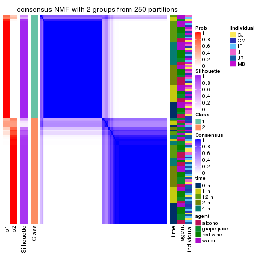</p>

</div>
<div id='tab-ATC-NMF-consensus-heatmap-2'>
<pre><code class="r">consensus_heatmap(res, k = 3)
</code></pre>

<p>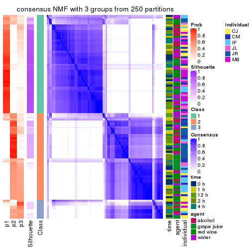</p>

</div>
<div id='tab-ATC-NMF-consensus-heatmap-3'>
<pre><code class="r">consensus_heatmap(res, k = 4)
</code></pre>

<p>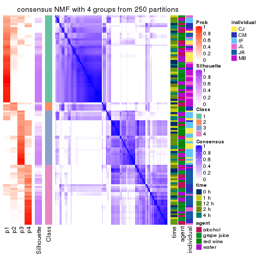</p>

</div>
<div id='tab-ATC-NMF-consensus-heatmap-4'>
<pre><code class="r">consensus_heatmap(res, k = 5)
</code></pre>

<p>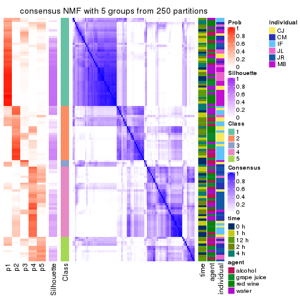</p>

</div>
<div id='tab-ATC-NMF-consensus-heatmap-5'>
<pre><code class="r">consensus_heatmap(res, k = 6)
</code></pre>

<p>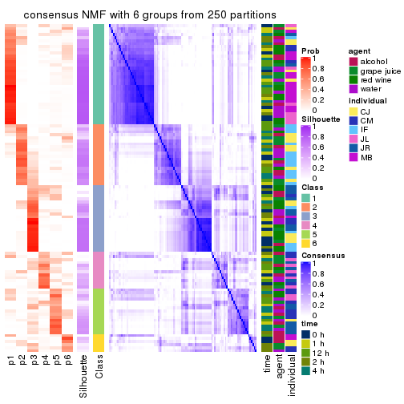</p>

</div>
</div>

Heatmaps for the membership of samples in all partitions to see how consistent they are:


<script>
$( function() {
	$( '#tabs-ATC-NMF-membership-heatmap' ).tabs();
} );
</script>
<div id='tabs-ATC-NMF-membership-heatmap'>
<ul>
<li><a href='#tab-ATC-NMF-membership-heatmap-1'>k = 2</a></li>
<li><a href='#tab-ATC-NMF-membership-heatmap-2'>k = 3</a></li>
<li><a href='#tab-ATC-NMF-membership-heatmap-3'>k = 4</a></li>
<li><a href='#tab-ATC-NMF-membership-heatmap-4'>k = 5</a></li>
<li><a href='#tab-ATC-NMF-membership-heatmap-5'>k = 6</a></li>
</ul>
<div id='tab-ATC-NMF-membership-heatmap-1'>
<pre><code class="r">membership_heatmap(res, k = 2)
</code></pre>

<p>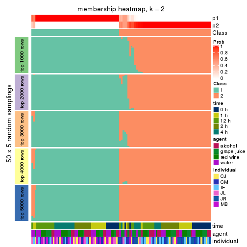</p>

</div>
<div id='tab-ATC-NMF-membership-heatmap-2'>
<pre><code class="r">membership_heatmap(res, k = 3)
</code></pre>

<p>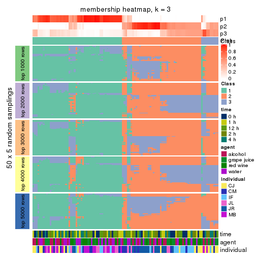</p>

</div>
<div id='tab-ATC-NMF-membership-heatmap-3'>
<pre><code class="r">membership_heatmap(res, k = 4)
</code></pre>

<p>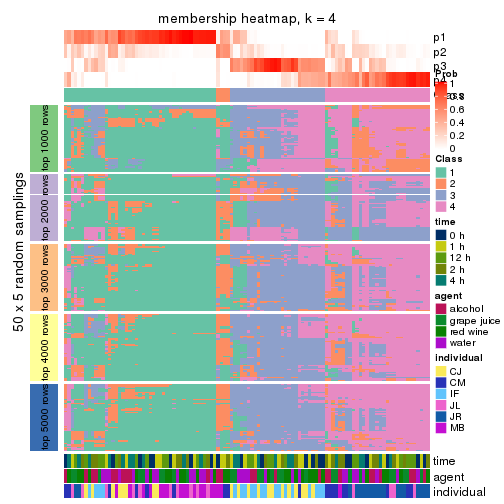</p>

</div>
<div id='tab-ATC-NMF-membership-heatmap-4'>
<pre><code class="r">membership_heatmap(res, k = 5)
</code></pre>

<p>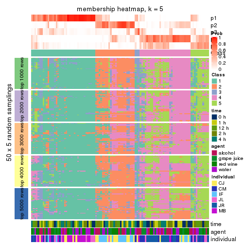</p>

</div>
<div id='tab-ATC-NMF-membership-heatmap-5'>
<pre><code class="r">membership_heatmap(res, k = 6)
</code></pre>

<p>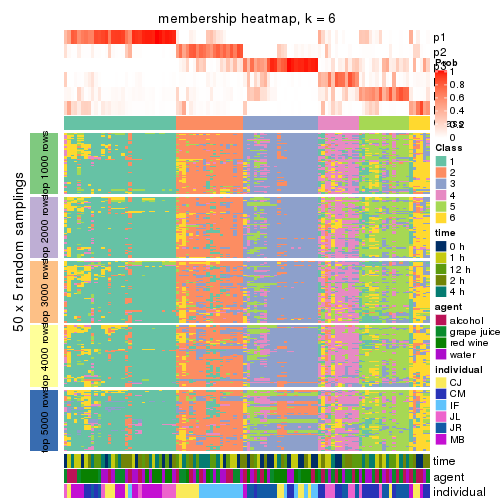</p>

</div>
</div>

As soon as we have had the classes for columns, we can look for signatures
which are significantly different between classes which can be candidate marks
for certain classes. Following are the heatmaps for signatures.


Signature heatmaps where rows are scaled:


<script>
$( function() {
	$( '#tabs-ATC-NMF-get-signatures' ).tabs();
} );
</script>
<div id='tabs-ATC-NMF-get-signatures'>
<ul>
<li><a href='#tab-ATC-NMF-get-signatures-1'>k = 2</a></li>
<li><a href='#tab-ATC-NMF-get-signatures-2'>k = 3</a></li>
<li><a href='#tab-ATC-NMF-get-signatures-3'>k = 4</a></li>
<li><a href='#tab-ATC-NMF-get-signatures-4'>k = 5</a></li>
<li><a href='#tab-ATC-NMF-get-signatures-5'>k = 6</a></li>
</ul>
<div id='tab-ATC-NMF-get-signatures-1'>
<pre><code class="r">get_signatures(res, k = 2)
</code></pre>

<p>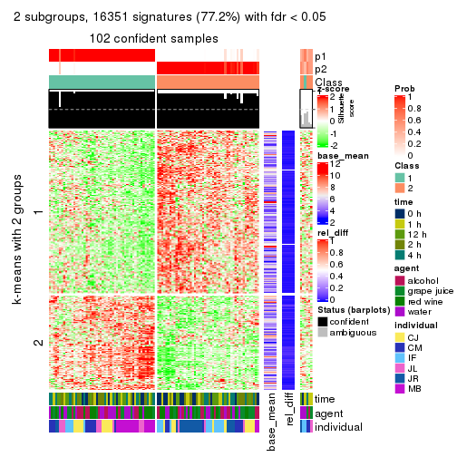</p>

</div>
<div id='tab-ATC-NMF-get-signatures-2'>
<pre><code class="r">get_signatures(res, k = 3)
</code></pre>

<p></p>

</div>
<div id='tab-ATC-NMF-get-signatures-3'>
<pre><code class="r">get_signatures(res, k = 4)
</code></pre>

<p>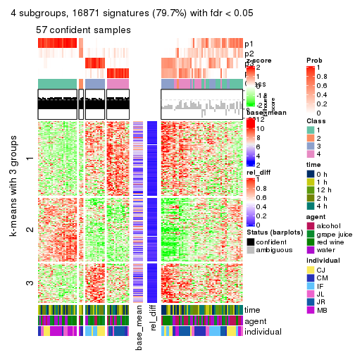</p>

</div>
<div id='tab-ATC-NMF-get-signatures-4'>
<pre><code class="r">get_signatures(res, k = 5)
</code></pre>

<p>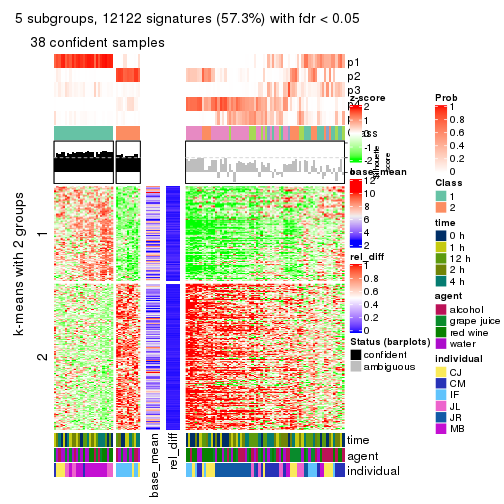</p>

</div>
<div id='tab-ATC-NMF-get-signatures-5'>
<pre><code class="r">get_signatures(res, k = 6)
</code></pre>

<p>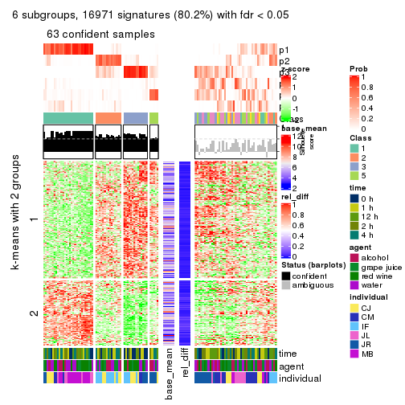</p>

</div>
</div>


Signature heatmaps where rows are not scaled:


<script>
$( function() {
	$( '#tabs-ATC-NMF-get-signatures-no-scale' ).tabs();
} );
</script>
<div id='tabs-ATC-NMF-get-signatures-no-scale'>
<ul>
<li><a href='#tab-ATC-NMF-get-signatures-no-scale-1'>k = 2</a></li>
<li><a href='#tab-ATC-NMF-get-signatures-no-scale-2'>k = 3</a></li>
<li><a href='#tab-ATC-NMF-get-signatures-no-scale-3'>k = 4</a></li>
<li><a href='#tab-ATC-NMF-get-signatures-no-scale-4'>k = 5</a></li>
<li><a href='#tab-ATC-NMF-get-signatures-no-scale-5'>k = 6</a></li>
</ul>
<div id='tab-ATC-NMF-get-signatures-no-scale-1'>
<pre><code class="r">get_signatures(res, k = 2, scale_rows = FALSE)
</code></pre>

<p>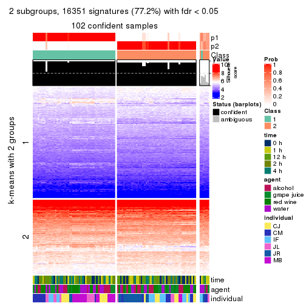</p>

</div>
<div id='tab-ATC-NMF-get-signatures-no-scale-2'>
<pre><code class="r">get_signatures(res, k = 3, scale_rows = FALSE)
</code></pre>

<p></p>

</div>
<div id='tab-ATC-NMF-get-signatures-no-scale-3'>
<pre><code class="r">get_signatures(res, k = 4, scale_rows = FALSE)
</code></pre>

<p>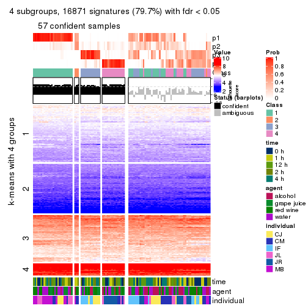</p>

</div>
<div id='tab-ATC-NMF-get-signatures-no-scale-4'>
<pre><code class="r">get_signatures(res, k = 5, scale_rows = FALSE)
</code></pre>

<p>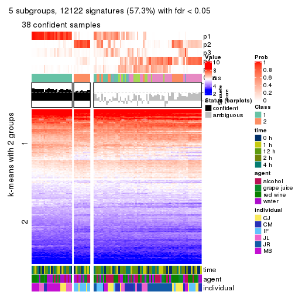</p>

</div>
<div id='tab-ATC-NMF-get-signatures-no-scale-5'>
<pre><code class="r">get_signatures(res, k = 6, scale_rows = FALSE)
</code></pre>

<p>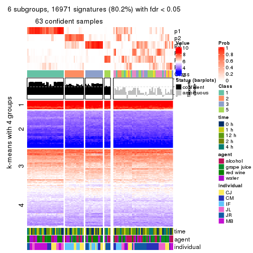</p>

</div>
</div>


Compare the overlap of signatures from different k:

```r
compare_signatures(res)
```

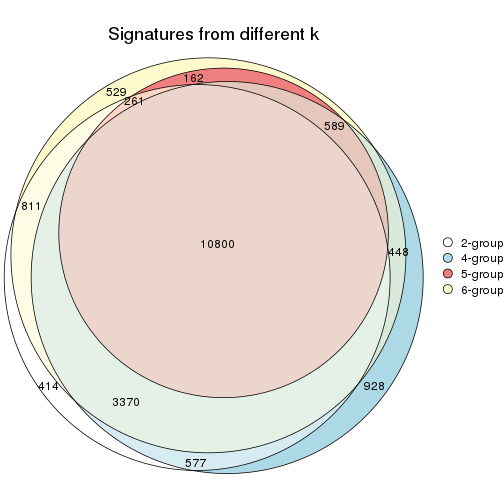

`get_signature()` returns a data frame invisibly. TO get the list of signatures, the function
call should be assigned to a variable explicitly. In following code, if `plot` argument is set
to `FALSE`, no heatmap is plotted while only the differential analysis is performed.

```r
# code only for demonstration
tb = get_signature(res, k = ..., plot = FALSE)
```

An example of the output of `tb` is:

```
#>   which_row         fdr    mean_1    mean_2 scaled_mean_1 scaled_mean_2 km
#> 1        38 0.042760348  8.373488  9.131774    -0.5533452     0.5164555  1
#> 2        40 0.018707592  7.106213  8.469186    -0.6173731     0.5762149  1
#> 3        55 0.019134737 10.221463 11.207825    -0.6159697     0.5749050  1
#> 4        59 0.006059896  5.921854  7.869574    -0.6899429     0.6439467  1
#> 5        60 0.018055526  8.928898 10.211722    -0.6204761     0.5791110  1
#> 6        98 0.009384629 15.714769 14.887706     0.6635654    -0.6193277  2
...
```

The columns in `tb` are:

1. `which_row`: row indices corresponding to the input matrix.
2. `fdr`: FDR for the differential test. 
3. `mean_x`: The mean value in group x.
4. `scaled_mean_x`: The mean value in group x after rows are scaled.
5. `km`: Row groups if k-means clustering is applied to rows.


UMAP plot which shows how samples are separated.


<script>
$( function() {
	$( '#tabs-ATC-NMF-dimension-reduction' ).tabs();
} );
</script>
<div id='tabs-ATC-NMF-dimension-reduction'>
<ul>
<li><a href='#tab-ATC-NMF-dimension-reduction-1'>k = 2</a></li>
<li><a href='#tab-ATC-NMF-dimension-reduction-2'>k = 3</a></li>
<li><a href='#tab-ATC-NMF-dimension-reduction-3'>k = 4</a></li>
<li><a href='#tab-ATC-NMF-dimension-reduction-4'>k = 5</a></li>
<li><a href='#tab-ATC-NMF-dimension-reduction-5'>k = 6</a></li>
</ul>
<div id='tab-ATC-NMF-dimension-reduction-1'>
<pre><code class="r">dimension_reduction(res, k = 2, method = &quot;UMAP&quot;)
</code></pre>

<p>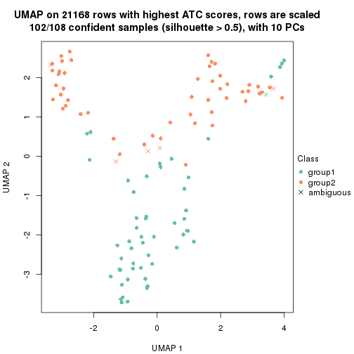</p>

</div>
<div id='tab-ATC-NMF-dimension-reduction-2'>
<pre><code class="r">dimension_reduction(res, k = 3, method = &quot;UMAP&quot;)
</code></pre>

<p>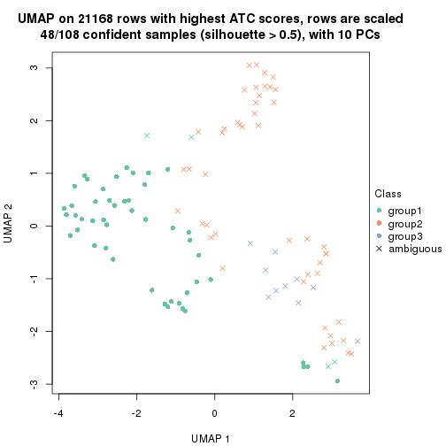</p>

</div>
<div id='tab-ATC-NMF-dimension-reduction-3'>
<pre><code class="r">dimension_reduction(res, k = 4, method = &quot;UMAP&quot;)
</code></pre>

<p>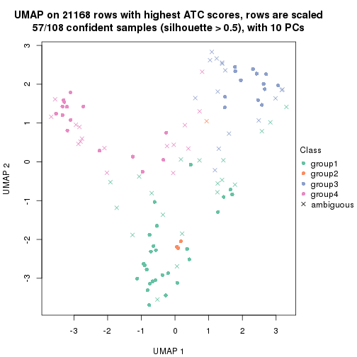</p>

</div>
<div id='tab-ATC-NMF-dimension-reduction-4'>
<pre><code class="r">dimension_reduction(res, k = 5, method = &quot;UMAP&quot;)
</code></pre>

<p>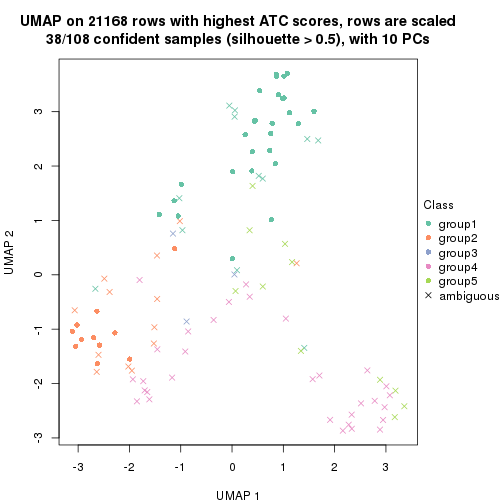</p>

</div>
<div id='tab-ATC-NMF-dimension-reduction-5'>
<pre><code class="r">dimension_reduction(res, k = 6, method = &quot;UMAP&quot;)
</code></pre>

<p>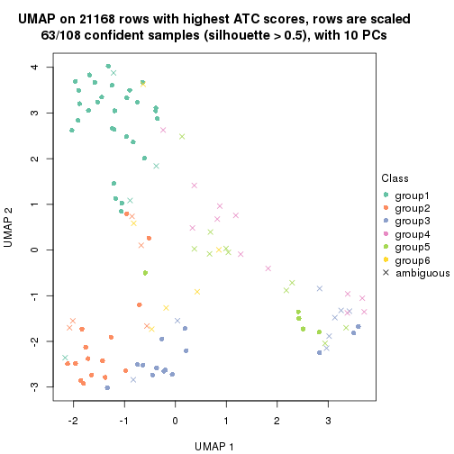</p>

</div>
</div>


Following heatmap shows how subgroups are split when increasing `k`:

```r
collect_classes(res)
```

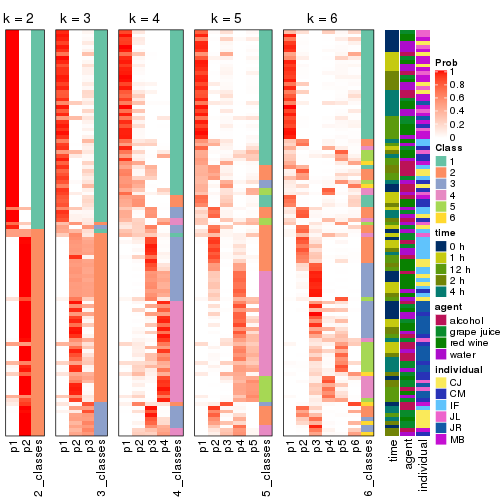


Test correlation between subgroups and known annotations. If the known
annotation is numeric, one-way ANOVA test is applied, and if the known
annotation is discrete, chi-squared contingency table test is applied.

```r
test_to_known_factors(res)
```

```
#>           n time(p) agent(p) individual(p) k
#> ATC:NMF 102   0.695    0.570      2.71e-05 2
#> ATC:NMF  48      NA       NA            NA 3
#> ATC:NMF  57   0.696    0.532      1.39e-11 4
#> ATC:NMF  38   0.962    0.292      2.40e-06 5
#> ATC:NMF  63   0.347    0.127      1.32e-08 6
```


If matrix rows can be associated to genes, consider to use `GO_Enrichment(res,
...)` to perform function enrichment for the signature genes.


 

## Session info


```r
sessionInfo()
```

```
#> R version 3.6.0 (2019-04-26)
#> Platform: x86_64-pc-linux-gnu (64-bit)
#> Running under: CentOS Linux 7 (Core)
#> 
#> Matrix products: default
#> BLAS:   /usr/lib64/libblas.so.3.4.2
#> LAPACK: /usr/lib64/liblapack.so.3.4.2
#> 
#> locale:
#>  [1] LC_CTYPE=en_GB.UTF-8       LC_NUMERIC=C               LC_TIME=en_GB.UTF-8       
#>  [4] LC_COLLATE=en_GB.UTF-8     LC_MONETARY=en_GB.UTF-8    LC_MESSAGES=en_GB.UTF-8   
#>  [7] LC_PAPER=en_GB.UTF-8       LC_NAME=C                  LC_ADDRESS=C              
#> [10] LC_TELEPHONE=C             LC_MEASUREMENT=en_GB.UTF-8 LC_IDENTIFICATION=C       
#> 
#> attached base packages:
#> [1] grid      parallel  stats     graphics  grDevices utils     datasets  methods   base     
#> 
#> other attached packages:
#>  [1] genefilter_1.66.0     ComplexHeatmap_2.1.1  markdown_1.1          knitr_1.26           
#>  [5] preprocessCore_1.46.0 cola_1.3.2            GEOquery_2.52.0       Biobase_2.44.0       
#>  [9] BiocGenerics_0.30.0   GetoptLong_0.1.7     
#> 
#> loaded via a namespace (and not attached):
#>  [1] bitops_1.0-6         matrixStats_0.55.0   bit64_0.9-7          doParallel_1.0.15   
#>  [5] RColorBrewer_1.1-2   httr_1.4.1           tools_3.6.0          backports_1.1.5     
#>  [9] R6_2.4.1             DBI_1.0.0            lazyeval_0.2.2       colorspace_1.4-1    
#> [13] withr_2.1.2          tidyselect_0.2.5     gridExtra_2.3        bit_1.1-14          
#> [17] compiler_3.6.0       xml2_1.2.2           microbenchmark_1.4-7 pkgmaker_0.28       
#> [21] slam_0.1-46          scales_1.1.0         readr_1.3.1          NMF_0.23.6          
#> [25] stringr_1.4.0        digest_0.6.23        pkgconfig_2.0.3      bibtex_0.4.2        
#> [29] highr_0.8            limma_3.40.6         rlang_0.4.2          GlobalOptions_0.1.1 
#> [33] RSQLite_2.1.2        impute_1.58.0        shape_1.4.4          mclust_5.4.5        
#> [37] dendextend_1.12.0    dplyr_0.8.3          RCurl_1.95-4.12      magrittr_1.5        
#> [41] Matrix_1.2-17        Rcpp_1.0.3           munsell_0.5.0        S4Vectors_0.22.1    
#> [45] viridis_0.5.1        lifecycle_0.1.0      stringi_1.4.3        plyr_1.8.4          
#> [49] blob_1.2.0           crayon_1.3.4         lattice_0.20-38      splines_3.6.0       
#> [53] annotate_1.62.0      circlize_0.4.9       hms_0.5.2            zeallot_0.1.0       
#> [57] pillar_1.4.2         rjson_0.2.20         rngtools_1.4         reshape2_1.4.3      
#> [61] codetools_0.2-16     stats4_3.6.0         XML_3.98-1.20        glue_1.3.1          
#> [65] evaluate_0.14        png_0.1-7            vctrs_0.2.0          foreach_1.4.7       
#> [69] polyclip_1.10-0      gtable_0.3.0         purrr_0.3.3          tidyr_1.0.0         
#> [73] clue_0.3-57          assertthat_0.2.1     ggplot2_3.2.1        xfun_0.11           
#> [77] gridBase_0.4-7       eulerr_6.0.0         xtable_1.8-4         skmeans_0.2-11      
#> [81] survival_2.44-1.1    viridisLite_0.3.0    tibble_2.1.3         iterators_1.0.12    
#> [85] AnnotationDbi_1.46.1 registry_0.5-1       memoise_1.1.0        IRanges_2.18.3      
#> [89] cluster_2.1.0        brew_1.0-6
```


